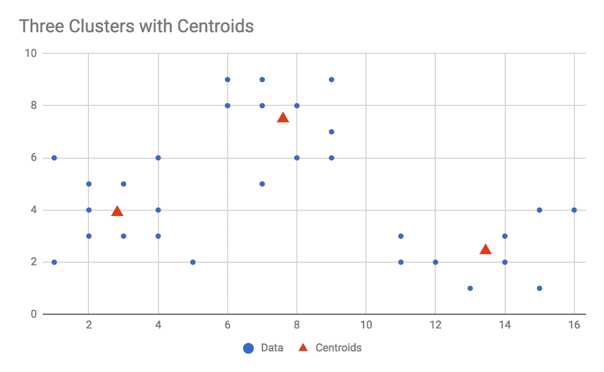
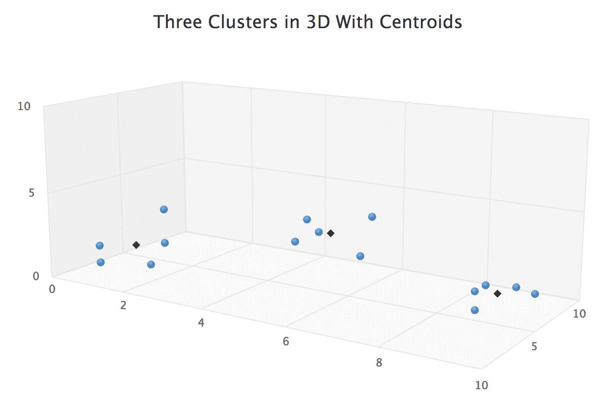
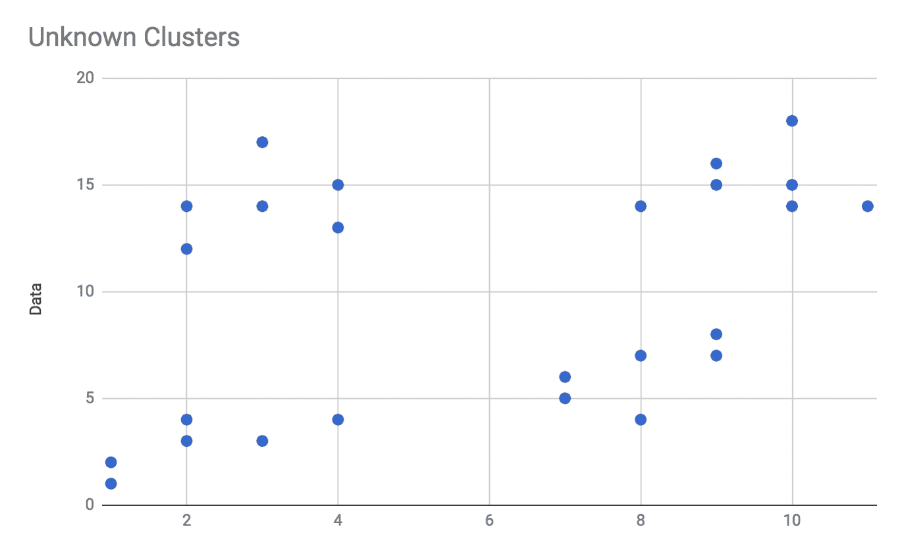
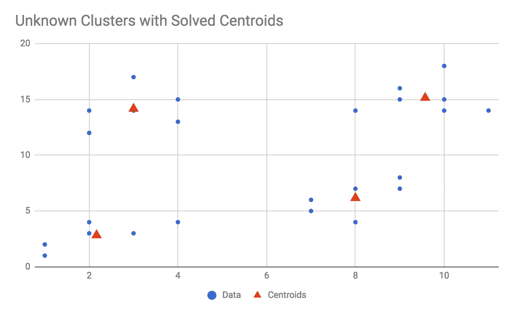

# 四、使用聚类算法的分组

一个常见且入门的无监督学习问题是*聚类问题。*通常，您有大型数据集，希望组织成较小的组，或者希望分解成逻辑上相似的组。例如，你可以尝试将家庭收入的普查数据分为三组:低收入、高收入和超级富裕。如果你把家庭收入数据输入到一个聚类算法中，你将会看到三个数据点，每个对应于你的三个类别的平均值。即使是这种聚集家庭收入的一维问题也可能很难用手来解决，因为你可能不知道一个群体应该在哪里结束，另一个群体应该从哪里开始。你可以使用政府对收入等级的定义，但不能保证这些等级是几何平衡的；它们是政策制定者发明的，可能无法准确代表数据。

一个*聚类*是一组逻辑上相似的数据点。他们可以是行为相似的用户，收入范围相似的市民，颜色相似的像素等等。k-means 算法是数值和几何算法，因此它识别的聚类在数值上都是相似的，数据点在几何上彼此接近。幸运的是，大多数数据可以用数字表示，因此 k-means 算法对许多不同的问题领域都很有用。

k-means 算法是一种强大、快速、流行的数值数据聚类算法。名称 k-means 由两部分组成:***【k】***，它代表我们希望算法找到的聚类数， ***表示，*** 是确定这些聚类中心在哪里的方法(例如，您也可以使用 k-medians 或 k-modes)。翻译成简单的英语，我们可能会要求算法为我们找到三个聚类中心，它们是它们所代表的点的平均值。这样的话， *k = 3* 我们可以告诉老板们，我们在上报的时候用 *k = 3* 做了 k 均值分析。

k-means 算法是一种迭代算法，这意味着它运行一个循环，并不断更新其模型，直到模型达到稳定状态，此时它将返回其结果。放入叙事形式，k-means 算法是这样工作的:将你想要分析的数据绘制出来，为 *k* 挑一个值。你必须事先知道 *k* 的价值，或者至少有一个它应该是什么的想法(尽管我们也将在本章后面对此进行探索)。随机创建 *k* 点(如果 *k = 5* ，创建五个点)并添加到你的剧情中；这些点被称为**质心**，因为它们最终将代表簇的几何中心。对于图中的每个数据点，找到最接近该点的质心，并将其连接或指定给该点。完成所有分配后，依次查看每个质心，并将其位置更新为分配给它的所有点的平均位置。重复分配-然后-更新过程，直到质心停止移动；质心的这些最终位置是算法的输出，可以认为是你的聚类中心。如果叙述很难理解，不要担心，我们会更深入地挖掘它，因为我们从零开始构建这个算法。

在本章中，我们将首先讨论平均和距离的概念，以及它们如何应用于 k-means 算法。然后我们将描述算法本身，并从头构建一个 JavaScript 类来实现 k-means 算法。我们将使用几个简单的数据集测试我们的 k-means 求解器，然后讨论当您事先不知道 *k* 的值时该怎么办。我们将构建另一个工具来自动发现价值 *k* 。我们还将讨论*误差*的概念对于 k-means 应用意味着什么，以及如何设计一个误差算法来帮助我们实现目标。以下是本章将涉及的主题:

*   平均值和距离
*   编写 k-均值算法
*   示例 1—简单 2D 数据的 k 均值
*   示例 2-3D 数据
*   k-表示 *k* 未知的地方

# 平均值和距离

k-means 算法依赖于两个概念来操作:平均和距离。为了告诉你一个聚类的中心在哪里，算法将计算这些点的平均值。在这种情况下，我们将使用算术平均值，或值的总和除以值的数量，来表示我们的平均值。在 ES5/经典 JavaScript 中(我在这个例子中也是有目的地明确的，对于任何不熟悉计算平均值的读者来说)，我们可能会编写这样一个函数:

```js
/**
 * @param {Array.<number>} numbers
 * @return {float}
 */
function mean(numbers) {
    var sum = 0, length = numbers.length;

    if (length === 0) {
        /**
         * Mathematically, the mean of an empty set is undefined,
         * so we could return early here. We could also allow the function
         * to attempt dividing 0/0, would would return NaN in JavaScript but
         * fail in some other languages (so probably a bad habit to encourage).
         * Ultimately, I would like this function to not return mixed types,
         * so instead let's throw an error.
         */
        throw new Error('Cannot calculate mean of empty set');
    }

    for (var i = 0; i < length; i++) {
        sum += numbers[i];
    }

    return sum / length;
}
```

在 ES6 中，我们可以滥用我们的速记特权，写下以下内容:

```js
const mean = numbers => numbers.reduce((sum, val) => sum + val, 0) / numbers.length;
```

这是一个方便的 ES6 一行代码，可以放在你的后口袋里，但是，它假设所有的值都已经是数字并定义好了，如果你给它一个空数组，它将返回 NaN。如果速记令人困惑，我们可以这样分解:

```js
const sum = (numbers) => numbers.reduce((sum, val) => sum + val, 0);
const mean = (numbers) => sum(numbers) / numbers.length;
```

请记住，我们可以使用任何类型的平均值，包括中位数和众数。事实上，有时使用 k-中值比 k-均值更好。中位数在抑制异常值方面比平均值做得更好。因此，你应该经常问自己，你实际上需要哪一个平均数。例如，如果您想要一个消耗的总资源的表示，您可以使用算术平均值。如果你怀疑异常值是由错误的测量引起的，应该忽略不计，那么 k 中值可能更适合你。

我们在这个算法中还需要一个距离的概念。它可以是任何距离度量，但是，对于数字数据，您将主要使用典型的欧几里德距离—您在高中学习的标准距离度量—在 ES5 JavaScript 中，二维情况下是这样的:

```js
/**
 * Calculates only the 2-dimensional distance between two points a and b.
 * Each point should be an array with length = 2, and both elements defined and numeric.
 * @param {Array.number} a
 * @param {Array.number} b
 * @return {float}
 */
function distance2d(a, b) {
    // Difference between b[0] and a[0]
    var diff_0 = b[0] - a[0];
    // Difference between b[1] and a[1]
    var diff_1 = b[1] - a[1];

    return Math.sqrt(diff_0*diff_0 + diff_1*diff_1);
}
```

然而，我们必须支持比两个维度更多的维度，因此我们可以归纳为以下几点:

```js
/**
 * Calculates the N-dimensional distance between two points a and b.
 * Each point should be an array with equal length, and all elements defined and numeric.
 * @param {Array.number} a
 * @param {Array.number} b
 * @return {float}
 */
function distance(a, b) {

    var length = a.length,
        sumOfSquares = 0;

    if (length !== b.length) {
        throw new Error('Points a and b must be the same length');
    }

    for (var i = 0; i < length; i++) {
        var diff = b[i] - a[i];
        sumOfSquares += diff*diff;
    }

    return Math.sqrt(sumOfSquares);
}
```

我们可以为此编写一个 ES6 单行代码，但是它不像更长的显式示例那样可读:

```js
const distance = (a, b) => Math.sqrt(
    a.map((aPoint, i) => b[i] - aPoint)
     .reduce((sumOfSquares, diff) => sumOfSquares + (diff*diff), 0)
);
```

有了这些工具，我们可以开始编写 k-means 算法本身。

# 编写 k-均值算法

k-means 算法实现起来相对简单，所以在本章中我们将从头开始编写。该算法只需要两条信息:k-means 中的 *k* (我们希望识别的聚类数)，以及需要评估的数据点。算法可以使用其他参数，例如允许的最大迭代次数，但这些参数不是必需的。该算法唯一需要的输出是 *k* 质心，或者代表数据簇中心的点列表。如果 *k = 3* ，那么算法必须返回三个质心作为输出。该算法还可能返回其他度量，如总误差、达到稳定状态所需的迭代总数等，但这些都是可选的。

k 均值算法的高级描述如下:

1.  给定参数 *k* 和要处理的数据，随机初始化 *k* 候选质心
2.  对于每个数据点，确定哪个候选质心最接近该点，并将该点分配给该质心
3.  对于每个质心，将其位置更新为分配给它的所有点的平均位置
4.  重复*步骤 2* 和*步骤 3* ，直到质心位置达到稳定状态(即质心停止移动)

在这个过程的最后，你可以返回质心的位置作为算法的输出。

# 设置环境

让我们花点时间为这个算法设置我们的开发环境。环境将如[第 1 章](01.html)、*探索 JavaScript 的潜力、*中所述，然而，我们将在这里贯穿整个过程。

首先，为此项目创建一个新文件夹。我已经命名了文件夹`Ch4-kmeans`。在`Ch4-kmeans`内创建一个名为`src`的子文件夹。

接下来，在`Ch4-kmeans`文件夹中添加一个名为`package.json`的文件。将以下内容添加到文件中:

```js
{
  "name": "Ch4-kmeans",
  "version": "1.0.0",
  "description": "ML in JS Example for Chapter 4 - kmeans",
  "main": "src/index.js",
  "author": "Burak Kanber",
  "license": "MIT",
  "scripts": {
    "build-web": "browserify src/index.js -o dist/index.js -t [ babelify --presets [ env ] ]",
    "build-cli": "browserify src/index.js --node -o dist/index.js -t [ babelify --presets [ env ] ]",
    "start": "yarn build-cli && node dist/index.js"
  },
  "dependencies": {
    "babel-core": "^6.26.0",
    "babel-preset-env": "^1.6.1",
    "babelify": "^8.0.0",
    "browserify": "^15.1.0"
  }
}
```

创建`package.json`文件后，切换到您的终端程序并(从`Ch4-kmeans`文件夹)运行`yarn install`命令。

接下来，在`Ch4-kmeans/src`文件夹中创建三个新文件:`index.js`、`data.js`和`kmeans.js`。我们将在`kmeans.js`中编写实际的 k-means 算法，我们将一些示例数据加载到`data.js`中，我们将使用`index.js`作为我们的引导点来设置和运行一些示例。

在这一点上，你可能想停下来测试一下一切是否正常。给`index.js`添加一个简单的`console.log("Hello");`，然后从命令行运行`yarn start`命令。您应该看到文件编译并运行，在退出前将`Hello`打印到屏幕上。如果您出现错误或没有看到`Hello`，您可能需要后退一步并仔细检查您的环境。如果一切正常，可以从`index.js`中删除`console.log("Hello");`。

# 初始化算法

在这一部分，我们将在`kmeans.js`文件中工作。首先要做的是将我们的均值和距离函数添加到文件的顶部。由于这些是可以在统计学上称为**的泛型函数，我们将不在类中定义它们。将以下内容添加到文件顶部:**

```js
/**
 * Calculate the mean of an array of numbers.
 * @param {Array.<number>} numbers
 * @return {number}
 */
const mean = numbers => numbers.reduce((sum, val) => sum + val, 0) / numbers.length;

/**
 * Calculate the distance between two points.
 * Points must be given as arrays or objects with equivalent keys.
 * @param {Array.<number>} a
 * @param {Array.<number>} b
 * @return {number}
 */
const distance = (a, b) => Math.sqrt(
    a.map((aPoint, i) => b[i] - aPoint)
     .reduce((sumOfSquares, diff) => sumOfSquares + (diff*diff), 0)
);
```

接下来，创建并导出一个`KMeans`类。我们将在本章中用更多的方法来填充它，但是让我们从下面开始。将此添加到您刚刚添加的代码下面的`kmeans.js`文件中:

```js
class KMeans {

    /**
     * @param k
     * @param data
     */
    constructor(k, data) {
        this.k = k;
        this.data = data;
        this.reset();
    }

    /**
     * Resets the solver state; use this if you wish to run the
     * same solver instance again with the same data points
     * but different initial conditions.
     */
    reset() {
        this.error = null;
        this.iterations = 0;
        this.iterationLogs = [];
        this.centroids = this.initRandomCentroids();
        this.centroidAssignments = [];
    }

}

export default KMeans;
```

我们已经创建了一个名为`KMeans`的类，并将其导出为该文件的默认导出。前面的代码还初始化了该类需要的一些实例变量，我们稍后将描述这些变量。

该类的构造函数接受两个参数`k`和`data`，并将其存储为实例变量。`k`参数表示 k 均值中的`k`，或者作为算法输出的期望聚类数。`data`参数是算法将处理的一组数据点。

在构造函数的最后，我们调用`reset()`方法，用于初始化(或重置)求解器的状态。具体来说，我们在`reset`方法中初始化的实例变量是:

*   `iterations`，这是求解器已经运行了多少次迭代的简单计数器，从 0 开始
*   `error`，记录当前迭代点到质心距离的**均方根误差** ( **RMSE** )
*   `centroidAssignments`，它是映射到质心索引号的数据点索引号数组
*   `centroids`，将存储当前迭代中求解器的候选 *k* 质心

请注意，在`reset`方法中，我们正在调用`this.initRandomCentroids()`，我们还没有定义它。k-means 算法必须从一组候选质心开始，因此该方法的目的是随机生成正确数量的质心。因为算法以随机状态开始，所以可以预期算法的多次运行将基于初始条件返回不同的结果。这实际上是 k-means 算法的一个期望属性，因为它容易找到局部最优解，并且在不同的初始条件下多次运行该算法可能会帮助您找到全局最优解。

在生成随机质心之前，我们需要满足一些先决条件。首先，我们必须知道数据的维度。我们使用的是 2D 数据、3D 数据、10D 数据还是 1324D 数据？我们生成的随机质心必须具有与其余数据点相同的维数。这是一个容易解决的问题；我们假设所有的数据点都有相同的维数，所以我们可以只检查我们遇到的第一个数据点。将以下方法添加到`KMeans`类中:

```js
/**
 * Determines the number of dimensions in the dataset.
 * @return {number}
 */
getDimensionality() {
    const point = this.data[0];
    return point.length;
}
```

生成随机初始质心时，我们必须考虑的另一个问题是，质心应该接近我们正在处理的数据。例如，如果所有数据点都是介于(0，0)和(10，10)之间的点，则不需要生成随机质心，例如(1200，740)。类似地，如果您的数据点都是负的，您就不想生成正的质心，以此类推。

为什么我们要关心随机质心从哪里开始？在该算法中，点将被分配到最接近它的质心，并逐渐*将*质心拉向聚类中心。如果质心都在数据点的右边，那么质心本身将沿着相似的路径到达数据，并且可能在一个单独的簇中聚集在一起，收敛到局部最优。通过确保质心在数据范围内随机分布，我们有更好的机会避免这种类型的局部最优。

我们生成质心起始位置的方法是确定数据每个维度的范围，然后在这些范围内为质心位置选择随机值。例如，想象在一个 *x、* *y* 平面中的三个二维数据点:(1，3)、(5，8)和(3，0)。 *x* 尺寸的范围在 1 和 5 之间，而 *y* 尺寸的范围在 0 和 8 之间。因此，在创建随机初始化的质心时，我们将为其 *x* 位置选择一个介于 1 和 5 之间的随机数，为其 *y* 位置选择一个介于 0 和 8 之间的随机数。

我们可以使用 JavaScript 的`Math.min`和`Math.max`来确定每个维度的数据范围。将以下方法添加到`KMeans`类中:

```js

/**
 * For a given dimension in the dataset, determine the minimum
 * and maximum value. This is used during random initialization
 * to make sure the random centroids are in the same range as
 * the data.
 *
 * @param n
 * @returns {{min: *, max: *}}
 */
getRangeForDimension(n) {
    const values = this.data.map(point => point[n]);
    return {
        min: Math.min.apply(null, values),
        max: Math.max.apply(null, values)
    };
}
```

该方法首先从数据点收集给定维度的所有值作为数组，然后返回包含该范围的`min`和`max`的对象。回到我们前面的三个数据点的例子((1，3)、(5，8)和(3，0))，调用`getRangeForDimension(0)`将返回`{min: 1, max: 5}`，调用`getRangeForDimension(1)`将返回`{min: 0, max: 8}`。

初始化质心时，我们可以缓存一个所有维度及其范围的对象，这对我们很有用，因此也可以在`KMeans`类中添加以下方法:

```js
/**
 * Get ranges for all dimensions.
 * @see getRangeForDimension
 * @returns {Array} Array whose indices are the dimension number and whose members are the output of getRangeForDimension
 */
getAllDimensionRanges() {
    const dimensionRanges = [];
    const dimensionality = this.getDimensionality();

    for (let dimension = 0; dimension < dimensionality; dimension++) {
        dimensionRanges[dimension] = this.getRangeForDimension(dimension);
    }

    return dimensionRanges;

}
```

该方法只查看所有维度，并返回每个维度的`min`和`max`范围，这些范围被构造为由维度索引的数组中的对象。这个方法主要是为了方便，但是我们很快就会用到它。

我们最终可以生成随机初始化的质心。我们需要创建 *k* 质心，并逐个维度地工作，以在每个维度的范围内选择一个随机点。将以下方法添加到`KMeans`类中:

```js

/**
 * Initializes random centroids, using the ranges of the data
 * to set minimum and maximum bounds for the centroids.
 * You may inspect the output of this method if you need to debug
 * random initialization, otherwise this is an internal method.
 * @see getAllDimensionRanges
 * @see getRangeForDimension
 * @returns {Array}
 */
initRandomCentroids() {

    const dimensionality = this.getDimensionality();
    const dimensionRanges = this.getAllDimensionRanges();
    const centroids = [];

    // We must create 'k' centroids.
    for (let i = 0; i < this.k; i++) {

        // Since each dimension has its own range, create a placeholder at first
        let point = [];

        /**
         * For each dimension in the data find the min/max range of that dimension,
         * and choose a random value that lies within that range. 
         */
        for (let dimension = 0; dimension < dimensionality; dimension++) {
            const {min, max} = dimensionRanges[dimension];
            point[dimension] = min + (Math.random()*(max-min));
        }

        centroids.push(point);

    }

    return centroids;

}
```

前面的算法包含两个循环；外环创建`k`候选质心。因为数据集中的维数是任意的，并且因为每个维度本身都有一个任意的范围，所以我们必须为每个质心逐个维度地工作，以便生成一个随机位置。如果您的数据是三维的，内部循环将分别考虑维度 0、1 和 2，确定每个维度的`min`和`max`值，在该范围内选择一个随机值，并将该值分配给质心点的特定维度。

# 测试随机质心生成

我们已经编写了大量的代码，所以现在是停下来测试我们工作的好时机。我们还应该开始设置我们的`data.js`文件，我们将使用它来保存一些示例数据。

打开`data.js`文件，添加以下内容:

```js
const example_randomCentroids = [
    [1, 3], [5, 8], [3, 0]
];

export default {
    example_randomCentroids
};
```

所使用的值与我们在前面的块中编写的简单数据点示例中的值相同。

现在，切换到`index.js`并添加以下代码:

```js
import KMeans from './kmeans.js';
import example_data from './data.js';

console.log("\nML in JS Chapter 4 k-means clustering examples.");
console.log("===============================================\n");

console.log("Testing centroid generation:");
console.log("===============================================\n");

const ex_randomCentroids_solver = new KMeans(2, example_data.example_randomCentroids);

console.log("Randomly initialized centroids: ");
console.log(ex_randomCentroids_solver.centroids);
console.log("\n-----------------------------------------------\n\n");
```

首先，我们从它们各自的文件中导入`KMeans`类和`example_data`对象。我们在屏幕上打印一些有用的输出，然后为我们的简单数据初始化一个`KMeans`解算器实例。我们可以通过检查`ex_randomCentroids_solver.centroids`的值来检查随机初始化的质心。

添加完这段代码后，从命令行运行`yarn start`，您应该会看到类似以下输出的内容。请注意，因为质心初始化是随机的，所以您不会看到与我看到的相同的值；然而，我们要寻找的是确保随机质心位于正确的范围内。具体来说，我们希望质心的 *x* 位置在 1 到 5 之间，而 *y* 位置在 0 到 8 之间。多次运行代码，确保质心位置正确:

```js
$ yarn start
yarn run v1.3.2
$ yarn build-cli && node dist/index.js
$ browserify src/index.js --node -o dist/index.js -t [ babelify --presets [ env ] ]

 ML in JS Chapter 4 k-means clustering examples.
 ===============================================

 Testing centroid generation:
 ===============================================

 Randomly initialized centroids:
 [ [ 4.038663181817283, 7.765675509733137 ],
 [ 1.976405159755187, 0.026837564634993427 ] ]
```

如果您看到与前面的块相似的东西，这意味着到目前为止一切都运行良好，我们准备继续实现该算法。

# 将点指定给质心

k-means 算法执行的迭代循环有两个步骤:将每个点分配给最接近它的质心，然后将质心的位置更新为分配给该质心的所有点的平均值。在本节中，我们将实现算法的第一部分:为质心分配点。

在高层次上，我们的任务是考虑数据集中的每个点，并确定哪个质心最接近它。我们还需要记录这个分配的结果，以便我们以后可以根据分配给它的点来更新质心的位置。

将以下方法添加到`KMeans`类的主体中:

```js
/**
 * Given a point in the data to consider, determine the closest
 * centroid and assign the point to that centroid.
 * The return value of this method is a boolean which represents
 * whether the point's centroid assignment has changed;
 * this is used to determine the termination condition for the algorithm.
 * @param pointIndex
 * @returns {boolean} Did the point change its assignment?
 */
assignPointToCentroid(pointIndex) {

    const lastAssignedCentroid = this.centroidAssignments[pointIndex];
    const point = this.data[pointIndex];
    let minDistance = null;
    let assignedCentroid = null;

    for (let i = 0; i < this.centroids.length; i++) {
        const centroid = this.centroids[i];
        const distanceToCentroid = distance(point, centroid);

        if (minDistance === null || distanceToCentroid < minDistance) {
            minDistance = distanceToCentroid;
            assignedCentroid = i;
        }

    }

    this.centroidAssignments[pointIndex] = assignedCentroid;

    return lastAssignedCentroid !== assignedCentroid;

}
```

该方法考虑由其索引给出的单个数据点，并依次考虑系统中的每个质心。我们还跟踪该点被分配到的最后一个质心，以便确定分配是否已经改变。

在前面的代码中，我们在所有质心上循环，并使用我们的`distance`函数来确定点和质心之间的距离。如果距离小于我们到目前为止看到的最低距离，或者如果这是我们为该点考虑的第一个质心(`minDistance`在这种情况下将为空)，我们记录距离和质心的索引位置。在循环所有质心之后，我们现在将知道哪个质心最接近所考虑的点。

最后，我们通过将质心设置到`this.centroidAssignments`数组来记录质心对该点的赋值——在这个数组中，索引是该点的索引，值是质心的索引。我们通过比较最近一次已知的质心分配和新的质心分配，从这个方法返回一个布尔值——如果分配已经改变，它将返回`true`，如果没有改变，它将返回`false`。我们将使用这些信息来计算算法何时达到稳定状态。

前面的方法只考虑了一个点，所以我们也应该写一个方法来处理所有点的质心分配。此外，我们编写的方法应该确定*是否有任何*点更新了其质心分配。在`KMeans`类中添加以下内容:

```js
/**
 * For all points in the data, call assignPointsToCentroids
 * and returns whether _any_ point's centroid assignment has
 * been updated.
 *
 * @see assignPointToCentroid
 * @returns {boolean} Was any point's centroid assignment updated?
 */
assignPointsToCentroids() {
    let didAnyPointsGetReassigned = false;
    for (let i = 0; i < this.data.length; i++) {
        const wasReassigned = this.assignPointToCentroid(i);
        if (wasReassigned) didAnyPointsGetReassigned = true;
    }
    return didAnyPointsGetReassigned;
}
```

该方法定义了一个名为`didAnyPointsGetReassigned`的变量，初始化为`false`，然后在数据集中的所有点上循环以更新它们的质心分配。如果任何一点被指定给一个新的质心，该方法将返回`true`。如果没有分配被改变，该方法返回`false`。该方法的返回值将成为我们的终止条件之一；如果迭代后没有点更新，我们可以认为算法已经达到稳态，可以终止它。

现在让我们处理 k-means 算法的第二部分:更新质心位置。

# 更新质心位置

在前一节中，我们实现了 k-means 算法的第一部分:查看数据集中的所有点，并将它们分配给地理上最近的质心。算法的下一步是查看所有质心，并将它们的位置更新为分配给它们的所有点的平均值。

打个比方，你可以想象每个点伸出去，抓住离它最近的质心。这些点给质心一个拉力，试图把它拉得更靠近它们。我们已经实现了算法的*伸出手抓取部分*，现在我们将实现*拉近质心*部分。

在高层次上，我们的任务是在所有质心上循环，并为每个质心确定分配给它的所有点的平均位置。然后我们将质心的位置更新为平均值。进一步细分，我们必须首先收集分配给质心的所有点，然后我们必须计算这些点的平均值，始终记住点可以有任何数量的维度。

让我们从收集分配给质心的所有点的简单任务开始。在我们的`this.centroidAssignments`实例变量中，我们已经有了点索引到质心索引的映射。将以下代码添加到`KMeans`类的主体中:

```js
/**
 * Given a centroid to consider, returns an array
 * of all points assigned to that centroid.
 *
 * @param centroidIndex
 * @returns {Array}
 */
getPointsForCentroid(centroidIndex) {
    const points = [];
    for (let i = 0; i < this.data.length; i++) {
        const assignment = this.centroidAssignments[i];
        if (assignment === centroidIndex) {
            points.push(this.data[i]);
        }
    }
    return points;
}
```

前面的方法非常标准:在所有数据点上循环，我们查找该点的质心分配，如果它被分配给所讨论的质心，我们将该点添加到输出数组中。

我们现在可以使用这个点列表来更新质心的位置。我们的目标是将质心的位置更新为我们之前找到的所有点的平均值。因为数据可能是多维的，所以我们也必须独立考虑每个维度。

使用我们的点(1，3)、(5，8)和(3，0)的简单示例，我们将找到(3，3.6667)的平均位置。为了得到这个值，我们首先计算 *x* 维度的平均值((1 + 5 + 3) / 3 = 3)，然后计算 *y* 维度的平均值((3 + 8 + 0) / 3 = 11/3 = 3.6666...).如果我们在两个以上的维度上工作，我们只需对每个维度重复这个过程。

我们可以用 JavaScript 编写这个算法。将以下内容添加到`KMeans`类的正文中:

```js
/**
 * Given a centroid to consider, update its location to
 * the mean value of the positions of points assigned to it.
 * @see getPointsForCentroid
 * @param centroidIndex
 * @returns {Array}
 */
updateCentroidLocation(centroidIndex) {
    const thisCentroidPoints = this.getPointsForCentroid(centroidIndex);
    const dimensionality = this.getDimensionality();
    const newCentroid = [];
    for (let dimension = 0; dimension < dimensionality; dimension++) {
        newCentroid[dimension] = mean(thisCentroidPoints.map(point => point[dimension]));
    }
    this.centroids[centroidIndex] = newCentroid;
    return newCentroid;
}
```

前面的方法一次只考虑一个质心，由它的索引指定。我们使用刚刚添加的`getPointsForCentroid`方法来获得分配给这个质心的点的数组。我们初始化一个名为`newCentroid`的变量为空数组；这将最终取代当前质心。

一次考虑一个维度，我们只收集该维度中的点*、*的位置，然后计算平均值。我们使用 JavaScript 的`Array.map`只提取正确维度的位置，然后使用我们的`mean`函数计算该维度中的平均位置。

如果我们用数据点(1，3)、(5，8)和(3，0)手工处理这个例子，我们从检查尺寸 0 或 *x* 尺寸开始。`thisCentroidPoints.map(point => point[dimension])`的结果是维度 0 的数组`[1, 5, 3]`，维度 1 的结果是`[3, 8, 0]`。这些数组中的每一个都被传递到`mean`函数，平均值在该维度的`newCentroid`中使用。

在这个方法的最后，我们用新计算的质心位置更新我们的`this.centroids`数组。

我们还将编写一个方便的方法来循环所有质心并更新它们的位置。将以下内容添加到`KMeans`类的正文中:

```js
/**
 * For all centroids, call updateCentroidLocation
 */
updateCentroidLocations() {
    for (let i = 0; i < this.centroids.length; i++) {
        this.updateCentroidLocation(i);
    }
}
```

在完成算法并把所有部分绑在一起之前，我们有一个最后的先决条件要满足。我们要在算法中引入*误差*的概念。k-means 算法不需要计算误差，但是您将在后面看到这在某些情况下是有利的。

因为这是一种无监督的学习算法，所以我们的错误概念与语义错误无关。相反，我们将使用一个误差度量来表示所有点与其指定质心的平均距离。我们将为此使用 RMSE，这将更加严厉地惩罚更大的距离，因此我们的误差度量将很好地表明聚类有多紧密。

为了执行这个误差计算，我们在所有的点上循环，并确定该点与其质心的距离。我们先对每一个距离进行平方，然后将其加到一个累计总数上(均方根中的*平方*，然后将累计总数除以点数(均方根中的*平均值*，最后取整件事的平方根(均方根中的*根*)。

将以下代码添加到`KMeans`类的主体中:

```js
/**
 * Calculates the total "error" for the current state
 * of centroid positions and assignments.
 * Here, error is defined as the root-mean-squared distance
 * of all points to their centroids.
 * @returns {Number}
 */
calculateError() {

    let sumDistanceSquared = 0;
    for (let i = 0; i < this.data.length; i++) {
        const centroidIndex = this.centroidAssignments[i];
        const centroid = this.centroids[centroidIndex];
        const point = this.data[i];
        const thisDistance = distance(point, centroid);
        sumDistanceSquared += thisDistance*thisDistance;
    }

    this.error = Math.sqrt(sumDistanceSquared / this.data.length);
    return this.error;
}
```

我们现在已经准备好将一切联系在一起，并实现算法的主循环。

# 主循环

k-means 算法的所有支持和基础逻辑现已实现。最后一件要做的事情是将所有这些联系在一起，并实现算法的主循环。要运行该算法，我们应该重复为质心分配点，然后更新质心位置，直到质心停止移动的过程。我们还可以执行可选的步骤，例如计算误差并确保算法不超过某个最大允许迭代次数。

将以下代码添加到`KMeans`类的主体中:

```js
/**
 * Run the k-means algorithm until either the solver reaches steady-state,
 * or the maxIterations allowed has been exceeded.
 *
 * The return value from this method is an object with properties:
 * {
 *  centroids {Array.<Object>},
 *  iteration {number},
 *  error {number},
 *  didReachSteadyState {Boolean}
 * }
 *
 * You are most likely interested in the centroids property of the output.
 *
 * @param {Number} maxIterations Default 1000
 * @returns {Object}
 */
solve(maxIterations = 1000) {

    while (this.iterations < maxIterations) {

        const didAssignmentsChange = this.assignPointsToCentroids();
        this.updateCentroidLocations();
        this.calculateError();

        this.iterationLogs[this.iterations] = {
            centroids: [...this.centroids],
            iteration: this.iterations,
            error: this.error,
            didReachSteadyState: !didAssignmentsChange
        };

        if (didAssignmentsChange === false) {
            break;
        }

        this.iterations++;

    }

    return this.iterationLogs[this.iterationLogs.length - 1];

}
```

我们已经编写了一个`solve`方法，它也接受允许的最大迭代次数的限制，我们默认为`1000`。我们在`while`循环中运行算法，对于循环中的每次迭代，我们调用`assignPointsToCentroids`(记录其输出值，`didAssignmentsChange`)，调用`updateCentroidLocations`，调用`calculateError`。

为了帮助调试和维护算法已经完成的历史，我们维护一个`this.iterationLogs`数组，对于每次迭代，我们将记录质心位置、迭代次数、计算误差以及算法是否已经达到稳定状态(与`didAssignmentsChange`相反)。在记录日志时，我们在`this.centroids`上使用了 ES6 的数组展开操作符，以避免将该数组作为参考传递，否则迭代日志将显示质心的最后状态，而不是其随时间的进展。

如果点/形心分配在一次迭代到下一次迭代之间没有变化，我们认为算法已经达到稳定状态，并且可以返回结果。我们通过使用`break`关键字提前脱离`while`循环来实现这一点。如果算法从未达到稳定状态，`while`循环将继续，直到执行了允许的最大迭代次数，并返回最新的可用结果。`solve`方法的输出仅仅是最新的迭代日志，其中包含这个类的用户需要知道的所有信息。

# 示例 1–简单 2D 数据的 k 均值

我们已经编写并编码了 k-means 算法的实现，现在是时候看看它是如何工作的了。在第一个例子中，我们将针对一个简单的二维数据数据集运行我们的算法。数据本身将被设计，以便算法可以很容易地找到三个不同的集群。

首先，修改`data.js`文件，在`export default`行之前的任何位置添加以下数据:

```js
const example_2d3k = [
    [1, 2], [2, 3], [2, 5], [1, 6], [4, 6],
    [3, 5], [2, 4], [4, 3], [5, 2], [6, 9],
    [4, 4], [3, 3], [8, 6], [7, 5], [9, 6],
    [9, 7], [8, 8], [7, 9], [11, 3], [11, 2],
    [9, 9], [7, 8], [6, 8], [12, 2], [14, 3],
    [15, 1], [15, 4], [14, 2], [13, 1], [16, 4]
];
```

然后，更新最终导出行，如下所示:

```js
export default {
    example_randomCentroids,
    example_2d3k
};
```

如果我们将前面的数据点绘制成图表，我们会看到以下内容:


从视觉上，我们可以看到有三组整齐聚集的数据点。当我们运行算法时，我们将使用 *k = 3* ，并期望质心整齐地将自己定位到这三个聚类的中心。让我们试试看。

打开`index.js`并添加以下内容。您可以替换之前添加的代码(保留`import`语句)，也可以在底部添加:

```js
console.log("Solving example: 2d data with 3 clusters:");
console.log("===============================================\n");

console.log("Solution for 2d data with 3 clusters:");
console.log("-------------------------------------");
const ex_1_solver = new KMeans(3, example_data.example_2d3k);
const ex_1_centroids = ex_1_solver.solve();
console.log(ex_1_centroids);
console.log("");
```

在输出一些头之后，我们创建一个名为`ex_1_solver`的新`KMeans`实例，并用 k = 3 和我们刚刚添加的`example_data.example_2d3k`初始化它。我们调用`solve`方法，不带参数(即最大允许迭代次数为 1000 次)，并在变量`ex_1_centroids`中捕获输出。最后，我们将结果打印到屏幕上，并添加一个换行符——接下来我们将添加一些测试和示例。

Note that the order of your centroids may be different to mine, since random initial conditions will differ.

现在可以运行`yarn start`了，应该会看到类似这样的输出。此外，由于随机初始化，解算器的一些运行可能会陷入局部最优，您将看到不同的质心。连续运行程序几次，看看会发生什么。我的输出如下所示:

```js
Solving example: 2d data with 3 clusters:
==========================================================

Solution for 2d data with 3 clusters:
---------------------------------------------------------
 { centroids:
 [ [ 2.8181818181818183, 3.909090909090909 ],
 [ 13.444444444444445, 2.4444444444444446 ],
 [ 7.6, 7.5 ] ],
 iteration: 1,
 error: 1.878739816915397,
 didReachSteadyState: true }
```

程序的输出告诉我们，算法只经过两次迭代就达到了稳态(迭代 1 是第二次迭代，因为我们从零开始计数)，我们的质心位于(2.8，3.9)，(13.4，2.4)和(7.6，7.5)。

让我们将这些质心与原始数据一起绘制成图，看看它是什么样子:



正如你所看到的，k-means 出色地完成了它的工作，准确地报告了质心在我们期望的位置。

让我们通过在解后打印`iterationLogs`来更深入地了解这个算法在做什么。在`index.js`底部添加以下代码:

```js
console.log("Iteration log for 2d data with 3 clusters:");
console.log("------------------------------------------");
ex_1_solver.iterationLogs.forEach(log => console.log(log));
console.log("");
```

再次运行`yarn start`，应该会看到如下输出。与往常一样，基于初始条件，您的版本可能比我的版本需要更多或更少的迭代，因此您的输出会有所不同，但是您应该会看到如下内容:

```js
Solving example: 2d data with 3 clusters:
=====================================================================

 Solution for 2d data with 3 clusters:
 --------------------------------------------------------------------
 { centroids:
 [ [ 2.8181818181818183, 3.909090909090909 ],
 [ 13.444444444444445, 2.4444444444444446 ],
 [ 7.6, 7.5 ] ],
 iteration: 4,
 error: 1.878739816915397,
 didReachSteadyState: true }

 Iteration log for 2d data with 3 clusters:
 ----------------------------------------------------------------------
 { centroids: [ [ 2.7, 3.7 ], [ 9, 4.125 ], [ 10.75, 5.833333333333333 ] ],
 iteration: 0,
 error: 3.6193538404281806,
 didReachSteadyState: false }
 { centroids:
 [ [ 2.8181818181818183, 3.909090909090909 ],
 [ 9.714285714285714, 3.857142857142857 ],
 [ 10.75, 5.833333333333333 ] ],
 iteration: 1,
 error: 3.4964164297074007,
 didReachSteadyState: false }
 { centroids: [ [ 3.0833333333333335, 4.25 ], [ 11.375, 2.75 ], [ 10, 6.7 ] ],
 iteration: 2,
 error: 3.19709069137691,
 didReachSteadyState: false }
 { centroids:
 [ [ 2.8181818181818183, 3.909090909090909 ],
 [ 13.444444444444445, 2.4444444444444446 ],
 [ 7.6, 7.5 ] ],
 iteration: 3,
 error: 1.878739816915397,
 didReachSteadyState: false }
 { centroids:
 [ [ 2.8181818181818183, 3.909090909090909 ],
 [ 13.444444444444445, 2.4444444444444446 ],
 [ 7.6, 7.5 ] ],
 iteration: 4,
 error: 1.878739816915397,
 didReachSteadyState: true }
```

如您所见，该算法需要五次迭代才能达到稳定状态，而不是像之前那样只需要两次迭代。这是正常的，也是意料之中的，因为两次运行的随机初始条件不同。通过查看日志，您可以看到算法报告的错误随着时间推移而减少。此外，请注意，第一个质心(2.8，3.9)在第一次迭代后到达其最终目的地，而其他质心需要更多时间才能赶上。这是因为第一个质心被随机初始化到非常接近其最终目的地的位置，从(2.7，3.7)开始，到(2.8，3.9)结束。

在这个数据集上，捕捉到陷入局部最优的算法是可能的，尽管有点罕见。让我们在`index.js`的底部添加以下代码来多次运行求解器，看看它是否会找到局部最优而不是全局最优:

```js
console.log("Test 2d data with 3 clusters five times:");
console.log("----------------------------------------");
for (let i = 0; i < 5; i++) {
    ex_1_solver.reset();
    const solution = ex_1_solver.solve();
    console.log(solution);
}
console.log("");
```

用`yarn start`运行几次，直到看到意想不到的结果。在我的例子中，我找到了以下解决方案(我省略了前面程序的另一个输出):

```js
Test 2d data with 3 clusters five times:
--------------------------------------------------------------
 { centroids:
 [ [ 13.444444444444445, 2.4444444444444446 ],
 [ 2.8181818181818183, 3.909090909090909 ],
 [ 7.6, 7.5 ] ],
 iteration: 2,
 error: 1.878739816915397,
 didReachSteadyState: true }
 { centroids:
 [ [ 2.8181818181818183, 3.909090909090909 ],
 [ 7.6, 7.5 ],
 [ 13.444444444444445, 2.4444444444444446 ] ],
 iteration: 1,
 error: 1.878739816915397,
 didReachSteadyState: true }
 { centroids:
 [ [ 7.6, 7.5 ],
 [ 13.444444444444445, 2.4444444444444446 ],
 [ 2.8181818181818183, 3.909090909090909 ] ],
 iteration: 3,
 error: 1.878739816915397,
 didReachSteadyState: true }
 { centroids:
 [ [ 11.333333333333334, 2.3333333333333335 ],
 [ 5.095238095238095, 5.619047619047619 ],
 [ 14.5, 2.5 ] ],
 iteration: 2,
 error: 3.0171467652692345,
 didReachSteadyState: true }
 { centroids:
 [ [ 7.6, 7.5 ],
 [ 2.8181818181818183, 3.909090909090909 ],
 [ 13.444444444444445, 2.4444444444444446 ] ],
 iteration: 2,
 error: 1.878739816915397,
 didReachSteadyState: true }
```

求解器的第四次运行发现了与其他运行不同的答案:它发现(11.3，2.3)，(5.1，5.6)，(14.5，2.5)是一个解。因为另一种解决方案比这种更常见，所以我们可以假设算法已经陷入局部最优。让我们将这些值与其余数据进行对比，看看它是什么样子:


在上图中，我们的数据点用圆圈表示，我们期望的质心用三角形表示，我们得到的奇数结果用 **X** 标记表示。看图表，你就能明白算法可能是怎么得出这个结论的。一个质心，即(5.1，5.6)处的 **X** 标记，捕获了两个不同的星团，并位于它们之间。另外两个质心将第三个簇分成了两个。这是一个局部最优的完美例子:这是一个有意义的解决方案，它从逻辑上对数据点进行聚类，但它不是数据的最佳可用解决方案(全局最优)。最有可能的是，右边的两个质心都是在那个簇内随机初始化的，并被困在那里。

这始终是 k-means 算法的潜在结果，实际上也是所有 ML 算法的潜在结果。基于初始条件和数据集的怪癖，算法可能偶尔(甚至经常)发现局部最优解。幸运的是，如果比较前面输出的两个解的误差，全局解的误差为 1.9，局部最优解的误差为 3.0。在这种情况下，我们的误差计算做得很好，并且正确地表示了聚类的紧密度。

为了用 k-means 算法解决这个问题，您通常应该运行它不止一次，并寻找共识(例如，五次运行中有四次都同意)或最小误差，并将其用作您的结果。

# 示例 2–3D 数据

因为我们已经编写了 k-means 算法来处理任意数量的维度，所以我们也可以用 3D 数据(或者 10D，或者 100D，或者您需要的任意数量的维度)来测试它。虽然这种算法适用于三维以上，但我们无法直观地绘制更高维度，因此无法直观地检查结果，因此我们将使用三维数据进行测试，然后继续前进。

打开`data.js`并将以下内容添加到文件的中间—在`export default`行之前的任何地方都可以:

```js
const example_3d3k = [
    [1, 1, 1],
    [1, 2, 1],
    [2, 1, 2],
    [2, 2, 3],
    [2, 4, 3],
    [5, 4, 5],
    [5, 3, 4],
    [6, 2, 6],
    [5, 3, 6],
    [6, 4, 7],
    [9, 1, 4],
    [10, 2, 5],
    [9, 2, 5],
    [9, 2, 4],
    [10, 3, 3]
];
```

然后将导出行修改如下(将`example_3d3k`变量添加到导出中):

```js
export default {
    example_randomCentroids,
    example_2d3k,
    example_3d3k
};
```

当以三维方式绘制时，前面的数据如下所示:


如您所见，有三个明显的集群，我们希望 k-means 能够轻松处理这个问题。现在，切换到`index.js`并添加以下内容。我们只是为这个示例创建一个新的求解器，加载三维数据，并打印结果:

```js
console.log("Solving example: 3d data with 3 clusters:");
console.log("===============================================\n");
console.log("Solution for 3d data with 3 clusters:");
console.log("-------------------------------------");
const ex_2_solver = new KMeans(3, example_data.example_3d3k);
const ex_2_centroids = ex_2_solver.solve();
console.log(ex_2_centroids);
console.log("");
```

用`yarn start`运行程序，应该会看到如下内容。我省略了前面 2D 例子的输出:

```js
Solving example: 3d data with 3 clusters:
====================================================================

Solution for 3d data with 3 clusters:
---------------------------------------------------------------------
 { centroids: [ [ 1.6, 2, 2 ], [ 5.4, 3.2, 5.6 ], [ 9.4, 2, 4.2 ] ],
 iteration: 5,
 error: 1.3266499161421599,
 didReachSteadyState: true }
```

谢天谢地，我们的求解器给了我们三维数据点，所以我们知道，至少，该算法可以区分 2D 和三维问题。我们看到它仍然只进行了少量的迭代，并且误差是一个合理的数字(意味着它是定义好的，不是负数，也不是太大)。

如果我们对照原始数据绘制这些质心，我们将看到以下内容:



圆圈代表数据点，就像以前一样，现在我们可以看到我们的黑色菱形质心已经在它们的簇中间找到了它们的家。我们的算法已经证明了它可以适用于三维数据，它也可以适用于你能给它的任何数量的维度。

# 其中 k 是未知的

到目前为止，我们已经能够提前定义算法应该找到多少个聚类。在每个例子中，我们在知道我们的数据有三个集群的情况下开始了项目，因此我们手动为 *k* 设置了值 3。这仍然是一个非常有用的算法，但是您可能不总是知道数据中表示了多少个聚类。为了解决这个问题，我们需要扩展 k-means 算法。

我在我们的 k-means 实现中包含可选误差计算的一个主要原因是为了帮助解决这个问题。使用误差度量——在任何 ML 算法中——不仅允许我们搜索解决方案，还允许我们搜索产生最佳解决方案的最佳*参数*。

在某种程度上，我们需要构建一个元 ML 算法，或者一个修改我们的算法及其参数的算法。我们的方法将是直接而有效的:我们将构建一个名为`KMeansAutoSolver`的新类，我们将指定一系列 *k* 值来测试，而不是指定一个值 *k* 。新的解算器将为范围内的每个 *k* 值运行我们的 k 均值代码，并确定哪个 *k* 值产生的误差最小。此外，我们还将对每个 *k* 值进行多次试验，以避免陷入局部最优。

将文件添加到名为`kmeans-autosolver.js`的`src/`文件夹中。将以下代码添加到文件中:

```js
import KMeans from './kmeans.js';

class KMeansAutoSolver {

    constructor(kMin = 1, kMax = 5, maxTrials = 5, data) {
        this.kMin = kMin;
        this.kMax = kMax;
        this.maxTrials = maxTrials;
        this.data = data;
        this.reset();
    }

    reset() {
        this.best = null;
        this.log = [];
    }

    solve(maxIterations = 1000) {

        for (let k = this.kMin; k < this.kMax; k++) {

            for (let currentTrial = 0; currentTrial < this.maxTrials; currentTrial++) {

                const solver = new KMeans(k, this.data);
                // Add k and currentTrial number to the solution before logging
                const solution = Object.assign({}, solver.solve(maxIterations), {k, currentTrial});
                this.log.push(solution);

                if (this.best === null || solution.error < this.best.error) {
                    this.best = solution;
                }

            }

        }

        return this.best;

    }
}

export default KMeansAutoSolver;
```

`KMeansAutoSolver`类包含一个接受`kMin`、`kMax`、`maxTrials`和`data`的构造函数。`data`参数与您给`KMeans`类的数据相同。不是为类提供 *k 的值，而是提供一系列 *k* 值进行测试，如`kMin`和`kMax`所规定。此外，我们还将对该解算器进行编程，以便为 *k、*的每个值多次运行 k-means 算法，从而避免找到局部最优解，正如我们之前所演示的那样。*

类的主要部分是`solve`方法，它和`KMeans`类一样，也接受一个`maxIterations`参数。`solve`方法也返回与`KMeans`类返回的相同的东西，除了我们还将 *k* 的值添加到输出中，并且还添加了`currentTrial`号。将 *k* 的值添加到输出中有点多余，因为您可以只计算返回的质心数量，但是很高兴在输出中看到。

正文`solve`的方法很简单。对于在`kMin`和`kMax` *之间的范围内的 *k* 的每个值，*我们运行`KMeans`求解器`maxTrials`次*。*如果解决方案在误差方面胜过当前最佳解决方案，我们将此解决方案记录为最佳。在方法的最后，我们返回具有最佳(最低)误差的解。

让我们试试看。打开`data.js`并添加以下内容:

```js
const example_2dnk = [
 [1, 2], [1, 1], [2, 3], [2, 4], [3, 3],
 [4, 4], [2, 12], [2, 14], [3, 14], [4, 13],
 [4, 15], [3, 17], [8, 4], [7, 6], [7, 5],
 [8, 7], [9, 7], [9, 8], [8, 14], [9, 15],
 [9, 16], [10, 15], [10, 14], [11, 14], [10, 18]
];
```

并按如下方式更新导出行:

```js
export default {
    example_randomCentroids,
    example_2d3k,
    example_3d3k,
    example_2dnk
};
```

将这些数据图形化，我们可以看到四个整洁的集群:



然而，就本例而言，我们不知道预期有多少个集群，只知道可能在 1 到 5 个之间。

接下来，打开`index.js`并导入文件顶部的`KMeansAutoSolver`:

```js
import KMeansAutoSolver from './kmeans-autosolver';
```

然后，在文件底部添加以下内容:

```js
console.log("Solving example: 2d data with unknown clusters:");
console.log("===============================================\n");
console.log("Solution for 2d data with unknown clusters:");
console.log("-------------------------------------");
const ex_3_solver = new KMeansAutoSolver(1, 5, 5, example_data.example_2dnk);
const ex_3_solution = ex_3_solver.solve();
console.log(ex_3_solution);
```

运行`yarn start`，您应该会看到类似如下的输出(省略了之前的输出):

```js
Solving example: 2d data with unknown clusters:
================================================================

Solution for 2d data with unknown clusters:
----------------------------------------------------------------
 { centroids:
 [ [ 2.1666666666666665, 2.8333333333333335 ],
 [ 9.571428571428571, 15.142857142857142 ],
 [ 8, 6.166666666666667 ],
 [ 3, 14.166666666666666 ] ],
 iteration: 2,
 error: 1.6236349578000828,
 didReachSteadyState: true,
 k: 4,
 currentTrial: 0 }
```

马上就可以看到求解器用`k: 4`找到了一个答案，这也是我们所期待的，算法只用了三次迭代就达到了稳态，误差值很低——都是好迹象。

对照我们的数据绘制这些质心，我们看到算法已经确定了 *k* 的正确值和质心位置:



请注意，我们的 k-means 自动求解器也容易受到局部最优的影响，并且不会总是猜测 *k* 的正确值。原因？增加 *k* 的值意味着我们可以在数据中分配更多的质心，减少误差值。如果我们有 25 个数据点，并将 *k* 的范围设置为 1 到 30 之间的任意值，求解器可能最终会找到 k = 25 的解，并且每个质心位于每个数据点的顶部，总误差为 0！这可以被认为是*过度拟合*，算法找到了正确的答案，但没有充分概括问题，给我们想要的结果。即使在使用自动解算器时，您也必须小心您给它的 *k* 值的范围，并保持该范围尽可能小。

例如，如果我们将前面例子中的`kMax`从 5 增加到 10，我们会发现它给出的结果是 *k = 7* 为最佳。一如既往，局部最优是有意义的，但它并不完全是我们想要的:


因为自动解算器使用误差值计算作为其唯一的指导，所以您可以调整误差计算，以考虑 *k* 的值，并惩罚具有太多聚类的解*。*之前的误差计算是纯粹的几何计算，代表每个点距其质心的平均距离。我们可能想升级我们的误差计算，这样它也更喜欢质心较少的解。让我们看看会是什么样子。

返回`kmeans.js`文件，修改`calculateError`方法。找到下面一行:

```js
const thisDistance = distance(point, centroid);
```

并对其进行修改，将`k`的值添加到距离中:

```js
const thisDistance = distance(point, centroid) + this.k;
```

当单独运行`KMeans`类时，这种修改不会造成伤害，因为`k`的值对于该解算器来说是恒定的。唯一一次这种修改可能是不可取的，如果你实际上是解释和使用误差值作为*距离的表示，特别是*，而不是仅仅寻找较低的误差值。意思是，如果你*需要*误差来表示距离，那么你不应该做这个改变。然而，在所有其他情况下，这可能是有利的，因为这种修改将优选具有更少簇的解决方案。

现在，返回`index.js`并修改`ex_3_solver`以搜索从 1 到 30 的`k`值的范围。用`yarn start`再次运行程序，你会看到自动求解器再次正确返回 *k = 4* 的结果！而之前的 *k = 7* 的局部最优解具有较低的错误率，将`k`的值添加到错误中足以惩罚 *k = 7* 解，以至于求解器现在更喜欢 *k = 4* 解。由于对误差计算的这种修改，我们在选择我们的`kMin`和`kMax`时可以稍微不那么小心，这在我们不知道 *k* 会是什么的时候非常有帮助。

虽然我们的误差计算不再是集群紧密度的几何表示，但您可以看到，在尝试针对某些系统属性进行优化时，考虑误差计算可以为您提供很大的回旋余地。在我们的例子中，我们不仅想找到最紧密的几何簇，还想找到最紧密的几何簇*以及可能的最少量的簇*，因此更新误差计算以考虑 *k* 是非常有帮助的一步。

# 摘要

在这一章中，我们讨论了聚类问题，或将数据点分组到逻辑上相似的组中。具体来说，我们引入了 k-means 算法，这是 ML 中最流行的数值聚类算法。然后我们以`KMeans` JavaScript 类的形式实现了 k-means 算法，并用二维和三维数据进行了测试。我们还讨论了当你期望的集群数量事先未知时如何处理集群问题，并构建了一个名为`KMeansAutoSolver`的新的 JavaScript 类来解决这个问题。在此过程中，我们还讨论了误差计算的影响，并对我们的误差计算进行了修改，这有助于推广我们的解决方案，以避免过度拟合。

在下一章中，我们将看看分类算法。分类算法是监督学习算法，可以看作是聚类算法的更复杂的扩展。可以训练分类算法来学习应该应用于数据的特定标签，而不是简单地根据数据点的相似性或接近性对它们进行分组。**