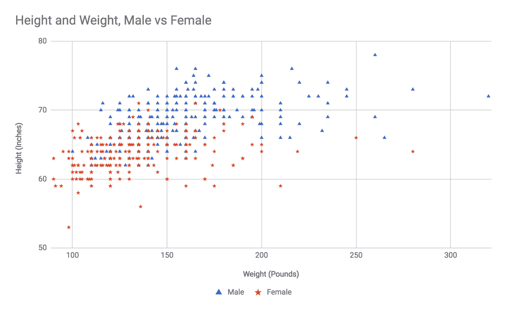
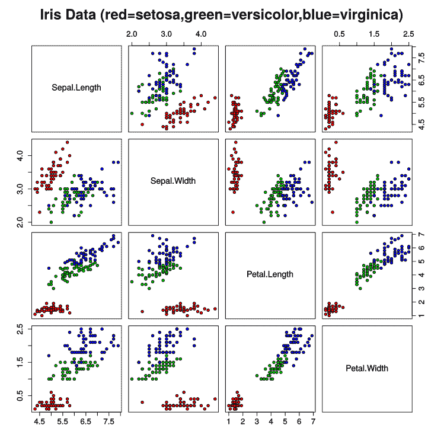

# 五、分类算法

分类问题包括检测数据中的模式，并使用这些模式将一个数据点分配给一组相似的数据点。如果这太抽象，这里有一些分类问题的例子:分析一封电子邮件以确定它是否是垃圾邮件；检测一段文本的语言；阅读一篇文章，并将其归类为金融、体育、政治、观点或犯罪；以及确定推特上发布的对你产品的评论是正面的还是负面的(最后这个例子通常被称为**情绪分析**)。

分类算法是解决分类问题的工具。根据定义，它们是有监督的学习算法，因为它们总是需要有标签的训练集来构建模型。有许多分类算法，每个算法都是根据特定的原则或针对特定类型的输入数据而设计的。

在本章中，我们将讨论四个分类器: **k 近邻** ( **KNN** )、朴素贝叶斯、**支持向量机** ( **支持向量机**)和随机森林。以下是每种算法的简要介绍:

*   KNN 算法是最简单的分类器之一，当数据集具有数字特征和聚类模式时，它可以很好地工作。它在本质上类似于 k-means 聚类算法，因为它依赖于绘制数据点和测量点到点的距离。
*   朴素贝叶斯分类器是一种基于贝叶斯概率的有效且通用的分类器。虽然它可以用于数字数据，但它最常用于文本分类问题，如垃圾邮件检测和情感分析。朴素贝叶斯分类器，如果实施得当，对于狭窄的领域可以既快速又高度准确。朴素贝叶斯分类器是我最喜欢的分类算法之一。

*   从精神上讲，支持向量机是 KNN 算法的一种非常高级的形式。SVM 图表显示了你的数据，并试图找出你所标注的类别之间的分界线。使用一些非平凡的数学，SVM 可以线性化非线性模式，所以这个工具可以对线性和非线性数据都有效。
*   随机森林是分类算法中相对较新的发展，但它们是有效的和通用的，因此对于包括我在内的许多研究人员来说是一个有用的分类器。随机森林构建了一组决策树(我们稍后将讨论的另一种分类器)，每个决策树都有数据特征的随机子集。决策树可以处理数字和分类数据，可以执行回归和分类任务，还可以辅助特征选择，因此成为许多研究人员在面临新问题时首先要掌握的工具。

# k-最近邻

KNN 是一种简单、快速、直接的分类算法。这对于数据自然聚集的分类数字数据集非常有用。它在某些方面与 k-means 聚类算法类似，主要区别在于 k-means 是一种无监督算法，而 KNN 是一种有监督的学习算法。

如果您要手动执行 KNN 分析，那么应该这样做:首先，在图表上绘制所有训练数据，并用类别或标签标记每个点。当你想对一个新的未知点进行分类时，把它放到图上，找到与它最接近的 *k* (最近的 T2 邻居)。数字 *k* 应该是奇数，以避免平局；三个是一个很好的起点，但是有些应用需要更多，有些应用可以用一个。报告大多数 *k* 最近的邻居被归类为什么，这将是算法的结果。

找到测试点的 *k* 最近邻是很简单的，但是如果你的训练数据非常大，可以使用一些优化。典型地，当评估一个新点时，你将计算你的测试点和每隔一个训练点之间的欧几里德距离(典型的，我们在[第 4 章](04.html)、*用聚类算法*分组中介绍的高中几何距离度量)，并按距离对它们进行排序。这个算法相当快，因为训练数据一般不超过 10000 点左右。

如果你有很多训练例子(几百万的数量级)或者你真的需要这个算法快如闪电，你可以做两个优化。第一种是跳过距离度量中的平方根运算，改用距离的平方。虽然现代 CPU 非常快，但平方根运算仍然比乘法和加法慢得多，因此您可以通过避免平方根来节省几毫秒。第二个优化是只考虑距测试点一定距离的边界矩形内的点；例如，仅考虑距离测试点位置每个维度+/- 5 个单位内的点。如果您的训练数据很密集，这种优化不会影响结果，但会加快算法，因为它将避免计算许多点的距离。

以下是 KNN 算法的高级描述:

1.  记录所有培训数据及其标签
2.  给定一个要评估的新点，生成它到所有训练点的距离列表
3.  按照从最近到最远的顺序排列距离列表
4.  除了最近的距离 *k* 之外，扔掉所有的
5.  确定哪个标签代表您的大部分 *k* 最近邻居；这是算法的结果

更有效的版本通过将距离列表限制为 *k* 项，避免了维护需要排序的大量距离列表。现在让我们编写自己的 KNN 算法实现。

# 构建 KNN 算法

由于 KNN 算法非常简单，我们将构建自己的实现:

1.  创建一个新文件夹并命名为`Ch5-knn`。
2.  向文件夹中添加以下`package.json`文件。请注意，该文件与之前的示例略有不同，因为我们添加了`jimp`库的依赖项，这是我们将在第二个示例中使用的图像处理库:

```js
{
  "name": "Ch5-knn",
  "version": "1.0.0",
  "description": "ML in JS Example for Chapter 5 - k-nearest-neighbor",
  "main": "src/index.js",
  "author": "Burak Kanber",
  "license": "MIT",
  "scripts": {
    "build-web": "browserify src/index.js -o dist/index.js -t [ babelify --presets [ env ] ]",
    "build-cli": "browserify src/index.js --node -o dist/index.js -t [ babelify --presets [ env ] ]",
    "start": "yarn build-cli && node dist/index.js"
  },
  "dependencies": {
    "babel-core": "^6.26.0",
    "babel-plugin-transform-object-rest-spread": "^6.26.0",
    "babel-preset-env": "^1.6.1",
    "babelify": "^8.0.0",
    "browserify": "^15.1.0",
    "jimp": "^0.2.28"
  }
}
```

3.  运行`yarn install`命令下载并安装所有依赖项，然后创建名为`src`、`dist`和`files`的子文件夹。
4.  在`src`文件夹中，创建一个`index.js`文件和一个`knn.js`文件。

你还需要一个`data.js`文件。对于这些例子，我使用的数据集比这本书能打印的要大，所以你应该花一分钟从这本书的 GitHub 账号下载`Ch5-knn/src/data.js`文件。

先说`knn.js`档。像前一章的 k-means 例子一样，我们需要一个测距功能。我们用[第四章](04.html)、*聚类算法*的分组；在`knn.js`的开头增加以下内容:

```js
/**
 * Calculate the distance between two points.
 * Points must be given as arrays or objects with equivalent keys.
 * @param {Array.<number>} a
 * @param {Array.<number>} b
 * @return {number}
 */
const distance = (a, b) => Math.sqrt(
    a.map((aPoint, i) => b[i] - aPoint)
        .reduce((sumOfSquares, diff) => sumOfSquares + (diff*diff), 0)
);
```

如果您真的需要对您的 KNN 实现进行性能优化，您可以省略`Math.sqrt`操作，只返回平方距离。然而，我重申，因为这是一个本质上如此快速的算法，所以只有当你在处理一个有大量数据或非常严格的速度要求的极端问题时，你才需要这样做。

接下来，让我们添加 KNN 课程的存根。在距离函数下方的`knn.js`中添加以下内容:

```js
class KNN {

    constructor(k = 1, data, labels) {
        this.k = k;
        this.data = data;
        this.labels = labels;
    }

}

export default KNN;
```

构造器接受三个参数:`k` *、*或分类新点时要考虑的邻居数量；训练数据单独分成数据点；和它们的标签的对应阵列。

接下来，我们需要添加一个内部方法，该方法考虑一个测试点，并计算从测试点到训练点的距离的排序列表。我们称之为**距离图**。将以下内容添加到 KNN 课程的正文中:

```js
generateDistanceMap(point) {

    const map = [];
    let maxDistanceInMap;

    for (let index = 0, len = this.data.length; index < len; index++) {

        const otherPoint = this.data[index];
        const otherPointLabel = this.labels[index];
        const thisDistance = distance(point, otherPoint);

        /**
         * Keep at most k items in the map. 
         * Much more efficient for large sets, because this 
         * avoids storing and then sorting a million-item map.
         * This adds many more sort operations, but hopefully k is small.
         */
        if (!maxDistanceInMap || thisDistance < maxDistanceInMap) {

            // Only add an item if it's closer than the farthest of the candidates
            map.push({
                index,
                distance: thisDistance,
                label: otherPointLabel
            });

            // Sort the map so the closest is first
            map.sort((a, b) => a.distance < b.distance ? -1 : 1);

            // If the map became too long, drop the farthest item
            if (map.length > this.k) {
                map.pop();
            }

            // Update this value for the next comparison
            maxDistanceInMap = map[map.length - 1].distance;

        }
    }

    return map;
}
```

这种方法可能更容易阅读，但是简单的版本对于非常大的训练集来说效率不高。我们在这里做的是维护一个可能是 KNN 的点列表，并将它们存储在`map`中。通过维护一个名为`maxDistanceInMap`的变量，我们可以循环每个训练点，并进行简单的比较，看看该点是否应该添加到我们的候选列表中。如果我们迭代的点比最远的候选点更近，我们可以将该点添加到列表中，重新排序列表，移除最远的点以保持列表较小，然后更新`mapDistanceInMap`。

如果这听起来像是大量的工作，一个更简单的版本可能会遍历所有的点，将每个点及其距离度量添加到地图中，对地图进行排序，然后返回第一个 *k* 项。这种实现的缺点是，对于一个包含一百万个点的数据集，您需要构建一个包含一百万个点的距离图，然后在内存中对这个巨大的列表进行排序。在我们的版本中，你只持有 *k* 物品作为候选，所以你永远不需要存储单独的百万点地图。我们的版本确实需要在地图中添加一个项目时调用`Array.sort`。这本身就是低效的，因为每次添加地图时都会调用排序函数。幸运的是，排序操作只针对 *k* 项，其中 *k* 可能类似于 3 或 5。排序算法的计算复杂度最有可能是`O(n log n)`(对于快速排序或 mergesort 实现)，因此当 *k = 3* 时，更复杂的版本比简单的版本更高效只需要大约 30 个数据点，而对于 *k = 5* ，这发生在大约 3000 个数据点。但是，这两个版本都非常快，对于小于 3，000 点的数据集，您不会注意到差异。

最后，我们将算法与`predict`方法联系在一起。`predict`方法必须接受一个测试点，并且至少返回`point`的确定标签。我们还将向该方法添加一些额外的输出，并报告 *k* 最近邻居的标签以及每个标签贡献的票数。

将以下内容添加到 KNN 课程的正文中:

```js
predict(point) {

    const map = this.generateDistanceMap(point);
    const votes = map.slice(0, this.k);
    const voteCounts = votes
        // Reduces into an object like {label: voteCount}
        .reduce((obj, vote) => Object.assign({}, obj, {[vote.label]: (obj[vote.label] || 0) + 1}), {})
    ;
    const sortedVotes = Object.keys(voteCounts)
        .map(label => ({label, count: voteCounts[label]}))
        .sort((a, b) => a.count > b.count ? -1 : 1)
    ;

    return {
        label: sortedVotes[0].label,
        voteCounts,
        votes
    };

}
```

这个方法需要一点 JavaScript 中的数据类型杂耍，但是在概念上很简单。首先，我们使用刚刚实现的方法生成距离图。然后，我们移除除 *k* 最近点之外的所有数据，并将其存储在`votes`变量中。如果你用 3 作为 *k* ，那么`votes`将是一个长度为 3 的数组。

现在我们有了最近的邻居，我们需要找出哪个标签代表了大多数邻居。我们将通过将我们的投票数组简化为一个名为`voteCounts`的对象来实现这一点。为了了解我们想要的`voteCounts`的样子，假设我们正在寻找三个最近的邻居，可能的类别是`Male`或`Female`。`voteCounts`变量可能如下所示:`{"Female": 2, "Male": 1}`。

然而，我们的工作仍然没有完成——在将我们的选票减少到一个计票对象之后，我们仍然需要对其进行排序并确定多数标签。我们通过将投票计数对象映射回数组，然后根据投票计数对数组进行排序来实现这一点。

还有其他方法来解决计票问题；你能想到的任何方法都会奏效，只要你能在最后赢得多数票。我喜欢根据结构和从一个结构到下一个结构所需的转换来考虑数据，但是只要你能报告最高投票，算法就会工作。

这就是我们在`knn.js`文件中需要做的。算法是完整的，需要不到 70 行代码。

让我们设置我们的`index.js`文件，并准备运行一些示例。请记住，您需要先下载`data.js`文件—查看 Packt 的 GitHub 帐户或我在[https://github.com/bkanber/MLinJSBook](https://github.com/bkanber/MLinJSBook)的个人 GitHub 帐户。

在`index.js`顶部增加以下内容:

```js
import KNN from './knn.js';
import {weight_height} from './data.js';
```

让我们用几个简单的例子来试试我们的算法。

# 示例 1–身高、体重和性别

KNN 像 k-means 一样，可以处理高维数据——但是，像 k-means 一样，我们只能在二维平面上绘制示例数据，所以我们将保持示例的简单性。我们要解决的第一个问题是:仅根据身高和体重，我们能预测一个人的生物学性别吗？

我从一项关于人们对体重看法的全国纵向调查中为这个例子下载了一些数据。数据中包括受访者的身高、体重和性别。当绘制图表时，数据是这样的:



只要看看前面的图表数据，你就能理解为什么 KNN 在评估聚集数据时如此有效。的确，男性和女性之间没有明确的界限，但是如果你要评估一个 200 磅，72 英寸高的人的新数据点，很明显，围绕那个点的所有训练数据都是男性，很可能你的新数据点也是男性。相反，一个体重 125 磅、身高 62 英寸的新被调查者正好在图中的女性区域，尽管也有几个男性有这些特征。图的中间，大约 145 磅，65 英寸高，是最模糊的，男女训练点平分秋色。我希望算法不确定该领域的新观点。因为这个数据集中没有明确的分界线，所以我们需要更多的特征或更多的维度来获得更好的边界分辨率。

无论如何，让我们尝试几个例子。我们将挑选五点，我们期望绝对是男性，绝对是女性，可能是男性，可能是女性，不确定。在两条导入线下方的`index.js`中添加以下代码:

```js
console.log("Testing height and weight with k=5");
console.log("==========================");

 const solver1 = new KNN(5, weight_height.data, weight_height.labels);

 console.log("Testing a 'definitely male' point:");
 console.log(solver1.predict([200, 75]));
 console.log("\nTesting a 'probably male' point:");
 console.log(solver1.predict([170, 70]));
 console.log("\nTesting a 'totally uncertain' point:");
 console.log(solver1.predict([140, 64]));
 console.log("\nTesting a 'probably female' point:");
 console.log(solver1.predict([130, 63]));
 console.log("\nTesting a 'definitely female' point:");
 console.log(solver1.predict([120, 60]));
```

从命令行运行`yarn start`，应该会看到如下输出。由于 KNN 不是随机的，这意味着它在评估中不使用任何随机条件，你应该看到与我完全相同的输出——如果两个投票有相同的距离，投票的顺序和它们的索引可能是例外。

如果在运行`yarn start`时出现错误，请确保您的`data.js`文件已经正确下载并安装。

下面是前面代码的输出:

```js
Testing height and weight with k=5
======================================================================

 Testing a 'definitely male' point:
 { label: 'Male',
 voteCounts: { Male: 5 },
 votes:
 [ { index: 372, distance: 0, label: 'Male' },
 { index: 256, distance: 1, label: 'Male' },
 { index: 291, distance: 1, label: 'Male' },
 { index: 236, distance: 2.8284271247461903, label: 'Male' },
 { index: 310, distance: 3, label: 'Male' } ] }

 Testing a 'probably male' point:
 { label: 'Male',
 voteCounts: { Male: 5 },
 votes:
 [ { index: 463, distance: 0, label: 'Male' },
 { index: 311, distance: 0, label: 'Male' },
 { index: 247, distance: 1, label: 'Male' },
 { index: 437, distance: 1, label: 'Male' },
 { index: 435, distance: 1, label: 'Male' } ] }

 Testing a 'totally uncertain' point:
 { label: 'Male',
 voteCounts: { Male: 3, Female: 2 },
 votes:
 [ { index: 329, distance: 0, label: 'Male' },
 { index: 465, distance: 0, label: 'Male' },
 { index: 386, distance: 0, label: 'Male' },
 { index: 126, distance: 0, label: 'Female' },
 { index: 174, distance: 1, label: 'Female' } ] }

 Testing a 'probably female' point:
 { label: 'Female',
 voteCounts: { Female: 4, Male: 1 },
 votes:
 [ { index: 186, distance: 0, label: 'Female' },
 { index: 90, distance: 0, label: 'Female' },
 { index: 330, distance: 0, label: 'Male' },
 { index: 51, distance: 1, label: 'Female' },
 { index: 96, distance: 1, label: 'Female' } ] }

 Testing a 'definitely female' point:
 { label: 'Female',
 voteCounts: { Female: 5 },
 votes:
 [ { index: 200, distance: 0, label: 'Female' },
 { index: 150, distance: 0, label: 'Female' },
 { index: 198, distance: 1, label: 'Female' },
 { index: 147, distance: 1, label: 'Female' },
 { index: 157, distance: 1, label: 'Female' } ] }
```

该算法已经确定了性别，就像我们在视觉上通过查看图表所做的那样。请随意多玩这个例子，用不同的`k`值进行实验，看看对于任何给定的测试点，结果会有什么不同。

现在让我们来看看 KNN 的第二个例子。这次我们选一个`k = 1`真正发光的问题。

# 示例 2–对照片进行脱色

KNN 算法非常容易受到局部噪声的影响，并且当期望的类之间有很多重叠时，它不是很有用。对于更高级的任务，例如心理、人口或行为分析，它通常不是很有用。但是它是一个非常有用的工具，可以方便地放在工具箱中，因为它可以非常容易地辅助较低层次的任务。

在这个例子中，我们将使用我们的 KNN 类去彩色化一张照片。具体来说，我们将拍摄彩色输入照片，并将它们限制在只有 16 种颜色的配色方案中。我们将在这里使用 KNN 为一个像素选择合适的替换颜色，给定该像素的原始颜色。

我们的工作流程如下所示:

1.  使用`jimp`库读取输入图像

2.  在图像中的每个像素上循环:

    1.  在我们的 16 色配色方案中找到最相似的颜色

    2.  用新颜色替换该像素

3.  根据 16 色方案编写一个新的输出文件

在我们开始之前，*验证*您的`data.js`文件中存在以下内容。如果你为这本书从 GitHub 下载了`data.js`文件，那么这个应该已经在里面了。但是，如果您的性别调查数据来自不同的地方，您将需要在`data.js`文件中提供以下信息:

```js
export const colors_16 = {
 data: [
 [0, 0, 0], // black
 [128, 128, 128], // gray
 [128, 0, 0], //maroon
 [255, 0, 0], // red
 [0, 128, 0], // green
 [0, 255, 0], // lime
 [128, 128, 0], // olive
 [255, 255, 0], // yellow
 [0, 0, 128], // navy
 [0, 0, 255], // blue
 [128, 0, 128], // purple
 [255, 0, 255], // fuchsia
 [0, 128, 128], // teal
 [0, 255, 255], // aqua
 [192, 192, 192], // silver
 [255, 255, 255], // white
 ],

 labels: [
 'Black',
 'Gray',
 'Maroon',
 'Red',
 'Green',
 'Lime',
 'Olive',
 'Yellow',
 'Navy',
 'Blue',
 'Purple',
 'Fuchsia',
 'Teal',
 'Aqua',
 'Silver',
 'White',
 ]
 };
```

前面的颜色定义代表 16 种颜色的通用配色方案。你也可以自己尝试配色方案；您可以使用这种方法来着色为蓝色，或暖色，或棕褐色调，等等。您还可以通过增加训练数据的大小来允许远远超过 16 种颜色。

让我们从编写几个助手函数开始。在`src`文件夹中创建新文件，称为`decolorize.js`。确保您已将`jimp`添加到您的`package.json`中—如果您不确定，请从命令行运行`yarn add jimp`。将以下导入添加到文件顶部:

```js
import KNN from './knn.js';
import {colors_16} from './data.js';
import jimp from 'jimp'
```

然后，创建并导出一个函数，该函数接受一个图像文件名，并用脱色后的图像写入一个新文件。我在描述工作流程的代码片段中留下了一些温和的评论；大多数代码只是在处理数据格式。一般来说，我们的方法是打开并读取输入文件，遍历所有像素，使用 KNN 找到该像素的替代颜色，将新颜色写入像素，然后最后使用修改后的颜色写入新的输出文件:

```js
const decolorize = filename => {

  return jimp.read(filename)
    .then(image => {

      // Create a KNN instance with our color scheme as training data
      // We use k=1 to find the single closest color
      // k > 1 wouldn't work, because we only have 1 label per training point
      const mapper = new KNN(1, colors_16.data, colors_16.labels);
      const {width, height} = image.bitmap;

      // For every pixel in the image...
      for (let x = 0; x < width; x++) {
      for (let y = 0; y < height; y++) {

      // Do some work to get the RGB value as an array: [R,G,B]
      const originalColorHex = image.getPixelColor(x, y);
      const originalColorRgb = jimp.intToRGBA(originalColorHex);
      const pixelPoint = [originalColorRgb.r, originalColorRgb.g, originalColorRgb.b];

      // Ask the KNN instance what the closest color from the scheme is
      const closestColor = mapper.predict(pixelPoint);

      // Then get that color in hex format, and set the pixel to the new color
      const newColor = colors_16.data[colors_16.labels.indexOf(closestColor.label)];
      const newColorHex = jimp.rgbaToInt(newColor[0], newColor[1], newColor[2], 255);
      image.setPixelColor(newColorHex, x, y);

    }
  }

  const ext = image.getExtension();
  image.write(filename.replace('.'+ext, '') + '_16.' + ext);

  })
  .catch(err => {
    console.log("Error reading image:");
    console.log(err);
  })
};

export default decolorize
```

我们现在有一个功能，将接受一个文件名，并创建一个新的去彩色照片。如果还没有，在`Ch5-knn`目录下创建一个名为`files`的文件夹。找几张你喜欢的图片，并把它们添加到`files`文件夹中。或者，你可以用书中 GitHub 的形象例子，分别是`landscape.jpeg`、`lily.jpeg`、`waterlilies.jpeg`。

最后，打开`index.js`并在文件底部添加以下内容:

```js
['landscape.jpeg', 'lily.jpeg', 'waterlilies.jpeg'].forEach(filename => {
  console.log("Decolorizing " + filename + '...');
  decolorize('./files/' + filename)
    .then(() => console.log(filename + " decolorized"));
});
```

如果您使用自己的示例文件，请确保更新前面代码中以粗体显示的文件名。

用`yarn start`运行代码，您应该会看到如下输出(您的输出中可能也有来自另一个 KNN 实验的结果):

```js
 Decolorizing images
 =======================================================
 Decolorizing landscape.jpeg...
 Decolorizing lily.jpeg...
 Decolorizing waterlilies.jpeg...
 lily.jpeg decolorized
 waterlilies.jpeg decolorized
 landscape.jpeg decolorized
```

如果文件名或权限有任何错误，请解决它们。在`files`文件夹中查找您的新照片。我不知道你用哪种格式阅读这本书，这些图像对你来说会是什么样子，但以下是我的`landscape.jpeg`文件，原始和处理过的。

原文:


和去彩色版本:


我认为它在前景和风景上做得非常好，然而，有限的调色板肯定会影响背景中的天空、水和山。尝试在训练数据中再添加 8 或 16 种颜色，看看会发生什么。

我喜欢这个项目作为 KNN 的例子，因为它向你展示了**机器学习** ( **ML** )算法并不总是必须用于复杂的分析。它们中的许多可以作为你日常工具箱的一部分，用更小的模型训练来帮助你完成更简单的数据处理任务。

我还应该在这里记下测量颜色之间的距离。我们采用的方法，使用欧几里德距离公式来测量 RGB 值之间的距离，在感知上是不准确的。当涉及到人类视觉感知时，RGB 空间会稍微扭曲，因此我们的欧几里德距离测量并不完全准确。就我们的目的而言，它们足够接近，因为我们正在降低分辨率。如果您需要感知精确的图像处理，您将需要将所有 RGB 值转换到更精确的颜色空间，如 *Lab* 、或更新您的距离函数来测量感知距离，而不仅仅是点之间的几何距离。

让我们从 KNN 开始，看看一种更复杂的物体分类方法，它基于几个世纪前的概率理论，直到今天仍然很强大:贝叶斯分类。

# 朴素贝叶斯分类器

朴素贝叶斯分类器是一种概率分类器，或一种为潜在结果分配概率分布的算法。与二进制分类(如`Male`或`Female`)相反，概率分类器告诉你这个数据点有 87%的概率是`Male`，有 13%的概率是`Female`。

不是所有的概率分类器都是贝叶斯的，也不一定都是幼稚的。术语*幼稚*，在这种情况下，不是对分类器的含蓄侮辱——这是一个数学术语，在概率论中有意义，我们将在后面进一步讨论。术语*贝叶斯*或*贝叶斯*意味着分类器中使用的原理最早是由 18 世纪数学家托马斯·贝叶斯牧师发表的，他以概率论中的*贝叶斯定理*而闻名。

先来个概率复习。首先，你应该知道概率可以同时适用于*连续分布*和*离散分布*。连续分布是指变量是一个数字，可以有任何值。离散分布只有固定数量的可能状态，即使这个数量很大。连续值是指每周 54.21 分钟的*活动；每股 23.34 美元；总共登录 18 次*。离散值为*真* / *假*；*好莱坞*、*八卦*、*政治*、*体育*、*地方事件*，或者*世界新闻*，甚至一篇文章中个别词语出现的频率。大多数概率定理既可用于连续分布，也可用于离散分布，尽管两者之间的实现细节会有所不同。

在离散概率中，我们将使用离散概率作为例子，您使用各种*事件*发生的概率。事件是实验的一组可能的结果。这方面的经典例证包括一副扑克牌；假设你从一副洗牌的牌中随机抽一张牌。你抽的牌是心脏的概率有多大？当我们问这个问题的时候，我们问的是某个事件发生的概率，具体来说就是*卡片是一颗心*。我们可以给我们的事件一个标签，比如`H`代表心脏，然后我们可以把卡片是心脏的短语*概率缩短为简单的，`P(H)`。答案是 13/52，或者 1/4，或者 0.25，所以你也可以说`P(H) = 0.25`。在我们的场景中还有许多其他可能的事件。这张牌是五颗钻石的几率有多大？卡片是黑色的几率有多大？这张牌是牌面牌的几率有多大？值小于 5 的几率有多大？所有这些都是事件的类型，每个都有自己的概率。*

不是所有的事件都是独立的。比如说这个实验*你昨天喝汽水了吗？*，我们正在调查美国人。我们可以把事件`S`定义为*昨天喝了一杯汽水*。通过调查美国的每个人(或者至少是一个有代表性的样本)，我们发现近 50%的受访者说是的！(根据耶鲁大学的数据，实际上是 48%。)所以我们可以说`S`的概率是 50%，或者说`P(S) = 0.5`。我们也可以把一个事件定义为`S',`，这是事件*昨天没有喝一杯汽水*的概率，或者反过来。

我们想对市民的饮食习惯有更多的了解，所以我们在调查中增加了另一个问题:你昨天在快餐店吃饭了吗？我们将这个事件命名为`M`，对于麦当劳来说，我们发现`P(M) = 0.25`，或者说全国的四分之一。

我们现在可以问更复杂的问题，比如:吃快餐会影响人们是否喝汽水吗？我们可以问一下，如果昨天吃了快餐，有人喝汽水的概率是多少。这被称为给定的`M`或`P(S|M)`事件的**条件概率**。

如果我们在同一个调查中问了关于喝汽水和吃快餐的问题，那么我们可以通过找到一个被调查者同时做这两个事件的概率来计算`P(S|M)`(这写成`P(S ∩ M)`，发音为【this 相交 M 的概率)，然后除以`P(M)`。完整的公式是`P(S|M) = P(S ∩ M) / P(M)`。

假设 20%的受访者既喝汽水又吃快餐。我们现在可以计算出`P(S|M) = 0.2 / 0.25 = 0.8`。考虑到你昨天吃了快餐，昨天喝汽水的概率是 80%。

Note that this is *not* the probability that you drank a soda *while* eating fast food. To answer that question, you'd have to go to a fast food restaurant and survey the people there. Our version is less committal in terms of causation.

现在你想问一个相反的问题:假设某人昨天喝了一杯苏打水，他吃快餐的概率是多少？这是在问`P(M|S)`的事情。我们可以直接颠倒前面的公式，但是假设我们丢失了原始调查数据，无法再确定`P(S ∩ M)`。

我们可以使用贝叶斯定理来正确地反转我们的概率:

*P(M|S) = P(S|M) * P(M) / P(S)*

幸运的是，我们记住了这三个价值观，并发现:

*P(M|S) = 0.8 * 0.25 / 0.5  = 0.4*

昨天有人吃快餐，知道自己喝了汽水，概率是 40%。这比任何吃快餐的人 25%的基线都要高。

这如何适用于朴素贝叶斯分类器？我们使用前面的条件概率定理将特征与它们各自的类别联系起来。在垃圾邮件过滤器中，我们会问这样一个问题:如果该文档中有单词*credit**，那么它是垃圾邮件的概率是多少？*如果该文档中有*transfer**字样，那么该文档是垃圾邮件的概率有多大？*我们对文档中的每个单词都问这个问题，然后我们组合这些概率，得到文档是垃圾邮件的总体概率。朴素贝叶斯分类器是天真的，因为它假设事件都是独立的。老实说，这是一个糟糕的假设。带有 *credit* 字样的邮件更有可能里面也有 *transfer* 字样，但在实践中证明，尽管假设不正确，这些分类器仍然非常准确。

# 标记化

我们还必须简要讨论一下*标记化*的概念。当我们讨论自然语言编程时，我们将在第 10 章*实践中的自然语言处理*中深入讨论标记化，但是我们现在确实需要对它进行简短的介绍。令牌化是将文档拆分成单个*令牌*的行为。你可以把代币想象成一个单词，但不是所有的单词都一定是代币，也不是所有的代币都一定是单词。

最简单的标记器是按空格分割文档。结果将是一系列单词，包括它们的大写和标点符号。稍微高级一点的标记器可能会将所有内容转换为小写，并删除任何非字母数字字符。现在这些标记都是小写的单词、数字和包含数字的单词。您的分词器可以删除常用词，如*、*、*、*—这叫做**停用词过滤**、*。*你也可以将*词干*作为你的标记器的一部分，也就是从一个单词中去除无关的词尾。比如*方*、*方*、*方*都可能变成*方*。这是一种很好的降维技术，帮助你的分类器关注单词的意思，而不是特定的时态或用法。你可以通过*引理*更进一步，这类似于词干，但实际上在语法上将单词转换为词根形式，这样*运行*、*运行*、*运行*都会变成*运行*。

令牌化可以采取更高级的形式。一个标记不需要是一个单词；它可以是一对或三对单词。这些分别被称为**二元模型**和**三元模型**。令牌也可以从元数据中生成。特别是，当邮件头中的一些信息作为令牌包含时，电子邮件垃圾邮件过滤器表现非常好:电子邮件是否通过了 SPF 检查，它是否有有效的 DKIM 密钥，发件人的域，等等。令牌化器还可以修改某些字段中的令牌；例如，发现在电子邮件主题行中预先标记标记(相对于正文内容)可以提高垃圾邮件过滤性能。与其将*现在购买药品*标记为*购买*、*药品*、*现在*，不如将这些标记为*subject _ buy*、*subject _ pharmaceuticals*、*subject _ now*。这种前缀的效果是允许分类器分别考虑主语和身体词，这可能会提高性能。

不要低估标记器的重要性。通常，通过仔细考虑您的标记器算法，您可以显著提高准确性。在这个例子中，我们将使用一个简单直观的方法，它仍然非常有效。

# 构建算法

现在让我们构建朴素贝叶斯分类器。以下是构建算法时需要遵循的步骤:

1.  为项目创建一个名为`Ch5-Bayes`的新文件夹。像往常一样，创建`src`和`data`以及`dist`文件夹，并添加以下`package.json`文件:

```js
{
 "name": "Ch5-Bayes",
 "version": "1.0.0",
 "description": "ML in JS Example for Chapter 5 - Bayes",
 "main": "src/index.js",
 "author": "Burak Kanber",
 "license": "MIT",
 "scripts": {
 "build-web": "browserify src/index.js -o dist/index.js -t [ babelify --presets [ env ] ]",
 "build-cli": "browserify src/index.js --node -o dist/index.js -t [ babelify --presets [ env ] ]",
 "start": "yarn build-cli && node dist/index.js"
 },
 "dependencies": {
 "babel-core": "^6.26.0",
 "babel-plugin-transform-object-rest-spread": "^6.26.0",
 "babel-preset-env": "^1.6.1",
 "babelify": "^8.0.0",
 "browserify": "^15.1.0"
 }
 }
```

2.  一旦添加了`package.json`文件，从命令行运行`yarn install`来安装所有的项目依赖项。
3.  导航到该书的 GitHub 账号，下载`data`文件夹中的四个文件。应该叫`train_negative.txt`、`train_positive.txt`、`test_negative.txt`、`test_positive.txt`。这些文件包含对来自[https://www.imdb.com/](https://www.imdb.com/)的电影的评论，并使用 IMDB 的星级系统预先分类为正面评论和负面评论。我们将使用这些数据来训练和稍后验证一个算法来检测电影评论情绪。

4.  在`src`文件夹中创建一个`bayes.js`文件。将以下标记函数添加到文件顶部:

```js
export const simpleTokenizer = string => string
 .toLowerCase()
 .replace(/[^\w\d]/g, ' ')
 .split(' ')
 .filter(word => word.length > 3)
 .filter((word, index, arr) => arr.indexOf(word, index+1) === -1);
```

该函数接受一个字符串作为输入，并返回一个令牌数组作为输出。字符串首先被转换成小写，因为我们的分析区分大小写。然后，任何不是单词或数字字符的字符都将被删除，并用空格替换。我们用空格将字符串分开，得到一个标记数组。接下来，我们过滤掉任何三个字符或更短的标记(因此单词*和*是*将被删除，而像*这个*和*那个*这样的单词将被保留)。令牌化器的最后一行过滤掉非唯一令牌；我们将只考虑文档中单词的存在，而不是这些单词被使用的次数。*

*Note that the `filter` function in the tokenizer does not preserve word order. To preserve word order, you would need to add `.reverse()` before and after the final filter line. However, our algorithm doesn't consider word order, so preserving it is not necessary.

5.  创建`BayesClassifier`类并从`bayes.js`导出。将以下内容添加到文件中:

```js
class BayesClassifier {

 constructor(tokenizer = null) {
 this.database = {
 labels: {},
 tokens: {}
 };

 this.tokenizer = (tokenizer !== null) ? tokenizer : simpleTokenizer;
 }
 }

 export default BayesClassifier;
```

分类器的构造函数只接受`tokenizer`函数，但是，它默认为我们创建的简单的前面的标记器。像这样配置标记器将允许您试验更好的适合您的特定数据集的标记器。

训练朴素贝叶斯分类器是一个简单的过程。首先，简单地统计一下你看过的每个类别的文档数量。如果你的训练集有 600 个正面电影评论和 400 个负面电影评论，那么你的文档数应该分别是 600 和 400。接下来，标记要训练的文档。您必须始终确保在培训期间使用与评估期间相同的标记器。对于培训文档中的每个令牌，记录您在该类别的所有文档中看到该令牌的次数。例如，如果您的训练数据有 600 个正面电影评论，并且其中 100 个评论中出现了单词*美丽*，则您需要为*正面*类别中的标记*美丽*保持 100 个计数。如果令牌*漂亮*只在你的负面评价训练数据中出现三次，那么你必须单独维护那个计数。

让我们把它翻译成代码。这是一个非常简单的操作，但是我们也在许多小的计数和递增函数之间划分工作；我们也将在评估阶段使用这些计数函数:

```js
/**
 * Trains a given document for a label.
 * @param label
 * @param text
 */
train(label, text) {
  this.incrementLabelDocumentCount(label);
  this.tokenizer(text).forEach(token => this.incrementTokenCount(token, label));
}

 /**
 * Increments the count of documents in a given category/label
 * @param label
 */
incrementLabelDocumentCount(label) {
  this.database.labels[label] = this.getLabelDocumentCount(label) + 1;
}

 /**
 * Returns the number of documents seen for a given category/label.
 * If null is passed as the label, return the total number of training documents seen.
 * @param label
 */
getLabelDocumentCount(label = null) {
  if (label) {
    return this.database.labels[label] || 0;
  } else {
    return Object.values(this.database.labels)
      .reduce((sum, count) => sum + count, 0);
  }
}

 /**
 * Increment the count of a token observed with a given label.
 * @param token
 * @param label
 */
incrementTokenCount(token, label) {
  if (typeof this.database.tokens[token] === 'undefined') {
    this.database.tokens[token] = {};
  }

  this.database.tokens[token][label] = this.getTokenCount(token, label) + 1;
}

 /**
 * Get the number of times a token was seen with a given category/label.
 * If no label is given, returns the total number of times the token was seen
 * across all training examples.
 * @param token
 * @param label
 * @returns {*}
 */
getTokenCount(token, label = null) {
  if (label) {
    return (this.database.tokens[token] || {})[label] || 0;
  } else {
    return Object.values(this.database.tokens[token] || {})
      .reduce((sum, count) => sum + count, 0);
  }
}
```

可以看到，`train()`方法很简单:给定标签增加文档数(例如，`spam`或`not spam`、`positive sentiment`或`negative sentiment`)；然后，对于文档中的每个标记，增加给定标签的标记计数(例如，*美丽的*在正面情感文档中被看到 100 次，在负面情感文档中被看到 3 次)。这些计数保存在`BayesClassifier`类中名为`this.database`的实例变量中。

为了对新文档进行预测，我们需要分别考虑我们在训练中遇到的每个标签，计算该标签的概率，并返回最有可能的标签。让我们在实现预测方面向后看；我们将从添加`predict`方法开始，然后向后工作，填写我们需要的所有其他方法。

首先，在`BayesClassifier`类中添加以下`predict`方法:

```js
/**
 * Given a document, predict its category or label.
 * @param text
 * @returns {{label: string, probability: number, probabilities: array}}
 */
predict(text) {
  const probabilities = this.calculateAllLabelProbabilities(text);
  const best = probabilities[0];

  return {
    label: best.label,
    probability: best.probability,
    probabilities
  };

}
```

该方法接受输入字符串或文档，并返回一个`result`对象，该对象具有最可能的标签或类别、该标签或类别的概率，以及训练期间遇到的所有标签的所有概率的数组。

接下来，添加`predict`所依赖的方法来计算输入文档上每个标签的概率:

```js
/**
 * Given a document, determine its probability for all labels/categories encountered in the training set.
 * The first element in the return array (element 0) is the label/category with the best match.
 * @param text
 * @returns {Array.<Object>}
 */
calculateAllLabelProbabilities(text) {
  const tokens = this.tokenizer(text);
  return this.getAllLabels()
    .map(label => ({
      label,
      probability: this.calculateLabelProbability(label, tokens)
    }))
    .sort((a, b) => a.probability > b.probability ? -1 : 1);
}
```

此方法对输入文本进行标记化，然后生成所有标签及其概率的数组，按照最大可能到最小可能的顺序进行排序。现在您需要将这两个方法添加到类中——首先，简单的`getAllLabels()`方法:

```js
/**
 * Get all labels encountered during training.
 * @returns {Array}
 */
getAllLabels() {
  return Object.keys(this.database.labels);
}
```

然后加入更复杂的`calculateLabelProbability`，负责计算单个标签贴合文档的概率:

```js
/**
 * Given a token stream (ie a tokenized document), calculate the probability that
 * this document has a given label.
 * @param label
 * @param tokens
 * @returns {number}
 */
calculateLabelProbability(label, tokens) {

  // We assume that the a-priori probability of all labels are equal.
  // You could alternatively calculate the probability based on label frequencies.
  const probLabel = 1 / this.getAllLabels().length;

  // How significant each token must be in order to be considered;
  // Their score must be greater than epsilon from the default token score
  // This basically filters out uninteresting tokens from consideration.
  // Responsible for 78% => 87.8% accuracy bump (e=.17) overall.
  const epsilon = 0.15;

  // For each token, we have to calculate a "token score", which is the probability of this document
  // belonging to a category given the token appears in it.
  const tokenScores = tokens
    .map(token => this.calculateTokenScore(token, label))
    .filter(score => Math.abs(probLabel - score) > epsilon);

 // To avoid floating point underflow when working with really small numbers,
 // we add combine the token probabilities in log space instead.
 // This is only used because of floating point math and should not affect the algorithm overall.
  const logSum = tokenScores.reduce((sum, score) => sum + (Math.log(1-score) - Math.log(score)), 0);
  const probability = 1 / (1 + Math.exp(logSum));

  return probability;
}
```

`calculateLabelProbability`方法中的内联注释说明了该方法如何工作的细节，但这一步的基本目标是计算文档中每个标记的概率，然后将单个标记概率组合成标签的一个整体概率。

例如，如果一个电影评论声明*美丽的【但是】可怕的垃圾*，这个方法负责查看所有的标记(*但是*被标记器省略了)并且确定它们与给定标签的匹配程度(例如，*正*或者*负*)。

假设我们正在为*正*类别标签运行此方法。单词*漂亮的*会得到很高的分数，可能是 90%，但是代币*糟糕的*和*垃圾的*都会得到很低的分数，例如 5%。然后，该方法将报告该文档的*阳性*标签的概率较低。另一方面，当对*否定的*类别标签运行该方法时，*漂亮的*令牌得分低，但*糟糕的*和*垃圾的*得分高，因此该方法返回文档为否定的概率高。

这个方法包括几个技巧。第一个是准确性的提高。如果一个标记是不明确的(一个词，如*表示*或*电影*，一个同等适用于所有类别的词)，它将被排除在考虑之外。我们通过过滤掉接近 50%的令牌分数来做到这一点；具体来说，我们会忽略所有得分在 35-65%之间的代币。这是一种非常有效的技术，可以将准确率提高 10%左右。它之所以运行良好，是因为它过滤掉了那些边缘标记中的噪声。如果单词*电影*的正面得分为 55%，但通常在正面和负面文档中都可以看到，它会使所有文档偏向正面类别。我们的方法是只考虑最有影响力的令牌。

第二个技巧是我们的对数和方法。通常，将单个单词或标记概率组合成整体概率的方法如下所示——假设您已经有一个名为`tokenScores`的数组变量:

```js
const multiplyArray = arr => arr.reduce((product, current) => current * product, 1);
const tokenScores = []; // array of scores, defined elsewhere
const inverseTokenScores = tokenScores.map(score => 1 - score);
const combinedProbability = multiplyArray(tokenScores) / (multiplyArray(tokenScores) + multiplyArray(inverseTokenScores));
```

换句话说，假设你有称为`p1`、`p2`、`p3`的单个代币的概率，...`pN`；获取所有这些令牌的组合概率的方法是:

```js
p = (p1 * p2 * p3 * ... pN) / ( (p1 * p2 * p3 * ... pN) + (1-p1 * 1-p2 * 1-p3 * ... 1-pN) )
```

这种方法在处理小浮点数时存在一些问题。如果你开始将小的浮点数相互相乘，你就有可能创建出小到浮点数学无法处理的数字，你就会得到*浮点下溢*，或者 JavaScript 中的 NaN。解决方案是将该计算转换为日志空间，并通过添加每个概率的自然日志值并在最后移除日志来管理整个计算。

拼图的最后一块是生成给定标签的每个单独令牌的概率。这就是贝叶斯定理真正发挥作用的地方。我们要找的是一个像`P(L|W)`这样的概率，或者文档有一个**标签**给定一个**词**的概率。对于文档中的每个标记，以及我们正在考虑的每个标签，我们都需要这个概率。然而，我们手头没有`P(L|W)`值，所以我们可以用贝叶斯定理得到一个等价表达式:

*P(L|W) = P(W|L)P(L) / P(W|L)P(L) + P(W|L')P(L')*

这看起来可能很复杂，但也不错。我们正在将`P(L|W)`目标转化为更容易的概率，例如`P(W|L)`(给定标签时该词出现的概率，或其在该标签中出现的频率)和`P(L)`(任何给定标签的概率)。分母也使用相反的概率，`P(W|L')`(单词出现在任何其他标签中的概率)和`P(L')`(任何其他标签的概率)。

我们进行这种转换是因为我们可以通过在训练中看到标记和标签时对它们进行计数来获得单词频率；我们不需要记录哪些令牌出现在哪些文档中，我们可以保持我们的数据库简单快速。

前面的表达式就是我们一直所说的*标记分数*，或者说文档有标签的概率，假设文档中有一个单词。让事情变得更具体一点，我们可以问一个问题`P("positive review" | "beautiful")`，或者一份文件是正面电影评论的概率，因为里面有美丽这个词。

如果有 50/50 的几率评论是正面或负面的，我们在 10%的正面评论中看到*美丽*这个词，而负面评论只有 1%，那么我们的`P(L|W)`概率在 91%左右。(这个计算是`(0.1 * 0.5) / ( (0.1 * 0.5) + (0.01 * 0.5) )`，使用前面的公式。)你可以把这个 91%的数字解读为*美好*这个词的*积极*。通过以这种方式分析文档中的所有单词，我们可以结合它们的积极性得分来获得文档是积极的总体概率。这同样适用于任何类型的分类，无论是正面/负面的电影评论、垃圾邮件/垃圾邮件，还是英语/法语/西班牙语检测。

在计算代币分数时，我们还需要考虑另一件事。如果我们以前从未见过令牌，我们该怎么办？或者我们只看过一两次？对我们来说，最好的方法是调整我们通过加权平均计算的代币分数；我们希望对平均值进行加权，以便将稀有词拉向 50/50 的分数。

让我们实现前面所有的逻辑。这个方法很长，但正如你所看到的，大部分工作只是为我们需要计算的各种变量获取正确的计数。我们还为我们的稀有词权重定义了一个*强度*；我们将强度定义为三，因此我们必须看到所讨论的令牌三次，以使其具有与默认 50/50 权重相同的权重:

```js
 /**
 * Given a token and a label, calculate the probability that
 * the document has the label given that the token is in the document.
 * We do this by calculating the much easier to find Bayesian equivalent:
 * the probability that the token appears, given the label (the word frequency in that category).
 * This method also adjusts for rare tokens.
 * @param token
 * @param label
 * @returns {number}
 */
calculateTokenScore(token, label) {
  const rareTokenWeight = 3;

  const totalDocumentCount = this.getLabelDocumentCount();
  const labelDocumentCount = this.getLabelDocumentCount(label);
  const notLabelDocumentCount = totalDocumentCount - labelDocumentCount;

  // Assuming equal probabilities gave us 1% accuracy bump over using the frequencies of each label
  const probLabel = 1 / this.getAllLabels().length;
  const probNotLabel = 1 - probLabel;

  const tokenLabelCount = this.getTokenCount(token, label);
  const tokenTotalCount = this.getTokenCount(token);
  const tokenNotLabelCount = tokenTotalCount - tokenLabelCount;

  const probTokenGivenLabel = tokenLabelCount / labelDocumentCount;
  const probTokenGivenNotLabel = tokenNotLabelCount / notLabelDocumentCount;
  const probTokenLabelSupport = probTokenGivenLabel * probLabel;
  const probTokenNotLabelSupport = probTokenGivenNotLabel * probNotLabel;

  const rawWordScore =
    (probTokenLabelSupport)
    /
    (probTokenLabelSupport + probTokenNotLabelSupport);

  // Adjust for rare tokens -- essentially weighted average
  // We're going to shorthand some variables to make reading easier.
  // s is the "strength" or the "weight"
  // n is the number of times we've seen the token total
  const s = rareTokenWeight;
  const n = tokenTotalCount;
  const adjustedTokenScore =
    ( (s * probLabel) + (n * (rawWordScore || probLabel)) )
    /
    ( s + n );

  return adjustedTokenScore;
}
```

为了回顾这种算法的工作方式，这里有一个简短的总结:

训练:

1.  接受输入文档和已知标签或类别
2.  将输入文档标记为标记数组
3.  记录您看到的该特定标签的文档总数
4.  对于每个令牌，用这个特定的标签记录你看到这个令牌的次数

 *预测:

1.  接受输入文档并对其进行标记
2.  对于每个可能的标签(训练期间遇到的所有标签)，以及文档中的每个标记，计算该标记的*标记分数*(数学上，给定特定标记，文档具有该标签的概率)

3.  您可能需要过滤标记分数的重要性
4.  您可能需要调整生僻字的标记分数
5.  对于每个可能的标签，将标记分数组合成一个单一的整体标签概率(例如，文档属于此类别或标签的概率)
6.  报告总体概率最高的标签

添加所有代码后，我们就可以训练和测试我们的朴素贝叶斯分类器了。我们将在 IMDB 电影评论上对其进行训练，并尝试猜测从未见过的评论的情绪。

# 示例 3–电影评论情绪

我们将使用我们的朴素贝叶斯分类器来解决*情感分析*问题，或者检查一段文本并确定它是否具有总体积极或消极情感的问题。这是广告、营销和公共关系中常见的分析；大多数品牌经理想知道推特上的人对他们的品牌或产品有什么好的或不好的话要说。

本例的训练数据将来自[https://www.imdb.com/](https://www.imdb.com/)。我们将在正面和负面电影评论上训练我们的分类器，然后使用我们的分类器来检查未经训练(但预先标记)的评论，看看有多少是正确的。

如果您还没有这样做，请从这个项目的 GitHub 页面从`data`目录下载数据文件。您将需要所有四个文本文件:`train_positive.txt`、`train_negative.txt`、`test_positive.txt`和`test_negative.txt`。我们将使用两个训练文件进行训练，使用两个测试文件进行验证。

接下来，在`src`文件夹中创建一个`index.js`文件。将以下代码添加到文件顶部:

```js
import readline from 'readline';
import fs from 'fs';
import BayesClassifier, {simpleTokenizer} from "./bayes";

const classifier = new BayesClassifier(simpleTokenizer);
```

我们导入`readline`和`fs`库来帮助我们处理训练文件。接下来，创建一个`utility`函数来帮助我们训练分类器:

```js
const trainer = (filename, label, classifier) => {

  return new Promise((resolve) => {
    console.log("Training " + label + " examples...");
    readline.createInterface({
      input: fs.createReadStream(filename)
    })
      .on('line', line => classifier.train(label, line))
      .on('close', () => {
        console.log("Finished training " + label + " examples.");
        resolve();
      });
  });
}
```

这个`helper`函数接受一个文件名、一个标签和一个`BayesClassifier`类的实例。它逐行读取输入文件，并为给定的标签在每行上训练分类器。所有的逻辑都包含在一个承诺中，这样我们就可以从外部检测教练何时完成了训练。

接下来，添加一个助手实用程序来测试分类器。为了测试分类器，必须首先对其进行训练。测试功能会打开一个标签已知的测试文件，使用分类器的`predict`方法测试文件中的每一行。该实用程序将计算分类器正确的例子和错误的例子，并报告:

```js
const tester = (filename, label, classifier) => {

  return new Promise((resolve) => {
    let total = 0;
    let correct = 0;
    console.log("Testing " + label + " examples...");
    readline.createInterface({ input: fs.createReadStream(filename) })
      .on('line', line => {
        const prediction = classifier.predict(line);
        total++;
        if (prediction.label === label) {
          correct++;
        }
      })
      .on('close', () => {
        console.log("Finished testing " + label + " examples.");
        const results = {total, correct};
        console.log(results);
        resolve(results);
      });
  }); 
}
```

我们还把它包装在一个承诺中，并确保作为承诺解决方案的一部分交付结果，这样我们就可以从外部检查结果。

最后，添加一些引导代码。这段代码将在两个训练文件上训练分类器，等待训练完成，然后在两个测试文件上测试分类器，完成后报告整体结果:

```js
Promise.all([
  trainer('./data/train_positive.txt', 'positive', classifier),
  trainer('./data/train_negative.txt', 'negative', classifier)
])
  .then(() => {
    console.log("Finished training. Now testing.");

    Promise.all([
      tester('./data/test_negative.txt', 'negative', classifier),
      tester('./data/test_positive.txt', 'positive', classifier)
    ])
      .then(results => results.reduce(
        (obj, item) => ({total: obj.total + item.total, correct: obj.correct + item.correct}), {total: 0, correct: 0}
      ))
      .then(results => {
        const pct = (100 * results.correct / results.total).toFixed(2) + '%';
        console.log(results);
        console.log("Test results: " + pct);
      });
 })
```

一旦添加了该代码，就可以通过命令行发出`yarn start`来运行程序。您应该会看到如下输出:

```js
Training positive examples...
Training negative examples...
Finished training positive examples.
Finished training negative examples.
Finished training. Now testing.
Testing negative examples...
Testing positive examples...
Finished testing positive examples.
{ total: 4999, correct: 4402 }
Finished testing negative examples.
{ total: 5022, correct: 4738 }
{ total: 10021, correct: 9140 }
Test results: 91.21%
```

这个简单的概率分类器的准确率超过 91%！9%的错误率可能看起来并不令人印象深刻，但是在 ML 世界中，这实际上是一个非常好的结果，尤其是考虑到实现的容易性和分类器的操作速度。这些结果就是朴素贝叶斯分类器在文本分类中如此受欢迎的原因。通过更周到的标记化，尤其是在狭窄的领域，例如垃圾邮件检测，您可以获得超过 95%的朴素贝叶斯分类器的准确率。

让我们看看一个单独的例子是什么样子的。如果您想自己测试一些文档，可以将以下代码添加到`index.js`文件中:

```js
Promise.all([
  trainer('./data/train_positive.txt', 'positive', classifier),
  trainer('./data/train_negative.txt', 'negative', classifier)
])
  .then(() => {

    const tests = [
      "i really hated this awful movie, it was so bad I didn't even know what to do with myself",
      "this was the best movie i've ever seen. it was so exciting, i was on the edge of my seat every minute",
      "i am indifferent about this"
    ];

    tests.forEach(test => {
      console.log("Testing: " + test);
      const result = classifier.predict(test);
      console.log(result);
    });
  });
```

运行前面的代码会产生以下代码:

```js
Training positive examples...
Training negative examples...
Finished training positive examples.
Finished training negative examples.

Testing: i really hated this awful movie, it was so bad I didn't even know what to do with myself
{ label: 'negative',
 probability: 0.9727173302897202,
 probabilities:
 [ { label: 'negative', probability: 0.9727173302897202 },
 { label: 'positive', probability: 0.027282669710279664 } ] }

Testing: this was the best movie i've ever seen. it was so exciting, i was on the edge of my seat every minute
{ label: 'positive',
 probability: 0.8636681390743286,
 probabilities:
 [ { label: 'positive', probability: 0.8636681390743286 },
 { label: 'negative', probability: 0.13633186092567148 } ] }

Testing: i am indifferent about this
{ label: 'negative',
 probability: 0.5,
 probabilities:
 [ { label: 'negative', probability: 0.5 },
 { label: 'positive', probability: 0.5 } ] }
```

分类器按预期工作。我们强烈否定的陈述有 97%的概率是否定的。我们的肯定陈述有 86%的概率是肯定的。我们漠不关心的声明，即使它返回了负面标签，也报告了积极情绪和消极情绪之间甚至 50/50 的概率分裂。

我们通过简单地计算我们在文档中看到单词的次数，并使用几个世纪前的概率论来解释数据，做到了这一切，并取得了很高的准确性。我们不需要神经网络、高级框架或深厚的自然语言编程知识来获得这些结果；由于这些原因，朴素贝叶斯分类器应该是您在研究 ML 时关注的核心算法之一。

在接下来的几节中，我们将看看另外两个不应该被忽略的分类算法:SVM 和随机森林。

# 支持向量机

SVM 是一个数字分类器，在某些方面类似于 KNN 算法，尽管 SVM 在数学上要先进得多。SVM 不是将测试点与最接近它的点进行比较，而是尝试在数据点的类别之间绘制边界线，创建区域，在该区域内的所有点都将被视为该类别的成员。

考虑这张图片(来自维基百科关于支持向量机的文章)。这两类数据点由一条直线分开。分类分隔线被选作*最大边距*的线，这意味着该分隔线两侧的空间最大，与您可以画出的任何其他分隔线相比:


这里实现的 SVM 在一些有限的情况下是有用的，但不是一个强大的工具，因为它要求类是*线性可分的*；也就是说，它要求你可以在两个类之间画一条直线。这个 SVM 也是一个*二元分类器*，意思是它只适用于两个类别。

考虑以下数据(此图及后一张均由吉提供，根据创作共用 CC BY-SA 4.0 授权)。虽然只有两个类，但它们不是线性可分的；只有圆或椭圆可以将这两类分开:


虽然 SVM 从 20 世纪 60 年代就已经存在，但直到 1992 年，研究人员才找到解决这个问题的方法。通过使用一种称为**内核技巧**的技术，您可以将非线性可分离数据转换为更高维度的线性可分离数据。在这种情况下，通过内核转换数据将会增加第三个维度，而正是这个新的第三个维度变得可以线性分离:


应用内核技巧后，数据被映射到三维空间。红色数据点类在第三维度被向下拉，紫色点被向上拉。现在可以画一个平面(二维直线的三维等价物)来区分这两个类别。

通过适当选择核和参数，支持向量机可以处理各种形状的数据。虽然支持向量机总是会在数据中绘制一条线、一个平面或超平面(一个平面的更高维版本)——它们总是*直的——*算法首先将数据转换成可以用直线分开的东西。

有许多类型的内核可以用于 SVM。每个内核以不同的方式转换数据，内核的适当选择将取决于数据的形状。在我们的例子中，我们将使用*径向基函数内核*，这是一个很好的通用内核，用于聚类数据。SVM 本身有一些你必须调整的设置和参数，比如误差成本参数，但是请记住，你选择的内核可能也有自己的可配置参数。例如，径向基函数使用一个名为**伽马**的参数，该参数控制内核的曲率。

因为支持向量机需要大量的数学知识，所以我们不会试图构建自己的支持向量机。相反，我们将使用现成的库和流行的经典数据集。我们将使用的数据集称为`iris flower`数据集。这个特殊的数据集是由埃德加·安德森(植物学家)和罗纳德·费雪(统计学家和生物学家)在 1936 年左右创建的。安得森选择了三种鸢尾花，特别是*濑户鸢尾、**云芝、*和*弗吉尼亚鸢尾。对于每个物种，安德森选择了 50 个样本，测量了花瓣长度、花瓣宽度、萼片长度和萼片宽度，并记录了测量值以及物种名称(a *萼片*是在花芽开花前保护花芽的绿叶)。*

`Iris`数据集是许多 ML 算法的常见玩具或测试数据集，原因如下。这是一个小数据集:只有 150 个样本，四个维度或特征，三个类别。数据是多维的，但只有四个特征，仍然很容易直观地可视化和理解。数据中的模式也很有趣，并对分类器提出了一个不小的挑战:一个物种(*濑户鸢尾*)与其他两个物种明显分离，但*云芝*和*弗吉尼亚鸢尾*更混合。

因为数据是四维的，所以不能直接可视化，但是我们可以将两个特征的每个组合分别绘制成一个网格。此图片由维基百科 Nicoguaro 提供，并由 CC BY 4.0 授权:



你可以看到为什么研究人员会对这个数据集感兴趣。在几个维度上，如萼片长度对萼片宽度，*云芝*和*弗吉尼亚鸢尾*有很大的重叠；在其他情况下，它们看起来几乎是线性可分的，例如，在花瓣长度对花瓣宽度的图中。

让我们最终实现一个 SVM 来为我们解决这个问题。

创建一个名为`Ch5-SVM`的新文件夹，并添加以下`package.json`文件:

```js
{
 "name": "Ch5-SVM",
 "version": "1.0.0",
 "description": "ML in JS Example for Chapter 5 - Support Vector Machine",
 "main": "src/index.js",
 "author": "Burak Kanber",
 "license": "MIT",
 "scripts": {
 "build-web": "browserify src/index.js -o dist/index.js -t [ babelify --presets [ env ] ]",
 "build-cli": "browserify src/index.js --node -o dist/index.js -t [ babelify --presets [ env ] ]",
 "start": "yarn build-cli && node dist/index.js"
 },
 "dependencies": {
 "babel-core": "^6.26.0",
 "babel-plugin-transform-object-rest-spread": "^6.26.0",
 "babel-preset-env": "^1.6.1",
 "babelify": "^8.0.0",
 "browserify": "^15.1.0",
 "libsvm-js": "^0.1.3",
 "ml-cross-validation": "^1.2.0",
 "ml-dataset-iris": "^1.0.0",
 "ml-random-forest": "^1.0.2"
 }
 }
```

文件到位后，运行`yarn install`安装所有依赖项。我们将使用`MLJS`库附带的`Iris`数据集，而不是使用`data.js`文件。

接下来，创建一个`src`文件夹和一个`index.js`文件。在`index.js`的顶部，导入以下内容:

```js
import SVM from 'libsvm-js/asm';
import IrisDataset from 'ml-dataset-iris';
```

接下来，我们需要从`IrisDataset`库中提取数据。SVM 算法的这个实现要求我们的标签是整数(它不支持字符串作为标签)，因此我们必须简单地将数据集的物种名称映射到整数:

```js
const data = IrisDataset.getNumbers();
const labels = IrisDataset.getClasses().map(
  (elem) => IrisDataset.getDistinctClasses().indexOf(elem)
);
```

让我们也写一个简单的测量精度的函数，或者更具体地说 *los* *s* (或者说误差)。该函数必须接受一个期望值数组和一个实际值数组，并返回不正确猜测的比例:

```js
const loss = (expected, actual) => {
  let incorrect = 0,
  len = expected.length;
  for (let i in expected) {
    if (expected[i] !== actual[i]) {
      incorrect++;
    }
  }
  return incorrect / len;
};
```

我们现在准备好实现 SVM 类了。我们将以两种方式测试我们的分类器:首先，我们将在完整数据集上训练分类器，然后在完整数据集上测试它；这将测试算法拟合数据的能力。然后，我们将使用交叉验证方法，仅在数据子集上训练分类器，并在看不见的数据上测试它；这将测试算法概括其学习的能力。

在`index.js`中添加以下代码:

```js
console.log("Support Vector Machine");
console.log("======================");

const svm = new SVM({
  kernel: SVM.KERNEL_TYPES.RBF,
  type: SVM.SVM_TYPES.C_SVC,
  gamma: 0.25,
  cost: 1,
  quiet: true
});

svm.train(data, labels);

const svmPredictions = svm.predict(data);
const svmCvPredictions = svm.crossValidation(data, labels, 5);

console.log("Loss for predictions: " + Math.round(loss(labels, svmPredictions) * 100) + "%");
console.log("Loss for crossvalidated predictions: " + Math.round(loss(labels, svmCvPredictions) * 100) + "%");
```

我们用一些合理的参数初始化 SVM。我们选择径向基函数作为我们的核，我们为我们的 SVM 选择一个称为 **CSVC** 的特定算法(这是最常见的 SVM 算法)，我们为成本选择值 1，为伽马选择值 0.25。成本和伽马对分类器如何在你的类周围画边界有相似的影响:值越大，聚类周围的曲线和边界就越紧密。

`svm.crossValidation`方法接受三个参数:数据、标签和将数据分成的段数，每次通过时保留一个段进行验证。

从命令行运行`yarn start`，您应该会看到以下内容:

```js
 Support Vector Machine
 =============================================
 Loss for predictions: 1%
 Loss for crossvalidated predictions: 3%
```

这是一个非常有力的结果。SVM 能够正确回忆起 99%的训练例子，这意味着只有几个数据点在完全训练后被猜错了。当交叉验证时，我们看到的损失只有 3%；也许 150 个例子中只有 5 个被猜错了。交叉验证步骤很重要，因为它能更准确地表示真实世界的性能；您应该调整您的算法参数，以便交叉验证的精度最大化。

完全训练好的算法很容易获得 100%的准确率:我们可以简单地对数据进行过度填充，并记住每个数据点的类别。将 gamma 和 cost 的值都更改为 50，然后重新运行算法。你应该看到这样的东西:

```js
 Support Vector Machine
 =============================================
 Loss for predictions: 0%
 Loss for crossvalidated predictions: 25%
```

通过提高成本和伽玛，我们在现有数据点周围划出了非常严格的界限。有了足够高的成本和伽马值，我们甚至可以在每个数据点周围画出单独的圆圈！当测试完全训练的分类器时，结果是一个完美的分数(例如，每个训练点都被记住了)，但是当交叉验证数据集时，结果是一个糟糕的分数。我们的交叉验证使用 80%的数据用于培训，保留 20%用于验证；在这种情况下，我们过度训练了训练数据，以至于分类器根本无法对看不见的数据点进行分类。分类器记住了数据，但没有从中学习。

根据经验，成本值的良好起点是 1 左右。更高的成本将更严厉地惩罚训练错误，这意味着你的分类边界将试图更紧密地包装训练数据。成本参数试图平衡边界的简单性和训练数据的召回:较低的成本将有利于更简单、更平滑的边界，而较高的成本将有利于更高的训练精度，即使这意味着绘制更复杂的边界。这可能会导致样本空间的很大一部分与真实数据分类错误，尤其是在数据集高度分散的情况下。更高的成本值更适合非常紧密聚集和整齐分离的数据；你越信任你的数据，你的成本就越高。对于成本参数来说，0.01 到 100 之间的值是最常见的，尽管在某些情况下您可能需要更大或更小的成本。

类似地，伽马值也控制 SVM 边界的形状和曲率，然而，当应用核技巧变换数据时，该值影响数据预处理。结果类似于成本参数的结果，但产生于完全不同的机制。gamma 参数本质上控制单个训练示例的影响。gamma 值越低，训练点周围的边界越平滑、越宽，而 gamma 值越高，边界越紧密。gamma 的一个常见经验法则是将其设置为大约 1/M，其中 M 是数据中的要素数量。在我们的例子中，我们的数据中有四个特征或维度，因此我们将 gamma 设置为 1/4 或 0.25。

第一次训练 SVM 时，您应该始终使用交叉验证来调整参数。与任何 ML 算法一样，您必须调整参数以适合您的数据集，并确保您充分概括了问题，并且没有过度拟合您的数据。有条不紊地调整和测试参数:例如，选择五个可能的成本值和五个可能的伽马值，用交叉验证测试所有 25 个组合，并选择精度最高的参数。

接下来，我们将看看 ML 的现代主力:随机森林。

# 随机森林

随机森林算法是现代的、通用的、健壮的、精确的，几乎值得考虑你可能遇到的任何新的分类任务。对于给定的问题领域，它并不总是最好的算法，并且它在高维度和非常大的数据集上存在问题。给它 20-30 个以上的功能，或者说 10 万个以上的训练点，它在资源和训练时间上肯定会比较吃力。

然而，随机森林在许多方面都是良性的。它可以轻松处理不同类型的特征，这意味着一些特征可以是数字的，而另一些特征可以是分类的；可以将`number_of_logins: 24`等特征与`account_type: guest`等特征混合。随机森林对噪声非常稳健，因此在真实数据中表现良好。随机森林旨在避免过度拟合，因此非常容易训练和实现，比其他算法需要更少的调整和调整。随机森林还会自动评估数据中每个特征的重要性，因此可以帮助您降维或免费选择更好的特征*。虽然随机森林对于高维数据来说可能很昂贵，但根据我的经验，大多数真实世界的 ML 问题只涉及大约十几个特征和几千个训练点，而随机森林可以处理这些。这些优点使得随机森林成为通用分类任务的绝佳算法。*

 *因此，我痛心地报告，在撰写本文时，我在 JavaScript 生态系统中没有发现高质量的随机森林分类器。无论如何，我将继续写这一部分，甚至向您展示一个我认为可能有一些错误或问题的现有库，希望在您阅读这一部分时，一切都将得到修复，高质量的随机森林将很容易在 JavaScript 中获得。

随机森林是一种建立在决策树之上的*集成*分类器。集成分类器包括几个或多个单独的分类器，它们都对预测进行投票。在[第二章](02.html)、*数据探索*中，为了避免陷入局部最优，我们用不同的随机初始条件多次运行 k-means 算法；这是系综分类的一个基本例子。

随机森林是*决策树*的集合。你可能已经对决策树很熟悉了:在日常生活中，决策树通常被称为**流程图**。在 ML 上下文中，决策树是由算法自动训练和构建的，而不是手工绘制的。

首先，让我们讨论一个决策树。决策树早于随机森林，但历史上对 ML 的用处不大。决策树背后的概念与手绘流程图相同。当决策树评估一个数据点时，它会依次检查每个特征:*花瓣长度是否小于 1.5 厘米？如果是，检查萼片长度；如果没有，检查花瓣宽度。*最终，决策树将到达最终的叶子或节点，在那里不可能有更多的决策，并且树将预测数据点的类别。

决策树是通过使用信息论中的几个概念来自动训练的，比如信息增益、熵和一个叫做**基尼杂质**的度量。本质上，这些技术被用来确定什么是最重要的分支决策。决策树希望尽可能的小和简单，所以这些技术被用来确定如何最好地在决策之间以及何时分割数据集。树的第一枝应该检查花瓣宽度还是萼片长度？如果检查萼片长度，应该在 2.0 厘米还是 1.5 厘米处裂开？哪些比较将导致整个数据集的最佳分割？这种训练是递归进行的，对每个特征和每个训练点进行评估，以确定其对整体的影响。

结果是一个快速的分类器，也很容易理解和调试。与神经网络不同，在神经网络中，每个神经元的影响是高度抽象的，与贝叶斯分类器不同，贝叶斯分类器需要概率方面的技能来理解，决策树可以呈现为流程图，并由研究人员直接解释。

不幸的是，决策树本身并不非常准确，它们对训练数据或噪声的变化不鲁棒，它们会陷入局部最优，并且有某些类别的问题决策树无法很好地处理(就像经典的异或问题，这将导致非常复杂的树)。

20 世纪 90 年代中期，研究人员发现了两种新的决策树集成方法。首先，开发了*样品装袋*(或*自举聚集*)技术。在这种方法中，您创建了许多决策树，每一个都基于训练数据的完全随机子集(带有替换)，并且在做出预测时使用所有树的多数票。打包之所以有效，是因为噪声引起的方差对于单棵树来说很高，但对于许多不相关的树来说，噪声往往会抵消掉。想象一下音乐会的观众在舞台上和他们最喜欢的乐队一起唱歌——人群听起来总是合拍的，因为唱得尖的人被唱得平的人抵消了。

随机森林建立在打包的思想上，不仅随机分配给每棵树的样本，而且分配给每棵树的*特征*。与*样品装袋*相反，你可以称这个*特征装袋*。如果您为我们的`Iris`数据集(具有四个要素和 150 个数据点)构建一个由 50 棵树组成的随机森林，您可能会期望每棵树只有 100 个唯一的数据点和四个要素中的两个。像样本打包一样，特征打包用于解耦每个决策树，并减少整体的总体差异。要素打包还用于识别最重要的要素，如果您需要节省资源，您可以随时从数据集中删除最不重要的要素。当你试图预测一个数据点时，50 棵树中的每一棵树都会提交它的投票；有些树是非常不正确的，但是作为一个整体，集合将做出一个非常好的预测，对噪音是稳健的。

让我们建立一个随机森林，并根据它测试我们的`Iris`数据。您应该已经在 SVM 部分的`package.json`文件中安装了随机林和交叉验证库；如果没有，你应该同时`yarn add``ml-cross-validation`和`ml-random-forest`。

在`Ch5-SVM`示例的现有`index.js`文件的顶部，导入适当的类:

```js
import {RandomForestClassifier} from 'ml-random-forest';
import crossValidation from 'ml-cross-validation';
```

您应该已经从 SVM 部分设置了`labels`和`data`。现在，将以下内容添加到文件底部的 SVM 示例下:

```js
console.log("======================");
console.log("Random Forest");
console.log("======================");

const rfOptions = {
  maxFeatures: 3,
  replacement: true,
  nEstimators: 100,
  useSampleBagging: true
};

const rf = new RandomForestClassifier(rfOptions);
rf.train(data, labels);
const rfPredictions = rf.predict(data);

const confusionMatrix = crossValidation.kFold(RandomForestClassifier, data, labels, rfOptions, 10);
const accuracy = confusionMatrix.getAccuracy();

console.log("Predictions:");
console.log(rfPredictions.join(","));
console.log("\nLoss for predictions: " + Math.round(loss(labels, rfPredictions) * 100) + "%");
console.log("Loss for crossvalidated predictions: " + Math.round( (1 - accuracy) * 100) + "%\n");
console.log(confusionMatrix);
```

类似于 SVM 的例子，我们用两种方法评估随机森林。我们首先在完整的训练数据上训练森林，并评估它的召回率，然后我们使用交叉验证来了解它的真实表现。在这个例子中，我们使用 MLJS 的交叉验证和混淆矩阵工具来评估分类器的性能。

用`yarn start`运行代码，应该会看到如下内容:

```js
Random Forest
======================================================================
Predictions:
0,0,0,0,0,0,0,0,0,0,0,0,0,0,2,0,0,0,0,0,0,0,0,0,0,0,0,0,0,0,0,0,0,1,0, 0,1,0,0,0,0,0,0,0,0,0,0,0,0,0,2,2,2,1,2,0,2,0,2,0,0,2,2,2,1,2,1,2,2,1, 2,2,2,2,2,2,2,2,2,0,1,1,2,2,0,2,2,2,1,1,1,2,2,0,1,0,0,2,0,0,2,2,2,2,2,
2,0,2,2,2,2,2,2,0,2,2,2,2,2,2,2,1,2,2,2,2,2,2,2,2,2,2,2,2,2,2,2,2,2,2,
2,2,2,2,2,2,2,2,2,2

Loss for predictions: 31%
Loss for crossvalidated predictions: 33%

ConfusionMatrix {
 labels: [ 0, 1, 2 ],
 matrix: [ [ 43, 6, 1 ], [ 8, 11, 31 ], [ 1, 2, 47 ] ] }
```

遗憾的是，这种算法的准确性非常差。事实上，这种性能在随机森林中是不典型的，尤其是对于`Iris`数据集，这对于算法来说应该非常容易解释。

我想确定这些糟糕的结果是一个实现问题，而不是一个概念问题，所以我使用相同的选项和参数，通过我日常使用的一个熟悉的随机森林库运行了完全相同的 Iris 数据，我得到了非常不同的结果:**我的随机森林只有 2%的交叉验证损失**。不幸的是，我必须把这种差的准确性归咎于算法的具体实现，而不是随机森林本身。虽然我确实花了一些时间来研究这个问题，但我不能很快发现这个实现的问题。有一种可能是我误用了这个工具，然而，更有可能的是，在图书馆的某个地方应该有一个加号(或者类似的愚蠢和灾难性的东西)。我个人对随机森林在`Iris`数据集上的性能的预测约为 95%的准确率，我熟悉的随机森林库的准确率为 98%，然而这个库的准确率只有 70%。

更糟糕的是，我在 JavaScript 中找不到一个适用于`Iris`数据集的随机森林库。有几个随机的森林图书馆，但没有一个是现代的，维护的，正确的。Andrej Karpathy 有一个废弃的随机森林库，看起来很好用，但只能处理二进制分类(只有 1 和-1 作为标签)，其他几个随机森林库也有类似的限制。我们以前使用的`MLJS`随机森林库是我发现的最接近工作的、维护的库的东西，所以我希望这个问题——不管它是什么——会在你读这个的时候被发现和解决。

我不希望你被劝阻使用随机森林。如果您使用的语言不是 JavaScript，那么有许多随机的林库可供您使用。你应该熟悉它们，因为它们会很快成为你解决大多数分类问题的首选。就 JavaScript 而言，虽然随机森林比贝叶斯分类器更难从头构建，但它们仍然是完全可以实现的。如果您能够正确地实现一个决策树，或者从不同的语言移植一个决策树，构建一个随机的森林就变得非常容易——树完成了森林中的大部分工作。

虽然 JavaScript 的 ML 工具集一直在进步，但这个随机森林示例完美地突出了仍有工作要做。你必须谨慎行事。根据我之前对随机森林的经验，我以 95%或更高的准确率开始写这个例子。但是如果我对它没有期望或经验呢？我会接受这个工具 70%的准确率吗？我会让自己相信随机森林不是这项工作的合适工具吗？这会让我不愿意在未来使用随机森林吗？也许吧！JavaScript 生态系统中的 ML 会有更多这样的地雷；当心他们。

在我们完成本章之前，我想重温一下我们刚刚看到的混淆矩阵，因为这对您来说可能是一个新概念。我们在前面的章节中讨论了精确性、召回率和准确性。混淆矩阵是原始数据，可以从中导出任何分类的这些值。这是来自随机森林的混淆矩阵:

```js
ConfusionMatrix {
 labels: [ 0, 1, 2 ],
 matrix: [ [ 43, 6, 1 ], [ 8, 11, 31 ], [ 1, 2, 47 ] ] }
```

如果我们把它组织成一张表，它可能是这样的:

|  | **猜对了*一、濑户*T3** | **猜对了*一.云芝*T3】** | **猜对了*一、海滨*T3** |
| 当前〔t0〕I . setsa〔t1〕 | Forty-three | six | one |
| 实际 *I .云芝* | eight | Eleven | Thirty-one |
| 实际*一、海滨* | one | Two | Forty-seven |

混淆矩阵是猜测和实际类别的矩阵(或表格)。在一个完美的世界里，你希望混淆矩阵除了对角线以外都是零。混乱矩阵告诉我们，随机森林在猜测*濑户鸢尾*和*海滨鸢尾*方面做得很好，但是它把大部分*云芝*弄错了，错误地把它们标为*海滨鸢尾*。考虑到数据的形状，这并不太令人惊讶；回想一下，后两个物种有相当多的重叠(然而，一个随机的森林应该仍然能够解决这个问题)。

我们为随机森林编写的代码还打印出了每个数据点的单独预测，如下所示:

```js
0,0,0,0,0,0,0,0,0,0,0,0,0,0,2,0,0,0,0,0,0,0,0,0,0,0,0,0,0,0,0,0,0,1,0,0,1,0,0,0,0,0,0,0,0,0,0,0,0,0,2,2,2,1,2,0,2,0,2,0,0,2,2,2,1,2,1,2,2,1,2,2,2,2,2,2,2,2,2,0,1,1,2,2,0,2,2,2,1,1,1,2,2,0,1,0,0,2,0,0,2,2,2,2,2,2,0,2,2,2,2,2,2,0,2,2,2,2,2,2,2,1,2,2,2,2,2,2,2,2,2,2,2,2,2,2,2,2,2,2,2,2,2,2,2,2,2,2,2,2
```

数字与混淆矩阵中的数字不完全相同，因为这些预测来自完全训练的树，而混淆矩阵来自交叉验证过程；但是你可以看到它们仍然相似。前 50 个预测应该都是 0(对于 *Iris setosa* ，它们大部分都是 0)。接下来的 50 个预测应该都是 1，但主要是 2；混淆矩阵告诉我们同样的事情(大部分`I. versicolor`被错误地标注为`I. virginica`)。最后 50 个预测应该都是 2，而且大部分都是正确的。混淆矩阵是观察预期和实际猜测之间差异的一种更紧凑和直观的方式，这正是微调算法时需要的信息类型。

简而言之，随机森林是一种优秀的分类器算法，目前还没有令人信服的 JavaScript 实现。我鼓励你成为 JavaScript 进化的一部分，建立你自己的随机森林，或者至少在未来记住这个算法。

# 摘要

分类算法是一种监督学习算法，其目的是分析数据并将看不见的数据点分配给预先存在的类别、标签或分类。分类算法是 ML 的一个非常流行的子集，有很多分类算法可供选择。

具体来说，我们讨论了简单直观的 k 最近邻算法，该算法将数据点与其图上的邻居进行比较。我们讨论了优秀且非常流行的朴素贝叶斯分类器，它是一个经典的基于概率的分类器，主导着文本分类和情感分析问题空间(尽管它可以用于许多其他类型的问题)。我们还讨论了支持向量机，这是一种先进的几何分类器，适用于非线性可分离数据。最后，我们讨论了随机森林分类器，这是一种健壮而强大的集成技术，它依赖于决策树，但不幸的是，它在 JavaScript 中只有一个有问题的实现。

我们还讨论了交叉验证和混淆矩阵，这是评估模型准确性的两种强大技术。

在下一章中，我们将研究关联规则，它赋予我们更多的预测能力。如果有人从商店买面包和黄油，他们更有可能也买牛奶，还是买熟食店的肉？关联规则可以帮助我们建模和解释这些关系。***