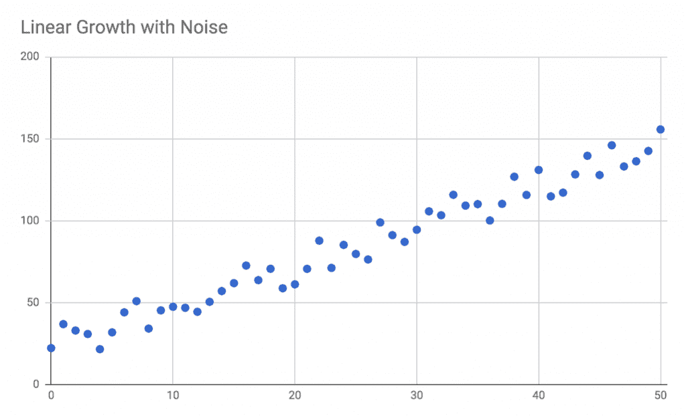
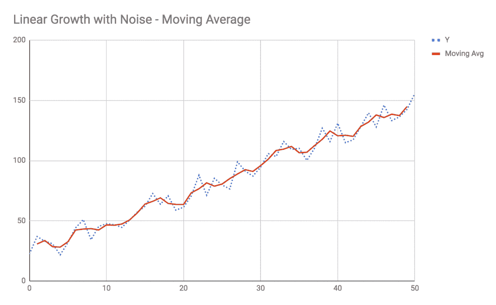
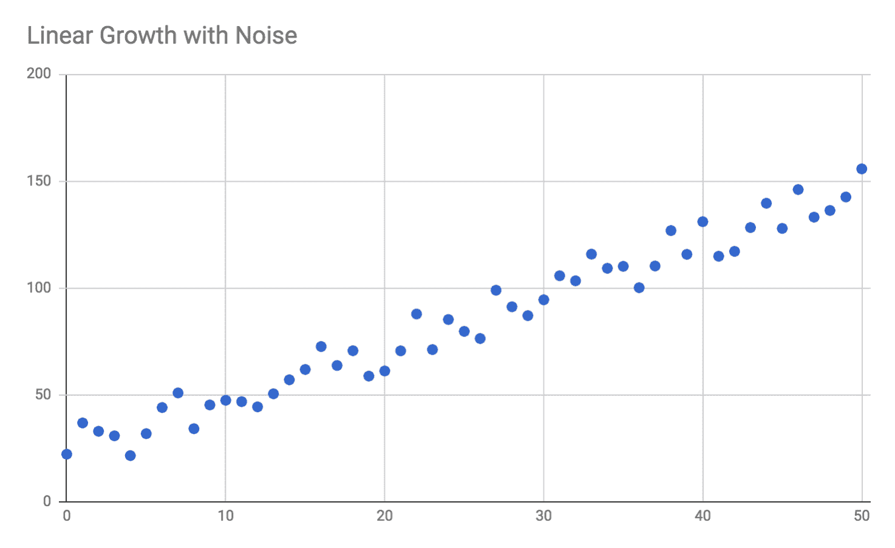
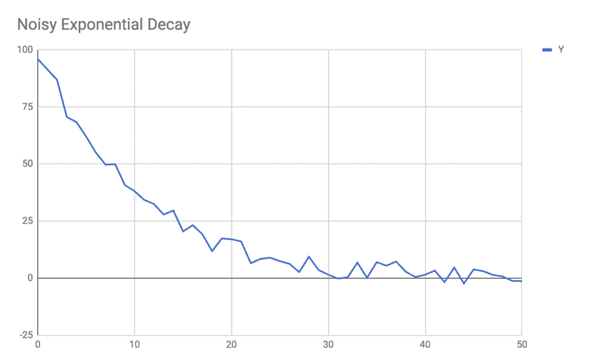
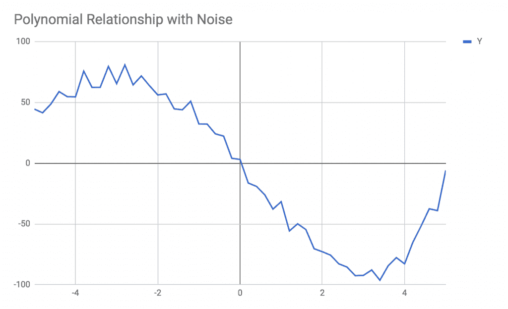
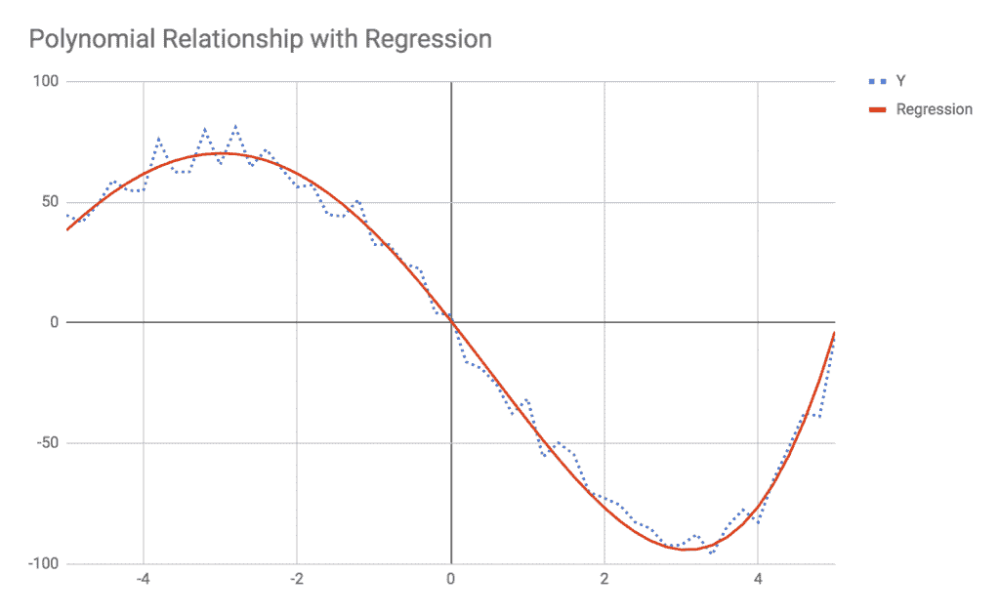
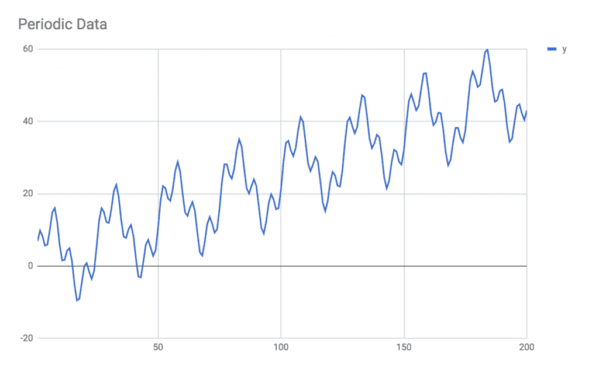
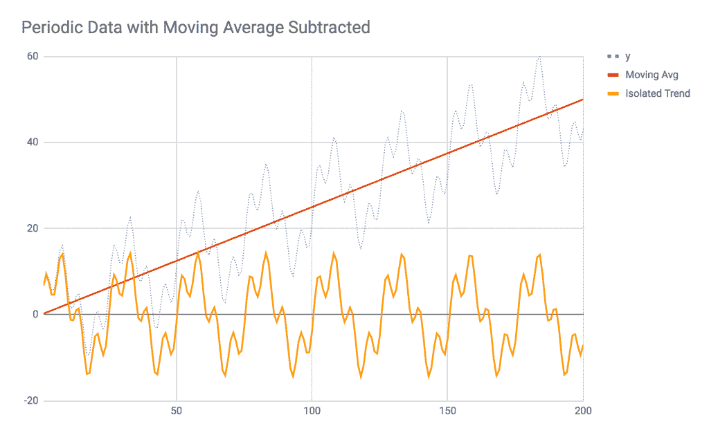

# 七、使用回归算法的预测

在本章中，我们将简要介绍使用回归算法的预测。我们还将讨论时间序列分析，以及如何利用数字信号处理技术来辅助我们的分析。在这一章的结尾，你将会看到许多在时间序列和连续值数据中常见的模式，并且将会理解哪些类型的回归适合于哪些类型的数据。此外，您还将学习一些数字信号处理技术，如滤波、季节性分析和傅里叶变换。

预测是一个非常广泛的概念，涵盖了许多类型的任务。本章将为您提供一个概念和算法的初始工具箱，广泛应用于时间序列数据。我们将关注基础知识，并讨论以下主题:

*   回归与分类
*   回归基础
*   线性、指数和多项式回归
*   时间序列分析基础
*   低通和高通滤波
*   季节性和减法分析
*   傅里叶分析

这些概念构建了一个基本的工具箱，您可以在处理现实世界的预测和分析问题时使用它。还有许多其他工具适用于特定的情况，但我认为这些主题是绝对的要点。

让我们先来看看**机器学习** ( **ML** )中回归和分类的异同。

# 回归与分类

这本书的大部分内容都与分类任务有关，其中分析的目标是将数据点与多个预定义的类或标签中的一个相匹配。对数据进行分类时，可以通过比较预测值和真实值来判断算法的准确性；猜测的标签不是正确就是不正确。在分类任务中，您通常可以确定猜测的标签符合数据的可能性或概率，并且您通常会选择具有最大可能性的标签。

让我们比较和对比分类任务和回归任务。两者的相似之处在于，最终目标是根据先验知识或数据做出预测。两者的相似之处在于，我们希望创建某种将输入值映射到输出值的函数或逻辑，并使映射函数尽可能精确和一般化。然而，回归和分类的主要区别在于，在回归中，你的目标是确定一个值的*数量*，而不是它的标签。

假设您管理的服务器上有关于一段时间内处理负载的历史数据。这个数据就是*时间序列*，因为数据是随着时间演变的。数据也是*连续*(与*离散*相对)，因为输出值可以是任意实数:1，或者 2.3，或者 2.34353，等等。时间序列分析或回归分析的目标不是给数据贴标签，而是预测下周四晚上 20:15 服务器的负载。为了实现这个目标，您必须分析时间序列数据，并尝试从中提取模式，然后使用这些模式来进行未来的预测。你的预测也会是一个真实连续的数字，比如*我预测下周四晚上的服务器负载会是 2.75* 。

在分类任务中，您可以通过将预测与真实值进行比较，并计算有多少预测是正确的或不正确的，来判断算法的准确性。因为回归任务本身涉及连续值，所以不能简单地确定预测是正确的还是不正确的。如果你预测服务器负载将是 2.75，最终真的是 2.65，你能说这个预测是正确的吗？还是不正确？如果最终是 2.74 呢？将*垃圾邮件*或*归类为非垃圾邮件*时，要么预测正确，要么预测错误。然而，当您比较连续值时，您只能确定您得到预测的接近程度，因此必须使用一些其他度量来定义您的算法的准确性。

通常，您将使用与分类任务不同的一组算法来分析连续数据或时间序列数据。但是，有一些 ML 算法可以处理回归和分类任务，只需稍加修改。最值得注意的是，决策树、随机森林和神经网络都可以用于分类和回归任务。

在本章中，我们将了解以下概念:

*   最小二乘回归技术，如线性回归、多项式回归、幂律回归等
*   趋势分析或平滑
*   季节性分析或模式减法

# 回归基础

执行回归分析时，有两个主要的总体目标。首先，我们希望确定和识别数据中任何潜在的系统性模式。如果我们能够识别系统模式，我们也许能够识别模式背后的现象，并对整个系统有更深的理解。如果通过你的分析，你发现有一种模式每 16 个小时重复一次，你就能更好地找出是什么现象导致了这种模式，并采取行动。与所有 ML 任务一样，这种 16 小时的模式可能隐藏在数据中很深的地方，可能无法一眼识别。

第二个主要目标是利用潜在模式的知识来预测未来。你所做的预测只会和为预测提供动力的分析一样好。如果你的数据中有四种不同的系统模式，而你只识别并模拟了其中的三种，你的预测可能是不准确的，因为你还没有完全模拟所涉及的真实世界的现象。

实现这两个目标依赖于你识别和正式(也就是数学上)描述模式和现象的能力。在某些情况下，您可能无法完全识别模式的根本原因；即使这样，如果模式是可靠的，并且你的分析是好的，即使你没有完全理解原因，你仍然能够预测系统的未来行为。所有 ML 问题都是如此；ML 最终分析行为和结果——我们可以衡量的东西——但是对原因有深刻的理解只会有所帮助。

在所有的 ML 问题中，我们也必须与噪音作斗争。在分类问题中，噪声可以采取多种形式，如缺失或不正确的值，或不可定义的人类行为。在回归问题中，噪声也可以有多种形式:传感器可能容易受到环境噪声的影响，底层过程中可能存在随机波动，或者噪声可能由许多小的、难以预测的系统因素引起。

无论是执行回归分析还是分类分析，噪声总是会使模式更难识别。在回归分析中，您的目标是能够将系统行为(实际模式)与数据中的随机噪声源分开。在某些情况下，将噪音建模为一种行为也很重要，因为噪音本身会对你的预测产生重大影响；在其他情况下，噪声可以忽略。

为了说明系统模式和噪声之间的区别，请考虑以下数据集。图中没有单位，因为这只是一些依赖参数 *Y* 的概念示例，它随一些独立参数 *X* 而变化:



在这个例子中，我们可以清楚地看到系统模式和噪声之间的区别。系统性模式是稳定的线性增长——Y 值通常会随着 X 值的增加而增加，尽管会因噪声而出现点与点之间的波动。通过对这些数据中的系统模式进行建模，我们将能够合理预测当 X 值为 75、100 或-20 时，Y 值会是多少。噪声是否显著取决于具体应用；您可以忽略噪声，也可以对其建模并将其包含在分析中。

在[第 1 章](01.html)*探索 JavaScript* 的潜力中，我们学习了一种处理噪声的技术:用移动平均线平滑。我们可以将三个点组合在一起，绘制出它们的平均值，而不是将单个点绘制成图形。如果噪声确实是随机的并且分布均匀(也就是说，噪声所有影响的平均值接近于零)，移动平均线将会抵消一些噪声。如果平均三个点，噪声对每个点的影响分别为+1、-2 和+1.2，移动平均将噪声的总影响降低到+0.2。当我们绘制移动平均线时，我们通常会发现更平滑的模式:



移动平均线降低了噪音的影响，并帮助我们更多地关注系统模式——但我们离预测未来值的能力并不远，比如 *X* 是 75 的时候。移动平均值只能帮助我们减少噪声对数据集中数据点的影响。例如，当 *X = 4* 时，当您查看 Y 值时，测量值约为 21，而平滑值为 28。在这种情况下，平滑值 28 更好地代表了在 *X = 4* 处的*系统模式*，即使此时的实际测量值是 21。最有可能的是，测量值和系统模式之间的巨大差异是由进行测量时产生的大量随机噪声引起的。

处理噪音时要小心。重要的是要认识到，在前面的例子中，实际测量的 Y 值在 *X = 4* 时确实是 21。平滑的移动平均线版本是理想化的。为了看到信号，我们试图切断噪声，但我们不能忘记，实际测量受到噪声的显著影响。这个事实对你的分析是否重要，很大程度上取决于你试图解决的问题。

那么，我们如何处理预测这些数据未来价值的问题呢？当*内插*数据时，移动平均线可能会帮助我们，但是当*外插*到未来的 X 值时，移动平均线可能不会帮助我们。当然，您可以猜测当 *X = 75* 时的值是多少，因为这个例子简单且易于可视化。然而，由于这是一本关于 ML 的书，我们可以假设现实世界的问题不会那么容易用肉眼分析，我们将需要引入新的工具。

这个问题的解决方案是*回归。*与所有预测 ML 问题一样，我们希望创建某种抽象函数，它可以将输入值映射到输出值，并使用该函数进行预测。在分类任务中，该映射函数可以是贝叶斯预测器或基于随机森林的启发式算法。在回归任务中，映射函数通常是描述一条线的数学函数，或者是多项式，或者是与数据非常匹配的某种其他形状。

如果你曾经在 Excel 或谷歌工作表中绘制过数据，很有可能你已经使用了线性回归。这些程序的*趋势线*功能执行线性回归，以确定最适合数据的映射函数。下图是由*线性回归*确定的趋势线，这是一种用于寻找最符合数据的数学线的算法:


此外，Excel 还给出了另一条信息，称为 **R <sup>2</sup> 值**，它表示趋势线与数据的拟合程度。接近 1.0 的 R <sup>2</sup> 值表示趋势线解释了点与点之间的大部分差异；低 R <sup>2</sup> 值表示模型不能解释方差。

趋势线和我们之前看到的移动平均线的主要区别在于趋势线是一个实际的数学模型。当你找到一条线性回归的趋势线时，你会有一个描述整条线的数学公式。移动平均线只存在于数据点存在的地方；我们只能有 X = 0 到 X = 50 之间的移动平均线。另一方面，趋势线是由直线的数学公式描述的，它向左和向右延伸到无限远。如果你知道趋势线的公式，你可以将 *X* 的任意值插入到该公式中，得到 *Y* 值的预测。比如你发现一条线的公式是 *Y = 2.5 x X + 22* ，你可以插上 *X = 75* ，你会得到 *Y = 2.5 x 75 + 22* ，或者 *Y = 209.5* 的预测。没有办法从移动平均线得到这样的预测。

线性回归只是回归算法的一种，专门用来寻找拟合数据的直线。在本章中，我们将探讨其他几种类型的回归算法，每种算法都有不同的形状。在所有情况下，您都可以使用一个度量来描述回归与数据的拟合程度。通常，该指标为**均方根误差** ( **RMSE** )，这是每个点相对于趋势线的平方误差平均值的平方根。大多数回归算法是*最小二乘*回归，其目的是找到使 RMSE 最小化的趋势线。

让我们看几个回归形状的例子，以及如何在 JavaScript 中使它们适合数据。

# 示例 1–线性回归

在我们深入第一个例子之前，让我们花一分钟来设置我们的项目文件夹和依赖项。创建一个名为`Ch7-Regression`的新文件夹，并在该文件夹中添加以下`package.json`文件:

```js
{
  "name": "Ch7-Regression",
  "version": "1.0.0",
  "description": "ML in JS Example for Chapter 7 - Regression",
  "main": "src/index.js",
  "author": "Burak Kanber",
  "license": "MIT",
  "scripts": {
    "build-web": "browserify src/index.js -o dist/index.js -t [ babelify --presets [ env ] ]",
    "build-cli": "browserify src/index.js --node -o dist/index.js -t [ babelify --presets [ env ] ]",
    "start": "yarn build-cli && node dist/index.js"
  },
  "dependencies": {
    "babel-core": "^6.26.0",
    "babel-plugin-transform-object-rest-spread": "^6.26.0",
    "babel-preset-env": "^1.6.1",
    "babelify": "^8.0.0",
    "browserify": "^15.1.0",
    "dspjs": "^1.0.0",
    "regression": "^2.0.1"
  }
}
```

然后从命令行运行`yarn install`命令，安装所有依赖项。接下来，创建一个名为`src`的文件夹，并添加一个名为`index.js`的空文件。最后，将`data.js`文件从图书的 GitHub 库中下载到`src`文件夹中。

在本例中，我们将处理上一节中的噪声线性数据。提醒一下，数据本身是这样的:



我们的目标是找到符合数据的线的公式，并在 *X = 75* 时预测未来值。我们将使用汤姆·亚历山大的`regression`库，该库可以执行多种类型的回归，并且还提供了基于结果回归进行预测的能力。

在`index.js`文件中，在文件顶部添加以下导入语句:

```js
import * as data from './data';
import regression from 'regression';
```

与所有 ML 问题一样，在选择算法之前，您应该从可视化数据开始，并尝试了解数据的整体形状。在这种情况下，我们可以看到数据遵循线性趋势，因此我们将选择线性回归算法。

在线性回归中，目标是为最适合数据的线确定公式的参数。直线的公式有以下形式: *y = mx + b* ，有时写成 *y = ax + b* ，其中 *x* 为输入变量或自变量， *y* 为目标或因变量， *m* (或 *a* 为直线的*斜率*或*梯度*，而 *b* 为因此，线性回归输出的最低要求是 *a* 和 *b* 的值，这是唯一决定直线形状的两个参数。

在`index.js`增加以下导入行:

```js
console.log("Performing linear regression:");
console.log("=============================");
const linearModel = regression.linear(data.linear);
console.log("Slope and intercept:");
console.log(linearModel.equation);
console.log("Line formula:");
console.log(linearModel.string);
console.log("R^2 fitness: " + linearModel.r2);
console.log("Predict X = 75: " + linearModel.predict(75)[1]);
```

对数据执行线性回归将返回模型；该模型本质上封装了 *a* 和 *b* 的值，或者直线的斜率和截距。这个特殊的库不仅返回`linearModel.equation`属性中的线的参数，还给我们一个线公式的字符串表示，计算回归的 R <sup>2</sup> 拟合，并给我们一个称为`predict`的方法，我们可以使用它将新的 X 值插入模型中。

通过从命令行发出`yarn start`命令来运行代码。您应该会看到以下输出:

```js
 Performing linear regression:
 =============================
 Slope and intercept:
 [ 2.47, 22.6 ]
 Line formula:
 y = 2.47x + 22.6
 R^2 fitness: 0.96
 Predict X = 75: 207.85
```

回归确定最符合我们数据的直线公式为 *y = 2.47x + 22.6* 。我用来创建这个测试数据的原始公式是 *y = 2.5x + 22* 。确定的方程和实际方程之间的微小差异是由于我添加到数据集的随机噪声的影响。正如你所看到的，线性回归很好地忽略了噪音，发现了潜在的模式。如果我们绘制这些结果，我们将看到以下内容:


如前图所示，回归的结果与 Excel 或 Google Sheets 的趋势线功能给出的结果完全相同，不同之处在于我们在 JavaScript 中生成了趋势线。

当要求预测未来值 *X = 75* 时，回归返回 *Y = 207.85* 。用我原来的公式，真实值应该是 209.5。对于任何给定点，我添加到数据中的噪声量等于+/- 12.5 的随机均匀噪声水平，因此当您考虑噪声引起的不确定性时，预测值非常接近实际值。

然而，应该注意的是，当你在远离原始数据领域的地方进行预测时，回归中的误差会增加。当预测 X = 75 时，预测值与实际值之间的误差仅为 1.65。另一方面，如果我们预测 X = 1000，真实公式将返回 2，522，但回归将预测 2，492.6。在 X = 1000 时，实际值和预测值之间的误差现在是 29.4，接近 30，远远超出了噪声造成的不确定性。回归是非常有用的预测器，但是您必须始终记住，这些误差可能会复合，因此随着您远离数据集的领域，预测会变得不太准确。

这种预测误差的原因在于方程斜率的回归。原始方程中直线的斜率为 2.5。这意味着对于 *X* 值中的每一个单位变化，我们应该期望 *Y* 值中的 2.5 个单位变化。另一方面，回归决定了 2.47 的斜率。因此，对于 *X* 值的每个单位变化，回归继承了-0.03 的微小误差。预测值将比实际值略低该数量，乘以您预测的 *X* 距离。每 10 个 *X* 单位，回归继承的总误差为-0.3。每 100 个 *X* 单位，回归继承一个-3.0 的误差，以此类推。当我们外推至 X=1000 时，我们继承了-30 的误差，因为-0.03 的微小单位误差乘以我们沿着 *x* 轴行进的距离。

当我们查看数据域内的值(X = 0 到 X = 50 之间的值)时，由于斜率的微小差异，我们只能得到非常小的预测误差。在我们的数据域内，回归通过略微增加 y 截距值(原始值为+22，回归返回+22.6)来校正斜率误差。由于我们数据中的噪声， *y = 2.47x + 22.6* 的回归公式比 *y = 2.5x + 22* 的实际公式拟合得更好。回归发现了一个稍微不太陡的斜率，并通过将整条线提高 0.6 个单位(y 截距的差异)来弥补这一点，因为这更符合数据和噪声。这个模型很好地拟合了 X = 0 和 X = 50 之间的数据，但是当我们试图预测 X = 1000 时的值时，y 截距中的轻微+0.6 修正不再足以弥补如此大的距离上斜率的下降。

像这个例子中的线性趋势非常普遍。有许多类型的数据表现出线性关系，只要不试图过度外推数据，就可以简单而准确地建模。在下一个例子中，我们将看一下指数回归。

# 示例 2–指数回归

连续数据模式中的另一个常见趋势是*指数增长**，这也通常被视为*指数衰减。*在指数增长中，未来价值与当前价值成正比。这种增长的一般公式可以写成:*

**y = y<sub>0</sub> (1 + r) x*

其中 *y <sub>0</sub>* 为该数量的初始值(当 *x* = 0 时) *r* 为该数量的增长率。

例如，如果你在股票市场投资，预计年回报率为 5%(*r = 0.05*)，初始投资为 10，000 美元，五年后你可以预期 12，763 美元。指数增长公式在这里适用，因为你明年的钱数和你今年的钱数成正比，两年后的钱数和你明年的钱数成正比，以此类推。这仅适用于你将你的回报进行再投资，导致你积极投资的金额逐年增加的情况。

指数增长方程的另一种形式如下:

*y = AE<sup>【bx】</sup>*

其中 *b = ln(1 + r)* ， *a* 为初始值 *y <sub>0</sub>* ， *e* 为欧拉常数约 2.718。这种形式上的微小变换更容易用数学方法处理，通常是数学家用来分析的首选形式。在我们的股市投资例子中，我们可以将五年增长的公式改写为*y = 10000 * e<sup>ln(1.05)* 5</sup>*，我们会得到同样的结果 12763 美元。

指数增长有时被称为“曲棍球棒增长”，因为曲线的形状类似于曲棍球棒的轮廓:


指数增长的一些例子包括:

*   人口增长；即世界人口或细菌培养的增长
*   病毒增长，如疾病感染分析或 YouTube 视频的病毒传播
*   力学或信号处理中的正反馈回路
*   经济增长，包括复利
*   摩尔定律下的计算机处理能力

需要注意的是，几乎在所有情况下，指数增长都是不可持续的。例如，如果您正在预测培养皿中细菌菌落的生长，您可能会在短时间内观察到指数增长，但是一旦培养皿耗尽食物和空间，其他因素将接管，增长将不再是指数增长。同样，如果你的网站鼓励新用户邀请他们的朋友，你可能会看到你的会员数量在一段时间内呈指数级增长，但最终你会饱和市场，增长会放缓。因此，在分析指数增长模型时，您必须谨慎，并了解推动指数增长的条件最终可能会改变。类似于线性回归，指数回归只适用于数据的适度外推。你网站的会员可能一年内呈指数级增长，但十年内不会；如果地球上只有 70 亿人，你不可能有 200 亿成员。

如果增长率 *r* ，或者参数 *k* (称为**增长常数**)为负，你将会有指数衰减而不是指数增长。从未来值与当前值成正比的意义上来说，指数衰减仍然是指数增长，然而在指数衰减中，未来值按比例*小于*当前值。

指数衰减的一个实际应用是碳年代测定分析。因为放射性碳-14 同位素衰变为非放射性碳-12，半衰期为 5730 年——也就是说，总的来说，每 5730 年有一半的碳-14 衰变为碳-12——科学家可以使用指数衰变公式来计算一个物体必须有多老，才能有合适的碳-14 与碳-12 的比例。

指数衰减也见于物理学和力学，尤其是弹簧-质量-阻尼器问题。验尸官和医学检查人员也可以使用它来确定受试者的死亡时间，因为温暖的身体会冷却下来，并以指数衰减的方式接近房间的环境温度。

在指数回归中，我们的目标是确定参数 *a* 和 *b* 的值——初始值和生长常数。让我们用 JavaScript 试试这个。我们希望分析的数据是指数衰减的，并添加了随机传感器噪声:



上图展示了一些从 100 附近开始衰减到大约 0 的量。例如，这可以代表一段时间内在脸书分享的帖子的访问者数量。

在这种情况下，试图用 Excel 或谷歌工作表拟合趋势线对我们没有帮助。线性趋势线不符合指数曲线，拟合的不恰当由较差的 R <sup>2</sup> 值表示:


现在，让我们使用 JavaScript 来找到这个数据的回归，并在数据集开始之前的一秒钟内预测这个值。在`index.js`中增加以下代码；它是线性回归代码:

```js
console.log("Performing exponential regression:");
console.log("=============================");
const expModel = regression.exponential(data.exponential);
console.log("Initial value and rate:");
console.log(expModel.equation);
console.log("Exponential formula:");
console.log(expModel.string);
console.log("R^2 fitness: " + expModel.r2);
console.log("Predict X = -1: " + expModel.predict(-1)[1]);
```

用`yarn start`运行程序，你会看到下面的输出，下面是线性回归例子的输出:

```js
 Performing exponential regression:
 =============================
 Initial value and rate:
 [ 94.45, -0.09 ]
 Exponential formula:
 y = 94.45e^(-0.09x)
 R^2 fitness: 0.99
 Predict X = -1: 103.34
```

我们可以立即看到 0.99 的高 R <sup>2</sup> 值，这表明回归已经找到了与数据的良好拟合。如果我们将此回归与原始数据一起绘制成图表，我们会看到以下内容:


此外，我们得到了 X =-1/103 的预测，这很好地符合我们的数据。我用来生成测试数据的方程的原始参数是 *a = 100* 和 *b = -0.1* ，而预测参数是 *a = 94.5* 和 *b = -0.09* 。噪声的存在对起始值产生了重大影响，如果系统中没有噪声，起始值将为 100，但实际测量值为 96。将 *a* 的回归值与 *a* 的实际值进行比较时，您还必须考虑这样一个事实，即 *a* 的回归值接近测量的噪声值，尽管它与系统值相差甚远。

在下一节中，我们将看一下多项式回归。

# 示例 3–多项式回归

多项式回归可以被认为是线性回归的更广义的形式。多项式关系具有以下形式:

*y = a<sub>0</sub>+a<sub>1</sub>x<sup>1</sup>+a<sub>2</sub>x<sup>2</sup>+a<sub>3</sub>x<sup>3</sup>+...+a<sub>n</sub>x<sup>n</sup>T19】*

一个多项式可以有任意多个项，称为多项式的**次**。对于多项式的每一次，自变量 *x* 乘以某个参数*a<sub>n</sub>T7，，X 值增加到幂 *n* 。直线被认为是次多项式*1*；如果您更新前面的多项式公式以移除高于 1 的所有度数，则剩下:*

*y = a <sub>0</sub> + a <sub>1</sub> x*

其中*a<sub>0</sub>T3】为 y 轴截距，*a<sub>1</sub>T7 为直线斜率。尽管符号略有不同，但这相当于 *y = mx + b* 。**

你可能还记得高中数学中的二次方程，它们只是一次多项式 *2* ，或者*y = a<sub>0</sub>+a<sub>1</sub>x+a<sub>2</sub>x<sup>2</sup>*。三次方程是三次多项式，二次方程是四次多项式，依此类推。

多项式和多项式回归的特性使它们如此强大，因为几乎任何形状都可以用一个足够次数的多项式在有限的值范围内来描述。多项式回归甚至可以拟合正弦曲线形状，只要你不试图外推太远。多项式回归表现出类似于其他机器学习算法的特性，因为如果你试图外推得太远，它们会过度拟合，并且对于新的数据点变得非常不准确。

因为多项式可以是任意次的，所以还必须用一个附加参数配置回归；可以猜测这个参数，也可以搜索最大化 R <sup>2</sup> 拟合的程度。这种方法类似于我们用于 k-means 的方法，当你事先不知道聚类的数量时。

当绘制图表时，我们希望拟合的数据如下所示:



这个数据的小窗口看起来是正弦曲线，但实际上是多项式的；请记住，多项式方程可以再现许多类型的形状。

在`index.js`底部添加以下代码:

```js
console.log("Performing polynomial regression:");
console.log("=============================");
const polyModel = regression.polynomial(data.polynomial, {order: 2});
console.log("Polynomial parameters");
console.log(polyModel.equation);
console.log("Polynomial formula:");
console.log(polyModel.string);
console.log("R^2 fitness: " + polyModel.r2);
console.log("Predict X = 6: " + polyModel.predict(6)[1]);
```

注意，我们已经用`{order: 2}`配置了回归，也就是说，我们试图用二次公式拟合数据。用`yarn start`运行程序，看到如下输出:

```js
 Performing polynomial regression:
 =============================
 Polynomial parameters
 [ 0.28, -17.83, -6.6 ]
 Polynomial formula:
 y = 0.28x^2 + -17.83x + -6.6
 R^2 fitness: 0.75
 Predict X = 6: -103.5
```

适合该数据的 R <sup>2</sup> 很低，在`0.75`处，这表明我们可能对`order`参数使用了不正确的值。尝试将订单增加到`{order: 4}`并重新运行程序以获得以下内容:

```js
 Performing polynomial regression:
 =============================
 Polynomial parameters
 [ 0.13, 1.45, -2.59, -40.45, 0.86 ]
 Polynomial formula:
 y = 0.13x^4 + 1.45x^3 + -2.59x^2 + -40.45x + 0.86
 R^2 fitness: 0.99
 Predict X = 6: 146.6
```

回归现在更适合，但代价是在方程中增加了额外的多项式项。如果我们对照原始数据绘制回归图，我们将看到以下输出，它确实非常符合数据:



在下一节中，我们将探讨一些可以对时间序列数据执行的其他类型的分析，包括低通和高通滤波器以及季节性分析。

# 其他时间序列分析技术

回归是分析连续数据的一个很好的起点，但是，在具体分析时间序列数据时，还可以使用许多其他技术。虽然回归可以用于任何连续的数据映射，但时间序列分析特别适合于随时间演变的连续数据。

有许多时间序列数据的例子，例如:

*   服务器负载随时间的变化
*   股票价格随时间的变化
*   一段时间内的用户活动
*   一段时间内的天气模式

分析时间序列数据时的目标类似于用回归分析连续数据时的目标。我们希望识别和描述影响价值随时间变化的各种因素。本节将描述回归之外的许多技术，您可以使用这些技术来分析时间序列数据。

在本节中，我们将研究来自数字信号处理领域的技术，这些技术在电子学、传感器分析和音频信号方面都有应用。虽然您的特定时间序列问题可能与这些领域无关，但数字信号处理应用中使用的工具可以应用于任何处理数字信号的问题领域。最重要的工具和技术包括过滤、季节性检测和频率分析。我们将讨论这些技术，但我会让您自己实现自己的示例和实验。

# 过滤

在数字信号处理环境中，滤波是一种用于滤除信号的高频或低频分量的技术。这些分别被称为**低通滤波器**和**高通滤波器**；低通滤波器允许低频信号通过*，同时去除信号中的高频成分。还有*带通*和*陷波*滤波器，它们允许一定范围的频率通过或从信号中切断一定范围的频率。*

在电子学中，滤波器是通过使用电容器、电阻器和其他简单的电子元件来设计的，以便只允许高于或低于截止频率 T2 的频率通过电路。在数字信号处理中，同样的效果可以通过*无限脉冲响应*滤波器来实现，该滤波器是一种能够再现电子电路对时间序列数据的影响的算法。

为了说明这一点，请考虑以下数据:


该数据是通过组合两个正弦信号产生的，一个低频信号和一个高频信号。如果我们单独绘制这两个信号的图表，我们可以看到它们是如何结合起来产生整体信号的:


对整个信号进行滤波时，目标是提取信号的低频或高频分量，同时滤除另一个分量。这被称为**减法处理**，因为我们正在从信号中去除(过滤)一个分量。

通常，您应该使用低通滤波来隔离时间序列数据中的大的、一般的、周期性趋势，而忽略更快的周期性趋势。另一方面，当您希望探索短期周期性趋势而忽略长期趋势时，应该使用高通滤波。这种方法的一个例子是在分析访问者流量时；您可以使用高通和低通滤波来选择性地忽略每月趋势和每日趋势。

# 季节性分析

在前一部分的基础上，我们还可以使用数字信号处理来分析季节性趋势。季节性趋势是长期周期性(即低频)趋势，您希望从整体数据中减去这些趋势，以便分析数据中其他潜在的非周期性趋势。考虑以下图表:



这些数据显示了经济活动周期性波动之上的线性增长。具体来说，该数据趋势有两个周期分量(一个低频和一个高频)和一个线性分量。

为了分析这些数据，方法将是首先通过大的移动平均窗口或通过线性回归来识别线性趋势。一旦确定了线性趋势，就可以从数据中减去它，只分离出周期性部分。这种方法说明如下:



因为信号是相加的，所以您可以从原始数据中减去线性趋势，以便隔离信号的非线性分量。如果您已经通过回归或其他方式识别了多个趋势，您可以继续从原始信号中减去您已经识别的趋势，您将只剩下未识别的信号分量。一旦你确定并减去了所有的系统模式，你就只剩下传感器噪声了。

在这种情况下，一旦您从数据中识别并减去线性趋势，您可以对结果信号执行滤波以分离低频和高频分量，或者您可以对剩余信号执行*傅立叶分析*以识别剩余分量的特定频率和幅度。

# 傅里叶分析

傅立叶分析是一种数学技术，用于将时间序列信号分解为其各个频率分量。回想一下，任意次数的多项式回归可以再现几乎任何信号形状。以类似的方式，许多正弦振荡器的总和可以再现几乎任何周期信号。如果你曾经看到过*示波器*或*频谱分析仪*在工作，你已经看到了傅里叶变换应用于信号的实时结果。简而言之，傅立叶变换将周期信号(如我们在上一节中看到的信号)转化为类似于以下的公式:

*a<sub>1</sub>sin(f<sub>1</sub>+φ<sub>1</sub>)+a<sub>2</sub>sin(f<sub>2</sub>+φ<sub>-我...。+a<sub>n</sub>sin(f<sub>n</sub>+φ<sub>n</sub>)</sub>*

其中*f<sub>n</sub>T3】代表频率，*a<sub>n</sub>T7】代表其振幅，*φ<sub>n</sub>T11】代表相位偏移。通过将任意数量的这些正弦信号组合在一起，可以复制几乎任何周期信号。***

执行傅立叶分析有许多原因。最直观的例子涉及音频和声音处理。如果你对钢琴上演奏的音符 A4 进行一秒钟长的音频采样，并对其进行傅里叶变换，你会看到 440 赫兹的频率具有最大的振幅。你也会看到 440 赫兹的谐波，像 880 赫兹和 1320 赫兹，也有一些能量。您可以使用这些数据来帮助音频指纹识别、自动调谐、可视化和许多其他应用。傅立叶变换是一种采样算法，因此容易出现混叠和其他采样错误。傅立叶变换可以用来部分重建原始信号，但在转换过程中会丢失很多细节。这个过程类似于对图像进行下采样，然后再次尝试上采样。

傅立叶变换在几乎每个领域都有许多其他应用。傅立叶变换的流行是因为从数学上讲，许多类型的运算在频域比时域更容易执行。数学、物理和工程中有许多类型的问题，在时域很难解决，但在频域很容易解决。

傅立叶变换是特定算法执行的数学过程。最流行的傅立叶变换算法被称为**快速傅立叶变换** ( **快速傅立叶变换**，命名为 s0，因为它比其前身*离散傅立叶变换*快得多。快速傅立叶变换有一个显著的限制，即要分析的样本数量必须是 2 的幂，即样本长度必须是 128、256、512、1，024、2，048 等等。如果您有 1，400 个样本要分析，则必须将其截断为 1，024 个样本，或者将其填充为 2，048 个样本。大多数情况下，你会*开窗*一个更大的样本；在钢琴音符录音的例子中，我们对现场或录音信号的一秒钟样本进行了加窗。如果音频采样率是 44，100 赫兹，那么我们将有 44，100 个样本(一秒的值)用于傅里叶变换。

当从较大的信号中填充、截断或加窗采样时，您应该使用*窗口函数*，这是一个在信号两端逐渐变细的函数，以便它不会被您的窗口急剧切断。有许多类型的窗口函数，每种函数都有自己的数学属性和对信号处理的独特影响。一些流行的窗口函数包括矩形和三角形窗口，以及高斯、兰佐斯、汉恩、海明和布莱克曼窗口，它们在不同类型的分析中都具有理想的特性。

像快速傅立叶变换算法一样，傅立叶变换算法的输出是频域频谱。更具体地，快速傅立叶变换算法的输出将是数组或哈希表，其中键是频率桶(例如 0-10 Hz、10-20 Hz 等)，值是振幅和相位。这些可以表示为复数、多维数组或特定于算法实现的一些其他结构。

一些限制适用于所有采样算法；这些都是信号处理本身的局限性。例如，如果您的信号包含高于*奈奎斯特频率*或一半采样率的分量，就会出现混叠。在音频中，44，100 赫兹的采样率是很常见的，任何高于 22，050 赫兹的频率都会被混淆，或者被误认为是低频信号。因此，用低通滤波器预处理信号是一种常见的技术。同样，快速傅立叶变换算法只能解析高达奈奎斯特频率的频率。快速傅立叶变换算法将只返回与样本缓冲区大小一样多的频率桶，所以如果你给它 1，024 个样本，你将只得到 1，024 个频率桶。在音频中，这意味着每个频率桶将具有 44，100 赫兹/ 1，024 = 43 赫兹的带宽。这意味着你将无法分辨 50 Hz 和 55 Hz 之间的区别，但你将很容易分辨 50 Hz 和 500 Hz 之间的区别。为了获得更高的分辨率，您需要提供更多的样本，然而，这又会降低窗口的时间分辨率。

您可以使用快速傅立叶变换来分析我们在上一节中看到的时间序列数据的周期性部分。最好在从信号中减去线性趋势后执行快速傅立叶变换。但是，如果您有足够高的频率分辨率，线性趋势可能只能解释为傅立叶变换的低频分量，因此是否需要减去线性趋势将取决于您的具体应用。

通过将快速傅立叶变换添加到您在本章中学习的其他工具中，您就可以处理大多数现实世界的回归或时间序列分析任务。每个问题都是独特的，你必须仔细考虑你的任务需要哪些特定的工具。

# 摘要

在本章中，您学习了许多用于预测、信号处理、回归和时间序列数据分析的技术。因为预测和时间序列分析是一个宽泛的范畴，所以没有一个单一的算法可以涵盖所有情况。相反，本章为您提供了一个重要概念和算法的初始工具箱，您可以开始将其应用于预测和回归任务。

具体来说，您了解了回归和分类之间的区别。分类为数据点分配标签，回归则试图预测数据点的数值。并非所有的回归都必然是预测，但回归是预测中使用的最重要的技术。

在学习了回归的基础之后，我们探索了一些特定类型的回归。也就是说，我们讨论了线性、多项式和指数回归。我们看到了回归是如何处理噪音的，以及我们如何利用它来预测未来的价值。

然后，我们转向更广泛的时间序列分析概念，并讨论了核心概念，例如从信号中提取趋势。我们讨论了数字信号处理中适用于时间序列分析的工具，如低通和高通滤波器、季节性分析和傅里叶变换。

在下一章中，我们将研究更高级的机器学习模型。具体来说，我们将学习神经网络——顺便说一下，它也可以进行回归。*