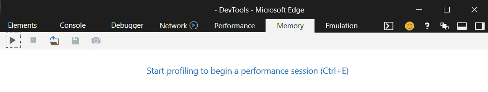
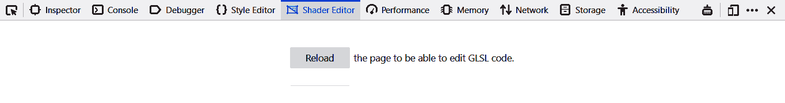
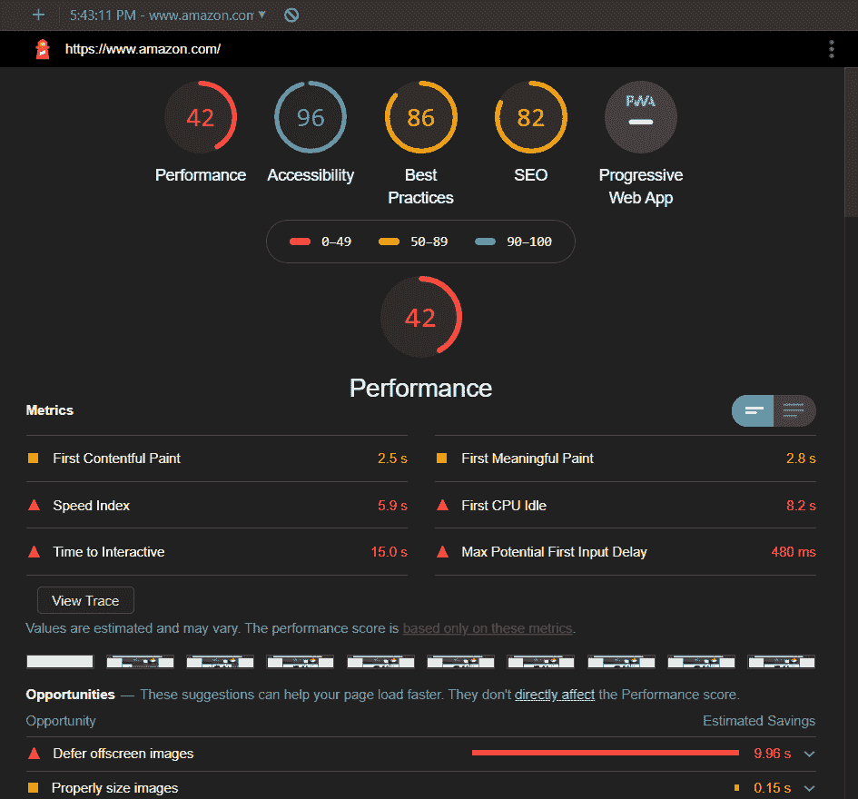
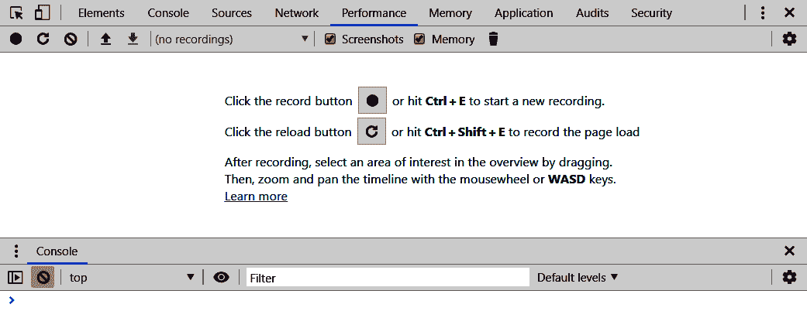
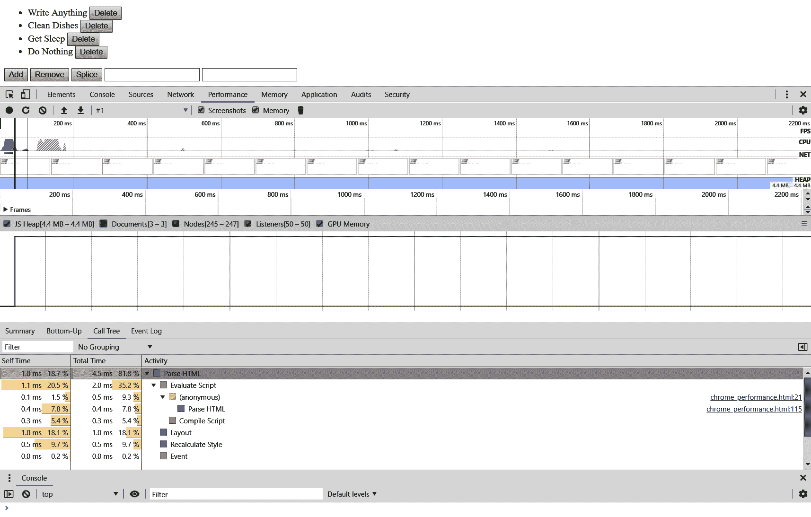
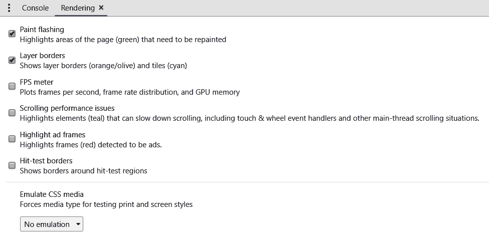

# 一、Web 上的高性能工具

JavaScript 已经成为网络的主流语言。 使用 JavaScript 运行应用不需要额外的运行时，也不需要编译过程。 任何用户都可以打开网页浏览器，在控制台中输入语言来学习。 除此之外，随着**文档对象模型**(**DOM**)的出现，该语言也有了许多进步。 所有这些都为开发人员提供了丰富的开发环境。

在此之上，我们可以将网络视为一个*一次性构建，部署在任何地方*的环境。 适用于一种操作系统的代码也适用于另一种操作系统。 如果我们想要瞄准所有浏览器，就需要有一些变化，但它可以被视为一个*一次性开发，*部署的平台。 然而，所有这些都导致应用变得臃肿，使用昂贵的框架和不必要的腻子填充。 这些框架的必要性可以在大多数招聘启事中看到，但有时我们不需要它们来创建丰富的应用。

本章重点介绍我们将使用的工具，以帮助我们构建和分析高性能 web 应用。 我们将看看不同的现代浏览器及其独特的贡献。 然后我们将深入研究 Chrome 开发工具。 总的来说，我们将学习以下内容:

*   每个浏览器内嵌不同的开发工具
*   深入了解以下 Chrome 工具:
*   性能选项卡
*   Memory 选项卡
*   渲染器选项卡
*   jsPerf 和基准测试代码

# 技术要求

以下是本章的先决条件:

*   一个网络浏览器，最好是 Chrome。
*   一个编辑器; VS Code 优先。
*   了解 JavaScript 和一些 DOM api。
*   相关代码见[https://github.com/PacktPublishing/Hands-On-High-Performance-Web-Development-with-JavaScript/tree/master/Chapter01](https://github.com/PacktPublishing/Hands-On-High-Performance-Web-Development-with-JavaScript/tree/master/Chapter01)。

# 不同环境下的 DevTools

有四种浏览器被认为是现代浏览器。 它们分别是 Edge、Chrome、Firefox 和 Safari。 这些浏览器支持最新的标准，并正在积极开发中。 我们将看看它们是如何发展的，以及它们的一些独特的功能。

Internet Explorer is getting close to the end of its life cycle. The only development that will be happening with the browser is critical security fixes. New applications should try to deprecate this browser, but if there is a client base still utilizing it, then we may need to develop for it. We will not be focusing on polyfills for it in this book.

# 边缘

微软的 Edge 浏览器是他们对现代网络的尝试。 通过使用 EdgeHTML 渲染器和 Chakra JavaScript 引擎，它在许多基准测试中表现良好。 虽然 Chakra 引擎与 Chrome 或 Firefox 有不同的优化，但从纯 JavaScript 的角度来看，它是一个有趣的浏览器。

As of the time of writing of this book, Microsoft was changing the rendering engine of Edge to the Chromium system. This has many implications for web developers. First, this means that more browsers will be running the Chromium system. This means less to worry about in terms of cross-browser development. While support for the current form of Edge is required, it may disappear in the coming year.

就功能而言，Edge 相对于其他浏览器来说是轻量级的。 如果我们需要为它执行任何类型的性能测试，最好的方法是使用 jsPerf 或其他工具而不是内置工具来分析代码。 最重要的是，Chakra 引擎利用了不同的优化技术，所以可能在 Chrome 或 Safari 上工作的可能对 Edge 的优化较少。 要进入 Windows 上的开发工具，我们可以按*F12*。 这将弹出常见的控制台对话框，如下所示:



我们不会讨论 Edge 特有的任何有趣的特性，因为它们的开发工具中的大多数(如果不是全部的话)特性与其他浏览器中的特性是一样的。

With the latest Edge browser based on Chromium, OS X users will be happy to note that the browser is supposed to be supported. This means cross-browser development will get easier for those on OS X versus Windows or Linux.

# Safari

苹果的 Safari 浏览器基于 WebKit 渲染引擎和 JavaScriptCore 引擎。 WebKit 引擎是 Chrome 的 Blink 引擎的基础，而 JavaScriptCore 引擎在 OS X 操作系统的一些地方使用。 关于 Safari，有趣的一点是，如果我们运行的是 Windows 或 Linux，我们将无法直接访问它。

为了访问 Safari，我们需要利用在线服务。 BrowserStack 或 LambdaTest，以及其他许多工具，可以为我们完成这项工作。 有了这些工具，我们现在就可以访问以前可能无法访问的浏览器了。 多亏了 LambdaTest，我们将利用他们的免费服务来简要了解一下 Safari。

同样，我们会注意到 Safari 浏览器开发工具并没有太多内容。 在其他浏览器中也可以使用所有相同的工具，而且它们通常在其他浏览器中更强大。 熟悉每个接口有助于在特定的浏览器中进行调试，但是不需要花很多时间去查看那些没有任何特定特性的浏览器。

# 火狐

Mozilla 的 Firefox 利用了 SpiderMonkey JavaScript 引擎和增强的 Gecko 引擎。 Gecko 引擎得到了一些很好的改进，他们在其中添加了部分 Servo 项目代码基础，从而提供了一个很好的多线程渲染器。 Mozilla 一直走在最新网络技术的前沿。 他们是最早实现 WebGL 的公司之一，也是最早实现 WebAssembly 和**WebAssembly 系统接口**(**WASI**)标准的公司之一。

What follows is a fairly technical discussion about shaders and the shader language, **OpenGL Shading Language** (**GLSL**). It is recommended that you read on to find out more about this, but for those of you who are lost, it may be helpful to visit the documentation to learn more about this technology, at [https://developer.mozilla.org/en-US/docs/Games/Techniques/3D_on_the_web/GLSL_Shaders](https://developer.mozilla.org/en-US/docs/Games/Techniques/3D_on_the_web/GLSL_Shaders).

如果我们在 Windows 中打开 DevTools，*F12*，我们可能会看到**着色器**标签。 如果没有，转到右边的三点菜单，打开设置。 在左侧，应该有一个标题为 Default Developer Tools 的复选框列表。 继续，选择**着色器编辑器**选项。 现在，如果我们进入这个选项卡，我们应该会得到如下内容:



选项卡请求画布上下文。 本质上，该工具正在寻找以下几项:

*   一个画布元素
*   3 d-enabled 上下文
*   顶点和碎片着色器

在我们的仓库中有一个名为`shader_editor.html`的文件，它有必要的代码来设置画布，也有着色器设置，所以我们可以使用着色器编辑器。 这些着色器是在网络上以编程方式使用 GPU 的方法。 它们利用了 OpenGL 规范的一个版本，叫做 OpenGL ES 3.0。 这允许我们使用该规范中的几乎所有内容，特别是顶点和碎片着色器。

为了使用这些着色器编程，我们使用了一种叫做**GL 着色语言**(**GLSL**)的语言。 这是一种类似于 c 的语言，它有一大堆特定于它的特性，比如搅拌。 混合是利用矢量组件(最多四个)并将它们组合成任意形状或形式的能力。 下面是一个例子:

```js
vec2 item = vec2(1.0, 1.0);
vec4 other_item = item.xyxx;
```

这将创建一个研制出向量和设置 x*,*,【显示】z*,和*w 组件`x`,`y`,`x`,`x`项,分别从二极向量。 这个术语可能需要一段时间来适应，但它使某些事情变得容易得多。 上面展示了一个示例，其中我们需要从一个两个元素的向量创建一个四个元素的向量。 在基本的 JavaScript 中，我们必须做以下事情:**

```js
const item = [1.0, 1.0];
const other_item = [item[0], item[1], item[0], item[0]];
```

我们可以利用 swizzling 的简写语法来代替前面的代码。 GLSL 系统中还有其他一些特性，我们将在后面的章节中介绍，但这应该能让我们了解这两种语言的不同之处。

现在，如果我们打开`shader_editor.html`文件并重新加载页面，我们应该会看到一个白色的页面。 如果我们看看 Shader 编辑器，我们可以看到在右边我们设置了一个变量`gl_FragColor`为一个 4 元素向量，所有这些都被设置为`1.0`。 如果我们将它设置为`vec4(0.0, 0.0, 0.0, 1.0)`会发生什么? 现在我们应该在左上角看到一个黑盒子。 这表明矢量的四个组件是颜色的红、绿、蓝和 alpha 组件，范围从`0.0`到`1.0`，就像 CSS 的`rgba`系统一样。

除了单一的单色，还有其他的颜色组合吗? 每个着色器都有一些预先定义的全局变量。 其中一个，在碎片着色器中，称为`gl_FragCoord`。 这是窗口空间的左下角坐标，范围从`0.0`到`1.0`(这里应该有一个主题是什么值在 GLSL 中被认为是好的)。 如果我们设置了四维矢量*x 元素的【显示】*x 元素`gl_FragCoord`,*和*y 元素 y*【病人】`gl_FragCoord`的元素,我们应该得到一个简单的白色盒子,单像素边界在左边,但是,一个在底部。***

 *除了混合和全局变量，我们还可以在这些着色器中使用其他数学函数。 让我们将这些*x*和*y*元素包裹在一个`sin`函数中。 如果我们这样做，我们应该在屏幕上得到一个漂亮的格子图案。 这应该给一个提示，碎片着色器实际上在做什么。 它试图在 3D 空间中绘制那个位置，基于各种输入，其中一个是来自顶点着色器的位置。

然后，它试图绘制每个单独的像素，组成我们用顶点着色器声明的网格内部。 而且，这些片段都是同时计算的(或者是显卡所能计算的)，所以这是一个高度并行化的操作。

这将让我们对 GLSL 编程的世界有一个很好的先睹为快的机会，以及除了 3D 工作之外，GLSL 语言可以为我们提供的可能性。 现在，我们可以对这些概念进行更多的尝试，然后转向最后一个浏览器，Chrome。

# 铬

谷歌的 Chrome 浏览器利用 Blink 引擎和著名的 V8 JavaScript 运行时。 这与在 Node.js 中使用的运行时相同，因此熟悉开发工具将在许多方面帮助我们。

Chrome 一直走在网络技术的前沿，就像 Firefox 一样。 他们是第一个实现各种想法的人，比如 QUIC 协议，HTTP/3 标准松散地基于该协议。 他们创建了**Native Plugin Interface**(**NaCL**)，与`asm.js`一起帮助创建了 WebAssembly 的标准。 通过提供蓝牙、手柄和通知 api 等 api，他们甚至是让 web 应用变得更像原生应用的先驱。

我们将特别关注 Chrome 自带的灯塔功能。 灯塔功能可以从 Chrome 浏览器的**审计**选项卡访问。 一旦我们在这里，我们可以设置我们的审计与无数的设置:

*   首先，我们可以基于从移动设备或桌面运行的页面来审计页面。 然后我们可以审计网站的各种功能。
*   如果我们正在开发一个先进的 web 应用，我们可能会决定不需要 SEO。 另一方面，如果我们正在开发一个营销网站，我们可以决定不需要渐进 web 应用检查。 我们可以模拟一个节流连接。
*   最后，我们可以从清洁存储开始。 如果我们的应用使用内置在浏览器中的缓存系统(如会话存储或本地存储)，这将特别有用。

作为一个例子，让我们看看一个外部站点，看看它在审计应用中的表现如何。 我们将关注的网站是亚马逊，位于[https://www.amazon.com](https://www.amazon.com)。 这个网站应该成为我们学习的榜样。 我们将把它看作一个桌面应用，没有任何限制。 如果我们运行审计，我们应该得到如下内容:



正如我们所看到的，主页在性能和最佳实践方面做得很好，但 Chrome 警告我们关于可访问性和 SEO 性能。 就可访问性而言，图像似乎没有`alt`属性，这意味着屏幕阅读器不能很好地工作。 此外，似乎开发人员有`tabindexes`高于 0，可能导致标签顺序不遵循正常的页面流程。

如果我们想要设置自己的系统来进行测试，我们需要在本地托管页面。 有许多很棒的静态站点托管解决方案(我们将在书的后面构建一个)，但如果我们需要托管内容，最简单的方法之一是下载 Node.js 并安装`static-server`模块。 稍后我们将深入讨论如何启动和运行 Node.js，以及如何创建我们自己的服务器，但就目前而言，这是最好的选择。

我们已经研究了主要的现代网络浏览器，我们应该瞄准它们。 它们中的每一个都有自己的功能和限制，这意味着我们应该在所有这些功能上测试应用。 然而，本书的重点将是 Chrome 浏览器及其附带的开发工具。 由于 Node.js 是用 V8 引擎构建的，而且许多其他新浏览器都是基于 Chromium 引擎的，比如 Brave，所以利用这一点是很有意义的。 我们将详细介绍 Chrome 开发工具提供给我们的三个具体功能。

# Chrome -深入查看性能选项卡

如前所述，除了 Firefox 中精选的少数工具外，Chrome 已经成为用户和开发人员普遍选择的浏览器。 对于开发人员来说，这在很大程度上要归功于其出色的开发工具。 以下几节将介绍三种重要的工具，它们对于任何开发人员在设计 web 应用时都是非常重要的。 我们将从性能工具开始。

此工具允许我们在运行应用时运行性能测试。 如果我们想看看应用在完成某些事情时的行为，这是非常好的。 例如，我们可以分析应用的启动状态，并查看可能存在的瓶颈在哪里。 或者，当用户交互发生时，比如表单上的提交，我们可以看到调用层次结构，我们通过调用层次结构发布信息并将信息返回给用户。 最重要的是，当我们使用 web worker 时，它甚至可以帮助配置代码，以及在应用上下文之间如何传输数据。

以下是最新版本的 Chrome 浏览器的**性能**选项卡的截图:



有几个部分很有趣。 首先，我们的开发者工具标签下面的栏是我们的主工具栏。 左边的两个按钮可能是最重要的，记录和刷新工具上的记录。 这将允许我们分析应用，并查看在代码的关键时刻发生了什么。 在这些选项之后，会有选择工具来抓取您以前可能运行过的配置文件。

接下来是我经常打开的两个选项:

*   首先，当看到应用发生一些重要的事情时，如内存增长或添加新文档时，屏幕截图功能将为我们捕获屏幕截图。
*   下一个选项是内存分析器。 它会告诉我们当时消耗了多少内存。

最后是删除操作。 正如许多人猜测的那样，这将删除您当前使用的配置文件。

让我们在一个简单的测试应用上进行测试运行。 从存储库中获取`chrome_performance.html`文件。 这个文件展示了一个标准的 Todo 应用，但是它是用一个非常基本的模板系统编写的，没有库。 没有一个图书馆会成为贯穿全书的标准。

如果我们运行这个应用，并从 reload 运行性能测试，我们应该得到如下内容:



页面应该几乎是立即加载的，但我们仍然得到一些有用的信息。 从上到下，我们得到以下信息:

*   图片的时间轴，以及 FPS、CPU 使用、网络使用和堆使用的图形化。
*   不同统计数据的折线图，如 JavaScript 堆使用情况、文档数量、文档节点数量、监听器数量和我们正在使用的 GPU 内存。
*   最后，我们得到一个选项卡式的部分，它提供了有关时间的所有信息和分配时间的细分。

Make sure you let the profiler run its course. It should automatically shut down after all operations are done on the page. This should ensure that you are getting as close to the correct information as possible on how your application is doing. The profiler may have to be run a couple of times to get an accurate picture also. The internal garbage collector is trying to hold onto some objects so that it can reuse them later, so getting an accurate picture means seeing what the low point is since that is most likely where the application baseline is following **Garbage Collection** (**GC**). A good indicator of this is seeing a major GC and/or a DOM GC. This means we are starting afresh again.

在这个基本示例中，我们可以看到大部分时间都花在 HTML 中。 如果我们打开这个窗口，我们将看到评估我们的脚本占用了大部分时间。 由于我们的大部分时间都花在评估脚本和将模板化的 Todo 应用插入到 DOM 中，所以让我们看看如果没有这种行为，统计数据会是什么样子。

注释掉除了基本标签之外的所有内容，例如`html`、`head`和`body`标签。 关于这次跑步，有一些有趣的元素。 首先，文件的数量应该保持不变或减少。 这将在稍后讨论。 其次，节点数量急剧减少，可能减少到 12 个左右。 我们的 JavaScript 堆下降了一点，监听器的数量也显著下降。

让我们把单`div`标签带回来。 文档、堆空间和侦听器的数量保持不变，但节点的数量再次增加。 让我们添加另一个`div`元素，看看它如何影响节点的数量。 应该增加 4 个。 最后一次，让我们加入另一个`div`元素。 同样，我们应该注意到添加了 4 个 DOM 节点。 这为我们了解 DOM 是如何运行的以及如何确保分析是正确的提供了一些线索。

首先，节点的数量并不直接等于屏幕上 DOM 元素的数量。 DOM 节点由几个底层基本节点组成。 例如，如果我们添加一个元素，比如`input`元素，我们可能会注意到节点的数量增加了 4 个以上。 其次，可用文档的数量几乎总是高于单个文档。

虽然其中一些行为可以归因于分析器中的错误，但它也显示了一个事实，即在幕后发生的事情对开发人员是不可用的。 当我们触摸 Memory 选项卡并查看调用层次结构时，我们将看到内部系统如何创建和销毁开发人员无法完全控制的节点，以及开发人员不可见的、但对浏览器进行了优化的文档。

让我们再次添加代码块，回到原始文档。 如果需要，继续并恢复 Git 分支(如果这是从存储库中拉出来的)，然后再次运行分析器。 我们特别想看看 Call Tree 选项卡和 Parse HTML 下拉框。 应该有如下的层次结构:`Parse HTML > Evaluate Script > (anonymous) > runTemplate > runTemplate`。

让我们改变代码，将内部的`for`循环转换为数组`map`函数，如下所示:

```js
const tempFun = runTemplate.bind(null, loopTemp);
loopEls = data.items.map(tempFun);
```

注释掉`loopEls`数组初始化和`for`循环。 再次运行分析器，让我们看看这个调用堆栈是什么样子的。 我们将注意到，即使我们将`runTemplate`函数绑定到一个名为`tempFun`的新函数，它仍将其作为自身进行分析。 这是我们在看调用层次结构时必须记住的另一点。 我们可以绑定、调用或应用函数，但开发工具仍将尝试维护函数的原始定义。

最后，让我们向数据列表添加许多项，并看看这将如何影响我们的分析。 将以下代码放在数据部分下面:

```js
for(let i = 0; i < 10000; i++) {
    data.items.push({text : `Another item ${i}`});
}
```

现在我们得到的图像应该和之前有所不同:

*   首先，我们的时间几乎平均分配在 GPU 布局和脚本评估之间，现在看起来我们花了大部分时间运行布局引擎。 这是有意义的，因为当 DOM 被添加到脚本的末尾时，我们迫使它计算出每个条目的布局。
*   其次，现在 Evaluate Script 部分应该比我们之前看到的简单调用层次结构包含更多的部分。
*   我们还将开始看到在分析器中注册的函数的不同部分。 这表明，如果某项功能低于某个阈值(这真的取决于机器，甚至是 Chrome 的构建)，它将不会显示该功能被认为是足够重要的，以进行分析。

垃圾收集是我们清理环境中不再使用的未使用的物品的过程。 由于 JavaScript 是一个内存管理的环境，这意味着开发人员不像 c++和 Rust 这样的语言那样自己分配/释放内存，我们有一个程序来为我们做这件事。 V8 有两个 GC，一个是次要 GC**Scavenger**，另一个是主要 GC**Mark-Compact**。

清除器将遍历新分配的对象，并查看是否有任何对象准备被清除。 大多数情况下，我们的代码会在短时间内使用大量临时变量。 这意味着在初始化变量的几个语句中不需要它们。 下面这段代码:

```js
const markedEls = [];
for(let i = 0; i < 10000; i++) {
    const obj = els[i];
    if( obj.marked ) {
        markedEls.push(Object.assign({}, obj));
    }
}
```

在这个假设的示例中，如果对象被标记为某个过程，我们希望获取对象并克隆它们。 我们收集了我们想要的，其余的现在没有使用。 拾荒者会注意到几件事。 首先，看起来我们不再使用旧的列表，所以它会自动收集这些内存。 其次，它会注意到我们有一堆未使用的对象指针(除了 JavaScript 中的基本类型，所有东西都是通过引用传递的)，它可以清理这些指针。

这是一个快速的过程，它要么与我们的运行时交织在一起，称为“走走停停”垃圾收集，要么它将与我们的代码并行运行，这意味着它将在完全相同的时间在另一个执行线程中运行。

Mark-Compact 垃圾回收运行的时间要长得多，但收集的内存要多得多。 它将遍历当前仍在堆中的项的列表，看看是否有对这些项的引用为零。 如果没有更多的引用，它将从堆中删除这些对象。 然后它会尝试压缩堆中所有的洞，这样我们就不会有高度碎片化的内存。 这对于数组之类的东西特别有用。

数组在内存中是连续的，所以如果 V8 引擎能找到一个足够大的洞来容纳数组，那么它就会把它留在那里。 否则，它可能必须增加堆并为我们的运行时分配更多内存。 这就是 Mark-Compact GC 试图防止发生的事情。

虽然要编写高性能的 JavaScript，并不需要完全理解垃圾收集器的工作方式，但良好的理解将有助于编写易于阅读且在所使用的环境中性能良好的代码。

If you want to understand more about the V8 garbage collector, I would recommend going to the site at [https://v8.dev/blog](https://v8.dev/blog). It is always interesting to see how the V8 engine is working and how new optimizations lead to certain coding styles being more performant than they may have been in the past, such as the map function for arrays.

我们没有详细介绍 Performance 选项卡的全部细节，但这应该能很好地概述在测试代码时如何利用它。 它还应该展示一些 Chrome 和垃圾收集器的内部工作。

下一节将对内存进行更多讨论，但强烈建议针对当前代码库运行一些测试，并注意运行这些应用时的性能。

# Chrome -深入查看内存选项卡

当我们从性能部分转到内存部分时，我们将重新讨论性能工具中的许多概念。 V8 引擎为开发在 CPU 和内存使用方面都很高效的应用提供了大量的支持。 测试内存使用情况和内存分配位置的一个好方法是使用内存分析工具。

随着最新版本的 Chrome 在写的时候，内存分析器出现如下:


我们将主要关注所选的第一个选项，堆快照工具。 时间轴上的分配插装工具是可视化和回放堆是如何分配的以及哪些对象导致分配发生的一种很好的方法。 最后，Allocation 抽样工具采用定期快照，而不是提供连续的外观，这使它更轻巧，能够在执行繁琐操作的同时执行内存测试。

堆快照工具允许我们查看堆上的内存分配位置。 在前面的示例中，让我们运行堆快照工具(如果您还没有注释掉分配了 10,000 个 DOM 节点的`for`循环，现在就注释掉它)。 在快照运行之后，您应该在左侧得到一个带有树视图的表。 让我们去寻找一个我们能够在控制台获得的*全局*道具。

我们目前有按它们是什么或它们属于谁分组的项目。 如果我们打开(闭包)列表，我们可以发现`runTemplate()`函数被保存在那里。 如果我们进入(string)列表，我们可以找到用于创建列表的字符串。 可能会提出的一个问题是，为什么即使我们不再需要这些项，其中一些项仍然保留在堆上。 好吧，这又回到了垃圾回收器是如何工作的，以及目前是谁在引用这些项。

查看一下当前保存在内存中的列表项。 如果你点击它们中的每一个，它会显示它们被`loopEls`引用。 如果我们回到我们的代码，可以注意到我们使用的唯一一行代码，`loopEls`，在下面:

```js
const tempFun = runTemplate.bind(null, loopTemp);
loopEls = data.items.map(tempFun);
```

把这个拿出来，把基本的`for`回路放回去。 运行堆快照并返回(strings)部分。 这些弦已经不在了! 让我们使用`map`函数再次更改代码，但这次我们不使用 bind 函数来创建新函数。 代码应该如下所示:

```js
const loopEls = data.items.map((item) => {
    return runTemplate(loopTemp, item);
});
```

同样，在更改代码后运行堆快照，我们会注意到那些字符串不再存在。 精明的读者会注意到在第一次运行的代码中有一个错误; `loopEls`变量没有添加任何变量类型前缀。 这导致了`loopEls`变量进入全局作用域，这意味着垃圾收集器无法收集它，因为垃圾收集器认为该变量仍在使用中。

现在，如果我们把注意力转到这个列表的第一项，我们应该注意到整个模板字符串仍然被保存着。 如果我们单击该元素，我们将注意到它被`template`变量持有。 但是，我们可以声明，由于变量是常量，因此应该自动收集它。 同样，V8 编译器不知道这个，并把它放到了全局作用域中。

有两种方法可以解决这个问题。 首先，我们可以使用老式的技术，并将其包装在一个**立即调用函数表达式**(**IIFE**)中，看起来如下所示:

```js
(function() { })();
```

或者，如果我们想要并且只针对支持它的浏览器编写应用，我们可以将脚本类型更改为`module`类型。 这两种解决方案都确保了我们的代码现在不是全局范围的。 让我们将整个代码库放在 IIFE 中，因为它支持所有浏览器。 如果我们运行一个堆转储，我们将看到那个字符串不再存在。

最后，应该涉及的最后一个领域是堆空间的工作集及其实际分配的数量。 在 HTML 文件的顶部添加以下行:

```js
<script type="text/javascript" src="./fake_library.js"></script>
```

这是一个简单的文件，它将自身添加到窗口中作为库。 然后，我们将测试两种情况。 首先，运行以下代码:

```js
for(let i = 0; i < 100000; i++) {
    const j = Library.outerFun(true);
    const k = Library.outerFun(true);
    const l = Library.outerFun(true);
    const m = Library.outerFun(true);
    const n = Library.outerFun(true);
}
```

现在，转到性能部分，查看正在显示的两个数字。 如果需要的话，就去扔垃圾桶吧。 这将导致主垃圾收集器运行。 应该注意的是，左边的数字是当前正在使用的，右边的数字是已经分配的。 这意味着 V8 引擎已经为堆分配了大约 6-6.5 MB 的空间。

现在，让我们以类似的方式运行代码，但让我们将这些运行分解到各自的循环中，如下所示:

```js
for(let i = 0; i < 100000; i++) {
    const j = Library.outerFun(true);
}
```

再次查看性能页签。 内存应该在 7 MB 左右。继续点击垃圾桶，它应该降回 5.8 MB，或者基线堆应该在的位置附近。 这说明了什么? 因为它必须在第一个`for`循环中为每个变量分配项，所以它必须增加它的堆空间。 尽管它只运行了一次，而且 minor 垃圾收集器应该已经收集了它，但由于垃圾收集器内置的启发式方法，它将保留堆空间。 由于我们决定这样做，垃圾收集器将在堆中保留更多的内存，因为我们很可能在短期内不断重复该行为。

现在，对于第二组代码，我们决定使用一组`for`循环，每次只分配一个变量。 虽然这可能会更慢，但 V8 看到我们只分配了小块的空间，这可能会减少主堆的大小，因为我们很可能在不久的将来保持同样的行为。 V8 系统内置了一堆启发式算法，它会根据我们过去做过的事情来猜测我们将要做什么。 堆分配器可以帮助我们展示 V8 编译器将要做什么，以及我们的编码模式在内存使用方面最像什么。

继续使用内存选项卡并在其中添加代码。 看一看流行的库(尽量保持它们较小，以便跟踪内存分配)，并注意它们是如何决定编写代码的，以及这是如何导致堆分配器将对象保留在内存中，甚至保持更大的堆大小的。

It is generally good practice for a multitude of reasons, but writing small functions that do one thing very well is also great for the garbage collector. It will base its heuristics on the fact that a coder is writing these tiny functions and will decrease the overall heap space it will keep around. This, in turn, will cause the memory footprint of the application to also go down. Remember, it is not the working set size (the left-hand number) but the total heap space (the right-hand number) that is our memory usage.

# Chrome -深入查看渲染选项卡

在开发工具中，我们要看的最后一节是渲染部分。 这通常不是可用的默认选项卡。 在工具栏中，您会注意到 Close 按钮旁边有一个 3 点按钮。 单击它，转到更多工具，然后单击呈现选项。

现在在 Console 选项卡旁边应该有一个选项卡项目，看起来如下所示:



这个选项卡可以展示一些我们在开发应用时会感兴趣的项目:

*   首先，当开发一个有大量数据或事件的应用时，建议打开 FPS 仪表。 这不仅会让我们知道我们的 GPU 是否被利用了，还会显示我们是否因为不断重绘而丢弃帧。
*   其次，如果我们正在开发一个具有大量滚动的应用(想象一下无限滚动的应用)，那么我们将希望打开 scrolling 性能问题部分。 如果在我们的应用中有一个或多个项目会使滚动体验失去响应，它会通知我们。
*   最后，当我们的应用中有很多动态内容时，Paint 闪烁选项非常有用。 当一个油漆事件发生时，它将闪烁，它将高亮的部分，必须重新油漆。

我们将通过一个应用，它会导致这些设置中的大多数问题，看看我们如何提高性能，让用户体验更好。 打开以下文件:`chrome_rendering.html`。

我们应该看到左上角有一个切换颜色的方框。 如果我们打开**油漆闪烁**选项，我们现在应该看到一个绿色框出现时，当框的颜色改变。

这是有意义的。 每次我们重新上色时，这意味着渲染器必须重新绘制那个位置。 现在，取消注释以下几行:

```js
let appendCount = 0;
const append = function() {
    if( appendCount >= 100 ) {
        return clearInterval(append);
    }
    const temp = document.createElement('p');
    temp.textContent = `We are element ${appendCount}`;
    appendEl.appendChild(temp);
    appendCount += 1;
};
setInterval(append, 1000);
```

我们应该看到元素以大约 1 秒的间隔添加。 有几件事很有趣。 首先，我们仍然可以看到我们正在重新粉刷每秒钟就会自动上色的盒子。 但是，在这之上，我们会注意到滚动条正在重新绘制自己。 这意味着滚动条是呈现界面的一部分(有些人可能知道这一点，因为可以使用 CSS 来定位滚动条)。 但是，同样有趣的是，当添加每个元素时，它不需要重新绘制整个父元素; 只有在孩子被添上的地方才是绘画。

所以，现在一个很好的问题是:如果我们在文档前面添加一个元素会发生什么? 注释掉更改 DOM 的代码行，并取消注释以下代码行，以查看实际情况:

```js
setTimeout(() => {
    const prependElement = document.createElement('p');
    prependElement.textContent = 'we are being prepended to the entire  
     DOM';
    document.body.prepend(prependElement);
}, 5000);
```

我们可以看到，在文档生命周期的 5 秒左右，我们添加的元素和那里的红框都被重新绘制了。 同样，这是有道理的。 当更新发生时，Chrome 必须重新油漆任何已经改变的东西。 就我们的窗口外观而言，这意味着它必须改变盒子的位置，并添加我们在顶部添加的文本，从而导致两个项目的重绘。

现在，一个有趣的事情是，如果我们用 CSS 让元素绝对定位会发生什么。 这意味着，就我们所看到的而言，只有矩形的顶部部分和文本元素需要重新绘制。 但是，如果我们这样做，使位置绝对，我们仍然会看到 Chrome 不得不重新油漆这两个元素。

即使我们将线`document.body.prepend`改为`document.body.append`，它仍然会绘制两个对象。 Chrome 必须这样做，因为框是一个 DOM 对象。 它不能只重绘物体的一部分; 它必须重新油漆整个物体。

要始终记住的一件好事是，当修改文档中的内容时，是什么导致了回流或重绘? 添加列表项是否也会导致其他元素移动、改变颜色等等? 如果是这样，我们可能必须重新考虑内容层次结构，以确保在文档中重新绘制的次数最少。

关于绘画的最后一点说明。 我们应该看看绘画是如何使用 canvas 元素的。 canvas 元素允许我们通过 2D 渲染上下文或 WebGL 上下文创建 2D 和 3D 图像。 我们将特别关注 2D 渲染上下文，但需要注意的是，这些规则也适用于 WebGL 上下文。

继续注释掉我们到目前为止添加的所有代码，并取消注释以下代码行:

```js
const context = canvasEl.getContext('2d');
context.fillStyle = 'green';
context.fillRect(10, 10, 10, 10);
context.fillStyle = 'red';
context.fillRect(20, 20, 10, 10);
setTimeout(() => {
    context.fillStyle = 'green';
    context.fillRect(30, 30, 10, 10);
}, 2000);
```

大约两秒钟后，我们应该看到在对角线的小方块组中添加了一个绿色盒子。 有趣的是，油漆只显示了那个绿色小方块的重新油漆。 让我们注释掉这段代码，并添加以下代码:

```js
const fillStyles = ['green', 'red'];
const numOfRunsX = 15;
const numOfRunsY = 10;
const totalRuns = numOfRunsX * numOfRunsY;
let currX = 0;
let currY = 0;
let count = 0;
const paint = function() {
    context.fillStyle = fillStyles[count % 2];
    context.fillRect(currX, currY, 10, 10);
    if(!currX ) {
        currY += 10;
    }
    if( count === totalRuns ) {
        clearInterval(paint);
    }
}
setInterval(paint, 1000);
```

每隔一秒左右，我们就会看到我们说要画的地方其实只是在重新画。 对于需要不断更改页面上的信息的应用来说，这可能会产生巨大的影响。 如果我们发现需要不断更新某些内容，那么在 canvas 中完成它实际上比在 DOM 中完成要好。 虽然 canvas API 可能不适合成为一个丰富的环境，但有一些库可以帮助实现这一点。

It is not suggested that every application out there is going to need the repainting capabilities of the canvas; it should be noted that most will not. However, every piece of technology that we talk through in this book is not going to solve 100% of the issues found in applications. One such issue is repainting problems and this can be solved with canvas-based solutions. Areas that the canvas is especially useful for are graphing and grid-based applications.

现在我们来看看滚动选项。 当我们有一长串项目时，这可以帮助我们。 这可能是在树视图中，在无限滚动的应用中，甚至在基于网格的应用中。 在某些情况下，我们会因为试图一次渲染数千个元素而遇到严重的减速。

首先，让我们用下面的代码将 1,000,000 个段落元素呈现到应用中:

```js
for(let i = 0; i < 1000000; i++) {
    const temp = document.createElement('p');
    temp.textContent = `We are element ${i}`;
    appendEl.appendChild(temp);
}
```

虽然这看起来不像是真实的场景，但它确实展示了，如果我们必须立即向 DOM 添加所有内容，那么运行无限加载的应用是多么不可行。 那么我们该如何处理这种情况呢? 我们会使用延迟呈现。 本质上，我们将把所有对象都放在内存中(在本例中; 对于其他用例，我们会不断地请求更多的数据)，我们将添加它们，因为它们应该出现在屏幕上。 我们需要一些代码来做到这一点。

The following example is by no means a foolproof way of implementing deferred rendering. As with most of the code in this book, it takes a simple view to try to showcase a point. It can easily be built upon to create a real-world system for deferred rendering, but it is not something that should be copied and pasted.

开始延迟呈现的一个好方法是知道我们将有多少元素，或者至少想要在列表中显示多少元素。 为此，我们将使用 460 像素的高度。 在此之上，我们将我们的列表元素设置为 5 像素的填充，高度为 12 像素，底部为 1 像素的边框。 这意味着每个元素的总高度将为 23 个像素。 这也意味着一次可以看到的元素数是 20(460 / 23)。

接下来，我们通过将项目的数量乘以每个项目的高度来设置列表的高度。 这可以在以下代码中看到:

```js
list.style.height = `${itemHeight * items.length}px`;
```

现在，我们需要保存我们当前所在的索引(屏幕上当前的 20 项)，并在得到滚动事件时进行度量。 如果注意到已超过阈值，则移动到一个新索引，并将列表重置为包含 20 个元素的组。 最后，我们将无序列表的顶部填充设置为列表的总高度减去我们已经滚动过的内容。

所有这些都可以在以下代码中看到:

```js
const checkForNewIndex = function(loc) {
    let tIndex = Math.floor(Math.abs(loc) / ( itemHeight * numItemsOnScreen 
     ));
    if( tIndex !== currIndex ) {
        currIndex = tIndex;
        const fragment = document.createDocumentFragment();
        fragment.append(...items.slice(currIndex * numItemsOnScreen, 
         (currIndex + 2) * numItemsOnScreen));
        list.style.paddingTop = `${currIndex * containerHeight}px`;
        list.style.height = `${(itemHeight * items.length) - (currIndex * 
         containerHeight)}px`;
        list.innerHTML = '';
        list.appendChild(fragment);
    }
}
```

现在我们有了所有这些，我们把这个函数放在什么里面呢? 既然我们在滚动，逻辑上，把它放在列表的滚动处理程序中是有意义的。 让我们用下面的代码来做:

```js
list.onwheel = function(ev) {
    checkForNewIndex(list.getBoundingClientRect().y);
}
```

现在，让我们打开**滚动性能问题**选项。 如果我们重新加载页面，我们会注意到它突出显示了我们的列表，并说明`mousewheel`事件可能是一个潜在的瓶颈。 这是有意义的。 Chrome 注意到我们附加了一个非平凡的代码块运行在每个车轮事件，所以它显示我们将有潜在的问题。

现在，如果我们在一个普通的桌面，我们很可能不会有任何问题，但如果我们添加以下代码，我们可以很容易地看到 Chrome 试图告诉我们什么:

```js
const start = Date.now();
while( Date.now() < start + 1000 ) {; }
```

通过 wheel 事件中的这段代码，我们可以看到结巴现象的发生。 既然我们现在可以看到结巴，它是滚动的潜在瓶颈，那么下一个最佳选择是什么? 把它放入`setInterval`，使用`requestAnimationFrame`，甚至使用`requestIdleCallback`，最后一个是最不优的解决方案。

呈现选项卡可以帮助完善应用中可能出现的一些问题，并应该成为开发人员找出导致应用出现结巴或性能问题的常规工具。

这三个选项卡可以帮助诊断大多数问题，在开发应用时应该经常使用。

# jsPerf 和基准测试

我们已经到了关于 web 高性能的最后一节，以及我们如何轻松地评估我们的应用是否在最高效率下运行。 然而，有时我们想要做真正的基准测试，即使这可能不能给出最好的结果。 jsPerf 就是这些工具之一。

现在，在创建 jsPerf 测试时必须非常小心。 首先，我们可能会遇到浏览器所做的优化，这可能会使结果偏向于一种实现而不是另一种实现。 接下来，我们必须确保在多个浏览器中运行这些测试。 正如上一节所解释的，每个浏览器运行不同的 JavaScript 引擎，这意味着创建者实现它们的方式各不相同。 最后，我们需要确保我们的测试中没有任何额外的代码，否则，结果可能会被扭曲。

让我们看几个脚本，看看它们在 jsPerf 中运行的结果如何。 所以,让我们开始:

1.  前往[https://jsperf.com](https://jsperf.com)。 如果我们想创建自己的测试，我们将必须使用我们的 GitHub 帐户登录，所以现在就开始吧。
2.  接下来，让我们创建第一个性能测试。 这个系统是不言自明的，但我们将讨论几个领域:

*   首先，如果我们需要添加一些 HTML 代码以便执行 DOM 操作，我们将把它放在*准备代码 HTML*部分。
*   接下来，我们将放入所有测试中需要的任何变量。
*   最后，我们可以合并我们的测试用例。 让我们做个测试。

3.  我们要看的第一个测试是使用循环还是使用`filter`函数。 为此我们不需要任何 HTML，因此我们可以将此部分留空。
4.  接下来，我们将输入所有测试用例都需要的以下代码:

```js
const arr = new Array(10000);
for(let i = 0; i < arr.length; i++) {
    arr[i] = i % 2 ? i : -1;
}
```

5.  然后，我们将添加两个不同的测试用例，`for`循环和`filter`函数。 它们应该如下所示:

在循环情况下:

```js
const nArr = [];
for(let i = 0; i < arr.length; i++) {
    if( Math.abs(arr[i]) === arr[i]) {
        nArr.push(arr[i]);
    }
}
```

对于过滤器:

```js
const nArr = arr.filter(item => Math.abs(item) === item);
```

6.  现在，我们可以保存测试用例并运行性能测试器。 继续并点击 Run 按钮，观察测试运行器对每段代码进行多次检查。 我们应该看到如下内容:


正如预期的那样，`for`循环比`filter`功能表现更好。 右边这三个数字的细分如下:

*   每秒操作的次数，或者系统在一秒钟内可以运行多少条基本指令。
*   每个测试运行的方差为那个特定的测试用例。 在`for`循环的情况下，它是正负 2%。
*   最后，它会说明它是否是最快的，或者比最快慢多少。 在过滤器的情况下，它慢了 86%。

哇，那真是慢多了! 在这种情况下，我们可能会想到一种让过滤器运行得更优的方法。 一种方法是，我们可以提前创建函数，而不是创建匿名函数。 在结果的底部，我们将看到一个链接，可以添加更多的测试。 让我们回到测试用例，并为我们的新测试添加一个。

头部靠近底部，应该有一个**添加代码片段**按钮。 让我们按下这个，填上细节。 我们将调用这个新代码片段`filterFunctionDefined`，它看起来应该如下所示:

```js
const reducer = function(item) {
    return Math.abs(item) === item;
}
const nArr = arr.filter(reducer);
```

我们可以保存这个测试用例并重新运行我们的结果。 结果似乎与常规的`filter`函数几乎完全相同。 部分原因是我们的浏览器为我们优化了代码。 我们可以在所有浏览器中测试这些结果，以便更好地了解我们的代码在每个浏览器中的功能。 但是，即使我们在其他地方运行，我们会看到结果是一样的; `filter`功能比常规`for`循环慢。

This is true for pretty much every array-based function. Helper functions are great, but they are also slower than regular loops. We will go into greater detail in the next chapter, but just realize ahead of time that most of the convenience that the browser gives us is going to be slower than just writing the function in a more straightforward manner**.**

让我们设置另一个测试，以确保我们理解 jsPerf。

首先，创建一个新的测试。 让我们在对象上执行一个测试，看看使用`for-in`循环和使用`Object.keys()`方法的循环之间的区别。 同样，我们不需要使用 DOM，所以我们不需要为 HTML 部分填充任何内容。

对于我们的测试设置，让我们创建一个空白对象，然后用一堆无用的数据填充它，利用以下代码:

```js
const obj = {};
for(let i = 0; i < 10000; i++) {
    obj[`item${i}`] = i;
}
```

接下来，让我们创建两个测试用例，第一个调用`for in`，它应该如下所示:

```js
const results = [];
for(let key in obj) {
    results.push([key, obj[key]]);
}
```

第二个测试用例是`Object.keys()`版本，如下所示:

```js
const results = [];
const keys = Object.keys(obj);
for(let i = 0; i < keys.length; i++) {
    results.push([keys[i], obj[keys[i]]);
}
```

现在，如果我们运行我们的测试，我们会注意到，`keys`版本能够做大约 600 次每秒，而`fo..in`版本能够做大约 550 次每秒。 这一个相当接近，所以浏览器的差异可能会发挥作用。 当我们开始遇到微小的差异时，最好选择稍后实现的或最有可能得到优化的。

Most of the time, if something is just being implemented and the browser vendors agree to something being added, then it is probably in the early stages of development. If the performance results are within a tolerance that is allowed (usually around 5-10% difference), then it is best to go with the newer option. It is more likely to be optimized in the future.

所有这些测试都是惊人的，如果我们发现了真正想与人们分享的东西，这就是一个很好的解决方案。 但是，如果我们想自己运行这些测试而不必担心外部站点，该怎么办呢? 我们可以利用 jsPerf 正在使用的底层库。 它被称为*Benchmark.js*，当我们需要建立自己的系统来调试代码时，它是一个伟大的实用工具。 我们可以在[https://benchmarkjs.com/](https://benchmarkjs.com/)上找到。

让我们获取源代码并将其设置为 HTML 文件中的外部脚本。 我们还需要添加*Lodash*作为依赖项。 接下来，让我们编写与之前相同的测试，但我们将在内部脚本中编写它们，并让它在屏幕上显示结果。 我们还将只让它显示我们的脚本标题以及这些结果。

显然，我们可以把它做得更花哨一些，但重点是让库为我们进行适当的基准测试。

我们会有一些设置代码，它会有一个对象数组。 这些对象将只有两个属性，测试的名称和我们想要运行的函数。 在我们的`for`循环和`filter`测试的情况下，它看起来像以下:

```js
const forTest = Object.assign({}, testBaseObj);
forTest.title = 'for loop';
forTest.fun = function() {
    const arr = [];
    for(let i = 0; i < startup.length; i++) {
        if( Math.abs(startup[i]) === startup[i] ) {
            arr.push(startup[i]);
        }
    }
}
const filterTest = Object.assign({}, testBaseObj);
filterTest.title = 'filter';
filterTest.fun = function() {
    const arr = startup.filter((item) => Math.abs(item) === item);
}
const tests = [forTest, filterTest];
```

从这里开始，我们设置了一个基准测试套件，并循环测试，将它们添加到该套件中。 然后添加两个侦听器，一个用于一个完整的循环，以便在列表中显示它，另一个用于完成时，以便突出显示运行最快的条目。 它应该如下所示:

```js
const suite = new Benchmark.Suite;
for(let i = 0; i < tests.length; i++) {
    suite.add(tests[i].title, tests[i].fun);
}
suite.on('cycle', function(event) {
    const el = document.createElement('li');
    el.textContent = event.target;
    el.id = event.target.name;
    appendEl.appendChild(el);
})
.on('complete', function() {
    const fastest = this.filter('fastest').map('name');
    document.getElementById(fastest[0]).style.backgroundColor = 'green';
})
.run({ 'async' : true });
```

如果我们设置所有这些，或者运行`benchmark.html`，我们将看到输出。 我们还可以从基准库中获得许多其他很酷的统计数据。 其中一个是每个测试的标准差。 在《Edge》中运行的`for`循环测试的结果是 0.004 左右。 另一个有趣的注意事项是，我们可以查看每次运行所花费的时间。 同样，以`for`循环为例，Edge 浏览器正在缓慢地优化我们的代码，并可能将其放入缓存中，因为时间在不断减少。

# 总结

本章介绍了许多分析和调试代码的概念。 它考虑了各种各样的现代浏览器，甚至每个浏览器可能有或没有的特殊功能。 我们特别关注了 Chrome 浏览器，因为很多开发者都把它作为主要的开发浏览器。 除此之外，Node.js 中使用了 V8 引擎，这意味着我们所有的 Node.js 代码都将使用 V8 调试器。 最后，我们讨论了如何利用 jsPerf 来找出某些代码段的最佳实现。 我们甚至研究了在我们自己的系统中运行它的可能性，以及如何实现它。

展望未来，本书的其余部分将不再特别详细地讨论这些主题，但在为本书的其余部分开发代码时，应该使用这些工具。 除此之外，我们将在 Chrome 浏览器中运行几乎所有的代码，除了我们编写 GLSL 的时候，因为 Firefox 有一个最好的组件来测试这些代码。 在下一章中，我们将讨论不变性以及何时应该在开发中使用它。**