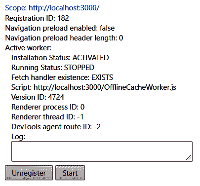

# Service Workers -缓存和使事情更快

到目前为止，我们只研究了专用的和共享的工作者，它们有助于将计算代价高昂的任务抛到后台。 我们甚至创建了一个利用`SharedWorker`的共享缓存。 现在，我们将了解一下 service worker，并了解如何使用它们来缓存资源(如 HTML、CSS、JavaScript 等)和数据，这样我们就不需要花费昂贵的往返服务器的时间。

在本章中，我们将涵盖以下主题:

*   理解 ServiceWorker
*   缓存页面和模板以便脱机使用
*   为以后保存请求

在本章结束时，我们将能够为 web 应用程序创建离线体验。

# 技术要求

对于本章，你将需要以下内容:

*   一个编辑器或 IDE，最好是 VS Code
*   铬
*   一个可以运行 Node.js 的环境
*   本章代码可在[https://github.com/PacktPublishing/Hands-On-High-Performance-Web-Development-with-JavaScript/tree/master/Chapter11](https://github.com/PacktPublishing/Hands-On-High-Performance-Web-Development-with-JavaScript/tree/master/Chapter11)中找到。

# 理解 ServiceWorker

一个`ServiceWorker`是一个代理，位于我们的 web 应用程序和服务器之间。 它捕获发出的请求，并检查是否有匹配的模式。 如果有匹配的模式，它就会运行符合该模式的代码。 为`ServiceWorker`编写代码与我们前面看到的`SharedWorker`和`DedicatedWorker`有一点不同。 最初，我们在一些代码中设置它，它自己下载。 我们有各种各样的事件来告诉我们工人所处的阶段。 它们的顺序如下:

1.  **下载**:域或子域的`ServiceWorker`正在自行下载。
2.  **安装**:`ServiceWorker`将自己附加到托管它的域或子域。
3.  **激活**:完全附加`ServiceWorker`并加载以拦截请求。

安装事件尤其重要。 这是我们可以监听更新的`ServiceWorker`的地方。 假设我们想为我们的`ServiceWorker`推出新代码。 如果当我们决定将代码推送到服务器时，用户还在页面上，那么他们仍然拥有旧的 worker。 有一些方法可以杀死这个旧的 worker 并强制它们更新(我们将在稍后看到)，但它仍然会使用旧的缓存。

在此之上，如果我们利用缓存来存储被请求的资源，它们将存储在旧缓存中。 如果我们要更新这些资源，那么我们需要确保转储以前的缓存，并从一个新的开始。 稍后我们将看到一个示例，但最好事先知道这一点。

最后，服务人员将每 24 小时更新一次自己，所以如果我们不强迫用户更新`ServiceWorker`，他们将在 24 小时内得到这个新副本。 这些都是我们在本章的例子中要记住的想法。 当我们写出来的时候，我们会提醒你们。

让我们从一个非常基本的例子开始。 遵循以下步骤:

1.  首先，我们需要一个静态服务器，以便与 service worker 一起工作。 为此，运行`npm install serve`并将以下代码添加到`app.js`文件中:

```js
const handler = require('serve-handler');
const http = require('http');
const server = http.createServer((req, res) => {
    return handler(req, res, {
        public : 'source'
    });
});
server.listen(3000, () => {
    console.log('listening at 3000');
});
```

2.  现在，我们可以从`source`目录提供所有内容。 创建一个基本的 HTML 页面，并将其加载到一个名为`BaseServiceWorker.js`的`ServiceWorker`中:

```js
<!DOCTYPE html>
<html>
    <head>
        <!-- get some resources -->
    </head>
    <body>
        <script type="text/javascript">
              navigator.serviceWorker.register('./BaseServiceWorker.js', 
             { scope : '/'})
            .then((reg) => {
                console.log('successfully registered worker');
            }).catch((err) => {
                console.error('there seems to be an issue!');
            })
        </script>
    </body>
</html>
```

3.  创建一个基本的`ServiceWorker`，每当请求发出时，它将记录到我们的控制台:

```js
self.addEventListener('install', (event) => {
    console.log('we are installed!');
});
self.addEventListener('fetch', (event) => {
    console.log('a request was made!');
    fetch(event.request);
});
```

我们应该在控制台中看到两条消息。 一个应该是静态的，说明我们已经正确地安装了所有东西，而另一个将说明我们已经成功地注册了一个 worker! 现在，让我们向 HTML 中添加一个 CSS 文件并为其提供服务。

4.  调用我们的新 CSS 文件`main.css`，并添加以下 CSS 到它:

```js
*, :root {
    margin : 0;
    padding : 0;
    font-size : 12px;
}
```

5.  将这个 CSS 文件添加到 HTML 页面的顶部。

使用此命令，重新加载页面并查看它在控制台上的状态。 注意，它并没有说明我们已经成功地发出了请求。 如果我们一直点击 reload 按钮，我们可能会在页面重新加载之前看到消息出现。 如果我们想看到这条消息，我们可以前往以下链接内的 Chrome 和检查的`ServiceWorker`，那是:`chrome://serviceworker-internals`。

我们可能会看到其他服务人员加入进来。 相当多的网站都这样做，这是一种缓存网页某些部分的技术。 我们将很快对此进行更详细的研究。 这就是为什么第一次加载对某些应用程序来说是相当痛苦的，以及为什么它们在加载之后似乎更快的原因。

当我们启动`ServiceWorker`时，页面顶部应该显示一个启动开发工具的选项。 请检查这个选项。 然后，停止/启动 worker。 现在，应该打开一个控制台，允许我们调试`ServiceWorker`:



虽然这对调试来说很好，但如果我们看一下我们启动这个行为的页面，我们会看到一个小窗口，它描述了类似于以下内容:

```js
Console: {"lineNumber":2,"message":"we are installed!","message_level":1,"sourceIdentifier":3,"sourceURL":"http://localhost:3000/BaseServiceWorker.js"}
```

它得到的 CSS 文件，每次我们重新加载页面! 如果我们再重载几次，就会有更多这样的消息。 这很有趣，但我们绝对可以做得更好。 让我们继续缓存我们的`main.css`文件。 在我们的`BaseServiceWorker.js`文件中添加以下内容:

```js
self.addEventListener('install', (event) => {
    event.waitUntil(
        caches.open('v1').then((cache) => {
            return cache.addAll([
                './main.css'
            ]);
        }).then(() => {
            console.log('we are ready!');
        })
    );
});
self.addEventListener('fetch', (event) => {
    event.respondWith(
        caches.match(event.request).then((response) => {
            return response || fetch(event.request);
        })
    )
});
```

这样，我们就引入了缓存。 这个缓存将为我们获取各种资源。 除了这个缓存，我们还引入了事件的`waitUntil`方法。 这使得我们可以等待`ServiceWorker`的初始化，直到我们从服务器获取了所有我们想要的数据。 在 fetch 处理程序中，我们现在检查缓存中是否有资源。 如果找到了，我们就把那份文件送上去; 否则，我们只会代表页面发出获取请求。

现在，如果我们加载页面，我们会注意到我们只有`we are ready`消息。 即使我们有了新的代码，这个页面已经被 Chrome 缓存了，所以它并没有放弃旧的 service worker。 要强制添加新的 service worker，我们可以进入开发人员控制台，进入 Application 选项卡。 然后，我们可以去左边的面板，并前往`ServiceWorker`部分。 应该有一个时间轴，说明有一个`ServiceWorker`等待被激活。 如果我们点击旁边写着“skipWaiting”的文本，我们就可以激活新代码。

继续并点击这个选项。 它看起来不像是发生了什么，但如果我们返回到`chrome://serviceworker-internals`页面，我们将看到有一条消息。 如果我们继续重新加载页面，我们将看到我们只有一条消息。 这意味着我们已经加载了新代码!

另一种检查我们是否成功缓存了`main.css`文件的方法是降低应用程序的下载速度(特别是我们在本地托管它)。 回到开发人员工具并单击 Network 选项卡。 在禁用缓存选项附近应该有一个网络速度的下拉菜单。 目前，它应该说明我们在线。 继续并将其离线:


我们的页面丢了! 在`BaseServiceWorker.js`的内部，我们应该增加以下内容:

```js
caches.open('v1').then((cache) => {
    return cache.addAll([
        './main.css',
        '/'
    ]);
})
```

现在，我们可以将我们的应用程序再次在线，并让这个新的`ServiceWorker`自己添加到页面中。 添加后，继续并将应用程序离线。 现在，页面离线工作! 我们将在后面更详细地探讨这个想法，但这让我们对这个功能有了一个很好的预览。

简单介绍一下`ServiceWorker`和缓存机制，让我们将注意力转向缓存页面，并在`ServiceWorker`中添加一些模板功能。

# 缓存页面和模板以便脱机使用

正如我们在本章开始时所述，service worker 的主要用途之一是缓存页面资源以供将来使用。 我们在第一个简单的`ServiceWorker`中看到了这一点，但我们应该设置一个更复杂的页面，包含更多的资源。 遵循以下步骤:

1.  创建一个全新的`ServiceWorker`，称为`CacheServiceWorker.js`，并添加以下模板代码。 这是大多数`ServiceWorker`实例将使用的:

```js
self.addEventListener('install', (event) => {
    event.waitUntil(
        caches.open('v1').then((cache) => {
            return cache.addAll([
                // add resources here
            ]);
        }).then(() => {
            console.log('we are ready!');
        })
    );
});
self.addEventListener('fetch', (event) => {
    event.respondWith(
        caches.match(event.request).then((response) => {
            return response || fetch(event.request);
        })
    )
});
```

2.  更新我们的`index.html`文件，以利用这个新的`ServiceWorker`:

```js
navigator.serviceWorker.register('./CacheServiceWorker.js', { scope : '/'})
    .then((reg) => {
        console.log('successfully registered worker');
    }).catch((err) => {
        console.error('there seems to be an issue!', err);
    })
```

3.  现在，让我们向页面添加一些按钮和表格。 我们将很快使用这些工具:

```js
<button id="addRow">Add</button>
<button id="remove">Remove</button>
<table>
    <thead>
        <tr>
            <th>Id</th>
            <th>Name</th>
            <th>Description</th>
            <th>Points</th>
        </tr>
    </thead>
    <tbody id="tablebody">
    </tbody>
</table>
```

4.  添加一个 JavaScript 文件，将处理我们与`interactions.js`页面的所有交互:

```js
const add = document.querySelector('#addRow');
const remove = document.querySelector('#remove');
const tableBody = document.querySelector('#tablebody');
add.addEventListener('click', (ev) => {
    fetch('/add').then((res) => res.json()).then((fin) =>
     tableBody.appendChild(fin));
});
remove.addEventListener('click', (ev) => {
    while(tableBody.firstChild) {
        tableBody.removeChild(tableBody.firstChild);
    }
});
```

5.  添加 JavaScript 文件到我们的`ServiceWorker`作为预加载:

```js
caches.open('v1').then((cache) => {
    return cache.addAll([
        '/',
        './interactions.js',
        './main.css'
    ]);
}).then(() => {
    console.log('we are ready!');
})
```

6.  将 JavaScript 文件添加到我们的`index.html`文件底部:

```js
<script src="interactions.js" type="text/javascript"></script>
```

现在，如果我们加载页面，我们应该会看到一个简单的表格，其中有一个标题行和一些按钮。 让我们继续，并添加一些基本样式到我们的页面，使它更容易看到。 在我们使用`BaseServiceWorker`时添加的`main.css`文件中添加以下内容:

```js
table {
    margin: 15px;
    border : 1px solid black;
}
th {
    border : 1px solid black;
    padding : 2px;
}
button {
    border : 1px solid black;
    padding :5px;
    background : #2e2e2e;
    color : #cfcfcf;
    cursor : pointer;
    margin-left : 15px;
    margin-top : 15px;
}
```

这个 CSS 为我们提供了一些基本的样式。 现在，如果我们点击 Add 按钮，我们应该会看到以下消息:

```js
The FetchEvent for "http://localhost:3000/add" resulted in a network error response: the promise was rejected.
```

因为我们没有添加任何代码来实际处理这个，让我们继续并在我们的`ServiceWorker`中拦截这个消息。 遵循以下步骤:

1.  为`ServiceWorker`添加以下假代码到`fetch`事件处理程序:

```js
event.respondWith(
    caches.match(event.request).then((response) => {
        if( response ) {
            return response
        } else {
            if( event.request.url.includes("/add") ) {
                return new Response(new Blob(["Here is some data"], 
                    { type : 'text/plain'}),
                    { status : 200 });
            }
            fetch(event.request);
        }
    })
)
```

2.  单击 Add 按钮。 我们应该会看到一个新的错误，说明它无法解析 JSON 消息。 更改`Blob`数据为一些 JSON:

```js
return new Response(new Blob([JSON.stringify({test : 'example', stuff : 'other'})], { type : 'application/json'}), { status : 200 });
```

3.  再次单击 Add 按钮。 我们应该得到一些声明我们刚刚传递给处理器的不是`Node`类型的东西。 解析我们在 Add 按钮的点击处理程序中得到的数据:

```js
fetch('/add').then((res) => res.json()).then((fin) =>  {
    const tr = document.createElement('tr');
    tr.innerHTML = `<td>${fin.test}</td>
                    <td>${fin.stuff}</td>
                    <td>other</td>`;
    tableBody.appendChild(tr);
});
```

现在，如果我们尝试运行我们的代码，我们将看到一些有趣的事情:我们的 JavaScript 文件仍然是旧代码。 `ServiceWorker`正在利用我们的旧缓存。 我们有两种选择。 首先，我们可以关闭`ServiceWorker`。 或者，我们可以删除旧的缓存，并用新的缓存替换它。 我们将执行第二种选择。 要做到这一点，我们需要将以下代码添加到安装监听器中的`ServiceWorker`中:

```js
event.waitUntil(
    caches.delete('v1').then(() => {
        caches.open('v1').then((cache) => {
            return cache.addAll([
                '/',
                './interactions.js',
                './main.css'
            ]);
        }).then(() => {
            console.log('we are ready!');
        });
    })
);
```

现在，我们可以将模板加载到前端代码中，但我们将在这里模拟一个服务器端渲染系统。 有一些应用程序是这样做的，但我想到的主要应用程序是我们正在开发中尝试的一个模板系统。

在使用模板系统之前，大多数模板系统都需要编译成最终的 HTML 格式。 我们可以设置一个*观察*类型的系统，每次更新模板时都会重新加载模板，但这可能会变得很烦人，尤其是当我们只想专注于前端时。 另一种方法是将这些模板加载到我们的`ServiceWorker`中，并让它渲染它们。 这样，当我们想要进行更新时，我们只需通过`caches.delete`方法删除缓存，然后重新加载它。

让我们继续，并建立一个简单的例子，就像前面的一个，但不是在我们的前端代码中创建模板，我们将它在我们的`ServiceWorker`。 遵循以下步骤:

1.  创建一个名为`row.template`的模板文件，用以下代码填充它:

```js
<td>${id}</td>
<td>${name}</td>
<td>${description}</td>
<td>${points}</td>
```

2.  删除我们的`interactions.js`中的模板代码，并替换为以下代码:

```js
fetch('/add').then((res) => res.text()).then((fin) =>  {
    const row = document.createElement('tr');
    row.innerHTML = fin;
    tableBody.appendChild(row);
});
```

3.  让我们设置一些基本的模板代码。 我们将不做任何接近我们在[第九章](09.html)，*实际示例-建立一个静态服务器*。 相反，我们将循环遍历传递给我们的对象，并填充模板中键在对象中对齐的部分:

```js
const renderTemplate = function(template, obj) {
    const regex = /\${([a-zA-Z0-9]+)\}/;
    const keys = Object.keys(obj);
    let match = null;
    while(match = regex.exec(template)) {
        const key = match[1];
        if( keys.includes(key) ) {
            template = template.replace(match[0], obj[key]);
        } else {
            match = null;
        }
    }
    return template;
}
```

4.  使用以下代码更改对`/add`端点的响应:

```js
if( event.request.url.includes('/add') ) {
    return fetch('./row.template')
        .then((res) => res.text())
        .then((template) => {
            return new Response(new Blob([renderTemplate(template, 
             add)],{type : 'text/html'}), {status : 200});   
        })
} else if( response ) {
    return response
} else {
    return fetch(event.request);
}
```

现在，我们将从服务器获取我们想要的模板(在我们的例子中，是`row.template`文件)，并使用我们拥有的任何数据填充它(同样，在我们的例子中，我们将使用存根数据)。 现在，我们在`ServiceWorker`中有了模板，可以很容易地设置端点来通过这个模板系统。

当我们想要个性化网站的错误页面时，这也很有用。 如果我们想要一个随机图像出现在我们的 404 页面，我们可以在`ServiceWorker`中完成，而不是点击这个服务器。 我们甚至可以在离线状态下这样做。 我们只需要实现与这里相同类型的模板。

有了这些概念，就很容易看到我们拦截请求时的能力，以及我们如何使 web 应用程序离线工作。 我们将要学习的最后一项技术是，当我们离线时存储我们的请求，当我们重新上线时运行它们。 这种技术可以用于从浏览器中保存或加载文件。 让我们来看看。

# 为以后保存请求

到目前为止，我们已经学习了如何拦截请求并返回甚至增强本地系统的响应。 现在，我们将学习如何在脱机模式下保存请求，并在出现在线状态时将调用发送到服务器。

让我们为它建立一个新文件夹。 遵循以下步骤:

1.  创建一个名为`offline_storage`的文件夹，并添加以下文件:

*   `index.html`
*   `main.css`
*   `interactions.js`
*   `OfflineServiceWorker.js`

2.  添加以下样板代码到`index.html`:

```js
<!DOCTYPE html>
<html>
    <head><!-- add css file --></head>
    <body>
        <h1>Offline Storage</h1>
        <button id="makeRequest">Request</button>
        <table>
            <tbody id="body"></tbody>
        </table>
        <p>Are we online?: <span id="online">No</span>
        <script src="interactions.js"></script>
        <script>
            let online = false;
            const onlineNotification =  
             document.querySelector('#online');
            window.addEventListener('load', function() {
                const changeOnlineNotification = function(status) {
                    onlineNotification.textContent = status ? "Yes" 
                     : "No";
                    online = status;
                }
                changeOnlineNotification(navigator.onLine);
                 navigator.serviceWorker.register('.
                 /OfflineCacheWorker.js', {scope : '/'})
                window.addEventListener('online', () => {
                 changeOnlineNotification(navigator.onLine) });
                window.addEventListener('offline', () => {
                 changeOnlineNotification(navigator.onLine) });
            });
        </script>
    </body>
</html>
```

3.  添加以下样板代码到`OfflineServiceWorker.js`:

```js
self.addEventListener('install', (event) => {
    event.waitUntil(   
     // normal cache opening
    );
});
self.addEventListener('fetch', (event) => {
    event.respondWith(
        caches.match(event.request).then((response) => {
            // normal response handling
        })
    )
});
```

4.  最后，将以下样板代码添加到`interactions.js`中:

```js
const requestMaker = document.querySelector('#makeRequest');
const tableBody = document.querySelector('#body');
requestMaker.addEventListener('click', (ev) => {
    fetch('/request').then((res) => res.json()).then((fin) => {
        const row = document.createElement('tr');
        row.innerHTML = `
        <td>${fin.id}</td>
        <td>${fin.name}</td>
        <td>${fin.phone}</td>
        <td><button id=${fin.id}>Delete</button></td>
        `
        row.querySelector('button').addEventListener('click', (ev) 
         => {
            fetch(`/delete/${ev.target.id}`).then(() => {
                tableBody.removeChild(row);
            });
        });
        tableBody.appendChild(row);
    })
})
```

所有这些代码就绪后，让我们继续更改 Node.js 服务器，以便它指向这个新文件夹位置。 我们将停止我们的旧服务器，并改变`app.js`文件，以便它指向我们的`offline_storage`文件夹:

```js
const server = http.createServer((req, res) => {
    return handler(req, res, {
        public : 'offline_storage'
    });
});
```

这样，我们可以通过运行`node app.js`来重新运行服务器。 我们可能会体验到旧页面的出现。 如果是这种情况，我们可以转到开发人员工具中的 Application 选项卡，并单击 Service workers 部分下的 Unregister 选项。 一旦我们重新加载页面，我们应该看到新的`index.html`页面显示。 我们的处理程序目前不工作，所以让我们在`ServiceWorker`中添加一些存根代码，它将处理我们在`interactions.js`中添加的两个取回情况。 遵循以下步骤:

1.  在 fetch 事件处理程序中为请求添加以下支持:

```js
caches.match(event.request).then((response) => {
    if( event.request.url.includes('/request') ) {
        return handleRequest();
    }
})
// below in the global scope of the ServiceWorker
let counter = 0;
let name = 65;
const handleRequest = function() {
    const data = {
        id : counter,
        name : String.fromCharCode(name),
        phone : Math.round(Math.random() * 10000)
    }
    counter += 1;
    name += 1;
    return new Response(new Blob([JSON.stringify(data)], {type : 
     'application/json'}), {status : 200});
}
```

2.  让我们确保这段代码正确地处理响应，确保它向我们的表中添加一行。 重新加载页面，并确保当我们单击 Request 按钮时添加了新行:


3.  现在我们已经确保了该处理程序正在工作，让我们继续为 delete 请求添加另一个处理程序。 我们将在我们的`ServiceWorker`中模拟一个服务器上的数据库删除:

```js
caches.match(event.request).then((response) => {
    if( event.request.url.includes('/delete') ) {
        return handleDelete(event.request.url);
    }
})
// place in the global scope of the Service Worker
const handleDelete = function(url) {
    const id = url.split("/")[2];
    return new Response(new Blob([id], {type : 'text/plain'}), 
     {status : 200});
}
```

4.  有了这个，让我们继续并测试它，以确保当我们单击 Delete 按钮时，我们的行被删除了。 如果所有这些都能正常工作，我们将拥有一个功能强大的应用程序，可以在线或离线工作。

现在，我们需要做的就是添加对那些将要发出但由于我们当前离线而不能发出的请求的支持。 为此，我们将请求存储在一个数组中，一旦我们在`ServiceWorker`中检测到我们已恢复在线，我们将发送所有请求。 我们还将添加一些支持，让我们的前端知道我们正在等待这么多请求，如果我们想，我们可以取消它们。 现在让我们添加这个:

在 Chrome 中，从离线切换到在线将触发我们的**在线**处理程序，但从在线切换到离线似乎不会触发事件。 我们可以测试脱机到在线的系统功能，但是反过来测试就有点困难了。 请注意，这种限制可能存在于许多开发系统中，试图解释这一点可能非常困难。

1.  首先，将大部分的`caches.match`代码移到一个独立的函数中，如下所示:

```js
caches.match(event.request).then((response) => {
    if( response ) {
        return response
    }
    return actualRequestHandler(event);
})
```

2.  编写独立函数，如下:

```js
const actualRequestHandler = function(req) {
    if( req.request.url.includes('/request') ) {
        return handleRequest();
    }
    if( req.request.url.includes('/delete') ) {
        return handleDelete(req.request.url);
    }
    return fetch(req.request);
}
```

3.  我们将通过投票来处理请求，看看我们是否恢复在线。 设置一个每 30 秒工作一次的轮询计时器，并更改我们的`caches.match`处理程序，如下所示:

```js
const pollTime = 30000;
self.addEventListener('fetch', (event) => {
    event.respondWith(
        caches.match(event.request).then((response) => {
            if( response ) {
                return response
            }
            if(!navigator.onLine ) {
                return new Promise((resolve, reject) => {
                    const interval = setInterval(() => {
                        if( navigator.onLine ) {
                            clearInterval(interval);
                            resolve(actualRequestHandler(event));
                        }
                    }, pollTime)
                })
            } else {
                return actualRequestHandler(event);
            }
        })
    )
});
```

我们刚才所做的是建立了一个对承诺的回报机制。 如果我们不能看到系统在线，我们将保持每 30 秒投票，看看我们是否重新在线。 一旦我们恢复在线，我们的 promise 将清除 interval 并在 resolve 处理程序中实际处理请求。 在我们取消请求之前，我们可以设置一个有很多尝试的系统。 我们所要做的就是在间隔中这么多次之后添加一个拒绝处理程序。

最后，我们将添加一种方法来停止所有当前未完成的请求。 要做到这一点，我们需要一种方法来跟踪我们是否有未完成的请求，并在`ServiceWorker`中终止它们。 这将非常简单，因为我们可以很容易地跟踪前端中仍在等待的内容。 我们可以通过以下方式添加它:

1.  首先，我们将在前端添加一个显示有多少未处理请求的显示。 我们将把这个放在我们的在线状态系统后面:

```js
// inside of our index.html
<p>Oustanding requests: <span id="outstanding">0</span></p>

//inside our interactions.js
const requestAmount = document.querySelector('#outstanding');
let numRequests = 0;
requestMaker.addEventListener('click', (ev) => {
    numRequests += 1;
    requestAmount.textContent = numRequests;
    fetch('/request').then((res) => res.json()).then((fin) => {
        // our previous fetch handler
        numRequests -= 1;
        requestAmount.textContent = numRequests;
    });
    // can be setup for delete requests also
});
```

2.  添加一个按钮，将取消所有未完成的请求到我们的`index.html`文件。 另外，添加相应的 JavaScript 代码到我们的`interactions.js`文件:

```js
//index.html
<button id="stop">Stop all Pending</button>

//interactions.js
const stopRequests = document.querySelector('#stop');
stopRequests.addEventListener('click', (ev) => {   
    fetch('/stop').then((res) => {
        numRequests = 0;
        requestAmount.textContent = numRequests;
    });
});
```

3.  为停止请求添加相应的处理程序到我们的`ServiceWorker`:

```js
caches.match(event.request).then((response) => {
    if( response ) {
        return response
    }
    if( event.request.url.includes('/stop') ) {
        controller.abort();
        return new Response(new Blob(["all done"], {type :
        'text/plain'}), {status : 200});
    }
    // our previous handler code
})
```

现在，我们将使用一个叫做`AbortController`的东西。 这个系统允许我们发送信号到取回请求这样我们就可以说我们想要停止挂起的请求。 虽然这个系统主要用于停止获取请求，但我们实际上可以利用这个信号来停止任何异步请求。 我们通过创建一个`AbortController`并从中获取信号来做到这一点。 然后，在承诺内部，我们监听信号上的中止事件并拒绝承诺。

4.  添加`AbortController`，如下:

```js
const controller = new AbortController();
const signal = controller.signal;
const pollTime = 30000;
self.addEventListener('fetch', (event) => {
    event.respondWith(
        caches.match(event.request).then((response) => {
            if( response ) {
                return response
            }
            if( event.request.url.includes('/stop') ) {
                controller.abort();
                return new Response(new Blob(["all done"], {type :
                'text/plain'}), {status : 200});
            }
            if(!navigator.onLine ) {
                return new Promise((resolve, reject) => {
                    const interval = setInterval(() => {
                        if( navigator.onLine ) {
                            clearInterval(interval);
                            resolve(actualRequestHandler(event));
                        }
                    }, pollTime)
                    signal.addEventListener('abort', () => {
                        reject('aborted');
                    })
                });
            } else {
                return actualRequestHandler(event);
            }
        })
    )
});
```

现在，如果我们进入我们的系统，在脱机模式下准备一些请求，然后点击取消按钮，我们会看到所有的请求都被取消了! 我们可以把`AbortController`放在我们的前端`interactions.js`文件的 fetch 请求上，但是一旦我们回到联机，所有的 promise 仍然会运行，所以我们想要确保没有任何东西在运行。 这就是为什么我们把它放在`ServiceWorker`里。

通过这样做，我们不仅可以通过缓存请求的数据来处理请求，而且还可以在位置不稳定时存储这些请求。 在此之上，我们已经看到了如何利用`AbortController`来停止等待的承诺，以及如何利用它们而不仅仅是停止获取请求。

# 总结

在这一章中，我们学习了服务工作者如何将我们的应用程序从始终在线转变为我们可以创建真正的*始终工作*应用程序的系统。 通过保存状态、本地处理请求、本地丰富请求，甚至为脱机使用保存请求，我们能够处理应用程序的完整状态。

现在我们已经看了创建丰富的 web 应用程序的客户端和服务器端 JavaScript,我们将开始看看一些先进的技术,我们可以使用它来创建高性能的应用程序,我们只认为是可能通过本机应用程序代码。 我们可以利用 C、c++或 Rust 来实现这一点。

然而，在此之前，应用程序开发人员经常忽略的一个部分是部署过程。 在下一章中，我们将介绍一种通过一个名为 CircleCI 的流行系统来设置**持续集成和**(**CI**/**CD**)持续开发的方法。