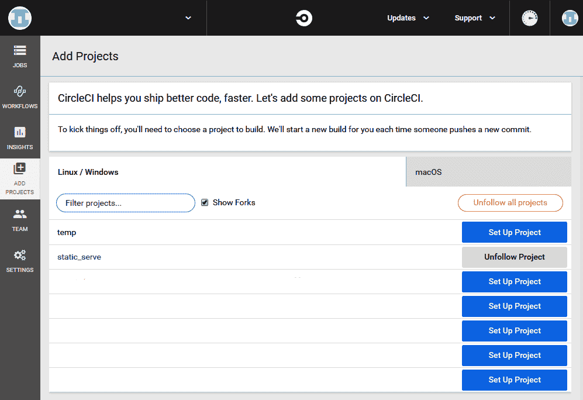

# 构建和部署一个完整的 Web 应用

现在我们已经看到了 JavaScript 的服务器端和客户端代码，我们需要完全关注另一个问题; 也就是说，构建用于部署的代码，并将该代码部署到服务器。

虽然我们已经在本地运行了服务器，但我们从来没有在远程环境中实际运行过它们，比如亚马逊的 AWS 或微软的 Azure。 今天的部署不像 5 年前那样了。 以前，我们可以通过**文件传输协议**(**FTP**)将应用移动到服务器上。 现在，即使对于小型应用，我们也使用持续部署系统。

在本章中，我们将探讨以下主题:

*   理解汇总
*   融入 CircleCI

这些主题将允许我们开发几乎任何应用，并将其部署到典型的开发环境中。 在本章结束时，我们将能够为 web 应用实现一个典型的构建和部署环境。

让我们开始吧。

# 技术要求

对于本章，你将需要以下内容:

*   可以运行 Node.js 的机器
*   一个文本编辑器或 IDE，最好是 VS Code
*   一个 web 浏览器
*   GitHub 的用户帐户
*   本章代码可在[https://github.com/PacktPublishing/Hands-On-High-Performance-Web-Development-with-JavaScript/tree/master/Chapter12](https://github.com/PacktPublishing/Hands-On-High-Performance-Web-Development-with-JavaScript/tree/master/Chapter12)中找到。

# 理解汇总

RollupJS 是一个构建工具，它允许我们根据环境以不同的方式准备应用。 在它之前已经有许多工具(Grunt、Gulp)，许多是它的竞争对手(Webpack、Parcel)，还有许多将在未来构建。 我们将关注 RollupJS 特定用例(让我们的静态服务器应用建立在[第 9 章](09.html),*实例——建立一个静态服务器*),但是请注意,大多数构建工具的体系结构是相似的。

RollupJS 提供给我们的是一种将*与*挂钩到构建生命周期的不同部分的方法。 大多数应用在构建过程中有以下状态:

*   建立开始
*   依赖注入
*   编译
*   后编译
*   构建结束

这些状态在不同的构建系统中可能有不同的名称，有些甚至可能有更多的名称(正如我们将看到的那样，RollupJS)，但这是典型的构建系统。

在大多数情况下，我们需要为我们的 JavaScript 应用做以下事情:

*   引入节点/浏览器端需要的任何依赖项
*   编译我们的 JavaScript 到一个文件(如果目标是 HTTP/1)或编译到一个更早的版本(如果我们的目标是更广泛的浏览器支持)
*   将 CSS 编译为单个文件，移动图像，等等

在我们的应用中，我们将使这一点变得非常简单。 在这里，我们将学习如何做到以下几点:

*   将我们的 Node.js 代码构建成一个单独的可分发文件
*   准备我们的静态资产，如 CSS/图像
*   将 Rollup 添加到 npm 构建过程中

# 将我们的静态服务器构建为一个单独的可分发服务器

首先，我们需要创建一个准备使用的文件夹。 要做到这一点，要么在我们在[第 9 章](09.html)，*实际示例-构建静态服务器*的文件夹中工作，要么从本书的 GitHub 存储库中拉下代码。 运行`npm install -g rollup`命令。 这将把汇总系统放到全局路径中，以便我们可以通过运行`rollup`命令来利用命令行。 接下来，我们将创建一个配置文件。 为了做到这一点，我们将添加一个`rollup.config.js`文件到我们的目录的基础(与我们的`package.json`文件完全相同的位置)，并添加以下代码:

```js
module.exports = {
    input: "./main.js",
    output: {
        file: "./dist/build.js",
        format: "esm"
    }
}
```

我们已经告诉 Rollup，应用的起始点在`main.js`文件中。 Rollup 将遵循这个起点并遍历它，以查看它依赖于什么。 无论它依赖于什么，它都会尝试将其放入单个文件中，并在此过程中删除任何不需要的依赖项(这称为摇树)。 一旦完成，它将把文件放入`dist/build.js`。

如果我们试图运行这个，我们会遇到问题。 在这里，我们为类使用私有变量，而 Rollup 不支持这一点，以及我们正在使用的 ESNext 的其他特性。 我们还需要更改在函数外部设置成员变量的任何地方。 这意味着我们需要将`cache.js`改为:

```js
export default class LRUCache {
    constructor(num=10) {
        this.numEntries = num;
        this.cache = new Map();
    }
}
```

我们还需要替换`template.js`中的所有构造函数，就像我们在`LRUCache`中所做的那样。

在做了上述更改之后，我们应该看到`rollup`对我们很满意，现在正在编译。 如果我们进入`dist/build.js`文件，我们会看到它把所有的文件放在一起。 让我们继续在配置文件中添加另一个选项。 遵循以下步骤:

1.  运行以下命令将 minifier 和 code uglifier 插件添加到 Rollup 作为一个 dev 依赖项:

```js
> npm install -D rollup-plugin-terser
```

2.  安装后，在我们的`config.js`文件中添加以下几行:

```js
import { terser } from 'rollup-plugin-terser';
module.exports = {
    input: "./main.js",
    output: {
        file: "./dist/build.js",
        format: "esm",
        plugins: [terser()]
    }
}
```

现在，如果我们看一下我们的`dist/build.js`文件，我们会看到一个几乎不值得注意的文件。 这就是我们的应用的 Rollup 配置所需要的全部内容，但是还有许多配置选项和插件可以帮助编译过程。 接下来，我们将了解一些选项，这些选项可以帮助我们将 CSS 文件转换成更小的格式，还将了解如果使用 Sass 会发生什么，以及如何使用 Rollup 编译它。

# 向我们的分发版添加其他文件类型

目前，我们只打包我们的 JavaScript 文件，但大多数应用开发人员都知道任何前端工作也需要打包。 以 Sass([https://sass-lang.com/](https://sass-lang.com/))为例。 它允许我们以一种允许最大重用性的方式来编写 CSS。

让我们继续，把这个项目的 CSS 变成一个 Sass 文件。 遵循以下步骤:

1.  创建一个名为`stylesheets`的文件夹，并将`main.scss`添加到其中。
2.  在我们的 Sass 文件中添加以下代码:

```js
$main-color: "#003A21";
$text-color: "#efefef";
/* header styles */
header {
    // removed for brevity
    background : $main-color;
    color      : $text-color;
    h1 {
        float : left;
    }
    nav {
        float : right;
    }
}
/* Footer styles */
footer {
    // removed for brevity
    h2 {
        float : left;
    }
    a {
        float : right;
    }
}
```

前面的代码展示了 Sass 的两个特性，使它更容易使用:

*   它允许我们嵌套样式。 不必有单独的`footer`和`h2`部分，我们可以直接嵌套它们。
*   它允许使用变量(是的，我们在 CSS 中有它们)。

With HTTP/2, some standards for bundling files have gone by the wayside. Items such as sprite sheets are no longer advisable since the HTTP/2 standard added the concept of TCP multiplexing. It can actually be faster to download multiple smaller files than one large file. For those of you who are interested, the following link explains these concepts in more detail: [https://css-tricks.com/musings-on-http2-and-bundling/](https://css-tricks.com/musings-on-http2-and-bundling/).

在 Sass 的网站上可以找到更多的东西，比如 mixin，但在这里，我们想重点把这些文件转换成我们知道可以在前端使用的 CSS。

现在，我们需要把它转换成 CSS，并把它放到原始文件夹中。 为此，我们将在配置中添加`rollup-plugin-sass`。 我们可以通过运行`npm install -D rollup-plugin-sass`来实现。 添加后，我们将添加一个名为`rollup.sass.config.js`的新汇总配置，并添加以下代码:

```js
import sass from 'rollup-plugin-sass';
module.exports = {
    input: "./main-sass.js",
    output: {
        file: "./template/css/main.css",
        format: "cjs"
    },
    plugins: [
        sass()
    ]
}
```

一旦我们完成了我们的汇总文件，我们将需要创建我们当前拥有的`main-sass.js`文件。 让我们继续这样做。 将以下代码添加到该文件中:

```js
import main_sass from './template/stylesheets/main.scss'
export default main_sass;
```

现在，让我们运行以下命令:

```js
> rollup --config rollup.sass.config.js 
```

通过这样做，我们将看到模板文件夹中的`css`目录已经被填充。 通过这样做，我们可以看到如何捆绑所有东西，而不仅仅是我们的 JavaScript 文件。 现在我们已经将 Rollup 的构建系统集成到我们的开发管道中，接下来我们将看看如何将 Rollup 集成到 NPM 的构建管道中。

# 将 rollup 引入 Node.js 命令中

现在，我们可以让一切都保持原样，通过命令行运行 rollup 命令，但是当我们将持续集成引入流程时(下一节)，这可能会让事情变得更加困难。 此外，我们可能让其他开发人员在同一个系统上工作，而不是让他们运行多个命令，他们可以运行一个单独的`npm`命令。 相反，我们希望将 rollup 集成到各种 Node.js 脚本中。

我们在[第 9 章](09.html)，*实际示例-建立一个静态服务器*，使用`microserve`包和`start`命令。 但是现在，我们想要集成两个新的命令`build`和`watch`。

首先，我们希望使用`build`命令来运行我们的汇总配置。 按照以下步骤来实现:

1.  让我们清理主目录，并将汇总配置移动到构建目录。
2.  随着这两个文件的移动，我们将添加以下一行到我们的`package.json`文件:

```js
"scripts": {
        "start": "node --experimental-modules main.js",
        "build": "rollup --config ./build/rollup.config.js && rollup --config ./build/rollup.sass.config.js",
}
```

3.  通过这个动作，我们可以运行`npm run build`，并在单个命令中查看为我们构建的所有内容。

其次，我们想要添加一个 watch 命令。 这将允许 rollup 监视更改并立即为我们运行该脚本。 我们可以很容易地将它添加到我们的`package.json`，通过添加以下行到我们的`scripts`部分:

```js
"watch": "rollup --config ./build/rollup.config.js --watch"
```

现在，如果我们输入`npm run watch`，它将在观看模式下开始上卷。 这样，当我们对 JavaScript 文件进行更改时，可以看到 rollup 会自动重新构建发行版文件。

在继续进行持续集成之前，我们需要做的最后一个更改是将我们的主入口点指向我们的发行版文件。 为了做到这一点，我们将改变`package.json`文件的开始部分，使其指向`dist/build.js`:

```js
"start": "node --experimental-modules dist/build.js"
```

接下来，让我们通过运行`npm run start`来检查以确保一切仍然正常工作。 我们将看到一些文件没有指向正确的位置。 让我们通过对`package.json`文件做一些修改来修复这个问题:

```js
"config": {
    "port": 50000,
    "key": "../selfsignedkey.pem",
    "certificate": "../selfsignedcertificate.pem",
    "template": "../template",
    "bodyfiles": "../publish",
    "development": true
}
```

有了这个，我们就可以出发了! Rollup 有很多选项，当我们想要集成到 Node 脚本系统时，还有更多选项，但这应该为本章的下一节做好了准备，即集成到 CI/CD 管道中。 我们的选择系统是 CircleCI。

# 融入 CircleCI

正如我们前面提到的，现实世界的发展在过去几十年发生了巨大的变化。 从在本地构建一切并从我们的开发机器部署到复杂的编配和依赖部署树，我们已经看到了帮助我们快速开发和部署的工具的崛起。

这方面的一个例子是我们现有的 CI/CD 工具，如 Jenkins、Travis、Bamboo 和 circlici。 这些工具可以利用各种钩子，比如将代码推送到远程存储库，并立即运行*构建*。 我们将使用 CircleCI 作为我们选择的工具。 它易于设置，是一个易于使用的开发工具，为开发人员提供了一个不错的免费层。

在我们的例子中，这个构建将做以下三件事:

1.  导入我们所有的项目依赖项
2.  运行我们的 Node.js 构建脚本
3.  将这些资源部署到服务器，我们将在服务器上运行应用

完成所有这些设置可能是相当令人沮丧的体验，但一旦我们的应用连接起来，这是值得的。 我们将利用以下技术来帮助我们完成这一过程:

*   CircleCI
*   GitHub

考虑到这一点，我们的第一步将是去 GitHub 并创建一个配置文件，如果我们还没有这样做。 这就像去[https://github.com/](https://github.com/)和寻找右上角的注册选项一样简单。 完成这些之后，就可以开始创建/fork 存储库了。

由于本书的所有代码都在 GitHub 上，大多数人应该已经有一个 GitHub 帐户，并知道使用 Git 的基础知识。

对于那些正在努力使用 Git 或者没有使用版本控制系统的人来说，以下资源可能会有所帮助:[https://try.github.io/](https://try.github.io/)。

现在，我们需要将所有代码所在的存储库分叉到我们自己的存储库中。 要做到这一点，运行以下步骤:

1.  到本书的 GitHub 库[https://github.com/PacktPublishing/Hands-On-High-Performance-Web-Development-with-JavaScript](https://github.com/PacktPublishing/Hands-On-High-Performance-Web-Development-with-JavaScript)，点击右上角的选项，fork 整个库。

如果不想这样做，可以将存储库克隆到本地计算机上。 (这可能是更好的选择，因为我们只需要`Chapter12`目录的内容。)

2.  无论我们选择哪一个选项，继续并将`Chapter12`目录移动到本地计算机的另一个位置，并将文件夹名称更改为`microserve`之类的东西。
3.  回到 GitHub 并创建一个新的存储库。 让它成为一个私有存储库。
4.  最后，回到我们的本地机器，用以下命令删除已经存在的`.git`文件:

```js
> rf -rf .git
```

对于那些使用 Windows 的用户，如果你有 Windows 10 Linux 子系统，你可以运行这些命令。 您也可以下载 Cmder 工具:[https://cmder.net/](https://cmder.net/)。

5.  运行以下命令将本地系统连接到远程 GitHub 存储库:

```js
> git init
> git add .
> git commit -m "first commit"
> git remote add origin 
  https://github.com/<your_username>/<the_repository>.git
> git push -u origin master
```

6.  命令行将请求一些凭据。 用我们建立个人资料的那些。

我们的本地文件应该连接到 GitHub。 现在我们要做的就是用 circlici 建立这个系统。 为此，我们需要在 CircleCI 的网站上创建一个账户。

7.  登录[https://circleci.com/](https://circleci.com/)，点击“注册”，然后在 GitHub 注册。

一旦我们的帐户连接上，我们就可以登录了。 我们应该看到如下画面:



8.  单击刚刚设置的存储库的 Set Up Project。

它应该检测到我们的存储库中已经有一个 CircleCI 文件，但是如果我们愿意，我们总是可以从头开始。 下面的说明将用于从头开始设置 circli。 为此，我们可以利用他们拥有的 Node.js 模板。 但是，我们需要做的主要事情是创建`.circleci`目录和该目录中的`config.yml`文件。 我们应该有一些基本的东西，看起来像这样:

```js
version: 2
jobs:
  build:
    docker:
      - image: circleci/node:12.13
    working_directory: ~/repo
    steps:
      - checkout
      - restore_cache:
          keys:
            - v1-dependencies-{{ checksum "package.json" }}
            - v1-dependencies-
      - run: npm install
      - save_cache:
          paths:
            - node_modules
          key: v1-dependencies-{{ checksum "package.json" }}
```

CircleCI 配置文件的执行方式如下:

1.  我们声明我们想利用来自 Docker 的`circleci/node:12.13`图像

We won't be discussing Docker here, but it is yet another technology that many companies use to deploy and host applications. More information on this technology can be found here: [https://docs.docker.com/](https://docs.docker.com/).

2.  我们希望在`~/repo`中运行所有的命令。 这几乎适用于我们创建的所有基本项目。
3.  接下来，我们将存储库签入`~/repo`。
4.  现在，我们需要为这个存储库设置一个缓存，如果我们还没有缓存的话。 这将确保我们只在需要时下拉存储库。
5.  我们需要运行`npm install`命令来拉入所有依赖项。
6.  最后，保存缓存。

This process is known as continuous integration because it will constantly run builds for us when we push code. We can add different settings inside our CircleCI profile if we want, but that is beyond the scope of this book. We will also get notifications via email when a build is complete. We can tune this if we want at the following location: [https://circleci.com/gh/organizations/<your_user>/settings](https://circleci.com/gh/organizations/%3cyour_user%3e/settings).

这样，我们就创建了一个基本的 CircleCI 文件! 现在，如果我们转到仪表板，一旦我们推入这个 circlici 配置，它就应该运行一个构建。 它还应该显示我们前面列出的所有步骤。 这是伟大的! 现在，让我们挂钩我们的构建过程，以便我们可以实际做一些我们的 CI 系统。

# 添加构建步骤

使用我们的 CircleCI 配置，我们可以向流程添加许多步骤，甚至添加称为 orb 的东西。 orb 本质上是预定义的包和命令，可以增强我们的构建过程。 在本节中，我们将添加斯奈德发布的 orb:[https://snyk.io/](https://snyk.io/)。 它会扫描并查找当前在 npm 生态系统中的坏包。 我们将在构建完成后添加这个。

为了让我们的构建运行起来，并打包成我们可以部署的东西，我们将在我们的 circlici 配置中添加以下内容:

```js
- run: npm install
- run: npm run build
```

这样，我们的系统构建就像在本地运行一样。 让我们试一下。 遵循以下步骤:

1.  将我们的配置文件添加到我们的`git`commit 中:

```js
> git add .circleci/config.yml
```

2.  将其提交到本地存储库:

```js
> git commit -m "changed configuration"
```

3.  把它推到我们的 GitHub 存储库:

```js
> git push
```

一旦我们这样做了，CircleCI 就会启动构建。 如果我们转到 CircleCI 中的项目目录，我们将看到它正在构建。 如果我们点击作业，我们会看到它运行我们所有的步骤-我们甚至会看到它运行我们在文件中列出的步骤。 在这里，我们将看到构建失败!


之所以会出现这种情况，是因为当我们安装 Rollup 时，我们将其作为全局项安装。 在这种情况下，我们需要添加它作为一个开发依赖在我们的`package.json`文件。 如果我们将它添加到我们的`package.json`文件中，我们应该有一个`devDependency`节，看起来像这样:

```js
"devDependencies": {
    "rollup-plugin-sass": "^1.2.2",
    "rollup-plugin-terser": "^5.1.2",
    "rollup-plugin-uglify": "^6.0.3",
    "rollup": "^1.27.5"
}
```

现在，如果我们提交并推送这些文件到我们的 GitHub 仓库，我们将看到我们的构建通过了!

通过构建，我们应该将 snyder orb 添加到配置中。 如果我们转到[https://circleci.com/orbs/registry/orb/snyk/snyk](https://circleci.com/orbs/registry/orb/snyk/snyk)，我们将看到所有需要设置的命令和配置。 让我们继续更改我们的`config.yml`文件，以便引入 Snyk orb。 我们将在构建库之后检查它。 它应该是这样的:

```js
version: 2.1
orbs:
  snyk: snyk/snyk@0.0.8
jobs:  build:
    docker:
      - image: circleci/node:12.13
    working_directory: ~/repo
    steps:
      - checkout
      - run: npm install   
      - snyk/scan     
      - run: npm run build
```

有了前面的配置，我们可以继续提交/推送到 GitHub 存储库，并看到我们构建的新运行。 它应该会失败，因为它不允许我们运行第三方球体，除非我们明确声明我们想运行它们。 我们可以通过进入设置并进入 Security 部分来做到这一点。 一旦完成，继续并声明我们想要使用第三方球体。 选中此选项后，我们可以进行另一个构建，我们会看到再次失败!

我们需要和斯奈德签约使用他们的球。 去斯奈德吧。 并注册一个 GitHub 账户。 然后，转到帐户设置部分。 从那里，获取 API 令牌并前往设置和上下文部分。

创建一个新上下文并添加以下环境变量:

```js
SNYK_TOKEN : <Your_API_Key>
```

为了利用上下文，我们需要对`config.yml`文件进行一点修改。 我们需要添加一个工作流部分，并告诉它在该上下文下运行构建作业。 该文件应该如下所示:

```js
version : 2.1
orbs:
    snyk: snyk/snyk@0.0.8
jobs:
  build:
    docker:
      - image: circleci/node:12.13
    working_directory: ~/repo
    steps:
      - checkout
      - restore_cache:
          keys:
            - v1-dependencies-{{ checksum "package.json" }}
            - v1-dependencies-
      - run: npm install
      - snyk/scan     
      - run: npm run build
      - save_cache:
          paths:
            - node_modules
          key: v1-dependencies-{{ checksum "package.json" }}
workflows:
  version: 2
  build_and_deploy:
    jobs:
      - build:
          context: build
```

有了这个更改，我们可以继续将它推到远程存储库。 我们将看到构建通过了 Snyk 安全扫描我们的包!

上下文的思想是对配置文件隐藏 API 密钥和秘密。 我们不想把它们放在配置文件中，因为任何人都可以看到它们。 相反，我们将它们放在某个环境中，项目的管理员将能够看到它们。 每个 CI/CD 系统都应该有一个这样的概念，而且只要有这样的项目，就应该使用这个概念。

随着项目的构建和扫描，我们需要做的就是将应用部署到机器上!

# 部署我们的构建

要部署应用，我们需要部署到自己的计算机上。 有很多服务，比如 AWS、Azure、Netlify 等等，它们都有自己的部署方式。 在我们的例子中，我们将部署到 Heroku。

遵循以下步骤:

1.  如果我们还没有 Heroku 账户，我们需要获得一个。 点击[https://id.heroku.com/login](https://id.heroku.com/login)，在表格底部选择“注册”。
2.  登录到新帐户，点击右上角的 new 按钮。
3.  在下拉菜单中，单击 Create new app。
4.  我们可以给这个应用起任何名字。 输入应用名称。
5.  回到我们的 CircleCI 仪表盘，回到设置。 创建名为 deploy 的新上下文。
6.  添加一个名为`HEROKU_APP_NAME`的新变量。 这是我们在*步骤 3*中设置的应用名称。
7.  回到 Heroku，点击右上角的用户资料图标。 从下拉菜单中，单击帐户设置。
8.  您应该看到一个名为 API Key 的部分。 单击“显示”按钮并复制显示的键。
9.  回到我们的 CircleCI 仪表盘，创建一个名为`HEROKU_API_KEY`的新变量。 该值应该是我们在*步骤 8*中得到的键。
10.  添加一个新的作业到我们的`config.yml`文件。 我们的工作应该如下所示:

```js
version : 2.1
orbs:
  heroku: circleci/heroku@0.0.10
jobs:
  deploy:
    executor: heroku/default
    steps:
      - checkout
      - heroku/install
      - heroku/deploy-via-git:
          only-branch: master
workflows:
 version: 2
 build_and_deploy:
 jobs:
   - build:
       context: build
   - deploy
       context: deploy
       requires:
         - build

```

我们在这里所做的是在我们的工作流中添加一个新任务，这就是`deploy`任务。 在这里，第一步是将官方的 Heroku 球体添加到我们的工作流程中。 接下来，我们创造了一个叫做`deploy`的任务，我们通过了 Heroku 球体设定的步骤。 这些可以在[https://circleci.com/orbs/registry/orb/circleci/heroku](https://circleci.com/orbs/registry/orb/circleci/heroku)上找到。

11.  我们需要将我们的构建部署回 GitHub，以便 Heroku 进行更改。 为此，我们需要创建一个部署键。 在命令提示符下运行`ssh-keygen -m PEM -t rsa -C "<your_email>"`命令。 确保你没有输入密码。
12.  复制刚刚生成的密钥并进入 GitHub 存储库的 Settings。
13.  单击左侧导航栏中的 Deploy Keys。
14.  单击 Add a deploy key。
15.  添加一个标题，然后粘贴我们在*步骤 12*复制的键。
16.  选中“允许写访问”复选框。
17.  回到 CircleCI，单击左侧导航栏中的项目设置。
18.  单击“SSH Permissions”，然后单击“Add SSH Key”。
19.  添加我们在*步骤 11*中创建的私钥。 请确保在 Hostname 部分添加`github.com`。
20.  添加了这个后，为我们的构建作业在`config.yml`文件中添加以下行:

```js
steps:
  - add_ssh_keys:
    fingerprints:
      - "<fingerprint in SSH settings>"
```

21.  在构建的最后，添加以下步骤:

```js
- run: git push
```

我们将面临的一个问题是，我们的应用希望在 HTTPS 上工作，但 Heroku 需要 pro 许可证。 要么选择这样做(这是一种付费服务)，要么更改我们的应用，使其只适用于 HTTP。

通过这样做，我们已经成功地建立了一个几乎可以在任何地方使用的 CI/CD 管道。 我们还添加了一个额外的安全检查，以确保部署的是安全代码。 有了这些，我们就能够构建和部署用 JavaScript 编写的 web 应用了!

# 总结

在本章中，我们学习了如何利用 RollupJS 等构建环境构建应用。 在此基础上，我们了解了如何通过 circlici 添加 CI 和 CD。

下一章，也是本书的最后一章，将介绍一个叫做 WebAssembly 的高级概念。 虽然代码不会是 JavaScript，但它将帮助我们理解如何将 web 应用带到下一个层次。