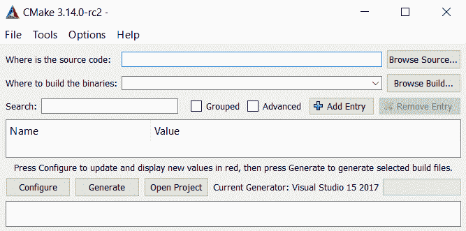
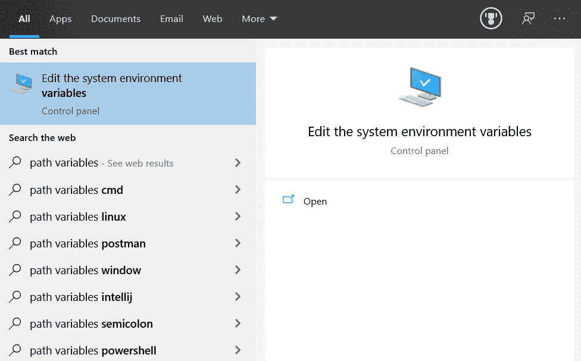

# 十三、WebAssembly——Web 上本地代码的简要介绍

过去的几章都是关于如何在现代网络环境中利用 JavaScript。 我们已经了解了前端开发、后端开发，甚至通过**持续集成和**(**CI**/**CD**)持续部署应用。 现在，我们将后退一步，看看两个主题，它们可以帮助我们用本机速度代码增强开发。

WebAssembly 是一个用于 web 组装的规范。 汇编是计算机所能理解的语言的一对一映射。 另一方面，WebAssembly 是可以运行这些指令的虚拟计算机的一对一映射。 在本章中，我们将探讨 WebAssembly 以及如何将本地应用移植到浏览器。

总的来说，我们将探讨以下主题:

*   理解 WebAssembly
*   设置编写 WebAssembly 的环境
*   编写 WebAssembly 模块
*   将 C 应用移植
*   看看一个主要的应用

在本章的最后，我们应该能够不仅用 WebAssembly 文本格式开发，而且用 C 语言开发 web。 我们还可以将二进制 WebAssembly 转换为文本格式，以便诊断移植应用可能出现的问题。

# 技术要求

在本章中，我们需要以下工具:

*   一个编辑器，例如 VS Code。
*   在我们的计算机上构建和编译程序。 这可能意味着在某些环境中需要管理员特权。
*   本章代码可在[https://github.com/PacktPublishing/Hands-On-High-Performance-Web-Development-with-JavaScript/tree/master/Chapter13](https://github.com/PacktPublishing/Hands-On-High-Performance-Web-Development-with-JavaScript/tree/master/Chapter13)中找到。

# 理解 WebAssembly

WebAssembly 是可以在机器上运行的指令集的规范。 在我们的例子中，这台机器是虚拟的。 为了理解这是如何转化为本机速度应用的，以及为什么指令是这样编写的，我们需要对程序在计算机中的功能有一个基本的了解。 为了理解 WebAssembly，我们将看以下主题:

*   了解基本程序的流程
*   设置编写 WebAssembly 的环境

# 了解一个项目

让我们来看看一个非常基本的 C 程序:

```js
#include <stdio.h>
int main() {
   printf("Hello, World!");
   return 0;
}
```

这个程序有一个入口点。 在我们的例子中，它是`main`函数。 从这里开始，我们使用一个在`stdio`头文件中声明的函数(头文件提供了函数声明，这样我们就不必完全将所有代码导入到这个文件中)。 我们利用`printf`函数将`Hello, World!`打印到控制台，然后使用`return`和`0`来表示程序成功。

Since we won't be talking about the C/C++ code that we will be writing in depth, for those that are interested, a great resource is [https://www.learn-c.org/](https://www.learn-c.org/).

虽然这是一个我们作为程序员一般都能理解的程序格式，但它需要被转换成计算机能够真正理解的格式。 这意味着它需要编译。 这个编译过程涉及引入任何外部文件(在本例中是`stdio`)并将它们链接进来。 这也意味着我们需要将每个指令转换成一个或多个计算机指令。

一旦链接和编译过程发生，我们通常会得到一个可以被我们的计算机读取的二进制文件。 如果我们在字节读取器中打开这个文件，我们会看到一串十六进制数。 这些数字中的每一个都对应于我们放入文件中的指令、数据点等等。

现在，这只是一个基本的理解，一个程序如何变成我们的计算机理解的东西，以及我们创建的二进制是如何被计算机理解的。 在大多数机器上，程序作为指令和数据的堆栈运行。 这意味着它每次从堆栈顶部取出一个指令。 这些指令可以是任何东西，从将这个数字加载到一个位置或将这两个数字相加。 当它剥掉这些指令时，它就会丢弃它们。

我们可以将不同的局部数据存储到这个堆栈中，或者我们可以在全局级别存储数据。 那些局部的栈被保存在这个栈上。 一旦堆栈耗尽，我们就不能再访问这些变量了。

全局变量被放到一个叫做**堆**的位置。 堆允许我们从系统中的任何地方获取数据。 一旦程序的堆栈耗尽，如果程序还在运行，这些堆对象就可以留在那里。

最后，我们为所编写的每个函数获得一个堆栈。 因此，我们可以把每个函数看作一个小程序。 这意味着它将执行一个或几个任务，然后它将耗尽，我们将回到调用我们的函数的堆栈。 当我们耗尽这个堆栈时，我们可以做两件事。 我们可以做的第一件事是返回调用我们的函数的堆栈，但没有数据。 或者，我们可以返回一些数据(这是我们在大多数语言中看到的`return`语句)。

在这里，我们可以通过这两种机制共享数据，要么从我们的子函数返回值，要么将我们的结果放到堆上，以便其他人可以访问它们。 把它放在堆上意味着它将在程序运行期间持续存在，但它也需要由我们管理，而如果我们从堆栈返回值，它将在调用我们的函数耗尽时被清除。 大多数情况下，我们将使用简单的数据并通过堆栈返回它。 对于复杂的数据，我们将它放在堆上。

在研究 WebAssembly 之前，您应该知道最后一点:如果我们将数据放在堆上，我们需要告诉程序的其他部分在哪里可以找到这些数据。 为此，我们传递一个指向该位置的指针。 这个指针只是一个地址，告诉我们在哪里可以找到这些数据。 我们将在 WebAssembly 代码中使用它。

The topic of computers and how programs work is quite interesting. For those of you who are interested, it may be beneficial to take a formal course at a community college. For those that like to self-learn, the following resource is of great help: [https://www.nand2tetris.org/](https://www.nand2tetris.org/).

现在，让我们设置我们的环境，以便我们可以在 WebAssembly 中编程。

# 设置环境

要在 WebAssembly 中编程，我们需要在机器上获取`wat2wasm`程序。 最好的方法是下载程序 WebAssembly 套件的存储库，并为我们的计算机编译它们。 遵循以下步骤:

1.  我们需要一个叫 CMake 的程序到我们的系统上。 对于 Linux/OS X，这只是意味着去[https://cmake.org/download/](https://cmake.org/download/)并运行安装程序。 对于那些使用 Windows 的人来说，这个有点长。 点击[https://visualstudio.microsoft.com/vs/](https://visualstudio.microsoft.com/vs/)获取 Visual Studio。 确保为它获取 C/ c++模块。 在我们的机器上有了 CMake 和 Visual Studio，我们现在可以继续编译 WebAssembly 工具套件了。
2.  前往[https://github.com/WebAssembly/wabt](https://github.com/WebAssembly/wabt)，克隆到一个容易到达的位置。
3.  打开 CMake GUI 工具。 它看起来应该类似于以下内容:



4.  对于源代码，请转到我们从 GitHub 下载的`wabt`文件夹。
5.  二进制文件的位置应该在我们在`wabt`文件夹中创建的`build`目录中。
6.  这样，我们就可以点击 Configure 按钮。 这将填充屏幕中间的面板。
7.  现在，只需点击 Generate 按钮。 这将生成构建应用所需的文件。
8.  最后，我们将进入 Visual Studio 并构建项目。
9.  打开 Visual Studio 并从左上角的 File 下拉菜单中打开项目。
10.  项目完成后，我们就可以点击构建。 这将构建我们使用 WebAssembly 所需的所有二进制文件。 屏幕应该是这样的:


If you are having trouble, the repository at [https://github.com/WebAssembly/wabt](https://github.com/WebAssembly/wabt) contains some excellent documentation on how to get the build done. The preceding instructions try to streamline the build process, but it can be difficult to get these projects up and running.

现在我们已经构建了我们的二进制文件，让我们确保将它们放在我们的路径上，以便我们能够轻松地访问它们。 在 Windows 上，我们可以做以下操作:

1.  转到搜索栏，输入`path variables`。 第一个选项应该允许我们设置环境变量:



2.  点击右下角的“环境变量”选项:


3.  对于底部框，找到 Path 变量并单击 Edit…


4.  点击 New，找到存放所有二进制文件的目录:


一旦我们完成了这些，我们应该能够在命令行中输入`wat2wasm`，并获得工具的帮助文档。 现在，我们可以将 WebAssembly 的文本格式编译成浏览器期望的格式了!

现在我们已经将 WebAssembly 二进制工具包添加到系统中，并且可以编译/反编译 WebAssembly 程序，让我们开始用 WebAssembly 编写第一个程序吧!

# 编写 WebAssembly 模块

WebAssembly 模块类似于 JavaScript 模块。 我们需要显式地从其他 WebAssembly/JavaScript 模块导入任何我们需要的东西。 我们在 WebAssembly 模块中编写的任何内容都不会被另一个 WebAssembly 模块找到，除非我们显式地导出它。 我们可以把它看作一个 JavaScript 模块——它是一个沙箱环境。

让我们从 WebAssembly 模块最基本和最没用的版本开始:

```js
(module)
```

这样，我们就可以进入命令行并运行以下命令:

```js
> wat2wasm useless.wat
```

上述代码将输出一个扩展名为`wasm`的文件。 这是我们在运行 WebAssembly 时需要传递给 web 浏览器的内容。 所有这些都告诉我们，WebAssembly 就像 JavaScript 的 ESNext 一样，希望在模块中声明所有内容。 更容易这样想，这是加载 JavaScript 时发生的事情:

```js
<script type="module"></script>
```

这意味着 WebAssembly 上下文中加载的所有代码不能溢出到我们设置的其他 WebAssembly 模块中。 现在，要将这个`wasm`文件加载到我们的浏览器中，我们需要使用静态服务器，我们在[第 9 章](10.html)，*实际示例-建立一个静态服务器*中使用了静态服务器。

一旦你加载了这个，遵循以下步骤:

1.  创建一个基本的`index.html`文件，如下所示:

```js
<!DOCTYPE html>
<html>
    <head></head>
    <body>
        <script type="text/javascript">
        </script>
 </body>
</html>
```

2.  在我们的`script`元素中，我们将添加以下代码来加载模块:

```js
WebAssembly.instantiateStreaming(fetch('useless.wasm')).then(obj => {
    // nothing here
});
```

我们已经将第一个 WebAssembly 模块加载到浏览器中。 API 很大程度上是基于承诺的，因此，我们需要利用 Fetch 接口。 一旦我们获取了对象，它就会被加载到浏览器的 WebAssembly 上下文中，这意味着这个对象对我们是可用的。 这就是我们刚刚加载的 WebAssembly 模块!

让我们继续创建一个更有用的 WebAssembly 模块。 让我们取两个数并把它们加起来。 遵循以下步骤:

1.  创建一个名为`math.wat`的文件。
2.  将以下代码放入文件中:

```js
(module
    (func $add (param $p1 i32) (param $p2 i32) (result i32)
        local.get $p1
        local.get $p2
        i32.add
    )
    (export "add" (func $add))
)
```

3.  运行`wat2wasm math.wat`编译。
4.  将新的`wasm`文件加载到浏览器中，并在`then`主体中添加以下内容:

```js
console.log(obj.instance.exports.add(100,200));
```

5.  通过进入文件夹并运行`static-server`命令，确保静态服务器正在运行。

For those that have skipped ahead to this chapter, you can install a static server by running `npm install -g static-server`. This will install this static server globally. Then, all we need to do is run `static-server` in the folder that we want to deploy files from. Now that we've done this, we can hit our `index.html` file by going to `localhost:9080`.

如果我们启动浏览器，转到`localhost:9080`，并打开控制台，我们将看到数字 300 已经打印出来了。 我们刚刚编写了第一个可访问的 WebAssembly 模块!

让我们回顾一下前面代码中涉及的一些概念。 首先，我们定义一个函数。 我们声明这个函数的名称是`$add`(所有变量在 WebAssembly 中都以美元符号开始)。 然后，我们声明它将采用两个参数，我们称之为`$p1`和`$p2`。 最后，我们将输出一个结果; 即 32 位整数。

现在，我们取这两个参数并将它们存储在堆栈中。 最后，我们将它们加在一起，并使用这个作为结果。 还记得在本章开始时我们讨论过程序如何成为堆栈吗? 这展示了完全相同的概念。 我们将两个变量加载到堆栈中。 我们将它们取出，以便在`add`函数中使用它们，该函数将一个新值放入堆栈中。 最后，我们将该值从堆栈中取出，并将其返回给 main 函数体; 在我们的例子中，是模块。

接下来，我们导出函数，以便 JavaScript 代码能够访问它。 这确保了我们的 WebAssembly 代码保存在沙箱中，就像我们希望的那样。 现在，正如我们前面提到的，返回的对象是 WebAssembly 上下文。 我们获取实例并查看可用的导出。 在我们的例子中，这是`add`函数，我们现在可以在 JavaScript 代码中使用它。

既然我们已经学习了如何将 WebAssembly 模块导出到 JavaScript 上下文中，您可能想知道是否可以将 JavaScript 函数加载到 WebAssembly 上下文中。 我们可以! 让我们继续并添加以下代码到我们的`index.html`文件:

```js
const add = function(p1, p2) {
    return p1 + p2;
}
const importObject = { math : { add : add }};
WebAssembly.instantiateStreaming(fetch('math.wasm'), importObject).then(obj => {
    console.log(obj.instance.exports.add(100, 200));
    console.log(obj.instance.exports.add2(100, 200));
});
```

在这里，我们加载了从 JavaScript 上下文中获取的`add`函数，并创建了一个相关的函数，该函数具有与 JavaScript 中的`add`函数相同的函数签名。 现在，我们创建一个新的`add`函数，称为`$add2`，它具有类似的签名。 我们将两个参数放到堆栈中，并使用新的`call`指令。 这个指令允许我们调用在我们的上下文中声明的其他函数:

```js
(func $add2 (param $p1 i32) (param $p2 i32) (result i32)
 local.get $p1
 local.get $p2
 call $externalAdd
)
```

最后，我们导出这个函数，就像我们对其他`add`函数所做的那样。 现在，如果我们编译代码，回到浏览器，并重新加载页面，我们将看到数字 300 被打印了两次。

现在，我们知道了如何在 JavaScript 中使用 WebAssembly 函数以及如何将 JavaScript 函数加载到 WebAssembly 中。 我们即将能够编写出一个在 JavaScript 代码面试中被问及的程序。 不过，在此之前，我们需要了解一下 JavaScript 和 WebAssembly 之间的堆空间和内存利用情况。

# 在 WebAssembly 和 JavaScript 之间共享内存

到目前为止，我们一直在 WebAssembly 中使用一种类型的变量。 这些被称为局部变量或堆栈变量。 还有另一种类型，它不仅允许我们在 WebAssembly 上下文中使用它们，还允许我们在 JavaScript 和 WebAssembly 之间共享它们。 但首先，我们需要讨论堆栈和堆之间的区别。

There is a difference between global/local variables and the stack/heap. For now, we are going to keep things simple and treat global variables as if they are on the heap and local variables as if they are on the stack. Later, our application will have a global state that is not on the heap, but it is best to try to keep the idea of the local equivalent to the stack and the global equivalent to the heap.

当我们讨论程序如何在典型的计算机上运行时，我们讨论了堆栈。 最好的方法是把它看成一堆木头。 我们总是要从最优秀的人那里拉，总是要往最优秀的人那里添加东西。 在编程中也是如此。 我们向堆栈顶部添加，然后从这些最上面的项中提取。 以我们创建的`add`函数为例。

我们获取了这两个参数并将它们添加到堆栈中。 首先是参数一，然后是参数二。 当我们调用`$externalAdd`或者调用 WebAssembly 内置的`add`函数时，它会将这两个项从堆栈中取出，并用一个项(result)替换它们。 当我们从一个函数返回时，我们将该项从局部函数堆栈中取出，并将其弹出到调用我们的上下文堆栈的顶部。

堆就像它的名字一样。 我们有一团可以从任何地方抓取、更改和替换的东西。 任何人都可以进入堆，将项目放入堆中，然后从堆中读取数据。 它就像一堆衣服——我们可以在里面搜索，找到我们需要的东西，或者我们可以在一天结束的时候添加进去。

两者之间的主要区别是堆栈将被清理。 一旦函数返回，我们在其中创建的任何变量都将被清理。 另一方面，堆保持在那里。 由于任何人都可以访问它，我们必须明确地摆脱它; 否则，它将永远存在。 在垃圾收集环境中，最好的理解方式是我们的环境不知道还有谁在它上面有条目，所以它不知道什么需要清理，什么不需要。

在 WebAssembly 中，我们没有垃圾收集环境，所以在 JavaScript 或 WebAssembly 上下文中，我们必须回收堆。 在我们的示例中，我们不会这样做，因此请注意，这是我们希望在生产风格的环境中做的事情。 要做到这一点，我们只需在 JavaScript 中将`memory`对象设置为`null`。 这将让垃圾回收器知道没有人再使用它了。

让我们来学习如何在 JavaScript 和 WebAssembly 之间共享内存，以及这如何等同于堆。 遵循以下步骤:

1.  创建名为`sharing_resources.wat`的文件。
2.  将以下代码放入文件中:

```js
(module
   (import "js" "mem" (memory 1))
    (func $storeNumber
        (i32.store (i32.const 0) (i32.const 100))
    )
    (func $readNumber (result i32)
        (i32.load (i32.const 0))
    )
    (export "readNumber" (func $readNumber))
    (export "storeNumber" (func $storeNumber))
)
```

我们的第一个函数将数字`100`存储在内存位置`0`。 如果我们要存储任意数量的数据，我们必须让打电话给我们的人知道我们存储了多少数据。 然而，在这种情况下，我们总是知道它只是一个数字。

我们的`read`函数只是从内存中读取该值，并将其作为一个值返回。

3.  我们的脚本部分在`index.html`文件应该看起来像以下内容:

```js
const memory = new WebAssembly.Memory({initial : 1});
const importObject = { js: {mem: memory}};
WebAssembly.instantiateStreaming(fetch('sharing_resources.wasm'), importObject).then(obj => {
    obj.instance.exports.storeNumber();
    console.log(obj.instance.exports.readNumber());
});
```

顶部部分看起来应该有所不同。 首先，我们正在创建一块 JavaScript 和 WebAssembly 都可以共享的内存。 我们将只创建和加载一部分内存。 在 WebAssembly 上下文中，这是 64 KB 的数据。

一旦我们的 WebAssembly 加载，我们存储数字，然后读取它。 现在，我们可以看到我们在 WebAssembly 中有一个全局状态，但是我们如何与 JavaScript 共享它呢? 代码的开始部分告诉我们怎么做。 我们可以访问内存对象，所以我们应该能够访问它。 让我们继续并稍微改变一下我们的脚本，这样我们就可以直接在 JavaScript 中读取内存，而不是调用一个函数来为我们做这件事。

下面的代码应该做到这一点:

```js
function readNumber() {
    const bytes = new Uint32Array(memory.buffer, 0, 1);
    console.log('The number that was put here is:', bytes[0]);
}
```

现在，我们可以在 WebAssembly 加载后将其添加到 body 中:

```js
obj.instance.exports.storeNumber();
readNumber();
```

如果我们查看控制台，应该会看到完全相同的输出! 最后的测试是从 JavaScript 中存储一些东西并在 WebAssembly 中获取它。 我们可以通过将脚本改为以下方式来实现:

```js
const memory = new WebAssembly.Memory({initial : 1});
const storeByte = new Int32Array(memory.buffer, 0, 1);    
storeByte[0] = 200;
const importObject = {js: {mem: memory}};
WebAssembly.instantiateStreaming(fetch('sharing_resources.wasm'), importObject).then(obj => {
    console.log(obj.instance.exports.readNumber());
});
```

如果我们保存并返回控制台，我们应该会看到数字 200 被打印出来!

现在，我们知道了如何在两个实例之间共享内存以及如何利用它来做一些很酷的事情。 让我们来测试一下我们所有的技能，并创造出每个程序员最喜欢的程序:FizzBuzz。

# 在 WebAssembly 中编写 FizzBuzz

FizzBuzz 是一个编程挑战，要求用户从 1 到选定的数字进行正数循环，并根据以下标准打印结果:

*   如果数字能被 3 整除，则打印*Fizz*
*   如果这个数字能被 5 整除，则打印*Buzz*
*   如果这个数字能被 15 整除，则打印*FizzBuzz*

让我们先准备好 JavaScript 环境。 下面的代码看起来应该很熟悉，除了我们的新日志函数:

```js
const memory = new WebAssembly.Memory({initial : 1});
const storeByte = new Int32Array(memory.buffer, 0, 1);   
function consoleLogString(offset, length) {
    const bytes = new Uint8Array(memory.buffer, offset, length);
    const string = new TextDecoder('utf8').decode(bytes);
    console.log(string);
}
const importObject = { console: {log: consoleLogString}, js: {mem: memory}};
WebAssembly.instantiateStreaming(fetch('fizzbuzz.wasm'), importObject).then(obj => {
    //obj.instance.exports.fizzbuzz(10);
});
```

这个函数接受内存的偏移量和数据的长度，并将其打印出来。 正如前面提到的，我们需要知道数据在哪里，以及它的长度，以便能够从堆中读取它。 现在，我们可以进入这个项目的核心了。 遵循以下步骤:

1.  创建一个新文件`fizzbuzz.wat`。
2.  我们知道我们需要导入内存和`console`函数，就像我们已经导入了其他函数一样。 我们还知道我们将创建一个名为`fizzbuzz`的函数，并将其导出，以便我们的 JavaScript 上下文可以利用它:

```js
(module
    (import "console" "log" (func $log (param i32 i32)))
    (import "js" "mem" (memory 1))
    (global $g (mut i32) (i32.const 0))
    (func $fizzbuzz (param $p i32)
        ;; content of the function
    )

    (export "fizzbuzz" (func $fizzbuzz))
)
```

前面代码中唯一有趣的部分是`global`部分。 这是一个全局变量，可以看作是上下文的堆栈。 它不在堆上，所以 JavaScript 上下文不能访问它。 我们还可以在声明的前面看到`mut`关键字。 这告诉我们，我们将从我们的 webasassembly 代码的不同部分更改全局变量。 我们将利用它来保存打印输出的长度。

3.  我们需要检查 FizzBuzz 的两种情况:

```js
(func $checkFizz (param $p1 i32))
(func $checkBuzz (param $p1 i32))
```

我们的两个函数都需要一个数字。 对于`checkFizz`函数，我们将测试它是否能被 3 整除。 如果是，我们将单词*Fizz*存储在全局变量所在的内存堆中，然后将该全局变量更新到单词*Fizz*之后的位置。 对于*Buzz*，我们将做同样的事情，除了我们将测试这个数字是否能被 5 整除。 如果这是`true`，我们将把*Buzz*放在全局指针位置并更新它。

以下是`checkFizz`功能:

```js
local.get $p1
i32.const 3
i32.rem_s
(if (i32.eq (i32.const 0))
    (then
        (i32.store8 (global.get $g) (i32.const 70))
        (i32.store8 (i32.add (global.get $g) (i32.const 1)) 
         (i32.const 105))
        (i32.store8 (i32.add (global.get $g) (i32.const 2)) 
         (i32.const 122))
        (i32.store8 (i32.add (global.get $g) (i32.const 3)) 
         (i32.const 122))
        (global.set $g (i32.add (global.get $g) (i32.const 4)))
    )
)
```

这里，我们获取传入的数字。 然后，我们将`3`放在堆栈上并运行余数函数。 如果结果等于`0`，那么我们将*Fizz*存入内存。 现在，我们放入内存的可能不像单词*Fizz*，但如果我们看看每个字母的 UTF8 十进制数字，我们会看到我们放入内存的就是这个。

如果我们回到 JavaScript 代码，我们将看到我们正在利用`TextDecoder`。 这允许我们读取这些字节值并将它们转换成等价的字符串。 因为 WebAssembly 只理解整数和浮点数的概念，这就是我们现在必须处理它的方式。

接下来是`checkBuzz`函数。 它应该看起来类似于前面的代码，除了可整除的，它是`5`:

```js
(func $checkBuzz (param $p1 i32)
    local.get $p1
    i32.const 5
    i32.rem_s
    (if (i32.eq (i32.const 0))
        (then
            (i32.store8 (global.get $g) (i32.const 66))
            (i32.store8 (i32.add (global.get $g) (i32.const 1)) 
             (i32.const 117))
            (i32.store8 (i32.add (global.get $g) (i32.const 2)) 
             (i32.const 122))
            (i32.store8 (i32.add (global.get $g) (i32.const 3)) 
             (i32.const 122))
            (global.set $g (i32.add (global.get $g) (i32.const 4)))
        )
    )
)
```

4.  现在，我们可以写`fizzbuzz`。 我们将取这个整数，然后运行`checkFizz`和`checkBuzz`函数，从`1`循环到那个值:

```js
(func $fizzbuzz (param $p i32)
    (local $start i32)
    (local.set $start (i32.const 1))
    (block
        (loop
            (call $checkFizz (local.get $start))
            (call $checkBuzz (local.get $start))
            (br_if 1 (i32.eq (local.get $start) (local.get $p)))
            (local.set $start (i32.add (local.get $start) 
            (i32.const 1)))
            (br 0)
        )
    )
    i32.const 0
    global.get $g
    call $log
)
```

这个循环相当简单。 `br_if`测试我们的`start`变量是否等于我们输入的值。 如果是，它将等于`1`，并将跳出循环。 否则，它将使`start`变量增加 1。 `(br 0)`是使循环继续的东西。

一旦我们完成了循环，我们将得到我们的全局变量，无论它在哪里结束，并调用`log`函数。 让我们编译并运行以下测试:

```js
obj.instance.exports.fizzbuzz(10);
```

通过这样做，我们应该得到以下输出:

```js
FizzBuzzFizzFizzBuzz
```

我们刚刚用纯 WebAssembly 编写了一个重要的程序! 到目前为止，您应该已经意识到为什么大多数人不使用纯粹的 WebAssembly 编写程序，因为本应是一个简单的程序却花费了我们相当多的代码。

在下一节中，我们将学习如何使用高级语言 C 来编写 web 程序。

# 为 web 编写 C/ c++

到目前为止，我们已经了解了如何编写 WebAssembly 的低级指令语言。 虽然这可能是一个有趣的练习，但我们的大多数项目将在规模上更大，我们将想要利用高级语言来实现我们的目标。 虽然有一些语言可以编译成类似于 JavaScript 的 WebAssembly([https://github.com/AssemblyScript/assemblyscript](https://github.com/AssemblyScript/assemblyscript))，但大量模块将在使用 C、c++或 Rust 等系统语言时编写。 在本节中，我们将看看如何为浏览器编写 C/ c++代码。

The Rust language ([https://www.rust-lang.org/](https://www.rust-lang.org/)) provides us with a safer alternative to C/C++. While utilizing it may be better in the long run, we are going to stick with C/C++ since this is what we will widely compile to WebAssembly for the foreseeable future since most programs are currently written in it.

要开始我们的 C/ c++编写之旅，我们需要获取 Emscripten SDK 来编译为 WebAssembly。 这可以在[https://emscripten.org/index.html](https://emscripten.org/index.html)上找到。 我们将主要遵循 Emscripten 提供的*入门*指南。 遵循以下步骤:

1.  首先，我们将运行以下命令克隆 Emscripten SDK:

```js
> git clone https://github.com/emscripten-core/emsdk.git
```

2.  使用以下命令进入目录:

```js
> cd emsdk
```

3.  拉出最新的更改和以下命令:

```js
> git pull
> emsdk latest install
> emsdk activate latest
> emsdk_env.bat
```

现在我们有了前面的命令来帮助我们，我们准备好开始为 web 编写 C 和 c++了! 让我们从一个简单的模块开始:

```js
#include <stdio.h>
int main() {
   printf("Hello, World!\n");
   return 0;
}
```

这个基本的 C 程序是大家最喜欢的 Hello World 程序。 要编译这个程序，请运行以下命令:

```js
> emcc hello_world.c
```

如果一切都安装正确，我们应该得到以下两个文件:

*   `a.out.wasm`
*   `a.out.js`

有了这两个文件，我们可以使用一个`index.html`文件并加载它们，像这样:

```js
<!DOCTYPE html>
<html>
    <head>    
    </head>
    <body>
        <script type="text/javascript" src="a.out.js"></script>
    </body>
</html>
```

我们应该打印出**Hello World!** 到我们的控制台! 让我们继续写另一个 C 程序，就像我们之前写的 WebAssembly 程序 FizzBuzz 一样:

```js
#include <stdio.h>
void fizzbuzz(int num) {
    for(int i = 1; i <= num; i++) {
        if(i%3 == 0) {
            printf("Fizz");
        }
        if(i%5 == 0) {
            printf("Buzz");
        }
    }
    printf("\n");
}
```

如果我们编译它并尝试运行它，我们将看到什么都没有找到。 文档声明它应该在全局`Module`变量上，但是如果我们检查那里，我们会看到没有`fizzbuzz`程序要找到。 幸运的是，Emscripten 为我们做了死代码分析，并注意到我们的 C 程序没有`main`函数，它也没有调用`fizzbuzz`函数，所以它删除了它。

为了处理这个问题，我们可以在`emcc`调用中添加一个参数:

```js
> emcc -s "EXPORTED_FUNCTIONS=['_fizzbuzz']" fizzbuzz.c
```

All of our functions will have an underscore before them. This helps us and the system differentiate what may be created in the JavaScript system and what is being created in the C/C++ context.

有了这个，我们就可以进入浏览器和开发者控制台，输入以下内容:

```js
Module._fizzbuzz(10);
```

我们应该看到打印输出! 我们刚刚编译了第一个可以在 JavaScript 代码中使用的 C 语言库函数。 现在，如果我们想尝试一些更困难的东西呢? 如果我们想在 C/ c++代码中运行 JavaScript 函数，该怎么办?

要做到这一点，我们必须做到以下几点:

1.  我们需要在文件的顶部放一个`extern`声明(Emscripten 将首先查找 JS 的位置，但我们也可以传递一个命令行标志来告诉它在其他地方查找):

```js
#include <stdio.h>
extern int add(int, int);
int main() {
    printf("%d\n", add(100, 200));
    return 1;
}
```

2.  接下来，我们将创建一个`external.js`文件来存放我们的新函数:

```js
mergeInto(LibraryManager.library, {
    add: function(x, y) {
        return x + y;
    }
});
```

3.  现在，我们可以用下面的代码编译我们的程序:

```js
> emcc -s extern.c --js-library external.js
```

之后，我们可以返回浏览器，看到它打印出 300! 现在，我们知道如何在我们的 C/ c++程序中使用外部 JavaScript，我们可以从浏览器中获取我们的 C/ c++代码。

一直以来，我们都在覆盖我们的文件，但我们还有别的办法来处理吗? 当然-我们可以用`emcc -o <file_name.js>`标志调用`emcc`系统。 因此，我们可以通过以下命令编译`extern.c`文件，并将其命名为`extern.js`:

```js
> emcc --help
```

或者，我们可以访问他们的网站:[https://emscripten.org/](https://emscripten.org/)。

现在我们已经能够为浏览器编写和编译 C 代码了，我们将把注意力转向如何利用这种能力。 让我们实现一个汉明代码生成器，我们可以在 JavaScript 中使用它，它是用 C 编写的，可以编译为 WebAssembly。

# 编写汉明代码生成器

现在，我们要写一个复杂的软件。 汉明码生成器创建的数据段在两种媒体之间传输时应该能够恢复。 这些媒介可以是从一台计算机到另一台计算机的任何媒介，甚至可以是一个进程到另一个进程的任何媒介(尽管我们应该希望进程之间的数据传输不会被破坏)。 我们要添加的数据被称为汉明码。

为了编写这个软件，我们需要了解汉明代码是如何生成的，以及我们如何使用验证器来确保从一个媒体到另一个媒体的数据是正确的。 具体来说，我们将研究汉明数据的创建和验证过程。 我们不会考虑恢复数据，因为这接近于创建数据的反向过程。

为了理解汉明数据是如何创建的，我们需要在位级查看数据。 这意味着，如果我们想要传输数字 100，我们需要知道它的比特数是多少。 位是计算机的最低数据单元。 一个位只能是 0 或 1。 当我们把更多的位加在一起，它们代表 2 的幂。 下面的表格应该有助于说明这一点:

| **Bit 3** | **Bit 2** | **Bit 1** | **位 0** |
| 8 | 4 | 2 | 1 |
| 2 ^ 3 | 2 ^ 2 | 2 ^ 1 | 2 ^ 0 |

正如我们所看到的，每个位位置代表 2 的下一次方。 如果我们混合和匹配这些位，我们会发现我们可以代表所有的正实数。 也有表示负数甚至是浮点数的方法，但我们在这里就不讲了。

For those that are curious, an article on floating-point representation can be found here: [https://www.cprogramming.com/tutorial/floating_point/understanding_floating_point_representation.html.](https://www.cprogramming.com/tutorial/floating_point/understanding_floating_point_representation.html)

所以，如果我们想看这些数字的二进制形式，我们可以一个一个地看。 下表显示了左边的十进制表示法和右边的二进制表示法(我们习惯的是十进制):

| 0 | 0000 |
| 1 | 0001 |
| 2 | 0010 |
| 3 | 0011 |
| 4 | 0100 |
| 5 | 0101 |
| 6 | 0110 |
| 7 | 0111 |
| 8 | 1000 |

希望这能澄清位和二进制表示是如何工作的。 现在，我们来看看汉明码是如何工作的。 汉明码的工作原理是在数据传输过程中，将奇偶校验位添加到特殊位置。 这些奇偶校验位要么是 1，要么是 0，这取决于我们选择的奇偶校验类型。

我们可以选择的两种奇偶校验类型是偶校验和奇校验。 偶数奇偶校验意味着当我们将奇偶校验位的所有位位位置相加时，它们需要是一个偶数。 如果我们选择奇偶校验，我们需要将奇偶校验位置的所有位加起来，并检查它们是否为奇数。 现在，我们需要决定哪个位对应于每个奇偶校验位的位置，甚至奇偶校验位的位置。

首先，我们将看看奇偶校验位到哪里去了。 奇偶校验位将在每个 2 次幂的位位置。 正如我们在上表中看到的，我们将把奇偶校验位托管在以下位位置:1、2、4、8 和 16。 如果我们看看前面的表，我们会注意到这些对应的位只有一个位集。

现在，我们需要决定哪些数据位位置对应于奇偶校验位位置。 我们可以根据奇偶校验位的位置来猜测。 对于每个数据位，我们将查看它们是否有相应的奇偶校验位。 这可以从下表中看出:

| **数字(十进制)** | **是奇偶校验位吗?** | **使用该数据的校验位** |
| 1 | 是的 | N / A |
| 2 | 是的 | N / A |
| 3 | 没有 | 1, 2 |
| 4 | 是的 | N / A |
| 5 | 没有 | 1, 4 |
| 6 | 没有 | 2, 4 |
| 7 | 没有 | 1, 2, 4 |
| 8 | 是的 | N / A |

我们需要知道的最后一点是如何将我们的数据与奇偶校验数据相结合。 看这个问题的最好方法是通过一个例子。 让我们把数字 100 转换成它的二进制表示。 我们可以手工操作，也可以用程序员的计算器，大多数操作系统都有。

如果我们打开计算器，输入 100，我们应该得到它的二进制表示:1100100。 现在，为了添加奇偶校验位，我们需要根据是否放置奇偶校验位来移动数据位。 让我们一步一步来:

1.  第一个位被用作奇偶校验位吗? 是的，我们在这里放一个 0，然后向左移动数据一次。 我们现在有 11001000。
2.  第二个位用作奇偶校验位吗? 是的，我们在这里放一个 0，然后向左移动数据一次。 我们现在有 110010000 个。
3.  第三位是否用作奇偶校验位? 不，我们可以把原始的第一个数据位放在这里，也就是 0。 我们的数据看起来和之前一样:110010000。
4.  第四个位被用作奇偶校验位吗? 是的，我们在这里放一个 0，然后向左移动数据一次。 我们现在有 1100 万。
5.  第五个位被用作奇偶校验位吗? 不，我们把原始的第二个数据位放在这里，也就是 0。 我们的数据看起来和之前一样:1100100000。
6.  第六个位被用作奇偶校验位吗? 不，我们把第三个原始数据位放在这里，也就是 1。 我们的数据看起来和之前一样:1100100000。
7.  第七个位被用作奇偶校验位吗? 不，所以我们将原始的第四个数据位放在这里，也就是 0。 我们的数据如下:1100100000。
8.  8 位是否用作奇偶校验位? 是的，我们把数据移到左边，在那里放一个 0。 我们的数据如下:11000100000。

对于其余的数字，它们保持不变，因为我们没有更多的奇偶校验位来放置。 现在我们有了数据，我们必须设置奇偶校验位。 我们将在示例和代码中使用偶校验。 下表显示了最终的数字以及我们必须将奇偶校验位设置为 1 或 0 的原因:

| **位位置** | **二进制定位** | **Do We Set It?** | **计数校验** |
| 1 | 00001 | 是的 | 1 |
| 1 | 00010 | 是的 | 3 |
| 0 | 00011 | N / A |  |
| 1 | 00100 | 是的 | 1 |
| 0 | 00101 | N / A |  |
| 1 | 00110 | N / A |  |
| 0 | 00111 | N / A |  |
| 0 | 01000 | 没有 | 2 |
| 0 | 01001 | N / A |  |
| 1 | 01010 | N / A |  |
| 1 | 01011 | N / A |  |

如上表所示，我们必须为 1、2 和 4 个位置设置奇偶校验位。 让我们来看看第二部分，并回顾一下这个过程。 我们将寻找二进制表示具有第二位集合的任何位位置。 如果位被设置在那个位置，我们将计算它。 在把所有这些数字加起来之后，如果它们加起来是一个奇数，我们将需要设置奇偶位位置。 对于第二个位，我们可以看到数字 6、10 和 11 的位置都有它们的第二个位，并且它们有一个 1。 这就是计数为 3 的原因，这意味着我们需要设置奇偶校验位以确保奇偶校验为偶数。

这是需要吸收的大量信息，重读前面的章节可能会帮助您理解我们是如何得到这个最终奇偶校验数的。 如果你想了解更多，请登录[https://www.geeksforgeeks.org/hamming-code-in-computer-network/](https://www.geeksforgeeks.org/hamming-code-in-computer-network/)。

现在，有了所有这些理论，让我们开始编写我们的 C 程序，以便能够创建并验证奇偶校验数据。

首先，我们创建一个名为`hamming.c`的文件。 我们将创建一个纯库文件，因此我们没有`main`函数。 现在，让我们把我们的函数去掉来了解一下我们要做什么。 遵循以下步骤:

1.  要创建我们的数据，我们需要读入数据并将数据位移动到适当的位置，与前面所做的方法相同。 让我们继续调用这个函数`placeBits`:

```js
void placeBits(int data, int* parity) {
}
// creation of true data point with parity bits attached
int createData(int data) {
    int num = 0;
    placeBits(data, &num);
    return num;
}
```

我们可以看到关于`placeBits`*函数的方法签名的一些有趣的事情。 It is taking in a`int*`。 对于 JavaScript 开发人员来说，这将是一个新概念。 我们传递的是数据的位置而不是数据本身。 这就是所谓的引用传递。 这个想法和 JavaScript 很相似; 也就是说，如果我们传递一个对象，我们传递的是对它的引用。 这意味着，当我们对数据进行更改时，我们将在原始函数中看到这些更改。 这和之前的概念是一样的，但是我们有更多的控制。 如果我们不通过引用传递，它将通过值传递，这意味着我们将获得前面数据的副本，并且我们不会看到在我们的`createData`函数中反映的变化。*

 *2.  现在，我们需要一个函数来确定我们是否为那个位置设置了奇偶校验位。 我们称其为`createParity`。 它的方法签名应该是这样的:

```js
void createParity(int* data) 
```

同样，我们传递的是对数据的引用而不是数据本身。

3.  对于我们的数据检查算法，我们将检查每个奇偶校验位，并检查每个校验位对应的数据位置。 我们将调用这个函数`checkAndVerifyData`，它将具有以下方法签名:

```js
int checkAndVerifyData(int data)
```

现在，我们将返回一个`int`，而不是一个布尔值，其中`-1`表示数据是坏的，`1`表示数据是好的。 基本 C,我们没有一个布尔值的概念,所以我们用数字来代表真或假的概念(有一个布尔`stdbool`头,但是如果我们看,它利用的概念`0``false`和`1``true`,所以它仍然利用下面的数字)。 我们还可以使系统更健壮，使每个负数表示一个特定的错误码。 在我们的例子中，我们只使用`-1`，但这是可以改进的。

4.  现在，我们可以开始填充函数了。 首先，我们将把数据放在正确的位置，并确保有空间放置奇偶校验位。 这看起来如下:

```js
const int INT_SIZE = sizeof(int) * 8;
void placeBits(int data, int* parity) {
    int currentDataLoc = 1;
    int dataIterator = 0;
    for(int i = 1, j = 0; i < INT_SIZE; i++, j++) {
        if(ceil(log2(i)) == floor(log2(i))) continue; //we are at a 
         parity bit section
        *parity |= ((data & (currentDataLoc << dataIterator)) << (j 
         - dataIterator));
        dataIterator++;
    }
}
```

首先，我们创建了一个常量`INT_SIZE`。 这允许我们处理不同类型的环境(尽管 WebAssembly 应该是一个标准化的工作环境，但这允许我们在其他地方使用这个 C 程序)。 我们还利用了三个特殊功能:`ceil`*、*`floor`和`log2`。 所有这些都可以在 C 语言标准库附带的数学库中找到。

我们通过导入文件顶部的头文件来获得这个:

```js
#include <math.h>
```

迭代过程是这样的:

1.  它检查我们是否在奇偶位段。 如果是，我们将跳过它，进入下一节。
2.  如果我们不在奇偶校验位段，我们将取数据中的`dataIterator`位。 这个计数器记录我们在传入数据中的位置。 以上操作均为位操作。 `|`告诉我们正在做一个按位或运算，这意味着如果左边(奇偶校验变量)、右边(我们的方程)或两者都是`1`，则位将被设为`1`; 否则，就是`0`。
3.  我们在数据上按位进行 AND，并将位设置为`dataIterator`。 如果这里设置了位，它会告诉我们。 最后，我们需要确保按已经设置的奇偶校验位的数量移位该位(这是`j – dataIterator`)。
4.  如果我们到达这个`for`循环的底部，然后我们检查一个数据位，因此我们需要增加`dataIterator`。

If bit operations are new to you, it would be a good idea to read up on them at [https://developer.mozilla.org/en-US/docs/Web/JavaScript/Reference/Operators/Bitwise_Operators](https://developer.mozilla.org/en-US/docs/Web/JavaScript/Reference/Operators/Bitwise_Operators).

现在，我们可以用以下代码填充`createParity`方法:

```js
void createParity(int* data) {
    int parityChecks[4] = {1, 2, 4, 8};
    int bitSet[4] = {1, 2, 8, 128};
    for(int i = 0; i < 4; i++) {
        int count = 0;
        for(int j = 0; j < INT_SIZE; j++) {
            if((parityChecks[i] & (j+1)) != 0) {
                count += ((*data & (1 << j)) != 0) ? 1 : 0;
            }
        }
        if( count % 2 != 0 ) {
            *data |= bitSet[i];
        }
    }
}
```

这一节可能有点复杂，但它做的是我们之前手工做的:

1.  首先，我们只处理数据的一定数量的位，所以我们只使用 4 个奇偶校验位。 这些奇偶校验位分别对应`0`、`1`、`2`和`4`位位，即十进制数字 1、2、4 和 8。
2.  接下来，这些位位于`1`、`2`、`4`和`8`位，这些位用小数形式表示为`1`、`2`、`8`和`128`。 如果我们需要设置位于那里的奇偶校验位，这只会使它更容易。
3.  现在，我们将循环遍历每个奇偶校验，看看我们新移动的数据是否在这里设置了位:

```js
if((parityChecks[i] & (j+1)) != 0) {
    count += ((*data & (1 << j)) != 0) ? 1 : 0;
}
```

我们正在检查，以确保我们当前正在查看的位是我们担心的奇偶校验位的数据位。 如果是，如果数据位被设置在计数器上，我们将添加到计数器上。 我们将通过对数据使用逐位的 AND 来实现这一点。 如果我们没有得到 0，这意味着位被设置了，所以我们将添加到计数器中。

4.  在这个`for`循环的末尾，如果我们没有偶数奇偶校验，我们将需要在这个位置设置奇偶校验位以获得偶数奇偶校验。

现在，让我们用以下命令行操作来编译我们的程序:

```js
> emcc -s "EXPORTED_FUNCTIONS=['_createData']" hamming.c
```

接下来，我们需要在浏览器中进入我们的`index.html`页面，并在我们的开发人员工具中运行以下命令:

```js
Module._createData(100);
```

通过这样做，我们应该得到以下输出:`1579`。 如果我们把这个十进制数放入程序员的计算器，我们将得到以下二进制表示:`11000101011`。 如果我们回过头来检查一下我们什么时候用手做了这个，我们会发现得到的是完全一样的东西! 这意味着我们的汉明数据生成器在工作。 现在，让我们使用验证工具。 遵循以下步骤:

1.  在我们的`checkAndVerifyData`方法中，我们将添加以下代码:

```js
int checkAndVerifyData(int data) {
    int verify = 0;
    int parityChecks[4] = {1, 2, 8, 128};
    for(int i = 0; i < 4; i++) {
        verify = checkRow(&data, parityChecks[i]);
        if(verify != 0) { // we do not have even parity
            return -1;
        }
    }
    return 1;
}
```

在这里，我们有一个`verify`变量，它将告诉我们数据是好是坏。 如果它不好，它将输出我们的错误状态，这是一个`-1`。 否则，我们将运行数据并看到它是好的，所以我们将返回一个`1`。 接下来，我们将利用奇偶校验位，正如我们已经知道的，奇偶校验位保存在小数`1`、`2`、`8`和`128`。 我们将通过这些循环，并利用它来检查我们的汉明数据，使用`checkRow`方法。

2.  `checkRow`方法将使用与我们的创作过程相似的概念。 这看起来如下:

```js
int checkRow(int* data, int loc) {
    int count = 0;
    int verifier = 1;
    for(int i = 1; i < INT_SIZE; i++) {
        if((loc & i) != 0 ){
            count += (*data & (verifier << (i - 1))) != 0 ? 1 : 0;
        }
    }
    return count % 2;
}
```

同样，这应该非常类似于我们的`createParity`方法。 我们将通过数字和检查，看看这是否是一个奇偶校验位数。 如果是，我们将在已知有位集的数字的位置上使用按位与运算。 如果它不等于`0`，则设置位并更新计数器。 我们将返回带有`2`mod 的计数器，因为这将告诉我们是否有偶数奇偶校验。

这应该总是返回一个偶数(在我们的例子中，`0`)。 如果没有，我们就会立即出错。 让我们用下面的命令编译它:

```js
> emcc -s "EXPORTED_FUNCTIONS=['_createData', '_checkAndVerifyData']" hamming.c
```

现在，我们可以进入浏览器，使用从`createData`方法获得的数字。 进入开发人员控制台并运行以下命令:

```js
Module._checkAndVerifyData(1579);
```

它应该打印出一个`1`，这意味着我们有好的汉明数据! 现在，让我们用一个我们还没有手工算出来的例子来试一下:数字`1000`。 运行以下命令; 我们应该得到相同的结果:

```js
Module._createData(1000); // produces 16065
Module._checkAndVerifyData(16065); //produces 1
```

现在，我们有一个工作的汉明数据创建方法和一个验证工具，都是用 C 编写的，并在浏览器中运行! 这将帮助您理解如何将现有应用移植到浏览器，以及如何利用这种强大的技术，使您能够以接近本机的速度运行计算密集型应用。

本章的最后一节将介绍目前正在使用的一个端口，甚至还将介绍其中的一些代码。 许多应用开发人员都使用这个库，它被称为 SQLite。

# 在浏览器中查看 SQLite

SQLite 是一个被成千上万的应用使用的嵌入式数据库。 不像大多数数据库那样需要服务器和连接系统，SQLite 允许我们像使用其他库一样使用它。 但阻碍我们在浏览器中开发这种功能的是一种不需要本地绑定就可以导入的方法。 要在 Node.js 中使用它，我们需要使用 node-gyp 之类的东西，然后创建到底层 C 代码的 JavaScript 绑定。

多亏了 WebAssembly，我们可以在浏览器中利用这个数据库，而不需要这些本地绑定。 对于已经为我们编译好的版本，请访问[https://github.com/kripken/sql.js/](https://github.com/kripken/sql.js/)并将存储库拉入我们的本地系统。 让我们继续并设置我们的静态服务器来为我们引入所有的文件。 遵循以下步骤:

1.  创建一个新目录`sqlitetest`。
2.  在这个目录中，继续运行下面的命令从 GitHub 克隆存储库:

```js
> git clone https://github.com/kripken/sql.js.git
```

3.  通过这个，我们可以创建一个基本的`index.html`文件，并添加以下代码:

```js
<!DOCTYPE html>
<html>
    <head>
        <script src='sqljs/dist/sql-wasm.js'></script>
    </head>
    <body>
        <script type="module">
            initSqlJs({locateFile: () => `sqljs/dist/sql-wasm.wasm`
              }).then(function(SQL){
                console.log("SQL", SQL);
            });
        </script>
    </body>
</html>
```

如果我们看看我们的开发工具，我们会看到我们已经有了 SQLite 库，并在我们的浏览器中运行! 让我们创建一些表，并填充一些数据:

1.  我们将创建一个简单的两表数据库。 这两个表看起来如下:

| id | first_name | last_name | 用户名 |
|  |  |  |  |

| id | customer_id | 上 | 时间戳 |
|  |  |  |  |

基本上，我们将模拟一个远程过程调用服务器，当客户调用它时，我们将记录他们执行的操作以及执行时的时间戳。

为了在我们的 SQLite 数据库中创建这些表，我们将运行以下代码:

```js
initSqlJs({locateFile: () => `sqljs/dist/sql-wasm.wasm` }).then(function(SQL){
    const db = new SQL.Database();
    db.run(`CREATE TABLE customer
        (id INTEGER PRIMARY KEY ASC,
        first_name TEXT,
        last_name TEXT,
        username TEXT UNIQUE)
    `);
    db.run(`CREATE TABLE rpc_operations
        (id INTEGER PRIMARY KEY ASC,
        customer_id INTEGER,
        op TEXT,
        timestamp INTEGER,
        FOREIGN KEY(customer_id) REFERENCES customer(id))`);
});
```

现在，我们有了一个简单的两表数据库，其中包含了运行所需的所有内容。

2.  让我们继续为每个表填充一些数据。 我们可以通过以下命令来实现:

```js
const insertCustomerData = `INSERT INTO customer VALUES (NULL, ?, ?, ?)`;
const insertRpcData = `INSERT INTO rpc_operations VALUES (NULL, ?, ?, time('now'))`;
const customers = [
    ['Morissa', 'Catford', 'mcatford0'],
    ['Aguistin', 'Blaxlande', 'ablaxlande1']
];
const ops = [
    ['1', 'add'],
    ['2', 'subtract']
]
for(let i = 0; i < customers.length; i++) {
    db.run(insertCustomerData, customers[i]);
}
for(let i = 0; i < ops.length; i++) {
    db.run(insertRpcData, ops[i]);
}
```

通过这段代码，我们已经输入了测试数据。 现在，让我们运行以下命令:

```js
const statement = db.prepare("SELECT * FROM customer c JOIN rpc_operations ro ON c.id = ro.customer_id WHERE c.username = $username");
statement.bind({$username : 'mcatford0'});
while(statement.step()) {
    const row = statement.getAsObject();
    console.log(JSON.stringify(row));
}
```

我们已经成功运行了一个 SQL 数据库在我们的浏览器!

欲了解更多信息，请登录[https://github.com/kripken/sql.js/](https://github.com/kripken/sql.js/)。 要获取 SQLite 参考文档，请访问[https://www.sqlite.org/lang.html](https://www.sqlite.org/lang.html)。

现在，能够在浏览器中运行 SQL 引擎非常棒，但是让我们看看一些底层的 C 代码是如何变成浏览器能够理解的东西的。 如果我们前往[https://www.sqlite.org/download.html](https://www.sqlite.org/download.html)并下载最新版本，我们可以拉出`sqlite3.c`代码库。 现在我们已经有了代码库，让我们寻找一些可能在 WebAssembly 打印输出中看到的东西。 遵循以下步骤:

我们将使用我们安装 wasm 二进制工具时收到的`wasm2wat`工具。 进入`sqljs`文件夹的`dist`文件夹，执行如下命令:

```js
> wasm2wat sql-wasm-debug.wasm --output=sql-wasm.wat
```

现在，我们可以打开该文件，以人类可读的方式查看生成的 WebAssembly。 正如我们所看到的，它不是那么可读，但在顶部附近，我们可以看到一堆从 Emscripten 导入的内容。 我们应该意识到，所有这些都是 Emscripten 从其 JavaScript API 中提供的函数，它们被用来将所有东西编译成 WebAssembly，并且是可用的。

接下来，让我们进入文件的底部。 我们会注意到有一堆导出被命名了。 每个这些应该对应于在`c`文件中找到的一个函数。 让我们来看看一个半简单的问题:`sqlite3_data_count`。 它应该如下所示:

```js
else
    i32.const 0
end
else
    i32.const 0
end)
```

如果指针为 NULL，我们将在 C 代码中看到这种返回类型。 如果结果是 NULL，则返回 0。 这是我们调试要移植到 web 上的 C 程序的方法。 虽然这并不容易，但它可以在我们需要进行此类调试时帮助我们。

本章只介绍了一些已经移植的库。 每天都有越来越多的库和语言被移植到 WebAssembly 中。

A final note on WebAssembly: while we are still in the very beginnings of this technology, we have already seen many advancements. From being able to utilize multiple threads to newly supported multiple return values, we are starting to see this technology really take off.

# 总结

在本章中，我们学习了如何读取和编写 WebAssembly。 我们还了解了典型计算机是如何理解程序的。 在此基础上，我们编写了一个程序，能够利用这种接近本机的速度。 最后，我们查看了一个现有的 WebAssembly 程序，以及它与生成它的代码之间的关系。

到目前为止，我们已经了解了相当多关于 web 开发的情况。 我们已经了解了如何在浏览器中编写代码，以及如何利用所有的新特性来创建功能丰富的 web 应用。 除此之外，我们还了解了如何利用 Node.js 将 JavaScript 用作服务器端代码。 最后，我们了解了如何构建和部署应用。 到目前为止，我们应该已经习惯于构建可伸缩的应用，并利用许多现代特性来创建快速的应用。

感谢您的阅读，我希望这些信息有助于创建下一代的 web 应用! 跟上现代 web 的发展，构建下一个惊人的应用!

# 进一步的阅读

对于那些感兴趣的人，下面的链接展示了 Mozilla 在 WebAsesmbly 上所做的工作，以及他们是如何真正推动这项技术前进的:[https://hacks.mozilla.org/](https://hacks.mozilla.org/)。

其他使用 WebAssembly 创建的令人惊叹的项目可以在以下链接中找到:

*   :[https://dotnet.microsoft.com/apps/aspnet/web-apps/blazor](https://dotnet.microsoft.com/apps/aspnet/web-apps/blazor)
*   :[https://blogs.unity3d.com/2018/08/15/webassembly-is-here/](https://blogs.unity3d.com/2018/08/15/webassembly-is-here/)
*   **Qt**:https://doc.qt.io/qt-5/wasm.html*