# 一、树莓派Zero入门

在为家庭安全系统和通过电子控制系统控制家用电器构建几个项目之前，在本章中，我们将进入初始配置，并准备我们的树莓 Pi Zero 在网络中工作，因此您可以将其用于我们将在本书中看到的所有项目。

在我们完成项目、用设备构建网络并将传感器连接到电路板之前，了解树莓 Pi 的配置非常重要。本章的主要思想是解释如何设置你的树莓 Pi Zero 我们将讨论以下主题:

*   设置树莓 Pi 零点
*   准备 SD 卡
*   安装拉斯扁操作系统
*   使用串行控制台电缆配置您的覆盆子 Pi Zero
*   远程访问网络
*   通过远程桌面访问
*   配置 web 服务器

# 设置树莓 Pi 零点

树莓皮是一种低成本的板，专门用于特定的项目。这里，我们将使用树莓皮零板。看看下面的链接:[https://www.adafruit.com/products/2816](https://www.adafruit.com/products/2816)。我用了这块木板。

为了使树莓 Pi 工作，我们需要一个操作系统，作为硬件和用户之间的桥梁。这本书用的是拉斯比鞠波，可以从[https://www.raspberrypi.org/downloads/](https://www.raspberrypi.org/downloads/)下载。在此链接中，您将找到下载所有必要软件所需的所有信息，这些软件与您的树莓皮一起使用来部署树莓。你需要一个至少 4 GB 的微型 SD 卡。

我用来测试树莓 Pi Zero 的套件包括安装所有组件和准备电路板所需的所有东西:


## 准备 SD 卡

树莓 Pi Zero 只能从 SD 卡启动，不能从外部驱动器或 u 盘启动。对于这本书，建议使用 4 GB 的微型 SD 卡。

## 安装 Raspbian 操作系统

树莓 Pi 板有很多操作系统，大部分都是基于 Linux 的。但是，通常推荐的是 Raspbian，这是一个基于 Debian 的操作系统，是专门为树莓 Pi 做的。

要在您的 Pi 上安装 Raspbian 操作系统，请执行以下步骤:

1.  从树莓皮官方网站下载最新的树莓图片:[https://www.raspberrypi.org/downloads/raspbian/](https://www.raspberrypi.org/downloads/raspbian/)
2.  接下来，使用适配器将微型 SD 卡插入您的计算机。(适配器通常与 SD 卡一起提供。)
3.  Then download Win32DiskImager from [https://sourceforge.net/projects/win32diskimager/](https://sourceforge.net/projects/win32diskimager/).

    下载文件夹后，您将看到以下文件，如屏幕截图所示:

    

4.  打开文件图像，选择你有微型 SD 卡的路径，点击**写入**按钮。
5.  After a few seconds,you have Raspbian installed on your SD card; insert it into Raspberry Pi and connect the Raspberry Pi board to the power source via the micro-USB port.

    在下面的截图中，您可以看到安装的进度:

    

## 用串行控制台电缆调试您的树莓 Pi Zero

在本节中，我们将了解如何使用 TTL 串行转换器从计算机进行通信。我们可以通过使用 USB 端口连接到计算机的串行控制台电缆来进行调试。我们用串行电缆与主板通信，因为如果我们想从计算机向主板发送命令，就必须使用该电缆进行通信。你可以在[https://www.adafruit.com/products/954](https://www.adafruit.com/products/954)找到电缆:

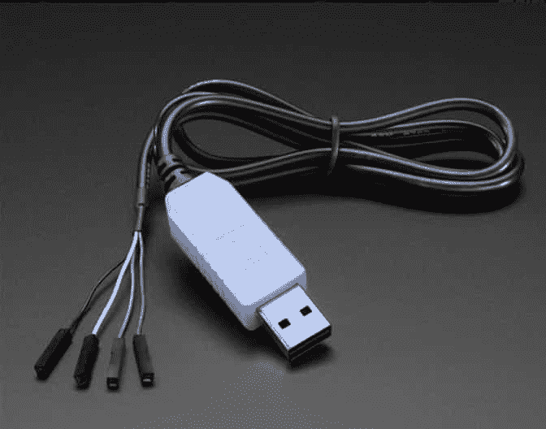

考虑到电缆使用 3.3 伏电压很重要，但我们并不在乎，因为我们使用的是 ada 水果公司的电缆。经测试，它能在这种电压下工作。

要安装树莓派Zero并与之通信，您需要遵循以下步骤:

1.  你的电脑上必须有一个免费的 USB 端口。
2.  我们需要安装串行控制台电缆的驱动程序，以便系统可以识别硬件。我们建议您从[https://www .ada 水果. cimg/product-files/954/pl 2303 _ Corporative _ Driverinstler _ v1 _ 12 _ 0 . zip](https://www.adafruit.cimg/product-files/954/PL2303_Prolific_DriverInstaller_v1_12_0.zip)下载驱动程序。
3.  我们使用一个接口(控制台软件)，称为 PuTTY，运行在 Windows 计算机上；所以我们可以和我们的董事会，树莓派沟通。本软件可从[http://www.putty.org/](http://www.putty.org/)下载安装。
4.  对于连接，我们需要将红色电缆连接到 **5** 伏，将黑色电缆接地，将白色电缆连接到 **TXD** 引脚，将绿色电缆连接到树莓 Pi Zero 上的 RXD 引脚。
5.  电缆的另一侧将插头连接到 USB 端口。

这是连接的图像；这是为了硬件配置:

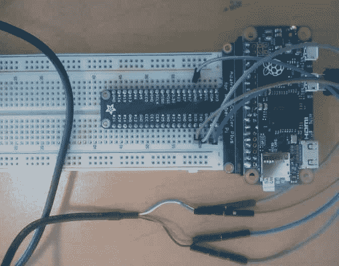

## 测试和访问串行通讯接口

一旦安装了驱动程序，这里就有了已经安装的端口组件:

### 类型

此配置用于 Windows 安装；如果你有不同的操作系统，你需要做不同的步骤。

**如何进入设备管理器画面**:在你的 windows PC 上，点击**开始**图标，进入控制面板，选择系统，然后点击**设备管理器**。

在下面的截图中，可以看到 USB 串口的设备管理器:


1.  Open the terminal in PuTTY, and select Serial Communication as `COM3`, **Speed** as `115200`, **Parity** as **None**, and **Flow** **Control as None;** click on **Open:**

    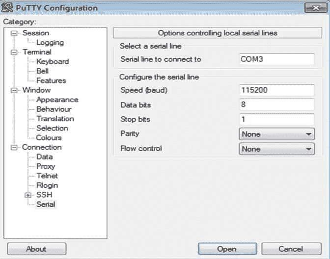

2.  When the blank screen appears, press *Enter* on your keyboard:

    

3.  This initiates a connection to your Pi board and asks for your username and password; you will see a screen like the following screenshot, with the authentication login:

    

4.  The default username for the Raspberry Pi Zero is `pi`, and the password is `raspberry`:

    

# 连接家庭网络并远程访问

我们的树莓皮将在一个真实的网络中工作，所以它需要设置为与所有设备一起工作。为此，我们需要配置我们的家庭网络。我们将向您展示如何使用以太网适配器和可以在树莓派Zero中使用的无线插头。

## 连接以太网适配器

如果你想把我们的树莓 Pi Zero 连接到本地网络，你需要使用一个 USB OTG 主机电缆-微霸 OTG 男性对女性从阿达水果。你可以在这里找到:[https://www.adafruit.com/products/1099](https://www.adafruit.com/products/1099)。我们使用的板没有以太网连接器，所以有必要使用它与外部设备通信。

在下图中，我们可以看到连接到树莓 Pi Zero 的以太网适配器:


这是您可以用来连接以太网适配器和网络链接的连接器:


现在，我们需要按照以下步骤配置以太网连接适配器:

1.  将适配器连接到转换器；我用了一个 **TRENDnet 网络适配器**，但是你可以用一个以太网集线器和一个带有 ada 水果公司的微型 USB OTG 连接器的 USB 集线器。你可以在这里找到:[https://www.adafruit.com/products/2992m](https://www.adafruit.com/products/2992m)。这是一个集线器，可以连接到以太网电缆或 USB 设备。
2.  验证路由器配置，两个指示灯开始闪烁后，您可以在配置中看到 IP 地址。DHCP 服务器将 IP 地址分配给树莓皮。

这是您在主机名**raspberrpi**上看到的路由器配置:


## 通过 SSH 访问树莓 Pi Zero

由于我们知道树莓 Pi 的 IP 地址，我们将使用 PuTTY 终端访问它，如下面的截图所示。需要输入 IP 地址，默认端口为`22`；点击**打开**按钮:

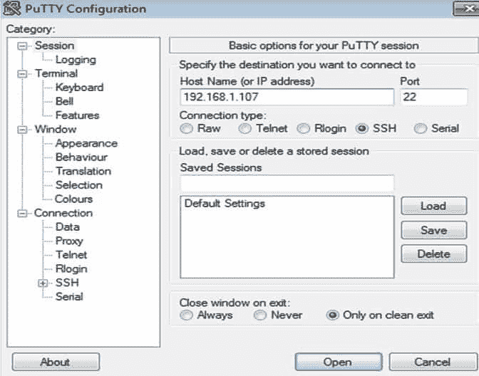

之后，我们有如下登录屏幕:


使用以下命令:

```js
sudo ifconfig -a

```

我们现在可以看到有关以太网控制器适配器配置的信息。 **Eth0** 是以太网适配器:


## 连接到无线网络

在本节中，我们将向您展示如何配置您的无线网络连接，以便您的树莓派Zero可以与您的无线网络互动。首先，我们需要使用通用串行总线 OTG 电缆将微型无线网卡(802.11b/g/n)连接到树莓皮:


# 如何安装无线工具

使用以下命令配置无线网络:

```js
sudo apt-get install wireless-tools

```

在下面的截图中，我们可以看到`ifconfig`命令的结果:

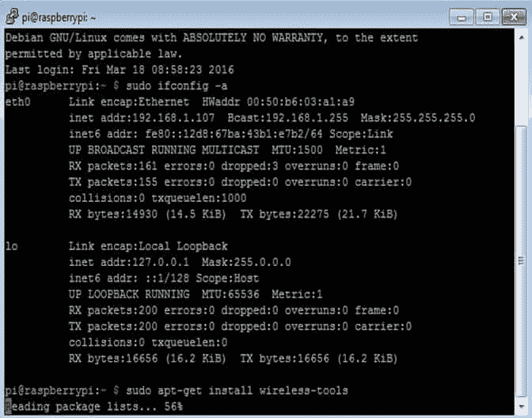

执行完命令后，我们会看到安装`wireless-tools`的结果:


## 配置 IP 地址和无线网络

要进行网络配置，我们需要为设备分配一个 IP 地址，以便参与网络。

输入以下命令:

```js
sudo nano etc/network/interfaces

```


在以下名为`interface`的配置文件中，我们解释了需要添加到文件中的内容，以便我们可以将树莓 Pi Zero 连接到无线网络进行 **Wlan0** 连接。

我们开始文件配置；它意味着文件的开头:

```js
auto lo 

```

我们为本地主机配置以太网设备`loopback`并启动 DHCP 服务器:

```js
iface lo inet loopback 
iface eth0 inet dhcp 

```

允许配置无线连接的`wlan0`:

```js
allow-hotplug wlan0 
auto wlan0
```

我们启动无线网络连接的 DHCP 服务器，输入你的名字`ssid`和密码。我们需要输入您的无线网络的`ssid`和`password`参数:

```js
iface wlan0 inet dhcp 
        wpa-ssid "ssid" 
        wpa-psk "password" 

```

# 测试通信

我们需要测试设备是否对另一台主机做出响应。现在，如果一切配置良好，我们可以在 Wi-Fi 连接中看到以下 IP 地址:


我们可以在路由器配置中看到分配给无线网络的当前 IP 地址:


## 从电脑上 Ping

将计算机连接到与树莓皮相同的网络:


你需要 ping 树莓皮的 IP 地址。在我们 ping 通树莓皮无线连接的 IP 地址后，我们会看到以下结果:

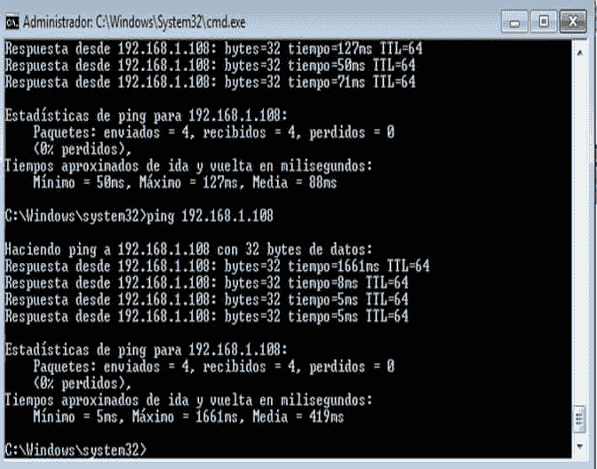

# 更新包存储库

这将通过从官方的树莓 Pi 存储库中下载所有最新的包来升级您的 Pi 板，因此这是确保您的板连接到互联网的一个很好的方法。然后，在您的计算机上键入以下内容:

```js
sudo apt-get update

```

下面的截图显示了收集包数据的树莓皮:

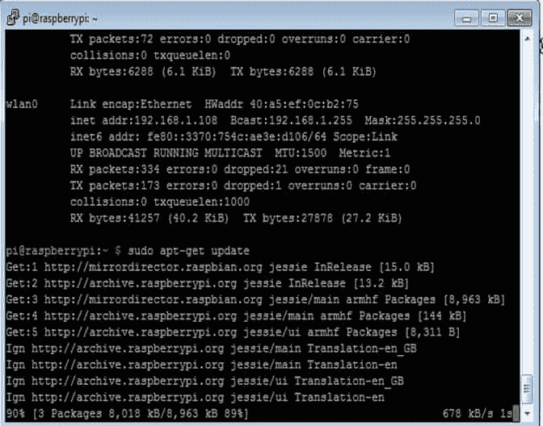

下面是安装完成后的结果:


# 远程桌面

在这一部分中，我们需要带有 Raspbian 操作系统的 **RDP** 包。为此，首先我们需要执行以下命令:

```js
sudo apt-get install xrdp 

```

此命令执行并安装 RDP 进程，并更新包:

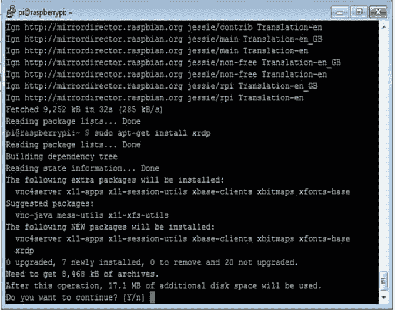

## 带窗口的远程桌面

在本章的最后，您希望能够使用远程桌面从自己的计算机访问该板；你需要输入你的树莓皮的 IP 地址，点击**连接**按钮:

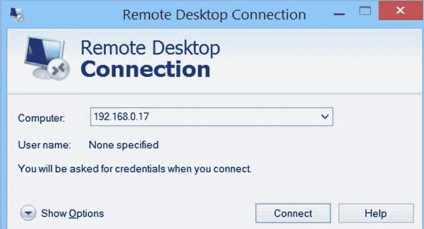

在我们键入树莓 Pi Zero 的 IP 地址后，我们将看到以下屏幕；有必要写下你的用户名和密码:

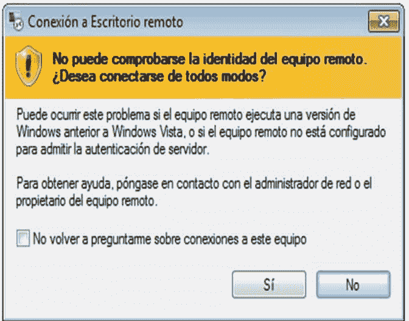

您需要您的树莓 Pi 的登录信息、用户名和密码:

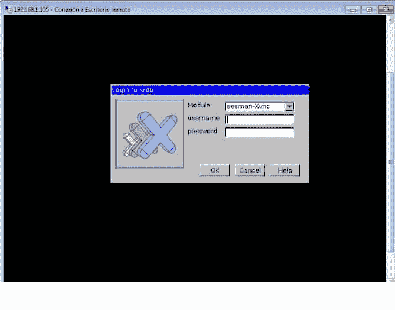

这是操作系统的主窗口；您已经使用远程桌面正确访问了您的树莓皮远程访问:

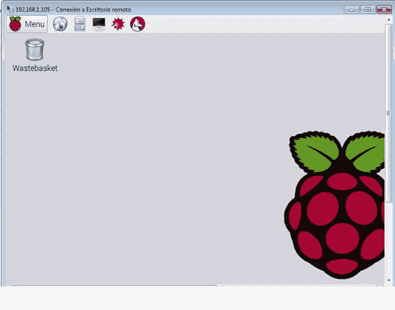

# 配置网络服务器

有几个可用的网络服务器，我们可以安装在你的树莓皮。我们要安装`lighttpd`网络服务器。此外，我们需要安装 PHP 支持，这将帮助我们在树莓皮中运行一个网站，并拥有动态网页。

要安装和配置，请通过 PuTTY 的终端控制台登录树莓 Pi:

1.  更新软件包安装程序:

    ```js
     sudo apt-get update

    ```

2.  安装`lighttpd`网络服务器:

    ```js
     sudo apt-get install lighttpd

    ```

一旦安装，它将作为后台服务自动启动；每次树莓馅饼启动时，它都会这样做:

1.  要设置我们用 PHP 5 编程的 PHP 5 接口，我们需要用以下命令安装`PHP5`模块支持；这是我们的服务器所必需的，它可以执行 PHP 文件，这样我们就可以制作我们的网站:

    ```js
     sudo apt-get install php5-cgi

    ```

2.  现在我们需要在我们的网络服务器上启用`PHP FastCGI`模块:

    ```js
     sudo lighty-enable-mod fastcgi-php

    ```

3.  最后一步，我们必须使用以下命令重启服务器:

    ```js
     sudo /etc/init.d/lighttpd

    ```

在下面的截图中，我们显示了当我们配置 web 服务器和 PHP 5 界面时将出现的页面内容。网络服务器在`/var/www`位置安装一个测试占位符页面。在浏览器中键入您的树莓皮的 IP 地址，例如`http://192.168.1.105/`，出现以下屏幕，打开已配置服务器的活动页面:

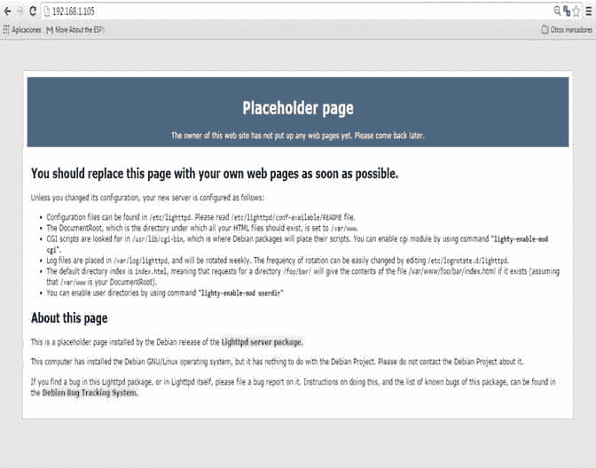

# 测试 PHP 安装

此时，我们需要用 PHP 测试我们的网站。这可以通过编写一个简单的 PHP 脚本页面来完成。如果 PHP 安装正确，它将返回关于其环境和配置的信息。

1.  转到下一个文件夹，那里是根文档:

    ```js
     cd /var/www/html 

    ```

2.  Create a file called `phpinfo.php`.

    我们使用`nano`这个词，这样我们就可以以特权进入系统的文件，并执行以下命令:

    ```js
     sudo nano phpinfo.php

    ```

3.  After creating the file, as given in the following screenshot, press *CTRL-X*, and then save the file:

    

4.  In your browser, enter the IP address of your Raspberry Pi, for example, `http://192.168.1.105/phpinfo.php`, and you should see the following screen:

    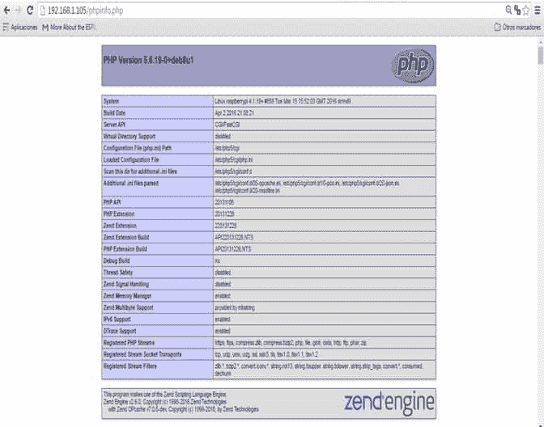

# 总结

在本书的第一章中，我们研究了如何配置我们的树莓 Pi Zero 板，以便我们可以在后面的章节中使用它。我们研究了圆周率需要什么组件，以及如何安装拉斯扁，以便我们可以在我们的板上运行软件。

我们还安装了一个网络服务器，我们将在本书的一些项目中使用它。在下一章中，我们将深入研究如何将设备连接到您的树莓皮和 Arduino 板。我们还将看看我们可以使用 GPIO 连接到树莓皮的各种东西。