# 第六章。从仪表板构建网络监控设备

在这一章中，我们将讨论这本书的一个非常重要的部分，创建一个可以从仪表板控制不同类型设备的网页。在自动化家庭中，有不同种类的设备可以被控制，例如:灯、门或窗、洗衣机等等。

在本章中，我们将涵盖以下主题:

*   配置 MySQL 数据库服务器
*   为管理数据库安装 phpmyadmin
*   MySQL 数据记录器
*   调暗发光二极管
*   控制 DC 马达的速度
*   用电路控制灯
*   控制门锁
*   控制浇水植物
*   从任何地方远程访问您的树莓 Pi Zero
*   控制灯光和测量电流消耗
*   从树莓 Pi Zero 控制和监控 Arduino、Wi-Fi 和以太网屏蔽、连接的设备和传感器

# 配置 MySQL 数据库服务器

在本节中，您将学习如何配置 MySQL 服务器，以便创建一个数据库并集成仪表板中的所有内容，从而在数据库中记录数据。

## 安装 MySQL

我们的树莓 Pi Zero 被配置成一个网络服务器。在本节中，我们将使用以下命令安装 MySQL 数据库服务器，这样我们就可以从客户端接收连接，显示存储在数据库中的数据，并在 SQL 中使用查询:

```js
sudo apt-get install mysql-server

```


在此过程中，它会向您询问`root`用户的密码:

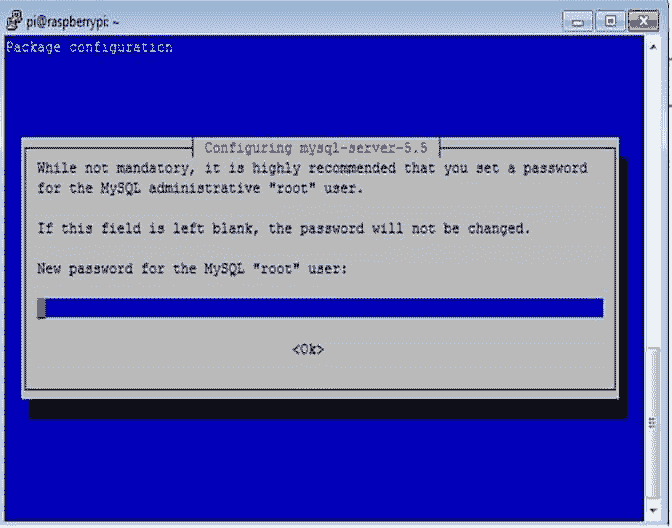

安装完成后，连接到 MySQL 并键入以下命令:

```js
mysql -u root -p

```


键入以下命令:

```js
show databases;

```

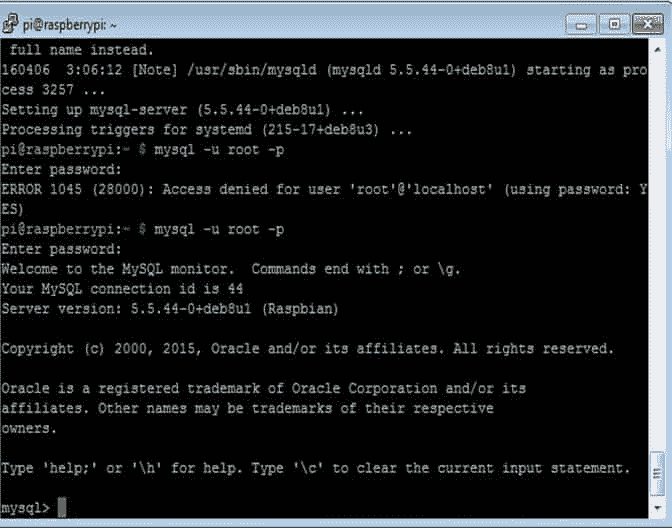

在这里，我们可以看到现在安装在服务器上的系统数据库:


## 安装 PHP 的 MySQL 驱动程序

重要的是安装我们的驱动程序来与 MySQL 数据库服务器通信 PHP5，为此我们需要 MySQL 驱动程序来访问 MySQL 数据库，执行此命令来安装`PHP-MySQL`驱动程序。

```js
sudo apt-get install php5 php5-mysql 

```

## 测试 PHP 和 MySQL

在本节中，我们将创建一个简单的页面，使用以下命令测试 PHP 和 MySQL:

```js
sudo nano /var/www/html/hellodb.php

```


下面的截图包含一个脚本，该脚本包含访问数据库、连接到服务器并从中获取数据的代码:

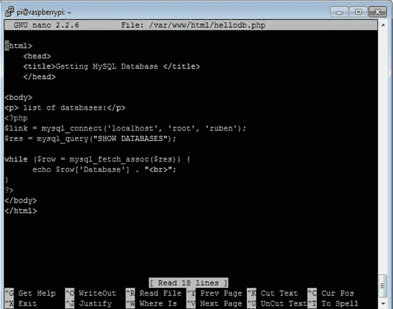

要测试 PHP 和 MySQL 之间的页面和连接，请键入您的树莓 Pi 的 IP 地址:`http://192.168.1.105/hellodb.php`。该页面应该类似于下面的截图:


# 安装 PhpMyAdmin 管理数据库

在本节中，我们将讨论如何配置您的 PhpMyAdmin，以便从远程面板管理您的数据库。我们在 Apache 服务器中安装客户端和模块 PHP5 非常重要，因此键入以下命令:

```js
sudo apt-get install mysql-client php5-mysql 

```

接下来我们将使用以下命令安装`phpmyadmin`包:

```js
sudo apt install phpmyadmin

```

在下面的截图中，我们可以看到服务器的配置；在这种情况下，我们需要选择 **apache2** :

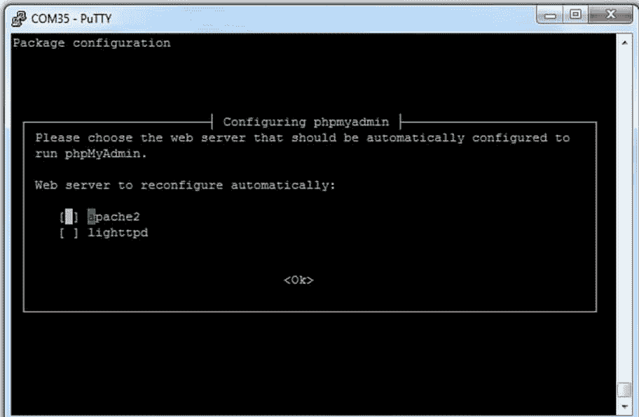

我们选择 apache2 服务器:


之后，我们可以选择数据库:

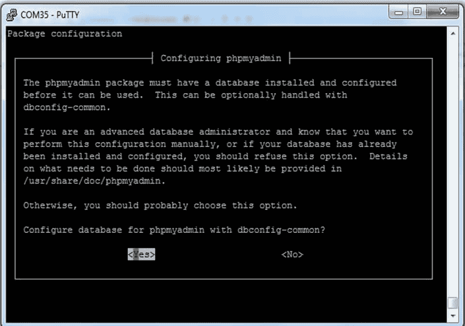

我们选择**选项<否>T1:**

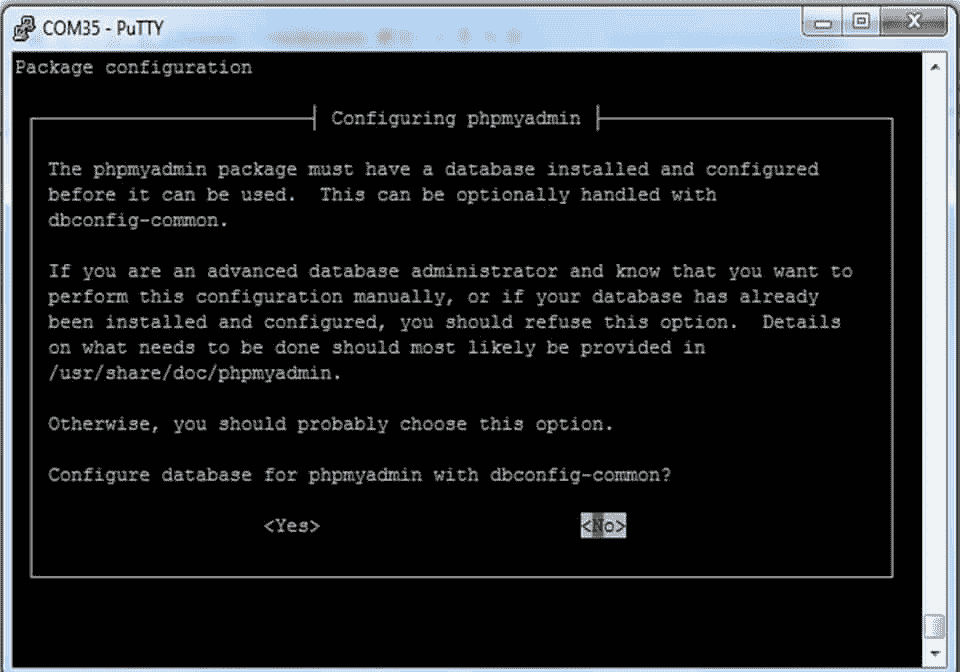

## 配置阿帕奇服务器

我们有必要对文件`apache2.conf`进行配置。首先去码头:

```js
sudo nano /etc/apache2/apache2.conf

```

在下面的屏幕中，我们需要添加代码:

```js
Include /etc/phpmyadmin/apche.conf

```

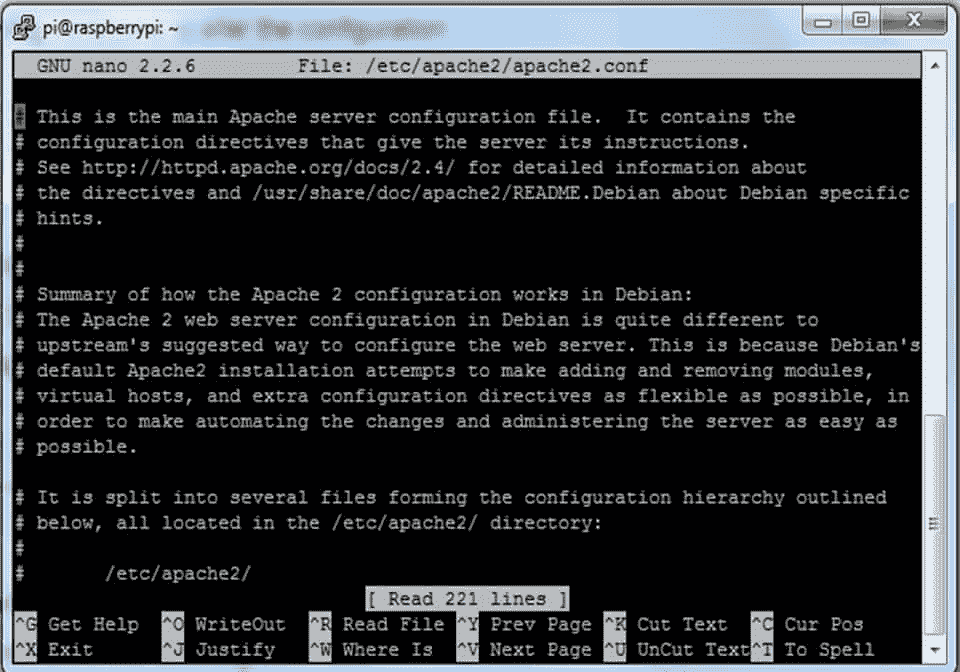

我们在文件的底部包含以下行:

```js
Include /etc/phpmyadmin/apche.conf

```


我们终于完成了 Apache 服务器的安装，现在我们已经为下一步做好了准备。

## 进入 phpMyAdmin 远程面板

在我们配置好服务器之后，我们将进入 phpMyAdmin 远程面板，我们需要打开我们最喜欢的网络浏览器，并键入我们的树莓 Pi 的 IP 地址:`http://(Raspberry Pi Address)/phpmyadmin`，它将显示以下屏幕:

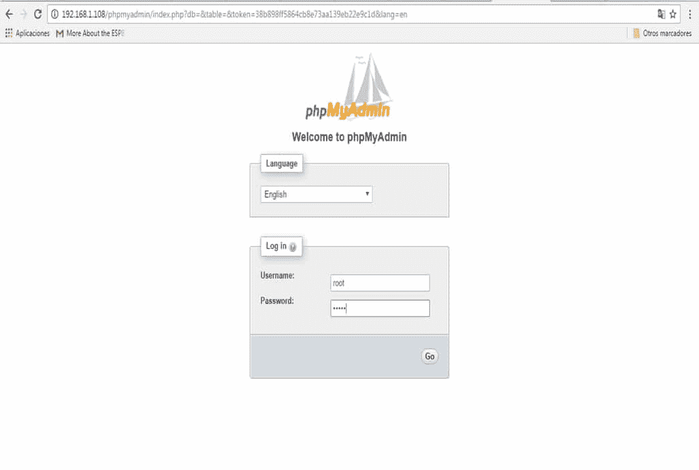

## 显示 Arduinobd 数据库

下面的屏幕截图显示了在服务器中创建的数据库:

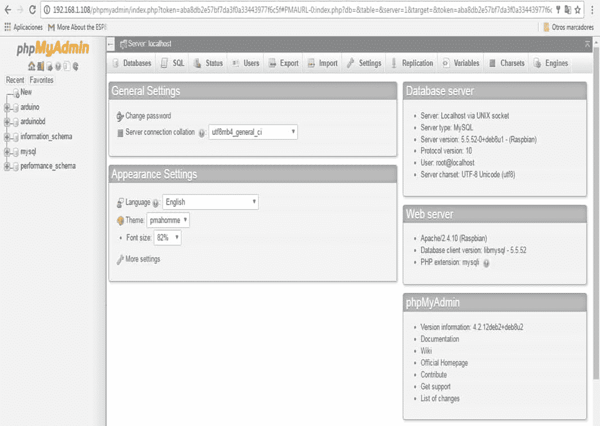

以下截图显示了表**测量值**，列， **id** ，**温度**和**湿度**:

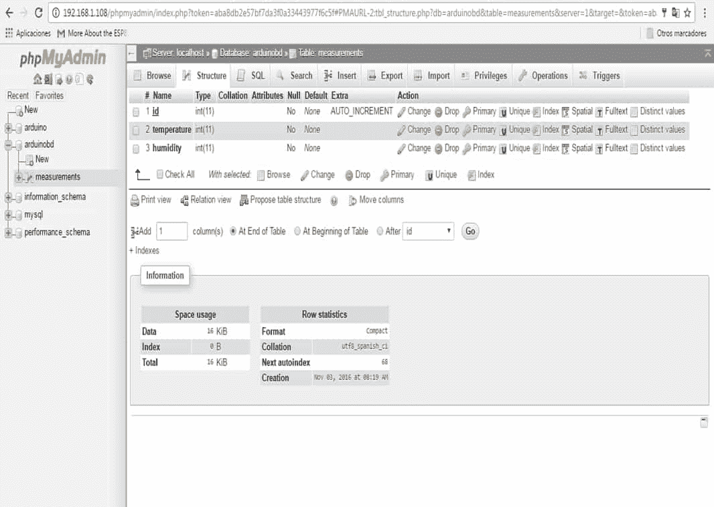

## 从 Arduino 和以太网屏蔽向 web 服务器发送数据

我们使用一个 Arduino 和以太网屏蔽连接到网络，Arduino 发送数据到网络服务器发表在树莓 Pi Zero。

现在，您可以将代码复制到名为`arduino_xaamp_mysql.ino`的文件中，或者从本书的代码文件夹中获取完整的代码:

我们输入 Arduino UNO 的 Ip 地址:

```js
IPAddress ip(192,168,1,50); 

```

我们配置树莓派零的 IP 地址:

```js
IPAddress server(192,168,1,108); 

```

我们需要连接到网络服务器:

```js
if (client.connect(server, 80)) 

```

这些行定义了来自远程服务器的 HTTP 请求:

```js
client.println("GET /datalogger1.php?temp=" + temp + "&hum=" + hum + " HTTP/1.1"); 
      client.println("Host: 192.168.1.108"); 
      client.println("Connection: close"); 
      client.println(); 

```

代码的其余部分显示在下面几行中:

```js
// Include libraries 
#include <SPI.h> 
#include <Ethernet.h> 
#include "DHT.h" 
// Enter a MAC address for your controller below. 
byte mac[] = { 0x90, 0xA2, 0xDA, 0x0E, 0xFE, 0x40 }; 
// DHT11 sensor pins 
#define DHTPIN 7  
#define DHTTYPE DHT11 
IPAddress ip(192,168,1,50); 
IPAddress server(192,168,1,108); 
EthernetClient client; 
DHT dht(DHTPIN, DHTTYPE); 
void setup() { 
  // Open serial communications 
  Serial.begin(9600); 
      Ethernet.begin(mac, ip); 
  Serial.print("IP address: "); 
  Serial.println(Ethernet.localIP()); 
  delay(1000); 
  Serial.println("Conectando..."); 

} 
void loop() 
{ 
  float h = dht.readHumidity(); 
  float t = dht.readTemperature(); 
  String temp = String((int) t); 
  String hum = String((int) h); 
    if (client.connect(server, 80)) { 
    if (client.connected()) { 
      Serial.println("conectado"); 

```

发出一个 HTTP 请求:

```js
      client.println("GET /datalogger1.php?temp=" + temp + "&hum=" + hum + " HTTP/1.1"); 
      client.println("Host: 192.168.1.108"); 
      client.println("Connection: close"); 
      client.println(); 
    }  
    else { 
      // If you didn't get a connection to the server 
      Serial.println("fallo la conexion"); 
    } 

```

Thes 线定义了客户端实例如何读取响应:

```js
    while (client.connected()) { 
      while (client.available()) { 
      char c = client.read(); 
      Serial.print(c); 
      } 
    } 

```

如果服务器断开连接，请停止客户端:

```js
    if (!client.connected()) { 
      Serial.println(); 
      Serial.println("desconectado."); 
      client.stop(); 
    } 
  } 

```

每秒重复一次:

```js
  delay(5000); 
} 

```

这里我们可以看到我们使用的硬件:


# 使用 MySQL 的数据记录器

在下一节中，我们将构建一个数据记录器，它将记录服务器中的数据温度和湿度，这样我们就可以随时获取数据并将其显示在网页上。

## 编写脚本软件

在下面的代码中，我们有一个将与 Arduino 板通信的脚本，它安装在服务器中。

现在，您可以将代码复制到名为`datalogger1.php`的文件中，或者直接从这个项目的文件夹中获取完整的代码:

```js
<?php 
if (isset($_GET["temp"]) && isset($_GET["hum"])) { 
$temperature = intval($_GET["temp"]); 
$humidity = intval($_GET["hum"]); 
$con=mysql_connect("localhost","root","ruben","arduinobd"); 
mysql_select_db('arduinobd',$con); 
      if(mysql_query("INSERT INTO measurements (temperature, humidity) VALUES ('$temperature', '$humidity');")){ 
        echo "Data were saved"; 
      } 
      else { 
      echo "Fail the recorded data"; 
      } 
mysql_close($con); 
} 
?> 

```

## 测试连接

在我们安装好脚本的文件后，我们需要在你的电脑上打开一个网页浏览器，输入你的`Raspberry Pi/datalogger1.php?temp=70&hum=100`的 IP 地址，链接会看起来像**(http://192 . 168 . 1 . 108/datalogger 1 . PHP？temp=70 & hum=100)** :

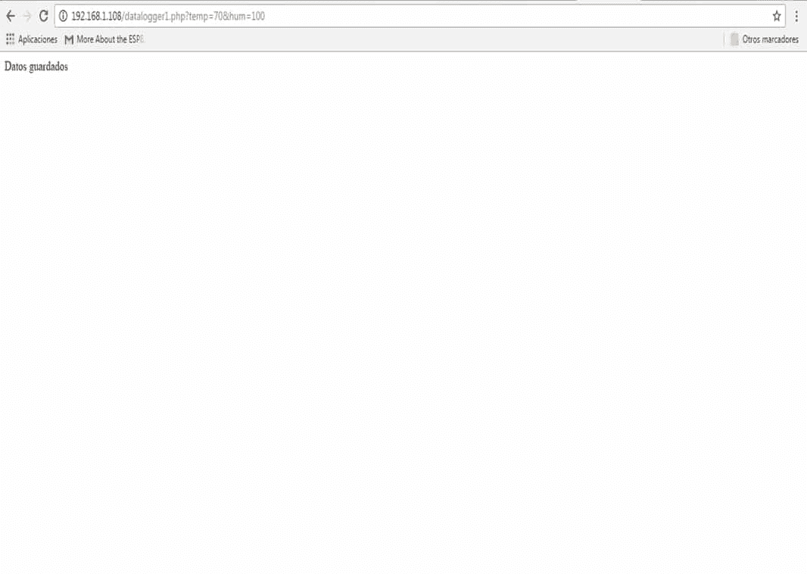

以下屏幕截图显示了保存在数据库中的数据的结果:


下面的截图显示了数据表:

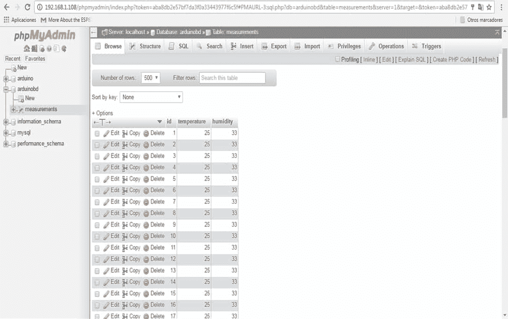

# 来自数据库的数据查询

记录数据并进行一些查询以使数据显示在网页上是很重要的。

## 脚本软件

下面是我们用来显示页面中数据的脚本:

现在，您可以将代码复制到名为`query1.php`的文件中，或者直接从这个项目的文件夹中获取完整的代码:

```js
<!DOCTYPE html> 
  <html> 
    <body> 
<h1>Clik on the buttons to get Data from  MySQL</h1> 
<form action="query1.php" method="get"> 
<input type="submit" value="Get all Data">  
</form> 
</br> 

<form action="query2.php" method="get"> 
<input type="submit"value="Humidity <= 15"> 
</form>  
</br> 

<form action="query3.php" method="get"> 
<input type="submit" value="Temperature <=25">  
</form> 
</br> 
<?php 

$con=mysql_connect("localhost","root","ruben","arduinobd"); 
mysql_select_db('arduinobd',$con); 
$result = mysql_query("SELECT * FROM measurements"); 
echo "<table border='1'> 
<tr> 
<th>Measurements</th> 
<th>Temperature (°C)</th> 
<th>Humidity (%)</th> 
</tr>"; 
while($row = mysql_fetch_array($result)) { 
  echo "<tr>"; 
  echo "<td>" . $row['id'] . "</td>"; 
  echo "<td>" . $row['temperature'] . "</td>"; 
  echo "<td>" . $row['humidity'] . "</td>"; 
  echo "</tr>"; 
} 
echo "</table>"; 
mysql_close($con); 
?> 
</body> 
</html> 

```

在下面的截图中，我们有数据:

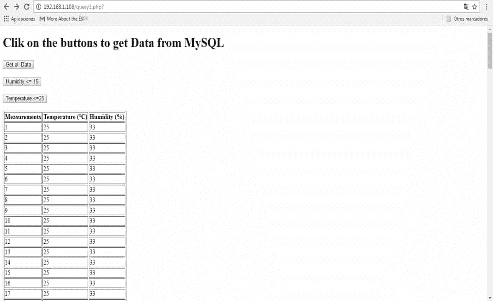

## 要显示的特定数据的脚本

在下面几行中，我们可以进行一些 SQL 查询，以获得特定值的信息，并从温度和湿度中获取值:

```js
<?php 
$con=mysql_connect("localhost","root","ruben","arduinobd"); 
mysql_select_db('arduinobd',$con); 
$result = mysql_query("SELECT * FROM measurements where humidity <= 15 order by id"); 
echo "<table border='1'> 
<tr> 
<th>Measurements</th> 
<th>Temperature (°C)</th> 
<th>Humidity (%)</th> 
</tr>"; 
while($row = mysql_fetch_array($result)) { 
  echo "<tr>"; 
  echo "<td>" . $row['id'] . "</td>"; 
  echo "<td>" . $row['temperature'] . "</td>"; 
  echo "<td>" . $row['humidity'] . "</td>"; 
  echo "</tr>"; 
} 
echo "</table>"; 
mysql_close($con); 
?> 

```

## 查询记录温度

在本节中，我们将创建一个查询来获取温度测量值。我们将服务器引用称为`localhost`，在这种情况下，它是树莓 Pi 零设备、用户和数据库的名称:

```js
<?php 
$con=mysql_connect("localhost","root","ruben","arduinobd"); 
mysql_select_db('arduinobd',$con); 
$result = mysql_query("SELECT * FROM measurements where temperature <= 25 order by id"); 
echo "<table border='1'> 
<tr> 
<th>Measurements</th> 
<th>Temperature (°C)</th> 
<th>Humidity (%)</th> 
</tr>"; 
while($row = mysql_fetch_array($result)) { 
  echo "<tr>"; 
  echo "<td>" . $row['id'] . "</td>"; 
  echo "<td>" . $row['temperature'] . "</td>"; 
  echo "<td>" . $row['humidity'] . "</td>"; 
  echo "</tr>"; 
} 
echo "</table>"; 
mysql_close($con); 
?> 

```

查询结果如下图所示:


# 控制和调暗发光二极管

在本节中，我们将讨论一个可以应用于家庭自动化的项目。我们将调暗 DC 的一个发光二极管，这可以对房子里的一盏灯做到。LED 会改变亮度，我们将 LED 连接到树莓 Pi 的 **GPIO18** 上，串联一个 *330* 欧姆的电阻。

## 软件需求

首先我们需要安装`pigpio`包。在终端中，键入以下内容:

```js
wget abyz.co.uk/rpi/pigpio/pigpio.zip

```

然后解压缩包:

```js
unzip pigpio.zip

```

之后，使用以下命令导航到解压缩的文件夹:

```js
cd PIGPIO

```

键入以下内容来执行命令:

```js
Make

```

最后安装文件:

```js
sudo make install

```

## 测试发光二极管

在本节中，我们将使用 **Node.js** 中的脚本测试传感器:

```js
var Gpio = require('pigpio').Gpio; 

// Create led instance 
var led = new Gpio(18, {mode: Gpio.OUTPUT}); 
var dutyCycle = 0; 
// Go from 0 to maximum brightness 
setInterval(function () { 
  led.pwmWrite(dutyCycle); 
  dutyCycle += 5; 
  if (dutyCycle > 255) { 
    dutyCycle = 0; 
  } 
}, 20); 

```

我们已经可以测试这个代码，使用 Pi 上的终端导航到这个项目的文件夹，并键入以下内容:

```js
sudo npm install pigpio

```

这将安装所需的`node.js`模块来控制发光二极管。然后，键入以下内容:

```js
sudo node led_test.js

```

这是最后的结果:


## 从接口控制发光二极管

在本节中，我们将从网页上控制发光二极管。为此我们将使用 HTML 制作与用户的界面，使用`node.js`。

让我们看看包含在以下代码中的 Node.js 文件:

```js
// Modules 
var Gpio = require('pigpio').Gpio; 
var express = require('express'); 
// Express app 
var app = express(); 

// Use public directory 
app.use(express.static('public')); 
// Create led instance 
var led = new Gpio(18, {mode: Gpio.OUTPUT}); 

// Routes 
app.get('/', function (req, res) { 

  res.sendfile(__dirname + '/public/interface.html'); 

}); 
app.get('/set', function (req, res) { 

  // Set LED 
  dutyCycle = req.query.dutyCycle; 
  led.pwmWrite(dutyCycle); 

  // Answer 
  answer = { 
    dutyCycle: dutyCycle 
  }; 
  res.json(answer); 

}); 

// Start server 
app.listen(3000, function () { 
  console.log('Raspberry Pi Zero LED control'); 
}); 

```

现在终于到了测试我们应用的时候了！首先，从这本书的存储库中获取所有代码，并像以前一样导航到项目的文件夹。然后，用以下命令安装`express`:

```js
sudo npm install express

```

完成后，使用以下命令启动服务器:

```js
sudo node led_control.js

```

现在可以测试项目了，在电脑中打开网页浏览器，输入链接- `http://(Raspberry PI)/set?dutyCycle=20`，我们可以看到 LED 随着数值变化。

然后用`http://192.168.1.108:3000`打开你的网页浏览器，你应该会在一个基本的网页中看到这个控件:


# 控制 DC 电机的速度

房子里有窗户或车库门是很常见的。我们需要自动化这些设备，这样我们就可以用 DC 马达来移动这些物体。在本节中，我们将了解如何将 DC 电机连接到树莓 Pi。为此，我们将使用 L293D 电路来控制电机。

首先，我们将看到如何将电机连接到我们的树莓皮零板。在下图中，我们可以看到 LD293 芯片的引脚:

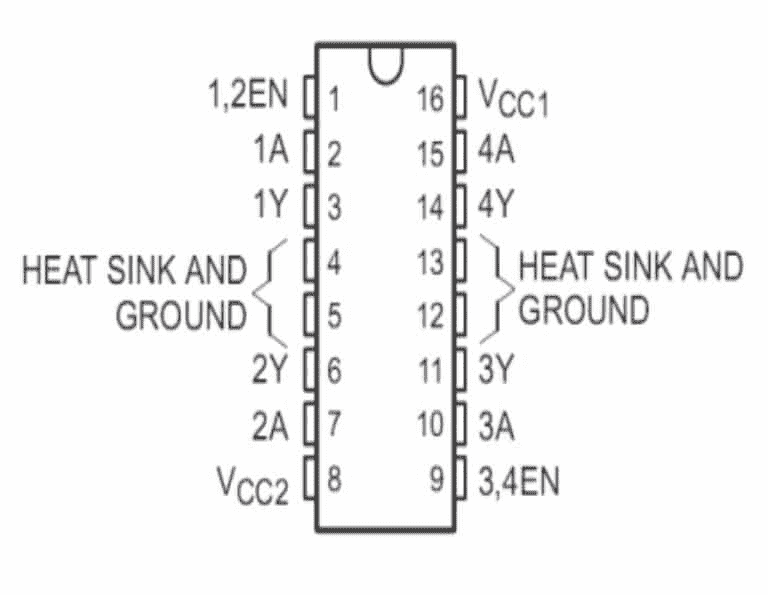

我们基本上需要连接电路的组件，如下所示:

*   **覆盆子皮的 GPIO14** 对销 **1A**
*   **覆盆子皮的 GPIO15** 对销 **2A**
*   树莓皮的 **GPIO18** 对销 **1** 、 **2EN**
*   **DC** 电机至销 **1Y** 和 **2Y**
*   **5V** 树莓皮至 **VCC1**
*   **树莓皮的 GND** 到 **GND**
*   适配器调节器至 **VCC2** 和 **GND**

下图显示了结果:

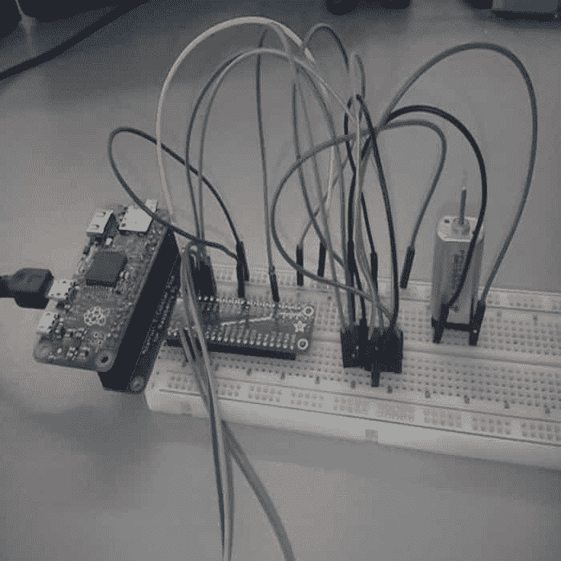

我们现在将测试 DC 马达从 0 到最高速度的速度:

```js
// Modules 
var Gpio = require('pigpio').Gpio; 
// Create motor instance 
var motorSpeed = new Gpio(18, {mode: Gpio.OUTPUT}); 
var motorDirectionOne = new Gpio(14, {mode: Gpio.OUTPUT}); 
var motorDirectionTwo = new Gpio(15, {mode: Gpio.OUTPUT}) 

// Init motor direction 
motorDirectionOne.digitalWrite(0); 
motorDirectionTwo.digitalWrite(1); 
var dutyCycle = 0; 

// Go from 0 to maximum brightness 
setInterval(function () { 
  motorSpeed.pwmWrite(dutyCycle); 
  dutyCycle += 5; 
  if (dutyCycle > 255) { 
    dutyCycle = 0; 
  } 
}, 20); 

```

下面是这个应用的代码，它使用网页中的界面来控制 DC 电机:

```js
// Modules 
var Gpio = require('pigpio').Gpio; 
var express = require('express'); 

// Express app 
var app = express(); 
// Use public directory 
app.use(express.static('public')); 

// Create led instance 
var motorSpeed = new Gpio(18, {mode: Gpio.OUTPUT}); 
var motorDirectionOne = new Gpio(14, {mode: Gpio.OUTPUT}); 
var motorDirectionTwo = new Gpio(15, {mode: Gpio.OUTPUT}); 

// Routes 
app.get('/', function (req, res) { 

  res.sendfile(__dirname + '/public/interface.html'); 

}); 

app.get('/set', function (req, res) { 
  // Set motor speed 
  speed = req.query.speed; 
  motorSpeed.pwmWrite(speed); 

  // Set motor direction 
  motorDirectionOne.digitalWrite(0); 
  motorDirectionTwo.digitalWrite(1); 

// Answer 
  answer = { 
    speed: speed 
  }; 
  res.json(answer); 

}); 

// Start server 
app.listen(3000, function () { 
  console.log('Raspberry Pi Zero Motor control started!'); 
}); 

```

我们在下面的代码中看到了用户界面:

```js
$( document ).ready(function() { 

  $( "#motor-speed" ).mouseup(function() { 

    // Get value 
    var speed = $('#motor-speed').val(); 

    // Set new value 
    $.get('/set?speed=' + speed); 

  }); 

}); 

<!DOCTYPE html> 
<html> 

<head> 
  <script src="https://code.jquery.com/jquery-2.2.4.min.js"></script> 
  <link rel="stylesheet" href="https://maxcdn.bootstrapcdn.com/bootstrap/3.3.6/css/bootstrap.min.css"> 
  <script src="https://maxcdn.bootstrapcdn.com/bootstrap/3.3.6/js/bootstrap.min.js"></script> 
  <script src="js/interface.js"></script> 
  <link rel="stylesheet" href="css/style.css"> 
  <meta name="viewport" content="width=device-width, initial-scale=1"> 
</head> 
<body> 

<div id="container"> 

  <h3>Motor Control</h3> 

  <div class='row'> 

    <div class='col-md-4'></div> 
    <div class='col-md-4 text-center'> 
     <input id="motor-speed" type="range" value="0" min="0" max="255" step="1"> 
    </div> 
    <div class='col-md-4'></div> 

  </div> 

</div> 

</body> 
</html> 

```

要测试这个应用，你需要用链接`http://192.168.1.108:3000`打开你电脑里的网页浏览器，然后你需要替换你的 Pi 的 IP 地址。这是我们的界面:

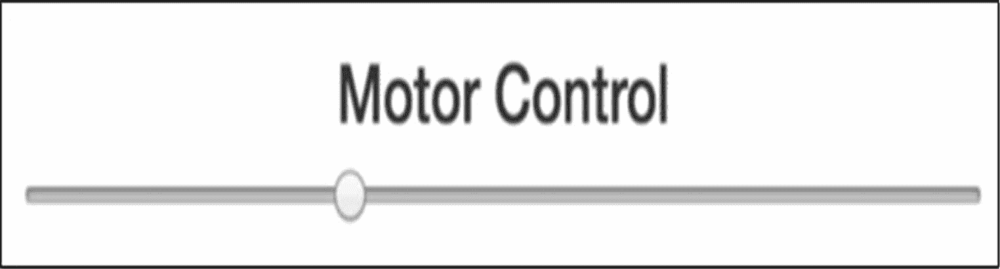

# 用电路控制灯光

在接下来的几节中，你会发现如何深入到更多控制室内其他设备的项目中的想法。

## 电器

在家里，我们有电器，例如，灯、洗衣机、加热器和其他我们只需要打开或关闭的电器。在本节中，我们将学习如何使用电路接口信号来控制连接到树莓 Pi Zero 的灯。我们将使用一个**光耦合器**，如 MOC3011，和一个**三端双向可控硅开关。**下图显示了该应用的电路:

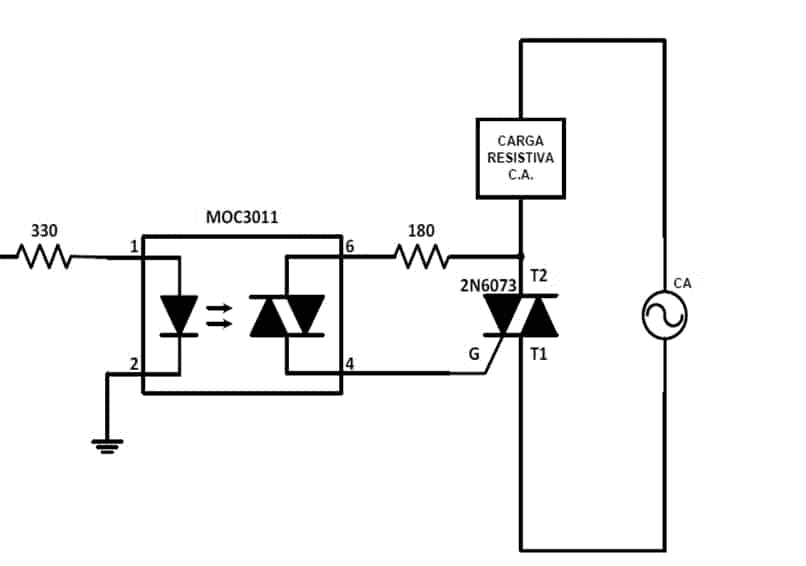

这里我们有最终项目连接到树莓 pi 零:


这里我们有用于控制设备的 JavaScript 代码:

```js
// Modules 
var express = require('express'); 

// Express app 
var app = express(); 

// Pin 
var lampPin = 12; 

// Use public directory 
app.use(express.static('public')); 

// Routes 
app.get('/', function (req, res) { 

  res.sendfile(__dirname + '/public/interface.html'); 

}); 

app.get('/on', function (req, res) { 

  piREST.digitalWrite(lampPin, 1); 

  // Answer 
  answer = { 
    status: 1 
  }; 
  res.json(answer); 

}); 

app.get('/off', function (req, res) { 

  piREST.digitalWrite(lampPin, 0); 

  // Answer 
  answer = { 
    status: 0 
  }; 
  res.json(answer); 

}); 

// aREST 
var piREST = require('pi-arest')(app); 
piREST.set_id('34f5eQ'); 
piREST.set_name('my_rpi_zero'); 

// Start server 
app.listen(3000, function () { 
  console.log('Raspberry Pi Zero lamp control started!'); 
}); 

```

我们需要一个可以从网页上用 HTML 语言控制灯的界面:

```js
<!DOCTYPE html> 
<html> 

<head> 
  <script src="https://code.jquery.com/jquery-2.2.4.min.js"></script> 
  <link rel="stylesheet" href="https://maxcdn.bootstrapcdn.com/bootstrap/3.3.6/css/bootstrap.min.css"> 
  <script src="https://maxcdn.bootstrapcdn.com/bootstrap/3.3.6/js/bootstrap.min.js"></script> 
  <script src="js/script.js"></script> 
  <link rel="stylesheet" href="css/style.css"> 
  <meta name="viewport" content="width=device-width, initial-scale=1"> 
</head> 

<body> 

<div id="container"> 

  <h3>Lamp Control</h3> 

  <div class='row'> 

    <div class='col-md-4'></div> 
    <div class='col-md-2'> 
      <button id='on' class='btn btn-block btn-primary'>On</button> 
    </div> 
    <div class='col-md-2'> 
      <button id='off' class='btn btn-block btn-warning'>Off</button> 
    </div> 
    <div class='col-md-4'></div> 

  </div> 

</div> 

</body> 
</html> 

```

进入网页浏览器后，我们会看到如下界面:

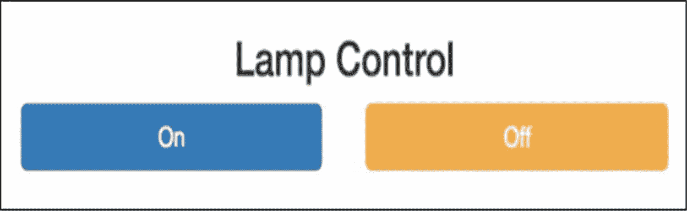

# 其他电器

在本节中，我们将展示您可以考虑创建和控制的其他应用，然后在家中或不同的区域使用它们。

## 控制门锁

在本节中，我们将看到可以从接口控制并连接到树莓 pi 的其他设备。在家里，我们可以通过网络界面控制门锁:


## 控制浇水

我们可以控制的另一个设备是给植物浇水的塑料水电磁阀- 12V，连接到树莓皮:


通过这个项目，我们可以制作一个自动浇水系统，增加一个湿度传感器，并设定花园植物浇水的时间。

# 从任何地方远程访问您的树莓 Pi Zero

如果我们想从网络外部访问我们的树莓 Pi，我们需要执行以下操作:

*   检查我们的调制解调器是否有公共 IP 地址
*   调查我们将在浏览器中使用的地址
*   Type [http://whatismyipaddress.com/](http://whatismyipaddress.com/) in our browser

    

互联网服务提供商提供的知识产权是经过一段时间后会发生变化的一般动态知识产权。在我们的情况下，我们需要静态地址，它不会偶尔改变。

## 如何访问我们的调制解调器进行配置

通过 Ip 地址(网关)访问我们的调制解调器，并转到端口寻址部分。配置指向我们的 web 服务器的端口 *80* (放入我们账号的 IP 地址)，这个 IP 地址就是自动分配给我们系统的 DHCP 服务器的那个。

这里有一些端口可以从调制解调器路由器转发:

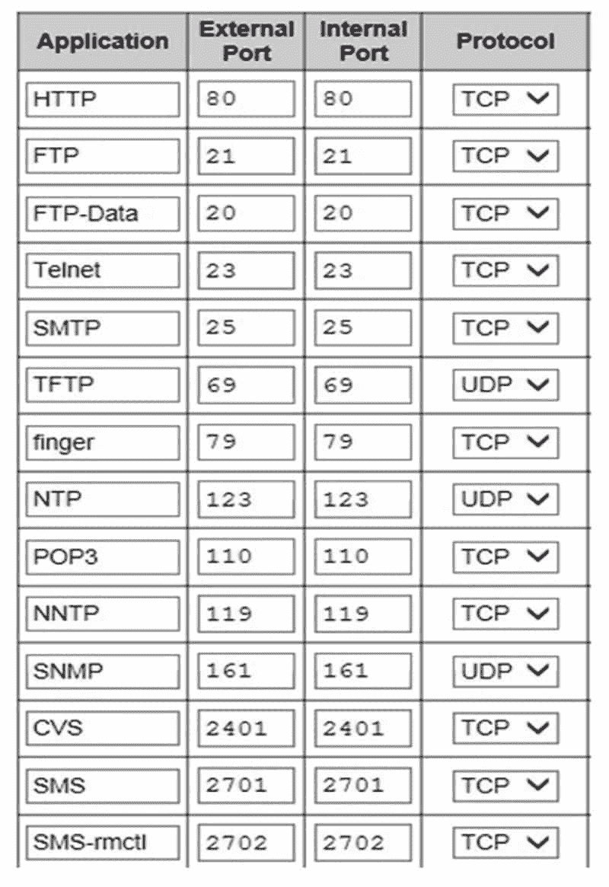

要获取网关的 IP 地址，输入`ipconfig`命令，你需要有管理员权限。之后，在你的`router.1`浏览器中输入`http://gatewayip_addres`:

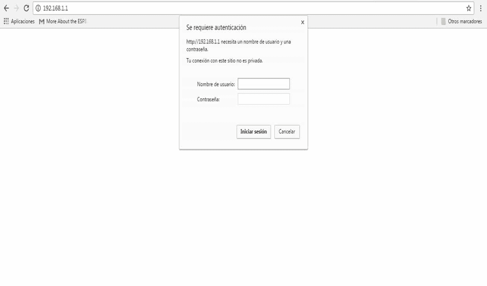

这是一个例子，如果你有一台 Linksys 路由器，你的可能是一个不同的接口:


要打开一个端口，我们需要配置我们的路由器，以允许从外部进入，因此我们需要在我们的路由器中给予许可:

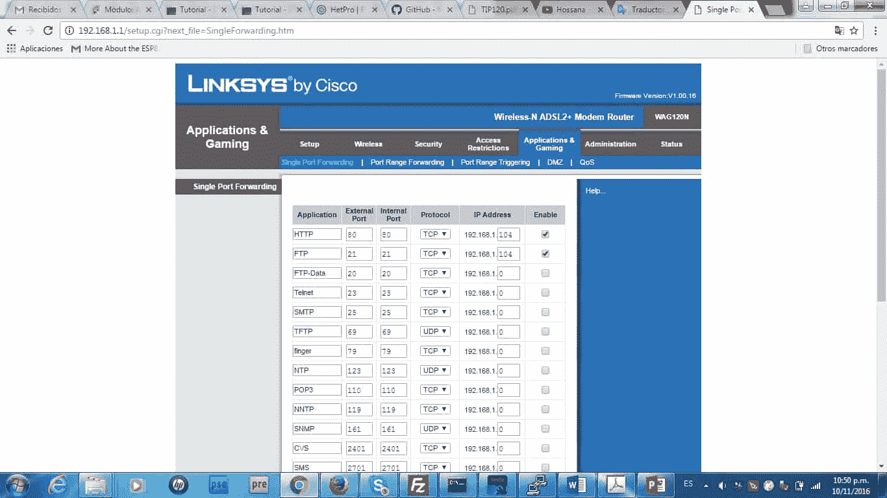

此截图显示了最终结果、如何打开端口号 3000 以及应用节点的名称:


## 配置动态域名系统

我们需要配置一个域名服务，这样我们就可以通过键入域名来访问我们的网络服务器(了解网页的 IP 地址非常困难)。这就是为什么**域名服务器(DNS)** 被创建的原因。按照下一节创建域。

您可能希望在离家很远的地方使用物联网控制面板。在这种情况下，您的网络服务器将需要成为互联网上的主机。

这不是一件简单的事情，因为它在你家的路由器后面。您的 ISP 通常不会给您一个静态的公共 IP 地址，因为大多数用户只是简单地访问网络，而不是提供网页。

因此，您路由器的公共端被赋予了一个可以随时更改的 IP 地址。如果你浏览到`<whatsmyip...>`，你会看到你的公共 IP 目前是什么。

明天可能会不同。要设置外部访问，您可以做两件事之一。如果你想模拟有一个静态的 IP，你可以使用一个服务，如动态域名系统。如果您只想“尝试”外部访问，可以在路由器上打开一个端口

拥有动态域名系统的好处:

*   一种解决方案是安装一个客户端，允许公共知识产权将其修复。客户端功能(安装在计算机上的软件)保持与站点[www.no-ip.org](http://www.no-ip.com)的通信。
*   当我们的调制解调器的 IP 地址改变时，客户端接受该 IP 改变。
*   这允许我们的域名总是指向我们的公共 IP 地址。安装的软件叫做:无 IP DUC。

## 在 No-ip.org 创建账户

在下面的截图中，我们可以看到增强动态域名系统设置:


# 控制灯光和测量电流消耗

现在，在这一部分，我们将解释如何控制和监控你的电流消耗时，灯是开着还是关着。使用网页上的 Arduino Wi-Fi 屏蔽，我们将监控这个变量。当灯熄灭时，它看起来如下:


灯亮时，它看起来如下:


现在，您可以将代码复制到名为`Controlling_lights_Current_Consumption.ino`的文件中，或者直接从本书的文件夹中获取完整的代码。

定义要监控的变量和函数:

```js
#define NUMBER_VARIABLES 2 
#define NUMBER_FUNCTIONS 1 

```

导入要使用的库:

```js
#include <Adafruit_CC3000.h> 
#include <SPI.h> 
#include <CC3000_MDNS.h> 
#include <aREST.h> 

```

将继电器配置为激活:

```js
const int relay_pin = 8; 

```

计算电流的变量:

```js
float amplitude_current; 
float effective_value; 
float effective_voltage = 110; 
float effective_power; 
float zero_sensor; 

```

我们定义用于配置模块的引脚:

```js
#define ADAFRUIT_CC3000_IRQ   3 
#define ADAFRUIT_CC3000_VBAT  5 
#define ADAFRUIT_CC3000_CS    10 
Adafruit_CC3000 cc3000 = Adafruit_CC3000(ADAFRUIT_CC3000_CS,  
ADAFRUIT_CC3000_IRQ, ADAFRUIT_CC3000_VBAT); 

```

我们创建实例:

```js
aREST rest = aREST(); 

```

我们定义您网络的 SSID 和密码:

```js
#define WLAN_SSID       "xxxxxxxx" 
#define WLAN_PASS       "xxxxxxxx" 
#define WLAN_SECURITY   WLAN_SEC_WPA2 

```

我们配置服务器的端口:

```js
#define LISTEN_PORT 80 

```

服务器实例:

```js
Adafruit_CC3000_Server restServer(LISTEN_PORT); 
MDNSResponder mdns; 

```

使用的变量:

```js
int power; 
int light; 

```

发布使用的变量:

```js
void setup(void) 
{   
  Serial.begin(115200); 
  rest.variable("light",&light); 
  rest.variable("power",&power); 

```

设置作为输出的继电器引脚:

```js
pinMode(relay_pin,OUTPUT); 

```

校准电流传感器:

```js
  zero_sensor = getSensorValue(A1); 

```

我们声明设备的 id 和名称:

```js
  rest.set_id("001"); 
  rest.set_name("control"); 

```

在本部分中，我们检查设备是否已连接:

```js
  if (!cc3000.begin()) 
  { 
    while(1); 
  } 

  if (!cc3000.connectToAP(WLAN_SSID, WLAN_PASS, WLAN_SECURITY)) { 
    while(1); 
  } 
  while (!cc3000.checkDHCP()) 
  { 
    delay(100); 
  } 

```

在这一部分中，我们定义了通信请求:

```js
  if (!mdns.begin("arduino", cc3000)) { 
    while(1);  
  } 
  displayConnectionDetails(); 

```

让我们启动服务器:

```js
  restServer.begin(); 
  Serial.println(F("Listening for connections...")); 
} 

```

我们读取传感器:

```js
void loop() { 

  float sensor_reading = analogRead(A0); 
  light = (int)(sensor_reading/1024*100); 
  float sensor_value = getSensorValue(A1); 

```

我们计算电流并获取信号:

```js
  amplitude_current = (float)(sensor_value-zero_sensor)/1024*5/185*1000000; 
  effective_value = amplitude_current/1.414; 
  effective_power = abs(effective_value*effective_voltage/1000); 
  power = (int)effective_power; 
  mdns.update(); 

```

我们定义传入的请求:

```js
Adafruit_CC3000_ClientRef client = restServer.available(); 
  rest.handle(client); 
 } 

```

我们显示了 IP 地址配置:

```js
bool displayConnectionDetails(void) 
{ 
  uint32_t ipAddress, netmask, gateway, dhcpserv, dnsserv; 

  if(!cc3000.getIPAddress(&ipAddress, &netmask, &gateway, &dhcpserv, &dnsserv)) 
  { 
    Serial.println(F("Unable to retrieve the IP Address!\r\n")); 
    return false; 
  } 
  else 
  { 
    Serial.print(F("\nIP Addr: ")); cc3000.printIPdotsRev(ipAddress); 
    Serial.print(F("\nNetmask: ")); cc3000.printIPdotsRev(netmask); 
    Serial.print(F("\nGateway: ")); cc3000.printIPdotsRev(gateway); 
    Serial.print(F("\nDHCPsrv: ")); cc3000.printIPdotsRev(dhcpserv); 
    Serial.print(F("\nDNSserv: ")); cc3000.printIPdotsRev(dnsserv); 
    Serial.println(); 
    return true; 
  } 
} 

```

电流传感器的功能，用于计算特定测量值的平均值并返回当前计算值:

```js
float getSensorValue(int pin) 
{ 
  int sensorValue; 
  float avgSensor = 0; 
  int nb_measurements = 100; 
  for (int i = 0; i < nb_measurements; i++) { 
    sensorValue = analogRead(pin); 
    avgSensor = avgSensor + float(sensorValue); 
  }      
  avgSensor = avgSensor/float(nb_measurements); 
  return avgSensor; 
} 

```

## 建立控制和监控界面

这里我们有显示控制灯光和用传感器监控电流的界面的代码:

### 为 Node.js 安装 Jade

配置在这个项目中应用的 Jade 接口很重要。为此，我们只需键入以下命令:

```js
npm install arest express jade 

```

如果有必要，我们键入以下命令，以防您的系统需要更新:

```js
npm install pug

```

## 控制和监控界面

首先，我们定义页面的标题并添加 HTML 标记:

```js
doctype 
html 
  head 
    title Control and monitoring 

```

我们为 jQuery 和 Bootstrap 的函数定义了链接:

```js
link(rel='stylesheet', href='/css/interface.css') 
    link(rel='stylesheet',  
      href="https://maxcdn.bootstrapcdn.com/bootstrap/3.3.0/css/bootstrap.min.css") 
    script(src="https://code.jquery.com/jquery-2.1.1.min.js") 
    script(src="/js/interface.js") 

```

我们在网页中显示要控制的按钮:

```js
  body 
    .container 
      h1 Controlling lights 
      .row.voffset 
        .col-md-6 
          button.btn.btn-block.btn-lg.btn-primary#1 On 
        .col-md-6 
          button.btn.btn-block.btn-lg.btn-danger#2 Off 
      .row 

```

显示功率和光照水平:

```js
        .col-md-4 
          h3#powerDisplay Power: 
        .col-md-4 
          h3#lightDisplay Light level:  
        .col-md-4 
          h3#status Offline 

```

现在我们将运行该应用，如下面的截图所示。服务器在端口 3000 上打开，当它开始向主板发送请求时，在您的网络浏览器上键入地址:`http://localhost:3000`。它显示带有两个按钮的网页，并且设备已连接并在线:


点击上的蓝色**按钮激活板上的灯，几秒钟后我们可以看到电量增加:**

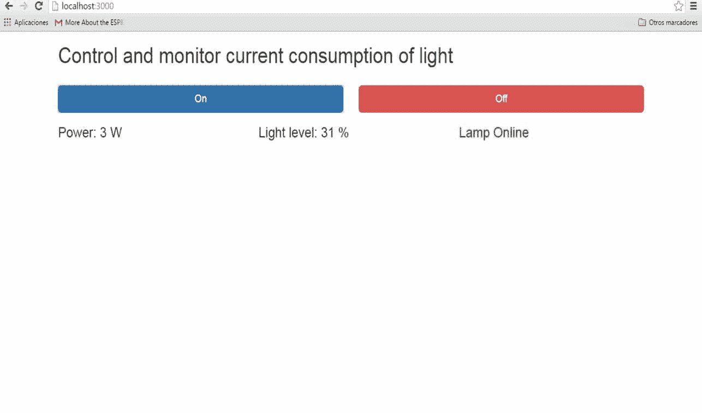

点击红色**关闭**按钮，几秒钟后断电直到 *0 W* ，这意味着一切工作正常:


# 控制和监控连接的设备和传感器上的 Arduino、Wi-Fi 和以太网屏蔽

在前几节中，我们看到了如何使用运行在 Windows 计算机上的`node.js`从网页上控制和监控我们的 Arduino 板。在这一节中，我们将使用安装了 Node.js 的神奇的树莓 Pi Zero，并在板内运行 JavaScript 应用。

我已经看到了该板的潜力，而不是使用安装为网络服务器的个人计算机，有了这种经验，使这个项目，我想告诉应用更有效地使用我们的树莓皮零运行在它上面。

我们将了解如何使用不同的设备在单个仪表板中控制多个设备，例如:

*   无线屏蔽
*   ESP8266 模块
*   以太网屏蔽

## 从单个接口构建控制和监控设备的代码

您现在可以将代码复制到一个名为`app.js`的文件中，或者从这个项目的文件夹中获取完整的代码。

配置系统中连接的设备的输出:

```js
$.getq('queue', '/lamp_control/mode/8/o'); 
$.getq('queue', '/lamp_control2/mode/5/o'); 

```

启动控制功能:

```js
$(document).ready(function() { 

```

我们向`ON:`的`aREST`应用编程接口提出`GET`请求

```js
// Function to control lamp Ethernet Shield 
  $("#1").click(function() { 
    $.getq('queue', '/lamp_control/digital/8/1'); 
  }); 

```

我们向`OFF:`的`ARESt`应用编程接口提出`GET`请求

```js
  $("#2").click(function() { 
    $.getq('queue', '/lamp_control/digital/8/0'); 
  }); 

```

我们为 ESP8266 连接设备`ON:`做了同样的事情

```js
//Function to control lamp ESP8266 
  $("#3").click(function() { 
    $.getq('queue', '/lamp_control2/digital/5/0'); 
  }); 

```

我们为 ESP8266 连接设备`OFF:`做了同样的事情

```js
$("#4").click(function() { 
    $.getq('queue', '/lamp_control2/digital/5/1'); 
  }); 

```

从温度和湿度传感器获取数据:

```js
  function refresh_dht() { 
        $.getq('queue', '/sensor/temperature', function(data) { 
      $('#temperature').html("Temperature: " + data.temperature + " C"); 
    }); 

  $.getq('queue', '/sensor2/temperature2', function(data) { 
      $('#temperature2').html("Temperature: " + data.temperature2 + " C"); 
    }); 

  $.getq('queue', '/sensor/humidity', function(data) { 
      $('#humidity').html("Humidity: " + data.humidity + " %"); 
    }); 
         $.getq('queue', '/sensor2/humidity2', function(data) { 
      $('#humidity2').html("Humidity: " + data.humidity2 + " %"); 
}); 
  } 

```

这段代码每 10000 秒刷新一次页面:

```js
refresh_dht(); 
setInterval(refresh_dht, 10000); 
}); 

```

## 增加监控设备

看得出系统很稳定；我们需要用 JavaScript 代码片段中的以下应用添加将从树莓 Pi Zero 监控的设备。

我们创建了快速模块和必要的库:

```js
var express = require('express'); 
var app = express(); 

```

我们定义将要打开的端口:

```js
var port = 3000; 

```

我们为 HTML 网页配置了 Jade 引擎:

```js
app.set('view engine', 'jade'); 

```

我们在上面建立了公共目录:

```js
app.use(express.static(__dirname + '/public')); 

```

要执行的服务器指令的接口:

```js
app.get('/', function(req, res){ 
res.render('interface'); 
}); 

```

我们宣布逮捕文件和其余请求:

```js
var rest = require("arest")(app); 

```

该代码定义了将被控制和监控的设备，我们可以添加我们想要的设备:

```js
rest.addDevice('http','192.168.1.108'); 
rest.addDevice('http','192.168.1.105'); 
rest.addDevice('http','192.168.1.107'); 
rest.addDevice('http','192.168.1.110'); 

```

我们在端口 3000 上设置服务器，并监听网络浏览器客户端:

```js
app.listen(port); 
console.log("Listening on port " + port); 

```

如果一切都配置完美，我们通过键入以下命令来测试应用:

```js
sudo npm install arest express jade

```

这将安装 Jade 平台，并从树莓 Pi Zero 识别`aREST` API。

如果需要更新，请键入以下命令:

```js
sudo npm install pug

```

要更新`arrest express`，请键入以下命令:

```js
sudo npm install pi-arest express 

```

非常重要的一点是，安装这个包以包含逮捕 API:

```js
sudo npm install arest --unsafe-perm

```

要运行应用，请转到应用所在的文件夹，并键入以下命令:

```js
node app.js

```

在下面的截图中，我们看到服务器正在打开端口 3000:


最后一个测试，我们需要在你最喜欢的网页浏览器中输入树莓皮的 IP 地址:`http://IP_Address_of_Raspberry_Pi_Zero/port`。

在下面的截图中，我们可以看到来自树莓 Pi Zero 的控制和监控数据仪表盘，发布在不同设备上的单个网页上，这是一件有趣的事情，比如一个远程系统和控制面板:

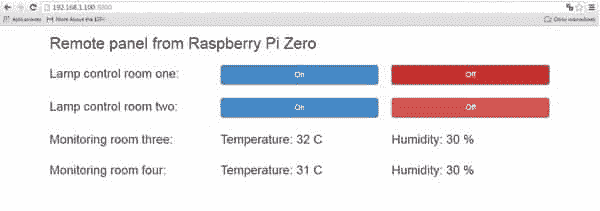

最后，我们通过展示控制和监控系统来结束，在单个数据仪表板中使用不同的设备；我们的结论是，对于物联网，我们可以在一个网页中拥有不止一个设备。

# 总结

在本章中，您学习了如何使用树莓 Pi Zero 和 Arduino 以及前几章中看到的技术来集成和构建用于监控的仪表板。本章向您介绍了基础知识和必要的工具，可以帮助您为不同的应用和领域创建自己的物联网系统，通过应用所有工具、网络服务器、数据库服务器、连接的设备，并设置路由器从世界任何地方控制您的树莓皮，可以为这些类型的系统开发这些系统。

在下一章中，您将为物联网构建非常好的设备；你将学习如何制作不同的迷你家居项目。