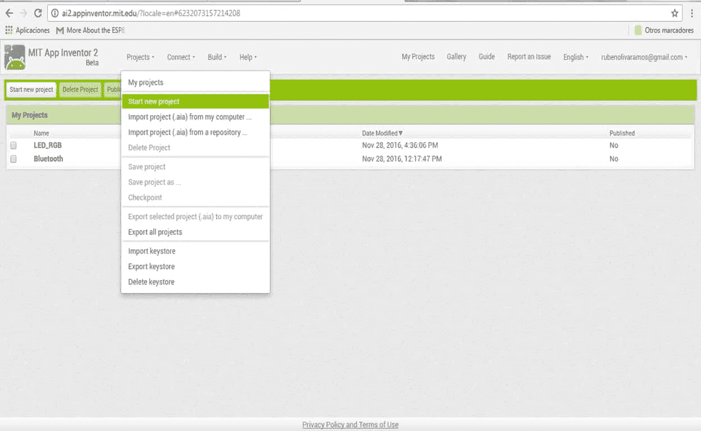
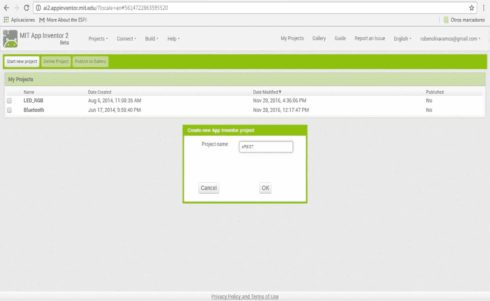
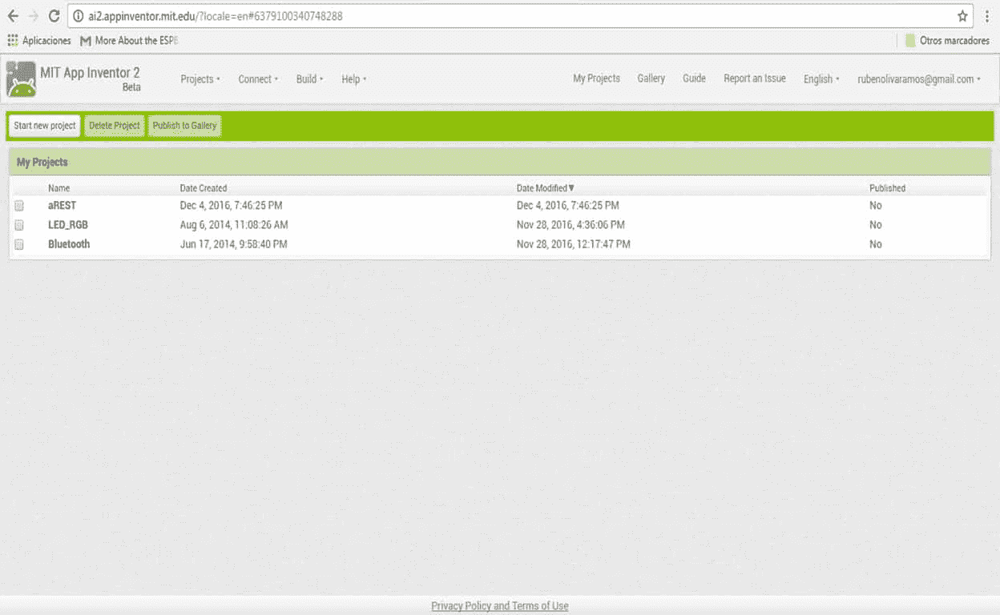
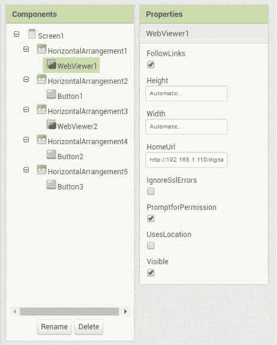
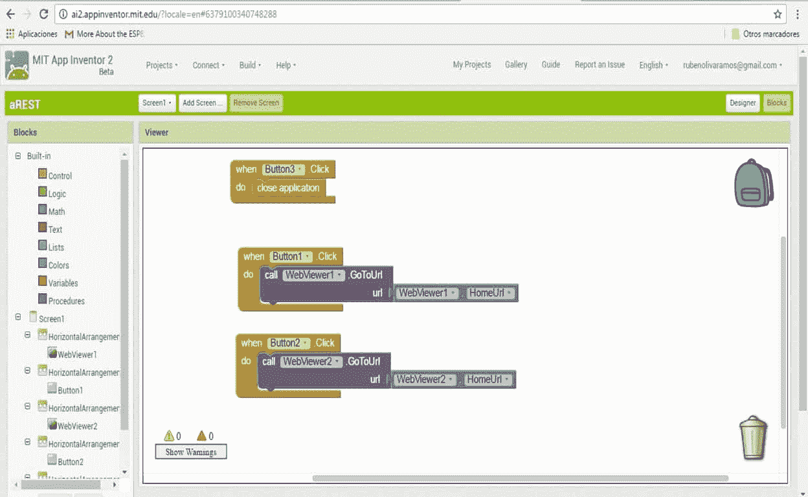
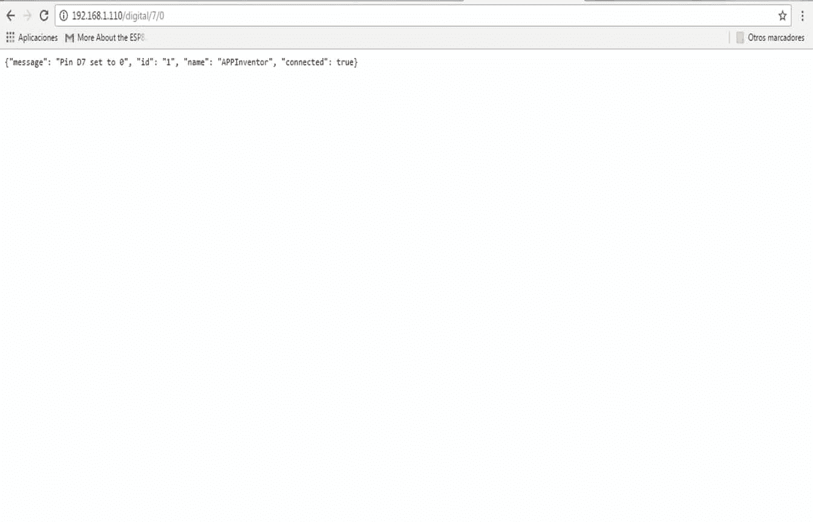
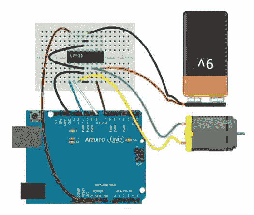
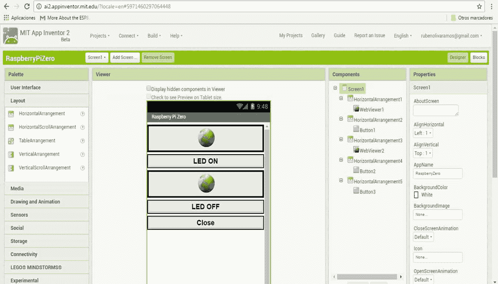
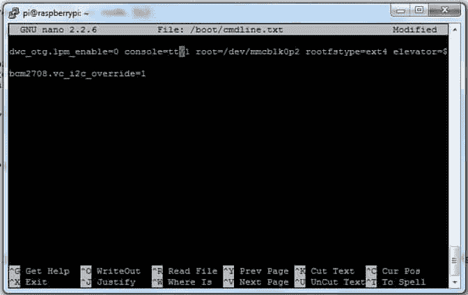

# 第八章。通过智能手机监控您的设备

在前面的章节中，我们已经看到了从 web 界面控制的项目。现在，在这一章中，我们将看到如何从安卓的本地应用中控制您的 Arduino 和树莓 Pi，使用平台来创建应用来控制和监控。

在本章中，我们将看到使用安卓工具的不同项目和应用，涉及的主题如下:

*   使用 APP Inventor 从智能手机控制继电器
*   使用以太网屏蔽在 Android Studio 中读取 JSON 响应
*   从安卓应用控制 DC 马达
*   使用你的树莓 Pi 零控制安卓系统的输出
*   通过蓝牙用树莓皮控制输出

# 使用 APP Inventor 从智能手机控制继电器

在本节中，我们将看到如何使用 **APP Inventor** 创建一个安卓应用，以控制连接到 Arduino 板的继电器。

## 硬件要求

项目所需的硬件如下:

*   继电器模块
*   烧板
*   以太网屏蔽
*   一些电缆

## 软件需求

项目所需的软件如下:

*   arduino 软件
*   您需要激活一个 Gmail 帐户

# 创建我们的第一个应用

安卓的 App Inventor 是一个开源网络应用，最初由谷歌提供，现在由麻省理工学院(MIT)维护。它允许计算机编程新手为安卓操作系统创建软件应用。它使用了一个图形界面，非常类似于 Scratch 和 StarLogo TNG 用户界面，允许用户拖放可视对象来创建一个可以在安卓设备上运行的应用。在创建 App Inventor 的过程中，谷歌利用了此前在教育计算领域的大量研究，以及谷歌内部在在线开发环境方面所做的工作。

APP inventor 在你的电脑上执行不需要安装任何软件；你只需要你的 Gmail 账号就可以访问 APP inventor 界面。

要进入 APP Inventor，您只需前往:[http://appinventor.mit.edu/explore/](http://appinventor.mit.edu/explore/)。

转到创建应用开始设计应用。

首先我们需要有一个 Gmail 账户；我们需要创建文件，如下图所示:


转到菜单**项目**和**开始新项目**:



写下项目的名称:


在下面的截图中，我们把我们项目的名字写成 **aREST** :



按下**确定**，我们将看到创建的项目:



## 设计界面

现在是时候看看如何创建应用的界面了，在我们创建项目之后，我们点击项目的名称，然后我们会看到下面的屏幕:


在我们左侧的用户界面中(你可以看到所有的对象)，要将一个对象移动到主屏幕，你只需拖动**网页查看器**和**按钮**，如下图所示:


在前面的截图中，我们可以看到我们将用来控制我们的 Arduino 板的应用的界面。

## 用 Arduino 以太网屏蔽与 APP Inventor 通信

现在我们将看到如何通过以太网网络与 Arduino 进行应用通信。

在**网页查看器**控件的属性中，我们将看到主页网址:



在这两个控件中，我们都有 Arduino 以太网屏蔽的 URL，我们将使用`RESTful`服务发出请求，我们将从应用发送以下请求:

*   `http://192.168.1.110/digital/7/1`
*   `http://192.168.1.110/digital/7/0`

## APP 发明人代码

原始版本的块编辑器在一个单独的 Java 进程中运行，使用`Open Blocks Java`库创建可视化块编程语言和编程。

我们有 APP inventor 的代码，当我们单击我们称为 web 服务的按钮时，您只需执行以下操作:

*   转到显示**阻止**的屏幕界面
*   每个按钮拖动`When...Do`块一次
*   在你刚才拖动的方块内，放入`Call...WebViewer.GoToUrl`方块
*   在区块的网址中，放入`WebViewer.HomeUrl`区块

要关闭应用:

*   拖动`When...Button.Click Do`块
*   在块内放置关闭应用块



当我们打开网络浏览器时，我们将得到以下结果:



下面的截图显示了手机上运行的应用:


下图显示了连接的最终结果:


# 使用以太网屏蔽在 Android Studio 中读取 JSON 响应

在本节中，我们将看到如何从 Arduino 板上读取响应并在 Android Studio 中读取。

在继续下一部分之前，我们需要做以下工作:

*   安装安卓工作室 IDE，可从:[https://developer.android.com/studio/index.html?hl=es-419](https://developer.android.com/studio/index.html?hl=es-419)获取
*   获取最新的安卓工作室软件开发工具包

然后我们会在 Android Studio 中创建一个项目，如下图截图所示:


然后我们选择我们想要使用的应用编程接口版本，点击**下一步**按钮:


然后选择一个**空白活动**，点击**下一步**按钮:


键入您的活动名称和布局，然后单击**完成**按钮:


# 安卓应用

在这一部分，我们将看到 android 应用。在你的文件夹中，打开关于安卓工作室的项目文件。

我们这里有接口代码中生成的 XML 代码:

```js
FrameLayout xmlns:android="http://schemas.android.com/apk/res/android" 
    xmlns:tools="http://schemas.android.com/tools" 
    android:id="@+id/container" 
    android:layout_width="match_parent" 
    android:layout_height="match_parent" 
    tools:context=".MainActivity"> 
    tools:ignore="MergeRootFrame"> 

    <WebView 
        android:id="@+id/activity_main_webview" 
        android:layout_width="match_parent" 
        android:layout_height="match_parent" /> 
</FrameLayout> 

```

## Java 类

当我们创建项目时，会自动生成一些类，如下面几行所示:

1.  班级名称:

    ```js
            import android.webkit.WebView; 

    ```

2.  主要类别:

```js
        public class MonitoringTemperatureHumidity extends
          ActionBarActivity { 

            private WebView mWebView; 

```

在 android 应用的这部分代码中，我们请求值:

```js
mWebView.loadUrl("http://192.168.1.110/temperature");
mWebView.loadUrl("http://192.168.1.110/humidity");
super.onCreate(savedInstanceState);
setContentView(R.layout.activity_monitoring_temperature_humidity);
```

我们定义将包含在主活动中的对象，在这种情况下是`mWebView`控件，它在应用的主活动中定义:

```js
    mWebView = (WebView)  findViewById(R.id.activity_main_webview);
    mWebView.loadUrl("http://192.168.1.110/humidity");
}
```

## 申请的许可

为了授予应用执行网络权限的权限，我们有必要在安卓清单文件中添加以下行:

```js
<uses-permission android:name="android.permission.INTERNET"/>
```

当应用被调试并安装在设备上时，我们会在屏幕上看到以下结果，显示`temperature`的值:


`humidity`的值:


# 使用安卓应用控制 DC 电机

在这一部分，我们将有一个应用将我们的智能手机与手机的蓝牙连接起来，它被称为 **Amarino** ，您可以从:[http://www.amarino-toolkit.net/index.php/home.html](http://www.amarino-toolkit.net/index.php/home.html)获得它。我们还将看到如何从安卓应用控制 DC 马达，让我们深入了解一下！

## 硬件要求

在下图中，我们看到以下电路(L293D)用于控制电机的速度和转动:


下图显示了电路与 Arduino 电路板的最终连接:



最终界面如下图所示:


下图显示了连接的最终结果:


# 使用你的树莓 Pi Zero 控制安卓系统的输出

在本节中，我们将看到如何使用在`Node.js`服务器中运行的`control.js`脚本来控制连接到树莓 Pi 的输出。

我们需要使用 android 应用控制 LED 输出的请求如下:

1.  `http://192.168.1.111:8099/ledon`
2.  `http://192.168.1.111:8099/ledoff`

    

在 APP Inventor 中创建的界面将类似于以下截图:



最终的电路连接如下图所示:


# 通过蓝牙用树莓皮控制输出

当你试图与其他使用蓝牙模块连接到树莓皮串行端口的电子设备进行通信时，情况就不同了。

这些模块购买起来非常便宜，实际的模块是我的模型中位于突破板上的绿板。纯 HC-05 仅适用于 *3.3V* 级，不适用于 *5V-TTL* 级。所以需要电平转换器。

在本节中，我们将树莓 Pi Zero 与蓝牙模块通信，并连接树莓 Pi 的引脚 **TX** 和 **RX** 。

首先，我们需要配置系统的文件以进行一些更改，从而激活树莓 Pi Zero TX 和 RX 的通信:



## 从安卓应用控制灯光

我们需要下载蓝牙终端，如下图截图所示:


以下屏幕截图显示了发送数字 1、2、3、4、5 和 6 的结果:


下图显示了项目的最后部分以及与 HC05 模块和树莓 Pi Zero 的连接:


# 总结

在本章中，您学习了如何通过蓝牙和以太网通信，使用安卓工作室和 APP inventor 从智能手机控制您的 Arduino 和树莓 Pi Zero。我们还研究了几个项目，例如控制电机、控制继电器模块以及读取湿度和温度。对于未来的项目，您现在可以在应用的任何领域控制和监控任何您想要的东西。

在下一章中，我们将整合前几章中的所有内容，并将其放在一起，以整合应用所有内容的所有知识。