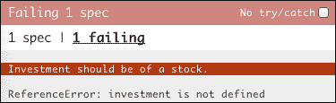
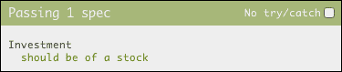
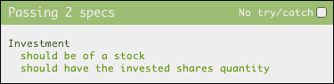
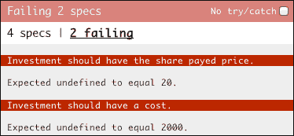
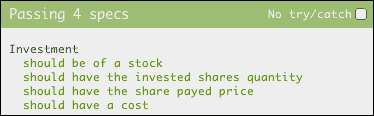
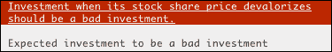

# 第二章。你的第一个规格

这一章是关于基础的。我们将指导您如何编写您的第一个规范，首先在测试中思考，并展示所有可用的全局 Jasmine 函数。到这一章结束时，你应该知道茉莉是如何工作的，并准备好开始自己做第一次测试。

# 投资跟踪器应用程序

为了让您开始，我们需要一个示例场景:假设您正在开发一个跟踪股票市场投资的应用程序。

下表更好地说明了用户如何在此应用程序上创建新投资:


添加投资的表单

该表单允许输入定义投资的三个值:

*   一个**符号**，代表用户投资的公司(股票)
*   用户购买(或投资)了多少**股**
*   用户每股支付了多少钱(股价**)**

 **### 类型

**下载示例代码**

您可以从您在[http://www.packtpub.com](http://www.packtpub.com)的账户中下载您购买的所有 Packt 书籍的示例代码文件。如果您在其他地方购买了这本书，您可以访问[http://www.packtpub.com/support](http://www.packtpub.com/support)并注册，以便将文件直接通过电子邮件发送给您。

如果你不熟悉股票市场的运作方式，想象一下你正在购买杂货。要进行购买，你必须具体说明你要买什么，要买多少东西，以及你打算付多少钱。这些概念转化为投资:

*   由一个符号定义的股票，如 PETO，可以理解为一种杂货类型
*   股份数量是您购买的物品数量
*   股价是每个项目的单价

一旦用户已经添加了一项投资，它必须与他或她的其他投资一起列出。


投资形式和清单

这个想法是展示他或她的投资进展如何。由于股票价格随时间波动，用户支付的价格和当前价格之间的差异表明这是一项好的(盈利)投资还是一项坏的(亏损)投资。

在上图中，我们可以看到用户有两项投资:

*   一只在 **AOUE** 股，该股盈利 **101.80%**
*   另一只在 **PETO** 股票中，该股亏损 **-42.34%**

这是一个非常简单的应用程序，随着开发的深入，我们将对它的功能有更深入的了解。

# BDD 中的茉莉基础与思维

基于之前提交的申请，我们可以开始编写 **验收标准** ，定义 **投资**:

*   给定一项投资，它应该是一只股票
*   给定一项投资，它应该有被投资的股票数量
*   给定一项投资，它应该有股票支付价格
*   给定一项投资，它应该有成本

为了开始将这些编码为 Jasmine 规范，我们首先需要做的是创建一个新的规范文件。这个文件可以在任何地方创建，但是坚持惯例是个好主意，Jasmine 已经有了一个很好的惯例:规格应该在`/spec`文件夹中。创建一个`spec/InvestmentSpec.js`文件，并添加以下行:

```js
describe("Investment", function() {

});
```

`describe`是一个全局 Jasmine 函数，用于定义测试上下文。当用作规范中的第一个调用时，它会创建一个新的测试套件。它接受两个参数:

*   测试套件的名称，在本例中为`Investment`
*   包含所有规格的功能

然后，为了将第一个接受标准(给定一项投资，它应该是一只股票)转化为 Jasmine 规范，我们将使用另一个名为 `it`的全局 Jasmine 函数:

```js
describe("Investment", function() {
  it("should be of a stock", function() {

  });
});
```

它还接受两个参数:

*   规格的名称，在本例中为`should be of a stock`
*   一个包含规范代码的函数

要运行此规范，请将其添加到流道:

```js
<!-- include spec files here... -->
<script type="text/javascript" src="spec/InvestmentSpec.js"></script>

```

并通过在浏览器上打开 runner 来执行它:


第一个规范在浏览器上的传递结果

空的规范通过可能听起来很奇怪，但是在 Jasmine 中，和其他测试框架一样，需要一个失败的断言来使规范失败。

**断言** 是两个值之间的比较，必须得到一个布尔值。只有当比较的结果为真时，断言才被认为是成功的。

在 Jasmine 中，断言是通过使用全局 Jasmine 函数`expect` 以及**匹配器** 来编写的，该匹配器指示必须与值进行什么比较。

关于当前规格(预计投资是股票)，在茉莉，这转化为:

```js
describe("Investment", function() {
  it("should be of a stock", function() {
    expect(investment.stock).toBe(stock);
  });
});
```

`expect`函数只接受一个参数，该参数定义了 **的实际值**，或者换句话说，将要测试的内容:`investment.stock`并期望对匹配器函数的链接调用:在本例中为`toBe`。定义**期望值** : `stock`，以及要执行的比较方法(相同)。

在幕后，Jasmine 进行比较，检查实际值(`investment.stock`)和期望值(`stock`)是否相同，如果不相同，则测试失败。

随着断言的编写，之前通过的测试现在失败了:



第一规格的失败结果

这个规格是失败的，因为，正如错误信息所说:**投资没有定义**。

这里的想法是只做错误指示我们做的事情，所以尽管你可能会有写其他东西的冲动，现在让我们用一个`Investment`实例创建这个**投资**变量。

```js
describe("Investment", function() {
  it("should be of a stock", function() {
    var investment = new Investment();
    expect(investment.stock).toBe(stock);
  });
});
```

不要担心`Investment()`功能还不存在，下次运行时规格就要问了:


规格要求投资类

可以看到错误已经改为**投资未定义**。它现在要求`Investment`功能。因此，在`src`文件夹中创建新文件`Investment.js`，并将其添加到跑步者:

```js
<!-- include source files here... -->
<script type="text/javascript" src="src/Investment.js"></script>

```

要定义`Investment`，在`src/Investment.js`文件中编写一个构造函数:

```js
function Investment () {};
```

这使得错误改变。它现在抱怨缺少`stock`变量:


缺少库存错误

再来一次，我们输入它要求的代码:

```js
describe("Investment", function() {
  it("should be of a stock", function() {
    var stock = new Stock();
    var investment = new Investment();
    expect(investment.stock).toBe(stock);
  });
});
```

而错误再次发生变化，这一次是缺少 `Stock`功能:


规格要求股票等级

创建一个名为`src/Stock.js`的新文件，并将其添加到流道中。由于`Stock`功能将成为`Investment`的附属品，我们应该在`Investment`之前添加它:

```js
<!-- include source files here... -->
<script type="text/javascript" src="src/Stock.js"></script>
<script type="text/javascript" src="src/Investment.js"></script>
```

并编写`Stock`构造函数:

```js
function Stock () {};
```

最后错误在预期上:


预期未定义为库存

要解决这个问题并完成本练习，请打开`src/Investment.js`文件并添加对`stock`参数的引用:

```js
function Investment (stock) {
  this.stock = stock;
};
```

在规格上，将`stock`作为参数传递给`Investment`:

```js
describe("Investment", function() {
  it("should be of a stock", function() {
    var stock = new Stock();
    var investment = new Investment(stock);
    expect(investment.stock).toBe(stock);
  });
});
```

最后，你将通过一项测试:



通过投资规格

这个练习是精心进行的，目的是在进行测试优先开发时，通过向规范提供它想要的东西来展示开发人员是如何工作的。

### 类型

编写代码的驱动必须来自失败的规范。你不能写代码，除非它的目的是修复一个失败的规范。

# 安装和拆卸

还有三个验收标准需要执行。列表中的下一个是:

"给定一项投资，它应该有被投资的股票数量."

编写它应该像以前的规范一样简单。在`spec/InvestmentSpec.js`文件中，您可以将这个新标准转换成一个名为`should have the invested shares quantity`的新规范:

```js
describe("Investment", function() {
  it("should be of a stock", function() {
    var stock = new Stock();
    var investment = new Investment({
      stock: stock,
      shares: 100
    });
    expect(investment.stock).toBe(stock);
  });

  it("should have the invested shares quantity", function() {
 var stock = new Stock();
 var investment = new Investment({
 stock: stock,
 shares: 100
 });
 expect(investment.shares).toEqual(100);
 });
});
```

您可以看到，除了编写了新的规范之外，我们还重构了对`Investment`构造函数的调用，以支持新的`shares`参数。

为此，我们在构造函数中使用了一个对象作为单个参数，来模拟名为的 **，这是 JavaScript 本身没有的特性。**

在`Investment`函数中实现这一点非常简单:函数声明中没有多个参数，而是只有一个，应该是一个对象。然后，函数从这个对象中探测它的每个预期参数，进行适当的赋值:

```js
function Investment (params) {
  var params = params || {};
  this.stock = params.stock;
};
```

代码现在被重构了。我们可以运行测试来查看只有新规范会失败:


失败股票规格

要解决此问题，请更改`Investment`构造函数，为`shares`属性赋值:

```js
function Investment (params) {
  var params = params || {};
  this.stock = params.stock;
  this.shares = params.shares;
};
```

最后一切都是绿色的:



通过股票规格

但是如你所见，实例化`Stock`和`Investment`的代码在两个规格上都是重复的:

```js
var stock = new Stock();
var investment = new Investment({
  stock: stock,
  shares: 100
});
```

为了消除这种重复，Jasmine 提供了另一个名为`beforeEach` 的全局函数，正如名称所述，该函数在每个规格之前执行一次。所以对于这两个规格，它将运行两次——在每个规格之前运行一次。

使用`beforeEach`提取设置代码，重构之前的规格:

```js
describe("Investment", function() {
  var stock, investment;

  beforeEach(function() {
    stock = new Stock();
    investment = new Investment({
      stock: stock,
      shares: 100
    });
  });

  it("should be of a stock", function() {
    expect(investment.stock).toBe(stock);
  });

  it("should have the invested shares quantity", function() {
    expect(investment.shares).toEqual(100);
  });
});
```

干净多了，我们不仅消除了代码重复，还简化了规格。他们变得更容易阅读和维护，因为他们现在唯一的责任是实现期望。

还有一个拆卸函数(`afterEach`)，它设置代码在每个规格之后执行。这在每次规格后需要清理的情况下非常有用。我们将在[第 6 章](6.html "Chapter 6. Light Speed Unit Testing")、*光速单元测试*中看到其应用示例。

要完成`Investment`的规格，将剩余的两个规格添加到`spec/InvestmentSpec.js`文件中:

```js
describe("Investment", function() {
  var stock;
  var investment;

  beforeEach(function() {
    stock = new Stock();
    investment = new Investment({
      stock: stock,
      shares: 100,
      sharePrice: 20
    });
  });
  it("should have the share payed price", function() {
    expect(investment.sharePrice).toEqual(20);
  });

  it("should have a cost", function() {
    expect(investment.cost).toEqual(2000);
  });
});
```

运行规格以查看它们是否失败:



失败的成本和价格规格

将代码添加到中，并将其固定在`src/Investment.js`文件中:

```js
function Investment (params) {
  var params = params || {};
  this.stock = params.stock;
  this.shares = params.shares;
  this.sharePrice = params.sharePrice;
  this.cost = this.shares * this.sharePrice;
};
```

最后一次运行规格，查看它们是否为绿色:



通过所有四项投资规格

### 类型

在编写代码修复规范之前，一定要看到规范失败，否则你怎么知道你真的修复了它？想象一下这是测试测试的一种方式。

# 嵌套描述

**嵌套描述** 在您想要描述规格之间的类似行为时非常有用。假设我们想要以下两个新的接受标准:

*   给定一项投资，当其股价估值时，应该有正的投资回报(ROI)；
*   给定一项投资，当其股价稳定时，它应该是一项不错的投资。

当其股票价格稳定下来时，他们都有相同的行为。

要将其翻译成 Jasmine，您可以在`spec/InvestmentSpec.js`文件中的现有函数中嵌套一个对 `describe`函数的调用:(出于演示的目的，我删除了代码的其余部分；它还在那里。)

```js
describe("Investment", function()
  describe("when its stock share price valorizes", function() {

  });
});
```

它的行为应该和外部一样，所以你可以添加规格(`it`)并使用设置和拆卸功能(`beforeEach`、`afterEach`)。

## 安装和拆卸

在使用设置和拆卸功能时，茉莉也尊重外部设置和拆卸功能，所以它们按预期运行。对于每个规格(`it`):

*   Jasmine 从外部运行所有设置功能(`beforeEach`)
*   运行规格代码(`it`)
*   从内向外运行所有拆卸功能(`afterEach`)

所以我们可以给这个新的`describe`增加一个设置函数，改变股票的股价，所以它大于投资的股价:

```js
describe("Investment", function() {
  var stock;
  var investment;

  beforeEach(function() {
    stock = new Stock();
    investment = new Investment({
      stock: stock,
      shares: 100,
      sharePrice: 20
    });
  });

  describe("when its stock share price valorizes", function() {
    beforeEach(function() {
      stock.sharePrice = 40;
    });
  });
});
```

## 用共享行为编码规范

既然我们已经实现了共享行为，我们就可以开始编码前面描述的接受标准了。和以前一样，每个都是对全局 Jasmine 函数`it`的调用:

```js
describe("Investment", function() {
  describe("when its stock share price valorizes", function() {
    beforeEach(function() {
      stock.sharePrice = 40;
    });

    it("should have a positive return of investment", function() {
      expect(investment.roi()).toEqual(1);
    });

    it("should be a good investment", function() {
      expect(investment.isGood()).toBeTruthy();
    });
  });
});
```

在`src/Investment.js`的`Investment`中增加的缺失功能后:

```js
Investment.prototype.roi = function() {
  return (this.stock.sharePrice - this.sharePrice) / this.sharePrice;
};

Investment.prototype.isGood = function() {
  return this.roi() > 0;
};
```

您可以运行规格，并看到它们正在通过:


传递嵌套描述规范

# 理解匹配者

到现在为止，你已经看到了很多匹配器的用法示例，大概可以感受到它们是如何工作的。

你已经看到了如何使用`toBe``toEqual`和`toBeTruthy`T5【火柴盒】。这是 Jasmine 中可用的几个内置匹配器，但是我们可以通过编写自己的匹配器来扩展 Jasmine。

所以，要真正理解 Jasmine 匹配器是如何工作的，我们需要自己创建一个。

## 定制火柴人

考虑上一节中的这个期望:

```js
expect(investment.isGood()).toBeTruthy();
```

虽然管用，但表现力不是很强。想象一下，如果我们可以重写它，就像:

```js
expect(investment).toBeAGoodInvestment();
```

这使得与验收标准的关系更好:

“应该是一笔好投资”→期待投资是一笔好投资

实现起来非常简单。您可以通过在设置(`beforeEach`)或规范(`it`)中调用`this.addMatcher` Jasmine 函数来实现。

虽然您可以将这个新的匹配器定义放在`spec/InvestmentSpec.js`文件中，但是 Jasmine 已经有了一个默认的位置来添加自定义匹配器，即文件`spec/SpecHelper.js`。如果您使用的是独立发行版，它已经附带了一个示例自定义匹配器；删除它，让我们从头开始。

`addMatcher`函数接受一个参数——一个对象，其中每个属性对应一个新的匹配器。因此要添加这个新的匹配器，请将`spec/SpecHelper.js`文件的内容更改为:

```js
beforeEach(function() {
  this.addMatchers({
    toBeAGoodInvestment: function() {}
  });
});
```

茉莉匹配器只是一个返回布尔值的函数:`true`，表示期望通过，否则为`false`。

但是要实现这个匹配器，我们需要访问`investment`对象，可通过`this.actual`属性获得:

```js
toBeAGoodInvestment: function() {
  var investment = this.actual;
  return investment.isGood();
};
```

获得投资对象后，实现匹配器就是简单的`isGood()`值的返回。

到目前为止，这个匹配器已经准备好供规格使用:

```js
it("should be a good investment", function() {
  expect(investment).toBeAGoodInvestment();
});
```

改变之后，规格应该还会通过。但是如果一个规范失败了会发生什么呢？茉莉报告的错误信息是什么？

我们可以通过故意破坏`src/Investment.js`中的`investment.isGood`实现来看到，始终返回`false`:

```js
Investment.prototype.isGood = function() {
  return false;
};
```

再次运行规格时，这是 Jasmine 生成的错误消息:


自定义匹配器的消息

没那么糟糕，但肯定可以做得更好。Jasmine 允许通过匹配器声明中的`this.message`属性定制这个消息。Jasmine 希望该属性是一个返回错误消息的函数:

```js
toBeAGoodInvestment: function() {
  var investment = this.actual;

  this.message = function() {
    return 'Expected investment to be a good investment';
  };

  return investment.isGood();
}
```

再次运行规格，错误信息应改变:


自定义匹配器的自定义消息

现在，让我们考虑另一个接受标准:

“给定一项投资，当其股价贬值时，它应该是一项糟糕的投资”。

虽然可以创建一个新的自定义匹配器(`toBeABadInvestment`)，但是 Jasmine 允许通过在匹配器调用之前链接`not`来否定任何匹配器。所以我们可以写“不良投资”就是“不良投资”:

```js
expect(investment).not.toBeAGoodInvestment();
```

通过添加新的嵌套描述和规范，在`spec/InvestmentSpec.js`中实施新的验收标准:

```js
describe("when its stock share price devalorizes", function() {
  beforeEach(function() {
    stock.sharePrice = 0;
  });

  it("should be a bad investment", function() {
    expect(investment).not.toBeAGoodInvestment();
  });
});
```

但是有一个陷阱！让我们打破`Investment`代码，让它永远是一个好的投资:

```js
Investment.prototype.isGood = function() {
  return true;
};
```

再次运行规格后，可以看到这个新规格是失败的，但是错误信息是错误的:**预期投资是好投资**。


自定义匹配器的错误自定义否定消息

这是匹配器内部硬编码的信息。要解决这个问题，您需要根据匹配器的调用方式使消息动态化。

幸运的是，匹配器声明中有一个属性可以告诉我们匹配器是否是用链式的`not`、`this.isNot`调用的。

以下是带有动态消息的固定匹配器:

```js
toBeAGoodInvestment: function() {
  var investment = this.actual;
  var what = this.isNot ? 'bad' : 'good';

  this.message = function() {
    return 'Expected investment to be a '+ what +' investment';
  };

  return investment.isGood();
}
```

这将修复消息:



自定义匹配器的自定义动态消息

现在这种火柴可以在任何地方使用。

这个例子中缺少的是一种方法来展示如何将期望值传递给匹配者，如下所示:

```js
expect(investment.cost).toEqual(2000)
```

原来一个匹配器可以接收任意数量的期望值作为参数。例如，前面的匹配器可以实现为:

```js
toEqual: function(expectedValue) {
  return this.actual == expectedValue;
};
```

总是在实现任何匹配器之前，首先检查是否有一个已经实现了你想要的匹配器。

## 内置匹配器

Jasmine 附带了一组默认匹配器，涵盖了 JavaScript 语言中值检查的基础。了解它们是如何工作的，以及在哪里正确使用它们，这是一个关于 JavaScript 如何处理类型的旅程。

### toeqal 内置匹配器

这大概是最常用的匹配器了，无论什么时候想检查两个值是否相等都应该用。

它适用于所有基元值(数字、字符串和布尔值)以及任何对象(包括数组)。

```js
describe("toEqual", function() {
  it("should pass equal numbers", function() {
    expect(1).toEqual(1);
  });

  it("should pass equal strings", function() {
    expect("testing").toEqual("testing");
  });

  it("should pass equal booleans", function() {
    expect(true).toEqual(true);
  });

  it("should pass equal objects", function() {
    expect({a: "testing"}).toEqual({a: "testing"});
  });

  it("should pass equal arrays", function() {
    expect([1, 2, 3]).toEqual([1, 2, 3]);
  });
});
```

### toBe 内置匹配器

`toBe`匹配器的行为与`toEqual`匹配器非常相似，实际上它在比较原始值时给出了相同的结果，但的相似之处就此结束。

虽然`toEqual`匹配器有一个复杂的实现(你应该看一下 Jasmine 的源代码)来检查一个对象的所有属性和一个数组的所有元素是否相同，但这里它是一个简单的使用**严格等于运算符** ( `===`)。

如果您不熟悉的严格等于运算符，它与**的等于运算符** ( `==`)的主要区别在于，如果比较的值不是同一类型，后者会执行类型强制。

### 类型

严格等于运算符总是认为不同类型的值之间的任何比较都是假的。

以下是这个匹配器(以及严格的 equals 运算符)如何工作的一些示例:

```js
describe("toBe", function() {
  it("should pass equal numbers", function() {
    expect(1).toBe(1);
  });

  it("should pass equal strings", function() {
    expect("testing").toBe("testing");
  });

  it("should pass equal booleans", function() {
    expect(true).toBe(true);
  });

  it("should pass same objects", function() {
    var object = {a: "testing"};
    expect(object).toBe(object);
  });

  it("should pass same arrays", function() {
    var array = [1, 2, 3];
    expect(array).toBe(array);
  });

  it("should not pass equal objects", function() {
    expect({a: "testing"}).not.toBe({a: "testing"});
  });

  it("should not pass equal arrays", function() {
    expect([1, 2, 3]).not.toBe([1, 2, 3]);
  });
});
```

建议在大多数情况下使用`toEqual`运算符，只有当您想要检查两个变量是否引用同一个对象时，才求助于`toBe`匹配器。

### 托贝托里和托贝法西的比赛

除了它的原始布尔类型，JavaScript 语言中的所有其他也有一个固有的布尔值，这个值通常被称为要么是**真实的**要么是**虚假的**。

幸运的是，在 JavaScript 中，只有少数值被标识为 falsy，如下面的`toBeFalsy`匹配器示例所示。

```js
describe("toBeFalsy", function () {
  it("should pass undefined", function() {
    expect(undefined).toBeFalsy();
  });

  it("should pass null", function() {
    expect(null).toBeFalsy();
  });

  it("should pass NaN", function() {
    expect(NaN).toBeFalsy();
  });

  it("should pass the false boolean value", function() {
    expect(false).toBeFalsy();
  });

  it("should pass the number 0", function() {
    expect(0).toBeFalsy();
  });

  it("should pass an empty string", function() {
    expect("").toBeFalsy();
  });
});
```

其他一切都被认为是真实的，正如这些匹配者的例子所证明的:

```js
describe("toBeTruthy", function() {
  it("should pass the true boolean value", function() {
    expect(true).toBeTruthy();
  });

  it("should pass any number different than 0", function() {
    expect(1).toBeTruthy();
  });
  it("should pass any non empty string", function() {
    expect("a").toBeTruthy();
  });

  it("should pass any object (including an array)", function() {
    expect([]).toBeTruthy();
    expect({}).toBeTruthy();
  });
});
```

但是如果你想检查某个东西是否等于实际的布尔值，使用`toEqual`匹配器可能是一个更好的主意。

### tobe undefined、toBeNull 和 toBeNaN 内置匹配器

这些匹配器相当简单，和应该用来检查的`undefined`、`null`和`NaN`值。

```js
describe("toBeNull", function() {
  it("should pass null", function() {
    expect(null).toBeNull();
  });
});

describe("toBeUndefined", function() {
  it("should pass undefined", function() {
    expect(undefined).toBeUndefined();
  });
});

describe("toBeNaN", function() {
  it("should pass NaN", function() {
    expect(NaN).toBeNaN();
  });
});
```

`toBeNull`和`toBeUndefined`都可以分别写成`toBe(null)`和`toBe(undefined)`，但是`toBeNaN`就不是这样了。

在 JavaScript 中，`NaN`值不等于任何值，甚至不等于`NaN`。所以试图把它和它自己比较的总是`false`。

```js
NaN === NaN // false
```

考虑到`NaN`是唯一不等于自身的值，茉莉`toBeNaN`匹配器实际上得以实现。以下是它的实现方式:

```js
jasmine.Matchers.prototype.toBeNaN = function() {
  return (this.actual !== this.actual);
};
```

看它如何检查实际是否与自身不同？因此，作为一种良好的做法，尽可能使用这些匹配器，而不是它们的`toBe`对应器。

### 待定义的内置匹配器

如果你想检查是否定义了一个变量，并且你不关心它的值，这个匹配器是有用的。

```js
describe("toBeDefined", function() {
  it("should pass any value other than undefined", function() {
    expect(null).toBeDefined();
  });
});
```

除了`undefined`之外的任何东西都会经过这个火柴人，甚至`null`。

### to contain 内置匹配器

有时需要检查一个数组是否包含一个元素或者一个字符串是否可以在另一个字符串中找到。对于这些用例，可以使用`toContain`匹配器。

```js
describe("toContain", function() {
  it("should pass if a string contains another string", function(){
    expect("My big string").toContain("big");
  });

  it("should pass if an array contains an element", function() {
    expect([1, 2, 3]).toContain(2);
  });
});
```

### to match 内置匹配器

虽然`toContain`和`toEqual`匹配器可以用于大多数字符串比较，但有时断言字符串值是否正确的唯一方法是通过正则表达式。对于这些情况，您可以将`toMatch`匹配器与正则表达式一起使用。

```js
describe("toMatch", function() {
  it("should pass a matching string", function() {
    expect("My big matched string").toMatch(/My(.+)string/);
  });
});
```

匹配器通过将实际值(`"My big matched string"`)与预期的正则表达式(`/My(.+)string/`)进行比较来工作。

### tobelesthan 和 tobegrethan 内置匹配器

`toBeLessThan`和`toBeGreaterThan`是进行数字比较的两个简单匹配器，正如通过下面的例子描述得最清楚:

```js
  describe("toBeLessThan", function() {
    it("should pass when the actual is less than expected",function() {
      expect(1).toBeLessThan(2);
    });
  });

  describe("toBeGreaterThan", function() {
    it("should pass when the actual is greater than expected",function() {
      expect(2).toBeGreaterThan(1);
    });
  });
```

### toThrow 内置匹配器

例外是一种语言在出现问题时展示的方式。

例如，在编写应用编程接口时，当参数传递不正确时，您可能会决定引发异常。那么如何测试这段代码呢？

Jasmine 内置了`toThrow`匹配器，可以用来验证是否抛出了异常。

它的工作方式与其他匹配器有点不同。由于匹配器必须运行一段代码并检查它是否抛出异常，匹配器的**实际**值必须是一个函数。

下面是一个工作原理的例子:

```js
describe("toThrow", function() {
  it("should pass when the exception is thrown", function() {
    expect(function () {
      throw("Some exception");
    }).toThrow("Some exception");
  });
});
```

测试运行时，执行匿名函数，如果抛出`Some exception`异常，测试通过。

# 总结

在本章中，您已经学习了如何在行为驱动开发(BDD)中思考，以及如何从规范中驱动代码。您还熟悉了基本的 Jasmine 全局函数(`describe`、`it`、`beforeEach`和`afterEach`)并很好地理解了在 Jasmine 中创建规范需要什么。

您已经熟悉了 Jasmine 匹配器，并且知道它们在描述规范意图时是多么强大。你甚至学会了创造一个自己的火柴人。

到目前为止，您应该已经熟悉了创建新规格和驱动新应用程序的开发。

在下一章中，我们将了解如何使用本章中学习的概念开始测试 web 应用程序:最常见的是 jQuery 和 HTML 表单。**