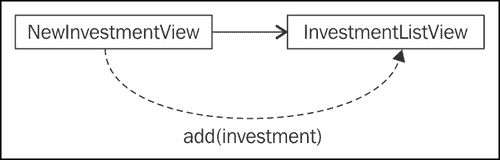
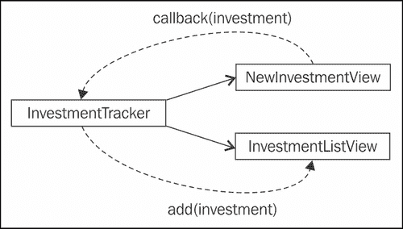
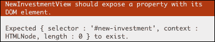
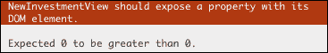

# 第三章。测试前端代码

测试 JavaScript 浏览器代码一直被认为是出了名的难，虽然在处理跨浏览器测试时有很多复杂的地方，但最常见的问题不是测试过程，而是应用代码本身不可测试。

因为浏览器文档中的每个元素都是全局可访问的，所以很容易编写一段完整的 JavaScript 代码来处理整个页面。这导致了许多问题，最大的问题是它很难测试。

在本章中，您将获得关于如何编写可维护和可测试的浏览器代码的最佳实践。

为了实现用户界面，您将使用 jQuery ，这是一个众所周知的 JavaScript 库，它在一个干净简单的应用编程接口中抽象出浏览器的 DOM，该接口可以跨不同的浏览器工作。

为了使规范的编写更加容易，我们将使用 Jasmine jQuery，一个 Jasmine 扩展，它添加了新的匹配器来对 jQuery 对象执行断言。要安装它及其 jQuery 依赖项，请下载以下文件:

*   [https://raw . github . com/velesin/jasmine-jquery/master/lib/jasmine-jquery . js](https://raw.github.com/velesin/jasmine-%E2%80%A8%20%20jquery/master/lib/jasmine-jquery.js)
*   [https://raw . github . com/velesin/jasmine-jquery/master/vendor/jquery/jquery . js](https://raw.github.com/velesin/jasmine-%E2%80%A8%20%20jquery/master/vendor/jquery/jquery.js)

将它们放入`lib/`文件夹中，并添加到`SpecRunner.html`中:

```js
<script type="text/javascript" src="lib/jquery.js"></script>
<script type="text/javascript" src="lib/jasmine-jquery.js"></script>
```

到目前为止，我们已经创建了单独的抽象来处理投资及其相关股票。现在是时候开发这个应用的用户界面，并取得一个好的结果，这都是一个组织和良好实践的问题。

在编写前端 JavaScript 代码时，不能忘记应用于基于服务器的代码的软件工程的相同原则。考虑组件和适当的关注点分离仍然很重要。

# 从组件(视图)的角度思考

我们已经讨论了困扰大多数网络的单一 JavaScript 代码库，这些代码库是不可能测试的。而不陷入这个陷阱的最好方法，就是通过测试来编写应用。

考虑我们的投资跟踪器应用的模型界面:


投资跟踪模型界面

你将如何继续实施它？很容易看出，这个应用有两个不同的职责:

*   一是增加投资
*   另一个是列出增加的投资

所以我们可以从把这个界面分成两个不同的部分开始。为了更好地描述它们，我们将借用 **MVC 框架** 中的一个概念，如`Backbone.js`，并将其称为**视图** 。

这里，在界面的顶层，有两个基本组件:

*   `NewInvestmentView`:这将负责创造新的投资
*   `InvestmentListView`:这将是所有新增投资的列表

# 模块模式

所以我们明白我们必须如何分解代码，但是我们如何组织它？到目前为止，我们已经为每个新功能创建了一个文件。这是一个很好的实践，我们将看看如何改进。

让我们从思考我们的`NewInvestmentView`组件开始。我们可以遵循到目前为止使用的模式，在`src/NewInvestmentView.js`为其创建一个新文件:

```js
(function ($, Investment, Stock) {
  function NewInvestmentView (params) {

  };

  this.NewInvestmentView = NewInvestmentView;
})(jQuery, Investment, Stock);
```

您可以看到这个 JavaScript 文件比目前显示的例子更加健壮。我们已经将所有`NewInvestmentView`代码包装在一个 **立即调用的函数表达式**(**life**)中。

它被称为 IIFE，因为它声明了一个函数并立即调用它，有效地创建了一个新的作用域来创建局部变量。

一个好的做法是在 IIFE 中只使用局部变量。如果它需要使用全局依赖项，请通过参数传递它。在这个例子中，它已经向`NewInvestmentView`代码传递了三个依赖项:`jQuery`、`Investment`和`Stock`。

从函数声明中可以看出:

```js
function ($, Investment, Stock)
```

和立即调用:

```js
})(jQuery, Investment, Stock);
```

这种做法的最大优点是我们不再需要担心污染全局命名空间，因为我们在 IIFE 中声明的所有内容都是本地的。这使得全球范围内的混乱变得更加困难。

如果我们需要使任何东西成为全局的，我们可以通过将它与全局对象关联来明确地做到这一点:

```js
this.NewInvestmentView = NewInvestmentView;
```

另一个优点是显式依赖声明。通过浏览文件的第一行，我们知道了文件的所有外部依赖关系。

虽然这种做法目前没有太大优势(因为所有组件都在全球范围内公开)，但我们将在[第 8 章](8.html "Chapter 8. Build Automation")、*构建自动化*中看到如何从中受益。

这个模式也被称为**模块模式** ，我们将在本书的其余部分使用它(尽管有时为了简化起见，它被省略了)。

# 使用 HTML 夹具

继续`NewInvestmentView`组件的开发，我们可以编写一些基本的验收标准:

*   `NewInvestmentView`应允许输入股票符号
*   `NewInvestmentView`应允许输入股份
*   `NewInvestmentView`应允许输入的股价

还有很多，但这些都是一个好的开始。

为这个组件创建一个新的规格文件，在新文件`spec/NewInvestmentViewSpec.js`中，我们可以开始翻译这些规格:

```js
describe("NewInvestmentView", function() {
  it("should allow the input of the stock symbol", function() {
  });

  it("should allow the input of shares", function() {
  });

  it("should allow the input of the share price", function() {
  });
});
```

但是在我们能够开始实现这些之前，我们必须首先理解**HTML fights**的概念。

测试夹具提供测试运行的基本状态。它可以是一个类实例化，一个对象的定义，或者一段 HTML。换句话说，要测试处理表单提交的 JavaScript 代码，您需要在运行测试时表单可用。包含表单的 HTML 代码是一个 HTML 固定装置。

处理这一需求的一种方法是在设置函数中手动添加所需的 DOM 元素:

```js
beforeEach(function() {
  $('body').append('<form id="my-form"></form>');
});
```

并在拆卸过程中将其拆下:

```js
afterEach(function() {
  $('#my-form').remove();
});
```

否则规范会在文档中添加大量垃圾，并可能干扰其他规范的结果。

### 类型

重要的是要知道规格应该是独立的，并且它们可以以任何特定的顺序运行。因此，作为一个规则，对待你的规格完全彼此孤立。

一个更好的方法是在文档中有一个容器，我们总是把 HTML 固定装置放在那里:

```js
<div id="html-fixtures">
</div>
```

并将代码更改为:

```js
beforeEach(function() {
  $('#html-fixtures').html('<form id="my-form"></form>');
});
```

这样，下一次运行规范时，它会自动用自己的夹具覆盖上一个夹具。

但随着比赛变得更加复杂，这可能很快升级为一场难以理解的混乱:

```js
beforeEach(function() {
  $('#html-fixtures').html('<form id="new-investment"><h1>Newinvestment</h1><label>Symbol:<input type="text" class="new-investment-stock-symbol" name="stockSymbol"value=""></label><input type="submit" name="add"value="Add"></form>');
});
```

如果这个夹具可以从外部文件加载，那不是很好吗？这正是 Jasmine jQuery 扩展所做的，带有其 **HTML Fixture** 模块。

我们可以将该 HTML 代码放在一个外部文件中，并通过对`loadFixtures`的简单调用将其加载到文档中，传递夹具文件路径:

```js
beforeEach(function() {
  loadFixtures('MyFixture.html');
});
```

扩展名查找文件`spec/javascripts/fixtures/MyFixture.html`，并将其内容加载到容器中:

```js
<div id="jasmine-fixtures">
  <form id="new-investment">
    <h1>New investment</h1>
    <label>
      Symbol:
      <input type="text" class="new-investment-stock-symbol"name="stockSymbol" value="">
    </label>
    <input type="submit" name="add" value="Add">
  </form>
</div>
```

我们还可以使用扩展的另一个全局函数来重新创建第一个例子。`setFixtures(html)`接受要放入容器中的内容的参数:

```js
beforeEach(function() {
  setFixtures('<form id="my-form"></form>');
});
```

其他可用功能包括:

*   `appendLoadFixtures(fixtureUrl[, fixtureUrl, …])`:这不是覆盖夹具容器的内容，而是追加它
*   `readFixtures(fixtureUrl[, fixtureUrl, …])`:这将读取一个夹具内容，但是不是将其附加到文档中，而是返回一个包含其内容的字符串
*   `appendSetFixtures(html)`:这个和`appendLoadFixtures`一样，只是用了一个的 HTML 字符串代替了文件

Jasmine jQuery 夹具模块缓存每个文件，因此我们可以多次加载同一个夹具，而不会影响测试套件的速度。

它使用 AJAX 加载夹具，有时测试可能想要修改 JavaScript 或 jQuery AJAX 的内部工作方式，正如我们将在[第 6 章](6.html "Chapter 6. Light Speed Unit Testing")、*光速单元测试*中看到的，这将中断夹具的加载。解决此问题的一种方法是使用 `preloadFixtures()`功能将所需的夹具预加载到缓存中。

`preloadFixtures(fixtureUrl[, fixtureUrl, …])`在缓存中加载一个或多个文件，而不将其附加到文档中。

虽然有一个问题，而使用带 Chrome 的 HTML 设备。Jasmine jQuery 使用 AJAX 加载 HTML 夹具，但是由于 **相同来源策略**，当使用`file://`协议打开`SpecRunner.html`时，Chrome 会阻止所有 AJAX 请求。

这个问题的一个解决方案是通过 HTTP 服务器为规范运行者服务，如[第 4 章](4.html "Chapter 4. Asynchronous Testing – AJAX")、*异步测试-AJAX*所述。

目前，最简单的解决方案可能是使用另一个浏览器，如火狐。

关于这次 Chrome 发行的更多细节可以在这张 GitHub 票上看到:

[https://github . com/velesin/jasmine-jquery/issues/4](https://github.com/velesin/jasmine-jquery/issues/4)

回到`NewInvestmentView`组件，我们可以借助这个 HTML 夹具插件开始规范的开发。

基于模型界面，我们可以创建一个名为`spec/fixtures/NewInvestmentView.html`的新的 HTML 夹具

```js
<form id="new-investment">
  <h1>New investment</h1>
  <label>
    Symbol:
    <input type="text" class="new-investment-sti ock-symbol"name="stockSymbol" value="">
  </label>
  <label>
    Shares:
    <input type="number" class="new-investment-shares"name="shares" value="0">
  </label>
  <label>
    Share price:
    <input type="number" class="new-investment-share-price"name="sharePrice" value="0">
  </label>
  <input type="submit" name="add" value="Add">
</form>
```

因为我们不是在插件的默认路径上保存这个夹具，我们需要在`SpecHelper.js`文件的末尾添加一个新的配置:

```js
jasmine.getFixtures().fixturesPath = 'spec/fixtures';
```

在规范中，添加调用加载夹具:

```js
describe("NewInvestmentView", function() {
  beforeEach(function() {
    loadFixtures('NewInvestmentView.html');
  });
});
```

最后，将规格和来源添加到流道:

```js
<script type="text/javascript"src="src/NewInvestmentView.js"></script>
<script type="text/javascript"src="spec/NewInvestmentViewSpec.js"></script>
```

# 基本视图编码规则

现在是时候开始对第一个视图组件进行编码了。为了帮助您完成这一过程，我们将为视图编码快乐制定两个基本规则:

*   视图应该封装一个 DOM 元素
*   将视图与观察器集成

让我们看看它们是如何独立工作的。

## 视图应该封装一个 DOM 元素

如前所述，视图是与 DOM 元素相关联的行为，因此将该元素与视图相关联是有意义的。一个好的模式是在视图实例化中传递一个 CSS 选择器，指示它应该引用的元素。以下是`NewInvestmentView`组件的规格:

```js
describe("NewInvestmentView", function() {
  var view;
  beforeEach(function() {
    loadFixtures('NewInvestmentView.html');
    view = new NewInvestmentView({selector: '#new-investment'});
  });
});
```

在构造函数中，它使用 jQuery 获取该选择器的元素，并将其存储在实例变量`$el`中(来源):

```js
function NewInvestmentView (params) {
  this.$el = $(params.selector);
}
```

为了确保这段代码有效，我们应该为它编写一个测试:

```js
it("should expose a property with its DOM element", function() {
  expect(view.$el).toExist();
});
```

`toExist`是 Jasmine jQuery 扩展提供的自定义匹配器，用于检查文档中是否存在元素。它不仅验证了 JavaScript 对象上属性的存在，还验证了与 DOM 元素的关联是有效的。

将选择器传递给视图允许它多次实例化到文档中的不同元素。

拥有显式关联的另一个优点是知道这个视图不会改变文档上的任何其他内容，正如我们接下来将看到的。

视图是与 DOM 元素相关联的行为，所以它不应该在页面上到处乱搞。它应该只更改或访问与之关联的元素。

为了演示这个概念，让我们实现另一个关于视图默认状态的接受标准。

```js
it("should have an empty stock symbol", function() {
  expect(view.getSymbolInput()).toHaveValue('');
});
```

`getSymbol`方法的简单实现可能使用全局 jQuery 查找来查找输入并返回其值:

```js
NewInvestmentView.prototype = {
  getSymbolInput: function () {
    return $('.new-investment-stock-symbol')
  }
};
```

但这可能会导致一个问题；如果在文档的其他地方有另一个同名的输入，它可能会得到错误的结果。

更好的方法是使用视图的关联元素来执行范围查找:

```js
getSymbolInput: function () {
  return $this.$el.find('.new-investment-stock-symbol')
}
```

`find`功能只会寻找`this.$el`的子元素。好像`this.$el`代表了视图的整个文档。

因为我们将在视图代码中的任何地方使用这种模式，所以我们可以创建一个函数并使用它:

```js
NewInvestmentView.prototype = {
  $: function () {
    return this.$el.find.apply(this.$el, arguments);
  },
  getSymbolInput: function () {
    return this.$('.new-investment-stock-symbol')
  }
};
```

现在假设来自应用中的其他地方，我们想要更改一个`NewInvestmentView`表单输入的值。我们知道它的类名，所以它可能很简单:

```js
$('.new-investment-stock-symbol').val('from outside the view');
```

但是这种简单性隐藏了一个严重的封装问题。这一行代码创建了一个与`NewInvestmentView`的实现细节的耦合。

如果明天，另一个开发人员更改`NewInvestmentView`，将输入类名从`.new-investment-stock-symbol`重命名为`.new-investment-symbol`，那一行就会被打断。

为了解决这个问题，开发人员需要查看整个代码库，寻找对该类名的引用。

更安全的方法是尊重视图并使用其 API:

```js
newInvestmentView.setSymbol('from outside the view');
```

实现后看起来像:

```js
NewInvestmentView.prototype.setSymbol = function(value) {
  this.$('.new-investment-stock-symbol').val(value);
};
```

这样，当代码被重构时，只有一个点来执行变更——在`NewInvestmentView`实现内部。

由于浏览器的文档中没有沙盒，这意味着在 JavaScript 代码中的任何地方，您都可以在文档中的任何地方进行更改，除了良好的实践之外，您可以做的并不多，以防止这些错误。

## 将视图与观察者整合

随着投资跟踪器应用的开发，我们最终需要实现投资列表。但是你将如何继续整合`NewInvestmentView`和`InvestmentListView`？

您可以为`NewInvestmentView`写一个接受标准为:给定新的投资视图，当点击其添加按钮时，它应该向投资列表中添加一项投资。

这是一个非常直截了当的想法，你可以从文章中看到，我们在两种观点之间建立了直接的关系。将此转化为规范澄清了这一认识:

```js
describe("NewInvestmentView", function() {
  beforeEach(function() {
    loadFixtures('NewInvestmentView.html');
    appendLoadFixtures('InvestmentListView.html');

    listView = new InvestmentListView({
      id: 'investment-list'
    });

    view = new NewInvestmentView({
      id: 'new-investment',
      listView: listView
    });
  });

  describe("when its add button is clicked", function() {
    beforeEach(function() {
      // fill form inputs
      // simulate the clicking of the button
    });

    it("should add the investment to the list", function() {
      expect(listView.count()).toEqual(1);
    });
  });
});
```

该解决方案在两个视图之间创建了依赖关系。`NewInvestmentView`构造函数现在接收`InvestmentListView`的一个实例作为其`listView`参数。

在其实现中，`NewInvestmentView`在提交表单时调用`listView`对象的`addInvestment`方法:

```js
function NewInvestmentView (params) {
  this.listView = params.listView;

  this.$el.on('submit', function () {
    this.listView.addInvestment(/* new investment */);
  }.bind(this));
}
```

为了更好地阐明这段代码是如何工作的，这里有一个集成是如何完成的图表:



两种观点之间的直接关系

虽然非常简单，但是这个解决方案引入了许多架构问题。首先，也是最明显的，是`NewInvestmentView`规格的复杂性增加。

其次，由于紧密的耦合，这使得演化这些组件变得更加困难。

为了更好地澄清最后一个问题，想象一下，将来你想在一张表格中列出投资。这将改变`NewInvestmentView`以支持列表和表格视图:

```js
function NewInvestmentView (params) {
  this.listView = params.listView;
  this.tableView = params.tableView;

  this.$el.on('submit', function () {
    this.listView.addInvestment(/* new investment */);
    this.tableView.addInvestment(/* new investment */);
  }.bind(this));
}
```

重新思考接受标准，我们可以得到一个更好的和未来的证明方案。让我们重写为:给定投资跟踪器，当一个新的投资被创建时，它应该将该投资添加到投资列表中。

通过验收标准可以看出其引入了一个新的待测主体:投资跟踪者。这意味着一个新的源文件和规范文件。相应地创建两个文件并将它们添加到流道后，我们可以将这个验收标准写成一个规范:

```js
describe("InvestmentTracker", function() {
  beforeEach(function() {
    loadFixtures('NewInvestmentView.html');
    appendLoadFixtures('InvestmentListView.html');

    listView = new InvestmentListView({
      id: 'investment-list'
    });

    newView = new NewInvestmentView({
      id: 'new-investment'
    });

    application = new InvestmentTracker({
      listView: listView,
      newView: newView
    });
  });

  describe("when a new investment is created", function() {
    beforeEach(function() {
      // fill form inputs
      newView.create();
    });

    it("should add the investment to the list", function() {
      expect(listView.count()).toEqual(1);
    });
  });
});
```

您可以看到曾经在`NewInvestmentView`规格中的相同设置代码。它加载两个视图所需的夹具，实例化`InvestmentListView`和`NewInvestmentView`，并创建一个新的`InvestmentTracker`实例，将两个视图作为参数传递。

稍后，当描述行为`when a new investment is created`时，您可以看到对`newView.create`函数的函数调用，以创建新的投资。

之后，它通过检查`listView.count()`是否等于`1`来检查一个新项目是否被添加到 `listView`对象中。

但是整合是如何发生的呢？我们可以通过查看`InvestmentTracker`实现来了解它:

```js
function InvestmentTracker (params) {
  this.listView = params.listView;
  this.newView = params.newView;

  this.newView.onCreate(function (investment) {
    this.listView.addInvestment(investment);
  }.bind(this));
}
```

它使用`onCreate`函数在`newView`注册一个观察者函数作为回调。这个观察函数将在以后创建新投资时调用。

`NewInvestmentView`内部的实现相当简单。`onCreate`方法将`callback`参数存储为对象的属性:

```js
NewInvestmentView.prototype.onCreate = function(callback) {
  this._callback = callback;
};
```

`_callback`属性的命名约定听起来可能有些奇怪，但是将其表示为私有成员是一个很好的约定。

尽管前置下划线字符实际上不会改变属性的可见性，但它至少会通知该对象的用户`_callback`属性可能会改变，甚至在未来会被移除。

稍后当调用`create`方法时，它调用`_callback`传递新投资作为参数。

```js
NewInvestmentView.prototype.create = function() {
  this._callback(/* new investment */);
};
```

以下是为更好地理解而举例说明的解决方案:



使用回调来集成两个视图

稍后在[第 7 章](7.html "Chapter 7. Testing Backbone.js Applications")、*测试主干. js 应用*中，我们将看到这个`NewInvestmentView`规范的实现结果如何。

# 用 jQuery 匹配器测试视图

除了它的 HTML 固定物模块，Jasmine jQuery 扩展还附带了一组自定义匹配器，帮助编写 DOM 中元素的期望。

正如所展示的，使用这些定制匹配器的最大优势是它们产生的更好的错误消息。因此，尽管您可以在不使用任何匹配器的情况下编写所有规格，但这样做将在发生错误时为您提供更多有用的信息。

为了更好地理解这一优势，我们可以重温规范`should expose a property with its DOM element`的例子。在那里，它使用`toExist`匹配器:

```js
it("should expose a property with its DOM element", function() {
  expect(view.$el).toExist();
});
```

如果此规范失败，我们会收到一条很好的错误消息:



漂亮的自定义匹配器错误消息

但是如果我们在没有自定义匹配器的情况下重写这个规格(仍然进行相同的验证):

```js
it("should expose a property with its DOM element", function() {
  expect($(document).find(view.$el).length).toBeGreaterThan(0);
});
```

错误消息的信息量会减少:



通过阅读错误，你不能理解它真正测试的是什么

所以尽可能使用这些匹配器来获得更好的错误信息。让我们用 `NewInvestmentView`类的这些接受标准来回顾一些可用的自定义匹配器，通过示例进行演示:

*   `NewInvestmentView`应允许输入股票符号
*   `NewInvestmentView`应允许输入股份
*   `NewInvestmentView`应允许输入的股价
*   `NewInvestmentView`是否应该有一个空的股票符号
*   `NewInvestmentView`应使其股票价值为零
*   `NewInvestmentView`应使其股价值为零
*   `NewInvestmentView`应将其股票符号输入聚焦
*   `NewInvestmentView`不应允许添加

重要的是，您要理解，接下来的这些示例虽然对演示 Jasmine jQuery 匹配器如何工作很有用，但并不是真正测试任何 JavaScript 代码，而只是测试由 HTML Fixture 加载的 HTML 元素。

## to be jQuery 匹配器

这将检查元素是否与传递的 CSS 选择器匹配。

```js
it("should allow the input of the stock symbol", function() {
  expect(view.$el.find('.new-investment-stock-symbol')).toBe('input[type=text]');
});
```

## to containtml jQuery 匹配器

这将检查元素的内容是否与传递的 HTML 相匹配。

```js
it("should allow the input of shares", function() {
  expect(view.$el).toContainHtml('<input type="number" class="new-investment-shares" name="shares" value="0">');
});
```

## to contain jQuery 匹配器

这将检查元素是否包含任何与传递的 CSS 选择器匹配的子元素。

```js
it("should allow the input of the share price", function() {
  expect(view.$el).toContain('input[type=number].new-investment-share-price');
});
```

## to save value jQuery 匹配器

仅对输入有效，这将根据元素的值属性验证预期的值。

```js
it("should have an empty stock symbol", function() {
  expect(view.$el.find('.new-investment-stock-symbol')).toHaveValue('');
});

it("should have its shares value to zero", function() {
  expect(view.$el.find('.new-investment-shares')).toHaveValue('0');
});
```

## towaveattr jQuery 匹配器

这将测试元素是否具有任何具有指定名称和值的属性。下面的例子展示了如何使用这个匹配器来测试其值属性的输入，这是一个可以用`toHaveValue`匹配器编写的期望。

```js
it("should have its share price value to zero", function() {
  expect(view.$el.find('.new-investment-share-price')).toHaveAttr('value', '0');
});
```

## ToBefocus jQuery 匹配器

这将检查输入元素是否聚焦。

```js
it("should have its stock symbol input on focus", function() {
  expect(view.$el.find('.new-investment-stock-symbol')).toBeFocused();
});
```

## 待禁用的 jQuery 匹配器

这将检查元素是否被禁用。

```js
it("should not allow to add", function() {
  expect(view.$el.find('input[type=submit]')).toBeDisabled();
});
```

## 更多火柴人

扩展有更多可用的匹配器；务必在[https://github.com/velesin/jasmine-jquery#jquery-matchers](https://github.com/velesin/jasmine-jquery#jquery-matchers)查看项目文件。

# 总结

在本章中，您了解了一旦通过测试来驱动应用开发，测试是如何变得如此容易的。您已经看到了如何使用模块模式来更好地组织项目代码，以及视图模式如何帮助创建更易维护的浏览器代码。

你学会了如何使用 HTML 固定装置，让你的规格更加易读易懂。我还向您展示了如何使用定制的 jQuery 匹配器测试与浏览器 DOM 交互的代码。

要了解更多关于前端测试的信息，一定要查看*测试 jQuery 插件*的奖励章节。

在下一章中，我们将更进一步，开始测试服务器集成和异步代码。