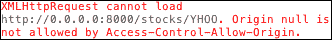

# 第四章。异步测试——AJAX

不可避免地，在每个 JavaScript 应用程序中都有需要测试异步代码的时候。

异步意味着你不能以线性方式处理它——一个函数可能在执行后立即返回，但是结果会在稍后出现，通常是通过回调。

这是处理 AJAX 请求时非常常见的模式，例如通过 jQuery:

```js
$.ajax('http://0.0.0.0/data.json', {
  success: function (data) {
    // handle the result
  }
});
```

为了演示 Jasmine 对异步测试的支持，我们将实现以下验收标准:

"股票回笼时，应更新其股价."

通过使用我们到目前为止向您展示的技术，您可以在`spec/StockSpec.js`文件中编写如下验收标准:

```js
describe("when fetched", function() {
  beforeEach(function() {
    stock.fetch();
  });

  it("should update its share price", function() {
    expect(stock.sharePrice).toEqual(23.67);
  });
});
```

这将导致在`src/Stock.js`文件中实现`fetch`功能:

```js
Stock.prototype.fetch = function() {
  var that = this;
  var url = 'http://0.0.0.0:8000/stocks/'+that.symbol;

  $.getJSON(url, function (data) {
    that.sharePrice = data.sharePrice;
  });
};
```

重要的部分是`$.getJSON`调用，这是一个 AJAX 请求，期待包含更新股价的 JSON 响应:

```js
{
  "sharePrice": "23.67"
}
```

到现在，你可以看到我们被卡住了；为了运行这个规范，我们需要一个运行的服务器。

# 设置场景

由于这本书完全是关于 JavaScript 的，我们将创建一个非常简单的 Node.js 服务器供规范使用。Node.js 是一个允许使用 JavaScript 开发网络应用程序的平台，比如 web 服务器。

在[第 6 章](6.html "Chapter 6. Light Speed Unit Testing")、*光速单元测试*中，我们将看到在不需要服务器的情况下测试 AJAX 请求的替代解决方案。

## 安装 Node.js

如果已经安装了 Node.js，可以跳到下一节。

有适用于 Windows 和 Mac OS X 的安装程序:

*   前往 Node.js 网站[http://nodejs.org/](http://nodejs.org/)
*   点击**安装**按钮
*   下载完成后，执行安装程序并按照步骤操作

要查看其他安装方法和如何在 Linux 发行版上安装的说明，请查看[https://github . com/joyent/node/wiki/Installing-node . js-via-package-manager](https://github.com/joyent/node/wiki/Installing-Node.js-via-package-manager)上的官方文档。

完成后，您的命令行上应该有一个`node`命令。

## 对服务器进行编码

为了学习如何编写异步规格，我们将创建一个返回一些假数据的服务器。在项目的根文件夹中创建一个名为`server.js`的新文件，并添加其内容:

```js
var express = require('express');
var app = express();

app.get('/stocks/:symbol', function (req, res) {
  res.setHeader('Content-Type', 'application/json');
  res.send({ sharePrice: 20.18 });
});

app.use(express.static(__dirname));

app.listen(8000);
```

为了处理 HTTP 请求，我们使用了快速，一个 Node.js 网络应用框架。通过阅读代码，可以看到它定义了一个到`/stocks/:symbol`的路由，所以它接受`http://0.0.0.0:8000/stocks/AOUE`等请求，并用 JSON 数据进行响应。

我们还使用`express.static`模块为`http://0.0.0.0:8000/SpecRunner.html`的规格转轮提供服务。

有规避 **同产地政策**的要求。出于安全原因，这是一个规定 AJAX 请求不允许在不同于应用程序的域上执行的策略。

这个问题是在[第三章](3.html "Chapter 3. Testing Frontend Code")、*测试前端代码*中使用带有 Chrome 浏览器的 HTML 装置时首次演示的，因为在处理`file://`网址时，有些浏览器的要求比其他浏览器更严格。

使用 Chrome 浏览器检查器，你可以在打开带有`file://`协议的`SpecRunner.html`文件时看到控制台中的错误(基本上是你一直在做的事情):



同源策略错误

通过服务于 runner，以及同一基本 URL 下的所有应用和测试代码，我们防止了这个问题的发生，并且能够在任何浏览器上运行规范。

## 运行服务器

要运行服务器，首先需要使用节点的包管理器安装其依赖项(快速)。在应用程序根文件夹中，运行`npm`命令:

```js
$ npm install express

```

该命令将下载 Express，并将其放入项目文件夹中名为`node_modules`的新文件夹中。

现在，您应该能够通过调用`node`命令来运行服务器:

```js
$ node server.js

```

要检查它是否工作，请在浏览器上点击`http://0.0.0.0:8000/stocks/AOUE`，您应该会收到 JSON 响应:

```js
{
  "sharePrice": "23.66"
}
```

现在我们已经使我们的服务器依赖性工作了，我们可以继续编写规范了。

# 编写规范

在服务器运行的情况下，在`http://0.0.0.0:8000/SpecRunner.html`打开浏览器，查看我们的规格结果。

您可以看到，即使服务器正在运行，并且规范看起来是正确的，但它还是失败了。这是因为`stock.fetch()`是异步的。对`stock.fetch()`的调用立即返回，允许 Jasmine 在 AJAX 请求完成之前运行期望:

```js
it("should update its share price", function() {
  expect(stock.sharePrice).toEqual(23.67);
});
```

为了解决这个问题，我们需要接受`stock.fetch()`函数的异步性，并指示 Jasmine 在运行期望之前等待它的执行。

## 等待时间()函数

要告诉 Jasmine等待异步调用，我们需要使用它的另一个全局函数`waitsFor()`。

在深入了解它的工作原理之前，让我们先来修改一下之前的测试代码，以使用这个新函数:

```js
describe("when fetched", function() {
  var fetched = false;

  beforeEach(function() {
    stock.fetch({
      success: function () {
        fetched = true;
      }
    });

    waitsFor(function (argument) {
      return fetched;
    }, 'Timeout fetching stock data', 2000);
  });

  it("should update its share price", function() {
    expect(stock.sharePrice).toEqual(23.67);
  });
});
```

您首先会注意到，我们在`stock.fetch()`函数中添加了一个`success`回调，在获取完成后将`fetched`变量设置为`true`:

```js
stock.fetch({
  success: function () {
    fetched = true;
  }
});
```

其实施如下:

```js
Stock.prototype.fetch = function(parameters) {
  var that = this;
  var params = parameters || {};
 var success = params.success || function () {};
 var url = 'http://0.0.0.0:8000/stocks/'+that.symbol;

  $.getJSON(url, function (data) {
    that.sharePrice = data.sharePrice;
 success(that);
  });
};
```

然后我们使用`waitsFor()`功能保持`it`块的执行，直到`fetched`变量为`true`:

```js
waitsFor(function (argument) {
  return fetched;
}, 'Timeout fetching stock data', 2000);
```

如果股票没有在 2000 毫秒内被取出，它会抛出一个错误，使规格失败。

让我们回顾一下，`waitsFor()`功能接受三个参数:

*   A function that Jasmine will poll, until it gets a truth result:

    `function (argument) { return fetched; }`

*   An error message to show if the waiting times out:

    "提取股票数据超时"

*   超时前等待的时间(毫秒):`2000`。

因此，每当您有任何依赖于异步调用结果的期望时，您可以通过使用`beforeEach`块中的`waitsFor()`函数来保持它的执行。

接下来，我们将看到如何直接在`it`块内部使用`waitsFor()`功能。

## 运行()功能

我们已经看到我们可以使用`beforeEach`中的`waitsFor()`函数，但是如果我们需要编写一个在`it`块中有异步调用的测试代码呢？

作为练习，让我们重写之前的规范，不将其嵌套在`describe`块中，而是将其作为单个`it`块:

```js
it("should be able to update its share price", function() {
  var fetched = false;

  stock.fetch({
    success: function() {
      fetched = true;
    }
  });

  waitsFor(function (argument) {
    return fetched;
  }, 'Timeout fetching stock data', 2000);

  expect(stock.sharePrice).toEqual(23.67);
});
```

通过运行这个例子，你会发现同步问题又回来了。那是因为`waitsFor()`函数并没有阻止执行。

它以前是有效的，因为 Jasmine 等待运行`it`块，直到`waitsFor()`完成。

所以我们需要一种方法来安排这个期望代码在`waitsFor()`完成后运行。正如你可能已经猜到的，这将是通过另一个茉莉全局函数，`runs`函数。

您所要做的就是在`runs`块中移动您想要尊重异步行为的代码:

```js
it("should be able to update its share price", function() {
  var fetched = false;

  stock.fetch({
    success: function() {
      fetched = true;
    }
  });

  waitsFor(function (argument) {
    return fetched;
  }, 'Timeout fetching stock data', 2000);

  runs(function() {
    expect(stock.sharePrice).toEqual(23.67);
  });
});
```

这样，茉莉只在`waitsFor()`完成后运行该代码。

您甚至可以放置多个`runs`块，它们将按照声明的顺序运行:

```js
it("should be able to update its share price", function() {
  var fetched = false;

  runs(function() {
    stock.fetch({
      success: function() {
        fetched = true;
      }
    });
  });

  waitsFor(function (argument) {
    return fetched;
  }, 'Timeout fetching stock data', 2000);

  runs(function() {
    expect(stock.sharePrice).toEqual(23.67);
  });
  runs(function() {
    expect(stock.sharePrice).not.toBeUndefined();
  });

  runs(function() {
    expect(stock.sharePrice).toBeGreaterThan(0);
  });
});
```

# 总结

在本章中，您已经看到了如何测试异步代码，这是测试服务器交互(AJAX)时常见的场景。我已经向您展示了如何使用不同的 Jasmine 全局函数，如`waitsFor()`和`runs`来测试异步代码。

我还向您展示了 Node.js 平台，并使用它编写了一个简单的服务器代码，用作测试设备。

在[第 6 章](6.html "Chapter 6. Light Speed Unit Testing")、*光速单元测试*中，我们将看到 AJAX 测试的不同解决方案，不需要服务器运行的解决方案。