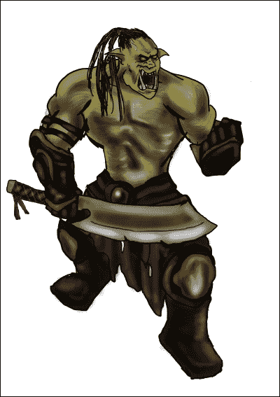
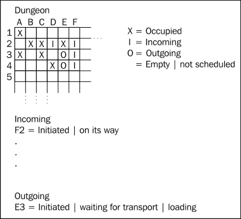

# 典型的 JavaScript 项目

欢迎使用 JavaScript 进行域驱动设计。 在本书中，我们将探索使用高级业务逻辑开发软件的实用方法。 有许多策略可以保持开发流程和代码和思想的组织，有基于约定的框架，有不同的软件范例，如面向对象和函数式编程，或方法，如测试驱动开发。 所有这些部分都能解决问题，就像工具箱中的工具，帮助管理软件中不断增长的复杂性，但它们也意味着，在今天开始做新事情时，甚至在我们开始之前，就有大量的决定要做。 我们是想要开发一个单页面应用，还是想要严格遵循框架的标准，还是想要设置自己的标准? 这些类型的决策很重要，但它们也很大程度上取决于应用的上下文，在大多数情况下，对这个问题的最佳回答是:*取决于*。

那么，我们该如何开始呢? 我们真的知道我们的问题是什么吗?如果我们理解了它，我们的理解是否与他人的理解一致? 开发人员很少是某一特定主题的领域专家。 因此，在指定系统应该具有的行为时，开发过程需要外部通过业务领域专家的输入。 当然，这不仅适用于从头开始开发的全新项目，也适用于在开发过程中添加到应用或产品中的任何新特性。 所以，即使你的项目已经很好地进行下去了，但总有一天新特性会让整个项目陷入困境，在这个阶段，你可能需要考虑其他方法来处理这个新功能。

领域驱动设计为我们提供了另一个有用的方面，特别是在解决与其他开发人员、业务专家和产品所有者交互的需求时。 在现代，JavaScript 越来越成为一个有说服力的选择来构建项目，在许多情况下，比如基于浏览器的 web 应用，它实际上是唯一可行的选择。 今天，用 JavaScript 设计软件的需求比以往任何时候都更加迫切。 在过去，更复杂的软件设计的重点是后端或客户端应用开发，随着 JavaScript 作为一种开发完整系统的语言的兴起，这种情况发生了改变。 在浏览器中开发 JavaScript 客户端是开发整个应用的一个复杂部分，随着**Node.js**的兴起，服务器端 JavaScript 应用的开发也是如此。 在现代开发中，JavaScript 扮演着重要的角色，因此需要像过去其他语言和框架一样，在开发实践和过程中受到同等的关注。 基于浏览器的客户端应用通常拥有与后端相同的数量，甚至更多的逻辑。 随着这种变化，出现了许多新的问题和解决方案，首先是朝着更好的封装和模块化 JavaScript 项目的方向发展。 新的框架出现了，并成为许多项目的基础。 最后但并非最不重要的是，JavaScript 通过 Node.js 或一些**NoSQL**数据库选择的查询语言，从浏览器的语言越来越多地转移到服务器端。 让我带您进行一次软件开发之旅，带您通过使用引入的领域驱动设计概念以及如何解释和应用这些概念，从开始到完成创建应用的各个阶段。

在本章中，你将涵盖:

*   领域驱动设计的核心思想
*   我们的商业场景管理一个兽人地下城
*   跟踪业务逻辑
*   理解核心问题并选择正确的解决方案
*   了解什么是领域驱动设计

# 领域驱动设计的核心思想

围绕着许多软件开发方法，它们都有优点和缺点，但都有一个核心思想，即应用和理解以获得正确的方法。 对于领域驱动的设计，核心在于认识到，由于我们不是软件所在领域的专家，我们需要从其他专家那里收集输入。 这种认识意味着我们需要优化我们的开发过程来收集和合并这些输入。

那么，这对 JavaScript 来说意味着什么呢? 当考虑一个浏览器应用向消费者公开某个功能时，我们需要考虑很多事情，例如:

*   用户期望应用在浏览器中的行为是怎样的?
*   业务工作流是如何工作的?
*   用户对工作流了解多少?

这三个问题已经涉及到三种不同类型的专家:精通用户体验的人可以帮助处理第一个查询，业务领域专家可以处理第二个查询，第三个人可以研究目标受众并就最后一个查询提供输入。 把所有这一切结合在一起是我们努力实现的目标。

虽然不同类型的人很重要，但核心理念是让他们参与的过程总是相同的。 我们提供了一种通用的方式来谈论这个过程，并建立一个快速的反馈循环供他们回顾。 在 JavaScript 中，这比在大多数其他语言中更容易，因为它可以在浏览器中运行，随时可以修改和创建原型; 这是 Java 企业应用梦寐以求的优势。 我们可以与用户体验设计师密切合作，调整预期的界面，同时动态改变工作流，以适应我们的业务需求，首先在浏览器的前端，然后在必要时将知识从原型转移到后端。

# 管理兽人地下城

当谈到领域驱动设计时，通常是在需要处理复杂业务逻辑的上下文中提到的。 事实上，当处理一个非常小的问题时，大多数软件开发实践都不是真正有用的。 就像所有工具一样，你需要清楚什么时候是正确的使用时间。 那么，什么才是真正属于复杂业务逻辑的范畴呢? 这意味着软件必须描述一个真实世界的场景，这通常涉及人类的思考和交互。

众所周知，编写处理决策的软件是非常困难的，尤其是当向不熟悉软件的人解释决策时。 这类决策是许多商业问题的核心，但即使这是一个需要解决的有趣问题，接下来的会计软件是如何开发的，读起来并不有趣。 考虑到这一点，我想向你介绍一下我们正在努力解决的问题，即管理地下城。



一个兽人

## 在地牢里

从外部看来，运行一个兽人地下城似乎非常简单，但在不被杀死的情况下管理它实际上相当复杂。 因为这个原因，我们联系了一个兽人大师，他正在努力保持他的地下城平稳运行。 当我们到达地下城时，他会向我们解释它是如何运作的以及有哪些因素在起作用。

### 提示

即使是**绿地**项目也有一些工作现状。 记住这一点很重要，因为这意味着我们不必提出特性集，而是与当前现实的特性集相匹配。

许多外部因素都在发挥作用，而地下城并没有像它所希望的那样独立。 毕竟，它是兽人王国的一部分，而国王要求他的地牢为他赚钱。 然而，钱只是交易的一部分。 它是如何赚钱的呢? 囚犯需要挖金矿，为了做到这一点，地牢中需要保留一定数量的囚犯。 兽人王国的运作方式也导致了新囚犯的不断到来，战争中的新俘虏，那些付不起税的人，等等。 总是需要为新囚犯腾出空间。 好在每个地牢都是相互关联的，为了实现目标，它可以通过请求转移囚犯来填充免费牢房或摆脱牢房中的囚犯。 这些选项允许地下城主密切监视被关押的囚犯和牢房的可用空间。 发送囚犯到其他地下城，并从其他地下城请求新的，以防有太多的空闲的细胞空间可用，保持采矿劳动力的最佳水平，以最大化利润， 同时准备好容纳最终到达的高价值囚犯直接送到地下城。 到目前为止，这种解释是合理的，但让我们再深入挖掘一下，看看到底发生了什么。

### 管理即将入狱的囚犯

囚犯可以到达有几个原因，比如如果一个地牢满了人，他们决定转移一些囚犯到一个有自由牢房的地牢，除非他们在路上逃跑，否则他们迟早会到达我们的地牢。 另一个囚犯来源是不断扩张的兽人王国本身。 兽人会不断地奴役新的人，并告诉我们的国王，*“对不起，我们没有空间”*，这不是一个有效的选择，它实际上可能会导致我们成为新的囚犯之一。 看看这个，我们的地下城最终会被填满，但我们需要确保这种情况不会发生。

解决这个问题的方法是尽早转移囚犯，腾出地方。 这显然是最复杂的; 我们需要权衡几个因素来决定转移囚犯的时间和数量。 我们不能简单地通过门槛解决这个问题的原因是着眼于地牢结构，这并不是我们*失去*囚犯的唯一方法。 毕竟，人们并不总是乐意成为淘金的奴隶，他们可能会认为死在监狱里的风险与死在逃跑中一样高。 因此，他们决定这样做。

当囚犯在不同的地牢间移动时，情况也是如此。 所以即使我们的物理牢房有硬性限制，我们也需要处理进出监狱的人数。 这是商业软件中的一个经典问题。 将这些数字相互匹配并优化某个结果基本上就是计算机数据分析的全部内容。

### 当前的技术状态

综上所述，我们可以清楚地看到，兽人大师目前通过在餐巾纸上写得很糟糕的便条来进行跟踪的系统并不完美。 事实上，他已经好几次差点被杀了。 为了给大家举个例子，他讲了一个故事，有一次国王抓了四个部落首领，想让他们成为矿工，以此来羞辱他们。 然而，当他到达地下城时，他意识到没有空间了，他不得不去下一个地下城把他们放下，而他们却嘲笑他，因为他显然不知道如何管理一个王国。 这是因为我们的兽人主人在前一天忘记了 8 次转移。 还有一次，当国王的郡长到来时，兽人首领无法交出任何金子，因为他不知道他只有三分之一的囚犯可以真正开采任何东西。 这一次，这是由于让多人数囚犯，而他们不是逐个细胞地重新编码，而是尝试在他们的脑子里做。 作为半兽人，这是一个失败的设置。 所有这一切都归结于糟糕的组织，而让你的*系统*去管理写在餐纸背面的地牢囚犯便是如此。

### 数字化地下城管理

在最近的失败指导下，兽人大师终于意识到是时候转向现代了，他想通过数字化来革新地下城的管理方式。 他努力拥有一个系统，根据当前充满的细胞数量自动计算必要的转移，基本上摆脱了管理的繁琐工作。 他喜欢坐着休息，让电脑为他做所有的工作。

### 提示

当与业务专家谈论软件时，一个常见的模式是他们不知道可以做什么。 永远记住，作为开发人员，我们是软件专家，因此是唯一能够管理这些期望的人。

现在是时候考虑我们需要了解哪些细节以及如何处理不同的场景了。 兽人大师并不真正熟悉软件开发的概念，所以我们需要确保我们用一种他能够理解和理解的语言交谈，同时确保我们得到所有我们需要的答案。 我们被雇佣是因为我们在软件开发方面的专业知识，所以我们需要确保管理预期以及特性集和开发流程。 开发本身当然是一个迭代过程，因为我们不可能一次性得到所需的所有内容。 这也意味着我们需要记住可能的变化。 这是构建复杂业务软件的基本部分。

开发包含更复杂业务逻辑的软件容易随着业务的自我调整和用户利用软件提供的功能而迅速变化。 因此，在理解业务的人员和理解软件的开发人员之间保持一种共同的语言是至关重要的。

### 提示

尽可能地合并业务术语，这将简化业务领域专家和作为开发人员的您之间的交流，从而防止在早期产生误解。

## 规格

为了更好地理解一个软件需要做什么，至少要让它以最好的方式变得有用，需要了解在你的软件存在之前，未来的用户在做什么。 因此，我们与兽人主人坐在一起，他正在管理他的进出的囚犯，让他告诉我们他每天都在做什么。

地牢由 100 个牢房组成，这些牢房要么被囚犯占据，要么现在是空的。 当管理这些细胞时，我们可以通过观察兽人的工作来识别不同的任务。 把我们看到的东西画出来，我们可以大致这样画:



有一些组织的重要事件和状态需要跟踪，它们是:

1.  当前可用或空单元格
2.  即将离任的转移状态
3.  传入的转移状态

每次转移都可能处于多个状态，主人必须知道这些状态，才能进一步决定下一步该做什么。 保持这样的视角并不容易，特别是考虑并发更新的数量。 跟踪每件事的状态会导致我们的 master 要做更多的任务:

1.  更新跟踪
2.  当太多单元被占用时开始传出传输
3.  通过开始跟踪它们来响应传入的转账
4.  如果被占用的单元数太低，请请求传入的传输

那么，它们都涉及到什么呢?

### 跟踪可用细胞

地牢的当前状态是由它的细胞状态所反映出来的，所以第一个任务就是获取这些知识。 在它的基本形式中，这是很容易实现的，只需简单地计算每个占用和每个空单元格，写下值是什么。 现在，我们的兽人大师在早上巡视地下城，注意每一个免费的牢房，假设另一个必须被占用。 为了确保自己不会惹上麻烦，他不再相信自己的下属会这么做! 问题是，只有一个中央表格来记录所有信息，所以如果有超过一个人在计数和记录细胞，他的管理员可能会意外地覆盖彼此的信息。 同时，这也是一个良好的开始，虽然它忽略了一些有趣的信息，例如逃离地牢的囚犯数量以及基于此比率的预期自由牢房的理解。 对于我们来说，这意味着我们需要能够在应用中追踪这些信息，因为最终我们想要预测出预期的自由细胞数量，以便我们能够基于地下城状态有效地创建推荐或警告。

### 开始外发转账

第二部分是处理在地牢填满的情况下摆脱囚犯。 在这种具体情况下，这意味着如果自由牢房的数量下降到 10 个以下，就该将囚犯转移出去了，因为随时可能有新的囚犯到来。 这个策略非常可靠，因为从经验来看，几乎没有更大的运输，所以建议一开始就坚持使用它。 然而，我们已经看到了一些目前过于复杂的优化。

### 提示

从业务经验中吸取经验是很重要的，因为编码这些知识并减少错误是可能的，但是要注意，因为编码详细的经验可能是最复杂的事情之一。

在未来，我们想要基于囚犯逃离地牢的速度，新囚犯因为被捕获而到达的速度，以及从转移中到达的新囚犯的预测来优化这一点。 所有的现在这是不可能的，因为它将压倒当前的跟踪系统，但它实际上归结为捕获尽可能多的数据和分析它，这是现代计算机系统擅长的。 毕竟，它可以拯救兽人主人的头!

### 跟踪传入转移的状态

在某些日子里，一只乌鸦会带来消息，说一些囚犯已经被送去转移到我们的地牢。 我们对此无能为力，但协议规定在囚犯们真正到达之前五天将乌鸦送出去给地牢一个准备的机会。 如果囚犯们在途中逃跑，另一只乌鸦将会被派去通知地牢里的这个尴尬的情况。 这些信息每天都要经过筛选，以确保有足够的空间给那些到达的人。 我们被告知，这是预测充满细胞数量的一个重要部分，也是最易变的部分。 需要注意的是，每个消息只应该处理一次，但它可以在一天中的任何时间到达。 现在，它们都是由一个兽人处理的，他会在注意到内容的结果后立即将它们扔掉。 当前系统的一个问题是，由于其他地下城的管理方式与我们目前的相同，当它们遇到麻烦时，它们会做出快速且大规模的转移反应，这让情况变得相当不可预测。

### 启动传入传输

除了让囚犯呆在他们该呆的地方，开采黄金也是地牢的第二个主要目标。 要做到这一点，需要有一定数量的囚犯来操作机器，否则生产将会停止。 这意味着每当有太多的牢房被遗弃时，就需要填补它们，所以兽人主人会派一只乌鸦来请求新的囚犯。 这同样需要 5 天的时间，除非他们在路上逃跑，否则工作是可靠的。 在过去，它仍然是地下城的一个主要问题，因为长时间的延迟。 如果填满的单元格低于 50，地下城将不再生产任何金币，没有赚钱是更换当前地下城主的一个原因。 如果兽人大师所做的一切只是对情况做出反应，这就意味着可能会有 5 天没有金子被开采出来。 这是当前系统的主要痛点之一，因为预测 5 天内充满的细胞数量似乎是不可能的，所以兽人现在能做的就是做出反应。

总而言之，这给了我们一个大致的概念，地下城主在寻找什么，以及需要完成哪些任务来取代当前系统。 当然，这并不一定要一蹴而就，而是可以逐步进行，让每个人都能适应。 现在，是时候确定从哪里开始了。

# 从绿地到应用

我们是 JavaScript 开发人员，所以对我们来说，构建一个 web 应用来实现这一点似乎是显而易见的。 正如所描述的那样，很明显，简单地开始并在进一步分析情况时扩展应用显然是正确的方法。 目前，由于业务流程还没有发展到这个级别，我们还没有真正清楚地了解应该如何处理某些部分。 此外，随着我们的软件开始使用，可能会出现新的特性，或者事情开始以不同的方式处理。 描述的步骤为基于收集的数据进行优化留出了空间，因此我们首先需要数据来了解预测是如何工作的。 这意味着我们需要从追踪尽可能多的地下城事件开始。 在列表中，第一步总是获得我们所处状态的视图，这意味着跟踪可用的单元格并为此提供一个接口。 首先，这可以通过计数器来实现，但这不能成为我们的最终解决方案。 因此，我们需要进一步跟踪事件，并对这些事件进行汇总，以便对未来做出预测。

## 第一路线和模型

当然，还有许多其他的方法可以开始，但归根结底，在大多数情况下，现在是选择基础建设的时候了。 这里我指的是决定要构建的框架或库集。 这与决定使用什么数据库来支持我们的应用以及许多其他小决策同时发生，这些决策受到围绕框架和库的决策的影响。 清楚地了解应该如何构建前端是重要的,因为建立一个单页面应用,实现大量的逻辑在前端和支持的 API 层,从一个应用不同,大多数逻辑在服务器端实现。

### 提示

如果你不熟悉下面使用的 express 或其他技术，请不要担心。 您不需要了解每一个细节，但您将了解如何使用框架开发应用。

因为我们还不清楚应用最终会采用哪种方式，所以我们会尽可能多地做出决定，但只决定我们立即需要的东西。 当我们用 JavaScript 开发时，应用将会用 Node.js 开发，express 将会是我们选择的框架。 为了简化我们的工作，我们首先决定用纯 HTML 实现前端，使用嵌入的 JavaScript 模板，因为它将把逻辑保存在一个地方。 这似乎是合理的，因为将复杂应用的逻辑扩展到多个层将使事情更加复杂。 此外，在传输过程中消除最终的错误将使我们在开始时更容易地实现可靠的应用。 我们可以将关于数据库的决定推出去，并在我们的第一个原型中使用存储在 RAM 中的简单对象; 当然，这不是一个长期的解决方案，但我们至少可以在决定另一个软件主要部分之前验证一些结构，这也带来了很多期望。 考虑到所有这些，我们设置应用。

在接下来的章节以及整本书中，我们将使用 Node.js 来构建一个小型后端。 在撰写本文时，当前的活动版本是 Node.js 0.10.33。 Node.js可从[http://nodejs.org/](http://nodejs.org/)获取，适用于 Windows、Mac OS X 和 Linux 操作系统。 我们的 web 应用的基础由 express 提供，可通过**Node Package Manager**(**NPM**)在 3.0.3 版本编写时获得:

```js
$ npm install –g express
$ express --ejs inmatr

```

### 提示

为了简洁起见，下面的粘合代码被省略了，但是像书中提到的所有其他代码一样，这些代码可以在 GitHub 存储库[https://github.com/sideshowcoder/ddd-js-sample-code](https://github.com/sideshowcoder/ddd-js-sample-code)中找到。

### 创建模型

应用的最基本的部分已经设置好了。 我们可以继续在`models`/`dungeon.js`中创建我们的地下城模型，并添加以下代码来保持模型及其加载和保存逻辑:

```js
var Dungeon = function(cells) {
  this.cells = cells
  this.bookedCells = 0
}
```

### 提示

**下载示例代码**

您可以从您的账户[http://www.packtpub.com](http://www.packtpub.com)下载您购买的所有 pack 书籍的示例代码文件。 如果您在其他地方购买了这本书，您可以访问[http://www.packtpub.com/support](http://www.packtpub.com/support)并注册，直接将文件通过电子邮件发送给您。

记住，这最终会存储在数据库中，我们还需要能够以某种方式找到地下城，所以`find`方法似乎是合理的。 这个方法应该已经坚持 Node.js 的回调风格，以便在切换到真实数据库时更容易。 即使我们放弃了这个决定，假设也很清楚，即使我们决定不使用数据库，地下城的参考资料也会被存储起来，并在未来从外部过程中请求。 下面是一个使用`find`方法的示例:

```js
var dungeons = {}
Dungeon.find = function(id, callback) {
  if(!dungeons[id]) {
    dungeons[id] = new Dungeon(100)
  }
  callback(null, dungeons[id])
}
```

### 第一个路线和加载地下城

现在我们有了这个，我们可以继续实际响应请求。 在表达定义中，需要的路由做这个。 因为我们需要确保我们当前的地下城可用，所以我们也使用中间件在请求到来时加载它。

使用我们刚刚创建的方法，我们可以在快速堆栈中添加一个中间件，以便在请求传入时加载副本。

中间件是一段代码，每当请求达到它的堆栈级别时，它就会被执行，例如，用于将请求分派到已定义函数的路由器是作为中间件实现的，日志记录等等。 对于许多其他类型的交互，例如用户登录，这也是一种常见的模式。 我们的地下城加载中间件是这样的，假设现在我们只管理一个地下城，我们可以通过在`middleware/load_context.js`中添加以下代码来创建它:

```js
function(req, res, next) {
  req.context = req.context || {}
  Dungeon.find('main', function(err, dungeon) {
    req.context.dungeon = dungeon
    next()
  })
}
```

### 显示页面

有了这个，我们现在可以简单地显示地下城的信息，并在请求中跟踪对地下城的任何更改。 创建一个视图来呈现状态，以及创建一个表单来修改状态，都是 GUI 的基本部分。 因为我们决定实现逻辑服务器端，所以它们相当简单。 在`views`/`index.ejs`下创建一个视图允许我们稍后通过 express 将所有内容呈现给浏览器。 下面的例子是前端的 HTML 代码:

```js
<h1>Inmatr</h1>
<p>You currently have <%= dungeon.free %> of
<%= dungeon.cells %> cells available.</p>

<form action="/cells/book" method="post">
  <select name="cells">
    <% for(var i = 1; i < 11; i++) { %>
    <option value="<%= i %>"><%= i %></option>
  <% } %>
  </select>
  <button type="submit" name="book" value="book">
  Book cells</button>
  <button type="submit" name="free" value="free">
  Free cells</button>
</form>
```

### 快速粘合应用

现在我们已经完成了，我们有了一个状态显示，一个模型来跟踪正在发生的变化，以及一个中间件来根据需要加载这个模型。 现在，为了将它们粘合在一起，我们将使用 express 来注册我们的路线并调用必要的函数。 我们主要需要两个路由:一个用于显示页面，另一个用于接受和处理表单输入。 当用户访问索引页面时，页面显示就完成了，所以我们需要绑定到根路径。 接受表单输入已经在表单本身声明为`/cells/book`。 我们可以为它创建一条路径。 在 express 中，我们根据 HTTP 动词定义了与主应用对象相关的路由，如下所示:

```js
app.get('/', routes.index)
app.post('/cells/book', routes.cells.book)
```

将此添加到主`app.js`文件允许 express 将事情连接起来，路由本身在 routes/`index.js`文件中实现如下:

```js
var routes = {
  index: function(req, res){
    res.render('index', req.context)
  },

cells: {
  book: function(req, res){
    var dungeon = req.context.dungeon
    var cells = parseInt(req.body.cells)
    if (req.body.book) {
    dungeon.book(cells)
  } else {
    dungeon.unbook(cells)
  }

      res.redirect('/')
    }
  }
}
```

这样，我们就有了一个工作的应用来跟踪免费和使用的单元格。

下图为跟踪系统的前端输出:


## 将应用向前推进

这只是迈向应用的第一步，该应用有望将目前手工完成的工作自动化。 在第一个开始就绪之后，现在是时候确保我们可以继续推进应用了。 我们必须考虑这个应用应该做什么，并确定接下来的步骤。 在将当前状态呈现给业务后，下一个请求最有可能是集成某种登录，因为除非你得到授权，否则不可能修改地下城的状态。 由于这是一个 web 应用，大多数人都熟悉他们有一个登录。 这将我们带入一个复杂的领域，在这个领域中，我们需要开始指定应用中的角色及其访问模式; 因此，目前尚不清楚这是否是正确的方向。

另一种方法是开始将应用转向跟踪事件，而不是仅仅跟踪空闲单元格的数量。 从开发人员的角度来看，这可能是最有趣的方法，但直接的业务价值可能难以证明，因为如果没有登录，它似乎是不可用的。 我们需要创建一个端点来记录事件，如逃跑的囚犯，然后根据跟踪的事件修改地下城的状态。 这是基于一个假设，即应用的最高价值将在于预测囚犯的移动。 当我们希望以这种方式跟踪空闲单元格时，我们需要修改应用第一版的工作方式。 关于需要创造什么事件的逻辑将会移动到某个地方，最符合逻辑的是前端，并且地下城将不再是地下城状态的唯一真相来源。 相反，它将是状态的聚合器，通过生成事件对状态进行修改。

以这种方式思考应用使一些事情变得清晰。 我们不能完全确定应用最终的价值主张是什么。 这将我们引向一条危险的道路，因为我们现在所做的设计决策将影响我们如何在应用中构建新特性。 如果我们对主要价值主张的假设被证明是错误的，这也是一个问题。 在这种情况下，我们可能已经建立了一个相当复杂的事件跟踪系统，它并没有真正解决问题，而是使事情复杂化。 每个状态修改都需要转换为一系列事件，在这些事件中，对象上的简单状态更新可能就足够了。 这种设计不仅不能解决真正的问题，而且向兽人大师解释它也很困难。 缺少某些抽象，并且通信没有遵循作为业务语言建立的模式。 我们需要另一种方法来让企业更多地参与进来。 另外，我们需要使用对业务逻辑而不是技术的抽象来保持开发的简单性，这些技术是由所使用的框架提供的。

# 从另一个角度看这个问题

到目前为止，我们只从 web 开发者的角度来看待应用。 这是一个经典的例子，当你只有一个锤子，所有的东西看起来都像钉子。 我们真的已经解决了核心问题吗? 我们还没有问什么问题? 这些都是我们要问自己的重要问题。 此外，我们还需要弄清楚我们可以向业务专家请教什么，以便更好地了解如何前进。 那么我们之前做了什么假设，为什么?

### 提示

使用正确的工具确实可以扩展到我们所做的抽象。 在你已经知道*解决方案*的情况下解决问题是一个 web 应用，这并不总是有帮助。

## MVC web 应用的思考

到目前为止，我们一直从**模型-视图-控制器**(**MVC**)web 应用的角度来考虑这个问题。 这带来了一组在我们的业务领域中可能不正确的假设。 的确，创建一个 web 界面来管理输入和输出通常可以处理应用的表示，但这并不意味着这部分也包含主要的逻辑集。 在我们的地下城管理员中，这可能只是访问和输入数据的一种方式。 以这种方式构建的信息系统具有包含逻辑和数据的模型。 这些模型由数据库支持，该数据库负责持久性，并通过对数据的约束来实现一些逻辑。 这意味着我们的域按的是关系数据库模型的形状。

所有这些都将我们锁定在一组特定的技术中:托管应用的网络服务器，用于持久性的数据库，以及用于访问和输入的网络层。 所有这些元素都成为我们应用的组成部分，使更改变得困难。 此外，除了由一堆模型组成之外，模型层并没有真正的抽象。 当我们想要表示更复杂的交互时，这可能还不够。 需要明确的是，只要开发的应用主要由系统之间的交互组成，这就没有真正的问题，然而，当价值主张主要是表示系统各部分之间的业务逻辑时，这种设计就不再足够了。

## 理解核心问题

在业务应用的情况下，许多问题及其各自的解决方案往往是不明确的。 对于许多领域来说都是如此，大多数开发人员可能都熟悉的一个例子是设置 web 服务器。 当询问开发人员或管理员他必须做些什么来实现这一点时，只需要几个步骤:设置操作系统，安装**Apache**，配置站点，然后启动。 对于系统管理员的另一个开发人员来说，这可能已经足够知道要做什么了，但是对于外部的人来说，这几乎是不可复制的，甚至对于计算机来说更是如此。

明确所有步骤对于掌握核心业务领域的真正组成非常重要。 在我们的例子中，我们需要确保遵循兽人大师当前的做法来保持地下城的运行。 这可以通过跟随他，或者让他告诉我们他的正常业务流程来实现。 然而，我们不能依赖业务专家向我们解释必要的细节。 而且，我们不能依赖我们对它的理解来匹配真正需要做的事情。

因此，这个练习的主要目标是建立对正在发生的事情的理解的基线，并提供一种共享的语言来讨论无意中出现的问题。 我们一开始就处于不确定的形势中。 这并不会让我们感到害怕，但我们需要将其视为增加自己理解的机会，有时甚至是对当前执行死刑者的理解。 通常，业务专家在询问实现目标的所有步骤时，会意识到他们领域的新细节，他们甚至可能识别出可能的问题。

### 提示

找出理解业务流程的差距是正确实现业务流程的一半。

在实现业务流程的情况下，我们可以假设现状是我们至少需要复制的，以替换业务当前使用的工具。 因此，首先，我们需要重建或合并业务目前使用的所有工具。 我们可以在以后找到优化有意义和可能的地方，当我们对问题有了全面的把握。 我们还应该以循序渐进的过程替换为目标，而不是一个大的转换，因为这将最小化业务的风险。

## 沟通是关键

|   | *在计算机科学中只有两件困难的事情:缓存失效和命名事物。* |   |
|   | ——*菲尔·卡尔顿* |

在使用应用时，在开发人员、产品所有者以及一般业务人员之间创建一种共享语言通常是一个问题。 人们常说，命名事物是计算机科学中最难的问题之一，而拥有一个描述性的名称确实会让许多事情变得更容易。 还有一种情况是，命名清楚的对象更容易扩展，因为它的作用域已经由它的名称定义了。 因此，在面向对象的设计中，通常不鼓励使用一般的词来命名事物，如*Manager*，*Creator*或*Processor*。 当在我们的业务领域的上下文中考虑这个问题时，很明显，我们可以并且应该尽可能经常地重用已建立的业务语言。 这一切都归结于沟通。 作为开发人员，我们是这个领域的新手，所以介绍我们的业务专家已经有了一种既定的语言来描述我们所缺少的领域中的问题。

当我们遵循业务专家的步骤时，我们应该花时间去习惯在整个过程中使用的特定语言。 当我们开始编写代码时，这变得更加重要。 我们将经常需要与领域专家交流，以考虑他们的理解，所以当我们使用业务语言对领域进行编码时，我们将更容易与周围的每个人交谈，以更好地理解该领域。 这很抽象，我给你们举个例子。 下面是地牢的命名:

```js
function Dungeon(cells) {
  this.freeCells = cells
}
```

现在考虑我们想要记录囚犯数量的变化，并编写以下代码:

```js
var dungeon = new Dungeon(100)
dungeon.freeCells -= 5
dungeon.freeCells += 3
```

尽管对于开发人员来说这是很自然的，但它并不使用任何特定于业务的语言。 我们需要向非开发人员解释像`+=`这样的东西的含义，让他们理解它的含义。 另一方面，考虑在以下方法中编码相同的逻辑:

```js
Dungeon.prototype.inPrison = function (number) {
  this.freeCells -= number
}

Dungeon.prototype.free = function (number) {
  this.freeCells += number
}
```

使用这些方法来表达相同的东西，它看起来比以前更具有领域特异性。 我们现在可以在域的上下文中描述问题，代码如下所示:

```js
var dungeon = new Dungeon(100)
dungeon.inPrison(5)
dungeon.free(3)
```

现在，即使是非开发人员，也很清楚发生了什么，因此我们可以集中讨论行为是否正确，而不是讨论代码的细节。

# 领域驱动设计概念

在开发软件时，很容易陷入实现的细节中，而从来没有触及问题的根源。 作为软件开发人员，我们的主要目标总是为业务增加价值，为了实现这个目标，我们首先需要清楚我们试图解决的问题是什么。 在整个计算机科学史上，这一观点曾受到过多种攻击。 结构化编程为开发人员提供了一种将问题分解成多个部分的方法，面向对象的方法将这些部分附加到已命名的东西上，从而实现进一步的结构，并更好地将意义与程序的各个部分联系起来。

领域驱动的设计关注的是在问题解决过程中获得结构，并提供了一个正确的起点来开始每一个涉众都可以参与的对话。 语言是其中重要的一部分，因为沟通是很多项目努力的一个领域，因为工程和业务之间经常存在不匹配。 虽然工程术语通常更具体，但业务语言留下了解释的空间，将其留给个人和他或她的上下文来解决所讨论的内容。 这两种形式的语言都有自己的位置，因为它们都是特定场景中有效的交流形式，但在这两种语言之间的翻译经常会出现问题或漏洞。 为了帮助解决这些问题，领域驱动设计允许开发人员以几种形式对通信中的某些类型的对象进行分类，本书将详细介绍所有这些形式:

*   值对象
*   实体
*   聚合
*   限界上下文

这些概念具有一定的含义，并允许分类对象，这些对象是业务流程的一部分。 有了这个，我们可以附加意义和模式。

## 这一切都是关于干扰

考虑到创建程序的不同方法，结构化编程对我们今天编程方式的主要改进是当我们在一个项目中工作时， 程序员不必总是把整个项目都记在脑子里，以确保不会重复功能或干扰程序的正常流程。 这是通过将功能封装成块，以便在其他部分中重用来实现的。 接下来，面向对象编程增加了在对象中进一步封装功能的能力，将数据和函数保持在一起作为一个逻辑单元。 我们可以用类似的方法来描述函数式编程，它允许程序员将自己的程序看作由输入定义的函数流，因此可以组成更大的单元。 领域驱动设计现在在上面添加了一个层，该层添加了抽象来表达业务逻辑，并可以从外部交互对其进行封装。 在本例中，创建一个通过明确定义的 API 与外部世界交互的业务层可以做到这一点。

看看这些不同的练习，有一件事在所有层面都很突出，那就是排除干扰。 在处理大型代码库或复杂问题时，你一次记住的代码越多，对核心问题的分心程度就越高。 这是一个重大的领域驱动设计**,我们将看到结果在下一章当我们思考如何从一个规范我们有见过的,对一个问题的描述我们可以继续工作。**

## 专注于手头的问题

在很多情况下，说明问题实际上并不明显。 这就是为什么业务专家和开发人员之间的共同理解是如此重要，双方需要就他们对一个特性或一个软件的期望达成一致。 允许开发人员以清晰的术语向业务陈述该特性解决了什么问题，可以让开发人员专注于手头的问题，更直接地获得输入。 与测试驱动或行为驱动开发的原则类似，以一种清晰的方式说明想要做什么有助于开发的很长一段时间。 在这个阶段，创造一条从*a*到*B*的路径，并客观地说明目标何时达到，就是我们所追求的。 这并没有让我们避免再次确认目标仍然是业务中需要不断实现的目标，但它让我们能够清晰地进行沟通。 在建立了语言之后，现在不需要进行长达数小时、没有明确结果的会议。

考虑到所有这些，现在是时候深入研究领域驱动设计的本质了。 通过这本书，我们将把我们的兽人地下城移动到 21 世纪，让它可以灵活地调整自己的业务需求。 作为第一步，我们将坐下来看看运行这个地牢是关于什么，以及我们的新软件如何使用领域驱动设计的概念和心态来增加价值。

# 进一步阅读

领域驱动设计，如本章所见的，在 Eric J. Evans 所著的*领域驱动设计*一书中有大量描述。 我建议每个读者继续他的描述，在这里描述的更具体的主题之外，对领域驱动设计背后的思想提供更深入的见解。

# 小结

在这一章中，我们介绍了开始应用的步骤，就像大多数项目现在开始一样，并将其与领域驱动的设计方法进行了对比。 我们了解了领域驱动设计的重点，作为开发人员和项目中涉及的其他各方之间的沟通。

获取的关键在于，在专注于技术选择和其他开发相关问题之前，优先关注应用的核心特性集，否则会从勘探中减少资源。 我们学习的另一个重要方面是如何收集使用规范。 这里的关键是获取关于工作当前如何完成以及应用如何提供帮助的知识，而不是询问潜在用户的规范。

下一章将更深入地关注收集关于应用的使用和预期可用性的知识的过程，以及开始构建一种语言来帮助开发应用的团队、构建领域专家和开发人员之间的交流的过程。