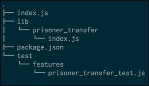
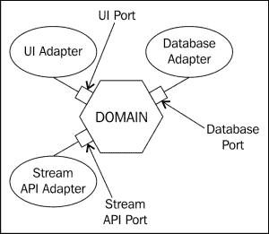

# 三、为领域驱动设计建立项目

到目前为止，我们一直专注于为项目准备先决条件。 我们专注于为自己创建一个心理模型，并确认我们对领域的理解与领域专家的理解相匹配。 通过这样做，我们开始在所有参与的人之间创建一种共享的语言，以便各方可以就项目进行交流，同时避免大多数误解。 所有这些都就绪后，我们就能够确定项目的起点，现在我们知道从哪里开始以及如何根据域为对象命名，我们可以设置项目以适应这一点。 罗伯特·c·马丁说,在他的谈话中*建筑失去了年*:*架构是意图*架构本身并不是为了创建但实际上国家这个项目是什么,让下一个人清楚每一层覆盖。 当我们设置应用时，我们希望在每个级别表达应用的内容，这包括文件和文件夹的组织级别，以及创建类和模块的级别。

我们的主要目标，与软件架构的目标相一致，通常是不过早地做出决策，并确保我们做出的决策尽可能地自解释。 我们还没有决定任何框架或技术，但随着我们现在推动我们的应用，是时候解决一些延迟的决定了，即使我们希望尽可能开放地接受更改。

本章将讨论创建一个灵活的项目设置时所面临的挑战，该设置允许您的项目适应并实际拥抱结构的变化。 在整个设计过程中，这一点非常重要。 我们不希望一个模块结构阻碍我们的重构，或者因为一个压倒性的类和文件层次结构而使我们的项目更严格。

当我们这样做的时候，我们将在多个层面上处理结构:

*   文件和目录结构
*   项目结构
*   对象或类结构
*   应用结构作为与域外部的交互

对象和类结构，以及项目结构，都与我们决定如何设计应用密切相关。 作为其中的一部分，引入了测试，因为它对我们如何设计类和对象有最直接的影响。 它还影响到我们的团队在项目上的合作方式，以及他们如何能够通过让业务专家探索项目的现状来向他们展示结果。

### 提示

如 JavaScript 树叶的领域加强网站和走向做一个语言用于大型应用,在浏览器中或在服务器上,需要更多的涉及架构已经和人试图把许多概念目前在使用 Java 或 c++的后端应用。 这通常会导致比解决的问题更多的问题，因为 JavaScript 是一种非常灵活的语言，对于组织能够和应该如何完成有自己的概念，即使有些部分可能仍然缺失; 模块是其中一个核心概念。 在构建 JavaScript 应用时，始终要记住你在使用什么语言，并使用它的特性和概念来与你的项目合作; 不要每一步都与之抗争。

这一章涵盖了项目的设置，以及如何让它成为一个愉快的工作。 您将了解以下内容:

*   项目文件的结构和布局时要考虑什么
*   不同形式的测试以及它们为什么重要
*   构建应用
*   六角形建筑的介绍

# 按照我们看到的方式构建项目

当一个新的开发人员深入一个项目时，他们看到的第一件事总是项目中文件和文件夹的布局。 这也是我们在编辑项目时经常处理的组织元素，因此值得对组织进行思考。 只看文件和文件夹应该已经告诉你一些关于项目的信息; 它是组织的最高级别，因此应该代表我们领域的一些顶级概念。

首先，我们需要确定我们要用这个结构来解决什么问题。 在这个层次上，我们需要处理多个点，它们将跟随我们完成项目组织的每个部分; 它们是:

*   可接近性
*   当地的编辑
*   应对变化的能力

我们来看看这些点是关于什么的以及如何对这些点进行优化。

## 平易近人

作为一种新的开发者加入一个项目,甚至作为一个回到一个项目,他们最近没有工作,有一个学习曲线知道东西在哪里,也许更重要的是在哪里事情应该位于前进。 这总是一个问题，因为它会减慢开发速度，或者在讨论开放源码项目时，它可能会减慢采用和贡献速度。 因此，我们显然希望使代码库尽可能地易于访问，但这意味着什么呢? 对于不熟悉的工具和风格有一个主观的学习曲线，这是很难为每个开发人员提前估计的，但是对于常见的实践、命名和建立良好的概念也有一个更客观的学习曲线。 那么，我们如何使代码库仅从文件和文件夹级别就可访问呢?

当我们开始的时候，我们需要看看里面有什么，所以导航的简单性是我们首先要处理的事情之一。 有大量的子文件夹，只有查看文件，有时甚至没有文件，这是一个使项目难以导航的例子。 有些人可能会说，与你合作的编辑应该解决这个问题，但这也是我们自己造成的问题，所以我们应该避免它。

有更多的方法可以使项目具有可访问性，例如，文件名应该反映内容，目录名也应该反映内容，可能最重要的是，项目应该遵循社区中建立的约定。 这意味着，除非你有一个很好的理由，否则你应该避免创建自己的惯例。 特别是一些小事情，比如根据社区标准命名文件，会有很大帮助。 一个例子是在文件末尾加上模型或控制器等名称的标签。 在一些编程社区中，这是很常见的，而在 Node.js 社区中，这是不被允许的。 遵循这些小原则可以让开发人员更轻松地完成工作，因为如果不遵循这些原则，可能会让开发人员对项目感到愤怒。

请记住，文件很可能只会被开发人员接触，因此可以对它们进行优化，以支持开发人员的任务，因此对于领域专家来说，一个常见的开发人员实践的权重高于可接近性。 当然，这种程度在不同的项目和任务之间是不同的。 它在很大程度上适用于组织性质和框架中的常见习惯用法，但不能扩展到在整个项目中开发的语言的固有部分的命名。 我们希望项目的结构对于已经熟悉类似代码库的开发人员是可接近的，但我们不想在开发人员和领域专家之间引入一个转换层。

让我们以如何布局地下城管理器的基础为例来进一步研究这个问题。 首先，当然，这将只包含转移`prisoners feature`，但尽管如此，它将暗示整体结构:



关于这种结构需要注意的重要一点是，它使用了节点模块的基础，同时已经暗示了可能的结构包括囚犯转移之外的多个特性。 按照惯例，`index.js`文件被命名为某个模块的入口点。 进入项目的开发人员在试图了解更多关于模块的信息时，应该首先查看这些文件。 稍后，我们可以利用这一事实来包含关于该特性的通用文档，以及让该文件加载完成模块任务所需的所有其他文件。

在测试文件夹中创建测试也是已确定的定位测试的方法。 由于测试在其设计中具有某些固有的类别，因此有必要相应地构造测试目录。 测试文件夹的结构应该允许我们一眼就能看出有哪些测试，以及它们如何应用到整个项目中。 随着项目的发展,有一组测试覆盖的特性不仅是令人难以置信的价值从回归的角度来看,但也给快速了解如何使用某个特性,所以快速定位您的测试可以意味着一个特定模块重用或改编而不是浪费努力在复制是什么了。

### 提示

这里展示的结构不是一成不变的，有些人更喜欢 app 而不是 lib, spec 而不是测试，或者其他类似的小改变。 结构的目标应该始终是让开发人员感到熟悉。 在这方面的权衡可以考虑到特定的开发人员。

最后，添加一个`package.json`文件是处理项目依赖关系和定义结构和其他部分方面的常用方法，所以我们也添加了这个，准备好在以后使用。

## 编辑地点

当开发人员在项目中工作时，他们很可能要么在处理一个特性，要么在修复 bug 和重构代码。 因为这些活动，至少在我们的目标情况下，与一个特性相关，我们希望确保开发人员不必跳转到许多不同的地方进行编辑。 因此，与问题相关的文件应该放在一个位置，从而减少打开与给定任务或功能相关的所有内容的开销，以及在头脑中保存相关部分以确保编辑发生在正确的位置的心理开销。

这是我们之前在`lib`文件夹中创建包或模块等特性的原因之一。 当开发人员处理俘虏转移时，他们可以通过查看目录结构，知道要编辑什么。 他们可以在编辑器中快速打开文件，并在修改代码以完成给定任务时将其视为工作单元。

使用这样的结构不仅使开发人员在编辑时更容易查看，而且版本控制系统也更容易使用。 由于代码是这样组织的，我们可以逐个功能来查看它，而且在处理不同功能时，我们也不太可能接触相同的文件。 这不仅减少了冲突的可能性，而且使给定模块的历史更有用。

如果您查看我们到目前为止一直在使用的前面的结构，您可能已经注意到，由于测试，编辑的位置会中断。 当我们在`lib`中处理囚犯转移特性时，我们也必须在测试中编辑特性测试，这是你在文件系统中所能得到的最远距离。 与软件开发中的所有事情一样，这是一种折衷，在这种情况下，我们选择了可接近性而不是局部性。 原因是，人们对入职的重视程度更高，而非本地的假定成本似乎足够低，足以支持这一点。 如果我们不这么认为，我们可能会在特性中定位每个特性的测试，因此在将来更容易将整个特性移动到不同的项目中。 当然，这个决定不是全部或全部，我们可以在 test 目录下创建一个类似于主结构的结构，以保持测试的位置，作为 test目录的一部分。

## 健身

|   | *根据达尔文的理论，健康意味着生存和繁殖的能力。* |   |
|   | ——*达尔文适应度——Lloyd Demetriusa, Martin Ziehec* |

随着我们的软件的发展和演变，它将需要适应其使用的不同场景，而最好的软件是那种增长超过其预期用例的软件。 一个常见的例子是 Unix 及其相关原理。 这个想法是创造许多小块，当重新组合时，允许大量不同的用途。 Unix 以各种形式存在了几十年，现在似乎还没有结束的迹象，但以某种方式创建只是故事的一半。 随着变化的出现和新的用例的形成，它并没有僵化，但是它的思想和概念是可塑的，但是这对我们的软件意味着什么呢? 我们如何才能实现类似的多功能性?

我们已经看到，即使在文件系统级，软件也是由模块组成的。 在实现特性时，不同元素之间有明显的区别。 从适应性的角度来看，这意味着我们能够快速定位某个特性，并增强、删除或重用它。 特性还应该暗示它的依赖关系，这可以通过子文件夹来明确，或者只需要查看位于特性目录根目录下索引文件中导入的依赖关系。

举个例子来说吧，随着地下城管理员的发展，囚犯转移可能会包含更多信息，因为其他地下城已经采用了我们的系统，我们现在可以完全自动化他们之间的转移。 在这一点上，整个王国依赖于传输服务的可用性，这意味着需要进行非常严格的测试来确保其可靠性，因为停机意味着王国无法以最大效率进行突袭。 我们很高兴这个系统的成功，但它减慢了地下城管理员的发展，因为囚犯转移是它的一部分，我们需要遵守它严格的整合规则。 但我们毕竟处于有利地位; 如果我们看看我们的应用的布局，我们可以看到，我们可以很容易地提取囚犯转移到一个应用本身，并让它单独维护。

在提取之后，我们可以再次开始快速前进，并将转移作为地下城经理的另一项服务。 将通用功能以及必须符合不同约束条件的功能分离出来，是拥有能够继续向前发展的可延展性和可扩展软件的关键。

在现实中,这显然是最好的情况下,只是构建一个应用作为一组独立的小部件测试分别在功能层面上让我们考虑 api 的方式将是非常有用的在路上随着软件的发展,当然,反过来也是一样。 我们能够快速删除不需要的特性，从而减少维护开销并提高速度。 这本质上就是本节开始时提到的所有小型 Unix 程序的协作概念。

这不是*就是一切的一切软件设计的*当然,当人开始使用 Unix 主要来自壳就知道最初的学习曲线非常陡峭,完成任何不觉得很快或表达开始。 正如我们以前看到的，为了一个目标而全力以赴意味着牺牲另一个目标，在这个例子中——项目的可接近性。 毕竟，没有完美的解决方案，但至少在项目的开始阶段，增强可接近性和在出现其他问题时考虑它们通常是有帮助的。 对我们来说，这意味着在脑海中保持一个高层次的模块结构可能是一件好事，但过分地让每个模块都准备好提取，甚至是它自己的应用，可能对项目没有帮助。

### 提示

不要为了得到完美的架构而把事情复杂化，因为它并不存在。 更重要的是，要让用户快速获得关于软件是否有用的反馈。 与次优架构相比，由于反馈的延迟，确定完美架构的速度变慢很可能会带来更大的成本。

## 处理共享功能

现在我们已经构建了应用，我们准备将可能成为一个独立功能的特性分开，但是反过来呢? 域通常有一组关键概念，这些概念一次又一次地出现。 这很好，因为它允许我们不必一遍又一遍地写它，如果我们可以在需要的地方分享它。 它还表明，我们对这个领域的理解足够好，可以提取核心概念并分享它们，所以这实际上是我们需要努力的东西。

这在某种程度上是很棒的，因为我们的功能与共享功能紧密匹配; 我们提供了一个公共接口，每个依赖的接口都可以在此基础上进行开发。 但是如果我们提取了一个功能，例如我们的囚犯转移服务不再是本地的，而是一个可以通过 HTTP 访问的服务，会发生什么呢? 在这种情况下，我们必须处理共享功能，这不仅仅是我们可以创建 API 的另一件事，而是我们必须在每个依赖中实现相同的代码来调用 API 来做我们之前在本地做的工作。 想想每一个其他购物系统创建的支付网关抽象—这种功能可以一次性开发并在多个地方使用，从而允许共享测试和共享开发资源。

当然，这不是共享功能实际上意味着共享代码的唯一地方，似乎我们必须在所有地方复制某些代码片段。 其他示例可能是数据库访问或配置管理。 所有这些的共同之处在于，它们实际上是与应用域没有真正密切关系的底层代码。 我们正在处理我们喜欢的通信方式的工件，而我们应用的模式不支持这种通信。 我们也可以从域级别内聚性较低的角度来考虑它，因为我们泄漏抽象的方式，例如，当我们想要处理一个囚犯时，会让我们关心数据库访问代码。

### 提示

在引入共享代码时要记住的一件事是，共享是耦合的，而耦合不是一件好事。 共享代码总是有很好的理由的。

多种解决方案在这一点上是可能的，根据项目和代码段，不同的方案可能适用，所以让我介绍最常见的。

### 共享工具箱

当第一个共享的功能出现时，并不真正属于任何地方，大多数项目开始创建一个*实用*库，一个在项目各处使用的工具箱。 尽管许多纯粹的架构主义者不赞成它，但它可能是最好的开始方式。 毕竟，将共享工具箱分离出来总比以后再处理代码复制要好。 许多受欢迎的图书馆都是这样开始的; 考虑一下下划线在 JavaScript 之上提供它的*每个*构造的实现，并处理浏览器实现可能需要关心的所有不同版本，以在世界各地运行。 下面是一个来自`underscore.js`文件的例子，为了更容易阅读，重新格式化了:

```js
var each = _.each = _.forEach = function(obj, iterator, context) {
  if (obj == null) return;
  if (nativeForEach && obj.forEach === nativeForEach) {
    obj.forEach(iterator, context);
  } else if (obj.length === +obj.length) {
    for (var i = 0, length = obj.length; i < length; i++) {
      if (iterator.call(context, obj[i], i, obj) === breaker)
      return;
    }
  } else {
    var keys = _.keys(obj);
    for (var i = 0, length = keys.length; i < length; i++) {
      if (iterator.call(context, obj[keys[i]], keys[i], obj) === breaker)
      return;
    }
  }
};
```

虽然像 underscore 这样的库是这种方法有用性的完美例子，但也存在一些问题。 特别是当命名不当时，这个文件夹或文件很快就会成为各种东西的垃圾场。 不去考虑什么东西真正属于哪里，而只是把更多的东西放到实用程序文件夹中，这样会更快。 至少它现在在一个可以移动和重构的地方，所以保持积极; 可能会更糟。 从长远来看，我们的目标应该是转向一种使用面向对象的方法，并让我们的测试从一开始就指导领域设计。 当我们查看一个应用，看到上面的库函数是应用代码的一部分时，我们知道这里缺少一个抽象。 再次强调，这是所有时间的权衡，抽象的问题是，你必须在写作时考虑它们。

### 提示

实用程序或库是一个危险的地方，所以一定要定期检查和重构它们。 总是让代码比你发现它时更整洁一点，并密切监视它的变动。

### 提升依赖性

随着项目的发展，处理依赖关系的最好方法可能是利用已经存在的东西。 您的库已经发展壮大，许多内部项目都依赖于它们，所以为什么不利用已经内置到环境中的依赖项管理呢?

JavaScript 在处理依赖项方面曾经是出了名的糟糕，但幸运的是，下载 jQuery 版本并将其放入项目的时间已经结束了。 JavaScript 为每个用例提供了数量惊人的依赖关系管理器。 在浏览器中,我们可以利用**鲍尔**([http://bower.io/),**browserify**](http://bower.io/)(【显示】http://browserify.org/)和**npm【病人】([https://www.npmjs.com/)和可能更多,在 node . js, npm 的标准方法是我们可以处理任何类型的包。](https://www.npmjs.com/)**

根据作为过程一部分开发的库的类型，在项目之外对其进行版本控制可能是一个好方法，甚至可能设置包注册表的私有版本。 这在一开始可能有些过分，但在需要的时候需要记住。 另外，不要忘记，现在可能是您回馈社区并将其作为开放源代码发布的时候了。

# 测试

|   | *注意以上代码中的 bug; 我只是证明了它是正确的，并没有尝试过。* |   |
|   | ——*唐纳德·欧文·克努斯* |

每个要投入生产的系统都需要根据实际情况进行评估。 现实是残酷的，通常情况下，当我们真正想要使用它的时候，我们期望能够完美地运作的东西却并不奏效。 因此，纵观计算机编程的历史，开发人员一直在思考如何确保软件能够工作，并且在最好的情况下，能够按照预期工作。

1994 年，Kent Beck 为 Smalltalk 编写了**SUnit**测试框架，开启了单元测试的现代时代。 这个想法非常简单:自动化代码的评估，并确保它满足特定的规范集。 尽管现在有许多新的框架可以实现这一点，但基本思想仍然是一样的:编写代码并检查它是否产生预期的结果。 实际上，无论有没有测试框架或固定流程，开发人员总是这样做——至少没有人在没有实际尝试过的情况下就把代码投入生产。 我们既可以手工做，也可以自动化做。

要使测试有用，需要解决多个问题，因为我们编写的测试有不同的目标。 我们需要简化简单的单元测试、富有表现力的特性测试和性能测试。 当然，这并不意味着所有场景都需要由一个框架来处理，但摩擦越少，核心原则的采纳就越好。 确保执行测试也是至关重要的，实现这一点的最佳方法是通过自动化，确保最终产品中没有代码不满足其需求或不破坏其他需求。

## 设置测试环境

正如我们现在所知道的，一个测试环境有许多不同的目标必须满足，但也有大量的测试框架，而 JavaScript 本身在测试时也带来了一些挑战。 mocha 测试框架在过去的许多项目中都发挥了作用。 它也在 web 开发人员中得到了相当广泛的采用，所以下面几节将解释 Mocha。 这并没有什么秘密，而且 Mocha 可以根据您选择的最适合开发团队风格的框架进行交换。 唯一要确保的是，您实际使用了您所拥有的内容，并意识到您想从您的测试中得到什么。 所以首先，我们需要确定我们知道不同测试的目标是什么，然后我们才能选择一种技术来实现它们。

## 不同类型的测试和目标

当我们开始测试代码时，有很多理由让我们这么做。 对于一个由领域实现驱动的项目，一个主要方面是在实现特性时始终测试它们，因为我们希望向客户提供快速反馈，并以解释性的方式显示我们的实现是有效的。 但作为开发者，我们也需要更深入地挖掘，并致力于单元层面，在编写代码或设计算法时探索代码的细节。 最后，一个项目不仅应该关心它的功能在实际做它应该做的事情，而且还应该从用户的角度来看是可用的，给出响应性的答案，并在整体上表现得足够好，而不是碍事。 所有这些方面都可以通过测试来实现。

### 功能规格

使测试不仅对开发人员有用，而且对客户也有用，多年来一直是测试驱动和实现的最终目标。 有工具,如**Ruby 的****黄瓜**有一个 JavaScript 实现确保规范变得有些代码解耦,使它尽可能容易阅读和理解的领域专家。 最终的结果是，规范大部分看起来像简单的英语，但有一些限制。 下面的代码使用 cucumber 语法将囚犯转移描述为一个特性规范，包括一个接受场景:

```js
Feature: Prisoner transfer to other dungeon
  As a dungeon master
  I want to make prisoner transfer an automated process
  So no important steps get left out

  Scenario: Notifying other dungeons of the transfer
    Given I have a prisoner ready to transfer to another dungeon
    When I initiate the transfer
    Then the other dungeon should be notified
```

使用`Given`、`When`和`Then`块作为我们测试的指令，这种规格现在可以很容易地转换为运行规格。

像这样将规范从实际测试中分离出来，在某种程度上可以将程序员从规范中分离出来。 因此，根据产品所有者的技术专长，即使是他们也可以编写规范，当然还需要一些开发人员的支持。 在大多数项目中，情况并非如此，开发人员最终会为 Cucumber 创建规范代码，并将其实现作为测试代码。 在这种情况下，坚持使用更基本的工具是有用的，因为它更适合开发人员以他们已经习惯的方式编写测试。 这并不意味着 Cucumber 的想法不值得记住。 测试应该具有很高的可读性，并且应该能够理解产品所有者在向开发人员描述它时的最初意图，因此我们可以作为一个团队一起检测不匹配。 但是，由于代码最有可能由开发人员阅读，因此几乎有两个测试实现的开销是不必要的。

受到黄瓜的启发，使用摩卡写我们的测试没有什么错。 测试看起来像这样，例如:

```js
var prisonerTransfer = require("../../lib/prisoner_transfer")
var assert = require("assert")

describe("Prisoner transfer to other dungeons", function () {
  /*
   * Prisoner transfers need to be an automated process. After
   * initiation the transfer should take the necessary steps to
   * complete, and prompt for any additional information if needed
   */

  it("notifies other dungeons of the transfer", function (done) {
    var prionser = getPrisonerForTransfer()
    var dungeon = getDungenonToTransfer()
    prisonerTransfer(prionser, dungeon, function (err) {
      assert.ifError(err)
      assert.equal(dungeon.inbox.length, 1)
      done()
    })
  })

  // Helpers
  /* get a prisoner to transfer */
  function getPrisonerForTransfer() { return {} }

  /* get a dungeon to transfer to */
  function getDungenonToTransfer() { return { inbox: [] } }
})
```

尽管这种风格现在是实际可运行的代码，但使用帮助器方法抽象细节并使命名清晰，以保持其可读性。 这里的目标不是让非技术人员轻松阅读本文，而是让开发人员能够与业务专家坐下来讨论隐含的规则。

### 提示

测试是代码不可分割的一部分，所以它们需要采用同样严格的编码标准，由于没有针对测试的测试，可读性是关键。

### 单元测试

在与业务专家讨论并就特性集达成一致意见，并在特性规范中创建其当前状态的规范之后，我们作为开发人员需要在一个级别上尝试我们的代码。 这就是单元测试发挥作用的地方! 我们的想法是在开发代码时测试它，并允许它立即单独执行，在那里我们可以对它进行推理。 单元测试通常会随着特定部分的开发进行而快速变化，并在之后起到回归保护的作用。

### 提示

不要害怕放弃单元测试; 他们的存在是为了帮助发展，而不是阻碍发展。

因为我们已经在使用 Mocha 的功能，所以很自然地我们也会使用它来测试更小的单元，但测试看起来会有所不同。 在单元测试的层面上，我们希望尽可能地隔离自己，如果我们做不到这一点，那么我们迟早也会在其他开发领域遇到一些痛苦。 这种痛苦其实是关于高耦合的; 当我们将一个模块与系统的其他部分耦合得太近时，测试将显示给我们。 在这种设置中，创建一个独立的单元测试将需要大量的设置，以确保我们只触及模块本身，而不触及依赖项。

模块单元测试的最终结果应该始终测试公共接口，并且只测试这个接口，因为此时它们起到了回归保护的作用。 使用单元测试测试的外部部件越多，它的私有接口就暴露得越多，就越有可能发生破坏，但即使这是我们的最终目标，也不要错误地认为这应该是所有单元测试所做的。 通常在编写大型应用的模块时，更深入地探索其逻辑是非常有用的，特别是当公共接口可能仍在变化时。 因此，在开发模块时，要编写所有触及模块较难部分的测试，但要确保在声明模块准备使用之前删除了那些“小助手”。

### 性能测试

每当一个应用向前发展并实现特性时，我们都需要考虑这个应用的性能。 甚至在我们讨论性能需求之前，了解系统的哪些部分在未来最有可能引起麻烦是很重要的。

性能测试的重要之处在于，它们将在早期阶段确定代码中的度量指标。 只要考虑如何测量系统各部分的性能，就会确保我们考虑到仪表，这可能是一个至关重要的特性，当我们实际上进一步接近大量使用或实际探索生产中的故障时。

当然，测试应用的性能不是一次性的事情。 就其本身而言，对业绩的衡量是相当没有意义的; 只有当它随时间变化而变化时，它才会变得有用。 实现这一点的一种策略是在每次推到主分支时使用外部 API 并记录更改。 这将使您了解在项目开发期间，项目在监控和性能方面所处的位置。

即使它可能不是完全明显的，监视性能的变化是实现域的一个要点。 作为采用领域驱动设计实践的开发者，我们必须考虑应用的可用性。通常，不同的利益相关者在性能上有不同的需求，一个不能满足其需求的应用可能会让某些人觉得它毫无用处。 很多时候，应用因为糟糕的性能特性而停止使用，即使它们提供了整个特性集。 总的来说，知道缺陷就成功了一半。 当我们至少了解了时间花在哪里时，这是一个我们可以在需求出现时挂钩和优化的点。 这种需求很可能迟早会出现，所以为它做准备的时间是非常充分的。

考虑到这些不同的目标，我们现在必须解决实际运行所有这些不同的测试的问题，而不必完全依赖于严格的遵从性，特别是在创建一个随时间变化的视图时。 当项目发生变化时，每次依赖于人运行所有需要的东西不仅是团队的主要负担，而且也是不必要的。

## 持续集成

最后，人们想要的所有测试只有在运行时才有用，这就是持续集成发挥作用的地方。 当然，我们都是优秀的开发者，总是测试自己的代码，但即使是我们也不一定总是测试应用中的整个集成链。我们的性能测试只有在类似平台上运行时才有用。

持续集成已经出现一段时间了，它最突出的系统可能是 Jenkins，但也有其他的系统。 我们的想法是在一个系统上自动运行从开发到生产所需的测试和其他步骤，并确保我们始终有一个稳定的构建。 我们甚至可以使用这个系统来自动部署，当然也为开发人员提供了一个仪表板来检查应用现在的运行情况。

这样的系统可能是项目的重要组成部分，因为它允许您快速地从开发过渡到系统，业务专家也可以在系统中检查工作的影响。 有许多关于如何设置项目的持续集成的教程，在最近高度完善的系统，如**Travis-CI**，使它非常容易设置，所以我在这里就不详细介绍了; 只要记住这样一个系统在整个项目发展到一定规模和复杂性的过程中是值得花费很多倍的成本的，并且没有真正的理由不使用它。

### 提示

一个持续集成系统实际上是关于在整个开发过程中保持最佳实践，即使开发人员有糟糕的一天。 它还提供了一种更容易接近的方法，让外部人员发现和评估应用的整体状态。

# 管理构建

为 orc地下城编写软件有一个主要的优势，因为 orc 不太了解软件，所以我们可以引入任何我们喜欢的工具，他们不会对此有任何意见。 您可能想知道，当本节的标题应该是关于构建软件时，我为什么要提到这个呢? 有无数的构建工具，它们做的事情都略有不同，而且每个人似乎都更喜欢其中一种。 特别是在 JavaScript 中,社区还没有标准化的工具有**的**,**杰克**,【显示】和西兰花,这里只列出了其中的一些,当然您的项目可能利用一个从不同的语言如 Ruby 的 Rake 或熟悉。

尽管有这么多构建工具，但它们唯一重要的事情是实际使用一个。 是的，它们都有不同之处，但它们都可以做几乎相同的事情，根据语法和性能进行调整。 但是为什么构建工具如此重要呢? 为什么要用呢?

## 为什么每个应用都需要一个构建系统

在的规模上创建软件，实际上创建一个功能齐全的系统来管理业务流程总是一项艰巨的任务。 这样的系统包含许多部分，如管理囚犯转移，通知其他地下城，跟踪地下城的统计数据等等。 当我们设置它时，我们需要加载多个文件，可能需要编译一些部分，管理依赖项，并且，在前端 JavaScript 代码的情况下，我们还希望压缩和最小化它，以优化更快的页面加载。 手动完成所有这些操作涉及多个步骤，并且很可能迟早会失败，因为我们忘记了其中的一个步骤，而这正是构建系统出现的地方。 在某种程度上，所有软件都有一个构建系统，它只是取决于系统的自动化程度。

### 提示

构建系统优化*无聊*; 构建越无聊越好。

我们的目标是不犯错，并且每次都创造一个可重复的环境。 我们想要运行一个命令并得到预期的结果，所以在我们的例子中，构建系统有两个职责:

*   运行测试
*   打包应用
*   部署应用

所有这些步骤都是很重要的，所以让我们来看看。

### 运行测试

我们现在写伟大的测试,这些测试确保系统按预期的行为根据我们与领域专家工作的特性集,所以应该运行这些测试,如果他们没有我们的系统有问题,我们需要解决。 因为我们已经有了一个测试框架，所以运行测试非常简单:

```js
$ mocha --recursive test

```

这将运行测试目录中指定的所有测试，根据我们前面创建的文件布局，它将是所有测试。 因为我们不想记住这个命令，我们可以通过将它添加到我们已经设置的`package.json`文件中来将它连接到 npm:

```js
{
  "name": "dungeon_manager",
  ...
  "scripts": {
    "test": "./node_modules/.bin/mocha --recursive test"
  }
  ...
}
```

有了这个，运行我们的所有测试就变成:

```js
$ npm test

```

这将使我们的生活变得容易得多，我们现在可以依赖一个命令来实际运行我们的测试，而失败肯定是开发失败，而不是命令的输入错误，例如，忘记了`--recursive`，然后跳过大多数测试。 根据相关开发人员的偏好，我们可以更进一步，观察文件的变化，并重新运行由这些变化触发的测试，这里描述的系统应该被视为最低需求。

### 应用的包装

将应用移动到生产很可能不是一个一步的过程。 Web 应用可能包括将资产编译在一起、下载依赖项，甚至可能为生产而不是开发配置某些部件。 手动运行这些步骤很容易出错，每个以前使用过这种流程的开发人员都有一个故事，讲述它或多或少的失败。 但是如果我们想让我们的软件的可塑性,能够应对变化的领域,以及让它在我们的手中迅速领域专家,我们需要尽早并且经常部署,这是包装的第一步一步的应用。

目标是让每个开发人员都能够设置应用的基本环境，就像我们在安装 Node.js 的例子中那样，然后用一个命令设置应用。 现在继续使用 npm 来管理我们的任务，我们在`package.json`文件中添加以下内容:

```js
{
  "name": "dungeon_manager",
  ...
  "scripts": {
    "test": "./node_modules/.bin/mocha --recursive test",
    "package": "npm install && npm test"
  }
  ...
}
```

由于这是一个自定义命令，在 npm 运行中没有特殊支持，它意味着运行:

```js
$ npm run package

```

对于局外人来说，这有点不直观，但在 readme 文件中列出这样的命令将暂时涵盖这一点，如果我们愿意，我们还可以决定一个系统来包装所有这些调用，使它们保持一致。

现在我们已经有地方放置打包应用所涉及的任何步骤，我们已经准备好确保也可以用一个命令部署它。

### 部署

就像我们之前说的，我们希望我们的部署是一个无聊的过程; 它应该是一步，永远不要造成一个难以恢复的失败。 这实际上意味着我们需要能够在必要时回滚部署，否则对错误部署的恐惧将阻碍任何进展。

实际的部署可以非常简单，根据您的需要，几个 shell 脚本就可以轻松完成部署。 `deploy.sh`是一个涵盖基础知识、易于使用并能适应不断变化的需求的系统，可在[https://github.com/visionmedia/deploy](https://github.com/visionmedia/deploy)上找到。 当使用 deploy 时，要做的就是创建一个`deploy.conf`配置文件:

```js
[appserver]
user deploy
host appserver-1.dungeon-1.orc
repo ssh://deploy@githost.dungeon-1.orc/dungeon_manager
path /home/deploy/dungeon_manager
ref origin/master
post-deploy npm run package && npm start
```

该文件可以为任何应用服务器扩展，并且应该相当容易读取。 任何需要运行的步骤都可以作为部署前或部署后钩子实现，这使得这个系统非常灵活，特别是在与管理应用部分的强大构建系统相结合时。

## 选择正确的系统

到目前为止，我们一直在使用可用的，而没有真正安装大型工具; `deploy.sh`本身只是一个 shell 脚本，包含不到 400 行代码，npm 默认随 Node.js 一起提供。 实际上有很多有效的理由使用系统外的环境,例如,当你期望超过一种语言组成的项目将在未来,选择中性的包装器可以大大增加一致性项目和缓解在坡道上。

现在我们知道我们想从系统中得到什么，所以选择一个意味着查看需求并选择一个大多数开发人员喜欢的。 有一件事要记住，这是项目将会坚持很长一段时间的东西，所以一个有一些用途的系统是一个好主意。

### 提示

我喜欢将我的大多数项目包装在一个简单的**Makefile**中，因为它是最可用和最容易理解的系统，但你可能会有所不同。

这将我们带到设置的最后，我们思考文件和运行命令，但一个重要的部分是缺失的，那就是，如何实际使世界的域部分，但保持足够的分离，以允许对它进行推理。

# 域隔离

|   | *创建您的应用，使其在没有 UI 或数据库的情况下工作，这样您就可以对应用运行自动回归测试，在数据库不可用时工作，并将应用链接在一起，而无需任何用户参与。* |   |
|   | ——*阿利斯泰尔·考伯恩* |

当我们按照领域驱动设计的原则创建应用时，我们努力使业务逻辑与与“现实世界”交互的软件部分分离。 最常被引用的情况是，我们不希望以一种同时包含部分或全部业务逻辑的方式构建 UI 层。 我们想要一个清晰的以领域为中心的 API，该 API 由应用的其他部分使用，以提供它们与领域的交互。

它的概念类似于某些人提供的 UI，比如特定于 UI 的语言或 API，比如 HTML 或 QT，两者都是从为开发者提供构建 UI 所需的所有部分，但保持自然分离的概念中跳出来的。 这是没有意义的，HTML、CSS 和 JavaScript 的 DOM 抽象的组合是一种 DSL，一种特定于领域的语言，用于构建浏览器界面。 它们提供了一种抽象，在这种抽象下，浏览器实现者可以自由地更改他们的实现，而不影响每个编写的网站。 因此，它们将浏览器供应商的业务领域(显示结构化内容)与创建内容的工作(很可能是您的工作)隔离开来。 历史证明，拥有这样的 API 比直接公开内部数据结构有很多优势。

## 现代应用的架构

隔离业务领域的想法已经跟随软件行业很长一段时间了，特别是随着拥有一个核心领域和许多消费者的增长。 近年来，由于移动设备和网络的日益重要，让服务首先成为 API 的想法变得越来越可行。 今天的许多应用都有多个接口，例如，在酒店预订中，员工可以访问酒店的状态、在房间之间移动客户、通过电话进行预订等等。 与此同时，顾客可以上网，通过各种门户网站查询可供选择的方案并进行预订。

在手机到达之前，用户可能想通过手机应用访问手机上的数据，以确保无论他们在哪里都可以使用这些数据。 这些只是预订系统众多访问选项中的一部分，即使是现在，已经有很多选项了:

*   内部桌面应用
*   内部 web 应用
*   Web 应用
*   其他提供者提供的 Web 应用
*   移动应用
*   其他供应商提供的移动应用

这已经是一个很长的列表了，我们可以期待未来随着新设备的出现，伴随着不同的使用模式，这个列表还会继续增长。

### 六角形建筑

那么，我们如何确保一个应用已经准备好发展了呢? 随着 web 应用的出现和主导地位，开发人员已经意识到，在应用构建的过程和它使用的界面和技术之间存在着分歧。 这种分离并不是一件坏事，因为它可以用于在这些点上建立 api，并封装核心概念域驱动设计所涉及的业务领域。 一种可能的技术被称为**六边形结构**。



整个应用被看作一个六边形，业务域位于其中。 虽然业务领域只关心它自己的语言和概念，但它使用端口与它需要的任何东西进行通信。 端口是与外部世界的接口，并为需要什么以及应该如何提供建立一个清晰的 API。 另一方面，有适配器，即提供 API 的元素。 这提供了很大的灵活性，而且它不仅允许您交换适配器(例如在测试期间)，而且还允许您更快地尝试不同的技术，以找到最适合的技术，而不是通过猜测，而是实际使用应用进行尝试。

## 应用模式

作为一个热心的读者应该已经意识到，我们的地下城管理应用与刚才描述的预订应用没有太大区别。 接下来，我们还希望将其与多个 ui 和其他应用集成在一起。 此外，我们的业务概念非常复杂，足以让我们接触到领域驱动的设计，所以六角架构非常适合我们。 但我们如何做到这一点呢?

首先要意识到的是，到目前为止，我们已经为它进行了设计。 我们的核心功能是在数据库或 web 框架之外理解的。 六角形架构的思想和领域驱动的设计毕竟结合得很好。 现在，我们进一步明确业务领域包含的内容和外部提供的内容。 这也被称为**持久性无知**，因为我们希望我们的域忽略处理保存和加载数据的层。 作为这个模式的一部分，我们创建单独的对象或模块来封装我们领域的操作，并使用这些对象或模块集成到 web 框架中，以及在将来需要时作为 API 公开。

抽象不是免费的; 根据应用的不同，过多地抽象数据层可能会带来难以应付的性能开销。 另一方面，如果域以这样的频率与数据层交互，则域本身可能存在问题，您可能需要重新考虑域层中的聚合。 我们思考这些模式的方式更像是一个滑块而不是布尔值; 我们可以根据领域以及应用性能的需要增加或减少抽象。

## 插入框架

那么我们如何使这个为我们的应用工作呢? 我们要创建的第一个版本是有一个 web UI，所以我们需要插入一个 web 框架，这样我们就不必重复工作了。 Node.js 提供了很多选项，最流行的是`express.js`，我们已经用过了，所以我们想做的是让 express 做它最擅长的事，服务请求，而我们的核心域处理这些请求的逻辑。

让我们来看一个例子:

```js
app.post("/prisoner_transfer", function(req, res) {
  var dungeon = Dungeon.findById(req.params.dungeonId)
  var prisoner = Prisoner.findById(req.params.prisonerId)

  prisonerTransfer(prisoner, dungeon, function(err) {
    var message
    if(err) {
      res.statusCode = 400
      message = { error: err.message }
    } else {
      res.statusCode = 201
      message = { success: true }
    }
    res.end(JSON.stringify(message))
  })
})
```

管理囚犯转移的代码被很好地封装在它自己的模块中，并且只与域对象交互。 另一个问题是代码应该放在哪里。 在这个早期阶段，像这样的代码可能仍然有效地驻留在一个`index.js`文件中，提供接口，但随着项目的进展，我们可能会转向一个更模块化的体系结构，该体系结构包含将领域连接到自己模块中的 express 框架的粘合代码。 在这个阶段，我们甚至可以创建一个中间件层来在需要依赖项时自动注入它们。

# 小结

在本章中，我们开始了这个项目，并且进展顺利。 我们已经做好了一切准备，使项目进展顺利，并为接下来无疑会发生的变化做好准备。 再次强调，主要思想都是关于孤立和确保我们思考和处理领域，而不是迷失在复杂的语言和框架中。

正如大多数程序员所同意的那样，集成系统和建模数据是两个真正需要关注自身的任务，通过这样的设置，我们朝着集成迈出了重要的一步。 同时，该体系结构使我们能够像前面开始的那样继续建模数据。

在下一章中，我们将更详细地讨论领域对象本身，以及在领域驱动设计术语中对它们建模意味着什么。 我们将介绍对这些模型进行分类的术语，并结合面向对象的领域驱动设计将它们驱逐出去。