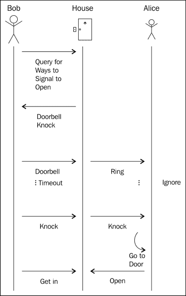

# 并不是所有的领域驱动设计

|   | *如果说我看得远些，那是因为站在巨人的肩膀上。* |   |
|   | ——*牛顿* |

就像在开发过程中的大多数事情一样，而不仅仅是在开发软件时，大多数概念都是在开发之前被发现的，大多数事情都是在开发之前完成的，但是有一些细微的变化，或者是思想的重新组合，使旧的概念更有用，或者使新的和创新的用途成为可能。 开发软件的实践从一开始就在不断发展和演变。 不久前，结构化编程的概念，即使用函数、子程序、while 和 for 循环，被认为是一个新概念。 后来，面向对象和函数式编程采纳了这些思想，并在其之上添加了新的思想，以进一步简化可维护性，并允许程序员在他们编写的程序中更好地表达他们的意图。

与这些思想一样，领域驱动设计是从面向对象编程的许多思想演变而来的，本书中已经提到了其中的许多思想。 还有更多的概念影响着这些思想，其中一些与面向对象密切相关，比如面向方面的思想，以及使用普通对象对系统中的核心服务层建模。 但是也有来自其他领域的想法，比如构建特定领域的语言。 领域特定语言已经存在很长一段时间了，它们在 LISP 语言家族中很常见。

### 注释

LISP 家族知道不同形式的 DSL，而且大多数 LISP 程序本身可以看作是非常轻量级的 DSL。 详情请访问[http://en.wikipedia.org/wiki/Lisp_%28programming_language%29](http://en.wikipedia.org/wiki/Lisp_%28programming_language%29)。

函数式编程还增加了领域驱动设计的思想，最明显的思想是，不变性是一个目标，易于调试，并考虑一般的领域。

在下一章中，您将详细了解那些影响域驱动设计和一般编程的附加概念。 本章将涵盖以下主题:

*   理解领域驱动设计的先决条件
*   了解诸如面向对象和面向方面编程、使用普通对象编程以及命令查询分离等影响
*   领域特定语言
*   其他编程实践，如函数式编程和基于事件的系统

# 域与问题匹配

工作在一个应用程序主要意味着思考如何表达一个给定的问题，以一种机器可以理解和工作的方式。 领域驱动设计将整个循环带回来，并确保从事该领域工作的人员理解问题的机器表示，因此能够对其进行推理并对其做出贡献。

在整本书中，我们一直在讨论如何同时为人类和机器构建一种语言。 这样做意味着采用 JavaScript 提供给我们的结构，并使它们对开发人员和领域专家具有同样的表达能力。

表达问题的方式有很多种，其中一些比其他的更容易思考。 例如，在一个非常简单的情况下，可以这样写数组数的和:

```js
var ns = [1,2,3,4]
for(var i = ns.length-1, si = ns[i], s = 0; si = ns[i--];) s += si
console.log("sum for " + ns + " is " + s)
```

这个简单的程序的工作原理是在`for`循环检查中做大量的工作，为数组的当前元素赋值，为和赋初始值，然后使用这些值来实现和。 为了使循环更令人困惑，它使用了在数组边界之外获取索引的属性，导致 undefined，在检查中跳出循环时为 false。

即使这行得通，也很难推断出正在发生的事情。 这是由于命名和复杂的结构被用来表达数字相加的想法。

## 成长为一个领域

想想前面例子中的域，我们可以看到 JavaScript 已经给了我们一些术语来更清楚地表达这个域，假设我们熟悉一些数学术语，例如:

```js
var numbers = [1,2,3,4]
sum = numbers.reduce(function (a, b) { return a + b }, 0)
console.log("sum for " + numbers + " is " + sum)
```

通过使用我们可用的工具，我们可以慢慢地成长为一般的领域概念，扩展已经存在的内容，并构建需要添加的内容。 我们现在使用内置的 reduce 函数来完成与以前的`for`循环相同的操作。 `reduce`函数接受一个函数作为参数，它传递到目前为止的结果和当前元素，我们还给它一个起始点 0 以启动进程。 对于熟悉该语言的人来说，这更容易读懂，而且几乎可以立即理解，因为它使用了表达数组操作的通用概念。

使用相同的基本技术，我们也可以利用内置函数来完成我们领域中的任务。 当我们想要计算一个传输所花费的时间时，我们可能希望只考虑工作日，因此我们需要过滤周末，使用内置函数，这可以清晰地表示:

```js
var SATURDAY = 6
var SUNDAY = 7

var days = [1,2,3,4,5,6,7,8,9,10,11,12,13,14,15,16]

var transportTime = 11

var arrivalDay = days.filter(function (e) {
  if (e % SATURDAY === 0) return false
  if (e % SUNDAY === 0) return false
  return true
})[transportTime]
```

我们使用 filter 方法过滤掉从现在开始的几天中的周末(假设是周一)，然后我们可以选择到达日期作为数组中的位置。 随着开发的深入，我们可以更清楚地说明这一点，但使用内置方法操作已经使代码具有自然的可读性。

不同的领域具有不同的表现力，一般来说，对某个问题理解得越多，就越能更好地围绕这个想法构建领域设计，因为一般问题的复杂性实际上会导致领域驱动的设计。

## 领域驱动设计的良好领域

到目前为止，我们一直在与地下城管理系统合作，该系统管理进出地下城的细胞和囚犯，如果他们出现，就会给地下城带来收益。 就像我们已经看到的，这个领域是相当复杂的，因为到目前为止我们只管理了从地下城中运送囚犯，允许地下城在适当的时间拥有足够的囚犯。 当然，这并不是一个真实的例子，因为我们一直在谈论半兽人。 这个例子基于一个非常真实的应用程序，最初基于管理酒店预订的想法，包括超额预订和过少预订。

在检查领域时，我们可以看到某些属性，这些属性使它成为领域驱动设计的有价值的领域。 内在的问题相当复杂，涉及到许多不同的部分进行协作和建模，以建立一个完整的工作系统。 随着系统进一步优化为最优系统，为使用公司提供最大利润，每个部分通常也会发生变化。

在这种情况下，与系统交互的用户差异很大，这进一步增加了领域设计的价值。 不同的用户需要看到连接在一起的不同接口。 这种共享功能很难正确,和拥有一个中央共享部分核心模型,模型是一个很好的方式来保持不同的子应用等进行漂流,这是一个常见的问题在项目一组公共领域特定的逻辑拆分到多个应用程序。

# 面向对象的力量

到目前为止，我们在构建应用程序时所使用的大部分概念，并不是领域驱动设计概念的具体发明。 许多熟悉围绕这些软件工程原则的其他工作的人会注意到来自其他领域的许多想法。 很多想法是许多人在面向对象的过程中培养出来的。

## 面向对象的原则

面向对象是关于封装状态和功能。 这个想法是基本的，我们在整本书中都在使用它来构建我们的系统，并将不同的部分组成对象。 当涉及到面向对象时，JavaScript 对象是特殊的，因为 JavaScript 是少数基于原型继承而不是像大多数其他面向对象语言一样基于经典继承的语言之一。 这意味着不仅仅是一种处理继承的特殊方法; 这也意味着 JavaScript 有一种非常简单的方法来处理对象。 因为实例和类之间没有真正的区别，所以处理对象的语法非常简单:

```js
var thing = {
  state: 1,
  update: function() {
    this.state++
  }
}

thing.update()
thing.update()
thing.state         // => 3
```

这是创建对象最简单的方法，也是 JavaScript 中最常用的方法。

我们已经使用对象来表示值对象和实体，特别是值对象。 面向对象编程的一个关键点是对象提供的隔离; 在构建系统时，我们通过让对象通过相互发送消息来进行交互。 当我们能够像我们所做的那样将命令与查询消息分离时，这种方法工作得特别好。 从查询中分离命令可以更容易地测试和更好地推理代码，因为它将修改状态的东西(命令)从幂等操作(可以执行而不会造成任何副作用的查询)中分离出来。 另一个更重要的优点是，将查询与命令分离，可以让我们更清楚地表达命令的重要性。 当我们向域对象发出命令时，它在域中有重要的意义，因此应该独立存在，并且使用项目中建立的通用语言。 当发出命令时，我们总是希望表达“为什么”，而将其与查询绑定在一起则不允许名称同时表达两者。

### 提示

一个常见的例子是更新对象属性的命令，比如`updateAddress`，它在命名时没有告诉我们“为什么”。 `changeDeliveryTarget`使这个属性被更新的原因更清楚。 在查询方法中混合这些更改是不自然的。

原型继承为我们提供了另一种建模数据的好方法，与经典继承相比，原型继承中的链可能相当浅。 原型的重要特性是，它们允许我们动态地从任何对象继承。 下面的代码展示了如何使用`Object.create`来继承和扩展对象:

```js
var otherThing = Object.create(thing, {
  more: { value: "data" }
})

otherThing.update()
thing.update()

thing.state           // => 2
otherThing.state       // => 2
otherThing.more        // => data
thing.more             // => undefined
```

使用`Object.create`方法可以让我们轻松地从其他对象构建。 它并不总是出现在JavaScript 中，在我们需要做更多来获得同样的效果之前，但对于`Object.create`方法，构建对象是非常自然的，它包含了原型继承的概念。

对象非常适合为流经系统的数据建模，因为它们非常轻量级且可扩展。 正如前面几节所讨论的，我们需要注意一些注意事项。 特别是简单的扩展，它允许使用浅层继承层次结构，同时仍然使用多态性来解析控制流。 使用多态性来控制控制流是面向对象中允许对象封装知识的常用方法。 当我们向一个对象发送一个命令时，我们希望它根据它的内部知识和状态进行操作，我们不关心它的具体实现，除非我们想向它发送一个特定的命令。 这让我们能够拥有智能对象，能够对针对它们的命令做出不同的响应，例如:

```js
var counter = {
  state: 1,
  update: function() {
    this.state++
  }
}

var jumpingCounter = Object.create(counter, {
  update: { value: function() { this.state += 10 } }
})

jumpingCounter.update()
jumpingCounter.state // => 11
```

我们再次使用一个基本的 JavaScript 对象作为基础，在其上构建新的功能。 这一次，我们在不修改底层计数器对象的情况下，通过使用新函数实现跳转计数器来扩展简单计数器的新功能。 这显示了易于扩展的威力——我们可以只使用封装在已经存在的对象中的功能，并在其基础上进行构建，而不需要太繁琐。 这种可能性正是 JavaScript 强大功能的来源，这是一种很好的功能，但也很容易被滥用。

这就形成了一个非常简单的领域模型模型，这些模型相互依赖，可以直接使用，也可以扩展。

## 业务领域的面向对象建模

封装业务领域的面向对象的思想通常有很大的好处，因为它导致了更少耦合的系统，更容易理解和修改。 当我们认为对象是我们传递消息和接收答案的对象时，我们自然地减少了与代码内部结构的耦合，因为 API 变成了一个问题和答案，以及一个命令游戏。

以我们的地下城和它的半兽人为例，我们可能想要执行一个对抗入侵者的方法。 所以我们一开始便会使用带有武器的半兽人，例如:

```js
var Orc = {
  init: function (name, weapon) {
    this.name = name
    this.weapon = weapon
    return this
  },

  get isArmed () { return !!this.weapon },

  attack: function (opponent) {
    console.log(this.name + " strikes "
        + opponent.name + " with " + this.weapon + ".")
  }
}
```

这里有一个功能不常用但非常强大:我们可以定义 getter 和 setter 的 JavaScript 对象通过特殊的`get`或`set`语法,让我们首先限制修改的范围我们的属性,但也让我们构建更复杂的属性的其他的人。 在这种情况下，我们抽象地认为丢失的武器意味着兽人没有武装。

我们认为战斗是它自己的域对象，所以我们也对它建模:

```js
var Fight = {
  init: function (orc, attacker) {
    this.orc = orc
    this.attacker = attacker
    return this
  },

  round: function () {
     if(this.orc.isArmed) {
       this.orc.attack(this.attacker)
     } else {
       this.attacker.attack(this.orc)
     }
   }
}
```

战斗包含了只有武装兽人才能在战斗中攻击对手的逻辑。 当然，这是非常简单的逻辑，但它可能会变得更加复杂。 我们将使用一个对象模型来抽象系统中战斗是如何处理的事实。

### 提示

一定要记住，创建对象(尤其是用 JavaScript 创建对象)是非常便宜的。 将太多的知识封装到一个对象中并不是一个好主意，通常情况下，最好是尽早将对象划分为职责。 一个很好的指示器是一个对象，它有很多私有方法，或者其名称密切相关的方法。

现在我们可以用对象来模拟战斗:

```js
var agronak = Object.create(Orc).init("Agronak", "sword")
var traugh = Object.create(Orc).init("Traugh")

var fight = Object.create(Fight).init(agronak, traugh)
fight.round() // => Agronak strikes Traugh with sword.
```

它将战斗的逻辑封装在自己的对象中，并使用兽人来封装与兽人相关的逻辑。

## 纯面向对象的场景不足

面向对象的基础对于领域建模的大部分工作都很好。 特别是在 JavaScript 中，它具有非常轻量级的对象创建和建模功能，可以很好地为一个领域建模，就像我们看到的那样。

面向对象的不足之处是在事务管理级别，我们有跨多个对象的特定交互，这些对象需要从更高级别进行管理。 另一方面，我们不希望事务的细节泄漏到所有相关的对象。 这就是域驱动设计与值对象、实体和聚合分离的地方。 在这种情况下，聚合通过作为其他协作者的生命周期管理器来实现工作流管理。 当我们将域建模为由子域组成时，即使一个实体可以在不同的协作子域之间共享，每个子域都有它自己的实体视图。 在每个子域中，聚合可以控制完成任务所需的事务，并确保数据处于一致的状态。

当然，正如我们在本书中看到的那样，还有许多其他的附加内容，但是为对象的底层细节添加高级管理是一个重要的特性，它将面向对象的应用程序结构扩展到面向域驱动表单的对象。

# 影响保持密切

面向对象并不是我们在本书中看到的对应用程序开发的唯一影响。 许多不同的技术可以用来建模领域概念并影响应用程序的开发方式。 JavaScript 本身是一种非常灵活的语言，可以用来做一些非常有趣的事情，有时还可以被滥用。

根据不同的情况，在建模某些方面或解决在构建模型时发生的某些问题时，可以保留不同的想法。

## 面向方面编程

在其核心，软件开发的大多数思想都围绕着如何封装逻辑和表述它，使其易于访问，并具有可理解和可扩展的公共接口。 可扩展性是一个非常重要的方面，特别是在业务软件中，因为需求需要根据实际情况进行调整，软件需要能够快速地包含新的需求。

面向方面的编程将软件开发方面的思想置于程序设计的中心，并且特别关注我们如何在没有重复的情况下以可维护的方式实现横切关注点。 在面向方面编程中，方面是各种可能在不同对象之间共享的关注点。

面向方面编程的典型例子是向系统添加审计日志。 审计日志需要跨所有不同的域对象实现，而同时又不是对象的核心关注点。 面向方面编程提取方面(在本例中是审计日志)，并将其应用到应该以这种方式处理的每个对象。 通过这种方式，它使方面成为系统的核心部分，与业务对象解耦。

JavaScript，由于它的动态特性，可以非常简单和动态地做到这一点; 一种解决方案是使用特征。

### 注释

所使用的性状基于[https://javascriptweblog.wordpress.com/2011/05/31/a-fresh-look-at-javascript-mixins/](https://javascriptweblog.wordpress.com/2011/05/31/a-fresh-look-at-javascript-mixins/)。

现在，我们可以在前面的示例基础上构建，并将`audit`日志记录添加到`Fight`对象。 我们可以将对日志的调用直接添加到`fight`类中:

```js
var util = require("util")

var Fight = {
  init: function (orc, attacker, audit) {
    this.audit = audit
    if (this.audit) {
      console.log("Called init on " + util.inspect(this) + " with " + util.inspect(arguments))
    }
    this.orc = orc
    this.attacker = attacker
    return this
  },

  round: function () {
    if (this.audit) {
      console.log("Called round on " + util.inspect(this) + " with " + util.inspect(arguments))
    }
     if(this.orc.isArmed) {
       this.orc.attack(this.attacker)
     } else {
       this.attacker.attack(this.orc)
     }
   }
}
```

为了确定我们是否可以审计战斗，我们将添加一个标志，然后检查和记录适当的调用。 这为对象添加了大量的管道，因为我们现在还需要依赖于一种检查方法，因此要向`util`库添加依赖项。

### 提示

在大多数情况下，我认为标志参数是一个危险信号，因为它们表明多个关注点混合在一个地方，需要打开它们。 通常，它可以指示一个通过使用面向方面更好地解决的横切关注点。

在兽人战斗中添加日志的一个更好的方法是在战斗中添加一个可记录的特性。 其特征如下:

```js
var util = require("util")

var asLoggable = function () {
  Object.keys(this).forEach(function (key) {
    if (this.hasOwnProperty(key) && typeof this[key] === ' function' ) {
      var that = this
      var fn = this[key]
      this[key] = function () {
        console.log("Called " + key + " on " + util.inspect(that) + " with " + util.inspect(arguments))
        return fn.apply(that, arguments)
      }
    }
  }, this)
  return this
}
```

代码将每个函数包装在一个函数中，该函数首先记录其参数，然后将它们转发给函数。 因为 JavaScript 允许我们通过内省功能枚举我们想要扩展的对象的所有属性，所以在抽象的方式下，这是可能的。

当应用到一个对象时，`asLoggable`特征将对象的每个方法包装在一个日志方法中，写出哪个函数被什么调用，使用什么类型的参数，为了输出更有意义的信息，它使用`inspect`库。

让我们将其应用到之前构造的代码中，这意味着用`LoggableFight`对象替换`Fight`对象:

```js
var LoggableFight = asLoggable.call(Fight)
var fight = Object.create(LoggableFight).init(agronak, traugh)
fight.round()
```

调用现在将被记录，输出将如下所示，但为便于打印而缩短:

```js
Called init on { init:…, round:…} with { … }
Called round on {…, orc: {…}, attacker: {…} } with {}
Agronak strikes Traugh with sword.
```

这一添加并不改变整体行为，而是对系统的纯粹扩展。

以这种方式扩展对象是一项非常强大的技术，但同时也可能相当危险。 尽管代码创建起来非常简单，但要理解代码的某些属性来自哪里却不那么容易，而且很大程度上取决于正确的命名。 举例来说,如果我们刚刚取代了`Fight`对象在一起,去掉`LoggableFight`对象的名字,就没有说明为什么突然日志应用于方法,和开发人员跟踪代码中的缺陷会有一个艰难的时间在一个大项目。

## 命令查询分离

面向方面是关于在对象级别分离关注点，而命令查询分离是关于在方法级别分离关注点。 我们已经看到，处理状态是困难的，因此值对象比实体更简单。 方法也是如此:向对象发送查询意味着对象将以相同的方式回答相同的查询，只要它保持相同的状态，并且查询不会修改状态。 这使得为查询编写测试变得非常容易，因为只需简单设置对象并断言方法的输出就可以了。

命令可能更复杂，因为它们修改它们被发送到的对象的状态。 命令通常没有返回值，但应该只导致对象的状态改变。 这又让我们更容易测试命令的结果,我们可以建立一个对象,发送命令,并断言,适当的改变被应用,而无需维护的同时,返回了正确的返回值。 在编写命令时，我们需要记住的是管理它们的故障状态，根据应用程序的不同，有多种方法来处理这个问题。 最简单的方法可能是引发异常，或者当使用`async`命令时，向回调返回一个错误。 这允许管理聚合，以作出反应和回滚，或适当地处理问题。 无论哪种方式，我们都不想返回更复杂的结果，因为这会很快导致依赖于从命令返回的数据。

在编写可测试和扩展的可维护代码时，命令查询分离是要记住的核心原则之一。

## 普通的老物件

随着分离而来的是使事情尽可能简单的趋势，对于大多数应用程序(尤其是 JavaScript)来说，方法是使用 JavaScript 提供的简单、普通的对象。 在 JavaScript 中，我们有多种构造对象的方法，在整本书中，我们都在使用经典的和更类化的模式:

```js
function Orc(name) {
  this.name = name
}

Orc.prototype.introduce = function () {
  console.log("I AM " + this.name + "!")
}
```

在本章中，我们还使用了更多类似 javascript 的模式，使用`Object.create`和示例对象。

在所有这一切中需要注意的重要一点是，代码避免使用复杂的容器来管理对象、生命周期等等。 使用普通对象(无论使用何种模式来构造它们)意味着它们可以单独测试，并且易于在应用程序中执行，还可以根据需要广泛使用核心语言的模式。

# 领域特定语言

使用特定的关键字来描述领域的各个部分是我们在使用领域驱动设计构建系统时设定的主要目标之一。 特别是 LISP 社区，它已经对 JavaScript 产生了影响([http://readwrite.com/2011/07/22/javascript-was-no-accident](http://readwrite.com/2011/07/22/javascript-was-no-accident))，有一种强烈的倾向是将语言与问题融合在一起。 这自然会导致进一步尝试使语言适合该领域，最终目标是拥有一种能够完美解决该领域所存在的特定问题的语言。

这种类型的开发被称为使用**领域特定语言**，或**DSL**。 在日常工作中，我们会遇到很多非常 dsl 的东西，比如用来描述 HTML 文档风格的 CSS，或者用来与数据库连接的 SQL。 一种语言是 DSL 还是通用语言的界限通常有点模糊。 例如，SQL 经常被认为是一种“真正的”编程语言，即使它有修改和查询关系数据库的特定目的。

DSL 通常首先在宿主语言和提供功能的库上定义和实现，然后通过在其上添加特殊语法进一步细化。 最近的一个例子可以在 Ruby 世界中看到，服务器管理工具包 Chef 一开始是作为一个控制服务器配置的函数库，但随着它的发展，系统变得更像 dsl，现在， 描述配置的语言仍然托管在 Ruby 上，但它有自己的词语来描述服务器管理的细节。 当然，这个模型的强大之处在于，底层语言仍然是 Ruby，这是一种通用语言，因此当 DSL 达到其极限时，总是有可能使用宿主语言来扩展它。

## 创建 dsl

在我看来，这种模型是我们想要在一个系统中遵循的。 在构建新应用程序时，开始设计 DSL 来解决该领域的核心问题(此时可能还不知道)是不切实际的。 但我们想开始建立一个词汇库，我们可以用它来描述我们的问题，越来越多地把这种库粘在一起，同时填补空白。 这就是大多数(好的)dsl 发展的方式。 它们开始时是一个库，然后不断发展，直到达到一个点，即可以将语言本身提取为核心领域部分。

JavaScript 本身就充满了 DSL，因为语言设计非常适合构建将其功能作为 DSL 公开的库。 同样，这一行并不总是清晰的，但当我们查看如下代码时，我们可以看到某种类似 dsl 的性质。 下面的片段是来自[https://jquery.com/](https://jquery.com/)的示例:

```js
var $hiddenBox = $( "#banner-message" );
$( "#button-container button" ).on( "click", function( event ) {
  $hiddenBox.show();
});
```

该代码使用了**jQuery**选择引擎来定义元素上的点击处理程序，并在其中触发操作。

jQuery 已经成为那些几乎无处不在的库之一，几乎被一些 web 开发人员认为是必不可少的。 jQuery 首先引入了通过选择器选择某些页面元素的方法，比如用“`#`”表示元素 ID，用“`.`”表示元素的类。 这种重用 CSS 中选择器定义的方法也可以从页面中选择元素，因此能够使用一个函数`$`创建一种语言来操作所有类型的页面元素，这就是 jQuery 的真正强大之处。

### 领域驱动设计中的 dsl

当我们看到其他的DSL 时，我们应该意识到我们自己的开发方法与真正的 DSL 的力量并没有太大的差距。 当然，还有一段路要走，但即使是本章开头的简单示例，也显示了我们要按照正确的命名方式，发展一种我们可以与领域专家交流的语言。 这是 dsl 的另一种功能，其目标是使该语言尽可能为非系统核心开发人员所理解。

在 jQuery 使网页设计师开始使用 JavaScript 操纵他们的网页,我们的语言项目中应该使企业主检查规则是否应该反映在系统应该是真正反映。 下面的代码展示了如何使用构建函数，以便在代码中清楚地显示囚犯转移是如何执行的:

```js
prisonerTransfer = function (prisoner, otherDungeon, ourDungeon, notifier, callback) {
  var keeper = ourDungeon.getOrc()
  var carriage = ourDungeon.getCarriage()
  var transfer = prepareTransfer(carriage, keeper, prisoner)
  if (transfer) {
    notifier.message(otherDungeon, transfer)
    callback()
  } else {
    callback(new Error("Transfer initiation failed."))
  }
}
```

即使业务专家可能不会直接理解前面的代码，它也允许我们进行解释。 我们可以向专家解释输入信息，“囚犯转移包括囚犯被送去的地牢，囚犯被送去的地牢和囚犯从哪里来。” 我们也需要通知地下城”。 遍历代码，我们可以解释沿途的步骤:

1.  囚犯应该从一个地牢转移到另一个地牢。
2.  我们需要一名守门员和一辆马车来完成转移。
3.  如果传输成功，则向地下城发送消息。

这些简单易懂的规则，尽可能用通俗易懂的英语表达出来，正是我们的目标。 即使我们可能不会让业务专家参与到日常的代码演练中，但在有需要的时候，能够在接近代码的地方反复检查规则是很有用的，这只是为了减少我们自己的心理开销。

# 绘画知识

当然，面向对象及其具体形式并不是我们拥有的唯一影响，也不是我们应该拥有的唯一影响。 在软件开发的世界中，许多不同的开发软件的方法已经被发现是有用的和有价值的。 根据我们想要构建的系统的类型，即使把它建模为对象也不一定是最好的。

有一些非常常见的方法可以很好地解决特定的问题，无论是在处理并发性问题时使用更实用的方法，还是在尝试构建规则引擎时使用更合乎逻辑的方法。 所有这些解决问题的方法都会影响我们对系统的思考方式，我们的工具箱中有越多不同的方法，我们就越能挑选出最适合的方法。

### 提示

当然，某些方法对个人来说感觉更好; 例如，当我面对纯函数式、静态类型的方法时，我就不太满意，例如 Haskell 采用这种方法来开发软件。 我很难用这种语言表达我对这个问题的看法。 不过，不要因为这种挣扎而气馁，因为即使你的日常工作似乎也不适合这种方法，你可能会遇到一个它非常适合的问题。

基于这个原因，我认为除了了解面向对象解决问题的方法外，与领域驱动设计的密切联系，并不是最终目的，而介绍其他的思维方式可能会非常有助于汲取知识。

## 函数式编程

|   | *函数式编程是一种将计算建模为表达式求值的编程风格。* |   |
|   | ——*[https://wiki.haskell.org/Functional_programming](https://wiki.haskell.org/Functional_programming)* |

函数式编程在过去的几年里获得了很大的影响力，它不仅在利基社区中获得了吸引力，而且公司已经建立在函数式编程是一种开发软件的方法的理念上。

尽管函数式编程已经存在了很长一段时间，但最近对函数式编程的兴趣激增，但在需要同时为大量用户服务并尽可能避免 bug 的大型系统的开发中，出现了一些问题。 函数式编程的前提是，大部分开发可以以纯函数的方式完成，避免状态的变化，以及传递要在其他函数上执行的函数，或要向最终结果转换的值对象。

随着我们的系统变得更加并行，必须处理更多的并发请求，我们的代码功能越强，与不可变数据结构的交互越多，就越容易管理这个日益复杂的场景。 我们可以避免更复杂的锁定，以及难以调试的竞争条件。

### 函数式编程和 JavaScript

JavaScript有许多影响,是典型的继承机制面向语言本身的继承方式,或功能是一等公民,因为他们是在**,一个 LISP 方言。**

 **Scheme 的这种影响使 JavaScript 在某种程度上具有功能性，尽管它可能不是许多人使用该语言的主要关注点:

```js
var numbers = [1,2,3,4,5,6]

var result = numbers.map(function(number) {
  return (number * 2)
}).filter(function(e) {
  return (e % 2) === 0
}).reduce(function(acc, val) {
  return acc + val
})

result // => a number, like 40
```

在本章开始时，我们已经在数组上使用了`reduce`函数，现在我们可以使用`filter`和`map`来创建更复杂的操作链。 这些工作都非常相似，抽象了应该如何处理迭代的知识，但它们让您表达要做的动作。 在映射的情况下，将每个元素转换为其方形，在过滤器的情况下，对不符合特定条件的元素进行排序。

JavaScript 以函数式的方式对元素进行操作。 例如，使用 map、reduce 和 filter 之类的工具，我们可以快速修改集合，这种编程通常用于以类似风格修改 HTML 元素集。

当然，这样的程序也可以写成`for`循环，但在这种情况下，在循环的设置和循环变量的管理中，意图就会丢失。 功能方法专业修改集合是一个非常有效的方法将问题归结为核心的步骤和描述这些功能应用,无需担心如何每个元素映射,从最初的收集和选择,可能最重要的是,在哪里存储结果。

为了提高的可读性，我们可以根据需要将应用的函数命名为，以减少读者理解函数体的心理开销。 与更高的抽象级别相结合，这些集合方法，就像前面介绍的`filter`和`reduce`，意味着我们可以快速创建非常有表现力的 api。

### 值对象

我们不想担心存储结果的,只是操作输入,让语言找出如何处理中间结果,以及如何管理元素的经过,是函数式编程的核心力量。 尽管这不是 JavaScript 的情况，但很容易看到编译器如何对前面的代码进行优化，以批量传递项，甚至在单独的工作人员中对项进行操作，而不是让主进程完成所有工作。

当我们不需要直接处理并发问题时，这些类型的优化很容易实现。 并发性的主要问题是程序的不同部分之间的共享状态。 从函数方法中学到的主要东西可能是我们之前所说的"值对象"，对象只由属性而不是其身份来识别，这是一件好事。 我们可以很容易地传递它们，用函数修改它们的集合，并与任何我们想要的人共享它们，因为它们不能改变。

值对象使依赖关系变得肤浅，因为它们终止了我们必须考虑的链。 一旦我们到达一个值对象，我们就可以确定我们只需要构造一个对象，以备我们想要测试一些东西。 没有必要嘲笑、挖苦或任何复杂的东西。

值对象不仅是函数方法的核心，可能就像函数是第一类东西的想法一样，而且它们还表示要通过系统传递的数据。 正如我们以前看到的，这些数据可以流动，而不是必须停止并作为一个整体进行评估。 这种想法很自然地引出了我们工具箱中的另一个工具，即使用事件来建模系统的状态。

## 事件

现实世界的功能是通过对行动和事件的反应系统来实现的。 如果有人想让我打开我公寓的门，他们会按门铃，如果我在家，我会做出反应，去开门。 这是一个定义良好的事件流:首先，有人决定要触发我打开门，因此他们需要发现发送事件的服务，在本例中是门铃，然后他们通过按门铃触发事件。 当我听到门铃响的时候，我首先要确认一下这个活动是不是为我准备的，如果是门铃响的话，这取决于我是不是一个人在家。 在确定这个事件实际上是为我准备的之后，我可以决定如何反应，选择合适的处理人，也就是说，我会起身去开门。

在执行的每个点上，我可以决定如何处理下一步。 例如，如果我正在洗澡，我可能会决定忽略这件事，继续洗澡。 在我完成之后，我可能会稍后检查门，排队等待处理事件的动作。 同样在门铃的情况下，事件是多播给多个消费者; 例如，如果我妻子在家，她也可以去开门。 从事件发送端来说，我们也有多个选择:如果我在某人的房子外面，我可以决定按门铃，但如果我没有得到回应，我可以检查是否有其他方式触发信号; 例如，我可以敲门。 下图显示了所描述的事件流:



这个小示例展示了通过事件通信的小组件建模系统的强大功能。 每个组件可以决定如何响应一个事件，考虑到它的当前负载，甚至是同时触发的其他事件。 优先级可以通过在发送方或消费者端重新排序事件来实现，以确保系统根据商定的服务水平协议具有最佳响应性。

JavaScript 在其核心就提供了这种事件，而 NodeJS 的`EventEmitter`是对核心理念的一个很好的抽象，可以产生非常清晰的代码，例如:

```js
var EventEmitter = require("events").EventEmitter
var util = require("util")

function House() {
  EventEmitter.call(this)

  var that = this

  this.pleaseOpen = function() {
    // use the EventEmitter to send the ring event
    that.emit("ring")
  }
}

util.inherits(House, EventEmitter)

var me = {
  onRing: function(ev) {
            console.log("opening door")
          }
}

var myHouse = new House()
// subscribe to the ring event, and dispatch it
myHouse.on("ring", me.onRing)

myHouse.pleaseOpen()
```

`EventEmitter`函数允许我们添加常用的功能，从与 JavaScript 中的文档对象模型交互到任何我们需要的对象。 在前面的代码中，我们使用`inherits`helper 使`House`成为`EventEmitter`。 有了这一点，我们就可以对事件进行操作并按所见调度它们。 我们可以定义我们希望其他对象能够做出反应的事件，就像我们对点击或悬停事件做出反应一样。

### 事件存储与实体关系映射

根据我们的系统应该实现的目标，保存事件可能很重要。 在我们的门铃例子中，我在洗澡，我们可能有问题，我不能听到事件以及我决定不回应它。 根据触发事件的人的原因，这可能是可接受的，也可能是不可接受的。

如果邮递员试图放下包,他们不想等,他们可以有一个短的超时等待反应,如果他们没有得到,他们可以再次队列包交付方面,在货车回来,明天再试一次。 在其它情况下,当我们希望系统交付事件来处理这种情况对我们来说,这也是常见的,例如,当我错过了一个电话,我将得到一个短信电话的细节,或语音邮件保存事件细节对我来说,当我准备处理这我可以这么做。

在许多软件系统中，我们希望事件交付系统尽可能多地抽象事物。 最极端的情况是，甚至可以通过存储事件来构建系统，而不实际修改任何数据，而只是生成新的事件来再次存储。 此时，系统需要知道的是消费者在哪个时间点与事件流有关，然后它可以重播需要的任何内容，从而避免了通过将实体映射到数据库来存储可修改数据的需要。 此场景中唯一的实体是每个使用者的事件日志指针。 这不是一件容易实现的事情，因为它会引起问题，因为这种系统的唯一最终一致的性质。 毕竟，在系统之间发送事件需要时间，但对于一个相当复杂的系统来说，这可能是值得处理的。

### 提示

这类系统的一个很好的例子是**Kafka**，它是一个建模、消费、事件创建和存储的完整生态系统，但也有其他的例子。 Martin Kleppman 曾在不同场合写过这方面的文章，并就此发表过演讲。例如，在 2014 年 Spanconf 大会上:[https://www.youtube.com/watch?v=b_H4FFE3wP0](https://www.youtube.com/watch?v=b_H4FFE3wP0)。

在开发业务应用程序时，创建这样一个系统可能不是最简单的，也不是首选，因为对支持它的基础设施的需求相当高。 应用程序必须处理的高可用性越多，由于各种原因而开始分布的系统越多，这样的系统就越合理。 JavaScript 作为一种语言非常适合于事件处理，因为它是该语言领域的核心，该语言是为在浏览器中响应用户事件而构建的。

# 进一步阅读

在这一章中，我们介绍了许多不是重点的内容，但仍然为领域驱动设计的发展增加了大量的理解。 受变通方法的启发可以真正改进一般的软件开发实践，所以我建议你进一步阅读。 为了进一步理解面向对象，特别是找到要使用的设计模式，我推荐一本名为*Gang of four*和*design patterns 的书: 可重用面向对象软件的元素*,*Erich Gamma*,*Richard Helm*、【显示】拉尔夫·约翰逊,*约翰 Vlissides*,【病人】培生出版。 虽然这本书很旧，但它仍然代表了面向对象的经典著作，并建立了许多术语。 也*Smalltalk 最佳实践模式*、【t16.1】在肯特郡的日子,*Prentice Hall,真正拥抱的面向对象设计,即使这两本书都自然不会关注 JavaScript,他们仍然可以是非常有用的在推进你的设计技能。*

 *在本章的另一端，我们详细讨论了如何开始建模事件流，这是当前非常热门的话题。 Martin Kleppmann 已经在这个领域做了很多工作，因此密切关注他的工作将为您带来一些关于如何建模增长中的应用的很好的见解([https://martin.kleppmann.com/](https://martin.kleppmann.com/))。

显然有更多的跟进,但开始提到自然会导致更多的工作,可能超过在很短的时间内消化,所以我建议你去遵循这个跟随它下兔子洞。

# 小结

在本章中，我们讨论了相关软件开发模式对领域驱动设计的影响和增强的各种方式。 有些模式比其他模式更接近，如 dsl，有些模式更正交，如将系统建模为一系列事件。

重要的是确保我们不会陷入仅仅应用我们在特定模式中看到的技术的困境，而是看看周围的东西，以确保我们使用正确的工具来完成工作。 在其核心，领域驱动设计是关于业务软件的建模，虽然大多数业务软件遵循类似的模式和规则，但一些内部细节可能非常适合集成到软件中的功能核心， 甚至开发一种 DSL，允许不那么专业的业务专家清楚地表达他们的规则。

在下一章，我们将总结我们遇到的所有细节，并将考虑如何在一个不断变化的产品上工作，就像大多数商业软件一样。***