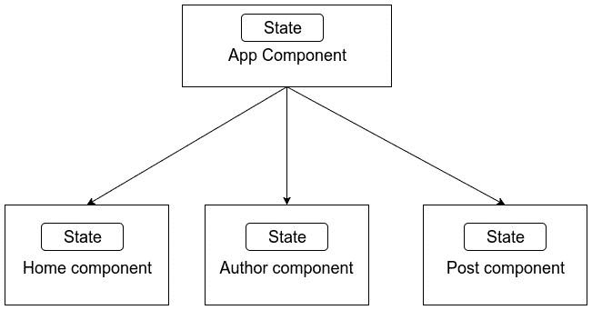

# 七、Redux

这就跟你问声好！ 前一章的博客写得很好，欢迎来到本书的最后一章，这是我们在前一章创建的博客的续篇。 在本章中，我们将通过学习 Redux 的集中状态管理来解决烦人的 3 秒加载问题。

正如我们在前一章只介绍了 React 的基础知识一样，这一章很简单，将涵盖 Redux 的基本概念，它将永远改变 web 应用的构建。 这留给我们的只有一个简单的问题:什么是 Redux?

# Redux是什么?

根据 Redux 文档:[http://redux.js.org/](http://redux.js.org/)，Redux 是“*一个可预测的 JavaScript 应用*状态容器”。 为了更详细地解释 redux，让我们看看 Facebook 构建的应用架构**flux**的故事。

# 流

React 对于像待办事项列表或我们在前一章中创建的博客这样的小型应用来说是很好的，除了像 Facebook 这样的应用。 Facebook 有数百个有状态的 React 组件，用于呈现 web 应用。 在我们的博客中，每个 React 组件都有自己的状态，每个有状态的组件都会发出一个网络请求，用数据填充这些状态。

一旦父组件获得数据，它将作为道具传递给子组件。 然而，子组件也可以有自己的状态。 同样，在同一级别上可以有两个或多个父组件，它们需要相同的状态数据。 React 的单向数据流在这里有一个严重的问题。 如果将数据作为道具传递给子组件，则子组件不能更改道具，因为这会导致数据的变异。 因此，子组件将不得不调用父组件中的一个方法，该方法也应该作为一个 prop 来进行简单的更改。 假设您有 10 到 100 个父-子嵌套组件，其中控件必须始终传递回父组件，并且必须在父组件和子组件之间正确地管理数据流。

Facebook 需要一个简单且可维护的解决方案来管理所有这些组件的数据。 他们想出的理想解决方案是将状态从 React 组件中移除，并在一个名为**store**的单独地方管理它。 这个计划很简单——我们将状态(数据)从 React 组件中取出，并将其保存在单独的存储中。 然后，所有 React 组件将依赖于存储它们的数据。 因此，您必须将所需的数据作为道具从存储传递给所有必要的组件。

存储中的任何变化都将导致所有依赖组件中的道具的变化，而每当道具发生变化时，React 将自动重新渲染 DOM。 他们提出了特殊的功能，称为**动作**和**调度器**，这是唯一能够更新存储的功能。 因此，如果任何组件需要更新一个存储，它将使用所需的数据调用这些函数，它们将更新存储。 由于存储被更新，所有组件将接收到新的道具，并且它们将使用新数据重新呈现。

这就解释了流动的结构。 flux 架构不仅是为 React 而创建的，也是为所有 JavaScript 框架的通用而创建的。 然而，尽管 flux 的概念很简单，但实现却相当复杂，后来一个新的状态管理库(即 Redux)克服了这个问题。 因为我们在这一章重点讨论 Redux，所以我们不会讨论 flux; 如果您有兴趣了解更多关于 flux 的信息，请访问其官方页面:[https://facebook.github.io/flux/](https://facebook.github.io/flux/)。

# 介绍了Redux

使用 flux 的开发人员面临的主要问题是应用状态不是很可预测。 这可能就是为什么 Redux 将自己介绍为 javascript 应用的可预测状态容器。 Redux 是作为一个`stand-alone`库创建的，可以用于任何 JavaScript 应用。 为了使用 Redux 和 React，我们需要另一个名为`react-redux`的库，它由 React 社区提供，可在:[https://github.com/reactjs/react-redux](https://github.com/reactjs/react-redux)。

Redux 拥有最好的开源库文档之一。 它甚至还有两个免费的视频课程，由图书馆的创始人丹阿布拉莫夫*提供，可以在文档的主页上看到。 在我们开始将 Redux 添加到我们的博客应用之前，让我们看看 Redux 是如何工作的，以及它将如何帮助改进我们的 React 应用。*

 *考虑我们在前一章中创建的 Blog 应用。 我们有一个**App 组件**作为父组件，所有其他组件都是**App 组件**的子组件。 在我们的例子中，每个组件都有自己的状态，如下所示:



如果我们使用 flux，它将有多个存储，我们可以将**Post 组件**列表和**Author 组件**列表的状态作为两个存储，并让整个应用共享这些存储。 然而，如果我们使用 Redux，它将维护一个*单一存储*，它将保存整个应用的状态。 你的应用结构如下:


如上图所示，Redux 将创建一个保存状态的*单存储*，然后可以将其作为道具提供给所需的组件。 因为整个应用只有一个状态，所以对开发人员来说维护起来很容易，而且应用的状态也更容易预测。

那么，让我们来看看 Redux 是如何管理它的商店的。 Redux 的实现有三个重要部分:

*   商店
*   行动
*   异径接头

# 商店

存储是包含整个应用状态的集中状态。 与正常状态一样，存储也是一个简单的 JavaScript 对象，它只包含普通数据(存储对象不应该包含任何方法)。 而且，状态是只读的，这意味着应用的其他部分不能直接更改状态。 修改状态的唯一方法是发出一个动作。

# 行动

动作是设计用来执行任务的函数。 当组件需要修改状态时，它必须调用一个动作。 动作作为道具提供给组件。 操作函数的返回类型应该是普通对象。 由操作返回的对象提供给 reducer。

# 异径接头

reducer 是简单的方法，其功能是更新存储。 由于存储是一个 JavaScript 对象，组织为键值对，所以每个键都有自己的 reducer。 reducer 函数接受两个参数，从动作返回的对象和当前状态，它将返回一个新状态。

# 在博客中实现 Redux

现在您已经很好地了解了为什么要使用 Redux，让我们开始在博客应用中实现 Redux。 本章使用的服务器与前一章中使用的服务器相同，因此，在处理本章时，您必须保持服务器运行。

本章的启动文件与上一章的完整代码文件相同，除了`package.json`文件，它的依赖项中包含了以下新库:

*   `redux`
*   `react-redux`
*   `redux-thunk`
*   `redux-persist`
*   `localforage`

在构建应用时，我们将看到每个库的作用。 我们将使用与上一章相同的`.env`文件和`REACT_APP_SERVER_URL`环境变量，其值为正在运行的服务器的 URL。 在终端中导航到项目根文件夹并执行`npm install`和`npm start`以启动应用的开发服务器。

# 文件夹结构

在开始使用 Redux 之前，我们需要做的第一件事是为 Redux 组件定义一个合适的文件夹结构。 目前，这是我们的`src/`目录的外观:

```js
.
├── App.css
├── App.js
├── App.test.js
├── assets
├── Components
├── index.css
├── index.js
├── logo.svg
├── registerServiceWorker.js
├── routes.js
└── services
```

我们需要创建一个名为`redux`的新目录，它将保存我们的`store`、`actions`和`reducers`。 现在，目录结构如下所示:

```js
.
├── App.css
├── App.js
├── App.test.js
├── assets
├── Components
├── index.css
├── index.js
├── logo.svg
├── redux
├── registerServiceWorker.js
├── routes.js
└── services
```

在`redux`目录中，需要创建四个不同的目录，分别是`actions`、`actionTypes`、`reducers`和`store`。 你的`redux`目录现在看起来像这样:

```js
.
├── actions
├── actionTypes
├── reducers
└── store
```

您可能想知道`actionTypes`目录。 在 Redux 中，所有的操作都应该是预定义的。 你不希望发生不知情的行为。 因此，我们将创建`actionTypes`文件夹，它将为我们的应用可以执行的所有操作保持常量。

现在我们已经有了所需的文件夹结构，让我们开始创建初始状态。

# 初始状态

我们总是在构造函数中定义 React 组件的初始状态，在构造函数中创建状态变量。 同样，我们也需要为 Redux 创建一个初始状态。 唯一的区别是 Redux 状态必须保持整个应用的状态。

让我们规划一下初始状态是什么样的:

*   在我们的博客主页上使用的数据是一个帖子数组，因此我们需要一个帖子数组
*   用于显示作者列表的数据也是一个数组
*   我们还需要维护 AJAX 调用的状态及其成功或错误状态

在您的`store`目录中，创建一个新文件——`initialState.js`，并添加以下代码，其中包含`initialState`对象:

```js
const initialState = {
  posts: [

  ],
  authors: [

  ],
  ajaxCalls: {
    getAllPosts: {
      loading: false,
      hasError: false,
    },
    getAuthors: {
      loading: false,
      hasError: false,
    },
    addPost: {
      loading: false,
      hasError: false,
    }
  }
};

export default initialState;
```

如您所见，`initialState`常量包含一个用于 posts 和 authors 的空数组，以及一个对象，该对象包含我们将在此应用中使用的三个网络请求(AJAX 调用)的状态信息。

一旦我们添加了 Redux，我们的应用只需发出三个网络请求——一个请求获取所有的帖子，一个请求获取所有的作者，第三个请求添加一个新帖子。 如果我们想在帖子详情页面看到一个帖子，我们可以很容易地使用在第一个网络请求中得到的帖子数组。

你的`redux`文件夹现在应该像这样:

```js
.
├── actions
├── actionTypes
├── reducers
└── store
    └── initialState.js
```

# 动作类型

现在我们已经准备好了初始状态，让我们定义 Blog 应用可以执行的所有操作。 我们的博客中的动作只不过是我们为检索数据而发出的网络请求。 每个网络请求将有四个与之相关的操作。

考虑一下我们从服务器获取所有博客文章的请求。 与此网络请求相关的动作如下:

*   启动 AJAX 调用
*   网络请求成功
*   网络请求失败
*   文章数据

因此，在您的`redux/actionTypes`目录中，创建一个`actionTypes.js`文件，该文件将为应用中将要发生的所有操作保存一个常量值。 在`actionTypes.js`文件中添加以下代码:

```js
const actions = {

  GET_POSTS_AJAX_CALL_START : 'GET_POSTS_AJAX_CALL_START',
  GET_POSTS_AJAX_CALL_SUCCESS: 'GET_POSTS_AJAX_CALL_SUCCESS',
  GET_POSTS_AJAX_CALL_FAILURE: 'GET_POSTS_AJAX_CALL_FAILURE',
  GET_POSTS: 'GET_POSTS',

  GET_AUTHORS_AJAX_CALL_START: 'GET_AUTHORS_AJAX_CALL_START',
  GET_AUTHORS_AJAX_CALL_SUCCESS: 'GET_AUTHORS_AJAX_CALL_SUCCESS',
  GET_AUTHORS_AJAX_CALL_FAILURE: 'GET_AUTHORS_AJAX_CALL_FAILURE',
  GET_AUTHORS: 'GET_AUTHORS',

  ADD_POST_AJAX_CALL_START: 'ADD_POST_AJAX_CALL_START',
  ADD_POST_AJAX_CALL_SUCCESS: 'ADD_POST_AJAX_CALL_SUCCESS',
  ADD_POST_AJAX_CALL_FAILURE: 'ADD_POST_AJAX_CALL_FAILURE',
  ADD_POST: 'ADD_POST',

};

export default actions;
```

你的`redux`文件夹现在应该有以下结构:

```js
.
├── actions
├── actionTypes
│   └── actionTypes.js
├── reducers
└── store
    └── initialState.js
```

我们已经创建了`actionTypes`，我们可以在整个应用中使用它，所以让我们创建应用应该使用的操作来更新状态。

# 行动

当 React 组件需要修改应用的状态时，它们就会调度操作。 我们的应用需要两个操作，一个用于 post 页面，另一个用于 authors 页面。 然而，就像在前一章一样，我将只关注 posts 页面; 一旦你完成了这一章，你可以在作者页上工作。 完成的代码文件也完成了作者页面的操作，所以您可以使用它作为参考。

让我们开始吧。 在“`actions`”目录下创建`authorActions.js`、`postActions.js`两个文件。 你的`redux`文件夹应该是这样的:

```js
.
├── actions
│   ├── authorActions.js
│   └── postActions.js
├── actionTypes
│   └── actionTypes.js
├── reducers
└── store
    └── initialState.js
```

在这里，将`authorActions.js`文件留空，我们将处理`postActions.js`文件。 这是标准动作函数的外观:

```js
const sumAction = (a, b) => {
  return {
    type: 'SUM_TWO_NUMBERS',
    payload: { answer: a+b }
  }
};
```

如您所见，该操作返回一个具有两个属性的对象，即`type`和`payload`。 type 属性由*reducers*用于识别所发生的动作的类型，`payload`提供该动作的结果。 `payload`是可选的，因为有些操作不会产生直接的结果，但是 type 属性应该出现在操作返回的所有对象中。

这对于我们在前面的示例代码中看到的两个数字的和这样的简单操作非常有效，这是同步的。 然而，大多数时候，我们在应用中执行的操作是异步的，我们不能简单地从这些操作返回一个 JSON 对象。

为了克服这个问题并执行异步操作，Redux 有一个叫做**中间件**的概念。 中间件是可以影响 Redux 工作方式的库，特别是在操作中有异步函数的情况下。 我们将在这个应用中使用的中间件是`redux-thunk`库。 这个库已经包含在本章的启动文件的`package.json`文件中，并且在您做`npm install`时已经安装了。

所以，这就是`redux-thunk`的工作原理。 `redux-thunk`允许动作分派其他动作而不是返回一个普通的 JavaScript 对象。 这很有用，因为我们可以在异步事件运行时调用所需的任意数量的操作。 返回其他动作的动作有以下奇怪的语法:

```js
const ajaxRequestAction = () => {         // Action
  return dispatch => {                    // dispatcher
    makeAjaxRequest()                     // asynchronous code
    .then(response => {
      dispatch(successAction(response));  // dispatch successAction
    })
    .catch(error => {
      dispatch(errorAction(error));       // dispatch errorAction
    });
  }
}

const successAction = (response) => {
  return {
    type: 'REQUEST_SUCCESS',
    payload: { response },
  };
}

const errorAction = (error) => {
  return {
    type: 'REQUEST_FAILURE',
    payload: { error },
  };
}
```

前面的语法一开始很难理解，但是如果你仔细看，`ajaxRequestAction`将返回另一个函数而不是返回一个对象。 该函数将有`dispatch`作为参数。

让我们调用`ajaxRequestAction`返回的函数*dispatcher*(*仅供参考*)。 一旦我们进入了分派器，我们就可以执行我们需要的任何异步操作。 dispatcher 不需要返回任何值。 但是，调度程序可以调度其他操作。

让我们在`postActions.js`文件中为博客的帖子创建动作。 在你的`postActions.js`文件中，你首先需要添加两个导入语句:

```js
import actions from '../actionTypes/actionTypes';
import apiCall from '../../services/api/apiCall';
```

第一个是我们在`actionTypes`文件夹中创建的 actions 对象。 它包含可以在应用中执行的所有操作。 第二个是`apiCall`服务，它将发出网络请求。

在我们的博客中，有两种类型的操作需要执行:

*   得到所有的职位
*   添加一个新帖子

# 得到所有的职位

通常，我们的 React 组件只能触发一个动作——`getAllPosts()`——它会发出网络请求并返回发布数据。 这次行动将是我们的调度员。 此操作将启动网络请求，并根据网络请求的结果分派所有其他操作。 在你的`postActions.js`文件中，添加以下代码:

```js
export const getAllPosts = () => {

  return dispatch => {                   // Create the dispatcher

    dispatch(postsApiCallStart());       // Dispatch - api call started

    apiCall('posts', {}, 'GET')
      .then(posts => {
        dispatch(postsApiCallSuccess()); // Dispatch - api call success 
        dispatch(getPosts(posts));       // Dispatch - received posts array
      })
      .catch(error => {
        dispatch(postsApiCallFailure()); // Dispatch - api call failed
        console.error(error);
      });

  };

};
```

注意`getAllPosts`功能之前的`export`关键字。 这是因为所有的动作都将在 React 组件内部使用，因此，我们在它们前面加上 export 关键字，以便稍后可以导入。

我们的调度员,`getAllPosts`,将网络请求和调度其他正常行动,将所使用的还原剂的应用。`postActions.js`将下面的代码添加到您的文件,其中包含所有的代码的行动派`getAllPosts`行动:

```js
export const postsApiCallStart = () => {
  return {
    type: actions.GET_POSTS_AJAX_CALL_START,
  };
};

export const postsApiCallSuccess = () => {
  return {
    type: actions.GET_POSTS_AJAX_CALL_SUCCESS,
  };
};

export const postsApiCallFailure = () => {
  return {
    type: actions.GET_POSTS_AJAX_CALL_FAILURE,
  };
};

export const getPosts = (posts) => {
  return {
    type: actions.GET_POSTS,
    payload: { posts },
  };
};
```

用于跟踪 API 调用状态的操作不需要返回`payload`。 因为它的状态是布尔值，所以它只返回动作的类型。 然而，应该返回 post 细节的`getPosts`操作，将返回一个`payload`以及操作类型，即 posts 数组。

对于一个简单的网络请求来说，这看起来需要很多代码，但是，相信我，一旦您的应用扩展，当您需要获得所有帖子时，这些是惟一需要的操作。

You should always specify the type of the action using the actions object you created in the `actionTypes` file. This way, you can prevent other developers in the team from accidentally creating unexpected actions in your application.

# 添加一个新帖子

因为添加一个帖子是一个与帖子相关的动作，我们将在同一个`postActions.js`文件中添加动作。 为`addNewPost`操作添加以下代码，该操作也充当调度程序，用于在`postActions.js`文件中添加新 post:

```js
export const addNewPost = (body) => {
  return dispatch => {

    dispatch(addPostApiCallStart());

    apiCall(`post`, body)
    .then(() => {

      dispatch(addPostApiCallSuccess());
      dispatch(getAllPosts());             // Dispatch - getAllPosts action

    })
    .catch(error => {

      dispatch(addPostApiCallFailure());

    });
  };
};
```

`addNewPost`动作与我们之前的`getAllPosts`动作非常相似。 然而，它需要一个`body`参数，该参数将包含将文章添加到服务器所需的文章详细信息。 您还应该注意到，一旦收到来自服务器的成功响应，消息已经添加，`addNewPost`操作将分发`getAllPosts`操作，该操作将检索所有的消息，包括新创建的消息。 这就省去了 React 组件分派多个动作的麻烦。

由`addNewPost`动作分派的其余动作的代码如下:

```js
export const addPostApiCallStart = () => {
  return {
    type: actions.ADD_POST_AJAX_CALL_START
  };
};

export const addPostApiCallSuccess = () => {
  return {
    type: actions.ADD_POST_AJAX_CALL_SUCCESS
  };
};

export const addPostApiCallFailure = () => {
  return {
    type: actions.ADD_POST_AJAX_CALL_FAILURE
  };
};
```

以上就是动作部分的全部内容。 我们的博客应用目前有以下三个部分:


然而，它们此刻是相互联系的。 我们的下一步是创建 reducer，它提供更新应用状态的能力。

# 异径接头

reducer 是简单的函数，它接收操作返回的操作对象，然后使用它们更新状态。 通常，由于我们的应用状态表示为一个键值对对象，因此我们需要为每个键(或属性)创建一个 reducer。 这是我们在初始状态部分创建的应用状态的结构:

```js
{
  posts: [],
  authors: [],
  ajaxCalls: {
    ...
  },
}
```

我们的状态有三种性质，因此我们需要三种还原剂，即`postsReducer.js`、`authorsReducer.js`和`ajaxCallsReducer.js`。 这些 reducer 将表示应用在存储中的状态。 我们还需要另一个减速器，它将用于将这三个减速器组合成一个单一的对象，将用作我们的状态。

在你的`redux`目录中，创建以下结构中突出显示的四个文件; 你的`redux`文件夹结构现在应该如下所示:

```js
.
├── actions
│   ├── authorActions.js
│   └── postActions.js
├── actionTypes
│   └── actionTypes.js
├── reducers
│   ├── ajaxCallsReducer.js
│   ├── authorsReducer.js
│   ├── postsReducer.js
│   └── rootReducer.js
└── store
    └── initialState.js
```

减速机的工作原理如下:

*   reducer 函数接受两个参数; 第一个是旧状态，第二个是动作返回的动作对象。
*   它将返回一个新状态，该状态将完全覆盖旧状态。 这是因为，就像 React 组件中的更新状态一样，Redux 中的更新状态也应该是不可变的。

考虑下面的例子。 这就是 Redux 存储状态的方式; 状态值是 reducers 的结果:

```js
{
  posts: postsReducer(oldPosts, action),
}
```

如果发生了一个接收到新 post 的操作，reducer 将返回所有的新 post，这将更新 post 的状态而不改变它。 记住，所有的减速器都将听取所有的行动。 因此，我们需要在减速机内部适当地过滤所需的动作，如果没有动作影响减速机，它应该简单地返回旧状态。

打开`postsReducer.js`文件，添加以下导入语句:

```js
import initialState from '../store/initialState';
import actions from '../actionTypes/actionTypes';
```

一旦你添加了这些`import`语句，为 posts 减速器添加以下代码:

```js
const postsReducer = (state = initialState.posts, action) => {
  switch(action.type) {
    case actions.GET_POSTS:
      return action.payload.posts;

    default:
      return state;
  }
};

export default postsReducer;
```

如前所述，`postsReducer`函数将接受两个参数:

*   `state`:包含`posts`状态的旧值。 然而，在第一次加载时，旧的状态将为空，因此，`initialState.posts`作为状态的默认参数被传递。
*   `action`:它是动作返回的动作对象。

因为每个动作都会调用 reducer，所以我们只需要添加一个 switch case 语句，通过该语句我们可以确定动作的类型以及它是否会影响我们的状态。 在 switch case 语句中，我们为以下条件添加了两个 case:

*   如果动作的类型是`GET_POSTS`，我们知道它包含所有的 posts，因此，我们可以简单地从动作的`payload`返回 posts。
*   如果不是，则执行`default`案例，这将简单地返回旧状态。

该`authorsReducer.js`文件是供您试用的，但不能留空。 在这个文件中，添加以下代码:

```js
import initialState from '../store/initialState';
import actions from '../actionTypes/actionTypes';

const authorsReducer = (state = initialState.authors, action) => {
  switch(action.type) {

    default:
      return state;
  }

};

export default authorsReducer;
```

它将简单地返回所有动作的`initialState`。 您可以在作者列表页面中使用这个减速器来尝试 Redux。

对于`ajaxCallsReducer.js`，代码太长，无法在书中指定，所以您应该从完整的代码文件中复制文件的内容。 确切的代码将正常工作。 `ajaxCallsReducer`的工作原理很简单。 它根据网络请求的结果将`loading`和`hasError`属性的值切换为`true`或`false`。 由于状态不能被改变，它使用扩展操作符(`...state`)来执行这个操作。

考虑`GET_POSTS_AJAX_CALL_START`发生的情况:

```js
    case actions.GET_POSTS_AJAX_CALL_START:
      return {
        ...state,
        getAllPosts: {
          loading: true,
          hasError: false,
        },
      };
```

在这里，一个新的状态对象被创建，在`getAllPosts`属性内的 loading 属性设置为`true`。 这种状态对于在应用中显示加载指示符很有用。

# 根减速器

我们在减速机部分剩下的最后一项是根减速机。 在这个文件中，所有的 reducer 被组合在一起，用作应用的状态。 Redux 提供了一个名为`combineReducers`的方法，可用于此目的。 在您的`rootReducer.js`文件中，添加以下导入语句:

```js
import { combineReducers } from 'redux';
import postsReducer from './postsReducer';
import authorsReducer from './authorsReducer';
import ajaxCallsReducer from './ajaxCallsReducer';
```

这将导入`combineReducers`功能和其他还原器。 要将所有的 reducer 组合成一个根的 reducer，只需添加以下代码:

```js
const rootReducer = combineReducers({
  posts: postsReducer,
  authors: authorsReducer,
  ajaxCalls: ajaxCallsReducer,
});

export default rootReducer;
```

我们将导入这个减速器，以在下一节中创建我们的存储。 目前，数据是这样在操作和 reducer 之间流动的:


# 商店

使用 Redux 部分的最后一个阶段是使用根 reducer 创建存储对象。 在`redux/store`目录中，创建`configureStore.js`文件，该文件将创建我们的存储对象。 我们还需要在这个文件中应用我们的`redux-thunk`中间件，这将允许我们使用分派其他动作的动作。

Redux 提供了`createStore`函数来创建存储对象，`applyMiddleware`函数来添加中间件。 在你的`configureStore.js`文件中，添加以下代码:

```js
import { createStore, applyMiddleware } from 'redux';
import thunk from 'redux-thunk';
import rootReducer from '../reducers/rootReducer';
```

要创建一个存储，您只需要使用`rootReducer`、前面的状态和`applyMiddleware`方法作为参数调用`createReducer`函数。 第一个参数是必须的，而其他参数是可选的。 在`configureStore.js`文件中，在`import`语句后添加如下代码:

```js
const configureStore = (preloadedState) => {
  return createStore(
    rootReducer,
    preloadedState,
    applyMiddleware(thunk)
  );
};

export default configureStore;
```

`configureStore`函数将用于创建 React 组件的存储对象。 `redux`目录的最终文件夹结构如下所示:

```js
.
├── actions
│   ├── authorActions.js
│   └── postActions.js
├── actionTypes
│   └── actionTypes.js
├── reducers
│   ├── ajaxCallsReducer.js
│   ├── authorsReducer.js
│   ├── postsReducer.js
│   └── rootReducer.js
└── store
    ├── configureStore.js
    └── initialState.js
```

以上就是现在的`redux`部分。 我们现在将使用我们博客的 React 组件，并使用`react-redux`库连接 Redux 和 React。 现在，这是数据在`redux`部分中的流动方式:


# 连接 Redux 和 React 组件

我们将整个博客的`App`组件封装在 React 路由器的`BrowserRouter`组件中，在`index.js`文件中实现路由。 Redux 采用了类似的方法。 我们需要包装`App`组件，它已经包装在路由器的`react-redux`库的`Provider`组件中。

打开您的`src/index.js`文件，在文件中已经存在的`import`语句之后添加以下导入语句:

```js
import { Provider } from 'react-redux';
import configureStore from './redux/store/configureStore';
```

这将导入`react-redux`的`Provider`组件和我们在前面小节中创建的`configureStore`函数。 我们需要从`configureStore`函数中创建一个`store`对象。 在上面的`import`语句之后，添加以下代码来创建存储对象:

```js
const store = configureStore();
```

目前，这是你的`ReactDOM.render()`方法的外观:

```js
ReactDOM.render(
  <Router>
    <App />
  </Router>
  ,
  document.getElementById('root')
);
```

您需要将其替换为以下行:

```js
ReactDOM.render(
  <Provider store={store}>
    <Router>
      <App />
    </Router>
  </Provider>
  ,
  document.getElementById('root')
);
```

我们现在已经将整个`App`组件包装在`Provider`中，它为 React 组件提供了与 Redux 连接的能力。 现在，我们将看到如何将单个组件与 Redux 存储中的状态及其操作连接起来。

# 应用组件

我们将连接到 Redux 的第一个组件是`App`组件，它作为应用中所有其他组件的父组件。 这意味着，不管我们在应用中访问的 URL 是什么，`App`组件都将被执行。 这使得`App`组件成为执行诸如`getAllPosts`等操作的最佳位置，这些操作将检索 posts 数组。

这一节是 Redux 中最令人困惑的部分，因此，您必须密切关注我们如何将 Redux 存储和操作作为道具传递给 React 组件。 此外，如果在这一阶段遇到任何错误，请确保参考已完成的代码文件。

您将需要在您的`App.js`文件中添加一些`import`语句。 首先需要导入的是`react-redux`库提供的`connect`组件:

```js
import { connect } from 'react-redux';
```

这将提供一个包装器来连接 React 组件和 Redux。 这与 React 路由器的`withRouter`组件的工作方式相同，后者提供历史、位置和匹配道具给 React 组件。

你还需要导入 Redux 的`bindActionCreators`函数，它将动作函数转换为简单的对象，可以被 React 组件使用:

```js
import { bindActionCreators } from 'redux';
```

我们需要导入的另一个重要的东西是`postActions`，它将被我们的`App`组件使用。 由于`postActions`包含了许多单独导出的函数，我们可以使用下面的`import`语句将它们作为单个对象导入:

```js
import * as postActions from './redux/actions/postActions';
```

我们现在已经具备了所有必需的`import`语句。 我们的下一步是实际的实现部分。 目前，`App`组件的出口报表是这样的:

```js
export default withRouter(App);
```

我们的`App`组件包裹在`withRouter`内。 为了将其与 Redux 连接，我们需要将`App`组件包装在我们从`react-redux`导入的`connect`函数中，并且结果应该在`withRouter`组件中。

然而，connect 函数本身需要两个函数`mapStateToProps`和`mapDispatchToProps`作为参数。 在这两个函数中，`mapStateToProps`将从商店转换状态，`mapDispatchToProps`将把动作转换为道具，React 组件可以使用这些道具。 现在，请密切注意，因为我们很快就会看到另一个奇怪的语法。

将你的`App`组件的导出代码替换为以下代码行:

```js
function mapStateToProps() {
  return {
    // No states needed by App Component
  };
}

function mapDispatchToProps(dispatch) {
  return {
    postActions: bindActionCreators(postActions, dispatch),
  };
}

export default withRouter(
  connect(
    mapStateToProps,
    mapDispatchToProps
  )(App)
);
```

请仔细查看前面的代码片段。 如果出口声明对你没有意义，别担心，我们会解决的。 让我们看看`connect`做什么。 `connect`函数将接受两个参数`mapStateToProps`和`mapDispatchToProps`，这两个参数都是函数，它将返回一个函数:

```js
connectFunction = connect(mapStateToProps, mapDispatchToProps);
```

`App`组件包裹在`connectFunction`内部，作为`connectFunction(App)`。 然后整个组件被包装在`withRouter()`函数中。 所以，基本上，这就是 export 语句的工作方式:

```js
export default withRouter(connectFunction(App));
```

这是我们结合在一起写的:

```js
export default withRouter(
  connect(
    mapStateToProps,
    mapDispatchToProps
  )(App)
);
```

`App`组件没有使用任何状态，因此，`mapStateToProps`函数将返回一个空对象。 然而，`mapDispatchToProps`函数将返回`postActions`作为使用`bindActionCreators`函数的对象，然后将该对象作为支柱提供给`App`组件。

现在，我们将有`App`组件通过在`componentWillMount()`方法中添加以下代码来调用 API 来获取所有的 posts:

```js
 this.props.postActions.getAllPosts();
```

另外，由于`postActions`作为支柱被传递到我们的`App`组件，所以在`App`组件中添加的`propType`验证中添加以下属性:

```js
postActions: PropTypes.object.isRequired
```

如果在将上述代码片段包含在`App.js`文件中遇到任何问题，请参考已完成的代码文件。 一旦你完成了这个步骤，保持服务器从`Chapter06\Server`目录运行，并在 Chrome 中打开你的应用。

当我们点击导航栏图标中的菜单项或文章中的 Read More 按钮时，你应该会看到博客以同样的 3 秒加载时间运行。 我们将在下一节修复这个问题。

# 家组件

在前一节中，我们使用了`App`组件从服务器检索数据并将其存储在 Redux 存储中。 这意味着我们不再需要在 Home 组件中发出任何网络请求。 我们只需要从 Redux 存储中检索数据。

Home 组件不会触发任何 Redux 操作，因此，我们只需要从`react-redux`导入连接组件。 在您的`Home.js`文件中添加以下`import`语句:

```js
import { connect } from 'react-redux';
```

用以下代码替换`Home.js`文件的`export`语句:

```js
function mapStateToProps(state) {
  return {
    posts: state.posts,
    loading: state.ajaxCalls.getAllPosts.loading,
    hasError: state.ajaxCalls.getAllPosts.hasError,
  };
}

export default connect(mapStateToProps)(Home);
```

由于 Home 组件不会执行任何操作，我们可以放心地忽略 connect 中的`mapDispatchToProps`功能。 然而，我们为`mapStateToProps`函数做了一些工作，在前一章中它只是返回了一个空对象。

`mapStateToProps`函数有一个参数，它是一个包含应用的整个 Redux 状态的状态。 在 return 语句中，我们只需要提到需要将状态的哪一部分作为道具交付给 React 组件。 关于连接最好的部分是，每当减少器更新状态时，它将使用`mapStateToProps`功能更新这些道具。

我们现在有一些新的道具，我们的家庭组件。 因此，在你的 Home 组件中，添加以下`propType`验证:

```js
  static propTypes = {
    posts: PropTypes.array.isRequired,
    loading: PropTypes.bool.isRequired,
    hasError: PropTypes.bool.isRequired,
  }
```

此外，我们不再需要任何状态或 API 调用在我们的 Home 组件中，因此，你可以*删除**和`componentWillMount`方法。 相反，在渲染方法的 JSX 中，将`this.state.posts`替换为`this.props.posts`。 对`loading`和`hasError`状态做同样的操作。 现在我们的 Home 组件直接依赖于 Redux 商店。 如果遇到任何问题，请参考完整的代码文件。*

 *这是最酷的部分——如果你点击导航栏中的任何其他部分并返回 Home，你会看到帖子立即加载。 这是因为所有的帖子都存储在我们的 Redux 商店中。 如果您单击主页帖子列表中的 Read More 按钮，您应该再次看到一个加载指示器，因为它正在从服务器检索帖子的详细信息。 让我们也将该组件与 Redux 连接起来。

# 发布组件

在 VSCode 中打开`src/Components/Post.js`文件。 我们的第一步是添加所需的`import`语句:

```js
import { connect } from 'react-redux';
import { bindActionCreators } from 'redux';
```

让我们规划一下如何将这个组件与 Redux 连接起来:

*   我们将需要获取 Post ID，它出现在 URL 中
*   一旦我们有了 ID，我们应该使用`Array.find()`方法在商店的 posts 数组中找到带有 ID 的 post
*   最后，我们可以发送所需的邮件作为道具

现在，用以下代码替换`Post.js`中的`export`语句:

```js
function mapStateToProps(state, ownProps) {

  return {
    post: state.posts.find(post => post.id === ownProps.match.params.id),
    loading: state.ajaxCalls.getAllPosts.loading,
    hasError: state.ajaxCalls.getAllPosts.hasError,
  };
}

export default withRouter(
  connect(mapStateToProps)(Post)
);
```

`mapStateToProps`函数有第二个参数`ownProps`。 它包含 Post 组件的所有道具。 从`ownProps`中，我们可以获得 post ID，它存在于 React 路由器的`withRouter`组件提供的 match 对象中。 然后，我们将使用 find 方法查找 post，并在 return 语句中返回所需的数据。

Post 组件内的`propType`验证应该如下所示:

```js
  static propTypes = {
    history: PropTypes.object.isRequired,
    location: PropTypes.object.isRequired,
    match: PropTypes.object.isRequired,
    post: PropTypes.object,
    loading: PropTypes.bool.isRequired,
    hasError: PropTypes.bool.isRequired,
  }
```

您可以删除构造函数和`componentWillMount`方法，就像我们为 Home 组件所做的那样，然后，在您的渲染方法中，将`this.state.loading`替换为`this.props.loading`，将`this.state.hasError`替换为`this.props.hasError`。

然而，在你用`this.props.post`替换`this.state.post`之前，我们应该确保`this.props.post`有一个值，因为在加载期间，posts 数组将是空的，而`this.props.post`的值将是未定义的。 在渲染方法中，用以下代码替换使用`this.state.post`的三行代码:

```js
{
  this.props.post
  ?
    <div>
      <h2>{this.props.post.title}</h2>
      <p>{this.props.post.author}</p>
      <p>{this.props.post.content}</p>
    </div>
  :
    null
}
```

现在尝试重新加载页面。 第一次加载需要 3 秒，但一旦数据加载，您将看到导航到其他页面(除了作者页面)将是一件轻而易举的事。 点击主页上的“阅读更多”按钮将立即带你到帖子详情页面。

现在轮到你在`AuthorList`和`AuthorPosts`组件中尝试这个了。 我们需要连接 Redux 的最后一个组件是 NewPost 组件。

# NewPost 组件

NewPost 组件需要 Redux 的状态和动作。 它需要从状态加载和`hasError`数据，并且必须使用`postActions`向服务器提交一个帖子。 所以，让我们从在`src/Components/NewPost/NewPost.js`文件中包含必要的`import`语句开始:

```js
import { connect } from 'react-redux';
import { bindActionCreators } from 'redux';
import * as postActions from '../../redux/actions/postActions';
```

现在，用以下代码替换`NewPost.js`文件中的`export`语句:

```js
function mapStateToProps(state) {
  return {
    loading: state.ajaxCalls.addPost.loading,
    hasError: state.ajaxCalls.addPost.hasError,
  };
}

function mapDispatchToProps(dispatch) {
  return {
    postActions: bindActionCreators(postActions, dispatch),
  };
}

export default connect(
  mapStateToProps,
  mapDispatchToProps
)(NewPost);
```

因为我们已经在`NewPost`组件中获得了道具，所以在`NewPost`类中添加以下`propType`验证代码:

```js
  static propTypes = {
    postActions: PropTypes.object.isRequired,
    loading: PropTypes.bool.isRequired,
    hasError: PropTypes.bool.isRequired,
  }
```

与`Home`和`Post`组件不同，`NewPost`组件需要状态和道具来渲染 JSX 元素。 我们可以删除 loading 和`hasError`状态，用道具代替。 您应该引用完整的代码文件(如果需要的话)，并用 props 替换呈现方法 JSX 中的 loading 和`hasError`状态。

然后，你应该用以下一行代码替换提交方法中的整个`apiCall().then().catch()`链:

```js
this.props.postActions.addNewPost(body);
```

你的`submit`方法现在看起来如下:

```js
  submit() {
    if(this.state.author && this.state.content && this.state.title) {
      this.setState({loading: true});

      const date = new Date();
      const epoch = (date.getTime()/1000).toFixed(0).toString();
      const body = {
        id: uuidv4(),
        author: this.state.author,
        title: this.state.title,
        content: this.state.content,
        datetime: epoch,
      };

      this.props.postActions.addNewPost(body);

    } else {
      alert('Please Fill in all the fields');
    }
  }
```

`submit`方法现在将触发一个动作——`addNewPost`，该动作包含所需的网络请求。 然而，一旦网络请求完成，我们需要显示一条成功消息。 检测网络请求的完成,因为我们所有的更新存储是不可变的,如果加载的状态`ajaxCalls`或`hasError`属性属性Redux状态改变的,它将导致创建一个新对象,它将自动送到`react-redux`的`NewPost`组件。

这意味着新的道具将在网络请求的末尾被`NewPost`React 组件接收。 在这种情况下，我们可以使用 React 的`componentWillReceiveProps``lifecycle`方法来显示成功消息，并在文章提交后清除输入字段。 在`NewPost`类中加入以下`componentWillReceiveProps`代码:

```js
  componentWillReceiveProps(nextProps) {
    if(this.props !== nextProps) {
      if(nextProps.loading === false && nextProps.hasError === false) {
        this.setState({
          success: true,
          author: '',
          title: '',
          content: '',
        });
      } else if(nextProps.loading === false && nextProps.hasError === true) {
        this.setState({success: false});
      }
    }
  }
```

`componentWillReceiveProps`将有提供给组件的新道具(在我们的例子中，来自`react-redux`)作为它的参数，我们将其称为`nextProps`。 在`componentWillReceiveProps`方法中，做一个简单的`this.props !== nextProps`检查，以确保当前的道具和新的道具不是相同的对象。 如果它们都持有相同的对象，我们可以跳过该操作。 然后，我们只需要使用 if else 语句检查加载是否完成，以及是否有任何错误，就像前面的代码段中使用的那样。

包含上述代码片段后，尝试添加一个 post(确保服务器正在运行)。 它应该添加帖子并显示成功消息。 现在，点击 Home 菜单选项。 你会看到你添加的新帖子立即出现，不需要加载时间。 这个秘密是，`addNewPost`动作将自动调用`getAllPosts`动作，这将更新您的 Redux 商店在后台。 通过使用新的帖子更新商店，您的`Home`组件可以直接从 Redux 获得更新的帖子状态，这使得事情立即出现。

这为用户提供了很棒的用户体验，因为他们会发现每次更新都是即时发生的，而不是等待加载指示符。

# Redux 数据流

将 Redux 代码与 React 组件连接后，你会发现 Redux 遵循与 React 相同的单向数据流。 这是 Redux 的数据流:


以下是 React 组件中数据流发生的方式:


另外，React 组件和 Redux 存储中的状态都应该是不可变的。 这种不变性是 React 和 Redux 正常工作所必需的。 然而，由于 JavaScript 目前并没有严格实现任何不可变的数据类型，我们需要小心不要改变状态。 在 React 组件中，我们将使用`this.setState()`方法，并且我们在 Redux 的 reducers 中使用扩展运算符(`...`)来更新状态而不改变它们。

对于具有大量数据的大型项目来说，这可能会带来麻烦。 Facebook 已经引入了一个名为`Immutable.js`的库，可在:[https://facebook.github.io/immutable-js/](https://facebook.github.io/immutable-js/)，它可以通过在 JavaScript 中创建不可变数据类型来解决这个问题。 这个库超出了本书的范围，但请确保您稍后尝试一下。

# 坚持Redux商店

我们的博客加载速度很快，因为我们集成了 Redux，但是，我们的用户仍然需要等待三秒钟的初始加载。 如果我们可以离线持久化 Redux 存储，并在加载新数据时向用户显示它，会怎么样?

听起来不错，也很简单! 为此，我已经在依赖项列表中添加了两个库:

*   [https://github.com/rt2zz/redux-persist](https://github.com/rt2zz/redux-persist)
*   [https://github.com/localForage/localForage](https://github.com/localForage/localForage)

`redux-persist`提供了一个简单的方法来坚持您的 Redux 存储，并在需要时补充水分。 这使得当用户第二次访问页面时，您的商店可以离线使用。

`localForage`是一个简单的存储库，允许您使用与`localStorage`类似的 API 使用`indexDB`。 `redux-persist`与`localStorage`配合使用效果很好，但它推荐使用`localForage`作为 web 浏览器的默认存储引擎。

现在，坚持 Redux 商店并不复杂; 您只需要在 Redux 存储中添加几行代码来持久化它，并让 reducer 监听一个*补水*操作来重新补水持久化存储中的数据。 这很简单，只需更改以下三个文件:

*第一个文件*:打开`configureStore.js`文件，添加如下导入语句:

```js
import { autoRehydrate } from 'redux-persist';
```

然后，将`configureStore`方法中的`return`语句改为:

```js
  return createStore(
    rootReducer,
    preloadedState,
    applyMiddleware(thunk),
    autoRehydrate()
  );
```

现在，这添加了`autoRehydrate()`函数，同时创建将发出补水操作的存储。

*第二个文件*:打开`index.js`文件，添加以下`import`语句:

```js
import { persistStore } from 'redux-persist';
import localForage from 'localforage';
```

这将导入可以持久化存储的`persistStore()`函数和`localForage`库，`localForage`库将被用作存储引擎。 现在，你需要在创建商店的行后面添加一行代码:

```js
const store = configureStore();              // Store gets created here
persistStore(store, {storage: localForage}); // next line which will persist your store
```

*第三个文件**:***打开`postsReducer.js`文件。 在这篇文章中，我们将会听到另一个动作，这是在给你的 Redux 持久化存储再补水时发出的补水动作。 Redux Persist 维护一组常量，这些常量定义了补水操作，类似于我们在`actionTypes.js`文件中定义的操作。

在 reducer 文件中添加以下`import`语句:

```js
import * as constants from 'redux-persist/constants';
```

这将从`redux-persist`导入常量。 然后，你应该在`postsReducer`函数中添加一个额外的 case 语句，这将水合物 Redux 存储:

```js
    case constants.REHYDRATE:
      if(action.payload.posts) {
        return action.payload.posts;
      }
      return state;
```

这种情况将检查是否发生了补水动作，然后使用`if`条件来检查补水动作在动作的有效载荷中是否包含`posts`属性。 如果遇到任何问题，请参考完整的代码文件。

现在，一旦完成，在 Chrome 中打开应用，并尝试重新加载页面。 你应该看到，即使当数据从服务器加载时，posts 也是可用的，如下图所示:


这允许用户离线使用应用，即使是在加载帖子的时候。 我们已经完全从博客中删除了 3 秒加载问题。

Redux 是一个很棒的库，可以在独立的状态容器中管理状态。 React 的集中状态管理被证明是非常有用和高效的，在其他框架中也创建了很多集中状态管理的库，比如针对 Angular 的`@ngrx/store`和针对 Vue.js 的`vuex`。 在本章中，我们只介绍了 Redux 的基础知识——请参阅 Redux 文档和教程视频深入学习 Redux。 另外，在[https://github.com/gaearon/redux-devtools](https://github.com/gaearon/redux-devtools)上查看**Redux DevTools**，它提供了很酷的功能，比如热重载和时间旅行调试您的 Redux 应用。

作者页面还没有连接到 Redux。 所以，一定要试一试，完成这个博客。

# 总结

恭喜你! 您已经成功地完成了 Redux 章节，也完成了这本书。 在本章中，我们介绍了 Redux 是什么，以及如何使用它来改进状态管理。 然后，我们创建了一个 Redux 存储，其中包含管理存储数据所需的操作和 reducer。 我们使用`react-redux`库来连接我们的 Redux 代码和 React 组件，并使用道具而不是状态来渲染 JSX 元素。

最后，我们使用`redux-persist`和`localforage`作为存储引擎来持久化我们的 Redux 存储，并使我们的应用离线工作。 这一章让博客对用户来说更加快捷和友好。

您现在已经完成了阅读本书的旅程，但您刚刚开始探索 JavaScript 世界的旅程。 还有很多东西要学，还有很多东西要做。 所以，无论你想做什么，都要准备好学习和探索。**