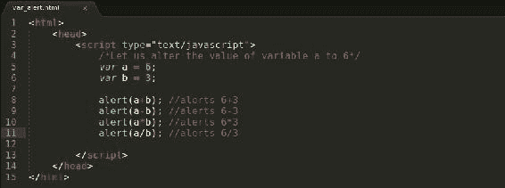
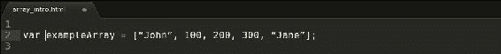
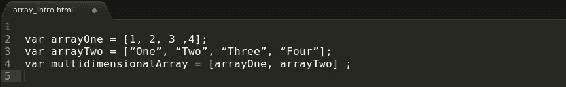

# 第一章。JavaScript 基础知识

由网景通信公司作为 LiveScript 引入的 JavaScript 在过去的几年里有了突飞猛进的发展。JavaScript 最初是为了使网页更具交互性，并控制页面的行为而开发的。JavaScript 程序通常嵌入在一个 HTML 文件中。HTML 是一种标记语言，一旦页面被加载，它就不会操纵页面的行为。使用 JavaScript，web 开发人员可以设置规则并验证规则是否得到遵守，从而避免任何用于输入验证或复杂数字处理的远程服务器资源。如今，JavaScript 不仅仅用于基本的输入验证；它用于访问浏览器的`Document`对象，对 web 服务器进行异步调用，并使用软件平台开发端到端的 web 应用，例如`Node.JS`，它由谷歌的 v8 JavaScript 引擎提供动力。

JavaScript 被认为是创建交互式网页所需的三个构造块之一；它是三位一体中唯一的编程语言，即 HTML、CSS 和 JavaScript。与 Python 和 Ruby 不同，JavaScript 是一种区分大小写且不区分空间的语言。JavaScript 程序是语句的集合，这些语句必须包含在 <脚本> >标签中。


### 类型

**下载示例代码**

您可以从您在[http://www.packtpub.com](http://www.packtpub.com)的账户中下载您购买的所有 Packt 书籍的示例代码文件。如果您在其他地方购买了这本书，您可以访问[http://www.packtpub.com/support](http://www.packtpub.com/support)并注册，以便将文件直接通过电子邮件发送给您。

JavaScript 必须从另一个应用调用，比如浏览器。浏览器有一个内置的 JavaScript 引擎，可以解释和执行网页上的 JavaScript。JavaScript 的解释是从上到下，从左到右。SpiderMonkey 和 Rhino 是由不同浏览器实现的早期 JavaScript 引擎中的少数几个，例如 Netscape Navigator 和 Mozilla Firefox。

接下来是我们简单的 Hello World 程序；JavaScript 程序位于头部的和`<script>`标签之间。脚本标签既可以添加到头部标签，也可以添加到主体标签。因为 JavaScript 不是无阻塞的，所以脚本会保留页面，直到它们被加载。通常会看到脚本在最后被加载；如果没有对其他文件或元素的依赖，这将是可行的。依赖关系的一个例子是从不同位置使用的库。我们将在后面的章节中看到很多这样的例子。稍后，我们将讨论不引人注目的 JavaScript 的作用。对于我们的 Hello World 程序，请使用您选择的文本编辑器，并用 HTML 扩展名保存该程序。将文件加载到网页浏览器中，弹出一个文字为 **Hello World 的对话框！**应该是装在页面上的。

以下代码片段是文件中的:


输出如下:


# JavaScript 中的变量

现在我们已经构建了一个 Hello World 程序，让我们进行下一步，对两个数字执行一些算术运算。

### 注

分号(`;`)是一个语句结束符，它告诉 JavaScript 引擎一个语句已经结束。

我们再来看看另一个节目， `alert_script.html`:


前一个程序将运行并产生四个弹出窗口，一个接一个，显示它们各自的值。这里一个突出的问题是，我们在多个地方重复使用相同的数字。如果我们必须对一组不同的数字执行这些算术运算，我们将不得不在多个位置替换它们。为了避免这种情况，我们会将这些号码分配给临时存储位置；这些存储位置通常被称为变量。

关键字`var`用于在 JavaScript 中声明一个变量，后跟该变量的名称。然后，这个名字被隐式地提供给一段计算机内存，我们将在整个程序执行过程中使用它。让我们快速了解一下变量将如何使早期的程序更加灵活:


### 注

代码注释可以通过两种方式完成:一种是单行，另一种是多行。

单行备注:

```js
//This program would alert the sum of 5 and 3;
alert(5+3);
```

多行注释:

```js
/* This program would generate two alerts, the first alert would display the sum of 5 and 3, and the second alert would display the difference of 5 and 3 */
alert(5+3);
alert(5-3);
```

让我们继续这个项目:


现在让我们将数值从`5`改为`6`；我们将在这里做出的改变是最小的。我们将`6`的值赋给我们的变量`a`，这就完成了剩下的过程；不像我们早期的脚本那样在多个位置进行更改。如下所示:

### 注

代码注释是重复出现的，也是任何应用开发生命周期中极其重要的一步。它必须用来解释我们的代码包含的任何假设和/或任何依赖。



在 JavaScript 中，我们通过使用关键字`var`来声明一个变量，在给它赋值之前，变量的值将被隐式设置为`undefined`；该值在变量初始化时被覆盖。

# 阵列

变量很适合保存单个值，但是对于一个变量应该包含多个值的情况，我们将不得不依赖数组。JavaScript 数组是根据其索引按顺序排列的项的集合。数组中的每一项都是一个元素，并且有一个用于访问该元素的索引。数组就像一个书架，可以放多本书；每本书都有其独特的位置。数组是使用数组文字符号`[]`声明的。

让我们来看一个简单的数组声明:


### 注

JavaScript 中的数组是从零开始的。

让我们初始化数组:


要访问特定元素的值，使用该元素的引用索引。一旦识别出引用索引，可以使用 alert 语句输出，如下图截图所示:


与变量不同，数组没有类型，因此，它们可以包含各种类型的数据，如下图所示:



JavaScript 数组的一个更复杂的例子是多维数组，数组中有数组的组合，如下图所示:



要从多维数组中检索一个元素，我们必须使用与该数组中的级别一样多的索引。如果多维数组包含具有我们想要访问的值的数组，我们将必须选择数组元素所在的索引，然后选择我们正在搜索的数组内的值的索引。要从`multidimensionalArray`示例中检索字符串`Three`，我们必须首先找到包含值`Three`的数组的索引，然后找到该数组中值`Three`的索引。如下所示:


### 注

使用`Array`类声明数组的第二种方式是。

```js
var bookshelf = new Array()
```

# 物体

对象是处理数据的另一种方式。在数组中，索引通常是数字的；对象为我们分配和检索数据提供了一种健壮的方式。对象源于面向对象的编程概念；非常流行的编程范例。对象是实时数据的虚拟表示；它们允许我们通过属性和方法将数据组织成逻辑组。属性描述对象的状态，而方法描述对象的行为。属性是保存信息的键值对。看看以下内容:


在前面的例子中，我们已经实例化了一个`person`对象，然后添加了描述该对象的`firstname`和`lastname`属性。我们通过创建一个名为 `getFullName`的方法来为对象添加行为，该方法访问对象属性，检索数据，并将输出提醒到屏幕上。在本例中，属性通过点符号来访问；我们还可以通过将属性名称放在类似于数组的方括号中来访问属性，但是这并不流行。如下所示:


创建对象的第二种方法是使用大括号。这里我们介绍一下`this`关键字，它提供了对对象属性和方法的引用，如下图所示:


# 转盘应用

我们将开发一个由 JSON 提要驱动的转盘应用。我们将使用 HTML、JavaScript 和 JSON 来构建这个应用。这个应用将有自己的导航系统，并在后台有一个计时器事件，它会以给定的时间间隔旋转项目。我们还将讨论用户体验如何在开发这样的应用中发挥重要作用。

# 总结

这一章是对 JavaScript 原理的基本介绍，我们将在掌握 JSON 的过程中利用这些原理。变量、数组和对象在通过网络传输数据方面起着非常重要的作用。如果这是你第一次遇到 JavaScript，那就换个时间再看一遍例子，然后练习一下。我们将需要一个强大的基础，以建立对 JSON 的坚实理解，以及如何在实时网络应用中使用它。