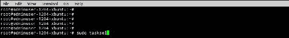
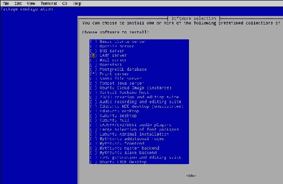
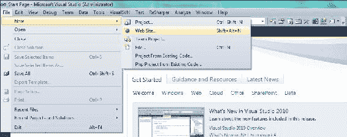
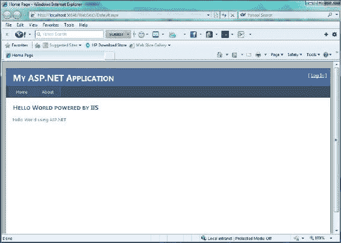
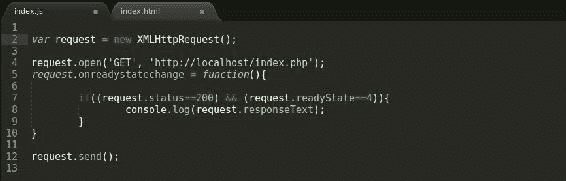
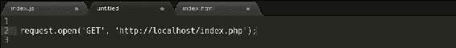
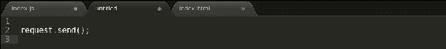
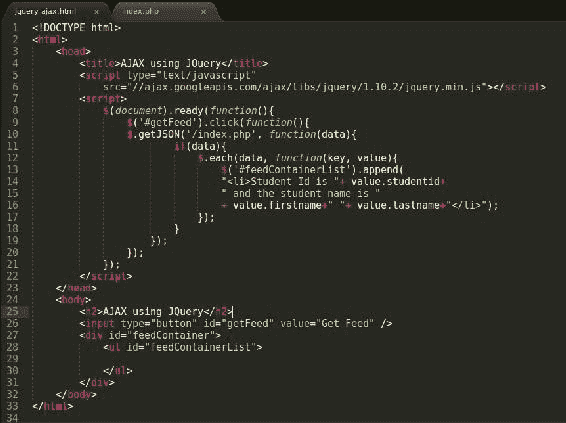

# 四、调用 AJAX 来获取 JSON 数据

JSON 今天被认为是最流行的数据交换格式。在前一章中，我们看到了一个使用 JSON 提要作为数据存储的例子。在本章中，让我们使数据更加动态。HTML、客户端 JavaScript 和 CSS 分别提供了结构、行为和表现方面。动态 web 开发就是客户端和服务器这两方之间的数据传输。我们使用网络服务器、数据库和服务器端编程语言等程序来获取和存储动态数据。让我们来看看促进数据成功操作的幕后流程。

当用户打开网络浏览器并键入`http://www.packtpub.com/`时，浏览器向 **互联网服务提供商** ( **互联网服务提供商**)发出请求，通过提供域名来执行 IP 地址的反向查找。一旦检索到该 IP 地址，该请求就被转发到拥有该 IP 地址的机器。此时，有一个 web 服务器正在等待使用该请求；web 服务器可能是顶级 web 服务器之一，例如 Apache、IIS、Tomcat 和 Nginx。网络服务器接收请求并查看作为 HTTP 请求一部分的报头；这些头传递关于向 web 服务器发出的请求的信息。一旦 web 服务器解析了这些头，它就将请求路由到负责处理该请求的服务器端编程应用。应用可以用 PHP、C#/ASP 编写。NET、Java/JSP 等等。这种负责任的服务器端语言接受请求，理解它，并执行必要的业务逻辑来完成请求。这种 HTTP 请求的几个例子是加载网页并点击网站上的**联系我们**链接。也可能有复杂的 HTTP 请求，其中数据必须从数据存储应用(如数据库、文件服务器或缓存服务器)中进行验证、清理和/或检索。

这些 HTTP 请求可以通过两种方式进行——同步和异步。同步请求是一个阻塞请求，其中一切都必须以有序的方式完成，一步接一步，并且下一步必须等到前一步完成执行。让我们假设当网页被加载时，网页上有四个独立的组件；如果一个组件在执行过程中花费了很长时间，页面的其余部分将等待它，直到它的执行完成。如果执行失败，页面加载也会失败。另一个例子是当网页上有投票和评级组件时；如果用户选择回答投票并给出满足这些请求的评级，如果我们使用同步请求机制，两个请求必须一个接一个地发出。

为了解决同步请求的问题，开发社区逐渐在异步 HTTP 请求领域取得了进展。第一个允许异步请求的产品是由微软推出的 IFrame 标签；他们通过 Internet Explorer 使用 IFrames 异步加载内容。在 IFrame 之后，下一个有望革新互联网的是 XML HTTP ActiveX 控件。在后来的几年里，所有的浏览器都采用了这个新名称为 XMLHTTPRequest 的 JavaScript 对象的控件，它是 XMLHTTPRequest API 的一部分。 XMLHTTPRequest 应用编程接口用于对网络服务器进行 HTTP(或 HTTPS)调用。它可以是用来进行同步和异步调用。异步请求允许开发人员将网页分割成多个相互独立的组件，从而通过按需发送数据来节省大量内存。

*杰西·詹姆斯·加勒特*将这种现象命名为“AJAX”。在 **AJAX** ( **异步 JavaScript 和 XML** )中，网络请求是通过 JavaScript 进行的，数据交换最初是在 XML 中进行的。AJAX 中的“X”最初被认为是 XML，但今天它可以是任何数据交换格式，如 XML、JSON、文本文件，甚至是 HTML。用于数据传输的数据格式必须在 MIME 类型头中提及。在[第 2 章](2.html "Chapter 2. Getting Started with JSON")、*JSON*入门中，我们已经重点介绍了为什么 JSON 是首选的数据交换格式。让我们快速了解一下用 JSON 数据进行第一次 AJAX 调用需要什么。

本质上，web 开发人员可以利用 AJAX 的原理按需获取数据，使网站更具响应性和交互性；理解是什么产生了这种需求是非常重要的。这种数据需求的触发通常是发生在网页上的事件。 **事件**可以描述为对所执行的动作的反应，例如，按铃在铃内产生振动，从而产生声音。在这里，敲钟是事件，而产生的声音是对事件的反应。一个网页上可以有多个事件；一些这样的事件是单击按钮、提交表单、悬停在链接上以及从下拉列表中选择选项，所有这些都是非常常见的事件。当这些事件发生时，我们必须想出一种以编程方式处理它们的方法。

# 对 AJAX 的要求

AJAX 是被认为是客户端的浏览器和实时网络服务器之间通过 HTTP(或 HTTPS)的异步双向通信。我们可以在本地运行一个直播服务器，比如 Windows 上的 Apache 或者 IIS，或者 Linux 和 Mac OS 上的 Apache。我将带我们完成在 Linux 环境中设置 Apache 网络服务器，同时还将解释如何使用微软 Visual Studio 开发环境来构建网络应用。对于这个 AJAX 课程，让我们选择 PHP 和 MySQL 作为我们的主要服务器端语言和数据库。

在这一章，我将带你经历两个设置；第一个将设置 Apache 和 PHP 在 Linux 机器上开发服务器端程序，而第二个将在 Windows 上运行. NET 支持的 web 应用。微软的。. NET 框架需要。NET 框架和 Visual Studio 集成开发环境。我将假设您已经执行了这两个步骤；我们现在将在 ASP.NET 建立一个由 C#驱动的 web 应用。

Linux 是一个开放的源码操作系统，并且已经被非微软编程和脚本语言的开发团体选为操作系统，例如 PHP、Python、Java 和 Ruby。在 Linux 操作系统上使用 PHP、Perl 或 Python 时的开发环境通常被称为 LAMP 环境。 **LAMP** 代表**Linux****Apache****MySQL****PHP**(或 **Python** 或 **Perl** )。`tasksel`包允许我们一次性安装 Apache、MySQL 和 PHP。让我们快速了解一下安装 LAMP 堆栈的必要步骤。在你的 Linux 操作系统上，打开终端，输入`sudo apt-get install tasksel`。基于您的用户权限，操作系统可能会提示您输入密码；输入密码后，点击*进入*。

当我们在操作系统上安装软件包时，操作系统将显示它正在安装的软件包的软件包和依赖关系信息，并提示用户检查这是否是目标软件包。按下键盘上的 *Y* 键说“是”；然后，操作系统将转到存储库并获取要安装的包。安装完成后，我们可以使用 `tasksel`来安装 LAMP 服务器。为此，我们必须使用命令`sudo tasksel`、从终端调用`tasksel`程序，如下图所示:

### 注

`sudo`需要执行安装操作，因为普通用户可能没有所需的权限。

在调用`tasksel`时，我们会得到一个可安装包的列表，比如 LAMP 服务器、Tomcat 服务器、DNS 服务器；我们将选择 LAMP 服务器。要在`tasksel`外壳内导航，我们将使用箭头键上下移动，空格键选择需要安装的程序。

选择 **LAMP 服务器**、后，继续按*进入*确认安装。一旦安装完成，我们都准备好编写第一个服务器端程序来生成和托管一个实时的 JSON 提要。为此，我们将导航到文档根文件夹，这将是 Apache 唯一可用的文件夹。文档根文件夹是放置与网站或 web 应用相关的文件的文件夹。只有像 Apache、Tomcat、IIS 和 Nginx 这样的网络服务器才能访问这些文件夹，因为未经验证的匿名用户可以通过网站访问这些文件。Linux 中 Apache 的默认文档根文件夹是`/var/www`文件夹。要导航到`/var/www`，我们将使用 `cd`命令，该命令指的是更改目录。

一旦我们进入`www`文件夹，我们就可以开始创建我们的服务器端脚本了。Apache 已经为我们提供了一个测试 HTML 页面(在那个文件夹中)来测试 Apache 是否启动并运行；它被命名为`index.html`。要进行这个活动，我们应该在 Linux 操作系统中打开一个浏览器，访问`http://localhost/index.html`；我们应该会得到一个成功的信息。

一旦我们收到这条消息，我们就可以确定我们的 Apache 网络服务器已经启动并运行。现在让我们使用 Windows 操作系统和 C#或 ASP.NET 建立一个类似的架构。

Microsoft Visual Studio 是使用 ASP.NET 和 C#开发服务器端程序或网络应用的首选环境。导航至**文件** | **新** | **网站**。Visual Studio 自带开发服务器，用于在开发过程中运行网站。

一旦我们点击**新网站**选项，我们将不得不选择我们正在构建的网站的类型；由于这只是一个虚拟网站，让我们选择**ASP.NET 网站**然后点击**确定**来保持简单。这显示在前面的截图中。

默认的 ASP.NET网站自带一些基本的 HTML，可以用来测试；继续点击**调试**旁边的绿色按钮。这是用来运行网站的；请记住，C#或 ASP.NET 程序在运行之前必须进行编译，这与 PHP 或 Python 不同，后者是解释语言。

这是我们的 Hello World 网站应用，由 C#/ASP.NET 提供动力，web 应用可以用任何语言构建，JSON 可以作为任何服务器端栈提供动力的 Web 应用之间的数据交换语言。让我们利用服务器端编程的知识，继续我们的旅程，这样我们就可以在强大的 web 应用中实现它。

# 托管 JSON

在本节中，我们将创建一个 PHP 脚本，允许我们在请求成功时向用户发送 JSON 反馈。让我们看看`index.php`文件，它完成了这个任务:

在这个 PHP 脚本中，我们已经创建了一个基本的`students`数组，并且正在为该数组生成 JSON 提要。`students`数组包含学生的基本信息，如名字、姓氏、学生证和学生注册的班级。

该文件必须放在`www` 文件夹中，并且应该与 LAMP 安装附带的默认`index.html`文件处于同一级别。参考下面截图中的文件夹结构:

现在我们的`index.php`在文档根文件夹中，我们可以使用我们的网络服务器加载这个文件。要通过我们的 Apache 网络服务器访问该文件，请导航至`http://localhost/index.php`。

如前面的截图所示，当使用 Apache web 服务器运行文件时，服务器接受请求，解析 PHP 代码，并输出传递学生数据的 JSON 提要。

# 拨打您的第一个 AJAX 电话

现在我们有了一个活动的 JSON 数据提要，是时候进行我们的第一次 AJAX 调用了。我们将研究两种进行 AJAX 调用的方法；这些方法来自不同的时期。第一种方法将使用基本的 JavaScript，这样我们就可以理解当进行 AJAX 调用时，幕后发生了什么。一旦我们理解了 AJAX 的概念，我们将使用一个流行的 JavaScript 库来进行相同的 AJAX 调用，但是使用更简单的代码。让我们来看看第一种使用基本 JavaScript 的方法:

我们将从加载外部 JavaScript 文件的基本`index.html`文件开始。这个 JavaScript 文件执行 AJAX 调用来获取`students` JSON 提要。

让我们来看看`index.js`:

这是对实时 web 服务器进行 AJAX 调用的原始方式；让我们把这个脚本分成几部分，一点一点地研究它:

在前面的片段中，我们创建了一个`XMLHttpRequest`对象的实例。`XMLHttpRequest` 对象允许我们对服务器进行异步调用，从而允许我们将页面中的部分视为独立的组件。自带`readystate`、`response`、`responseText`等强大属性，以及`open`、`onuploadprogress`、`onreadystatechange`、`send`等方法。让我们看看如何使用我们创建的 `request`对象来打开 AJAX 请求:

`XMLHttpRequest`默认情况下，打开一个异步请求；在这里，我们将指定必须联系实时提要的方法。由于我们不会传递任何数据，我们选择 HTTP `GET`方法将数据发送到我们的实时网络服务器。在处理异步请求时，我们不应该有阻塞脚本；我们可以通过设置回调来解决这个问题。一个 **回调**是一组等待响应的脚本，一旦收到响应就会被触发。这种行为有助于非阻塞代码。

我们正在设置回调，并将回调分配给一个名为`onreadystatechange`、的方法，如下图所示:

占位符方法 `onreadystatechange`在请求对象中寻找一个名为`readyState`的属性；每当`readyState`的值改变时，`onreadystatechange`事件被触发。 `readyState`属性跟踪所做的`XMLHttpRequest`的进度。在前面的截图中，我们可以看到回调有一个条件语句，验证`readyState`的值是`4`，这意味着服务器已经收到了客户端发出的`XMLHttpRequest` ，并且已经准备好了响应。让我们快速了解一下`readyState`的可用值:

<colgroup class="calibre102"><col class="calibre103"> <col class="calibre103"></colgroup> 
| 

`readyState`

 | 

描述

 |
| --- | --- |
| `0` | 该请求尚未初始化 |
| `1` | 服务器连接已建立 |
| `2` | 服务器已收到请求 |
| `3` | 服务器正在处理该请求 |
| `4` | 请求已被处理，响应已准备就绪 |

在之前的截图中，我们也在寻找另一个名为`status`的属性；这是从服务器返回的 HTTP 状态代码。状态码`200`表示交易成功，而状态码`400`表示请求错误，`404`表示找不到页面。其他常见的状态代码是`401`，这意味着用户请求了一个仅授权用户可用的页面，以及`500`，这是一个内部服务器错误。

我们已经创建了 `XMLHttpRequest`对象并打开了连接；我们还添加了一个回调，以便在请求成功时执行一个事件。需要记住的一点是，请求还没有发出；我们只是在为这项要求做基础工作。我们将使用`send()`方法将请求发送到服务器，如图所示:

在我们的`onreadystateChange` 回调中，我们记录了 web 服务器发送到控制台窗口的响应。让我们快速了解一下响应是什么样的:

确认这是 AJAX 请求的一种方法是查看控制台中的第一个请求，在那里对`index.php`文件进行异步调用，响应返回一个`200 OK`的 HTTP 状态代码。由于 HTTP `status`值为`200`，回调的执行将会成功，并将`students` JSON 提要输出到控制台窗口。

随着强大的 JavaScript 库(如 jQuery、Scriptaculous、Dojo 和 ExtJS)的出现，我们已经摆脱了发出 AJAX 请求的陈旧过程。需要记住的一件事是，尽管我们没有使用这个过程，但是库仍然会在幕后使用这个过程；所以了解`XMLHttpRequest`物体是如何工作的非常重要。jQuery 是一个非常流行的 JavaScript 库；它有一个不断发展的社区，有很多开发者。由于 jQuery 库是根据麻省理工学院许可证分发的，它允许用户免费使用这个库。

jQuery 是一个非常简单、强大的库，拥有非常棒的文档和强大的用户社区，这让开发人员的生活变得非常轻松。让我们绕一小段路，用 jQuery 编写我们惯用的 Hello World 程序:

在前面的截图中，我们将 jQuery 库导入到我们的 HTML 文件中，在第二组脚本标签中，我们使用了特殊字符`$`或 jQuery。类似于面向对象编程中命名空间的概念，默认情况下，`jQuery`功能被命名为特殊字符`$`。jQuery 一直是不引人注目的 JavaScript 的拥护者。在 `$`之后，我们调用`document`对象，检查它是否已经加载到页面上；然后我们分配一个回调函数，它将在文档完全加载时被触发。“`document`”这里是保存 HTML 元素结构的`document`对象。这个程序的输出将是`Hello World!`字符串，它将被输出到我们的控制台窗口。

# 解析 JSON 数据

现在我们已经熟悉了 jQuery，让我们在一个事件上触发一个 AJAX 请求，比如一个按钮点击。

在这个片段中，让我们从观察 HTML `document`对象开始。我们有一个`div`元素，它有一个空的无序列表。这个脚本的目的是在点击按钮时用列表项填充无序列表。输入按钮元素有一个值为`"getFeed"`的`id`，点击事件处理程序将绑定到该按钮。由于 AJAX 是异步的，并且我们将回调绑定到这个按钮，所以当加载`document`对象时，不会对我们的实时服务器进行 AJAX 调用。HTML 结构被单独加载到页面上，事件被绑定到这些元素上。

当按钮被点击时，我们正在使用方法`getJSON`对实时网络服务器进行 AJAX 调用来检索 JSON 数据。由于我们得到了一个学生数组，我们将把检索到的数据传递到 jQuerys 的`each`迭代器中，一次检索一个元素。在迭代器中，我们正在构建一个字符串，它作为一个列表项被追加到`"feedContainerList"`无序列表元素中。

在加载文档时，因为我们只是将事件绑定到 HTML 元素，所以除非我们点击按钮，否则不会有任何行为变化。一旦我们点击按钮，无序列表将被填充。

# 总结

自从`XMLHttpRequest`对象的受欢迎程度上升以来，它已经成为网络开发者的福音。在这一章中，我们从基础开始，比如我们需要什么来发出 AJAX 请求。一旦我们分析了 AJAX 所需的软件的基本堆栈，我们就前进了一步，理解了`XMLHttpRequest`对象如何负责发出异步请求的基本概念。然后，我们进入了最强大的 JavaScript 库之一——jQuery，使用 jQuery 执行 AJAX 操作。这只是我们进入 AJAX 旅程的开始；在下一章中，我们将研究使用 AJAX 的更复杂的情况，跨域异步请求失败的情况，以及 JSON 如何通过允许我们进行跨域异步调用来拯救世界。