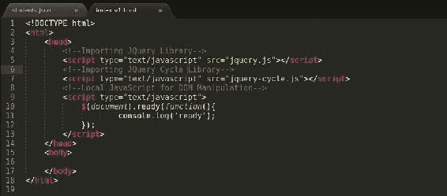
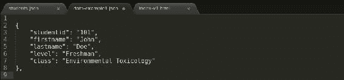
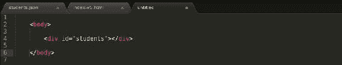
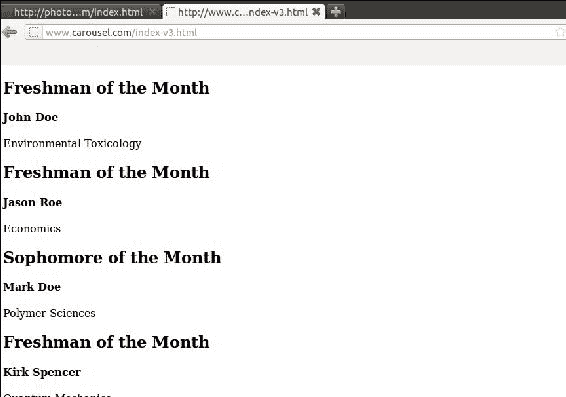
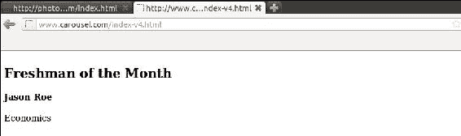
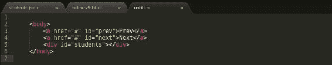

# 第六章。构建转盘应用

我们在掌握 JavaScript 和 JSON 的旅程中已经走了很长一段路；是时候忙碌起来，构建一个由 JSON 提供动力的端到端项目了。在我们的旅程中，我们遇到了各种各样的概念，如 JavaScript、JSON、服务器端编程的使用、AJAX 和 JSONP。在这个照片库应用中，让我们使用所有这些。我们将构建一个循环通知板应用，它应该显示本月的优秀学生。这个应用应该提供轮播功能，例如导航按钮、自动播放内容、在给定点显示单个项目以及跟踪第一个和最后一个内容。

# 设置应用

让我们首先构建一个文件夹来保存这个应用的文件。这个应用将需要一个 HTML 文件，将举行轮播；它将需要一些库，如 jQuery 和 jQuery Cycle。我们将不得不导入这些库；我们还需要一个保存本练习数据的 JSON 文件。要下载 jQuery 文件，请访问[http://www.jquery.com](http://www.jquery.com)。正如我们已经观察到的，jQuery 是开发人员可用的最流行的 JavaScript 库。越来越多的开发人员使得 jQuery 日益流行。我们将使用 jQuery 循环库来驱动我们的 Carousel 应用。jQuery Cycle 是最流行和最轻量级的循环库之一，具有许多特性；可以从[http://malsup.github.io/jquery.cycle.all.js](http://malsup.github.io/jquery.cycle.all.js)下载。

这些文件必须位于文档根目录下的文件夹中；在这个项目中，我们将使用一个实时的 Apache 服务器，我们将通过 AJAX 摄取 JSON 提要。以下是添加文件后文件夹的外观示例:

现在我们已经在文档根中安排了库，让我们处理将这些文件导入到网页中的基本 HTML 文件，如下面的截图所示:

index-v1.html

这是我们的初始索引网页，它将把 JavaScript 文件加载到网页上。当这个文件通过网络浏览器启动时，两个 JavaScript 库都必须被加载，并且`ready`应该被打印到控制台窗口上。现在，让我们继续构建我们的 Carousel 应用。下一个需求是数据文件；它将类似于我们在前面章节中使用的`students` JSON 提要。我们将把它们加载到一个旋转器应用中，而不是把它们全部打印在一行中。

# 为 Carousel 应用构建 JSON 文件

让我们假设我们是一个教育机构，我们有每月承认学生努力的传统。我们将从该月的每门课程中选出最优秀的学生，并在我们的公告栏旋转器应用中显示他们的姓名。这个公告板旋转器应用经常成为其他学生的动力，他们总是以登上公告板为目标。这是我们教育机构鼓励学生在课程中取得好成绩的方式。示例 JSON 提要如下图所示:

对于我们的公告板旋转器应用，我们将需要基本的学生信息，如名字，姓氏，目前的教育水平，以及他们擅长的课程。

index-v2.html

在前面的截图中，我们使用了 jQuery 的`getJSON()`函数将 JSON 提要带入到文档中。当`index-v2.html`文件加载到浏览器中时，`students` JSON 对象数组将被加载到控制台窗口中。是时候开始从 JSON 对象中提取数据，并开始将它们嵌入到 DOM 中了。让我们使用 jQuery `each()`函数来遍历`students` JSON 提要，并将数据加载到页面上。

jQuery 中的`each()`函数类似于流行的服务器端语言中可用的`foreach()`迭代循环和原生 JavaScript 中可用的`for in()`迭代循环。`each()`迭代器将数据作为其第一个参数，并将该数据中的`each`项作为单个键值对迭代传递到回调中。该回调是在该键值对上执行的大量脚本的集合。在这个回调中，我们正在构建将被追加到 DOM 上的一个`div`元素的 HTML 文件。我们使用这个回调来迭代地为那个`students` JSON 对象中存在的所有元素构建 HTML 文件。

index-v3.html

在`index-v3.html`文件中，我们使用 jQuery `each()`函数来遍历`students` JSON 提要，并构建将显示学生信息的 HTML 文件，如名字、姓氏、大学年份以及他们注册的课程。我们正在构建动态 HTML，并将其分配给`html`变量。`html`变量中的数据稍后将被添加到 ID 为`students`的`div`元素中。这显示在下面的截图中:

下面的截图显示了`index-v3.html`体的输出:

当脚本加载到 web 浏览器中时，脚本会检查文档是否准备好。一旦文档准备好，就对服务器进行 AJAX 调用来检索 JSON 数据。一旦检索到 JSON 数据，`students` JSON 对象数组提要中的每个对象都将被传递到回调中，回调生成一个带有类`student`的 HTML `div`元素。这样重复，直到回调在最后一个元素上运行，一旦回调在最后一个元素上执行，这个 HTML 文件将被附加到 HTML 中的一个`div`元素，其标识为`students`。

# 用 jQuery 循环创建转盘应用

我们开发了一个网页，将所有学生数据加载到一个 HTML 文件中；现在是时候使用这些数据构建 Carousel 应用了。我们将使用一个 jQuery Cycle 插件在我们的公告板上循环学生信息。jQuery Cycle 是一个幻灯片插件，支持多种浏览器上的各种过渡效果。有`fade`、`toss`、`wipe`、`zoom`、`scroll`、`shuffle`等效果。该插件还支持有趣的悬停暂停功能；还支持点击触发器和响应回调。

对于我们的 Carousel 示例，让我们保持简单，并使用基本选项，例如渐变效果来旋转学生，启用暂停，以便每当用户悬停在循环上时，旋转器应用都会暂停以显示当前学生的信息。最后，我们将设置速度和超时值，这将决定从一个学生过渡到另一个学生需要多长时间。

index-v4.html

在上一个截图中，我们设置了`cycle`插件，并将`cycle`插件添加到了`students`的`div`元素中。`cycle`插件以一个 JSON 对象为参数，向`div`元素添加旋转器功能。在这个 JSON 对象中，我们添加了四个属性:`fx`、`pause`、`speed`和`timeout`。`fx`确定在`html`元素上执行的效果。`fade`是用于`cycle`插件的突出效果。jQuery Cycle 插件支持的其他流行效果有洗牌、缩放、调低、向右滚动和缩减。我们使用的第二个属性是`pause`属性，这决定了当用户悬停在`rotator`元素上时，旋转是否已经停止；判断旋转是否可以暂停需要一个真值和一个假值。我们可以提供一个布尔值，如真或假，或者传递一个或零，分别表示真和假。接下来的两个属性是`speed`和`timeout`；它们决定了旋转发生的速度以及在显示下一个项目之前需要多长时间。当带有更新脚本的网页被加载到网页浏览器中时，整个`students`对象被解析成一个本地的 JavaScript 字符串变量，并被追加到 DOM 中，只有该旋转器对象中的第一个元素被显示，而其余的元素被隐藏。该功能由`cycle`插件在幕后处理。下面的屏幕截图显示了从早期代码示例生成的 Carousel:

让我们通过添加前面和后面的处理程序来增强这个页面的用户体验，从而为用户提供自定义控制器来处理旋转器功能，如下面的屏幕截图所示:

index-v5.html

在`cycle`对象中，我们添加了两个名为`prev`和`next`的新属性。`prev`和`next`属性的值将是 DOM 上元素的 HTML `id`属性。为了处理此更改，必须对 HTML 文件进行如下修改:

在上一个截图中，我们添加了两个锚元素，它们的`id`值为`prev`和`next`，在`cycle`对象中被引用。

上一个截图中显示的**上一个**和**下一个**链接将处理公告板旋转应用的旋转。这是构建由 jQuery 和 JSON 支持的 Carousel 应用的快速方法。此示例可用于构建更复杂的 Carousel 应用，这些应用可分别包含照片库和视频库 Carousel 应用的图像和视频。

# 总结

在这一章中，我们将我们的 JavaScript、jQuery 和 JSON 知识付诸实践，并构建了一个整洁的小型 Carousel 通知板旋转器应用。我们经历了一个循序渐进的过程来接收数据馈送，从该数据馈送动态构建一个动态模板，将数据馈送附加到一个`div`元素，然后将`div`元素绑定到`cycle`插件。这个公告板旋转器应用让我们能够深入了解更大的 Carousel 项目，这些项目只需要很少的开发工作就可以开发出来。在下一章中，我们将研究 JSON 的替代实现。