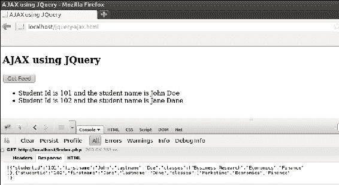
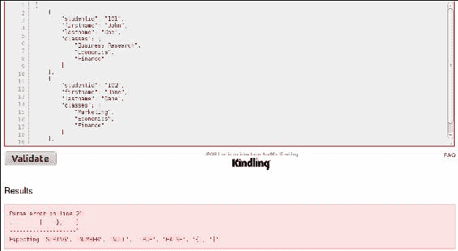
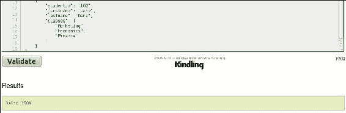
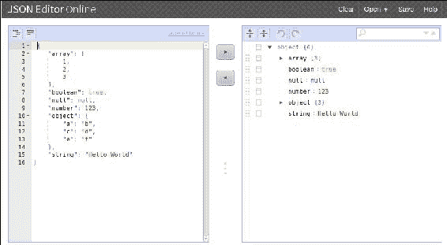

# 八、调试 JSON

在过去的几年里，JSON 有了突飞猛进的发展，因此有大量的免费资源来理解我们正在使用的 JSON 对象。正如我们前面所讨论的，JSON 可以用于多种目的，理解可能会破坏 JSON 的简单事情很重要，例如忽略双引号，或者 JSON 对象中最后一项上的尾随逗号，或者网络服务器发送的错误内容类型。在本章中，让我们回顾一下调试、验证和格式化 JSON 的不同方式。

# 使用开发工具

几乎所有的顶级浏览器，如 Mozilla Firefox、Google Chrome、Safari 和 Internet Explorer 都有强大的调试工具，可以帮助我们了解正在发出的请求以及正在返回的响应。JSON 可以是请求的一部分，也可以是响应的一部分。谷歌 Chrome、Safari 和更新版本的 Internet Explorer 都附带了内置的开发工具。Firebug 是一个非常流行的网络开发工具包，可用于 Mozilla Firefox。Firebug 是一个外部插件，必须安装在浏览器上；它是最早的网络开发工具包之一，旨在帮助网络开发人员使用火狐。

### 注

要安装 Firebug，请访问[http://getfirebug.com/](http://getfirebug.com/)，点击登陆页面**安装 Firebug** 。

这些开发工具提供了对 HTML DOM 树的访问，并让我们实时了解 HTML 元素在页面上是如何排列的。开发人员工具附带了一个网络(或 **Net** )选项卡，允许我们跟踪所有资源，如图像、JavaScript 文件、CSS 文件、闪存介质以及客户端正在进行的任何异步调用。控制台窗口是开发人员工具中内置的另一个流行功能。顾名思义，这个窗口为我们提供了一个运行时 JavaScript 控制台来测试任何动态脚本。要在 Firefox 上启动开发人员工具，请将网页加载到网络浏览器中，然后右键单击网页；这将给我们一个选项列表，选择**用萤火虫**检查元素 **。要在谷歌 Chrome 和 Safari 上加载开发工具，右键单击网页，然后从选项列表中单击 **检查元素**。在 Safari 上工作时，请记住必须启用开发人员工具；要启用开发工具，点击 **Safari** 菜单项，选择**首选项**并点击**高级**选项卡，勾选**在菜单栏**显示开发菜单查看开发工具。在互联网浏览器上，点击键盘上的 *F12* 键，打开开发者工具窗口。在[第 4 章](4.html "Chapter 4. AJAX Calls with JSON Data")、*使用 JSON 数据进行 AJAX 调用*中，我们第一次异步调用一个实时网络服务器来使用 jQuery 请求 JSON 数据。让我们使用该程序，并使用开发工具调试数据；对于本例，我们将使用 Firefox 网络浏览器:**

jquery-ajax.html

在页面加载时，当用户右键单击并选择**用 Firebug 检查元素**选项时， **HTML** 选项卡默认加载，用户可以看到 HTML DOM。在我们的例子中，我们已经将`click`事件处理程序绑定到了**获取提要**按钮。让我们看看点击按钮后的控制台输出；要在控制台窗口中查看输出，单击**控制台**选项卡:

一旦检索到响应，JSON 提要将被记录到控制台窗口的**响应**选项卡中。理解 JSON 提要以便解析它很重要，开发人员工具的控制台窗口为我们提供了一种分析 JSON 提要的简单方法。让我们继续研究开发人员工具，并访问火狐中的**网**选项卡，了解客户端和服务器如何交流客户端期望的数据内容类型:

在网络窗口中，我们应该从点击异步调用的网址开始，异步调用正在进行到`index.php`。点击该链接后，在**标头**部分，我们应该观察 **Accept** 标头，该标头预期为`application/json` **多用途互联网邮件扩展** ( **MIME** )类型，而 **X-Requested-With** 标头为 **XMLHttpRequest** ，通知这是一个异步请求。“网络”窗口中的**响应**选项卡与控制台窗口中的 **响应**选项卡相同，它将显示该请求的 JSON 提要。在本书中，我们广泛使用了将数据打印到控制台窗口的`console.log`方法，这是开发人员工具的另一个有用的特性。

# 验证 JSON

类似于我们的调试资源，有很多流行的网络工具帮助我们验证我们构建的 JSON。 **JSONLint** 是验证我们的 JSON 提要的最流行的网络工具之一。

### 注

当我们使用服务器端程序，比如 PHP、Python 或 Java 时，内置的 JSON 编码库生成 JSON 提要，通常该提要将是一个有效的 JSON 提要。

JSONLint 有一个非常简单的接口，允许用户粘贴他们想要验证的 JSON，并根据我们粘贴的 JSON 提要返回成功消息或错误消息。让我们首先验证一个坏的 JSON 片段，以查看将返回的错误消息，然后让我们修复它以查看成功消息。对于本例，我将复制上例中的`students`提要，并在第二个元素的末尾添加一个尾随逗号:

请注意，我们在 JSON 对象的最后一项添加了一个尾随逗号，关于 JSONLint 的最好部分是描述性错误消息。我们遇到了一个**解析错误**，为了简单起见，消息还给出了错误所在的行号。解析器需要一个字符串，或者一个数字，或者一个空值，或者一个布尔值，因为我们没有提供，所以我们遇到了这个错误。为了修复这个错误，我们要么必须向那个 JSON 对象添加一个新的项目来调整逗号，要么我们必须去掉逗号，因为前面没有项目。

只要我们删除末尾的逗号并验证它，我们就会得到成功消息。易用性和描述性消息使 JSONLint 成为 JSON 验证的 goto 网站之一。

### 注

要使用 JSONLint，请访问[http://www.jsonlint.com](http://www.jsonlint.com)。

# 格式化 JSON

JSONLint 不仅仅是一个在线的 JSON 验证器，它还帮助我们格式化 JSON，让它看起来很漂亮。通常，JSON 提要的大小很大，而一个提供遍历 JSON 对象的树结构的在线编辑器总是有帮助的。 **JSON 编辑器在线**是我最喜欢的在线编辑器之一，可以处理和格式化大的 JSON 对象，因为它提供了一个简单的导航树结构。

### 注

要在线使用 JSON 编辑器，请访问[http://www.jsoneditoronline.org](http://www.jsoneditoronline.org)。

我们首先将我们的 JSON 示例代码粘贴到左侧的窗口中，点击中间的右箭头按钮，生成我们的树形结构。一旦我们对树结构进行了更改，我们就可以单击左箭头按钮来格式化我们的数据，使其可以在其他地方使用。

# 总结

调试、验证和格式化是开发人员永远不能忽视的三件事。在这一章中，我们已经查看了一些资源，例如用于调试的浏览器的开发人员工具包，我们如何利用这些开发人员工具包，还看到了如何使用 JSONLint 进行验证，以及如何使用 JSON 编辑器 Online 进行格式化。

*JavaScript 和 JSON Essentials* 到此结束，旨在为您提供如何以 JSON 数据格式存储和传输数据的深入见解。我们有过在同一个域内通过 HTTP 异步请求传输 JSON，以及跨域传输 HTTP 异步请求的实践经验。我们还研究了如何使用 JSON 数据格式的替代实现。这是理解 JSON 以开发交互式和响应性网络应用的漫长旅程的坚实开端。