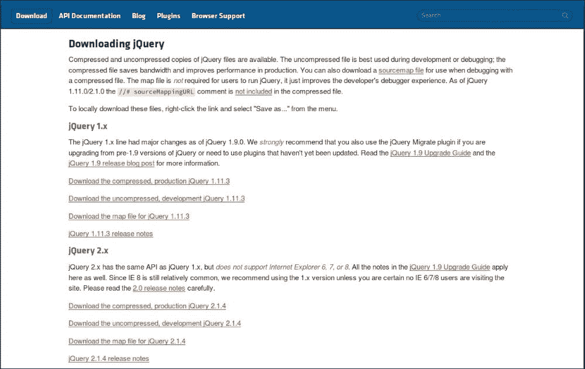
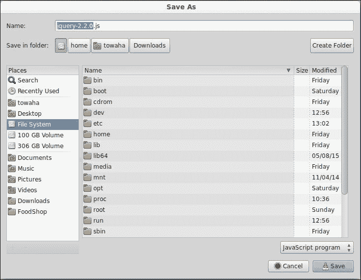
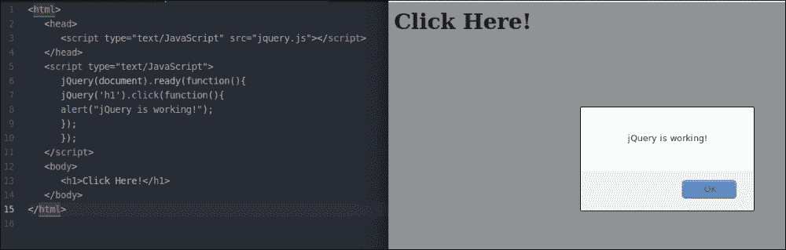
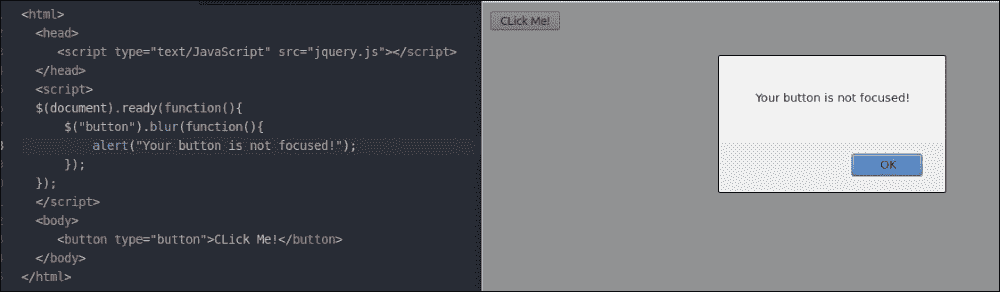
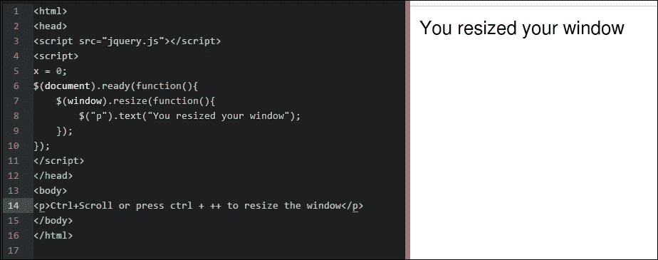

# 六、探索 jQuery 的优势

如果你已经浏览了上一章，你可能已经在你的**战舰**游戏中实现了 **jQuery** 。在本章中，我们将详细讨论 jQuery。

jQuery 库是一个 JavaScript 框架。它于 2006 年发布。人们习惯称之为 **jSelect** 。我们在网站中使用 jQuery，这样我们就可以轻松地使用 JavaScript，并为我们的网页添加效果。你可能认为 jQuery 不同于 JavaScript。不要。jQuery 只是另一个 JavaScript 文件。这是一个非常轻量级的库，可以帮助你用更少的代码更容易地装饰你的网页。

我们使用 jQuery 有以下优点:

*   它是开源的；如果需要，您可以编辑或修改它的代码
*   这是一个小型库(大约 150 KB 文件)
*   社区对 jQuery 的支持非常强；你可以很容易地从用户那里得到帮助
*   它是用户友好和受欢迎的
*   它支持跨浏览器
*   它是公开开发的；您可以通过编辑代码来修复任何错误或添加功能
*   它通过使用 AJAX 帮助开发人员构建响应性网站
*   它有内置的动画功能，可以帮助开发人员在他们的网站上创建动画

# 安装 jQuery

问题是在哪里可以找到 jQuery。嗯，你可以在[http://jquery.com/](http://jquery.com/)找到。我有也附了这本书的档案。你可以从那里下载。

如果你去[http://jquery.com/](http://jquery.com/)，你会看到如下画面:


点击**下载查询**按钮。您将被重定向到以下页面:



jQuery 有两个版本:`1.x.x`和`2.x.x`。这些版本之间只有一些不同。压缩版本的代码不可读，因为该版本没有空格和注释；然而，未压缩版本是明确编码和格式化的，它也有重要的注释来理解代码和函数的工作。如果你想了解 jQuery 的一个函数是如何工作的，我建议你浏览一下 jQuery 的未压缩版本。

在本章中，我们将使用`2.x.x`版本。`2.x.x`的最新版本是`2.2.0`。

### 注

您可以下载 jQuery 的压缩或未压缩版本。

我建议你使用压缩版本，因为它是轻量级的。

本章我们将使用未压缩版本，这样您就可以研究`jquery.js`并对其工作原理有一个清晰的概念。点击**下载未压缩的，开发 jQuery** `2.2.0`后，你会在浏览器上看到 jQuery 库。点击键盘上的 *Ctrl* + *S* 保存文件，如下图截图所示:



下载 jQuery 后，将其放入您的计算机中。为简单起见，将其重命名为`jquery`。

通过在`<head></head>`标签中键入以下代码，在同一文件夹中创建新的 HTML 文件，并将`jquery.js`包含在您的 HTML 文档中:

```js
<script src="jquery.js"></script>
```

要检查您导入的`jquery.js`是否工作，请键入以下代码。稍后我将解释代码:

```js
<html>
  <head>
    <script type="text/JavaScript" src="jquery.js"></script>
  </head>
  <script type="text/JavaScript">
    jQuery(document).ready(function()
    {
      jQuery('h1').click(function()
      {
        alert("jQuery is working!");
      } //click function ends here.
      );
    } // ready function ends here.
    );
  </script>
  <body>
    <h1>Click Here!</h1>
  </body>
</html>
```

打开 HTML 文件后，点击**点击这里！**您将看到以下屏幕:



这意味着您的 jQuery 正在工作。

让我们讨论一下我们编写的代码。

### 注

也可以不下载安装 jQuery。这种安装被称为内容交付网络 ( **CDN** )安装。

您需要将以下行添加到您的 HTML 文档中，如果您在线连接，您的浏览器将自动加载 jQuery。

```js
<script type = "text/javascript" src = "http://ajax.googleapis.com/ajax/libs/jquery/2.1.3/jquery.min.js"></script>
```

# 解释代码

现在，让我们讨论一下我们之前使用的代码。我们在代码中使用了以下函数:

```js
jQuery(document).ready(function(){
//our codes. 
});
```

这是一个 jQuery 函数，允许您设置 jQuery 以备使用。可以用美元符号(`$`)替换`jQuery`，如下图:

```js
$(document).ready(function(){
//our codes.
});
```

您需要考虑您想要在哪里应用 jQuery。我们在我们的身体标签上写了`<h1>Click Here!</h1>`。我们希望我们的`Click Here!`在点击时做一些事情，这就是为什么我们添加了一个类似于以下格式的`click`函数:

```js
  jQuery('h1').click(function(){
    //our codes.
  });
```

如前所述`jQuery`可以用`$`代替。

我们增加了`alert`功能，这样当我们点击文本时，就会出现一个警告框。

# 往深处走

让我们详细讨论一下我们经常使用的 jQuery 函数/方法。

所有的方法都要写在`ready()`函数中。一些常用的方法如下:

*   负荷
*   好好享受吧
*   击键
*   变化
*   焦点
*   虚化
*   调整大小
*   卷起

## 荷载()方法

使用这个方法，你可以在你的浏览器上加载一个文件。考虑一下你想从浏览器的`.txt`文件中获取一些文本。您可以执行以下编码:

```js
<html>
  <head>
    <script type="text/JavaScript" src="jquery.js"></script>
  </head>
  <script>
    $(document).ready(function(){
      $("button").click(function(){
        $("#click").load("test.txt");
      });
    });
  </script>
  <body>
    <div id="click">
      Hello;
    </div>
    <button type="button" name="button">Click to replace "Hello" from text file</button>
  </body>
</html>
```

点击按钮后，`click` div 中的文字将变为**恭喜！您已经加载了文件！！**，如下图所示:


## 向上键()和向下键()方法

使用这个方法，你可以控制你的键盘按钮的按键。当一个键被按下或者没有被按下时，你可以让你的浏览器做一些的事情。考虑你有一个文本框，你想从那里输入。当按键被按下时，你希望你的文本框变成红色；否则颜色应该保持绿色。您可以通过实现/编写以下代码来实现这一点:

```js
<html>
  <head>
    <script type="text/JavaScript" src="jquery.js"></script>
  </head>
  <script>
    $(document).ready(function(){
      $("input").keydown(function(){
        $("input").css("background-color", "green");
      });
      $("input").keyup(function(){
        $("input").css("background-color", "red");
      });
    });
  </script>
  <body>
    Type Something:  <input type="text">
  </body>
</html>
```


## 变化()方法

要更改某些文本，可以通过实现以下代码来使用该方法:

```js
<html>
  <head>
    <script type="text/JavaScript" src="jquery.js"></script>
  </head>
  <script>
  $(document).ready(function(){
    $("input").change(function(){
      alert("The text has been changed.");
    });
  });
  </script>
  <body>
    Type Something:  <input type="text">
  </body>
</html>
```

您的输出将类似于下图:


## 模糊()和聚焦()方法

要使成为您的文本或按钮模糊或聚焦，您可以执行以下代码:

```js
<html>
  <head>
    <script type="text/JavaScript" src="jquery.js"></script>
  </head>
  <script>
  $(document).ready(function(){
    $("button").blur(function(){
      alert("Your button is not focused!");
    });
  });
  </script>
  <body>
    <button type="button">CLick Me!</button>
  </body>
</html>
```

你可以做这个为这个`focus()`法太，如下:



## resize()方法

如果您想查看您的浏览器调整了多少次大小，您可以在您的 HTML 文档上执行以下操作:



## 滚动()方法

您可以使用以下代码向鼠标滚动添加动作:

```js
<html>
  <head>
    <script src="jquery.js"></script>
    <script>
      $(document).ready(function(){
        $("div").scroll(function(){
          $("span").text("You are scrolling!");
        });
      });
    </script>
  </head>
  <body>
    <div style="border:2px solid black;width:200px; height:200px;overflow:scroll;">
      Cowards die many times before their deaths;<br>
      The valiant never taste of death but once.<br>
      Of all the wonders that I yet have heard,<br>
      It seems to me most strange that men should fear;<br>
      Seeing that death, a necessary end,<br>
      Will come when it will come.<br>
    </div>
    <span></span>
  </body>
</html>
```

当用鼠标滚动时，可以看到`scroll()`功能中创建的事件，如下图:


# 总结

jQuery 库使用起来非常有趣，对新学习者来说也很容易。你所要做的就是练习 jQuery 的方法和功能。网上有很多 jQuery 插件。您也可以下载并安装到您的网页。使用 jQuery 和它的插件，你可以轻松漂亮地装饰和编码你的网站。对我来说，jQuery 最有趣的部分是动画。我将在下一章解释如何使用 jQuery 制作动画。