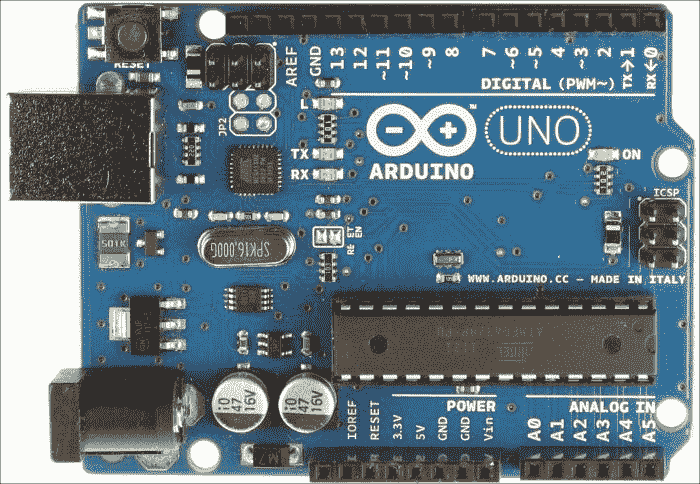
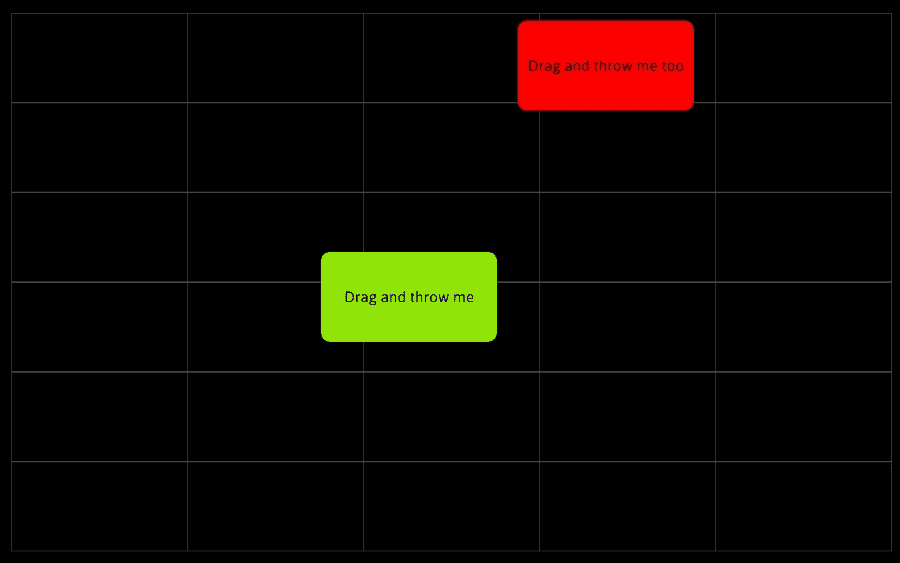
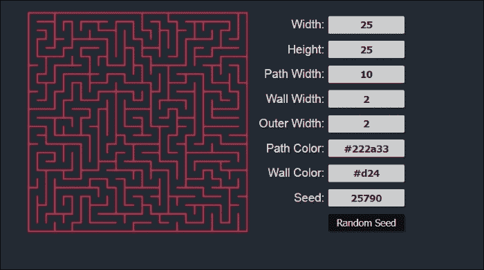
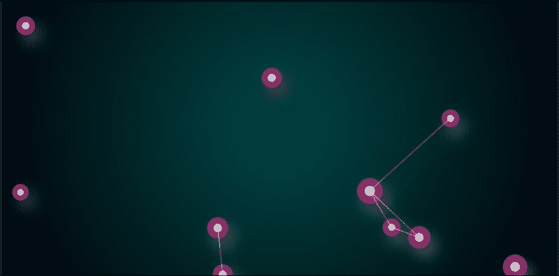
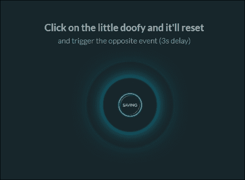
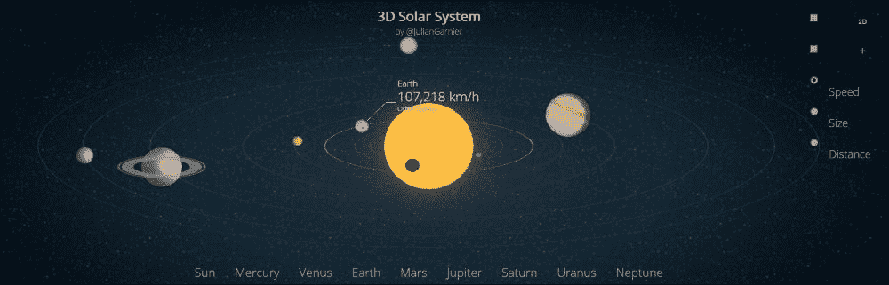

# 十、可能性

在本书中，我们探索了许多与 JavaScript 相关的主题。你学会了如何玩控制台；用 JavaScript、HTML 标签、CSS 属性和控制语句解决问题；使用 jQuery 用画布画画；建设项目；等等。然而，你有没有想过通过阅读这本书和学习 JavaScript 获得的机会？

在这一章中，我们将了解为什么学习 JavaScript 很重要，以及 JavaScript 的领域是什么。

# JavaScript 作为你的第一种编程语言

JavaScript 是最容易开始学习的语言。它不需要任何软件来运行。一个现代的浏览器和记事本就足以开始用 JavaScript 编码了。JavaScript 有一些最好的在线学习材料。

Codecademy([https://www.codecademy.com](https://www.codecademy.com))、Code School([https://www.codeschool.com](https://www.codeschool.com))、CodePen([http://CodePen . io](http://codepen.io))、JS Bin([https://jsbin.com](https://jsbin.com))和 JS 提琴([https://jsfiddle.net](https://jsfiddle.net)等网站会在短时间内帮你学会 JavaScript。

## JavaScript 无处不在

JavaScript 是几乎所有浏览器都运行的唯一语言；即使在智能手机浏览器中。网络无处不在，JavaScript 也无处不在。

## JavaScript 开发者职业

如果你喜欢编程，并且想通过编程来建立你的职业生涯，那么 JavaScript 是最好的语言之一。我可以说很难做出比 JavaScript 更好的选择。如果你看看网络发展的一些趋势，你会发现实时网站就像桌面应用。网站上繁重的用户交互，如拖放、音频和视频交互以及数据可视化，如今很常见。所有这些大部分都是使用 JavaScript 完成的。没有 JavaScript，我们就无法获得很酷的网络应用(谷歌地图、谷歌地球、Gmail、脸书等等)。JavaScript 让一切成为可能。当您想要构建 web 应用时，没有其他语言像 JavaScript 那样强大。现在的世界是基于网络的，网络是由 JavaScript 驱动的，目的是使它美观、动态和安全。因此，选择带有 HTML 和 CSS 的 JavaScript 作为你未来的职业将是你一生中最好的决定之一。开发人员被称为前端或全栈开发人员。

# 所有杂事都可以用 JavaScript 完成

有了 JavaScript，你可以做很多牛逼的事情。从机器人到网络应用开发，JavaScript 是一个强有力的工具。让我们看看人们如何在他们的科技生活中使用 JavaScript:

*   机器人学
*   3D 游戏
*   为你的智能手机制作应用
*   运行 web 服务器
*   运行 Ruby 和 Python
*   编写独立于操作系统的桌面应用
*   刮网和筛分
*   网络分析
*   响应性和交互式内容
*   动画
*   创建 cookies

## 机器人技术

在机器人学中，你需要用逻辑控制你的机器人。在现实世界中，逻辑是由微控制器处理的。你可能听说过 **Arduino** ，一个处理微电子的开源硬件。基本上，Arduino 使用 C 代码控制微控制器。但是，如果你知道 JavaScript，你也可以为它编码；与微处理器/微控制器一起工作，制造你的第一个机器人。你可以从[http://nodebots.io/](http://nodebots.io/)获得帮助，看看 JavaScript 是如何被用来构建机器人的。以下是 Arduino UNO 板的图片:

Arduino 一号

## 3D 游戏

我们在这本书里建立和发展了 2D 游戏。然而，相信我，你也可以用 JavaScript 构建令人敬畏的 3D 游戏。你甚至可以通过你最喜欢的游戏手柄来玩它们。要使用你的游戏手柄，你需要使用一个游戏手柄应用编程接口([https://wiki.mozilla.org/GamepadAPI](https://wiki.mozilla.org/GamepadAPI))。

您可以在以下网址玩一些用 JavaScript 构建的在线 3D 游戏:[http://www.babylonjs.com/](http://www.babylonjs.com/)。

## 为你的智能手机制作应用

你有没有想过为自己的智能手机打造一个 app ？你可以用 JavaScript 为你的智能手机构建应用。智能手机有不同类型的平台(例如，安卓、iOS、蒂森、火狐操作系统等)。每个平台都有自己的 API，使用不同的编程语言。因此，我们需要考虑我们的代码库可以在任何设备上运行。为了确保这一点，我们可以使用运行在任何平台上的 JavaScript 引擎。您可以使用 **科尔多瓦**([http://cordova.apache.org/](http://cordova.apache.org/))了解如何使用 JavaScript 构建应用。Cordova 是一个基于每个设备的 API 的 JavaScript 框架。你可以使用**phone gap**([http://phonegap.com/](http://phonegap.com/))或者 **流星**([https://www.meteor.com/](https://www.meteor.com/))用 JavaScript 构建智能手机应用。

## 运行网络服务器

你可能听说过网络服务器。服务器用于广播网站。您可以使用 JavaScript 规则您的服务器。JavaScript 可以处理所有操作，并确认您的域的安全性。可以使用**node . js**([https://nodejs.org/](https://nodejs.org/))运行最简单的 web 服务器。想了解更多关于 JavaScript 网络服务器的信息，你可以看看https://www.firebase.com/。您可能对 JavaScript 有基本的了解，这是在 web 服务器中执行任务所必需的。用其他框架构建 web 服务器可能成本很高；然而，有了 JavaScript，你可以免费做到这一点，你甚至不需要为此购买任何软件。

## 运行 Ruby 和 Python

JavaScript 也可以用来在你的浏览器上运行 **Python** 或者 **Ruby** ，外部代码很少。您可以通过添加库将这些编程语言的运行环境包含在浏览器中。要了解更多关于库的信息，包括在你的浏览器上运行 Ruby 和 Python 的代码，你可以看看[https://www.firebase.com](https://www.firebase.com)。

## 编写独立于操作系统的桌面应用

由于 JavaScript 是独立于平台的，你可以在 JavaScript 的帮助下构建 web 应用，并在任何平台上运行。任何平台上的用户都可以在其浏览器上运行基于 JavaScript 的应用。你甚至可以用 JavaScript 制作桌面应用。看看[http://appjs.com/](http://appjs.com/)和[http://electron.atom.io/](http://electron.atom.io/)做你的第一个基于 JavaScript 的桌面应用。

## 刮网和筛分

从网站提取信息的技术称为网页抓取。要了解更多关于网页抓取的信息，您可以前往[http://www.webscraper.io/](http://www.webscraper.io/)。JavaScript 可以帮你进行网页抓取。你可以看看[http://nrabinowitz.github.io/pjscrape/](http://nrabinowitz.github.io/pjscrape/)到了解更多关于用 JavaScript 进行网页抓取的知识。

你可以看看[https://html2canvas.hertzen.com/](https://html2canvas.hertzen.com/)了解更多你网站的截图。截图可以使用 JavaScript 完成。

## 网络分析

有时候，你可能需要知道谁在访问你的网站，你的网站经常从哪个 IP 地址被访问，访问者属于哪个国家，以及更多关于跟踪访问者的信息。所有这些信息都可以使用 JavaScript 获得。

## 响应性和互动性内容

借助 JavaScript，您可以在网站和网络应用上制作响应和互动内容。你可以看看[http://beta.rallyinteractive.com/](http://beta.rallyinteractive.com/)、[http://www.unfold.no/](http://www.unfold.no/)、[http://www.2advanced.com/](http://www.2advanced.com/)和[http://www.newquest.fr/](http://www.newquest.fr/)看看他们是如何用 JavaScript 让他们的网站变得有响应和互动的。

## 动画

JavaScript 令人敬畏的之处在于，你可以用它做动画。有很多很酷的 JavaScript 动画库。来看看[http://greensock.com/gsap](http://greensock.com/gsap)了解更多关于著名的 JavaScript 动画库**绿锁**。还有另一个著名的 JavaScript 动画库名为**Velocity . js**([http://julian.com/research/velocity/](http://julian.com/research/velocity/))。

## 制作饼干

你可能听说过网络饼干。假设你在网站上输入用户名和密码，会弹出一个提示，说明你可以保存用户名和信息。你点击**记住密码**，然后信息作为 cookie 存储在你的电脑中。你的网络 cookies 是用 JavaScript 创建的。网络曲奇对 T4 网站更快加载很重要。你可以从[http://www.allaboutcookies.org/cookies/](http://www.allaboutcookies.org/cookies/)了解更多关于网络饼干的信息。

# 超赞的 JavaScript 示例

很少有网站能让用户看到最新的 JavaScript 作品。其中一个就是[http://creativejs.com/](http://creativejs.com/)。你也会在那里找到一些教程。`CreativeJS.com`是寻找令人兴奋的 JavaScript 演示、项目、游戏和其他他们认为很棒的东西的好去处。他们有一整队人给你带来最好的东西。以下截图为`CreativeJS.com`首页:

以下是几个带有链接的 JavaScript 项目示例:

*   **Awesome calculator**: The following calculator was built with JavaScript, HTML, and CSS. The animation of the glowing button is done by JavaScript:

    

    这个计算器可以在[http://codepen.io/giana/pen/GJMBEv](http://codepen.io/giana/pen/GJMBEv)找到。

*   **Drag and drop**: You can drag one block and drop it on another block with your mouse. The dragging is done using JavaScript. The following is a screenshot of this project:

    

    这个项目可以在[http://greensock.com/draggable](http://greensock.com/draggable)找到。

*   **Random maze generator**: You built a game called Rat-man, where you needed to draw a map for the cats and the rat to move. The path was like a maze. The following link will generate a random maze for you. I hope you pay attention to the JavaScript that they used there:

    

    这个游戏可以在[http://codepen.io/GabbeV/pen/viAec](http://codepen.io/GabbeV/pen/viAec)找到。

*   **Particle joining**: You can play with joining particles at [http://codepen.io/garyconstable/pen/fEoLz](http://codepen.io/garyconstable/pen/fEoLz). This particles' movements are controlled by JavaScript. The following is a screenshot of this project:

    

*   **Tearable cloth**: If you want to make a simulation of a cloth, you can go to the link [http://codepen.io/dissimulate/pen/KrAwx](http://codepen.io/dissimulate/pen/KrAwx) and play with the piece of cloth here. The motion of the cloth is controlled by JavaScript. The following is the screenshot of this project:

    

*   **Neon thing**: You can use the following thing on your website as button. I hope you learn how its code works. The following is a screenshot of this project:

    

    这个项目可以在[http://codepen.io/simeydotme/details/Gzfuh](http://codepen.io/simeydotme/details/Gzfuh)找到。

*   **Smartphone submenu**: If you are thinking about making a smartphone application with JavaScript, you will definitely need a submenu for the app. You can go to [http://codepen.io/berdejitendra/pen/AgEzJ](http://codepen.io/berdejitendra/pen/AgEzJ) and learn how to make a cool submenu for your mobile application. The following is a screenshot of this project:

    

*   **3D Solar System**: If you love astronomy and the motion of planets, the link [http://codepen.io/juliangarnier/pen/idhuG](http://codepen.io/juliangarnier/pen/idhuG) will bring you an awesome visualization of the neighboring planets and their information. All the dynamic elements were created using JavaScript. The following is a screenshot of this project:

    

# 总结

我们在书的末尾。这本书并不全是关于 JavaScript 的。它是 JavaScript 的起点。我希望你喜欢这本书，并练习了书中讨论的所有练习和项目。我希望你能访问本章的网站，观察每个项目的代码，以便了解更多关于 JavaScript 的知识。我希望有一天你能借助 JavaScript 创建自己的动态网站，用 JavaScript 构建一个智能手机应用，你也可能用 JavaScript 构建一个机器人。你永远不知道！

希望你已经学会了很多用 JavaScript 探索的牛逼东西；现在是你尝试代码和玩 JavaScript 的时候了。如果出了什么问题，不要担心。请记住:

|  | *“第一次做对一点都不重要。最后一次做对是至关重要的。”* |  |
|  | - *安德鲁·亨特和戴维·托马斯* |