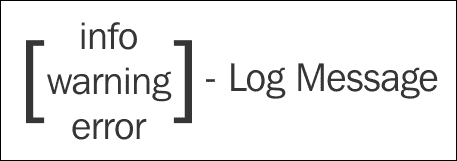
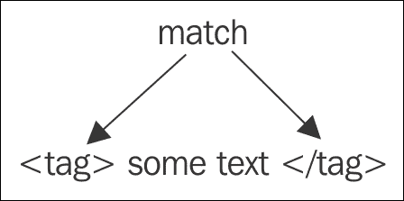
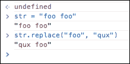
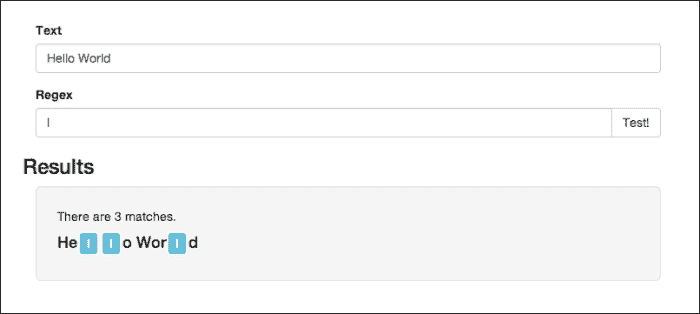

# 第一章。Regex 入门

**正则表达式**是一种特殊的工具，用于在语法上表示模式。当使用任何类型的文本输入时，您并不总是知道值是什么，但是您通常可以假设(甚至要求)您将在应用中接收的格式。当您创建正则表达式来提取和操作该输入时，会出现这些类型的情况。

因此，匹配一个特定的模式需要一个非常机械的语法，因为一两个字符的改变就可以极大地改变正则表达式的行为，从而改变最终的结果。

正则表达式本身(或简称为 **Regex** )并不特定于任何一种编程语言，几乎所有现代语言都可以直接使用它们。但是，不同的语言用不同的特性集和选项实现了 Regex 在这本书里，我们将通过 **JavaScript** 来看一下 Regex，以及它的具体实现和功能。

# 都是模式

正则表达式是使用特殊的字符语法描述模式的字符串，在本书中，我们将学习这些不同的字符和代码，它们被用来以模糊的方式匹配和操作不同的数据。现在，在我们尝试创建正则表达式之前，我们需要能够发现并描述这些模式(用英语)。让我们看几个不同的和常见的例子，在本书的后面，当我们对语法有了更强的掌握，我们将看到如何在代码中表示这些模式。

## 分析电话号码

让我们从简单的事情开始，看一下单个电话号码:

```js
123-123-1234
```

我们可以把这个模式描述为三位数，一个破折号，然后是另外三个数字，接着是第二个破折号，最后是另外四个数字。做起来很简单；我们看一个字符串，并描述它是如何组成的，如果你的所有数字都遵循给定的模式，前面的描述将会完美地工作。现在，假设我们将以下三个电话号码添加到这个集合中:

```js
123-123-1234
(123)-123-1234
1231231234
```

这些都是有效的电话号码，在您的应用中，您可能希望能够匹配所有这些号码，让用户可以灵活地以他们觉得最舒服的方式书写。那么，让我们再来看看我们的模式。现在，我会说我们有三个数字，可选的在括号内，然后是可选的破折号，另外三个数字，然后是另一个可选的破折号，最后是四个数字。在这个例子中，唯一必须的部分是十位数:破折号和括号的位置完全由用户决定。

还要注意，我们没有对实际的数字设置任何约束，事实上，我们甚至不知道它们是什么，但我们知道它们必须是数字(例如，与字母相反)，所以我们只设置了这个约束:


## 分析一个简单的日志文件

有时，我们可能有比一个数字或一个字母更具体的约束；在其他情况下，我们可能想要一个特定的词，或者至少一个来自特定群体的词。在这些情况下(主要是所有模式)，你越具体越好。让我们举下面的例子:

```js
[info] – App Started
[warning] – Job Queue Full
[info] – Client Connected
[error] – Error Parsing Input
[info] – Application Exited Successfully
```

当然，这是某种日志的一个例子，我们可以简单地说每一行都是一条日志消息。然而，如果我们想要更具体地操作或提取数据，这并不能帮助我们。另一种选择是说我们在括号中有某种单词，它指的是日志级别，然后是破折号后的消息，它将由任意数量的单词组成。同样，这并不太具体，我们的应用可能只知道如何处理前面的三个日志级别，因此，您可能希望忽略其他所有内容或引发错误。

为了最好地描述前面的模式，我们会说您有一个单词，它可以是信息、警告或一对方括号内的错误，后跟破折号，然后是某种句子，组成日志消息。这将使我们能够更准确地从日志中获取信息，并确保我们的系统在发送数据之前做好处理数据的准备:



## 分析一个 XML 文件

我想讨论的最后一个例子是你的模式依赖于自身的时候；这方面的一个完美例子是类似于**的 XML** 。在 XML 中，您可能有以下标记:

```js
<title>Demo</title>
<size>45MB</size>
<date>24 Dec, 2013</date>
```

我们可以说该模式由一个标签、一些文本和一个结束标签组成。这对于它是一个有效的 XML 来说还不够具体，因为结束标记必须与开始标记相匹配。因此，如果我们再次定义该模式，我们会说它包含一些由左侧的开始标记和右侧的匹配结束标记包装的文本:



最后三个例子只是用来让我们进入 Regex 的思路；这些只是一些常见的模式和约束类型，您可以在自己的应用中使用。

现在我们知道了我们可以创造什么样的模式，让我们花一点时间来讨论我们可以用它们做什么；这包括 JavaScript 提供的实际特性和功能，允许我们在这些模式形成后使用它们。

# JavaScript 中的 Regex

在 JavaScript 中，常规的表达式被实现为它们自己类型的对象(例如`RegExp`对象)。这些对象存储模式和选项，然后可以用来测试和操作字符串。

要开始使用正则表达式，最简单的方法是启用一个 JavaScript 控制台，并处理这些值。获取控制台最简单的方法就是打开浏览器，比如 **Chrome** ，然后在任意页面打开 JavaScript 控制台(在 Mac 上按下*命令* + *选项* + *J* 或者*Ctrl*+*Shift*+*J*)。

让我们从创建一个简单正则表达式开始；我们还没有深入到所涉及的不同特殊字符的细节，所以现在，我们将只创建一个匹配一个单词的常规表达式。例如，我们将创建一个匹配`hello`的正则表达式。

## 正则表达式构造函数

正则表达式可以用两种不同的方式在 JavaScript 中创建，类似于字符串中使用的方式。还有一个更明确的定义，您可以调用构造函数，并将您选择的模式(以及可选的任何设置)传递给它，然后还有字面定义，这是同一过程的简写。以下是两者的示例(您可以直接在 JavaScript 控制台中键入):

```js
var rgx1 = new RegExp("hello");
var rgx2 = /hello/;
```

这两个变量本质上是一样的，你会使用哪一个基本上是个人偏好。唯一真正的区别是，使用构造函数方法，您使用一个字符串来创建一个表达式:因此，您必须确保事先转义任何特殊字符，这样它才能到达正则表达式。

除了模式之外，两种形式的 Regex 构造函数都接受第二个参数，即一串标志。**标志**是一样的设置或属性，应用于整个表达式，因此可以改变模式及其方法的行为。

### 使用模式标志

我想覆盖的第一面旗帜是**忽略案例**或**我**旗帜。标准模式是区分大小写的，但是如果您有一个模式可以是这两种情况中的任何一种，这是一个很好的设置选项，允许您只指定一种情况，并让修改器为您调整它，保持模式的简短和灵活。

下一个标志是 **多行**或 **m** 标志，这使得 JavaScript 将字符串中的每一行都视为新字符串的开始。例如，你可以说一个字符串必须以字母 **a** 开头。通常，JavaScript 会测试整个字符串是否以字母 a 开头，但是使用 m 标志时，它会针对每一行单独测试这个约束，因此任何一行都可以通过以 a 开头的测试。

最后一面旗是T3【全球】T4 或 **g** 旗。没有这个标志，`RegExp`对象只检查字符串中是否有匹配，在找到的第一个上返回；但是，在某些情况下，您不仅想知道字符串是否匹配，您可能还想具体了解所有匹配。这就是全局标志的作用，当它被使用时，它将修改不同`RegExp`方法的行为，以允许您获得所有匹配，而不是只获得第一个匹配。

因此，从前面的例子继续，如果我们想要创建相同的模式，但是这次，将大小写设置为不敏感并使用全局标志，我们将编写类似如下的内容:

```js
var rgx1 = new RegExp("hello", "gi");
var rgx2 = /hello/gi;
```

## 使用 rgx.test 方法

现在我们已经创建了我们的正则表达式对象，让我们使用它的最简单的函数，`test`函数。`test`方法只返回`true`或`false`，根据字符串是否匹配模式。下面是一个实际应用的例子:

```js
> var rgx = /hello/;
undefined
> rgx.test("hello");
true
> rgx.test("world");
false
> rgx.test("hello world");
true
```

可以看到，第一个字符串匹配返回 true，第二个字符串不包含`hello`，所以返回`false`，最后一个字符串*匹配模式*。在模式中，我们没有指定字符串必须只包含`hello`，所以它匹配最后一个字符串并返回`true`。

## 使用 rgx.exec 方法

`RegExp`对象上的下一个方法是`exec`函数，它不仅仅检查模式是否与文本匹配，`exec`还返回一些关于匹配的信息。对于这个例子，我们再创建一个正则表达式，得到`index`作为模式的开始；

```js
> var rgx = /world/;
undefined
> rgx.exec("world !!");
[ 'world' ]
> rgx.exec("hello world");
[ 'world' ]
> rgx.exec("hello");
null
```

这里可以看到，函数的结果包含实际匹配作为第一个元素(`rgx.exec("world !!")[0];`)，如果你`console.dir`结果，你会看到它还包含两个属性:`index`和`input`，分别存储起始`index`属性和完成`input`文本。如果没有匹配，功能将返回`null`:


## 字符串对象和正则表达式

除了`RegExp`对象本身的这两个方法之外，字符串对象上还有几个方法接受`RegExp`对象作为参数。

### 使用字符串替换方法

最常用的方法是`replace`法。举个的例子，假设我们有`foo foo`弦，我们想把它改成`qux qux`。将`replace`与字符串一起使用只会切换第一个事件，如下所示:



为了替换所有出现的，我们需要提供一个带有`g`标志的`RegExp`对象，如下图所示:


### 使用字符串搜索方法

接下来，如果你只想找到一个字符串中第一个匹配的(从零开始的)索引，你可以使用`search`方法:

```js
> str = "hello world";
"hello world"
> str.search(/world/);
6
```

### 使用字符串匹配方法

我现在要讲的最后一个方法就是`match`功能。这个函数返回的输出与我们之前看到的没有`g`标志时的`exec`函数相同(它包括`index`和`input`属性)，但是在设置`g`标志时返回了所有匹配的常规`Array`。这里有一个例子:


我们已经快速浏览了 JavaScript 中常规表达式的最常见用法(按代码)，因此我们现在准备构建我们的`RegExp`测试页面，这将帮助我们探索 Regex 的实际语法，而无需将其与 JavaScript 代码相结合。

# 建设我们的环境

为了测试我们的 Regex 模式，我们将构建一个 **HTML** 表单，它将处理提供的模式并将其与一个字符串进行匹配。

我将把所有代码保存在一个文件中，所以让我们从 HTML 文档的头部开始:

```js
<!DOCTYPE html>
<html lang="en">
  <head>
    <title>Regex Tester</title>
    <link rel="stylesheet" href="http://netdna.bootstrapcdn.com/bootstrap/3.0.3/css/bootstrap.min.css">
    <script src="http://cdnjs.cloudflare.com/ajax/libs/jquery/2.0.3/jquery.min.js"></script>
    <style>
      body{
        margin-top: 30px;
      }
      .label {
         margin: 0px 3px;
      }
    </style>
  </head>
```

### 类型

**下载示例代码**

您可以从您在[http://www.packtpub.com](http://www.packtpub.com)的账户下载您购买的所有 Packt Publishing 书籍的示例代码文件。如果您在其他地方购买了这本书，您可以访问[http://www.packtpub.com/support](http://www.packtpub.com/support)并注册，以便将文件直接通过电子邮件发送给您。

这是一个相当标准的文档头，包含一个标题和一些样式。除此之外，我还包括用于设计的引导 **CSS** 框架，以及帮助进行 **DOM** 操作的 jQuery 库。

接下来，让我们在正文中创建表单和结果区域:

```js
<body>
  <div class="container">
    <div class="row">
      <div class="col-sm-12">
        <div class="alert alert-danger hide" id="alert-box"></div>
          <div class="form-group">
            <label for="input-text">Text</label>
            <input 
                    type="text" 
                    class="form-control" 
                    id="input-text" 
                    placeholder="Text"
            >
          </div>
          <label for="inputRegex">Regex</label>
          <div class="input-group">
            <input 
                   type="text" 
                   class="form-control" 
                   id="input-regex" 
                   placeholder="Regex"
            >
            <span class="input-group-btn">
              <button 
                      class="btn btn-default" 
                      id="test-button" 
                      type="button">
                             Test!
              </button>
            </span>
          </div>
        </div>
      </div>
      <div class="row">
        <h3>Results</h3>
        <div class="col-sm-12">
          <div class="well well-lg" id="results-box"></div>
        </div>
      </div>
    </div>
    <script>
      //JS code goes here
    </script>
  </body>
</html>
```

这些代码大部分是自举库进行样式化所需的样板 HTML 然而，它的要点是我们有两个输入:一个用于一些文本，另一个用于与之匹配的模式。我们有一个提交表单的按钮(T0 按钮)和一个额外的显示结果的`div`。

在浏览器中打开此页面应该会显示类似以下内容:


## 处理提交的表格

我们需要做的最后一件事是处理提交的表单并运行正则表达式。我将代码分解成助手函数，以便在我们现在完成时帮助处理代码流。首先，让我们为 submit ( `Test!`)按钮编写完整的点击处理程序(这应该是我在脚本标签中插入注释的地方):

```js
var textbox = $("#input-text");
var regexbox = $("#input-regex");
var alertbox = $("#alert-box");
var resultsbox = $("#results-box");

$("#test-button").click(function(){
  //clear page from previous run
  clearResultsAndErrors()

  //get current values
  var text = textbox.val();
  var regex = regexbox.val();

  //handle empty values
  if (text == "") {
    err("Please enter some text to test.");
  } else if (regex == "") {
    err("Please enter a regular expression.");
  } else {
    regex = createRegex(regex);

    if (!regex) {
      return;
    }

    //get matches
    var results = getMatches(regex, text);

    if (results.length > 0 && results[0] !== null) {
      var html = getMatchesCountString(results);
      html += getResultsString(results, text);
      resultsbox.html(html);
    } else {
      resultsbox.text("There were no matches.");
    }
  }
});
```

前四行使用 jQuery 从页面中选择相应的 DOM 元素，并存储它们以供整个应用使用。当 DOM 是静态的时，这是一个最佳实践，而不是每次使用时都选择元素。

剩下的代码是提交(`Test!`)按钮的点击处理程序。在处理`Test!`按钮的功能中，我们从清除上一次运行的结果和错误开始。接下来，我们从两个文本框中提取值，并使用名为`err`的函数处理它们为空的情况，稍后我们将对此进行介绍。如果这两个值没问题，我们尝试创建一个新的`RegExp`对象，并使用我写的另外两个分别称为`createRegex`和`getMatches`的函数得到它们的结果。最后，最后一个条件块检查是否有结果，并显示一条**未找到匹配项**消息，或者在页面上显示一个元素，该元素将使用`getMatchesCountString`显示找到了多少匹配项，使用`getResultsString`显示`string`中的实际匹配项。

## 重置匹配和错误

现在，让我们来看看这些辅助功能中的一些，从`err`和`clearResultsAndErrors`开始:

```js
function clearResultsAndErrors() {
  resultsbox.text("");
  alertbox.addClass("hide").text("");
}

function err(str) {
  alertbox.removeClass("hide").text(str);
}
```

第一个函数从 results 元素中清除文本，然后隐藏以前的错误，第二个函数取消隐藏 alert 元素，并添加作为参数传入的错误。

## 创建正则表达式

我要看的下一个函数负责根据文本框中给出的值创建实际的`RegExp`对象:

```js
function createRegex(regex) {
  try {
    if (regex.charAt(0) == "/") {
      regex = regex.split("/");
      regex.shift();

      var flags = regex.pop();
      regex = regex.join("/");

      regex = new RegExp(regex, flags);
    } else {
      regex = new RegExp(regex, "g");
    }
    return regex;
  } catch (e) {
    err("The Regular Expression is invalid.");
    return false;
  }
}
```

如果您试图创建一个带有不存在的标志或无效参数的`RegExp`对象，它将抛出一个异常。因此，我们需要将`RegExp`创建包装在一个`try` / `catch`块中，这样我们就可以捕捉到错误并为其显示错误。

在`try`部分，我们将处理两种不同的`RegExp`输入，第一种是当你在表达式中使用正斜杠时。在这种情况下，我们通过向前斜线分割这个表达式，删除第一个元素，它将是一个空字符串(它之前的文本是第一个正斜线)，然后弹出最后一个元素，它应该是标志的形式。

然后，我们将剩余的部分重新组合成一个字符串，并将其与标志一起传递到`RegExp`构造函数中。我们正在处理的另一种情况是，您写了一个字符串，然后我们简单地将这个模式传递给只有`g`标志的构造函数，从而获得多个结果。

## 执行正则表达式并提取其匹配项

我们的下一个功能是实际循环通过`regex`对象并从不同的匹配中获取`results`:

```js
function getMatches(regex, text) {
  var results = [];
  var result;

  if (regex.global) {
    while((result = regex.exec(text)) !== null) {
      results.push(result);
    }
  } else {
    results.push(regex.exec(text));
  }

  return results;
}
```

我们已经在前面看到了`exec`命令，以及它如何为每个匹配返回一个`results`对象，但是`exec`方法实际上是不同的，这取决于是否设置了全局标志(`g`)。如果没有设置，无论你调用多少次，它都会不断地返回第一个匹配，但是如果设置了，这个函数会在结果中循环，直到最后一个匹配返回`null`。在函数中，设置了全局标志，我使用 while 循环遍历`results`并将每一个推入`results`数组，而如果没有设置，我只调用`function`一次，只有在第一个匹配打开时才推入。

接下来，我们有一个函数，它将创建一个字符串，显示我们有多少个匹配项(一个或多个):

```js
function getMatchesCountString(results) {
  if (results.length === 1) {
    return "<p>There was one match.</p>";
  } else {
    return "<p>There are " + results.length + " matches.</p>";
  }
}
```

最后，我们有`function`，它将在`results`数组中循环，并创建一个 HTML 字符串显示在页面上:

```js
function getResultsString(results, text) {
  for (var i = results.length - 1; i >= 0; i--) {
    var result = results[i];
    var match  = result.toString();
    var prefix = text.substr(0, result.index);
    var suffix = text.substr(result.index + match.length);
    text = prefix 
      + '<span class="label label-info">' 
      + match 
      + '</span>' 
      + suffix;
  }
  return "<h4>" + text + "</h4>";
}
```

在`function`中，我们循环遍历匹配列表，对于每一个匹配，我们将字符串切断，并将实际匹配包装在标签中，以便进行造型。我们需要以相反的顺序在列表中循环，因为我们通过添加标签来改变实际的文本，也是为了改变索引。为了与来自`results`数组的索引保持同步，我们从末尾修改`text`，保持`text`在它之前出现，相同。

## 测试我们的应用

如果一切按计划进行，我们现在应该可以测试应用了。例如，假设我们输入`Hello World`字符串作为文本，并添加`l`模式(如果您记得的话，这将类似于在我们的应用中输入`/l/g`，您应该会得到类似于以下内容的内容:



然而，如果我们指定相同的模式，尽管没有全局标志，我们将只得到第一个匹配:


当然，如果您遗漏了一个字段或指定了一个无效的模式，我们的错误处理将会启动并提供一个适当的消息:


这一切都如预期的那样工作，我们现在准备开始学习 Regex 本身，而不必担心它旁边的 JavaScript 代码。

# 总结

在这一章中，我们了解了什么是模式，以及我们能够表示的数据类型。正则表达式只是表达这些模式的字符串，结合 JavaScript 提供的函数，我们能够匹配和操作用户数据。

我们还讲述了如何构建一个快速的`RegExp`构建器，让我们能够直接了解如何在现实环境中使用正则表达式。在下一章中，我们将继续使用这个测试工具来开始探索`RegExp`语法。