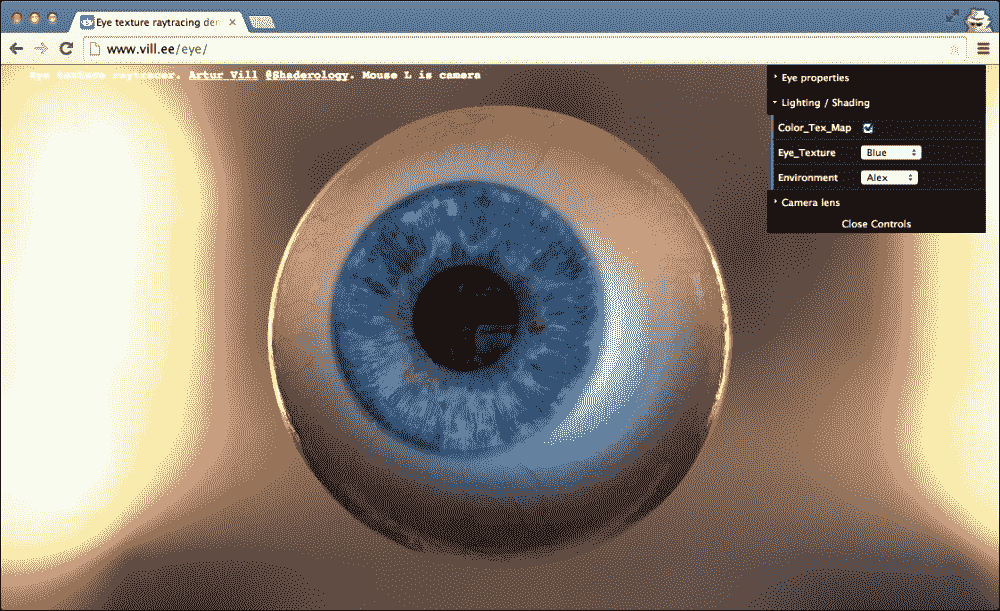
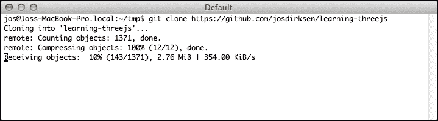
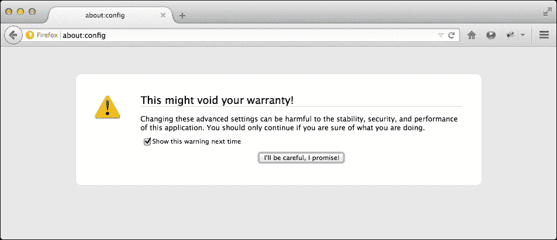
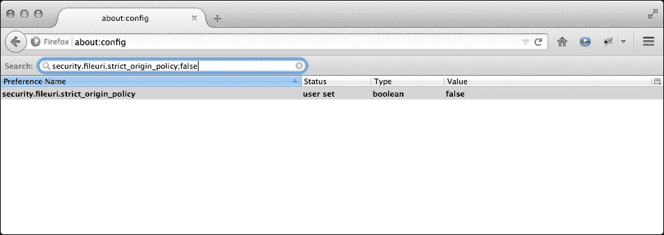
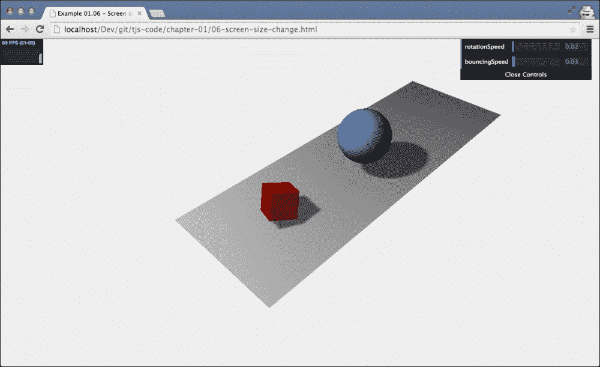

# 一、使用 Three.js 创建你的第一个三维场景

现代浏览器正在慢慢获得更强大的功能，可以直接从 JavaScript 访问。您可以使用新的 HTML5 标签轻松添加视频和音频，并通过使用 HTML5 画布创建交互式组件。与 HTML5 一起，现代浏览器也开始支持 WebGL。使用 WebGL，您可以直接利用显卡的处理资源，创建高性能的 2D 和 3D 计算机图形。直接从 JavaScript 编程 WebGL 来创建 3D 场景并制作动画是一个非常复杂且容易出错的过程。Three.js 是一个库，使这变得容易得多。下面的列表显示了 Three.js 容易做到的一些事情:

*   创建简单和复杂的三维几何图形
*   在三维场景中制作对象的动画并移动对象
*   将纹理和材质应用到对象
*   利用不同的光源照亮场景
*   从三维建模软件加载对象
*   向三维场景添加高级后处理效果
*   使用您自己的自定义着色器
*   创建点云

用几行 JavaScript，你可以创建任何东西，从简单的 3D 模型到逼真的实时场景，如下图所示(通过在浏览器中打开[http://www.vill.ee/eye/](http://www.vill.ee/eye/)亲自查看):



在本章中，我们将直接深入到三个. js 中，并创建几个示例，向您展示三个. js 是如何工作的，您可以使用它们来玩。我们还不会深入所有的技术细节；这是你将在接下来的章节中学习的东西。在本章中，我们将讨论以下几点:

*   使用三个. js 所需的工具
*   下载本书使用的源代码和示例
*   创建您的第一个 Three.js 场景
*   使用材质、灯光和动画改进第一个场景
*   引入几个用于统计和控制场景的辅助库

我们将从简单介绍 Three.js 开始这本书，然后快速进入第一个示例和代码示例。在开始之前，让我们快速了解一下最重要的浏览器及其对 WebGL 的支持。

在撰写本文时，WebGL 与以下桌面浏览器一起工作:

<colgroup><col style="text-align: left"> <col style="text-align: left"></colgroup> 
| 

浏览器

 | 

支持

 |
| --- | --- |
| Mozilla Firefox | 这个浏览器从 4.0 版本开始就支持 WebGL。 |
| 谷歌 Chrome | 此浏览器从版本 9 开始就支持 WebGL。 |
| 旅行队 | 安装在 Mac OS X 上的 Safari 版及更高版本的山狮、狮子或雪豹支持 WebGL。请确保您在 Safari 中启用了 WebGL。您可以通过转到**首选项** &#124; **高级**并在菜单栏中选择**显示开发菜单来实现。之后，转到**开发** &#124; **启用 WebGL** 。** |
| 歌剧 | 此浏览器从 12.00 版本开始支持 WebGL。您仍然需要通过打开**操作:配置**并设置 **WebGL** 和**的值启用硬件加速**至`1`来启用此功能。之后，重新启动浏览器。 |
| 微软公司出品的 web 浏览器 | Internet Explorer 在很长一段时间内是唯一不支持 WebGL 的主要玩家。从 IE11 开始，微软增加了 WebGL 支持。 |

基本上，除了旧版本的 IE 之外，Three.js 可以在任何现代浏览器上运行。因此，如果你想使用旧版本的 IE，你必须采取额外的步骤。对于 IE 10 及以上版本，有*view ebgl*插件，可以从[https://github.com/iewebgl/iewebgl](https://github.com/iewebgl/iewebgl)获得。这个插件安装在 IE 10 和更老的版本中，支持这些浏览器。

也可以在移动设备上运行 Three.js 对 WebGL 的支持和您将获得的性能会有所不同，但两者都在迅速提高:

<colgroup><col style="text-align: left"> <col style="text-align: left"></colgroup> 
| 

设备

 | 

支持

 |
| --- | --- |
| 机器人 | 安卓的原生浏览器不支持 WebGL，通常也缺乏对现代 HTML5 功能的支持。如果你想在安卓上使用 WebGL，可以使用最新的 Chrome、Firefox 或者 Opera 手机版。 |
| IOS | IOS 8 还支持 IOS 设备上的 WebGL。IOS Safari 第 8 版有很好的 WebGL 支持。 |
| Windows mobile | Windows mobile 从 8.1 版本开始支持 WebGL。 |

使用 WebGL，您可以创建在桌面和移动设备上运行良好的交互式 3D 可视化。

### 类型

在本书中，我们将主要关注由 Three.js 提供的基于 WebGL 的渲染器。然而，还有一个基于 CSS 3D 的渲染器，它提供了一个简单的 API 来创建基于 CSS 3D 的 3D 场景。使用基于 CSS 3D 的方法的一大优势是，几乎所有的移动和桌面浏览器都支持该标准，并且允许您在 3D 空间中呈现 HTML 元素。我们将在[第 7 章](07.html "Chapter 7. Particles, Sprites, and the Point Cloud")、*粒子、精灵和点云*中展示如何使用 CSS 3D 浏览器。

在这第一章中，你将直接创建你的第一个三维场景，并且能够在前面提到的任何浏览器中运行。我们还不会介绍太多复杂的 Three.js 特性，但是在本章的最后，您已经创建了 Three.js 场景，可以在下面的截图中看到:


对于第一个场景，您将学习三个. js 的基础知识，并创建第一个动画。在开始这个例子的工作之前，在接下来的几个小节中，我们将首先了解轻松使用 Three.js 所需的工具，以及如何下载本书中显示的例子。

# 使用 Three.js 的要求

Three.js 是一个 JavaScript 库，所以创建 Three.js WebGL 应用所需要的只是一个文本编辑器和一个支持渲染结果的浏览器。我想推荐两个 JavaScript 编辑器，这是我在过去几年里开始专门使用的:

*   **WebStorm** :这个来自 JetBrains 指南的编辑器对编辑 JavaScript 有很大的支持。它支持直接从编辑器完成代码、自动部署和 JavaScript 调试。除此之外，WebStorm 还有优秀的 GitHub(以及其他版本控制系统)支持。可以从[http://www.jetbrains.com/webstorm/](http://www.jetbrains.com/webstorm/)下载试用版。
*   **Notepad++** : Notepad++是一款通用编辑器，支持多种编程语言的代码高亮显示。它可以轻松布局和格式化 JavaScript。注意记事本++只适用于 Windows。可以从[http://notepad-plus-plus.org/](http://notepad-plus-plus.org/)下载记事本+。
*   **崇高文本编辑器**:崇高是一个很棒的编辑器，对编辑 JavaScript 有很好的支持。除此之外，它提供了很多非常有用的选择(比如多行选择)和编辑选项，一旦你习惯了，它们会提供一个非常好的 JavaScript 编辑环境。威震也可以免费测试并且可以从[http://www.sublimetext.com/](http://www.sublimetext.com/)下载。

即使您不使用这些编辑器中的任何一个，也有很多可用的编辑器，开源的和商业的，您可以使用它们来编辑 JavaScript 和创建您的 Three.js 项目。你可能想看的一个有趣的项目是。这是一个基于云的 JavaScript 编辑器，可以连接到 GitHub 帐户。这样，您可以直接访问本书中的所有源代码和示例，并对它们进行实验。

### 类型

除了这些基于文本的编辑器，您可以使用它们来编辑和实验这本书的源代码，Three.js 目前还提供了一个在线编辑器。

有了这个编辑器，你可以在[http://threejs.org/editor/](http://threejs.org/editor/)找到它，你可以使用图形化的方法创建三个. js 场景。

我提到大多数现代网络浏览器都支持 WebGL，可以用来运行三个. js 示例。我通常用 Chrome 运行我的代码。原因是，大多数情况下，Chrome 对 WebGL 的支持和性能最好，而且它有一个非常棒的 JavaScript 调试器。使用这个调试器，如下面的屏幕截图所示，您可以快速查明问题，例如，使用断点和控制台输出。这在下面的截图中得到了例证。在这本书里，我会给你关于调试器的用法和其他调试技巧的提示。


到此为止，先介绍一下 Three.js；让我们获取源代码，从第一个场景开始。

# 获取源代码

本书的所有代码都可以从 GitHub([https://github.com/](https://github.com/))访问。GitHub 是一个基于 Git 的在线存储库，您可以使用它来存储、访问和版本源代码。有几个方法可以让你自己获得来源:

*   克隆 Git 存储库
*   下载并提取归档文件

在接下来的两段中，我们将更详细地探讨这些选项。

## 使用 Git 克隆存储库

Git 是一个开源的分布式版本控制系统，我用它来创建和版本化这本书里的所有例子。为此，我使用了 GitHub，一个免费的在线 Git 存储库。你可以通过[https://github.com/josdirksen/learning-threejs](https://github.com/josdirksen/learning-threejs)浏览这个库。

要获得所有示例，您可以使用 `git`命令行工具克隆这个存储库。为此，您首先需要为您的操作系统下载一个 Git 客户端。对于大多数现代操作系统，客户端可以从[http://git-scm.com](http://git-scm.com)下载，或者你可以使用 GitHub 本身提供的客户端(对于 Mac 和 Windows)。安装 Git 后，你可以用这个来获得本书资源库的*克隆*。打开命令提示符，转到您想要下载源代码的目录。在该目录中，运行以下命令:

```js
# git clone https://github.com/josdirksen/learning-threejs

```

这将开始下载所有示例，如下图所示:



`learning-three.js`目录现在将包含本书中使用的所有例子。

## 下载并提取档案

如果你不想用 Git 直接从 GitHub 下载源码，你也可以下载一个存档。在浏览器中打开[https://github.com/josdirksen/learning-threejs](https://github.com/josdirksen/learning-threejs)，点击右侧**下载 ZIP** 按钮，如下图:


把它提取到你选择的目录中，你就会有所有可用的例子。

## 测试示例

现在你已经下载或克隆了源代码，让我们做一个快速检查，看看一切是否都在工作，让你熟悉目录结构。代码和示例按章节组织。查看示例有两种不同的方式。您可以直接在浏览器中打开提取或克隆的文件夹，查看并运行一个特定的示例，也可以安装一个本地 web 服务器。第一种方法适用于大多数基本示例，但是当我们开始加载外部资源时，例如模型或纹理图像，仅仅打开 HTML 文件是不够的。在这种情况下，我们需要一个本地 web 服务器来确保外部资源被正确加载。在下一节中，我们将解释几种不同的方法来设置一个简单的本地 web 服务器进行测试。如果您不能设置本地网络服务器，但使用 Chrome 或 Firefox，我们还提供了如何禁用某些安全功能的说明，以便您甚至可以在没有本地网络服务器的情况下进行测试。

根据您已经安装的内容，设置本地 web 服务器非常容易。在这里，我们列出了几个如何做到这一点的例子。有许多不同的方法可以做到这一点，这取决于您已经在系统上安装了什么。

### 基于 Python 的网络服务器应该可以在大多数 Unix/Mac 系统上运行

大多数 Unix/Linux/Mac 系统已经安装了 Python。在这些系统上，您可以非常轻松地启动本地 web 服务器:

```js
 > python -m SimpleHTTPServer
 Serving HTTP on 0.0.0.0 port 8000 ...

```

在您签出/下载源代码的目录中执行此操作。

### 基于 Npm 的网络服务器，如果你使用过 Node.js

如果您已经使用 Node.js 完成了一些工作，那么很有可能您已经安装了 npm。使用 npm，您有两个简单的选项来设置一个快速的本地 web 服务器进行测试。第一个选项使用`http-server`模块，如下所示:

```js
 > npm install -g http-server
 > http-server
Starting up http-server, serving ./ on port: 8080
Hit CTRL-C to stop the server

```

或者，您也可以使用`simple-http-server`选项，如下所示:

```js
> npm install -g simple-http-server
> nserver
simple-http-server Now Serving: /Users/jos/git/Physijs at http://localhost:8000/

```

然而，第二种方法的缺点是它不会自动显示目录列表，而第一种方法会。

### 便携版猫鼬，适用于 Mac 和/或 Windows

如果你还没有安装 Python 或 npm，有一个简单的、可移植的 web 服务器，名为 Mongoose，你可以使用。首先，从[https://code.google.com/p/mongoose/downloads/list](https://code.google.com/p/mongoose/downloads/list)下载特定平台的二进制文件。如果您使用的是 Windows，请将其复制到包含示例的目录中，然后双击可执行文件，启动一个为其启动目录服务的网络浏览器。

对于其他操作系统，您还必须将可执行文件复制到目标目录，但是您必须从命令行启动它，而不是双击可执行文件。在这两种情况下，本地网络服务器将在端口`8080`上启动。下面的截图概括了本段中的讨论:


只需点击一章，我们就可以显示和访问该章的所有示例。如果我在这本书里讨论一个例子，我会参考具体的名字和文件夹，这样你就可以直接测试和玩转代码了。

### 禁用火狐和 Chrome 中的安全异常

如果使用 Chrome 运行示例，有一种方法可以禁用一些安全设置，这样就可以使用 Chrome 查看示例而不需要 web 服务器。为此，您必须通过以下方式启动 Chrome:

*   对于 Windows，您可以调用以下内容:

    ```js
    chrome.exe --disable-web-security

    ```

*   在 Linux 上，执行以下操作:

    ```js
    google-chrome --disable-web-security

    ```

*   在苹果操作系统上，你可以这样启动 Chrome 来禁用设置:

    ```js
    open -a Google\ Chrome --args --disable-web-security

    ```

当您以这种方式启动 Chrome 时，您可以直接从本地文件系统访问所有示例。

对于火狐用户来说，我们需要采取几个不同的步骤。打开火狐，在网址栏中输入`about:config`。这就是你会看到的:



在这个屏幕上，点击**我会小心的，我保证！**按钮。这将向您展示所有可以用来微调火狐的可用属性。在该屏幕的搜索框中，键入`security.fileuri.strict_origin_policy`并将其值更改为`false`，就像我们在下面的截图中所做的那样:



此时，您也可以使用 Firefox 直接运行本书中提供的示例。

既然您已经安装了网络服务器，或者禁用了必要的安全设置，现在是时候开始创建我们的第一个 Three.js 场景了。

# 创建 HTML 骨架

我们需要做的第一件事是创建一个空框架页面，我们可以将其用作所有示例的基础，如下所示:

```js
<!DOCTYPE html>

<html>

  <head>
    <title>Example 01.01 - Basic skeleton</title>
    <script src="../libs/three.js"></script>
    <style>
      body{
        /* set margin to 0 and overflow to hidden, to use the complete page */

        margin: 0;
        overflow: hidden;
      }
    </style>
  </head>
  <body>

    <!-- Div which will hold the Output -->
    <div id="WebGL-output">
    </div>

    <!-- Javascript code that runs our Three.js examples -->
    <script>

      // once everything is loaded, we run our Three.js stuff.
      function init() {
        // here we'll put the Three.js stuff
      };
      window.onload = init;

    </script>
  </body>
</html>
```

### 类型

**下载示例代码**

您可以从您在[http://www.packtpub.com](http://www.packtpub.com)的账户下载您购买的所有 Packt Publishing 书籍的示例代码文件。如果您在其他地方购买了这本书，您可以访问[http://www.packtpub.com/support](http://www.packtpub.com/support)并注册，以便将文件直接通过电子邮件发送给您。

从清单中可以看到，框架是一个非常简单的 HTML 页面，只有几个元素。在`<head>`元素中，我们加载我们将用于示例的外部 JavaScript 库。对于所有的例子，我们至少需要加载 Three.js 库`three.js`。在`<head>`元素中，我们还添加了几行 CSS。当我们创建一个完整的三页场景时，这些样式元素移除了所有滚动条。在此页面的`<body>`元素中，您可以看到单个`<div>`元素。当我们编写我们的 Three.js 代码时，我们将将 Three.js 渲染器的输出指向该元素。在这个页面的底部，你已经可以看到一点 JavaScript。通过将`init`函数分配给`window.onload`属性，我们确保当 HTML 文档完成加载时调用该函数。在`init`函数中，我们将插入所有三个. js 特定的 JavaScript。

Three.js 有两个版本:

*   **Three.min.js** :这是你在互联网上部署 Three.js 站点时通常会用到的库。这是 Three.js 的缩小版，使用 **UglifyJS** 创建，是普通 Three.js 库的四分之一大小。本书使用的所有示例和代码均基于 2014 年 10 月发布的 Three.js **r69** 。
*   **Three.js** :这是正常的 Three.js 库。我们在示例中使用了这个库，因为当您可以阅读和理解 Three.js 源代码时，它使调试变得更加容易。

如果我们在浏览器中查看这个页面，结果不会很令人震惊。正如你所料，你看到的只是一张空纸。

在下一节中，您将学习如何添加第一对 3D 对象，并将其渲染到我们在 HTML 骨架中定义的`<div>`元素中。

# 渲染和查看三维对象

在这一步中，你将创建你的第一个场景，并添加几个对象和一个相机。我们的第一个示例将包含以下对象:

<colgroup><col style="text-align: left"> <col style="text-align: left"></colgroup> 
| 

目标

 | 

描述

 |
| --- | --- |
| `Plane` | 这是一个二维矩形，作为我们的地面区域。在本章的第二张截图中，这被渲染为场景中间的灰色矩形。 |
| `Cube` | 这是一个三维立方体，我们将用红色渲染。 |
| `Sphere` | 这是一个三维球体，我们将用蓝色渲染。 |
| `Camera` | 相机决定了你将在输出中看到什么。 |
| `Axes` | 这些是 *x* 、 *y* 和 *z* 轴。这是一个有用的调试工具，可以查看对象在三维空间中的渲染位置。 *x* 轴为红色， *y* 轴为绿色， *z* 轴为蓝色。 |

我将首先向您展示这在代码中的样子(带有注释的源代码可以在`chapter-01/02-first-scene.html`中找到)，然后我将解释发生了什么:

```js
function init() {
  var scene = new THREE.Scene();
  var camera = new THREE.PerspectiveCamera(45, window.innerWidth /window.innerHeight, 0.1, 1000);

  var renderer = new THREE.WebGLRenderer();
  renderer.setClearColorHex(0xEEEEEE);
  renderer.setSize(window.innerWidth, window.innerHeight);

  var axes = new THREE.AxisHelper(20);
  scene.add(axes);

  var planeGeometry = new THREE.PlaneGeometry(60, 20, 1, 1);
  var planeMaterial = new THREE.MeshBasicMaterial({color: 0xcccccc});
  var plane = new THREE.Mesh(planeGeometry, planeMaterial);

  plane.rotation.x = -0.5 * Math.PI;
  plane.position.x = 15
  plane.position.y = 0
  plane.position.z = 0

  scene.add(plane);

  var cubeGeometry = new THREE.BoxGeometry(4, 4, 4)
  var cubeMaterial = new THREE.MeshBasicMaterial({color: 0xff0000, wireframe: true});
  var cube = new THREE.Mesh(cubeGeometry, cubeMaterial);

  cube.position.x = -4;
  cube.position.y = 3;
  cube.position.z = 0;

  scene.add(cube);

  var sphereGeometry = new THREE.SphereGeometry(4, 20, 20);
  var sphereMaterial = new THREE.MeshBasicMaterial({color: 0x7777ff, wireframe: true});
  var sphere = new THREE.Mesh(sphereGeometry, sphereMaterial);

  sphere.position.x = 20;
  sphere.position.y = 4;
  sphere.position.z = 2;

  scene.add(sphere);

  camera.position.x = -30;
  camera.position.y = 40;
  camera.position.z = 30;
  camera.lookAt(scene.position);

  document.getElementById("WebGL-output")
    .appendChild(renderer.domElement);
    renderer.render(scene, camera);
};
window.onload = init;
```

如果我们在浏览器中打开这个例子，我们会看到类似于我们所针对的的东西(见本章开头的截图)，但它仍然有很长的路要走，如下所示:


在我们开始让它变得更漂亮之前，我将首先一步一步地向您介绍代码，以便您理解代码的作用:

```js
var scene = new THREE.Scene();
var camera = new THREE.PerspectiveCamera(45, window.innerWidth / window.innerHeight, 0.1, 1000);
var renderer = new THREE.WebGLRenderer();
renderer.setClearColorHex()
renderer.setClearColor(new THREE.Color(0xEEEEEE));
renderer.setSize(window.innerWidth, window.innerHeight);
```

在这个例子的顶部，我们定义了`scene`、`camera`和`renderer`。`scene`对象是一个容器，用于存储和跟踪我们想要渲染的所有对象以及我们想要使用的所有灯光。没有一个`THREE.Scene`对象，Three.js 不能渲染任何东西。关于`THREE.Scene`对象的更多信息可以在下一章中找到。我们想要渲染的球体和立方体将在后面的例子中添加到场景中。在第一个片段中，我们还创建了一个`camera`对象。`camera`对象定义了我们渲染场景时将看到的内容。在[第 2 章](02.html "Chapter 2. Basic Components That Make Up a Three.js Scene")、*组成 Three.js 场景的基本组件*中，您可以了解更多关于可以传递给`camera`对象的参数。接下来我们定义`renderer`。`renderer`对象负责根据`camera`对象的角度计算`scene` 对象在浏览器中的外观。在这个例子中，我们创建`WebGLRenderer`使用你的显卡来渲染场景。

### 类型

如果你浏览 Three.js 的源代码和文档(可以在[http://threejs.org/](http://threejs.org/)找到)，你会注意到除了基于 WebGL 的渲染器之外，还有不同的渲染器可用。有一个基于画布的渲染器，甚至还有一个基于 SVG 的渲染器。即使它们可以工作并渲染简单的场景，我也不建议使用它们。它们非常占用 CPU，并且缺乏良好的材质支持和阴影等功能。

这里，我们使用`setClearColor`功能将`renderer`的背景颜色设置为几乎白色(`new THREE.Color(0XEEEEEE)`)，并使用`setSize`功能告诉`renderer`场景需要渲染多大。

到目前为止，我们已经有了一个基本的空场景，一个渲染器和一个相机。然而，还没有什么可以渲染。以下代码添加了辅助轴和平面:

```js
  var axes = new THREE.AxisHelper( 20 );
  scene.add(axes);

  var planeGeometry = new THREE.PlaneGeometry(60,20);
  var planeMaterial = new THREE.MeshBasicMaterial({color: 0xcccccc});
  var plane = new THREE.Mesh(planeGeometry,planeMaterial);

  plane.rotation.x=-0.5*Math.PI;
  plane.position.x=15
  plane.position.y=0
  plane.position.z=0
  scene.add(plane);
```

如您所见，我们创建一个`axes`对象，并使用 `scene.add`功能将这些轴添加到我们的场景中。接下来，我们创建平面。这分两步完成。首先，我们使用新的`THREE.PlaneGeometry(60,20)`代码定义飞机的外观。在这种情况下，它的宽度为`60`，高度为`20`。我们还需要告诉 Three.js 这个平面是什么样子的(例如，它的颜色和透明度)。在 Three.js 中，我们通过创建一个材质对象来实现这一点。对于第一个例子，我们将创建一个基本材质(`THREE.MeshBasicMaterial`)，颜色为`0xcccccc`。接下来，我们将这两个组合成一个名为`plane`的`Mesh`对象。在我们将`plane`添加到场景之前，我们需要将其放在正确的位置；为此，我们首先将它绕 x 轴旋转 90 度，接下来，我们使用位置属性定义它在场景中的位置。如果你已经对这个细节感兴趣，可以看看[第二章](02.html "Chapter 2. Basic Components That Make Up a Three.js Scene")、*组成 Three.js 场景的基本组件*的代码文件夹中的`06-mesh-properties.html`示例，它展示并解释了旋转和定位。然后我们需要做的是将`plane`添加到`scene`，就像我们对`axes`所做的那样。

以相同的方式添加`cube`和`sphere`对象，但是将`wireframe`属性设置为`true`，这使得告诉 Three.js 渲染线框而不是实体对象。现在，让我们进入本例的最后一部分:

```js
  camera.position.x = -30;
  camera.position.y = 40;
  camera.position.z = 30;
  camera.lookAt(scene.position);

  document.getElementById("WebGL-output")
    .appendChild(renderer.domElement);
    renderer.render(scene, camera);
```

此时，我们想要渲染的所有元素都被添加到场景的正确位置。我已经提到过摄像机定义了要渲染的内容。在这段代码中，我们使用`x`、`y`和`z`位置属性将摄像机定位在场景上方。为了确保摄像机正在观察我们的对象，我们使用`lookAt`功能将其指向场景的中心，默认情况下，场景位于位置(0，0，0)。剩下要做的就是将渲染器的输出附加到我们的 HTML 框架的`<div>`元素中。我们使用标准的 JavaScript 选择正确的输出元素，并用`appendChild`函数将其附加到我们的`div`元素中。最后，我们告诉`renderer`使用提供的`camera`对象渲染`scene`。

在接下来的几个部分中，我们将通过添加灯光、阴影、更多材质甚至动画来使这个场景更加漂亮。

# 添加材质、灯光和阴影

在 Three.js 中添加新的材质和灯光非常简单，并且与我们在上一节中解释的的方式基本相同。我们首先给场景添加一个光源(完整的光源请看`03-materials-light.html`，如下所示:

```js
  var spotLight = new THREE.SpotLight( 0xffffff );
  spotLight.position.set( -40, 60, -10 );
  scene.add( spotLight );
```

`THREE.SpotLight`从它的位置(`spotLight.position.set( -40, 60, -10 )`)照亮我们的场景。然而，如果我们这次渲染场景，你将不会看到与前一个场景有任何不同。原因是不同的材质对光的反应不同。我们在前面的例子中使用的基本材质(`THREE.MeshBasicMaterial`)与场景中的光源没有任何关系。他们只是用指定的颜色渲染对象。因此，我们必须将`plane`、`sphere`和`cube`的材质更改为以下内容:

```js
var planeGeometry = new THREE.PlaneGeometry(60,20);
var planeMaterial = new THREE.MeshLambertMaterial({color: 0xffffff});
var plane = new THREE.Mesh(planeGeometry, planeMaterial);
...
var cubeGeometry = new THREE.BoxGeometry(4,4,4);
var cubeMaterial = new THREE.MeshLambertMaterial({color: 0xff0000});
var cube = new THREE.Mesh(cubeGeometry, cubeMaterial);
...
var sphereGeometry = new THREE.SphereGeometry(4,20,20);
var sphereMaterial = new THREE.MeshLambertMaterial({color: 0x7777ff});
var sphere = new THREE.Mesh(sphereGeometry, sphereMaterial);
```

在这段代码中，我们将物体的材质改为`MeshLambertMaterial`。这个材质和`MeshPhongMaterial`是 Three.js 提供的渲染时考虑光源的材质。

然而，下面截图中显示的结果仍然不是我们想要的:


我们正在到达那里，立方体和球体看起来好多了。然而，仍然缺少的是阴影。

渲染阴影需要很大的计算能力，因此在 Three.js 中默认禁用阴影。不过，启用阴影非常容易。对于阴影，我们必须在几个地方更改源，如下所示:

```js
renderer.setClearColor(new THREE.Color(0xEEEEEE, 1.0));
renderer.setSize(window.innerWidth, window.innerHeight);
renderer.shadowMapEnabled = true;
```

我们需要做的第一个改变是告诉`renderer`我们想要阴影。您可以通过将`shadowMapEnabled`属性设置为`true`来实现。如果你看看这个变化的结果，你不会注意到任何不同。这是因为我们需要明确定义哪些对象投射阴影，哪些对象接收阴影。在我们的例子中，我们希望球体和立方体在地平面上投射阴影。您可以通过设置这些对象的相应属性来实现这一点:

```js
plane.receiveShadow = true;
...
cube.castShadow = true;
...
sphere.castShadow = true;
```

现在，只需要再做一件事来获得阴影。我们需要定义场景中哪些光源会产生阴影。不是所有的灯光都能投射阴影，下一章你会了解到更多，但是我们在这个例子中使用的`THREE.SpotLight`可以。我们只需要设置正确的属性，如下一行代码所示，阴影最终会被渲染出来:

```js
spotLight.castShadow = true;
```

有了这个，我们从我们的光源得到一个完整的阴影场景，如下所示:


我们将添加到第一个场景的最后一个特征是一些简单的动画。在[第 9 章](09.html "Chapter 9. Animations and Moving the Camera")、*动画和移动相机*中，您将了解到更多高级动画选项。

# 用动画扩展你的第一个场景

如果我们想要对场景进行动画制作，首先需要做的就是想办法以特定的间隔重新渲染场景。在 HTML5 和相关的 JavaScript APIs 出现之前，这样做的方法是使用`setInterval(function,interval)`函数。借助`setInterval`，我们可以指定一个函数，例如，每 100 毫秒调用一次。这个功能的问题是没有考虑到浏览器中正在发生的事情。如果您正在浏览另一个选项卡，这个函数仍然会每隔几毫秒触发一次。除此之外，`setInterval`与屏幕重绘并不同步。这会导致更高的 CPU 使用率和糟糕的性能。

## 引入 requestAnimationFrame

幸运的是，现代浏览器有一个带“T0”功能的解决方案。使用`requestAnimationFrame`，您可以指定一个函数，该函数以浏览器定义的时间间隔调用。您可以在提供的功能中绘制任何需要绘制的图形，浏览器将确保尽可能流畅高效地绘制。使用这个非常简单(完整的源代码可以在`04-materials-light-animation.html`文件中找到)，您只需创建一个处理渲染的函数:

```js
function renderScene() {
  requestAnimationFrame(renderScene);
  renderer.render(scene, camera);
}
```

在这个`renderScene`函数中，我们再次调用`requestAnimationFrame`，以保持动画继续进行。我们在代码中唯一需要改变的是，在我们创建了完整的场景后，我们不再调用`renderer.render`，而是调用一次`renderScene`函数来启动动画:

```js
...
document.getElementById("WebGL-output")
  .appendChild(renderer.domElement);
renderScene();
```

如果您运行这个，您将不会看到与前面的例子相比有任何变化，因为我们还没有制作任何动画。不过，在我们添加动画之前，我想介绍一个小的助手库，它为我们提供了动画运行时的帧速率信息。这个库来自与 Three.js 相同的作者，它呈现了一个小图，向我们展示了这个动画每秒的帧数。

要添加这些统计数据，我们首先需要将库包含在 HTML 的`<head>`元素中，如下所示:

```js
<script src="../libs/stats.js"></script>
```

我们添加一个`<div>`元素，它将用作统计图表的输出，如下所示:

```js
<div id="Stats-output"></div>
```

剩下唯一要做的就是初始化统计数据，并将其添加到这个`<div>`元素中，如下所示:

```js
function initStats() {
  var stats = new Stats();
  stats.setMode(0);
  stats.domElement.style.position = 'absolute';
  stats.domElement.style.left = '0px';
  stats.domElement.style.top = '0px';
  document.getElementById("Stats-output")
    .appendChild( stats.domElement );
     return stats;
}
```

该功能初始化统计。有趣的是`setMode`功能。如果设置为`0`，我们将测量每秒帧数(fps)，如果设置为`1`，我们可以测量渲染时间。对于这个例子，我们对 fps 感兴趣，所以`0`是。在我们的`init()`函数的开始，我们将调用这个函数，并且我们已经启用了`stats`，如下所示:

```js
function init(){

  var stats = initStats();
  ...
}
```

剩下唯一要做的就是告诉`stats`对象我们何时进入新的渲染周期。我们通过在我们的`renderScene`函数中添加对`stats.update`函数的调用来实现这一点，如下所示。

```js
function renderScene() {
  stats.update();
  ...
  requestAnimationFrame(renderScene);
  renderer.render(scene, camera);
}
```

如果您运行添加了这些内容的代码，您将在左上角看到统计信息，如下图所示:


## 制作立方体动画

有了`requestAnimationFrame`和配置好的统计数据，我们就有地方放我们的动画代码了。在这个部分，我们将扩展`renderScene`功能，代码将围绕所有轴旋转我们的红色立方体。让我们从展示代码开始:

```js
function renderScene() {
  ...
  cube.rotation.x += 0.02;
  cube.rotation.y += 0.02;
  cube.rotation.z += 0.02;
  ...
  requestAnimationFrame(renderScene);
  renderer.render(scene, camera);
}
```

看起来很简单，对吧？我们所做的是，每次调用`renderScene`函数时，我们将每个轴的`rotation`属性增加 0.02，这显示为一个围绕其所有轴平滑旋转的立方体。弹起蓝色的球并不难。

## 拍球

为了反弹球，我们再次向我们的`renderScene`函数添加几行代码，如下所示:

```js
  var step=0;
  function renderScene() {
    ...
    step+=0.04;
    sphere.position.x = 20+( 10*(Math.cos(step)));
    sphere.position.y = 2 +( 10*Math.abs(Math.sin(step)));
    ...
    requestAnimationFrame(renderScene);
    renderer.render(scene, camera);
  }
```

有了立方体，我们改变了`rotation`属性；对于球体，我们将在场景中更改其`position`属性。我们希望球体从场景中的一个点反弹到另一个点，并有一条平滑的曲线。如下图所示:


为此，我们需要改变其在 *x* 轴上的位置以及其在 *y* 轴上的位置。`Math.cos`和`Math.sin`功能帮助我们使用步长变量创建平滑的轨迹。我不会在这里详细讨论它是如何工作的。现在，你需要知道的是`step+=0.04`定义了弹跳球的速度。在[第 8 章](08.html "Chapter 8. Creating and Loading Advanced Meshes and Geometries")、*创建和加载高级网格和几何图形*中，我们将更详细地了解这些功能如何用于动画，我将解释一切。这是球在弹跳过程中的样子:


在结束这一章之前，我想在我们的基本场景中再添加一个元素。当处理 3D 场景、动画、颜色和类似的属性时，通常需要一些实验来获得正确的颜色或速度。如果你能有一个简单的图形用户界面，让你可以随时改变这些属性，那将会非常容易。幸运的是，有！

# 使用 dat。图形用户界面使实验更容易

谷歌的几名员工创建了一个名为 **dat 的库。图形用户界面**(您可以在[http://code.google.com/p/dat-gui/](http://code.google.com/p/dat-gui/)找到在线文档)，它允许您非常容易地创建一个简单的用户界面组件，可以更改代码中的变量。在本章的最后一部分中，我们将使用 dat。向我们的示例中添加一个用户界面，允许我们更改以下内容:

*   控制弹跳球的速度
*   控制立方体的旋转

就像我们必须做的统计一样，我们首先将这个库添加到我们的 HTML 页面的`<head>`元素中，如下所示:

```js
<script src="../libs/dat.gui.js"></script>
```

接下来我们需要配置的是一个 JavaScript 对象，它将保存我们想要使用 dat.GUI 更改的属性。

```js
var controls = new function() {
  this.rotationSpeed = 0.02;
  this.bouncingSpeed = 0.03;
}
```

在这个 JavaScript 对象中，我们定义了两个属性——`this.rotationSpeed`和`this.bouncingSpeed`——以及它们的默认值。接下来，我们将这个对象传递给一个新的 dat。对象并定义这两个属性的范围，如下所示:

```js
var gui = new dat.GUI();
gui.add(controls, 'rotationSpeed', 0, 0.5);
gui.add(controls, 'bouncingSpeed', 0, 0.5);
```

`rotationSpeed`和`bouncingSpeed`属性都设置在`0`到`0.5`的范围内。我们现在需要做的就是确保在我们的`renderScene`循环中，我们直接引用这两个属性，这样当我们通过 dat 进行更改时。GUI 用户界面，它会立即影响我们对象的旋转和弹跳速度，如下所示:

```js
function renderScene() {
  ...
  cube.rotation.x += controls.rotationSpeed;
  cube.rotation.y += controls.rotationSpeed;
  cube.rotation.z += controls.rotationSpeed;
  step += controls.bouncingSpeed;
  sphere.position.x = 20 +(10 * (Math.cos(step)));
  sphere.position.y = 2 +(10 * Math.abs(Math.sin(step)));
  ...
}
```

现在，当您运行这个示例(`05-control-gui.html`)时，您将看到一个简单的用户界面，您可以使用它来控制弹跳和旋转速度。这里显示了弹跳球和旋转立方体的截图:



如果你看过浏览器中的例子，你可能会注意到，当你改变浏览器的大小时，场景不会自动缩放。在下一节中，我们将把它作为本章的最后一个功能。

# 当浏览器大小改变时，自动调整输出大小

当浏览器调整大小时改变相机可以非常简单地完成。我们需要做的第一件事是像这样注册一个事件监听器:

```js
window.addEventListener('resize', onResize, false);
```

现在，无论何时调整浏览器窗口的大小，都会调用`onResize`函数，我们将在下面指定该函数。在这个`onResize`功能中，我们需要更新相机和渲染器，如下所示:

```js
function onResize() {
  camera.aspect = window.innerWidth / window.innerHeight;
  camera.updateProjectionMatrix();
  renderer.setSize(window.innerWidth, window.innerHeight);
}
```

对于相机，我们需要更新`aspect`属性，它保存屏幕的长宽比，对于`renderer`，我们需要改变它的大小。最后一步是将变量`camera`、`renderer`和`scene`的定义移到`init()`函数之外，这样我们就可以从不同的函数(如`onResize`函数)访问它们，如下所示:

```js
var camera;
var scene;
var renderer;

function init() {
  ...
  scene = new THREE.Scene();
  camera = new THREE.PerspectiveCamera(45, window.innerWidth / window.innerHeight, 0.1, 1000);
  renderer = new THREE.WebGLRenderer();
  ...
}
```

要看到这个效果，打开`06-screen-size-change.html`示例，调整浏览器窗口的大小。

# 总结

第一章就到这里。在本章中，我们向您展示了如何设置您的开发环境，如何获取代码，以及如何开始使用本书提供的示例。您进一步了解到，要使用 Three.js 渲染场景，首先必须创建一个`THREE.Scene`对象，添加一个摄像机、一个光源和您想要渲染的对象。我们还向您展示了如何通过添加阴影和动画来扩展这个基本场景。最后，我们添加了几个助手库。我们用了 dat。GUI，可以让你快速创建控制用户界面，我们增加了`stats.js`，提供了对场景渲染帧率的反馈。

在下一章中，我们将扩展我们在这里创建的示例。您将了解到更多您可以在三个. js 中使用的最重要的构建块