# 三、使用三个不同的光源

在第一章中，您学习了 Three.js 的基础知识，在上一章中，我们更深入地研究了场景中最重要的部分:几何图形、网格和相机。你可能已经注意到，我们跳过了那一章中的灯光，尽管它们构成了每一个“三个一”场景的重要部分。没有灯光，我们将看不到任何渲染。由于 Three.js 包含大量的灯，每个灯都有特定的用途，我们将使用这一整章来解释灯的各种细节，并为下一章的材质使用做准备。

### 注

WebGL 本身并没有对照明的固有支持。如果没有 Three.js，您将不得不编写特定的 WebGL 着色器程序来模拟这些类型的灯光。在[https://developer . Mozilla . org/en-US/docs/Web/WebGL/Lighting _ in _ WebGL](https://developer.mozilla.org/en-US/docs/Web/WebGL/Lighting_in_WebGL)可以找到一个很好的从头开始在 WebGL 中模拟灯光的介绍。

在本章中，您将了解以下主题:

*   三合一中可用的光源
*   当应该使用特定的光源时
*   如何调整和配置所有这些光源的行为
*   另外，我们还将快速了解如何创建镜头眩光

和所有章节一样，我们有很多例子可以用来实验灯光的行为。本章中显示的示例可以在所提供来源的`chapter-03`文件夹中找到。

# 三合一提供不同种类的照明

有许多不同的灯可以在三个. js 中使用，它们都有特定的行为和用法。在本章中，我们将讨论以下一组灯光:

<colgroup><col style="text-align: left"> <col style="text-align: left"></colgroup> 
| 

名字

 | 

描述

 |
| --- | --- |
| `THREE.AmbientLight` | 这是一种基本光，其颜色被添加到场景中对象的当前颜色中。 |
| `THREE.PointLight` | 这是空间中的一个点，光从这里向各个方向传播。这个光不能用来制造阴影。 |
| `THREE.SpotLight` | 该光源具有类似台灯、天花板上的点或手电筒的锥形效果。这个光可以投射阴影。 |
| `THREE.DirectionalLight` | 这也叫无限光。该光线的光线可以被视为平行的，例如来自太阳的光线。这种光也可以用来制造阴影。 |
| `THREE.HemisphereLight` | 这是一种特殊光，可以通过模拟反射面和微弱的光照天空来创造更自然的户外照明。这个灯也不提供任何与阴影相关的功能。 |
| `THREE.AreaLight` | 有了这个光源，你可以指定一个发光的区域，而不是空间中的单个点。`THREE.AreaLight`并不投下任何阴影。 |
| `THREE.LensFlare` | 这不是光源，而是有了`THREE.LensFlare`，可以给场景中的灯光添加镜头光斑效果。 |

本章是分为两个主要部分。首先，我们来看看基本灯:`THREE.AmbientLight`、`THREE.PointLight`、`THREE.SpotLight`和`THREE.DirectionalLight`。所有这些灯光扩展了提供共享功能的基础`THREE.Light`对象。这里提到的灯光是简单的灯光，只需要很少的设置，可以用来重现大多数所需的照明场景。在第二部分，我们将看几个特殊用途的灯光和效果:`THREE.HemisphereLight`、`THREE.AreaLight`和`THREE.LensFlare`。你可能只在非常特殊的情况下需要这些灯。

# 基本灯

我们先从最基本的灯开始:`THREE.AmbientLight`。

## 三。氛围灯

当您创建`THREE.AmbientLight`时，颜色被全局应用。这个光没有具体的来源方向，`THREE.AmbientLight`对阴影没有任何贡献。您通常不会将`THREE.AmbientLight`用作场景中的单一光源，因为它会将所有对象着色为相同的颜色，而不管其形状如何。您可以将其与其他光源一起使用，例如`THREE.SpotLight`或`THREE.DirectionalLight`来柔化阴影或为场景添加一些附加颜色。理解这一点最简单的方法是查看`chapter-03`文件夹中的`01-ambient-light.html`示例。通过这个例子，你得到了一个简单的用户界面，可以用来修改这个场景中可用的`THREE.AmbientLight`。请注意，在这个场景中，我们还有`THREE.SpotLight`，它增加了额外的照明并提供阴影。

在下面的截图中，你可以看到我们使用了第一章的场景，并对`THREE.AmbientLight`的颜色进行了配置。在本例中，您也可以关闭聚光灯，看看`THREE.AmbientLight`本身的效果是什么:


我们在这个场景中使用的标准颜色是`#0c0c0c`。这是一种颜色的十六进制表示。前两个值指定颜色的红色部分，后两个值指定绿色部分，最后两个值指定蓝色部分。

在这个例子中，我们使用了一种非常暗的浅灰色，主要用于平滑网格投射到地平面的硬阴影。你可以用右上角的菜单把颜色改成更突出的黄色/橙色(`#523318`)，然后物体上面就会有太阳一样的辉光。这显示在下面的截图中:

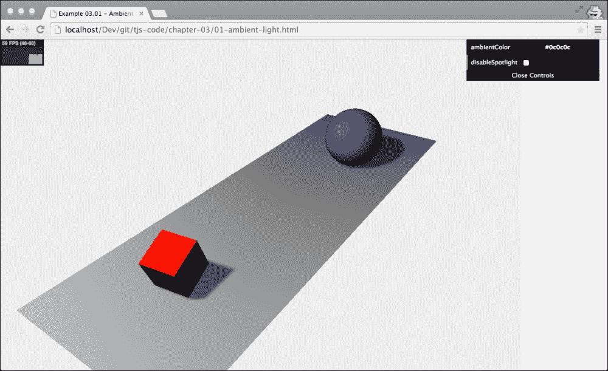

如上图所示，黄色/橙色应用于所有对象，并在整个场景上投射绿色光晕。在使用这种灯时，你应该记住的是你应该非常保守地使用你指定的颜色。如果你指定的颜色太亮，你会很快得到一个完全过饱和的图像。

现在我们已经看到了它的功能，让我们看看您如何创建和使用`THREE.AmbientLight`。接下来的几行代码向您展示了如何创建`THREE.AmbientLight`以及如何将其连接到图形用户界面控制菜单，我们将在[第 11 章](11.html "Chapter 11. Custom Shaders and Render Postprocessing")、*自定义着色器和渲染后期处理*中介绍:

```js
var ambiColor = "#0c0c0c";
var ambientLight = new THREE.AmbientLight(ambiColor);
scene.add(ambientLight);
...

var controls = new function() {
  this.ambientColor = ambiColor  ;
}

var gui = new dat.GUI();
gui.addColor(controls, 'ambientColor').onChange(function(e) {
  ambientLight.color = new THREE.Color(e);
});
```

创建`THREE.AmbientLight`非常简单，只需要几步。`THREE.AmbientLight`没有位置，是全局应用的，所以我们只需要指定颜色(十六进制)`new THREE.AmbientLight(ambiColor)`，将这个灯光添加到场景中，`scene.add(ambientLight)`。在示例中，我们将`THREE.AmbientLight`的颜色绑定到控制菜单。为此，您可以使用我们在前两章中使用的相同类型的配置。唯一的变化是，我们没有使用`gui.add(...)`功能，而是使用了`gui.addColor(...)`功能。这在控制菜单中创建了一个选项，我们可以用它直接改变传入变量的颜色。在代码中，可以看到我们使用了 dat 的`onChange`特性。GUI: `gui.addColor(...).onChange(function(e){...})`。有了这个函数，我们告诉`dat.GUI`每次颜色变化时都要调用传入的函数。在这种特定情况下，我们将`THREE.AmbientLight`的颜色设置为新值。

### 使用三。彩色物体

在我们进入下一个灯光之前，这里有一个关于使用`THREE.Color`对象的快速注释。在 Three.js 中，当您构造一个对象时，您可以(通常)将颜色指定为十六进制字符串(`"#0c0c0c"`)或十六进制值(`0x0c0c0c`)，这是首选的方式，或者通过以 0 到 1 的比例指定各个 RGB 值(`0.3`、`0.5`、`0.6`)。如果你想在构建后改变颜色，你必须创建一个新的`THREE.Color`对象或者修改当前`THREE.Color`对象的内部属性。`THREE.Color`对象带有以下功能来设置和获取当前对象的信息:

<colgroup><col style="text-align: left"> <col style="text-align: left"></colgroup> 
| 

名字

 | 

描述

 |
| --- | --- |
| `set(value)` | 将此颜色的值设置为提供的十六进制值。该十六进制值可以是字符串、数字或现有的`THREE.Color`实例。 |
| `setHex(value)` | 将该颜色的值设置为提供的十六进制数值。 |
| `setRGB(r,g,b)` | 根据提供的 RGB 值设置该颜色的值。这些值的范围从 0 到 1。 |
| `setHSL(h,s,l)` | 在提供的 HSL 值上设置该颜色的值。这些值的范围从 0 到 1。关于 HSL 如何配置颜色的详细说明可以在[http://en.wikibooks.org/wiki/Color_Models:_RGB,_HSV,_HSL](http://en.wikibooks.org/wiki/Color_Models:_RGB,_HSV,_HSL)找到。 |
| `setStyle(style)` | 根据 CSS 指定颜色的方式设置该颜色的值。例如，你可以使用`"rgb(255,0,0)"`、`"#ff0000"`、`"#f00"`，甚至`"red"`。 |
| `copy(color)` | 将`THREE.Color`实例中的颜色值复制到该颜色。 |
| `copyGammaToLinear(color)` | 这是内部使用最多的。根据提供的`THREE.Color`实例设置该对象的颜色。颜色首先从伽马颜色空间转换到线性颜色空间。伽马颜色空间也使用 RGB 值，但是使用指数标度而不是线性标度。 |
| `copyLinearToGamma(color)` | 这是内部使用最多的。根据提供的`THREE.Color`实例设置该对象的颜色。颜色首先从线性颜色空间转换到伽马颜色空间。 |
| `convertGammaToLinear()` | 这会将当前颜色从伽玛颜色空间转换为线性颜色空间。 |
| `convertLinearToGamma()` | 这会将当前颜色从线性颜色空间转换为伽玛颜色空间。 |
| `getHex()` | 以数字形式返回该颜色对象的值:`435241`。 |
| `getHexString()` | 以十六进制字符串形式返回该颜色对象的值: `"0c0c0c"`。 |
| `getStyle()` | 从该颜色对象中返回值作为基于 CSS 的值:`"rgb(112,0,0)"`。 |
| `getHSL(optionalTarget)` | 从这个颜色对象中返回值作为一个 HSL 值。如果提供了`optionalTarget`对象，Three.js 会在该对象上设置`h`、`s`和`l`属性。 |
| `offsetHSL(h, s, l)` | 将提供给当前颜色的`h`、`s`和`l`值的`h`、`s`和`l`值相加。 |
| `add(color)` | 此将提供给当前颜色的颜色的`r`、`g`和`b`值相加。 |
| `addColors(color1, color2)` | 这主要是内部使用。添加`color1`和`color2`，将当前颜色的值设置到结果中。 |
| `addScalar(s)` | 这是内部使用最多的。为当前颜色的 RGB 分量添加一个值。请记住，内部值使用从 0 到 1 的范围。 |
| `multiply(color)` | 这大多是内部使用。将当前的 RGB 值乘以`THREE.Color`开始的 RGB 值。 |
| `multiplyScalar(s)` | 这是内部使用最多的。这会将当前的 RGB 值乘以所提供的值。请记住，内部值使用从 0 到 1 的范围。 |
| `lerp(color, alpha)` | 这是内部使用最多的。这会找到此对象的颜色和提供的颜色之间的颜色。alpha 属性定义了当前颜色和所提供的颜色之间的距离。 |
| `equals(color)` | 如果提供的`THREE.Color`实例的 RGB 值与当前颜色的值匹配，则返回`true`。 |
| `fromArray(array)` | 这具有与`setRGB`相同的功能，但是现在 RGB 值可以以数字数组的形式提供。 |
| `toArray` | 这会返回一个包含三个元素的数组，`[r, g, b]`。 |
| `clone()` | 这将创建该颜色的精确副本。 |

在此表中，您可以看到有许多方法可以更改当前颜色。很多这些功能都是由 Three.js 在内部使用的，但是它们也提供了一个很好的方式来轻松改变灯光和材质的颜色。

在我们继续讨论`THREE.PointLight`、`THREE.SpotLight`和`THREE.DirectionalLight`之前，让我们首先突出它们的主要区别，即它们是如何发光的。下图显示了这三个光源如何发光:

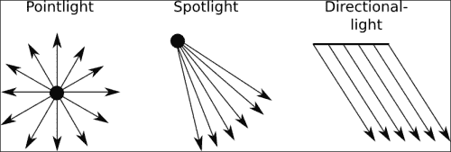

从该图中可以看到以下内容:

*   `THREE.PointLight`从特定点向各个方向发光
*   `THREE.SpotLight`从一个特定的点以锥形发射光
*   `THREE.DirectionalLight`不是从单个点发出光，而是从 2D 平面发出光线，光线相互平行

在接下来的几段中，我们将更详细地研究这些光源；先说`THREE.Pointlight`。

## 三。点光源

三合一的`THREE.PointLight`是一个光源，从一个点向四面八方发光。点光源的一个很好的例子是在夜空中发射的信号弹。就像有所有的灯一样，我们有一个具体的例子你可以用来玩`THREE.PointLight`。如果你看一下`chapter-03`文件夹中的`02-point-light.html`，你可以找到一个例子，一个`THREE.PointLight`的光在一个简单的三维场景中移动。下面的截图显示了一个例子:

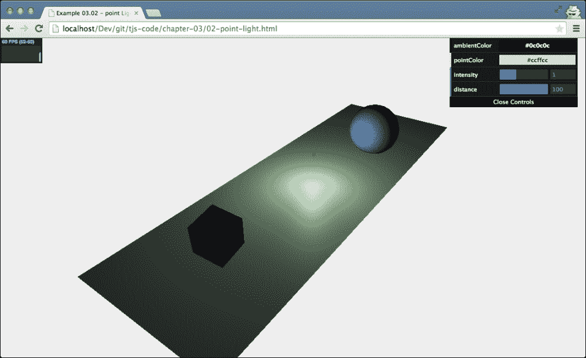

在本例中，`THREE.PointLight`在我们已经在[第 1 章](01.html "Chapter 1. Creating Your First 3D Scene with Three.js")、*中看到的场景中移动，使用 Three.js* 创建您的第一个 3D 场景。为了更清楚`THREE.PointLight`在哪里，我们沿着相同的路径移动一个小的橙色球体。当这种光四处移动时，你会看到红色立方体和蓝色球体在不同的侧面被这种光照亮。

### 类型

你可能注意到在这个例子中我们没有看到任何阴影。在 Three.js 中，`THREE.PointLight`不投射阴影。由于`THREE.PointLight`四面发光，计算阴影对于 GPU 来说是一个非常繁重的过程。

有了我们之前看到的`THREE.AmbientLight`，你所要做的就是提供`THREE.Color`并给场景增加光线。然而，对于`THREE.PointLight`，我们有几个额外的配置选项:

<colgroup><col style="text-align: left"> <col style="text-align: left"></colgroup> 
| 

财产

 | 

描述

 |
| --- | --- |
| `color` | 这是光的颜色。 |
| `distance` | 这是光线照射的距离。默认值为`0`，这意味着光线的强度不会根据距离而降低。 |
| `intensity` | 这是光线照射的强度。这默认为`1`。 |
| `position` | 这是灯在`THREE.Scene`的位置。 |
| `visible` | 如果这个属性设置为`true`(默认)，这个灯打开，如果设置为`false`，这个灯关闭。 |

在接下来的几个例子和截图中，我们将解释这些属性。首先，我们来看看如何创建`THREE.PointLight`:

```js
var pointColor = "#ccffcc";
var pointLight = new THREE.PointLight(pointColor);
pointLight.position.set(10,10,10);
scene.add(pointLight);
```

我们创建一个具有特定`color`属性的灯(这里我们使用一个字符串值；我们也可以使用一个数字或`THREE.Color`，设置其`position`属性，并将其添加到场景中。

我们要看的第一个属性是`intensity`。使用此属性，您可以设置灯光的亮度。如果将此设置为`0`，则不会看到任何内容；设置为`1`，你就有了默认的亮度；设置为`2`，你会得到一个比它亮一倍的光；等等。例如，在下面的截图中，我们将光的强度设置为`2.4`:

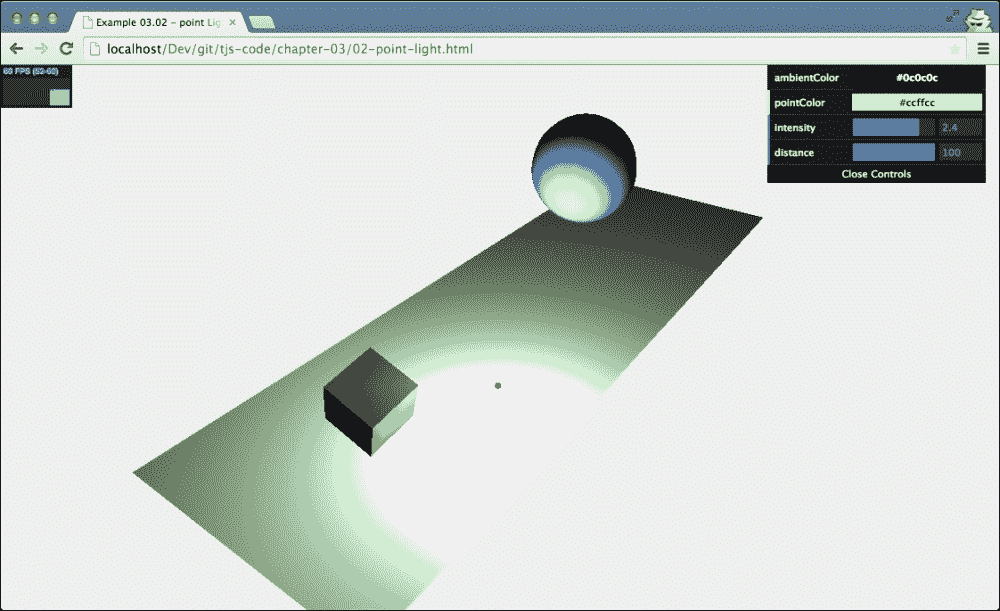

要改变光的强度，只需使用`THREE.PointLight`的强度属性，如下所示:

```js
pointLight.intensity = 2.4;
```

或者你可以用 dat。图形用户界面侦听器，如下所示:

```js
var controls = new function() {
  this.intensity = 1;
}
var gui = new dat.GUI();
  gui.add(controls, 'intensity', 0, 3).onChange(function (e) {
    pointLight.intensity = e;
  });
```

`PointLight`的`distance`属性是一个非常有趣的属性，最好用一个例子来解释。在下面的截图中，你又看到了同样的场景，但是这次用了非常高的`intensity`属性(我们有非常亮的光)，但是用了一个小的`distance`:

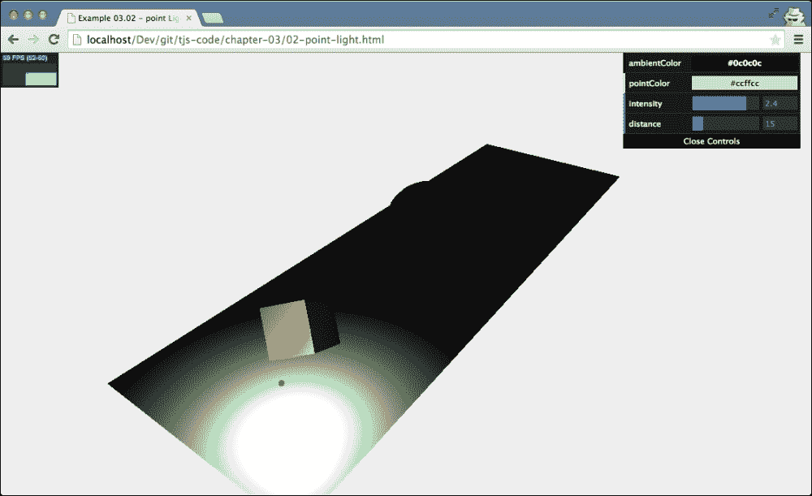

`SpotLight`的`distance`属性决定了在强度属性为 0 之前，光从光源传播的距离。您可以这样设置该属性:`pointLight.distance = 14`。在前面的截图中，光线的亮度在`14`远处慢慢降低到`0`。这就是为什么，在例子中，你仍然可以看到一个明亮的立方体，但是光不会到达蓝色的球体。`distance`属性的默认值是`0`，这意味着光线不会在一段距离内衰减。

## 三。聚光灯

`THREE.SpotLight`是你最常使用的灯光之一(特别是如果你想使用阴影的话)。`THREE.SpotLight`是具有锥形效果的光源。你可以把这个和手电筒或者灯笼相比较。这种光有一个产生光的方向和角度。下表列出了适用于`THREE.SpotLight`的所有属性:

<colgroup><col style="text-align: left"> <col style="text-align: left"></colgroup> 
| 

财产

 | 

描述

 |
| --- | --- |
| `angle` | 这决定了从这种光线中射出的光束有多宽。这是以弧度测量的，默认为`Math.PI/3`。 |
| `castShadow` | 如果设置为 `true`，该光线会投射阴影。 |
| `color` | 这是光的颜色。 |
| `distance` | 这是光线照射的距离。默认值为`0`，这意味着光线的强度不会根据距离而降低。 |
| `exponent` | 通过`THREE.SpotLight`，发射光的强度随着离光源越远而降低。`exponent`属性决定了强度下降的速度。值低时，从这个光源发出的光会到达很远的物体，而值高时，它只会到达离`THREE.SpotLight`很近的物体。 |
| `intensity` | 这是光线照射的强度。默认为 1。 |
| `onlyShadow` | 如果这个属性设置为`true`，这个灯光只会投下阴影，不会给场景增加任何光线。 |
| `position` | 这是灯在`THREE.Scene`的位置。 |
| `shadowBias` | 阴影偏置会将投射的阴影移离或移向投射阴影的对象。当你处理非常薄的物体时，你可以用这个来解决一些奇怪的效果(一个很好的例子可以在[http://www . 3d buzz . com/training/view/unity-foundation/lights/8-shadows-bias](http://www.3dbuzz.com/training/view/unity-fundamentals/lights/8-shadows-bias)找到)。如果您看到奇怪的阴影效果，该属性的小值(例如，`0.01`)通常可以解决问题。该属性的默认值为`0`。 |
| `shadowCameraFar` | 这个决定了应该创建的光影距离。默认值为`5,000`。 |
| `shadowCameraFov` | 这个决定了用于创建阴影的视场有多大(参见[第 2 章](02.html "Chapter 2. Basic Components That Make Up a Three.js Scene")、*组成 Three.js 场景的基本组件*中的*不同用途的不同相机*部分)。默认值为`50`。 |
| `shadowCameraNear` | 这个决定了应该创建的光影距离。默认值为`50`。 |
| `shadowCameraVisible` | 如果这是设置为`true`，你可以看到这个光源如何以及在哪里投射阴影(见下一节的例子)。默认值为`false`。 |
| `shadowDarkness` | 这定义了阴影渲染得有多暗。渲染场景后不能更改。默认值为`0.5`。 |
| `shadowMapWidth`和`shadowMapHeight` | 这个决定了使用多少像素来创建阴影。当阴影有锯齿状边缘或者看起来不平滑时，增加该值。渲染场景后不能更改。两者的默认值均为`512`。 |
| `target` | 有了`THREE.SpotLight`，它指向的方向就重要了。使用`target`属性，您可以将`THREE.SpotLight`指向场景中的特定对象或位置。请注意，该属性需要一个`THREE.Object3D`对象(如`THREE.Mesh`)。这与我们在上一章中看到的在其`lookAt`功能中使用`THREE.Vector3`的摄像机形成对比。 |
| `visible` | 如果这是设置为`true`(默认)，该灯打开，如果这是设置为`false`，该灯关闭。 |

创造`THREE.SpotLight`很容易。只需指定颜色，设置所需的属性，并将其添加到场景中，如下所示:

```js
var pointColor = "#ffffff";
var spotLight = new THREE.SpotLight(pointColor);
spotLight.position.set(-40, 60, -10);
spotLight.castShadow = true;
spotLight.target = plane;
scene.add(spotLight);
```

`THREE.SpotLight`与`THREE.PointLight`差别不大。唯一不同的是，我们将`castShadow`属性设置为`true`，因为我们想要阴影，并且我们需要为此`SpotLight`设置`target`属性。`target`属性决定光线瞄准的位置。在这种情况下，我们将其指向名为`plane`的对象。运行示例(`03-spot-light.html`)时，会看到如下截图所示的场景:


在本例中，您可以设置许多特定于`THREE.SpotLight`的属性。其中之一就是`target`房产。如果我们将此属性设置为蓝色球体，即使光线在场景中移动，它也会聚焦在球体的中心。当我们创造光的时候，我们把它对准地平面，在我们的例子中，我们也可以把它对准另外两个物体。但是如果你不想把光对准一个特定的物体，而是对准空间中的任意一点呢？你可以这样创建一个`THREE.Object3D()`对象:

```js
var target = new THREE.Object3D();
target.position = new THREE.Vector3(5, 0, 0);
```

然后，设置`THREE.SpotLight`的目标属性:

```js
spotlight.target = target
```

在本节开头的表格中，我们展示了几个可以用来控制光如何从`THREE.SpotLight`发出的属性。`distance`和`angle`属性定义光锥的形状。`angle`属性定义了圆锥体的宽度，使用`distance`属性，我们设置了圆锥体的长度。下图解释了这两个值如何共同定义将从`THREE.SpotLight`接收光的区域:

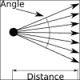

通常，您不需要设置这些值，因为它们有合理的默认值，但是您可以使用这些属性，例如，创建光束非常窄或光强快速降低的`THREE.SpotLight`。您可以用来改变`THREE.SpotLight`发光方式的最后一个属性是`exponent`属性。使用此属性，您可以设置灯光强度从光锥中心向光锥边缘降低的速度。在下图中，您可以看到`exponent`属性的运行结果。我们有一种非常明亮的光(高`intensity`)，当它从圆锥体的中心向侧面移动时，强度会迅速降低(高`exponent`):

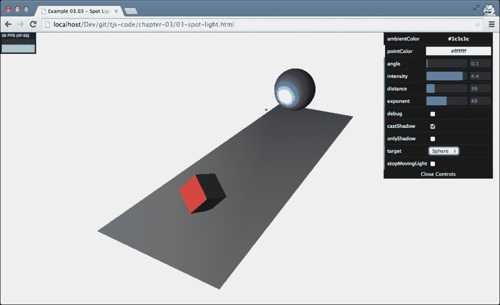

您可以使用它来突出显示特定的对象或模拟一个小手电筒。我们也可以使用一个小的`exponent`值和`angle`来创建相同的聚焦光束效果。关于第二种方法，请注意，非常小的角度会很快导致各种渲染伪像(伪像是图形中使用的术语，用于表示屏幕上不需要的扭曲和奇怪的渲染部分)。

在进入下一个光之前，我们将快速查看`THREE.SpotLight`可用的阴影相关属性。您已经了解到，我们可以通过将`THREE.SpotLight`的`castShadow`属性设置为`true`来获得阴影(当然，还要确保我们为应该投射阴影的对象设置了`castShadow`属性，并且为应该显示阴影的对象在场景中的`THREE.Mesh`对象上投射了`receiveShadow`属性)。Three.js 还允许您非常精细地控制阴影的呈现方式。这是通过我们在本节开头的表格中解释的几个属性来实现的。通过`shadowCameraNear`、`shadowCameraFar`和`shadowCameraFov`，您可以控制这种光线投射阴影的方式和位置。这与我们在前一章中解释的透视相机的视野的工作方式相同。最简单的方法是将`shadowCameraVisible`设置为`true`；您可以通过选中菜单的调试复选框来实现这一点。如下图所示，用于确定光线阴影的区域:


我将用几个提示来结束这一部分，以防您遇到阴影问题:

*   启用`shadowCameraVisible`属性。这显示了受阴影影响的区域。
*   如果阴影看起来是块状的，您可以增加`shadowMapWidth`和`shadowMapHeight`属性，或者确保用于计算阴影的区域紧密包裹您的对象。您可以使用`shadowCameraNear`、`shadowCameraFar`和`shadowCameraFov`属性来配置该区域。
*   请记住，您不仅要告诉光线投射阴影，还必须通过设置`castShadow`和`receiveShadow`属性来告诉每个几何图形它是否会接收和/或投射阴影。
*   如果在场景中使用薄对象，渲染阴影时可能会看到奇怪的伪像。您可以使用`shadowBias`属性来稍微偏移阴影，这通常会解决这类问题。
*   通过设置`shadowDarkness`属性，可以改变投射阴影的暗度。如果阴影太暗或不够暗，更改此属性可让您微调阴影的渲染方式。
*   如果想有更柔和的阴影，可以在`THREE.WebGLRenderer`上设置不同的`shadowMapType value`。默认情况下，该属性设置为`THREE.PCFShadowMap`；如果将此属性设置为`PCFSoftShadowMap`，则会获得更柔和的阴影。

## 三。方向灯

我们要看的最后一个基本灯是`THREE.DirectionalLight`。这种类型的光可以认为是非常远的光。它发出的所有光线相互平行。太阳就是一个很好的例子。太阳离我们如此之远，以至于我们在地球上接收到的光线(几乎)彼此平行。`THREE.DirectionalLight`和`THREE.SpotLight`的主要区别(我们在上一节看到的)是，这种光不会像对`THREE.SpotLight`那样离`THREE.DirectionalLight`的目标越远越小(你可以用`distance`和`exponent`参数微调)。由`THREE.DirectionalLight`照亮的整个区域接收相同强度的光。

要看到这一点，请看`04-directional-light`示例，如下所示:

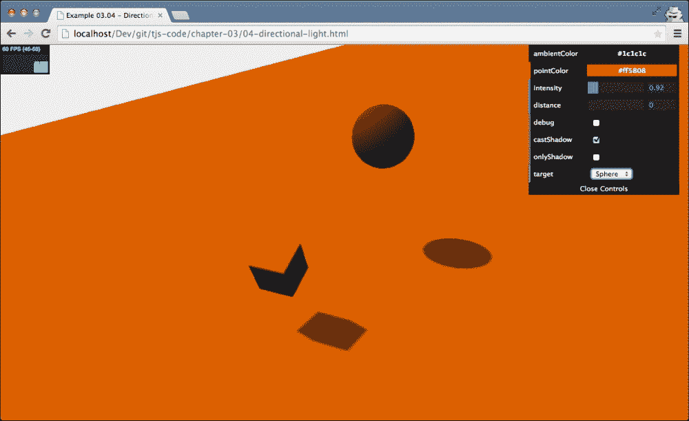

正如你在前面的图片中看到的，没有一个光锥被应用到场景中。所有的东西都接受同样多的光。只有光的方向、颜色和强度被用来计算颜色和阴影。

就像`THREE.SpotLight`一样，你可以设置几个属性来控制光的强度和投射阴影的方式。`THREE.DirectionalLight`有很多和`THREE.SpotLight`一样的属性:`position`、`target`、`intensity`、`distance`、`castShadow`、`onlyShadow`、`shadowCameraNear`、`shadowCameraFar`、`shadowDarkness`、`shadowCameraVisible`、`shadowMapWidth`、`shadowMapHeight`和`shadowBias`。有关这些属性的信息，您可以查看`THREE.SpotLight`上的上一节。在接下来的几段中，我们将讨论几个额外的属性。

如果你回顾`THREE.SpotLight`的例子，你可以看到我们必须定义应用阴影的光锥。因为，对于`THREE.DirectionalLight`来说，所有的光线都是相互平行的，所以我们没有光锥，取而代之的是一个长方体的区域，如下图所示(如果你想自己看到这个，就把相机移远一点，远离场景):

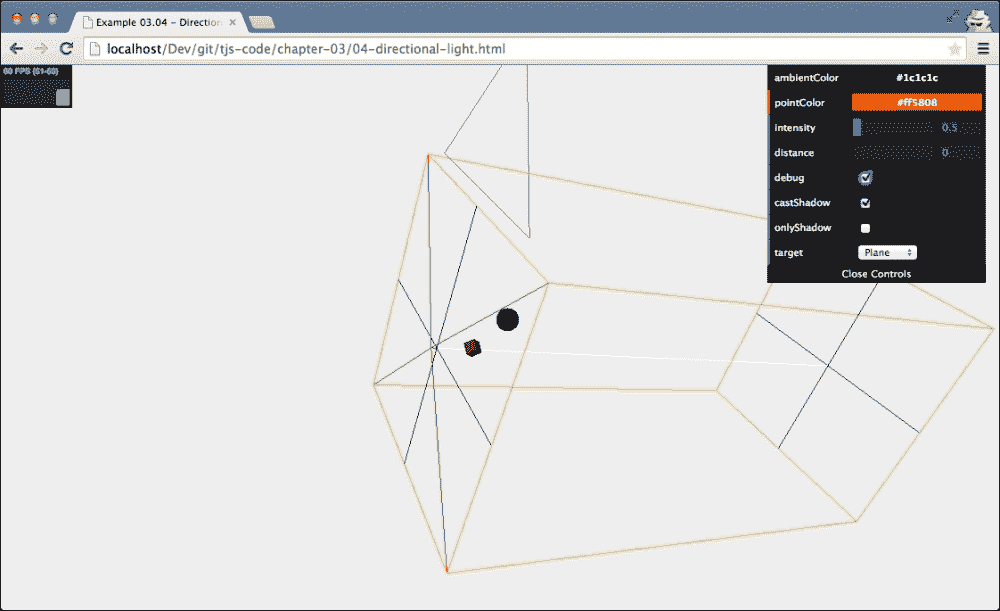

落在这个立方体里的所有东西都可以从光中投射和接收阴影。就像`THREE.SpotLight`一样，你在物体周围定义的这个区域越紧，你的阴影看起来就越好。使用以下属性定义此多维数据集:

```js
directionalLight.shadowCameraNear = 2;
directionalLight.shadowCameraFar = 200;
directionalLight.shadowCameraLeft = -50;
directionalLight.shadowCameraRight = 50;
directionalLight.shadowCameraTop = 50;
directionalLight.shadowCameraBottom = -50;
```

您可以将其与我们在[第 2 章](02.html "Chapter 2. Basic Components That Make Up a Three.js Scene")、*组成 Three.js 场景的基本组件*中的摄像机部分配置正交摄像机的方式进行比较。

### 注

有一个属性`THREE.DirectionalLight`可用，我们还没有解决:`shadowCascade`。当你想用`THREE.DirectionalLight`在大面积上使用阴影时，这个属性可以用来创建更好的阴影。如果将属性设置为`true`，Three.js 将使用另一种方法来生成阴影。它将阴影生成分割到`shadowCascadeCount`指定的值。这将导致更详细的阴影靠近相机的视点，而不太详细的阴影远离。要使用这个，你必须试验`shadowCascadeCount`、`shadowCascadeBias`、`shadowCascadeWidth`、`shadowCascadeHeight`、`shadowCascadeNearZ`和`shadowCascadeFarZ`的设置。您可以在[http://alteredqualia.com/three/examples/webgl_road.html](http://alteredqualia.com/three/examples/webgl_road.html)找到使用该设置的示例。

# 特殊灯

在关于特殊灯光的这一节中，我们将讨论由 Three.js 提供的两个额外的灯光。首先，我们将讨论`THREE.HemisphereLight`，它有助于为室外场景创建更自然的照明，然后我们将看看`THREE.AreaLight`，它从大面积而不是单点发光，最后，我们将向您展示如何为您的场景添加镜头眩光效果。

## 三。半球灯

我们要看的第一个特殊的光是`THREE.HemisphereLight`。有了`THREE.HemisphereLight`，我们可以创造出更加自然的户外照明。没有这种光，我们可以通过创建`THREE.DirectionalLight`来模拟户外，它模拟太阳，并且可能添加额外的`THREE.AmbientLight`来为场景提供一些一般的颜色。然而，这看起来不太自然。当你在户外时，并不是所有的光都直接来自上面:许多光被大气散射，并被地面和其他物体反射。`THREE.HemisphereLight`在 Three.js 中就是为这个场景创建的。这是获得更多自然外观的室外照明的简单方法。要看一个例子，请看`05-hemisphere-light.html`:

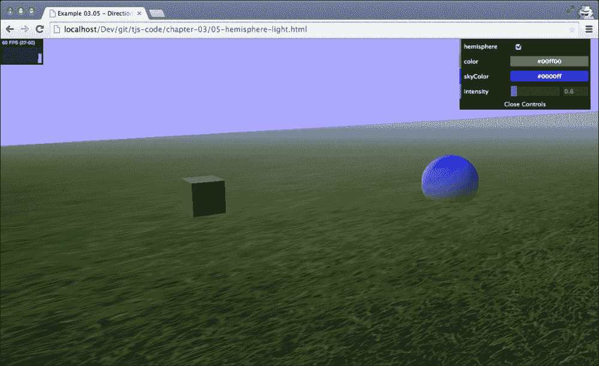

### 注

请注意，这是第一个加载额外资源的示例，不能直接从本地文件系统运行。所以如果你还没有这样做，看看[第 1 章](01.html "Chapter 1. Creating Your First 3D Scene with Three.js")、*用 Three.js* 创建你的第一个 3D 场景，了解如何设置本地 web 服务器或禁用浏览器中的安全设置，以使加载外部资源工作。

在本例中，您可以打开和关闭`THREE.HemisphereLight`并设置颜色和强度。创建半球光源就像创建任何其他光源一样简单:

```js
var hemiLight = new THREE.HemisphereLight(0x0000ff, 0x00ff00, 0.6);
hemiLight.position.set(0, 500, 0);
scene.add(hemiLight);
```

您只需指定从天空接收的颜色、从地面接收的颜色以及这些灯光的强度。如果以后想更改这些值，可以通过以下属性访问它们:

<colgroup><col style="text-align: left"> <col style="text-align: left"></colgroup> 
| 

财产

 | 

描述

 |
| --- | --- |
| `groundColor` | 这是从地面发出的颜色 |
| `color` | 这是从天而降的颜色 |
| `intensity` | 这是光线的强度 |

## 三。AreaLight

我们要看的最后一个真正的光源是`THREE.AreaLight`。借助`THREE.AreaLight`，我们可以定义一个发光的矩形区域。`THREE.AreaLight`没有包含在标准的 third . js 库中，但是包含在它的扩展中，所以在使用这个光源之前，我们必须采取一些额外的步骤。在看细节之前，我们先来看看我们要达到的结果(`06-area-light.html`打开这个例子)；下面的截图概括了我们想要看到的结果:

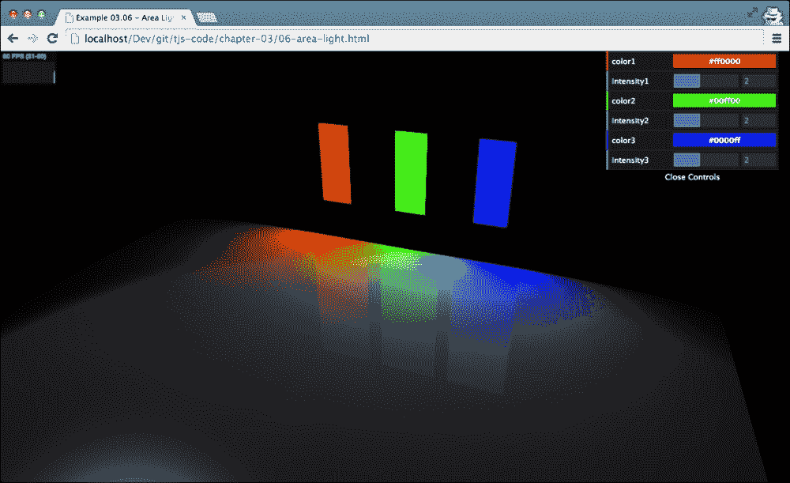

你在这个截图中看到的是，我们定义了三个`THREE.AreaLight`对象，每个对象都有自己的颜色。你也可以看到这些灯光如何影响整个区域。

当我们想要使用`THREE.AreaLight`时，我们不能使用`THREE.WebGLRenderer`，这是我们到现在为止在例子中使用的。原因是`THREE.AreaLight`是一个非常复杂的光源，在正常的`THREE.WebGLRenderer`物体中会造成非常严重的性能损失。它在渲染场景时使用了不同的方法(它将场景分解成多个步骤)，并且可以比标准的`THREE.WebGLRenderer`对象更好地处理复杂的光线(或者大量的光源)。

为了使用`THREE.WebGLDeferredRenderer`，我们必须包含由 Three.js 提供的几个额外的 JavaScript 源。在你的 HTML 框架的头部，确保你已经定义了下面的一组`<script>`源:

```js
<head>
  <script type="text/javascript" src="../libs/three.js"></script>
  <script type="text/javascript" src="../libs/stats.js"></script>
  <script type="text/javascript" src="../libs/dat.gui.js"></script>

  <script type="text/javascript" src="../libs/WebGLDeferredRenderer.js"></script>
  <script type="text/javascript" src="../libs/ShaderDeferred.js"></script>
  <script type="text/javascript" src="../libs/RenderPass.js"></script>
  <script type="text/javascript" src="../libs/EffectComposer.js"></script>
  <script type="text/javascript" src="../libs/CopyShader.js"></script>
  <script type="text/javascript" src="../libs/ShaderPass.js"></script>
  <script type="text/javascript" src="../libs/FXAAShader.js"></script>
  <script type="text/javascript" src="../libs/MaskPass.js"></script>
</head>
```

有了这些库，我们就可以使用`THREE.WebGLDeferredRenderer`。我们可以用与我们在其他示例中讨论的几乎相同的方式来使用这个渲染器。只需要几个额外的参数:

```js
var renderer = new THREE.WebGLDeferredRenderer({width: window.innerWidth,height: window.innerHeight,scale: 1, antialias: true,tonemapping: THREE.FilmicOperator, brightness: 2.5 });
```

目前不要太担心所有这些属性意味着什么。在[第 10 章](10.html "Chapter 10. Loading and Working with Textures")、*加载和处理纹理*中，我们将深入`THREE.WebGLDeferredRenderer`并向您解释。有了正确的 JavaScript 库和不同的渲染器，我们可以开始添加`Three.AreaLight`。

我们做这件事的方式和所有其他灯差不多:

```js
var areaLight1 = new THREE.AreaLight(0xff0000, 3);
areaLight1.position.set(-10, 10, -35);
areaLight1.rotation.set(-Math.PI / 2, 0, 0);
areaLight1.width = 4;
areaLight1.height = 9.9;
scene.add(areaLight1);
```

在这个例子中，我们创建了一个新的`THREE.AreaLight`。这种光的颜色值为`0xff0000`，强度值为`3`。就像其他灯光一样，我们可以使用`position`属性来设置它在场景中的位置。当你创建`THREE.AreaLight`时，它将被创建为一个水平面。在我们的示例中，我们创建了三个垂直放置的`THREE.AreaLight`对象，因此我们需要围绕它们的 *x* 轴旋转我们的灯光`-Math.PI/2`。最后，我们使用`width`和`height`属性设置`THREE.AreaLight`的大小，并将其添加到场景中。如果你第一次自己尝试这样做，你可能会想为什么你没有看到任何你放置光的地方。这是因为你看不到光源本身，只能看到它发出的光，只有当它接触到物体时你才能看到。如果你想重新创建我在例子中展示的，你可以在相同的位置(`areaLight1.position`)添加`THREE.PlaneGeometry`或`THREE.BoxGeometry`来模拟发光的区域，如下所示:

```js
var planeGeometry1 = new THREE.BoxGeometry(4, 10, 0);
var planeGeometry1Mat = new THREE.MeshBasicMaterial({color: 0xff0000})
var plane = new THREE.Mesh(planeGeometry1, planeGeometry1Mat);
plane.position = areaLight1.position;
scene.add(plane);
```

你可以用`THREE.AreaLight`创造出非常漂亮的效果，但是你可能需要做一些实验才能得到想要的效果。如果您从右上角下拉控制面板，您可以使用一些控件来设置该场景中三种灯光的颜色和强度，并立即看到效果，如下所示:

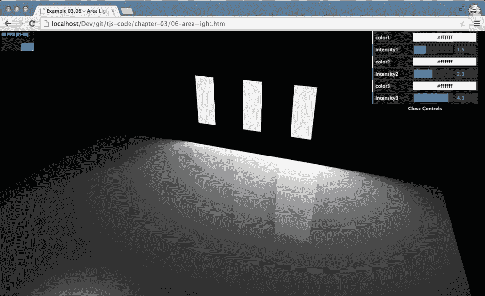

## 兰福拉尔

本章我们要探讨的最后一个主题是**镜头闪光**。你可能已经熟悉镜头眩光了。例如，当你直接对着太阳或其他明亮的光源拍照时，它们就会出现。在大多数情况下，你想避免这种情况，但是对于游戏和 3D 生成的图像，它提供了一个很好的效果，使场景看起来更加逼真。

Three.js 还支持镜头眩光，可以很容易地将它们添加到场景中。在最后一部分，我们将为场景添加一个镜头光晕，并创建输出，如下图所示；打开`07-lensflares.html`你可以自己看到这个:


我们可以通过实例化`THREE.LensFlare`对象来创建镜头光斑。我们需要做的第一件事就是创建这个对象。`THREE.LensFlare`采用以下参数:

```js
flare = new THREE.LensFlare(texture, size, distance, blending, color, opacity);
```

下表解释了这些参数:

<colgroup><col style="text-align: left"> <col style="text-align: left"></colgroup> 
| 

争吵

 | 

描述

 |
| --- | --- |
| `texture` | 纹理是决定光斑形状的图像。 |
| `size` | 我们可以指定耀斑应该有多大。这是像素大小。如果指定`-1`，则使用纹理本身的大小。 |
| `distance` | 这是从光源(`0`)到摄像机(`1`)的距离。用它将镜头光斑定位在正确的位置。 |
| `blending` | 我们可以为耀斑指定多个纹理。混合模式决定了它们如何混合在一起。与`LensFlare`一起使用的默认值是`THREE.AdditiveBlending`。下一章会有更多关于混合的内容。 |
| `color` | 这是耀斑的颜色。 |

让我们看看用于创建该对象的代码(参见`07-lensflares.html`):

```js
var textureFlare0 = THREE.ImageUtils.loadTexture
      ("../img/textures/lensflare/lensflare0.png");

var flareColor = new THREE.Color(0xffaacc);
var lensFlare = new THREE.LensFlare(textureFlare0, 350, 0.0, THREE.AdditiveBlending, flareColor);

lensFlare.position = spotLight.position;
scene.add(lensFlare);
```

我们首先加载一个纹理。对于这个例子，我使用了由 Three.js 例子提供的镜头光斑纹理，如下所示:

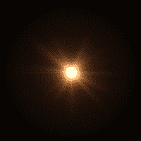

如果您将此图像与本节开头的截图进行比较，您可以看到它定义了镜头光斑的外观。接下来，我们使用`new THREE.Color( 0xffaacc );`来定义镜头光斑的颜色，这会给镜头光斑一个红色的辉光。有了这两个对象，我们就可以创建`THREE.LensFlare`对象了。在这个例子中，我们将光斑的大小设置为`350`，距离设置为`0.0`(直接在光源处)。

在我们创建了`LensFlare`对象之后，我们将其定位在我们的灯光位置，并将其添加到场景中，这可以在下面的截图中看到:


它看起来已经很好了，但是如果你把它和本章开头的图像进行比较，你会注意到我们遗漏了页面中间的小圆形工件。我们用与主火炬几乎相同的方式创建这些，如下所示:

```js
var textureFlare3 = THREE.ImageUtils.loadTexture
      ("../img/textures/lensflare/lensflare3.png");

lensFlare.add(textureFlare3, 60, 0.6, THREE.AdditiveBlending);
lensFlare.add(textureFlare3, 70, 0.7, THREE.AdditiveBlending);
lensFlare.add(textureFlare3, 120, 0.9, THREE.AdditiveBlending);
lensFlare.add(textureFlare3, 70, 1.0, THREE.AdditiveBlending);
```

不过这一次，我们没有创建新的`THREE.LensFlare`，而是使用了我们刚刚创建的`LensFlare`提供的`add`功能。在这个方法中，我们需要指定纹理、大小、距离和混合模式，就是这样。注意`add`功能可以带两个附加参数。您也可以将新照明弹的`color`和`opacity`属性设置为`add`。我们用于这些新耀斑的纹理是一个非常亮的圆形，如下图所示:


如果你再看一下场景，你会看到工件出现在你用`distance`参数指定的位置。

# 总结

在这一章中，我们介绍了许多关于三种不同类型的灯光的信息。在这一章中，您了解到配置灯光、颜色和阴影并不是一门精确的科学。为了得到正确的结果，您应该尝试不同的设置并使用 dat。图形用户界面控件来微调您的配置。不同的灯表现出不同的方式。一种`THREE.AmbientLight`颜色被添加到场景中的每一种颜色中，并经常用于平滑硬颜色和阴影。`THREE.PointLight`四面发光但不能用来制造阴影。`THREE.SpotLight`是一种类似手电筒的光。它有一个圆锥形的形状，可以配置为随着距离的推移而淡化，并且能够投射阴影。我们也看了`THREE.DirectionalLight`。这种光可以与远处的光相比较，比如太阳，它的光线相互平行传播，其强度不会随着它离配置的目标越远而降低。除了标准灯，我们还看了几个更专业的灯。为了更自然的户外效果，可以使用`THREE.HemisphereLight`，它考虑了地面和天空的反射；`THREE.AreaLight`不是单点发光，而是大面积发光。我们向您展示了如何使用`THREE.LenseFlare object`添加摄影镜头眩光。

在到目前为止的章节中，我们已经介绍了一些不同的材质，在这一章中，您会看到并非所有材质对可用的灯光都有相同的响应。在下一章中，我们将概述 Three.js 中可用的材质