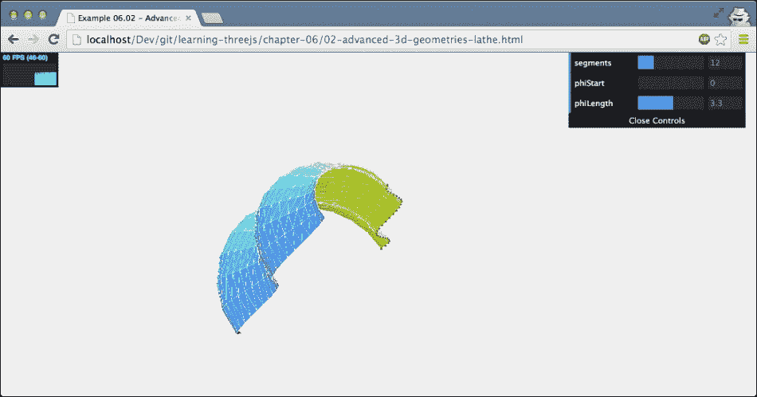
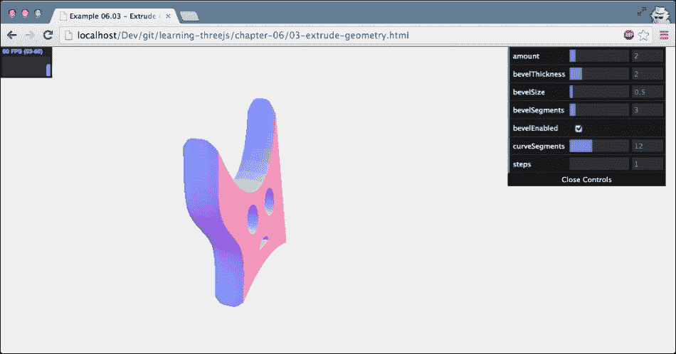
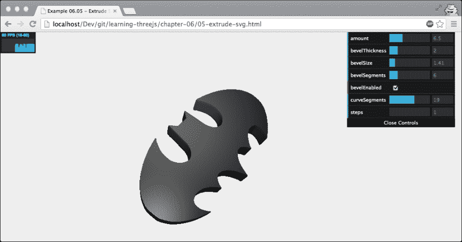
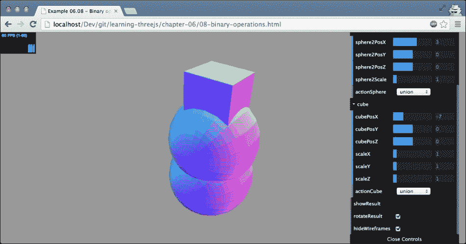

# 第六章。高级几何和二进制运算

在上一章中，我们向您展示了 Three.js 提供的所有基本几何图形。除了这些基本几何图形之外，Three.js 还提供了一组更高级和专门的对象。在本章中，我们将向您展示这些高级几何图形，并涵盖以下主题:

*   如何使用高级几何图形，如`THREE.ConvexGeometry`、`THREE.LatheGeometry`和`THREE.TubeGeometry`。
*   如何使用`THREE.ExtrudeGeometry`从 2D 形状创建三维形状。我们将基于使用 Three.js 提供的功能绘制的 2D 形状来实现这一点，我们将展示一个基于外部加载的 SVG 图像创建三维形状的示例。
*   如果您想自己创建自定义形状，您可以很容易地修改我们在前面章节中讨论过的形状。然而，Three.js 也提供了一个`THREE.ParamtericGeometry`对象。使用此对象，您可以基于一组方程创建几何图形。
*   最后，我们来看看如何使用`THREE.TextGeometry`创建 3D 文本效果。
*   此外，我们还将向您展示如何使用三个. js 扩展提供的二进制操作从现有的几何图形创建新的几何图形。

我们将从这个列表中的第一个开始，`THREE.ConvexGeometry`。

# 三。凸几何

借助`THREE.ConvexGeometry`，我们可以围绕一组点创建一个凸包。凸包是包含所有这些点的最小形状。理解这一点最简单的方法是看一个例子。如果你打开`01-advanced-3d-geometries-convex.html`例子，你会看到一组随机点的凸外壳。下面的截图显示了这个几何图形:


在这个例子中，我们生成一组随机点，并基于这些点创建`THREE.ConvexGeometry`。在示例中，您可以点击**重绘**，这将生成 20 个新点并绘制凸包。我们还将这些点添加为一个小的`THREE.SphereGeometry`对象，以清楚地显示凸包是如何工作的。`THREE.ConvexGeometry`没有包含在标准的 Three.js 发行版中，所以您必须包含一个额外的 JavaScript 文件来使用这个几何图形。在您的 HTML 页面顶部，添加以下内容:

```js
<script src="../libs/ConvexGeometry.js"></script>
```

下面这段代码展示了如何创建这些点并将其添加到场景中:

```js
function generatePoints() {
  // add 10 random spheres
  var points = [];
  for (var i = 0; i < 20; i++) {
    var randomX = -15 + Math.round(Math.random() * 30);
    var randomY = -15 + Math.round(Math.random() * 30);
    var randomZ = -15 + Math.round(Math.random() * 30);
    points.push(new THREE.Vector3(randomX, randomY, randomZ));
  }

  var group = new THREE.Object3D();
  var material = new THREE.MeshBasicMaterial({color: 0xff0000, transparent: false});
  points.forEach(function (point) {
    var geom = new THREE.SphereGeometry(0.2);
    var mesh = new THREE.Mesh(geom, material);
    mesh.position.clone(point);
    group.add(mesh);
  });

  // add the points as a group to the scene
  scene.add(group);
}
```

正如您在这段代码中所看到的，我们创建了 20 个随机点(`THREE.Vector3`)，并将其推入一个数组中。接下来，我们迭代这个数组并创建`THREE.SphereGeometry`，将其位置设置为这些点之一(`position.clone(point)`)。所有的点都被添加到一个组中(更多关于这个在[第 7 章](07.html "Chapter 7. Particles, Sprites, and the Point Cloud")、*粒子、精灵和点云*中)，所以我们只需旋转组就可以轻松旋转它们。

一旦有了这组点，创建`THREE.ConvexGeometry`就非常容易了，如下面的代码片段所示:

```js
// use the same points to create a convexgeometry
var convexGeometry = new THREE.ConvexGeometry(points);
convexMesh = createMesh(convexGeometry);
scene.add(convexMesh);
```

包含顶点的数组(属于`THREE.Vector3`类型)是`THREE.ConvexGeometry`采用的唯一参数。这里是我们在这里调用的`createMesh()`函数的最后一个注释(这是我们在[第 5 章](05.html "Chapter 5. Learning to Work with Geometries")、*学习处理几何图形*中自己创建的函数)。在前一章中，我们使用这种方法使用`THREE.MeshNormalMaterial`创建了一个网格。在这个例子中，我们把它变成了半透明的绿色`THREE.MeshBasicMaterial`，以更好地显示我们创建的凸包和组成这个几何图形的各个点。

下一个复杂的几何图形是`THREE.LatheGeometry`，可以用来创建花瓶一样的形状。

# 三。车床几何

`THREE.LatheGeometry` 允许你从平滑的曲线创建形状。该曲线由多个点(也称为节点)定义，通常称为样条。该样条围绕对象的中心 *z* 轴旋转，并产生花瓶状和钟状形状。再一次，了解`THREE.LatheGeometry`长什么样最简单的方法就是看一个例子。这个几何图形显示在`02-advanced-3d-geometries-lathe.html`中。以下取自示例的屏幕截图显示了该几何图形:



在前面的截图中，您可以看到样条线是一组红色的小球体。这些球体的位置与其他几个参数一起传递给`THREE.LatheGeometry`。在本例中，我们将此样条线旋转半个圆，并基于此样条线提取您可以看到的形状。在查看所有参数之前，我们先来看一下用于创建样条线的代码以及`THREE.LatheGeometry`如何使用该样条线:

```js
function generatePoints(segments, phiStart, phiLength) {
  // add 10 random spheres
  var points = [];
  var height = 5;
  var count = 30;
  for (var i = 0; i < count; i++) {
    points.push(new THREE.Vector3((Math.sin(i * 0.2) + Math.cos(i * 0.3)) * height + 12, 0, ( i - count ) + count / 2));
  }

  ...

  // use the same points to create a LatheGeometry
  var latheGeometry = new THREE.LatheGeometry (points, segments, phiStart, phiLength);
  latheMesh = createMesh(latheGeometry);
  scene.add(latheMesh);
}
```

在这段 JavaScript 的中，您可以看到我们生成了 30 个点，它们的 *x* 坐标基于正弦和余弦函数的组合，而 *z* 坐标基于`i`和`count`变量。这将创建由前面截图中的红点可视化的样条曲线。

基于这些点，我们可以创建`THREE.LatheGeometry`。除了顶点数组之外，`THREE.LatheGeometry`还接受其他几个参数。下表列出了所有参数:

<colgroup><col style="text-align: left"> <col style="text-align: left"> <col style="text-align: left"></colgroup> 
| 

财产

 | 

命令的

 | 

描述

 |
| --- | --- | --- |
| `points` | 是 | 这些是构成用于生成钟形/花瓶形的样条的点。 |
| `segments` | 不 | 这些是创建形状时使用的线段数。这个数字越高，*越圆*产生的形状就越多。这个的默认值是`12`。 |
| `phiStart` | 不 | 这个决定了生成形状时从圆的哪里开始。范围从`0`到`2*PI`。默认值为`0`。 |
| `phiLength` | 不 | 这个定义了形状的完全生成程度。例如，四分之一形状将是`0.5*PI`。默认值为全`360`度或`2*PI`。 |

在下一节中，我们将通过从 2D 形状中提取三维几何图形来了解创建几何图形的另一种方法。

## 通过挤压创建几何图形

提供了两种方法，我们可以将 2D 形状挤压成三维形状。通过挤压，我们意味着沿着其 *z* 轴拉伸 2D 形状，以将其转换为 3D。例如，如果我们挤压`THREE.CircleGeometry`，我们会得到一个看起来像圆柱体的形状，如果我们挤压`THREE.PlaneGeometry`，我们会得到一个类似立方体的形状。

挤压形状的最通用方式是使用`THREE.ExtrudeGeometry`对象。

### 三。挤出几何

通过 `THREE.ExtrudeGeometry`，你可以从一个 2D 形状创建一个三维物体。在深入这个几何图形的细节之前，我们先来看一个例子:`03-extrude-geometry.html`。以下取自示例的屏幕截图显示了该几何图形:



在本例中，我们采用了上一章中创建的 2D 形状，并使用`THREE.ExtrudeGeometry`将其转换为 3D 的。正如你在这个截图中看到的，形状是沿着 *z* 轴拉伸的，这导致了一个三维形状。创建`THREE.ExtrudeGeometry`的代码非常简单:

```js
var options = {
  amount: 10,
  bevelThickness: 2,
  bevelSize: 1,
  bevelSegments: 3,
  bevelEnabled: true,
  curveSegments: 12,
  steps: 1
};

shape = createMesh(new THREE.ExtrudeGeometry(drawShape(), options));
```

在这个代码中，我们使用`drawShape()`函数创建了形状，就像我们在上一章中所做的那样。该形状与一个`options`对象一起传递给`THREE.ExtrudeGeometry`构造器。使用`options`对象，您可以精确定义应该如何拉伸形状。下表解释了您可以传递给`THREE.ExtrudeGeometry`的选项。

<colgroup><col style="text-align: left"> <col style="text-align: left"> <col style="text-align: left"></colgroup> 
| 

财产

 | 

命令的

 | 

描述

 |
| --- | --- | --- |
| `shapes` | 是 | 需要一个或多个形状(`THREE.Shape`对象)来挤出几何图形。参见上一章如何创建这样的形状。 |
| `amount` | 不 | 这个决定了形状应该挤压多远(多深)。默认值为`100`。 |
| `bevelThickness` | 不 | 这决定了斜面的深度。斜面是正面和背面与拉伸之间的圆角。该值定义斜面深入形状的深度。默认值为`6`。 |
| `bevelSize` | 不 | 这决定了斜面的高度。这将添加到形状的正常高度。默认值为`bevelThickness - 2`。 |
| `bevelSegments` | 不 | 该定义了斜面将使用的线段数。使用的线段数越多，斜面看起来就越平滑。默认值为`3`。 |
| `bevelEnabled` | 不 | 如果设置为`true`，则添加一个斜面。默认值为`true`。 |
| `curveSegments` | 不 | 这个决定了挤压形状曲线时将使用多少段。使用的线段数越多，曲线看起来就越平滑。默认值为`12`。 |
| `steps` | 不 | 这个定义了拉伸将沿其深度分割的线段数。默认值为`1`。较高的值将导致更多的单个面。 |
| `extrudePath` | 不 | 这是应该沿其挤出形状的路径(`THREE.CurvePath`)。如果未指定，该形状将沿 *z* 轴拉伸。 |
| `material` | 不 | 该是用于正面和背面的材料的索引。如果您希望正面和背面使用不同的材质，请使用`THREE.SceneUtils.createMultiMaterialObject`功能创建网格。 |
| `extrudeMaterial` | 不 | 这个是用于斜面和挤压的材料的索引。如果您希望正面和背面使用不同的材质，请使用`THREE.SceneUtils.createMultiMaterialObject`功能创建网格。 |
| `uvGenerator` | 不 | 当你在材质中使用纹理时，UV 贴图决定了纹理的哪一部分用于特定的面。使用`uvGenerator`属性，您可以传入自己的对象，该对象将为传入的形状创建的面创建紫外线设置。更多关于紫外线设置的信息可以在[第 10 章](10.html "Chapter 10. Loading and Working with Textures")、*加载和处理纹理*中找到。如果未指定，则使用`THREE.ExtrudeGeometry.WorldUVGenerator`。 |
| `frames` | 不 | frenet 框架用于计算样条的切线、法线和副法线。沿`extrudePath`挤压时使用。您不需要指定这个，因为 Three.js 提供了它自己的实现，`THREE.TubeGeometry.FrenetFrames`，它也被用作默认值。更多关于 frenet 框架的信息，请访问。 |

您可以使用`03-extrude-geometry.html`示例中的菜单来试验这些选项。

在本例中，我们沿着其 *z* 轴拉伸了该形状。如您在选项中所见，您也可以使用`extrudePath`选项沿路径拉伸形状。在下面的几何图形`THREE.TubeGeometry`中，我们将这样做。

### 三。管道几何

`THREE.TubeGeometry` 创建一个沿三维样条线拉伸的管道。使用多个顶点指定路径，`THREE.TubeGeometry`将创建管。你可以尝试的一个例子可以在本章的资料中找到(`04-extrude-tube.html`)。下面的截图显示了这个例子:


如你所见在这个例子中，我们生成了许多随机点，并使用这些点来绘制管子。通过右上角的控件，我们可以通过点击**新点**按钮来定义试管的外观或生成新试管。创建试管所需的代码非常简单，如下所示:

```js
var points = [];
for (var i = 0 ; i < controls.numberOfPoints ; i++) {
  var randomX = -20 + Math.round(Math.random() * 50);
  var randomY = -15 + Math.round(Math.random() * 40);
  var randomZ = -20 + Math.round(Math.random() * 40);

  points.push(new THREE.Vector3(randomX, randomY, randomZ));
}

var tubeGeometry = new THREE.TubeGeometry(new THREE.SplineCurve3(points), segments, radius, radiusSegments, closed);

var tubeMesh = createMesh(tubeGeometry);
scene.add(tubeMesh);
```

我们首先需要做的是得到一组`THREE.Vector3`类型的顶点，就像我们对`THREE.ConvexGeometry`和`THREE.LatheGeometry`做的那样。然而，在我们可以使用这些点来创建管之前，我们首先需要将这些点转换为`THREE.SplineCurve3`。换句话说，我们需要通过我们定义的点来定义一条平滑的曲线。我们可以简单地通过将顶点数组传递给`THREE.SplineCurve3`的构造器来实现。有了这个样条曲线和其他参数(我们稍后会解释)，我们可以创建一个管道并将其添加到场景中。

`THREE.TubeGeometry`除了`THREE.SplineCurve3`还带了一些其他的论点。下表列出了`THREE.TubeGeometry`的所有论据:

<colgroup><col style="text-align: left"> <col style="text-align: left"> <col style="text-align: left"></colgroup> 
| 

财产

 | 

命令的

 | 

描述

 |
| --- | --- | --- |
| `path` | 是 | 这个就是`THREE.SplineCurve3`描述了这根管子应该走的路径。 |
| `segments` | 不 | 这些是用于构建管道的段。默认值为`64`。路径越长，指定的线段就越多。 |
| `radius` | 不 | 这个就是管子的半径。默认值为`1`。 |
| `radiusSegments` | 不 | 这个是沿管子长度使用的段数。默认值为`8`。你用的越多，*越圆*管子看起来就越大。 |
| `closed` | 不 | 如果此设置为`true`，管子的起点和终点将连接在一起。默认值为`false`。 |

我们将在本章中展示的最后一个挤出示例实际上并不是一个不同的几何图形。在下一节中，我们将向您展示如何使用`THREE.ExtrudeGeometry`从现有的 SVG 路径创建拉伸。

### 从 SVG 挤出

当我们讨论`THREE.ShapeGeometry`时，我们提到 SVG 基本上遵循了同样的绘制形状的方法。SVG 与 Three.js 处理形状的方式非常匹配。在本节中，我们将了解如何使用来自[https://github.com/asutherland/d3-threeD](https://github.com/asutherland/d3-threeD)的一个小库将 SVG 路径转换为一个 Three.js 形状。

对于`05-extrude-svg.html`的例子，我取了一张蝙蝠侠 logo 的 SVG 图，用`ExtrudeGeometry`转换成 3D，如下图截图所示:



首先让我们看看原来的 SVG 代码是什么样子的(看这个例子的源代码也可以自己看看这个):

```js
<svg version="1.0"  xmlns:xlink="http://www.w3.org/1999/xlink" x="0px" y="0px" width="1152px" height="1152px" xml:space="preserve">
  <g>
  <path  id="batman-path" style="fill:rgb(0,0,0);" d="M 261.135 114.535 C 254.906 116.662 247.491 118.825 244.659 119.344 C 229.433 122.131 177.907 142.565 151.973 156.101 C 111.417 177.269 78.9808 203.399 49.2992 238.815 C 41.0479 248.66 26.5057 277.248 21.0148 294.418 C 14.873 313.624 15.3588 357.341 21.9304 376.806 C 29.244 398.469 39.6107 416.935 52.0865 430.524 C 58.2431 437.23 63.3085 443.321 63.3431 444.06 ... 261.135 114.535 "/>
  </g>
</svg>
```

除非你是一个 SVG 大师，否则这对你来说可能毫无意义。基本上，你在这里看到的是一组绘图说明。比如`C 277.987 119.348 279.673 116.786 279.673 115.867`告诉浏览器画一条三次贝塞尔曲线，`L 489.242 111.787`告诉我们应该画一条线到那个特定的位置。幸运的是，我们不需要自己编写代码来解释这个。有了 D3-3D 库，我们可以自动转换它。这个库最初是为了与优秀的 **D3.js** 库一起使用而创建的，但是通过一些小的修改，我们也可以单独使用这个特定的功能。

### 类型

**SVG** 代表**可伸缩矢量图形**。这是一个基于 XML 的标准，可用于为网络创建基于矢量的 2D 图像。这是所有现代浏览器都支持的开放标准。然而，直接使用 SVG 并从 JavaScript 中操作它并不是很简单。幸运的是，有几个开源 JavaScript 库让使用 SVG 变得更加容易。 **Paper.js** 、 **Snap.js** 、 **D3.js** 、T13】Raphael . js 都是其中的佼佼者。

下面的代码片段展示了我们如何加载您之前看到的 SVG，将其转换为`THREE.ExtrudeGeometry`，并显示在屏幕上:

```js
function drawShape() {
  var svgString = document.querySelector("#batman-path").getAttribute("d");
  var shape = transformSVGPathExposed(svgString);
  return shape;
}

var options = {
  amount: 10,
  bevelThickness: 2,
  bevelSize: 1,
  bevelSegments: 3,
  bevelEnabled: true,
  curveSegments: 12,
  steps: 1
};

shape = createMesh(new THREE.ExtrudeGeometry(drawShape(), options));
```

在这个代码片段中，您将看到对`transformSVGPathExposed`函数的调用。这个函数由 D3-3D 库提供，并以一个 SVG 字符串作为参数。我们直接从 SVG 元素中获取这个 SVG 字符串，表达式如下:`document.querySelector("#batman-path").getAttribute("d")`。在 SVG 中，`d`属性包含用于绘制形状的路径语句。添加一个好看的闪亮材质和一个聚光灯，你已经重新创建了这个例子。

我们将在本节讨论的最后一个几何图形是`THREE.ParametricGeometry`。使用此几何图形，您可以指定用于以编程方式创建几何图形的几个函数。

### 三。参数几何

通过 `THREE.ParametricGeometry`，你可以根据一个方程创建一个几何图形。在我们深入自己的例子之前，首先要看一下 Three.js 已经提供的例子，当你下载 Three.js 发行版时，你会得到`examples/js/ParametricGeometries.js`文件。在这个文件中，你可以找到几个你可以和`THREE.ParametricGeometry`一起使用的方程的例子。最基本的例子是创建平面的功能:

```js
function plane(u, v) {	
  var x = u * width;
  var y = 0;
  var z = v * depth;
  return new THREE.Vector3(x, y, z);
}
```

该功能由`THREE.ParametricGeometry`调用。`u`和`v`值的范围将从`0`到`1`，并且对于从`0`到`1`的所有值将被大量调用。在本例中，`u`值用于确定矢量的 *x* 坐标，`v`值用于确定 *z* 坐标。运行时，您将拥有宽度为`width`深度为`depth`的基本平面。

在我们的例子中，我们做了类似的事情。然而，我们不是创建一个平面，而是创建一个类似波浪的图案，正如您在`06-parametric-geometries.html`示例中看到的那样。下面的截图显示了这个例子:


为了创建这个形状，我们将下面的函数传递给`THREE.ParametricGeometry`:

```js
radialWave = function (u, v) {
  var r = 50;

  var x = Math.sin(u) * r;
  var z = Math.sin(v / 2) * 2 * r;
  var y = (Math.sin(u * 4 * Math.PI) + Math.cos(v * 2 * Math.PI)) * 2.8;

  return new THREE.Vector3(x, y, z);
}

var mesh = createMesh(new THREE.ParametricGeometry(radialWave, 120, 120, false));
```

正如你在这个例子中看到的，通过几行代码，我们可以创建非常有趣的几何图形。在这个例子中，你也可以看到我们可以传递给`THREE.ParametricGeometry`的参数。下表对此进行了解释:

<colgroup><col style="text-align: left"> <col style="text-align: left"> <col style="text-align: left"></colgroup> 
| 

财产

 | 

命令的

 | 

描述

 |
| --- | --- | --- |
| `function` | 是 | 这是函数，根据提供的`u`和`v`值定义每个顶点的位置 |
| `slices` | 是 | 这定义了`u`值应划分的零件数量 |
| `stacks` | 是 | 该定义了`v`值应划分的零件数量 |

在进入本章的最后一部分之前，我想对如何使用`slices`和`stacks`属性做一个最后的说明。我们提到了`u`和`v`属性被传递到所提供的`function`参数中，并且这两个属性的值在`0`到`1`之间。通过`slices`和`stacks`属性，我们可以定义传入函数的调用频率。例如，如果我们将`slices`设置为`5`，将`stacks`设置为`4`，将使用以下值调用该函数:

```js
u:0/5, v:0/4
u:1/5, v:0/4
u:2/5, v:0/4
u:3/5, v:0/4
u:4/5, v:0/4
u:5/5, v:0/4
u:0/5, v:1/4
u:1/5, v:1/4
...
u:5/5, v:3/4
u:5/5, v:4/4
```

因此，该值越高，指定的顶点越多，创建的几何图形越平滑。您可以使用`06-parametric-geometries.html`示例右上角的菜单来查看该效果。

更多的例子，可以看看 Three.js 发行版中的`examples/js/ParametricGeometries.js`文件。该文件包含创建以下几何图形的函数:

*   克莱因瓶
*   飞机
*   扁平莫比乌斯带
*   3d 莫比乌斯带
*   管
*   圆环结
*   范围

本章的最后一部分涉及创建三维文本对象。

# 创建三维文本

在本章的最后一部分，我们将快速了解如何创建 3D 文本效果。首先，我们将了解如何使用 Three.js 提供的字体呈现文本，然后，我们将快速了解如何使用自己的字体。

## 渲染文本

在三个 js 中渲染文本非常容易。你所要做的就是定义你想要使用的字体和我们在讨论`THREE.ExtrudeGeometry`时看到的基本挤压属性。下面的截图展示了如何在 Three.js 中呈现文本的`07-text-geometry.html`示例:


创建该 3D 文本所需的代码如下:

```js
var options = {
  size: 90,
  height: 90,
  weight: 'normal',
  font: 'helvetiker',
  style: 'normal',
  bevelThickness: 2,
  bevelSize: 4,
  bevelSegments: 3,
  bevelEnabled: true,
  curveSegments: 12,
  steps: 1
};

// the createMesh is the same function we saw earlier
text1 = createMesh(new THREE.TextGeometry("Learning", options));
text1.position.z = -100;
text1.position.y = 100;
scene.add(text1);

text2 = createMesh(new THREE.TextGeometry("Three.js", options));
scene.add(text2);
};
```

让我们看看我们可以为`THREE.TextGeometry`指定的所有选项:

<colgroup><col style="text-align: left"> <col style="text-align: left"> <col style="text-align: left"></colgroup> 
| 

财产

 | 

命令的

 | 

描述

 |
| --- | --- | --- |
| `size` | 不 | 这个就是文字的大小。默认值为`100`。 |
| `height` | 不 | 这是挤压的长度(深度)。默认值为`50`。 |
| `weight` | 不 | 这是字体的粗细。可能的值是`normal`和`bold`。默认值为`normal`。 |
| `font` | 不 | 这个就是要使用的字体名称。默认值为`helvetiker`。 |
| `style` | 不 | 这个就是字体的重量。可能的值是`normal`和`italic`。默认值为`normal`。 |
| `bevelThickness` | 不 | 这个就是斜角的深度。斜面是正面和背面与拉伸之间的圆角。默认值为`10`。 |
| `bevelSize` | 不 | 这个就是斜角的高度。默认值为`8`。 |
| `bevelSegments` | 不 | 该定义了斜面将使用的线段数。线段越多，斜面看起来就越平滑。默认值为`3`。 |
| `bevelEnabled` | 不 | 如果设置为`true`，则添加一个斜面。默认值为`false`。 |
| `curveSegments` | 不 | 该定义了挤出形状曲线时使用的线段数。线段越多，曲线看起来就越平滑。默认值为`4`。 |
| `steps` | 不 | 这个定义了拉伸将被分成的段的数量。默认值为`1`。 |
| `extrudePath` | 不 | 这个是形状应该被挤压的路径。如果未指定，该形状将沿 *z* 轴拉伸。 |
| `material` | 不 | 该是用于正面和背面的材料的索引。使用`THREE.SceneUtils.createMultiMaterialObject`功能创建网格。 |
| `extrudeMaterial` | 不 | 该是用于斜角和挤压的材料的指数。使用`THREE.SceneUtils.createMultiMaterialObject`功能创建网格。 |
| `uvGenerator` | 不 | 当你在材质中使用纹理时，UV 贴图决定了纹理的哪一部分用于特定的面。使用`UVGenerator`属性，您可以传入自己的对象，该对象将为传入的形状创建的面创建紫外线设置。更多关于紫外线设置的信息可以在[第 10 章](10.html "Chapter 10. Loading and Working with Textures")、*加载和处理纹理*中找到。如果未指定，则使用`THREE.ExtrudeGeometry.WorldUVGenerator`。 |
| `frames` | 不 | frenet 框架用于计算样条的切线、法线和副法线。沿`extrudePath`挤压时使用。您不需要指定这一点，因为 Three.js 提供了自己的实现，`THREE.TubeGeometry.FrenetFrames`，它也被用作默认值。更多关于 frenet 框架的信息，请访问。 |

包含在三个. js 中的字体也被添加到本书的源代码中。你可以在`img/fonts`文件夹中找到它们。

### 类型

例如，如果你想在 2D 渲染字体，将它们用作材质的纹理，你就不应该使用`THREE.TextGeometry`。`THREE.TextGeometry`，内部使用`THREE.ExtrudeGeometry`构建 3D 文本，JavaScript 字体引入了大量开销。渲染一个简单的 2D 字体比仅仅使用 HTML5 画布要好。使用`context.font`可以设置要使用的字体，使用`context.fillText`可以将文本输出到画布上。然后，您可以将此画布用作纹理的输入。我们将在[第 10 章](10.html "Chapter 10. Loading and Working with Textures")、*加载和处理纹理*中向您展示如何做到这一点。

也可以用这个几何图形使用其他字体，但是首先需要转换成 JavaScript。下一节将介绍如何做到这一点。

## 添加自定义字体

有几个由 Three.js 提供的字体，你可以在你的场景中使用。这些字体基于**字样提供的字体**([http://typeface.neocracy.org:81/](http://typeface.neocracy.org:81/))。font . js是一个可以将 TrueType 和 OpenType 字体转换成 JavaScript 的库。生成的 JavaScript 文件可以包含在您的页面中，然后字体可以在三个. js 中使用

要转换现有的 OpenType 或 TrueType 字体，您可以使用位于[http://typeface.neocracy.org:81/fonts.html](http://typeface.neocracy.org:81/fonts.html)的网页。在这个页面上，你可以上传一个字体，它会为你转换成 JavaScript。请注意，这并不适用于所有类型的字体。字体越简单(直线越多)，在 Three.js 中使用时正确呈现的几率就越大

要包含该字体，只需在您的 HTML 页面顶部添加以下行:

```js
<script type="text/javascript" src="../img/fonts/bitstream_vera_sans_mono_roman.typeface.js">
</script>
```

这将加载字体并使其对三个. js 可用。如果您想知道字体的名称(与`font`属性一起使用)，您可以使用下面一行 JavaScript 将字体缓存打印到控制台:

```js
console.log(THREE.FontUtils.faces);
```

这将打印出如下内容:


这里你可以看到我们可以用`weight`为 `either bold`或者`normal`的`helvetiker`字体，用`weight`为`normal`的`bitstream vera sans mono`字体。请注意，每个字体粗细都在它单独的 JavaScript 文件中，需要单独加载。确定字体名称的另一种方法是查看字体的 JavaScript 源文件。在文件的末尾，您会发现一个名为`familyName`的属性，如下面的代码所示。该属性还包含字体的名称:

```js
"familyName":"Bitstream Vera Sans Mono"
```

在本章的下一部分，我们将介绍三个 BSP 库，使用二进制操作创建非常有趣的几何图形:`intersect`、`subtract`和`union`。

# 使用二元运算合并网格

在这一节中，我们将看看创建几何图形的不同方式。到目前为止，在本章和上一章中，我们使用了 Three.js 提供的默认几何图形来创建外观有趣的几何图形。使用默认的属性集，您可以创建漂亮的模型，但是您受限于 Three.js 提供的内容。在本节中，我们将向您展示如何组合这些标准几何图形来创建新的几何图形——一种称为 **构造实体几何图形** ( **CSG** )的技术。为此，我们使用了三. js 扩展三 BSP，您可以在[https://github.com/skalnik/ThreeBSP](https://github.com/skalnik/ThreeBSP)在线找到该扩展。这个附加库提供了以下三个功能:

<colgroup><col style="text-align: left"> <col style="text-align: left"></colgroup> 
| 

名字

 | 

描述

 |
| --- | --- |
| `intersect` | 该功能允许您基于两个现有几何图形的交点创建一个新几何图形。两个几何重叠的区域将定义这个新几何的形状。 |
| `union` | 联合功能可用于组合两个几何图形并创建一个新的几何图形。您可以将其与我们将在[第 8 章](08.html "Chapter 8. Creating and Loading Advanced Meshes and Geometries")、*创建和加载高级网格和几何图形*中看到的`mergeGeometry`功能进行比较。 |
| `subtract` | 减法函数与并集函数的相反。您可以通过从第一个几何图形中移除重叠区域来创建新的几何图形。 |

在接下来的部分中，我们将更详细地了解这些函数。下面的截图显示了一个例子，你可以一个接一个地使用`union`和`subtract`功能来创建。


要使用这个库，我们需要将它包含在我们的页面中。这个库是用咖啡脚本编写的，这是一个更加用户友好的 JavaScript 变体。为了让这个工作，我们有两个选择。我们可以添加咖啡脚本文件并动态编译它，或者我们可以将其预编译为 JavaScript 并直接包含它。对于第一种方法，我们需要执行以下操作:

```js
<script type="text/javascript" src="../libs/coffee-script.js"></script>
<script type="text/coffeescript" src="../libs/ThreeBSP.coffee"></script>
```

`ThreeBSP.coffee`文件包含了我们这个例子需要的功能，`coffee-script.js`可以解释用于 ThreeBSP 的 Coffee 语言。我们需要采取的最后一步是确保在我们开始使用三个 BSP 功能之前`ThreeBSP.coffee`文件已经被完全解析。为此，我们在文件底部添加了以下内容:

```js
<script type="text/coffeescript">
  onReady();
</script>
```

我们将最初的`onload`函数重命名为`onReady`，如下所示:

```js
function onReady() {
  // Three.js code
}
```

如果我们使用 CoffeeScript 命令行工具将 CoffeeScript 预编译为 JavaScript，我们可以直接包含生成的 JavaScript 文件。然而，在我们这样做之前，我们需要安装咖啡脚本。您可以在[http://coffeescript.org/](http://coffeescript.org/)的咖啡脚本网站上按照安装说明进行操作。安装完咖啡脚本后，您可以使用以下命令行将咖啡脚本三个文件转换为 JavaScript:

```js
coffee --compile ThreeBSP.coffee
```

这个命令创建了一个`ThreeBSP.js`文件，我们可以将它包含在我们的例子中，就像我们处理其他的 JavaScript 文件一样。在我们的例子中，我们使用第二种方法，因为它比每次加载页面时编译咖啡脚本加载得更快。为此，我们需要做的就是在我们的 HTML 页面顶部添加以下内容:

```js
<script type="text/javascript" src="../libs/ThreeBSP.js"></script>
```

既然已经加载了三 BSP 库，我们就可以使用它提供的函数了。

## 减法功能

在我们从`subtract`功能开始之前，有一个重要的步骤你需要记住。这三个函数使用网格的绝对位置进行计算。所以，如果在应用这些函数之前将网格分组在一起或者使用多种材质，很可能会得到奇怪的结果。为了获得最佳和最可预测的结果，请确保您使用的是未分组的网格。

让我们从演示`subtract`功能开始。为此，我们提供了一个例子`08-binary-operations.html`。通过这个例子，您可以实验这三种操作。当您第一次打开关于二进制操作的示例时，您将看到类似以下开始屏幕的内容:


有三个线框:一个立方体和两个球体。**球体 1** ，中心球体，是执行所有操作的对象，**球体 2** 在右侧，**立方体**在左侧。在**球体 2** 和**立方体**上，可以定义四个动作之一:**减去**、**并集**、**相交**、**无**。这些动作是从**球体 1** 的角度应用的。当我们设置**球体 2** 相减并选择**显示结果**(并隐藏线框)时，结果将显示**球体 1** 减去**球体 1** 和**球体 2** 重叠的区域。请注意，在您按下**显示结果**按钮后，其中一些操作可能需要几秒钟才能完成，因此请耐心等待*忙碌*指示灯亮起。

下面的截图显示了一个球体减去另一个球体后的结果动作:


在本示例中，首先执行为**球体 2** 定义的动作，然后执行为**立方体**定义的动作。因此，如果我们减去**球体 2** 和**立方体**(我们沿着 *x* 轴缩放一点)，我们会得到以下结果:


理解`subtract`功能的最好方法就是玩这个例子。实现这一点的三 BSP 代码非常简单，在本例中，在`redrawResult`函数中实现，每当点击本例中的**显示结果**按钮时，我们都会调用该函数:

```js
function redrawResult() {
  scene.remove(result);
  var sphere1BSP = new ThreeBSP(sphere1);
  var sphere2BSP = new ThreeBSP(sphere2);
  var cube2BSP = new ThreeBSP(cube);

  var resultBSP;

  // first do the sphere
  switch (controls.actionSphere) {
    case "subtract":
      resultBSP = sphere1BSP.subtract(sphere2BSP);
    break;
    case "intersect":
      resultBSP = sphere1BSP.intersect(sphere2BSP);
    break;
    case "union":
      resultBSP = sphere1BSP.union(sphere2BSP);
    break;
    case "none": // noop;
  }

  // next do the cube
  if (!resultBSP) resultBSP = sphere1BSP;
  switch (controls.actionCube) {
    case "subtract":
      resultBSP = resultBSP.subtract(cube2BSP);
    break;
    case "intersect":
      resultBSP = resultBSP.intersect(cube2BSP);
    break;
    case "union":
      resultBSP = resultBSP.union(cube2BSP);
    break;
    case "none": // noop;
  }

  if (controls.actionCube === "none" && controls.actionSphere === "none") {
  // do nothing
  } else {
    result = resultBSP.toMesh();
    result.geometry.computeFaceNormals();
    result.geometry.computeVertexNormals();
    scene.add(result);
  }
}
```

我们在这段代码中做的第一件事是将我们的网格(你可以看到的线框)包装在一个`ThreeBSP`对象中。这允许我们在这些对象上应用`subtract`、`intersect`和`union`功能。现在，我们只需在包裹在中心球体(`sphere1BSP`)周围的`ThreeBSP`对象上调用我们想要的特定函数，该函数的结果将包含我们创建新网格所需的所有信息。为了创建这个网格，我们只需要在`sphere1BSP`对象上调用`toMesh()`函数。在生成的对象上，我们必须通过首先调用`computeFaceNormals`然后调用`computeVertexNormals()`来确保所有的法线都被正确计算。需要调用这些计算函数，因为通过运行二进制运算之一，几何图形的顶点和面会发生变化，这会影响面的法线。显式重新计算它们将确保您的新对象被平滑着色(当材质上的着色已设置为`THREE.SmoothShading`)并正确渲染。最后，我们将结果添加到场景中。

对于`intersect`和`union`，我们使用完全相同的方法。

## 相交函数

对于我们在上一节中解释的的所有内容，对于`intersect`功能没有太多要解释的了。使用此功能，只剩下重叠的网格部分。下面的截图是球体和立方体都设置为相交的示例:


如果你看一下的例子，并摆弄一下设置，你会发现创建这些类型的对象非常容易。请记住，这可以应用于您可以创建的每个网格，甚至是我们在本章中看到的复杂网格，如`THREE.ParametricGeometry`和`THREE.TextGeometry`。

`subtract`和`intersect`功能配合得很好。我们在本节开头展示的示例是通过首先减去一个较小的球体来创建一个空心球体。之后，我们用立方体与这个空心球相交得到如下结果(一个圆角的空心立方体):


三 BSP 提供的最后一个功能是`union`功能。

## 并集函数

最终功能是三个 BSP 提供的功能中最不有趣的一个。借助这个功能，我们可以将两个网格组合在一起，创建一个新的网格。因此，当我们将此应用于两个球体和立方体时，我们将得到一个单一的对象——联合函数的结果:



这并不是真正有用的，因为这个功能也是由提供的(参见[第 8 章](08.html "Chapter 8. Creating and Loading Advanced Meshes and Geometries")，*创建和加载高级网格和几何图形*，我们在这里解释如何使用`THREE.Geometry.merge`，这也提供了稍微好一点的性能。如果启用旋转，您可以看到这个并集是从中心球体的角度应用的，因为它围绕该球体的中心旋转。这同样适用于其他两个操作。

# 总结

这一章我们看了很多。我们介绍了几个高级几何图形，甚至向您展示了如何使用几个简单的二进制操作来创建外观有趣的几何图形。我们向您展示了如何使用高级几何图形(如`THREE.ConvexGeometry`、`THREE.TubeGeometry`和`THREE.LatheGeometry`)创建非常漂亮的形状，并对这些几何图形进行实验，以获得您想要的结果。一个非常好的特性是，我们还可以将现有的 SVG 路径转换为 Three.js。但是，请记住，您可能仍然需要使用 GIMP、Adobe Illustrator 或 Inkscape 等工具来微调路径。

如果要创建三维文本，需要指定要使用的字体。Three.js 附带了一些可以使用的字体，但是您也可以创建自己的字体。但是，请记住复杂的字体通常无法正确转换。最后，有了三个二进制运算，你可以对你的网格进行三个二进制运算:并集、减法和交集。使用 union，您可以将两个网格组合在一起；使用减法，从源网格中移除网格的重叠部分；对于 intersect，仅保留重叠部分。

直到现在，我们还在研究实体(或线框)几何图形，其中顶点相互连接形成面。在下一章中，我们将研究一种使用粒子可视化几何图形的替代方法。对于粒子，我们不渲染完整的几何图形——我们只是将顶点渲染为空间中的点。这使您可以创建表现良好的好看的 3D 效果。