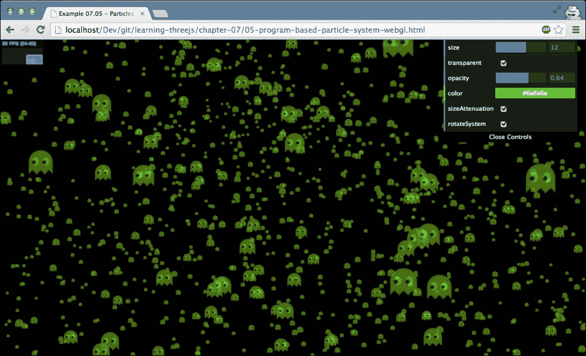
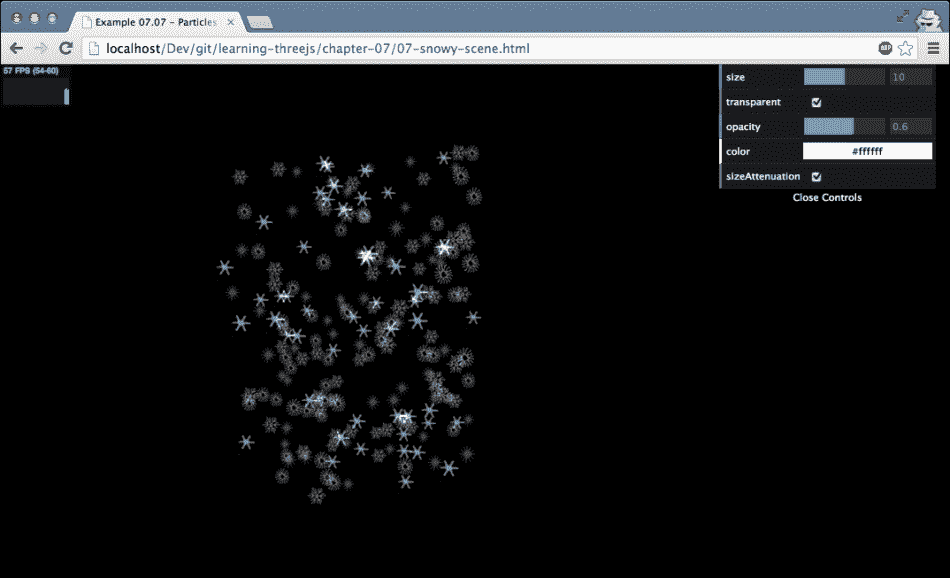

# 七、粒子、精灵和点云

在前几章中，我们讨论了 Three.js 必须提供的最重要的概念、对象和 API。在这一章中，我们将研究到目前为止唯一跳过的概念:粒子。使用粒子(有时也称为精灵)，很容易创建许多小对象，您可以使用它们来模拟雨、雪、烟和其他有趣的效果。例如，可以将单个几何图形渲染为一组粒子，并分别控制这些粒子。在本章中，我们将探讨由 Three.js 提供的各种粒子特性。更具体地说，我们将在本章中研究以下主题:

*   使用`THREE.SpriteMaterial`创建和造型粒子
*   使用点云创建成组的粒子集
*   从现有几何图形创建点云
*   为粒子和粒子系统设置动画
*   使用纹理来设定粒子的样式
*   使用画布用`THREE.SpriteCanvasMaterial`为粒子设置样式

让我们从探索什么是粒子以及如何创建粒子开始。不过，在我们开始之前，先简单介绍一下本章中使用的一些名称。在最近版本的 Three.js 中，与粒子相关的对象的名称发生了变化。我们在本章中使用的`THREE.PointCloud`曾经被称为`THREE.ParticleSystem`、`THREE.Sprite`曾经被称为`THREE.Particle`，材质也发生了一些名称上的变化。所以，如果你在网上看到使用这些旧名称的例子，请记住它们谈论的是相同的概念。在本章中，我们将使用最新版本的 Three.js 中引入的新命名约定

# 理解粒子

就像我们对大多数新概念所做的一样，我们将从一个例子开始。在本章的资料中，你会发现一个名为`01-particles.html`的例子。打开这个例子，你会看到一个看起来非常无趣的白色立方体网格，如下图所示:


你在这张截图中看到的是 100 个精灵。雪碧是一架 2D 飞机，总是对着镜头。如果您创建一个没有任何属性的精灵，它们将被渲染为白色的二维小方块。这些精灵是用下面几行代码创建的:

```js
function createSprites() {
  var material = new THREE.SpriteMaterial();
  for (var x = -5; x < 5; x++) {
    for (var y = -5; y < 5; y++) {
      var sprite = new THREE.Sprite(material);
      sprite.position.set(x * 10, y * 10, 0);
      scene.add(sprite);
    }
  }
}
```

在这个例子中，我们使用`THREE.Sprite(material)`构造函数手动创建精灵。我们传入的唯一物品是一种材质。这必须是`THREE.SpriteMaterial`或`THREE.SpriteCanvasMaterial`。在本章的剩余部分，我们将更深入地研究这两种材质。

在我们继续讨论更有趣的粒子之前，让我们仔细看看`THREE.Sprite`对象。一个`THREE.Sprite`物体从`THREE.Object3D`物体延伸出来，就像`THREE.Mesh`一样。这意味着您从`THREE.Mesh`了解到的大多数属性和功能都可以在`THREE.Sprite`上使用。您可以使用`position`属性设置它的位置，使用`scale`属性缩放它，并使用`translate`属性相对移动它。

### 类型

请注意，在较旧版本的 Three.js 中，您无法将`THREE.Sprite`对象与`THREE.WebGLRenderer`一起使用，只能与`THREE.CanvasRenderer`一起使用。在当前版本中，`THREE.Sprite`对象可以与两个渲染器一起使用。

借助`THREE.Sprite`，你可以非常容易地创建一组对象，并在场景中移动它们。当您处理少量对象时，这非常有效，但是当您想要处理大量`THREE.Sprite`对象时，您会很快遇到性能问题，因为每个对象都需要由Three.js 单独管理。Three.js 提供了一种使用`THREE.PointCloud`处理大量子画面(或粒子)的替代方法。有了`THREE.PointCloud`，Three.js 不需要管理很多单个的`THREE.Sprite`对象，只需要管理`THREE.PointCloud`实例。

为了获得与我们之前看到的截图相同的结果，但这次使用`THREE.PointCloud`，我们执行以下操作:

```js
function createParticles() {

  var geom = new THREE.Geometry();
  var material = new THREE.PointCloudMaterial({size: 4, vertexColors: true, color: 0xffffff});

  for (var x = -5; x < 5; x++) {
    for (var y = -5; y < 5; y++) {
      var particle = new THREE.Vector3(x * 10, y * 10, 0);
      geom.vertices.push(particle);
      geom.colors.push(new THREE.Color(Math.random() * 0x00ffff));
    }
  }

  var cloud = new THREE.PointCloud(geom, material);
  scene.add(cloud);
}
```

正如你看到的，对于每个粒子(云中的每个点)，我们需要创建一个顶点(由`THREE.Vector3`表示)，将其添加到`THREE.Geometry`中，与`THREE.PointCloudMaterial`一起使用`THREE.Geometry`创建`THREE.PointCloud`，并将云添加到场景中。在`02-particles-webgl.html`示例中可以找到`THREE.PointCloud`正在运行的示例(带有彩色方块)。下面的截图显示了这个例子:


在接下来的章节中，我们将进一步探讨`THREE.PointCloud`。

# 粒子，三。点云和三。PointCloudMaterial

上一节结束，我们快速介绍了`THREE.PointCloud`。 `THREE.PointCloud`的构造器有两个属性:几何和材质。材质用于给粒子着色和纹理化(我们将在后面看到)，几何图形定义了单个粒子的位置。用于定义几何图形的每个顶点和每个点都显示为粒子。当我们基于`THREE.BoxGeometry`创建`THREE.PointCloud`时，我们得到 8 个粒子，立方体的每个角一个。不过，通常情况下，您不会从标准的三个几何图形中创建`THREE.PointCloud`，而是像我们在上一节结束时所做的那样，手动将顶点添加到从头开始创建的几何图形中(或者使用外部加载的模型)。在本节中，我们将深入探讨这种方法，并看看如何使用`THREE.PointCloudMaterial`来设置粒子的样式。我们将使用`03-basic-point-cloud.html`示例来探讨这一点。下面的截图显示了这个例子:


在这个的例子中，我们创建`THREE.PointCloud`，我们用 15，000 个粒子填充它。所有的粒子都是用`THREE.PointCloudMaterial`设计的。为了创建`THREE.PointCloud`，我们使用了以下代码:

```js
function createParticles(size, transparent, opacity, vertexColors, sizeAttenuation, color) {

  var geom = new THREE.Geometry();
  var material = new THREE.PointCloudMaterial({size: size, transparent: transparent, opacity: opacity, vertexColors: vertexColors, sizeAttenuation: sizeAttenuation, color: color});

  var range = 500;
  for (var i = 0; i < 15000; i++) {
    var particle = new THREE.Vector3(Math.random() * range - range / 2, Math.random() * range - range / 2, Math.random() * range - range / 2);
    geom.vertices.push(particle);
    var color = new THREE.Color(0x00ff00);
    color.setHSL(color.getHSL().h, color.getHSL().s, Math.random() * color.getHSL().l);
    geom.colors.push(color);
  }

  cloud = new THREE.PointCloud(geom, material);
  scene.add(cloud);
}
```

在这个列表中，我们首先创建`THREE.Geometry`。我们将把表示为`THREE.Vector3`的粒子添加到这个几何图形中。为此，我们创建了一个简单的循环，在随机位置创建`THREE.Vector3`并添加它。在同一个循环中，我们还指定了当我们将`THREE.PointCloudMaterial`的`vertexColors`属性设置为`true`时使用的颜色数组`geom.colors`。最后要做的就是创建 `THREE.PointCloudMaterial`并添加到场景中。

下表说明了您可以在`THREE.PointCloudMaterial`上设置的所有属性:

<colgroup><col style="text-align: left"> <col style="text-align: left"></colgroup> 
| 

名字

 | 

描述

 |
| --- | --- |
| `color` | 这是`ParticleSystem`中所有粒子的颜色。将`vertexColors`属性设置为真，并使用几何图形的颜色属性指定颜色会覆盖该属性(更准确地说，顶点的颜色将与该值相乘以确定最终颜色)。默认值为`0xFFFFFF`。 |
| 地图 | 利用这个属性，可以对粒子应用纹理。例如，你可以让它们看起来像雪花。这个属性没有在这个例子中显示，但是将在本章后面解释。 |
| 大小 | 这是粒子的大小。默认值为`1`。 |
| 大小变化 | 如果设置为假，所有粒子将具有相同的大小，无论它们离相机有多远。如果设置为真，则大小基于与摄像机的距离。默认值为`true`。 |
| 脊椎动物 | 正常情况下，`THREE.PointCloud`中的所有粒子颜色相同。如果此属性设置为`THREE.VertexColors`，并且几何图形中的颜色数组已被填充，则将使用该数组中的颜色(另请参见此表中的颜色条目)。默认值为`THREE.NoColors`。 |
| 不透明 | 这与透明属性一起设置粒子的不透明度。默认值为`1`(无不透明度)。 |
| 透明的 | 如果此设置为真，粒子将以不透明度属性设置的不透明度渲染。默认值为`false`。 |
| 混合 | 这是渲染粒子时使用的混合模式。有关混合模式的更多信息，请参见[第 9 章](09.html "Chapter 9. Animations and Moving the Camera")、*动画和移动相机*。 |
| 雾 | 此决定粒子是否受到添加到场景中的雾的影响。这默认为`true`。 |

前面的例子提供了一个简单的控制菜单，你可以用它来实验`THREE.ParticleCloudMaterial`特有的属性。

到目前为止，我们只将粒子渲染为小立方体，这是默认行为。但是，您还可以使用其他一些方法来设置粒子的样式:

*   我们可以应用`THREE.SpriteCanvasMaterial`(仅适用于`THREE.CanvasRenderer`)将 HTML 画布元素的结果用作纹理
*   使用`THREE.SpriteMaterial`和基于 HTML5 的纹理来使用 HTML 画布的输出
*   加载一个带有`THREE.PointCloudMaterial`属性的外部图像文件(或使用 HTML5 画布)来设置`THREE.ParticleCloud`的所有粒子的样式

在下一节中，我们将探讨如何做到这一点。

# 用 HTML5 画布造型粒子

Three.js 提供了三种不同的方式，你可以使用 HTML5 画布来设计你的粒子。如果使用`THREE.CanvasRenderer`，可以从`THREE.SpriteCanvasMaterial`直接引用一个 HTML5 画布。当你使用`THREE.WebGLRenderer`时，你需要采取一些额外的步骤来使用 HTML5 画布来设计你的粒子。在接下来的两节中，我们将向您展示不同的方法。

## 使用 HTML5 画布配合三。CanvasRenderer

通过 `THREE.SpriteCanvasMaterial`，你可以使用 HTML5 画布的输出作为你的粒子的纹理。这种材质是专门为`THREE.CanvasRenderer`和创建的，只有当您使用这种特定的渲染器时才能使用。在我们了解如何使用这种材质之前，让我们先来看看您可以在这种材质上设置的属性:

<colgroup><col style="text-align: left"> <col style="text-align: left"></colgroup> 
| 

名字

 | 

描述

 |
| --- | --- |
| `color` | 这个是粒子的颜色。根据指定的`blending`模式，这会影响画布图像的颜色。 |
| `program` | 这是一个以画布上下文为参数的函数。渲染粒子时调用此函数。调用此 2D 绘图上下文的输出显示为粒子。 |
| `opacity` | 这决定了粒子的不透明度。默认值为`1`，没有不透明度。 |
| `transparent` | 这决定了粒子是否透明。这与`opacity`属性一起工作。 |
| `blending` | 这是要使用的混合模式。详见[第九章](09.html "Chapter 9. Animations and Moving the Camera")、*动画和移动镜头*。 |
| `rotation` | 这个属性允许你旋转画布的内容。您通常需要将其设置为 PI，以正确对齐画布的内容。请注意，此属性不能传递给材质的构造函数，但需要显式设置。 |

要查看`THREE.SpriteCanvasMaterial`的动作，可以打开`04-program-based-sprites.html`示例。下面的截图显示了这个例子:


在本例中，粒子是在`createSprites`功能中创建的:

```js
function createSprites() {

  var material = new THREE.SpriteCanvasMaterial({
    program: draw,
    color: 0xffffff});
   material.rotation = Math.PI;

  var range = 500;
  for (var i = 0; i < 1000; i++) {
    var sprite = new THREE.Sprite(material);
    sprite.position = new THREE.Vector3(Math.random() * range - range / 2, Math.random() * range - range / 2, Math.random() * range - range / 2);
    sprite.scale.set(0.1, 0.1, 0.1);
    scene.add(sprite);
  }
}
```

这段代码看起来很像我们在上一节看到的代码。主要的变化是因为我们使用的是`THREE.CanvasRenderer`，所以我们直接创建`THREE.Sprite`对象，而不是使用`THREE.PointCloud`。在这段代码中，我们还用指向`draw`函数的`program`属性来定义`THREE.SpriteCanvasMaterial`。这个`draw`函数定义了粒子的样子(在我们的例子中，是来自*吃豆人*的幽灵):

```js
var draw = function(ctx) {
  ctx.fillStyle = "orange";
  ...
  // lots of other ctx drawing calls
  ...
  ctx.beginPath();
  ctx.fill();
}
```

我们不会深入研究绘制形状所需的实际画布代码。这里重要的是，我们定义了一个接受 2D 画布上下文(`ctx`)作为参数的函数。绘制在该上下文上的所有内容都被用作`THREE.Sprite`的形状。

## 使用带有 WebGLRenderer 的 HTML5 画布

如果我们想要使用一个带有`THREE.WebGLRenderer`的 HTML5 画布，我们可以采取两种不同的方法。我们可以使用`THREE.PointCloudMaterial`创建`THREE.PointCloud`，也可以使用`THREE.Sprite`和`THREE.SpriteMaterial`的`map`属性。

让我们从第一种方法开始，创建`THREE.PointCloud`。在`THREE.PointCloudMaterial`的属性中，我们提到了`map`属性。利用`map`属性，我们可以为粒子加载纹理。使用 Three.js，这个纹理也可以是 HTML5 画布的输出。`05a-program-based-point-cloud-webgl.html`就是体现这一理念的例子。下面的截图显示了这个例子:



让我们看看我们为了得到这个效果而写的代码。大部分的代码与我们之前的 WebGL 示例相同，所以就不赘述了。这里显示了为获得此示例而进行的重要代码更改:

```js
var getTexture = function() {
  var canvas = document.createElement('canvas');
  canvas.width = 32;
  canvas.height = 32;

  var ctx = canvas.getContext('2d');
  ...
  // draw the ghost
  ...
  ctx.fill();
  var texture = new THREE.Texture(canvas);
  texture.needsUpdate = true;
  return texture;
}

function createPointCloud(size, transparent, opacity, sizeAttenuation, color) {

  var geom = new THREE.Geometry();

  var material = new THREE.PointCloudMaterial ({size: size, transparent: transparent, opacity: opacity, map: getTexture(), sizeAttenuation: sizeAttenuation, color: color});

  var range = 500;
  for (var i = 0; i < 5000; i++) {
    var particle = new THREE.Vector3(Math.random() * range - range / 2, Math.random() * range - range / 2, Math.random() * range - range / 2);
    geom.vertices.push(particle);
  }

  cloud = new THREE.PointCloud(geom, material);
  cloud.sortParticles = true;
  scene.add(cloud);
}
```

在`getTexture`这两个 JavaScript 函数的第一个中，我们基于一个 HTML5 画布元素创建`THREE.Texture`。在第二个函数`createPointCloud`中，我们将这个纹理分配给`THREE.PointCloudMaterial`的`map`属性。在该功能中，还可以看到我们将`THREE.PointCloud`的`sortParticles`属性设置为`true`。该属性确保在渲染粒子之前，粒子根据其在屏幕上的 *z* 位置进行排序。如果您看到部分重叠的粒子或不正确的透明度，将此属性设置为`true`将(在大多数情况下)解决这个问题。但是，您应该注意，将该属性设置为`true`将影响场景的性能。当该参数设置为真时，Three.js 必须确定每个粒子到摄像机的距离。对于非常大的`THREE.PointCloud`对象，这可能会对性能产生很大影响。

当我们谈论`THREE.PointCloud`的属性时，您可以在`THREE.PointCloud: FrustumCulled`上设置一个额外的属性。如果此属性设置为 true，这意味着如果粒子落在可见的相机范围之外，它们不会被渲染。如果需要，这可以用来提高性能和帧速率。

这样做的结果是，我们在`getTexture()`方法中绘制到画布上的所有内容都用于`THREE.PointCloud`中的粒子。在下一节中，我们将更深入地研究如何使用从外部文件加载的纹理。请注意，在这个例子中，我们只看到了纹理的一小部分。在[第 10 章](10.html "Chapter 10. Loading and Working with Textures")、*加载和处理纹理*中，我们将深入了解纹理的细节。

在这一节的开始，我们提到我们也可以使用`THREE.Sprite`和 `map`属性来创建一个基于画布的粒子。为此，我们使用与上一个示例中相同的方法创建`THREE.Texture`。然而，这一次，我们将其分配给`THREE.Sprite`如下:

```js
function createSprites() {
  var material = new THREE.SpriteMaterial({
    map: getTexture(),
    color: 0xffffff
  });

  var range = 500;
  for (var i = 0; i < 1500; i++) {
    var sprite = new THREE.Sprite(material);
    sprite.position.set(Math.random() * range - range / 2, Math.random() * range - range / 2, Math.random() * range - range / 2);
    sprite.scale.set(4,4,4);
    scene.add(sprite);
  }
}
```

在这里，您可以看到我们使用了一个标准的`THREE.SpriteMaterial`对象，并将画布的输出指定为`THREE.Texture`给材质的`map`属性。您可以通过在浏览器中打开`05b-program-based-sprites-webgl.html`来查看这方面的示例。这两种方法都有各自的优缺点。有了`THREE.Sprite`，你可以更好地控制单个粒子，但是当你处理大量粒子时，它会变得不那么高效和复杂。借助`THREE.PointCloud`，您可以轻松管理大量粒子，但对每个单个粒子的控制较少。

# 使用纹理为粒子设置样式

在前面的示例中，我们看到了如何使用 HTML5 画布来设计`THREE.PointCloud`和单个`THREE.Sprite`对象的样式。既然你可以画出你想要的任何东西，甚至可以加载外部图像，你可以用这种方法给粒子系统添加各种风格。但是，有一种更直接的方法可以使用图像来设置粒子的样式。您可以使用`THREE.ImageUtils.loadTexture()`功能将图像加载为`THREE.Texture`。`THREE.Texture`随后可以被分配给材质的`map`属性。

在本节中，我们将向您展示两个示例，并解释如何创建它们。这两个例子都使用图像作为粒子的纹理。在第一个例子中，我们创建了雨的模拟，`06-rainy-scene.html`。下面的截图显示了这个例子:


我们需要做的第一件事是获得一个纹理来代表我们的雨滴。你可以在`img/textures/particles`文件夹中找到几个例子。在[第九章](09.html "Chapter 9. Animations and Moving the Camera")、*动画和移动相机*中，我们将解释纹理的所有细节和要求。现在，你只需要知道纹理应该是正方形，最好是 2 的幂(例如，64 x 64，128 x 128，256 x 256)。对于这个例子，我们将使用这个纹理:


该图像使用黑色背景(正确混合所需)，并显示雨滴的形状和颜色。在`THREE.PointCloudMaterial`中使用这个纹理之前，我们首先需要加载它。这可以通过下面一行代码来完成:

```js
var texture = THREE.ImageUtils.loadTexture("../img/textures/particles/raindrop-2.png");
```

有了这行代码，Three.js 将加载纹理，我们可以在我们的素材中使用它。在这个例子中，我们这样定义材质:

```js
var material = new THREE.PointCloudMaterial({size: 3, transparent: true, opacity: true, map: texture, blending: THREE.AdditiveBlending, sizeAttenuation: true, color: 0xffffff});
```

在本章中，我们已经讨论了所有这些属性。这里要理解的主要是`map`属性指向我们加载了`THREE.ImageUtils.loadTexture()`函数的纹理，我们指定`THREE.AdditiveBlending`为`blending`模式。这种`blending`模式意味着当绘制一个新像素时，背景像素的颜色会添加到这个新像素的颜色中。对于我们的雨滴纹理，这意味着黑色背景不会显示。一个合理的选择是用透明背景替换我们纹理中的黑色，但不幸的是，这不适用于粒子和 WebGL。

这有助于造型`THREE.PointCloud`。当你打开这个例子时，你还会看到粒子本身在运动。在前面的例子中，我们移动了整个粒子系统；这一次，我们将单个粒子定位在`THREE.PointCloud`内。这样做其实很简单。每个粒子都表示为一个顶点，该顶点构成了用于创建`THREE.PointCloud`的几何图形。让我们看看如何为`THREE.PointCloud`添加粒子:

```js
var range = 40;
for (var i = 0; i < 1500; i++) {
  var particle = new THREE.Vector3(Math.random() * range - range / 2, Math.random() * range * 1.5, Math.random() * range - range / 2);

  particle.velocityX = (Math.random() - 0.5) / 3;
  particle.velocityY = 0.1 + (Math.random() / 5);
  geom.vertices.push(particle);
}
```

这与我们之前看到的例子没有什么不同。这里，我们为每个粒子添加了两个附加属性(`THREE.Vector3` ): `velocityX`和`velocityY`。第一个定义粒子(雨滴)如何水平移动，第二个定义雨滴下落的速度。水平速度范围从-0.16 到+0.16，垂直速度范围从 0.1 到 0.3。现在每个雨滴都有自己的速度，我们可以在渲染循环中移动单个粒子:

```js
var vertices = system2.geometry.vertices;
vertices.forEach(function (v) {
  v.x = v.x - (v.velocityX);
  v.y = v.y - (v.velocityY);

  if (v.x <= -20 || v.x >= 20) v.velocityX = v.velocityX * -1;
  if (v.y <= 0) v.y = 60;
});
```

在这段代码中，我们从用于创建`THREE.PointCloud`的几何图形中获得所有`vertices`(粒子)。对于每个粒子，我们取`velocityX`和`velocityY`并用它们来改变粒子的当前位置。最后两行确保粒子保持在我们定义的范围内。如果`v.y`位置下降到零度以下，我们将雨滴加回顶部，如果`v.x`位置到达任何边缘，我们通过反转水平速度使其反弹。

让我们看另一个例子。这次，我们不会下雨，但会下雪。此外，我们不会只使用一个纹理，但我们将使用五个单独的图像(取自 Three.js 示例)。让我们从再次看结果开始(见`07-snowy-scene.html`):



在前面的截图中，您可以看到，我们使用了多个图像，而不是仅使用单个图像作为纹理。你可能想知道我们是怎么做到的。你可能还记得，我们只能有一种材质用于`THREE.PointCloud`。如果我们想要有多种材质，我们只需要制造多个粒子系统，如下所示:

```js
function createPointClouds(size, transparent, opacity, sizeAttenuation, color) {

  var texture1 = THREE.ImageUtils.loadTexture("../img/textures/particles/snowflake1.png");
  var texture2 = THREE.ImageUtils.loadTexture("../img/textures/particles/snowflake2.png");
  var texture3 = THREE.ImageUtils.loadTexture("../img/textures/particles/snowflake3.png");
  var texture4 = THREE.ImageUtils.loadTexture("../img/textures/particles/snowflake5.png");

  scene.add(createPointCloud("system1", texture1, size, transparent, opacity, sizeAttenuation, color));
  scene.add(createPointCloud ("system2", texture2, size, transparent, opacity, sizeAttenuation, color));
  scene.add(createPointCloud ("system3", texture3, size, transparent, opacity, sizeAttenuation, color));
  scene.add(createPointCloud ("system4", texture4, size, transparent, opacity, sizeAttenuation, color));
}
```

在这里，你可以看到我们分别加载纹理，将所有关于如何创建`THREE.PointCloud`的信息传递给`createPointCloud`功能。该函数如下所示:

```js
function createPointCloud(name, texture, size, transparent, opacity, sizeAttenuation, color) {
  var geom = new THREE.Geometry();

  var color = new THREE.Color(color);
  color.setHSL(color.getHSL().h, color.getHSL().s, (Math.random()) * color.getHSL().l);

  var material = new THREE.PointCloudMaterial({size: size, transparent: transparent, opacity: opacity, map: texture, blending: THREE.AdditiveBlending, depthWrite: false, sizeAttenuation: sizeAttenuation, color: color});

  var range = 40;
  for (var i = 0; i < 50; i++) {
    var particle = new THREE.Vector3(Math.random() * range - range / 2, Math.random() * range * 1.5, Math.random() * range - range / 2);
    particle.velocityY = 0.1 + Math.random() / 5;
    particle.velocityX = (Math.random() - 0.5) / 3;
    particle.velocityZ = (Math.random() - 0.5) / 3;
    geom.vertices.push(particle);
  }

  var cloud = new THREE.ParticleCloud(geom, material);
  cloud.name = name;
  cloud.sortParticles = true;
  return cloud;
}
```

我们在这个函数中做的第一件事是定义这个特定纹理的粒子应该呈现的颜色。这是通过随机改变传入颜色的*亮度*来实现的。接下来，以与我们之前相同的方式创建材质。这里唯一的变化是`depthWrite`属性被设置为`false`。此属性定义此对象是否影响 WebGL 深度缓冲区。通过将此设置为`false`，我们可以确保各个点云不会相互干扰。如果该属性未设置为`false`，您将看到当一个粒子位于另一个`THREE.PointCloud`对象的粒子前面时，纹理的黑色背景有时会显示出来。这段代码的最后一步是随机放置粒子，并为每个粒子添加随机速度。在渲染循环中，我们现在可以更新每个`THREE.PointCloud`对象的所有粒子的位置，如下所示:

```js
scene.children.forEach(function (child) {
  if (child instanceof THREE.ParticleSystem) {
    var vertices = child.geometry.vertices;
    vertices.forEach(function (v) {
      v.y = v.y - (v.velocityY);
      v.x = v.x - (v.velocityX);
      v.z = v.z - (v.velocityZ);

      if (v.y <= 0) v.y = 60;
      if (v.x <= -20 || v.x >= 20) v.velocityX = v.velocityX * -1;
      if (v.z <= -20 || v.z >= 20) v.velocityZ = v.velocityZ * -1;
    });
  }
});
```

通过这种方法，我们可以得到具有不同纹理的粒子。然而，这种方法有点局限。我们想要的不同纹理越多，我们需要创建和管理的点云就越多。如果你有一组有限的不同风格的粒子，你最好使用我们在本章开头展示的`THREE.Sprite`对象。

# 使用精灵地图

在本章的开头，我们使用了一个`THREE.Sprite`对象来渲染带有`THREE.CanvasRenderer`和`THREE.WebGLRenderer`的单个粒子。这些精灵被定位在 3D 世界的某个地方，它们的大小是基于离相机的距离(这有时也被称为**广告牌**)。在本节中，我们将展示`THREE.Sprite`对象的另一种用法。我们将向您展示如何使用`THREE.Sprite`创建一个类似于**平视显示器** ( **平视显示器**)的图层，通过一个额外的`THREE.OrthographicCamera`实例来显示您的 3D 内容。我们还将向您展示如何使用精灵贴图为`THREE.Sprite`对象选择图像。

举个例子，我们将创建一个简单的`THREE.Sprite`对象，它在屏幕上从左向右移动。在背景中，我们将使用移动的相机渲染一个 3D 场景，以说明`THREE.Sprite`独立于相机移动。下面的截图显示了我们将为第一个示例(`08-sprites.html`)创建的内容:


如果你在浏览器中打开这个例子，你会看到一个类似 Pac-Man 幽灵的精灵在屏幕上移动，只要它碰到右边，就会改变颜色和形状。我们要做的第一件事是看看我们是如何创建`THREE.OrthographicCamera`和一个单独的场景来渲染`THREE.Sprite`的:

```js
var sceneOrtho = new THREE.Scene();
var cameraOrtho = new THREE.OrthographicCamera( 0, window.innerWidth, window.innerHeight, 0, -10, 10 );
```

接下来，我们来看看`THREE.Sprite`的构造，以及精灵可以采取的各种形状是如何加载的:

```js
function getTexture() {
  var texture = new THREE.ImageUtils.loadTexture("../img/textures/particles/sprite-sheet.png");
  return texture;
}

function createSprite(size, transparent, opacity, color, spriteNumber) {
  var spriteMaterial = new THREE.SpriteMaterial({
    opacity: opacity,
    color: color,
    transparent: transparent,
    map: getTexture()});

  // we have 1 row, with five sprites
  spriteMaterial.map.offset = new THREE.Vector2(1/5 * spriteNumber, 0);
  spriteMaterial.map.repeat = new THREE.Vector2(1/5, 1);
  spriteMaterial.blending = THREE.AdditiveBlending;

  // makes sure the object is always rendered at the front
  spriteMaterial.depthTest = false;
  var sprite = new THREE.Sprite(spriteMaterial);
  sprite.scale.set(size, size, size);
  sprite.position.set(100, 50, 0);
  sprite.velocityX = 5;

  sceneOrtho.add(sprite);
}
```

在`getTexture()`功能中，我们加载一个纹理。然而，我们不是为每个*幽灵*加载五个不同的图像，而是加载一个包含所有精灵的纹理。纹理看起来像这样:


通过`map.offset`和`map.repeat`属性，我们选择正确的精灵显示在屏幕上。使用`map.offset`属性，我们为加载的纹理确定 *x* 轴(u)和 *y* 轴(v)的偏移。这些属性的范围从 0 到 1。在我们的例子中，如果我们想选择第三个重影，我们将 u 偏移( *x* 轴)设置为 0.4，并且，因为我们只有一行，所以我们不需要更改 v 偏移( *y* 轴)。如果我们只设置这个属性，纹理会在屏幕上显示第三个、第四个和第五个压缩在一起的幽灵。为了只显示一个鬼，我们需要放大。我们通过将 u 值的`map.repeat`属性设置为 1/5 来实现。这意味着我们放大(仅针对 *x* 轴)仅显示 20%的纹理，这正好是一个鬼。

我们需要做的最后一步是更新`render`功能:

```js
webGLRenderer.render(scene, camera);
webGLRenderer.autoClear = false;
webGLRenderer.render(sceneOrtho, cameraOrtho);
```

我们首先用普通相机和移动的球体渲染场景，然后渲染包含精灵的场景。注意，我们需要将 WebGLRenderer 的`autoClear`属性设置为`false`。如果我们不这样做，Three.js 将在渲染精灵之前清除场景，球体将不会出现。

下表显示了我们在前面示例中使用的`THREE.SpriteMaterial`的所有属性的概述:

<colgroup><col style="text-align: left"> <col style="text-align: left"></colgroup> 
| 

名字

 | 

描述

 |
| --- | --- |
| `color` | 这是雪碧的颜色。 |
| `map` | 这个就是这个精灵要使用的纹理。这可以是一个精灵表，如本节中的示例所示。 |
| `sizeAnnutation` | 如果这是设置为`false`，雪碧的大小不会受到它离开相机的距离的影响。默认值为`true`。 |
| `opacity` | 这将设置精灵的透明度。默认值为`1`(无不透明度)。 |
| `blending` | 这个定义了渲染精灵时使用的混合模式。有关混合模式的更多信息，请参见[第 9 章](09.html "Chapter 9. Animations and Moving the Camera")、*动画和移动相机*。 |
| `fog` | 这个决定了雪碧是否受到添加到场景中的雾的影响。这默认为`true`。 |

您也可以在此材质上设置`depthTest`和`depthWrite`属性。有关这些属性的更多信息，请参见[第 4 章](04.html "Chapter 4. Working with Three.js Materials")、*使用三杰材质*。

当然，我们也可以在 3D 中定位`THREE.Sprites`时使用精灵地图(就像我们在本章开头所做的那样)。这方面的一个例子(`09-sprites-3D.html`)如下图所示:


利用我们在上表中看到的属性，我们可以非常容易地创建我们在前面截图中看到的效果:

```js
function createSprites() {

  group = new THREE.Object3D();
  var range = 200;
  for (var i = 0; i < 400; i++) {
    group.add(createSprite(10, false, 0.6, 0xffffff, i % 5, range));
  }
  scene.add(group);
}

function createSprite(size, transparent, opacity, color, spriteNumber, range) {

  var spriteMaterial = new THREE.SpriteMaterial({
    opacity: opacity,
    color: color,
    transparent: transparent,
    map: getTexture()}
  );

  // we have 1 row, with five sprites
  spriteMaterial.map.offset = new THREE.Vector2(0.2*spriteNumber, 0);
  spriteMaterial.map.repeat = new THREE.Vector2(1/5, 1);
  spriteMaterial.depthTest = false;

  spriteMaterial.blending = THREE.AdditiveBlending;

  var sprite = new THREE.Sprite(spriteMaterial);
  sprite.scale.set(size, size, size);
  sprite.position.set(Math.random() * range - range / 2, Math.random() * range - range / 2, Math.random() * range - range / 2);
  sprite.velocityX = 5;

  return sprite;
}
```

在这个的例子中，我们基于之前展示的精灵表创建了 400 个精灵。您可能会知道并理解这里显示的大多数属性和概念。由于我们已经将单独的精灵添加到一个组中，旋转它们非常容易，可以这样做:

```js
group.rotation.x+=0.1;
```

在这一章中，到目前为止，我们主要关注从头开始创建精灵和点云。然而，一个有趣的选择是从现有的几何图形中创建`THREE.PointCloud`。

# 创造三。来自高级几何图形的点云

当你记住，`THREE.PointCloud`根据提供的几何图形的顶点渲染每个粒子。这意味着，如果我们提供一个复杂的几何图形(例如，一个环面结或一个管)，我们可以基于该特定几何图形的顶点创建`THREE.PointCloud`。对于本章的最后一节，我们将创建一个环面结，就像我们在上一章中看到的那样，并将其渲染为`THREE.PointCloud`。

我们在上一章已经解释了环面结，所以这里就不多赘述了。我们使用的是前一章中的精确代码，我们添加了一个菜单选项，您可以使用它将渲染的网格转换为`THREE.PointCloud`。你可以在本章的资料中找到例子(`10-create-particle-system-from-model.html`)。下面的截图显示了这个例子:


正如您在前面的截图中看到的，用于生成环面结的每个顶点都被用作粒子。在这个例子中，我们添加了一个漂亮的材质，基于一个 HTML 画布，来创建这种发光的效果。我们只将创建材质和粒子系统的代码视为我们已经在本章中讨论了其他属性:

```js
function generateSprite() {

  var canvas = document.createElement('canvas');
  canvas.width = 16;
  canvas.height = 16;

  var context = canvas.getContext('2d');
  var gradient = context.createRadialGradient(canvas.width / 2, canvas.height / 2, 0, canvas.width / 2, canvas.height / 2, canvas.width / 2);

  gradient.addColorStop(0, 'rgba(255,255,255,1)');
  gradient.addColorStop(0.2, 'rgba(0,255,255,1)');
  gradient.addColorStop(0.4, 'rgba(0,0,64,1)');
  gradient.addColorStop(1, 'rgba(0,0,0,1)');

  context.fillStyle = gradient;
  context.fillRect(0, 0, canvas.width, canvas.height);

  var texture = new THREE.Texture(canvas);
  texture.needsUpdate = true;
  return texture;
}

function createPointCloud(geom) {
  var material = new THREE.PointCloudMaterial({
    color: 0xffffff,
    size: 3,
    transparent: true,
    blending: THREE.AdditiveBlending,
    map: generateSprite()
  });

  var cloud = new THREE.PointCloud(geom, material);
  cloud.sortParticles = true;
  return cloud;
}

// use it like this
var geom = new THREE.TorusKnotGeometry(...);
var knot = createPointCloud(geom);
```

在这个代码片段中，可以看到两个函数:`createPointCloud()`和`generateSprite()`。在第一个函数中，我们直接从提供的几何图形中创建一个简单的`THREE.PointCloud`对象(在本例中是一个圆环结)，并用`generateSprite()`函数将纹理(T3】属性设置为一个发光的点(在 HTML5 画布元素上生成)，如下所示:


# 总结

这一章到此结束。我们已经解释了什么是粒子、精灵和粒子系统，以及如何使用可用的材质来设计这些对象的样式。在这一章中，您看到了如何将`THREE.Sprite`直接与`THREE.CanvasRenderer`和`THREE.WebGLRenderer`一起使用。然而，如果你想创建大量粒子，你应该使用`THREE.PointCloud`。使用`THREE.PointCloud`，所有粒子共享相同的材质，您可以为单个粒子更改的唯一属性是它们的颜色，方法是将材质的`vertexColors`属性设置为`THREE.VertexColors`，并在用于创建`THREE.PointCloud`的`colors`数组中提供颜色值。我们还展示了如何通过改变粒子的位置来轻松制作粒子动画。这对于单个`THREE.Sprite`实例和用于创建`THREE.PointCloud`的几何图形的顶点来说是一样的。

到目前为止，我们已经基于 Three.js 提供的几何图形创建了网格。这对于简单的模型(如球体和立方体)非常有效，但是当您想要创建复杂的 3D 模型时，这不是最佳方法。对于这些模型，您通常会使用 3D 建模应用，如 Blender 或 3D 工作室 Max。在下一章中，您将学习如何加载和显示由这种 3D 建模应用创建的模型。