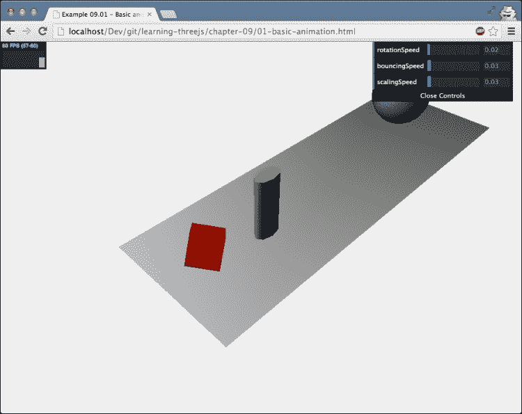
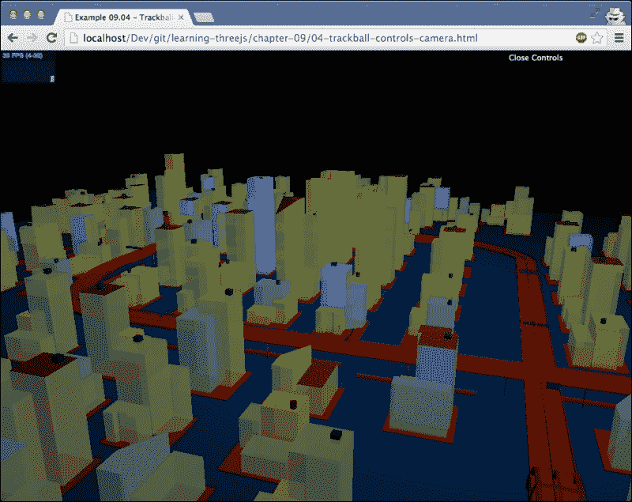
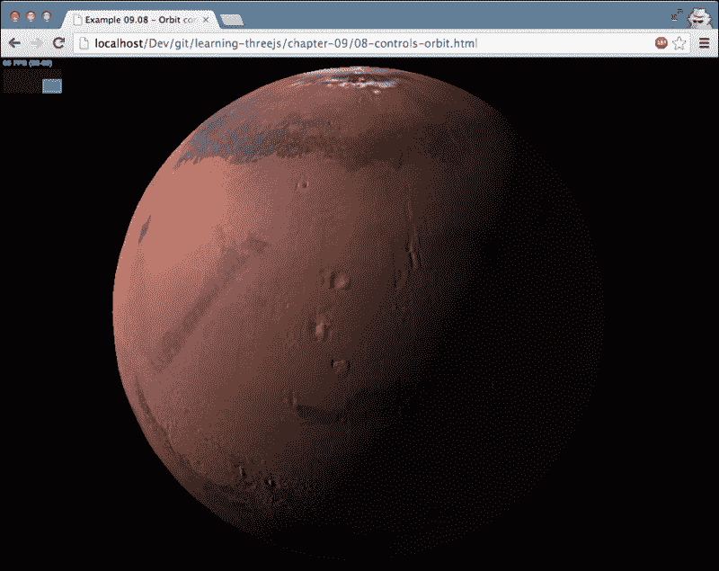
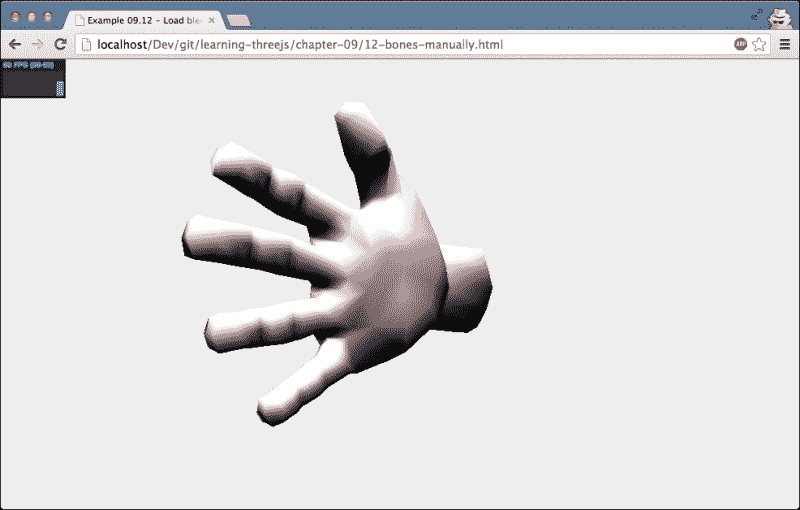
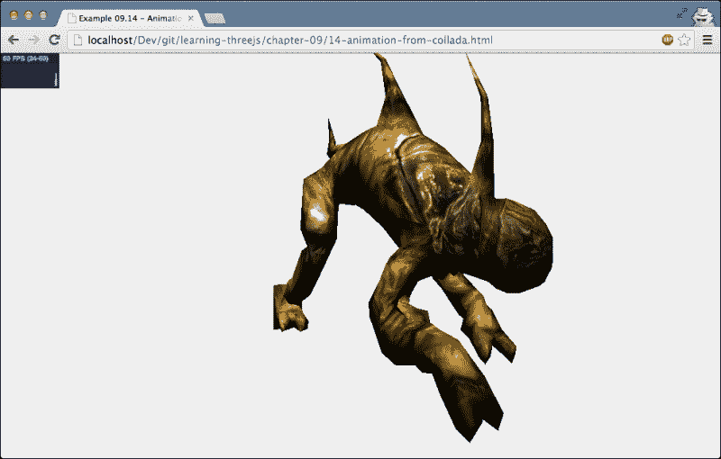

# 第九章。动画和移动相机

在前面的章节中，我们看到了一些简单的动画，但没有什么太复杂的。在[第 1 章](01.html "Chapter 1. Creating Your First 3D Scene with Three.js")、*用 Three.js* 创建你的第一个 3D 场景中，我们介绍了基本的渲染循环，在接下来的章节中，我们用它来旋转一些简单的对象，并展示了一些其他的基本动画概念。在本章中，我们将更详细地了解 Three.js 是如何支持动画的。

*   基本动画
*   移动摄像机
*   变形和蒙皮
*   加载外部动画

我们从动画背后的基本概念开始。

# 基本动画

在看示例之前，让我们快速回顾一下[第 1 章](01.html "Chapter 1. Creating Your First 3D Scene with Three.js")、*在渲染循环中用三个 js* 创建第一个 3D 场景时显示的内容。为了支持动画，我们需要告诉 Three.js 经常渲染场景。为此，我们使用标准的 HTML5 `requestAnimationFrame`功能，如下所示:

```js
render();

function render() {

  // render the scene
  renderer.render(scene, camera);
  // schedule the next rendering using requestAnimationFrame
  requestAnimationFrame(render);
}
```

有了这段代码，我们只需要在完成场景初始化后调用一次`render()`函数。在`render()`函数本身中，我们使用`requestAnimationFrame`来安排下一次渲染。这样，浏览器将确保以正确的时间间隔(通常每秒 60 次左右)调用`render()`功能。在浏览器中加入`requestAnimationFrame`之前，使用的是`setInterval(function, interval)`或`setTimeout(function, interval)`。这些函数每隔一段时间调用一次指定的函数。这种方法的问题在于，它没有考虑到正在发生的其他事情。即使您的动画没有显示或处于隐藏选项卡中，它仍会被调用并仍在使用资源。另一个问题是，这些函数无论何时被调用都会更新屏幕，而不是在浏览器的最佳时间，这意味着更高的 CPU 使用率。有了`requestAnimationFrame`，我们不告诉浏览器什么时候需要更新屏幕；我们要求浏览器在最合适的时候运行提供的功能。通常，这会导致 60 fps 左右的帧速率。有了`requestAnimationFrame`，你的动画会运行得更流畅，对 CPU 和 GPU 更友好，你自己也不用担心时间问题。

## 简单动画

通过这种方法，我们可以非常容易地通过改变物体的旋转、比例、位置、材质、顶点、面以及任何你能想象到的东西来制作物体的动画。在下一个渲染循环中，Three.js 将渲染已更改的属性。一个非常简单的例子，基于我们已经在[第 1 章](01.html "Chapter 1. Creating Your First 3D Scene with Three.js")、*中看到的用三个. js* 创建你的第一个 3D 场景，可以在`01-basic-animation.html`中找到。下面的截图显示了这个例子:



这个的渲染循环非常简单。只需更改相关网格的属性，剩下的就交给 Three.js 处理了。我们是这样做的:

```js
function render() {
  cube.rotation.x += controls.rotationSpeed;
  cube.rotation.y += controls.rotationSpeed;
  cube.rotation.z += controls.rotationSpeed;

  step += controls.bouncingSpeed;
  sphere.position.x = 20 + ( 10 * (Math.cos(step)));
  sphere.position.y = 2 + ( 10 * Math.abs(Math.sin(step)));

  scalingStep += controls.scalingSpeed;
  var scaleX = Math.abs(Math.sin(scalingStep / 4));
  var scaleY = Math.abs(Math.cos(scalingStep / 5));
  var scaleZ = Math.abs(Math.sin(scalingStep / 7));
  cylinder.scale.set(scaleX, scaleY, scaleZ);

  renderer.render(scene, camera);
  requestAnimationFrame(render);
}
```

这里没有什么引人注目的，但它很好地展示了我们在本书中讨论的基本动画背后的概念。在下一部分，我们将采取快速回避。除了动画，在更复杂的场景中使用 Three.js 时，您将很快遇到的一个重要方面是使用鼠标在屏幕上选择对象的能力。

## 选择对象

即使虽然与动画没有直接关系，但由于我们将在本章中研究相机和动画，它是对本章中解释的主题的一个很好的补充。我们将在这里展示如何使用鼠标从场景中选择一个对象。在查看示例之前，我们将首先查看为此所需的代码:

```js
var projector = new THREE.Projector();

function onDocumentMouseDown(event) {
  var vector = new THREE.Vector3(event.clientX / window.innerWidth ) * 2 - 1, -( event.clientY / window.innerHeight ) * 2 + 1, 0.5);
  vector = vector.unproject(camera);

  var raycaster = new THREE.Raycaster(camera.position, vector.sub(camera.position).normalize());

  var intersects = raycaster.intersectObjects([sphere, cylinder, cube]);

  if (intersects.length > 0) {
    intersects[ 0 ].object.material.transparent = true;
    intersects[ 0 ].object.material.opacity = 0.1;
  }
}
```

在这段代码中，我们使用`THREE.Projector`和`THREE.Raycaster`来确定我们是否点击了特定的对象。当我们点击屏幕时会发生以下情况:

1.  首先，`THREE.Vector3`是根据我们在屏幕上点击的位置创建的。
2.  接下来，使用`vector.unproject`功能，我们将屏幕上的点击位置转换为我们的 Three.js 场景中的坐标。换句话说，我们从屏幕坐标到世界坐标取消投影。
3.  接下来，我们创建`THREE.Raycaster`。借助`THREE.Raycaster`，我们可以将光线投射到场景中。在这种情况下，我们从摄像机的位置(`camera.position`)向场景中我们点击的位置发射光线。
4.  最后，我们使用`raycaster.intersectObjects`函数来确定是否有任何提供的物体被这条射线击中。

这最后一步的结果包含了被光线击中的任何物体的信息。提供了以下信息:

```js
distance: 49.9047088522448
face: THREE.Face3
faceIndex: 4
object: THREE.Mesh
point: THREE.Vector3
```

点击的网格为对象，`face`和`faceIndex`指向选中网格的面。`distance`值是从相机到被点击对象的距离，`point`是网格上被点击的确切位置。你可以在`02-selecting-objects.html`的例子中检验这一点。您单击的任何对象都将变得透明，选择的详细信息将打印到控制台上。

如果您想查看投射光线的路径，可以从菜单中启用`showRay`属性。下面的截图显示了用于选择蓝色球体的光线:


现在我们已经完成了这个小的间歇，让我们回到我们的动画。到目前为止，我们已经更改了渲染循环中的属性来制作对象的动画。在下一节中，我们将看一个小的库，它让定义动画变得更加容易。

## 用补间动画制作

Tween.js 是一个小 JavaScript 库，你可以从[https://github.com/sole/tween.js/](https://github.com/sole/tween.js/)下载，你可以用它来轻松定义一个属性在两个值之间的转换。开始值和结束值之间的所有中间点都是为您计算的。这个过程叫做**补间**。

对于实例，您可以使用该库在 10 秒内将网格的 *x* 位置从 10 更改为 3，如下所示:

```js
var tween = new TWEEN.Tween({x: 10}).to({x: 3}, 10000).easing(TWEEN.Easing.Elastic.InOut).onUpdate( function () {
  // update the mesh
})
```

在这个例子中，我们已经创建了`TWEEN.Tween`。这个补间将确保 *x* 属性在 10，000 毫秒内从 10 更改为 3。Tween.js 还允许您定义该属性如何随时间变化。这可以使用线性、二次或任何其他可能性来完成(参见[http://sole.github.io/tween.js/examples/03_graphs.html](http://sole.github.io/tween.js/examples/03_graphs.html)了解完整概述)。价值随时间变化的方式叫做 **放松**。使用 Tween.js，您可以使用`easing()`功能进行配置。

使用 Three.js 中的这个库非常简单。如果打开`03-animation-tween.html`示例，可以看到 Tween.js 库正在运行。以下屏幕截图显示了该示例的静态图像:


在这个的例子中，我们已经从[第 7 章](07.html "Chapter 7. Particles, Sprites, and the Point Cloud")、*粒子、精灵和点云*中获取了一个粒子云，并且将所有的粒子动画化到地面。这些粒子的位置基于使用 Tween.js 库创建的补间，如下所示:

```js
// first create the tweens
var posSrc = {pos: 1}
var tween = new TWEEN.Tween(posSrc).to({pos: 0}, 5000);
tween.easing(TWEEN.Easing.Sinusoidal.InOut);

var tweenBack = new TWEEN.Tween(posSrc).to({pos: 1}, 5000);
tweenBack.easing(TWEEN.Easing.Sinusoidal.InOut);

tween.chain(tweenBack);
tweenBack.chain(tween);

var onUpdate = function () {
  var count = 0;
  var pos = this.pos;

  loadedGeometry.vertices.forEach(function (e) {
    var newY = ((e.y + 3.22544) * pos) - 3.22544;
    particleCloud.geometry.vertices[count++].set(e.x, newY, e.z);
  });

  particleCloud.sortParticles = true;
};

tween.onUpdate(onUpdate);
tweenBack.onUpdate(onUpdate);
```

通过这段代码，我们创建了两个补间:`tween`和`tweenBack`。第一个定义位置属性如何从 1 转换到 0，第二个则相反。使用`chain()`功能，我们将这两个补间相互链接，因此这些补间在启动时将开始循环。我们在这里定义的最后一件事是`onUpdate`方法。在这种方法中，我们遍历粒子系统的所有顶点，并根据补间提供的位置改变它们的位置(`this.pos`)。

我们在加载模型时开始补间，所以在下面函数的末尾，我们调用`tween.start()`函数:

```js
var loader = new THREE.PLYLoader();
loader.load( "../img/models/test.ply", function (geometry) {
  ...
  tween.start()
  ...
});
```

当补间开始时，我们需要告诉 Tween.js 库我们希望它什么时候更新所有它知道的补间。我们通过调用`TWEEN.update()`函数来实现:

```js
function render() {
  TWEEN.update();
  webGLRenderer.render(scene, camera);
  requestAnimationFrame(render);
}
```

有了这些步骤，补间库将负责定位点云的各个点。正如您所看到的，使用这个库比自己管理转换要容易得多。

除了动画和改变对象，我们还可以通过移动相机来动画场景。在前面的章节中，我们已经通过手动更新相机的位置做了几次了。Three.js 还提供了许多更新相机的附加方法。

# 使用相机

Three.js 有许多相机控件，您可以使用它们来控制整个场景中的相机。这些控件位于 Three.js 发行版中，可以在`examples/js/controls`目录中找到。在本节中，我们将更详细地了解以下控件:

<colgroup><col style="text-align: left"> <col style="text-align: left"></colgroup> 
| 

名字

 | 

描述

 |
| --- | --- |
| `FirstPersonControls` | 这些是类似于第一人称射击游戏中的控制。用键盘四处移动，用鼠标四处查看。 |
| `FlyControls` | 这些是类似飞行模拟器的控制。用键盘和鼠标移动和操纵。 |
| `RollControls` | 这是更简单的版本`FlyControls`。允许您围绕 *z* 轴移动和滚动。 |
| `TrackBallControls` | 这些是最常用的控件，允许你使用鼠标(或轨迹球)在场景中轻松移动、平移和缩放。 |
| `OrbitControls` | 这个模拟一颗卫星在特定场景的轨道上运行。这允许你用鼠标和键盘移动。 |

这些控件是最有用的控件。除此之外，Three.js 还提供了许多您可以使用的附加控件(但这在本书中没有解释)。但是，使用这些控件的方式与上表中解释的方式相同:

<colgroup><col style="text-align: left"> <col style="text-align: left"></colgroup> 
| 

名字

 | 

描述

 |
| --- | --- |
| `DeviceOrientationControls` | 该根据设备的方向控制摄像机的移动。它在内部使用 HTML 设备定向 API([http://www.w3.org/TR/orientation-event/](http://www.w3.org/TR/orientation-event/))。 |
| `EditorControls` | 这些是专门为在线 3D 编辑器创建的控件。这是三网编辑器使用的，可以在[http://threejs.org/editor/](http://threejs.org/editor/)找到。 |
| `OculusControls` | 这些是允许你使用 Oculus Rift 设备在场景中四处查看的控件。 |
| `OrthographicTrackballControls` | 这是与`TrackBallControls`相同的控件，但专门为与`THREE.OrthographicCamera`一起使用而创建。 |
| `PointerLockControls` | 这是一个简单的控件，使用渲染场景的 DOM 元素锁定鼠标。这为简单的 3D 游戏提供了基本功能。 |
| `TransformControls` | 这是三. js 编辑器使用的内部控制。 |
| `VRControls` | 这是一个使用`PositionSensorVRDevice` API 控制场景的控件。关于这个标准的更多信息可以在[上找到。](https://developer.mozilla.org/en-US/docs/Web/API/Navigator.getVRDevices) |

除了使用这些相机控制，你当然也可以通过设置`position`自己移动相机，并使用`lookAt()`功能改变它指向的位置。

### 类型

如果您使用的是较旧版本的 Three.js，您可能会丢失一个名为`THREE.PathControls`的特定相机控件。通过这种控制，可以定义一个路径(例如使用`THREE.Spline`)并沿着该路径移动摄像机。在 Three.js 的最后一个版本中，由于代码的复杂性，这个控件被移除了。Three.js 背后的人目前正在研究一个替代品，但目前还没有。

我们要看的第一个控件是`TrackballControls`。

## 轨迹球控件

在可以使用`TrackballControls`之前，首先需要在页面中包含正确的 JavaScript 文件:

```js
<script type="text/javascript" src="../libs/TrackballControls.js"></script>
```

包括在内，我们可以创建控件并将它们附加到摄像机，如下所示:

```js
var trackballControls = new THREE.TrackballControls(camera);
trackballControls.rotateSpeed = 1.0;
trackballControls.zoomSpeed = 1.0;
trackballControls.panSpeed = 1.0;
```

更新相机的位置是我们在渲染循环中要做的事情，如下所示:

```js
var clock = new THREE.Clock();
function render() {
  var delta = clock.getDelta();
  trackballControls.update(delta);
  requestAnimationFrame(render);
  webGLRenderer.render(scene, camera);
}
```

在前面的代码片段中，我们看到了一个新的 Three.js 对象`THREE.Clock`。`THREE.Clock`对象可用于精确计算特定调用或渲染循环完成所需的时间。您可以通过调用`clock.getDelta()`函数来实现。该功能会将本次呼叫与前一次呼叫之间的经过时间返回`getDelta()`。为了更新摄像机的位置，我们调用`trackballControls.update()`功能。在此函数中，我们需要提供自上次调用此更新函数以来经过的时间。为此，我们使用`THREE.Clock`对象中的`getDelta()`功能。你可能会想，为什么我们不把帧率(1/60 秒)传递给`update`功能。原因是有了`requestAnimationFrame`，我们可以期待 60 fps，但这并不能保证。根据各种外部因素，帧速率可能会发生变化。为了确保相机平稳地转动和旋转，我们需要输入准确的经过时间。

这方面的一个工作示例可以在`04-trackball-controls-camera.html`中找到。下面的截图显示了这个例子的静态图像:



您可以通过以下方式控制摄像头:

<colgroup><col style="text-align: left"> <col style="text-align: left"></colgroup> 
| 

控制

 | 

行动

 |
| --- | --- |
| 鼠标左键移动 | 围绕场景旋转和滚动相机 |
| 滚轮 | 放大和缩小 |
| 鼠标中键并移动 | 放大和缩小 |
| 鼠标右键并移动 | 潘环视现场 |

有几个属性可以用来微调相机的行为。例如，您可以使用`rotateSpeed`属性设置相机旋转的速度，并通过将`noZoom`属性设置为`true`来禁用缩放。在本章中，我们不会详细讨论每个属性的作用，因为它们几乎是不言自明的。要全面了解可能的情况，请查看列出这些属性的`TrackballControls.js`文件的来源。

## 飞行控制

我们接下来要看的控件是`FlyControls`。借助`FlyControls`，你可以使用飞行模拟器中的控制装置在场景中飞行。一个例子可以在`05-fly-controls-camera.html`找到。以下截图显示了此示例的静态图像:


启用`FlyControls`的工作方式与`TrackballControls.`相同首先，加载正确的 JavaScript 文件:

```js
<script type="text/javascript" src="../libs/FlyControls.js"></script>
```

接下来，我们配置控件并将其连接到摄像机，如下所示:

```js
var flyControls = new THREE.FlyControls(camera);
flyControls.movementSpeed = 25;
flyControls.domElement = document.querySelector('#WebGL-output');
flyControls.rollSpeed = Math.PI / 24;
flyControls.autoForward = true;
flyControls.dragToLook = false;
```

再说一次，我们不会调查所有的具体属性。查看`FlyControls.js`文件的来源。让我们挑选出您需要配置的属性来让这个控件工作。需要正确设置的属性是`domElement`属性。这个属性应该指向我们渲染场景的元素。对于本书中的示例，我们使用以下元素作为输出:

```js
<div id="WebGL-output"></div>
```

我们这样设置属性:

```js
flyControls.domElement = document.querySelector('#WebGL-output');
```

如果我们没有正确设置这个属性，移动鼠标会导致奇怪的行为。

您可以通过以下方式使用`THREE.FlyControls`控制摄像机:

<colgroup><col style="text-align: left"> <col style="text-align: left"></colgroup> 
| 

控制

 | 

行动

 |
| --- | --- |
| 鼠标左键和中键 | 开始前进 |
| 鼠标右键 | 向后移动 |
| 鼠标移动 | 环顾四周 |
| W | 开始前进 |
| S | 向后移动 |
| A | 向左移动 |
| D | 向右移动 |
| 稀有 | 提升 |
| F | 下移 |
| 左、右、上、下箭头 | 向左、向右、向上、向下看 |
| G | 向左滚动 |
| E | 向右滚动 |

下一个我们要看的控件是`THREE.RollControls`。

## 滚动控制

`RollControls` 的表现和`FlyControls`很像，这里就不赘述了。`RollControls`可以这样创造:

```js
var rollControls = new THREE.RollControls(camera);
rollControls.movementSpeed = 25;
rollControls.lookSpeed = 3;
```

如果你想用这个控件在周围玩，看看`06-roll-controls-camera.html`的例子。请注意，如果您只看到一个黑屏，将鼠标移动到浏览器的底部，城市景观将平移到视图中。这个相机可以通过以下控制移动:

<colgroup><col style="text-align: left"> <col style="text-align: left"></colgroup> 
| 

控制

 | 

行动

 |
| --- | --- |
| 鼠标左键 | 前进 |
| 鼠标右键 | 向后移动 |
| 左、右、上、下箭头 | 向左、向右、向前和向后移动 |
| W | 前进 |
| A | 向左移动 |
| S | 向后移动 |
| D | 向右移动 |
| Q | 向左滚动 |
| E | 向右滚动 |
| 稀有 | 提升 |
| F | 下移 |

我们将看到的最后一个基本控件是`FirstPersonControls`。

## 第一人称控制

顾名思义，`FirstPersonControls`可以让你像第一人称射击游戏一样控制摄像头。鼠标用来四处看看，键盘用来四处走动。你可以在`07-first-person-camera.html`中找到一个例子。下面的截图显示了这个例子的静态图像:


创建这些控件遵循与我们迄今为止所见的其他控件相同的原则。我们刚才展示的示例使用了以下配置:

```js
var camControls = new THREE.FirstPersonControls(camera);
camControls.lookSpeed = 0.4;
camControls.movementSpeed = 20;
camControls.noFly = true;
camControls.lookVertical = true;
camControls.constrainVertical = true;
camControls.verticalMin = 1.0;
camControls.verticalMax = 2.0;
camControls.lon = -150;
camControls.lat = 120;
```

在为自己使用这个控件时，唯一需要仔细查看的属性是最后两个:`lon`和`lat`属性。这两个属性定义了首次渲染场景时摄像机指向的位置。

该控件的控件非常简单:

<colgroup><col style="text-align: left"> <col style="text-align: left"></colgroup> 
| 

控制

 | 

行动

 |
| --- | --- |
| 鼠标移动 | 环顾四周 |
| 左、右、上、下箭头 | 向左、向右、向前和向后移动 |
| W | 前进 |
| A | 向左移动 |
| S | 向后移动 |
| D | 向右移动 |
| 稀有 | 提升 |
| F | 下移 |
| Q | 停止所有运动 |

对于下一个控制，我们将从第一人称视角进入空间视角。

## 轨道控制

`OrbitControl` 控制是一种绕场景中心的对象旋转和平移的好方法。在`08-controls-orbit.html`中，我们包含了一个示例，展示了这个控件是如何工作的。下面的截图显示了这个例子的静态图像:



使用`OrbitControl`就像使用其他控件一样简单。包含正确的 JavaScript 文件，用相机设置控件，再次使用`THREE.Clock`更新控件:

```js
<script type="text/javascript" src="../libs/OrbitControls.js"></script>
...
var orbitControls = new THREE.OrbitControls(camera);
orbitControls.autoRotate = true;
var clock = new THREE.Clock();
...
var delta = clock.getDelta();
orbitControls.update(delta);
```

`THREE.OrbitControls`的控件主要使用鼠标，如下表所示:

<colgroup><col style="text-align: left"> <col style="text-align: left"></colgroup> 
| 

控制

 | 

行动

 |
| --- | --- |
| 鼠标左键点击+移动 | 围绕场景中心旋转摄像机 |
| 滚轮或鼠标中键点击+移动 | 放大和缩小 |
| 鼠标右键单击+移动 | 潘环视现场 |
| 左、右、上、下箭头 | 潘环视现场 |

对相机来说就是这样，移动它。在这一部分中，我们已经看到了许多控件，它们允许您创建有趣的相机动作。在下一节中，我们将研究一种更高级的动画方式:变形和蒙皮。

# 变形和骨骼动画

当您在外部程序(例如，Blender)中创建动画时，通常有两个主要选项来定义动画:

*   **Morph targets**: With morph targets, you define a deformed version, that is, a key position, of the mesh. For this deformed target, all vertex positions are stored. All you need to do to animate the shape is move all the vertices from one position to another key position and repeat that process. The following screenshot shows various morph targets used to show facial expressions (the following image has been provided by the Blender foundation):

    

*   **Skeletal animation**: An alternative is using skeletal animation. With skeletal animation, you define the skeleton, that is, the bones, of the mesh and attach vertices to the specific bones. Now, when you move a bone, any connected bone is also moved appropriately, and the attached vertices are moved and deformed based on the position, movement, and scaling of the bone. The following screenshot, once again provided by the Blender foundation, shows an example of how bones can be used to move and deform an object:

    

Three.js 支持两种模式，但是一般来说你可能会得到更好的变形目标效果。骨骼动画的主要问题是从像 Blender 这样的 3D 程序中获得良好的导出，该程序可以在三个. js 中进行动画制作。与骨骼和皮肤相比，使用变形目标获得良好的工作模型要容易得多。

在本节中，我们将研究这两个选项，并另外研究三个. js 支持的两种外部格式，其中可以定义动画。

## 带有变形目标的动画

变形目标是定义动画最直接的方式。您为每个重要位置(也称为关键帧)定义所有顶点，并告诉 Three.js 将顶点从一个位置移动到另一个位置。然而，这种方法的缺点是，对于大网格和大动画，模型文件将变得非常大。原因是对于每个关键位置，所有顶点位置都是重复的。

我们将通过两个例子向您展示如何使用变形目标。在第一个例子中，我们将让 Three.js 处理各种关键帧之间的转换(或者从现在开始我们称之为变形目标)，在第二个例子中，我们将手动完成这一操作。

### 带 MorphAnimMesh 的动画

对于我们的第一个变形示例，我们将使用一个也可以从三. js 发行版中获得的模型——马。了解基于变形目标的动画如何工作的最简单方法是打开`10-morph-targets.html`示例。下面的截图显示了这个例子的静态图像:


在这个的例子中，右边的马是动画的，在跑，左边的马是静止的。第二匹马(左侧的那匹)是从基本模型，也就是原始的一组顶点渲染而来的。通过右上角的菜单，您可以浏览所有可用的变形目标，并查看左侧马可以采取的不同位置。

三. js 提供了一种从一个位置移动到下一个位置的方法，但这意味着我们必须手动跟踪我们所处的当前位置和我们想要变形的目标，一旦我们到达目标位置，就对其他位置重复这一过程。幸运的是，Three.js 还提供了一个特定的网格，即`THREE.MorphAnimMesh`，为我们处理细节。在我们继续之前，这里有一个由 Three.js 提供的另一个动画相关网格的快速注释，名为`THREE.MorphBlendMesh`。如果您仔细查看 Three.js 提供的对象，您可能会注意到这个对象。有了这个特定的网格，你可以用`THREE.MorphAnimMesh`做几乎相同的事情，当你看源代码时，你甚至可以看到它的大部分是在这两个对象之间复制的。`THREE.MorphBlendMesh`然而，似乎被否决了，并且没有在任何官方的三. js 示例中使用。你可以用`THREE.MorhpBlendMesh`做的一切都可以用`THREE.MorphAnimMesh`来完成，所以使用`THREE.MorphAnimMesh`来实现这种功能。下面这段代码向您展示了如何加载模型并从中创建`THREE.MorphAnimMesh`:

```js
var loader = new THREE.JSONLoader();
loader.load('../img/models/horse.js', function(geometry, mat) {

  var mat = new THREE.MeshLambertMaterial({ morphTargets: true, vertexColors: THREE.FaceColors});

  morphColorsToFaceColors(geometry);
  geometry.computeMorphNormals();
  meshAnim = new THREE.MorphAnimMesh(geometry, mat );
  scene.add(meshAnim);

},'../img/models' );

function morphColorsToFaceColors(geometry) {

  if (geometry.morphColors && geometry.morphColors.length) {

    var colorMap = geometry.morphColors[ 0 ];
    for (var i = 0; i < colorMap.colors.length; i++) {
      geometry.faces[ i ].color = colorMap.colors[ i ];
      geometry.faces[ i ].color.offsetHSL(0, 0.3, 0);
    }
  }
}
```

这与我们在装载其他车型时看到的方法相同。然而，这一次，外部模型也包含变形目标。我们不是创建一个普通的`THREE.Mesh`对象，而是创建`THREE.MorphAnimMesh`。加载动画时，有几件事需要考虑:

*   确保您使用的材料已将`THREE.morphTargets`设置为`true`。如果没有设置，您的网格将不会动画。
*   在创建`THREE.MorphAnimMesh`之前，确保在几何体上调用`computeMorphNormals`，以便计算变形目标的所有法向量。这是正确的灯光和阴影效果所必需的。
*   还可以为特定变形目标的面定义颜色。这些可从`morphColors`属性获得。您不仅可以使用它来变形几何体的形状，还可以变形各个面的颜色。使用`morphColorsToFaceColors`辅助方法，我们只需将面部的颜色固定到`morphColors`数组中的第一组颜色。
*   默认设置是一次播放完整的动画。如果为同一几何图形定义了多个动画，可以使用`parseAnimations()`功能和`playAnimation(name,fps)`一起播放其中一个定义的动画。我们将在本章的最后一节使用这种方法，从 MD2 模型加载动画。

剩下的要做的就是更新渲染循环中的动画。为此，我们再次使用`THREE.Clock`计算增量，并使用它更新动画，如下所示:

```js
function render() {

  var delta = clock.getDelta();
  webGLRenderer.clear();
  if (meshAnim) {
    meshAnim.updateAnimation(delta *1000);
    meshAnim.rotation.y += 0.01;
  }

  // render using requestAnimationFrame
  requestAnimationFrame(render);
  webGLRenderer.render(scene, camera);
}
```

这种方法是最简单的，可以让你从定义了变形目标的模型中快速设置动画。另一种方法是手动设置动画，如我们在下一节中所示。

### 通过设置“变形目标影响”属性来创建动画

我们将创建一个非常简单的例子，我们将立方体从一个形状变形为另一个形状。这一次，我们将手动控制变形到哪个目标。你可以在`11-morph-targets-manually.html`找到例子。下面的截图显示了这个例子的静态图像:


在这个例子中，我们已经为一个简单的立方体手动创建了两个变形目标，如下所示:

```js
// create a cube
var cubeGeometry = new THREE.BoxGeometry(4, 4, 4);
var cubeMaterial = new THREE.MeshLambertMaterial({morphTargets: true, color: 0xff0000});

// define morphtargets, we'll use the vertices from these geometries
var cubeTarget1 = new THREE.CubeGeometry(2, 10, 2);
var cubeTarget2 = new THREE.CubeGeometry(8, 2, 8);

// define morphtargets and compute the morphnormal
cubeGeometry.morphTargets[0] = {name: 'mt1', vertices: cubeTarget2.vertices};
cubeGeometry.morphTargets[1] = {name: 'mt2', vertices: cubeTarget1.vertices};
cubeGeometry.computeMorphNormals();

var cube = new THREE.Mesh(cubeGeometry, cubeMaterial);
```

当你打开这个例子时，你会看到一个简单的立方体。右上角有滑块，可以设置`morphTargetInfluences`。换句话说，您可以确定初始立方体应该变形到指定为`mt1`的立方体中的程度，以及应该变形到`mt2`中的程度。当您手动创建变形目标时，您需要考虑变形目标与源几何体具有相同数量的顶点这一事实。您可以使用网格的`morphTargetInfluences`属性设置影响:

```js
var controls = new function () {
  // set to 0.01 to make sure dat.gui shows correct output
  this.influence1 = 0.01;
  this.influence2 = 0.01;

  this.update = function () {
    cube.morphTargetInfluences[0] = controls.influence1;
    cube.morphTargetInfluences[1] = controls.influence2;
  };
}
```

注意初始几何可以同时受到多个变形目标的影响。这两个例子展示了变形目标动画背后最重要的概念。在下一节中，我们将快速了解使用骨骼和蒙皮的动画。

## 使用骨骼和蒙皮的动画

变形动画非常简单。三. js 知道所有的目标顶点位置，只需要将每个顶点从一个位置转移到下一个位置。对于骨骼和蒙皮，它变得有点复杂。当你使用骨骼进行动画制作时，你需要移动骨骼，并且三个关节必须决定如何相应地平移附着的皮肤(一组顶点)。在这个例子中，我们使用了一个从 Blender 导出为 third . js 格式的模型(`models`文件夹中的`hand-1.js`)。这是一只手的模型，配有一组骨头。通过移动骨骼，我们可以制作完整模型的动画。让我们首先看看我们是如何加载模型的:

```js
var loader = new THREE.JSONLoader();
loader.load('../img/models/hand-1.js', function (geometry, mat) {
  var mat = new THREE.MeshLambertMaterial({color: 0xF0C8C9, skinning: true});
  mesh = new THREE.SkinnedMesh(geometry, mat);

  // rotate the complete hand
  mesh.rotation.x = 0.5 * Math.PI;
  mesh.rotation.z = 0.7 * Math.PI;

  // add the mesh
  scene.add(mesh);

  // and start the animation
  tween.start();

}, '../img/models');
```

为骨骼动画加载一个模型与任何其他模型没有什么不同。我们只需指定模型文件，其中包含顶点、面以及骨骼的定义，并基于该几何图形创建网格。Three.js 还为蒙皮的几何图形提供了一个特定的网格，如`THREE.SkinnedMesh`。您需要指定的一件事是将您使用的材质的`skinning`属性设置为`true`，以确保模型得到更新。如果不将此设置为`true`，将看不到任何骨骼运动。我们在这里做的最后一件事是将所有骨骼的`useQuaternion`属性设置为`false`。在这个例子中，我们将使用一个`tween`对象来处理动画。这个`tween`实例是这样定义的:

```js
var tween = new TWEEN.Tween({pos: -1}).to({pos: 0}, 3000).easing(TWEEN.Easing.Cubic.InOut).yoyo(true).repeat(Infinity).onUpdate(onUpdate);
```

有了这个补间，我们将`pos`变量从`-1`转换到`0`。我们还将`yoyo`属性设置为`true`，这将导致我们的动画在下次运行时反向运行。为了确保我们的动画持续运行，我们将`repeat`设置为`Infinity`。你也可以看到我们指定了一个`onUpdate`方法。这种方法用于定位单个骨骼，接下来我们将看看这个。

在我们移动骨骼之前，让我们看一下`12-bones-manually.html`示例。下面的截图显示了这个例子的静态图像:



当你打开这个例子时，你会看到手在做一个类似抓取的动作。我们通过在我们的补间动画中调用的`onUpdate`方法中设置手指骨骼的 *z* 旋转来做到这一点，如下所示:

```js
var onUpdate = function () {
  var pos = this.pos;

  // rotate the fingers
  mesh.skeleton.bones[5].rotation.set(0, 0, pos);
  mesh.skeleton.bones[6].rotation.set(0, 0, pos);
  mesh.skeleton.bones[10].rotation.set(0, 0, pos);
  mesh.skeleton.bones[11].rotation.set(0, 0, pos);
  mesh.skeleton.bones[15].rotation.set(0, 0, pos);
  mesh.skeleton.bones[16].rotation.set(0, 0, pos);
  mesh.skeleton.bones[20].rotation.set(0, 0, pos);
  mesh.skeleton.bones[21].rotation.set(0, 0, pos);

  // rotate the wrist
  mesh.skeleton.bones[1].rotation.set(pos, 0, 0);
};
```

每当调用此更新方法时，相关骨骼都会被设置到`pos`位置。为了确定需要移动哪块骨头，最好将`mesh.skeleton`属性打印到控制台上。这将列出所有骨骼及其名称。

### 类型

Three.js 提供了一个简单的助手，您可以使用它来显示模型的骨骼。将以下内容添加到代码中:

```js
helper = new THREE.SkeletonHelper( mesh );
helper.material.linewidth = 2;
helper.visible = false;
scene.add( helper );
```

骨骼被突出显示。您可以通过启用`12-bones-manually.html`示例中显示的`showHelper`属性来查看这方面的示例。

正如你可以看到的，使用骨骼需要更多的努力，但是比固定的变形目标更加灵活。在这个例子中，我们只移动了骨骼的旋转；您也可以移动位置或更改比例。在下一节中，我们将看到从外部模型加载动画。在那一节中，我们将重新讨论这个例子，但是现在，我们将从模型中运行一个预定义的动画，而不是手动移动骨骼。

# 使用外部模型创建动画

在[第 8 章](08.html "Chapter 8. Creating and Loading Advanced Meshes and Geometries")、*创建和加载高级网格和几何图形*中，我们看到了支持的许多 3D 格式。其中一些格式也支持动画。在本章中，我们将查看以下示例:

*   **带有 JSON 导出器的 Blender**:我们将从 Blender 中创建的一个动画开始，并将其导出为 Three.js JSON 格式。
*   **Collada 模型**:Collada 格式支持动画。对于这个例子，我们将从一个 Collada 文件中加载一个动画，并用三个. js 渲染它
*   **MD2 型号**:MD2 型号是一种简单的格式，用于老式的 Quake 引擎。尽管格式有点过时，但它仍然是存储角色动画的非常好的格式。

我们将从 Blender 模型开始。

## 使用 Blender 创建骨骼动画

要开始使用 Blender 中的动画，您可以加载我们在 models 文件夹中包含的示例。你可以在那里找到`hand.blend`文件，可以加载到 Blender 中。下面的截图显示了这个例子的静态图像:


这本书没有足够的篇幅来详细介绍如何在 Blender 中创建动画，但是有几件事你需要记住:

*   模型中的每个顶点必须至少分配给一个顶点组。
*   您在 Blender 中使用的顶点组的名称必须对应于控制它的骨骼的名称。这样，Three.js 可以确定在移动骨骼时需要修改哪些顶点。
*   仅导出第一个“动作”。因此，请确保要导出的动画是第一个。
*   创建关键帧时，最好选择所有骨骼，即使它们没有变化。
*   导出模型时，请确保模型处于静止姿势。如果不是这样，你会看到一个非常畸形的动画。

更多关于从 blender 创建和导出动画的信息以及前面提到的指针的原因，你可以查看以下伟大的资源:[http://devmatrix . WordPress . com/2013/02/27/在 Blender 中创建骨骼动画并将其导出到三个 js/](http://devmatrix.wordpress.com/2013/02/27/creating-skeletal-animation-in-blender-and-exporting-it-to-three-js/) 。

当您在 Blender 中创建了动画后，您可以使用我们在上一章中使用的三. js 导出器来导出文件。当使用三个. js 导出器导出文件时，必须确保检查了以下属性:


这将把你在 Blender 中指定的动画导出为骨骼动画，而不是变形动画。通过骨骼动画，骨骼的运动被导出，我们可以在三个. js 中重放

在 Three.js 中加载模型与我们之前的例子相同；但是，现在模型已经加载，我们还将创建一个动画，如下所示:

```js
var loader = new THREE.JSONLoader();
loader.load('../img/models/hand-2.js', function (model, mat) {

  var mat = new THREE.MeshLambertMaterial({color: 0xF0C8C9, skinning: true});
  mesh = new THREE.SkinnedMesh(model, mat);

  var animation = new THREE.Animation(mesh, model.animation);

  mesh.rotation.x = 0.5 * Math.PI;
  mesh.rotation.z = 0.7 * Math.PI;
  scene.add(mesh);

  // start the animation
  animation.play();

}, '../img/models');
```

要运行这个动画，我们所要做的就是创建一个`THREE.Animation`实例，并在这个动画上调用`play`方法。在看动画之前，我们还需要再走一步。在我们的渲染循环中，我们调用`THREE.AnimationHandler.update(clock.getDelta())`函数来更新动画，而 Three.js 将使用骨骼来将模型设置在正确的位置。这个例子的结果(`13-animation-from-blender.html`)就是简单的挥手。

下面的截图显示了这个例子的静态图像:


除了 Three.js 自己的格式之外，我们还可以使用其他几种格式来定义动画。我们首先要看的是加载一个 Collada 模型。

## 从拼贴模型加载动画

从 Collada 文件加载模型的工作方式与其他格式相同。首先，您必须包含正确的加载器 JavaScript 文件:

```js
<script type="text/javascript" src="../libs/ColladaLoader.js"></script>
```

接下来，我们创建一个加载器，并使用它来加载模型文件:

```js
var loader = new THREE.ColladaLoader();
loader.load('../img/models/monster.dae', function (collada) {

  var child = collada.skins[0];
  scene.add(child);

  var animation = new THREE.Animation(child, child.geometry.animation);
  animation.play();

  // position the mesh
  child.scale.set(0.15, 0.15, 0.15);
  child.rotation.x = -0.5 * Math.PI;
  child.position.x = -100;
  child.position.y = -60;
});
```

一个 Collada 文件可以包含比单一模式多得多的内容；它可以存储完整的场景，包括相机、灯光、动画等。使用 Collada 模型的一个好方法是将`loader.load`功能的结果打印到控制台，并确定您想要使用的组件。在这种情况下，场景中只有一个`THREE.SkinnedMesh`(`child`)。为了渲染和制作这个模型的动画，我们所要做的就是设置动画，就像我们为基于 Blender 的模型所做的那样；甚至渲染循环也保持不变。下面是我们如何渲染和制作模型动画:

```js
function render() {
  ...
  meshAnim.updateAnimation( delta *1000 );
  ...
}
```

这个特定的 Collada 文件的结果如下所示:



使用变形目标的外部模型的另一个例子是 MD2 文件格式。

## 从地震模型加载的动画

MD2 格式是为了模拟 1996 年的一款伟大游戏《地震》中的角色而创建的。即使较新的引擎使用不同的格式，您仍然可以在 MD2 格式中找到许多有趣的模型。要使用这种格式的文件，我们首先必须将它们转换为三. js JavaScript 格式。您可以使用以下网站在线完成此操作:

[http://OOS . moxietcode . com/js _ webgl/MD2 _ converter/](http://oos.moxiecode.com/js_webgl/md2_converter/)

转换后，你会得到一个三. js 格式的 JavaScript 文件，你可以使用`MorphAnimMesh`来加载和渲染。由于我们已经在前面几节中看到了如何做到这一点，我们将跳过加载模型的代码。不过有一件有趣的事情发生在代码中。我们不播放完整的动画，而是提供需要播放的动画的名称:

```js
mesh.playAnimation('crattack', 10);
```

原因是一个 MD2 文件通常包含许多不同的角色动画。幸运的是，Three.js 提供了确定可用动画并使用`playAnimation`功能播放它们的功能。我们需要做的第一件事是告诉 Three.js 解析动画:

```js
mesh.parseAnimations();
```

这会产生一个可以使用`playAnimation`功能播放的动画名称列表。在我们的示例中，您可以从右上角的菜单中选择动画的名称。可用的动画是这样确定的:

```js
mesh.parseAnimations();

var animLabels = [];
for (var key in mesh.geometry.animations) {
  if (key === 'length' || !mesh.geometry.animations.hasOwnProperty(key)) continue;
  animLabels.push(key);
}

gui.add(controls,'animations',animLabels).onChange(function(e) {
  mesh.playAnimation(controls.animations,controls.fps);
});
```

每当从菜单中选择一个动画时，用指定的动画名称调用`mesh.playAnimation`功能。证明这一点的例子可以在`15-animation-from-md2.html`中找到。下面的截图向我们展示了这个例子的静态图像:


# 总结

在这一章，我们看了不同的方式，你可以动画你的场景。我们从一些基本的动画技巧开始，接着是相机移动和控制，最后是使用变形目标和骨骼/骨骼动画的动画模型。当渲染循环就位时，添加动画非常容易。只需更改网格的一个属性，在下一个渲染步骤中，Three.js 将渲染更新后的网格。

在前面的章节中，我们研究了各种可以用来给物体蒙皮的材料。例如，我们看到了如何改变这些材料的颜色、光泽和不透明度。然而，我们还没有详细讨论如何将外部图像(也称为纹理)与这些材料一起使用。有了纹理，您可以轻松创建看起来像是由木头、金属、石头等制成的对象。在下一章中，我们将探索纹理的所有不同方面，以及它们在三个 js 中的使用方式