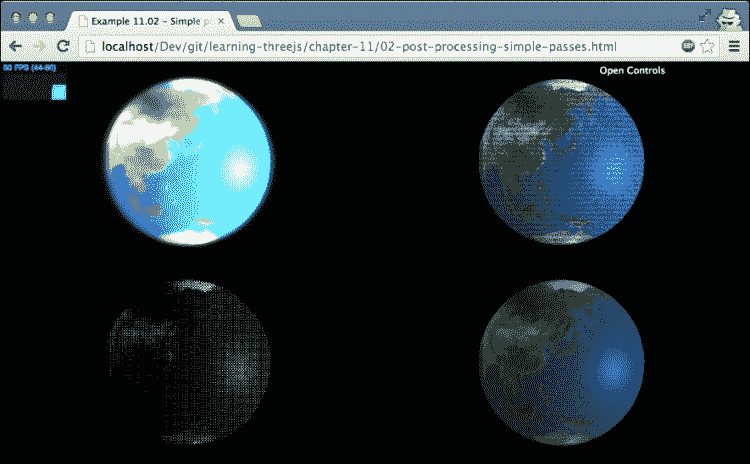
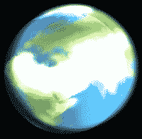
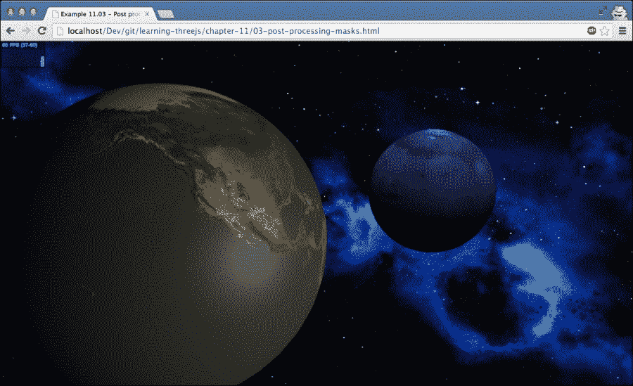
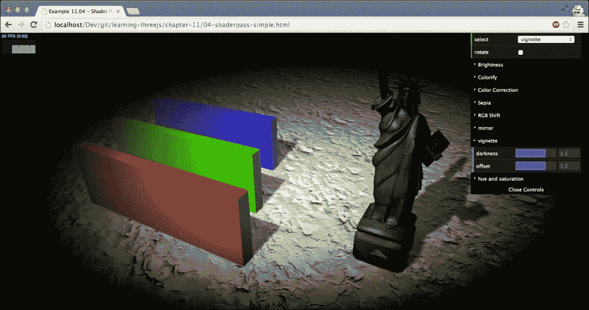
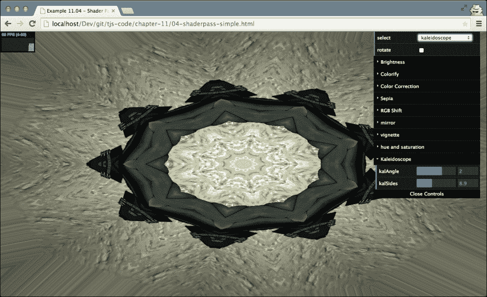
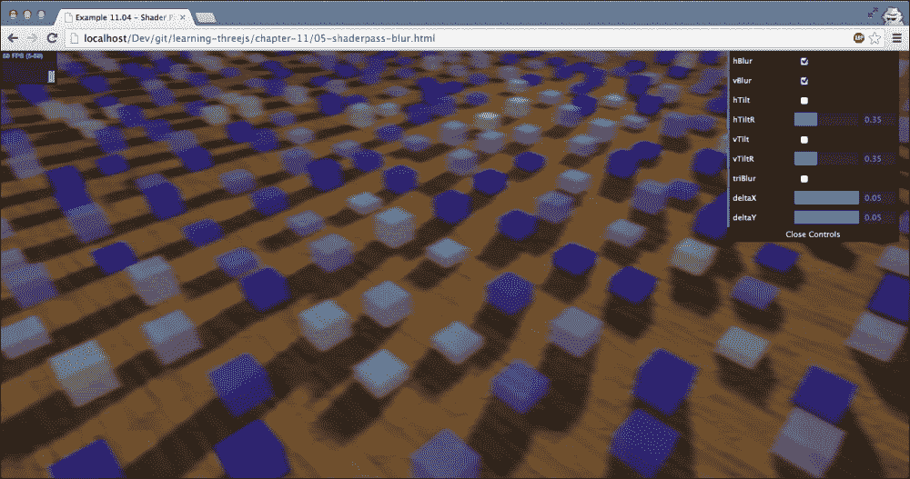
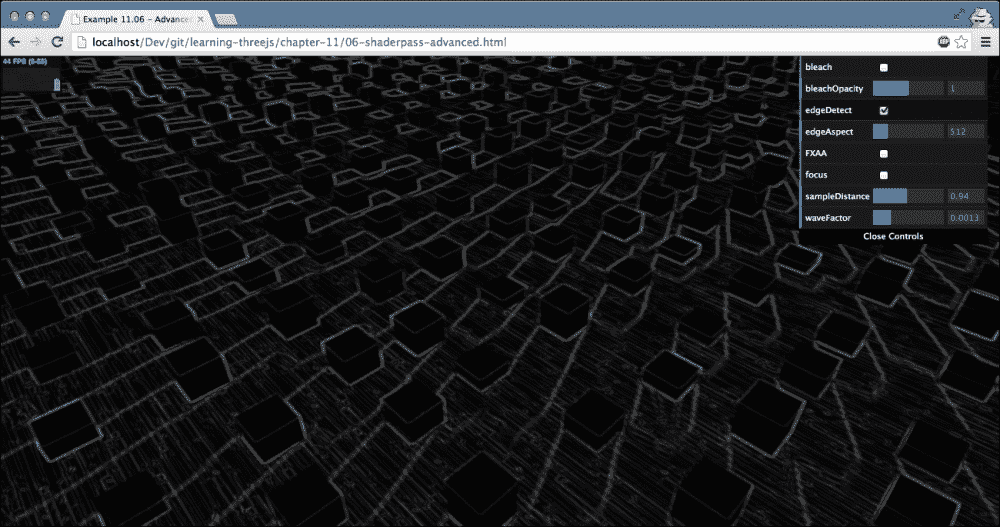
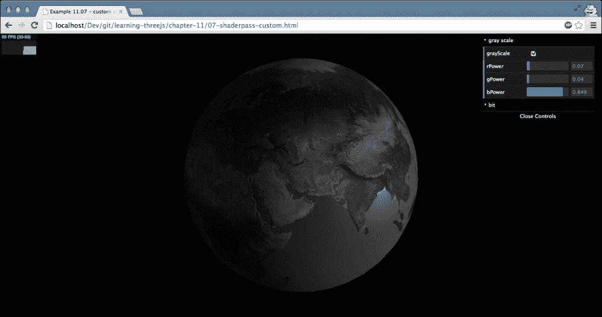

# 十一、自定义着色器和渲染后处理

我们已经到了这本书的结尾，在这一章中，我们将看看我们还没有涉及到的 Three.js 的一个主要特性:渲染后处理。除此之外，在本章中，我们还将向您介绍如何创建自定义着色器。我们将在本章中讨论的要点如下:

*   为后处理设置Three.js
*   讨论Three.js 提供的基本后处理通道，如`THREE.BloomPass`和`THREE.FilmPass`
*   使用遮罩将效果应用于场景的一部分
*   使用`THREE.TexturePass`存储渲染结果
*   使用`THREE.ShaderPass`添加更基本的后处理效果，例如棕褐色滤镜、镜像效果和颜色调整
*   使用`THREE.ShaderPass`进行各种模糊效果和更高级的滤镜
*   通过编写简单的着色器创建自定义后处理效果

在[第 1 章](01.html "Chapter 1. Creating Your First 3D Scene with Three.js")*的*介绍 requestAnimationFrame* 部分，我们设置了一个渲染循环，我们已经在整本书中使用它来渲染和动画化我们的场景。对于后处理，我们需要对这个设置进行一些更改，以允许Three.js 对最终的渲染进行后处理。在第一部分中，我们将了解如何做到这一点。*

# 设置Three.js 进行后处理

要为后处理设置Three.js，我们需要在当前设置中做一些更改。我们需要采取以下步骤:

1.  创建`THREE.EffectComposer`，我们可以用它来添加后处理过程。
2.  配置`THREE.EffectComposer`使其渲染我们的场景并应用任何附加的后处理步骤。
3.  在渲染循环中，使用`THREE.EffectComposer`渲染场景，应用过程，并显示输出。

一如既往，我们有一个例子，你可以用来试验和采纳为自己的用途。本章第一个例子可以从`01-basic-effect-composer.html`进入。您可以使用右上角的菜单修改本示例中使用的后处理步骤的属性。在这个例子中，我们渲染了一个简单的地球仪，并添加了一个类似旧电视的效果。该电视效果是在使用`THREE.EffectComposer`渲染场景后添加的。下面的截图显示了这个例子:


## 创造三。效果器

让我们首先看看你需要包含的额外的 JavaScript 文件。这些文件可以在`examples/js/postprocessing`和`examples/js/shaders`目录下的Three.js 发行版中找到。

让`THREE.EffectComposer`工作所需的最小设置如下:

```js
<script type="text/javascript" src="../libs/postprocessing/EffectComposer.js"></script>
<script type="text/javascript" src="../libs/postprocessing/MaskPass.js"></script>
<script type="text/javascript" src="../libs/postprocessing/RenderPass.js"></script>
<script type="text/javascript" src="../libs/shaders/CopyShader.js"></script>
<script type="text/javascript" src="../libs/postprocessing/ShaderPass.js"></script>
```

`EffectComposer.js`文件提供了`THREE.EffectComposer`对象，允许我们添加后处理步骤。`MaskPass.js`、`ShaderPass.js`和`CopyShader.js`由`THREE.EffectComposer`内部使用，`RenderPass.js`允许我们向`THREE.EffectComposer`添加渲染过程。如果没有通行证，我们的场景根本无法渲染。

在这个例子中，我们添加了两个额外的 JavaScript 文件来为场景添加电影般的效果:

```js
<script type="text/javascript" src="../libs/postprocessing/FilmPass.js"></script>
<script type="text/javascript" src="../libs/shaders/FilmShader.js"></script>
```

我们首先需要做的是创建`THREE.EffectComposer`。您可以通过将`THREE.WebGLRenderer`传递给它的构造函数来实现这一点:

```js
var webGLRenderer = new THREE.WebGLRenderer();
var composer = new THREE.EffectComposer(webGLRenderer);
```

接下来，我们给这个作曲家添加各种*通道*。

### 配置三。用于后处理的效果编辑器

每一遍都是按照它被添加到`THREE.EffectComposer`的顺序执行的。我们加的第一关是`THREE.RenderPass`。下面的过程渲染了我们的场景，但是还没有输出到屏幕上:

```js
var renderPass = new THREE.RenderPass(scene, camera);
composer.addPass(renderPass);
```

为了创建`THREE.RenderPass`，我们传入想要渲染的场景和想要使用的相机。借助`addPass`功能，我们将`THREE.RenderPass`添加到`THREE.EffectComposer`中。下一步是添加另一个通道，将结果输出到屏幕上。并非所有可用的通道都允许这样做——稍后将详细介绍——但是本例中使用的`THREE.FilmPass`允许我们将其通道的结果输出到屏幕上。要添加`THREE.FilmPass`，我们首先需要创建它，并将其添加到作曲者中。生成的代码如下所示:

```js
var renderPass = new THREE.RenderPass(scene,camera);
var effectFilm = new THREE.FilmPass(0.8, 0.325, 256, false);
effectFilm.renderToScreen = true;

var composer = new THREE.EffectComposer(webGLRenderer);
composer.addPass(renderPass);
composer.addPass(effectFilm);
```

如您所见，我们创建了`THREE.FilmPass`并将`renderToScreen`属性设置为`true`。这个通道是在`renderPass,`之后添加到`THREE.EffectComposer`的，所以使用这个作曲的时候，首先渲染场景，通过`THREE.FilmPass`，我们也可以看到屏幕上的输出。

### 更新渲染循环

现在我们只需要对渲染循环做一个小小的修改，使用作曲者来代替`THREE.WebGLRenderer`:

```js
var clock = new THREE.Clock();
function render() {
  stats.update();

  var delta = clock.getDelta();
  orbitControls.update(delta);

  sphere.rotation.y += 0.002;

  requestAnimationFrame(render);
  composer.render(delta);
}
```

我们唯一做的修改就是去掉了`webGLRenderer.render(scene, camera)`换成了`composer.render(delta)`。这将调用`EffectComposer`上的渲染函数，该函数又使用传入的`THREE. WebGLRenderer`，由于我们将`FilmPass`的`renderToScreen`设置为`true`，因此`FilmPass`的结果会显示在屏幕上。

有了这个基本设置，我们将在接下来的几节中查看可用的后处理过程。

# 后处理过程

Three.js 附带了数量的后处理过程，您可以直接使用`THREE.EffectComposer`。请注意，最好通过本章中的示例来查看这些传递的结果，并了解正在发生的事情。下表概述了可用的路径:

<colgroup><col style="text-align: left"> <col style="text-align: left"></colgroup> 
| 

通行证名称

 | 

描述

 |
| --- | --- |
| `THREE.BloomPass` | 这是一个让浅色区域渗进深色区域的效果。这模拟了一种镜头被非常明亮的光线淹没的效果。 |
| `THREE.DotScreenPass` | 这个在屏幕上应用一层代表原始图像的黑点。 |
| `THREE.FilmPass` | 这个通过应用扫描线和失真来模拟电视屏幕。 |
| `THREE.GlitchPass` | 这个以随机的时间间隔在屏幕上显示一个电子故障。 |
| `THREE.MaskPass` | 这允许你对当前图像应用蒙版。后续路径仅应用于遮罩区域。 |
| `THREE.RenderPass` | 这基于提供的场景和摄像机渲染场景。 |
| `THREE.SavePass` | 当执行此遍时，它会复制当前渲染步骤，供您以后使用。这个传递在实践中没有那么有用，我们不会在任何示例中使用它。 |
| `THREE.ShaderPass` | 该允许您传入自定义着色器进行高级或自定义后处理过程。 |
| `THREE.TexturePass` | 该将作曲家的当前状态存储在一个纹理中，您可以将其用作其他`EffectComposer`实例的输入。 |

让我们从一些简单的传球开始。

## 简单的后处理过程

对于简单传球，我们来看看我们能用`THREE.FilmPass`、`THREE.BloomPass`和`THREE.DotScreenPass`做些什么。对于这些过程，有一个例子`02-post-processing-simple`，允许您试验这些过程，并查看它们如何不同地影响原始输出。下面的截图显示了这个例子:



在这个例子中，我们同时显示了四个场景，并且在每个场景上，添加了不同的后处理通道。左上角的显示`THREE.BloomPass`，右上角的显示`THREE.FilmPass`，左下角的显示`THREE.DotScreenPass`，右下角的显示原始渲染。

在本例中，我们还使用`THREE.ShaderPass`和`THREE.TexturePass`来重用原始渲染的输出作为其他三维场景的输入。所以，在我们看单个通行证之前，让我们先看这两个通行证:

```js
var renderPass = new THREE.RenderPass(scene, camera);
var effectCopy = new THREE.ShaderPass(THREE.CopyShader);
effectCopy.renderToScreen = true;

var composer = new THREE.EffectComposer(webGLRenderer);
composer.addPass(renderPass);
composer.addPass(effectCopy);

var renderScene = new THREE.TexturePass(composer.renderTarget2);
```

在这段代码中，我们设置了`THREE.EffectComposer`，它将输出默认场景(右下角的那个)。这位作曲家有两张通行证。`THREE.RenderPass`渲染场景，`THREE.ShaderPass`在配置`THREE.CopyShader`时渲染输出，如果我们将`renderToScreen`属性设置为`true`，则无需对屏幕进行任何进一步的后处理。如果你看一下这个例子，你可以看到我们四次展示同一个场景，但是每次都应用了不同的效果。我们可以使用`THREE.RenderPass` 从头开始渲染场景四次，但是这有点浪费，因为我们可以重用第一个作曲家的输出。为此，我们创建`THREE.TexturePass`并传递`composer.renderTarget2`值。我们现在可以使用`renderScene`变量作为其他作曲家的输入，而不必从头开始渲染场景。我们先重温一下`THREE.FilmPass`，看看如何使用`THREE.TexturePass`作为输入。

### 使用三。电影通行证创造一个类似电视的效果

我们已经在本章的第一节中研究了如何创建`THREE.FilmPass` ，那么让我们看看如何与上一节中的`THREE.TexturePass`一起使用这个效果:

```js
var effectFilm = new THREE.FilmPass(0.8, 0.325, 256, false);
effectFilm.renderToScreen = true;

var composer4 = new THREE.EffectComposer(webGLRenderer);
composer4.addPass(renderScene);
composer4.addPass(effectFilm);
```

使用`THREE.TexturePass`唯一需要采取的步骤是将其添加为您的作曲者中的第一遍。接下来，我们只需添加`THREE.FilmPass`，效果就被应用了。`THREE.FilmPass`本身有四个参数:

<colgroup><col style="text-align: left"> <col style="text-align: left"></colgroup> 
| 

财产

 | 

描述

 |
| --- | --- |
| `noiseIntensity` | 这个属性允许你控制场景看起来有多粗糙。 |
| `scanlinesIntensity` | `THREE.FilmPass`向场景添加条扫描线。使用此属性，您可以定义这些扫描线显示的突出程度。 |
| `scanLinesCount` | 显示的扫描线数量可以用该属性控制。 |
| `grayscale` | 如果此设置为`true`，输出将转换为灰度。 |

实际上有两种方法可以传入这些参数。在本例中，我们将它们作为参数传递给构造函数，但是您也可以直接设置它们，如下所示:

```js
effectFilm.uniforms.grayscale.value = controls.grayscale;
effectFilm.uniforms.nIntensity.value = controls.noiseIntensity;
effectFilm.uniforms.sIntensity.value = controls.scanlinesIntensity;
effectFilm.uniforms.sCount.value = controls.scanlinesCount;
```

在这种方法中，我们使用`uniforms`属性，该属性用于直接与 WebGL 通信。在本章稍后讨论创建自定义着色器的部分，我们将更深入地讨论`uniforms`；目前，您需要知道的是，通过这种方式，您可以直接更新后处理过程和着色器的配置，并直接看到结果。

### 用 THREE 给场景增加一个绽放效果。BloomPass

你在左上角看到的效果叫做绽放效果。当您应用绽放效果时，场景的明亮区域将变得更加突出，*将*渗进较暗的区域。创建`THREE.BloomPass`的代码如下所示:

```js
var effectCopy = new THREE.ShaderPass(THREE.CopyShader);
effectCopy.renderToScreen = true;
...
var bloomPass = new THREE.BloomPass(3, 25, 5, 256);
var composer3 = new THREE.EffectComposer(webGLRenderer);
composer3.addPass(renderScene);
composer3.addPass(bloomPass);
composer3.addPass(effectCopy);
```

如果您将此与我们与`THREE.FilmPass`一起使用的`THREE.EffectComposer`进行比较，您会注意到我们增加了一个额外的通行证，`effectCopy`。这一步，我们也用于正常输出，没有添加任何特殊效果，只是将最后一遍的输出复制到屏幕上。由于`THREE.BloomPass`不能直接渲染到屏幕上，我们需要增加这一步。

下表列出了您可以在`THREE.BloomPass`上设置的属性:

<colgroup><col style="text-align: left"> <col style="text-align: left"></colgroup> 
| 

财产

 | 

描述

 |
| --- | --- |
| `Strength` | 这就是绽放效果的强度。这个值越高，越亮的区域越亮，越“流血”到更暗的区域。 |
| `kernelSize` | 该属性控制开花效果的偏移。 |
| `sigma` | 使用`sigma`属性，可以控制绽放效果的锐度。值越高，绽放效果看起来越模糊。 |
| `Resolution` | `Resolution`属性定义了如何精确地创建绽放效果。如果你把这个调得太低，结果会看起来很模糊。 |

更好的理解这些属性的方法是使用前面提到的例子`02-post-processing-simple`进行实验。下面的截图显示了具有高内核和西格玛大小以及低强度的布隆效应:



我们要看的最后一个简单效果是`THREE.DotScreenPass`。

### 将场景输出为一组点

使用`THREE.DotScreenPass`与使用`THREE.BloomPass`非常相似。我们刚刚看到`THREE.BloomPass`在行动。现在我们来看看`THREE.DotScreenPass`的代码:

```js
var dotScreenPass = new THREE.DotScreenPass();
var composer1 = new THREE.EffectComposer(webGLRenderer);
composer1.addPass(renderScene);
composer1.addPass(dotScreenPass);
composer1.addPass(effectCopy);
```

有了这个效果，我们又要加上`effectCopy`把结果输出到屏幕上。`THREE.DotScreenPass`也可以配置许多属性，如下所示:

<colgroup><col style="text-align: left"> <col style="text-align: left"></colgroup> 
| 

财产

 | 

描述

 |
| --- | --- |
| `center` | 使用`center`属性，您可以微调点的偏移方式。 |
| `angle` | 点按一定方式排列。使用`angle`属性，您可以更改此对齐方式。 |
| `Scale` | 借助这个，我们可以设置要使用的点的大小。`scale`越低，圆点越大。 |

适用于其他着色器的内容也适用于此着色器。通过实验获得正确的设置要容易得多。


### 在同一屏幕上显示多个渲染器的输出

这个部分没有详细介绍如何使用后处理效果，但是解释了如何在同一个屏幕上获得所有四个`THREE.EffectComposer`实例的输出。首先，让我们看看这个例子中使用的渲染循环:

```js
function render() {
  stats.update();

  var delta = clock.getDelta();
  orbitControls.update(delta);

  sphere.rotation.y += 0.002;

  requestAnimationFrame(render);

  webGLRenderer.autoClear = false;
  webGLRenderer.clear();

  webGLRenderer.setViewport(0, 0, 2 * halfWidth, 2 * halfHeight);
  composer.render(delta);

  webGLRenderer.setViewport(0, 0, halfWidth, halfHeight);
  composer1.render(delta);

  webGLRenderer.setViewport(halfWidth, 0, halfWidth, halfHeight);
  composer2.render(delta);

  webGLRenderer.setViewport(0, halfHeight, halfWidth, halfHeight);
  composer3.render(delta);

  webGLRenderer.setViewport(halfWidth, halfHeight, halfWidth, halfHeight);
  composer4.render(delta);
}
```

这里首先要注意的是，我们将`webGLRenderer.autoClear`属性设置为`false`，然后显式调用`clear()`函数。如果我们不在每次调用作曲家的`render()`函数时都这样做，那么之前渲染的场景将被清除。使用这种方法，我们只在渲染循环开始时清除所有内容。

为了避免我们所有的作曲家在同一个空间渲染，我们将作曲家使用的`webGLRenderer`视口设置到屏幕的不同部分。该函数接受四个参数:`x`、`y`、`width`和`height`。正如您在代码示例中看到的，我们使用这个函数将屏幕分成四个区域，并使作曲者渲染到他们各自的区域。请注意，如果您愿意，也可以将这种方法用于多个场景、摄像机和`WebGLRenderer`。

在本节开头的表格中，我们也提到了`THREE.GlitchPass`。通过这个渲染过程，你可以给你的场景添加一种电子干扰效果。这个效果和你到现在看到的其他效果一样容易使用。要使用它，首先在您的 HTML 页面中包含以下两个文件:

```js
<script type="text/javascript" src="../libs/postprocessing/GlitchPass.js"></script>
<script type="text/javascript" src="../libs/postprocessing/DigitalGlitch.js"></script>
```

然后，创建`THREE.GlitchPass`对象，如下所示:

```js
var effectGlitch = new THREE.GlitchPass(64);
effectGlitch.renderToScreen = true;
```

结果是一个场景，其中结果正常呈现，除了在随机的时间间隔，出现一个小故障，如下面的截图所示:


到目前为止，我们只锁定了几个简单的传球。在下一个例子中，我们将配置一个更复杂的`THREE.EffectComposer`，并使用蒙版对屏幕的一部分应用效果。

## 使用遮罩的高级效果编辑器流程

在前面的例子中，我们对整个屏幕应用了后处理过程。然而，Three.js 也具有仅将传球应用于特定区域的能力。在本节中，我们将执行以下步骤:

1.  创建一个场景作为背景图像。
2.  创建一个包含类似地球的球体的场景。
3.  创建一个包含一个看起来像火星的球体的场景。
4.  创建`EffectComposer`，将这三维场景渲染成一个图像。
5.  对渲染为火星的球体应用*着色*效果。
6.  对渲染为地球的球体应用棕褐色效果。

这听起来可能很复杂，但实际上非常容易实现。首先，让我们看看我们在`03-post-processing-masks.html`例子中想要的结果。以下屏幕截图显示了这些步骤的结果:



我们需要做的第一件事是设置我们将要渲染的各种场景，如下所示:

```js
var sceneEarth = new THREE.Scene();
var sceneMars = new THREE.Scene();
var sceneBG = new THREE.Scene();
```

为了创建地球和火星球体，我们只需用正确的材质和纹理创建球体，并将它们添加到特定的场景中，如以下代码所示:

```js
var sphere = createEarthMesh(new THREE.SphereGeometry(10, 40, 40));
sphere.position.x = -10;
var sphere2 = createMarshMesh(new THREE.SphereGeometry(5, 40, 40));
sphere2.position.x = 10;
sceneEarth.add(sphere);
sceneMars.add(sphere2);
```

我们还需要为场景添加一些灯光，就像我们为正常场景添加灯光一样，但我们不会在这里显示(更多详细信息，请参见[第 3 章](03.html "Chapter 3. Working with the Different Light Sources Available in Three.js")、*使用Three.js* 中可用的不同光源)。唯一需要记住的是灯光不能添加到不同的场景中，所以你需要为两个场景创建单独的灯光。这就是我们需要为这两个场景做的所有设置。

对于背景图像，我们创建`THREE.OrthoGraphicCamera`。记得从[第二章](02.html "Chapter 2. Basic Components That Make Up a Three.js Scene")、*组成Three.js 场景的基本组件*中，正投影中物体的大小不依赖于与相机的距离，所以这也提供了一个创建固定背景的好方法。以下是我们如何创建`THREE.OrthoGraphicCamera`:

```js
var cameraBG = new THREE.OrthographicCamera(-window.innerWidth, window.innerWidth, window.innerHeight, -window.innerHeight, -10000, 10000);
cameraBG.position.z = 50;

var materialColor = new THREE.MeshBasicMaterial({ map: THREE.ImageUtils.loadTexture("../img/textures/starry-deep-outer-space-galaxy.jpg"), depthTest: false });
var bgPlane = new THREE.Mesh(new THREE.PlaneGeometry(1, 1), materialColor);
bgPlane.position.z = -100;
bgPlane.scale.set(window.innerWidth * 2, window.innerHeight * 2, 1);
sceneBG.add(bgPlane);
```

对于这一部分，我们不会讲太多细节，但是我们必须采取一些步骤来创建一个背景图像。首先，我们从背景图像中创建一个材质，并将该材质应用于一个简单的平面。接下来，我们将此平面添加到场景中，并对其进行缩放，以精确填充整个屏幕。因此，当我们用这个相机渲染这个场景时，我们的背景图像被拉伸到屏幕的宽度。

我们现在有了三维场景，我们可以开始设置通行证和`THREE.EffectComposer`。让我们从查看完整的传球链开始，之后我们将查看单个传球:

```js
var composer = new THREE.EffectComposer(webGLRenderer);
composer.renderTarget1.stencilBuffer = true;
composer.renderTarget2.stencilBuffer = true;

composer.addPass(bgPass);
composer.addPass(renderPass);
composer.addPass(renderPass2);

composer.addPass(marsMask);
composer.addPass(effectColorify1);
composer.addPass(clearMask);

composer.addPass(earthMask);
composer.addPass(effectSepia);
composer.addPass(clearMask);

composer.addPass(effectCopy);
```

为了使用面具，我们需要以不同的方式创造`THREE.EffectComposer`。在这种情况下，我们需要创建一个新的`THREE.WebGLRenderTarget`并将内部使用的渲染目标的`stencilBuffer`属性设置为`true`。模具缓冲区是一种特殊类型的缓冲区，用于限制渲染区域。因此，通过启用模板缓冲区，我们可以使用我们的掩码。首先，让我们看看添加的前三个通道。这三个通道渲染背景、地球场景和火星场景，如下所示:

```js
var bgPass = new THREE.RenderPass(sceneBG, cameraBG);
var renderPass = new THREE.RenderPass(sceneEarth, camera);
renderPass.clear = false;
var renderPass2 = new THREE.RenderPass(sceneMars, camera);
renderPass2.clear = false;
```

这里没有什么新内容，只是我们将其中两个通道的`clear`属性设置为`false`。如果我们不这样做，我们将只能看到`renderPass2`的输出，因为它将在开始渲染之前清除所有内容。如果你回头看看`THREE.EffectComposer`的代码，接下来的三个通道是`marsMask`、`effectColorify`和`clearMask`。首先，我们将看看这三个过程是如何定义的:

```js
var marsMask = new THREE.MaskPass(sceneMars, camera );
var clearMask = new THREE.ClearMaskPass();
var effectColorify = new THREE.ShaderPass(THREE.ColorifyShader );
effectColorify.uniforms['color'].value.setRGB(0.5, 0.5, 1);
```

这三关的第一关是`THREE.MaskPass`。当创建`THREE.MaskPass`时，你传入一个场景和一个相机，就像你为`THREE.RenderPass`所做的那样。`THREE.MaskPass`将在内部渲染这个场景，但它没有在屏幕上显示这个场景，而是使用这个信息来创建一个遮罩。当`THREE.MaskPass`被添加到`THREE.EffectComposer`时，所有后续路径将仅应用于`THREE.MaskPass`定义的遮罩，直到遇到`THREE.ClearMaskPass`。在本例中，这意味着添加蓝色光晕的`effectColorify`通道仅应用于在`sceneMars`中渲染的对象。

我们使用相同的方法在地球物体上应用棕褐色滤镜。我们首先基于地球场景创建一个遮罩，并在`THREE.EffectComposer`中使用这个遮罩。在`THREE.MaskPass`之后，我们添加我们想要应用的效果(在这种情况下是`effectSepia`)，一旦我们完成了，我们添加`THREE.ClearMaskPass`来移除蒙版。这个具体的`THREE.EffectComposer`的最后一步是我们已经看到的。我们需要将最终结果复制到屏幕上，我们再次使用`effectCopy`传递。

在使用`THREE.MaskPass,`时，还有一个额外的属性很有趣，那就是`inverse`属性。如果该属性设置为`true`，则遮罩反转。换句话说，除了传入`THREE.MaskPass`的场景外，该效果适用于所有内容。这显示在下面的截图中:


到目前为止，我们已经使用了 Three.js 提供的标准通行证来实现我们的效果。Three.js 还提供了`THREE.ShaderPass`，可以用于自定义效果，并且附带了大量的着色器，可以使用和实验。

## 使用三。自定义效果的着色器

借助`THREE.ShaderPass`，我们可以通过传入自定义着色器将大量附加效果应用到场景中。本节分为三个部分。首先，我们将查看以下一组简单的着色器:

<colgroup><col style="text-align: left"> <col style="text-align: left"></colgroup> 
| 

名字

 | 

描述

 |
| --- | --- |
| `THREE.MirrorShader` | 这为屏幕的一部分创建了镜像效果。 |
| `THREE.HueSaturationShader` | 这个允许你改变颜色的*色调*和*饱和度*。 |
| `THREE.VignetteShader` | 这应用了晕影效果。这种效果显示图像中心周围的深色边框。 |
| `THREE.ColorCorrectionShader` | 使用这个着色器，可以改变颜色分布。 |
| `THREE.RGBShiftShader` | 该着色器分离颜色的红色、绿色和蓝色分量。 |
| `THREE.BrightnessContrastShader` | 这改变了图像的亮度和对比度。 |
| `THREE.ColorifyShader` | 这对屏幕应用颜色覆盖。 |
| `THREE.SepiaShader` | 这在屏幕上创建了一个类似棕褐色的效果。 |
| `THREE.KaleidoShader` | 这个给场景增加了万花筒效果，在场景中心周围提供径向反射。 |
| `THREE.LuminosityShader` | 这个提供了一个显示场景亮度的亮度效果。 |
| `THREE.TechnicolorShader` | 这个模拟了在老电影中可以看到的双条彩色的效果。 |

接下来，我们将看看提供一些模糊相关效果的着色器:

<colgroup><col style="text-align: left"> <col style="text-align: left"></colgroup> 
| 

名字

 | 

描述

 |
| --- | --- |
| `THREE.HorizontalBlurShader` 和`THREE.VerticalBlurShader` | 这些对整个场景应用模糊效果。 |
| `THREE.HorizontalTiltShiftShader`和`THREE.VerticalTiltShiftShader` | 这些重现了*倾斜移动*的效果。有了倾斜移动效果，通过确保只有部分图像清晰，就可以创建看起来像微缩的场景。 |
| `THREE.TriangleBlurShader` | 这个使用基于三角形的方法应用模糊效果。 |

最后，我们将看一些提供高级效果的着色器:

<colgroup><col style="text-align: left"> <col style="text-align: left"></colgroup> 
| 

名字

 | 

描述

 |
| --- | --- |
| `THREE.BleachBypassShader` | 这个产生一个*漂白旁路*效果。有了这个效果，一个银色的覆盖将被应用到图像上。 |
| `THREE.EdgeShader` | 该着色器可用于检测图像中的尖锐边缘并将其高亮显示。 |
| `THREE.FXAAShader` | 该着色器在后处理阶段应用抗锯齿效果。如果在渲染过程中应用抗锯齿太昂贵，请使用此选项。 |
| `THREE.FocusShader` | 这个是一个简单的着色器，导致一个清晰渲染的中心区域和沿其边界的模糊。 |

我们不会讨论所有着色器的细节，因为如果你已经看到了一个着色器的工作原理，你就非常了解其他着色器的工作原理。在接下来的部分中，我们将重点介绍几个有趣的例子。您可以使用为每个部分提供的交互式示例对其他部分进行实验。

### 类型

Three.js 还提供了两种高级后处理效果，允许您将 *bokeh* 效果应用到场景中。bokeh 效果为场景的一部分提供了模糊效果，同时非常清晰地渲染主对象。Three.js 提供`THREE.BrokerPass`，这个你可以用，或者`THREE.BokehShader2`、`THREE.DOFMipMapShader`，和`THREE.ShaderPass`一起用。这些着色器的一个实例可以在位于[http://threejs.org/examples/webgl_postprocessing_dof2.html](http://threejs.org/examples/webgl_postprocessing_dof2.html)和[http://threejs.org/examples/webgl_postprocessing_dof.html](http://threejs.org/examples/webgl_postprocessing_dof.html)的 Three.js 网站上找到。

我们从几个简单的着色器开始。

### 简单着色器

对于基本着色器的实验，我们已经创建了一个例子，其中你可以玩着色器，并直接在场景中看到效果。你可以在`04-shaderpass-simple.html`找到这个例子。下面的截图显示了这个例子:


通过右上角的菜单，您可以选择要应用的特定着色器，通过各种下拉菜单，您可以设置所选着色器的属性。例如，下面的截图显示了`RGBShiftShader`正在运行:


当您更改着色器的一个属性时，结果会直接更新。对于本例，我们直接在着色器上设置更改后的值。例如，当`RGBShiftShader`的值改变时，我们像这样更新着色器:

```js
this.changeRGBShifter = function() {
  rgbShift.uniforms.amount.value = controls.rgbAmount;
  rgbShift.uniforms.angle.value = controls.angle;
}
```

让我们看看其他几个着色器。下图为`VignetteShader`的结果:



`MirrorShader` 有以下效果:


通过后处理，我们还可以应用极端效果。这方面的一个很好的例子就是`THREE.KaleidoShader`。如果您从右上角的菜单中选择此着色器，您将看到以下效果:



这对于简单的着色器来说已经足够了。如你所见，它们非常通用，可以创造出非常有趣的效果。在本例中，我们每次应用一个着色器，但是您可以根据自己的喜好向`THREE.EffectComposer`添加任意多的`THREE.ShaderPass`步骤。

### 模糊着色器

在这个部分，我们不会深入代码；我们将向您展示各种模糊着色器的结果。你可以用`05-shaderpass-blur.html`的例子来试验这些。下面的场景被`HorizontalBlurShader``VerticalBlurShader`模糊了，这两个你会在下面的段落中了解到:



上图为`THREE.HorizontalBlurShader``THREE.VerticalBlurShader`。可以看到的效果是一个模糊的场景。除了这两种模糊效果之外，Three.js 还提供了一个模糊图像的附加着色器`THREE.TriangleShader`，这里显示的是。例如，您可以使用此着色器来描绘运动模糊，如下图所示:


最后一个类模糊效果由`THREE.HorizontalTiltShiftShader``THREE.VerticalTiltShiftShader`提供。这个着色器不会模糊整个场景，只会模糊一小块区域。这提供了一种称为“T5”倾斜移动的效果“T4”。这是常用于从普通照片中创建微型场景。下图显示了这种效果:


### 高级着色器

对于高级着色器，我们将像之前的模糊着色器一样进行操作。我们将向您展示着色器的输出。有关如何配置它们的详细信息，请参见`06-shaderpass-advanced.html` 示例。下面的截图显示了这个例子:



上例显示 `THREE.EdgeShader`。使用此着色器，您可以检测场景中对象的边缘。

下一个着色器是 `THREE.FocusShader`。该着色器仅渲染焦点中的屏幕中心，如下图所示:


到目前为止，我们只使用了由 Three.js 提供的着色器。然而，自己创建着色器也非常容易。

# 创建自定义后处理着色器

在本节中，您将学习如何创建可用于后处理的自定义着色器。我们将创建两个不同的着色器。第一个将当前图像转换为灰度图像，第二个将通过减少可用颜色的数量将图像转换为 8 位图像。请注意，创建顶点和片段着色器是一个非常广泛的主题。在本节中，我们只触及这些着色器可以做什么以及它们如何工作的表面。更多详细信息，可在[http://www.khronos.org/webgl/](http://www.khronos.org/webgl/)找到 WebGL 规范。另一个充满例子的好资源是位于 https://www.shadertoy.com/的沙德蒂。

## 自定义灰度着色器

要为 Three.js(以及其他 WebGL 库)创建一个自定义着色器，您需要实现两个组件:顶点着色器和片段着色器。顶点着色器可用于更改单个顶点的位置，片段着色器可用于确定单个像素的颜色。对于一个后处理着色器，我们只需要实现一个片段着色器，可以保留 Three.js 提供的默认顶点着色器，在看代码之前要注意的一点是，GPU 通常支持多个着色器管道。这意味着在顶点着色器步骤中，多个着色器可以并行运行，这也适用于片段着色器步骤。

让我们先来看看着色器的完整源代码，该着色器将灰度效果应用于我们的图像(`custom-shader.js`):

```js
THREE.CustomGrayScaleShader = {

  uniforms: {

    "tDiffuse": { type: "t", value: null },
    "rPower":  { type: "f", value: 0.2126 },
    "gPower":  { type: "f", value: 0.7152 },
    "bPower":  { type: "f", value: 0.0722 }

  },

  vertexShader: [
    "varying vec2 vUv;",
    "void main() {",
      "vUv = uv;",
      "gl_Position = projectionMatrix * modelViewMatrix * vec4( position, 1.0 );",
    "}"
  ].join("\n"),

  fragmentShader: [

    "uniform float rPower;",
    "uniform float gPower;",
    "uniform float bPower;",
    "uniform sampler2D tDiffuse;",

    "varying vec2 vUv;",

    "void main() {",
      "vec4 texel = texture2D( tDiffuse, vUv );",
      "float gray = texel.r*rPower + texel.g*gPower+ texel.b*bPower;",
      "gl_FragColor = vec4( vec3(gray), texel.w );",
    "}"
  ].join("\n")
};
```

从代码中可以看到，这不是 JavaScript。当你写着色器时，你用 **OpenGL 着色语言** ( **GLSL** )来写它们，这看起来很像 C 编程语言。更多关于 GLSL 的信息可以在[http://www.khronos.org/opengles/sdk/docs/manglsl/](http://www.khronos.org/opengles/sdk/docs/manglsl/)找到。

让我们首先看看这个顶点着色器:

```js
"varying vec2 vUv;","void main() {",
  "vUv = uv;",
  "gl_Position = projectionMatrix * modelViewMatrix * vec4( position, 1.0 );",
  "}"
```

对于后处理，这个着色器不需要做任何事情。上面的代码是 Three.js 实现顶点着色器的标准方式。它使用`projectionMatrix`，这是来自相机的投影，以及`modelViewMatrix`，这将对象的位置映射到世界位置，以确定在屏幕上渲染对象的位置。

对于后处理，这段代码中唯一有趣的事情是使用“`varying` `vec2` `vUv`”变量将指示从纹理中读取哪个纹理元素的`uv`值传递给片段着色器。我们将使用`vUV`值在片段着色器中获得正确的像素。让我们看看片段着色器，看看代码在做什么。我们从以下变量声明开始:

```js
"uniform float rPower;",
"uniform float gPower;",
"uniform float bPower;",
"uniform sampler2D tDiffuse;",

"varying vec2 vUv;",
```

在这里，我们看到了`uniforms`属性的四个实例。`uniforms`属性的实例具有从 JavaScript 传递到着色器的值，并且对于每个处理的片段都是相同的。在这种情况下，我们传入三个由类型`f`标识的浮动(用于确定最终灰度图像中包含的颜色比例)，并传入一个由类型`t`标识的纹理(`tDiffuse`)。该纹理包含来自`THREE.EffectComposer`的前一遍的图像。Three.js 确保它被正确地传递给这个着色器，我们可以自己从 JavaScript 中设置制服属性的其他实例。在我们使用 JavaScript 中的这些制服之前，我们必须定义哪个`uniforms`属性可用于这个着色器。这是这样完成的，在着色器文件的顶部:

```js
uniforms: {

  "tDiffuse": { type: "t", value: null },
  "rPower":  { type: "f", value: 0.2126 },
  "gPower":  { type: "f", value: 0.7152 },
  "bPower":  { type: "f", value: 0.0722 }

},
```

此时，我们可以从 Three.js 接收配置参数，并且已经接收到我们想要修改的图像。让我们看看将每个像素转换为灰色像素的代码:

```js
"void main() {",
  "vec4 texel = texture2D( tDiffuse, vUv );",
  "float gray = texel.r*rPower + texel.g*gPower + texel.b*bPower;",
  "gl_FragColor = vec4( vec3(gray), texel.w );"
```

这里发生的是，我们从传入的纹理中获得正确的像素。我们通过使用`texture2D`函数来实现这一点，在该函数中，我们传入当前图像(`tDiffuse`)和要分析的像素的位置(`vUv`)。结果是一个包含颜色和不透明度的纹理元素(来自纹理的像素)。

接下来，我们使用这个纹理元素的`r`、`g`和`b`属性来计算灰度值。该灰度值被设置为`gl_FragColor`变量，最终显示在屏幕上。这样，我们就有了自己的自定义着色器。使用这个着色器就像使用其他着色器一样。首先，我们只需要建立`THREE.EffectComposer`:

```js
var renderPass = new THREE.RenderPass(scene, camera);

var effectCopy = new THREE.ShaderPass(THREE.CopyShader);
effectCopy.renderToScreen = true;

var shaderPass = new THREE.ShaderPass(THREE.CustomGrayScaleShader);

var composer = new THREE.EffectComposer(webGLRenderer);
composer.addPass(renderPass);
composer.addPass(shaderPass);
composer.addPass(effectCopy);
```

在渲染循环中调用`composer.render(delta)`。如果我们想在运行时更改这个着色器的属性，我们可以只更新我们定义的`uniforms`属性:

```js
shaderPass.enabled = controls.grayScale;
shaderPass.uniforms.rPower.value = controls.rPower;
shaderPass.uniforms.gPower.value = controls.gPower;
shaderPass.uniforms.bPower.value = controls.bPower;
```

结果可以在`07-shaderpass-custom.html`看到。下面的截图显示了这个例子:



让我们创建另一个自定义着色器。这一次，我们将把 24 位输出减少到更低的位数。

## 创建自定义位着色器

正常情况下，颜色表示为一个 24 位的值，这给了我们大约 1600 万种不同的颜色。在计算的早期，这是不可能的，颜色通常表示为 8 位或 16 位颜色。有了这个着色器，我们将自动将我们的 24 位输出转换为 8 位的颜色深度(或任何你想要的)。

由于它相对于我们之前的例子没有改变，我们将跳过顶点着色器，直接列出`uniforms`属性的实例:

```js
uniforms: {

  "tDiffuse": { type: "t", value: null },
  "bitSize":  { type: "i", value: 4 }

}
```

这是片段着色器本身:

```js
fragmentShader: [

  "uniform int bitSize;",

  "uniform sampler2D tDiffuse;",

  "varying vec2 vUv;",

  "void main() {",

    "vec4 texel = texture2D( tDiffuse, vUv );",
    "float n = pow(float(bitSize),2.0);",
    "float newR = floor(texel.r*n)/n;",
    "float newG = floor(texel.g*n)/n;",
    "float newB = floor(texel.b*n)/n;",

    "gl_FragColor = vec4(newR, newG, newB, texel.w );",

  "}"

].join("\n")
```

我们定义了`uniforms`属性的两个实例，可以用来配置这个着色器。第一个是 Three.js 用来在当前屏幕中传递的，第二个被我们定义为一个整数(`type:` `"i"`)并且作为我们想要渲染结果的颜色深度。代码本身非常简单:

*   我们首先从纹理中获取`texel`，然后根据传入的像素的`vUv`位置获取`tDiffuse`。
*   我们基于`bitSize`属性，通过计算`bitSize` ( `pow(float(bitSize),2.0))`)的 2 次方来计算我们可以拥有的颜色数量。
*   接下来，我们计算`texel`颜色的新值，方法是将该值乘以`n`，四舍五入，`(floor(texel.r*n))`，再除以`n`。
*   结果设置为`gl_FragColor`(红、绿、蓝值和不透明度)并显示在屏幕上。

您可以在与我们之前的自定义着色器`07-shaderpass-custom.html`相同的示例中查看该自定义着色器的结果。下面的截图显示了这个例子:


关于后处理的这一章就到这里。

# 总结

在本章中，我们讨论了许多不同的后处理选项。如您所见，创建`THREE.EffectComposer`并将路径链接在一起实际上非常容易。你只需要记住一些事情。并非所有通道都输出到屏幕。如果要输出到屏幕上，可以随时用`THREE.ShaderPass`搭配`THREE.CopyShader`。向作曲家添加通道的顺序很重要。效果按此顺序应用。如果您想要重用来自特定`THREE.EffectComposer`实例的结果，您可以通过使用`THREE.TexturePass`来实现。当您的`THREE.EffectComposer`中有多个`THREE.RenderPass`时，请确保将`clear`属性设置为`false`。否则，您将只能看到最后一步`THREE.RenderPass`的输出。如果只想对特定对象应用效果，可以使用`THREE.MaskPass`。用完口罩后，用`THREE.ClearMaskPass`清除口罩。除了由 Three.js 提供的标准通道之外，还有大量可用的标准着色器。这些可以和`THREE.ShaderPass`一起使用。使用 Three.js 中的标准方法创建用于后处理的自定义着色器非常容易。

到目前为止，我们已经基本上涵盖了所有关于 Three.js 的知识。在下一章，也就是最后一章，我们将查看一个名为 **Physijs** 的库，您可以使用它来扩展 Three.js 的物理特性，并应用碰撞、重力和约束。