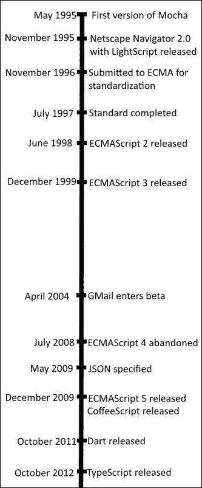
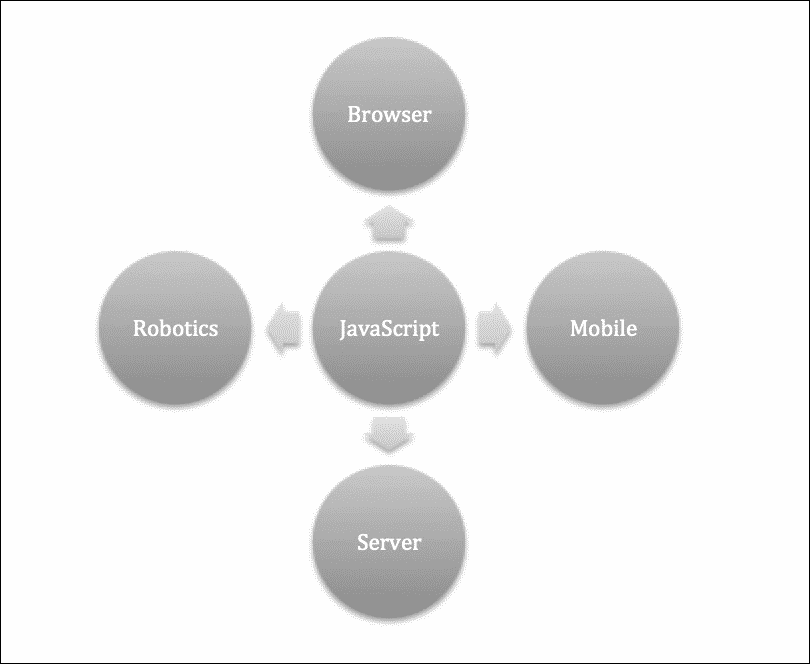
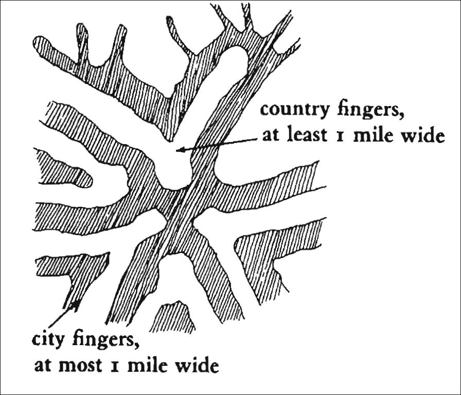

# 为乐趣和利益而设计

JavaScript 是一种不断发展的语言，从一开始就已经走过了很长的一段路。 它可能比任何其他编程语言都要多，它随着万维网的发展而成长和改变。 这本书的主题是探索如何使用良好的设计原则来编写 JavaScript。 这本书的序言对书中的各个章节作了详细的说明。

在本章的前半部分，我们将探索 JavaScript 的历史，以及它是如何成为今天如此重要的语言的。 随着 JavaScript 的发展和重要性的增长，对其构造采用严格方法的需求也在增长。 设计模式是帮助开发可维护代码的非常有用的工具。 本章的后半部分将专注于设计模式的理论。 最后，我们将简要介绍一下反模式。

本章的主题如下:

*   JavaScript 的历史
*   什么是设计模式?
*   反模式

# 通往 JavaScript 之路

我们永远也不会知道语言最初是如何产生的。 它是从仪式性仪式中发出的一系列咕噜声和喉音慢慢演变而来的吗? 也许它的发展是为了让母亲和她们的后代交流。 这两种都是理论，几乎无法证明。 在那个重要的时期，没有人在周围观察我们的祖先。 事实上，由于普遍缺乏经验证据，巴黎语言学会(language Society of Paris)禁止对这一话题进行进一步讨论，认为它不适合进行严肃的研究。

## 早期

幸运的是，编程语言在最近的历史上已经发展起来了，我们能够看到它们的成长和变化。 JavaScript 是现代编程语言中历史最有趣的语言之一。 在 1995 年 5 月那疯狂的 10 天里，网景的一个程序员为后来发展成为现代 JavaScript 的东西写了基础。

当时，网景卷入了与微软的第一场浏览器大战。 网景的愿景远比简单地开发一个浏览器要宏伟得多。 他们想利用 Sun Microsystems 最近发布的 Java 编程语言来创建一个完整的分布式操作系统。 Java 是微软正在推动的 c++的一个更现代的替代品。 然而，网景并没有解决 Visual Basic 的问题。 Visual Basic 是一种更容易使用的编程语言，它针对的是缺乏经验的开发人员。 它避免了一些关于内存管理的困难，这些困难使得 C 和 c++编程非常困难。 Visual Basic 也避免了严格的输入，总体上允许了更多的灵活性。 下面是 JavaScript 时间轴的说明:

Brendan Eich 的任务是开发 Netscape 对 VB 的应答。 该项目最初的代号是 Mocha，但在 Netscape 2.0 beta 发布之前被重命名为 livecript。 等到完整版本发布时，Mocha/LiveScript 已经被重命名为 JavaScript，将其与 Java applet 集成绑定在一起。 Java applet 是在浏览器中运行的小型应用。 他们有一个不同于浏览器本身的安全模型，因此在如何与浏览器和本地系统交互方面受到限制。 现在很少看到 applet 了，因为它们的大部分功能已经成为浏览器的一部分。 Java 在当时很受欢迎，任何与它的关系都被夸大了。

多年来，这个名字引起了很多混乱。 JavaScript 是一种与 Java 非常不同的语言。 JavaScript 是一种具有松散类型的解释性语言，主要运行在浏览器上。 Java 是一种被编译成字节码的语言，然后在 Java 虚拟机上执行字节码。 它适用于许多场景，从浏览器(通过使用 Java applet)到服务器(Tomcat、JBoss 等)，再到完整的桌面应用(Eclipse、OpenOffice 等)。 在大多数外行的头脑中，困惑依然存在。

JavaScript 在与 web 浏览器交互时非常有用。 没过多久，微软也在他们的 ie 浏览器中采用了 JavaScript 来补充 VBScript。 微软的实现被称为 JScript。

到 1996 年底，很明显，JavaScript 将在不久的将来成为获胜的网络语言。 为了限制语言实现之间的偏差,太阳和 Netscape 开始使用**欧洲计算机制造商****协会**(**ECMA)来开发一个标准,未来版本的 JavaScript 需要遵守。 这个标准在 1997 年 7 月发布得非常快(就标准组织的发展速度而言非常快)。 也许你还没有看到足够多的 JavaScript 名称，标准版本被称为**ECMAScript**，这个名字至今仍在一些圈子里沿用。**

 **不幸的是，该标准只指定了 JavaScript 的核心部分。 随着浏览器大战的激烈进行，很明显，任何只坚持 JavaScript 基本实现的供应商很快就会被甩在后面。 与此同时，为浏览器建立标准的**文档对象模型**(**DOM**)也做了很多工作。 实际上，DOM是一种可以使用 JavaScript 操作的网页 API。

多年来，每个 JavaScript 脚本都试图确定运行它的浏览器。 这将规定如何处理 DOM 中的元素，因为每个浏览器之间存在巨大的差异。 执行简单操作所需的复杂代码堪称传奇。 我记得曾经读过一篇长达一年的系列文章，内容是关于如何开发一个**动态 HTML**(**DHTML**)下拉菜单，以便在 Internet Explorer 和 Netscape Navigator 上都能工作。 现在完全可以用 CSS 实现同样的功能，甚至不需要求助于 JavaScript。

### 注释

DHTML 是 20 世纪 90 年代末和 21 世纪初的一个流行术语。 它指的是任何在客户端执行的动态内容的网页。 它已经不再被使用，因为 JavaScript 的流行使得几乎每个页面都是动态的。

幸运的是，标准化 JavaScript 的工作在幕后继续进行。 版本 2 和版本 3 的 ECMAScript发布于 1998 年和 1999 年。 看起来对 JavaScript 感兴趣的各方最终可能会达成某种协议。 ECMAScript 4 的工作始于 2000 年初，这是一个重要的新版本。

## 停顿

然后,灾难发生。 参与 ECMAScript 工作的各个小组对 JavaScript 的发展方向存在重大分歧。 微软似乎对标准化工作失去了兴趣。 这在某种程度上是可以理解的，因为就在那个时候，网景公司自毁了，而 Internet Explorer 成为了事实上的标准。 微软实现了 ECMAScript 4 的一部分，但不是全部。 还有一些实现了功能更齐全的支持，但没有市场领导者的支持，开发人员也懒得使用它们。

多年过去了，ECMAScript 没有达成共识，也没有发布新的版本。 然而，正如经常发生的那样，互联网的发展不会因为主要参与者之间缺乏共识而停止。 jQuery、Prototype、Dojo 和 Mootools 等库掩盖了浏览器之间的主要差异，使得跨浏览器开发更加容易。 与此同时，应用中使用的 JavaScript 数量急剧增加。

## GMail 的用法和样例

转折点可能是谷歌的 GMail 应用于2004 年的发布。 虽然 XMLHTTPRequest 技术，背后的异步 JavaScript 和 XML(**AJAX**)，已经存在了大约 5 年，当 GMail 发布时，它还没有被很好地使用。 GMail 发布的时候，我完全被它的光滑所折服。 我们已经习惯了避免完全重载的应用，但在当时，这是一场革命。 要使这样的应用工作，需要大量的 JavaScript。

### 注释

AJAX 是一种客户端从服务器检索小块数据的方法，而不是刷新整个页面。 该技术允许更多的交互式页面，避免了整个页面重新加载的震动。

GMail 的流行引发了一场酝酿已久的变革。 越来越多的 JavaScript 接受度和标准化推动我们超越了将 JavaScript 作为一种合适语言接受的临界点。 在此之前，JavaScript 的主要用途是对页面执行微小的更改和验证表单输入。 我跟人们开玩笑说，在 JavaScript 的早期，唯一使用的函数名是`Validate()`。

像 GMail 这样的应用严重依赖 AJAX，避免了整个页面的重新加载，它们被称为**单页应用**或**spa**。 通过最小化对页面内容的更改，用户可以获得更流畅的体验。 通过传输一个**JavaScript Object Notation**(**JSON**)有效载荷而不是HTML，所需的带宽量也被最小化。 这使得应用看起来更敏捷。 近年来，在简化 spa 创建的框架方面有了很大的进步。 AngularJS、backbone.js 和 ember 都是模型-视图-控制器风格的框架。 在过去的两到三年中，它们获得了极大的普及，并提供了一些有趣的模式使用。 这些框架是一些非常聪明的人多年来对 JavaScript 最佳实践进行试验的结果。

### 注释

JSON 是一种人类可读的 JavaScript 序列化格式。 它在最近几年变得非常流行，因为它比以前流行的格式(如 XML)更简单，更不麻烦。 它缺乏 XML 的许多配套技术和严格的语法规则，但它的简单性弥补了这一点。

在使用 JavaScript 的框架不断发展的同时，JavaScript 语言也在不断发展。 2015 年，我们看到了一个备受吹捧的 JavaScript 新版本的发布，它已经开发了好几年。 最初的名字是 ECMAScript 6，最终的名字是 ECMAScript-2015。 它给生态系统带来了巨大的改善。 浏览器厂商正急于采用该标准。 由于向代码库添加新语言特性的复杂性，再加上并非所有人都处于浏览器的前沿，许多其他可转换为 JavaScript 的语言正逐渐流行起来。 CoffeeScript 是一种类似 python 的语言，致力于提高 JavaScript 的可读性和简洁性。 Dart 由谷歌开发，谷歌正在推动它最终取代 JavaScript。 它的构造解决了一些在传统 JavaScript 中不可能实现的优化。 在 Dart 运行时足够流行之前，谷歌为 JavaScript 编译器提供了一个 Dart。 TypeScript 是微软的一个项目，它在 JavaScript 中添加了一些 ECMAScript-2015，甚至一些 ECMAScript-201X 语法，以及一个有趣的类型系统。 它旨在解决大型 JavaScript 项目所存在的一些问题。

关于 JavaScript 历史的讨论有两个要点:首先，记住语言不是在真空中开发的，这一点很重要。 人类语言和计算机编程语言都根据它们所使用的环境而发生变化。 人们普遍认为，因纽特人有很多表示“雪”的词，因为雪在他们的环境中是如此普遍。 这可能是真的，也可能不是，取决于你对这个词的定义，以及因纽特人的确切组成。 然而，有大量特定于领域的词汇的例子正在进化，以满足狭窄领域中精确定义的需求。 只要看看专业的烹饪店，就能看到大量像我这样的外行称之为平底锅的各式各样的东西。

Sapir-Whorf 假说是语言学领域的一个假说，它认为语言不仅受其使用环境的影响，而且还影响其所处的环境。 这个理论也被称为语言相对论，它是指一个人的认知过程根据语言的构造而不同。 认知心理学家 Keith Chen 提出了一个有趣的例子。 highly-viewed TED 演讲,陈竺认为语言之间有很强的正相关关系,缺乏一个将来时态和那些有很高的储蓄率(https://www.ted.com/talks/keith_chen_could_your_language_affect_your_ability_to_save_money/transcript)。 陈博士提出的假设是，当你的语言对现在和未来没有很强的联系时，就会导致你在现在更鲁莽的行为。

因此，了解 JavaScript 的历史可以帮助我们更好地理解如何以及在哪里使用 JavaScript。

我研究 JavaScript 历史的第二个原因是，看到这样一个流行的工具发展得如此之快绝对令人着迷。 在本文撰写之时，距 JavaScript 首次构建已经有 20 年的时间了，它的兴起是爆炸性的。 还有什么比用一种不断发展的语言工作更令人兴奋的呢?

## JavaScript 无处不在

自从 GMail革命以来，JavaScript 得到了巨大的发展。 新一轮的浏览器大战，即 Internet Explorer 和 Edge 与 Chrome 和火狐的竞争，导致了大量快速 JavaScript 解释器的建立。 已经部署了全新的优化技术，为了获得额外的性能，JavaScript 被编译为机器本机代码的情况并不少见。 然而，随着 JavaScript 速度的提高，使用它构建的应用的复杂性也在增加。

JavaScript 也不再仅仅是一种用于操作浏览器的语言。 流行的 Chrome 浏览器背后的 JavaScript 引擎已经被提取出来，现在是许多有趣项目(如 Node.js)的核心。 Node.js 最初是一种编写服务器端应用的高度异步方法。 它发展迅速，有一个非常活跃的社区支持它。 使用 Node.js 运行时构建了各种各样的应用。 从构建工具到编辑器的一切都是基于 Node.js 构建的。 最近，微软 Edge 的 JavaScript 引擎 ChakraCore 也是开源的，可以嵌入到 Node.js 中，作为谷歌 V8 的替代品。 与 Firefox 相当的 SpiderMonkey 也是开源的，并且正在向更多的工具进军。

JavaScript 甚至可以用来控制微控制器。 Johnny-Five 框架是非常流行的 Arduino 的编程框架。 它为设备编程带来了一种比用于这些设备编程的传统底层语言更简单的方法。 使用 JavaScript 和 Arduino 开启了一个充满可能性的世界，从制造机器人到与真实世界的传感器进行交互。

所有主流智能手机平台(iOS、Android 和 Windows Phone)都可以选择使用 JavaScript 构建应用。 平板电脑领域也是如此，平板电脑支持使用 JavaScript 编程。 即使是最新版本的 Windows 也提供了一种使用 JavaScript 构建应用的机制。 这张图展示了 JavaScript 的一些功能:

JavaScript 正在成为世界上最重要的语言之一。 尽管语言使用统计数据很难计算，但每一个试图开发排名的单一来源都将 JavaScript 排在了前 10 位:

<colgroup><col> <col></colgroup> 
| 

语言索引

 | 

JavaScript 的秩

 |
| --- | --- |
| Langpop.com | 4 |
| Statisticbrain.com | 4 |
| Codeval.com | 6 |
| TIOBE | 8 |

更有趣的是，大多数排名都表明 JavaScript 的使用量在上升。

从长远来看，JavaScript 将在未来几年内成为一种主要的语言。 越来越多的应用是用 JavaScript 编写的，它是任何类型的 web 开发的通用语言。 流行的 Stack Overflow 网站的开发者 Jeff Atwood 创造了关于广泛采用 JavaScript 的 Atwood 法则:

> *“任何可以用 JavaScript 编写的应用，最终都会用 JavaScript 编写”——阿特伍德定律，杰夫·阿特伍德*

这种见解一次又一次被证明是正确的。 现在有编译器、电子表格、文字处理器——你能想到的——都是用 JavaScript 编写的。

随着使用 JavaScript 的应用复杂性的增加，开发人员可能会遇到许多在传统编程语言中遇到的相同问题:我们如何编写应用以适应变化?

这就需要正确地设计应用。 我们再也不能简单地把一堆 JavaScript 扔到一个文件中，然后指望它能正常工作了。 我们也不能依靠像jQuery 这样的库来拯救我们自己。 库只能提供额外的功能，而对应用的结构没有任何贡献。 现在至少要注意如何构造可扩展和可适应的应用。 现实世界是不断变化的，任何不能改变以适应变化世界的应用都可能被抛在一边。 设计模式为构建可适应的应用提供了一些指导，这些应用可以随着业务需求的变化而变化。

# 什么是设计模式?

在大多数情况下，想法只适用于一个地方。 添加花生酱只在烹饪中是个好主意，而在缝纫中不是。 然而，有时候，一个伟大的想法可能会在其最初目的之外找到适用性。 这就是设计模式背后的故事。

1977 年，Christopher Alexander、Sara Ishikawa 和 Murray Silverstein 合著了一本影响深远的书，他们称之为城市规划中的设计模式，书名为*a Pattern Language: Towns, Buildings, Construction*。

这本书描述了一种讨论设计共性的语言。 在这本书中，这样描述了一个模式:

> “这种语言的元素是称为模式的实体。 每个模式都描述了在我们的环境中反复出现的一个问题，然后描述了这个问题的解决方案的核心，这样你就可以使用这个解决方案一百万次，而不会重复使用相同的方法。” ——克里斯托弗·亚历山大

这些设计模式是这样的事情，如如何布局城市，提供城市和乡村生活的混合，或如何在住宅区建造环路作为交通平静措施，如所示，如下图所示:

即使对那些对城市规划没有浓厚兴趣的人来说，这本书也提出了一些关于如何构建我们的世界以促进健康社会的迷人想法。

Erich Gamma、Richard Helm、Ralph Johnson 和 John Vlissides 利用 Christopher Alexander 和其他作者的工作作为灵感来源，写了一本书，名为*设计模式:可重用面向对象软件*。 当一本书在计算机科学课程中非常有影响力时，它通常被冠以昵称。 例如，大多数计算机科学专业的毕业生会知道你指的是哪本书，如果你谈论*The Dragon book*(*Principles of Compiler Design*，1986)。 在企业软件中，*蓝皮书*是众所周知的 Eric Evan 关于领域驱动设计的书。 设计模式这本书非常重要，它通常被称为 GoF 书，或者是*Gang of Four*书，因为它的四个作者。

本书概述了面向对象设计中使用的 23 种模式。 它将模式分为三大类:

*   **creation**:这些模式概述了许多创建对象和管理其生命周期的方法
*   **行为**:这些模式描述了物体如何相互作用
*   **Structural**:这些模式描述了向现有对象添加功能的各种不同方法

设计模式的目的不是指导您如何构建软件，而是指导如何解决常见问题。 例如，许多应用都需要提供某种类型的撤消功能。 这个问题在文本编辑器、绘图程序甚至电子邮件客户端都很常见。 解决这个问题之前已经做过很多次了，所以如果有一个共同的解决方案就太好了。 命令模式就提供了这样一个通用的解决方案。 它建议将应用中执行的所有操作作为命令实例进行跟踪。 该命令将具有正向和反向操作。 每当一个命令被处理时，它就被放到一个队列中。 当需要撤销命令时，只需从命令队列中取出 top 命令并在其上执行撤销操作。

设计模式提供了一些关于如何解决常见问题(如撤消问题)的提示。 它们是从解决同一个问题的数百次迭代中提炼出来的。 设计模式可能不是您所拥有的问题的正确解决方案，但它至少应该提供一些指导，以便更容易地实现解决方案。

### 注释

我的一位顾问朋友曾经给我讲过一个关于在一家新公司开始一项任务的故事。 经理告诉他们，他认为这个团队不会有太多工作要做，因为他们在早期就为开发人员购买了 GoF 设计模式手册，他们已经实现了每一个设计模式。 我的朋友听了很高兴，因为他是按小时收费的。 设计模式的误用为他长子的大学教育付出了很大代价。

自从 GoF 的书出版以来，已经出现了大量关于列举和描述设计模式的文献。 有专门针对特定领域的设计模式的书籍，也有处理大型企业系统模式的书籍。 Wikipedia 的软件设计模式类别包含 130 个不同设计模式的条目。 然而，我认为许多条目不是真正的设计模式，而是编程范式。

在大多数情况下，设计模式是简单的构造，不需要来自库的复杂支持。 虽然大多数语言都有模式库，但您不需要花大量的钱去购买这些库。 根据需要实现模式。 拥有一个昂贵的图书馆会让你在口袋里烧个洞，鼓励盲目地应用模式，只是为了证明花了钱是正确的。 即使您有资金，我也不知道有任何 JavaScript 库的唯一目的是提供模式支持。 当然，GitHub 有很多有趣的 JavaScript 项目，所以可能有我不知道的库。

有些人认为设计模式应该是紧急的。 也就是说，通过简单地以一种智能的方式编写软件，可以看到模式从实现中出现。 我认为这可能是一个准确的陈述，然而，它忽略了通过尝试和错误获得这些实现的实际成本。 那些了解设计模式的人更有可能在早期发现紧急模式。 教初级程序员模式是非常有用的练习。 尽早了解可以应用哪些模式或模式可以作为一种捷径。 完整的解决方案可以更早地达成，并且少一些失误。

# 反模式

如果在好的软件设计中有常见的模式，那么在坏的软件设计中也有常见的模式吗? 绝对的! 有许多错误的方法，但大多数都是以前做过的。 以一种前所未有的方式把事情搞砸需要真正的创造力。

遗憾的是，我们很难记住这些年来人们所犯的所有错误。 在许多重大项目结束时，团队会坐下来整理一份名为*的经验教训*的文件。 本文档包含了项目中本可以做得更好的事情的列表，甚至还可能概述一些建议，以便在未来如何避免这些问题。 不幸的是，这些文档只在项目结束时构造。 到那时，许多关键的参与者已经离开了，那些留下来的人必须努力记住项目早期阶段的经验教训，这可能是多年前的事了。 随着项目的进行构建文档要好得多。

文件一旦完成，就会被归档，以备下一个项目使用。 至少，理论上是这样的。 大多数情况下，文件被归档，再也不用了。 很难创造出适用于全球的经验教训。 所吸取的经验往往只对当前项目或完全相同的项目有用，而这几乎不会发生。

然而，通过查看来自不同项目的这些文档，模式开始出现。 William Brown, Raphael Malveau, Skip McCormick 和 Tom Mowbray，根据最初的四人帮而被统称为 Upstart Gang of Four，就是通过遵循这种方法，他们写了关于反模式的第一本书。 *AntiPatterns: Refactoring Software, Architectures, and Projects in Crisis*这本书概述了反模式，不仅针对代码中的问题，还针对围绕代码的管理过程。

模式概述包括这样幽默的命名模式，如*斑点和熔岩流*。 Blob，也被称为 God 对象，是一种模式，在这种模式中，一个对象逐渐增长，承担了应用逻辑的大量责任。 Lava Flow 是随着项目的发展而出现的一种模式，没有人知道代码是否还在使用。 开发人员对删除代码感到紧张，因为它可能会在某个地方被使用，或者可能会再次有用。 书中还描述了许多其他值得探索的模式。 与模式一样，反模式在编写代码时是紧急的，但在本例中，反模式是无法控制的代码。

本书不会涉及 JavaScript 反模式，但是记住反模式之一是过度应用设计模式是很有用的。

# 小结

设计模式有着丰富而有趣的历史。 它们最初是作为帮助描述如何构建结构以使人们能够共同生活的工具，现在已经发展到可以应用于许多领域。

从将设计模式应用于编程的开创性工作到现在已经有十年了。 从那时起，大量的新模式被开发出来。 其中一些模式是通用模式，如 GoF 书中概述的那些模式，但更多的模式是非常具体的模式，它们是为狭窄的领域设计的。

JavaScript 也有一段有趣的历史，它正在真正成熟起来。 随着服务器端 JavaScript 的兴起和大型 JavaScript 应用的普及，在构建 JavaScript 应用方面需要付出更多的努力。 在大多数现代 JavaScript 代码中，很少看到模式被正确利用。

通过学习设计模式提供的知识来构建现代 JavaScript 模式，这是两方面的最佳选择。 正如艾萨克·牛顿的名言:

> “如果说我看得更远，那是因为我站在你们巨人的肩膀上。”

图案给了我们容易接近的肩膀来支撑。

在下一章中，我们将讨论一些在 JavaScript 中构建结构的技术。 JavaScript 中的继承系统不同于其他大多数面向对象语言，它给我们提供了机会，也带来了限制。 我们将看到如何在 JavaScript 世界中构建类和模块。**