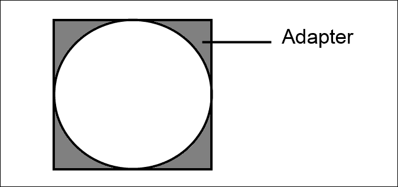

# 四、结构模式

在前一章中，我们讨论了许多创建对象以优化重用的方法。 在本章中，我们将看一看结构模式; 这些模式通过描述对象交互的简单方式来简化设计。

同样，我们将局限于 GoF 书中描述的模式。 自 GoF 出版以来，还发现了许多其他有趣的结构模式，我们将在本书的第二部分中研究这些模式。

我们将在这里检查的模式是:

*   适配器
*   桥
*   复合
*   装饰
*   外观
*   轻量级选手
*   代理

再一次，我们将讨论多年前描述的模式是否仍然适用于不同的语言和不同的时代。

# 适配器

有时需要把圆钉子塞进方孔里。 如果你曾经玩过儿童形状分类玩具，那么你可能会发现，事实上，你可以把一个圆钉子放在一个方洞里。 这个洞还没有完全填满，把钉子插进去可能会很困难:


为了提高钉的配合度，可以使用一个适配器。 这个适配器填补了洞完全导致一个完美的适合:



在软件领域，经常需要类似的方法。 我们可能需要使用一个不完全适合所需接口的类。 类可能缺少方法，或者可能有我们想隐藏的额外方法。 在处理第三方代码时，这种情况经常发生。 为了使它符合代码中所需的接口，可能需要一个适配器。

适配器的类图非常简单，如下所示:


实现的接口看起来与我们希望在代码中使用的方式不一样。 通常解决这个问题的方法是简单地重构实现，使它看起来像我们想要的那样。 然而，有一些可能的原因是不能做的。 也许实现存在于我们无法访问的第三方代码中。 也有可能在应用的其他地方使用该实现，那里的接口与我们希望的完全一样。

适配器类是实现所需接口的一小段代码。 它通常包装实现类的私有副本，并通过它进行代理调用。 适配器模式经常用于更改代码的抽象级别。 让我们看一个简单的例子。

## 实施

在维斯特洛大陆，大部分的贸易和旅行都是通过船只进行的。 乘船旅行不仅比步行或骑马更危险，而且由于风暴和海盗的持续存在，风险也更大。 这些船不是皇家加勒比可能用来在加勒比海巡游的那种船; 它们是粗糙的东西，可能看起来更像在家里，由 15 世纪的欧洲探险家驾驶。

虽然我知道船是存在的，但我对它们是如何工作的，或者如何驾驶它们却知之甚少。 我想很多人都是在咳嗽! 像我一样划船。 如果我们看看维斯特洛的舰船界面，它看起来很吓人:

```js
interface Ship{
  SetRudderAngleTo(angle: number);
  SetSailConfiguration(configuration: SailConfiguration);
  SetSailAngle(sailId: number, sailAngle: number);
  GetCurrentBearing(): number;
  GetCurrentSpeedEstimate(): number;
  ShiftCrewWeightTo(weightToShift: number, locationId: number);
}
```

我真的想要一个更简单的界面，抽象掉所有繁琐的小细节。 理想情况下是这样的:

```js
interface SimpleShip{
  TurnLeft();
  TurnRight();
  GoForward();
}
```

这看起来就像我能弄明白的东西即使我住在一个距离最近的海洋超过 1000 公里的城市里。 简而言之，我正在寻找的是围绕 Ship 的更高级别的抽象。 为了将一艘船转换成简单的飞船，我们需要一个适配器。

适配器将具有 SimpleShip 接口，但它将在 Ship 的包装实例上执行操作。 代码看起来像这样:

```js
let ShipAdapter = (function () {
  function ShipAdapter() {
    this._ship = new Ship();
  }
  ShipAdapter.prototype.TurnLeft = function () {
    this._ship.SetRudderAngleTo(-30);
    this._ship.SetSailAngle(3, 12);
  };
  ShipAdapter.prototype.TurnRight = function () {
    this._ship.SetRudderAngleTo(30);
    this._ship.SetSailAngle(5, -9);
  };
  ShipAdapter.prototype.GoForward = function () {
    //do something else to the _ship
  };
  return ShipAdapter;
})();
```

实际上，这些函数要复杂得多，但这并不重要，因为我们已经有了一个简单的界面。 还可以设置所提供的接口，以限制对底层类型上某些方法的访问。 在构建库代码时，可以使用适配器来屏蔽内部方法，只向最终用户提供所需的有限功能。

要使用此模式，代码可能如下所示:

```js
var ship = new ShipAdapter();
ship.GoForward();
ship.TurnLeft();
```

您可能不希望在客户端类的名称中使用适配器，因为它泄露了一些关于底层实现的信息。 客户端应该不知道他们正在与适配器通信。

要将一个接口调整到另一个接口，适配器本身可能会变得非常复杂。 为了避免创建非常复杂的适配器，必须小心。 构建多个适配器，一个接一个，当然不是不可想象的。 如果您发现一个适配器变得太大了，那么最好停下来检查一下适配器是否遵循单一责任原则。 也就是说，确保每个类只对一件事情负责。 从数据库中查找用户的类也不应该包含向这些用户发送电子邮件的功能。 这责任太大了。 可以用复合对象替换复杂的适配器，这将在本章的后面进行探讨。

从测试的角度来看，适配器可以用来完全包装第三方依赖项。 在这个场景中，它们提供了一个将测试挂接到其中的位置。 单元测试应该避免测试库，但它们肯定可以测试适配器，以确保它们通过正确的调用进行代理。

适配器是简化代码接口的一种非常强大的模式。 为了更好地匹配需求，按摩接口在很多地方都很有用。 这个模式在 JavaScript 中当然很有用。 用 JavaScript 编写的应用倾向于使用大量的小型库。 通过将这些库封装在适配器中，我可以限制与库直接交互的位置的数量; 这意味着库可以很容易地被替换。

可以对适配器模式稍加修改，以在许多不同的实现上提供一致的接口。 这通常被称为桥式模式。

# 桥

桥接模式将适配器模式提升到一个新的水平。 给定一个接口，我们可以构建多个适配器，每个适配器都充当不同实现的中介。

我遇到过的一个很好的例子是，处理两个不同的服务，它们提供或多或少相同的功能，并在故障转移配置中使用。 这两个服务都没有提供应用所需的接口，而且两个服务都提供了不同的 api。 为了简化代码，编写了适配器以提供一致的接口。 适配器实现一致的接口并提供填充，以便能够一致地调用每个 API。 为了进一步扩展形状分类器的比喻，我们可以想象我们有各种各样的钉子，我们想用它们来填充正方形的洞。 每个适配器填补了缺失的位，帮助我们得到一个好的适合:


桥是一个非常有用的模式。 让我们来看看如何实现它:


前面的图表中显示的适配器位于实现和所需接口之间。 他们修改实现以适应所需的接口。

## 实施

我们已经讨论过维斯特洛大陆上的人们有许多不同的宗教信仰。 每个人祷告和献祭的方式都不一样。 在正确的时间做正确的祈祷是很复杂的，我们希望避免暴露这种复杂性。 相反，我们将编写一系列可以简化祈祷的适配器。

我们需要的第一件事是许多不同的神，我们可以向他们祈祷:

```js
class OldGods {
  prayTo(sacrifice) {
    console.log("We Old Gods hear your prayer");
  }
}
Religion.OldGods = OldGods;
class DrownedGod {
  prayTo(humanSacrifice) {
    console.log("*BUBBLE* GURGLE");
  }
}
Religion.DrownedGod = DrownedGod;
class SevenGods {
  prayTo(prayerPurpose) {
    console.log("Sorry there are a lot of us, it gets confusing here. Did you pray for something?");
  }
}
Religion.SevenGods = SevenGods;
```

这些类看起来应该很熟悉，因为它们基本上与前一章中作为工厂方法示例使用的类相同。 然而，您可能会注意到，每个宗教的`prayTo`方法的签名略有不同。 当构建一个一致的接口时，如伪代码中所示，这证明是一个问题:

```js
interface God
{
  prayTo():void;
}
```

因此，让我们插入一些适配器，作为我们拥有的类和我们想要的签名之间的桥梁:

```js
class OldGodsAdapter {
  constructor() {
    this._oldGods = new OldGods();
  }
  prayTo() {
    let sacrifice = new Sacrifice();
    this._oldGods.prayTo(sacrifice);
  }
}
Religion.OldGodsAdapter = OldGodsAdapter;
class DrownedGodAdapter {
  constructor() {
    this._drownedGod = new DrownedGod();
  }
  prayTo() {
    let sacrifice = new HumanSacrifice();
    this._drownedGod.prayTo(sacrifice);
  }
}
Religion.DrownedGodAdapter = DrownedGodAdapter;
class SevenGodsAdapter {
  constructor() {
    this.prayerPurposeProvider = new PrayerPurposeProvider();
    this._sevenGods = new SevenGods();
  }
  prayTo() {
    this._sevenGods.prayTo(this.prayerPurposeProvider.GetPurpose());
  }
}
Religion.SevenGodsAdapter = SevenGodsAdapter;
class PrayerPurposeProvider {
  GetPurpose() { }
  }
Religion.PrayerPurposeProvider = PrayerPurposeProvider;
```

这些适配器中的每一个都实现了我们想要的`God`接口，并抽象出了处理三个不同接口的复杂性，每个上帝一个接口:

要使用 Bridge 模式，我们可以这样编写代码:

```js
let god1 = new Religion.SevenGodsAdapter();
let god2 = new Religion.DrownedGodAdapter();
let god3 = new Religion.OldGodsAdapter();

let gods = [god1, god2, god3];
for(let i =0; i<gods.length; i++){
  gods[i].praryTo();
}
```

这段代码使用桥梁为众神提供了一个一致的接口，这样他们就可以被平等对待。

在本例中，我们只是简单地将各个神包装起来，并通过代理方法调用它们。 适配器每个都可以包装许多对象，这是使用适配器的另一个有用的地方。 如果需要对一系列复杂的对象进行编排，那么适配器可以对该编排负责，为其他类提供更简单的接口。

你可以想象桥牌模式有多有用。 它可以很好地与前一章介绍的工厂方法模式结合使用。

这个模式在 JavaScript 中仍然非常有用。 正如我在本节开始时提到的，以一致的方式处理不同的 api 非常方便。 我用它来交换不同的第三方组件，如不同的图形库或电话系统集成点。 如果您正在使用 JavaScript 在移动平台上构建应用，那么桥接模式将是您的好朋友，它允许您将公共代码和平台特定代码清晰地分离出来。 因为在 JavaScript 中没有接口，所以桥接模式在 JavaScript 中比在其他语言中更接近于适配器。 事实上，基本上是一样的。

桥也使测试更容易。 我们能够实现一个假桥接，并使用它来确保对桥接的调用是正确的。

# 复合材料

在上一章中，我提到我们希望避免将对象紧密耦合在一起。 继承是一种非常强的耦合形式，我建议应该使用组合。 复合模式是这种情况的一种特殊情况，在这种情况下，复合被视为可以与组件互换。 让我们研究一下复合模式是如何工作的。

下面的类图包含了构建复合组件的两种不同方法:


在第一个组件中，组合组件由固定数量的各种组件构建而成。 第二个组件是由长度不确定的集合构造的。 在这两种情况下，父复合中包含的组件可以与复合的类型相同。 因此组合可以包含它自己类型的实例。

复合模式的关键特性是组件与其子组件的可互换性。 因此，如果我们有一个实现了`IComponent`的合数，那么该合数的所有组件也将实现`IComponent`。 也许，用一个例子最好地说明了这一点。

## 【T0

树形结构在计算中非常有用。 事实证明，一个层次树可以代表很多东西。 树是由一系列节点和边组成的，是循环的。 在二叉树中，每个节点都包含一个左右子节点，直到我们到达被称为叶节点的终端节点。

虽然在维斯特洛生活很艰难，但还是有机会享受宗教节日或婚礼之类的乐趣。 在这些活动中，通常会有大量美味的食物。 这些食物的食谱和你在自己的食谱中找到的差不多。 像烤苹果这样简单的菜肴包含一系列的食材:

*   烤苹果
*   蜂蜜
*   黄油
*   坚果

这些元素中的每一个都实现了一个我们称之为`IIngredient`的接口。 更复杂的食谱包含更多的配料，但除此之外，更复杂的食谱可能包含复杂的配料，这些配料本身就是由其他配料制成的。

在维斯特洛南部，有一道很受欢迎的甜点，它和我们所说的提拉米苏没什么不同。 这是一个复杂的食谱，配料包括:

*   蛋奶沙司
*   蛋糕
*   鲜奶油
*   咖啡

当然奶油蛋羹是由以下原料制成的:

*   牛奶
*   糖
*   鸡蛋
*   香草

蛋奶沙司是一种混合物，咖啡和蛋糕也是。

对复合对象的操作通常被代理到所有包含的对象。

## 实施

代码中显示了一个简单的成分，一个，它将是一个叶子节点:

```js
class SimpleIngredient {
  constructor(name, calories, ironContent, vitaminCContent) {
    this.name = name;
    this.calories = calories;
    this.ironContent = ironContent;
    this.vitaminCContent = vitaminCContent;
  }
  GetName() {
    return this.name;
  }
  GetCalories() {
    return this.calories;
  }
  GetIronContent() {
    return this.ironContent;
  }
  GetVitaminCContent() {
    return this.vitaminCContent;
  }
}
```

它可以与含有下列成分的复合成分互换使用:

```js
class CompoundIngredient {
  constructor(name) {
    this.name = name;
    this.ingredients = new Array();
  }
  AddIngredient(ingredient) {
    this.ingredients.push(ingredient);
  }
  GetName() {
    return this.name;
  }
  GetCalories() {
    let total = 0;
    for (let i = 0; i < this.ingredients.length; i++) {
      total += this.ingredients[i].GetCalories();
    }
    return total;
  }
  GetIronContent() {
    let total = 0;
    for (let i = 0; i < this.ingredients.length; i++) {
      total += this.ingredients[i].GetIronContent();
    }
    return total;
  }
  GetVitaminCContent() {
    let total = 0;
    for (let i = 0; i < this.ingredients.length; i++) {
      total += this.ingredients[i].GetVitaminCContent();
    }
    return total;
  }
}
```

复合成分在其内部成分上循环，并对每个成分执行相同的操作。 有，当然，由于原型模型，不需要定义接口。

为了利用这种复合成分，我们可以:

```js
let egg = new SimpleIngredient("Egg", 155, 6, 0);
let milk = new SimpleIngredient("Milk", 42, 0, 0);
let sugar = new SimpleIngredient("Sugar", 387, 0,0);
let rice = new SimpleIngredient("Rice", 370, 8, 0);

let ricePudding = new CompoundIngredient("Rice Pudding");
ricePudding.AddIngredient(egg);
ricePudding.AddIngredient(rice);
ricePudding.AddIngredient(milk);
ricePudding.AddIngredient(sugar);

console.log("A serving of rice pudding contains:");
console.log(ricePudding.GetCalories() + " calories");
```

当然，这只显示了模式的部分力量。 我们可以用米布丁来做一个更复杂的食谱:米布丁包(维斯特洛有一些奇怪的食物)。 由于成分的简单版本和复合版本具有相同的接口，调用者不需要知道这两种成分类型之间有任何区别。

复合是 JavaScript 代码中大量使用的模式，用于处理 HTML 元素，因为它们是树结构。 例如，如果您选择了单个元素或元素集合，那么 jQuery 库将提供一个公共接口。 当一个函数被调用时，它实际上会调用所有的子函数，例如:

```js
$("a").hide()
```

这将隐藏页面上的所有链接，而不管调用`$("a")`实际找到了多少元素。 复合是 JavaScript 开发中一种非常有用的模式。

# 装饰师

装饰器模式是，用于包装和扩展现有类。 使用装饰器模式是对现有组件进行子类化的一种替代方法。 子类化通常是一个编译时操作，并且是紧密耦合的。 这意味着一旦执行了子类化，就没有办法在运行时更改它。 在有许多可能的子类可以组合使用的情况下，子类组合的数量就会激增。 让我们来看一个例子。

维斯特洛骑士的盔甲是可以配置的。 装甲可以被制作成许多不同的风格:鳞片、层状、链甲等等。 除了盔甲的样式，还有各种不同的护面、护膝、护肘关节，当然还有颜色。 由板层和格栅制成的盔甲的行为与带面罩的锁子甲不同。 然而，你可以看到，有大量的可能组合; 太多的组合无法显式编码。

我们要做的是使用装饰器模式实现不同风格的装甲。 装饰器的工作原理与适配器和桥接模式类似，它通过它包装另一个实例和代理调用。 然而，装饰器模式在运行时通过将实例封装到它中来执行重定向。 通常，decorator 将作为一些方法的简单传递，并对其他方法进行一些修改。 这些修改可能仅限于在将调用传递给包装的实例之前执行额外的操作，或者甚至可以更改传入的参数。 装饰器模式的 UML 表示如下图所示:


这允许非常精细的控制哪些方法被装饰器改变，哪些方法仍然只是传递。 让我们看看这个模式在 JavaScript 中的实现。

## 实施

在这段代码中，我们有一个基类`BasicArmor`，然后它被`ChainMail`类修饰:

```js
class BasicArmor {
  CalculateDamageFromHit(hit) {
    return hit.Strength * .2;
  }
  GetArmorIntegrity() {
    return 1;
  }
}

class ChainMail {
  constructor(decoratedArmor) {
    this.decoratedArmor = decoratedArmor;
  }
  CalculateDamageFromHit(hit) {
    hit.Strength = hit.Strength * .8;
    return this.decoratedArmor.CalculateDamageFromHit(hit);
  }
  GetArmorIntegrity() {
    return .9 * this.decoratedArmor.GetArmorIntegrity();
  }
}
```

`ChainMail`装甲采用了一个装甲实例，该实例符合一个接口，如:

```js
export interface IArmor{
  CalculateDamageFromHit(hit: Hit):number;
  GetArmorIntegrity():number;
}
```

该实例被包装并通过代理调用。 方法`GetArmorIntegiry`修改底层类的结果，而`CalculateDamageFromHit`修改传入修饰类的参数。 这个`ChainMail`类本身可以使用更多的装饰器层来装饰，直到每个方法调用实际调用了一长串方法。 当然，这种行为对于外部调用者来说是不可见的。

要使用这个装甲装饰器，请看以下代码:

```js
let armor = new ChainMail(new Westeros.Armor.BasicArmor());
console.log(armor.CalculateDamageFromHit({Location: "head", Weapon: "Sock filled with pennies", Strength: 12}));
```

利用 JavaScript 重写类上的各个方法来实现这个模式是很诱人的。 事实上，在本节的早期草稿中，我正打算提出这一点。 然而，这样做在语法上是混乱的，不是一种常见的做事方式。 编程时要记住的最重要的事情之一是，代码必须是可维护的，不仅对您，也对其他人。 复杂滋生混乱，混乱滋生漏洞。

装饰器模式对于继承太有限的场景是一种很有价值的模式。 这些场景在 JavaScript 中仍然存在，因此该模式仍然有用。

# 正面

façade 模式是 Adapter 模式的一种特殊情况，它在类集合上提供了一个简化的接口。 我在有关适配器模式的一节中提到过这样一个场景，但仅在单个类`SimpleShip`的上下文中提到过。 同样的想法可以扩展为围绕一组类或整个子系统提供一个抽象。 UML 形式的 façade 模式如下图所示:


## 实施

如果我们采用之前的`SimpleShip`，并将其扩展到整个舰队，我们就有了一个创建 façade 的很好的例子。 如果说驾驶一艘船都很困难，那么指挥整个舰队就更困难了。 这需要很多细微的差别，需要对单独的船只下达命令。 除了单独的船只外，还必须有一个舰队司令，并在舰船之间进行一定程度的协调，以便分发物资。 所有这些都可以被抽象出来。 如果我们有一组类来表示舰队的各个方面，比如:

```js
let Ship = (function () {
  function Ship() {
  }
  Ship.prototype.TurnLeft = function () {
  };
  Ship.prototype.TurnRight = function () {
  };
  Ship.prototype.GoForward = function () {
  };
  return Ship;
})();
Transportation.Ship = Ship;

let Admiral = (function () {
  function Admiral() {
  }
  return Admiral;
})();
Transportation.Admiral = Admiral;

let SupplyCoordinator = (function () {
  function SupplyCoordinator() {
  }
  return SupplyCoordinator;
})();
Transportation.SupplyCoordinator = SupplyCoordinator;
```

然后我们可以构建如下 façade:

```js
let Fleet = (function () {
   function Fleet() {
  }
  Fleet.prototype.setDestination = function (destination) {

//pass commands to a series of ships, admirals and whoever else needs it

  };

  Fleet.prototype.resupply = function () {
  };

  Fleet.prototype.attack = function (destination) {

//attack a city

  };
  return Fleet;
})();
```

Façades 是非常有用的抽象，特别是在处理 api 时。 围绕粒度 API 使用 façade 可以创建更简单的接口。 可以提高 API 工作的抽象级别，以便它与应用的工作方式更加同步。 例如，如果您正在与 Azure blob 存储 API 进行交互，那么您可以将处理单个文件的抽象级别提高到处理文件集合的抽象级别。 而不是这样写:

```js
$.ajax({method: "PUT",
url: "https://settings.blob.core.windows.net/container/set1",
data: "setting data 1"});

$.ajax({method: "PUT",
url: "https://settings.blob.core.windows.net/container/set2",
data: "setting data 2"});

$.ajax({method: "PUT",
url: "https://settings.blob.core.windows.net/container/set3",
data: "setting data 3"});
```

可以编写一个 façade 来封装所有这些调用并提供一个接口，比如:

```js
public interface SettingSaver{
  Save(settings: Settings); //preceding code in this method
  Retrieve():Settings;
}
```

正如你所看到的，façades 在 JavaScript 中仍然很有用，并且应该作为一个模式留在你的工具箱中。

# 轻量级

在拳击比赛中，有一个 49-52 公斤之间的轻级，称为蝇级。 它是最后成立的师之一，我想是因为它的战斗机很小，像苍蝇一样。

当实例中存在大量的对象实例，而这些实例的变化很小时，就会使用轻量级模式。 我也许应该在这里暂停一下，在这种情况下，一个很大的数字可能是 10,000 件物品，而不是 50 件物品。 然而，实例数量的截断在很大程度上取决于创建对象的开销。

在某些情况下，对象可能非常昂贵，以至于在它们超载系统之前只需要少数对象。 在这种情况下，以较小的数量引入 flyweight 将是有益的。 为每个对象维护一个完整的对象会消耗大量内存。 似乎内存也被大量浪费了，因为大多数实例的字段值相同。 Flyweight 提供了一种压缩数据的方法，即只跟踪每个实例中与某些原型不同的值。

JavaScript 的原型模型非常适合这种场景。 我们可以简单地将最常见的值分配给原型，并让各个实例根据需要覆盖它们。 让我们看一个例子。

## 实施

再次回到维斯特洛(我选择了一个主要的问题域，你是不是很高兴?)，我们发现军队充满了装备不良的战斗人员。 从将军们的角度来看，这一群人之间并没有什么不同。 当然，每个人都有自己的生活、抱负和梦想，但在将军的眼里，他们都被改编成了简单的战斗机器人。 将军只关心士兵的战斗情况，他们是否健康，是否吃得好。我们可以在这段代码中看到一组简单的字段:

```js
let Soldier = (function () {
  function Soldier() {
    this.Health = 10;
    this.FightingAbility = 5;
    this.Hunger = 0;
  }
  return Soldier;
})();
```

当然，对于一支一万士兵的军队来说，记录所有这些需要相当大的内存。 让我们采用一种不同的方法并使用类:

```js
class Soldier {
  constructor() {
    this.Health = 10;
    this.FightingAbility = 5;
    this.Hunger = 0;
  }
}
```

使用这种方法，我们可以将所有关于士兵健康的请求推迟到原型机。 设置值也很简单:

```js
let soldier1 = new Soldier();
let soldier2 = new Soldier();
console.log(soldier1.Health); //10
soldier1.Health = 7;
console.log(soldier1.Health); //7
console.log(soldier2.Health); //10
delete soldier1.Health;
console.log(soldier1.Health); //10
```

您会注意到，我们调用 delete 来删除属性 override 并将值返回给父值。

# 代理

本章提出的最后一个模式是代理。 在上一节中，我提到了创建对象的开销，以及我们希望如何避免创建过多的对象。 代理模式提供了一种控制昂贵对象的创建和使用的方法。 代理模式的 UML 如图所示:


如您所见，代理镜像实际实例的接口。 它被替换为所有客户机中的实例，通常包装类的一个私有实例。 有很多地方可以使用代理模式:

*   昂贵对象的延迟实例化
*   保密资料的保护
*   远程方法调用的存根
*   在方法调用之前或之后插入附加操作

通常，对象的实例化开销很大，我们不希望在实际使用之前创建实例。 在这种情况下，代理可以检查其内部实例，如果还没有初始化，则在传递方法调用之前创建它。 这被称为惰性实例化。

如果在设计类时没有考虑到任何安全性，但现在需要一些安全性，那么可以通过使用代理来提供。 代理将检查调用，并且只在安全检查出的情况下传递方法调用。

代理可以用来为在其他地方调用的方法提供一个接口。 事实上，这正是许多 web 套接字库的功能，代理回调到 web 服务器。

最后，在某些情况下，将一些功能插入到方法调用中是有用的。 这可以是参数的记录、参数的验证、结果的更改，或者其他任何事情。

## 实施

让我们看一个 Westeros 的例子，其中需要方法插入。 通常情况下，液体的计量单位在陆地的一边和另一边相差很大。 在北方，人们可能会买一品脱啤酒，而在南方，人们会通过龙来购买啤酒。 这将导致没完没了的混乱和代码重复，但是可以通过在代理中包装关心度量的类来解决。

例如，这段代码是一个桶计算器，用来估计运输一定量液体所需的桶数:

```js
class BarrelCalculator {
  calculateNumberNeeded(volume) {
    return Math.ceil(volume / 157);
  }
}
```

虽然没有很好的文档说明，但是这个版本使用品脱作为 volume 参数。 这样就创建了一个代理来处理转换:

```js
class DragonBarrelCalculator {
  calculateNumberNeeded(volume) {
    if (this._barrelCalculator == null)
      this._barrelCalculator = new BarrelCalculator();
    return this._barrelCalculator.calculateNumberNeeded(volume * .77);
  }
}
```

同样，我们可以为基于品脱的桶计算器创建另一个代理:

```js
class PintBarrelCalculator {
  calculateNumberNeeded(volume) {
    if (this._barrelCalculator == null)
      this._barrelCalculator = new BarrelCalculator();
    return this._barrelCalculator.calculateNumberNeeded(volume * 1.2);
  }
}
```

这个代理类为我们进行单位转换，并帮助我们减轻关于单位的一些困惑。 有些语言，如 f#，支持度量单位的概念。 实际上，它是一个覆盖在整数等简单数据类型上的打字系统，防止程序员犯诸如将表示品脱的数字加到表示升的数字上这样的错误。 JavaScript 的开箱即用没有这样的功能。 然而，使用诸如 JS-Quantities([http://gentooboontoo.github.io/js-quantities/](http://gentooboontoo.github.io/js-quantities/))这样的库也是一种选择。 如果你仔细看一下，你会发现它的语法非常糟糕。 这是因为 JavaScript 不允许操作符重载。 在看到向空数组添加空数组(结果是空字符串)这样的东西是多么奇怪之后，我想也许我们应该感谢不支持操作符重载。

如果我们想避免意外地使用错误的计算器当我们有品脱时，我们认为我们有龙，那么我们可以停止我们原始的痴迷，使用一种类型的数量，一种穷人的测量单位:

```js
class PintUnit {
  constructor(unit, quantity) {
    this.quanity = quantity;
  }
}
```

这可以用作代理中的守卫:

```js
class PintBarrelCalculator {
  calculateNumberNeeded(volume) {
    if(PintUnit.prototype == Object.getPrototypeOf(volume))
      //throw some sort of error or compensate
    if (this._barrelCalculator == null)
      this._barrelCalculator = new BarrelCalculator();
    return this._barrelCalculator.calculateNumberNeeded(volume * 1.2);
  }
}
```

正如你所看到的，我们最终得到了 JS-Quantities 所做的事情，但更像 ES6 的形式。

代理在 JavaScript 中绝对是一个有用的模式。 我已经提到，当生成存根时，它被 web 套接字库使用，但它发现自己在无数其他位置很有用。

# 提示和提示

本章中介绍的许多模式提供了抽象功能和按您想要的方式对接口进行建模的方法。 请记住，每个抽象层都会引入成本。 函数调用需要更长的时间，但对于需要理解代码的人来说，它也更令人困惑。 工具可以提供一点帮助，但是通过 9 个抽象层跟踪函数调用并不有趣。

同样要警惕在 façade 模式中做得太多。 把 façade 变成一个成熟的管理类是很容易的，但它很容易降级为一个负责协调和做所有事情的上帝对象。

# 小结

在本章中，我们已经了解了许多用于构建对象之间交互的模式。 其中一些非常相似，但它们在 JavaScript 中都很有用，尽管桥被有效地简化为一个适配器。 在下一章中，我们将通过观察行为模式来完成对原始 GoF 模式的研究。