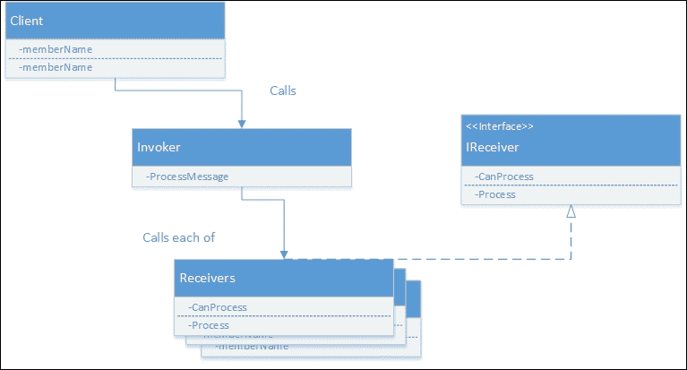
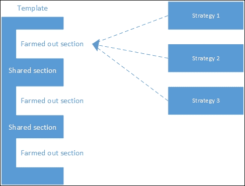
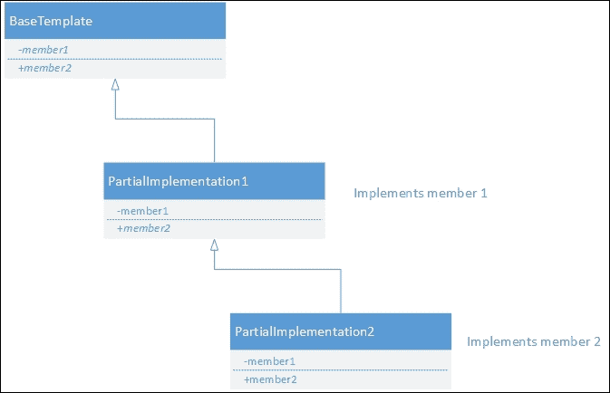

# 五、行为模式

在上一章中，我们讨论了描述构建对象以简化交互的方式的结构模式。

在本章中，我们将看一看最终也是最大的 GoF 模式分组:行为模式。 这些模式提供了对象如何共享数据的指导，或者从不同的角度来说，提供了数据如何在对象之间流动的指导。

我们将看到的模式如下:

*   链的责任
*   命令
*   翻译
*   迭代器
*   中介
*   纪念品
*   观察者
*   状态
*   策略
*   模板方法
*   游客

再一次有一些最近发现的模式，可以很好地归类为行为模式。 我们将在后面的章节中讨论这些，而不是保持 GoF 模式。

# 责任链

我们可以将对象上的函数调用视为向该对象发送消息。 事实上，这种传递信息的心态可以追溯到 Smalltalk 时代。 责任链模式描述了一种方法，在这种方法中，消息从一个类传递到另一个类。 类可以对消息进行操作，也可以将消息传递给链中的下一个成员。 根据实现的不同，有一些不同的规则可以应用于消息传递。 在某些情况下，只允许链中的第一个匹配链接执行操作。 在其他情况下，每个匹配的链接都对消息起作用。 有时，链接被允许停止处理，甚至当它继续沿着链改变消息:


让我们看看能否在我们常用的例子中找到一个很好的例子:维斯特洛大陆。

## 实施

在维斯特洛几乎没有什么法律体系。 当然，有法律，甚至有城市警卫来执行这些法律，但司法系统缺乏。 国家的法律实际上是由国王和他的顾问决定的。 那些有时间和金钱的人可以请求觐见国王，国王会倾听他们的抱怨并通过裁决。 这个裁决就是法律。 当然，任何一个整天听农民抱怨的国王都会发疯的。 由于这个原因，许多案件在他听到之前就被他的顾问抓住并解决了。

为了用代码表示这一点，我们首先需要考虑责任链是如何工作的。 投诉来了，它开始于最低可能解决它的人。 如果那个人不能或不愿意解决这个问题，就会向统治阶级中更资深的成员发痒。 最终问题到了国王那里，他是争端的最终仲裁者。 我们可以把他看作是默认的争端解决者，当其他一切都失败时，他会被召唤过来。 责任链如下图所示:


我们将从一个界面开始描述那些可能会听投诉的人:

```js
export interface ComplaintListener{
  IsAbleToResolveComplaint(complaint: Complaint): boolean;
  ListenToComplaint(complaint: Complaint): string;
}
```

该接口需要两个方法。 第一个是简单的检查，看看类是否能够解决给定的投诉。 第二组倾听并解决抱怨。 接下来我们需要描述什么是投诉:

```js
var Complaint = (function () {
  function Complaint() {
    this.ComplainingParty = "";
    this.ComplaintAbout = "";
    this.Complaint = "";
  }
  return Complaint;
})();
```

接下来，我们需要几个不同的类实现`ComplaintListener`，并能够解决投诉:

```js
class ClerkOfTheCourt {
  IsInterestedInComplaint(complaint) {
    //decide if this is a complaint which can be solved by the clerk
    if(isInterested())
      return true;
    return false;
  }
  ListenToComplaint(complaint) {
    //perform some operation
    //return solution to the complaint
    return "";
  }
}
JudicialSystem.ClerkOfTheCourt = ClerkOfTheCourt;
class King {
  IsInterestedInComplaint(complaint) {
    return true;//king is the final member in the chain so must return true
  }
  ListenToComplaint(complaint) {
    //perform some operation
    //return solution to the complaint
    return "";
  }
}
JudicialSystem.King = King;
```

这些类中的每一个都实现了解决投诉的不同方法。 我们要把他们锁在一起以确保国王处于默认位置。 这可以在下面的代码中看到:

```js
class ComplaintResolver {
  constructor() {
    this.complaintListeners = new Array();
     this.complaintListeners.push(new ClerkOfTheCourt());
     this.complaintListeners.push(new King());
  }
  ResolveComplaint(complaint) {
    for (var i = 0; i < this.complaintListeners.length; i++) {
      if         (this.complaintListeners[i].IsInterestedInComplaint(complaint)) {
        return this.complaintListeners[i].ListenToComplaint(complaint);
      }
    }
  }
}
```

这段代码将遍历每个侦听器，直到找到感兴趣的侦听器。 在这个版本中，立即返回结果，停止任何进一步的处理。 这种模式有多种变体，可以触发多个侦听器，甚至允许侦听器更改下一个侦听器的参数。 下图显示了配置的多个侦听器:



责任链是 JavaScript 中非常有用的模式。 在基于浏览器的 JavaScript 中，发生的事件是通过责任链来传递的。 例如，你可以将多个监听器附加到一个链接上的 click 事件，每个监听器都会触发，然后，最后，默认导航监听器。 很有可能在您的许多代码中使用了责任链，而您甚至不知道它。

# 命令

命令模式是一个方法，它封装了参数到方法，以及当前的对象状态，以及要调用的方法。 实际上，命令模式将以后调用方法所需的所有东西打包到一个漂亮的小包中。 使用这种方法，可以发出一个命令，然后等待一个较晚的日期，以决定哪段代码将执行该命令。 然后可以对这个包进行排队，甚至序列化，以便以后执行。 单点命令执行还允许轻松添加功能，如撤销或命令日志记录。

这个模式可能有点难以想象，所以让我们把它分解成几个部分:


## 命令信息

可以预见，命令模式的第一个组成部分是命令本身。 如前所述，该命令封装了调用方法所需的一切。 这包括方法名、参数和任何全局状态。 可以想象，跟踪每个命令中的全局状态是非常困难的。 如果在创建命令之后全局状态发生了变化，会发生什么? 这种困境是另一个原因，说明使用全球国家是有问题的，应该避免。

有几个设置命令的选项。 在尺度的简单一端，所需要的只是跟踪一个函数和一组参数。 因为函数是 JavaScript 中的第一类对象，所以可以很容易地将它们保存到对象中。 我们也可以将函数的参数保存到一个简单的数组中。 让我们使用这个非常简单的方法来构建一个命令。

命令的递延性暗示了维斯特洛大陆的一个明显隐喻。 在维斯特洛没有快速沟通的方法。 最好的方法是在鸟身上贴上小纸条，然后放出去。 这些鸟有一种想要回家的倾向，所以每个领主在他们的家里养一些鸟，当它们成年时，把它们送到其他领主那里，他们可能希望与它们交流。 领主们有一个鸟舍，记录着哪只鸟会飞到另一个领主那里。 维斯特洛的国王通过这种方法向他忠诚的领主发出许多命令。

国王发出的命令包含了对领主的所有必要指示。 命令可以是带上你的部队，命令的论据可以是部队的数量，地点，以及命令必须执行的日期。

在 JavaScript 中，最简单的表示方法是通过数组:

```js
var simpleCommand = new Array();
simpleCommand.push(new LordInstructions().BringTroops);
simpleCommand.push("King's Landing");
simpleCommand.push(500);
simpleCommand.push(new Date());
```

这个数组可以随意传递和调用。 要调用它，可以使用泛型函数:

```js
simpleCommand[0](simpleCommand[1], simpleCommand[2], simpleCommand[3]);
```

如您所见，这个函数只适用于有三个参数的命令。 当然，你可以把它展开成任意数:

```js
simpleCommand[0](simpleCommand[1], simpleCommand[2], simpleCommand[3], simpleCommand[4], simpleCommand[5], simpleCommand[6]);
```

附加参数未定义，但函数不使用它们，因此没有不良影响。 当然，这根本不是一个优雅的解决方案。

最好为每种命令类型构建一个类。 这允许您确保提供了正确的参数，并可以轻松区分集合中不同类型的命令。 通常，命令使用命令式命名，因为它们是指令。 例如，BringTroops, Surrender, SendSupplies，等等。

让我们将这个丑陋的简单命令转换成一个合适的类:

```js
class BringTroopsCommand {
  constructor(location, numberOfTroops, when) {
    this._location = location;
    this._numberOfTroops = numberOfTroops;
    this._when = when;
  }
  Execute() {
    var receiver = new LordInstructions();
    receiver.BringTroops(this._location, this._numberOfTroops, this._when);
  }
}
```

我们可能希望实现一些逻辑，以确保传递给构造函数的参数是正确的。 这将确保命令在创建而不是执行时失败。 在创建过程中调试问题比在执行过程中调试问题更容易，因为执行可能会延迟，甚至几天。 验证并不完美，但即使它只捕获了一小部分错误，它也是有帮助的。

如上所述，这些命令可以保存在内存中，以便以后使用，甚至可以写入磁盘。

## 调用器

调用程序是命令模式的一部分，它指示命令执行它的指令。 调用者实际上可以是任何东西:定时事件、用户交互或只是流程中的下一步都可能触发调用。 当我们在前一节中执行`simpleCommand`命令时，我们正在扮演调用者的角色。 在更严格的命令中，调用者可能看起来像下面这样:

```js
command.Execute()
```

如您所见，调用命令非常容易。 命令可以立即调用，也可以稍后调用。 一种流行的方法是将命令的执行推迟到事件循环的末尾。 这可以在一个节点中完成:

```js
process.nextTick(function(){command.Execute();});
```

函数`process.nextTick`将命令的执行推迟到事件循环的末尾，这样，如果下次执行该命令，进程就不会做任何事情。

## 接收机

指令模式的最后一个组件是接收机。 这是命令执行的目标。 在我们的示例中，我们创建了一个名为`LordInstructions`的接收器:

```js
class LordInstructions {
  BringTroops(location, numberOfTroops, when) {
    console.log(`You have been instructed to bring ${numberOfTroops} troops to ${location} by ${when}`);
  }
}
```

接收方知道如何执行命令延迟的操作。 接收者不需要任何特殊的东西，实际上它可以是任何类。

这些组件一起组成命令模式。 客户端将生成一个命令，并将其传递给调用者，调用者可能会延迟该命令或立即执行该命令，命令将对接收方起作用。

在构建撤销堆栈的情况下，命令是特殊的，因为它们都有一个`Execute`和一个`Undo`方法。 一个将应用状态向前，另一个将应用状态向后。 要执行撤销，只需将命令从撤销堆栈中弹出，执行`Undo`函数，并将其推入重做堆栈。 对于重做，从重做中弹出，执行`Execute`，并推到撤销堆栈。 就这么简单，尽管必须确保所有状态更改都是通过命令执行的。

《GoF》这本书为命令模式概述了一组稍微复杂一点的玩家。 这在很大程度上是由于依赖于我们在 JavaScript 中避免的接口。 由于 JavaScript 中的原型继承模型，这个模式变得简单多了。

命令模式对于延迟执行某些代码段非常有用。 我们将在第十章、*短信模式*中探索命令模式和一些有用的伴侣模式。

# 翻译

解释器模式是一个有趣的模式，因为它允许创建您自己的语言。 这听起来有点疯狂，我们已经在写 JavaScript 了，为什么还要创建一种新的语言呢? 自从 GoF 的书**领域特定语言**(**dsl**)出版以来，出现了某种复兴。 在某些情况下，创建特定于某个需求的语言是非常有用的。 例如**Structured Query****Language**(**SQL**)就非常擅长描述关系数据库的查询。 同样，正则表达式已经证明自己在解析和操作文本方面非常有效。

在许多情况下，能够创建一种简单的语言是非常有用的。 这才是关键:简单的语言。 一旦语言变得更加复杂，其优势很快就会被创建一个实际上是编译器的困难所取代。

这个模式与我们到目前为止看到的模式不同，因为该模式没有定义真正的类结构。 您可以按照自己的意愿设计语言解释器。

## 【T0

以我们为例，让我们定义一种语言，它可以用来描述维斯特洛大陆上的历史战役。 语言必须简单，便于神职人员书写和阅读。 我们将从创建一个简单的语法开始:

```js
(aggressor -> battle ground <- defender) -> victor
```

这里你可以看到，我们只是写了一个相当好的语法，让人们可以描述战斗。 劳勃·拜拉席恩与雷加·坦格利安在三叉戟河之战如下:

```js
(Robert Baratheon -> River Trident <- RhaegarTargaryen) -> Robert Baratheon
```

使用这个语法，我们想要构建一些代码，能够查询战斗列表的答案。 为了做到这一点，我们将依赖于正则表达式。 对于大多数语言来说，这不是一个好方法，因为语法太复杂了。 在这种情况下，人们可能希望创建词法或解析器并构建语法树，然而，到那时，您可能希望重新检查创建 DSL 是否真的是个好主意。 对于我们的语言，语法非常简单，所以我们可以使用正则表达式。

## 实施

我们建立的第一件事是一个 JavaScript 数据模型，如下所示:

```js
class Battle {
  constructor(battleGround, agressor, defender, victor) {
    this.battleGround = battleGround;
    this.agressor = agressor;
    this.defender = defender;
    this.victor = victor;
  }
}
```

接下来我们需要一个解析器:

```js
class Parser {
  constructor(battleText) {
    this.battleText = battleText;
    this.currentIndex = 0;
    this.battleList = battleText.split("\n");
  }
  nextBattle() {
   if (!this.battleList[0])
     return null;
    var segments = this.battleList[0].match(/\((.+?)\s?->\s?(.+?)\s?<-\s?(.+?)\s?->\s?(.+)/);
    return new Battle(segments[2], segments[1], segments[3], segments[4]);
  }
}
```

最好不要过多地考虑正则表达式。 然而，这个类确实包含战斗列表(每行一个)，并且使用`next Battle`可以解析它们。 要使用这个类，我们只需要做以下事情:

```js
var text = "(Robert Baratheon -> River Trident <- RhaegarTargaryen) -> Robert Baratheon";
var p = new Parser(text);
p.nextBattle()
```

这将是输出:

```js
{
  battleGround: 'River Trident',
  agressor: 'Robert Baratheon',
  defender: 'RhaegarTargaryen)',
  victor: 'Robert Baratheon'
}
```

现在可以像在 JavaScript 中查询任何其他结构一样查询该数据结构。

正如我前面提到的，实现这个模式没有固定的方法，因此前面代码中的实现只是作为示例提供的。 您的实现很可能看起来非常不同，这很好。

解释器在 JavaScript 中是一个有用的模式。 然而，在大多数情况下，这是一种很少使用的模式。 用 JavaScript 解释的语言的最佳例子是 JavaScript 编译成 CSS 的语言较少。

# 迭代器

遍历对象集合是一个非常常见的问题。 以至于许多语言都提供了特殊的构造来在集合中移动。 例如，c#有一个`foreach`循环，而 Python 有`for x in`。 这些循环结构通常构建在迭代器之上。 迭代器是一种模式，它提供了一种简单的方法，用于按顺序选择集合中的下一项。

迭代器的接口是这样的:

```js
interface Iterator{
  next();
}
```

## 实施

在维斯特洛大陆上，有一个众所周知的顺序，如果国王去世，王位继承人的顺序是非常不可能的。 我们可以在这个集合上设置一个方便的迭代器，如果标尺死了，就简单地调用`next`:

```js
class KingSuccession {
  constructor(inLineForThrone) {
    this.inLineForThrone = inLineForThrone;
    this.pointer = 0;
  }
  next() {
    return this.inLineForThrone[this.pointer++];
  }
}
```

这是一个数组，然后我们可以调用它:

```js
var king = new KingSuccession(["Robert Baratheon" ,"JofferyBaratheon", "TommenBaratheon"]);
king.next() //'Robert Baratheon'
king.next() //'JofferyBaratheon'
king.next() //'TommenBaratheon'
```

迭代器的一个有趣应用是不迭代固定的集合。 例如，迭代器可用于生成无限集的顺序成员，如 fibonacci 序列:

```js
class FibonacciIterator {
  constructor() {
    this.previous = 1;
    this.beforePrevious = 1;
  }
  next() {
    var current = this.previous + this.beforePrevious;
    this.beforePrevious = this.previous;
    this.previous = current;
    return current;
  }
}
```

它是这样使用的:

```js
var fib = new FibonacciIterator()
fib.next() //2
fib.next() //3
fib.next() //5
fib.next() //8
fib.next() //13
fib.next() //21
```

迭代器是一种方便的构造，不仅可以用于数组，还可以用于任何集合甚至任何生成的列表。 在很多地方，这都可以发挥很大的作用。

## ECMAScript 2015 迭代器

迭代器非常有用，它们实际上是下一代 JavaScript 的一部分。 ECMAScript 2015 中使用的迭代器模式是一个方法，返回一个包含`done`和`value`的对象。 当迭代器位于集合的末尾时，`done`为`true`。 ECMAScript 2015 迭代器的优点在于，JavaScript 中的数组集合将支持迭代器。 这打开了一个新的语法，可以在很大程度上取代`for`循环:

```js
var kings = new KingSuccession(["Robert Baratheon" ,"JofferyBaratheon", "TommenBaratheon"]);
for(var king of kings){
  //act on members of kings
}
```

迭代器是 JavaScript 中长期缺失的语法细节。 ECMAScript-2015 的另一个伟大特性是生成器。 实际上，这是一个内置的迭代器工厂。 我们的 fibonacci 序列可以重写如下:

```js
function* FibonacciGenerator (){
  var previous = 1;
  var beforePrevious = 1;
  while(true){
    var current = previous + beforePrevious;
    beforePrevious = previous;
    previous = current;
    yield current;
  }
}
```

它是这样使用的:

```js
var fib = new FibonacciGenerator()
fib.next().value //2
fib.next().value //3
fib.next().value //5
fib.next().value //8
fib.next().value //13
fib.next().value //21
```

# 调解人

管理课堂上的多对多关系可能是一个复杂的前景。 让我们考虑一个包含许多控件的表单，每个控件都想在执行它们的操作之前知道页面上的其他控件是否有效。 不幸的是，让每个控件都知道彼此的控件会造成维护的噩梦。 每次添加新控件时，都需要修改其他控件。

中介位于各个组件之间，充当可以进行消息路由更改的单一位置。 通过这样做，中介简化了维护代码所需的复杂工作。 对于窗体上的控件，中介很可能是窗体本身。 调解人的行为很像现实生活中的调解人，澄清和路由信息交换之间的许多方面:


## 实施

在维斯特洛大陆上，很多时候都需要调解人。 调解员经常以死亡告终，但我确信在我们的例子中不会出现这种情况。

维斯特洛有很多大家族，他们拥有巨大的城堡和大片的土地。 小领主们宣誓效忠于大家族，结成联盟，通常通过婚姻来支持。

当协调不同的家族宣誓效忠于他们时，大领主将扮演调解人的角色，在小领主之间来回沟通信息，解决他们之间可能存在的任何争端。

在这个例子中，我们将大大简化各家之间的通信，并说所有的信息都是通过伟大的主传递的。 既然如此，我们就以史塔克家族为尊主。 他们有许多其他的房子与他们交谈。 每一所房子看起来大致如下:

```js
class Karstark {
  constructor(greatLord) {
    this.greatLord = greatLord;
  }
  receiveMessage(message) {
  }
  sendMessage(message) {
    this.greatLord.routeMessage(message);
  }
}
```

它们有两个函数，一个接收来自第三方的消息，另一个发送消息给它们的大领主，这是在实例化时设置的。 `HouseStark`类如下所示:

```js
class HouseStark {
  constructor() {
    this.karstark = new Karstark(this);
    this.bolton = new Bolton(this);
    this.frey = new Frey(this);
    this.umber = new Umber(this);
  }
  routeMessage(message) {
  }
}
```

通过通过`HouseStark`类传递所有消息，其他各种机构不需要关心它们自己的消息是如何路由的。 这一责任被移交给`HouseStark`作为调解人。

当通信既复杂又定义明确时，最好使用中介。 如果通信不复杂，那么中介会增加额外的复杂性。 如果沟通定义不明确，那么就很难在单个地方编纂沟通规则。

简化多对多对象之间的通信在 JavaScript 中当然很有用。 实际上，我认为 jQuery 在很多方面都充当了中介。 当对页面上的一组项进行操作时，它通过抽象代码来了解页面上的哪些对象正在被更改，从而简化了通信。 例如:

```js
$(".error").slideToggle();
```

jQuery 是切换页面上所有具有`error`类的元素的可见性的简写吗?

# 纪念品

在关于命令模式的一节中，我们简要地讨论了撤销操作的能力。 创建可逆命令并不总是可行的。 对于许多操作，没有明显的反向操作可以恢复到初始状态。 举个例子，假设代码将一个数字平方:

```js
class SquareCommand {
  constructor(numberToSquare) {
    this.numberToSquare = numberToSquare;
  }
  Execute() {
    this.numberToSquare *= this.numberToSquare;
  }
}
```

给出代码-9 会得到 81，但是给出 9 也会得到 81。 如果没有附加信息，就无法反转此命令。

memento 模式提供了一种将对象状态恢复到以前状态的方法。 该备忘录保存了变量先前值的记录，并提供了恢复这些值的功能。 为每个命令保存一个纪念品，可以方便地恢复不可逆转的命令。

除了撤销堆栈之外，在许多实例中，具有回滚对象状态的能力是很有用的。 例如，做假设分析需要对状态进行一些假设的更改，然后观察事情是如何变化的。 这些更改通常不是永久性的，因此可以使用纪念品模式回滚它们，或者如果项目需要的话，可以保留在原地。 纪念品图案的图示如下:


一个典型的纪念品执行包含三个玩家:

*   **发起者**:发起者持有某种形式的状态，并提供生成新纪念品的接口。
*   **看管人**:这是模式的客户端，它要求新的纪念品被拿走，并在它们被修复时进行管理。
*   **Memento**:这是一个代表的保存状态的发起者。 这是可以持久化到存储以允许回滚的内容。

把纪念品图案的成员想象成老板和秘书做笔记会有所帮助。 老板(管理员)向秘书(发起者)口授一些备忘录，秘书(发起者)在记事本上记笔记。 老板有时会要求秘书把他刚才写的东西划掉。

看管人的介入可能与纪念品模式略有不同。 在某些实现中，每次对其状态进行更改时，发起者将生成一个新的纪念品。 这通常被称为写时拷贝，即创建状态的新副本，并将更改应用到该副本上。 旧版本可以保存为纪念品。

## 实施

在维斯特洛大陆上，有许多预言家，预言未来。 它们的工作原理是利用魔法窥视未来，并研究当前的某些变化将如何在未来发挥作用。 通常需要许多不同的开始条件的预测。 当设定开始条件时，一个纪念品模式是无价的。

我们从一个世界状态开始，它提供了某个起始点的世界状态信息:

```js
class WorldState {
  constructor(numberOfKings, currentKingInKingsLanding, season) {
    this.numberOfKings = numberOfKings;
    this.currentKingInKingsLanding = currentKingInKingsLanding;
    this.season = season;
  }
}
```

这个`WorldState`类负责跟踪构成世界的所有条件。 它是每次对启动条件进行更改时应用所更改的内容。 因为这个世界状态包含应用的所有状态，所以它可以用作一个纪念品。 我们可以序列化这个对象并将其保存到磁盘或发送回某个历史服务器。

我们需要的下一件事是一个类，它提供与纪念品相同的状态，并允许创建和恢复纪念品。 在我们的例子中，我们称它为`WorldStateProvider`:

```js
class WorldStateProvider {
  saveMemento() {
    return new WorldState(this.numberOfKings, this.currentKingInKingsLanding, this.season);
  }
  restoreMemento(memento) {
    this.numberOfKings = memento.numberOfKings;
    this.currentKingInKingsLanding = memento.currentKingInKingsLanding;
    this.season = memento.season;
  }
}
```

最后，我们需要一个客户端来做的预言，我们称之为`Soothsayer`:

```js
class Soothsayer {
  constructor() {
    this.startingPoints = [];
    this.currentState = new WorldStateProvider();
  }
  setInitialConditions(numberOfKings, currentKingInKingsLanding, season) {
    this.currentState.numberOfKings = numberOfKings;
    this.currentState.currentKingInKingsLanding = currentKingInKingsLanding;
    this.currentState.season = season;
  }
  alterNumberOfKingsAndForetell(numberOfKings) {
    this.startingPoints.push(this.currentState.saveMemento());
    this.currentState.numberOfKings = numberOfKings;
  }
  alterSeasonAndForetell(season) {
    this.startingPoints.push(this.currentState.saveMemento());
    this.currentState.season = season;
  }
  alterCurrentKingInKingsLandingAndForetell(currentKingInKingsLanding) {
    this.startingPoints.push(this.currentState.saveMemento());
    this.currentState.currentKingInKingsLanding = currentKingInKingsLanding;
    //run some sort of prediction
  }
  tryADifferentChange() {
    this.currentState.restoreMemento(this.startingPoints.pop());
  }
}
```

这个类提供了许多方便的方法，可以改变世界的状态，然后运行预测。 这些方法都将以前的状态推入历史数组`startingPoints`。 还有一种方法`tryADifferentChange`，它可以撤销之前的状态更改，以便运行另一个预测。 撤销是通过加载存储在数组中的纪念品来执行的。

尽管有很好的血统，但客户端 JavaScript 应用很少提供撤销功能。 我相信有各种各样的原因，但在大多数情况下，人们可能并不期望这样的功能。 然而，在大多数桌面应用中，具有撤销功能是所期望的。 我想，随着客户端应用的能力不断增长，撤销功能将变得更加重要。 当它这样做时，纪念品模式是实现撤消堆栈的一种极好的方式。

# 观察者

观察者模式可能是 JavaScript 世界中最常用的模式。 这种模式尤其用于现代的单页面应用; 它是提供**Model View View-Model**(**MVVM**)功能的各种库的重要组成部分。 我们将在[第 7 章](07.html#page "Chapter 7. Reactive Programming")、*反应式编程*中详细探讨这些模式。

知道对象的值何时发生变化通常是很有用的。 为了做到这一点，你可以用 getter 和 setter 来包装感兴趣的属性:

```js
class GetterSetter {
  GetProperty() {
    return this._property;
  }
  SetProperty(value) {
    this._property = value;
  }
}
```

setter 函数现在可以通过调用其他对象来扩展，这些对象对某个值的变化感兴趣:

```js
SetProperty(value) {
  var temp = this._property;
  this._property = value;
  this._listener.Event(value, temp);
}
```

这个 setter 现在将通知侦听器发生了属性更改。 在本例中，新旧值都包含在内。 这是不必要的，因为监听器可以负责跟踪前一个值。

观察者模式概括并整理了这个想法。 观察者模式允许感兴趣的各方订阅更改通知，而不是对侦听器的单个调用。 下图中可以看到多个用户:


## 实施

维斯特洛的宫廷是一个充满阴谋和诡计的地方。 控制谁在王位上以及他们的行动是一个复杂的游戏。 在《权力的游戏》中，许多玩家雇佣了大量的间谍来发现其他人的行动。 这些间谍经常受雇于多个玩家，并且必须向所有玩家报告他们所发现的。

间谍是运用观察者模式的绝佳场所。 在我们的例子中，被雇佣的间谍是国王的官方医生，玩家非常感兴趣的是给生病的国王开了多少止痛药。 知道这一点可以让玩家提前知道国王什么时候会死——这是一个非常有用的信息。

间谍的样子如下:

```js
class Spy {
  constructor() {
    this._partiesToNotify = [];
  }
  Subscribe(subscriber) {
    this._partiesToNotify.push(subscriber);
  }
  Unsubscribe(subscriber) {
    this._partiesToNotify.remove(subscriber);
  }
  SetPainKillers(painKillers) {
    this._painKillers = painKillers;
    for (var i = 0; i < this._partiesToNotify.length; i++) {
      this._partiesToNotify[i](painKillers);
    }
  }
}
```

在其他语言中，订阅者通常必须遵守某个接口，观察者将只调用接口方法。 这个累赘在 JavaScript 中是不存在的，事实上，我们只是给`Spy`类一个函数。 这意味着订阅者不需要严格的接口。 这是一个例子:

```js
class Player {
  OnKingPainKillerChange(newPainKillerAmount) {
    //perform some action
  }
}
```

可以这样使用:

```js
let s = new Spy();
let p = new Player();
s.Subscribe(p.OnKingPainKillerChange); //p is now a subscriber
s.SetPainKillers(12); //s will notify all subscribers
```

这提供了一种非常简单和高效的构建观察者的方法。 拥有订阅者将订阅者与可观察对象解耦。

观察者模式也可以应用于方法和属性。 通过这样做，您可以为发生其他行为提供钩子。 这是为 JavaScript 库提供插件基础架构的常用方法。

在浏览器中，DOM 中不同项上的所有事件监听器都是使用观察者模式实现的。 例如，使用流行的 jQuery 库，你可以通过以下操作订阅页面上按钮上的所有`click`事件:

```js
$("body").on("click", "button", function(){/*do something*/})
```

即使在普通的 JavaScript 中，同样的模式也适用:

```js
let buttons = document.getElementsByTagName("button");
for(let i =0; i< buttons.length; i++)
{
  buttons[i].onclick = function(){/*do something*/}
}
```

显然，观察者模式在处理 JavaScript 时非常有用。 没有必要以任何重要的方式改变模式。

# 国家

状态机在计算机编程中是一种非常有用的设备。 不幸的是，大多数程序员并不经常使用它们。 我敢肯定，对状态机的一些反对意见是，许多人将其作为一个巨大的`if`声明来实现，就像这样:

```js
function (action, amount) {
  if (this.state == "overdrawn" && action == "withdraw") {
    this.state = "on hold";
  }
  if (this.state == "on hold" && action != "deposit") {
    this.state = "on hold";
  }
  if (this.state == "good standing" && action == "withdraw" && amount <= this.balance) {
    this.balance -= amount;
  }
  if (this.state == "good standing" && action == "withdraw" && amount >this.balance) {
    this.balance -= amount;
    this.state = "overdrawn";
  }
};
```

这只是一个可能更长的例子。 这种长度的`if`语句调试起来很痛苦，而且极易出错。 简单地翻转一个大于号就足以彻底改变`if`语句的工作方式。

我们可以使用状态模式，而不是使用单个巨大的`if`语句块。 状态模式的特点是有一个状态管理器，它抽象出内部状态并将消息代理到作为类实现的适当状态。 状态和状态转换中的所有逻辑都由单个状态类管理。 状态管理器模式可以在下图中看到:


将状态分割为每个状态的类，可以使用更小的代码块进行调试，使测试更容易。

状态管理器的接口相当简单，通常只提供与各个状态通信所需的方法。 管理器还可能包含一些共享状态变量。

## 实施

正如在`if`语句示例中所提到的，维斯特洛有一个银行系统。 大部分地区集中在布拉佛斯岛。 那里的银行业务与这里的银行业务基本相同，都有账户、存款和取款。 管理银行帐户的状态包括密切关注所有的交易，并根据交易更改银行帐户的状态。

让我们来看看在布拉佛斯的铁银行管理银行账户所需的一些代码。 首先是状态管理器:

```js
class BankAccountManager {
  constructor() {
    this.currentState = new GoodStandingState(this);
  }
  Deposit(amount) {
    this.currentState.Deposit(amount);
  }
  Withdraw(amount) {
    this.currentState.Withdraw(amount);
  }
  addToBalance(amount) {
    this.balance += amount;
  }
  getBalance() {
    return this.balance;
  }
  moveToState(newState) {
    this.currentState = newState;
  }
}
```

`BankAccountManager`类提供当前平衡状态和当前状态。 为了保护天平，它提供一个附件读取天平，另一个附件添加天平。 在实际的银行应用中，我宁愿期望设置平衡的功能有更多的保护。 在这个版本的`BankManager`中，状态可以访问操作当前状态的能力。 他们有责任改变国家。 该功能可以集中在管理器中，但这增加了添加新状态的复杂性。

我们确定了银行账户的三种简单状态:`Overdrawn`、`OnHold`和`GoodStanding`。 在这种状态下，每个银行都负责取款和存款。 `GoodStandingstate`类如下所示:

```js
class GoodStandingState {
  constructor(manager) {
    this.manager = manager;
  }
  Deposit(amount) {
    this.manager.addToBalance(amount);
  }
  Withdraw(amount) {
    if (this.manager.getBalance() < amount) {
      this.manager.moveToState(new OverdrawnState(this.manager));
    }
    this.manager.addToBalance(-1 * amount);
  }
}
```

`OverdrawnState`类如下所示:

```js
class OverdrawnState {
  constructor(manager) {
    this.manager = manager;
  }
  Deposit(amount) {
    this.manager.addToBalance(amount);
    if (this.manager.getBalance() > 0) {
      this.manager.moveToState(new GoodStandingState(this.manager));
    }
  }
  Withdraw(amount) {
    this.manager.moveToState(new OnHold(this.manager));
    throw "Cannot withdraw money from an already overdrawn bank account";
  }
}
```

最后，`OnHold`状态看起来如下:

```js
class OnHold {
  constructor(manager) {
    this.manager = manager;
  }
  Deposit(amount) {
    this.manager.addToBalance(amount);
    throw "Your account is on hold and you must attend the bank to resolve the issue";
  }
  Withdraw(amount) {
    throw "Your account is on hold and you must attend the bank to resolve the issue";
  }
}
```

您可以看到，我们已经成功地在许多简单的类中复制了令人困惑的`if`语句的所有逻辑。 这里的代码量看起来远远超过了`if`语句，但是，从长远来看，将代码封装到单个类中是有好处的。

在 JavaScript 中有很多机会可以利用这个模式。 在大多数应用中，跟踪状态是一个典型问题。 当状态之间的转换很复杂时，将其包装在状态模式中是简化事情的一种方法。 还可以通过按顺序注册事件来构建简单的工作流。 一个好的界面可能是一个流畅的界面，这样你就可以像下面这样注册状态:

```js
goodStandingState
.on("withdraw")
.when(function(manager){return manager.balance > 0;})
  .transitionTo("goodStanding")
.when(function(manager){return mangaer.balance <=0;})
  .transitionTo("overdrawn");
```

# 策略

据说剥猫皮的方法不止一种。 明智的是，我从来没有研究过有多少种方法。 计算机程序设计中的算法通常也是如此。 通常会有许多版本的算法在内存使用和 CPU 使用之间进行权衡。 有时会有不同的方法来提供不同程度的保真度。 例如，在智能手机上执行地理定位通常使用三种不同的数据来源之一:

*   GPS 芯片
*   手机三角
*   附近的无线网络分

使用 GPS 芯片提供了最高的保真度，但它也是最慢的，需要最多的电池。 查看附近的 WiFi 点只需要很少的能源，而且速度很快，但是保真度很差。

策略模式提供了一种以透明方式交换这些策略的方法。 在传统的继承模型中，每个策略都将实现相同的接口，允许任何策略被交换进来。 下图显示了可以交换的多种策略:


选择正确的策略有许多不同的方法。 最简单的方法是静态地选择策略。 这可以通过配置变量或硬编码来实现。 这种方法最适用于策略变化不频繁或特定于单个客户或用户的情况。

或者，可以在要运行策略的数据集上运行分析，然后选择合适的策略。 如果我们知道，当传入的数据聚集在一个平均值周围时，策略 A 比策略 B 效果更好，那么就可以先运行一个快速的分析传播的算法，然后选择合适的策略。

如果某一特定算法在某一类型的数据上失败，在选择策略时也可以考虑到这一点。 在 web 应用中，它可以根据数据的形状调用不同的 API。 它还可以用于在某个 API 端点宕机时提供后备机制。

另一种有趣的方法是使用渐进增强。 首先运行最快和最不精确的算法，以提供快速的用户反馈。 同时还运行了一种较慢的算法，当算法完成时，用较优的结果替换已有的结果。 这种方法经常用于上述 GPS 情况。 你可能会注意到，在移动设备上使用地图时，你的位置会在地图加载后更新; 这是一个渐进增强的例子。

最后，策略可以完全随机选择。 这听起来像是一种奇怪的方法，但在比较两种不同策略的性能时很有用。 在这种情况下，将收集关于每种方法工作情况的统计数据，并运行分析以选择最佳策略。 策略模式可以成为 A/B 测试的基础。

选择使用哪种策略可以是应用工厂模式的一个很好的地方。

## 实施

在维斯特洛大陆，没有飞机、火车或汽车，但仍然有各种不同的旅行方式。 人们可以散步、骑马、航海，甚至乘船顺流而下。 每一种方法都有不同的优点和缺点，但最终它们还是会把人从 a 点带到 b 点。

```js
export interface ITravelMethod{
  Travel(source: string, destination: string) : TravelResult;
}
```

旅行结果向调用者反馈一些关于旅行方法的信息。 在我们的例子中，我们跟踪旅行需要多长时间，风险是什么，花费多少:

```js
class TravelResult {
  constructor(durationInDays, probabilityOfDeath, cost) {
    this.durationInDays = durationInDays;
    this.probabilityOfDeath = probabilityOfDeath;
    this.cost = cost;
  }
}
```

在这种情况下，我们可能希望有一个额外的方法来预测一些风险，以允许自动选择策略。

实施这些策略非常简单，如下所示:

```js
class SeaGoingVessel {
  Travel(source, destination) {
    return new TravelResult(15, .25, 500);
  }
}

class Horse {
  Travel(source, destination) {
    return new TravelResult(30, .25, 50);
  }
}

class Walk {
  Travel(source, destination) {
    return new TravelResult(150, .55, 0);
  }
}
```

在策略模式的传统实现中，每个策略的方法签名应该是相同的。 在 JavaScript 中有更多的灵活性，因为函数的多余参数会被忽略，缺失的参数可以被赋予默认值。

显然，围绕风险、成本和持续时间的实际计算不会在实际实现中硬编码。 要利用这些，你只需要做以下几件事:

```js
var currentMoney = getCurrentMoney();
var strat;
if (currentMoney> 500)
  strat = new SeaGoingVessel();
else if (currentMoney> 50)
  strat = new Horse();
else
  strat = new Walk();
var travelResult = strat.Travel();
```

为了提高这个策略的抽象级别，我们可以用更一般的命名的策略来代替特定的策略，这些策略描述了我们正在优化的是什么:

```js
var currentMoney = getCurrentMoney();
var strat;
if (currentMoney> 500)
  strat = new FavorFastestAndSafestStrategy();
else
  strat = new FavorCheapest();
var travelResult = strat.Travel();
```

策略是 JavaScript 中非常有用的模式。 我们还可以使这种方法比不使用原型继承的语言简单得多:不需要接口。 我们不需要从每个不同的策略返回相同形状的对象。 只要调用者稍微意识到返回的对象可能有额外的字段，这是一种非常合理的方法，尽管很难维护。

# 模板法

策略模式允许用一个互补的算法替换整个算法。 通常情况下，替换整个算法是多余的:算法的绝大部分在每个策略中都保持不变，只是在特定部分中略有变化。

模板方法模式是一种方法，它允许共享算法的某些部分，并使用不同的方法实现其他部分。 这些外包部分可以通过一系列方法中的任何一种来实现:



模板类实现了算法的部分，并将其他部分作为抽象部分，以便以后由扩展它的类重写。 继承层次可以有好几层深，每一层都实现越来越多的模板类。

### 提示

抽象类是包含抽象方法的类。 抽象方法就是没有主体的方法。 抽象类不能直接使用，必须由实现抽象方法的另一个类扩展。 抽象类可以扩展另一个抽象类，因此并非所有方法都需要由扩展类实现。

这种方法将渐进增强的原理应用到算法中。 我们越来越接近一个完全实现的算法，同时，建立一个有趣的继承树。 模板方法有助于将相同的代码保存到单个位置，同时仍然允许一些偏差。 部分实现链可以在下图中看到:



覆盖保留为抽象的方法是面向对象编程的一个典型部分。 很可能这个模式是您经常使用的，甚至没有意识到它有一个名称。

## 实施

那些了解啤酒的人告诉我，生产啤酒有很多种不同的方法。 这些啤酒在原料选择和生产方法上有所不同。 事实上，啤酒甚至不需要啤酒花——它可以由任何数量的谷物制成。 然而，所有的啤酒都有相似之处。 它们都是通过发酵过程产生的，所有合适的啤酒都含有一定的酒精含量。

在维斯特洛有很多工匠，他们以创造出一流的啤酒而自豪。 我们想把它们的过程描述成一组类，每个类描述一种不同的啤酒制造方法。 我们从一个创建啤酒的简化实现开始:

```js
class BasicBeer {
  Create() {
    this.AddIngredients();
    this.Stir();
    this.Ferment();
    this.Test();
    if (this.TestingPassed()) {
      this.Distribute();
    }
  }
  AddIngredients() {
    throw "Add ingredients needs to be implemented";
  }
  Stir() {
    //stir 15 times with a wooden spoon
  }
  Ferment() {
    //let stand for 30 days
  }
  Test() {
    //draw off a cup of beer and taste it
  }
  TestingPassed() {
    throw "Conditions to pass a test must be implemented";
  }
  Distribute() {
    //place beer in 50L casks
  }
}
```

由于 JavaScript 中没有抽象的概念，我们在各种方法中添加了一些必须被覆盖的异常。 其余的方法可以更改，但不需要更改。 覆盆子啤酒的实现如下:

```js
class RaspberryBeer extends BasicBeer {
  AddIngredients() {

//add ingredients, probably including raspberries

  }
  TestingPassed() {

//beer must be reddish and taste of raspberries

  }
}
```

对于更具体的树莓啤酒，可以在这个阶段进行额外的子类分类。

在 JavaScript 中，模板方法仍然是一种相当有用的模式。 在创建类的过程中，添加了一些语法糖，但这是我们在前一章中所见过的。 我要给出的唯一的警告是，模板方法使用继承，因此继承的类与父类强耦合。 这通常不是一种令人满意的状态。

# 访客

这一部分的最后一个句型是访问者句型。 访问者提供了一种将算法从其操作的对象结构解耦的方法。 如果我们想在类型不同的对象集合上执行一些操作，并且我们想根据对象类型执行不同的操作，我们通常需要使用一个大的`if`语句。

让我们以维斯特洛为例。 一支军队是由几个不同类别的战斗人员组成的(重要的是我们在政治上是正确的，因为在维斯特洛有许多著名的女性战士)。 然而，军队的每个成员都实现了一个假设的接口`IMemberOfArmy`:

```js
interface IMemberOfArmy{
  printName();
}
```

下面是一个简单的实现:

```js
class Knight {
  constructor() {
    this._type = "Westeros.Army.Knight";
  }
  printName() {
    console.log("Knight");
  }
  visit(visitor) {
    visitor.visit(this);
  }
}
```

现在我们有了这些不同类型的集合，我们可以使用`if`语句只调用骑士的`printName`函数:

```js
var collection = [];
collection.push(new Knight());
collection.push(new FootSoldier());
collection.push(new Lord());
collection.push(new Archer());

for (let i = 0; i<collection.length; i++) {
  if (typeof (collection[i]) == 'Knight')
    collection[i].printName();
  else
    console.log("Not a knight");
}
```

除非，如果你运行这个代码，你实际上会发现我们得到的是以下内容:

```js
Not a knight
Not a knight
Not a knight
Not a knight
```

这是因为，尽管一个对象是一个骑士，它仍然是一个对象，`typeof`在所有情况下都会返回对象。

另一种方法是使用`instanceof`代替`typeof`:

```js
var collection = [];
collection.push(new Knight());
collection.push(new FootSoldier());
collection.push(new Lord());
collection.push(new Archer());

for (var i = 0; i < collection.length; i++) {
  if (collection[i] instanceof Knight)
    collection[i].printName();
  else
    console.log("No match");
}
```

方法的实例工作得很好，直到我们遇到使用`Object.create`语法的人:

```js
collection.push(Object.create(Knight));
```

尽管它是一个骑士，当被问及它是否是`Knight`的实例时，它将返回`false`。

这给我们带来了一些问题。 访问者模式加剧了这个问题，因为它要求语言支持方法重载。 JavaScript 并不真正支持这一点。 有各种方法可以让 JavaScript 意识到重载方法，但通常的建议是不要麻烦，创建不同名称的方法。

不过，我们先不要放弃这个模式; 这是一个有用的模式。 我们需要的是一种可靠的方法来区分一个类型与另一个类型。 最简单的方法是在类上定义一个表示其类型的变量:

```js
var Knight = (function () {
  function Knight() {
    this._type = "Knight";
  }
  Knight.prototype.printName = function () {
    console.log("Knight");
  };
  return Knight;
})();
```

给定新的`_type`变量，我们现在可以假装有真实的方法覆盖:

```js
var collection = [];
collection.push(new Knight());
collection.push(new FootSoldier());
collection.push(new Lord());
collection.push(new Archer());

for (vari = 0; i<collection.length; i++) {
  if (collection[i]._type == 'Knight')
    collection[i].printName();
  else
    console.log("No match");
}
```

有了这种方法，我们现在就可以实现访问者了。 第一步是扩大我们军队的各种成员，让他们有一个通用的方法，可以让访客使用它:

```js
var Knight = (function () {
  function Knight() {
    this._type = "Knight";
  }
  Knight.prototype.printName = function () {
    console.log("Knight");
  };

Knight.prototype.visit = function (visitor) {

 visitor.visit(this);

 };

  return Knight;
})();
```

现在我们需要构建一个访问者。 这个代码近似于我们在前面代码中的`if`语句:

```js
varSelectiveNamePrinterVisitor = (function () {
  function SelectiveNamePrinterVisitor() {
  }
  SelectiveNamePrinterVisitor.prototype.Visit = function (memberOfArmy) {
    if (memberOfArmy._type == "Knight") {
      this.VisitKnight(memberOfArmy);
    } else {
      console.log("Not a knight");
    }
  };

  SelectiveNamePrinterVisitor.prototype.VisitKnight = function (memberOfArmy) {
    memberOfArmy.printName();
  };
  return SelectiveNamePrinterVisitor;
})();
```

这个访问者将被这样使用:

```js
var collection = [];
collection.push(new Knight());
collection.push(new FootSoldier());
collection.push(new Lord());
collection.push(new Archer());
var visitor = new SelectiveNamePrinterVisitor();
for (vari = 0; i<collection.length; i++) {
  collection[i].visit(visitor);
}
```

如您所见，我们已经将关于集合中项目类型的决定推给了访问者。 这将项目本身与访问者分离开来，如下图所示:


如果我们允许访问者决定在访问的对象上调用什么方法，这就需要相当多的技巧。 如果我们可以为所访问的对象提供一个常量接口，那么访问者所需要做的就是调用接口方法。 然而，这确实将逻辑从访问者移到了被访问的对象中，这与对象不应该知道它们是访问者的一部分的想法相反。

受欺骗是否值得，对你来说确实是一种锻炼。 就我个人而言，我倾向于避免在 JavaScript 中使用访问者模式，因为让它工作的需求是复杂和不明显的。

# 提示和提示

这里有一些简单的提示，让你记住我们在本章中看到的一些模式:

*   在实现解释器模式时，您可能会尝试使用 JavaScript 作为 DSL，然后使用`eval`函数来执行代码。 这实际上是一个非常危险的想法，因为`eval`打开了整个世界的安全问题。 在 JavaScript 中使用`eval`通常被认为是非常糟糕的形式。
*   如果您发现自己处于审计项目中数据更改的位置，那么可以很容易地修改 memento 模式以适应这种情况。 除了跟踪状态的变化，您还可以跟踪何时进行了更改以及是谁更改了更改。 将这些备忘录保存到磁盘某处可以让您返回并快速构建一个审计日志，精确地指向更改对象时发生了什么。
*   当监听器未正确注销时，观察者模式会导致内存泄漏。 甚至在 JavaScript 等内存托管环境中也会发生这种情况。 要警惕不能解除观察者的束缚。

# 小结

在这一章中，我们学习了一些行为模式。 其中一些模式(如 observer 和迭代器)将是您几乎每天都会使用的模式，而另一些模式(如解释器)可能在您的整个职业生涯中使用不超过几次。 了解这些模式可以帮助您确定针对常见问题的定义良好的解决方案。

大多数模式直接适用于 JavaScript，其中一些模式(如策略模式)在动态语言中变得更加强大。 我们发现的唯一有一些限制的模式是访问者模式。 静态类和多态性的缺乏使得在不破坏适当的关注点分离的情况下很难实现此模式。

无论如何，这些都不是所有存在的行为模式。 在过去的 20 年里，编程社区一直在建立 GoF 书中的思想，并确定新的模式。 本书的其余部分将专门讨论这些新确定的模式。 这些解决方案可能是非常古老的，但直到最近才被普遍认为是共同的解决方案。 就我所知，当我们开始研究一些不太为人所知的、更特定于 javascript 的模式时，这本书开始变得非常有趣。