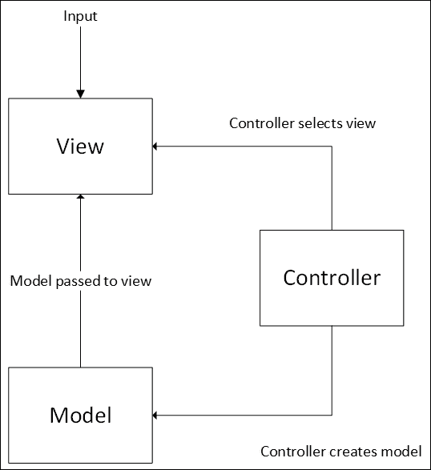
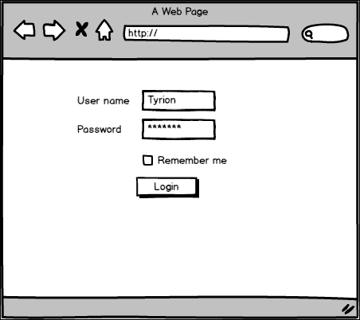
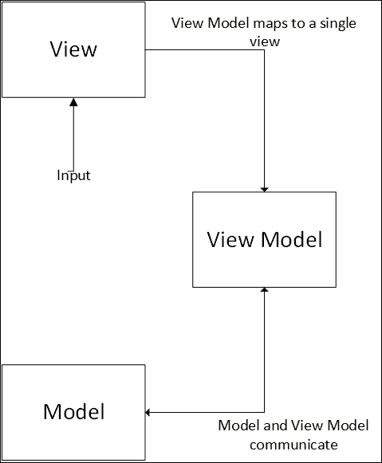

# 应用程序模式

到目前为止，我们已经花了大量的时间来研究用于解决局部问题的模式; 问题只涉及少数类而不是整个应用程序。 这些模式的范围很窄。 它们通常只与两个或三个类相关，并且可能在任何给定的应用程序中只使用一次。 可以想象，还有更大规模的模式可以应用于整个应用程序。 您可能认为“工具栏”是应用程序中许多地方使用的通用模式。 更重要的是，在许多应用程序中都使用这种模式，以提供类似的外观和感觉。 模式可以帮助指导如何组装整个应用程序。

在本章中，我们将研究一组模式，我称之为 MV*系列。 这个系列包括 MVC、MVVM、MVP，甚至 PAC。就像它们的名字一样，模式本身也非常相似。 本章将涵盖这些模式，并展示如何或是否可以将它们应用于 JavaScript。 我们还将特别注意模式之间的差异。 在本章的最后，你应该能够在鸡尾酒会上解释 MVP 和 MVC 的细微差别，让客人兴奋不已。

所涵盖的主题如下:

*   模型视图模式的历史
*   模型-视图-控制器
*   模型-视图-主持人
*   模型-视图-视图模型

# 首先，了解一些历史

在应用程序中分离关注点是一个非常重要的想法。 我们生活在一个复杂多变的世界。 这意味着，不仅几乎不可能制定出一个完全按照用户希望的方式运行的计算机程序，而且用户想要的是一个不断变化的迷宫。 再加上用户 A 的理想程序与用户 B 的理想程序完全不同这一事实，我们肯定会落得一团糟。 我们的申请需要像换袜子一样频繁:至少一年一次。

对应用程序分层并维护模块化可以减少变更的影响。 每一层对其他层的了解越少越好。 在层之间保持简单的接口可以减少对一个层的更改渗透到另一个层的机会。

如果你曾经仔细观察过一块高质量的尼龙(从热气球、降落伞或昂贵的夹克上)，你可能会注意到织物似乎形成了小方块。 这是因为，每隔几毫米，就会有一根粗的加强线加入到编织中，形成一个十字阴影图案。 如果织物被撕裂，那么撕裂将被加固物阻止或至少减缓。 这将损害限制在小范围内，并防止其扩散。

应用程序中的层和模块是完全相同的:它们限制了更改造成的损害的扩散。

在本书的前几章中，我们讨论了 Smalltalk 这门影响深远的语言。 正是这种语言使各个班闻名遐迩。 像许多这些模式一样，原始的 MV*模式，**Model View Controller**(**MVC**)，在它被识别之前就已经使用很久了。 尽管很难证明 MVC 最初是由挪威计算机科学家 Trygve Reenskaug 在 20 世纪 70 年代末访问传奇的施乐 PARC 时提出的。 在 20 世纪 80 年代，该模式在 Smalltalk 应用程序中大量使用。 然而，直到 1988 年，Glenn E. Krasner 和 Stephen T. Pope 在一篇题为*A Cookbook for Using the Model-View-Controller User Interface Paradigm*的文章中对该模式进行了更正式的记录。

# 模型视图控制器

MVC 是一种模式，它对于创建丰富的交互式用户界面非常有用:这种界面在网络上越来越流行。 精明的人可能已经知道这个模式是由三个主要组件组成的:模型、视图和控制器。 你可以在这个图中看到信息是如何在组件之间流动的:



上图展示了 MVC 中三个组件之间的关系。

模型包含程序的状态。 在许多应用程序中，这个模型以某种形式包含在数据库中。 模型可以从数据库等持久存储中重新水化，也可以是暂时的。 理想情况下，模型是模式中唯一可变的部分。 视图和控制器都没有与它们关联的任何状态。

对于一个简单的登录屏幕，模型可能如下所示:

```js
class LoginModel{
  UserName: string;
  Password: string;
  RememberMe: bool;
  LoginSuccessful: bool;
  LoginErrorMessage: string;
}
```

您会注意到，我们不仅有显示给用户的输入字段，而且还有登录状态字段。 这对用户来说并不明显，但它仍然是应用程序状态的一部分。

模型通常被建模为一个简单的信息容器。 通常，模型中没有实际的函数。 它只包含数据字段，还可能包含验证。 在一些 MVC 模式的实现中，模型还包含关于字段(如验证规则)的元数据。

### 注释

Naked Object 模式偏离了典型的 MVC 模式。 它用广泛的业务信息以及关于数据显示和编辑的点击来增强模型。 它甚至包含将模型持久化到存储的方法。

Naked Object 模式中的视图是由这些模型自动生成的。 控制器也是通过检查模型自动生成的。 这集中了显示和操作应用程序状态的逻辑，并使开发人员不必编写自己的视图和控制器。 因此，当视图和控制器仍然存在时，它们不是实际的对象，而是从模型中动态创建的。

使用此模式已经成功部署了多个系统。 对于仅从模型生成有吸引力的用户界面的能力，以及如何正确协调多个视图，出现了一些批评。

在 Reenskaug 博士论文的前言中，*呈现了 Naked Objects*，他认为 Naked Objects 模式实际上更接近他对 MVC 的最初设想，而不是 MVC 的大多数衍生。

当状态发生变化时，对模型的更新就会通知视图。 这通常通过使用观察者模式来完成。 模型通常不知道控制器或视图。 第一个只是告诉它改变的东西，第二个只是通过观察者模式更新，所以模型没有直接的知识。

视图所做的工作与您所期望的差不多:将模型状态传递给目标。 我不愿建议视图必须是模型的可视化或图形表示，因为视图经常与另一台计算机通信，可能是以 XML、JSON 或其他数据格式的形式。 在大多数情况下，特别是那些与 JavaScript 相关的情况下，视图将是一个图形对象。 在 web 环境中，这通常是由浏览器呈现的 HTML。 JavaScript 在手机和桌面上也越来越受欢迎，所以视图也可以是手机或桌面的屏幕。

上一段中给出的模型视图可能如下图所示:



在不使用观察者模式的情况下，视图可能会以一定的间隔轮询模型以查找更改。 在这种情况下，视图可能必须保留状态本身的表示，或者至少保留版本号。 重要的是，视图不能在没有将更新传递给控制器的情况下单方面更新这个状态，否则模型和视图中的副本将会失去同步。

最后，控制器更新模型的状态。 控制器通常包含用于更新模型上字段的所有逻辑和业务规则。 登录页面的一个简单控制器可能看起来像下面的代码:

```js
class LoginController {
  constructor(model) {
    this.model = model;
  }
  Login(userName, password, rememberMe) {
    this.model.UserName = userName;
    this.model.Password = password;
    this.model.RememberMe = rememberMe;
    if (this.checkPassword(userName, password))
      this.model.LoginSuccessful;
    else {
      this.model.LoginSuccessful = false;
      this.model.LoginErrorMessage = "Incorrect username or password";
    }
  }
};
```

控制器知道模型的存在，通常也知道视图的存在。 它能协调他们俩。 一个控制器可能负责初始化多个视图。 例如，单个控制器可以提供一个包含模型所有实例的列表视图，以及一个仅提供细节的视图。 在许多系统中，控制器将在模型上进行创建、读取、更新和删除(CRUD)操作。 控制器负责选择正确的视图，并连接模型和视图之间的通信。

当需要对应用程序进行更改时，代码的位置应该立即显示出来。 例如:

<colgroup><col> <col></colgroup> 
| 

改变

 | 

位置

 |
| --- | --- |
| 元素在屏幕上显示的间距不够，请更改间距。 | 视图 |
| 由于密码验证中的逻辑错误，没有用户能够登录。 | 控制器 |
| 需要添加的新字段。 | 所有层 |

### 注释

**presentation - abstract - control**(**PAC**)是另一种使用三组组件的模式。 在这种情况下，它的目标是描述一个封装的三元组层次结构，使其更符合我们对世界的看法。 该控件类似于 MVC 控制器，将交互传递到封装组件的层次结构中，允许信息在组件之间流动。 抽象类似于模型，但可能只代表对特定 PAC 重要的少数字段，而不是整个模型。 最后，表示实际上与视图相同。

PAC 的层次性允许组件的并行处理，这意味着它可以成为当今多处理器系统中的强大工具。

您可能会注意到，最后一个要求对应用程序的所有层进行更改。 Naked Objects 模式试图通过动态创建视图和控制器来解决这些多位置的责任。 MVC 模式将代码按其在用户交互中的角色划分为位置。 这意味着所有层中都有一个数据字段，如图所示:


有些人可能会将其称为横切关注点，但实际上它并没有覆盖足够多的应用程序。 数据访问和日志记录是横切关注点，因为它们无处不在，而且很难集中。 一个场通过不同层的扩散真的不是一个大问题。 但是，如果它让您感到 bug，那么您可能是使用 Naked Objects 模式的理想人选。

让我们开始构建一些代码来用 JavaScript 表示 MVC。

## MVC 代码

让我们从一个简单的场景开始，我们可以应用 MVC。 不幸的是，维斯特洛几乎没有电脑，可能是因为缺少电力。 因此，以维斯特洛为例应用应用程序结构化模式是很困难的。 遗憾的是，我们不得不退一步讨论控制维斯特洛的应用程序。 让我们假设它是一个 web 应用程序，并在客户端实现整个 MVC。

通过在客户端和服务器之间拆分模型、视图和控制器来实现 MVC 是可能的。 通常，控制器位于服务器上并提供视图所知道的 API。 该模型充当了与驻留在 web 浏览器中的视图和数据存储(可能是某种形式的数据库)的通信方法。 在客户端需要一些额外控制的情况下，在服务器和客户端之间分割控制器也是很常见的。

在我们的示例中，我们想要创建一个控制城堡属性的屏幕。 幸运的是，您很幸运，这不是一本关于用 HTML 设计用户界面的书，因为我肯定会失败。 我们将坚持用图片来代替 HTML:


在大多数情况下，视图只是为最终用户提供一组控件和数据。 在这个例子中，视图需要知道如何调用控制器上的 save 函数。 让我们来设置一下:

```js
class CreateCastleView {
  constructor(document, controller, model, validationResult) {
    this.document = document;
    this.controller = controller;
    this.model = model;
    this.validationResult = validationResult;
    this.document.getElementById("saveButton").addEventListener("click", () => this.saveCastle());
    this.document.getElementById("castleName").value = model.name;
    this.document.getElementById("description").value = model.description;
    this.document.getElementById("outerWallThickness").value = model.outerWallThickness;
    this.document.getElementById("numberOfTowers").value = model.numberOfTowers;
    this.document.getElementById("moat").value = model.moat;
  }
  saveCastle() {
    var data = {
      name: this.document.getElementById("castleName").value,
      description: this.document.getElementById("description").value,
      outerWallThickness: this.document.getElementById("outerWallThickness").value,
      numberOfTowers: this.document.getElementById("numberOfTowers").value,
      moat: this.document.getElementById("moat").value
    };
    this.controller.saveCastle(data);
  }
}
```

您会注意到这个视图的构造函数包含对文档和控制器的引用。 该文档包含 HTML 和样式，由 CSS 提供。 我们可以不传递对文档的引用，但以这种方式注入文档可以更容易地测试。 我们将在后面的章节中更多地讨论可测试性。 它还允许在单个页面上多次重用视图，而不必担心两个实例之间的冲突。

构造函数还包含对模型的引用，用于根据需要向页面上的字段添加数据。 最后，构造函数还引用一组错误。 这允许控制器的验证错误被传递回要处理的视图。 我们已经将验证结果设置为一个包装的集合，看起来如下所示:

```js
class ValidationResult{
  public IsValid: boolean;
  public Errors: Array<String>;
  public constructor(){
    this.Errors = new Array<String>();
  }
}
```

这里唯一的功能是按钮的`onclick`方法绑定到控制器上调用 save。 我们不是向控制器上的`saveCastle`函数传递大量参数，而是构建一个轻量级对象并将其传递进来。 这使得代码更具可读性，特别是在某些参数是可选的情况下。 在视图中没有完成任何实际工作，所有的输入都直接进入控制器。

控制器包含应用程序的真实功能:

```js
class Controller {
  constructor(document) {
    this.document = document;
  }
  createCastle() {
    this.setView(new CreateCastleView(this.document, this));
  }
  saveCastle(data) {
    var validationResult = this.validate(data);
    if (validationResult.IsValid) {
      //save castle to storage
      this.saveCastleSuccess(data);
    }
    else {
      this.setView(new CreateCastleView(this.document, this, data, validationResult));
    }
  }
  saveCastleSuccess(data) {
    this.setView(new CreateCastleSuccess(this.document, this, data));
  }
  setView(view) {
    //send the view to the browser
  }
  validate(model) {
    var validationResult = new validationResult();
    if (!model.name || model.name === "") {
      validationResult.IsValid = false;
      validationResult.Errors.push("Name is required");
    }
    return;
  }
}
```

这里的控制器做了很多事情。 首先，它有一个`setView`函数，指示浏览器将给定的视图设置为当前视图。 这可能是通过使用模板来实现的。 如何运作的机制对这个模式并不重要，所以我把它留给你们想象。

接下来，控制器实现了`validate`方法。 该方法检查以确保模型有效。 有些验证可能在客户机上执行，例如测试邮政编码的格式，但其他验证需要服务器访问。 如果用户名必须是唯一的，那么没有合理的方法在客户机上测试，而不与服务器通信。 在某些情况下，验证功能可能存在于模型而不是控制器中。

在控制器中还可以找到用于设置各种不同视图的方法。 在这种情况下，我们有一个工作流程，有一个创建城堡的视图，然后有成功和失败的视图。 失败案例只是返回同一个视图，其中附加了一组验证错误。 成功案例返回一个全新的视图。

将模型保存到某种持久存储的逻辑也位于控制器中。 同样，与存储系统通信的逻辑位于控制器中，这一点的实现并不重要。

MVC 中的最后一个字母是模型。 在这种情况下，它是一个非常轻的重量:

```js
class Model {
  constructor(name, description, outerWallThickness, numberOfTowers, moat) {
    this.name = name;
    this.description = description;
    this.outerWallThickness = outerWallThickness;
    this.numberOfTowers = numberOfTowers;
    this.moat = moat;
  }
}
```

如您所见，它所做的只是跟踪组成应用程序状态的变量。

在这个模式中，关注点被很好地分离，允许相对容易地进行更改。

# 模型视图展示器

**Model View****Presenter**(**MVP**)模式与 MVC 非常相似。 它是微软世界中相当有名的模式，通常用于构建 WPF 和 Silverlight 应用程序。 它也可以在纯 JavaScript 中使用。 关键的区别归结为系统的不同部分如何交互以及它们的职责在哪里结束。

第一个区别是，对于演示器，演示器和视图之间存在一对一的映射。 这意味着 MVC 模式中控制器中存在的逻辑(它选择了要呈现的正确视图)不存在。 或者更确切地说，它存在于模式关注之外的更高级别。 选择正确的演示者可以通过路由工具来处理。 这样的路由器将检查参数，并为演示者提供最佳选择。 MVP 模式中的信息流可以从这里看到:


演示者知道视图和模型，但视图不知道模型，模型也不知道视图。 所有的通信都是通过演示者传递的。

演示者模式的特点通常是大量的双向分派。 点击将触发演示者和，然后演示者将用更改更新模型，然后更新视图。 前面的图表表明，输入首先通过视图。 在 MVP 模式的被动版本中，当消息传递给演示者时，视图与消息几乎没有交互。 然而，也有一个变种称为活跃的 MVP，它允许视图包含一些额外的逻辑。

这个活跃版本的 MVP 可以更有用的网络情况。 它允许向视图添加验证和其他简单逻辑。 这减少了需要从客户端传递回 web 服务器的请求数量。

让我们更新我们现有的代码样本，使用 MVP 而不是 MVC。

## MVP 代码

让我们再从以下视角开始

```js
class CreateCastleView {
  constructor(document, presenter) {
    this.document = document;
    this.presenter = presenter;
    this.document.getElementById("saveButton").addEventListener("click", this.saveCastle);
  }
  setCastleName(name) {
    this.document.getElementById("castleName").value = name;
  }
  getCastleName() {
    return this.document.getElementById("castleName").value;
  }
  setDescription(description) {
    this.document.getElementById("description").value = description;
  }
  getDescription() {
    return this.document.getElementById("description").value;
  }
  setOuterWallThickness(outerWallThickness) {
    this.document.getElementById("outerWallThickness").value = outerWallThickness;
  }
  getOuterWallThickness() {
    return this.document.getElementById("outerWallThickness").value;
  }
  setNumberOfTowers(numberOfTowers) {
    this.document.getElementById("numberOfTowers").value = numberOfTowers;
  }
  getNumberOfTowers() {
    return parseInt(this.document.getElementById("numberOfTowers").value);
  }
  setMoat(moat) {
    this.document.getElementById("moat").value = moat;
  }
  getMoat() {
    return this.document.getElementById("moat").value;
  }
  setValid(validationResult) {
  }
  saveCastle() {
    this.presenter.saveCastle();
  }
}
```

如您所见，视图的构造函数不再接受对模型的引用。 这是因为MVP 的视图并不知道使用的是什么模型。 这些信息被演讲者抽象出来了。 对演示者的引用保留在构造函数中，以允许将消息发送回演示者。

如果没有模型，公共 setter 和 getter 方法的数量就会增加。 这些设置器允许展示器更新视图的状态。 getter 提供了关于视图如何存储状态的抽象，并为演示者提供了获取信息的方法。 `saveCastle`函数不再向演示者传递任何值。

演示者的代码如下所示:

```js
class CreateCastlePresenter {
  constructor(document) {
    this.document = document;
    this.model = new CreateCastleModel();
    this.view = new CreateCastleView(document, this);
  }
  saveCastle() {
    var data = {
      name: this.view.getCastleName(),
      description: this.view.getDescription(),
      outerWallThickness: this.view.getOuterWallThickness(),
      numberOfTowers: this.view.getNumberOfTowers(),
      moat: this.view.getMoat()
    };
    var validationResult = this.validate(data);
    if (validationResult.IsValid) {
      //write to the model
      this.saveCastleSuccess(data);
    }
    else {
      this.view.setValid(validationResult);
    }
  }
  saveCastleSuccess(data) {
    //redirect to different presenter
  }
  validate(model) {
    var validationResult = new validationResult();
    if (!model.name || model.name === "") {
      validationResult.IsValid = false;
      validationResult.Errors.push("Name is required");
    }
    return;
  }
}
```

您可以看到，该视图现在在演示器中以持久方式被引用。 `saveCastle`方法调用视图以获取其值。 但是，演示者确保使用视图的公共方法，而不是直接引用文档。 `saveCastle`方法更新模型。 如果有验证错误，它将回调到视图以更新`IsValid`标志。 这是我前面提到的双重调度的一个例子。

最后，模型保持不变。 我们在演示器中保留了验证逻辑。 在哪个级别完成验证，模型或演示者，比在应用程序的哪个位置完成验证的一致性更重要。

对于构建用户界面来说，MVP 模式也是一个相当有用的模式。 视图和模型之间的较大分离创建了更严格的 API，允许更好地适应更改。 然而，这是以牺牲更多代码为代价的。 代码越多，出现 bug 的机会就越多。

# Model View ViewModel

在本章中，我们要看的最后一个模式是模型视图视图模型模式，通常称为 MVVM。 到目前为止，这种模式应该已经相当熟悉了。 同样，你可以在这个图中看到组件之间的信息流:



您可以在这里看到，许多相同的结构已经返回，但它们之间的通信有些不同。

在这个变体中，以前是控制器和演示者的现在是视图模型。 就像 MVC 和 MVP 一样，大部分逻辑都包含在中心组件中，在本例中是视图模型。 MVVM 中的模型本身实际上非常简单。 通常，它充当一个只保存数据的信封。 验证在视图模型中完成。

就像 MVP 一样，视图完全不知道模型的存在。 不同之处在于，使用 MVP 时，视图意识到它是在与一些中级阶级对话。 它调用方法而不是简单地设置值。 在 MVVM 中，视图相信视图模型是它的视图。 视图不是调用诸如`saveCastle`之类的操作并传入数据或等待数据被请求，而是在视图模型上的字段发生变化时更新它们。 实际上，视图上的字段绑定到视图模型。 视图模型可以通过代理将这些值传递给模型，或者等待，直到调用类似 save 的提交操作来传递数据。

同样，对视图模型的更改应该立即反映到视图中。 一个视图可能有许多视图模型。 这些视图模型中的每一个都可以向视图推送更新，或者通过视图推送更改。

让我们来看看它的基本实现，然后我们将讨论如何做得更好。

## MVVM 代码

说实话，naïve 视图的实现是一个巨大的混乱:

```js
var CreateCastleView = (function () {
  function CreateCastleView(document, viewModel) {
    this.document = document;
    this.viewModel = viewModel;
    var _this = this;
    this.document.getElementById("saveButton").addEventListener("click", function () {
    return _this.saveCastle();
  });
  this.document.getElementById("name").addEventListener("change", this.nameChangedInView);
  this.document.getElementById("description").addEventListener("change", this.descriptionChangedInView);
  this.document.getElementById("outerWallThickness").addEventListener("change", this.outerWallThicknessChangedInView);
  this.document.getElementById("numberOfTowers").addEventListener("change", this.numberOfTowersChangedInView);
  this.document.getElementById("moat").addEventListener("change",this.moatChangedInView);
}
CreateCastleView.prototype.nameChangedInView = function (name) {
  this.viewModel.nameChangedInView(name);
};

CreateCastleView.prototype.nameChangedInViewModel = function (name) {
  this.document.getElementById("name").value = name;
};
//snipped more of the same
CreateCastleView.prototype.isValidChangedInViewModel = function (validationResult) {
  this.document.getElementById("validationWarning").innerHtml = validationResult.Errors;
  this.document.getElementById("validationWarning").className = "visible";
};
CreateCastleView.prototype.saveCastle = function () {
  this.viewModel.saveCastle();
};
return CreateCastleView;
})();
CastleDesign.CreateCastleView = CreateCastleView;
```

它是高度重复的，每个属性必须被代理回`ViewModel`。 我已经截断了大部分代码，但它加起来有 70 行。 视图模型中的代码同样糟糕:

```js
var CreateCastleViewModel = (function () {
  function CreateCastleViewModel(document) {
    this.document = document;
    this.model = new CreateCastleModel();
    this.view = new CreateCastleView(document, this);
  }
  CreateCastleViewModel.prototype.nameChangedInView = function (name) {
    this.name = name;
  };

  CreateCastleViewModel.prototype.nameChangedInViewModel = function (name) {
    this.view.nameChangedInViewModel(name);
  };
  //snip
  CreateCastleViewModel.prototype.saveCastle = function () {
    var validationResult = this.validate();
    if (validationResult.IsValid) {
      //write to the model
      this.saveCastleSuccess();
    } else {
      this.view.isValidChangedInViewModel(validationResult);
    }
  };

  CreateCastleViewModel.prototype.saveCastleSuccess = function () {
    //do whatever is needed when save is successful.
    //Possibly update the view model
  };

  CreateCastleViewModel.prototype.validate = function () {
    var validationResult = new validationResult();
    if (!this.name || this.name === "") {
      validationResult.IsValid = false;
        validationResult.Errors.push("Name is required");
    }
    return;
  };
  return CreateCastleViewModel;
})();
```

看一眼这段代码应该会让你跑得远远的。 它是以一种鼓励复制和粘贴编程的方式设置的:这是一种将错误引入代码库的奇妙方式。 我当然希望有更好的方法来在模型和视图之间转换更改。

## 在模型和视图之间转换更改的更好方法

你可能注意到了，现在有很多 mvvm 风格的 JavaScript 框架。 显然，如果它们遵循我们在前一节中描述的方法，就不会轻易地被采用。 相反，他们遵循两种不同的方法之一。

第一种方法被称为脏检查。 在这种方法中，每次与视图模型交互后，我们都会循环遍历它的所有属性以寻找更改。 当发现更改时，视图中的相关值将被更新为新值。 对于视图中值的更改，操作被附加到所有控件。 然后触发对视图模型的更新。

对于大型模型来说，这种方法可能很慢，因为迭代大型模型的所有属性代价很高。 导致模型改变的因素非常多，并且没有真正的方法来判断模型中的一个远场是否通过改变另一个而改变，而不去验证它。 从好的方面看，脏检查允许您使用普通的旧 JavaScript 对象。 没有必要编写与以前任何不同的代码。 另一种方法:容器对象则不是这样。

对于容器对象，提供了一个特殊的接口来包装现有对象，以便可以直接观察到对象的更改。 基本上，这是观察者模式的一个应用，但是是动态应用的，所以底层对象不知道它正在被观察。 也许是间谍模式?

举个例子可能会有帮助。 假设我们有我们一直使用的模型对象:

```js
var CreateCastleModel = (function () {
  function CreateCastleModel(name, description, outerWallThickness, numberOfTowers, moat) {
    this.name = name;
    this.description = description;
    this.outerWallThickness = outerWallThickness;
    this.numberOfTowers = numberOfTowers;
    this.moat = moat;
  }
  return CreateCastleModel;
})();
```

然后，与其将`model.name`作为一个简单的字符串，我们将在它周围包装一些函数。 在 Knockout 库的情况下，如下所示:

```js
var CreateCastleModel = (function () {
  function CreateCastleModel(name, description, outerWallThickness, numberOfTowers, moat) {
    this.name = ko.observable(name);
    this.description = ko.observable(description);
    this.outerWallThickness = ko.observable(outerWallThickness);
    this.numberOfTowers = ko.observable(numberOfTowers);
    this.moat = ko.observable(moat);
  }
  return CreateCastleModel;
})();
```

在突出显示的代码中，模型的各种属性被一个可观察对象包装了起来。 这意味着现在必须以不同的方式访问它们:

```js
var model = new CreateCastleModel();
model.name("Winterfell"); //set
model.name(); //get
```

这种方法显然会给您的代码增加一些摩擦，并使更改框架变得非常复杂。

当前的 MVVM 框架在容器对象和脏检查方法上存在分歧。 AngularJS 使用脏检查，而 Backbone、Ember 和 Knockout 都使用容器对象。 目前还没有明确的赢家。

## 观察视图变化

幸运的是，MV*模式在网络上的普及和观察模型变化的困难并没有被忽视。 你可能希望我说这将在 ECMAScript-2015 中解决，这是我的正常方法。 奇怪的是，所有这些的解决方案`Object.observe`是 ECMAScript-2016 中正在讨论的一个特性。 然而，在撰写本文时，至少有一个主流浏览器已经支持它。

它可以像下面这样使用:

```js
var model = { };
Object.observe(model, function(changes){
  changes.forEach(function(change) {
    console.log("A " + change.type + " occured on " +  change.name + ".");
    if(change.type=="update")
      console.log("\tOld value was " + change.oldValue );
  });
});
model.item = 7;
model.item = 8;
delete model.item;
```

使用这个简单的接口来监视对象的变化，删除了大型 MV*框架提供的许多逻辑。 为 MV*运行自己的功能会更容易，事实上，可能不需要使用外部框架。

# 提示和技巧

各种 MV*模式的不同层不需要全部在浏览器上，也不需要全部用 JavaScript 编写。 许多流行的框架都允许在服务器上维护模型，并使用 JSON 与模型通信。

`Object.observe`可能还不能在所有的浏览器上使用，但是有一些腻子可以用来创建一个类似的界面。 它的性能不如本机实现，但仍然是可用的。

# 小结

将关注点分离到多个层，可以确保对应用程序的更改像 rippstop 一样被隔离。 各种 MV*模式允许在图形应用程序中分离关注点。 不同模式之间的差异可以归结为职责如何分离以及信息如何通信。

在下一章中，我们将讨论一些模式和技术，以改进开发和部署 JavaScript 到 Web 的体验。