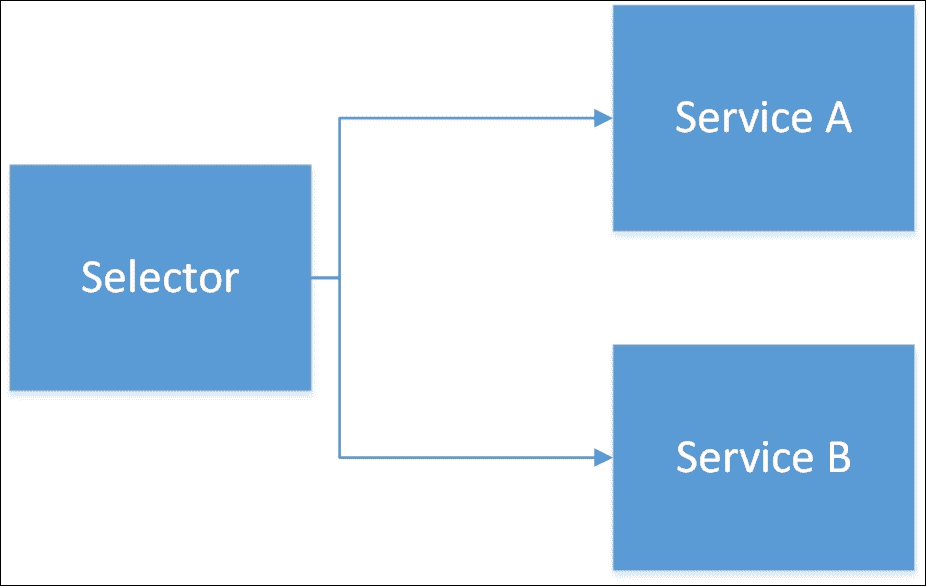
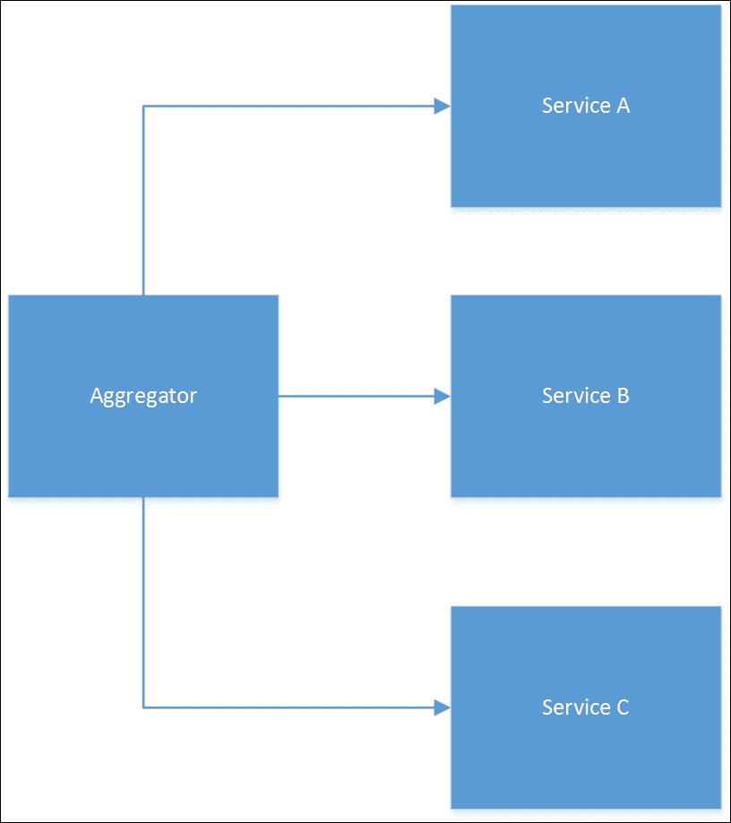

# 十一、微服务

如今，似乎没有一本关于编程的书是完整的，至少有一点提到微服务。 由于担心这本书可能会被挑出来嘲笑为不符合标准的出版物，微服务中加入了一章。

微服务被认为是解决单片应用问题的方法。 您所处理的每个应用很可能都是一个整体:也就是说，应用只有一个逻辑可执行程序，并且可能被分成多个层，如用户界面、服务或应用层和数据存储层。 在许多应用中，这些层可能是网页、服务器端应用和数据库。 巨石也有自己的问题，我相信你也遇到过。

维护一个独立的应用很快就变成了限制更改影响的练习。 在此类应用中，对应用某个看似独立的角落的更改经常会对应用的其他部分产生意想不到的影响。 尽管有许多模式和方法来描述良好的隔离组件，但这些通常在整体结构中半途而废。 我们经常走捷径，这些捷径现在可能节省时间，但将来会使我们的生活变得糟糕。

单片应用也难以扩展。 因为我们往往只有三层，我们被限制缩放每一层。 如果中间层变慢，我们可以增加更多的应用服务器;如果 web 层变慢，我们可以增加更多的 web 服务器。 如果数据库很慢，那么我们可以增加数据库服务器的能力。 这些扩展方法是非常大的操作。 如果应用唯一慢的部分是注册新用户，那么我们真的没有办法简单地扩展这个组件。 这意味着不经常使用的组件(可以称为冷组件或冷组件)必须能够按照整个应用的规模进行伸缩。 这种缩放并不是免费的。

考虑到从一个 web 服务器扩展到多个 web 服务器会导致在多个 web 服务器之间共享会话的问题。 相反，如果我们将应用划分为许多服务，其中每一个服务都作为一段数据的权威来源，那么我们就可以独立地扩展这些部分。 一种服务用于用户登录，另一种服务用于保存和检索他们的偏好，还有一种服务用于发送关于废弃购物车的提醒邮件，每个购物车负责自己的功能和数据。 每个服务都是独立的应用，可以在单独的机器上运行。 实际上，我们已经将我们的单片应用切分到许多应用中。 不仅每个服务都有一个独立的功能，而且它也有自己的数据存储，可以使用自己的技术实现。 整体服务和微服务的区别可以在这里看到:


应用更多是通过组合服务编写的，而不是通过编写单一的单片应用。 应用的 UI 甚至可以通过要求许多服务提供可视化组件来创建，这些组件通过某种组合服务的形式被插入到复合 UI 中。

Node.js 的轻量级方法只使用所需的组件来构建应用，这使它成为构建轻量级微服务的理想平台。 许多微服务部署大量使用 HTTP 在服务之间进行通信，而其他微服务则更多地依赖消息传递系统，如**RabbitMQ**或**ZeroMQ**。 这两种通信方法可能在部署中混合使用。 可以将所使用的技术分为以下两类:针对仅提供查询的服务使用 HTTP，针对执行某些操作的服务使用消息传递。 这是因为消息传递比发送 HTTP 请求更可靠(取决于消息传递系统和配置)。

虽然我们似乎已经在系统中引入了大量的复杂性，但这种复杂性更易于使用现代工具进行管理。 存在非常好的工具来管理分布式日志文件，以及用于监视应用性能问题的。 使用虚拟化隔离和运行许多应用比使用容器化技术更容易实现。

微服务可能不能解决我们所有的维护和可伸缩性问题，但它们肯定是一种可行的考虑方法。 在本章中，我们将探讨一些有助于使用微服务的模式:

*   外观
*   聚合服务
*   管道
*   消息升级程序
*   服务选择器
*   失败模式

由于微服务是一个相对较新的发展，随着越来越多的应用使用微服务方法创建，可能会出现更多的模式。 微服务方法与**面向服务****体系结构**(**SOA**)有一些相似之处。 这意味着可能有一些来自 SOA 世界的模式将适用于微服务世界。

# 正面

如果你觉得你认识这个模式的名字，那么你是正确的。 我们在[第四章](04.html#page "Chapter 4. Structural Patterns")，*结构模式*中讨论过这种模式。 在该模式的应用中，我们创建了一个类，它可以指导提供更简单 API 的许多其他类的操作。 我们的例子是一个指挥舰队的海军上将。 在微服务世界中，我们可以简单地用服务的概念替换类的概念。 毕竟，服务的功能与微服务没有太大区别——它们都执行单个操作。

我们可以使用 façade 来协调其他一些服务的使用。 这个模式是本章中列出的许多其他模式的基本模式。 协调服务可能很困难，但通过将它们放在 façade 后面，我们可以使整个应用变得更简单。 让我们考虑一种发送电子邮件的服务。 发送电子邮件是一个相当复杂的过程，可能涉及许多其他服务:用户名到电子邮件地址翻译，反恶意软件扫描器，垃圾邮件检查器，为各种电子邮件客户端发送电子邮件正文的格式化程序，等等。

大多数想要发送电子邮件的客户不希望自己关注所有这些其他服务，因此可以设置一个 façade 电子邮件发送服务，它负责协调其他服务。 协调模式如下图所示:


# 服务选择器

沿着与façade 相同的路线，我们有服务选择器模式。 在这个模式中，我们有一个服务，它位于许多其他服务的前面。 根据到达的消息，可以选择不同的服务来响应初始请求。 此模式在升级场景和实验中非常有用。 如果您正在推出一个新服务，并希望确保它在负载下能够正确工作，那么您可以利用服务选择器模式将一小部分生产流量引导到新服务，同时密切监视它。 另一个应用可能用于将特定的客户或客户组定向到不同的服务。 区别的因素可以是任何东西，从引导那些为你的服务付费的人到更快的终端，到将流量从特定国家导向特定国家的服务。 服务选择器模式如下图所示:



# 综合服务

微服务体系结构中的数据由单个服务拥有，但很多时候我们可能需要同时从多个不同的源检索数据。 再考虑一下维斯特洛小议会的成员。 他们可能有许多告密者，他们从他们那里收集关于王国运作的信息。 您可以将每个告密者视为它自己的微服务。

### 提示

告密者是微服务的一个绝妙比喻，因为每个微服务都是独立的，拥有自己的数据。 服务也可能不时地失败，就像告密者可能被捕获和终止一样。 消息在告密者之间传递，就像它们在一组微服务之间传递一样。 每一个告密者都不应该知道其他告密者是如何工作的，甚至不知道他们是谁——这个抽象概念也适用于微服务。

使用聚合服务模式，我们要求一个节点集合中的每个节点执行一些操作或返回一些数据。 即使在微服务领域之外，这也是一种相当常见的模式，并且是 façade 或适配器模式的特殊情况。 聚合器从许多其他服务请求信息，然后等待它们返回。 一旦返回了所有的数据，那么聚合器可能会执行一些额外的任务，例如汇总数据或计数记录。 然后将信息传递回调用者。 聚合器可以在这张图中看到:



此模式还可能为处理返回缓慢的服务或服务故障提供了一些准备。 当一个子服务超时时，聚合器服务可以返回部分结果或从缓存中返回数据。 在某些体系结构中，聚合器可以返回部分结果，然后在数据可用时向调用者返回额外的数据。

# 管道

管道是微服务连接模式的另一个例子。 如果您在*NIX 系统上使用了 shell，那么您肯定已经通过管道将一个命令的输出传送到另一个命令。 ls、sort、uniq 和 grep 等*NIX 系统上的程序被设计为只执行一个任务; 它们的力量来自于将工具链接在一起以构建相当复杂的工作流程的能力。 例如，下面的命令:

```js
ls -1| cut -d \. -f 2 -s | sort |uniq

```

这个命令将列出当前目录中所有唯一的文件扩展名。 它通过获取文件列表，然后切割它们并获取扩展名来实现这一点; 然后对其进行排序，最后传递给`uniq`，以删除重复项。 虽然我不建议使用微服务来处理诸如排序或重复数据删除这样的琐碎操作，但您可能会拥有一系列构建越来越多信息的服务。

让我们想象一个返回公司记录集合的查询服务:

```js
| Company Id| Name | Address | City | Postal Code | Phone Number |

```

此记录由本公司查找服务退回。 现在我们可以将这个记录传递到我们的销售会计服务，它将添加一个销售总额到记录:

```js
| Company Id| Name | Address | City | Postal Code | Phone Number | 2016 orders Total |

```

现在，该记录可以传递到销售估计服务，进一步提高记录与 2017 年的销售估计:

```js
| Company Id| Name | Address | City | Postal Code | Phone Number | 2016 orders Total | 2017 Sales Estimate |

```

这种渐进式的增强也可能被删除不应该显示给用户的信息的服务所逆转。 记录现在可能变成以下内容:

```js
| Name | Address | City | Postal Code | Phone Number | 2016 orders Total | 2017 Sales Estimate |

```

这里我们省略了公司标识符，因为它是一个内部标识符。 微服务管道应该是双向的，以便在管道的每个步骤中传递一定量的信息，然后通过每个步骤再次传递回来。 这为服务提供了对数据进行两次操作的机会，并在他们认为合适的时候对其进行操作。 这与许多 web 服务器使用的方法相同，PHP 等模块被允许对请求和响应进行操作。 这里可以看到一个管道:


# 消息升级器

对于一些单片应用来说，风险最高的活动之一就是升级。 要做到这一点，您基本上需要立即升级整个应用。 即使是中等大小的应用，也有太多的方面需要进行合理的测试。 因此，在某些时候，您只需要从旧系统切换到新系统。 使用微服务方法，可以对每个单独的服务进行分割。 较小的服务意味着风险可以在很长一段时间内分散，而且如果出现问题，错误的来源可以更快地确定:单一的新组件。

问题在于那些仍在与升级服务的旧版本进行通信的服务。 我们如何在不更新所有服务的情况下继续提供这些服务? 如果服务的接口不变,说我们的服务计算两点之间的距离在地球上,我们改变它使用半正矢从使用简单的毕达哥拉斯方法(公式发现两个球面上的点之间的距离),那么可能不需要更改输入和输出格式。 然而，由于消息格式必须更改，因此通常无法使用这种方法。 即使在前面的示例中，也有可能更改输出消息。 Haversine 比毕达哥拉斯方法更精确，所以我们可以有更多的有效数字，需要更大的数据类型。 有两种方法可以解决这个问题:

1.  继续使用我们服务的旧版本和新版本。 然后，如果时间允许，我们可以慢慢地将客户服务转移到新的服务。 这种方法存在一些问题:我们现在需要维护更多的代码。 此外，如果我们更改服务的原因是不允许我们继续运行它(安全问题、依赖服务的终止，等等)，那么我们就陷入了某种僵局。
2.  升级消息并传递它们。 在这种方法中，我们采用旧的消息格式并将其升级为新格式。 这是由另一个服务完成的。 该服务的职责是采用旧消息格式并发出新消息格式。 在另一端，您可能需要一个等价的服务来将消息降级为旧服务的预期输出格式。

升级程序服务的寿命应该是有限的。 理想情况下，我们希望尽可能快地对依赖于弃用服务的服务进行更新。 微服务的小代码占用，加上快速部署服务的能力，应该会使这些类型的升级比那些习惯于单片方法的升级更容易。 一个示例消息升级服务可以在这里看到:


# 失败模式

在本章中，我们已经涉及了处理微服务失败的一些方法。 然而，我们应该考虑一些更有趣的方法。 第一个问题是服务降级。

## 业务降级

这种模式也可能是所谓的优雅退化，并与进行性增强有关。 让我们回到用 haversine 等价函数替换勾股定理距离函数的例子。 如果 haversine 服务因某种原因宕机，可以使用要求较低的功能代替它，而不会对用户造成巨大影响。 事实上，他们可能根本没有注意到。 用户拥有一个较差版本的服务并不理想，但这肯定比简单地向用户显示错误消息更可取。 当 haversine 服务回归生活时，我们可以停止使用不太理想的服务。 我们可以有多个级别的回退，允许多个不同的服务出现故障，同时继续向最终用户呈现一个功能完整的应用。

这种形式的降级的另一个很好的应用是退回到更昂贵的服务。 我曾经有一个发送短信的应用。 这是相当重要的，这些信息实际上是发送。 大多数时候，我们使用我们首选的短信网关提供商，但是，如果我们首选的服务不可用，我们密切监视的东西，然后我们将失败切换到使用不同的提供商。

## 消息存储

我们已经绘制了一个位的区别，哪些服务是仅查询和那些实际上执行一些持久的数据更改。 当这些更新服务之一失败时，仍然需要在未来的某个时间点运行数据更改代码。 将这些请求存储在消息队列中允许稍后运行它们，而不会有丢失任何非常重要的消息的风险。 通常，当消息引起异常时，它会被返回到处理队列，在那里可以重试。

有句老话说，疯狂就是重复做同样的事情，并期待不同的结果。 然而，有许多瞬态错误可以通过简单地重复执行相同的动作来解决。 数据库死锁就是一个典型的例子。 您的事务可能会被终止以解决死锁，在这种情况下，再次执行它实际上是推荐的方法。 然而，一个人不能无限地重试消息，所以最好选择一些相对较少的重试尝试，3 或 5 次。 一旦达到这个号码，就可以将邮件发送到死信或有毒邮件队列。

有毒信息，或一些人称之为死信，是有实际合法理由失败的信息。 保存这些消息很重要，不仅是出于调试目的，而且因为这些消息可能代表客户订单或对医疗记录的更改:而不是您可以承受损失的数据。 一旦纠正了消息处理程序，就可以重新播放这些消息，就像错误从未发生过一样。 存储队列和消息再处理器可以在这里看到:


## 消息重放

尽管不是真正的生产模式，但围绕所有更改数据的服务使用基于消息的体系结构的副作用是，您可以获取消息，以便稍后在生产之外重放。 能够重放消息对于调试众多服务之间的复杂交互非常方便，因为消息包含几乎所有用于设置与生产相同的跟踪环境的信息。 重放功能对于必须能够审计对系统的任何数据更改的环境也非常有用。 还有其他方法可以满足这样的审计需求，但是使用一个非常可靠的消息日志是一件非常愉快的事情。

## 信息处理的保障性

我们将要讨论的最后一个故障模式是消息处理的幂等。 随着系统越来越大，微服务体系结构几乎肯定会跨越许多计算机。 这一点更加确定，因为容器的重要性越来越大，从表面上看，可以被认为是计算机。 分布式系统中计算机之间的通信是不可靠的; 因此，一条消息最终可能会被传递不止一次。 为了处理这种可能性，可能希望使消息传递处理是幂等的。

### 提示

关于分布式计算的不可靠性，我推荐的文章没有比 Arnon Rotem-Gal-Oz 在[http://rgoarchitects.com/Files/fallacies.pdf](http://rgoarchitects.com/Files/fallacies.pdf)上的*分布式计算的谬误解释*更有价值的了。

幂等性意味着消息可以在不改变结果的情况下被多次处理。 这可能比人们可能意识到的更难实现，特别是对于本质上是非事务性的服务，如发送电子邮件。 在这些情况下，可能需要编写一条记录，说明电子邮件已经发送到数据库。 在某些情况下，电子邮件将被发送不止一次，但是在正在发送的电子邮件和正在编写的记录之间的关键部分，服务崩溃是不太可能的。 必须做出决定:邮件发送多一次好，还是根本不发送好?

# 提示和提示

如果你把微服务看作一个类，把你的微服务 web 看作一个应用，那么很明显，我们在书中其他地方看到的许多相同的模式也适用于微服务。 服务发现可以等同于依赖项注入。 单例、装饰、代理; 它们都可以应用于微服务领域，就像它们在流程的边界内一样。

需要记住的一件事是，许多模式都有些冗长，来回发送重要的数据。 在一个进程中，不存在传递数据指针的开销。 微服务并非如此。 通过网络进行通信可能会导致性能损失。

# 小结

微服务是一个令人着迷的想法，而且在未来几年内更有可能实现。 现在判断这是正确解决软件工程的另一个错误的转变，还是朝着正确方向迈出的重要一步还为时过早。 在本章中，我们探讨了一些模式，这些模式可能会对你进入微服务世界有所帮助。 因为我们正处于微服务成为主流的边缘，所以这里的模式很可能很快就会过时，并被发现是次优的，这比本书的其他章节都要多。 当你在开发时，保持对发展的警惕并意识到更大的前景是非常明智的。