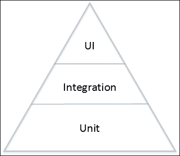
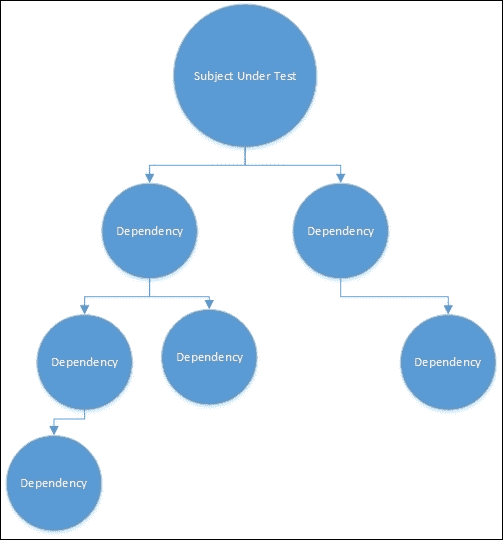

# 模式测试

在这本书中，我们一直在推动这样一个理念:JavaScript 不再是一种玩具语言，我们不能用它来做有用的事情。 现实世界中的软件现在都是用 JavaScript 编写的，而使用 JavaScript 的应用程序的比例在未来十年中只可能增长。

真正的软件需要考虑正确性。 手工测试软件是很痛苦的，而且奇怪的是，很容易出错。 生成自动运行并测试应用程序各个方面的单元和集成测试要便宜得多，也容易得多。

有无数的工具可以用于测试 JavaScript，从测试运行器到测试框架; 生态系统是丰富的。 在本章中，我们将尝试维护一种或多或少与工具无关的测试方法。 这本书并不关心哪个框架是最好的或最友好的。 对于测试来说，总体上有一些通用的总体模式。 这就是我们要研究的。 我们将接触一些特定的工具，但只是作为必须编写所有自己的测试工具的捷径。

在本章中，我们将讨论以下主题:

*   假的物品
*   猴子打补丁
*   与用户界面交互

# 测试金字塔

一般来说，我们计算机程序员都是分析能力很强的人。 这意味着我们总是在努力对概念进行分类和理解。 这导致我们开发了一些非常有趣的全球性技术，可以应用于计算机编程之外。 例如，敏捷开发在一般社会中有应用，但它的根源可以追溯到计算。 有人甚至可能会说，模式这个概念之所以流行，很大程度上是因为它被其他领域的计算机程序员使用。

这种对分类的渴望导致了将测试代码划分为许多不同类型测试的概念。 从单元测试到工作流测试和 GUI 测试，我见过多达八种不同类型的测试。 这也许有点过头了。 更常见的是考虑有三种不同类型的测试:单元测试、集成测试和用户界面测试:



单元测试是金字塔的基础。 它们数量最多，最容易写，并且给出的错误也最细粒度。 单元测试中的错误将允许您找到其中有错误的单个方法。 当我们沿着金字塔向上移动时，测试的数量随着粒度而下降，而每个测试的复杂性却在增加。 在更高的层次上，当测试失败时，我们可能只能说:“向系统添加订单有问题”。

# 使用单元测试进行小型测试

对许多人来说，单元测试是一个陌生的概念。 这是可以理解的，因为这是一个在许多学校教得很差的话题。 我知道我接受了六年的高等教育，学的是计算机科学，却没有人提到它。 这很不幸，因为交付高质量的产品是任何项目中非常重要的一部分。

对于那些了解单元测试的人来说，采用单元测试有一个很大的障碍。 管理人员，甚至开发人员，经常把单元测试和自动化测试看作是浪费时间。 毕竟，您不能将单元测试交付给您的客户，而且大多数客户也不关心他们的产品是否经过了适当的单元测试。

众所周知，单元测试很难定义。 它与集成测试非常接近，人们可以很容易地在两者之间来回切换。 在这本影响深远的书中; *单元测试的艺术*，*Roy Osherove*，作者将单元测试定义为:

> *单元测试是一段自动的代码，它调用系统中的一个工作单元，然后检查关于该工作单元行为的单个假设。*

一个工作单元的确切大小还有待讨论。 有些人将其限制为单个函数或单个类，而另一些人则允许一个工作单元跨越多个类。 我倾向于认为跨越多个类的工作单元实际上可以分解为更小的、可测试的单元。

单元测试的关键是测试一小部分功能，并以可重复的、自动化的方式快速测试功能。 由一个人编写的单元测试应该可以由团队的任何其他成员轻松地运行。

对于单元测试，我们希望测试小部分功能，因为我们相信，如果系统的所有组件都能正常工作，那么整个系统就能正常工作。 这不是全部的真相。 模块之间的通信就像单元内的功能一样有可能失败。 这就是为什么我们要在几个层次上编写测试。 单元测试检查我们正在编写的代码是否正确。 集成测试通过应用程序测试整个工作流，并将发现单元交互中的问题。

测试驱动开发方法建议在编写代码的同时编写测试。 虽然这给了我们很大的信心，我们正在编写的代码是正确的，但真正的优势是，它有助于推动良好的架构。 当代码有太多的相互依赖时，测试要比分离良好的模块代码困难得多。 开发人员编写的许多代码再也没有人读过了。 单元测试提供了一种有用的方法，使开发人员保持在正确的道路上，即使在他们知道没有人会看到他们的代码的情况下。 要想生产出高质量的产品，最好的方法就是告诉人们他们将被检查，即使检查者碰巧是一个自动化测试。

测试可以在开发新代码时运行，也可以在构建机器上以自动方式运行。 如果每次开发人员签入变更时，都构建并测试整个项目，那么就可以保证新签入的代码是正确的。 有时候，构建会中断，这将是一个标志，说明刚刚添加的东西是错误的。 通常，被破坏的代码甚至可能不接近更改的代码。 一个改变的返回值可能会渗透到系统中，并在完全意想不到的地方显示自己。 在任何时候，除了最琐碎的系统之外，没有人能记住任何东西。 测试就像第二记忆，反复检查之前的假设。

一旦出现错误就立即进行失败构建，可以缩短代码中出现错误和发现并修复错误之间的时间。 理想情况下，开发人员对问题仍然记忆犹新，这样就可以很容易地找到解决方案。 如果错误直到几个月后才被发现，那么开发人员肯定已经忘记了他/她当时在做什么。 开发人员甚至可能无法帮助解决问题，而让从未见过代码的人来修复它。

# 安排-行动-主张

在为任何代码段构建测试时，一个非常常见的方法是安排-行为-断言。 这描述了在单个单元测试中发生的不同步骤。

我们要做的第一件事是设置一个测试场景(安排)。 这个步骤可以包括许多操作，可能包括放置假对象来模拟真实对象，以及创建测试对象的新实例。 如果您发现您的测试设置代码很长或者很复杂，那么它可能是一种味道，您应该考虑重构您的代码。 如前一节所述，测试不仅有助于驱动正确性，而且有助于驱动架构。 难于编写的测试表明体系结构不够模块化。

一旦测试设置好，下一步就是实际执行我们想要测试(操作)的函数。 act 步骤通常很短，在许多情况下不超过一行代码。

最后一部分是检查，以确保函数的结果或世界的状态是您所期望的(断言)。

一个非常简单的例子可能是城堡建造者:

```js
class CastleBuilder {
  buildCastle(size) {
    var castle = new Castle();
    castle.size = size;
    return castle;
  }
}
```

这个类仅仅是建立一个特定大小的新城堡。 我们想要确保没有恶作剧发生，当我们建造一个城堡的大小`10`，我们得到一个城堡的大小`10`:

```js
function When_building_a_castle_size_should_be_correctly_set() {
  var castleBuilder = new CastleBuilder();
  var expectedSize = 10;
  var builtCastle = castleBuilder.buildCastle(10);
  assertEqual(expectedSize, builtCastle.size);
}
```

## 断言

您可能已经注意到，在上一个示例中，我们使用了一个名为`assertEquals`的函数。 断言是一个测试，当它失败时，抛出一个异常。 目前在 JavaScript 中没有内置的断言功能，尽管有人建议添加它。

幸运的是，构建断言非常简单:

```js
function assertEqual(expected, actual){
  if(expected !== actual)
  throw "Got " + actual + " but expected " + expected;
}
```

在误差中指出实际值和期望值是有帮助的。

存在大量的断言库。 Node.js 附带一个，创造性地命名为`assert.js`。 如果您最终使用 JavaScript 的测试框架，很可能它还将包含一个断言库。

# 假物品

如果我们把应用程序中对象之间的相互依赖关系看作一个图，那么很快就会发现，有许多节点依赖于其他对象，而不仅仅是一个。 尝试将一个具有大量依赖项的对象置于测试之下是具有挑战性的。 每个依赖对象都必须构造并包含在测试中。 当这些依赖关系与外部资源(如网络或文件系统)交互时，问题就变得难以处理。 很快我们就会一次测试整个系统。 这是一个合法的测试策略，被称为**集成测试**，但我们真正感兴趣的只是确保单个类的功能是正确的。

集成测试的执行速度往往比单元测试慢。

测试的主题可能有一个很大的依赖关系图，这使得测试变得困难。 你可以在这里看到一个例子:



我们需要找到一种方法来隔离测试中的类，这样我们就不必重新创建所有的依赖项，包括网络。 我们可以把这种方法看作是在代码中添加隔板。 我们将插入舱壁以阻止测试从一个舱流到多个舱流。 这些舱壁类似于油轮如何保持分离，以限制泄漏的影响，并保持重量分布，如图所示:


图片由[http://www.reactivemanifesto.org/](http://www.reactivemanifesto.org/)提供。

为此，我们可以使用具有有限功能的假对象来代替真实对象。 我们将看三种不同的创建假对象的方法。

第一个是，相当漂亮的名字，测试间谍。

# 测试间谍

spy 是一种封装对象的所有方法并记录该方法的输入和输出以及调用次数的方法。 通过包装调用，可以精确地检查传入函数的内容和输出函数的内容。 当输入函数的确切信息事先不知道时，可以使用测试间谍。

在其他语言中，构建测试间谍需要反射，可能相当复杂。 实际上，我们只需要几行代码就可以制作出一个基本的测试间谍。 我们的实验。

首先，我们需要一个类来拦截:

```js
var SpyUpon = (function () {
  function SpyUpon() {
  }
  SpyUpon.prototype.write = function (toWrite) {
    console.log(toWrite);
  };
  return SpyUpon;
})();
```

现在我们想要监视这个函数。 因为函数在 JavaScript 中是第一类对象，我们可以简单地重新调整`SpyUpon`对象:

```js
var spyUpon = new SpyUpon();
spyUpon._write = spyUpon.write;
spyUpon.write = function (arg1) {
  console.log("intercepted");
  this.called = true;
  this.args = arguments;
  this.result = this._write(arg1, arg2, arg3, arg4, arg5);
  return this.result;
};
```

在这里，我们取现有函数并给它一个新名称。 然后我们创建一个新函数，它调用重命名的函数并记录一些东西。 在函数被调用后，我们可以检查各种属性:

```js
console.log(spyUpon.write("hello world"));
console.log(spyUpon.called);
console.log(spyUpon.args);
console.log(spyUpon.result);
```

在 node 中运行这段代码会得到以下结果:

```js
hello world
7
true
{ '0': 'hello world' }
7
```

使用这种技术，就有可能对函数的使用方式有各种各样的了解。 有许多库支持以比我们这里的简单版本更健壮的方式创建测试间谍。 有些提供了记录异常、调用次数和每次调用的参数的工具。

# 存根

**存根**是伪对象的另一个例子。 当我们在被测试的主题中有一些依赖项，需要用一个返回值的对象来满足时，我们可以使用存根。 它们还可以用来提供一个屏障，阻止运行计算成本高或依赖 I/O 的函数。

存根可以像间谍一样被植入。 我们只需要拦截对该方法的调用，并将其替换为我们编写的版本。 然而，对于存根，我们实际上并不调用被替换的函数。 保留被替换的函数是很有用的，以防我们需要恢复被存根的类的功能。

让我们从一个依赖于另一个对象的部分功能开始:

```js
class Knight {
  constructor(credentialFactory) {
    this.credentialFactory = credentialFactory;
  }
  presentCredentials(toRoyalty) {
    console.log("Presenting credentials to " + toRoyalty);
    toRoyalty.send(this.credentialFactory.Create());
    return {};
  }
}
```

这个 knight 对象接受一个`credentialFactory`参数作为其构造函数的一部分。 通过传入对象，我们形象化了依赖关系，并从骑士中删除了创建`credentialFactory`的责任。 我们以前见过这种控制倒置，我们将在下一章中更详细地研究它。 这使得我们的代码更加模块化，测试也更加容易。

现在，当我们想要测试骑士而不担心凭证工厂如何工作时，我们可以使用一个假对象，在本例中是存根:

```js
class StubCredentialFactory {
  constructor() {
    this.callCounter = 0;
  }
  Create() {
    //manually create a credential
  };
}
```

这个存根非常简单，它只是返回一个标准的新凭证。 如果需要对存根进行多次调用，那么存根可能会变得非常复杂。 例如，我们可以重写简单的存根，如下所示:

```js
class StubCredentialFactory {
  constructor() {
    this.callCounter = 0;
  }
  Create() {
    if (this.callCounter == 0)
      return new SimpleCredential();
    if (this.callCounter == 1)
      return new CredentialWithSeal();
    if (this.callCounter == 2)
      return null;
    this.callCounter++;
  }
}
```

这个版本的存根在每次调用时返回一个不同类型的凭据。 第三次调用时，它返回 null。 当我们使用控制反转来设置类时，编写测试就像下面这样简单:

```js
var knight = new Knight(new StubCredentialFactory());
knight.presentCredentials("Queen Cersei");
```

现在我们可以执行测试:

```js
var knight = new Knight(new StubCredentialFactory());
var credentials = knight.presentCredentials("Lord Snow");
assert(credentials.type === "SimpleCredentials");
credentials = knight.presentCredentials("Queen Cersei");
assert(credentials.type === "CredentialWithSeal");
credentials = knight.presentCredentials("Lord Stark");
assert(credentials == null);
```

因为 JavaScript 中没有硬类型系统，所以我们可以构建存根而不必担心实现接口。 也不需要存根整个对象，只需要存根我们感兴趣的函数。

# 模仿

最后一种类型的假对象是**mock**。 模拟和存根之间的区别在于验证在哪里完成。 使用存根，我们的测试必须在行为之后检查状态是否正确。 对于 mock 对象，测试断言的责任落到了 mock 本身。 mock 是利用 mock 库的另一个有用的地方。 然而，我们自己也可以建造同样的东西:

```js
class MockCredentialFactory {
  constructor() {
    this.timesCalled = 0;
  }
  Create() {
    this.timesCalled++;
  }
  Verify() {
    assert(this.timesCalled == 3);
  }
}
```

这个`mockCredentialsFactory`类负责验证调用的函数是否正确。 这是一种非常简单的模仿方法，可以这样使用:

```js
var credentialFactory = new MockCredentialFactory();
var knight = new Knight(credentialFactory);
var credentials = knight.presentCredentials("Lord Snow");
credentials = knight.presentCredentials("Queen Cersei");
credentials = knight.presentCredentials("Lord Stark");
credentialFactory.Verify();
```

这是一个静态模拟，每次使用时都保持相同的行为。 可以构建作为记录设备的模拟。 您可以指示模拟对象期望某些行为，然后让它自动回放这些行为。

它的语法取自 mocking 库的文档; 兴农。 它看起来是这样的:

```js
var mock = sinon.mock(myAPI);
mock.expects("method").once().throws();
```

# 猴子补丁

我们已经看到了许多在 JavaScript 中创建伪对象的方法。 在创建间谍时，我们使用了一种叫做**猴子补丁**的方法。 Monkey 补丁允许你通过替换对象的函数来动态改变对象的行为。 我们可以使用这种方法而不必恢复到完全的假对象。 使用此方法，任何现有对象都可以单独更改其行为。 这包括内置对象，如字符串和数组。

# 与用户界面交互

现在使用的大量的JavaScript 是在客户端上使用的，用于与屏幕上可见的元素交互。 与页面交互的流程是通过一个称为**文档对象模型**(**DOM**)的页面模型。

页面上的每个元素都用 DOM 表示。 每当对页面进行更改时，DOM 就会更新。 如果我们向页面添加一个段落，那么将段落添加到 DOM 中。 因此，如果我们的 JavaScript 代码添加了一个段落，检查它是否这样做只是检查 DOM 的一个函数。

不幸的是，这要求 DOM 确实存在，并且它的形成方式与实际页面上的方式相同。 有许多针对页面进行测试的方法。

## 浏览器测试

最 naïve 的方法是简单地自动化浏览器。 有一些项目可以帮助完成这个任务。 你可以选择自动化一个成熟的浏览器，如火狐、Internet Explorer 或 Chrome，也可以选择一个无头浏览器。 成熟的浏览器方法要求在测试机器上安装浏览器，并且机器以具有可用桌面的模式运行。

许多基于 unix 的构建服务器不会设置为显示桌面，因为大多数构建任务都不需要桌面。 即使您的构建机器是 Windows 的，构建帐户也经常以无法打开窗口的模式运行。 在我看来，使用完整的浏览器进行测试也有崩溃的倾向。 微妙的时间问题会突然出现，测试很容易被浏览器的意外更改中断。 经常会出现这样的情况:需要手动干预才能将处于不正确状态的浏览器解粘。

幸运的是，已经努力将 web 浏览器的图形部分与 DOM 和 JavaScript 分离开来。 对于 Chrome，这一举措导致了 PhantomJS 和 Firefox SlimerJS。

通常，需要一个完整浏览器的测试类型需要在几个页面之间进行一些浏览器导航。 这是通过 API 在无头浏览器中提供的。 我倾向于将这种规模的测试视为集成测试，而不是单元测试。

使用 PhantomJS 和浏览器顶部的 CasperJS 库进行的典型测试可能如下所示:

```js
var casper = require('casper').create();
casper.start('http://google.com', function() {
  assert.false($("#gbqfq").attr("aria-haspopup"));
  $("#gbqfq").val("redis");
  assert.true($("#gbqfq").attr("aria-haspopup"));
});
```

这将测试在谷歌上的搜索框中输入一个值是否会将`aria-haspopup`属性从`false`更改为`true`。

以这种方式进行测试会极大地依赖于 DOM，而不是从根本上改变。 根据用于在页面上查找元素的选择器，对页面样式的简单更改可能会中断每个测试。 我从不使用 CSS 属性来选择元素，从而避免这种类型的测试出现在页面的外观中。 相反，应该使用 id，或者更好的是使用 data-*属性。 当涉及到测试现有页面时，我们不一定有这种奢侈，但对于新页面来说，这无疑是一个好计划。

## 伪 DOM

很多时候，我们不需要一个完整的页面 DOM 来执行我们的测试。 我们需要测试的页面元素是页面某个部分的一部分，而不是整个页面。 有数量的倡议允许在纯 JavaScript 中创建文档块。 例如，`jsdom`是一种注入 HTML 字符串并接收回虚假窗口的方法。

在这个例子中，稍微修改了他们的 README，他们创建了一些 HTML 元素，加载 JavaScript，并测试它是否正确返回:

```js
var jsdom = require("jsdom");
jsdom.env( '<p><a class="the-link" ref="https://github.com/tmpvar/jsdom">jsdom!</a></p>',["http://code.jquery.com/jquery.js"],
  function (errors, window) {
    assert.equal(window.$("a.the-link").text(), "jsdom!");
  }
);
```

如果你的 JavaScript 专注于页面的一小部分，也许你正在构建自定义控件或 web 组件，那么这是一个理想的方法。

## 包装手法

处理图形 JavaScript 的最后一种方法是停止直接与页面上的元素交互。 这是当今许多流行的 JavaScript 框架所使用的方法。 一种方法是简单地更新一个 JavaScript 模型，然后这个模型通过使用某种 MV*模式来更新页面。 我们在前几章详细讨论了这种方法。

在这种情况下，测试变得相当容易。 我们可以简单地测试复杂的 JavaScript，在运行代码之前构建一个模型状态，然后测试代码运行后的模型状态是否如我们所期望的那样。

作为一个例子，我们可以有一个如下所示的模型:

```js
class PageModel{
  titleVisible: boolean;
  users: Array<User>;
}
```

它的测试代码看起来可能像下面这样简单:

```js
var model = new PageModel();
model.titleVisible = false;
var controller = new UserListPageController(model);
controller.AddUser(new User());
assert.true(model.titleVisible);
```

由于页面上的所有内容都是通过绑定到模型来操作的，所以我们可以确信模型中的更改正在正确地更新页面。

有些人会说，我们只是转移了问题。 现在，出现错误的唯一地方是 HTML 和模型之间的绑定不正确。 因此，我们还需要测试是否正确地将绑定应用到 HTML。 这属于可以更简单地完成的更高级别测试。 与低级测试相比，高级测试可以涵盖更多内容，尽管代价是知道错误发生的确切位置。

您不可能对应用程序进行所有测试，但是您可以将未测试的表面做得越小越好。

# 提示和技巧

我曾见过一些测试，其中人们通过放置适当的评论来分割“安排-行为-断言”:

```js
function testMapping(){
  //Arrange
  …
  //Act
  …
  //Assert
  …
}
```

每次测试你都要把手指磨到骨子里来输入这些注释。 相反，我只是用空行把它们分开。 这种分离很明显，任何知道“安排-行动-主张”的人都会立刻意识到你在做什么。 本章中的示例代码就是这样分割的。

有无数的 JavaScript测试库可以让您的生活更轻松。 选择一个可能取决于你喜欢的风格。 如果你喜欢小黄瓜风格的语法，那么 cumber .js 可能适合你。 除此之外，还可以尝试 mocha，无论是单独使用，还是使用 chai BDD 风格的断言库，这都是相当不错的。 还有一些测试框架，比如量角器(Protractor)，它们是 Angular 应用特有的(不过你也可以用它来测试其他框架，只需要做一点工作)。 我建议你花一天时间和几个人玩，找到你的最佳状态。

在编写测试时，我倾向于以一种明显表明它们是测试而不是生产代码的方式来命名它们。 对于大多数 JavaScript，我遵循驼峰式命名约定，如`testMapping`。 但是，对于测试方法，我遵循一个下划线的命名模式`When_building_a_castle_size_should_be_correctly_set`。 这样，测试读起来更像是一个规范。 其他人有不同的命名方法，也没有“正确”的答案，所以你可以自由地尝试。

# 小结

生产高质量的产品总是需要广泛和重复的测试; 这正是计算机真正擅长的事情。 尽可能的自动化。

测试 JavaScript 代码是一件很有前途的事情。 周围的工具、模拟对象，甚至用于运行测试的工具都在不断变化。 能够使用 Node.js 等工具快速运行测试，而无需启动整个浏览器，这是非常有帮助的。 这是一个只会在未来几年改善的领域。 我很想看看它会带来什么变化。

在下一章中，我们将介绍一些 JavaScript 高级模式，这些模式可能不是您每天都要使用的，但却非常方便。