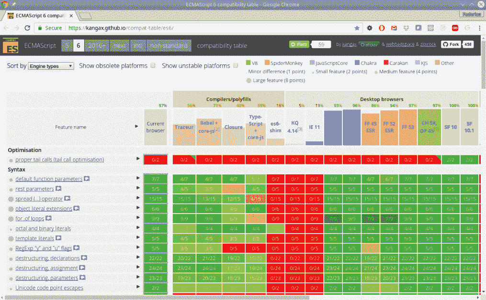
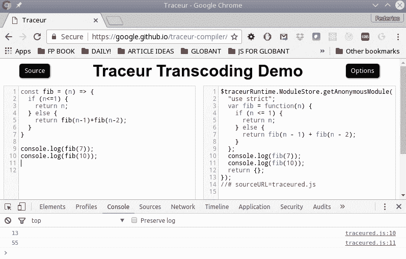
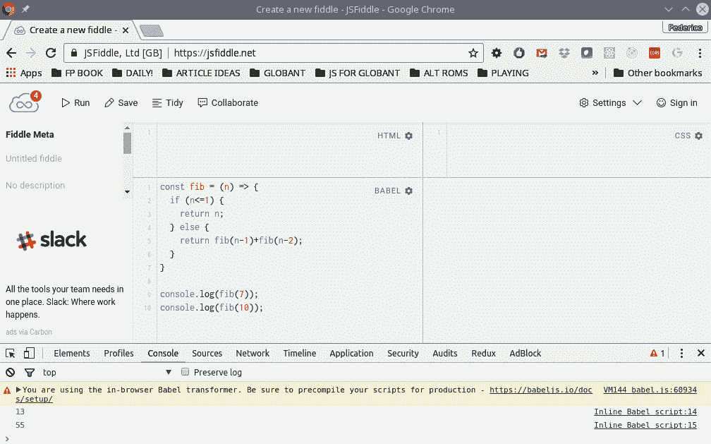

# 一、变得函数式——几个问题

函数式编程**(或**FP)已经存在自早期的计算,和正在经历一种复兴,因为它增加了使用一些框架和库,特别是在**JavaScript**(**JS**)。 在本章中，我们将做以下工作:****

 ***   介绍一些 FP 的概念，让我们稍微了解一下它的含义。
*   说明使用 FP 的好处(和问题)，以及为什么我们应该使用它。
*   开始思考为什么 JavaScript 可以被认为是一种适合 FP 的语言。
*   为了充分利用本书中的所有内容，请仔细阅读您应该了解的语言特性和工具。

在本章结束时，您将拥有我们将在本书其余部分中使用的基本工具，所以让我们从学习函数式编程*开始。*

# 什么是函数式编程?

如果你回顾一下计算机的历史，你会发现第二古老的编程语言 Lisp 仍然在使用，它是基于 FP 的。 从那时起，出现了更多的函数式语言，FP 得到了更广泛的应用。 但即便如此，如果你问人们什么是 FP，你可能会得到两个截然不同的答案。

For trivia or history buffs, the oldest language still in use is Fortran, which appeared in 1957, a year before Lisp. Quite shortly after Lisp came another long-lived language, COBOL, for business-oriented programming.

根据你问的对象的不同，你可能会了解到这是一种现代的、先进的、开明的编程方法，它将所有其他的范例抛在身后，或者它主要是一种理论的东西，其复杂性大于益处，实际上不可能在现实世界中实现。 和往常一样，真正的答案不是极端，而是介于两者之间。 让我们从理论与实践的对比开始，看看我们计划如何使用 FP。

# 理论与实践

在这本书中，我们不会以理论的方式讨论外交政策。 相反，我们的重点是向您展示它的一些技术和原则如何成功地应用于常见的日常 JavaScript 编程。 但是——这很重要——我们不会以一种教条的方式，而是以一种非常实际的方式。 我们不会因为有用的 JavaScript 构造不能满足 FP 的学术期望而忽略它们。 同样，我们不会为了适应 FP 范例而避免使用实际的 JavaScript 特性。 事实上,我们可以说,我们要做的**近似函数式编程**(**SFP)因为我们的代码将 FP 的混合物的特性,更多的古典命令式的,**面向对象编程(OOP**)。******

 ****不过，请注意:我们刚才所说的并不意味着我们将把所有的理论放在一边。 我们会很挑剔，只接触主要的理论观点，学习一些词汇和定义，并解释核心的 FP 概念，但我们总是会关注生成实际的、有用的 JavaScript 代码的想法，而不是试图满足一些神秘的、教条的 FP 标准。

OOP 已经成为一种解决编写大型程序和系统、开发干净、可扩展、可扩展的应用体系结构固有复杂性的方法; 然而，由于当今 web 应用的规模，所有代码库的复杂性都在不断增长。 此外，JavaScript 的新特性使开发应用成为可能，这在几年前是不可能的; 例如，使用 Ionic、Apache Cordova 或 React Native 制作的移动(混合)应用，或使用 Electron 或 NW.js 制作的桌面应用。 JavaScript 也通过 Node.js 迁移到后端，所以今天，该语言的使用范围以一种严肃的方式增长，以处理现代设计中增加的所有复杂性。

# 一种不同的思维方式

FP 是一种不同的程序编写方法，有时很难学习。 在大多数语言中，编程是以命令式的方式完成的:程序是一系列语句，以规定的方式执行，通过创建和操作对象(通常意味着修改对象本身)来实现期望的结果。 FP 是基于通过计算由组合在一起的函数构建的表达式来产生所需的结果。 在 FP 中，传递函数(例如将参数传递给其他函数或作为计算结果返回函数)、不使用循环(选择递归代替)以及跳过副作用(例如修改对象或全局变量)是很常见的。

换句话说，FP 关注的是*应该做什么，而不是*如何做。 你不用担心循环或数组，而是在更高的层次上工作，考虑你需要做什么。 在习惯了这种风格之后，您会发现代码变得更简单、更短、更优雅，并且可以很容易地进行测试和调试。 然而，不要落入以 FP 为目标的陷阱! 就像所有软件工具一样，FP 只是达到目的的一种手段。 函数代码并不仅仅是为了函数而好，用 FP 编写糟糕的代码就像用其他技术一样可能!**

 **# FP 不是什么

既然我们已经讲了什么是 FP，让我们也来澄清一些常见的误解，并看看 FP 是什么*而不是*:

*   **《外交政策》不仅仅是一个学术象牙塔**:的确,**λ演算的基础是由西德尼教堂在 1936 年作为一种工具来证明理论计算机科学的一个重要结果(通过 20 多年前现代计算机语言!); 然而，FP 语言现在被用于各种系统。**
*   FP 并不是面向对象编程(OOP)的对立面 你可以把最适合你的东西混合搭配，我们将在整本书中这样做，把世界上最好的东西结合在一起。
*   :有些 FP 语言与 JavaScript 有很大的不同，但主要是语法上的不同。 一旦学习了这些基本概念，您就会发现在 JavaScript 中可以得到与使用 FP 语言相同的结果。

值得一提的是，一些现代框架，如 React 和 Redux 组合，也包含了 FP 的思想。

例如，在 React 中，据说**视图**(用户在给定时刻所看到的任何内容)是当前**状态**的函数。 您使用一个函数来计算 HTML 和 CSS 在每个时刻必须生成的内容，以**黑箱**的方式思考。

同样，在 Redux 中，你有由**还原剂**处理的**动作**的概念。 操作提供一些数据，而 reducer 是一个函数，它以函数式的方式为应用生成新的状态，以脱离当前状态和提供的数据。

因此，考虑到 FP 编码的理论优势(我们将在下一节介绍这些优势)和实际优势(例如使用最新的框架和库)，是有意义的。 让我们开始吧。

# 为什么使用 FP ?

多年来，出现了许多编程风格和时尚。 然而，事实证明，计划生育具有很强的弹性，在今天引起了极大的兴趣。 为什么要使用 FP? 问题应该首先是，你想要什么? 只有在那时，*FP 才能让你得到那个? 让我们在下面的部分中回答这些重要的问题。*

# 我们需要的

我们当然可以同意以下问题是普遍的。 我们的代码应该具备以下品质:

*   **模块化**:程序的功能应该分成独立的模块，每个模块包含执行程序功能的一个方面所需要的内容。 模块或函数中的更改不应该影响代码的其余部分。
*   **可理解的**:你的程序的读者应该能够辨别它的组成部分，它们的功能，和它们之间的关系，而不需要付出不必要的努力。 这与代码的**可维护性**紧密相关; 您的代码在将来的某个时候必须进行维护，无论是更改还是添加新的功能。
*   **可测试**:单元测试**单元测试**测试程序的一小部分，验证它们的行为独立于代码的其余部分。 您的编程风格应该有利于编写能够简化编写单元测试工作的代码。 单元测试也类似于文档，因为它们可以帮助读者理解代码应该做什么。

*   **可扩展**:事实是你的程序有一天会需要维护，可能会添加新的功能。 这些更改应该只会对原始代码的结构和数据流产生最小的影响(如果有的话)。 小的更改不应该意味着对代码进行大的、严重的重构。
*   **可重用**:**代码重用**的目标是利用以前编写的代码，节省资源、时间和金钱，减少冗余。 有一些特点,帮助这一目标,如**模块化**(我们已经提到),高内聚**(所有模块属于彼此的作品),【显示】低耦合**(模块相互独立的), **信息隐藏**(模块内部的变化不应该影响系统的其余部分)。

# 我们得到的

那么，FP 给了你我们在前一节中列出的五个特征吗?

*   在 FP 中，目标是编写独立的函数，这些函数结合在一起产生最终结果。
*   用函数式风格编写的程序通常更简洁、更短、更容易理解。
*   函数可以自行测试，而 FP 代码在实现这一点上具有优势。
*   您可以在其他程序中重用函数，因为它们是独立的，不依赖于系统的其他部分。 大多数函数式程序都有共同的函数，我们将在本书中讨论其中几个。
*   函数代码没有副作用，这意味着您可以通过研究函数来理解函数的目标，而不必考虑程序的其余部分。

最后，一旦你习惯了 FP 风格的编程，代码就会变得更容易理解和扩展。 所以，这五个特征似乎都可以通过 FP 实现!

For a well-balanced look at the reasons to use FP, I'd suggest reading *Why Functional Programming Matters*, by John Hughes; it's available online at [www.cs.kent.ac.uk/people/staff/dat/miranda/whyfp90.pdf](http://www.cs.kent.ac.uk/people/staff/dat/miranda/whyfp90.pdf). It's not geared towards JavaScript, but the arguments are easily understandable, anyway.

# 并非一切都是黄金

然而，让我们努力争取一点平衡。 使用 FP 并不是自动使代码变得更好的灵丹妙药。 有些 FP 解决方案实际上是棘手的，有些开发人员非常喜欢写代码，然后问，这是什么*?* 如果你不小心，你的代码可能变成*只写*，实际上不可能维护; 这样就可以理解、可扩展和可重用了!

另一个劣势是，你可能会发现很难找到精通 fp 的开发者。 (快速提问:你见过多少*函数式程序员在*招聘广告?) 今天绝大多数的 web 代码都是用命令式的、非*-*功能的方式编写的，而且大多数程序员都习惯了这种工作方式。 对于一些人来说，不得不转换方向，以不同的方式开始编写程序可能是一个不可逾越的障碍。

最后，如果您试图实现完整的功能，您可能会发现自己与 JavaScript 不一致，简单的任务可能变得难以完成。 正如我们在开始时说的，我们将选择*类似于 FP*，所以我们不会彻底拒绝任何不是 100%函数式的语言特性。 毕竟，我们想用 FP 来简化代码，而不是让它变得更复杂!

因此，尽管我将努力向您展示在代码中实现函数式的优点，但与任何更改一样，这总是会有一些困难。 然而，我完全相信您将能够克服它们，并且您的组织将通过应用 FP 开发出更好的代码。 敢于改变! 那么，既然你接受 FP 可以应用于你自己的问题，现在让我们考虑另一个问题，我们能否以函数式的方式使用 JavaScript，它是否合适?

# JavaScript 功能吗?

在这个时候，你应该问另一个重要的问题:*JavaScript 是函数式语言吗?* 通常，当考虑到 FP 时，所提到的语言列表不包括 JavaScript，但确实包括不太常见的选项，如 Clojure、Erlang、Haskell 和 Scala; 然而，FP 语言并没有精确的定义，也没有一组精确的特性应该包含在这些语言中。 重点是，如果一种语言支持与 FP 相关的通用编程风格，那么它就可以被认为是函数式的。 首先，让我们了解一下为什么要使用 JavaScript，以及该语言是如何发展到目前的版本的，然后看看我们将使用的一些关键特性，以函数的方式工作。

# JavaScript 作为工具

JavaScript 是什么? 如果你认为**人气指数**,如 www.tiobe.com/tiobe-index/的或[http://pypl.github.io/PYPL.html](http://pypl.github.io/PYPL.html),你会发现,JavaScript 是一直在十大最受欢迎的语言。 从更学术的角度来看，这种语言是一种混合体，借鉴了几种不同语言的特点。 几个库帮助语言提供的生长特性,不那么容易获得,比如类和继承(今天的版本的语言支持类,但这并非如此不久前),否则必须通过做一些原型**技巧。**

**The name *JavaScript* was chosen to take advantage of the popularity of Java—just as a marketing ploy! Its first name was *Mocha*, then, *LiveScript*, and only then, *JavaScript*.

JavaScript 已经变得非常强大。 但是，就像所有的电动工具一样，它不仅给你提供了一个伟大的解决方案，也给你带来了巨大的伤害。 计划生育可以被认为是一种减少或抛开语言中一些最糟糕的部分，专注于以一种更安全、更好的方式工作的方法; 然而，由于现有的 JavaScript 代码数量巨大，您不能指望它能促进语言的大规模重新工作，这会导致大多数站点失败。 你必须学会接受好的和坏的，避免后者。

此外，该语言还有各种各样的可用库，以多种方式完成或扩展该语言。 在本书中，我们将专注于 JavaScript 本身的使用，但我们将引用现有的可用代码。

如果我们问 JavaScript 是否真的有功能，答案将再次是，*sort*。 它可以被看作是函数，因为它有几个特性，比如一级函数、匿名函数、递归和闭包——我们稍后会回到这一点。 另一方面，它也有很多*非 fp*方面，比如副作用(**杂质**)、可变对象和递归的实际限制。 因此，当以函数式方式编程时，我们将利用所有相关的、适当的语言特性，并尽量减少由语言中更传统的部分造成的问题。 从这个意义上说，JavaScript 是否具有函数式，取决于*您的*编程风格!

如果你想使用 FP，你应该决定使用哪种语言; 然而，选择全函数式语言可能就不那么明智了。 今天，开发代码并不像使用语言那么简单; 您肯定需要框架、库和其他各种工具。 如果我们可以利用所有提供的工具，但同时在我们的代码中引入 FP 的工作方式，我们将得到两个世界的最佳，不必担心 JavaScript 是否函数式!

# 使用 JavaScript 实现功能

JavaScript 经过多年的发展，我们将使用的版本(非正式)称为 JS10，(正式)称为 ECMAScript 2019，通常缩写为 ES2019 或 ES10; 该版本于 2019 年 6 月定稿。 以前的版本如下:

*   ECMAScript 1, 1997 年 6 月
*   ECMAScript 2, 1998 年 6 月，和之前的版本基本相同
*   ECMAScript 3, 1999 年 12 月，有几个新功能
*   ECMAScript 5, 2009 年 12 月(不，从来没有 ECMAScript 4，因为它被放弃了)
*   ECMAScript 5.1, 2011 年 6 月
*   ECMAScript 6(或 ES6; 2015 年 6 月
*   ECMAScript 7(也叫 ES7，或 ES2016)， 2016 年 6 月
*   ECMAScript 8 (ES8 or ES2017), June 2017
*   ECMAScript 9 (ES9 or ES2018), June 2018

**ECMA** originally stood for **European Computer Manufacturers Association**, but nowadays the name isn't considered an acronym anymore. The organization is responsible for more standards other than JavaScript, including JSON, C#, Dart, and others. For more details, go to its site at [www.ecma-international.org/](http://www.ecma-international.org/).

您可以在[www.ecma-international.org/ecma-262/7.0/](http://www.ecma-international.org/ecma-262/7.0/)阅读标准语言规范。 当我们在没有进一步规范的文本中引用 JavaScript 时，ES10 (ES2019)是被引用的; 然而，就本书中使用的语言特性而言，如果你只是使用 ES2015，那么这本书对你来说基本上没有问题。

没有浏览器完全实现 ES10; 大多数提供较老的版本，JavaScript 5(从 2009 年)，从 ES6 到 ES10(一直在增长)的特性。 这将证明是一个问题，但幸运的是，是一个可解决的问题; 我们很快就会讲到。 我们将在整本书中使用 ES10。

In fact, there are only a few differences between ES2016 and ES2015, such as the `Array.prototype.includes` method and the exponentiation operator, `**`. There are more differences between ES2017 and ES2016—such as `async` and `await`, some string padding functions, and more—but they won't impact our code. We will also be looking at alternatives for even more modern additions, such as `flatMap()`, in later chapters.

当我们要使用 JavaScript 时，让我们从考虑它与 FP 目标相关的最重要的特性开始。

# JavaScript 的主要特性

JavaScript 不是一种纯粹的函数式语言，但它拥有我们需要的所有功能。 我们将使用的语言的主要特点如下:

*   函数作为一级对象
*   递归
*   箭头功能
*   闭包
*   传播

让我们看看每一个例子，并找出为什么它们会对我们有用。 请记住，我们将使用更多的 JavaScript 特性; 接下来的部分将重点介绍我们将在 FP 中使用的最重要的特性。

# 函数作为一级对象

说函数是**一级对象**(也称为**一级公民**)意味着你可以用函数做你可以用其他对象做的任何事情。 例如，可以将函数存储在变量中，可以将其传递给函数，可以将其打印出来，等等。 这是做计划生育的关键; 我们经常将函数作为参数(传递给其他函数)或作为函数调用的结果返回函数。

如果您一直在进行异步 Ajax 调用，那么您已经在使用这个特性:**回调**是一个将在 Ajax 调用结束后被调用的函数，并作为参数传递。 使用 jQuery，你可以编写如下内容:

```js
$.get("some/url", someData, function(result, status) {
    // *check status, and do something*
    // *with the result*
});
```

`$.get()`函数接收回调函数作为参数，并在获得结果后调用它。

This is better solved, in a more modern way, by using promises or `async`/`await`, but for the sake of our example, the older way is enough. We'll be getting back to promises, though, in the section called *Building better containers* in [Chapter 12](12.html), *Building Better Containers – Functional Data Types*, when we discuss monads; in particular, see the section called *Unexpected Monads - Promises*.

由于函数可以存储在变量中，您也可以这样写。 注意我们在`$.get(...)`调用中如何使用`doSomething`变量:

```js
var doSomething = function(result, status) {
    // *check status, and do something*
    // *with the result*
};

$.get("some/url", someData, doSomething);
```

我们将在[第 6 章](06.html)、*中看到更多这方面的例子。*

# 递归

**递归**是开发算法和解决大类问题的最有力的工具。 其思想是，函数可以在某一点上调用自身，当*调用完成后，继续处理接收到的任何结果。 这通常对某些问题或定义类很有帮助。 最常被引用的例子是 factorial 函数(*n*的阶乘写成*n!* )定义为非负整数值:*

 **   如果*n*为 0，则*n! =1*
*   如果*n*大于 0，则*n! = n * (n-1)!*

The value of *n!* is the number of ways that you can order *n* different elements in a row. For example, if you want to place five books in line, you can pick any of the five for the first place, and then order the other four in every possible way, so *5! = 5*4!*. If you continue to work this example, you'll get *5! = 5*4*3*2*1=120*, so *n!* is the product of all numbers up to *n*.

这可以立即转化为代码:

```js
function fact(n) {
 if (n === 0) {
 return 1;

 } else {
 return n * fact(n - 1);
 }
}

console.log(fact(5)); // *120*
```

递归对算法的设计有很大的帮助。 通过使用递归，您可以不使用任何`while`或`for`循环——这并不是说我们*想要*那样做，但有趣的是，我们*可以*! 我们将在[第 9 章](09.html)、*设计函数——递归*的全部内容中，用于设计算法和递归编写函数。

# 闭包

**闭包**是一种实现数据隐藏(使用私有变量)的方法，这导致了模块和其他好的特性。 闭包的关键概念是，当您定义一个函数时，它不仅可以引用自己的局部变量，还可以引用函数上下文之外的所有东西。 我们可以编写一个计数函数，通过闭包的方式保存自己的计数:

```js
function newCounter() {
 let count = 0;
 return function() {
 count++;
 return count;
 };
}

const nc = newCounter();
console.log(nc()); // *1*
console.log(nc()); // *2*
console.log(nc()); // *3*
```

即使在`newCounter()`退出后，内部函数仍然可以访问`count`，但是代码的任何其他部分都不能访问该变量。

This isn't a very good example of FP— a function (`nc()`, in this case) isn't expected to return different results when called with the same parameters!

我们会找到几个使用闭包,比如**记忆**(见第四章,*正确的行为——纯函数*,[第六章](06.html),【显示】生产函数-高阶函数)和**模块模式(见第 3 章【病人】, *从功能开始——核心概念*、[第 11 章](11.html)、*实现设计模式——功能方式*等。**

# 箭头功能

**箭头函数**只是创建(未命名)函数的一种更短、更简洁的方法。 箭头函数几乎可以在经典函数可以使用的任何地方使用，除了它们不能用作构造函数。 语法为`(parameter, anotherparameter, ...etc) => { statements }`或`(parameter, anotherparameter, ...etc) => *expression*`。 第一种方法允许您编写尽可能多的代码，第二种方法是`{ return *expression* }`的缩写。 我们可以重写之前的 Ajax 示例，如下所示:

```js
$.get("some/url", data, (result, status) => {
  // *check status, and do something*
  // *with the result*
});
```

阶乘代码的新版本可能如下所示:

```js
const fact2 = n => {
  if (n === 0) {
    return 1;

  } else {
    return n * fact2(n - 1);
  }
};
console.log(fact2(5)); // *also 120*
```

Arrow functions are usually called **anonymous **functions because of their lack of a name. If you need to refer to an arrow function, you'll have to assign it to a variable or object attribute, as we did here; otherwise, you won't be able to use it. We'll learn more about this in the section called *Arrow functions* in [Chapter 3](03.html), *Starting out with Functions - A Core Concept*.

您可能会将后者写成一行代码——您能看到与我们之前代码的等价吗? 使用三元运算符代替`if`是很常见的:

```js
const fact3 = n => (n === 0 ? 1 : n * fact3(n - 1));

console.log(fact3(5)); // again 120
```

用这种缩写形式，你不必写`return`——它是隐含的。

In lambda calculus, a function such as `x => 2*x` would be represented as λ*x.2*x*. Although there are syntactical differences, the definitions are analogous. Functions with more parameters are a bit more complicated; *(x,y)=>x+y* would be expressed as λ*x.*λ*y.x+y.* We'll learn more about this in the section called *Lambdas and functions*, in [Chapter 3](01.html), *Starting out with Functions -* *A Core Concept*, and in the section called *Currying*, in [Chapter 7](01.html), *Transforming Functions - Currying and Partial Application*.

还有一件小事要记住:当箭头函数只有一个参数时，可以省略它周围的圆括号。 我通常更喜欢留下他们，但我已经应用了 JS 美化，*更漂亮*，以删除他们的代码。 是否包括他们，这完全取决于你! (关于这个工具的更多信息，请查看[https://github.com/prettier/prettier](https://github.com/prettier/prettier)。) 顺便说一下，我的格式化选项是`--print-width 75 --tab-width 2 --no-bracket-spacing`。

# 传播

扩展运算符(参见[https://developer.mozilla.org/en/docs/Web/JavaScript/Reference/Operators/Spread_operator](https://developer.mozilla.org/en/docs/Web/JavaScript/Reference/Operators/Spread_operator))允许在需要多个参数、元素或变量的地方展开表达式。 例如，你可以替换函数调用中的参数，如下面的代码所示:

```js
const x = [1, 2, 3];

function sum3(a, b, c) {
  return a + b + c;
}

const y = sum3(...x); // equivalent to sum3(1,2,3)
console.log(y); // 6
```

您还可以创建或连接数组，如下面的代码所示:

```js
const f = [1, 2, 3];

const g = [4, ...f, 5]; // [4,1,2,3,5]

const h = [...f, ...g]; // [1,2,3,4,1,2,3,5]
```

它也适用于对象:

```js
const p = { some: 3, data: 5 };

const q = { more: 8, ...p }; // { more:8, some:3, data:5 }
```

您还可以使用它来处理需要单独参数而不是数组的函数。 常见的例子是`Math.min()`和`Math.max()`:

```js
const numbers = [2, 2, 9, 6, 0, 1, 2, 4, 5, 6];
const minA = Math.min(...numbers); // *0*

const maxArray = arr => Math.max(...arr);
const maxA = maxArray(numbers); // *9*
```

你也可以写以下等式，因为`.apply()`方法需要一个参数数组，而`.call()`则需要单独的参数:

```js
someFn.apply(thisArg, someArray) === someFn.call(thisArg, ...someArray);
```

If you have problems remembering what arguments are required by `.apply()` and `.call()`, this mnemonic may help: *A is for* an array*, and C is for a comma*. See [https://developer.mozilla.org/en-US/docs/Web/JavaScript/Reference/Global_Objects/Function/apply](https://developer.mozilla.org/en-US/docs/Web/JavaScript/Reference/Global_Objects/Function/apply) and [https://developer.mozilla.org/en-US/docs/Web/JavaScript/Reference/Global_Objects/Function/call](https://developer.mozilla.org/en-US/docs/Web/JavaScript/Reference/Global_Objects/Function/call) for more information.

使用扩展运算符有助于编写更短、更简洁的代码，我们将充分利用它。 我们已经看到了将要使用的所有最重要的 JavaScript 特性。 让我们通过看一些我们将要使用的工具来结束这一章。

# 我们如何使用 JavaScript?

这一切都很好，但正如我们之前提到的，碰巧到处可用的 JavaScript 版本不是 ES10，而是早期的 JS5。 一个例外是 Node.js。 它基于 Chrome 的 v8 高性能 JavaScript 引擎，已经有几个 ES10 功能可用。 然而，到今天为止，ES10 的覆盖还没有 100%完成，有些特性你可能会错过(查看[https://nodejs.org/en/docs/es6/](https://nodejs.org/en/docs/es6/)了解更多关于 Node.js 和 v8 的信息)。 这种情况在未来肯定会改变，因为 ie 浏览器将逐渐消失，而最新的微软浏览器将共享 Chrome 的引擎，但目前，我们仍必须处理较老的、功能较弱的引擎。

那么，如果您想使用最新的版本编写代码，但可用的版本较早且较差，您该怎么办呢? 或者，如果您的大多数用户使用的是旧浏览器，这些浏览器不支持您热衷使用的花哨功能，会发生什么? 我们来看看它的解。

If you want to be sure of your choices before using any given new feature, check out the compatibility table at [https://kangax.github.io/compat-table/es6/](https://kangax.github.io/compat-table/es6/) (see *Figure 1.1*). For Node.js specifically, check out [http://node.green/](http://node.green/).



Figure 1.1\. - The latest JavaScript features may not be widely and fully supported, so you'll have to check before using them.

# 使用 transpilers

为了解决这个可用性和兼容性问题，您可以使用一些**转译器**。 翻译器获取您的原始 ES10 代码(可能使用最现代的 JavaScript 特性)，并将其转换为等效的 JS5 代码。 这是一个源代码到源代码的转换，而不是编译中使用的源代码到对象的代码。 您可以使用高级 ES10 特性编写代码，但用户的浏览器将收到 JS5 代码。 一个转译器还可以让您跟上即将发布的语言版本，尽管浏览器需要在桌面和移动设备上采用新标准。

If you wonder where the word transpiler came from, it is a portmanteau of *translate* and *compiler*. There are many such combinations in technological speak: *email* (*electronic* and *mail*), *emoticon* (*emotion* and *icon*), *malware* (*malicious* and *software*), or *alphanumeric* (*alphabetic* and *numeric*), and many more.

最常见的 JavaScript 转译器是 Babel(在[https://babeljs.io/](https://babeljs.io/))和 Traceur(在[https://github.com/google/traceur-compiler](https://github.com/google/traceur-compiler))。 有了 npm 或 webpack 这样的工具，配置代码就变得相当容易，这样你的代码就会自动编译并提供给最终用户。 你也可以在线进行翻译; 参见*图 1.2*，以使用 Babel 的在线环境为例:


Figure 1.2 - The Babel transpiler converts ES10 code into compatible JS5 code

,如果你喜欢的跑酷者所可以使用其工具[https://google.github.io/traceur-compiler/demo/repl.html #](https://google.github.io/traceur-compiler/demo/repl.html#)相反,但你必须打开一个开发人员控制台看到的结果运行代码(参见图 1.3*transpiled 代码)的一个例子。 选择 EXPERIMENTAL 选项以完全启用 ES10 支持:*



Figure 1.3 - The Traceur transpiler is an equally valid alternative for ES10-to-JS5 translation Using transpilers is also a great way to learn new language features. Just type in some code on the left and see the equivalent code on the right. Alternatively, you can use the **command-line interface** (**CLI**) tools to transpile a source file and then inspect the produced output.

你可能会考虑最后一种可能性:选择微软的 TypeScript(在[http://www.typescriptlang.org/](http://www.typescriptlang.org/))，而不是 JavaScript，这是该语言的超集，本身被编译成 JS5。 TypeScript 的主要优点是能够在 JavaScript 中添加(可选的)静态类型检查，这有助于在编译时检测某些编程错误。 但要注意:与巴别塔或 Traceur 一样，ES10 并非全部可用。

You can also perform type checks without using TypeScript by using Facebook's Flow (see [https://flow.org/](https://flow.org/)).

如果你选择使用 TypeScript，你也可以在他们的**playground**(参见[http://www.typescriptlang.org/play/](http://www.typescriptlang.org/play/))上在线测试。 您可以对数据类型检查设置更严格或更严格的选项，也可以现场运行您的代码(参见*图 1.4*了解更多细节):


Figure 1.4 - TypeScript adds type-checking features for safer programming

通过使用 TypeScript，你将能够避免常见的类型相关错误。 一个积极的趋势是，大多数工具(框架、库等)正在慢慢地朝这个方向发展，因此工作将变得更容易。

# 在线工作

还有一些在线工具可以用来测试 JavaScript 代码。 查看 JSFiddle(在[https://jsfiddle.net/](https://jsfiddle.net/))，CodePen(在[https://codepen.io/](https://codepen.io/))和 JSBin(在[http://jsbin.com/](http://jsbin.com/))等。 你可能需要指定是使用 Babel 还是 Traceur; 否则，较新的语言特性将被拒绝。 你可以在*中看到一个 JSFiddle 的例子*



Figure 1.5 - JSFiddle lets you try out modern JavaScript code (plus HTML and CSS) without requiring any other tools

使用这些工具提供了一种非常快速的方法来尝试代码或做小的实验——我可以真正证明这一点，因为我已经用这种方法测试了书中的大部分代码!

# 测试

我们还将谈到测试，毕竟，这是 FP 的主要优势之一。 为此，我们将使用茉莉([https://jasmine.github.io/](https://jasmine.github.io/))，尽管我们也可以选择摩卡([http://mochajs.org/](http://mochajs.org/))。

您可以使用运行器运行 Jasmine 测试套件，例如 Karma([https://karma-runner.github.io](https://karma-runner.github.io))，但我选择独立测试; 详情见[https://github.com/jasmine/jasmine#installation](https://github.com/jasmine/jasmine#installation)。

# 总结

在这一章,我们看到了 FP 的基本知识,它的历史,它的优点(和一些可能的缺点,平心而论),为什么我们可以应用在 JavaScript 中(不是通常被认为是一种函数式语言),和我们需要什么工具来浏览这本书的其余部分。

在第二章,*思维功能——第一个例子*,我们将在一个简单的问题的一个例子,看它在*常见的方面,并最终通过求解功能的方式和分析方法的优势。*

# 问题

1.1。 :我们知道函数是一级对象，但你知道*类*也是一级对象吗? (当然，把类说成*对象*听起来很奇怪。) 看看下面的例子，看看是什么让它生效的! 小心:里面有一些故意奇怪的代码:

```js
const makeSaluteClass = term =>
 class {
    constructor(x) {
      this.x = x;
    }

    salute(y) {
      console.log(`${this.x} says "${term}" to ${y}`);
    }
  };

const Spanish = makeSaluteClass("HOLA");
new Spanish("ALFA").salute("BETA");
// *ALFA says "HOLA" to BETA*

new (makeSaluteClass("HELLO"))("GAMMA").salute("DELTA");
// *GAMMA says "HELLO" to DELTA*

const fullSalute = (c, x, y) => new c(x).salute(y);
const French = makeSaluteClass("BON JOUR");
fullSalute(French, "EPSILON", "ZETA");
// *EPSILON says "BON JOUR" to ZETA*
```

1.2。 **阶乘误差**:我们定义的阶乘只适用于非负整数; 然而，我们在*Recursion*部分中编写的函数并不验证其参数是否有效。 你能把必要的支票加上去吗? 尽量避免重复、冗余的测试!

1.3。 **爬阶乘:**我们实现一个阶乘首先乘以 n*,然后通过*n - 1*,*-*,在【显示】我们可以叫一个向下的时装。 你能编写一个新的阶乘函数，使*向上循环*吗?*

 *1.4。 :这本身并不是一个目标，但是通过使用箭头函数和其他 JavaScript 特性，你可以将`newCounter()`缩短到原来长度的一半。 你看出来了吗?************