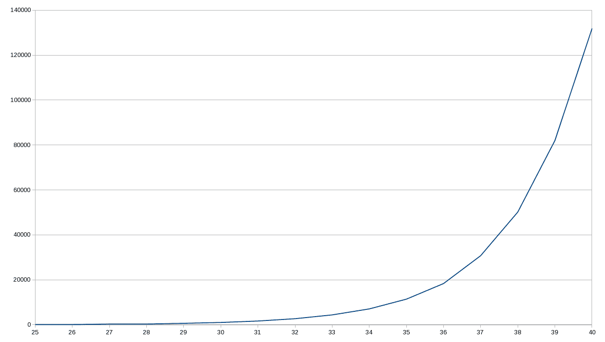

# 四、恰当的行为——纯函数

在第 3 章,*开始功能——*一个核心概念,我们考虑功能的关键元素函数式编程**(**FP),进入细节箭头功能,并介绍了一些概念,如注塑、回调,polyfilling,存根。 在本章中，我们将有机会重新审视或应用其中的一些想法。 我们还将做以下工作:****

 ***   考虑一下*纯度*的概念，以及我们为什么要关心*纯函数*和*非纯*函数!
*   检验*参考透明度*的概念。
*   认识到副作用所暗示的问题。
*   说明纯函数的一些优点。
*   描述不纯函数背后的主要原因。
*   寻找最小化非纯函数数量的方法。
*   关注测试纯函数和非纯函数的方法。

# 纯函数

纯函数的行为方式与数学函数相同，并提供不同的好处。 一个函数满足两个条件即为纯函数:

*   **给定相同的参数，函数总是计算并返回相同的结果 该结果不能依赖于任何*以外的*信息或状态，这些信息或状态可能在程序执行期间发生变化，并导致返回不同的值。 函数结果也不能依赖于 I/O 结果、随机数、其他一些外部变量或一个不能直接控制的值。**

*   :这包括向 I/O 设备的输出，对象的突变，程序在函数外的状态的改变，等等。

如果您愿意，您可以简单地说纯函数不依赖(也不修改)它们作用域之外的任何东西，并且总是对相同的输入参数返回相同的结果。

另一个用在这里的词是**等幂**，但它并不完全相同。 幂等函数可以被任意多次调用，并且总是产生相同的结果; 然而，这并不意味着该功能没有副作用。 等幂通常在 RESTful 服务的上下文中提到。 让我们看一个简单的例子来说明纯度和等幂之间的区别。 一个`PUT`调用会导致数据库记录被更新(一个副作用)，但是如果您重复调用，元素将不会被进一步修改，因此数据库的全局状态将不会进一步更改。

我们还可以调用一个软件设计原则，提醒自己一个函数应该*做一件事，只做一件事，除了那件事*什么都不做。 如果一个函数做了其他事情，并且有一些隐藏的功能，那么对状态的依赖将意味着我们无法预测函数的输出，这将使我们作为开发人员的工作更加困难。

让我们更详细地研究这些条件。

# 引用透明性

在数学中，**参考透明度**是一种属性，可以让你用它的值替换表达式而不改变你所做的任何事情的结果。

The counterpart of referential transparency is, appropriately enough, **referential opacity**. A referentially opaque function cannot guarantee that it will always produce the same result, even when called with the same arguments.

举个简单的例子，让我们考虑一下执行*常量折叠的优化编译器会发生什么。 假设你有这样一个句子:*

```js
const x = 1 + 2 * 3;
```

编译器可能会通过注意`2 * 3`是一个常量来优化代码如下:

```js
const x = 1 + 6;
```

更好的是，新一轮的优化可以避免总和:

```js
const x = 7;
```

为了节省执行时间，编译器利用了所有数学表达式和函数(根据定义)是引用透明的这一事实。 另一方面，如果编译器不能预测给定表达式的输出，它就不能以任何方式优化代码，并且必须在运行时进行计算。

In lambda calculus, if you replace the value of an expression involving a function with the calculated value for the function, then that operation is called a **β** (**beta**) **reduction**. Note that you can only do this safely with referentially transparent functions.

所有的算术表达式(包括数学运算符和函数)都是参照透明的:`22*9`总是可以被`198`替换。 涉及 I/O 的表达式是不透明的，因为它们的结果在执行之前是无法知道的。 出于同样的原因，涉及日期和时间相关函数或随机数的表达式也不透明。

对于你可以自己生成的 JavaScript 函数，很容易编写一些不满足*引用透明性*条件的函数。 事实上，函数甚至不需要返回一个值，尽管 JavaScript 解释器在这种情况下将返回一个未定义的值。

Some languages distinguish between functions, which are expected to return a value, and procedures, which do not return anything, but that's not the case with JavaScript. There are also some languages that provide the means to ensure that functions are referentially transparent.

如果你愿意，你可以将函数分类如下:

*   :这些函数返回的值只依赖于它的参数，并且没有任何副作用。
*   :这些函数不返回任何东西(实际上，在 JavaScript 中，这些函数返回一个`undefined`值，但这在这里无关紧要)，但确实产生一些副作用。
*   :这意味着它们返回的值可能不仅依赖于函数参数，而且还涉及到副作用。

在 FP 中，重点放在第一组，参考透明的纯函数。 不仅编译器可以推理出程序的行为(从而能够优化生成的代码)，程序员也可以更容易地推理出程序及其组件之间的关系。 这反过来又可以帮助证明算法的正确性，或者通过用等价函数替换函数来优化代码。

# 副作用

**副作用**是什么? 我们可以将这些定义为在执行某些计算或进程期间发生的状态变化或与外部元素(用户、web 服务、另一台计算机等等)的交互。

这个意思的范围可能有误解。 在日常用语中，当你谈到副作用时，有点像在谈论*附带损害*——特定行为的一些意想不到的后果; 然而，在计算中，我们在函数之外包含了所有可能的效果或变化。 如果您编写的函数要执行一个`console.log()`调用来显示结果，那么这将被认为是一个副作用，即使这正是您最初希望函数做的事情!

在本节中，我们将研究以下内容:

*   JavaScript 编程中的常见副作用
*   全球性和内部国家造成的问题
*   函数改变其参数的可能性
*   有些函数总是很麻烦

# 常见的副作用

在编程中，有(太多的)东西被认为是副作用。 在 JavaScript 编程中，包括前端和后端编码，你可能会发现更常见的包括以下内容:

*   改变全局变量。
*   改变作为参数接收的对象。
*   执行任何类型的 I/O，例如显示警告消息或记录一些文本。
*   使用和更改文件系统。
*   更新数据库。
*   调用 web 服务。

*   查询或修改 DOM。
*   触发任何外部进程。
*   只是调用另一个恰好产生副作用的函数。 你可以说不洁净是会传染的:一个调用不洁净函数的函数会自动变得不洁净!

根据这个定义，让我们开始看看什么会导致函数式杂质(或*参考不透明度*)。

# 全局状态

在上述所有问题中，产生副作用的最常见原因是使用了与程序的其他部分共享全局状态的非局部变量。 根据定义，纯函数总是在给定相同输入参数的情况下返回相同的输出值，因此如果函数指向其内部状态之外的任何东西，它就自动变成非纯函数。 此外，这是调试的一个障碍，要理解函数做了什么，您必须理解状态是如何得到它的当前值的，这意味着从您的程序中理解所有过去的历史:不容易!

让我们编写一个函数，通过检查一个人是否出生在至少 18 年前来判断他是否是合法成年人。 (好吧，这还不够精确，因为我们没有考虑出生的日期和月份，但请原谅我; 问题在别处。) `isOldEnough()`函数的版本如下:

```js
let limitYear = 1999;

const isOldEnough = birthYear => birthYear <= limitYear;

console.log(isOldEnough(1960)); // true
console.log(isOldEnough(2001)); // false
```

`isOldEnough()`功能正确地检测一个人是否至少 18 岁，但它依赖于一个外部变量(该变量仅适用于 2017 年)。 除非您知道外部变量以及它是如何得到它的值的，否则您无法知道函数做了什么。 测试也很困难; 您必须记住创建全局`limitYear`变量，否则您的所有测试将无法运行。 即使这个函数可以工作，但它的实现并不是最好的。

这条规则有个例外。 看看下面的例子:计算给定半径的圆的面积的`circleArea()`函数是纯的还是不纯的?

```js
const PI = 3.14159265358979;
const circleArea = r => PI * Math.pow(r, 2); // or PI * r ** 2
```

即使函数正在访问一个外部状态，`PI`是一个常量(因此不能修改)这一事实将允许我们在`circleArea`内替换它，而不改变函数，因此我们应该接受函数是纯的。 该函数将始终为相同的参数返回相同的值，从而满足我们的纯度要求。

Even if you were to use `Math.PI` instead of a constant as we defined in the code (a better idea, by the way), the argument would still be the same; the constant cannot be changed, so the function remains pure. 

在这里，我们处理了由全球状态引起的问题; 现在让我们来看看内部状态。

# 内部状态

这个概念也扩展到内部变量，在内部变量中存储本地状态，然后用于将来的调用。 在本例中，外部状态没有改变，但是有一些副作用，这意味着将来函数返回的值会有所不同。 让我们想象一个`roundFix()`四舍五入函数，该函数考虑它是否向上或向下舍入太多，因此下一次它将以相反的方式舍入，使累积的差值更接近于零。 我们的函数将必须积累前几轮的影响，以决定下一步如何进行。 实施方法如下:

```js
const roundFix = (function() {
  let accum = 0;
  return n => {
    // *reals get rounded up or down*
    // *depending on the sign of accum*
    let nRounded = accum > 0 ? Math.ceil(n) : Math.floor(n);
    console.log("accum", accum.toFixed(5), " result", nRounded);
    accum += n - nRounded;
    return nRounded;
  };
})();
```

关于这个函数的一些评论:

*   `console.log()`行只是为了这个例子; 它不会包含在真实的函数中。 它列出了到该点为止的累计差值以及它将返回的结果:给定的整数。
*   我们使用 IIFE 模式,我们看到在`myCounter()`在*直接调用*的[第三章](04.html),*开始功能——*一个核心概念,为了得到一个隐藏的内部变量。
*   `nRounded`计算也可以写成`Math[accum > 0 ? "ceil": "floor"](n)`——我们测试`accum`，看看调用什么方法(`"ceil"`或`"floor"`)，然后使用`Object["method"]`符号间接调用`Object.method()`。 我们使用它的方式，我认为，更清楚，但我只是想给你一个提示，以防你碰巧发现这种编码风格。

使用两个值运行这个函数(可以识别它们吗?)表明，对于给定的输入，结果并不总是相同的。 控制台日志的`result`部分显示了值是如何四舍五入的:

```js
roundFix(3.14159); // *accum  0.00000    result 3*
roundFix(2.71828); // *accum  0.14159    result 3*
roundFix(2.71828); // *accum -0.14013    result 2*
roundFix(3.14159); // *accum  0.57815    result 4*
roundFix(2.71828); // *accum -0.28026    result 2*
roundFix(2.71828); // *accum  0.43802    result 3*
roundFix(2.71828); // *accum  0.15630    result 3*
```

第一次，`accum`是零，所以`3.14159`四舍五入，`accum`变成了`0.14159`。 第二次，因为`accum`是正的(意思是我们已经四舍五入了)，然后`2.71828`被四舍五入到了`3`，现在`accum`变成了负的。 第三次，同样的`2.71828`值被舍入到`2`，因为累积的差值是负的——我们得到了相同输入的不同值! 示例的其余部分与此类似; 根据累积的差值，您可以得到相同的舍入值或舍入值，因为函数的结果取决于它的内部状态。

This usage of the internal state is the reason why many FP programmers think that using objects is potentially bad. In OOP, we developers are used to storing information (attributes) and using them for future calculations; however, this usage is considered impure, insofar as repeated method calls may return different values, despite the fact that the same arguments are being passed. 

我们现在已经解决了全球和国内国家造成的问题，但仍有更多可能的副作用。 例如，如果一个函数改变了它的参数值会发生什么? 让我们接下来考虑这个问题。

# 参数突变

您还需要注意不纯函数修改其参数的可能性。 在 JavaScript 中，参数是通过值传递的，除了数组和对象，它们是通过引用传递的。 这意味着对函数参数的任何修改都会影响对原始对象或数组的实际修改。 有几个**mutator**方法可以根据定义改变底层对象，这一事实进一步掩盖了这一点。 例如，假设您想要一个函数来查找字符串数组的最大元素(当然，如果它是数字数组，您可以简单地使用`Math.max()`，不需要更多的 ado)。 一个简短的实现可以如下:

```js
const maxStrings = a => a.sort().pop();

let countries = ["Argentina", "Uruguay", "Brasil", "Paraguay"];
console.log(maxStrings(countries)); // ***"Uruguay"***
```

函数并提供正确的结果(如果你担心外语,我们已经看到一个方法,*注射-排序出来*的[第三章](04.html),*开始函数——一个核心概念*),但它有一个缺陷。 让我们看看原始数组发生了什么:

```js
console.log(countries); // ***["Argentina", "Brasil", "Paraguay"]***
```

哎呀——原来的数组被修改了; 顾名思义，这就是副作用! 如果您再次调用`maxStrings(countries)`，那么它将生成另一个值，而不是返回与之前相同的结果; 很明显，这不是一个纯函数。 在这种情况下,一个快速的解决方案是一个数组的副本(我们可以使用传播算子来帮助),但我们会处理更多的方法避免这类问题的[第十章](00.html),*确保纯度-不变性*:

```js
const maxStrings2 = a => [...a].sort().pop();

let countries = ["Argentina", "Uruguay", "Brasil", "Paraguay"];
console.log(maxStrings2(countries)); *// "Uruguay"*
console.log(countries); // *["Argentina", "Uruguay", "Brasil", "Paraguay"]*
```

所以现在我们发现了另一个副作用的原因:修改自己参数的函数。 还有最后一种情况需要考虑:函数必须是不纯的!

# 麻烦的功能

最后，一些函数也会导致问题。 例如，`Math.random()`是不纯的:它并不总是返回相同的值，如果返回了，它肯定会破坏它的目的! 此外，每次调用该函数都会修改一个全局*种子*值，从中计算下一个*随机*值。

The fact that random numbers are actually calculated by an internal function, and are therefore not random at all (if you know the formula that's used and the initial value of the seed), implies that *pseudorandom* would be a better name for them. 

例如，考虑下面生成随机字母(`"A"`到`"Z"`)的函数:

```js
const getRandomLetter = () => {
  const min = "A".charCodeAt();
  const max = "Z".charCodeAt();
  return String.fromCharCode(
 Math.floor(Math.random() * (1 + max - min)) + min
  );
};
```

它没有接收参数，但期望在每次调用时产生*不同的*结果，这一事实清楚地表明该函数是不纯的。

Go to [https://developer.mozilla.org/en-US/docs/Web/JavaScript/Reference/Global_Objects/Math/random](https://developer.mozilla.org/en-US/docs/Web/JavaScript/Reference/Global_Objects/Math/random) for the explanation for the `getRandomLetter()` function I wrote and [https://developer.mozilla.org/en-US/docs/Web/JavaScript/Reference/Global_Objects/String](https://developer.mozilla.org/en-US/docs/Web/JavaScript/Reference/Global_Objects/String) for the `.charCodeAt()` method.

可以通过调用函数继承杂质。 如果一个函数使用了一个不纯函数，它本身就会立即变成不纯函数。 我们可能想使用`getRandomLetter()`来生成随机文件名，带有可选的给定扩展名; 我们的`getRandomFileName()`函数可以如下所示:

```js
const getRandomFileName = (fileExtension = "") => {
  const NAME_LENGTH = 12;
  let namePart = new Array(NAME_LENGTH);
  for (let i = 0; i < NAME_LENGTH; i++) {
    namePart[i] = getRandomLetter();
  }
  return namePart.join("") + fileExtension;
};
```

In [Chapter 5](04.html), *Programming Declaratively – A Better Style*, we will see a more functional way of initializing a `namePart` array, by using `map()`.

由于使用了`getRandomLetter()`，`getRandomFileName()`也是不纯的，尽管它按照预期执行，正确地生成完全随机的文件名:

```js
console.log(getRandomFileName(".pdf"));  // *"SVHSSKHXPQKG.pdf"*
console.log(getRandomFileName(".pdf"));  // *"DCHKTMNWFHYZ.pdf"*
console.log(getRandomFileName(".pdf"));  // *"GBTEFTVVHADO.pdf"*
console.log(getRandomFileName(".pdf"));  // *"ATCBVUOSXLXW.pdf"*
console.log(getRandomFileName(".pdf"));  // *"OIFADZKKNVAH.pdf"*
```

记住这个函数; 在本章的后面，我们将看到一些绕过单元测试问题的方法，我们将重写它以帮助解决这个问题。

对于杂质的关注也扩展到访问当前时间或日期的函数，因为它们的结果将取决于应用的*全局状态*中的一个外部条件(即一天中的时间)。 我们可以重写`isOldEnough()`函数来消除对全局变量的依赖，但这并没有多大帮助。 尝试如下:

```js
const isOldEnough2 = birthYear =>
  birthYear <= new Date().getFullYear() - 18;

console.log(isOldEnough2(1960)); // true
console.log(isOldEnough2(2001)); // false
```

一个问题已经被消除了——新的`isOldEnough2()`功能现在*更安全*。 而且，只要你在新年前夕的午夜前后不使用它，它会始终返回相同的结果，所以你可以说，转述 19 世纪象牙香皂的口号，它的*纯度约为 99.44%*; 然而，一个不便之处仍然存在:您将如何测试它? 如果你想编写一些今天运行良好的测试，那么明年它们就会开始失败。 我们需要做一些工作来解决这个问题，稍后我们将看到如何解决。

其他一些不纯函数是那些导致 I/O 的函数。 如果函数从源(web 服务、用户本人、文件或其他源)获取输入，那么显然返回的结果可能会有所不同。 您还应该考虑 I/O 错误的可能性，因此非常相同的函数，调用相同的服务或读取相同的文件，可能在某些时候由于其控制之外的原因而失败(您应该假设您的文件系统、数据库、套接字等可能不可用， 因此，一个给定的函数调用可能会产生一个错误，而不是预期的常量，不变的，answer)。

即使一个纯输出和一般安全的语句(例如`console.log()`)没有在内部改变任何东西(至少以可见的方式)，也会导致一些副作用，因为用户确实看到了一个变化:生成的输出。

这是否意味着我们永远无法编写一个需要随机数、处理日期或执行 I/O，并且还使用纯函数的程序? 并非如此——但这确实意味着有些函数不是纯函数，它们会有一些我们必须考虑的缺点; 我们一会儿再回到这个问题上。

# 纯函数的优点

使用纯函数的主要优势在于它们没有任何副作用。 当您调用一个纯函数时，除了要传递给它的参数外，您不需要担心其他任何事情。 此外，更重要的是，您可以确保不会造成任何问题或破坏任何其他东西，因为该函数只能使用您提供的任何东西，而不能使用外部资源。 但这并不是他们唯一的优势。 让我们在下面的小节中了解更多。

# 执行顺序

另一种看待我们在本章中所讲内容的方法是将纯函数视为**稳健的**。 您知道它们的执行—无论以何种顺序—都不会对系统产生任何影响。 这个想法可以进一步扩展:您可以并行地计算纯函数，确保结果与单线程执行时的结果不会不同。

Unfortunately, JavaScript greatly restricts us in our parallel programming. We can make do, in very restricted ways, with web workers, but that's about as far as it goes. For Node developers, the `cluster` module may help out, though it isn't actually an alternative to threads, and only lets you spawn multiple processes, letting you use all available CPU cores. To sum it up, you don't get facilities such as Java's threads, for example, so parallelization isn't really an FP advantage in JavaScript terms.

当您使用纯函数时，要记住的另一个注意事项是，不需要显式地指定调用它们的顺序。 如果你使用数学，像`f(2) + f(5)`这样的表达式总是和`f(5) + f(2)`一样; 这叫做**交换性**。

然而，当你处理不纯函数时，可以使用`false`，如下所示:

```js
var mult = 1;
const f = x => {
 mult = -mult;
  return x * mult;
};

console.log(f(2) + f(5)); //  3
console.log(f(5) + f(2)); // -3
```

With impure functions such as the previous one, you cannot assume that calculating `f(3)+f(3)` would produce the same result as `2*f(3)`, or that `f(4)-f(4)` would actually be 0; check it out for yourself! More common mathematical properties down the drain.

你为什么要关心这个? 当你写代码的时候，不管你愿意与否，你都要记住那些你学过的性质，比如交换性。 因此，尽管您可能认为这两个表达式应该产生相同的结果和相应的代码，但在使用非纯函数时，您可能会感到惊讶，因为这些函数具有难以找到且难以修复的 bug。

# 记忆有关

由于对于给定的输入，纯函数的输出总是相同的，因此可以缓存函数结果，从而避免可能代价高昂的重新计算。 这个过程叫做**memoization**，它意味着只在第一次计算表达式并将结果缓存到以后的调用。

我们将在[第 6 章](04.html)，*产生函数——高阶函数*中回到这个想法，但让我们看一个手工做的例子。 这个例子总是使用斐波那契数列，因为它的简单性和隐藏的计算代价。 这个序列的定义如下:

*   *n = 0,*fib*(**n) = 0*
*   *n = 1,*fib*(**n) = 1*
*   *n*>1、*fib*(*n) =*fib*(*【显示】n 2) +*fib*(【病人】n1)

Fibonacci's name actually comes from *filius Bonacci*, or *son of Bonacci*. He is best known for having introduced the usage of digits 0-9 as we know them today, instead of the cumbersome Roman numbers. He derived the sequence named after him as the answer to a puzzle involving rabbits! You can read more about it, and Fibonacci's life in general, at [https://en.wikipedia.org/wiki/Fibonacci_number#History](https://en.wikipedia.org/wiki/Fibonacci_number#History) or [https://plus.maths.org/content/life-and-numbers-fibonacci](https://plus.maths.org/content/life-and-numbers-fibonacci).

如果你运行这些数字，序列从 0 开始，然后是 1，从那一点开始，每一项都是前两项的和:1，然后是 2,3,5,8,13,21，等等。 使用递归编写本系列很简单; 我们将在[第 9 章](06.html)，*设计函数-递归*中再次讨论这个例子。 下面的代码是定义的直接翻译:

```js
const fib = (n) => {
  if (n == 0) {
    return 0;

  } else if (n == 1) {
    return 1;

  } else {
    return fib(n - 2) + fib(n - 1);
  }
}
//
console.log(fib(10)); // *55, a bit slowly*
```

If you really go for one-liners, you could also write `const fib = (n) => (n<=1) ? n : fib(n-2)+fib(n-1)`—do you see why? And more importantly, is it worth the loss of clarity?

如果您尝试使用这个函数来获取`n`的增长值，您很快就会意识到有一个问题，计算开始花费太多时间。 例如，在我的机器上，我使用了一些计时，以毫秒为单位，并将它们绘制到下面的图表上(当然，您的里程数可能会有所不同)。 由于该函数相当快，我必须运行 100 次计算的值`n`之间的 0 和 40。 即使在那时，小的`n`值的时间也非常小; 直到 25 岁以后，我才得到了有趣的数字。

图表(见*图 4.1*)显示了指数级增长，这是不好的预兆:



Figure 4.1: Calculation times for the fib() recursive function go up exponentially

如果我们画出计算`fib(6)`所需的所有调用的图表，您就会注意到问题。 每个节点代表一次计算`fib(n)`的调用:我们只注意节点中`n`的值。 除*n=0*或*1*外，其余呼叫均需进一步呼叫，详见*图 4.2*:


Figure 4.2: All the required calculations for fib(6) show lots of duplication

延迟增加的原因很明显:例如，对`fib(2)`的计算重复了四次，`fib(3)`本身计算了三次。 鉴于我们的函数是纯函数，我们可以存储计算值，以避免反复运行这些数字。 一个可能的版本，使用`cache`数组来表示先前计算的值，如下所示:

```js
let cache = [];
const fib2 = (n) => {
  if (cache[n] === undefined) {
    if (n === 0) {
      cache[0] = 0;

    } else if (n === 1) {
      cache[1] = 1;

    } else {
      cache[n] = fib2(n - 2) + fib2(n - 1);
    }
  }

  return cache[n];
}

console.log(fib2(10)); // *55, as before, but more quickly!*
```

最初，`cache`数组是空的。 当我们需要计算`fib2(n)`的值时，我们检查它是否已经提前计算过了。 如果这不是真的，我们进行计算，但有一个改变:不是立即返回值，而是首先将它存储在缓存中，然后返回它。 这意味着不会进行两次计算:在我们为某个`n`计算`fib2(n)`之后，以后的调用将不再重复这个过程，而只是返回之前已经计算过的值。

一些简短的说明:

*   我们手工记住了这个函数，但是我们可以用一个高阶函数来做。 我们将在后面的[第 6 章](04.html)，*中看到这一点*。 记住一个函数而不需要修改或重写它是完全可能的。
*   对缓存使用全局变量并不是一个很好的实践; 我们可以使用一个 IIFE 和一个闭包将缓存隐藏起来——您看到怎么做了吗? 参见第 3 章[的*Immediate invocation*章节中的`myCounter()`示例，](04.html)，*Starting Out with Functions - A Core Concept*，来回顾我们是如何做到这一点的。

*   当然，您将受到可用缓存空间的限制，最终可能会由于耗尽所有可用 RAM 而导致应用崩溃。 求助于外部内存(数据库、文件或云解决方案)可能会耗尽缓存的所有性能优势。 有一些标准的解决方案(包括最终从缓存中删除项目)，但它们超出了本书的范围。

当然，您不需要对程序中的每个纯函数都这样做。 您应该只对需要大量时间的频繁调用的函数进行这种优化——否则，添加的缓存管理时间的成本将超过您预期节省的成本!

# 自我解释

纯函数还有另一个优点。 由于函数需要使用的所有东西都是通过它的参数提供给它的，没有任何隐藏的依赖关系，当你阅读它的源代码时，你就有了理解函数目标所需的所有东西。

一个额外的好处是:知道函数除了参数之外不会访问任何东西，这会让您更有信心使用它，因为您不会意外地产生副作用; 该函数将完成的唯一任务是您已经通过其文档了解到的内容。

单元测试(我们将在下一节中介绍)也可以作为文档，因为它们提供了函数在给定特定参数时返回的示例。 大多数程序员都同意，最好的文档都包含示例，每个单元测试都可以被视为这样的示例案例。

# 测试

纯函数的另一个优势——也是最重要的优势之一——与单元测试有关。 纯函数只有一个职责:根据输入产生输出。 因此，当您为纯函数编写测试时，您的工作将大大简化，因为不需要考虑上下文，也不需要模拟状态。

您可以简单地专注于提供输入和检查输出，因为所有函数调用都可以独立于*其余部分*进行复制。

我们已经看到了纯函数的几个方面。 让我们继续学习一些不纯函数，并通过测试纯函数和不纯函数来完成。

# 不洁净的功能

如果您决定完全放弃所有类型的副作用，那么您的程序将只能使用硬编码的输入，而不能向您显示计算结果! 类似地，大多数网页将是无用的:你将不能进行任何 web 服务调用或更新 DOM; 只有静态页面。 您的 Node 代码对于服务器端工作将真的毫无用处，因为它将无法执行任何 I/O。

减少副作用是计划生育的一个很好的目标，但我们不应该做得太过火! 因此，让我们考虑如何避免使用不纯函数(如果可能的话)，以及如何处理它们(如果不使用的话)，寻找包含或限制它们的作用域的最佳方法。

# 避免不洁的功能

在本章的前面，我们看到了使用非纯函数的更常见的原因。 现在让我们考虑如何减少不纯函数的数量，即使把它们都去掉是不可行的。 基本上，我们有两个方法:

*   避免使用状态
*   使用常用的模式*注射*，以受控的方式含有杂质

# 避免使用状态

关于全局状态(获取和设置)的使用，解决方案是众所周知的。 重点如下:

*   将全局状态所需的任何参数作为参数提供给函数。
*   如果函数需要更新状态，它不应该直接执行，而是生成一个新版本的状态并返回它。
*   调用者应该负责获取返回的状态(如果有的话)并更新全局状态。

这是 Redux 为其减速器使用的技术。 减速器的签名是`(previousState, action) => newState`，这意味着它以一个状态和一个动作作为参数，并返回一个新状态作为结果。 更具体地说，减速器不应该简单地改变`previousState`参数，必须保持不变(我们将在[第 10 章](00.html)，*确保纯度-不可变*中了解更多。

对于使用了全局`limitYear`变量的`isOldEnough()`函数的第一个版本，更改非常简单:我们只需要提供`limitYear`作为函数的参数。 通过这个改变，它将变得纯粹，因为它将只使用它的参数产生它的结果。 更好的是，我们应该提供当前年份，让函数自己计算，而不是强迫调用者这样做。 我们更新版本的成人年龄测试可以如下:

```js
const isOldEnough3 = (currentYear, birthYear) => birthYear <= currentYear-18;
```

显然，我们必须更改所有调用来提供所需的`limitYear`参数(我们也可以使用 curry，我们将在第 7 章、*转换函数- curry 和部分应用*中看到)。 初始化`limitYear`值的责任仍然在函数之外，如前所述，但我们设法避免了一个缺陷。

我们也可以将这个解应用于我们特有的`roundFix()`函数。 您可能还记得，该函数的工作原理是将舍入引起的差异进行累加，并根据累加器的符号决定是向上舍入还是向下舍入。 我们不能避免使用这种状态，但我们可以将舍入部分与累积部分分开。 我们的原始代码(带有较少的注释和日志记录)如下所示:

```js
const roundFix1 = (function() {
  let accum = 0;
  return n => {
    let nRounded = accum > 0 ? Math.ceil(n) : Math.floor(n);
    accum += n - nRounded;
    return nRounded;
  };
})();
```

新的版本有两个参数:

```js
const roundFix2 = (a, n) => {
  let r = a > 0 ? Math.ceil(n) : Math.floor(n);
  a += n - r;
  return {a, r};
};
```

如何使用这个函数? 初始化累加器、将其传递给函数以及随后更新累加器现在都是调用者代码的责任。 你会得到如下内容:

```js
let accum = 0;

// *...some other code...*

let {a, r} = roundFix2(accum, 3.1415);
accum = a;
console.log(accum, r); // 0.1415 3
```

请注意以下几点:

*   `accum`短语现在是应用的全局状态的一部分。
*   因为`roundFix2()`需要它，所以每次调用都提供当前的累加器值。
*   调用方负责更新全局状态，而不是`roundFix2()`。

Note the usage of the destructuring assignment in order to allow a function to return more than a value and easily store each one in a different variable. For more on this, go to [https://developer.mozilla.org/en/docs/Web/JavaScript/Reference/Operators/Destructuring_assignment](https://developer.mozilla.org/en/docs/Web/JavaScript/Reference/Operators/Destructuring_assignment).

这个新的`roundFix2()`功能是完全纯粹的，可以很容易地测试。 如果您想在应用的其余部分隐藏累加器，您仍然可以使用闭包，正如我们在其他示例中看到的，但这将再次在您的代码中引入杂质——您的调用!

# 注入不洁净的功能

如果一个函数变得不纯是因为它需要调用另一个本身也是不纯的函数，解决这个问题的方法是在调用中注入所需的函数。 这种技术实际上为您的代码提供了更多的灵活性，并允许更容易的未来更改，以及更简单的单元测试。

让我们考虑前面看到的随机文件名生成器函数。 这个函数有问题的部分是它使用`getRandomLetter()`来生成文件名:

```js
const getRandomFileName = (fileExtension = "") => {
  ...
  for (let i = 0; i < NAME_LENGTH; i++) {
    namePart[i] = getRandomLetter();
  }
  ...
};
```

解决这个问题的一种方法是用注入的外部函数替换不纯函数; 我们现在必须为随机文件名函数提供一个`randomLetterFunc()`参数来使用:

```js
const getRandomFileName2 = (fileExtension = "", randomLetterFunc) => {
  const NAME_LENGTH = 12;
  let namePart = new Array(NAME_LENGTH);
  for (let i = 0; i < NAME_LENGTH; i++) {
    namePart[i] = randomLetterFunc();
  }
  return namePart.join("") + fileExtension;
};
```

现在，我们已经从这个函数中去除了固有的杂质。 如果我们想提供一个预定义的伪随机函数，它实际返回固定的、已知的值，我们可以轻松地对这个函数进行单元测试; 我们将在下面的例子中看到如何做到这一点。 函数的用法将会改变，我们必须这样写:

```js
let fn = getRandomFileName2(".pdf", getRandomLetter);
```

如果这让你感到困扰，你可能想为`randomLetterFunc`参数提供一个默认值，如下所示:

```js
const getRandomFileName2 = (
  fileExtension = "",
  randomLetterFunc = getRandomLetter
) => {
  ...
};
```

你也可以使用局部应用来解决这个问题，我们将在[第 7 章](04.html)、*、transform Functions - curcurry 和 partial application*中看到。

这实际上并没有避免使用不纯函数。 通常，您将通过提供我们编写的随机字母生成器来调用`getRandomFileName()`，因此它将表现为一个不纯函数; 然而，出于测试的目的，如果您提供一个返回预定义(即不是随机)字母的函数，那么您将能够更容易地测试它，就好像它是纯的一样。

那么原来的问题函数`getRandomLetter()`呢? 我们可以应用相同的技巧，并编写一个新的版本，如以下，它将有一个参数，将产生随机数:

```js
const getRandomLetter = (getRandomInt = Math.random) => {
  const min = "A".charCodeAt();
  const max = "Z".charCodeAt();
  return String.fromCharCode(
    Math.floor(getRandomInt() * (1 + max - min)) + min
  );
};
```

正常情况下，`getRandomFileName()`调用`getRandomLetter()`时不提供任何参数，这意味着被调用的函数将以其预期的随机方式运行。 但是如果我们想测试函数是否做了我们想要的，我们可以用一个注入函数运行它，它将返回我们决定的任何东西，让我们彻底地测试它。

这个想法实际上非常重要，在其他问题上也有广泛的应用。 例如，不是让函数直接访问 DOM，而是向它提供注入函数来完成这一任务。 出于测试目的，验证被测试的函数实际上完成了它需要做的事情，而不需要与 DOM 真正交互(当然，我们必须找到其他方法来测试那些与 DOM 相关的函数)是很简单的。 这也适用于需要更新 DOM、生成新元素和执行各种操作的函数—您只需要使用一些中间函数。

# 你的函数是纯的吗?

让我们通过考虑一个重要的问题来结束这一节:您能确保一个函数实际上是纯的吗? 显示该任务的困难,我们将回到简单的`sum3()`功能,我们看到在*传播部分的第一章,*成为功能——几个问题*,就重写使用箭头功能简洁。 你认为这个函数是纯的吗? 看起来确实是这样!*

```js
const sum3 = (x, y, z) => x + y + z;
```

让我们看看:函数不访问任何东西，但它的参数，甚至不试图修改它们(不是它可以(或它可以吗?))，不执行任何 I/O，或与任何非纯函数或方法，我们前面提到。 会出什么问题呢?

答案与检查你的假设有关。 例如，谁说这个函数的参数应该是数字? 你可能会对自己说*，好吧，它们可以是字符串，但函数仍然是纯的，不是吗?* ，但是对于这个问题的答案(肯定是邪恶的!)，请看下面的代码:

```js
let x = {};
x.valueOf = Math.random;

let y = 1;
let z = 2;

console.log(sum3(x, y, z)); // 3.2034400919849431
console.log(sum3(x, y, z)); // 3.8537045249277906
console.log(sum3(x, y, z)); // 3.0833258308458734
```

Note the way that we assigned a new function to the `x.valueOf` method. We are taking full advantage of the fact that functions are first-class objects. See the *An unnecessary mistake* section in [Chapter 3](04.html), *Starting Out with Functions – A Core Concept*, for more on this.

好吧，`sum3()`应该是纯的，但它实际上取决于你传递给它的任何参数; 在 JavaScript 中，你可以让一个纯函数以一种不纯的方式运行! 您可以这样安慰自己:肯定没有人会传递这样的参数，但是边缘情况通常是 bug 驻留的地方。 但您不必放弃纯函数的概念。 通过添加一些类型检查(打印稿可能派上用场,使用 transpilers 提到的*的[第一章](01.html),*成为功能-几个问题*),你至少可以防止某些情况下,尽管 JavaScript 不会让你完全确保代码总是*【显示】纯!**

 *在这些部分的课程中，我们已经了解了纯函数和非纯函数的特征。 让我们通过查看如何测试所有这些类型的函数来结束这一章。

# 测试-纯与不纯

我们已经看到纯函数在概念上比不纯函数更好，但我们不能开始一场圣战，从我们的代码中消除所有的不纯函数。 首先，没有人能否认副作用可能是有用的，或者至少是不可避免的:您将需要与 DOM 交互或调用 web 服务，而且没有办法以纯方式做到这一点。 因此，与其抱怨必须允许不纯的事实，不如试着构造代码，这样就可以隔离不纯函数，让代码的其余部分尽可能地达到最佳状态。

记住这一点，您必须能够为所有类型的函数编写单元测试，无论是纯函数还是非纯函数。 编写函数的单元测试与处理纯函数或不纯函数的难度和复杂性是不同的。 前者的编码测试通常非常简单，遵循基本模式，而后者通常需要搭建和复杂的设置。 让我们以如何测试这两种类型的函数来结束这一章。

# 测试纯函数

考虑到我们已经描述过的纯函数的特性，大多数单元测试可以简单地如下所示:

*   使用给定的参数集调用函数。
*   验证结果是否符合您的预期。

让我们从几个简单的例子开始。 测试`isOldEnough()`函数要比需要访问全局变量的版本更复杂。 另一方面，上一个版本，`isOldEnough3()`，它不需要任何东西，因为它接收了两个参数，很容易测试:

```js
describe("isOldEnough", function() {
  it("is false for people younger than 18", () => {
    expect(isOldEnough3(1978, 1963)).toBe(false);
  });

  it("is true for people older than 18", () => {
    expect(isOldEnough3(1988, 1965)).toBe(true);
  });

  it("is true for people exactly 18", () => {
    expect(isOldEnough3(1998, 1980)).toBe(true);
  });
});
```

测试我们编写的另一个纯函数也同样简单，但出于精度考虑，我们必须小心。 如果要测试`circleArea`函数，必须使用 Jasmine`toBeCloseTo()`匹配器，它允许在处理浮点数时近似相等。 除此之外，测试基本上是相同的——用已知参数调用函数并检查预期结果:

```js
describe("circle area", function() {
  it("is zero for radius 0", () => {
    let area = circleArea(0);
    expect(area).toBe(0);
  });

  it("is PI for radius 1", () => {
    let area = circleArea(1);
 expect(area).toBeCloseTo(Math.PI);
  });

  it("is approximately 12.5664 for radius 2", () => {
    let area = circleArea(2);
 expect(area).toBeCloseTo(12.5664);
  });
});
```

没有任何困难! 测试运行报告了两个套件的成功(参见*图 4.3*):


Figure 4.3: A successful test run for a pair of simple pure functions

现在我们不需要担心纯函数了，让我们继续讨论不纯函数我们通过把它们转换成纯等价的。

# 测试净化功能

当我们考虑下面的`roundFix`特殊函数,要求我们使用国家积累的差异由于舍入,我们生产新版本通过提供当前状态作为一个额外的参数,并通过函数返回两个不容小视了圆形和更新状态:

```js
const roundFix2 = (a, n) => {
  let r = a > 0 ? Math.ceil(n) : Math.floor(n);
  a += n - r;
  return {a, r};
};
```

这个函数现在是纯函数，但测试它不仅需要验证返回值，还需要验证更新后的状态。 我们可以根据以前做过的实验来进行测试。 同样，我们必须使用`toBeCloseTo()`来处理浮点数，但我们可以使用`toBe()`来处理整数，这不会产生舍入错误。 我们可以这样编写测试:

```js
describe("roundFix2", function() {
  it("should round 3.14159 to 3 if differences are 0", () => {
    const {a, r} = roundFix2(0.0, 3.14159);
    expect(a).toBeCloseTo(0.14159);
    expect(r).toBe(3);
  });

  it("should round 2.71828 to 3 if differences are 0.14159", () => {
    const {a, r} = roundFix2(0.14159, 2.71828);
    expect(a).toBeCloseTo(-0.14013);
    expect(r).toBe(3);
  });

  it("should round 2.71828 to 2 if differences are -0.14013", () => {
    const {a, r} = roundFix2(-0.14013, 2.71828);
    expect(a).toBeCloseTo(0.57815);
    expect(r).toBe(2);
  });

  it("should round 3.14159 to 4 if differences are 0.57815", () => {
    const {a, r} = roundFix2(0.57815, 3.14159);
    expect(a).toBeCloseTo(-0.28026);
    expect(r).toBe(4);
  });
});
```

我们小心地包括了几个案例，其中的累积差异是正的、零的还是负的，并且每次都检查它是否四舍五入。 当然，我们还可以进一步舍入负数，但想法很清楚:如果函数将当前状态作为参数并更新它，那么与纯函数测试的唯一区别是，您还必须测试返回的状态是否符合您的预期。

现在让我们考虑另一种方法来测试我们的纯`getRandomLetter()`变体; 我们叫它`getRandomLetter2()`。 这很简单:您只需要提供一个函数，它本身将产生*随机*数。 (用测试术语来说，这种函数被称为**stub**)。 存根的复杂性没有限制，但您会希望保持它的简单性。

我们可以做一些测试,基于我们的知识的运作功能,验证低价值产生`A`和价值观接近`1``Z`,所以我们可以有一个小的信心,不产生额外的价值。 我们还应该测试一个中间值(大约 0.5)是否应该在字母表的中间产生一个字母; 然而，请记住，这种类型的测试不是很好——如果我们替换了同样有效的`getRandomLetter()`变体，可能会出现这样的情况:新函数可以很好地工作，但由于不同的内部实现，不能通过这个测试! 我们的测试可以写如下:

```js
describe("getRandomLetter2", function() {
  it("returns A for values close to 0", () => {
    const letterSmall = getRandomLetter2(() => 0.0001);
    expect(letterSmall).toBe("A");
  });

  it("returns Z for values close to 1", () => {
    const letterBig = getRandomLetter2(() => 0.99999);
    expect(letterBig).toBe("Z");
  });

  it("returns a middle letter for values around 0.5", () => {
    const letterMiddle = getRandomLetter2(() => 0.49384712);
    expect(letterMiddle).toBeGreaterThan("G");
    expect(letterMiddle).toBeLessThan("S");
  });

  it("returns an ascending sequence of letters for ascending values", () => {
    const a = [0.09, 0.22, 0.6];
    const f = () => a.shift(); // impure!!

    const letter1 = getRandomLetter2(f);
    const letter2 = getRandomLetter2(f);
    const letter3 = getRandomLetter2(f);
    expect(letter1).toBeLessThan(letter2);
    expect(letter2).toBeLessThan(letter3);
  });
});
```

通过使用存根，可以用类似的方式来测试文件名生成器。 我们可以提供一个简单的存根，它将按顺序返回`"SORTOFRANDOM"`的字母(这个函数非常不纯; 你知道为什么吗?) 因此，我们可以验证返回的文件名是否与预期的名称和返回的文件名的其他几个属性相匹配，比如它的长度和扩展名。 我们的测试可以这样写:

```js
describe("getRandomFileName", function() {
  let a = [];
  const f = () => a.shift();

  beforeEach(() => {
    a = "SORTOFRANDOM".split("");
  });

  it("uses the given letters for the file name", () => {
    const fileName = getRandomFileName("", f);
    expect(fileName.startsWith("SORTOFRANDOM")).toBe(true);
  });

  it("includes the right extension, and has the right length", () => {
    const fileName = getRandomFileName(".pdf", f);
    expect(fileName.endsWith(".pdf")).toBe(true);
    expect(fileName.length).toBe(16);
  });
});
```

测试*纯化*不纯函数与测试原始纯函数非常相似。 现在我们需要考虑一些真正不纯函数的情况，因为，就像我们说过的，很确定在某个时候你会用到这样的函数。

# 测试不洁净的功能

首先，我们将回到我们的`getRandomLetter()`函数。 内幕了解其实现(这叫做**白盒测试**,而不是**黑盒测试,我们不懂函数代码本身),我们可以*间谍*(一个茉莉花术语)`Math.random()`方法和设置一个【显示】模拟函数会返回任何值我们的欲望。**

 **我们可以回顾我们在上一节中讨论过的一些测试用例。 在第一种情况下，我们设置`Math.random()`返回`0.0001`(并测试它是否真的被调用)，我们还测试最终返回的结果是否为`A`。 在第二种情况下，为了多样化，我们设置了一些东西，使`Math.random()`可以被调用两次，返回两个不同的值。 我们还验证了对该函数的两次调用，并且两次调用的结果都是`Z`。 第三个例子展示了另一种检查`Math.random()`(或者说是模拟函数)被调用次数的方法。 我们重新进行的测试如下:

```js
describe("getRandomLetter", function() {
  it("returns A for values close to 0", () => {
    spyOn(Math, "random").and.returnValue(0.0001);
    const letterSmall = getRandomLetter();
    expect(Math.random).toHaveBeenCalled();
    expect(letterSmall).toBe("A");
  });

  it("returns Z for values close to 1", () => {
    spyOn(Math, "random").and.returnValues(0.98, 0.999);
    const letterBig1 = getRandomLetter();
    const letterBig2 = getRandomLetter();
    expect(Math.random).toHaveBeenCalledTimes(2);
    expect(letterBig1).toBe("Z");
    expect(letterBig2).toBe("Z");
  });

  it("returns a middle letter for values around 0.5", () => {
    spyOn(Math, "random").and.returnValue(0.49384712);
    const letterMiddle = getRandomLetter();
    expect(Math.random.calls.count()).toEqual(1);
    expect(letterMiddle).toBeGreaterThan("G");
    expect(letterMiddle).toBeLessThan("S");
  });
});
```

Of course, you wouldn't go around inventing whatever tests came into your head. In all likelihood, you'll work from the description of the desired `getRandomLetter()` function, which was written before you started to code or test it. In our case, I'm making do as if that specification did exist, and it pointedly said, for example, that values close to 0 should produce an `A`, values close to 1 should return `Z`, and the function should return ascending letters for ascending `random` values. 

现在，你将如何测试原始的`getRandomFileName()`函数，那个称为不纯`getRandomLetter()`函数的函数? 这是一个更复杂的问题。 你有什么样的期望? 您无法知道它将给出的结果，因此无法编写任何`.toBe()`类型的测试。 您可以做的是测试预期结果的一些属性，而且，如果您的函数暗示了某种类型的随机性，您可以尽可能多次地重复测试，以便您有更大的机会捕获错误。 我们可以沿着以下代码行进行一些测试:

```js
describe("getRandomFileName, with an impure getRandomLetter function", function() {
  it("generates 12 letter long names", () => {
    for (let i = 0; i < 100; i++) {
      expect(getRandomFileName().length).toBe(12);
    }
  });

  it("generates names with letters A to Z, only", () => {
    for (let i = 0; i < 100; i++) {
      let n = getRandomFileName();
      for (j = 0; j < n.length; n++) {
        expect(n[j] >= "A" && n[j] <= "Z").toBe(true);
      }
    }
  });

  it("includes the right extension if provided", () => {
    const fileName1 = getRandomFileName(".pdf");
    expect(fileName1.length).toBe(16);
    expect(fileName1.endsWith(".pdf")).toBe(true);
  });

  it("doesn't include any extension if not provided", () => {
    const fileName2 = getRandomFileName();
    expect(fileName2.length).toBe(12);
    expect(fileName2.includes(".")).toBe(false);
  });
});
```

我们没有将任何随机的字母生成器函数传递给`getFileName()`，所以它将使用原始的、不纯的函数。 有些测试我们做了上百次，作为额外的保险。

When testing code, always remember that *absence of evidence* isn't *evidence of absence*. Even if our repeated tests succeed, there is no guarantee that, with some other random input, they won't produce an unexpected, and hitherto undetected, error. 

让我们做另一个*属性*测试。 假设我们想测试一个洗牌算法; 我们可以按照下面的代码行来实现 Fisher-Yates 版本。 在实现时，该算法是双重不纯的:它并不总是产生相同的结果(很明显!)并且它修改了输入参数:

```js
const shuffle = arr => {
  const len = arr.length;
  for (let i = 0; i < len - 1; i++) {
    let r = Math.floor(Math.random() * (len - i));
    [arr[i], arr[i + r]] = [arr[i + r], arr[i]];
  }
  return arr;
};

var xxx = [11, 22, 33, 44, 55, 66, 77, 88];
console.log(shuffle(xxx));
// ***[55, 77, 88, 44, 33, 11, 66, 22]***
```

For more on this algorithm—including some pitfalls for the unwary programmer—see [https://en.wikipedia.org/wiki/Fisher-Yates_shuffle](https://en.wikipedia.org/wiki/Fisher-Yates_shuffle).

你如何测试这个算法? 假设结果是不可预测的，我们可以检查其输出的属性。 我们可以用一个已知数组调用它，然后测试它的一些属性:

```js
describe("shuffleTest", function() {
  it("shouldn't change the array length", () => {
    let a = [22, 9, 60, 12, 4, 56];
    shuffle(a);
    expect(a.length).toBe(6);
  });

  it("shouldn't change the values", () => {
    let a = [22, 9, 60, 12, 4, 56];
    shuffle(a);
    expect(a.includes(22)).toBe(true);
    expect(a.includes(9)).toBe(true);
    expect(a.includes(60)).toBe(true);
    expect(a.includes(12)).toBe(true);
    expect(a.includes(4)).toBe(true);
    expect(a.includes(56)).toBe(true);
  });
});
```

我们不得不以这种方式编写单元测试的第二部分，因为正如我们所看到的，`shuffle()`修改了输入参数。

# 总结

在本章中，我们引入了*纯函数*的概念，并研究了它们的重要性。 我们也看到造成的问题,*副作用的原因之一不洁净的功能,看着某些方面的**净化等不洁净的功能,最后,我们看到了几种方法的执行单元测试,纯洁和不纯洁的功能。 通过这些技术，您将能够在编程中喜欢使用纯函数，当需要非纯函数时，您将能够以可控的方式使用它们。*

在[第 5 章](04.html)、*中，我们将展示 FP 的其他优点:如何在更高的层次上以声明式的方式编程，以获得更简单、更强大的代码。*

# 问题

4.1。 :函数式程序员有时倾向于以一种极简的方式编写代码。 您能否检查以下版本的 Fibonacci 函数，并解释它是否工作，如果工作，如何工作?

```js
const fib2 = n => (n < 2 ? n : fib2(n - 2) + fib2(n - 1));
```

4.2。 下面这个版本的 Fibonacci 函数是非常有效的，它不做任何不必要的或重复的计算。 你看出来了吗? 这里有一个建议:试着用手计算`fib4(6)`，并将其与本书前面给出的例子进行比较:

```js
const fib4 = (n, a = 0, b = 1) => (n === 0 ? a : fib4(n - 1, b, a + b));
```

4.3。 :如何为`shuffle()`编写单元测试，以测试*重复*值的数组是否正确工作?

4.4。 :使用`toBeCloseTo()`是非常实用的，但也会导致一些问题。 一些基本的数学性质如下:

*   *A*，*A*应等于*A*。
*   如果一个数字*a*等于*b*，那么*b*应该等于*a*。
*   如果*=*,和*b = c*,然后【显示】*应该等于 c*。****
****   如果*=*,和*c =*,然后【显示】*+*c*应该等于 b【病人】+*d*。******   如果*=*,和*c =*,然后【显示】*-*c*【病人】应该等于 b——*。********   如果*=*,和*c =*,然后【显示】** c*【病人】应该等于 b** d。*********   如果*=*,和*c =*,然后【显示】*/*c*【病人】应该等于 b/*。***************

 ***`toBeCloseTo()`是否也满足所有这些性质?

4.5。 **必须返回? 一个简单的，几乎是哲学的问题:纯函数一定是某种东西吗? 你能有一个不包含`return`的纯函数吗?**

4.6。 **JavaScript 做数学?** 在*测试纯化功能*部分，由于精度问题，我们提到需要`toBeCloseTo()`。 在求职面试中经常被问到的一个相关问题是:*下面的代码会输出什么，为什么?*

```js
const a = 0.1;
const b = 0.2;
const c = 0.3;

if (a + b === c) {
  console.log("Math works!");
} else {
  console.log("Math failure?");
}
```*********