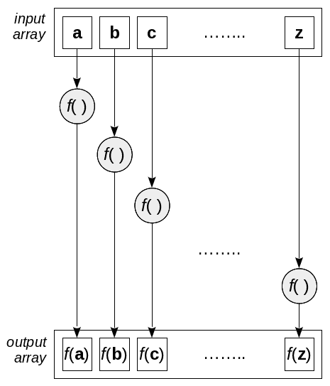
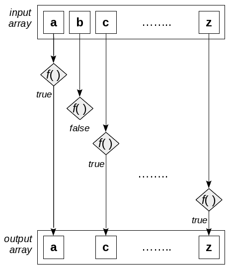

# 声明式编程——一种更好的风格

到目前为止，我们还不能真正理解**函数式编程**(**FP**)的可能性，因为它属于在更高级别的、声明式的方式中工作。 在本章中，我们将纠正这一点，通过使用一些**高阶函数**(**HOF**)，开始变得更短、更简洁、更容易理解的代码; 即以函数作为参数的函数，例如:

*   `reduce()`和`reduceRight()`用于对整个数组进行操作，将其缩减为单个结果
*   通过对数组中的每个元素应用函数将一个数组转换为另一个数组
*   `flat()`从数组的数组中生成单个数组
*   `flatMap()`混合映射和平坦
*   `forEach()`通过抽象必要的循环代码来简化编写循环

我们还可以执行以下搜索和选择:

*   `filter()`从数组中选取一些元素
*   `find()`和`findIndex()`查找满足条件的元素
*   一对谓词，`every()`和`some()`，用于检查一个数组的布尔测试

使用这些函数可以让你更明确地工作，你会发现你的重点将转移到你需要做什么，而不是怎么做; 肮脏的细节隐藏在函数中。 我们不会编写一系列可能嵌套的`for`循环，而是将重点放在使用函数作为构建块来指定我们想要的结果。

We will also be using these functions to work with events in a declarative style, as we'll see in [Chapter 11](11.html), *Implementing Design Patterns – The Functional Way*, when we use the *observer* pattern.

我们还将能够以一种*流利的*方式工作，在这种方式下，一个函数的输出将成为下一个函数的输入，这种风格我们将在稍后看到。

# 转换

我们要考虑的第一组操作是在数组上工作并在函数的基础上处理它以产生一些结果。 有几种可能的结果:使用`reduce()`操作的单个值; new array with`map()`; 或者使用`forEach()`的任何一种结果。

If you Google around, you will find some articles that declare that these functions are not efficient because a loop done by hand can be faster. This, while possibly true, is practically irrelevant. Unless your code really suffers from speed problems and you are able to measure that the slowness derives from the use of these higher-order functions, trying to avoid them using longer code, with a higher probability of bugs, simply doesn't make much sense.

让我们从前面的函数列表开始，从最通用的开始，正如我们将看到的，它甚至可以用来模拟本章中其余的转换!

# 将数组减少为值

回答这个问题:有多少次你不得不遍历一个数组，执行一个操作(比如，求和)来产生一个值(可能是所有数组值的和)? 可能有很多很多次了。 这种操作通常可以通过应用`reduce()`和`reduceRight()`在功能上实现。 让我们从前者开始吧!

Time for some terminology! In usual FP parlance, we speak of **folding** operations: `reduce()` is **foldl** (for *fold left*) or just plain **fold**, and `reduceRight()` is correspondingly known as **foldr**. In category theory terms, both operations are **catamorphisms**: the reduction of all the values in a *container* down to a single result.

`reduce()`功能的内部工作原理见*图 5.1*。 看看它是如何遍历数组的，对每个元素和累积的值应用一个 reduce 函数:


Figure 5.1: The workings of the reduce operation

为什么你总是尝试使用`reduce()`或`reduceRight()`而不是手工编码的循环? 以下几点可以回答这个问题:

*   循环控制的所有方面都是自动处理的，所以你甚至不可能出现*off-by-one*错误。
*   结果值的初始化和处理也是隐式完成的。
*   除非您非常努力地实现不纯并修改原始数组，否则您的代码将不会产生副作用。

现在我们可以`reduce()`数组了，让我们看看它的一些实际用例。

# 总结一个数组

`reduce()`应用的最常见的例子，在所有的教科书和网页上都可以看到，是数组中所有元素的总和。 所以，为了保持传统，让我们从这个例子开始!

基本上，要减少一个数组，你必须提供一个**二元**函数(也就是说，一个有两个参数的函数; **binary**将是它的另一个名称)和一个初始值。 在我们的例子中，函数将对它的两个参数求和。 最初，该函数将应用于提供的初值和数组的第一个元素，因此，对我们来说，必须提供的第一个结果是 0，而第一个结果将是第一个元素本身。 然后，该函数将再次应用，这次应用于前一个操作的结果，以及数组的第二个元素，因此第二个结果将是数组前两个元素的和。 以这种方式沿着整个数组进行，最终的结果将是它所有元素的总和:

```js
const myArray = [22, 9, 60, 12, 4, 56];
const sum = (x, y) => x + y;
const mySum = myArray.reduce(sum, 0); // 163
```

实际上，您并不需要`sum`定义—您可以只编写`myArray.reduce((x,y) => x+y, 0)`—但是，以这种方式编写时，代码的含义更清楚:您希望通过`sum`明其所有元素来将数组减少为单个值。 不需要写出循环，初始化变量来保存计算结果，并遍历数组进行求和，只需声明应该执行什么操作。 这就是我所说的使用函数编程的意思，我们将在本章中看到这些函数可以让你更加明确地工作，专注于*而不是*。**

**You can also even do this without providing the initial value: if you skip it, the first value of the array will be used, and the internal loop will start with the second element of the array; however, be careful if the array is empty, and if you skipped providing an initial value, as you'll get a runtime error! See [https://developer.mozilla.org/en-US/docs/Web/JavaScript/Reference/Global_Objects/Array/Reduce](https://developer.mozilla.org/en-US/docs/Web/JavaScript/Reference/Global_Objects/Array/Reduce) for more details. 

我们可以改变还原函数来看看它是如何通过计算来进行的只要加入一点杂质!

```js
const sumAndLog = (x, y) => {
 console.log(`${x}+${y}=${x + y}`);
  return x + y;
};

myArray.reduce(sumAndLog, 0);
```

产出如下:

```js
0+22=22
22+9=31
31+60=91
91+12=103
103+4=107
107+56=163
```

通过将初始值(`0`)和数组的第一个元素相加，您可以看到第一个和是如何完成的，该结果如何在第二个加法中使用，等等。

Part of the reason for the *foldl* name seen previously (at least, its ending `l`) should now be clear: the reducing operation proceeds from left to right, from the first element to the last. You may wonder, however, how it would have been named if it had been defined by a right-to-left language (such as Arabic, Hebrew, Farsi, or Urdu) speaker!

这个例子很常见; 现在让我们做一些更复杂的事情。 正如我们将发现的，`reduce()`将是非常有用的许多不同的目标!

# 计算平均

让我们再多做一点。 如何计算一组数字的平均值? 如果你向别人解释这个问题，你的答案肯定是这样的:*把列表中的所有元素加起来，然后除以*元素的数量。 在编程术语中，这不是一个**程序性**描述(您不解释如何对元素求和或如何遍历数组)，而是一个**声明性**描述，因为您说了要做什么，而不是如何做。

我们可以将计算的描述转换成一个几乎不言自明的函数:

```js
const average = arr => arr.reduce(sum, 0) / arr.length;

console.log(average(myArray)); // 27.166667
```

`average()`的定义遵循一个口头解释:从`0`开始，对数组中的元素求和，然后除以数组的长度——简单点:不可能!

As we mentioned in the previous section, you could also have written `arr.reduce(sum)` without specifying the initial value (`0`) for the reduction; it's even shorter and closer to the verbal description of the required calculation. This, however, is less safe, because it would fail (producing a runtime error) should the array be empty. So it's better to always provide the starting value.

然而，这并不是计算平均值的唯一方法。 reduce 函数还会传递数组当前位置的索引以及数组本身，所以你可以做一些不同于上次的事情:

```js
const average2 = (sum, val, ind, arr) => {
  sum += val;
  return ind === arr.length - 1 ? sum / arr.length : sum;
};

console.log(myArray.reduce(average2, 0)); // 27.166667
```

鉴于目前指数(显然,访问数组的长度),我们可以做一些诡计:在这种情况下,我们总是和价值观,但如果我们在数组的末尾,我们还扔在一个部门,将返回数组的平均值。 这很巧妙，但从易读性的角度来看，我确信我们可以同意，我们看到的第一个版本比第二个版本更具有说明性，更接近数学定义。

Getting the array and the index means that you could also turn the function into an impure one. Avoid this! Everybody who sees a `reduce()` call will automatically assume it's a pure function, and will surely introduce bugs when using it.

也可以修改`Array.prototype`以添加新的功能。 修改原型通常是不被允许的，因为至少可能会与不同的库发生冲突。 然而，如果你接受这个想法，你可以写以下代码:

```js
Array.prototype.average = function() {
  return this.reduce((x, y) => x + y, 0) / this.length;
};

let myAvg = [22, 9, 60, 12, 4, 56].average(); // 27.166667
```

请注意需要使用外部的`function()`(而不是箭头函数)，因为它隐式地处理了`this`，否则不会对其进行绑定。 我们现在已经扩展了`Array.prototype`，使`average()`成为一种全球可用的方法。

这个示例和前面的示例都需要计算单个结果，但可以在一次遍历中计算多个值。 让我们来看看。

# 一次计算多个值

如果需要计算两个或多个结果，而不是单个值，您会怎么做? 这似乎为普通循环提供了一个明显的优势，但您可以使用一个技巧。 让我们再次回顾一下平均计算。 我们可能想用老式的方法来做，通过循环，同时求和和计算所有的数字。 好吧，`reduce()`只让你产生一个单一的结果，但没有理由你不能返回一个对象与多个字段的期望:

```js
const average3 = arr => {
  const sumCount = arr.reduce(
    (accum, value) => ({sum: value + accum.sum, count: accum.count + 1}),
 {sum: 0, count: 0}
  );

  return sumCount.sum / sumCount.count;
};

console.log(average3(myArray)); // 27.166667
```

仔细检查代码。 我们需要两个变量:一个用于所有数字的总和，另一个用于所有数字的计数。 我们提供了一个对象作为累加器的初始值，其中两个属性被设置为`0`，而 reduce 函数更新了这两个属性。

顺便说一下，使用对象并不是唯一的选择。 您还可以生成任何其他数据结构; 让我们看一个数组的例子。 相似之处很明显:

```js
const average4 = arr => {
  const sumCount = arr.reduce(
    (accum, value) => [accum[0] + value, accum[1] + 1],
    [0, 0]
  );
  return sumCount[0] / sumCount[1];
};

console.log(average4(myArray)); // 27.166667
```

坦率地说，我认为这比对象的解决方案要复杂得多。 这是一种可以一次性计算多个值的方法(不太推荐)!

我们已经看到了几个使用`reduce()`的例子，所以现在是时候来看看它的一个变体`reduceRight()`了，它的工作方式非常相似。

# 左右折叠

互补的`reduceRight()`方法的工作原理与`reduce()`相同，只是从数组的末尾开始循环，直到数组的开始。 对于许多操作(例如我们前面看到的计算平均值)，这没有什么区别，但在某些情况下会有区别。

我们将在[第 8 章](12.html)，*中看到一个清晰的例子，当我们比较管道和合成时，让我们来看看一个简单的例子:*


Figure 5.2: The reduceRight() operation works the same way as reduce(), but in reverse order You can read more about `reduceRight()` at [https://developer.mozilla.org/en-US/docs/Web/JavaScript/Reference/Global_Objects/Array/ReduceRight](https://developer.mozilla.org/en-US/docs/Web/JavaScript/Reference/Global_Objects/Array/ReduceRight).

假设我们想实现一个函数来反转字符串。 一个解决方案可能是使用`split()`将字符串转换为一个数组，然后反转该数组，最后使用`join()`使其再次完整:

```js
const reverseString = str => {
  let arr = str.split("");
  arr.reverse();
  return arr.join("");
};

console.log(reverseString("MONTEVIDEO"));  // *OEDIVETNOM*
```

这个解决方案是可行的(是的，它可以被缩短，但这不是这里的重点)，但让我们用另一种方法来做，只是用`reduceRight()`做实验:

```js
const reverseString2 = str =>
  str.split("").reduceRight((x, y) => x + y, "");

console.log(reverseString2("OEDIVETNOM"));  // *MONTEVIDEO*
```

Given that the addition operator also works with strings, we could also have written `reduceRight(sum,"")`. And, if instead of the function we used, we had written `(x,y) => y+x`, the result would have been our original string; can you see why?

从前面的例子中，您还可以了解到:如果您首先将`reverse()`应用到一个数组，然后使用`reduce()`，其效果将与您刚刚将`reduceRight()`应用到原始数组相同。 只有一点需要考虑:`reverse()`改变了给定的数组，因此您可能会通过反转原来的数组而产生意想不到的副作用! 唯一的解决办法是首先生成数组的副本，然后再做剩下的事情。 太多的工作; 最好继续使用`reduceRight()`!

然而，我们可以得出另一个结论，显示我们已经预测的结果:使用`reduce()`来模拟`reduceRight()`同样的结果是可能的，尽管更麻烦一些——在后面的小节中，我们还将使用它来模拟本章中的其他函数。 现在让我们转移到另一个常见而强大的操作:映射。

# 应用操作映射

处理元素列表并对每个元素应用某种操作是计算机编程中相当常见的模式。 写循环系统通过一个数组或集合的所有元素,从第一个循环,直到完成最后,和对每个人进行某种形式的过程是一个基本的编码练习,通常在第一天学到的编程课程。 我们已经在上一节中用`reduce()`和`reduceRight()`看到过一种这样的操作; 现在让我们看一个新的，叫做`map()`。

在数学中，**映射**是元素从**域**到**上域**元素的变换。 例如，您可以将数字转换为字符串或字符串转换为数字，但也可以将数字转换为数字，或将字符串转换为字符串: 重要的是你有办法改变一个元素的第一个**或【显示】域(**认为类型**,【病人】如果它帮助)的一个元素第二种,或**域。 在我们的例子中，这意味着取一个数组的元素，并对每个元素应用一个函数来生成一个新数组。 在更类似于计算机的术语中，map 函数将输入数组转换为输出数组。****

**Some more terminology: We would say that an array is a **functor** because it provides a mapping operation with some prespecified properties, which we shall see later. And, in category theory, which we'll talk about a little in [Chapter 12](09.html), *Building Better Containers – Functional Data Types*, the mapping operation itself would be called a **morphism**.

`map()`的内部工作原理可以从*中看到*



Figure 5.3: The map() operation transforms each element of the input array by applying a mapping function The jQuery library provides a function, `$.map(array, callback)`, that is similar to the `map()` method. Be careful, though, for there are important differences. The jQuery function processes the undefined values of the array, while `map()` skips them. Also, if the applied function produces an array as its result, jQuery *flattens* it and adds each of its individual elements separately, while `map()` just includes those arrays in the result.

使用`map()`比使用简单的循环有什么好处?

*   首先，您不需要编写任何循环，所以这是一个更少的 bug 来源。
*   其次，您甚至不需要访问原始数组或索引位置，即使如果您真的需要它们，它们就在那里供您使用。
*   最后，生成一个新的数组，因此您的代码是纯的(当然，如果您真的想产生副作用，您可以这样做!)

In JavaScript, `map()` is basically available only for arrays (you can read more about this at [https://developer.mozilla.org/en-US/docs/Web/JavaScript/Reference/Global_Objects/Array/map](https://developer.mozilla.org/en-US/docs/Web/JavaScript/Reference/Global_Objects/Array/map)); however, in the *Extending current data types* section in [Chapter 12](09.html), *Building Better Containers – Functional Data Types*, we will learn how to make it available for other basic types, such as numbers, Booleans, strings, and even functions. Also, libraries, such as LoDash, Underscore, and Ramda, provide similar functionalities.

在使用这个时只有两个注意事项:

*   总是从映射函数中返回一些东西。 如果您忘记了这一点，那么您只需生成一个`undefined`填充的数组，因为 JavaScript 总是为所有函数提供默认的`return undefined`。
*   如果输入数组元素是对象或数组，并且您将它们包含在输出数组中，那么 JavaScript 将仍然允许访问原始元素。

There's an alternative way of doing `map()`: check the `Array.from()` method at [https://developer.mozilla.org/en-US/docs/Web/JavaScript/Reference/Global_Objects/Array/from](https://developer.mozilla.org/en-US/docs/Web/JavaScript/Reference/Global_Objects/Array/from) and pay special attention to its second argument!

正如我们在前面使用`reduce()`所做的那样，现在让我们看一些使用`map()`的常见流程的示例，以便您更好地理解它的功能和便利性。

# 从对象中提取数据

让我们从一个简单的例子开始。 假设我们有一些与一些南美国家有关的地理数据(如下面的代码片段所示)以及这些国家首都的坐标(纬度和经度)。 假设我们要计算这些城市的平均位置。 (不，我不知道我们为什么要这么做。) 我们该怎么做呢?

```js
const markers = [
  {name: "AR", lat: -34.6, lon: -58.4},
  {name: "BO", lat: -16.5, lon: -68.1},
  {name: "BR", lat: -15.8, lon: -47.9},
  {name: "CL", lat: -33.4, lon: -70.7},
  {name: "CO", lat:   4.6, lon: -74.0},
  {name: "EC", lat:  -0.3, lon: -78.6},
  {name: "PE", lat: -12.0, lon: -77.0},
  {name: "PY", lat: -25.2, lon: -57.5},
  {name: "UY", lat: -34.9, lon: -56.2},
  {name: "VE", lat:  10.5, lon: -66.9},
];
```

In case you are wondering if and why all the data are negative, it's just because the countries shown here are all south of the Equator and west of the Greenwich Meridian; however, there are some South American countries with positive latitudes, such as Colombia or Venezuela, so not all have negative data. We'll come back to this question a little later when we study the `some()` and `every()` methods.

我们要用我们的`average()`函数(在本章早些时候我们开发了),但有一个问题:这个函数只能适用于一个数组的*数字,我们这里有一个*对象数组【5】。 然而，我们可以做一个小技巧:我们可以专注于计算平均纬度(我们可以稍后以类似的方式处理经度)。 我们可以将数组中的每个元素映射到它的纬度，然后我们就有了一个合适的`average()`输入。 解决方案如下所示:**

```js
let averageLat = average(markers.map(x => x.lat)); // -15.76
let averageLon = average(markers.map(x => x.lon)); // -65.53
```

如果你扩展了`Array.prototype`，你就可以用不同的风格编写一个等价的版本，使用`average()`作为方法而不是函数:

```js
let averageLat2 = markers.map(x => x.lat).average();
let averageLon2 = markers.map(x => x.lon).average();
```

We will be learning more about these styles in [Chapter 8](12.html), *Connecting Functions – Pipelining and Composition*.

通过映射数组来提取数据很强大，但您必须小心。 现在让我们看一个例子，*似乎*是对的，但产生了错误的结果!

# 解析数字默认

使用映射通常比手工循环更安全、更简单，但一些边缘情况可能会让您出错。 假设您接收到一个表示数值的字符串数组，并且希望将它们解析为实际的数字。 你能解释一下以下结果吗?

```js
["123.45", "67.8", "90"].map(parseFloat);
// [123.45, 67.8, 90]

["123.45", "-67.8", "90"].map(parseInt);
// [123, NaN, NaN]
```

让我们分析一下结果。 当我们使用`parseFloat()`来获取浮点结果时，一切正常; 然而，当我们想将结果截断为整数值时，输出就真的出错了，出现了奇怪的`NaN`值。 发生了什么事?

答案在于隐性编程的问题。 (我们已经看到一些隐性的使用编程的*一个不必要的错误*的[第三章](05.html),*开始功能——*一个核心概念,我们会看到更多的[第八章](12.html)、【显示】连接函数——流水线和作文。) 当您没有显式地向函数显示参数时，很容易出现一些疏忽。 看看下面的代码，它将引导我们找到解决方案:

```js
["123.45", "-67.8", "90"].map(x => parseFloat(x));
// [123.45, -67.8, 90]

["123.45", "-67.8", "90"].map(x => parseInt(x));
// [123, -67, 90]
```

使用`parseInt()`出现意外行为的原因是，该函数还可以接收第二个参数—即，将字符串转换为数字时使用的基数。 例如，调用如`parseInt("100010100001", 2)`将二进制数 100010100001 转换为十进制数。

You can read more about `parseInt()` at [https://developer.mozilla.org/en/docs/Web/JavaScript/Reference/Global_Objects/parseInt](https://developer.mozilla.org/en/docs/Web/JavaScript/Reference/Global_Objects/parseInt), where the radix parameter is explained in detail. You should always provide it because some browsers might interpret strings with a leading zero to be octal, which would once again produce unwanted results.

那么当我们提供`parseInt()`给`map()`时会发生什么呢? 记住，`map()`使用三个参数调用映射函数:数组元素值、数组索引和数组本身。 当`parseInt`接收到这些值时，它会忽略数组，但假设提供的索引实际上是一个基数，并且会生成`NaN`值，因为原始字符串在给定的基数中不是有效的数字。

好了，我们知道在映射时有些函数会让你误入歧途，现在你知道要注意什么了。 让我们继续增强我们的工作方式，通过使用范围来帮助您编写通常需要手写循环的代码。

# 使用范围

现在让我们转向 helper 函数，它将在许多场合中派上用场。 我们想要一个`range(start,stop)`函数，它生成一个数字数组，值范围从`start`(包括)到`stop`(排除):

```js
const range = (start, stop) =>
  new Array(stop - start).fill(0).map((v, i) => start + i);

let from2To6 = range(2, 7); // [2, 3, 4, 5, 6]
```

为什么是`fill(0)`? 所有未定义的数组元素都会被`map()`跳过，所以我们需要用一些东西来填充它们，否则代码将不起作用。

Libraries such as Underscore and Lodash provide a more powerful version of our `range` function, letting you go in ascending or descending order and also specifying the step to use—as in `_.range(0, -8, -2)`, which produces `[0, -2, -4, -6]`—but for our needs, the version we wrote is enough. Read the *Questions* section at the end of this chapter.

我们如何使用它? 在下一节中，我们将看到使用`forEach()`进行控制循环的一些用法，但是我们可以通过应用`range()`和`reduce()`来重做 factorial 函数。 它的思想是简单地生成从 1 到*n*的所有数字，然后将它们相乘:

```js
const factorialByRange = n => range(1, n + 1).reduce((x, y) => x * y, 1);

factorialByRange(5); // 120
factorialByRange(3); // 6
```

检查边界情况很重要，但该函数也适用于零; 你知道为什么吗? 这样做的原因是生成的范围是空的(调用是`range(1,1)`，它返回一个空数组)，然后`reduce()`不做任何计算，只是返回初始值(1)，这是正确的。

In [Chapter 7](07.html), *Transforming Functions - Currying and Partial Application*, we'll have the opportunity to use `range()` to generate source code; check out the *Currying with* *eval()* and *Partial application with* *eval()* sections.

您可以使用这些数值范围来生成其他类型的范围。 例如，如果您需要一个包含字母的数组，您当然可以(而且很繁琐地)写`["A", "B", "C"...`到`..."X", "Y", "Z"]`。 一个更简单的解决方案是用 ASCII 码生成一个范围，并将其映射为字母:

```js
const ALPHABET = range("A".charCodeAt(), "Z".charCodeAt() + 1).map(x =>
  String.fromCharCode(x)
);

// ["A", "B", "C", ... "X", "Y", "Z"]
```

注意使用`charCodeAt()`获取字母的 ASCII 码，使用`String.fromCharCode(x)`将 ASCII 码转换回字符。

映射非常重要，而且经常使用，所以现在让我们分析一下如何自己实现它，这可以帮助您为更复杂的情况开发自己的代码。

# 用 reduce()模拟 map()

在本章的前面，我们看到了如何使用`reduce()`来实现`reduceRight()`。 现在让我们看看如何使用`reduce()`为`map()`提供填充(并非你需要它，因为浏览器通常会提供这两种方法，但只是为了让你更了解使用这些工具可以实现什么)。

我们自己的`myMap()`是一行代码，但它可能很难理解。 其思想是，我们将函数应用于数组的每个元素，然后将结果`concat()`应用于(最初为空的)结果数组。 当循环结束对输入数组的处理时，结果数组将具有所需的输出值:

```js
const myMap = (arr, fn) => arr.reduce((x, y) => x.concat(fn(y)), []);
```

让我们用一个数组和一个简单的函数来测试。 我们将使用原始的`map()`方法和我们的`myMap()`，显然结果应该匹配!

```js
const myArray = [22, 9, 60, 12, 4, 56];
const dup = x => 2 * x;

console.log(myArray.map(dup));    // *[44, 18, 120, 24, 8, 112]*
console.log(myMap(myArray, dup)); // *[44, 18, 120, 24, 8, 112]*
console.log(myArray);             // *[22, 9, 60, 12, 4, 56]*
```

第一个日志显示了预期的结果，由`map()`产生。 第二个输出给出了相同的结果，所以看起来`myMap()`有效! 最后的输出是为了检查原始的输入数组是否被修改过; 映射操作应该总是产生一个新的数组。

本章前面的所有例子都集中在简单数组上。 但如果事情变得更复杂，比如你必须处理一个元素本身就是数组的数组，会发生什么呢? 幸运的是，这是有出路的。 让我们继续。

# 处理数组的数组

到目前为止，我们一直使用一个(单个)值的数组作为输入，但是如果您的输入碰巧是数组的数组，会发生什么呢? 如果你认为这是一种牵强附会的情况，那么有许多可能的情况可以适用于这种情况:

*   对于某些应用程序，你可以有一个距离表，在 JavaScript 中它实际上是一个数组的数组:`distance[i][j]`是点`i`和`j`之间的距离。 如何求任意两点之间的最大距离? 对于一个普通的数组，查找最大值是很简单的，但是如何处理数组的数组呢?
*   还有一个更复杂的例子，也是与地理相关的:您可以查询与字符串匹配的城市的地理 API，响应可以是一个国家数组，每个国家都有一个州数组，每个国家本身都有一个匹配的城市数组:数组的数组的数组!

在第一种情况下，你可能想要一个包含所有距离的数组，而在第二种情况下，一个包含所有城市的数组; 你是怎么做到的? 需要一个新的手术，**扁平化**; 让我们来看看。

# 压扁一个数组

在 ES2019 中，两个操作被添加到 JavaScript 中:`flat()`，这是我们现在要看的，`flatMap()`，这是我们稍后要看的。 展示他们的所作所为比解释要容易得多——容忍我吧!

As often happens, not all browsers have been updated to include these new methods, and Microsoft's Internet Explorer and Edge (among others) are both deficient in this regard, so for web programming, you'll probably have to include a polyfill, or use some kind of implementation, which we'll be learning about soon. As usual, for updated compatibility data, check out the Can I use? site, in this case, at [https://caniuse.com/#feat=array-flat](https://caniuse.com/#feat=array-flat).

`flat()`方法创建一个新数组，将其子数组的所有元素连接到所需的级别，默认为`1`:

```js
const a = [[1, 2], [3, 4, [5, 6, 7]], 8, [[[9, 10]]]];

console.log(a.flat()); // *or a.flat(1)*
// [ 1, 2, 3, 4, [ 5, 6, 7 ], 8, [ 9, 10 ] ]

console.log(a.flat(2));
// [ 1, 2, 3, 4, 5, 6, 7, 8, [ 9, 10 ] ]

console.log(a.flat(Infinity));
// [ 1, 2, 3, 4, 5, 6, 7, 8, 9, 10 ]
```

那么我们怎么用这个函数来解决问题呢? 使用`flat()`,`Math.max()`蔓延,回答第一个问题(在某种程度上,我们看到在[第一章](01.html),*成为功能——几个问题*、【显示】章节传播; 我们可以使用我们当时写的`maxArray()`函数)，我们也可以使用`reduce()`作为变体。 假设我们有下面的距离表:

```js
const distances = [
  [0, 20, 35, 40],
  [20, 0, 10, 50],
  [35, 10, 0, 30],
  [40, 50, 30, 0],
];
```

然后，我们可以通过以下几种方法找到最大距离:我们要么将数组平铺开来，然后使用`Math.max()`，要么将数组平铺开来，然后使用 reduce 来明确地找到最大距离:

```js
const maxDist1 = Math.max(...distances.flat()); 
// 50

const maxDist2 = distances.flat().reduce((p, d) => Math.max(p, d), 0); 
// also 50
```

让我们回到第二个问题。 假设我们查询名称中含有`"LINCOLN"`的城市的地理 API，得到以下答案:

```js
const apiAnswer = [
  {
    country: "AR",
    name: "Argentine",
    states: [
      {
        state: "1",
        name: "Buenos Aires",
        cities: [{city: 3846864, name: "Lincoln"}],
      },
    ],
  },
  {
    country: "GB",
    name: "Great Britain",
    states: [
      {
        state: "ENG",
        name: "England",
        cities: [{city: 2644487, name: "Lincoln"}],
      },
    ],
  },
  {
    country: "US",
    name: "United States of America",
    states: [
      {
        state: "CA",
        name: "California",
        cities: [{city: 5072006, name: "Lincoln"}],
      },
      .
      . *several lines clipped out*
      .
      {
        state: "IL",
        name: "Illinois",
        cities: [
          {city: 4899911, name: "Lincoln Park"},
          {city: 4899966, name: "Lincoln Square"},
        ],
      },
    ],
  },
];
```

城市列表提取可通过两次应用`flatMap()`完成:

```js
console.log(
  apiAnswer
    .map(x => x.states)
    .flat()
    .map(y => y.cities)
    .flat()
);

/*
[ { city: 3846864, name: 'Lincoln' },
 { city: 2644487, name: 'Lincoln' },
 { city: 5072006, name: 'Lincoln' },
 { city: 8531960, name: 'Lincoln' },
 { city: 4769608, name: 'Lincolnia' },
 { city: 4999311, name: 'Lincoln Park' },
 { city: 5072006, name: 'Lincoln' },
 { city: 4899911, name: 'Lincoln Park' },
 { city: 4899966, name: 'Lincoln Square' } ]
*/
```

我们已经看到了如何使用`flat()`来扁平化数组; 现在让我们看看如何使用`flatMap()`，一个有趣的`flat()`和`map()`的混合物，以进一步简化我们的编码，甚至进一步缩短我们前面的第二个解决方案!

Think this exercise wasn't hard enough and that its output was sort of lame? Try out exercise *5.8* for a more challenging version!

# 绘图及压平- flatMap()

基本上，`flatMap()`所做的是首先应用`map()`函数，然后对映射操作的结果应用`flat()`。 这是一个有趣的组合，因为它允许您生成具有不同数量元素的新数组。 (使用通常的`map()`操作，输出数组将与输入数组的长度完全相同)。 如果您的映射操作生成一个包含两个或多个元素的数组，那么输出数组将包含许多输出值，如果您生成一个空数组，则输出数组将包含较少的值。

让我们来看一个(莫名其妙的)例子。 假设我们有一个名字列表，例如`"Winston Spencer Churchill"`、`"Abraham Lincoln"`和`"Socrates"`。 我们的规则是，如果一个名字有几个单词，就排除最初的一个(我们假设是第一个名字)，分隔其余的(姓氏)，但如果一个名字只有一个单词，就省略它(假设这个人没有姓氏):

```js
const names = [
  "Winston Spencer Churchill",
  "Plato",
  "Abraham Lincoln",
  "Socrates",
  "Charles Darwin",
];

const lastNames = names.flatMap(x => {
  const s = x.split(" ");
  return s.length === 1 ? [] : s.splice(1);
}); // [ 'Spencer', 'Churchill', 'Lincoln', 'Darwin' ]
```

我们可以看出,输出比输入数组有不同数量的元素:仅仅因为这个原因,我们可以考虑`flatMap()``map()`的一个升级版本,甚至包括`filter()`的某些方面,如当我们排除了单身的名字。

现在让我们看一个简单的例子。 与上一部分的林肯主题保持一致，让我们来计算林肯的葛底斯堡演说中有多少单词，以一组句子的形式给出。

Usually, this address is considered to be 272 words long, but the version I found doesn't produce that number! This may be because there are five manuscript copies of the address written by Lincoln himself, plus another version transcribed from shorthand notes taken at the event. In any case, I will leave the discrepancy to historians and stick to coding!

我们可以使用`flatMap()`将每个句子分割成一个单词数组，然后只看扁平数组的长度:

```js
const gettysburg = [
  "Four score and seven years ago our fathers brought forth, ",
  "on this continent, a new nation, conceived in liberty, and ",
  "dedicated to the proposition that all men are created equal.",
  "Now we are engaged in a great civil war, testing whether that ",
  "nation, or any nation so conceived and so dedicated, can long ",
  "endure.",
  "We are met on a great battle field of that war.",
  "We have come to dedicate a portion of that field, as a final ", 
  "resting place for those who here gave their lives, that that ",
  "nation might live.",
  "It is altogether fitting and proper that we should do this.",
  "But, in a larger sense, we cannot dedicate, we cannot consecrate, ",
  "we cannot hallow, this ground.",
  "The brave men, living and dead, who struggled here, have ",
  "consecrated it far above our poor power to add or detract.",
  "The world will little note nor long remember what we say here, ",
  "but it can never forget what they did here.",
  "It is for us the living, rather, to be dedicated here to the ",
  "unfinished work which they who fought here have thus far so nobly ",
  "advanced.",
  "It is rather for us to be here dedicated to the great task ",
  "remaining before us— that from these honored dead we take increased ",
  "devotion to that cause for which they here gave the last full ",
  "measure of devotion— that we here highly resolve that these dead ",
  "shall not have died in vain— that this nation, under God, shall have ",
  "a new birth of freedom- and that government of the people, by the ",
  "people, for the people, shall not perish from the earth.",
];

console.log(gettysburg.flatMap(s => s.split(" ")).length);
```

让我们回到城市的问题。 如果我们注意到每个`map()`后面都跟着一个`flat()`，那么另一个解决方案就很明显了。 将这个解决方案与我们在*扁平化数组*部分中所写的解决方案进行比较; 它本质上是一样的，但是把每个`map()`和下面的`flat()`合并在一起:

```js
console.log(apiAnswer.flatMap(x => x.states).flatMap(y => y.cities));
/*
[ { city: 3846864, name: 'Lincoln' },
  { city: 2644487, name: 'Lincoln' },
  { city: 5072006, name: 'Lincoln' },
  { city: 8531960, name: 'Lincoln' },
  { city: 4769608, name: 'Lincolnia' },
  { city: 4999311, name: 'Lincoln Park' },
  { city: 5072006, name: 'Lincoln' },
  { city: 4899911, name: 'Lincoln Park' },
  { city: 4899966, name: 'Lincoln Square' } ]
*/
```

我们已经看到了新的行动。 现在让我们学习如何模拟它们，如果您没有它们的话。

It's perfectly possible to solve the problems in this section without using any sort of mapping, but that wouldn't do as a proper example for this section! See exercise *5.9* for an alternative to the word counting problem.

# 模拟 flat()和 flatMap()

我们已经看到了如何用`reduce()`来模仿`map()`。 现在让我们看看如何计算`flat()`和`flatMap()`的等价物，以获得更多的练习。 我们还将介绍递归的版本，这个话题我们将在[第 9 章](09.html)、*设计函数——递归*中讨论。 正如前面提到的，我们的目标不是最快或最小或任何特定版本的代码; 相反，我们想重点使用我们在本书中看到的概念。

完全扁平化数组可以通过递归调用来完成。 我们使用`reduce()`来逐个处理数组中的元素，如果某个元素碰巧是一个数组，则递归地将其压平:

```js
const flatAll = arr =>
  arr.reduce((f, v) => f.concat(Array.isArray(v) ? flatAll(v) : v), []);
```

将数组压扁到给定的水平(不是无限; 如果你能先将数组平铺一层，那就很简单了。 我们可以通过传播或者使用`reduce`来实现。 让我们编写一个`flatOne()`函数，使数组的某一层平面化。 有两个版本; 选择你喜欢的:

```js
const flatOne1 = arr => [].concat(...arr);

const flatOne2 = arr => arr.reduce((f, v) => f.concat(v), []);
```

使用这两个函数中的任何一个，我们都可以设法将多个层次的数组扁平化，我们可以用两种不同的方法来做到这一点。 我们的两个版本的`flat()`函数使用以前的`flatOne()`和`flatAll()`函数，但第一个只使用普通循环，而第二个则以完全递归的方式工作。 你喜欢哪一个?

```js
const flat1 = (arr, n = 1) => {
  if (n === Infinity) {
    return flatAll(arr);

  } else {
    let result = arr;
    range(0, n).forEach(() => {
      result = flatOne(result);
    });
    return result;
  }
};

const flat2 = (arr, n = 1) =>
  n === Infinity
    ? flatAll(arr)
    : n === 1
    ? flatOne(arr)
    : flat2(flatOne(arr), n - 1);
```

就我个人而言，我认为递归版本更好，更符合本书的主题，但这取决于您，真的(尽管如果您不喜欢三元运算符，那么递归版本绝对不适合您!)

如果您希望填充这些函数(尽管我们建议不要)，它并不复杂，并且类似于我们用`average()`方法做的一些页面。 我注意不创建任何额外的方法:

```js
if (!Array.prototype.flat) {
  Array.prototype.flat = function(n = 1) {
    this.flatAllX = () =>
      this.reduce(
        (f, v) => f.concat(Array.isArray(v) ? v.flat(Infinity) : v),
        []
      );

    this.flatOneX = () => this.reduce((f, v) => f.concat(v), []);

    return n === Infinity
      ? this.flatAllX()
      : n === 1
      ? this.flatOneX()
      : this.flatOneX().flat(n - 1);
  };
}
```

我们的`flatOneX()`和`flatAllX()`方法只是我们以前开发的复制，在我们的实现的最后，你会认出我们以前的`flat2()`函数的代码。

最后，模仿`flatMap()`本身很简单，我们可以跳过它，因为它只是一个先应用`map()`，然后`flat()`的问题; 没什么大不了的!

我们已经看到了如何使用数组的几种方法，但有时我们看到的任何函数都不能很好地满足您的需要。 让我们转向更一般的循环方式，以获得更大的能量。

# 更一般的循环

我们前面看到的例子只是简单地遍历数组，做了一些工作。 然而，有时您需要执行循环，但所需的进程并不真正适合`map()`或`reduce()`。 那么，在这种情况下可以做些什么呢? 有一种方法可以帮助你。

Read more about the specification of the `forEach()` method at [https://developer.mozilla.org/en-US/docs/Web/JavaScript/Reference/Global_Objects/Array/forEach](https://developer.mozilla.org/en-US/docs/Web/JavaScript/Reference/Global_Objects/Array/forEach).

您必须提供一个回调函数，该回调函数将接收正在操作的值、索引和数组。 (最后两个参数是可选的。) JavaScript 将负责循环控制，您可以在每个步骤中做任何您想做的事情。 例如，我们可以通过使用一些`Object`方法来编写一个对象复制方法，每次复制一个源对象属性，并生成一个新对象:

```js
const objCopy = obj => {
  let copy = Object.create(Object.getPrototypeOf(obj));
  Object.getOwnPropertyNames(obj).forEach(prop =>
    Object.defineProperty(
      copy,
      prop,
      Object.getOwnPropertyDescriptor(obj, prop)
    )
  );
  return copy;
};

const myObj = {fk: 22, st: 12, desc: "couple"};
const myCopy = objCopy(myObj);
console.log(myObj, myCopy); // {fk: 22, st: 12, desc: "couple"}, twice
```

Yes, of course we could have written `myCopy={...myObj}`, but where's the fun in that? Okay, it would be better, but I needed a nice example to use `forEach()` with. Sorry about that! Also, there are some hidden inconveniences in that code, which we'll explain in [Chapter 10](00.html), *Ensuring Purity – Immutability*, when we try to get really frozen, unmodifiable objects. Just a hint: the new object may share values with the old one because we have a *shallow* copy, not a *deep* one. We'll learn more about this later in the book.

如果您使用我们前面定义的`range()`函数，您还可以执行`for(i=0; i<10; i++)`类型的常见循环。 我们可以使用它来编写阶乘(!)的另一个版本:

```js
const factorial4 = n => {
  let result = 1;
  range(1, n + 1).forEach(v => (result *= v));
  return result;
};

console.log(factorial4(5)); // 120
```

阶乘的定义确实与通常的描述相符:它生成从 1 到*n*的所有数字，并将它们相乘——很简单!

For greater generality, you might want to expand `range()` so it can generate ascending and descending ranges of values, possibly also stepping by a number other than 1\. This would practically allow you to replace all the loops in your code with `forEach()` loops.

至此，我们已经看到了许多处理数组以生成结果的方法，但是您可能会对其他目标感兴趣，所以现在让我们继续讨论逻辑函数，它也将简化您的编码需求。

# 逻辑高阶函数

到目前为止，我们一直在使用高阶函数来产生新的结果，但也有一些其他函数通过对数组的所有元素应用谓词来产生逻辑结果。 (顺便说一下，我们将在下一章中看到更多关于高阶函数的内容。)

A bit of terminology: the word **predicate** can be used in several senses (as in *predicate logic*), but for us, in computer science, it has the meaning of *a function that returns true or false*. Okay, this isn't a very formal definition, but it's enough for our needs. For example, saying that we will filter an array depending on a predicate just means that we get to decide which elements are included or excluded depending on the result of the predicate.

使用这些函数意味着代码将变得更短:只需一行代码，就可以得到与整个值集对应的结果。

# 过滤数组

我们将遇到的一个常见需求是根据特定条件过滤数组元素。 `filter()`方法允许您以与`map()`相同的方式检查数组中的每个元素。 不同之处在于，函数的结果不是生成一个新元素，而是决定输入值是保留在输出中(如果函数返回`true`)还是跳过(如果函数返回`false`)。 与`map()`类似，`filter()`不改变原来的数组，而是返回一个包含所选项的新数组。

输入输出示意图见*图 5.4*:



Figure 5.4: The filter() method picks the elements of an array that satisfy a given predicate Read more on the `filter()` function at [https://developer.mozilla.org/en/docs/Web/JavaScript/Reference/Global_Objects/Array/filter](https://developer.mozilla.org/en/docs/Web/JavaScript/Reference/Global_Objects/Array/filter).

在过滤数组时，有几件事要记住:

*   **总是返回的东西从你的谓词**:如果你忘了包括`return`,该函数将隐式返回`undefined`,因为这是一个*falsy 值,输出将是一个空数组。*
**   :如果输入的数组元素是对象或数组，那么原始的元素仍然可以访问。*

 *让我们先看一个实际的`filter()`示例，然后进一步了解如何通过使用`reduce()`自行实现该功能。

# 一个减少()的例子

让我们看一个实际的例子。 假设一个服务返回了一个 JSON 对象，该对象本身有一个包含帐户`id`和帐户`balance`的对象数组。 我们如何获得 id 的列表，红色的是*，余额为负? 输入数据如下:*

```js
const serviceResult = {
  accountsData: [
    {
      id: "F220960K",
      balance: 1024,
    },
    {
      id: "S120456T",
      balance: 2260,
    },
    {
      id: "J140793A",
      balance: -38,
    },
    {
      id: "M120396V",
      balance: -114,
    },
    {
      id: "A120289L",
      balance: 55000,
    },
  ],
};
```

我们可以用如下方法得到拖欠账户。 您可以检查`delinquent`变量的值是否正确地包含了两个负余额账户的 id:

```js
const delinquent = serviceResult.accountsData.filter(v => v.balance < 0);

console.log(delinquent); // two objects, with id's J140793A and M120396V
```

顺便说一下，假设过滤操作产生了另一个数组，如果你只是想要帐户 ID，你可以通过映射输出得到 ID 字段来获得它们:

```js
const delinquentIds = delinquent.map(v => v.id);
```

如果你不关心中间结果，也可以使用一行代码:

```js
const delinquentIds2 = serviceResult.accountsData
    .filter(v => v.balance < 0)
    .map(v => v.id);
```

过滤是一个非常有用的函数，所以现在，为了更好地处理它，让我们看看如何模拟它，您甚至可以将它用作您自己的更复杂、更强大的函数的基础。

# 用 reduce()模拟 filter()

就像我们之前用`map()`做的那样，我们也可以用`reduce()`创建我们自己的`filter()`版本。 其思想是类似的:遍历输入数组的所有元素，对其应用谓词，如果结果是`true`，则将原始元素添加到输出数组。 当循环完成时，输出数组将只包含谓词为`true`的元素:

```js
const myFilter = (arr, fn) =>
  arr.reduce((x, y) => (fn(y) ? x.concat(y) : x), []);
```

我们可以很快看到我们的功能按照预期工作:

```js
console.log(myFilter(serviceResult.accountsData, v => v.balance < 0));
// two objects, with id's J140793A and M120396V
```

输出与我们在本节前面看到的帐户对相同。

# 搜索一个数组

有时，不是过滤数组中的所有元素，而是希望找到满足给定谓词的元素。 根据你的具体需要，有几个函数可以用于此:

*   `find()`搜索数组并返回满足给定条件的第一个元素的值，如果没有找到该元素，则返回`undefined`
*   `findIndex()`执行类似的任务，但不是返回一个元素，而是返回数组中满足条件的第一个元素的索引，如果没有找到则返回-1

与`includes()`、`indexOf()`相似; 这些函数搜索特定的值，而不是满足更一般条件的元素。 我们可以很容易地编写等价的一行代码:

```js
arr.includes(value); // arr.find(v => v === value)
arr.indexOf(value);  // arr.findIndex(v => v === value)
```

回到我们之前使用的地理数据，我们可以很容易地通过使用`find()`方法找到一个给定的国家。 例如，让我们获取巴西的数据(`"BR"`); 只需要一行代码:

```js
markers = [
  {name: "UY", lat: -34.9, lon: -56.2},
  {name: "AR", lat: -34.6, lon: -58.4},
  {name: "BR", lat: -15.8, lon: -47.9},
  //…
  {name: "BO", lat: -16.5, lon: -68.1}
];

let brazilData = markers.find(v => v.name === "BR");
// {name:"BR", lat:-15.8, lon:-47.9}
```

我们不能使用更简单的`includes()`方法，因为我们必须深入对象以获得我们想要的字段。 如果我们想要这个国家在数组中的位置，我们会使用`findIndex()`:

```js
let brazilIndex = markers.findIndex(v => v.name === "BR"); // 2

let mexicoIndex = markers.findIndex(v => v.name === "MX"); // -1
```

好吧，这很简单! 如果有特殊情况，甚至可能是一个恶作剧面试问题呢? 继续读下去!

# 一个特殊的搜索案例

现在，为了多样化，做个小测试。 假设您有一个数字数组，想要运行一个完整性检查，研究它们中是否有`NaN`。 你会怎么做? 提示:不要尝试检查数组元素的类型——即使`NaN`代表的是**而不是一个数字**，`typeof NaN === "number"`。 你会得到一个令人惊讶的结果，如果你尝试在一个*明显的方式搜索*:

```js
[1, 2, NaN, 4].findIndex(x => x === NaN); // -1
```

这是怎么回事? 这是一个有趣的 JavaScript 琐事:`NaN`是唯一不等于它本身的值。 如果你需要寻找`NaN`，你将不得不使用新的`isNaN()`函数，如下所示:

```js
[1, 2, NaN, 4].findIndex(x => isNaN(x)); // 2
```

这是一个特殊的案例，但值得了解; 我实际上处理过一次这个案子! 现在，让我们继续前面所做的，通过使用`reduce()`模拟搜索方法，以便我们可以看到更多关于该函数威力的示例。

# 用 reduce()模拟 find()和 findIndex()

与其他方法一样，让我们通过学习如何使用万能的`reduce()`实现我们展示的方法来结束本节。 这是一个很好的练习，可以让您习惯使用高阶函数，即使您永远不会实际使用这些腻子!

`find()`功能需要做一些工作。 我们从一个未定义的值开始搜索，如果我们找到一个数组元素，因此谓词为`true`，我们将累积的值改为数组的值:

```js
arr.find(fn);
// arr.reduce((x, y) => (x === undefined && fn(y) ? y : x), undefined);
```

对于`findIndex()`，我们必须记住，回调函数接收的是累计的值、数组的当前元素和当前元素的下标，但除此之外，其等效表达式与`find()`非常相似; 把它们进行比较是值得的:

```js
arr.findIndex(fn);
// arr.reduce((x, y, i) => (x == -1 && fn(y) ? i : x), -1);
```

这里的初始累积值是`-1`，如果没有元素满足谓词，则返回该值。 只要累计值仍然是`-1`，但找到满足谓词的元素，就将累计值更改为数组索引。

好了，我们现在已经完成了搜索:让我们继续考虑更高级的谓词，它们将简化条件数组的测试，但始终使用我们目前使用的声明式样式。

# 高级谓词——一些，每一个

我们将要考虑的最后一个函数极大地简化了通过数组来测试条件的过程。 这些职能如下:

*   `every()`，当且仅当*数组中的每个*元素都满足给定谓词时，它就是`true`
*   `some()`，如果数组中至少有*一个*元素满足谓词，则为`true`

例如，我们可以很容易地检查关于所有国家都有负坐标的假设:

```js
markers.every(v => v.lat < 0 && v.lon < 0); // *false*

markers.some(v => v.lat < 0 && v.lon < 0);  // *true*
```

如果我们想找到这两个函数在`reduce()`方面的等价，两个选项显示出很好的对称性:

```js
arr.every(fn);
// arr.reduce((x, y) => x && fn(y), true);

arr.some(fn);
// arr.reduce((x, y) => x || fn(y), false);
```

第一个折叠操作评估`fn(y)`，并与之前的测试结果; 最终结果是`true`的唯一方法是每次测试结果都是`true`。 第二次折叠操作与第二次相似，但与前一次的结果相反，会产生`true`，除非每次都是`false`。

In terms of Boolean algebra, we would say that the alternative formulations for `every()` and `some()` exhibit duality. This duality is the same kind that appears in the expressions `x === x && true` and `x === x || false`; if `x` is a Boolean value, and we exchange `&&` and `||`, and also `true` and `false`, then we transform one expression into the other, and both are valid.

在本节中，我们看到了如何检查给定的布尔条件。 最后，让我们看看如何通过发明一种我们自己的方法来检查消极条件。

# 检查负数-没有

如果你愿意，你也可以将`none()`定义为`every()`的补充。 只有当数组中的所有元素都不满足给定谓词时，这个新函数才会是`true`。 最简单的编码方法是，如果没有元素满足条件，那么所有元素都满足条件的否定:

```js
const none = (arr, fn) => arr.every(v => !fn(v));
```

如果你愿意，你可以通过修改数组原型把它变成一个方法，就像我们之前看到的; 这仍然是一个糟糕的做法，但它是我们所拥有的，直到我们开始寻找更好的方法来组合和链接函数，正如我们将在[第 8 章](12.html)，*连接函数-管道和组成*:

```js
Array.prototype.none = function(fn) {
  return this.every(v => !fn(v));
};
```

我们不得不使用`function()`而不是箭头函数，原因和我们前面看到的一样; 在这种情况下，我们需要正确地分配`this`。 除此之外，它是简单的编码，我们现在有一个`none()`方法可用于所有数组。

In [Chapter 6](05.html), *Producing Functions – Higher-Order Functions*, we will see other ways of negating a function by writing an appropriate higher-order function of our own.

在本节和前一节中，我们讨论了日常问题，并了解了如何以声明的方式解决它们。 然而，当您开始使用`async`函数时，情况会有一点变化。 需要新的解决方案，我们将在下一节中看到。

# 使用异步函数

我们在前几节中学习的所有示例和代码都是用于通用函数，特别是非异步函数。 当您希望执行映射、过滤、缩减等操作，但您使用的函数是异步函数时，结果可能会让您感到惊讶。 为了简化我们的工作，不需要处理实际的 API 调用，让我们创建一个`fakeAPI(delay, value)`函数，它只会延迟一段时间，然后返回给定的值:

```js
const fakeAPI = (delay, value) =>
  new Promise(resolve => setTimeout(() => resolve(value), delay));
```

让我们也有一个函数来显示什么`fakeAPI()`返回，所以我们可以看到事情正在按照预期的工作:

```js
const useResult = x => console.log(new Date(), x);
```

我们正在使用现代的`async`/`await`功能来简化我们的代码:

```js
(async () => {
  console.log("START");
  console.log(new Date());
  const result = await fakeAPI(1000, 229);
  useResult(result);
  console.log("END");
})();
/*
START
2019-10-13T19:11:56.209Z
2019-10-13T19:11:57.214Z 229
END
*/
```

结果是可见的:我们得到`START`文本，然后大约 1 秒(`1000`毫秒)之后，我们得到虚假 API 调用的结果(`229`)，最后得到`END`文本。 会出什么问题呢?

Why are we using the *immediate invocation* pattern that we saw in [Chapter 3](03.html), *Starting Out with Functions – A Core Concept*? The reason is that you can only use `await` within an `async` function. There is a proposal that will allow the use of `await` with top-level modules (see [https://v8.dev/features/top-level-await](https://v8.dev/features/top-level-await) for more on this), but it hasn't made its way into JavaScript yet, and it applies to modules only, not general scripts.

关键问题是，我们在本章前面看到的所有函数都不是`async`*aware*，所以它们不会真正像你预期的那样工作。 让我们开始看看这个。

# 一些奇怪的行为

让我们从一个简单的测试开始:结果是你预期的吗? 让我们看几个涉及到`async`调用的代码示例，也许我们会看到一些意想不到的结果。 首先，让我们看看一个常见的简单的`async`调用序列:

```js
(async () => {
  console.log("START SEQUENCE");

  const x1 = await fakeAPI(1000, 1);
  useResult(x1);
  const x2 = await fakeAPI(2000, 2);
  useResult(x2);
  const x3 = await fakeAPI(3000, 3);
  useResult(x3);
  const x4 = await fakeAPI(4000, 4);
  useResult(x4);

  console.log("END SEQUENCE");
})();
```

如果您运行这段代码，您将得到以下结果，这肯定是您所期望的—一个`START SEQUENCE`文本，带有虚假 API 调用结果的四行代码，以及一个最终的`END SEQUENCE`文本。 这里没什么特别的，一切都很好!

```js
START SEQUENCE
2019-10-12T13:38:42.367Z 1
2019-10-12T13:38:43.375Z 2
2019-10-12T13:38:44.878Z 3
2019-10-12T13:38:46.880Z 4
END SEQUENCE
```

现在让我们来看看另一个版本，你可能认为它与第一个版本是等价的。 唯一不同的是，这里我们使用循环来执行四个 API 调用; 应该是一样的，不是吗? (我们也可以在前面看到的`range()`函数中使用`forEach`循环，但这没有区别。) 我一直在使用 ife，尽管在这个特殊的情况下它是不需要的; 你知道为什么吗?

```js
(() => {
  console.log("START FOREACH");

  [1, 2, 3, 4].forEach(async n => {
    const x = await fakeAPI(n * 1000, n);
    useResult(x);
  });

  console.log("END FOREACH");
})();
```

这段代码看起来肯定与第一个代码相同，但它产生了一些完全不同的东西!

```js
START FOREACH
END FOREACH
2019-10-12T13:34:57.876Z 1
2019-10-12T13:34:58.383Z 2
2019-10-12T13:34:58.874Z 3
2019-10-12T13:34:59.374Z 4
```

`END FOREACH`文本出现在 API 调用的结果之前。 发生什么事情了? 答案就是我们前面提到的:类似于`forEach`之类的方法用于普通的同步函数调用，而`async`函数调用的行为很奇怪。 关键概念是`async`函数始终返回承诺,这在得到`START FOREACH`文本、循环实际上是创建四个承诺(这将在一段时间得到解决),但是没有等待他们,继续打印`END FOREACH`我们的代码文本。

You can verify this yourself by looking at the polyfill for `reduce()` at [https://developer.mozilla.org/en-US/docs/Web/JavaScript/Reference/Global_Objects/Array/Reduce#Polyfill](https://developer.mozilla.org/en-US/docs/Web/JavaScript/Reference/Global_Objects/Array/Reduce#Polyfill).

这个问题不仅存在于`forEach()`，而且还影响到所有类似的方法。 让我们看看如何解决这种情况，并编写`async`感知函数，以保持声明式方式工作，就像本章前面所做的那样。

# Async-ready 循环

如果我们不能直接使用`forEach()`、`map()`等方法，我们就必须开发自己的新版本。 让我们看看如何实现这一点。

# 在异步调用上循环

由于`async`调用返回 promise，我们可以用`reduce()`来模拟`forEach()`，方法是从一个已解析的 promise 开始，并将数组中每个值的 promise 链接到它。 将按照正确的顺序调用`then()`方法，因此结果将是正确的。 下面的代码设法得到正确的、预期的结果:

```js
const forEachAsync = (arr, fn) =>
  arr.reduce(
    (promise, value) => promise.then(() => fn(value)),
    Promise.resolve()
  );

(async () => {
  console.log("START FOREACH VIA REDUCE");
  await forEachAsync([1, 2, 3, 4], async n => {
    const x = await fakeAPI(n * 1000, n);
    useResult(x);
  });
  console.log("END FOREACH VIA REDUCE");
})();

/*
START FOREACH VIA REDUCE
2019-10-13T20:02:23.437Z 1
2019-10-13T20:02:24.446Z 2
2019-10-13T20:02:25.949Z 3
2019-10-13T20:02:27.952Z 4
END FOREACH VIA REDUCE
*/
```

由于`forEachAsync()`返回一个承诺，我们一定不要忘记在显示最后的文本信息之前`await`它。 除了没有忘记所有的`await`语句之外，该代码与我们使用`forEach()`构建的代码非常相似，关键的区别在于它确实像预期的那样工作!

# 映射异步调用

我们可以使用其他函数吗? 编写`mapAsync()`(可以使用`async`映射函数的`map`版本)很简单，因为你可以利用`Promise.all()`从一系列承诺中创建一个承诺:

```js
const mapAsync = (arr, fn) => Promise.all(arr.map(fn));

(async () => {
  console.log("START MAP");

  const mapped = await mapAsync([1, 2, 3, 4], async n => {
    const x = await fakeAPI(n * 1000, n);
    return x;
  });

  useResult(mapped);
  console.log("END MAP");
})();

/* 
START MAP
2019-10-13T20:06:21.149Z [ 1, 2, 3, 4 ]
END MAP
*/
```

该解决方案的结构类似于`forEachAsync()`代码。 和以前一样，我们必须记住在继续这个过程之前等待`mapAsync()`的结果。 除此之外，逻辑很简单，结果也和预期一样。

# 使用异步调用进行过滤

使用`async`函数进行过滤稍微复杂一些。 我们必须使用`mapAsync()`生成一个由`true`/`false`值组成的数组，然后根据`async`过滤函数返回的值，使用标准的`filter()`方法从原始数组中挑选值。 让我们尝试一个简单的例子，调用 API 并通过一个`fakeFilter()`函数只接受偶数结果，对于我们的示例，该函数接受偶数并拒绝奇数:

```js
const filterAsync = (arr, fn) =>
 mapAsync(arr, fn).then(arr2 => arr.filter((v, i) => Boolean(arr2[i])));

const fakeFilter = (value) =>
  new Promise(resolve =>
    setTimeout(() => resolve(value % 2 === 0), 1000)
  );

(async () => {
  console.log("START FILTER");

  const filtered = await filterAsync([1, 2, 3, 4], async n => {
    const x = await fakeFilter(n);
    return x;
  });

  useResult(filtered);
  console.log("END FILTER");
})();
/*
START FILTER
2019-10-13T21:24:36.478Z [ 2, 4 ]
END FILTER
*/
```

注意，`async`调用的映射结果是一个布尔数组(`arr2`)，然后我们使用`filter()`从原始数组的值(`arr`)中选择元素; 这可能很难理解!

# 减少异步调用

最后，找到`reduce()`的等效函数有点复杂，但在看过其他函数之后，就没那么复杂了。 关键思想与`forEachAsync`相同:每个函数调用都会返回一个 promise，为了更新即将到来的`then()`中的累加器，必须等待这个 promise。 为了减少，让我们使用一个`fakeSum()``async`函数，它将对 api 返回的值进行求和:

```js
const reduceAsync = (arr, fn, init) =>
 Promise.resolve(init).then(accum =>
 forEachAsync(arr, async (v, i) => {
 accum = await fn(accum, v, i);
 }).then(() => accum)
 );

const fakeSum = (value1, value2) =>
  new Promise(resolve => setTimeout(() => resolve(value1 + value2), 1000));

(async () => {
  console.log("START REDUCE");

  const summed = await reduceAsync(
    [1, 2, 3, 4],
    async (_accum, n) => {
      const accum = await _accum;
      const x = await fakeSum(accum, n);
      useResult(`accumulator=${accum} value=${x} `);
      return x;
    },
    0
  );

  useResult(summed);
  console.log("END REDUCE");
})();
/*
START REDUCE
2019-10-13T21:29:01.841Z 'accumulator=0 value=1 '
2019-10-13T21:29:02.846Z 'accumulator=1 value=3 '
2019-10-13T21:29:03.847Z 'accumulator=3 value=6 '
2019-10-13T21:29:04.849Z 'accumulator=6 value=10 '
2019-10-13T21:29:04.849Z 10
END REDUCE
*/
```

注意重要的细节:在 reduce 函数中，我们必须`await`指定累加器的值，然后`await`指定`async`函数的结果。 这是很重要的一点，你不能错过:因为我们是在异步方式下减少，获取累加器也是一个异步的事情，所以我们得到`await`累加器和新的 API 调用。

通过观察这些等价物,我们已经看到`async`功能,尽管生产问题通常的声明性方法,我们研究了在这一章的开始,也可以由我们自己的新功能相似,所以我们可以保持这些案件的新风格。 即使我们不得不使用一些不同的函数集，您的代码仍然是声明性的、紧凑的、清晰的; 全面胜利!

# 总结

在本章中，我们开始使用高阶函数，以展示一种更声明性的工作方式，使用更短、更富表现力的代码。 我们讨论了几个操作: 我们使用`.reduce()`和`.reduceRight()`从一个数组,得到一个结果`.map()`将一个函数应用到数组的每个元素,简化循环`.forEach()`,`flat()`和`flatMap()`与数组的数组,`.filter()`从数组中选择元素,`.find()`和【显示】搜索数组,`.every()`和`.some()`来验证通用逻辑条件。 此外，我们考虑了在处理`async`函数时可能发生的一些意外情况，并为这些情况编写了特殊的函数。

在[第 6 章](05.html)、*生成函数—高阶函数*中，我们将继续使用高阶函数，但随后我们将转而编写我们自己的函数，以获得更多的表达能力，为我们的编码。

# 问题

5.1。 **过滤…… 但是什么?** 假设你有一个名为`someArray`的数组，你对它应用以下`.filter()`，乍一看甚至不像有效的 JavaScript 代码。 新数组中会有什么，为什么?

```js
 let newArray = someArray.filter(Boolean);
```

5.2。 :Using the`filter()`… `map()`… `reduce()`序列是很常见的(即使有时你不会使用所有三个),和我们会回到这个*中【显示】部分功能设计模式[第 11 章](02.html),*实现设计模式——功能【病人】。 这里的问题是如何使用这些函数(而不是其他函数!)来生成一个无序的元素列表(`<ul>`… `</ul>`)，稍后可在屏幕上使用。 您的输入是一个对象数组，如下所示(字符列表是否显示了我的日期?)，您必须生成对应于国际象棋或西洋棋玩家的每个名称的列表:**

```js
     var characters = [
         {name: "Fred", plays: "bowling"},
         {name: "Barney", plays: "chess"},
         {name: "Wilma", plays: "bridge"},
         {name: "Betty", plays: "checkers"},
         .
         .
         .
         {name: "Pebbles", plays: "chess"}
     ];
```

输出如下所示(尽管不生成空格和缩进也没关系)。 如果你可以使用，比如说，`.join()`，这将会更容易，但在这种情况下，它是不允许的; 只有上述三个功能可以使用:

```js
     <div>
         <ul>
             <li>Barney</li>
             <li>Betty</li>
             .
             .
             .
             <li>Pebbles</li>
         </ul>
     </div>;
```

5.3。 **更正式的测试**:在前面的一些示例中，例如在*中用 reduce()*模拟 map()部分，我们没有编写实际的单元测试，而是满足于做一些控制台日志。 你能编写合适的单元测试吗?

5.4。 :我们在这里看到的`range()`功能可以有很多用途，但缺乏一点通用性。 你能扩展它以允许，例如，递减范围，如`range(10,1)`吗? (这个范围的最后一个数字应该是多少?) 您是否也允许包含步长来指定范围内连续数之间的差值? 这样，`range(1,10,2)`就会产生`[1, 3, 5, 7, 9]`。

5.5。 **做字母**:在*处理范围*部分，如果你只是简单地写`map(String.fromCharCode)`而不是`map(x => String.fromCharCode(x))`，会发生什么? 你能解释不同的行为吗? 提示:我们已经在本章其他地方看到了类似的问题。

5.6。 **生产 CSV**:在某些应用程序中,你想让用户下载一组数据作为一个**的以逗号分隔的值(CSV**【5】)文件通过一个数据 URI。 (你可以在[https://developer.mozilla.org/en-US/docs/Web/HTTP/Basics_of_HTTP/Data_URIs/](https://developer.mozilla.org/en-US/docs/Web/HTTP/Basics_of_HTTP/Data_URIs/)上了解更多。) 当然，第一个问题是生成 CSV 本身! 假设您有一个数值数组数组，如下面的代码片段所示，并编写一个函数，将该结构转换为 CSV 字符串，然后可以将其插入到 URI 中。 和往常一样，`\n`代表换行符:

```js
     let myData = [[1, 2, 3, 4], [5, 6, 7, 8], [9, 10, 11, 12]];
     let myCSV = dataToCsv(myData); // "1,2,3,4\n5,6,7,8\n9,10,11,12\n"
```

5.7。 **一个空的问题**:检查`flat1()`和`flat2()`是否能正常工作，如`[22, , 9, , , 60, , ]`。 它们为什么有效?

5.8。 :修改城市查询，以产生一个字符串列表，不仅包括城市的名称，而且还包括州和国家。

5.9。 **仅限老式代码!** 你能重写单词计数解决方案而不使用任何映射或减少? 比起函数式编程，这更像是一个 JavaScript 问题，但为什么不呢?

5.10。 **异步链接**:我们的`...Async()`函数不是方法; 你能不能修改它们并将它们添加到`Array.prototype`中，这样我们就可以写，例如`[1,2,3,4].mapAsync(…)`? 顺便问一下，链接是否适用于你的解决方案?

5.11。 **失踪等价物**:我们写了`forEach()`,`map()`,`filter()`,`reduce()``async`等价物,但我们没有做同样的`find()`,`findIndex()`,`some()`,【显示】; 你能做到吗?******