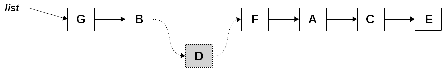
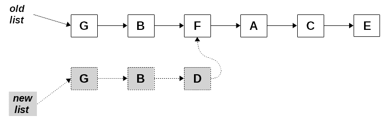
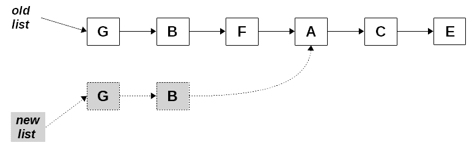
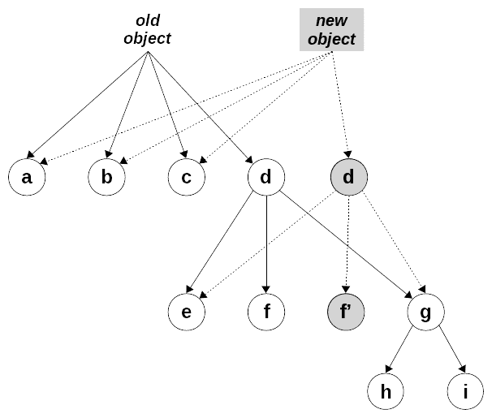

# 十、确保纯度——不变性

在第四章,*行为—**纯函数,当我们认为纯函数和他们的优势,我们发现副作用,如修改收到参数或全局变量是杂质的频繁的原因。 现在，在几章讨论了 FP 的许多方面和工具之后，让我们谈谈*不变性*的概念:如何以这样一种方式处理对象，即意外修改它们将变得更加困难，甚至是不可能。*

我们不能强迫开发人员工作在一个安全的、谨慎的方式,但是如果我们找到一些方法,使数据结构不变的(这意味着它们不能直接改变,除非通过一些接口,不允许我们修改原始数据和产生新对象而不是),然后我们会有一个可行的解决方案。 在本章中，我们将讨论两种不同的处理不可变对象和数据结构的方法:

*   **基本的 JavaScript 方法**，例如冻结对象，加上克隆来创建新的对象，而不是修改现有的对象
*   **持久的数据结构**，有方法允许我们更新它们，而不改变原来的，也不需要克隆任何东西，为更高的性能

A warning: the code in this chapter isn't production-ready; I wanted to focus on the main points and not on all the myriad details having to do with properties, getters, setters, lenses, prototypes, and more that you should take into account for a full, bulletproof, solution. For actual development, I'd very much recommend going with a third-party library, but only after checking that it really applies to your situation. We'll be recommending several such libraries, but of course, there are many more that you could use.

# 采用简单的 JavaScript 方法

副作用的最大原因之一是函数可能修改全局对象或其参数。 所有非基元对象都以引用的形式传递，所以如果/当你修改它们时，原始对象将会被改变。 如果我们想要停止这种情况(而不只是依赖于开发者的善意和干净的编码)，我们可能需要考虑一些简单的 JavaScript 技术来阻止这些副作用:

*   避免使用突变函数直接修改所应用的对象
*   使用`const`声明防止变量被更改
*   冻结对象，使它们不能以任何方式被修改
*   创建(已更改的)对象克隆，以避免修改原始对象
*   使用 getter 和 setter 来控制更改了什么以及如何更改
*   使用功能概念透镜来访问和设置属性

让我们更详细地了解每种技术。

# 赋值函数

意外问题的一个常见来源是这样一个事实:一些 JavaScript 方法实际上是修改底层对象的变异器。 在这种情况下，仅仅使用它们，你就会产生副作用，你甚至可能没有意识到。 数组是问题最基本的来源，而麻烦的方法列表并不短:

*   `copyWithin()`允许复制数组中的元素。
*   `fill()`用给定值填充数组。
*   `push()`和`pop()`允许在数组的末尾添加或删除元素。
*   `shift()`和`unshift()`的工作方式与`push()`和`pop()`相同，但在数组的开头。
*   `splice()`允许你添加或删除数组中的任何元素。
*   `reverse()`和`sort()`对数组进行就地修改，将其元素反转或排序。

Refer to [https://developer.mozilla.org/en-US/docs/Web/JavaScript/Reference/Global_Objects/Array#Mutator_methods](https://developer.mozilla.org/en-US/docs/Web/JavaScript/Reference/Global_Objects/Array#Mutator_methods) for more on each method.

，*behaviour proper - Pure Functions*:*Argument mutation*

```js
const maxStrings = a => a.sort().pop();

let countries = ["Argentina", "Uruguay", "Brasil", "Paraguay"];

console.log(maxStrings(countries)); // "Uruguay"
console.log(countries); // ["Argentina", "Brasil", "Paraguay"]
```

我们的`maxStrings()`函数返回数组中的最大值，但也修改原始数组; 这是`sort()`和`pop()`突变体功能的副作用。 在这种情况和其他情况下，您可能会生成一个数组的副本，然后使用它:

```js
const maxStrings2 = a => [...a].sort().pop();

const maxStrings3 = a => a.slice().sort().pop();

let countries = ["Argentina", "Uruguay", "Brasil", "Paraguay"];

console.log(maxStrings2(countries)); // *"Uruguay"* console.log(maxStrings3(countries)); // *"Uruguay"*

console.log(countries); // *["Argentina", "Uruguay", "Brasil", "Paraguay"] - unchanged*
```

我们的`maxStrings()`函数的两个新版本现在都是函数式的，没有副作用，因为 mutator 方法已应用于原始参数的副本。

当然，setter 方法也是变异器，在逻辑上会产生副作用，因为它们几乎可以做任何事情。 如果是这种情况，你将不得不去寻找一些其他的解决方案，这将在本章的后面描述。

# 常量

如果由于使用一些 JavaScript 方法而没有发生突变，那么我们可能想尝试使用`const`定义，但这是行不通的。 在 JavaScript 中，`const`定义意味着对对象或数组的*引用不能改变(你不能给它分配不同的对象)，但你仍然可以修改对象本身的属性。 我们可以在以下代码中看到这一点:*

```js
const myObj = {d: 22, m: 9};
console.log(myObj);
// {d: 22, m: 9}

myObj = {d: 12, m: 4};
// ***Uncaught TypeError: Assignment to constant variable.***

myObj.d = 12; // *but this is fine!*
myObj.m = 4;
console.log(myObj);
// {d: 12, m: 4}
```

你不能通过给`myObj`赋一个新值来修改它的值，但是你可以修改`myObj`的当前值，以便只有对一个对象的引用是常量，而不是对象本身的值。 (顺便说一下，这也会发生在数组中。) 因此，如果你决定在任何地方都使用`const`，那么只有对对象和数组进行直接赋值才是安全的。 更温和的副作用，如更改属性或数组元素，仍然是可能的，因此这不是一个解决方案。

有两种方法可以起作用:使用*冷冻*提供不可修改的结构，以及*克隆*产生修改过的新结构。 这些可能不是禁止更改对象的最佳方法，但可以作为临时解决方案。 让我们更详细地看看它们，从冻结开始。

# 冻结

如果我们想要避免程序员意外或自愿修改对象的可能性，冻结它是一个有效的解决方案。 在对象被冻结之后，任何修改它的尝试都会无声地失败——javascript 不会报告错误或抛出异常，但它也不会改变对象。 在下面的例子中，如果我们尝试做与上一节相同的更改，它们将不会有任何效果，`myObj`将不变:

```js
const myObj = { d: 22, m: 9 };
Object.freeze(myObj);

myObj.d = 12; // *won't have effect...* myObj.m = 4;

console.log(myObj);
// Object {d: 22, m: 9}
```

Don't confuse freezing with sealing: `Object.seal()`, when applied to an object, prohibits adding or deleting properties to it. This means that the structure of the object is immutable, but the attributes themselves can be changed. `Object.freeze()` includes not only sealing properties but also making them unchangeable. See [https://developer.mozilla.org/en/docs/Web/JavaScript/Reference/Global_Objects/Object/seal](https://developer.mozilla.org/en/docs/Web/JavaScript/Reference/Global_Objects/Object/seal) and [https://developer.mozilla.org/en/docs/Web/JavaScript/Reference/Global_Objects/Object/freeze](https://developer.mozilla.org/en/docs/Web/JavaScript/Reference/Global_Objects/Object/freeze) for more on this.

这种解决方案只有一个问题:冻结对象是一个*浅*操作，它冻结属性本身，类似于`const`声明所做的。 如果任何属性本身是对象或数组，并将其他对象或数组作为属性，等等，仍然可以修改它们。 这里我们只考虑数据; 你可能也想冻结，比如说，函数，但在大多数情况下，你想保护的是数据:

```js
let myObj3 = {
 d: 22,
 m: 9,
 o: {c: "MVD", i: "UY", f: {a: 56}}
};

Object.freeze(myObj3);
console.log(myObj3);  // *{d:22, m:9, o:{c:"MVD", i:"UY", f:{ a:56}}}*
```

这只是部分成功，我们可以看到，当我们尝试改变一些属性:

```js
myObj3.d = 8888;      // *wont' work, as earlier*
myObj3.o.f.a = 9999;  // *oops, does work!!*
console.log(myObj3);  // *{d:22, m:9, o:{c:"MVD", i:"UY", f:{ **a:9999** }}}*
```

修改`myObj3.d`无效，因为对象是冻结的，但不能扩展到`myObj3`内的对象，所以更改`myObj3.o.f.a`有效。

如果我们想为对象实现真正的不变性，我们需要编写一个程序来冻结对象的所有级别。 幸运的是，通过应用递归很容易做到这一点。 (我们在前面的第 9 章[中*遍历树结构*部分看到了递归的类似应用。](09.html)，*设计函数——递归*。) 主要的想法是冻结对象本身，然后递归地冻结它的每个属性。 我们必须确保只冻结对象本身的属性; 我们不应该打乱对象的原型，例如:

```js
const deepFreeze = obj => {
  if (obj && typeof obj === "object" && !Object.isFrozen(obj)) {
 Object.freeze(obj);
    Object.getOwnPropertyNames(obj).forEach(prop => deepFreeze(obj[prop]));
  }

  return obj;
};
```

注意，与`Object.freeze()`的工作方式相同，`deepFreeze()`也将物体*冻结在*的位置。 我希望保留操作的原始语义，以便返回的对象始终是原始对象。 如果我们想以一种更纯粹的方式工作，我们应该首先复制原始对象(我们将在下一节学习如何做到这一点)，然后冻结它。

一个可能存在的小问题仍然存在，但会带来一个非常糟糕的结果:如果一个对象包含了对自身的引用，会发生什么? 如果我们跳过冻结已经冻结的对象，就可以避免这种情况:向后循环引用将被忽略，因为它们引用的对象已经被冻结了。 所以，我们写的逻辑解决了这个问题，没有什么可做的了!

如果我们对一个对象应用`deepFreeze()`，我们可以安全地将它传递给任何函数，因为我们知道根本没有办法修改它。 您还可以使用这个属性来测试函数是否修改了它的参数:深度冻结它们，调用函数，如果函数依赖于修改它的参数，它将无法工作，因为更改将被无声地忽略。 那么，如果函数包含接收到的对象，我们如何从函数返回结果呢? 这可以用很多方法来解决。 一个简单的使用克隆，我们将看到。

Check the *Questions* section at the end of this chapter for another way of freezing an object by means of proxies.

在本节中，我们讨论了一种可以用来避免对象更改的方法。 现在，让我们来看一种涉及克隆的替代方法。

# 克隆和突变

如果不允许更改对象，则必须创建一个新对象。 例如，如果您使用 Redux，那么 reducer 是一个函数，它接收当前状态和操作(本质上是一个具有新数据的对象)并生成新状态。 修改当前状态是完全禁止的，我们可以通过始终使用冻结对象来避免这个错误，正如我们在前一节中看到的那样。 为了满足减速机的要求，我们必须能够克隆原来的状态，并根据收到的动作进行变异。 结果对象将成为新的状态。

You may want to revisit the *More general looping* section of [Chapter 5](10.html), *Programming Declaratively – A Better Style*, where we wrote a basic `objCopy()` function that provides a different approach from the one shown here.

为了四舍五入，我们还应该冻结返回的对象，就像我们对原始状态所做的那样。 但让我们从头开始:我们如何克隆一个对象? 当然，您总是可以手工操作，但在处理大型、复杂的对象时，这并不是您真正想要考虑的事情。 例如，如果你想克隆`oldObject`来生成`newObject`，那么手动操作就会包含大量代码:

```js
let oldObject = {
  d: 22,
  m: 9,
  o: {c: "MVD", i: "UY", f: {a: 56}}
};

let newObject = {
  d: oldObject.d,
  m: oldObject.m,
  o: {c: oldObject.o.c, i: oldObject.o.i, f: {a: oldObject.o.f.a}}
};
```

这种手动解决方案显然需要大量工作，而且容易出错; 您可能很容易忘记某个属性! 至于更多的自动解决方案，在 JavaScript 中有几种简单的复制数组或对象的方法，但它们都有同样的*shallow*问题。 你可以用`Object.assign()`或者使用扩展(spread)来做一个对象的(浅)拷贝:

```js
let newObject1 = Object.assign({}, myObj);
let newObject2 = {...myObj};
```

要创建一个(同样是浅的)数组副本，你可以使用`slice()`或扩展，正如我们在本章前面的*Mutator 函数*小节中看到的:

```js
let myArray = [1, 2, 3, 4];
let newArray1 = myArray.slice();
let newArray2 = [...myArray];
```

这些解决方案有什么问题? 如果一个对象或数组包含对象(它本身可能包含对象)，我们就会遇到与冻结时相同的问题:对象是通过引用复制的，这意味着对新对象的更改也意味着对旧对象的更改:

```js
let oldObject = {
  d: 22,
  m: 9,
  o: { c: "MVD", i: "UY", f: { a: 56 } }
};
let newObject = Object.assign({}, oldObject);

newObject.d = 8888;
newObject.o.f.a = 9999; 
console.log(newObject);
// {d:8888, m:9, o: {c:"MVD", i:"UY", f: {a:9999}}} -*- ok*

console.log(oldObject);
// {d:22, m:9, o: {c:"MVD", i:"UY", f: {a:9999}}} -- *oops!!*
```

在这种情况下，请注意当我们改变`newObject`的一些属性时发生了什么。 更改`newObject.d`可以正常工作，但更改`newObject.o.f.a`也会影响`oldObject`，因为`newObject.o`和`oldObject.o`实际上是对同一个对象的引用。

有一个基于 JSON 的简单解决方案。 如果我们`stringify()`初始对象，然后`parse()`结果，我们将得到一个新对象，它与旧对象完全分离:

```js
const jsonCopy = obj => JSON.parse(JSON.stringify(obj));
```

通过使用`JSON.stringify()`，我们可以将对象转换为字符串。 然后，`JSON.parse()`从该字符串创建一个(新)对象; 简单! 这对数组和对象都有效，但有一个问题。 如果对象的任何属性都有构造函数，则不会调用它们:结果总是由普通的 JavaScript 对象组成。 我们可以很简单地用`Date()`来表示:

```js
let myDate = new Date();
let newDate = jsonCopy(myDate);
console.log(typeof myDate, typeof newDate); // ***object string***
```

`myDate`是一个对象，`newDate`是一个带有值的字符串，`"2019-11-08T01:32:56.365Z"`是我们进行转换时的当前日期和时间。

我们可以做一个递归的解决方案，就像我们做深度冻结一样，逻辑是非常相似的。 当我们发现一个属性实际上是一个对象时，我们调用相应的构造函数:

```js
const deepCopy = obj => {
  let aux = obj;
  if (obj && typeof obj === "object") {
 aux = new obj.constructor();
    Object.getOwnPropertyNames(obj).forEach(
      prop => (aux[prop] = deepCopy(obj[prop]))
    );
  }

  return aux;
};
```

当我们发现一个对象的属性实际上是另一个对象时，我们在继续之前调用它的构造函数。 这解决了我们在日期或任何对象上发现的问题! 如果我们运行前面的代码，但是使用`deepCopy()`而不是`jsonCopy()`，我们将得到`object object`作为输出，正如它应该得到的那样。 如果我们检查类型和构造函数，一切都会匹配。 此外，数据改变实验现在也可以正常工作了:

```js
let oldObject = {
  d: 22,
  m: 9,
  o: { c: "MVD", i: "UY", f: { a: 56 } }
};

let newObject = deepCopy(oldObject);
newObject.d = 8888;
newObject.o.f.a = 9999;

console.log(newObject);
// {d:8888, m:9, o:{c:"MVD", i:"UY", f:{a:9999}}}

console.log(oldObject);
// {d:22, m:9, o:{c:"MVD", i:"UY", f:{a:56}}} -- *unchanged!*
```

让我们看看最后几行。 修改`newObject`对`oldObject`完全没有影响，所以两个对象是完全分离的。

既然我们知道了如何复制对象，我们可以按照以下步骤操作:

1.  接收一个(冻结的)对象作为参数
2.  把它复制一份，这样就不会被冻结了
3.  从该副本中获取我们可以在代码中使用的值
4.  可以随意修改副本
5.  冻结它
6.  作为函数的结果返回它

所有这些都是可行的，尽管有点麻烦。 那么，让我们添加一些函数，它们将有助于把所有东西放在一起。

# getter 和 setter

按照上一节末尾提供的步骤进行操作时，您会注意到，每次想要更新字段时，事情就会变得很麻烦，而且很容易出错。 让我们使用一种常见的技术来添加一对函数、getter 和 setter。 这些措施如下:

*   *getter*可用于从冻结对象中获取值，方法是将冻结对象解冻，以便使用它们。
*   *setters*允许你修改对象的任何属性。 您可以通过创建一个新的和更新的版本来实现这一点，而不改变原始版本。

让我们来构建 getter 和 setter。

# 得到一个属性

回到*获得一个对象的一个属性部分第六章,*生产函数高阶函数*,`getField()`我们写一个简单的函数,它可以处理对象的一个属性。 (见那一章的问题*6.5*，关于缺失的同伴`setField()`功能。) 让我们看看如何编码它。 我们可以有一个简单的版本，如下所示:*

```js
const getField = attr => obj => obj[attr];
```

我们甚至可以做得更好，使用咖喱，这样我们就有了一个更普遍的版本:

```js
const getField = curry((attr, obj) => obj[attr]);
```

我们可以通过组合一系列`getField()`调用的应用来从对象中获得一个深层属性，但这将相当麻烦。 相反，让我们创建一个函数，它将接收一个*路径*——一个字段名数组——并返回对象的相应部分，如果路径不存在则返回 undefined。 在这里使用递归是合适的，可以简化编码! 遵守以下准则:

```js
const getByPath = (arr, obj) => {
  if (arr[0] in obj) {
    return arr.length > 1
      ? getByPath(arr.slice(1), obj[arr[0]])
      : deepCopy(obj[arr[0]]);
  } else {
    return undefined;
  }
};
```

基本上，我们在路径中查找第一个字符串，看看它是否存在于对象中。 如果没有，则操作失败，因此返回`undefined`。 如果成功，路径中仍然有更多字符串，我们使用递归继续挖掘对象; 否则，返回属性值的深层副本。

一旦一个物体被冻结，你就不能*解冻它，所以我们必须重新复制它; `deepCopy()`是适合做这件事的。 让我们试试我们的新函数:*

```js
let myObj3 = {
  d: 22,
  m: 9,
  o: {c: "MVD", i: "UY", f: {a: 56}}
};
deepFreeze(myObj3);

console.log(getByPath(["d"], myObj3)); // 22
console.log(getByPath(["o"], myObj3)); // {c: "MVD", i: "UY", f: {a: 56}}
console.log(getByPath(["o", "c"], myObj3)); // "MVD"
console.log(getByPath(["o", "f", "a"], myObj3)); // 56
```

我们还可以检查返回的对象是否被冻结:

```js
let fObj = getByPath(["o", "f"], myObj3);
console.log(fObj); // {a: 56}

fObj.a = 9999;
console.log(fObj); // {a: 9999} *-- it's not frozen* 
```

在这里，你可以看到我们可以直接更新`fObj`对象，所以这意味着它没有冻结。 现在我们已经编写了 getter，接下来可以创建 setter。

# 通过路径设置属性

现在，我们可以编写一个类似的`setByPath()`函数，它将采用一个路径、一个值和一个对象并更新一个对象。 这是*而不是*一个纯函数，但我们会用它来表示一个纯函数; 等着瞧吧! 以下是代码:

```js
const setByPath = (arr, value, obj) => {
  if (!(arr[0] in obj)) {
    obj[arr[0]] =
      arr.length === 1 ? null : Number.isInteger(arr[1]) ? [] : {};
  }

  if (arr.length > 1) {
    return setByPath(arr.slice(1), value, obj[arr[0]]);

  } else {
    obj[arr[0]] = value;
    return obj;
  }
};
```

在这里，我们使用递归进入对象，在需要时创建新的属性，直到完成整个路径。 创建属性时一个重要的细节是我们需要一个数组还是一个对象。 我们可以通过检查路径中的下一个元素来确定:如果它是一个数字，那么我们需要一个数组; 否则，一个对象就可以了。 当我们到达路径的末端时，我们简单地分配新的给定值。

If you like this way of doing things, you should check out the *seamless-immutable* library, which works in this fashion. The *seamless* part of the name alludes to the fact that you still work with normal objects—albeit frozen—which means you can use `map()`, `reduce()`, and so on. You can read more about this at [https://github.com/rtfeldman/seamless-immutable](https://github.com/rtfeldman/seamless-immutable).

现在，你可以编写一个函数，它将能够接受一个冻结的对象，并更新其中的属性，返回一个新的，同样冻结的对象:

```js
const updateObject = (arr, obj, value) => {
  let newObj = deepCopy(obj);
  setByPath(arr, value, newObj);
  return deepFreeze(newObj);
};
```

让我们看看它是如何工作的。 为了做到这一点，我们将在我们一直使用的`myObj3`对象上运行几个更新:

```js
let new1 = updateObject(["m"], myObj3, "sep");
// {d: 22, m: "sep", o: {c: "MVD", i: "UY", f: {a: 56}}};

let new2 =updateObject(["b"], myObj3, 220960);
// {d: 22, m: 9, o: {c: "MVD", i: "UY", f: {a: 56}}, b: 220960};

let new3 =updateObject(["o", "f", "a"], myObj3, 9999);
// {d: 22, m: 9, o: {c: "MVD", i: "UY", f: {a: 9999}}};

let new4 =updateObject(["o", "f", "j", "k", "l"], myObj3, "deep");
// {d: 22, m: 9, o: {c: "MVD", i: "UY", f: {a: 56, j: {k: "deep"}}}};
```

有了这对函数，我们终于找到了一种保持不变的方法:

*   物体必须从一开始就被冻结
*   使用`getByPath()`从对象中获取数据
*   设置数据使用`updateObject()`，内部使用`setByPath()`

在本节中，我们学习了如何以保持对象不变的方式从对象获取和设置值。 现在让我们来看看这个概念的一个变体——*镜片*——它不仅能让我们获得和设置值，还能让我们对数据应用一个函数。

# 镜头

还有另一种获取和设置值的方法，叫做*optics*，包括*lenses*and*prisms*(我们将在本章稍后讨论)。 眼镜是什么? 它们是在物体的给定点上*聚焦*(另一个光学术语!)的功能方式，这样我们就可以以一种不变的方式访问或修改它的值。 在本节中，我们将看一些使用镜头的例子，并考虑两种实现:首先，一个简单的基于对象的实现，然后是一个更完整的实现，由于我们将使用一些技术，这个实现很有趣。

Several libraries provide full implementations of lenses that are production-ready and more complete than what we saw in this chapter; for example, check out Ramda: [http://ramdajs.com/docs/#lens](http://ramdajs.com/docs/#lens.)

# 使用隐形眼镜

这两种实现将共享基本功能，所以让我们先跳过什么是透镜或者它们是如何构建的，看看它们的使用示例。 首先，让我们创建一个示例对象，我们将使用它:关于作者(他的名字听起来很熟悉)和他的书的一些数据:

```js
const author = {
  user: "fkereki",
  name: {
    first: "Federico",
    middle: "",
    last: "Kereki",
  },
  books: [
    {name: "Google Web Toolkit", year: 2010},
    {name: "Functional Programming", year: 2017},
    {name: "Javascript Cookbook", year: 2018},
  ],
};
```

我们假定存在几个函数; 我们将在接下来的小节中看到它们是如何实现的。 透镜依赖于给定属性的 getter 和 setter，我们可以直接使用`lens()`或`lensProp()`来构建一个，以简化代码。 让我们为`user`属性创建一个镜头:

```js
const lens1 = lens(getField("user"), setField("user"));
```

这定义了一个聚焦于用户属性的镜头。 由于这是一个常见的操作，它也可以写得更简洁:

```js
const lens1 = lensProp("user");
```

这两个镜头都允许我们聚焦于任何物体的`user`属性，我们使用它们。 对于 lens，有三种基本操作，我们将遵循传统，使用大多数(如果不是全部)库遵循的名称:

*   `view()`:用于访问属性值
*   `set()`:修改属性值
*   `over()`:用于对属性应用函数并更改其值

这些函数是 curry 过的(正如我们在前一章看到的)。 因此，要访问`user`属性，我们可以这样写:

```js
console.log(view(lens1, author));
console.log(view(lens1)(author));
/*
 ***fkereki**, in both cases*
*/
```

`view()`函数以一个镜头作为其第一个参数。 当它被应用到一个物体上时，它会产生透镜聚焦的值——在我们的例子中，就是`user`属性。 当然，你可以应用`view()`函数序列来深入对象:

```js
console.log(view(lensProp("last"), view(lensProp("name"), author)));
/*
 *Kereki*
*/
```

而不是写这样的一系列的`view()`调用，我们将组成镜头，以便我们可以更深入地关注一个对象。 让我们看最后一个例子，它展示了如何访问数组:

```js
const lensBooks = lensProp("books");
console.log(
  "The author wrote " + view(lensBooks, author).length + " book(s)"
);
/*
 *The author wrote 3 book(s)*
*/
```

将来，如果在`author`结构中有任何更改，`lensBooks`定义中的一个简单更改就足以保持其余代码不变。

You can also use lenses to access other structures: refer to question *10.5* for a way to use lenses with arrays, and question *10.6* for how to use lenses so that they work with maps.

接下来，`set()`功能允许我们设置镜头的焦距值:

```js
console.log(set(lens1, "FEFK", author));
/*
 ***user: "FEFK",***
 *name: {first: "Federico", middle: "", last: "Kereki"},*
 *books: [*
 *{name: "Google Web Toolkit", year: 2010},*
 *{name: "Functional Programming", year: 2017},*
 *{name: "Javascript Cookbook", year: 2018},*
 *],*
}
*/
```

`set()`的结果是一个值改变了的新对象。 使用`over()`类似于返回一个新对象，但在这种情况下，该值是通过对其应用一个映射函数来改变的:

```js
const newAuthor = over(lens1, x => x + x + x, author);
console.log(newAuthor);
/*
 ***user: "fkerekifkerekifkereki",***
 *name: {first: "Federico", middle: "", last: "Kereki"},*
 *books: [*
 *{name: "GWT", year: 2010},*
 *{name: "FP", year: 2017},*
 *{name: "CB", year: 2018},*
 *],*
}
*/
```

镜片还有更多的功能，但我们现在只讨论这三个。

Take a look at question *10.4* for an interesting idea on how to use lenses to access *virtual attributes* that don't actually exist in an object.

为了完成本节，我建议查看一些第三方的 optics 库，以了解所有可用的功能。 现在我们已经对使用镜头时的预期有了一个想法，让我们学习如何实现它们。

# 用物体实现镜头

实现一个 lens 最简单的方法是用一个只有两个属性的对象来表示它:getter 和 setter。 在这种情况下，我们会有这样的东西:

```js
const lens = (getter, setter) => ({getter, setter});
```

这很容易理解:给定一个 getter 和 setter，`lens()`只创建一个具有这两个属性的对象。 根据这个定义，`lensProp()`将如下:

```js
const lensProp = attr => lens(getField(attr), setField(attr));
```

第一个函数，`lensProp()`，通过使用`getField()`和`setField()`创建一个 getter/setter 对; 非常简单。 现在我们有了透镜，如何实现我们在前一节中看到的三个基本功能呢? 查看属性只需要应用 getter:

```js
const view = curry((lens, obj) => lens.getter(obj));
```

为了与我们已经使用过的其他函数保持一致，我们将应用 curry 法。 类似地，设置属性就是应用 setter:

```js
const set = curry((lens, newVal, obj) => lens.setter(newVal, obj));
```

最后，将一个映射函数应用到一个属性是一种*二对一*操作:我们使用 getter 来获取属性的当前值，我们将函数应用到它，并使用 setter 来存储计算结果:

```js
const over = curry((lens, mapfn, obj) =>
 lens.setter(mapfn(lens.getter(obj)), obj)
);
```

现在我们可以做所有的三个手术，我们有工作的镜头! 作文呢? 镜片有一个特殊的特点:它们是向后组合的，或从左到右组合的，所以从最通用的开始，以最具体的结束。 这显然与直觉相悖:我们将在下一节中更详细地了解这一点，但现在，我们将保持传统:

```js

const composeTwoLenses = (lens1, lens2) => ({
  getter: obj => lens2.getter(lens1.getter(obj)),
  setter: curry((newVal, obj) =>
    lens1.setter(lens2.setter(newVal, lens1.getter(obj)), obj)
  ),
});
```

代码令人印象深刻，但并不难理解。 两个镜头组合的 getter 是使用第一个镜头的 getter，然后将第二个镜头的 getter 应用到那个结果的结果。 合成的 setter 稍微复杂一点，但遵循同样的路线; 你能看到它是怎么工作的吗? 现在，我们可以很容易地组合镜头; 让我们从一个虚构的荒谬的物体开始:

```js
const deepObject = {
  a: 1,
  b: 2,
  c: {
    d: 3,
    e: {
      f: 6,
      g: {i: 9, j: {k: 11}},
      h: 8,
    },
  },
};
```

现在，我们可以定义几个透镜:

```js
const lC = lensProp("c");
const lE = lensProp("e");
const lG = lensProp("g");
const lJ = lensProp("j");
```

我们可以尝试用几种方法组合我们的新镜头，只是为了多样化，并检查一切是否正常:

```js
const lJK = composeTwoLenses(lJ, lK);
const lGJK = composeTwoLenses(lG, lJK);
const lEGJK = composeTwoLenses(lE, lGJK);
const lCEGJK1 = composeTwoLenses(lC, lEGJK);
console.log(view(lCEGJK1)(deepObject));

const lCE = composeTwoLenses(lC, lE);
const lCEG = composeTwoLenses(lCE, lG);
const lCEGJ = composeTwoLenses(lCEG, lJ);
const lCEGJK2 = composeTwoLenses(lCEGJ, lK);
console.log(view(lCEGJK2)(deepObject));

/*
    11 *both times*
*/
```

用`lCEGJ1`，我们合成了一些镜头，从后者开始。 对于`lCEGJ2`，我们从镜片开始，但结果是一样的。 现在，让我们试着设置一些值。 我们希望得到`k`属性并将其设置为`60`。 我们可以通过使用我们刚刚应用的镜头来做到这一点:

```js
const setTo60 = set(lCEGJ1, 60, deepObject);
/*
 *{a: 1, b: 2, c: {d: 3, e: {f: 6, g: {i: 9, j: { **k: 60** }}, h: 8}}}*
*/
```

合成的镜头效果很好，值也改变了。 (同样，返回一个新对象; 如我们所愿，原始文件没有修改。) 最后，让我们验证我们可以用我们的镜头做`over()`，并尝试复制`k`值，使它成为`22`。 为了多样化，让我们使用另一个组合镜头，尽管我们知道它的工作方式是相同的:

```js
const setToDouble = over(lCEGJK2, x => x * 2, deepObject);
/*
 *{a: 1, b: 2, c: {d: 3, e: {f: 6, g: {i: 9, j: { **k: 22** }}, h: 8}}}*
*/
```

现在，我们已经学习了如何以一种简单的方式实现镜头。 但是，让我们考虑用另一种方法来实现相同的目标，即使用实际函数来表示镜头。 这将允许我们以标准的方式进行合成，而不需要任何特殊的镜头功能。

# 用函数实现镜头

透镜与物体之前的实现效果很好，但我们想看看不同的方式来做事情，让我们工作更先进的功能理念。 这将涉及一些概念,我们将更详细地分析 12 章,*建筑更好的容器——*功能数据类型,但在这里,我们将使用我们所需要的,所以你不需要去读这一章了! 我们的镜头将以与前面的镜头相同的方式工作，除了它们将是函数，我们将能够不需要特殊的组合代码来组合它们。

这里的关键概念是什么? 镜头将一个函数,基于一对 getter 和 setter,将构造一个容器*(实际上一个对象,但是我们去容器名称)`value`属性和`map`方法(在【显示】第十二章,*建筑更好的容器——功能数据类型*, 我们将看到这是一个*函子*，但你现在不需要知道)。 通过使用特定的映射方法，我们将实现`view()`、`set()`和`over()`函数。 我们的`lens()`功能如下。 稍后我们将对此进行详细解释:*

```js
const lens = (getter, setter) => fn => obj =>
  fn(getter(obj)).map(value => setter(value, obj));
```

让我们考虑一下它的参数:

*   `getter`、`setter`参数同前; 我们甚至可以使用本章前面使用过的相同的`lensProp()`函数。
*   `fn`功能是使一切工作的魔汁:取决于我们想对镜头做什么，我们将提供一个特定的功能-稍后对此有更多介绍!
*   `obj`参数是我们想要应用镜头的对象。

让我们编写`view()`函数。 为此，我们需要一个辅助类`Constant`，给定一个值`v`，它会生成一个具有该值的容器，还有一个`map`函数，返回相同的容器:

```js
class Constant {
  constructor(v) {
    this.value = v;
    this.map = () => this;
  }
}
```

有了这个，我们现在可以编码`view()`:

```js
const view = curry(
  (lensAttr, obj) => lensAttr(x => new Constant(x))(obj).value
);

const user = view(lensProp("user"), author);
/*
    ***fkereki***
*/
```

这里发生了什么? 让我们一步一步来; 这有点棘手!

1.  我们使用`lensProp()`创建一个聚焦于用户属性的镜头。
2.  我们的`view()`函数将常量构建函数传递给`lens()`。
3.  我们的`lens()`函数使用 getter 访问 author 对象中的 user 属性。
4.  然后，我们接收到的值用于创建常量容器。
5.  调用了`map()`方法——该方法返回完全相同的容器。
6.  访问容器的 value 属性，这是 getter 在*步骤 3*中检索到的值; 哇!

在此基础上，让我们进入`set()`和`over()`，这将需要不同的辅助功能，以创建值可能不同的容器:

```js
class Variable {
  constructor(v) {
    this.value = v;
    this.map = fn => new Variable(fn(v));
  }
}
```

在这种情况下(相对于`Constant`对象)，`map()`方法确实做了一些事情:当提供一个函数时，它将其应用于容器的值，并返回一个新的`Variable`对象和结果值。 `set()`功能可轻松实现:

```js
const set = curry(
  (lensAttr, newVal, obj) =>
    lensAttr(() => new Variable(newVal))(obj).value
);

const changedUser = set(lensProp("user"), "FEFK", author);
/*
*{*
 ***user: "FEFK",***
 *name: {first: "Federico", middle: "", last: "Kereki"},*
 *books: [*
 *{name: "GWT", year: 2010},*
 *{name: "FP", year: 2017},*
 *{name: "CB", year: 2018},*
 *],*
*};*
*/
```

在这种情况下，当镜头调用容器的`map()`方法时，它将产生一个带有新值的新容器，这就产生了所有的不同。 为了理解它是如何工作的，遵循我们在`get()`中看到的 6 个步骤——唯一的区别是在*步骤 5*，在这里产生了一个新的、不同的容器。

既然我们已经完成了这段代码(确实很棘手!)，`over()`函数就很简单了，唯一的区别是，不是映射到给定的值，而是使用提供的`mapfn`函数来计算容器的新值:

```js
const over = curry(
  (lensAttr, mapfn, obj) =>
    lensAttr(x => new Variable(mapfn(x)))(obj).value
);

const newAuthor = over(lensProp("user"), x => x + x + x, author);
/*
 ***user: "fkerekifkerekifkereki",***
 *name: {first: "Federico", middle: "", last: "Kereki"},*
 *books: [*
 *{name: "GWT", year: 2010},*
 *{name: "FP", year: 2017},*
 *{name: "CB", year: 2018},*
 *],*
}
*/
```

如您所见，`set()`和`over()`之间的区别在于，在前者的情况下，您提供值来替换原始值，而在后者的情况下，您提供一个函数来计算新值。 除此之外，两者都很相似。

最后，让我们验证`compose()`可以应用到我们的基于函子的镜片上:

```js
const lastName = view(
 compose(
 lensProp("name"),
 lensProp("last")
 )
)(author);
/*
    ***Kereki***
*/
```

在这里,我们创建了两个个人镜头`name`和`last`,我们由同一`compose()`功能,我们开发了在[第八章](08.html),*连接功能——流水线和组成*。 使用这个复合镜头，我们聚焦于作者的姓氏，没有任何问题，所以一切都如预期的那样工作。

It seems to go against logic that lenses should be composed from left to right; this appears to be backward. This is something that troubles developers, and if you Google for an explanation, you'll find many. To combat this question on your own, I suggest spelling out how `compose()` works in full—two functions will be enough—and then substitute the definitions of lenses; you'll see why and how everything works out.

既然我们已经研究了透镜，我们可以继续研究棱镜，另一种光学工具。

# 棱镜

镜片，正如我们在前面的章节中看到的，对于使用*产品*类型是有用的。 然而，棱镜在处理*sum*类型时是有用的。 但它们是什么呢? (我们将在下一章的*数据类型*小节中更详细地了解产品和联合。) 其思想是，产品类型总是基于相同的选项构建，比如来自类的对象，而和类型可能具有不同的结构——例如，额外的或缺少的属性。 当你使用透镜时，你假设你要应用它的物体有一个已知的结构，没有变化，但如果物体有不同的结构，你会用什么呢? 答案是棱镜。 让我们先来看看它们是如何使用的; 然后，我们将查看它们的实现。

# 使用棱镜

使用棱镜与使用镜头相似，除了属性不存在时的情况。 让我们看一看前一节中的一个例子:

```js
const author = {
  user: "fkereki",
  name: {
    first: "Federico",
    middle: "",
    last: "Kereki"
  },
  books: [
    { name: "GWT", year: 2010 },
    { name: "FP", year: 2017 },
    { name: "CB", year: 2018 }
  ]
};
```

如果我们想要使用 prism 访问`user`属性，我们可以这样写:不要担心细节; 稍后我们将看到实际的实现:

```js
const pUser = prismProp("user");

console.log(review(pUser, author).toString()); 

/*
 ***fkereki***
*/
```

在这里，我们使用一个`prismProp()`函数定义一个棱镜，该函数与之前的`lensProp()`函数相似。 然后，我们使用带有`preview()`功能的棱镜，类似于带有`get()`镜片的棱镜，效果与我们使用过镜片的棱镜一样; 没有惊喜。 如果我们要求一个不存在的`pseudonym`属性会发生什么? 让我们来看看:

```js
const pPseudonym = prismProp("pseudonym");

console.log(preview(pPseudonym, author).toString());
/*
 ***undefined***
*/
```

到目前为止，我们可能还看不到任何区别，但让我们看看如果我们试图组合缺少几个属性的透镜或棱镜会发生什么。 假设您想使用镜头访问(缺少!)`pseudonym.usedSince`属性，而不采取预防措施并检查属性是否存在。 在这里，您将得到以下输出:

```js
const lPseudonym = lensProp("pseudonym");
const lUsedSince = lensProp("usedSince");

console.log(
  "PSEUDONYM, USED SINCE",
  view(compose(lPseudonym, lUsedSince))(author)
);
/*
    ***TypeError: Cannot read property 'usedSince' of undefined***
 ***.***
 ***. many more error lines, snipped out***
 ***.***
*/
```

另一方面，由于棱镜已经考虑到缺失的值，这将不会造成任何问题，我们只会得到一个`undefined`结果:

```js
const pUsedSince = prismProp("usedSince");

console.log(
  "PSEUDONYM, USED SINCE",
  review(compose(pPseudonym, pUsedSince))(author).toString()
);
/*
 ***undefined***
*/
```

如果我们想设置一个值，会发生什么? `set()`的模拟函数为`review()`; 让我们看看它是如何工作的。 其思想是无论我们指定什么属性都将被设置，当且仅当该属性已经存在时。 因此，如果我们试图改变`user.name`属性，这将工作:

```js
const fullAuthor2 = review(
  compose(prismProp("name"), prismProp("first")),
  "FREDERICK",
  author
);

/*
*{ user: 'fkereki',*
 *name: { **first: 'FREDERICK'**, middle: '', last: 'Kereki' },*
 *books:*
 *[ { name: 'GWT', year: 2010 },*
 *{ name: 'FP', year: 2017 },*
 *{ name: 'CB', year: 2018 } ] }*
*/
```

然而，如果我们试图修改(不存在的)`pseudonym`属性，原始的、未改变的对象将返回:

```js
const fullAuthor3 = review(pPseudonym, "NEW ALIAS", author);

/*
*{ user: 'fkereki',*
 *name: { first: 'Federico', middle: '', last: 'Kereki' },*
 *books:*
 *[ { name: 'GWT', year: 2010 },*
 *{ name: 'FP', year: 2017 },*
 *{ name: 'CB', year: 2018 } ] }*
*/
```

因此，使用 prism 可以处理所有可能的缺失或可选字段。 我们如何实现这个新的光学? 让我们来看看。

# 实现棱镜

我们如何实现棱镜? 我们将从透镜实现中得到提示，并做一些更改。 在获取属性时，我们必须检查正在处理的对象是否为`null`或`undefined`，以及我们想要的属性是否在对象中。 我们可以对原来的`getField()`函数做一些小小的修改:

```js
const getFieldP = curry((attr, obj) =>
  obj && attr in obj ? obj[attr] : undefined
);
```

在这里，我们检查对象和属性是否存在:如果一切正常，则返回`obj[attr]`; 否则，返回 undefined。 `setField()`的变化非常相似:

```js
const setFieldP = curry((attr, value, obj) =>
  obj && attr in obj ? { ...obj, [attr]: value } : { ...obj }
);
```

如果对象和属性都存在，则通过改变属性的值返回一个新对象; 否则，返回对象的副本。 就是这样!

现在我们已经学习了如何以函数式的方式访问对象; 让我们分析可以以非常有效的方式修改的持久数据结构，而不需要原始对象的完整副本。

# 创建持久数据结构

如果你想改变数据结构中的一些东西，你就直接去改变它，你的代码将充满副作用。 另一方面，每次复制完整的结构是浪费时间和空间。 这里有一个与持久数据结构有关的中间地带，如果处理正确，可以让您在高效创建新结构的同时应用更改。

考虑到有许多可能的数据结构可以使用，让我们看几个例子:

*   列表是最简单的数据结构之一
*   使用对象是 JavaScript 程序中非常常见的必要条件
*   处理数组，这将被证明是更难处理的

让我们开始吧!

# 使用列表

让我们考虑一个简单的过程:假设您有一个列表，并且希望向其中添加一个新元素。 你会怎么做? 这里，我们可以假设每个节点都是一个`NodeList`对象:

```js
class ListNode {
  constructor(value, next = null) {
    this.value = value;
    this.next = next;
  }
}
```

可能的列表如下，其中一个`list`变量将指向第一个元素。 看看下面的图表; 你能说出名单上缺少的是什么吗?


Figure 10.1: The initial list

**如果你想添加 D 之间的****和**F(示例列表是音乐家会理解:三分之二的*循环*,一个音乐的概念,但缺少【显示】D 注意),最简单的解决方案是添加一个新节点和改变现有的一个。 这将导致以下结果:****

 ****

Figure 10.2: The list now has a new element – we had to modify an existing one to perform the addition

然而，以这种方式工作显然是非函数式的，很明显我们是在修改数据。 有一种不同的工作方式，那就是创建一个持久的数据结构，在这个结构中，所有的更改(插入、删除和修改)都是单独完成的，注意不要修改现有的数据。 另一方面，如果结构的某些部分可以重用，那么这样做是为了提高性能。 执行持久更新将返回一个新列表，其中一些节点是之前一些节点的副本，但对原始列表没有任何更改。 这可以从下图中看出:



Figure 10.3: The dotted elements show the newly returned list, which shares some elements with the old one

以这种方式更新结构需要复制一些元素，以避免修改原始结构，但列表的一部分是共享的。

当然，我们也将处理更新或删除。 再次从下图所示的列表开始，如果我们想要更新它的第四个元素，解决方案将意味着创建一个列表的新子集，直到并包含第四个元素，同时保持其余元素不变:


Figure 10.4: Our list, with a changed element

移除一个元素也是类似的。 让我们去掉原始列表中的第三个元素**F**，如下:



Figure 10.5: The original list, after removing the third element in a persistent way

使用列表或其他结构总是可以解决的，以提供数据持久性。 现在，将重点放在对我们来说可能是最重要的工作上:处理简单的 JavaScript 对象。 毕竟，所有的数据结构都是 JavaScript 对象，所以如果我们可以处理对象，我们就可以处理其他结构。

# 更新对象

这种方法还可以应用于更常见的需求，如修改对象。 对于 Redux 用户来说，这是一个非常好的想法:可以对一个 reducer 进行编程，以便它将旧状态作为参数接收，并生成一个更新版本，只需要进行最少的更改，而不以任何方式更改原始状态。

假设你有以下对象:

```js
myObj = {
  a: ...,
  b: ...,
  c: ...,
  d: {
    e: ...,
    f: ...,
    g: {
      h: ...,
      i: ...
    }
  }
};
```

让我们假设您想要修改`myObj.d.f`属性的值，但是要以一种持久的方式工作。 我们不需要复制完整的对象(使用我们之前使用的`deepCopy()`函数)，而是可以创建一个新对象，该对象具有与前一个对象相同的几个属性，但为修改后的对象添加新的属性。 这可以从下图中看出:



Figure 10.6: A persistent way of editing an object, that is, by sharing some attributes and creating others

旧对象和新对象共享大部分属性，但有新的**d**和**f**属性，所以在创建新对象时，尽量减少更改。

如果你想用手来做，你就得写，非常麻烦的方式，像下面这样。 大多数属性来自原始对象，但**d**和**d.f**是新的:

```js
newObj = {
  a: myObj.a,
  b: myObj.b,
  c: myObj.c,
  d: {
    e: myObj.d.e,
    f: *the new value*,
    g: myObj.d.g
  }
};
```

在本章的前面，当我们决定使用克隆函数时，我们看到了一些类似的代码。 这里，让我们用另一种解决方法。 事实上，这种更新是可以自动化的:

```js
const setIn = (arr, val, obj) => {
  const newObj = Number.isInteger(arr[0]) ? [] : {};

  Object.keys(obj).forEach(k => {
    newObj[k] = k !== arr[0] ? obj[k] : null;
  });

  newObj[arr[0]] =
    arr.length > 1 ? setIn(arr.slice(1), val, obj[arr[0]]) : val;
  return newObj;
};
```

逻辑是递归的，但不太复杂。 首先，我们在当前级别确定需要哪种类型的对象:数组还是对象。 然后，我们将原始对象中的所有属性复制到新对象中，除了我们正在更改的属性。 最后，我们将该属性设置为给定的值(如果我们已经完成了属性名的路径)，或者使用递归进行更深入的复制。

Note the order of the arguments: first the path, then the value, and finally the object. We are applying the concept of putting the most *stable* parameters first and the most variable last. If you curry this function, you can apply the same path to several different values and objects, and if you fix the path and the value, you can still use the function with different objects.

让我们试试这个逻辑。 我们将从一个无意义的对象开始，但有几个层次，甚至一个对象数组的多样性:

```js
let myObj1 = {
  a: 111,
  b: 222,
  c: 333,
  d: {
    e: 444,
    f: 555,
    g: {
      h: 666,
      i: 777
    },
    j: [{k: 100}, {k: 200}, {k: 300}]
  }
};
```

我们可以通过将`myObj.d.f`更改为一个新值来测试:

```js
let myObj2 = setIn(["d", "f"], 88888, myObj1);

/*
{
  a: 111,
  b: 222,
  c: 333,
  d: {
    e: 444,
 f: 88888,
    g: {h: 666, i: 777},
    j: [{k: 100}, {k: 200}, {k: 300}]
  }
}
*/

console.log(myObj.d === myObj2.d);     // *false*
console.log(myObj.d.f === myObj2.d.f); // *false*
console.log(myObj.d.g === myObj2.d.g); // *true*
```

下面的日志验证算法是否正常工作:`myObj2.d`是一个新对象，但`myObj2.d.g`重用了`myObj`中的值。

在第二个对象中更新数组可以让我们测试在这些情况下逻辑是如何工作的:

```js
let myObj3 = setIn(["d", "j", 1, "k"], 99999, myObj2);
/*
{
  a: 111,
  b: 222,
  c: 333,
  d: {
    e: 444,
    f: 88888,
    g: {h: 666, i: 777},
    j: [{k: 100}, {k: 99999}, {k: 300}]
  }
}
*/
console.log(myObj.d.j === myObj3.d.j);       // *false*
console.log(myObj.d.j[0] === myObj3.d.j[0]); // *true*
console.log(myObj.d.j[1] === myObj3.d.j[1]); // *false*
console.log(myObj.d.j[2] === myObj3.d.j[2]); // *true*
```

我们可以将`myObj.d.j`数组中的元素与新创建的对象中的元素进行比较。 您将看到数组是一个新数组，但其中两个元素(未更新的元素)仍然是`myObj`中的对象。

这显然不足以维持生活。 我们的逻辑可以更新现有的字段，甚至在它不存在的情况下添加它，但您还需要消除和属性。 库通常提供更多的函数，但现在让我们来删除一个属性，这样我们就可以看看我们可以对对象做的其他一些重要的结构改变:

```js
const deleteIn = (arr, obj) => {
  const newObj = Number.isInteger(arr[0]) ? [] : {};

  Object.keys(obj).forEach(k => {
    if (k !== arr[0]) {
      newObj[k] = obj[k];
    }
  });

  if (arr.length > 1) {
    newObj[arr[0]] = deleteIn(arr.slice(1), obj[arr[0]]);
  }
  return newObj;
};
```

这里的逻辑与`setIn()`相似。 不同之处在于，我们并不总是将所有属性从原始对象复制到新对象:只有当我们还没有到达路径属性数组的末尾时才这样做。 在更新后继续进行一系列测试，我们得到以下结果:

```js
myObj4 = deleteIn(["d", "g"], myObj3);
myObj5 = deleteIn(["d", "j"], myObj4);

// {a: 111, b: 222, c: 333, d: {e: 444, f: 88888}};
```

有了这两个函数，我们就可以通过一种有效的方式来进行更改、添加和删除来管理持久化对象，而不会创建不必要的新对象。

The most well-known library for working with immutable objects is the appropriately named *immutable.js*, which can be found at [https://facebook.github.io/immutable-js/](https://facebook.github.io/immutable-js/). The only weak point about it is its notoriously obscure documentation. However, there's an easy solution for that: check out *The Missing Immutable.js Manual with all the Examples you'll ever need* at [http://untangled.io/the-missing-immutable-js-manual/](http://untangled.io/the-missing-immutable-js-manual/) and you won't have any trouble!

# 最后的警告

使用持久数据结构需要一些克隆，但是如何实现持久数组呢? 如果您考虑一下，就会意识到，在这种情况下，除了在每个操作之后克隆整个数组之外，就没有别的办法了。 这意味着，更新数组中的元素等操作需要的时间是常数，现在需要的时间与数组的大小成比例。

In algorithm complexity terms, we would say that updates went from being an O(1) operation to an O(*n*) one. Similarly, access to an element may become an O(*log n*) operation, and similar slowdowns might be observed for other operations, such as mapping and reducing.

我们如何避免这种情况? 没有简单的解决办法。 例如，您可能会发现数组在内部表示为二叉搜索树(甚至更复杂的数据结构)，而持久性库提供了必要的接口，因此您仍然可以将其用作数组，而不会注意到内部差异。

在使用这种库时，不进行克隆的不可变更新的优点可能会被一些可能变得更慢的操作部分抵消。 如果这成为应用中的瓶颈，您可能不得不改变实现不变性的方式，甚至研究如何更改基本数据结构，以避免时间损失，或至少将时间损失降到最低。

# 总结

在本章中，我们讨论了两种不同的方法(由常用的不可变库使用)，通过使用不可变对象和数据结构来避免副作用: 一个基于使用 JavaScript 的*对象冻结*加上一些用于克隆的特殊逻辑，另一个基于应用持久化数据结构的概念，其方法允许各种类型的更新，而不需要更改原始数据或完全克隆。

在[第 11 章](02.html)、*中，我们将关注一个经常被面向对象的程序员问到的问题:设计模式如何在 FP 中使用? 它们是必需的、可用的还是可用的? 它们是否仍在实践中，但新的关注点是函数而不是对象? 我们将通过几个示例回答这些问题，说明它们在哪些地方和如何等效，以及它们与通常的 OOP 实践有何不同。*

# 问题

10.1。 **冻结代理**:*链接和连贯接口*的[第八章](12.html),*连接功能——流水线和作文【显示】,我们使用一个代理来操作以提供自动链接。 通过使用代理*设置*和*删除*操作，您可以执行自己的*冻结*(如果，而不是设置一个对象的属性，您宁愿抛出异常)。 实现一个`freezeByProxy(obj)`函数，它将应用这个想法来禁止对对象进行所有类型的更新(添加、修改或删除属性)。 记住要递归地工作，以防一个对象有其他对象作为属性!*

10.2。 **插入到列表中，持久地**:在*使用列表*部分，我们描述了算法如何以持久的方式，通过创建一个新列表，向列表中添加一个新节点。 实现一个`insertAfter(list, newKey, oldKey)`函数，它将创建一个新的列表，但在带有`oldKey`的节点之后添加一个带有`newKey`的新节点。 在这里，您需要假设列表中的节点是由以下逻辑创建的:

```js
class Node {
  constructor(key, next = null) {
    this.key = key;
    this.next = next;
  }
}

const node = (key, next) => new Node(key, next);

let c3 = node("G", node("B", node("F", node("A", node("C", node("E"))))));
```

10.3。 **组成许多镜头**:编写一个`composeLenses()`功能,将允许您组合你想要尽可能多的简单的镜头,而不是只有两个`composeTwoLenses()`,同时为我们所做的在[第八章](08.html),【显示】连接功能——流水线和作文,当我从`composeTwo()``compose()`一个通用的函数。

10.4。 **路径**镜片:在本章中，我们使用`getField()`和`setField()`创建镜片。 然后，我们使用组合来访问更深层次的属性。 你能否通过提供路径并允许更短的代码来创建镜头?

10.5。 :通过使用镜头，你可以查看(甚至设置)对象中不存在的属性。 这里有一些建议可以帮助你发展。 首先，你能编写一个 getter 来访问一个对象，比如`author`，并以 LAST name, First name 格式返回作者的全名吗? 第二，你能写一个 setter，给定一个全名，它将把它分成两半，并设置它的姓和名吗? 有了这两个函数，你可以这样写:

```js
const fullNameLens = lens(
*...your getter...,*
 *...your setter...*
);

console.log(view(fullNameLens, author));
/*
 ***Kereki, Federico***
*/

console.log(set(fullNameLens, "Doe, John", author));
/*
*{ user: 'fkereki',*
 *name: { first: ' John', middle: '', last: 'Doe' },*
 *books:*
 *[ { name: 'GWT', year: 2010 },*
 *{ name: 'FP', year: 2017 },*
 *{ name: 'CB', year: 2018 } ] }*
*/
```

10.6。 **阵列镜头?** 如果你创建一个像这样的镜头，并将其应用到数组中，会发生什么? 如果有问题，你能解决吗?

```js
const getArray = curry((ind, arr) => arr[ind]);

const setArray = curry((ind, value, arr) => {
  arr[ind] = value;
  return arr;
});

const lensArray = ind => lens(getArray(ind), setArray(ind));
```

10.7。 :编写一个`lensMap()`函数，创建一个镜头，你可以使用它来访问和修改映射。 你可能想在[https://developer.mozilla.org/en-US/docs/Web/JavaScript/Reference/Global_Objects/Map](https://developer.mozilla.org/en-US/docs/Web/JavaScript/Reference/Global_Objects/Map)上了解更多的克隆映射信息。 你的函数应该如下声明。 你还需要写几个辅助函数:

```js
const lensMap = key => lens(getMap(key), setMap(key));
```******