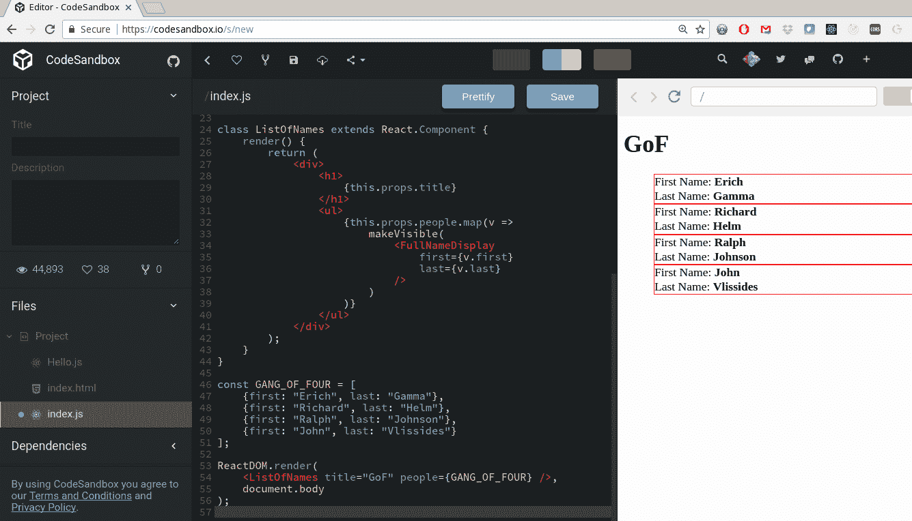
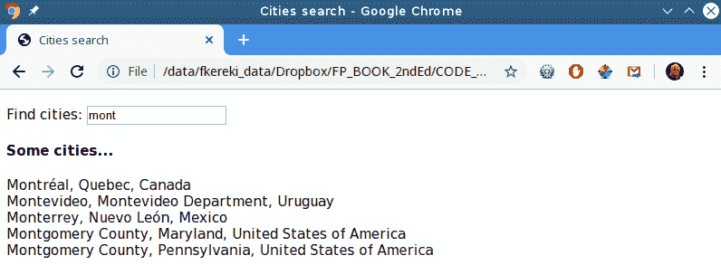

# 十一、实现设计模式——函数式

在[第 10 章](00.html)，*确保纯度-不变性*中，我们看到了几种解决不同问题的函数式技术。 然而，习惯使用 OOP 的程序员可能会发现，我们忽略了命令式编码中经常使用的一些知名公式和解决方案。 由于设计模式是众所周知的，而且程序员可能已经知道如何在其他语言中应用它们，因此了解函数实现是如何实现的很重要。

在本章中，我们将考虑在 OOP 中常见的*设计模式*所隐含的解决方案，以了解它们在 FP 中的等效性。 这将帮助您从 OOP 过渡到更函数式的方法，并通过查看已知问题的替代解决方案，了解更多关于 FP 的功能和方法。

特别是，我们将研究以下主题:

*   *设计模式*的概念及其应用
*   一些 OOP 标准模式，以及如果我们需要的话在 FP 中有什么替代方案
*   特别是，*观察者*模式，它导致 r*响应式编程*，这是一种处理事件的声明式方法
*   关于 FP 设计模式的讨论，与 OOP 设计模式无关

# 理解设计模式

软件工程是最相关的书籍之一*设计模式:可重用面向对象软件的元素*,1994 年写的**四人帮**(**GOF): Erich Gamma, Richard Helm 拉尔夫•约翰逊和约翰 Vlissides。 这本书展示了大约 24 种不同的 OOP*模式*，被认为是计算机科学中非常重要的书。**

*Patterns* are actually a concept from architectural design, originally defined by an architect, Christopher Alexander.

在软件术语中，*设计模式*是对软件设计中常见问题的普遍适用的、可重用的解决方案。 它不是一个特定的完成和编码的设计，而是一个解决方案的描述(也使用了单词*template*)，可以解决出现在许多上下文中的给定问题。 考虑到它们的优点，设计模式有自己的*最佳实践*，可以被使用不同类型的系统、编程语言和环境的开发人员使用。

这本 GoF 的书显然侧重于 OOP，其中的一些模式不能推荐或应用于 FP。 其他模式是不必要的或无关紧要的，因为函数式语言已经为相应的面向对象问题提供了标准解决方案。 即使有这样的困难，因为大多数程序员都接触过 OOP 设计模式，并且通常尝试在其他环境(如 FP)中应用它们，考虑最初的问题，然后看看如何产生新的解决方案是有意义的。 标准的基于对象的解决方案可能不适用，但问题仍然存在，因此查看如何解决它仍然是有效的。

模式通常由四个基本的基本元素来描述:

*   一个简单、简短的*名称*，用来描述问题、解决方法和结果。 这个名称在与同事交谈、解释设计决策或描述特定的实现时很有用。
*   模式应用的*上下文*:需要解决方案的特定情况，可能需要满足一些额外的条件。
*   列出了解决给定情况所需的元素(类、对象、函数、关系等)的*解决方案*。
*   *后果*(结果和权衡)如果你应用模式。 您可能会从这个解决方案中获得一些收益，但它也可能意味着一些损失。

在本章中，我们假设读者已经知道我们将要描述和使用的设计模式，所以我们不会提供关于它们的很多细节。 相反，我们将关注 FP 如何使问题变得无关紧要(因为有一种明显的方法可以应用函数技术来解决它)，或者以某种方式解决它。 另外，我们不会讲解所有的 GoF 模式; 我们只关注那些应用 FP 更有趣，与通常的 OOP 实现有更多区别的应用。

# 设计模式类别

设计模式通常根据其重点分为几个不同的类别。 以下列表中的前三种是出现在原版 GoF 书中的，但增加了更多的类别。 它们是:

*   **行为设计模式**:这些模式与对象之间的交互和通信有关。 重点考虑的不是对象是如何创建或构建的，而是如何将它们连接起来，以便在执行复杂任务时能够相互协作，最好采用具有众所周知的优点的方式，例如减少耦合或增强内聚性。
*   **创造性设计模式**:这些模式处理以适合当前问题的方式创建对象的方法。 使用它，您可以在几个可选对象之间做出决定，因此程序可以根据编译时或运行时已知的参数而不同地工作。
*   **结构设计模式**:这些模式与物体的组成有关，由许多单独的部分形成更大的结构，并实现物体之间的关系。 有些模式意味着接口的继承或实现，而其他模式则使用不同的机制，所有这些模式都是为了能够在运行时动态更改对象的组合方式。
*   **并发模式**:这些模式与多线程编程有关。 虽然 FP 通常非常适合这种情况(例如，缺少赋值和副作用)，但由于我们使用的是 JavaScript，这些模式与我们并不是很相关。
*   **架构模式**:这些模式更面向高层，比我们前面列出的模式范围更广，并提供软件架构问题的通用解决方案。 同样，我们在这本书中没有考虑这些问题，所以我们也不会处理这些问题。

Coupling and cohesiveness are terms that were in use even before OOP came into vogue; they date back to the late '60s when *Structured Design *by Larry Constantine came out. The former measures the interdependence between any two modules, and the latter has to do with the degree to which all components of a module really belong together. Low coupling and high cohesiveness are good goals for software design because they imply that related things are close by and unrelated ones are separate.

沿着这些线路后,你也可以分类设计模式为*对象模式*(关注对象之间的动态关系)和*类模式处理类和子类之间的关系(在编译时静态定义)。 我们不会过多地担心这种分类，因为我们的观点更多地涉及行为和函数，而不是类和对象。*

正如我们前面提到的，我们现在可以很容易地观察到这些类别很大程度上是面向 OOP 的，前三个类别直接提到了对象。 然而，在不丧失一般性的前提下，我们将超越定义，记住我们试图解决的问题，然后研究与 FP 类似的解决方案，即使不是 100%等同于 OOP 的解决方案，在本质上也将以并行的方式解决相同的问题。 让我们继续并开始考虑*为什么*我们想要处理模式!

# 我们需要设计模式吗?

有一种有趣的观点认为，设计模式只需要修补编程语言的缺陷。 其基本原理是，如果您能够以一种简单、直接和直接的方式用给定的编程语言解决问题，那么您可能根本不需要设计模式。 (例如:如果你的语言不提供递归，我们就必须自己实现它，否则，你可以直接使用它，无需更多的麻烦。) 然而，学习模式可以让你思考解决问题的不同方法，所以这一点对他们有利。

无论如何，对于 OOP 开发人员来说，真正理解为什么 FP 能在不需要进一步工具的情况下帮助解决一些问题是很有趣的。 在下一节中，我们将考虑几个众所周知的设计模式，并看看为什么我们不需要它们，以及如何容易地实现它们。 事实上，我们已经在前面的文本中应用了几个模式，所以我们也将指出这些例子。

但是，我们不会尝试将所有的设计模式表示或转换为 FP 术语。 例如，*单例*模式基本上需要一个单一的、全局的对象，这与函数式程序员所习惯的一切都是相反的。 鉴于我们 FP 方法(请记住**近似函数式编程**(**SPF),从最初的这本书的第一章的一部分吗?),我们不会介意,如果单是必需的,我们可以考虑使用它,即使 FP 没有一个适当的等效。**

最后，必须指出的是，我们的观点可能会影响什么被认为是模式，什么不是。 对某些人来说可能是模式的东西对另一些人来说可能是琐碎的细节。 我们将会发现一些这样的情况，考虑到 FP 可以让我们以简单的方式解决一些特定的问题，我们已经在前几章看到了这样的例子。

# 面向对象的设计模式

在本节中，我们将介绍一些 GoF 设计模式，检查它们是否与 FP 相关，并研究如何实现它们。 当然，有些设计模式不能得到 FP 解决方案。 例如，正如我们所说的，对于*单例*没有等价的，这意味着全局访问对象的外来概念。 此外，虽然您可能不再需要特定于 oop 的模式，但开发人员仍然会考虑这些模式。 此外，最后，如果 OOP 模式适合的话，我们还不能实现完整的功能，为什么不使用它呢?

我们将考虑以下事项:

*   *Façade*和*Adapter*，为其他代码提供新的接口
*   *装饰器*(也称为*包装器*)向现有代码添加新功能
*   *Strategy*、*Template*、*Command*，通过函数作为参数传递，对算法进行微调
*   *观察者*，它导致响应式编程，一种处理事件的声明式方法
*   其他模式不能完全匹配相应的 OOP 模式

现在，让我们通过分析两个类似的模式来开始我们的研究，这些模式让您以不同的方式使用代码。

# 外观和适配器

在这两种模式之外，让我们从*门面*或者更准确地说，*Façade*开始。 这意味着要解决为类的方法或库提供不同接口的问题。 其想法是为系统提供一个新的界面，使其更易于使用。 您可能会说 Façade 提供了一个更好的控制面板来访问某些功能，为用户消除了困难。

Façade or facade? The original word is an architectural term meaning the *front of a building* and comes from the French language. According to this source and the usual sound of the cedilla (ç) character, its pronunciation is something like *fuh-sahd*. The other spelling probably has to do with the lack of international characters in keyboards and poses the following problem: shouldn't you read it as *faKade*? You may see this problem as the reverse of *celtic*, which is pronounced as *Keltic*, changing the *s *sound for a *k *sound.

我们想要解决的主要问题是能够更容易地使用外部代码(当然，如果它是你的代码，你可以直接处理这些问题; 我们必须假设您不能——或者不应该——试图修改其他代码。 例如，当你使用任何网络上可用的库时，就会出现这种情况)。 关键在于实现自己的模块，它将提供更适合您需求的接口。 您的代码将使用您的模块，而不会直接与原始代码交互。

假设您想要执行 Ajax 调用，惟一的可能是使用一些带有非常复杂接口的硬库。 使用模块，您可以编写如下内容，使用想象的、难以使用的 Ajax 库:

```js
// simpleAjax.js import * as hard from "hardajaxlibrary";
// *import the other library that does Ajax calls*
// *but in a hard, difficult way, requiring complex code* const convertParamsToHardStyle = params => {
  // *do some internal steps to convert params*
  // *into whatever the hard library may require*
};

const makeStandardUrl = url => {
  // *make sure the url is in the standard*
  // *way for the hard library*
};

const getUrl = (url, params, callback) => {
  const xhr = hard.createAnXmlHttpRequestObject();
  hard.initializeAjaxCall(xhr);
  const standardUrl = makeStandardUrl(url);
  hard.setUrl(xhr, standardUrl);
  const convertedParams = convertParamsToHardStyle(params);
  hard.setAdditionalParameters(params);
  hard.setCallback(callback);
  if (hard.everythingOk(xhr)) {
    hard.doAjaxCall(xhr);
  } else {
    throw new Error("ajax failure");
  }
};

const postUrl = (url, params, callback) => {
  // *some similarly complex code*
  // *to do a POST using the hard library*
};

export {getUrl, postUrl}; // *the only methods that will be seen*
```

现在，如果您需要使用`GET`或`POST`，而不是使用所提供的硬 Ajax 库的所有复杂内容，您可以使用新的 façade，它提供了一种更简单的工作方式。 开发人员只需要做`import {getUrl, postUrl} from "simpleAjax"`就可以更合理地工作了。

然而，为什么我们要显示这段代码，尽管它很有趣，却没有显示任何特定的 FP 方面呢? 关键是,至少在浏览器模块完全实现之前,内部隐含的方法是使用一个 IIFE(立即调用函数表达式)我们看到的*直接调用*的[第三章](11.html),*开始功能——*一个核心概念, 采用*揭示**模块*模式。 实现这一点的方法如下:

```js
const simpleAjax = (function() {
  const hard = require("hardajaxlibrary");

  const convertParamsToHardStyle = params => {
    // ...
  };

  const makeStandardUrl = url => {
    // ...
  };

  const getUrl = (url, params, callback) => {
    // ...
  };

  const postUrl = (url, params, callback) => {
    // ...
  };

 return {
 getUrl,
 postUrl
 };
})();
```

*显示模块*名称的原因现在应该很明显了。 在前面的代码中，由于 JavaScript 的作用域规则，`simpleAjax`唯一可见的属性是`simpleAjax.getUrl`和`simpleAjax.postUrl`; 使用 IIFE 可以让我们安全地实现模块(以及 façade)，使实现细节为私有的。

现在，Adapter 模式是类似的，因为它也意味着定义一个新的接口。 然而，虽然 Façade 为旧代码定义了新接口，但当您需要为新代码实现旧接口时，将使用 Adapter，因此它将与您已有的接口相匹配。 如果您使用的是模块，很明显，在 Façade 中有效的相同类型的解决方案在这里也会有效，所以我们不必详细研究它。 现在，让我们继续使用一个众所周知的模式，您会发现我们在本书前面已经见过这个模式!

# 装饰或包装

*Decorator*模式(也称为*wrapper*)在您希望以动态方式向对象添加额外的职责或功能时非常有用。 让我们考虑一个简单的例子，我们将用一些 React 代码来演示它。 (如果你不知道这个框架，不要担心; 这个例子很容易理解。 我们之所以选择 React 是因为它可以很好地利用这种模式。 此外，我们已经看到了纯 JavaScript 的高阶函数示例，所以很高兴看到一些新的内容。) 假设我们想在屏幕上显示一些元素，出于调试的目的，我们想在对象周围显示一个细的红色边框。 你怎么能做到呢?

如果您正在使用 OOP，您可能必须创建一个具有扩展功能的新子类。 对于这个特定的示例，您可能只需要提供一些带有 CSS 类名的属性，以提供所需的样式，但让我们把重点放在 OOP 上; 使用 CSS 并不总能解决这个软件设计问题，所以我们想要一个更通用的解决方案。 新的子类会*知道*如何用边框显示自己，你可以在任何你想要一个对象的边框可见的时候使用这个子类。

根据我们对高阶函数的经验，我们可以使用*包装*以不同的方式解决这个问题; 将原始函数包装到另一个函数中，这将提供额外的功能。

请注意，我们已经在第 6 章[的*封装函数—保持行为*一节中看到了一些封装示例。](11.html)、*生成函数—高阶函数*。 例如，在这一节中，我们看到了如何包装函数以生成新版本，该版本可以记录其输入和输出，提供计时信息，甚至记住调用以避免将来的延迟。 在这个场合，为了变化，我们将概念应用到*装饰*的视觉组件，但原则保持不变。

让我们定义一个简单的 React 组件`ListOfNames`，它可以显示标题和人员列表，对于后者，它将使用`FullNameDisplay`组件。 这些元素的代码如下所示:

```js
class FullNameDisplay extends React.Component {
  render() {
    return (
      <div>
        First Name: <b>{this.props.first}</b>
        <br />
        Last Name: <b>{this.props.last}</b>
      </div>
    );
  }
}

class ListOfNames extends React.Component {
  render() {
    return (
      <div>
        <h1>
          {this.props.heading}
        </h1>
        <ul>
          {this.props.people.map(v =>
            <FullNameDisplay first={v.first} last={v.last} />
           )}
        </ul>
      </div>
    );
  }
}
```

`ListOfNames`组件使用映射创建`FullNameDisplay`组件来显示每个人的数据。 应用的完整逻辑可以如下所示:

```js
import React from "react";
import ReactDOM from "react-dom";

class FullNameDisplay extends React.Component {
  // *...as above...*
}

class ListOfNames extends React.Component {
  // *...as above...*
}

const GANG_OF_FOUR = [
  {first: "Erich", last: "Gamma"},
  {first: "Richard", last: "Helm"},
  {first: "Ralph", last: "Johnson"},
  {first: "John", last: "Vlissides"}
];

ReactDOM.render(
  <ListOfNames heading="GoF" people={GANG_OF_FOUR} />,
  document.body
);
```

In real life, you wouldn't put all of the code for every component in the same single source code file—and you would probably have a few CSS files. However, for our example, having everything in one place, and going with inline styles is enough, so bear with me and keep in mind the following saying: *Do as I say, not as I do.*

我们可以在[https://codesandbox.io/](https://codesandbox.io/)在线 React 沙箱中快速测试结果; 谷歌`react online sandbox`*如果您需要其他选项。 界面设计没有太多可谈的(所以请不要批评我可怜的网页!)，因为我们现在对设计模式很感兴趣; 参考*图 11.1*，给出如下:*

 *

Figure 11.1: The original version of our components shows a (not much to speak about) list of names

在 React 中，内联组件是用 JSX(内联 HTML 风格)编写的，实际上被编译成对象，这些对象稍后被转换成 HTML 代码显示。 每当调用`render()`方法时，它都会返回一个对象结构。 因此，我们将编写一个函数，该函数将接受一个组件作为参数，并返回一个新的 JSX，一个包装的对象。 在我们的例子中，我们想用所需的边框将原始组件包装在`<div>`内:

```js
const makeVisible = component => {
  return (
    <div style={{border: "1px solid red"}}>
      {component}
    </div>
  );
};
```

如果愿意，可以让这个函数知道它是在开发模式下执行还是在生产模式下执行; 在后一种情况下，它将简单地返回原始组件参数而不做任何更改，但现在我们不必担心这个问题。

我们现在必须更改`ListOfNames`以使用包装组件; 新的版本如下:

```js
class ListOfNames extends React.Component {
  render() {
    return (
      <div>
        <h1>
          {this.props.title}
        </h1>
        <ul>
          {this.props.people.map(v =>
 makeVisible(
 <FullNameDisplay
 first={v.first}
 last={v.last}
 />
 )
           )}
         </ul>
       </div>
    );
  }
}
```

修饰版的代码按照预期工作:每个`ListOfNames`组件现在被包装在另一个组件中，为它们添加所需的边框; 参考*图 11.2*



Figure 11.2: The decorated ListOfNames component is still nothing much to look at, but now it shows an added border

在前面的章节中，我们看到了如何装饰一个函数，将它包装在另一个函数中，这样它就可以执行额外的代码并添加一些功能。 现在，在这里，我们看到了如何应用相同风格的解决方案，以提供一个包装在额外的`<div>`中的*高阶组件*(React 中称之为)，以提供一些视觉上独特的细节。

If you have used Redux and the *react-redux* package, you may note that the latter's `connect()` method is also a decorator in the same sense; it receives a component class, and returns a new component class, connected to the store, for usage in your forms; refer to [https://github.com/reactjs/react-redux](https://github.com/reactjs/react-redux) for more details.

让我们转向一组不同的模式，这些模式将允许我们更改函数的执行方式。

# 策略、模板和命令

*策略*模式适用于任何你想要改变一个类，方法或函数的能力，可能以动态的方式，通过改变它实际做任何它期望做的事情的方式。 例如，如果人们步行、骑自行车或开车，GPS 应用可能希望通过应用不同的策略找到两个地方之间的路线。 在这种情况下，可能需要最快或最短的路径。 问题是相同的，但根据给定的条件，必须应用不同的算法。

顺便问一下，这听起来熟悉吗? 如果是这样，那是因为我们已经遇到过类似的问题。 当我们想要排序的一组字符串以不同的方式,在第 3 章,*开始功能——*一个核心概念,我们需要一种方法来指定顺序是如何应用的,同样,如何比较两个给定的字符串,并确定哪些必须先走。 根据语言的不同，我们必须使用不同的比较方法进行排序。

在尝试 FP 解决方案之前，让我们考虑实现路由函数的更多方法。 您可以使用足够大的代码段，它将接收一个声明使用哪个算法的参数，以及起始点和结束点。 有了这些参数，函数可以进行切换或类似的操作，以应用正确的寻径逻辑。 代码大致相当于下面的片段:

```js
function findRoute(byMeans, fromPoint, toPoint) {
  switch (byMeans) {
    case "foot":
      /* 
        *find the shortest road
        for a walking person*
      */

    case "bicycle":
      /* 
    *    find a route apt 
        for a cyclist*
      */

    case "car-fastest":
      /* 
        *find the fastest route
        for a car driver* 
      */

    case "car-shortest":
      /* 
 *find the shortest route
        for a car driver* 
      */

    default:
      /* 
    *    plot a straight line,
        or throw an error, 
        or whatever suits you
*      */
  }
}
```

这种解决方案确实不可取，而且您的函数实际上是许多不同的其他函数的总和，它不能提供高水平的内聚性。 如果您的语言不支持 lambda 函数(就像 Java 那样，直到 2014 年 Java 8 问世)，那么针对此问题的 OOP 解决方案需要定义实现您可能想要的不同策略的类，创建适当的对象，并传递它。

使用 JavaScript 中的 FP，实现策略是很简单的:你不需要使用像`byMeans`这样的变量来切换，而是提供一个路由查找函数(以下代码中的`routeAlgorithm()`)，它将实现所需的路径逻辑:

```js
function findRoute(routeAlgorithm, fromPoint, toPoint) {
  return routeAlgorithm(fromPoint, toPoint);
}
```

您仍必须实现所有所需的策略(没有办法),决定哪些功能通过`findRoute()`,但是现在路由逻辑函数是独立的,如果你想添加新的路由算法,你不会碰`findRoute()`。

如果你认为*模板模式,所不同的是,策略允许您使用完全不同的方式实现一个结果,而模板提供了一个包罗万象的算法(*或*模板)的一些实现细节留给指定方法。 以同样的方式，您可以提供实现策略模式的功能; 您也可以为 Template 模式提供它们。*

最后，*Command*模式还可以将函数作为参数传递。 此模式用于将请求封装为对象，因此对于不同的请求，具有不同的参数化对象。 既然我们可以简单地将函数作为参数传递给其他函数，就不需要外围对象了。

在第 3 章、*的*a reaction - redux reducer*部分，我们也看到了类似的使用模式。* 在那里，我们定义了一个表，其中的每个条目都是一个回调，在需要时调用。 我们可以直接说命令模式只是一个**面向对象**(**OO**)替代作为回调的普通函数。

现在让我们来看看一个经典的模式，它暗示了一个新的术语，r*反应性编程*，这是近来经常被提及的。

# 观测器和无功程序设计

*观察者*模式的思想是定义实体之间的链接，因此当一个实体发生变化时，所有依赖的实体都会自动更新。 *可观察对象*可以发布其状态的变化，并且它的观察者(订阅了该可观察对象)将收到此类变化的通知。

There is a proposal for adding observables to JavaScript (see [https://github.com/tc39/proposal-observable](https://github.com/tc39/proposal-observable)) but as of December 2019, it's still stuck at stage 1; check [https://github.com/tc39/proposal-observable/issues/191](https://github.com/tc39/proposal-observable/issues/191). Hence, for the time being, it seems that using a library will still be mandatory.

这个概念有一个扩展称为**r****响应式编程**，它涉及异步事件流(如鼠标点击或按键)或数据流(来自 api 或 web 套接字)， 应用的不同部分通过传递回调来观察这样的流，当有新消息出现时就会调用回调。

We won't be implementing reactive programming on our own; instead, we'll use RxJS, a JavaScript implementation of Reactive Extensions (*ReactiveX*) originally developed by Microsoft. RxJS is widely used in the Angular framework and can also be used in other frontend frameworks, such as React or Vue, or in the backend with Node. Learn more about RxJS at [https://rxjs-dev.firebaseapp.com/](https://rxjs-dev.firebaseapp.com/) and [https://www.learnrxjs.io/](https://www.learnrxjs.io/).

我们将在这些章节中展示的技术，令人困惑的是，称为**函数式反应编程**(**FRP**)和**函数式编程**(**RFP**); 随便你挑! 还有一个建议是，FRP 不应该应用于离散流(所以这个名字是错误的)，但这个表达在网上随处可见，这让它有了一定的地位。 但是… 是什么使它具有功能，为什么我们应该对它感兴趣? 关键是我们将使用类似于`map()`、`filter()`和`reduce()`的方法来处理这些流，并选择要处理哪些事件以及如何处理。 好了，现在这可能会让人困惑，所以让我们先看一些概念，然后，一些 frp 的例子，或者你想叫它什么都行! 我们将看到以下内容:

*   使用 FRP 时需要用到的几个基本概念和术语
*   您将使用的许多可用操作符中的一些
*   举几个例子:检测多次点击和提供提前输入搜索

让我们继续分析每一项，从你需要知道的基本思想开始。

# 基本概念和术语

使用 FRP 需要习惯几个新术语，所以让我们从一个简短的术语表开始:

*   :表示一个(当前或未来)的值流，可以连接到一个观察者。 实际上，您可以从任何地方创建可观察对象，但最常见的情况是从事件中创建。 按照惯例，可观察变量名以`$`结尾; 参见[https://angular.io/guide/rx-library#naming-conventions](https://angular.io/guide/rx-library#naming-conventions)。
*   **观察者**:这是一个回调执行时的可观测的订阅产生一个新值或一个对象有三种方法:`next()`,`error()`,`complete()`,将由可观测值时,将调用可用的,当有一个错误,当流分别结束。
*   **运营商**:这是纯函数(类似于`map()`、`filter()`,[第五章](05.html),*编程以声明的方式——一个更好的风格),让您转换应用于流声明方式。*
**   :这是一种定义将应用于流的操作符管道的方法。 这与我们在[第 8 章](08.html)中开发的`pipeline()`函数非常相似，*Connecting Functions - Pipelining and Composition*。*   :这是到一个可观察对象的连接。 一个可观察对象不会做任何事情，直到你调用`subscribe()`方法，提供一个观察者。*

 *观察观察对象的一个有趣的方法是，它们完成了这个表的最下面一行; 检查出来。 你可能对*单列*很熟悉，但可能对*多列*不熟悉:

|  | **单身** | **多个** |
| **拉** | `Function` | `Iterator` |
| **Push** | `Promise` | `Observable` |

我们如何解释这个表格? 行区分了 pull(你调用了什么)和 push(你被调用了)，列表示你得到了多少值:一个或多个。 通过这些描述，我们可以看到以下内容:

*   调用`function`并返回单个值。
*   `promise`也用单个值调用你的代码(在`then()`方法中的回调)。
*   `iterator`每次调用都返回一个新值——至少直到序列结束。
*   `observable`为流中的每个值调用你的代码(提供给你`subscribe()`到可观察对象)。

可观察对象和承诺可以进行更多的比较:

*   它们本质上都是异步的，你的回调将在一个不确定的未来时间被调用。
*   承诺不能被取消，但你可以从一个可观察到的。
*   承诺从你创建的那一刻起就开始执行; 可观察对象是懒惰的，除非观察者对他们做`subscribe()`，否则什么也不会发生。

可观察对象的真正威力来自于您可以使用的各种操作符; 让我们看看其中的一些。

# 运营商为可见

基本上，操作符就是函数:创建操作符可用于从许多不同的源中创建可观察对象，可管道操作符可用于修改流，产生一个新的可观察对象: 我们将看到许多家族，但完整的列表和描述，您应该访问[https://www.learnrxjs.io/operators/](https://www.learnrxjs.io/operators/)和[https://rxjs.dev/guide/operators](https://rxjs.dev/guide/operators)。

We won't be covering how to install RxJS; see [https://rxjs.dev/guide/installation](https://rxjs.dev/guide/installation) for all of the possibilities. In particular, in our examples, meant for a browser, we'll be installing version 6 of RxJS from a CDN, which creates a global `rxjs` variable, similar to jQuery's `$` or LoDash's `_` variables.

让我们从创建可观察对象开始，然后继续转换它们。 对于创建，你可以使用的一些操作符在下表中解释:

| **操作员** | **用法** |
| `ajax` | 为 Ajax 请求创建一个可观察对象，为此我们将发出返回的响应 |
| `from` | 从数组、可迭代对象或 promise 中生成一个可观察对象 |
| `fromEvent` | 将事件(例如，鼠标点击)转换为可观察序列 |
| `interval` | 以周期间隔发出值 |
| `of` | 从给定的值集生成一个序列 |
| `range` | 生成一个范围内的值序列 |
| `timer` | 在初始延迟之后，定期发出值 |

为了给出一个非常基本的例子，下面的三个可观察值都将产生一个从 1 到 10 的值序列，我们将在本章后面看到更多的实际示例:

```js
 const obs1$ = from([1, 2, 3, 4, 5, 6, 7, 8, 9, 10]);
 const obs2$ = of(1, 2, 3, 4, 5, 6, 7, 8, 9, 10);
 const obs3$ = range(1, 10);
```

对于本节来说，可用的管道操作符太多了，所以我们将浏览一些系列，并通过一到两处特别提到来描述它们的基本思想。 下表列出了最常见的家庭，以及它们最常用的操作符:

| **家庭** | **说明** |
| *联合* | 这些操作符允许连接来自几个不同的可观察对象的信息，包括以下内容:

*   `concat()`将可观察对象依次放入队列中。
*   从许多可观察对象中创造出一个。
*   `pairWise()`将前一个值和当前值作为数组发送。
*   `startWith()`向可观察对象注入值。

 |
| *条件* | 这些值取决于条件，包括以下内容:

*   `defaultIfEmpty()`如果一个可观察对象在完成之前没有发出任何东西，则发出一个值。
*   `every()`如果所有值都满足谓词，则发出 true，而发出 false。
*   `iif()`订阅取决于条件的两个可观察对象中的一个，如三元`?`操作符。

 |
| *错误处理* | 这些(显然!)适用于错误条件，并包括以下内容:

*   `catchError()`优雅地处理一个可观察到的错误。
*   `retry()`和`retryWhen()`重试一个可观察序列(最有可能是一个链接到 HTTP 请求的序列)。

 |
| *过滤* | 这可能是最重要的系列，提供了许多操作符来处理序列，通过选择哪些元素将被处理或丢弃，通过为您的选择应用不同类型的条件。 一些比较常见的问题包括:

*   `debounce()`和`debounceTime()`处理时间上太接近的值。
*   `distinctUntilChanged()`只在新值与上一个值不同时触发。
*   `filter()`只发出满足给定谓词的值。
*   `find()`只发出满足条件的第一个值。
*   `first()`和`last()`只选择序列的第一个或最后一个值。
*   `skip()`+`skipUntil()`、`skipWhile()`丢弃值。
*   `take()`和`takeLast()`从序列的开头或结尾选择给定数量的值。
*   `takeUntil()`和`takeWhile()`选择值和更多。

 |
| *转化* | 另一种非常常用的类型，它包括用于转换序列中的值的操作符。 其中一些可能性包括:

*   `buffer()`和`bufferTime()`收集值并将其作为数组发送。
*   根据某些属性将值分组在一起。
*   将给定的映射函数应用于序列中的每个元素。
*   根据一个给定的谓词将一个可观察对象分成两个。
*   `pluck()`只从每个元素中选择一些属性。
*   `reduce()`将一系列值缩减为单个值。
*   `scan()`工作方式类似`reduce()`，但会发出所有中间值。
*   `toArray()`收集所有的值并将其作为单个数组发出。

 |
| *公用设施* | 具有不同函数的操作符集合，包括以下操作符:

*   `tap()`执行一个副作用，类似于我们在*中看到的*部分[第 8 章](08.html)，*连接功能-管道和组成*
*   `delay()`延迟序列值一些时间。
*   当可观察对象完成或产生错误时调用函数。
*   `repeat()`与`retry()`类似，但适用于正常(即无错误)情况。
*   如果在给定的持续时间之前没有产生值，则产生一个错误。

 |

哇，这么多操作员! 我们排除了很多，您甚至可以自己编写，所以请务必查看文档。

Understanding operators is made easier with *marbles diagrams*; we won't be using them here, but read [http://reactivex.io/documentation/observable.html](http://reactivex.io/documentation/observable.html) for a basic explanation, and then check out [https://rxmarbles.com/](https://rxmarbles.com/) for many interactive examples of operators and how they function.

让我们以几个示例来结束本节，这些示例说明了应用对您自己编码的实际可能性。

# 检测 multi-clicks

假设你决定，出于某种原因，用户应该能够三键或四键点击某些东西，而点击的数量将具有某种意义，并产生某种特殊的结果。 浏览器可以很好地检测单次或双次点击并让您对它们做出响应，但三次(或更多)点击就不那么容易了。 不过，我们可以凑合着用一点玻璃钢。 让我们从一个非常基本的布局开始，包括用户应该单击的文本范围。 代码如下:

```js
<html>
  <head>
    <title>Multiple click example</title>
    <script type="text/javascript" src="rxjs.umd.js"></script>
  </head>
  <body>
    <span id="mySpan">Click this text many times (quickly)</span>
    <script>
      // *our code goes here...*
    </script>
  </body>
</html>
```

这一点再清楚不过了; 你只会在屏幕上看到一条短信，敦促你多点击它。 参见*图 11.3*:


Figure 11.3: A very plain screen, to test detecting triple-clicks

为了检测这些多次点击，我们需要一些 RxJS 函数，所以让我们从这些开始:

```js
const { fromEvent, pipe } = rxjs;
const { buffer, filter } = rxjs.operators;
```

我们很快就会用到这些函数。 我们如何检测三次(或更多)点击? 让我们直接看下面给出的代码:

```js
 const spanClick$ = fromEvent(
 document.getElementById("mySpan"),
 "click"
);               

spanClick$
  .pipe(
 buffer(spanClick$.pipe(debounceTime(250))),
 map(list => list.length),
 filter(x => x >= 3)
 )
  .subscribe(e => {
    console.log(`${e} clicks at ${new Date()}`);
  });

/*
 *4 clicks at Mon Nov 11 2019 20:19:29 GMT-0300 (Uruguay Standard Time)*
 *3 clicks at Mon Nov 11 2019 20:19:29 GMT-0300 (Uruguay Standard Time)*
 *4 clicks at Mon Nov 11 2019 20:19:31 GMT-0300 (Uruguay Standard Time)*
*/
```

逻辑很简单:

1.  我们创建一个带有`fromEvent()`的可观察对象，监听鼠标在我们的跨度上的点击。
2.  现在，一个棘手的问题是:我们使用`buffer()`将许多事件连接在一起，这些事件来自于对点击序列应用`debounceTime()`，因此所有发生在 250 毫秒间隔内的点击将被分组到一个数组中。
3.  然后应用`map()`将每个点击数组转换为其长度——毕竟，我们关心的是有多少次点击，而不是它们的具体细节。
4.  我们最后过滤掉小于 3 的值，因此只处理较长的点击序列。
5.  在本例中，订阅只记录单击，但在应用中，它应该做一些更相关的事情。

如果你愿意，你可以手动检测多次点击，编写自己的代码; 参见*Questions*部分的问题*11.3*。 最后，让我们使用一个更长的示例，执行一些调用外部 API 的提前输入搜索。

# 提供 typeahead 搜索

让我们做另一个网络例子:typeahead 搜索。 通常的设置是，有一些文本框，用户在其中输入，网页查询一些 API，以提供完成搜索的方法。 重要的是何时以及如何进行搜索，并尽可能避免对后端服务器的不必要调用。 一个(完全基础的)HTML 页面可以如下所示，本节后面的*图 11.4*:

```js
<html>
  <head>
    <title>Cities search</title>
    <script type="text/javascript" src="rxjs.umd.js"></script>
  </head>
  <body>
    Find cities:
    <input type="text" id="myText" />
    <br />
    <h4>Some cities...</h4>
    <div id="myResults"></div>
    <script>
      // *typeahead code goes here...*
    </script>
  </body>
</html>
```

我们有一个单独的文本框，用户可以在其中输入内容，下面有一个区域，我们可以显示 API 提供的内容。 我们将使用 GeoDB Cities API(参见[http://geodb-cities-api.wirefreethought.com/](http://geodb-cities-api.wirefreethought.com/))，它提供了许多搜索选项，但我们只使用它搜索以用户输入的任何内容开始的城市。 让我们来看看`getCitiesOrNull()`函数，它将返回一个搜索结果的承诺(如果输入了什么)或一个解析为空的承诺(如果没有输入任何内容，则没有城市)。 这个承诺的结果将被用来填充页面上的`myResults`分区。 让我们看看这在代码中是如何工作的:

```js
const getCitiesOrNull = text => {
  if (text) {
    const citySearchUrl =
      `http://geodb-free-service.wirefreethought.com/v1/geo/cities?` +
      `hateoasMode=false&` +
      `sort=-population&` +
      `namePrefix=${encodeURIComponent(text)}`;
    return fetch(citySearchUrl);
  } else {
    return Promise.resolve(null);
  }
};
```

代码很简单:如果提供了一些文本，我们为城市的搜索生成 URL，并使用`fetch()`来获取 API 数据。 完成这些之后，让我们看看如何生成所需的可观察对象。 我们将需要一些 RxJS 函数，所以首先，让我们有一些定义:

```js
const { fromEvent, pipe } = rxjs;
const {
  debounceTime,
  distinctUntilChanged,
  filter,
  map,
  reduce,
  switchMap
} = rxjs.operators;
```

我们将在后面使用所有这些函数。 现在，我们可以编写代码来实现 typeahead:

```js
const textInput$ = fromEvent(
  document.getElementById("myText"),
  "input"
).pipe(
 map(e => e.target.value),
 debounceTime(200),
 filter(w => w.length === 0 || w.length > 3),
 distinctUntilChanged(),
 switchMap(w => getCitiesOrNull(w))
);
```

这需要一步一步来:

1.  我们使用`fromEvent()`构造函数从`myText`输入字段观察输入事件(每次用户输入东西时)。
2.  我们使用`map()`来获取事件的目标值，即输入字段的完整文本。
3.  我们使用`debounceTime(200)`，所以这个可观察对象不会发出，直到用户已经 0.2 秒(200 毫秒)没有输入——如果用户没有完成他们的查询，调用 API 有什么用?
4.  然后我们使用`filter()`来丢弃只有一个、两个或三个字符长的输入，因为这对我们的搜索来说不够好。 我们接受空字符串(因此将清空结果区域)和长度为 4 个或更多字符的字符串。
5.  然后，我们使用`distinctUntilChanged()`，因此，如果搜索字符串与之前相同(用户可能添加了一个字符，但快速地 backspacing，删除它)，什么都不会发出。
6.  最后，我们改变了使用`switchMap()`来取消之前的可观察对象订阅，并使用`getCitiesOrNull()`创建一个新的可观察对象。

我们如何使用它? 我们订阅可观察对象，当我们获得结果时，我们使用它们来显示值。 可能的示例代码如下:

```js
textInput$.subscribe(async fetchResult => {
  domElem = document.getElementById("myResults");

  if (fetchResult !== null) {
    result = await fetchResult.json();
    domElem.innerHTML = result.data
      .map(x => `${x.city}, ${x.region}, ${x.country}`)
      .join("<br />");

  } else {
    domElem.innerHTML = "";
  }
});
```

重要的一点是:承诺被解析，序列的最终值因此就是承诺产生的值。 如果结果不为 null，我们将得到一个城市数组，并使用`map()`和`join()`来生成(非常基础的!) HTML 输出; 否则，我们就清空结果区域。

让我们试一下。 如果您开始输入，当您还没有达到 4 个字符时，什么也不会发生，并暂停一会儿; 参考*图 11.4*，如下图所示:


Figure 11.4: Our search for cities doesn't trigger for less than four characters

当达到 4 个字符并暂停一点时，可观察对象将发出一个事件，我们将进行第一次搜索:在本例中，搜索名称以`MONT`开头的城市。 参考*图 11.5*，如下图所示:



Figure 11.5: After reaching four characters, searches will be fired

最后，当您添加更多字符时，将完成新的 API 调用，从而优化搜索; 参考*图 11.6*，如下图所示:


Figure 11.6: Further characters are used to refine the search

我们能从这些例子中学到什么? 使用事件的可观察对象使我们能够很好地分离事件生产和事件消费的关注点，并且流流程的声明式风格使数据流更加清晰。 你甚至可以注意到 HTML 代码本身没有引用点击方法或类似的东西; 完整的代码是独立的。

现在我们已经看到了大部分有趣的模式; 让我们以其他一些例子结束，它们可能与经典的 OOP 伙伴完全相同，也可能不完全相同。

# 其他模式

让我们通过浏览其他一些模式来结束这一节，这些模式的等价性可能很好，也可能不太好:

*   **局部套用和部分应用**([中我们看到第七章](11.html),*转换函数-局部套用和部分应用*):这可以视为大约相当于*工厂*功能。 对于一般函数，您可以通过修改一个或多个参数来产生特殊情况，当然，这本质上就是 Factory 所做的，它讨论的是函数而不是对象。
*   **声明性函数**(例如`map()`或`reduce()`):它们可以被视为*Iterator*模式的应用。 容器元素的遍历是与容器本身解耦的。 您还可以为不同的对象提供不同的`map()`方法，因此您可以遍历所有类型的数据结构。
*   **持久数据结构**:正如在[第 10 章](00.html)、*中提到的，确保纯度-不变性*，它们允许实现*Memento*模式。 它的核心思想是，给定一个物体，它能够回到以前的状态。 正如我们所看到的，数据结构的每个更新版本都不会影响以前的版本，所以您可以轻松地添加一种机制来提供更早的状态，并将**回滚到*。*
**   **责任链**模式: 在此模式中,有一个潜在的变量数量的处理器和*请求流的请求处理,这可能是使用`find()`确定实现的处理器,将处理请求(所需的一个是第一个接受请求的列表中),然后简单地做所需的过程。**

 *记得开始的警告:这些模式,配以 FP 技术可能不是那么完美的与他人,我们以前见过,但想法是显示,有一些常见的 FP 模式可以应用,而且它会产生相同的结果作为 OOP 的解决方案,尽管不同的实现。

现在，在学习了几个 OOP 等效模式之后，让我们继续学习更具体的 FP 模式。

# 功能设计模式

在看过几个 OOP 设计模式之后，说没有经过批准的、官方的，甚至是被广泛接受的类似的 FP 模式列表似乎是一种欺骗。 然而，有几个问题可以用标准 FP 解决方案来解决，这些问题可以单独考虑设计模式，我们在这本书中已经介绍了大部分。

可能的模式列表有哪些候选者? 让我们试着准备一个——但记住，这只是个人观点。 此外，我承认我并没有试图模仿模式定义的通常风格; 我只是提到一个普遍的问题，并提到 FP 在 JS 中可以解决它的方法，我也不打算为模式取一个漂亮、简短、令人难忘的名字:

*   **处理集合使用过滤器/ map / reduce**:当你要处理一个数据收集、使用声明式高阶函数,如`filter()`、`map()`,`reduce()`,正如我们在本章中看到的,之前在[第五章](11.html),【显示】编程以声明的方式,一个更好的风格, 是消除问题复杂性的一种方法(通常的`MapReduce`web 框架是这个概念的扩展，它允许在多个服务器之间进行分布式处理，即使实现和细节并不完全相同)。 不要将循环和处理作为单个步骤来执行，而是应该将问题视为一系列步骤，按顺序应用这些步骤，进行转换，直到获得最终的、想要的结果。

JS also includes *iterators*, that is, another way of looping through a collection. Using *iterators* isn't particularly functional, but you may want to look at them since they may be able to simplify some situations. Read more at [https://developer.mozilla.org/en-US/docs/Web/JavaScript/Reference/Iteration_protocols](https://developer.mozilla.org/en-US/docs/Web/JavaScript/Reference/Iteration_protocols).

*   :*Lazy evaluation*的思想是在实际需要之前不做任何计算。 在一些编程语言中，这是内置的。 然而，在 JavaScript(以及大多数命定语言)中，应用了*急切求值*，即表达式一旦绑定到某个变量就会被求值。 (另一种说法是 JavaScript 是一个*严格的编程语言*，有一个*严格的范例*，它只允许调用一个函数，如果它的所有参数已经被完全计算。) 当您需要精确地指定计算顺序时，需要使用这种类型的计算，主要是因为这种计算可能有副作用。

FP,更声明式和纯洁,你可以延迟这样的评价*铛*(*我们使用的蹦床和铛*的[第 9 章](06.html),*设计函数递归*)通过铛,计算所需的价值只有当它是必要的,但不是。

You may also want to look at JavaScript *generators*, which is another way of delaying evaluation, though not particularly related to FP at all. Read more about them at [https://developer.mozilla.org/en-US/docs/Web/JavaScript/Reference/Global_Objects/Generator](https://developer.mozilla.org/en-US/docs/Web/JavaScript/Reference/Global_Objects/Generator). The combination of generators and promises is called an async function, which may be of interest to you; refer to [https://developer.mozilla.org/en-US/docs/Web/JavaScript/Reference/Statements/async_function](https://developer.mozilla.org/en-US/docs/Web/JavaScript/Reference/Statements/async_function).

*   **持久数据结构不变性**:不可变的数据结构,我们看到在[第十章](00.html),*确保纯度——*不变性,是强制使用某些框架时,一般来说,推荐,因为它有助于思考程序或调试它。 (在本章的前面，我们还提到了如何以这种方式实现*Memento*OOP 模式)。 当您必须表示结构化数据时，使用持久数据结构的 FP 解决方案在许多方面都有帮助。
*   **包装值检查和操作**:如果您直接使用变量或数据结构,你可以随意修改(可能违反任何限制)或您可能需要做许多检查之前使用它们(例如验证值不是零之前试图访问对应的对象)。 此模式的思想是将值封装在对象或函数中，因此不可能进行直接操作，而可以更有效地管理检查。 我们将在第 12 章[、](09.html)、*中详细介绍。 【5】*

正如我们所说，FP 的强大之处在于，它没有几十种标准的设计模式(这只在 GoF 的书中出现过; 如果你读过其他的文章，这个列表还会增加!)，现在还没有一个标准的或公认的功能模式列表。

# 总结

在这一章中，我们通过展示我们如何解决相同的基本问题(但要比用类和对象更容易)，架起了一座桥梁，从 OO 思维方式和我们用这种方式编码时使用的通常模式，到 FP 风格。 我们已经看到了几种常见的设计模式，我们已经看到了相同的概念适用于 FP，即使实现可能会有所不同，所以现在您已经有了一种将那些众所周知的解决方案结构应用到 JavaScript 编码的方法。

在 12 章,*建筑更好的容器——功能数据类型*,我们将使用*百花香*函数式编程的概念,这将给你更多的想法你可以使用的工具。 我保证这本书不会变得太理论化，而是更实用，我们将尽量保持这种方式，即使其中一些概念可能看起来很深奥或遥远。

# 问题

11.1。 :在[第 6 章](11.html)，*Producing Functions - high - order Functions*中，我们编写了一个 decorator 来实现对任何函数的日志记录。 目前，方法装饰器正在考虑用于即将到来的 JavaScript 版本:请参考[https://tc39.github.io/proposal-decorators/](https://tc39.github.io/proposal-decorators/)(草案 2 意味着该标准可能会包含该特性，尽管可能会有一些添加或小的变化)。 研究下面的草案，看看是什么让下一个代码发挥作用:

```js
const logging = (target, name, descriptor) => {
  const savedMethod = descriptor.value;
  descriptor.value = function(...args) {
    console.log(`entering ${name}: ${args}`);
    try {
      const valueToReturn = savedMethod.bind(this)(...args);
      console.log(`exiting ${name}: ${valueToReturn}`);
      return valueToReturn;
    } catch (thrownError) {
      console.log(`exiting ${name}: threw ${thrownError}`);
      throw thrownError;
    }
  };
  return descriptor;
};
```

一个工作示例如下:

```js
class SumThree {
  constructor(z) {
    this.z = z;
  }
  @logging
  sum(x, y) {
    return x + y + this.z;
  }
}

new SumThree(100).sum(20, 8);
// *entering sum: 20,8*
// *exiting sum: 128*
```

以下是一些关于`logging()`装饰器代码的问题:

*   您是否认为有必要使用`savedMethod`变量?
*   为什么我们使用`function()`来指定一个新的`descriptor.value`，而不是一个箭头函数?
*   你能理解为什么使用`.bind()`吗?
*   什么是`descriptor`?

11.2。 ，*Becoming Functional - Several Questions*，我们看到类是一类对象。 利用这一点，完成下面的`addBar()`函数，它将向`Foo`类添加一些 mixin，这样代码就会像下面所示的那样运行。 创建的`fooBar`对象应该有两个属性(`fooValue`和`barValue`)和两个方法(`doSomething()`和`doSomethingElse()`)，它们只是显示一些文本和属性，如下所示:

```js
class Foo {
  constructor(fooValue) {
    this.fooValue = fooValue;
  }
  doSomething() {
    console.log("something: foo... ", this.fooValue);
  }
}

var addBar = BaseClass => 
  /*
    your code goes here
  */
  ;

var fooBar = new (addBar(Foo))(22, 9);
fooBar.doSomething(); // something: foo... 22
fooBar.somethingElse(); // something else: bar... 9
console.log(Object.keys(fooBar)); // ["fooValue", "barValue"]

```

你是否可以加入第三个 mixin，`addBazAndQux()`，这样`addBazAndQux(addBar(Foo))`就可以向`Foo`添加更多的属性和方法?

11.3。 **手动点击**:你能编写自己的点击检测代码吗?***