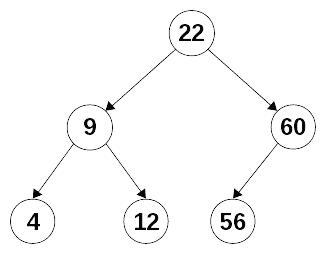

# 十二、构建更好的容器——函数数据类型

在[第 11 章](09.html)，*实现设计模式-功能方式*中，我们学习了如何使用功能来实现不同的结果。 在本章中，我们将从函数的角度来研究数据类型。 我们将考虑如何实现我们自己的数据类型，以及一些可以帮助我们组合操作或确保其纯粹性的特性，从而使 FP 编码变得更简单和更短。

我们将涉及几个主题:

*   **数据类型**从功能的角度。 即使 JavaScript 不是一种类型化语言，也需要更好地理解类型和函数。
*   **容器**，包括*函子*和神秘的*单胞体*，用来构建数据流。
*   **函数作为结构**，在其中我们将看到另一种使用函数来表示数据类型的方法，将不变性作为额外的附加。

让我们开始吧!

# 指定数据类型

尽管 JavaScript 是一种动态语言，没有静态或显式类型声明和控件，但这并不意味着您可以简单地忽略类型。 即使语言不允许你指定变量或函数的类型，你仍然在使用类型——即使只是在你的头脑中。 现在，让我们学习如何指定类型。 在指定类型时，我们有以下一些优势:

*   即使你没有编译时数据类型检查，也有一些工具，比如 Facebook 的*flow*static 类型检查器或微软的*TypeScript*语言，可以让你处理它。

*   如果你打算从 JavaScript 转向像*Elm 这样的函数式语言，它将对你有所帮助。*
*   它可以作为文档，让未来的开发人员了解他们必须传递给函数的参数类型以及它将返回的类型。 Ramda 库中的所有函数都是以这种方式记录的。
*   它还将有助于本节后面的函数式数据结构，我们将在其中研究处理结构的方法，在某些方面与在完全函数式语言(如 Haskell)中所做的类似。

If you want to learn more about the tools that I cited, visit [https://flow.org/](https://flow.org/) for Flow, [https://www.typescriptlang.org/](https://www.typescriptlang.org/) for TypeScript, and [http://elm-lang.org/](http://elm-lang.org/) for Elm. If you want to know more about type checks, the corresponding web pages are [https://flow.org/en/docs/types/functions/](https://flow.org/en/docs/types/functions/), [https://www.typescriptlang.org/docs/handbook/functions.html](https://www.typescriptlang.org/docs/handbook/functions.html), and [https://flow.org/en/docs/types/functions/](https://flow.org/en/docs/types/functions/).

每当您阅读或使用一个函数时，您都必须对类型进行推理，考虑对这个或那个变量或属性可能进行的操作，等等。 有类型声明会有帮助。 因此，我们将开始考虑如何定义函数的类型及其参数。 之后，我们将考虑其他类型定义。

# 函数的签名

函数参数和结果的说明由*签名*给出。 类型签名基于一个*类型系统*称为**Hindley-Milner**，该系统影响了包括 Haskell 在内的几种(主要是函数式)语言，尽管其符号与原始论文有所不同。 这个系统甚至可以推导出没有直接给出的类型; TypeScript 或 Flow 等工具也可以做到这一点，所以开发者不需要指定*所有*类型。 与其对书写正确签名的规则进行枯燥、正式的解释，不如让我们通过例子来说明。 我们只需要知道以下几点:

*   我们将把类型声明写成注释。

*   先写函数名，再写`::`，可读为*为*类型，*为*类型。**
*   可选的约束可能会跟在后面，后面有一个双箭头`⇒`(或者`=>`，如果你不能键入箭头的话，用基本的 ASCII 方式)。
*   该功能的输入类型如下，与`→`(或`->`，取决于您的键盘)。
*   函数的结果类型排在最后。

Note that instead of this vanilla JavaScript style, Flow and TypeScript have their own syntax for specifying type signatures.

现在，我们可以从一些例子开始。 让我们定义一个简单函数的类型，只是大写一个单词，并对`Math.random`函数做同样的事情:

```js
// firstToUpper :: String → String
const firstToUpper = s => s[0].toUpperCase() + s.substr(1).toLowerCase();

// Math.random :: () → Number
```

这些都是简单的情况——这里只考虑签名; 我们对实际函数不感兴趣。 第一个函数接收一个字符串作为参数并返回一个新的字符串。 第二个函数不接收参数(空括号显示了这一点)，并返回一个浮点数。 箭头表示函数。 所以,我们可以阅读第一签名`firstToUpper`*是一个函数的类型接收一个字符串,并返回一个字符串*我们可以类似地谈论诽谤(impurity-wise)`Math.random()`功能,唯一的区别是,它不接受参数。

我们已经看过了有 0 或 1 个参数的函数，但是有多个参数的函数呢? 对此有两个答案。 如果我们在严格的函数风格下工作，我们将总是做 curry(正如我们在[第 7 章](12.html)，*transform Functions - curcurry and Partial Application*中看到的那样)，所以所有的函数都是一元的。 另一种解决方案是用圆括号括起参数类型列表。 我们可以在下面的代码中看到这两个解决方案:

```js
// sum3C :: Number → Number → Number → Number
const sum3C = curry((a, b, c) => a + b + c);

// sum3 :: (Number, Number, Number) → Number
const sum3 = (a, b, c) => a + b + c;
```

记住，`sum3c`实际上是`a => b => c => a + b + c`; 这解释了第一个签名，它也可以读如下:

```js
// sum3C :: Number → (Number → (Number → (Number)))
```

在向函数提供了第一个参数之后，就剩下一个新函数，该函数也需要一个参数，并返回第三个函数，当给定一个参数时，该函数将生成最终结果。 我们不会使用括号因为我们总是假设从右到左分组。

那么高阶函数呢，它接收函数作为参数? `map()`函数带来了一个问题:它可以处理任何类型的数组。 此外，映射函数可以产生任何类型的结果。 对于这些情况，我们可以指定*泛型类型*，它由小写字母标识:这些泛型类型可以代表任何可能的类型。 对于数组本身，我们使用括号。 所以，我们会有以下内容:

```js
// map :: [a] → (a → b) → [b]
const map = curry((arr, fn) => arr.map(fn));
```

让`a`和`b`表示相同的类型是完全有效的，就像应用于数字数组的映射一样，它会生成另一个数字数组。 重点是，原则上，`a`和`b`可能代表不同的类型，这也是我们前面所描述的。 同时,请注意,如果我们不是局部套用,签名是`([a], (a → b)) → [b]`,显示一个函数,它接受两个参数(数组元素类型的`a`和一个函数映射类型`a`类型`b`),产生一个数组的元素类型【显示】的结果。 有了这个，我们可以用类似的方式写如下内容:

```js
// filter :: [a] → (a → Boolean) → [a]
const filter = curry((arr, fn) => arr.filter(fn));
```

现在最重要的问题是:`reduce()`的签名是什么? 一定要仔细阅读，看看你能不能弄明白为什么要这样写。 你可能更喜欢把签名的第二部分想象成`((b, a) → b)`:

```js
// reduce :: [a] → (b → a → b) → b → b
const reduce = curry((arr, fn, acc) => arr.reduce(fn, acc));
```

最后，如果你正在定义一个方法而不是一个函数，你可以使用一个弯弯曲曲的箭头，如`~>`:

```js
// String.repeat :: String ⇝ Number → String
```

到目前为止，我们已经定义了函数的数据类型，但是我们还没有完成这个主题。 让我们考虑一些其他的情况。

# 其他数据类型选项

我们还错过了什么? 让我们看看您可能使用的其他选项。 *产品类型*是一组总是在一起的值，通常与对象一起使用。 对于元组(即包含固定数量(可能)不同类型元素的数组)，我们可以这样写:

```js
// getWeekAndDay :: String → (Number × String)
const getWeekAndDay = yyyy_mm_dd => 
  /* ... */ 
  return [weekNumber, dayOfWeekName];
```

对于对象，我们可以使用与 JavaScript 已经使用的定义非常相似的定义。 让我们假设我们有一个`getPerson()`函数，它接收一个 ID 并返回一个带有关于一个人的数据的对象:

```js
// getPerson :: Number → { id:Number × name:String }
const getPerson = personId => 
  /* ... */ 
  return { id:personId, name:personName }
```

*Sum 类型*(也称为*union 类型*)定义为可能值的列表。 例如，第 6 章[中](12.html)、*中的`getField()`函数——高阶函数*，要么返回一个属性的值，要么返回 undefined。 为此，我们可以写以下签名:

```js
// getField :: String → attr → a | undefined
const getField = attr => obj => obj[attr];
```

我们还可以定义一个类型(联合或其他类型)，并在进一步的定义中使用它。 例如，可以直接比较和排序的数据类型是数字、字符串和布尔值，因此可以编写以下定义:

```js
// Sortable :: Number | String | Boolean
```

之后，我们可以指定可以用`Sortable`类型定义比较函数，但是要小心:这里有一个隐藏的问题!

```js
// compareFunction :: (Sortable, Sortable) → Number
```

Actually, this definition isn't very precise because you can compare any type, even if it doesn't make much sense. However, bear with me for the sake of this example!
If you want to refresh your memory about sorting and comparison functions, see [https://developer.mozilla.org/en/docs/Web/JavaScript/Reference/Global_Objects/Array/sort](https://developer.mozilla.org/en/docs/Web/JavaScript/Reference/Global_Objects/Array/sort).

前面的定义允许我们编写一个函数，接收一个数字和一个布尔值:它并没有说这两种类型应该是相同的。 然而，还是有办法的。 如果对某些数据类型有约束，可以在实际签名之前使用*fat*箭头表示约束，代码如下:

```js
// compareFunction :: Sortable a ⇒ (a, a) → Number
```

现在，这个定义是正确的，因为相同类型(由相同的字母表示，在本例中，`a`)的所有出现必须完全相同。 另一种选择，但需要更多的输入，将用一个联合来编写所有三种可能性:

```js
// compareFunction :: 
//   ((Number, Number) | (String, String) | (Boolean, Boolean)) → Number
```

到目前为止，我们一直在使用标准类型定义。 然而，当我们使用 JavaScript 时，我们必须考虑一些其他的可能性，比如带有可选参数的函数，甚至带有数量未知的参数的函数。 我们可以使用`...`表示任意数量的参数，并添加`?`表示可选类型，如下所示:

```js
// unary :: ((b, ...) → a) → (b → a) 
const unary = fn => (...args) => fn(args[0]);
```

我们在前面引用的同一章中定义的`unary()`高阶函数接受任意函数作为参数，并返回一元函数作为结果。 我们可以证明原始函数可以接收任意数量的参数，但结果只使用了其中的第一个参数。 它的数据类型定义如下:

```js
// parseInt :: (String, Number?) -> Number
```

标准的`parseInt()`函数提供了一个可选参数示例:尽管强烈建议您不要忽略第二个参数(基基数)，但实际上您可以跳过它。

Check out [https://github.com/fantasyland/fantasy-land/](https://github.com/fantasyland/fantasy-land/) and [https://sanctuary.js.org/#types](https://sanctuary.js.org/#types) for a more formal definition and description of types, as applied to JavaScript.

从现在开始，在本章中，我们将为方法和函数添加签名。 这不仅是为了让您能够习惯它们，而且还因为，当我们开始深入研究更复杂的容器时，它将帮助您理解我们正在处理的问题:有些情况可能很难理解!

# 建筑的容器

在[第五章](05.html),*编程以声明的方式,一个更好的风格,后来,在[第八章](08.html),*连接功能——流水线和组成*,我们看到的能力能够映射适用于所有元素的数组,,更好的是, 能够将类似的操作序列串联起来，是生成更好、更易于理解的代码的好方法。*

 *然而,有一个问题:`map()`方法(或等效,*demethodized*,在[我们看第六章](12.html),*生产函数高阶函数*),只有用于数组,我们可能希望能够应用映射和链接到其他数据类型。 那么，我们能做什么呢?

让我们考虑一下不同的方法，这将为我们提供一些更好的函数式编码的新工具。 基本上，只有两种可能的方法来解决这个问题:我们可以向现有类型添加新方法(尽管这是有限的，因为我们只能将其应用到基本的 JavaScript 类型)，或者我们可以将类型包装在某种类型的容器中，这将允许映射和链接。

在开始使用包装器之前，让我们先扩展当前类型，这将引导我们进入更深层次的功能领域，使用仿函数和单子等实体。

# 扩展当前数据类型

如果我们想要添加映射到基本的 JavaScript 数据类型，我们需要从考虑我们的选项开始:

*   对于`null`、`undefined`和`Symbol`，应用地图听起来不太有趣。
*   对于`Boolean`、`Number`和`String`数据类型，我们有一些有趣的可能性，因此我们可以检查其中的一些。
*   将映射应用到对象是很简单的:我们只需要添加一个`map()`方法，该方法必须返回一个新对象。
*   最后，尽管不是基本数据类型，我们也可以考虑特殊情况，如日期或函数，我们还可以添加`map()`方法。

As in the rest of this book, we are sticking to plain JavaScript, but you should look into libraries such as Lodash, Underscore, or Ramda, which already provide functionalities similar to the ones we are developing here.

在所有这些映射操作中需要考虑的一个关键点应该是返回值的类型与原始值完全相同: 当我们使用`Array.map()`,结果也是一个数组,和类似的考虑必须适用于任何其他`map()`方法实现(可以观察到结果数组可能有不同的元素类型,但它仍然是一个数组)。

我们能用布尔值做什么? 首先，让我们接受布尔值不是容器这一事实，因此它们的行为与数组不同:一个布尔值只能有一个布尔值，而数组可以包含任何类型的元素。 然而，接受这个差异，我们可以扩展`Boolean.prototype`(尽管，正如我已经提到的，这通常不推荐)，添加一个新的`map()`方法到它，并确保映射函数返回的任何内容都被转换成一个新的布尔值。 对于后者，解决方案类似如下:

```js
// Boolean.map :: Boolean ⇝ (Boolean → a) → Boolean
Boolean.prototype.map = function(fn) {
  return !!fn(this);
};
```

`!!`操作符强制结果为布尔值:`Boolean(fn(this))`也可以被使用。 这种解决方案也可以应用于数字和字符串，如下面的代码所示:

```js
// Number.map :: Number ⇝ (Number → a) → Number
Number.prototype.map = function(fn) {
  return Number(fn(this));
};

// String.map :: String ⇝ (String → a) → String
String.prototype.map = function(fn) {
  return String(fn(this));
};

```

与布尔值一样，我们将映射操作的结果强制为正确的数据类型。

最后，如果我们想要将映射应用到一个函数，这意味着什么? 映射一个函数应该产生一个函数。 `f.map(g)`的逻辑解释是应用`f()`，然后再应用`g()`到结果上。 因此，`f.map(g)`应等同于`x => g(f(x))`或`pipe(f,g)`。 这个定义比前面的例子要复杂得多，所以仔细研究一下:

```js
// Function.map :: (a → b) ⇝ (b → c) → (a → c)
Function.prototype.map = function(fn) {
  return (...args) => fn(this(...args));
};
```

验证这一点很简单，下面的代码是如何做到这一点的简单示例。 将`by10()`映射函数应用于`plus1(3)`的计算结果，结果为 40:

```js
const plus1 = x => x + 1;
const by10 = y => 10 * y;

console.log(plus1.map(by10)(3));
// 40: first add 1 to 3, then multiply by 10
```

这样，我们就完成了对基本 JavaScript 类型的讨论，但是如果我们想将其应用到其他数据类型，我们还需要一个更通用的解决方案。 我们希望能够将映射应用到任何类型的值，为此，我们需要创建一个容器。 我们将在下一节中做这个。

# 容器和子

我们在前一节中所做的工作是有效的，并且使用起来没有任何问题。 然而，我们想考虑一个更通用的解决方案，我们可以应用于任何数据类型。 因为并不是所有的事情在 JavaScript 中提供所需的`map()`方法,我们将不得不要么扩展类型(正如我们在前一节中)或应用设计模式,我们认为在[第 11 章](02.html),*实现设计模式——功能【5】: 使用提供所需的`map()`操作的包装器来包装数据类型。*

特别要做的是:

*   首先看看如何构建一个基本容器，包装一个值
*   将容器转换成更强大的函数——一个函子
*   学习如何使用特殊函子处理缺失值`Maybe`

# 包装一个值——一个基本容器

让我们暂停一分钟，考虑一下我们需要从这个包装器中得到什么。 有两个基本要求:

*   我们必须有一个方法。
*   我们需要一种简单的方法来包装值。

首先，让我们创建一个基本容器。 任何只包含值的对象都可以，但我们想要一些加法，所以我们的对象不会那么简单; 我们将在代码后解释差异:

```js
const VALUE = Symbol("Value");

class Container {
  constructor(x) {
    this[VALUE] = x;
  }
 map(fn) {
 return fn(this[VALUE]);
 }
}
```

我们需要注意的一些基本问题是:

*   我们希望能够在容器中存储一些值，因此构造函数负责处理这一点。
*   使用`Symbol`有助于隐藏字段:属性键不会在`Object.keys()`、`for...in`或`for...of`循环中显示，使它们更防混入*。* 
*   我们需要能够`map()`，因此提供了一个方法。

If you haven't worked with JavaScript symbols, possibly the least known of its primitive data types, you might want to check out [https://developer.mozilla.org/en-US/docs/Glossary/symbol](https://developer.mozilla.org/en-US/docs/Glossary/symbol).

我们的基本骨架容器已经准备好了，但为了方便，我们还可以添加一些其他方法，如下所示:

*   要获取容器的值，我们可以使用`map(x => x)`，但这不适用于更复杂的容器，因此我们将添加一个`valueOf()`方法来获取所包含的值。
*   能够列出容器当然有助于调试。 `toString()`方法将在这方面派上用场。
*   因为我们不需要一直写`new Container()`，所以我们可以添加一个静态`of()`方法来完成同样的工作。

Working with classes to represent containers (and later, functors and monads) when living in a functional programming world may seem like heresy or sin... but remember that we don't want to be dogmatic, and `class` and `extends` simplify our coding. Similarly, it could be argued that you must never take a value out of the container—but using a `valueOf()` method is sometimes too handy, so we won't be that restrictive.

综上所述，我们的集装箱如下:

```js
class Container {
  // 
  // *everything as above*
  //

  static of(x) {
    return new Container(x);
  }

  toString() {
    return `${this.constructor.name}(${this[VALUE]})`;
  }

  valueOf() {
    return this[VALUE];
  }
}
```

现在，我们可以使用这个容器来存储一个值，我们可以使用`map()`对该值应用任何函数，但这与我们使用变量所做的没有太大区别! 让我们加强一下。

# 增强容器仿函数

我们想要包装的值，那么到底应该返回什么`map()`方法呢? 如果我们希望能够链接操作，那么唯一的逻辑答案是它应该返回一个新的包装对象。 在真正的函数风格中，当我们将映射应用到一个包装值时，结果将是另一个我们可以继续处理的包装值。

Instead of `map()`, this operation is sometimes called `fmap()`, standing for *functorial map*. The rationale for the name change was to avoid expanding the meaning of `map()`. However, since we are working in a language that supports reusing the name, we can keep it.

我们可以扩展我们的`Container`类来实现这个更改，并获得一个增强的容器:*函式*。 `of()`和`map()`方法需要做一点小小的改变。 为此，我们将创建一个新类，如下面的代码所示:

```js
class Functor extends Container {
  static of(x) {
 return new Functor(x);
  }

  map(fn) {
    return Functor.of(fn(this[VALUE]));
  }
}
```

在这里，`of()`方法生成一个`Functor`对象，`map()`方法也是如此。 通过这些变化，我们刚刚定义了范畴理论中的`Functor`是什么! (或者，如果你想要真正的技术，一个*尖 Functor*，因为它的`of()`方法-但让我们保持简单。) 我们不会深入理论细节，但粗略地说，仿函数是一种容器，它允许我们对其内容应用`map()`，生成一个相同类型的新容器，如果这听起来很熟悉，那是因为你已经知道一个仿函数:数组! 当您将`map()`应用到一个数组时，结果是一个包含转换(映射)值的新数组。

There are more requirements for functors. First, the contained values may be polymorphic (of any type), just like arrays. Second, a function must exist whose mapping produces the same contained value—`x => x` does this for us. Finally, applying two consecutive mappings must produce the same result as applying their composition. This means that `container.map(f).map(g)` must be the same as `container.map(compose(g,f))`.

让我们暂停一下，考虑一下函数和方法的签名:

```js
of :: Functor f ⇒ a → f a

Functor.toString :: Functor f ⇒ f a ⇝ String

Functor.valueOf :: Functor f ⇒ f a ⇝ a

Functor.map :: Functor f ⇒ f a ⇝ (a → b) → f a → f b
```

第一个函数`of()`是最简单的:给定任意类型的值，它生成该类型的`Functor`。 接下来的两个也很容易理解:给定`Functor`，`toString()`总是返回一个字符串(这并不奇怪!)，如果包含函数的值是给定类型，`valueOf()`将产生相同类型的结果。 第三个，`map()`，更有趣。 给出一个函数,它接受一个参数类型的`a`并产生一个结果类型的`b`,将它应用于一个函子,其中包含一个值类型的*产生一个包含类型的值的函子【显示】——正是我们前面描述的。*

 *因此，不允许或期望仿函数产生副作用、抛出异常或在产生容器结果之外显示任何其他行为。 它们的主要用途是为我们提供一种操作值、对其应用操作、组合结果等等的方法，而不改变原始值——从这个意义上说，我们又回到了不可变性。

You could also compare functors to promises, at least in one aspect. With functors, instead of acting on its value directly, you have to apply a function with `map()`. In promises, you do exactly the same, but using `then()` instead! In fact, there are more analogies, as we'll be seeing soon.

然而，您可能会说这还不够，因为在正常的编程中，必须处理异常、未定义或空值等是非常常见的。 让我们从看更多的函子的例子开始。 在那之后，我们将进入单子的领域，这样我们就可以看到更复杂的处理方式。 让我们尝试一下吧!

# 处理 Maybe 的缺失值

编程中一个常见的问题是如何处理缺失的值。 导致这种情况的原因有很多:web 服务 Ajax 调用可能返回了一个空结果，数据集可能是空的，对象中可能缺少一个可选属性，等等。 用常规的命令方式处理这种情况，需要到处添加`if`语句或三元运算符来捕获可能丢失的值，以避免某个运行时错误。 我们可以通过实现一个`Maybe`函子来表示一个可能(或者*不是*)存在的值! 我们将使用两个类，`Just`(在*中只是一些*值)和`Nothing`，这两个类本身都是函子。 `Nothing`函子特别简单，有一些简单的方法:

```js
class Nothing extends Functor {
  isNothing() {
    return true;
  }

  toString() {
    return "Nothing()";
  }

  map(fn) {
    return this;
  }
}
```

`isNothing()`方法返回 true，`toString()`返回一个常量文本，而`map()`总是返回本身，不管给出的是什么函数。 接下来，`Just`functor 也是一个基础函数，添加了`isNothing()`方法(总是返回 true，因为`Just`对象不是`Nothing`)，还有一个`map()`方法，现在返回`Maybe`:

```js
class Just extends Functor {
  isNothing() {
    return false;
  }

  map(fn) {
    return Maybe.of(fn(this[VALUE]));
  }
}
```

最后，我们的`Maybe`类封装了构建`Nothing`或`Just`所需的逻辑。 如果它接收到一个未定义的或空值，将构造一个`Nothing`，在其他情况下，一个`Just`将是结果。 `of()`方法具有完全相同的行为:

```js
class Maybe extends Functor {
  constructor(x) {
    return x === undefined || x === null
      ? new Nothing()
      : new Just(x);
  }

  static of(x) {
    return new Maybe(x);
  }
}
```

我们可以通过尝试将操作应用到一个有效值或一个缺失的值来快速验证它是否有效。 让我们来看两个例子:

```js
const plus1 = x => x + 1;

Maybe.of(2209).map(plus1).map(plus1).toString(); // *"Just(2211)"* 
Maybe.of(null).map(plus1).map(plus1).toString(); // *"Nothing()"*
```

当我们将`plus1()`应用到`Maybe.of(2209)`时，一切都很正常，我们最终得到了`Just(2011)`值。 另一方面，当我们对一个`Maybe.of(null)`值应用相同的操作序列时，最终结果是一个`Nothing`，但是没有错误，即使我们尝试用 null 值进行数学运算。 `Maybe`函子可以通过跳过该操作并返回包装的`null`值来处理映射缺失的值。 这意味着这个仿函数包含了一个抽象的检查，它不会让错误发生。

Later in this chapter, we'll see that `Maybe` can actually be a monad instead of a functor, and we'll also examine more examples of monads.

让我们看一个更实际的用法示例。

# 处理不同的 API 结果

假设我们正在 Node 中编写一个小型的服务器端服务来获取一个城市的警报，并使用它们生成一个不太时髦的 HTML`<table>`，这可能是某个服务器端生成的网页的一部分。 (是的，我知道您应该尽量避免在页面中使用表格，但这里我想要的是 HTML 生成的一个简短示例，实际结果并不真正重要。) 如果我们使用*Dark Sky*API(参见[https://darksky.net/](https://darksky.net/)了解更多关于这个 API 以及如何注册它)来获取警报，我们的代码将是这样的; 都很正常。 注意在出现错误时的回调; 你会在下面的代码中看到原因:

```js
const request = require("superagent");

const getAlerts = (lat, long, callback) => {
  const SERVER = "https://api.darksky.net/forecast";
  const UNITS = "units=si";
  const EXCLUSIONS = "exclude=minutely,hourly,daily,flags";
  const API_KEY = "*you.need.to.get.your.own.api.key*";

  request
    .get(`${SERVER}/${API_KEY}/${lat},${long}?${UNITS}&${EXCLUSIONS}`)
    .end(function(err, res) {
      if (err) {
        callback({});
      } else {
        callback(JSON.parse(res.text));
      }
    });
};
```

这样一个调用的(大量编辑和缩小尺寸)输出可能是这样的:

```js
{
  latitude: 29.76,
  longitude: -95.37,
  timezone: "America/Chicago",
  offset: -5,
  currently: {
    time: 1503660334,
    summary: "Drizzle",
    icon: "rain",
    temperature: 24.97,
    .
    .
    .
    uvIndex: 0
  },
  alerts: [
    {
      title: "Tropical Storm Warning",
      regions: ["Harris"],
      severity: "warning",
      time: 1503653400,
      expires: 1503682200,
      description:
        "TROPICAL STORM WARNING REMAINS IN EFFECT... WIND - LATEST LOCAL FORECAST: Below tropical storm force wind ... CURRENT THREAT TO LIFE AND PROPERTY: Moderate ... Locations could realize roofs peeled off buildings, chimneys toppled, mobile homes pushed off foundations or overturned ...",
      uri:
        "https://alerts.weather.gov/cap/wwacapget.php?x=TX125862DD4F88.TropicalStormWarning.125862DE8808TX.HGXTCVHGX.73ee697556fc6f3af7649812391a38b3"
    },
    .
    .
    .
    {
      title: "Hurricane Local Statement",
      regions: ["Austin", ... , "Wharton"],
      severity: "advisory",
      time: 1503748800,
      expires: 1503683100,
      description:
        "This product covers Southeast Texas **HURRICANE HARVEY DANGEROUSLY APPROACHING THE TEXAS COAST** ... The next local statement will be issued by the National Weather Service in Houston/Galveston TX around 1030 AM CDT, or sooner if conditions warrant.\n",
      uri: "https://alerts.weather.gov/cap/wwacapget.php?..."
    }
  ]
};
```

这是我从美国德克萨斯州休斯顿得到的消息，那天飓风哈维正在接近这个州。 如果您在平常的日子调用 API，数据将简单地排除`alerts:[...]`部分。 在这里，我们可以使用一个`Maybe`函子来处理接收到的数据而没有任何问题，有或没有任何警报:

```js
const getField = attr => obj => obj[attr];
const os = require("os");

const produceAlertsTable = weatherObj =>
 Maybe.of(weatherObj)
    .map(getField("alerts"))
    .map(a =>
      a.map(
        x =>
          `<tr><td>${x.title}</td>` +
          `<td>${x.description.substr(0, 500)}...</td></tr>`
      )
    )
    .map(a => a.join(os.EOL))
    .map(s => `<table>${s}</table>`);

getAlerts(29.76, -95.37, x =>
  console.log(produceAlertsTable(x).valueOf())
);
```

当然，您可能会做一些比记录所包含的`produceAlertsTable()`结果的值更有趣的事情! 最可能的选择是再次使用一个函数`map()`，该函数将输出表，将它发送到客户端，或做任何您需要做的事情。 在任何情况下，结果输出看起来像这样:

```js
<table><tr><td>Tropical Storm Warning</td><td>...TROPICAL STORM WARNING REMAINS IN EFFECT... ...STORM SURGE WATCH REMAINS IN EFFECT... * WIND - LATEST LOCAL FORECAST: Below tropical storm force wind - Peak Wind Forecast: 25-35 mph with gusts to 45 mph - CURRENT THREAT TO LIFE AND PROPERTY: Moderate - The wind threat has remained nearly steady from the previous assessment. - Emergency plans should include a reasonable threat for strong tropical storm force wind of 58 to 73 mph. - To be safe, earnestly prepare for the potential of significant...</td></tr> 
<tr><td>Flash Flood Watch</td><td>...FLASH FLOOD WATCH REMAINS IN EFFECT THROUGH MONDAY MORNING... The Flash Flood Watch continues for * Portions of Southeast Texas...including the following counties...Austin...Brazoria...Brazos...Burleson... Chambers...Colorado...Fort Bend...Galveston...Grimes... Harris...Jackson...Liberty...Matagorda...Montgomery...Waller... Washington and Wharton. * Through Monday morning * Rainfall from Harvey will cause devastating and life threatening flooding as a prolonged heavy rain and flash flood thre...</td></tr> 
<tr><td>Hurricane Local Statement</td><td>This product covers Southeast Texas **PREPARATIONS FOR HARVEY SHOULD BE RUSHED TO COMPLETION THIS MORNING** NEW INFORMATION --------------- * CHANGES TO WATCHES AND WARNINGS: - None * CURRENT WATCHES AND WARNINGS: - A Tropical Storm Warning and Storm Surge Watch are in effect for Chambers and Harris - A Tropical Storm Warning is in effect for Austin, Colorado, Fort Bend, Liberty, Waller, and Wharton - A Storm Surge Warning and Hurricane Warning are in effect for Jackson and Matagorda - A Storm S...</td></tr></table>

```

以上代码的输出可以在下面的截图中看到:


Figure 12.1: The output table is not much to look at, but the logic that produced it didn't require a single if statement

如果我们叫做`getAlerts(-34.9, -54.60, ...)`蒙得维的亚的坐标,乌拉圭,相反,因为那个城市没有警报,`getField("alerts")`函数会返回`undefined`,因为`Maybe`值是公认的函子,尽管所有以下`map()`操作仍将执行,没有人会做任何事情, 和一个`null`值将是最终结果。

在编写错误逻辑时，我们利用了这种行为。 如果在调用服务时发生错误，我们仍将调用原始回调来生成表，但提供一个空对象。 即使这个结果是意外的，我们也是安全的，因为相同的保护可以避免导致运行时错误。

作为最后一个增强，我们可以添加一个`orElse()`方法，以便在没有人在场时提供默认值。 如果`Maybe`是`Nothing`，添加的方法将返回默认值，否则返回`Maybe`本身:

```js
class Maybe extends Functor {
  //
  // *everything as before...*
  //
  orElse(v) {
    return this.isNothing() ? v : this.valueOf();
  }
}
```

使用这个新方法而不是`valueOf()`，如果你试图得到某个地方的警报没有他们，只会得到任何你想要的默认值。 在前面提到的例子中，当我们试图获取蒙得维的亚的警报时，我们得到的不是`null`值，而是以下适当的结果:

```js
getAlerts(-34.9, -54.6, x =>
  console.log(
    produceAlertsTable(x).orElse("<span>No alerts today.</span>")
  )
);
```

通过这个示例，我们了解了在使用 API 时如何处理不同情况。 让我们快速回顾一下前一章的另一个主题，并看看 prism 的更好实现。

# 实现棱镜

更常见的棱镜实现(我们第一次见面在*棱镜*的[第十章](10.html),*确保纯度-*不变性)我们遇见,而不是返回某个值或`undefined`并让调用者检查发生了什么,我们可以选择返回一个`Maybe`, 它已经为我们提供了处理缺失值的简单方法。 在我们的新实现中(我们很快就会看到)，前面一章的例子是这样的:

```js
const author = {
  user: "fkereki",
  name: {
    first: "Federico",
    middle: "",
    last: "Kereki"
  },
  books: [
    { name: "GWT", year: 2010 },
    { name: "FP", year: 2017 },
    { name: "CB", year: 2018 }
  ]
};
```

如果我们想要访问`author.user`属性，结果将是不同的:

```js
const pUser = prismProp("user");

console.log(review(pUser, author).toString()); 

/*
 ***Just("fkereki")***
*/
```

类似地，如果我们请求一个不存在的`pseudonym`属性，而不是`undefined`(就像之前的 prism 版本)，我们将得到一个`Nothing`:

```js
const pPseudonym = prismProp("pseudonym");

console.log(review(pPseudonym, author).toString());

/*
 ***Nothing()***
*/
```

因此，如果您已经习惯于处理`Maybe`值，那么这个新版本的 prism 更好。 我们需要什么来实现它? 我们只需要一个改变; 我们的`Constant`类现在需要返回一个`Maybe`而不是一个值，所以我们将有一个新的`ConstantP`(P 代表 Prism)类:

```js
class ConstantP {
  constructor(v) {
    this.value = Maybe.of(v);
    this.map = () => this;
  }
}
```

我们必须重写`preview()`来使用新类，这样就完成了更改:

```js
const preview = curry(
  (prismAttr, obj) => prismAttr(x => new ConstantP(x))(obj).value
);
```

所以，让 prism 和 Maybes 一起工作并不难，现在我们有了一种一致的方法来处理可能缺失的属性。 以这种方式工作，我们可以简化代码，避免对空值和其他类似情况进行许多测试。 然而，我们可能想要更进一步; 例如，我们可能想知道*为什么*没有警报:这是服务错误吗? 还是正常情况? 刚刚一个`null`还不够,为了处理这些新的需求,我们需要添加一些额外的功能子(在下一节中我们将会看到),进入的领域*单体*。

# 单体

*单子*在程序员中有奇怪的名声。 著名的开发者 Douglas Crockford 曾经说过一个著名的诅咒，他坚持说*一旦你碰巧最终理解了单子，你马上就失去了向其他人解释它们的能力*! 在一个不同的注意,如果你决定去基础和阅读*分类工作的数学家*的*桑德斯 Mac 巷【显示】(范畴理论的创建者之一),你可能会发现有些不安的解释`-`这不是太照明!*

*"A monad in X is just a monoid in the category of endofunctors of X, with product* × *replaced by composition of endofunctors and unit set by the identity endofunctor."*

单子和仿子的区别在于前者增加了一些额外的功能; 我们很快就会看到他们添加了什么功能。 让我们先看看新的需求，然后再考虑一些常见的、有用的单子。 与子一样,我们会有一个基本的单子,你可以认为是一个*抽象*版本,和特定的*一元类型*、*的*具体实现,为了解决特定的情况下。

If you want to read a precise and careful description of functors, monads, and their family (but leaning heavily to the theoretical side, with plenty of algebraic definitions to go around), you can try the *Fantasy Land Specification* at [https://github.com/fantasyland/fantasy-land/](https://github.com/fantasyland/fantasy-land/). Don't say we didn't warn you: the alternative name for that page is *Algebraic JavaScript Specification*!

# 添加操作

让我们考虑一个简单的问题。 假设你有以下两个函数，使用`Maybe`函子: 第一个函数试图寻找*的东西(一个客户或一个产品)鉴于其关键,第二试图提取*一些*属性从它(我故意含糊不清的,因为问题没有与任何对象或我们可能处理)。 两个函数都产生`Maybe`结果以避免可能的错误。 我们使用模拟搜索函数，只是为了帮助我们看到问题:对于偶数键，它返回假数据，对于奇数键，它抛出异常。 这个搜索的代码非常简单:*

```js
const fakeSearchForSomething = key => {
  if (key % 2 === 0) {
    return {key, some: "whatever", other: "more data"};

  } else {
    throw new Error("Not found");
  }
};
```

使用这个搜索，我们的`findSomething()`函数将尝试做一个搜索，返回一个成功调用的`Maybe.of()`，或一个`Maybe.of(null)`(换句话说，一个`Nothing`)在错误的情况下:

```js
const findSomething = key => {
  try {
    const something = fakeSearchForSomething(key);
    return Maybe.of(something);
  } catch (e) {
    return Maybe.of(null);
  }
};
```

有了这个，我们可以考虑写这两个函数来做一些搜索，但不是所有的事情都是好的; 你能看出问题出在哪里吗?

```js
const getSome = something => Maybe.of(something.map(getField("some")));

const getSomeFromSomething = key => getSome(findSomething(key));
```

问题在这个序列的输出`getSome()`是`Maybe`的价值,它本身包含一个`Maybe`的价值,所以我们想要的结果是双包装,我们可以看到通过执行调用,为偶数(这将返回一个`"whatever"`)和奇数(这将是一个错误),如下:

```js
let xxx = getSomeFromSomething(2222).valueOf().valueOf(); // *"whatever"* 
let yyy = getSomeFromSomething(9999).valueOf().valueOf(); // *null*
```

如果我们在`getSome()`中避免使用`Maybe.of()`，这个问题可以很容易地在这个玩具问题中解决，但这种结果可以以许多更复杂的方式发生。 例如，您可以从一个对象中构建一个`Maybe`，其中一个属性恰好是`Maybe`，并且在访问该属性时，您将得到相同的情况:您最终将得到一个双包装的值。

现在，我们来看看单子。 单子应该提供以下操作:

*   一个构造函数。
*   将一个值插入单子的函数:我们的`of()`方法。
*   一个函数，允许我们链式操作:我们的`map()`方法。
*   一个可以删除额外包装器的函数:我们将其称为`unwrap()`。 它将解决前面的多个包装器问题。 有时，这个函数被称为`flatten()`。

我们还会有一个函数来串联调用，只是为了简化代码，还有另一个函数来应用函数，我们稍后会讲到。 让我们看看单子在实际的 JavaScript 代码中是什么样子的。 数据类型规范与仿函数非常相似，所以我们在这里不再重复:

```js
class Monad extends Functor {
  static of(x) {
    return new Monad(x);
  }

  map(fn) {
    return Monad.of(fn(this[VALUE]));
  }

 unwrap() {
    const myValue = this[VALUE];
    return myValue instanceof Container ? myValue.unwrap() : this;
  }
}
```

我们使用递归依次删除包装器，直到包装的值不再是容器。 使用这个方法，我们可以很容易地避免双重换行，我们可以像这样重写之前的麻烦函数:

```js
const getSomeFromSomething = key => getSome(findSomething(key)).unwrap();
```

然而，这类问题可能会在不同的层次上再次发生。 例如，如果我们正在执行一系列的`map()`操作，任何中间结果都可能被双重包装。 您可以通过记住在每个`map()`之后调用`unwrap()`来轻松解决这个问题——注意，即使实际上并不需要，您也可以这样做，因为`unwrap()`的结果将是完全相同的对象(您知道为什么吗?) 但我们可以做得更好! 让我们定义一个`chain()`操作(有时命名为`flatMap()`，这有点令人困惑，因为我们已经对它有了另一个含义; ，*Programming Declaratively - A Better Style*，for more on this)，它将为我们做两件事:

```js
class Monad extends Functor {
  //
  // *everything as before...*
  //
  chain(fn) {
    return this.map(fn).unwrap();
  }
}
```

只剩下一个操作了。 假设你有一个有两个参数的 curry 函数; 没有什么古怪的! 如果将该函数提供给一个`map()`操作会发生什么?

```js
const add = x => y => x+y; // *or* curry((x,y) => x+y)

const something = Monad.of(2).map(add);
```

会是什么呢? 假设我们只提供了一个要添加的参数，那么该应用的结果将是一个函数——不是任何函数，而是一个*包装的*函数! (因为函数是一级对象，所以用`Monad`包装函数没有逻辑上的障碍，不是吗?) 我们想对这样一个函数做什么? 为了能够将这个包装的函数应用到一个值，我们需要一个新方法:`ap()`。 它的价值是什么? 在本例中，它可以是一个普通数字，也可以是其他操作后包装在`Monad`中的数字。 因为我们总是可以将一个普通的数字`Map.of()`包装成一个数字，让我们使用`ap()`以单子作为它的参数; 新的方法如下:

```js
class Monad extends Functor {
  //
  // *everything as earlier...*
  //
  ap(m) {
    return m.map(this.valueOf());
  }
}
```

有了这个，你可以做以下事情:

```js
const monad5 = something.ap(Monad.of(3)); // Monad(5)
```

你可以使用单子来保存值或功能，并与其他单子和链接操作如你所愿。 所以，如你所见，单子没有什么大的技巧，它只是带有一些额外方法的仿函数。 现在，让我们看看如何将它们应用到原始问题中，并以更好的方式处理错误。

# 处理替代- Either 单子

在某些情况下，知道某个值缺失可能就足够了，但在其他情况下，您将希望能够提供解释。 如果我们使用不同的仿函数，就可以得到这样的解释，它将接受两个可能的值中的一个:一个与问题、错误或失败有关，另一个与正常执行或成功有关:

*   一个*left*值，它应该是空的，但是如果存在，那么它代表了某种不能被映射的特殊值(例如，一个错误消息或抛出的异常)
*   一个*右*值，表示函子的*正常*值，可以进行映射

我们可以以类似于我们为`Maybe`所做的方式构建这个单子(实际上，添加的操作使`Maybe`更好地扩展`Monad`)。 构造函数将接收一个左值和一个右值:如果左值存在，它将成为`Either`单子的值; 否则，将使用正确的值。 因为我们已经为所有的函子提供了`of()`方法，所以我们也需要一个`Either`函数。 `Left`单子非常类似于我们以前的`Nothing`:

```js
class Left extends Monad {
  isLeft() {
    return true;
  }

  map(fn) {
    return this;
  }
}
```

同样，`Right`类似于我们之前的`Just`:

```js
class Right extends Monad {
  isLeft() {
    return false;
  }

 map(fn) {
    return Either.of(null, fn(this[VALUE]));
  }
}
```

有了这两个单子在我们的腰带下，我们可以写我们的`Either`单子。 这不奇怪，这和我们之前的也许很像，不是吗?

```js
class Either extends Monad {
  constructor(left, right) {
 return right === undefined || right === null
 ? new Left(left)
 : new Right(right);
 }  static of(left, right) {
    return new Either(left, right);
  }
}
```

`map()`方法是关键。 如果这个 functor 有一个*left*值，它将不会被进一步处理; 在其他情况下，映射将应用到*右侧*值，并且结果将被包装。 现在，我们如何用它来增强代码呢? 关键思想是每个涉及的方法返回一个`Either`单子; `chain()`用于一个接一个地执行操作。 获取警报将是第一步，我们调用回调要么使用一个`AJAX FAILURE`消息，要么使用 API 调用的结果，如下所示:

```js
const getAlerts2 = (lat, long, callback) => {
  const SERVER = "https://api.darksky.net/forecast";
  const UNITS = "units=si";
  const EXCLUSIONS = "exclude=minutely,hourly,daily,flags";
  const API_KEY = "*you.have.to.get.your.own.key*";

  request
    .get(`${SERVER}/${API_KEY}/${lat},${long}?${UNITS}&${EXCLUSIONS}`)
    .end((err, res) =>
 callback(
 err
 ? Either.of("AJAX FAILURE", null)
 : Either.of(null, JSON.parse(res.text))
 )
      );
};
```

然后，一般流程如下。 我们再次使用一个`Either`:如果没有警报，我们将返回一个`NO ALERTS`消息:

```js
const produceAlertsTable2 = weatherObj => {
  return weatherObj
    .chain(obj => {
      const alerts = getField("alerts")(obj);
      return alerts
 ? Either.of(null, alerts)
 : Either.of("NO ALERTS", null);
      })

    .chain(a =>
      a.map(
        x =>
          `<tr><td>${x.title}</td>` +
          `<td>${x.description.substr(0, 500)}...</td></tr>`
        )
      )

    .chain(a => a.join(os.EOL))

    .chain(s => `<table>${s}</table>`);
};
```

注意我们是如何使用`chain()`的，这样多个包装器就不会有问题。 现在，我们可以测试多种情况并得到适当的结果——或者至少，针对当前世界各地的天气情况!

*   对于德克萨斯州的休斯顿，我们仍然得到一个 HTML 表。
*   在蒙得维的亚，我们收到一条短信说没有警报。
*   对于坐标错误的点，我们知道 AJAX 调用失败了:很好!

```js
// *Houston, TX, US:*
getAlerts2(29.76, -95.37, x => console.log(produceAlertsTable2(x).toString()));
Right("...*a table with alerts: lots of HTML code*...");

// *Montevideo, UY*
getAlerts2(-34.9, -54.6, x => console.log(produceAlertsTable2(x).toString()));
Left("NO ALERTS");

// *A point with wrong coordinates*
getAlerts2(444, 555, x => console.log(produceAlertsTable2(x).toString()));
Left("AJAX FAILURE");
```

我们还没有完成`Either`单子。 很可能您的许多代码将涉及调用函数。 让我们看看一个更好的方法来实现这一点，使用这个单子的变体。

# 调用一个函数——Try 单子

如果我们正在调用可能抛出异常的函数，并且我们想以函数的方式这样做，我们可以使用`Try`单子来封装函数结果或异常。 这个想法基本上与`Either`单子相同:唯一的区别是在构造函数中，它接收一个函数并调用它:

*   如果没有问题，返回值将成为单子的正确值。
*   如果有异常，它将成为左值。

这可以在以下代码中看到:

```js
class Try extends Either {
  constructor(fn, msg) {
 try {
 return Either.of(null, fn());
 } catch (e) {
 return Either.of(msg || e, null);
 }
  }

  static of(fn, msg) {
    return new Try(fn, msg);
  }
}
```

现在，我们可以调用任何函数，以一种很好的方式捕获异常。 例如，我们一直在使用的`getField()`函数，如果它被一个空参数调用，就会崩溃:

```js
// getField :: String → attr → a | undefined
const getField = attr => obj => obj[attr];
```

的*实施棱镜部分[第十章](10.html),*确保纯度不变性*,我们写了`getFieldP()`函数能够处理 null 值,但在这里,我们将使用`Try`单子重写它,所以,此外,它将扮演好与其他功能组成。 getter 的另一种实现方式如下:*

```js
const getField2 = attr => obj => Try.of(() => obj[attr], "NULL OBJECT");
```

我们可以通过尝试将我们的新函数应用到一个`null`值来检查它是否有效:

```js
const x = getField2("somefield")(null);

console.log(x.isLeft()); // true

console.log(x.toString()); // Left(NULL OBJECT)
```

还有更多的单子，当然，你甚至可以定义你自己的，所以我们不可能去看所有的。 然而，让我们再访问一个你已经使用过的，而没有意识到它的*单子*!

# 意想不到的单子-承诺

让我们通过提到另一个你可能使用过的单子来完成这一节，虽然名字不同:*Promises*! 之前，我们提到过仿函数(记住，单子也是仿函数)至少和承诺有一些共同之处:使用方法来访问值。 然而，类比远不止于此!

*   `Promise.resolve()`与`Monad.of()``.resolve()`如果你传递一个值,你会得到一个承诺价值的决心,如果你提供一个承诺,你会得到一个新的承诺,将原来的一个(见 https://developer.mozilla.org/en-US/docs/Web/JavaScript/Reference/Global_Objects/Promise/resolve 更多)。 这是一个*打开*的行为!
*   `Promise.then()`代表`Monad.map()`和`Monad.chain()`，给出了上述的拆封。
*   我们没有直接匹配`Monad.ap()`，但我们可以添加如下代码:

```js
Promise.prototype.ap = function(promise2) {
  return this.then(x => promise2.map(x));
};
```

Even if you opt for the modern `async` and `await` features, internally, they are based on promises. Furthermore, in some situations, you may still need `Promise.race()` and `Promise.all()`, so it's likely you will keep using promises, even if you opt for full ES8 coding.

这是本节的恰当结尾。 在前面，您发现公共数组实际上是仿函数。 现在,以同样的方式*先生若丹*(莫里哀的所扮演的一个角色*资产阶级 Gentilhomme*,*资产阶级绅士)一生发现他一直在散文,你现在知道你已经使用了单体,甚至不知道它! 到目前为止，我们已经学习了如何构建不同类型的容器。 现在，让我们学习函数如何也可以作为容器，以及所有类型的数据结构!*

 *# 作为数据结构

到目前为止，我们已经学习了如何使用函数来处理或转换其他函数来处理数据结构或创建数据类型。 现在，我们将通过向您展示一个函数如何实际地实现一个数据类型，并成为它自己的容器来结束这一章。 事实上,这是一个基本的微积分的理论点(如果你想了解更多,查找*教会 Scott 编码编码*和*),所以我们很可能说我们已经回到我们开始这本书,在《外交政策》的起源! 我们将先考虑另一种函数语言 Haskell 中的二叉树，然后继续将树作为函数实现，但是在 JavaScript 中; 这段经验将帮助您了解如何处理其他数据结构。*

 *# Haskell 中的二叉树

考虑一个二叉树。 这样的树可以是空的，也可以由一个节点(树*根*)和两个儿子组成:一个*左*二叉树和一个*右*二叉树。 没有子节点的节点称为*叶*。

In [Chapter 9](06.html), *Designing Functions – Recursion*, we worked with more general tree structures, such as a filesystem or the browser DOM itself, which allow a node to have any number of sons. In the case of the trees we are working with in this section, each node always has two sons, although each of them may be empty. The difference may seem minor, but allowing for empty subtrees is what lets you define that all nodes are binary.

让我们从 Haskell 语言的角度来做一个题外话。 在它里面，我们可以这样写; *a*将是我们在节点中保存的任何值的类型:

```js
data Tree a = Nil | Node a (Tree a) (Tree a)
```

在 Haskell 语言中，通常使用*模式匹配*进行编码。 例如，我们可以如下定义一个`empty`函数:

```js
empty :: Tree a -> Bool
empty Nil = True
empty (Node root left right) = False
```

这意味着什么? 除了数据类型定义之外，逻辑很简单:如果树是`Nil`(类型定义中的第一种可能性)，那么树肯定是空的; 否则，树就不是空的。 最后一行可能会写成`empty _ = False`，而使用`_`作为占位符，因为你实际上并不关心树的组成部分; 仅仅这样做是不够的。

在二叉搜索树(根大于左子树的所有值，小于右子树的所有值)中查找值的方法类似，如下所示:

```js
contains :: (Ord a) => (Tree a) -> a -> Bool
contains Nil _ = False
contains (Node root left right) x 
        | x == root = True
        | x  < root = contains left x 
        | x  > root = contains right x
```

这里匹配的模式是什么? 我们现在有四种模式，必须按顺序考虑:

*   一个空的树(`Nil`-不管我们在寻找什么，所以只写`_`)不包含搜索的值。
*   如果树不是空的，并且根匹配搜索的值(`x`)，那么就完成了。
*   如果根不匹配并且大于搜索的值，则在左子树中搜索时找到答案。
*   否则，通过搜索右边的子树找到答案。

有一点需要记住:对于这个数据类型(它是两种可能类型的并集)，我们必须提供两个条件，然后使用模式匹配来决定将应用哪一种。 记住这一点!

# 函数是二叉树

我们能对函数做类似的事情吗? 答案是肯定的:我们将用函数本身来表示树(或任何其他结构)——不是用由一组函数处理的数据结构，也不是用带有某些方法的对象，而是用一个函数。 此外，我们将得到一个 100%不可变的函数式数据结构，如果它被更新，将生成它自己的一个新副本。 我们将在不使用对象的情况下完成所有这些工作; 这里，闭包将提供所需的结果。

这是怎么做到的呢? 我们将应用与本章前面介绍过的类似的概念，因此函数将充当一个容器，它将生成所包含值的映射。 让我们后退一步，从如何使用新数据类型开始。 然后，我们将讨论实现细节。

创建树可以使用两个函数:`EmptyTree()`和`Tree(value, leftTree, rightTree)`。 例如，假设我们希望创建一个类似于下图所示的树:



Figure 12.2: A binary search tree, created by the following code

我们可以使用以下代码创建它:

```js
const myTree = Tree(
  22,
  Tree(
    9,
    Tree(4, EmptyTree(), EmptyTree()),
    Tree(12, EmptyTree(), EmptyTree())
  ),
  Tree(
    60,
    Tree(56, EmptyTree(), EmptyTree()),
    EmptyTree()
  )
);
```

如何使用这种结构? 根据数据类型描述，无论何时使用树，都必须考虑两种情况:非空树或空树。 在前面的代码中，`myTree()`实际上是一个函数，它接收两个函数作为参数，分别对应两种数据类型情况。 将以节点值和左右树作为参数调用第一个函数，而第二个函数将不接收任何参数。 所以，为了得到根，我们可以写成类似这样的东西:

```js
const myRoot = myTree((value, left, right) => value, () => null);
```

如果我们处理的是一棵非空树，我们希望调用第一个函数并生成根的值作为结果。 对于空树，应该调用第二个函数，然后返回一个`null`值。

类似地，如果我们想计算一棵树上有多少节点，我们可以这样写:

```js
const treeCount = aTree => aTree(
  (value, left, right) => 1 + treeCount(left) + treeCount(right),
 () => 0
);

console.log(treeCount(myTree));
```

对于非空树，第一个函数将返回`1`(对于根)，加上来自两个根的子树的节点计数。 对于空树，计数简单地为`0`。 明白我的意思吗?

现在，我们可以展示`Tree()`和`EmptyTree()`函数。 它们是:

```js
const Tree = (value, left, right) => (destructure, __) =>
  destructure(value, left, right);

const EmptyTree = () => (__, destructure) => destructure();
```

`destructure()`函数将作为参数传递(该名称来自 JavaScript 中的解构语句，该语句允许将对象属性分离为不同的变量)。 您必须提供该函数的两个版本。 如果树非空，则执行第一个函数; 对于空树，将运行第二个选项(这类似于 Haskell 代码中的*case*选择，除了我们将非空树的 case 放在前面，空树放在最后)。 变量`__`被用作占位符，代表一个被忽略的参数，但显示了假设有两个参数。

这可能很难理解，所以让我们看一些更多的例子。 如果我们需要访问树的特定元素，我们有以下三个函数，其中一个(`treeRoot()`)我们已经看过了——为了完整起见，让我们在这里重复一下:

```js
const treeRoot = tree => tree((value, left, right) => value, () => null);

const treeLeft = tree => tree((value, left, right) => left, () => null);

const treeRight = tree => tree((value, left, right) => right, () => null);
```

Functions that access the component values of structures (or *constructions*, to use another term) are called **projector functions**. We won't be using this term, but you may find it being used elsewhere.

我们如何确定一棵树是空的呢? 看看你是否能找出为什么下面的短代码可以工作:

```js
const treeIsEmpty = tree => tree(() => false, () => true);
```

我们再看几个例子。 例如，我们可以从树中构建一个对象，这将有助于调试。 我添加了逻辑以避免包括左或右空子树，因此生成的对象将更紧凑; 下面的代码中有两个`if`语句:

```js
const treeToObject = tree =>
  tree(
    (value, left, right) => {
      const leftBranch = treeToObject(left);
      const rightBranch = treeToObject(right);
      const result = { value };

      if (leftBranch) {
        result.left = leftBranch;
      }

      if (rightBranch) {
        result.right = rightBranch;
      }

      return result;
    },
    () => null
  );
```

注意递归的使用,如*遍历树结构*的[第 9 章](06.html),*——递归设计功能,为生产对象的左、右子树。 这个函数的示例如下: 我编辑了输出，使它更清楚:*

```js
console.log(treeToObject(myTree));
/*
{
  value: 22,
  left: {
    value: 9,
    left: {
      value: 4
    },
    right: {
      value: 12
    }
  },
  right: {
    value: 60,
    left: {
      value: 56
    }
  }
}
*/
```

我们可以搜索一个节点吗? 当然，其逻辑与我们在前一节中看到的定义密切相关。 (我们可以稍微缩短代码，但我想与 Haskell 版本并行。) 我们的`treeSearch()`功能如下:

```js
const treeSearch = (findValue, tree) =>
  tree(
    (value, left, right) =>
      findValue === value
        ? true
        : findValue < value
        ? treeSearch(findValue, left)
        : treeSearch(findValue, right),
    () => false
  );

```

为了圆满结束这一节，让我们看看如何向树中添加新节点。 仔细研究代码; 您会注意到，当前的树没有被修改，而是生成了一个新的树。 当然，既然我们使用函数来表示树数据类型，那么很明显，我们不能仅仅修改旧的结构:默认情况下它是不可变的。 插入树的函数如下:

```js
const treeInsert = (newValue, tree) =>
  tree(
    (value, left, right) =>
      newValue <= value
        ? Tree(value, treeInsert(newValue, left), right)
        : Tree(value, left, treeInsert(newValue, right)),
    () => Tree(newValue, EmptyTree(), EmptyTree())
  );
```

当试图插入一个新的密钥,如果是小于或等于树的根,我们生产一个新的树当前根作为自己的根,维护老右子树,但改变其左子树将新值(将以递归的方式进行)。 如果键大于根，变化就不是对称的; 它们应该是相似的。 如果我们试图插入一个新键，然后发现树是空的，我们就用一个新树替换这个空结构，新值是它的根，它有空的左右子树。

我们可以很容易地测试这个逻辑，但最简单的方法是验证我们之前展示的二叉树(*图 12.2*)是由以下操作序列生成的:

```js
let myTree = EmptyTree();
myTree = treeInsert(22, myTree);
myTree = treeInsert(9, myTree);
myTree = treeInsert(60, myTree);
myTree = treeInsert(12, myTree);
myTree = treeInsert(4, myTree);
myTree = treeInsert(56, myTree);

// *The resulting tree is:*
{
 value: 22,
 left: { value: 9, left: { value: 4 }, right: { value: 12 } },
 right: { value: 60, left: { value: 56 } }
};
```

通过提供用于比较值的比较器函数，我们可以使这个插入函数更加通用。 在这种方式下，我们可以很容易地用二叉树来表示通用映射。 节点的值实际上是一个对象，例如`{key:... , data:...}`，所提供的函数将比较`newValue.key`和`value.key`，以决定在何处添加新节点。 当然，如果这两个键是相等的，我们将改变当前树的根。 新的树插入代码如下:

```js
const compare = (obj1, obj2) =>
  obj1.key === obj2.key ? 0 : obj1.key < obj2.key ? -1 : 1;

const treeInsert2 = (comparator, newValue, tree) =>
  tree(
    (value, left, right) =>
      comparator(newValue, value) === 0
        ? Tree(newValue, left, right)
        : comparator(newValue, value) < 0
        ? Tree(value, treeInsert2(comparator, newValue, left), right)
        : Tree(value, left, treeInsert2(comparator, newValue, right)),
    () => Tree(newValue, EmptyTree(), EmptyTree())
 );
```

我们还需要什么? 当然，我们可以编写不同的函数:删除节点、计算节点、确定树的高度、比较两棵树等等。 然而，为了获得更多的可用性，我们应该通过实现`map()`函数将结构真正转化为仿函数。 幸运的是，使用递归，这被证明是很容易的——我们将映射函数应用到树根上，并在左右子树上递归地使用`map()`，如下所示:

```js
const treeMap = (fn, tree) =>
  tree(
    (value, left, right) =>
      Tree(fn(value), treeMap(fn, left), treeMap(fn, right)),
    () => EmptyTree()
  );
```

我们可以继续举出更多的例子，但这不会改变我们从这项工作中得出的重要结论:

*   我们正在处理一个数据结构(递归的)，并用函数表示它。
*   我们没有为数据使用任何外部变量或对象:而是使用闭包。

*   数据结构本身满足我们在[第 10 章](00.html)、*中分析的所有要求，确保 pure - Immutability*，它是不可变的，所有的变化都会产生新的结构。
*   树是一个仿函数，提供了所有相应的优点。

在本节中，我们还研究了函数式编程的另一个应用，以及函数如何真正成为一个结构，这不是我们通常所习惯的!

# 总结

在本章中，我们学习了数据类型的理论，并学习了如何从功能的角度使用和实现它们。 我们从如何定义函数签名开始，以帮助我们理解后面看到的多个操作所隐含的转换。 然后，我们继续定义了几个容器，包括仿子和单子，并看到了如何使用它们来增强函数组合。 最后，我们学习了如何直接使用函数本身，无需额外的负担，实现函数数据结构以简化错误处理。

在本书中，我们研究了 JavaScript 函数式编程的几个特性。 我们从一些定义和一个实际示例开始，然后转移到一些重要的考虑事项，如纯函数、避免副作用、不可变性、可测试性、从其他函数构建新函数，以及基于函数连接和数据容器实现数据流。 我们已经研究了很多概念，但我相信您将能够将它们付诸实践，并开始编写更高质量的代码——尝试一下吧，非常感谢您阅读我的书!

# 问题

12.1。 **任务?** 在*问题【5】部分[第八章](08.html)、【显示】连接功能——流水线和作文*,一个问题(*8.2*)和得到未决任务一个人同时考虑到错误或边界的情况下,如选择人甚至可能不存在的可能性。 重做这个练习，但使用`Maybe`或`Either`单子来简化代码。

12.2。 **:为了更完整地实现我们的函数式二叉搜索树，实现以下函数:**

*   计算树的高度，或者说，从根到任何其他节点的最大距离
*   按升序列出所有树的键
*   从树中删除一个键

12.3。 :按照二叉树的精神，实现函数列表。 由于列表被定义为空或节点(`head`)，然后是另一个列表(`tail`)，您可能希望以以下方式开始:

```js
     const List = (head, tail) => (destructure, __) =>   
     destructure(head, tail);
     const EmptyList = () => (__, destructure) => destructure();
```

这里有一些简单的一行操作让你开始:

```js
     const listHead = list => list((head, __) => head, () => null);
     const listTail = list => list((__, tail) => tail, () => null);
     const listIsEmpty = list => (() => false, () => true);
     const listSize = list => list((head, tail) => 1 + listSize(tail),  
     () => 0);
```

你可以考虑进行以下操作:

*   将列表转换为数组，反之亦然
*   扭转一个列表
*   将一个列表附加到另一个列表的末尾
*   连接两个列表

别忘了`listMap()`功能! 此外，`listReduce()`和`listFilter()`函数也将派上用场。

12.4。 **代码缩短**:我们提到了`treeSearch()`函数可以缩短，你能做到吗? 是的，这更像是一个 JavaScript 问题，而不是函数问题，我并不是说代码越短越好，但许多程序员的行为似乎就是这样，所以最好注意这种风格，因为您很可能会找到它。******