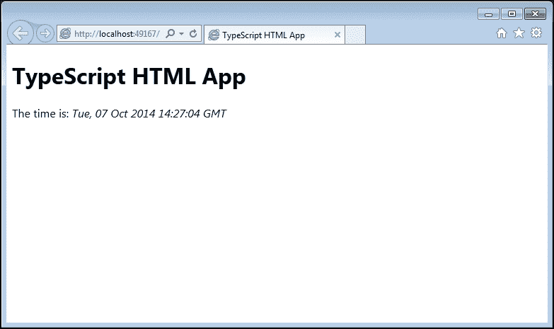
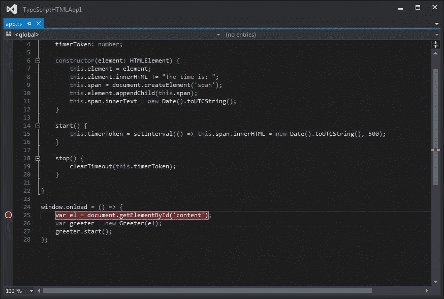
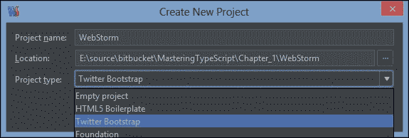
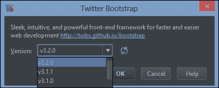
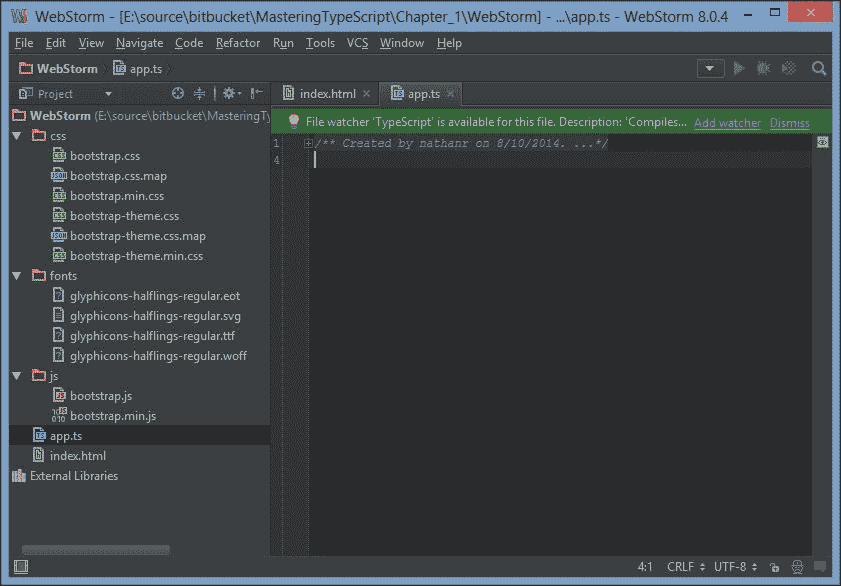
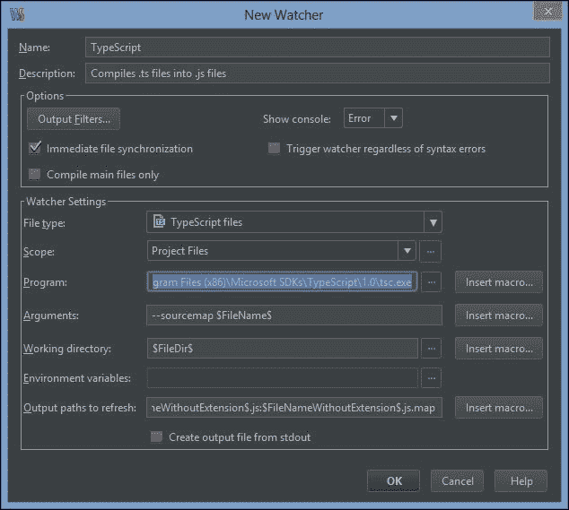
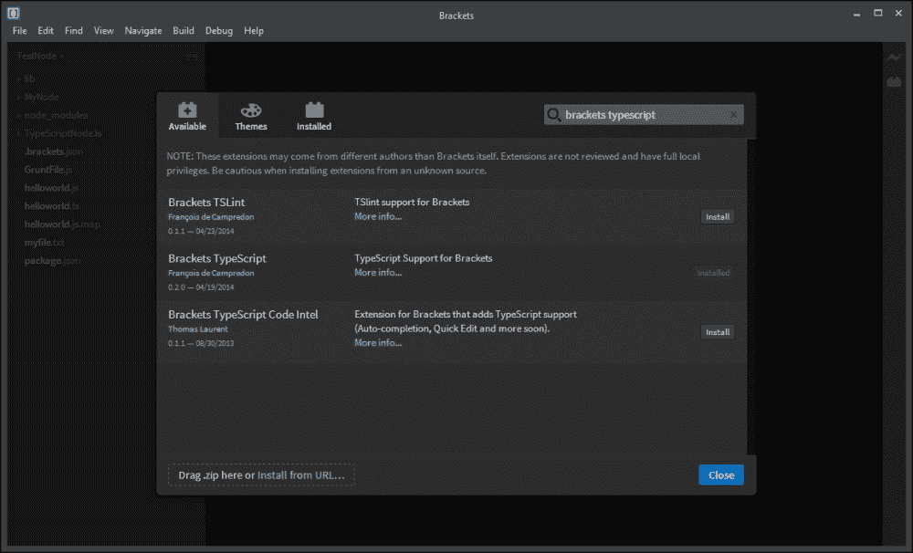
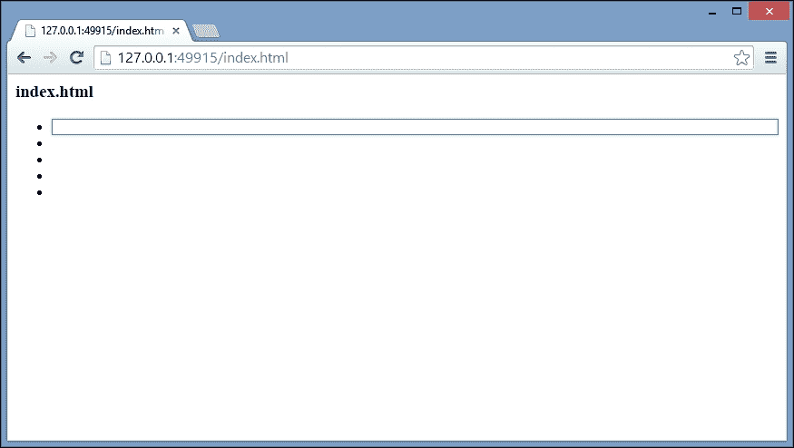
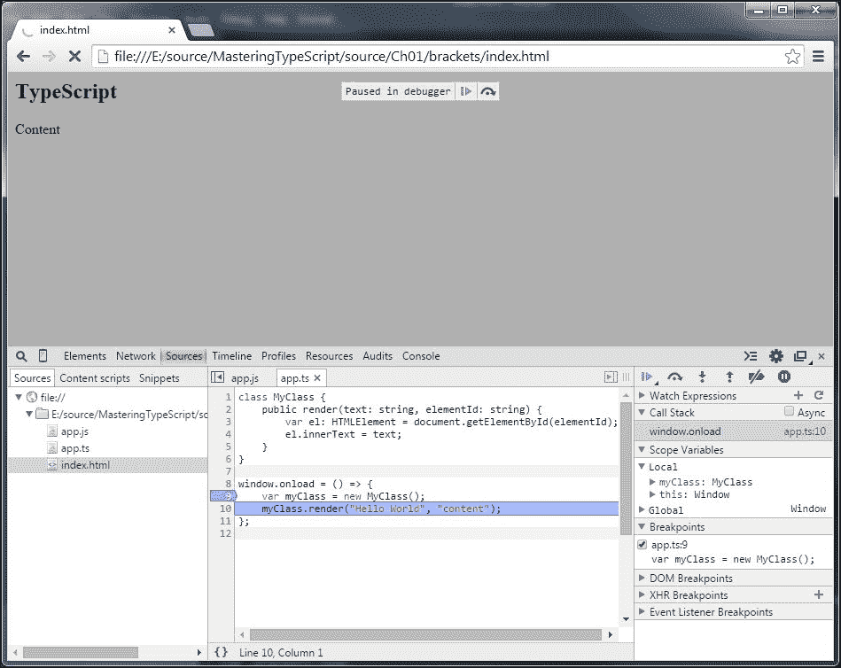

# 一、TypeScript——工具和框架选项

JavaScript 是一种真正无处不在的语言。几乎你在现代世界访问的每个网站都会嵌入某种 JavaScript 组件，以使网站更具响应性、可读性或使用起来更有吸引力。想想过去几个月你访问过的最令人印象深刻的网站。视觉上吸引人吗？它有什么巧妙的表现吗？作为一个用户，它给了你一个发现汽车保险、图片分享或新闻文章的全新方式，让你参与进来了吗？

这就是 JavaScript 的强大之处。JavaScript 是互联网体验的锦上添花，让全球数百万人走“哇。太酷了”。它能产生收入。两个网站可能会以相同的价格提供相同的产品，但吸引客户——并让他们享受网络体验——的网站将吸引最多的追随者并最成功。如果这个网站也能在台式机、手机或平板电脑上无缝复制，那么目标受众——以及目标收入——就能成倍增长。

然而，另一方面，JavaScript 也造成了互联网令人讨厌的一面。那些烦人的广告，你要等 5 秒钟才能点击**跳过**按钮。或者在旧浏览器上不太好用的网站，或者在平板电脑和手机上不能正确呈现的网站。可以说，如果没有 JavaScript，很多网站会更好。

引人入胜的网络体验也能在企业网络应用中发挥作用。一个笨重、难以使用、运行缓慢的 web 应用会让原本热衷于此的公司用户完全反对你的应用。请记住，您的典型企业用户正在将他们的工作体验与他们的日常网络体验进行比较，即设计良好、反应灵敏、直观的界面。毕竟，他们通常是最受欢迎的网站的用户，并开始期待在工作中获得同样的响应。

这种增强的用户体验大部分来自于 JavaScript 的有效使用。异步 JavaScript 请求允许您的网页更快地向用户呈现内容，同时等待后端进程完成繁重、耗时的数据处理任务。

JavaScript 语言并不是一门难学的语言，但是在编写大型复杂程序时，它确实会带来挑战。作为一种解释语言，JavaScript 没有编译步骤，因此是动态执行的。对于习惯于在更正式的环境中编写代码的程序员来说——使用编译器、强类型和成熟的编程模式——JavaScript 可能是一个完全陌生的环境。

TypeScript 弥合了这个差距。这是一种强类型、面向对象的编译语言，允许作为程序员的你在 JavaScript 中重复使用成熟的面向对象语言的概念和思想。TypeScript 编译器生成遵循这些强类型、面向对象原则的 JavaScript——但同时也只是纯 JavaScript。因此，它将在任何可以运行 JavaScript 的地方成功运行——在浏览器、服务器或现代移动设备上。

本章分为两个主要部分。第一部分简要概述了 TypeScript 给 JavaScript 开发体验带来的一些好处。本章的第二部分涉及设置 TypeScript 开发环境。

如果您是一名经验丰富的 TypeScript 程序员，并且已经设置了开发环境，那么您可能希望跳过这一章。如果您以前从未使用过 TypeScript，并且因为想了解 TypeScript 能为您做什么而选择了这本书，那么请继续阅读。

我们将在本章中讨论以下主题:

*   打字稿的好处
    *   汇编
    *   强类型
    *   与流行的 JavaScript 库集成
    *   包装
    *   私有和公共成员变量
*   建立开发环境
    *   可视化工作室
    *   web 图形
    *   括号和咕噜声

# 什么是打字稿？

TypeScript既是一种语言，也是一套生成 JavaScript 的工具。它是由微软的安德斯·海尔斯伯格(C#的设计者)设计的，作为一个开源项目，帮助开发人员编写企业级 JavaScript。JavaScript 已经被世界各地的程序员广泛采用——因为它可以在任何操作系统上的任何浏览器中运行。随着 Node 的创建，JavaScript 现在也可以在服务器、桌面或移动设备上运行。

TypeScript 生成 JavaScript——就这么简单。TypeScript 生成的 JavaScript 不需要全新的运行时环境，而是可以重用所有现有的 JavaScript 工具、框架和大量可供 JavaScript 使用的库。然而，TypeScript 语言和编译器使 JavaScript 的开发更接近传统的面向对象的体验。

## EcmaScript

JavaScript 作为一种语言已经存在了很长时间，也是由一个语言特性标准来管理的。这个标准中定义的语言叫做 ECMAScript，每个浏览器都必须交付符合这个标准的功能和特性。这一标准的定义总体上促进了 JavaScript 和 web 的发展，并允许网站在许多不同操作系统上的许多不同浏览器上正确呈现。ECMAScript 标准于 1999 年发布，被称为 ECMA-262，第三版。

随着该语言的普及，以及互联网应用的爆炸性增长，ECMAScript 标准需要修订和更新。这个过程产生了一个 ECMAScript 规范草案，称为第四版。不幸的是，这份草案建议对语言进行彻底的修改，但没有得到好评。最终，雅虎、谷歌和微软的领导人提出了一个替代方案，他们称之为 ECMAScript 3.1。该建议编号为 3.1，因为它是第三版的一个较小的功能集，位于标准的第 3 版和第 4 版之间。

这一建议最终被采纳为标准的第五版，并被称为 ECMAScript 5。ECMAScript 第四版从未出版，但决定将第四版和 3.1 功能集的最佳功能合并为第六版，命名为 ECMAScript Harmony。

TypeScript 编译器有一个参数，可以修改该参数以针对 ECMAScript 标准的不同版本。TypeScript 目前支持 ECMAScript 3、ECMAScript 5 和 ECMAScript 6。当编译器在您的 TypeScript 上运行时，如果您试图编译的代码对于该特定标准无效，它将生成编译错误。微软的团队还承诺在任何新版本的 TypeScript 编译器中遵循 ECMAScript 标准，因此当新版本被采用时，TypeScript 语言和编译器也将随之而来。

对 ECMAScript 标准的每个版本中包含的细节的理解超出了本书的范围，但是知道它们之间的差异是很重要的。有些浏览器版本不支持 ES5 (IE8 就是一个例子)，但大多数都支持。当为你的项目选择一个 ECMAScript 版本时，你需要考虑你将支持哪个浏览器版本。

## 打字稿的好处

为了让您感受一下 TypeScript 的好处(这绝不是全部)，让我们快速了解一下 TypeScript 带来的一些好处:

*   编译步骤
*   强类型或静态类型
*   流行的 JavaScript 库的类型定义
*   包装
*   私有和公共成员变量装饰器

### 编译

JavaScript 开发最令人沮丧的事情之一是缺少编译步骤。JavaScript 是一种解释语言，因此需要运行才能测试它是否有效。每个 JavaScript 开发人员都会讲述这样的恐怖故事:他们花了几个小时试图找到代码中的 bug，却发现错过了一个小右括号`{`，或者一个简单的逗号`,`，甚至是一个双引号`"`，而这个双引号本应该是单引号`'`。更糟糕的是，当你拼错了一个属性名，或者无意中重新分配了一个全局变量时，真正令人头疼的事情就来了。

TypeScript 将编译您的代码，并在发现这些语法错误时生成编译错误。这显然非常有用，有助于在运行 JavaScript 之前突出显示错误。在大型项目中，程序员通常需要进行大型代码合并——而随着今天的工具进行自动合并——令人惊讶的是，编译器会频繁地发现这些类型的错误。

虽然进行这种语法检查的工具(如 JSLint)已经存在多年，但是将这些工具集成到您的 IDE 中显然是有益的。当发现编译错误时，在连续集成环境中使用 TypeScript 也将使构建完全失败，从而进一步保护您的程序员免受这些类型的错误的影响。

### 强分型

JavaScript 不是强类型。这是一种非常动态的语言，因为它允许对象动态地改变它们的属性和行为。例如，考虑以下代码:

```js
var test = "this is a string";
test = 1;
test = function(a, b) {
    return a + b;
}
```

在这段代码片段的第一行，变量`test`被绑定到一个字符串。然后给它分配一个数字，最后重新定义为一个需要两个参数的函数。然而，传统的面向对象语言不允许变量的类型改变——因此它们被称为强类型语言。

虽然前面的所有代码都是有效的 JavaScript，并且是合理的，但是很容易看出这是如何在执行过程中导致运行时错误的。假设您负责编写一个库函数来添加两个数字，然后另一个开发人员无意中重新分配了您的函数来减去这些数字。

这些类型的错误可能很容易在几行代码中发现，但是随着您的代码基础和开发团队的发展，发现和修复这些错误变得越来越困难。

强类型化的另一个特点是，您正在使用的 IDE 可以理解您正在使用什么类型的变量，并且可以将更好的自动完成或 Intellisense 选项放在前面。

#### TypeScript 的“句法糖”

TypeScript 引入了一种非常简单的语法，可以在编译时检查对象的类型。这种语法被称为“语法糖”，或者更正式地说，类型注释。考虑以下TypeScript代码:

```js
var test: string = "this is a string";
test = 1;
test = function(a, b) { return a + b; }
```

注意在这段代码片段的第一行，我们在变量和它的赋值之间引入了一个冒号`:`和一个`string`关键字。这种类型注释语法意味着我们将变量的类型设置为`string`类型，任何不将其用作字符串的代码都会产生编译错误。通过 TypeScript 编译器运行前面的代码将产生两个错误:

```js
error TS2011: Build: Cannot convert 'number' to 'string'.

error TS2011: Build: Cannot convert '(a: any, b: any) => any' to 'string'.

```

第一个错误相当明显。我们已经指定变量`test`是一个`string`，因此试图给它赋值将会产生一个编译错误。第二个错误类似于第一个错误，本质上是说我们不能将函数赋给字符串。

通过这种方式， TypeScript 编译器为您的 JavaScript 代码引入了强类型或静态类型，为您提供了强类型语言的所有优势。因此，TypeScript 被描述为 JavaScript 的“超集”。我们将在下一章更详细地探讨打字。

### 流行 JavaScript 库的类型定义

正如我们所看到的，TypeScript 具备了对 JavaScript 进行“注释”的能力，给 JavaScript 开发体验带来了很强的打字性。但是我们如何强有力地键入现有的 JavaScript 库呢？答案出奇的简单:通过创建一个定义文件。TypeScript 使用扩展名为`.d.ts`的文件作为一种“头文件”，类似于 C++等语言，将强类型叠加在现有的 JavaScript 库中。这些定义文件包含描述库的每个可用函数和变量的信息，以及它们相关的类型注释。

让我们快速了解一下定义是什么样子的。例如，考虑一个来自流行的 Jasmine 单元测试框架的名为`describe`的函数:

```js
var describe = function(description, specDefinitions) {
  return jasmine.getEnv().describe(description, specDefinitions);
};
```

该功能有两个参数，`description`和`specDefinitions`。然而，仅仅阅读这个 JavaScript 并不能告诉我们这些参数应该是什么样的。`specDefinitions`参数是字符串，还是字符串数组，函数还是其他什么？为了弄清楚这一点，我们需要浏览一下在[http://jasmine.github.io/2.0/introduction.html](http://jasmine.github.io/2.0/introduction.html)找到的茉莉文档。本文档为我们提供了如何使用该功能的有用示例:

```js
describe("A suite", function () {
    it("contains spec with an expectation", function () {
        expect(true).toBe(true);
    });
});
```

那么从文档中，我们很容易看到第一个参数是`string`，第二个参数是`function`。然而，在 JavaScript 语言中没有任何东西迫使我们遵守这个 API。如前所述，我们可以很容易地用两个数字调用这个函数——或者不经意地切换参数，先发送一个函数，然后发送一个字符串。如果我们这样做，我们显然会开始得到运行时错误，但是 TypeScript——使用一个定义文件——会在我们试图运行这段代码之前产生编译时错误。

我们来看一段`jasmine.d.ts`定义文件:

```js
declare function describe(
    description: string, specDefinitions: () => void
): void;
```

这是描述函数的TypeScript定义。首先`declare function describe`告诉我们可以使用一个叫做`describe`的函数，但是这个函数的实现会在运行时提供。

显然，`description`参数被强类型化为类型`string`，而`specDefinitions`参数被强类型化为返回`void`的`function`。TypeScript 使用双大括号`()`语法声明函数，胖箭头语法显示函数的返回类型。所以`() => void`是一个不返回任何东西的函数。最后，描述函数本身将返回`void`。

如果我们的代码尝试传入一个函数作为第一个参数，一个字符串作为第二个参数(显然破坏了这个函数的定义)，如下例所示:

```js
describe(() => { /* function body */}, "description");
```

TypeScript 编译器将立即生成以下错误:

```js
error TS2082: Build: Supplied parameters do not match any signature of call target: Could not apply type "string" to argument 1 which is of type () => void

```

这个错误告诉我们，我们试图用无效参数调用`describe`函数。我们将在后面的章节中更详细地查看定义文件，但是这个例子清楚地表明，如果我们试图不正确地使用外部 JavaScript 库，TypeScript 将会产生错误。

#### 明确输入

TypeScript 发布后不久，鲍里斯·扬科夫在definitiytyped([https://github.com/borisyankov/DefinitelyTyped](https://github.com/borisyankov/DefinitelyTyped))建立了一个 GitHub 存储库来存放定义文件。该存储库现已成为将外部库集成到 TypeScript 中的第一个调用端口，目前包含 500 多个 JavaScript 库的定义。

### 封装

面向对象编程的基本原则之一是封装:将数据以及一组可以对该数据进行操作的函数定义到单个组件中的能力。大多数编程语言都有一个用于此目的的类的概念——提供一种定义数据和相关函数模板的方法。

我们先来看一个简单的 TypeScript 类定义:

```js
class MyClass {
    add(x, y) {
        return x + y;
    }
}

var classInstance = new MyClass();
console.log(classInstance.add(1, 2));
```

这个代码非常简单阅读和理解。我们已经创建了一个名为`MyClass`的`class`，它有一个名为`add`的单一功能。要使用这个类，我们只需创建它的一个实例，并使用两个参数调用`add`函数。

不幸的是，JavaScript 没有`class`关键字，而是使用函数来重现类的功能。通过类的封装是通过使用原型模式或者通过使用闭包模式来完成的。在编写企业级 JavaScript 时，理解原型和闭包模式并正确使用它们被认为是一项基本技能。

闭包本质上是一个引用自变量的函数。这意味着在闭包函数中定义的变量“记住”它们被创建的环境。这为 JavaScript 提供了一种定义局部变量和提供封装的方法。在前面的代码中编写`MyClass`定义，在 JavaScript 中使用闭包看起来像这样:

```js
var MyClass = (function () {
    // the self-invoking function is the 
    // environment that will be remembered
    // by the closure
    function MyClass() {
        // MyClass is the inner function,
        // the closure
    MyClass.prototype.add = function (x, y) {
        return x + y;
    };
    return MyClass;
})();
var classInstance = new MyClass();
console.log("result : " + classInstance.add(1, 2));
```

我们从一个名为`MyClass`的变量开始，并将其分配给一个立即执行的函数——注意代码片段底部附近的`})();`语法。为了避免变量泄漏到全局命名空间中，这种语法是编写 JavaScript 的常用方法。然后我们定义一个名为`MyClass`的新函数，并将这个新函数返回给外部调用函数。然后我们使用`prototype`关键字为`MyClass`定义注入一个新的函数。这个函数被命名为`add`，取两个参数，返回它们的和。

代码的最后两行显示了如何在 JavaScript 中使用这个闭包。创建闭包类型的实例，然后执行 add 函数。在浏览器中运行这个将会把**结果:3** 记录到控制台，正如预期的那样。

### 类型

**下载示例代码**

您可以从您在[http://www.packtpub.com](http://www.packtpub.com)的账户下载您购买的所有 Packt Publishing 书籍的示例代码文件。如果您在其他地方购买了这本书，您可以访问[http://www.packtpub.com/support](http://www.packtpub.com/support%20)并注册，以便将文件直接通过电子邮件发送给您。

查看 JavaScript 代码与 TypeScript 代码，我们可以很容易地看到与等效的 JavaScript 相比，TypeScript 看起来有多简单。还记得我们提到 JavaScript 程序员很容易放错一个括号`{`，或者一个括号`(`吗？看一下闭包定义中的最后一行:`})();`把其中一个括号或大括号弄错可能需要几个小时的调试才能找到。

#### TypeScript 类生成闭包

前面代码片段中显示的 JavaScript 闭包，实际上是 TypeScript 类定义的输出。所以 TypeScript 实际上会为您生成闭包。

### 注

将类的概念添加到 JavaScript 语言中已经讨论了很多年，目前是 ECMAScript 第六版(Harmony)标准的一部分——但这仍然是一项正在进行的工作。微软承诺在 TypeScript 编译器中遵循 ECMAScript 标准，当这些标准发布时。

### 公共和私有访问器

封装中使用的另一个面向对象的原则是数据隐藏的概念——拥有公共和私有变量的能力。私有变量对特定类的用户来说是隐藏的，因为这些变量只能由类本身使用。无意中在类外公开这些变量很容易导致运行时错误。

不幸的是，JavaScript 没有一种声明私有变量的本地方式。虽然这个功能可以使用闭包来模拟，但是很多 JavaScript 程序员只是使用下划线字符`_`来表示私有变量。在运行时，如果你知道一个私有变量的名字，你可以很容易地给它赋值。考虑以下 JavaScript 代码:

```js
var MyClass = (function() {
    function MyClass() {
        this._count = 0;
    }
    MyClass.prototype.countUp = function() {
        this._count ++;
    }
    MyClass.prototype.getCountUp = function() {
        return this._count;
    }
    return MyClass;
}());

var test = new MyClass();
test._count = 17;
console.log("countUp : " + test.getCountUp());
```

`MyClass`变量实际上是一个闭包——有一个构造函数，`countUp`函数和一个`getCountUp`函数。变量`_count`应该是一个私有成员变量，只在闭包的范围内使用。使用下划线命名约定可以让这个类的用户知道这个变量是私有的，但是 JavaScript 仍然允许你操作这个变量`_count`。看看代码片段的最后一行。我们将假定的私有变量`_count`的值显式设置为 17，这是 JavaScript 允许的，但该类的原始创建者并不希望这样。该代码的输出将是**计数:17** 。

然而，TypeScript 引入了`public`和`private`关键词，它们可以用于类成员变量。试图访问标记为`private`的类成员变量将会产生编译时错误。作为一个例子，上面的 JavaScript 代码可以用 TypeScript 编写如下:

```js
class MyClass {
    private _count: number;
    constructor() {
        this._count = 0;
    }
    countUp() {
        this._count++;
    }
    getCount() {
        return this._count;
    }
}

var classInstance = new MyClass();
console.log(classInstance._count);
```

在代码片段的第二行，我们已经声明了一个名为`_count`的`private`成员变量。同样，我们有一个构造函数，一个`countUp`和一个`getCount`函数。如果我们编译这个 TypeScript 代码，编译器将生成一个错误:

```js
error TS2107: Build: 'MyClass._count' is inaccessible.

```

产生这个错误是因为我们试图访问代码最后一行的私有变量`_count`。

因此，TypeScript 编译器正在帮助我们遵守公共和私有访问器——当我们无意中违反这个规则时，会生成一个编译错误。

### 注

但是请记住，这些访问器只是编译时的功能，不会影响生成的 JavaScript。如果您正在编写将被第三方使用的 JavaScript 库，您需要记住这一点。TypeScript 编译器仍然会生成 JavaScript 输出文件，即使存在编译错误。

# TypeScript IDEs

这一部分的目的是让您使用 TypeScript 环境启动并运行，以便您可以编辑、编译、运行和调试您的 TypeScript 代码。TypeScript 已作为开源发布，包括一个 Windows 变体和一个 Node 变体。这意味着编译器将在 Windows、Linux、OS X 和任何其他支持 Node 的操作系统上运行。

在视窗环境中，我们可以安装 Visual Studio——它将在我们的`C:\Program Files`目录中注册`tsc.exe`(TypeScript编译器)，或者我们可以使用节点。在 Linux 和 OS X 环境中，我们需要使用节点。不管怎样，启动命令提示符并输入`tsc –v`应该会显示我们正在使用的编译器的当前版本。在撰写本文时，是版本 1.4.2.0。

在本节中，我们将研究以下 IDEs:

*   Visual Studio 2013
*   web 图形
*   括号

## Visual Studio 2013

首先让我们看看微软的 Visual Studio 2013。这是微软的主 IDE，有多种定价组合。顶端是终极版，然后是高级版，然后是专业版，最后是快速版。Ultimate、Premium 和 Professional 都需要付费许可证，收费范围从 13，000 美元到 1，199 美元。好消息是，微软最近宣布了一个社区版，它可以在非企业环境中使用免费和非付费产品。所有这些版本中都包含了 TypeScript 编译器。

Visual Studio 可以作为网络安装程序下载，也可以作为。国际标准化组织光盘图像。请注意，web 安装程序在安装过程中需要互联网连接，因为它会在安装步骤中下载所需的软件包。Visual Studio 还需要 Internet Explorer 10 或更高版本，但是如果您尚未升级浏览器，它会在安装过程中提示您。如果您正在使用。ISO 安装程序，请记住，如果您有一段时间没有使用 Windows Update 更新系统，您可能需要下载并安装额外的操作系统补丁。

### 创建 Visual Studio 项目

一旦安装了 Visual Studio ，启动它并创建一个新项目(**文件** | **新项目**)。在左侧的**模板**部分下，您将看到一个 TypeScript 选项。当选择此选项时，您将能够使用名为**的项目模板和带有 T8 的TypeScript的 Html 应用。输入项目的名称和位置，然后单击**确定**生成一个TypeScript项目:**


visual Studio–选择TypeScript项目类型

### 注

这不是唯一一个使用 TypeScript 的项目模板。任何 ASP.NET 项目类型都支持开箱即用的TypeScript。如果您计划使用网络应用编程接口来提供 RESTful 数据控制器，那么您可以考虑从一开始就创建一个 MVC 网络应用。然后，通过简单地包含一个TypeScript文件，并在项目中指定一个`.ts`文件扩展名，Visual Studio 将自动开始编译您的TypeScript文件，作为新项目的一部分。

### 默认项目设置

一旦创建了新的 TypeScript 项目，请注意项目模板会自动为我们生成几个文件:

*   `app.css`
*   `app.ts`
*   `index.html`
*   `web.config`

如果我们现在编译然后运行这个项目，我们将马上有一个完整的、正在运行的 TypeScript 应用:



运行在互联网浏览器中的 index.html

让我们快速查看一下生成的 index.html 文件及其内容:

```js
<!DOCTYPE html>

<html lang="en">
<head>
    <meta charset="utf-8" />
    <title>TypeScript HTML App</title>
    <link rel="stylesheet" href="app.css" type="text/css" />
    <script src="app.js"></script>
</head>
<body>
    <h1>TypeScript HTML App</h1>

    <div id="content"></div>
</body>
</html>
```

这是一个非常简单的 HTML 文件，包括`app.css`样式表，以及一个名为`app.js`的 JavaScript 文件。这个`app.js`文件是编译项目时从`app.ts`TypeScript文件生成的 JavaScript 文件。

### 注

`app.js`文件不包含在**解决方案资源管理器**中–仅包含`app.ts`TypeScript文件。这是设计好的。如果您希望看到生成的 JavaScript 文件，只需点击**解决方案浏览器**工具栏中的**显示所有文件**按钮。

### 在 Visual Studio 中调试

Visual Studio 最好的特性之一是它是一个真正的集成环境。在 Visual Studio 中调试 TypeScript 与在 Visual Studio 中调试 c#–或任何其他语言–完全相同，包括通常的**即时**、**本地人**、**观察**和**调用堆栈**窗口。

要在 Visual Studio 中调试 TypeScript，只需在您的 TypeScript 文件中您希望中断的行上放置一个断点(将鼠标移动到源代码行旁边的断点区域，然后单击)。在下图中，我们在`window.onload`函数中放置了一个断点。

要开始调试，只需点击 *F5* 。



代码中设置了断点的 Visual Studio TypeScript 编辑器

当源代码行以黄色突出显示时，只需将鼠标悬停在源代码中的任何变量上，或者使用**即时**、**观察**、**局部变量**或**调用堆栈**窗口。

### 注

Visual Studio 仅支持在 Internet Explorer 中进行调试。如果您的机器上安装了多个浏览器，请确保在**调试**工具栏中选择了 Internet Explorer，如下图所示:


显示浏览器选项的 Visual Studio 调试工具栏

## 网络形态

WebStorm 是由 jetbarks([http://www.jetbrains.com/webstorm/](http://www.jetbrains.com/webstorm/))推出的流行 IDE，将在 Windows、Mac OS X 和 Linux 上运行。价格从单个开发商的 49 美元到商业许可证的 99 美元不等。JetBrains 还提供 30 天的试用版。

网络风暴有几个很棒的特性，包括实时编辑和代码建议，或者智能感知。实时编辑功能允许您保持浏览器窗口打开，当您键入时，网络风暴将根据对 CSS、HTML 和 JavaScript 的更改自动更新该窗口。代码建议——也可以在另一个流行的名为 Resharper 的 JetBrains 产品中获得——将突出显示您已经编写的代码，并提出实现它的更好方法。WebStorm 也有大量的项目模板。这些模板将自动下载并包含模板所需的相关 JavaScript 或 CSS 文件，如 Twitter Bootstrap 或 HTML5 样板。

设置 WebStorm 就像从网站下载软件包并运行安装程序一样简单。

### 创建网络风暴项目

要创建新的网络风暴项目，只需启动它，并点击**文件** | **新项目**。选择一个**名称**、**位置**和**项目类型**。对于这个项目，我们选择了`Twitter Bootstrap`作为项目类型，如下图截图所示:



“创建新项目”对话框

然后，网络风暴会要求你选择你打算开发的推特助推器版本。在这个例子中，我们选择了版本`v3.2.0`。



网络风暴选择推特助推器版本对话框

### 默认文件

作为新项目的一部分，网络风暴已经方便地创建了一个`css`、`fonts`和`js`目录，并为我们下载和包含了相关的 CSS、字体文件和 JavaScript 文件，以便开始构建一个新的基于 Bootstrap 的网站。请注意，它没有为我们创建`index.html`文件，也没有像 Visual Studio 那样创建任何TypeScript文件。使用 TypeScript 一段时间后，大多数开发人员还是会删除这些通用文件。所以让我们创建一个`index.html`文件。

只需点击**文件** | **新建**，选择 HTML 文件，输入`index`作为名称，点击**确定**。

接下来，让我们以类似的方式创建一个 TypeScript 文件。我们将此文件称为`app`(或`app.ts`)，与 Visual Studio 默认项目示例中的相同。当我们点击新的`app.ts`文件时，网络风暴将在我们的编辑窗口顶部弹出一个绿色栏，并显示一条建议，该文件有**文件观察器“TypeScript”，如下图所示:**



首次显示文件观察器栏编辑一个TypeScript文件

网络风暴“文件观察器”是一个后台进程，一旦你保存了文件，它就会执行。这相当于 Visual Studio 的**保存时编译**TypeScript选项。正如 WebStorm 所建议的，现在是激活 TypeScript 文件观察器的好时机。点击绿色栏中的**添加守望者**链接，在下一屏填写详细信息。

除了**程序**设置外，我们可以暂时保留下一个屏幕上的默认值:

如果你在 Windows 上运行，并且已经安装了 Visual Studio，那么这个应该设置为`tsc.exe`可执行文件的完整路径，即`C:\Program Files (x86)\Microsoft SDKs\TypeScript\1.0\tsc.exe`，如下图截图所示:

如果你在一个非 windows 的盒子上运行，或者已经通过 Node 安装了 TypeScript，那么这个将被设置为`tsc`，没有路径。



WebStorm 新文件观察器选项屏幕

现在我们已经为我们的TypeScript文件创建了一个文件观察器，让我们创建一个简单的TypeScript类，它将修改一个 HTML `div`的`innerText`。当您键入时，您会注意到 WebStorm 的自动完成或 Intellisense 功能可以帮助您获得可用的关键字、参数、命名约定和大量其他特定于语言的信息。这是 WebStorm 最强大的功能之一，类似于在 JetBrain 为 Visual Studio 开发的 Resharper 工具中看到的增强的 Intellisense。继续输入下面的 TypeScript 代码，在此期间，您会对 WebStorm 可用的自动完成功能有很好的感受。

```js
class MyClass {
    public render(divId: string, text: string) {
        var el: HTMLElement = document.getElementById(divId);
        el.innerText = text;
    }
}

window.onload = () => {
    var myClass = new MyClass();
    myClass.render("content", "Hello World");
}
```

我们从`MyClass`类定义开始，它只是有一个名为`render`的函数。这个`render`函数以一个 DOM 元素名和一个文本字符串作为参数。然后简单地找到 DOM 元素，并设置`innerText`属性。请注意在变量`el`上使用强类型–我们已经明确地将它键入为`HTMLElement`类型。

我们还为`window.onload`事件分配了一个函数，该函数将在页面加载后执行，类似于 Visual Studio 示例。在这个函数中，我们只是创建一个`MyClass`的实例，并使用两个字符串参数调用`render`函数。

如果您的 TypeScript 文件中有任何错误，这些错误将自动显示在输出窗口中，在您键入时给您即时反馈。创建了这个 TypeScript 文件后，我们现在可以将其包含在我们的`index.html`文件中，并尝试一些调试。

打开`index.html`文件，添加一个`script`标签来包含`app.js` JavaScript 文件，以及一个带有`"content"`的`id`的`div`。正如我们在 TypeScript 编辑中看到的那样，您会发现 WebStorm 在编辑 HTML 时也具有强大的 Intellisense 功能。

```js
<!DOCTYPE html>
<html>
<head lang="en">
    <meta charset="UTF-8">
    <title></title>
    <script src="app.js" type="application/javascript"></script>
</head>
<body>
    <h2>Index.html</h2>
    <div id="content"></div>
</body>
</html>
```

在前面的代码中有几点需要注意。我们正在为`app.js` JavaScript 文件添加一个脚本标签，因为这是 TypeScript 编译器将生成的输出文件。我们还创建了一个 id 为`content`的 HTML `<div>`，这个`MyClass`类的实例将使用它来呈现我们的文本。

### 在 Chrome 中运行网页

在 WebStorm 中查看或编辑 HTML 文件时，会注意到编辑窗口右上角会弹出一小组浏览器图标。单击任何一个图标，将使用选定的浏览器启动您当前的 HTML 页面。


编辑一个显示弹出浏览器启动图标的 HTML 文件

### 在 Chrome 中调试

正如我们在 Visual Studio 中看到的，在 WebStorm 中调试只是简单的标记一个断点，然后点击 *Alt* + *F5* 即可。WebStorm 使用一个 Chrome 插件来支持 Chrome 中的调试。如果您没有安装这个插件，WebStorm 会在您第一次开始调试时提示您下载并启用喷气大脑 IDE 支持 Chrome 插件。启用这个插件后，WebStorm 有一套非常强大的工具来检查 JavaScript 代码、添加观察器、查看控制台等等，就在 ide 内部。


显示调试器面板的 WebStorm 调试会话

## 括号

我们将在本章中看到的最后一个 IDE 实际上并不是一个用于 TypeScript 的 IDE ，它更像是一个用于具有 TypeScript 编辑功能的网页设计师的 IDE。括号是一个开源的代码编辑器，非常擅长帮助设计和设计网页。与 WebStorm 类似，它有一个实时编辑模式，当您键入时，您可以在运行的网页上看到对 HTML 或 CSS 的更改。在我们的开发团队中，括号已经成为一个非常受欢迎的编辑器，用于 HTML 网页和 CSS 样式的快速原型制作。

本章包含括号有几个原因。首先，它是完全开源的，因此是完全免费的——它运行在 Windows、Linux 和 Mac OS X 上。其次，使用一个括号环境展示了一个简单的 TypeScript 环境，只有一个文本编辑器和命令行。最后，括号表明开源项目的语法高亮和代码完成能力可以和商业 IDEs 一样好，甚至更快。

### 安装支架

括号可以通过首选安装程序从[下载。一旦](http://brackets.io)安装完毕，我们将需要安装一些扩展。支架有一个非常光滑和简单的扩展管理器，它很容易使用，并且允许我们很容易地找到和安装可用的扩展。任何时候只要有对支架或您安装的扩展的更新，支架都会自动通知您。

要安装扩展，打开支架，点击**文件** | **扩展管理器**，或者点击右侧垂直边栏上的乐高积木图标。

首先，我们需要安装 TypeScript 扩展。在搜索栏中，键入`brackets typescript`，并安装从**弗朗索瓦·德·坎普雷顿**开始的**支架TypeScript**扩展。

从下面的截图中可以看出，每个扩展都有一个**更多信息……**链接——该链接将带您进入扩展主页。



括号扩展管理器界面

除了**括号TypeScript**扩展，另一个有用的扩展是由**帕特里克·奥拉迪米吉**进行的**代码折叠**。这将允许您折叠或展开正在编辑的任何文件中的代码段。

另一个很好的节约时间的方法是谢尔盖·奇库乔诺克的《T2》。Emmet(以前被称为 Zen Coding)使用一个类似 CSS 的短手，而不是传统的代码片段来生成 HTML。在这一节中，我们将快速展示如何使用埃米特来生成 HTML，就像一个引子一样。所以继续安装埃米特扩展。

### 创建括号项目

括号本身并没有项目的概念，而只是在一个根文件夹上工作。在文件系统上创建一个目录，然后打开括号中的文件夹:**文件** | **打开文件夹**。

现在让我们使用括号创建一个简单的 HTML 页面。**选择文件** | **新建**，或 *Ctrl* + *N* 。在我们面前的中有一个空白文件，我们将使用埃米特来生成我们的 HTML。键入以下埃米特字符串:

```js
html>head+body>h3{index.html}+div#content
```

现在点击 *Ctrl* + *Alt* + *进入*，或者从**文件菜单**中选择**埃米特** | **展开缩写**。

瞧啊。Emmet 在一毫秒内生成了以下 HTML 代码——对于一行源代码来说还不错:

```js
<html>
<head></head>
<body>
    <h3>index.html</h3>
    <div id="content"></div>
</body>
</html>
```

点击 *Ctrl* + *S* 保存文件，进入`index.html`。

### 注

只有当我们保存了一个文件后，括号才会开始根据文件扩展名进行语法高亮显示。任何括号文件都是如此，所以一旦你创建了一个文件——TypeScript、CSS 或 HTML，尽快把它保存到磁盘上。

回到埃米特。

埃米特用`>`字符创建一个孩子，用`+`字符表示一个兄弟姐妹。如果在一个元素旁边指定花括号`{ }`，这将被用作文本内容。

我们之前输入的 Emmet 字符串基本上是这样说的:“用一个子标签`head`创建一个`html`标签。然后创建另一个名为`body`的`html`子标签，用文本`"index.html"`创建一个子`h3`标签，然后用`content`的`id`创建一个作为`body`子的兄弟`div`标签。”一定要前往 [http://emmet.io](http://emmet.io) 获取进一步的文档，在学习 emmet 字符串快捷方式时，记得将备忘单放在手边([http://docs.emmet.io/cheat-sheet](http://docs.emmet.io/cheat-sheet))。

现在让我们用一个脚本来加载我们的TypeScript生成的 JavaScript 文件来结束我们的`index.html`。将光标移动到`<head></head>`标签之间，并键入另一个埃米特字符串:

```js
script:src
```

现在点击 *Ctrl* + *Alt* + *回车*，让埃米特生成一个`<script src=""></script>`标签，并将光标放在报价之间，方便您简单地填空。现在输入 JavaScript 文件名`app.js`。

您完整的 index.html 文件现在应该如下所示:

```js
<html>
<head>
    <script src="app.js"></script>
</head>
<body>
    <h3>index.html</h3>
    <div id="content"></div>
</body>
</html>
```

这就是我们示例 HTML 页面所需要的全部。

### 使用括号实时预览

在括号内，点击屏幕最右侧的**实时预览**图标——这是电动之字形图标——就在乐高积木包图标上方。这将启动 Chrome 并在实时预览模式下渲染我们的`index.html`。只是为了展示如何使用括号进行实时预览，保持这个 Chrome 窗口可见，并导航回括号。您应该能够同时看到两个窗口。

现在编辑`index.html`文件，并在您的`<div id="content"></div>`元素下键入以下埃米特速记:

```js
ul>li.item$*5
```

再次点击 *Ctrl* + *Alt* + *进入*，注意生成的`<ul>`和`<li>`标签(其中 5 个)是如何在你的 Chrome 浏览器中自动显示的。当您在源代码中上下移动插入符号时，请注意 Chrome 中的蓝色轮廓如何显示网页中的元素。



在实时预览模式下运行 Chrome 的括号，显示突出显示的元素

我们的应用不需要这些`<ul> <li>`标签，所以只需 *Ctrl* + *Z* 、 *Ctrl* + *Z* 来撤销我们的更改或删除标签。

### 创建TypeScript文件

创建我们非常简单的 TypeScript 应用，点击 *Ctrl* + *N* (新文件) *Ctrl* + *S* (保存文件)并使用`app.ts`作为您的文件名。开始键入以下代码，并注意支架如何动态执行自动完成或智能感知，类似于 Visual Studio 和 WebStorm:

```js
class MyClass {
    render( elementId: string, text: string) {
        var el: HTMLElement = document.getElementById(elementId);
        el.innerHTML = text;
    }
}
window.onload = () => {
    var myClass = new MyClass();
    myClass.render("content", "Hello world!");
}
```

这与我们之前使用的代码相同，只是创建了一个名为`MyClass`的 TypeScript 类，该类只有一个`render`函数。这个`render`函数获取一个 DOM 元素，并修改它的`innerHTML`属性。`window.onload`函数创建这个类的一个实例，然后用适当的参数调用`render`函数。

如果在任何阶段点击 *Ctrl* + *S* 来保存文件，括号将调用 TypeScript 语言引擎来验证我们的 TypeScript，并在底部窗口窗格中呈现任何错误。在下面的截图中，我们可以清楚地看到我们缺少了一个右大括号`}`。


括号编辑 TypeScript 文件并显示编译错误

方括号不会调用 TypeScript 编译器来生成`app.js`文件——它只是在这个阶段解析 TypeScript 代码，并突出显示任何错误。双击**TypeScript问题**窗格中的错误将跳转到有问题的行。

### 编译我们的TypeScript

在我们能够运行我们的应用之前，我们需要通过调用 TypeScript 编译器将`app.ts`文件编译成`app.js`文件。打开命令提示符，切换到您的源目录，只需键入:

```js
tsc app.ts

```

该命令将调用`tsc`命令行编译器，并从我们的`app.ts`文件创建一个`app.js`文件。

现在我们在这个目录中有了一个`app.js`文件，我们可以再次调用**实时预览**按钮，现在看到我们的 TypeScript 应用确实已经渲染了 **Hello world！**正文为`innerHTML`的内容`div`:


括号实时预览运行我们的 TypeScript 应用

### 使用咕噜声

显然，每次我们进行更改时，都必须切换到命令提示符并手动编译每个TypeScript文件，这将是非常繁琐的。Grunt 是一个自动化的任务运行器([http://gruntjs.com](http://gruntjs.com)),它可以自动化许多繁琐的编译、构建和测试任务。在本节中，我们将使用 Grunt 来监视 TypeScript 文件，并在文件保存时调用`tsc`编译器。这与我们之前使用的 WebStorm 的文件监视功能非常相似。

Grunt 在节点环境中运行。Node 是一个开源的、跨平台的运行时环境，它的程序是用 JavaScript 编写的。为了运行 Grunt，我们需要安装 Node。Windows、Linux、OS X 的安装程序可以在节点网站([http://nodejs.org/](http://nodejs.org/))找到。节点安装完成后，我们可以使用 **npm** ( **节点包管理器**)安装 Grunt 和 Grunt 命令行界面。

Grunt 需要作为项目的 npm 依赖项进行安装。它不能像大多数 npm 包那样全局安装。为此，我们需要在根项目中创建一个`packages.json`文件。打开命令提示符，导航到您的括号项目的根目录。然后简单地键入:

```js
npm init

```

按照提示操作。您几乎可以将所有选项保留为默认值，如果您需要调整任何更改，请始终返回编辑从这一步创建的`packages.json`文件。包初始化步骤完成后，我们现在可以如下安装 Grunt:

```js
npm install grunt –save-dev

```

`-save-dev`选项将在项目目录中安装一个本地版本的 Grunt。这样做是为了让您机器上的多个项目可以使用不同版本的 Grunt。我们还需要`grunt-typescript`套餐，以及`grunt-contrib-watch`套餐。这些可以通过以下 npm 命令安装:

```js
Npm install grunt-typescript –save-dev

Npm install grunt-contrib-watch –save-dev.

```

最后，我们需要一个`GruntFile.js`作为咕噜的入口点。使用括号，新建一个文件，保存为`GruntFile.js`，输入如下 JavaScript。请注意，我们在这里创建的是一个 JavaScript 文件，而不是一个 TypeScript 文件。您可以在本章附带的示例源代码中找到该文件的副本。

```js
module.exports = function (grunt) {
    grunt.loadNpmTasks('grunt-typescript');
    grunt.loadNpmTasks('grunt-contrib-watch');
    grunt.initConfig({
        pkg: grunt.file.readJSON('package.json'),
        typescript: {
            base: {
                src: ['**/*.ts'],
                options: {
                    module: 'commonjs',
                    target: 'es5',
                    sourceMap: true
                }
            }
        },
        watch: {
            files: '**/*.ts',
            tasks: ['typescript']
        }
    });

   //grunt.registerTask('default', ['typescript']);
    grunt.registerTask('default', ['watch']);
}
```

这个`GruntFile.js`是设置所有咕噜任务所必需的。这是一个简单的函数，Grunt 使用它来初始化 Grunt 环境，并指定 Grunt 命令。该功能的前两行是加载`grunt-typescript`和`grunt-contrib-watch`任务，然后运行带有配置部分的`grunt.initConfig`功能。该配置部分具有`pkg`属性、`typescript`属性和`watch`属性。通过读取我们之前在 npm 初始化步骤中创建的`package.json`文件来设置`pkg`属性。

`typescript`属性有一个`base`属性，在这个属性中，我们指定源文件应该是`'**/*.ts'`——换句话说，任何子目录中的所有`.ts`文件。我们还指定了一些TypeScript选项——使用`'commonjs'`模块代替`'amd'`模块，并生成源地图。

`watch`属性有两个子属性。`files`属性指定在我们的源树中监视任何`.ts`文件，而`tasks`数组指定一旦文件被更改，我们就应该启动 TypeScript 命令。最后我们调用`grunt.registerTask`，指定默认任务是观察文件变化。Grunt 将在后台运行，监视保存的文件，如果找到，将执行 TypeScript 任务。

我们现在可以从命令行运行 Grunt。确保您在支架项目的基本目录中，并启动 Grunt:

```js
Grunt

```

打开你的`app.ts`文件，做个小改动(加个空格什么的)，然后点击 *Ctrl* + *S* 保存。现在检查一下 Grunt 命令行的输出。你应该看到这样的东西:

```js
>> File "app.ts" changed.

Running "typescript:base" (typescript) task

2 files created. js: 1 file, map: 1 file, declaration: 0 files (861ms)

Done, without errors.

Completed in 1.665s at Fri Oct 10 2014 11:24:47 GMT+0800 (W. Australia Standard Time) - Waiting...

```

这个命令行输出是确认 Grunt 观察任务已经识别出`app.ts`已经改变，运行 TypeScript 任务，创建了两个文件，现在正在等待下一个文件改变。回到括号，我们现在应该在括号文件窗格中看到由咕噜创建的`app.js`文件。

### 在 Chrome 中调试

由于括号只是作为编辑器使用，我们将需要使用标准的 Chrome 开发工具调试我们的应用。我们在`GruntFile.js`中为TypeScript指定的一个选项是打开源地图(`options { sourceMap : true }`)。有了这个选项，Chrome 和其他浏览器可以将运行的 JavaScript 映射回源 TypeScript 文件。这意味着您可以在TypeScript文件中设置调试器断点，并在调试时遍历TypeScript文件。

要调试我们的示例应用，首先在**直播预览**模式下获取运行的`index.html`页面，点击 *F12* 调出开发工具。Chrome 为开发人员提供了许多工具，包括网络、控制台和元素来检查 DOM。点击**来源**选项卡，点击 *Ctrl* + *P* 打开文件。向下滚动至`app.ts`，点击*进入*。在第 9 行(`var myClass = new MyClass()`)放置一个断点，然后重新加载页面。

Chrome 应该在调试器模式下暂停页面，如下所示:



括号使用 Chrome 开发工具调试 TypeScript。

现在，您可以尽情使用所有 Chrome 调试工具。

# 总结

在本章中，我们已经快速了解了什么是 TypeScript，以及它能给 JavaScript 开发体验带来什么好处。我们还研究了使用两个流行的商业 IDEs 和一个开源开发环境来建立开发环境。现在我们已经有了一个开发环境设置，我们可以开始更详细地研究 TypeScript 语言本身了。我们将从类型开始，转到变量，然后在下一章讨论函数。