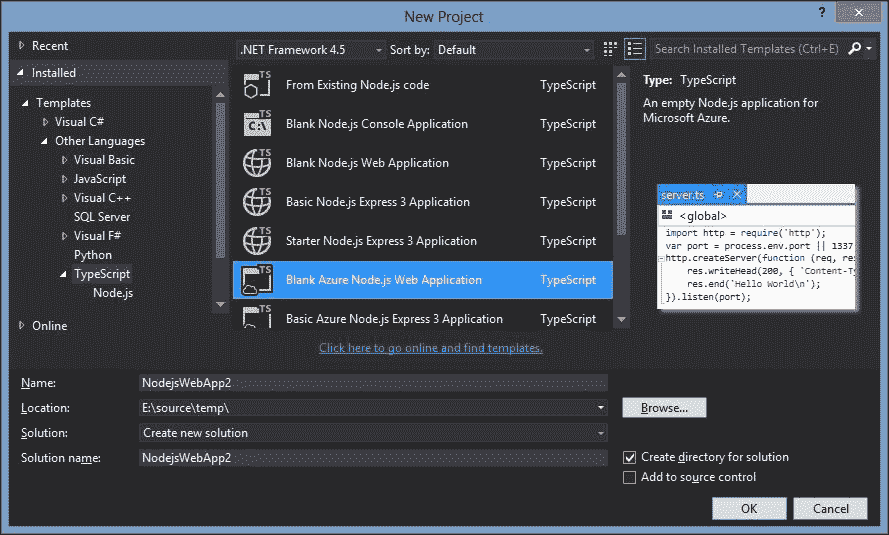
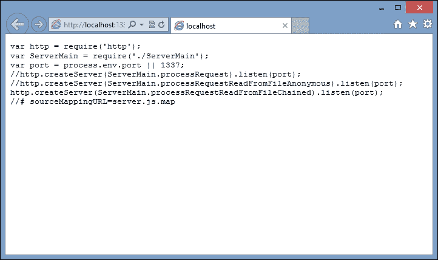
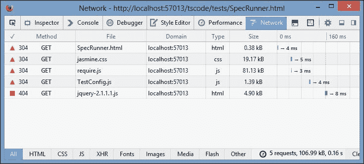
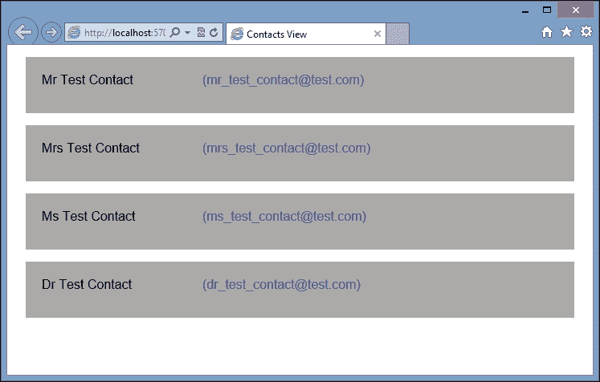
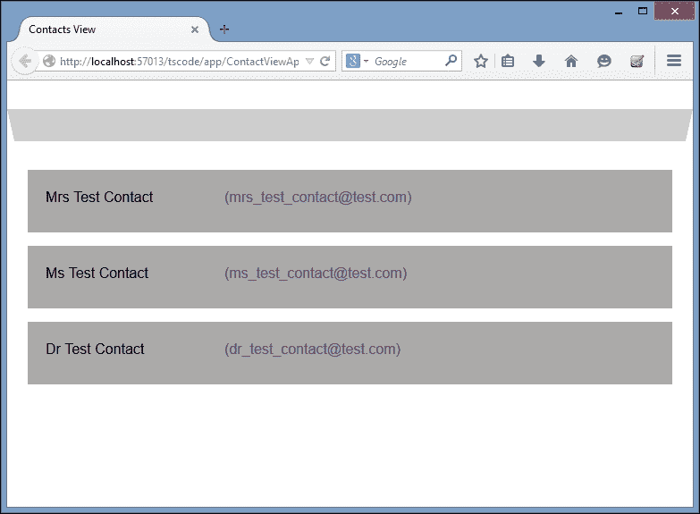

# 七、模块化

模块化是现代编程语言中使用的一种流行技术，它允许程序由一系列更小的程序或模块构建而成。编写使用模块的程序鼓励程序员编写符合名为“关注点分离”的设计原则的代码。换句话说，每个模块都专注于做一件事，并且有一个明确定义的接口。如果我们通过关注接口来使用这个模块，我们可以很容易地用其他东西替换这个接口，而不会破坏我们的代码。在下一章中，我们将更加关注“关注点分离”和其他面向对象的设计模式。

JavaScript 本身并没有模块的概念，但它是为即将到来的 ECMAScript 6 标准提出的。流行的框架和库，如 Node 和 Require，已经在其框架中构建了模块加载功能。然而，这些框架使用稍微不同的语法。节点使用 CommonJS 语法进行模块加载，而 Require 使用**异步模块加载** ( **AMD** )语法。TypeScript 编译器有一个打开模块编译的选项，然后在这两种语法风格之间切换。

在本章中，我们将研究这两种模块样式的语法，以及 TypeScript 编译器如何实现它们。我们将了解在为 Node 和 Require 编写代码时如何使用模块。我们还将粗略地看一下主干，以及如何使用模型、视图和控制器编写应用。这些主干组件中的每一个都将被构建为可加载模块。

# 共同

用于编写模块的 CommonJs 语法最普遍的用法是在编写服务器端代码时。有人认为，基于浏览器的 CommonJs 语法在没有大量开销的情况下是做不到的，但是有一些库，比如 Curl([https://github.com/cujojs/curl](https://github.com/cujojs/curl))允许这种语法。然而，在本节中，我们将重点关注节点应用开发。

## 在 Visual Studio 中设置节点

在 Visual Studio 中使用节点已经被 Visual Studio 插件([https://nodejstools.codeplex.com](https://nodejstools.codeplex.com))的节点工具变得轻而易举。该工具集也进行了更新，使用 TypeScript 作为默认编辑器，为 Node 带来完整的 TypeScript 开发体验。安装扩展后，我们可以创建一个新的空白节点应用，如下图所示:



使用节点工具集创建空白节点应用

该项目模板将创建一个`server.ts`TypeScript 文件，并自动为我们包含`node.d.ts`声明文件。如果我们通过简单地点击 *F5* 来编译和运行这个默认实现，项目模板将自动启动一个新的控制台来运行我们的节点服务器，启动服务器实例，并打开一个浏览器来连接到这个实例。如果在这个阶段一切顺利，你的浏览器只会说**你好世界**。

让我们看一下`server.ts`TypeScript 文件，它正在创建我们的节点服务器的一个实例:

```js
import _http = require('http');
var port = process.env.port || 1337
http.createServer(function (req, res) {
    res.writeHead(200, { 'Content-Type': 'text/plain' });
    res.end('Hello World\n');
}).listen(port);
```

这段代码片段的第一行使用 CommonJs 模块语法告诉我们的 Node 服务器它必须`import`名为`'http'`的库。

这条线有两个关键部分。为了解释这些关键部分，让我们从`=`标志的右侧开始，向左走。`require`函数接受单个参数，用于告诉应用外面有一个名为`'http'`的库。`require`功能还告诉应用它需要这个库对它可用，以便继续运行。由于`require`是 TypeScript 中模块语法的关键部分，它已经被赋予了关键字状态，并且会以蓝色突出显示，就像其他关键字如`var`、`string`、`function`一样。如果应用找不到这个`'http'`库，那么 Node 会立即抛出异常。

`=`符号的左侧使用`import`关键字，这也是模块语法中的一个基本概念。`import`语句告诉应用将通过`require`函数`require('http')`加载的库附加到名为`_http`的命名空间中。无论`'http'`库公开了什么函数或对象，程序都可以通过`_http`命名空间使用。

如果我们很快跳到第三行，我们可以看到我们调用了一个在`'http'`模块中定义的名为`createServer`的函数，并通过`_http`命名空间调用它。遂`_http.createServer()`。

### 注

由空白节点项目模板生成的默认`server.ts`文件与我们前面的代码示例略有不同。它将与库名`'http',`匹配的导入命名为`http`，如下所示:

`import http = require('http');`

这是节点的通用命名标准。当然，您可以随意命名您的导入命名空间，但是命名空间与导入库的名称相匹配确实有助于提高代码的可读性。

我们代码片段的第二行简单地将名为`port`的变量设置为全局变量`process.env.port`的值，或者`1337`的默认值。这个端口号用在最后一行，使用流畅的语法在`http.createServer`函数的返回值上调用`listen`函数。

我们的`createServer`函数有两个名为`req`和`res`的变量。如果我们用鼠标悬停在`req`变量上，我们可以看到它是`_http.ServerRequest`类型的。类似地，`res`变量属于`_http.ServerResponse`类型。这两个变量是我们的 HTTP 请求和响应流。在代码主体中，我们调用 HTTP 响应上的`writeHead`函数来设置内容类型，然后调用 HTTP 响应上的`end`函数来将文本`'Hello World\n'`写入浏览器。

通过这几行代码，我们创建了一个运行中的节点 HTTP 服务器，它提供了一个简单的网页，文本为“T2”“你好世界”“T3”。

注意，如果你对 TypeScript 语法有敏锐的眼光，你会注意到这个文件使用的是 JavaScript 语法，而不是我们`createServer`函数的 TypeScript 语法。这很可能是由于最近节点工具集从 JavaScript 升级到了 TypeScript。对`createServer`的调用也可以使用如下的 TypeScript 胖箭头语法编写:

```js
_http.createServer((req, res) => { .. }
```

## 创建节点模块

为了创建一个节点模块，我们只需要创建另一个 TypeScript 文件来存放我们的模块代码。让我们创建一个名为`ServerMain.ts`的文件，并将写入 HTTP 响应的代码移动到这个模块中，如下所示:

```js
import http = require('http');
export function processRequest(
    req: http.ServerRequest,
    res: http.ServerResponse): void
{
    res.writeHead(200, { 'Content-Type': 'text/plain' });
    res.end('Hello World\n');
}
```

我们的`ServerMain`模块从`'http'`模块的`import`开始进入`http`命名空间。这是必要的，以允许我们使用`ServerRequest`和`ServerResponse`类型，这是这个库的一部分。

关键字`export`现在用于指示该模块的用户可以使用哪些功能。如我们所见，我们导出了一个名为`processRequest`的函数，它接受两个参数，`req`和`res`。这个函数将被用来替代我们之前在`server.ts`文件中使用的匿名函数`(req, res) => { … }`。

请注意，作为优秀的 TypeScript 编码者，我们还将`req`和`res`变量分别强类型为`http.ServerRequest`和`http.ServerResponse`类型。这将在我们的集成开发环境中启用智能感知，并遵循强类型化的两个原则(简单函数和自描述函数)。

在我们修改`server.ts`文件以使用我们的新模块之前，让我们打开生成的 JavaScript 文件，并更详细地查看 CommonJs 语法:

```js
function processRequest(req, res) {
    res.writeHead(200, { 'Content-Type': 'text/plain' });
    res.end('Hello World\n');
}
exports.processRequest = processRequest;
```

这个 JavaScript 的第一部分很简单——我们有一个名为`processRequest`的函数。然而，最后一行将这个函数附加到`exports`全局变量的属性上。这个`exports`全局变量就是 CommonJs 如何向外界发布模块。任何需要对外公开的函数、类或属性都必须附加到`exports`全局变量。每当我们在 TypeScript 文件中使用`exports`关键字时，TypeScript 编译器都会为我们生成这一行代码。

## 使用节点模块

现在我们已经有了模块，我们可以修改我们的`server.ts`文件来使用这个模块，如下所示:

```js
import http = require('http');
import ServerMain = require('./ServerMain');
var port = process.env.port || 1337;
http.createServer(ServerMain.processRequest).listen(port);
```

第一行保持不变，但是第二行使用相同的`import`和`require`语法，现在将我们的`'./ServerMain'`模块导入到`ServerMain`名称空间中。

### 注

我们用来命名这个模块的语法指向一个本地文件模块，因此使用模块文件的相对文件路径。该相对路径将解析为 TypeScript 生成的`ServerMain.js`文件。创建一个名为`'ServerMain'`的全局节点模块，它将是全局可用的，类似于`'http'`模块，不在本讨论范围内。

我们对`http.createServer`函数的调用现在传入我们的`processRequest`函数作为参数。我们已经从使用胖箭头语法的匿名函数变成了来自`ServerMain`模块的命名函数。我们也开始坚持“关注点分离”的设计模式。`server.ts`文件在特定端口启动服务器，而`ServerMain.ts`文件现在包含了用于处理单个请求的代码。

## 链接异步函数

在编写节点代码时，有必要仔细注意所有节点编程的异步特性，以及 JavaScript 的词法范围规则。幸运的是，如果我们违反这些规则中的任何一条，TypeScript 编译器都会产生错误。例如，让我们更新我们的`ServerMain`模块，从磁盘读入一个文件，并提供该文件的内容，而不是我们的`Hello world`文本，如下所示:

```js
import fs = require("fs");
export function processRequestReadFromFileAnonymous(
      req: http.ServerRequest, res: http.ServerResponse) 
{
    fs.readFile('server.js', 'utf8', (err, data) => {
        res.writeHead(200, { 'Content-Type': 'text/plain' });
        if (err)
            res.write("could not open file for reading");
        else {
            res.write(data);
            res.end();
        }
    });
}
```

要从磁盘读取文件，我们需要使用名为`"fs"`的节点全局模块，或文件系统，它在代码的第一行导入。然后，我们公开了一个名为`processRequestReadFromFileAnonymous`的新函数，它再次使用了`req`和`res`参数。在这个函数中，我们使用`fs.readFile`函数使用三个参数从磁盘读取一个文件。第一个参数是要读入的文件的名称，第二个参数是文件类型，第三个参数是节点从磁盘读取文件后将调用的回调函数。

这个匿名函数的主体类似于我们之前看到的，但是它也检查`err`参数，看加载文件时是否有错误。如果没有错误，函数只需将文件写入响应流。

在现实应用中，主`processRequestReadFromFileAnonymous`函数内部的逻辑可能会变得相当复杂(除了名称之外)，并且可能需要不止一个步骤才能从磁盘读取硬编码的文件名。让我们将这个匿名函数移到私有函数中，看看会发生什么。我们重构这段代码的第一步可能类似于以下内容:

```js
export function processRequestReadFromFileError(
    req: http.ServerRequest, res: http.ServerResponse) 
{
    fs.readFile('server.js', 'utf8', writeFileToStreamError);
}
function writeFileToStreamError(err, data) {
    res.writeHead(200, { 'Content-Type': 'text/plain' });
    if (err)
        res.write("could not open file for reading");
    else {
        res.write(data);
        res.end();
    }
}
```

这里我们修改了`fs.readFile`函数调用，将匿名回调函数替换为命名函数— `writeFileToStreamError`。但是，这一更改将立即生成编译错误:

```js
Cannot find name 'res'.

```

这个编译错误是由 JavaScript 的词法范围规则引起的。函数`writeFileToStreamError`试图使用父函数的`res`参数。然而，一旦我们将这个函数移出父函数的词法范围，变量`res`就不再在范围内了，因此将是`undefined`。为了修复这个错误，我们需要确保`res`参数的词法范围在我们的代码结构中得到维护，并且我们需要将`res`参数的值传递给我们的`writeFileToStream`函数，如下所示:

```js
export function processRequestReadFromFileChained(
    req: http.ServerRequest, res: http.ServerResponse) 
{
    fs.readFile('server.js', 'utf8', (err, data) => {
        writeFileToStream(err, data, res);
    });
}
function writeFileToStream(
    err: ErrnoException, data: any, 
    res: http.ServerResponse): void 
{
    res.writeHead(200, { 'Content-Type': 'text/plain' });
    if (err)
        res.write("could not open file for reading");
    else {
        res.write(data);
        res.end();
    }
}
```

请注意，在前面代码第三行对`fs.readFile`的调用中，我们已经返回到我们的匿名语法，并将父`res`参数的值传递给我们的新函数`writeFileToStream`。我们代码的这种修改现在正确地遵守了 JavaScript 的词法范围规则。另一个副作用是，我们已经清楚地定义了`writeFileToStream`函数需要哪些变量才能工作。它需要来自`fs.readFile`回调的`err`和`data`变量，但是它也需要来自原始 HTTP 请求的`res`变量。

### 注

我们没有导出`writeFileToStream`功能；它纯粹是我们模块中使用的内部函数。

我们现在可以修改我们的`server.ts`文件来使用我们新的链式函数:

```js
http.createServer(ServerMain.processRequestReadFromFileChained) .listen(port);
```

现在运行应用将向世界展示我们的`server.js`文件包含的内容:



提供磁盘上文件内容的节点应用

请注意，因为我们使用的是模块，所以我们已经能够编写三个不同版本的`processRequest`函数，每个版本都有轻微的扭曲。然而，我们对启动服务器的`server.ts`文件的修改非常简单。我们刚刚替换了服务器调用的函数，以便有效地运行我们应用的三个不同版本。同样，这符合“关注点分离”的设计原则。`server.ts`代码只是用来在一个特定的端口上启动节点服务器，不应该关心每个请求是如何处理的。我们在`ServerMain.ts`中的代码只负责处理一个请求。

关于在 TypeScript 中编写节点应用的部分到此结束。正如我们所看到的，TypeScript 开发人员的经验带来了一个编译步骤，这将快速捕获词法范围规则和我们代码中的许多其他问题。最终得分，TypeScript: 1，错误代码:0！

# 使用 AMD

AMD 代表异步模块定义，顾名思义，异步加载模块。这意味着当加载一个 HTML 页面时，获取 JavaScript 模块文件的请求同时发生。这使得我们的页面加载更快，因为我们同时请求更少的 JavaScript。

AMD 模块加载通常用于浏览器应用，并与提供脚本加载功能的第三方库一起工作。目前最流行的脚本和模块加载器之一是 Require。在本节中，我们将了解如何使用 AMD 模块加载语法，以及如何在基于浏览器的应用中实现 Require。

首先，让我们创建一个简单的基于 TypeScript 的解决方案，使用带有 TypeScript 的“ **Html 应用”** Visual Studio 模板。如果您没有使用 Visual Studio，那么只需创建一个新的项目或基础源目录，并为 TypeScript 编译设置您的环境。要使用 AMD 编译，我们需要设置我们的 TypeScript 项目属性，以便编译为 AMD 模块语法。

使用 NuGet，我们将安装以下软件包:

*   `RequireJS`
*   `Requirejs.TypeScript.DefinitelyTyped`
*   `jQuery`
*   `jquery.TypeScript.DefinitelyTyped`
*   `JasmineTest`
*   `Jasmine.TypeScript.DefinitelyTyped`

我们还将把我们的应用建立在主干网上，因此我们需要以下 NuGet 包:

*   `Backbone.js`
*   `Backbone.TypeScript.DefinitelyTyped`

### 注

主干安装也会安装下划线，`Backbone.TypeScript.DefinitelyTyped`包也会安装`underscore.TypeScript.DefinitelyTyped`。

## 骨干

主干为编写丰富的客户端 JavaScript 应用提供了一个非常简约的框架。它使用 MVC 模式将我们的逻辑从直接的 DOM 操作中抽象出来。主干提供了一组核心功能，分为模型、集合和视图，以及一些帮助事件和路由的实用程序类。这个库本身非常小，最小的`.js`文件不到 20 KB。它唯一的依赖项是下划线，这是一个实用程序库，大小也不到 16 KB。主干是一个非常流行的库，有大量的扩展，并且相对容易学习和实现。

## 模型、集合和视图

主干网的核心是模型。模型是一个具有一组属性的类，它代表一个将被视为一个单元的信息项。你可以把一个模型想象成数据库表中的一行数据，或者一个保存特定类型信息的对象。模型对象通常非常简单，每个属性都有一些获取器和设置器，可能还有一个`url:`属性用于 RESTful 服务。模型数组保存在一个集合中。一个集合可以被认为是数据库表中所有的数据行，或者一组逻辑模型，每一个都是相同的 T4 类型。模型可以包含其他模型，也可以包含集合，所以我们可以随意混合搭配组合集合和模型。

因此，模型被用来定义我们的应用使用的数据结构。主干为模型和集合提供了一个简单的`url:`属性，用于将主干模型与 RESTful 服务同步。主干将负责通过这个`url:`属性生成对我们服务的创建、读取、更新和删除 AJAX 调用。

一旦创建了模型或集合，就将其传递给视图。主干视图负责将模型的属性与 HTML 模板相结合。模板是由普通的 HTML 组成的，但是有一个特殊的语法来允许模型的属性被注入到这个 HTML 中。一旦这个 HTML 模板与一个模型结合，视图就可以向页面呈现结果 HTML。

主干并不真正具有控制器的概念，就像在经典的 MVC 定义中发现的那样，但是我们可以使用普通的 TypeScript 类来实现相同的功能。

## 创建模型

让我们直接进入主干，从模型的定义开始。在这个示例中，我们将使用联系人的概念，它只是有一个`Name`和`EmailAddress`属性，如下面的代码所示。

注意这个`ContactModel.ts`文件位于`/tscode/app/models`目录下:

```js
interface IContactModel {
    Name: string;
    EmailAddress: string;
}
export class ContactModel extends Backbone.Model
    implements IContactModel 
{
    get Name() {
        return this.get('Name');
    }
    set Name(val: string) {
        this.set('Name', val);
    }
    get EmailAddress() {
        return this.get('EmailAddress');
    }
    set EmailAddress(val: string) {
        this.set('EmailAddress', val);
    }
}
```

我们首先定义一个名为`IContactModel`的接口，它有我们的`Name`和`EmailAddress`属性，这两个属性都是字符串。

接下来，我们创建一个名为`ContactModel`的类，它从基础`Backbone.Model`类派生而来，或者说是`extends`。请注意，我们在类定义前使用了`export`关键字，以向 TypeScript 编译器表明我们正在创建一个可以在其他地方导入的模块。`export`关键字和用法与我们之前使用 CommonJS 语法时看到的完全相同。我们的`ContactModel`类实现了`IContactModel`接口，还使用了 ES5 `get`和`set`语法定义`Name`和`EmailAddress`属性。

### 注

每个属性的实现都调用主干`this.get('<propertyname>')`或`this.set('<propertyname>', value)`函数。主干将模型属性存储为对象属性，并在内部使用这些`get`和`set`函数与模型属性进行交互，这就是之前使用的语法。

让我们遵循 TDD 实践，并编写一组单元测试来确保我们能够正确地创建我们的`ContactModel`的一个实例。对于这个测试，我们将在`/tscode/tests/models`目录下创建一个`ContactModelTests.ts`文件，如下所示:

```js
import cm = require("../../app/models/ContactModel");
describe('/tests/models/ContactModelTests', () => {
    var contactModel: cm.ContactModel;
    beforeEach(() => {
        contactModel = new cm.ContactModel(     
            { Name: 'testName', EmailAddress: 'testEmailAddress'
            });
    });
    it('should set the Name property', () => {
        expect(contactModel.Name).toBe('testName');
    });
    it('should set the Name attribute', () => {
        expect(contactModel.get('Name')).toBe('testName');
    });
});
```

这个测试的第一行使用我们之前看到的`import <namespace> = require('<filename>')`语法来导入我们之前导出的`ContactModel`模块。您会注意到文件名使用了相对路径，在指定`"app/models/ContactModel"`路径之前，该路径会下拉两个目录(`"../../"`)。这是因为 AMD 模块编译使用相对于当前文件的路径。由于我们的测试代码在`/tscode/tests/models`目录中，这个相对路径必须指向包含`ContactModel.ts`TypeScript 文件的正确目录。

我们的测试定义了一个名为的变量，该变量被强类型化为`cm.ContactModel`类型。同样，我们使用`import`语句的前缀作为命名空间，以便引用导出的`ContactModel`类。然后我们的`beforeEach`函数创建一个`ContactModel`类的实例，将一个带有`Name`和`EmailAddress`属性的 JavaScript 对象传递到构造函数中。

### 注

我们在`ContactModel`类的构造函数中使用了 JSON 语法。这种语法与 RESTful 服务返回的数据非常匹配，因此是在一次构造函数调用中构造类和分配属性的简便方法。

我们的第一个测试是检查`contactModel.Name` ES5 语法是否工作正常，并将返回文本`'testName'`。第二个测试几乎相同，但使用了`.get('Name')`内部主干属性语法，以确保我们的 TypeScript 类和主干类按预期工作。

## 需求配置文件

现在我们已经定义了一个`Backbone.Model`，并且已经为其编写了一个 Jasmine 测试，我们将需要在浏览器中运行这个测试来验证我们的结果。一般来说，我们会创建一个 HTML 页面，然后在标题部分包含我们每个 JavaScript 文件的`<script>`标签。这就是 AMD 介入的地方。我们不再需要在我们的 HTML 中指定每个 JavaScript 文件。我们所需要做的就是为 Require(这是我们的模块加载器)添加一个单独的`<script>`标签，这样就可以自动协调我们需要的所有文件的加载。

为此，让我们在`/tests`目录中创建一个`SpecRunner.html`文件，如下所示:

```js
<!DOCTYPE html>
<html >
<head>
    <title>AMD SpecRunner</title>
    <link rel="stylesheet" 
          type="text/css" 
          href="/Scripts/jasmine/jasmine.css">
    <script
        data-main="/tscode/tests/TestConfig"
        type="text/javascript"
        src="/Scripts/require.js">
    </script>
</head>
<body>
</body>
</html>
```

这是一个非常简单的 HTML 文件。不过，这里需要注意的是加载`/Scripts/require.js`的`<script>`标签。这个脚本标签有一个`data-main`属性，设置为`"/tscode/tests/TestConfig"`。`data-main`属性被传递给需求，它告诉需求从哪里开始寻找我们的 JavaScript 文件。在前面的代码中，Require 将查找名为`/tscode/tests/TestConfig.js`的文件。

我们将如下构建这个`/tscode/tests/TestConfig.ts`文件:

```js
require.config(
    {
        baseUrl: "../../",
        paths: {
            'jasmine': '/Scripts/jasmine/jasmine',
            'jasmine-html': '/Scripts/jasmine/jasmine-html',
            'jasmine-boot': '/Scripts/jasmine/boot',
            'underscore' : '/Scripts/underscore',
            'backbone': '/Scripts/backbone',
            'jquery': '/Scripts/jquery-2.1.1',
        },
        shim: {
            underscore: {
                exports: '_'
            },
            backbone : {
                deps: ['underscore'],
                exports: 'Backbone'
            },
            'jasmine' : {
                exports: 'window.jasmineRequire'
            },
            'jasmine-html': {
                deps : ['jasmine'],
                exports: 'window.jasmineRequire'
            },
            'jasmine-boot': {
                deps : ['jasmine-html', 'backbone'],
                exports: 'window.jasmineRequire'
            }
        }
    }
);

var specs = [
    'tscode/tests/models/ContactModelTests'
];

require(['jasmine-boot'], (jb) => {
    require(specs, () => {
        (<any>window).onload();
    });
});
```

我们从调用`require.config`函数开始，并向它传递一个 JavaScript 对象，该对象有三个属性:`baseUrl`、`paths`和`shim`。`baseUrl`属性告诉 Require 在寻找 JavaScript 文件时使用什么样的基目录。在示例应用中，我们的`TestConfig.ts`文件位于`/tscode/tests`目录中，因此我们的基础目录将是`/`。

`paths`属性指定了我们的 JavaScript 文件的完整路径，每个条目都有一个名称。在前面的例子中，脚本`/Scripts/jasmine/jasmine.js`被命名为`'jasmine'`，在脚本的其余部分中可以被称为`'jasmine'`。

### 注

Require 会自动将`.js`追加到每个条目中，因此`paths`属性中的任何条目都不应该包括文件条目中的`.js`。

`shim`属性告诉 Require 关于`paths`属性中每个条目的更多细节。看看`backbone`的`shim`条目。它有一个`deps`属性，指定主干的依赖关系。主干依赖于下划线，因此下划线必须在主干之前加载。

`exports`属性告诉 Require 将库附加到指定为导出值的命名空间。因此，在前面的示例中，对下划线的任何调用都必须在下划线库中的任何函数调用前添加一个`_`。例如，`_.bindAll`调用下划线的`bindAll`函数。

在`require.config`的`shim`部分指定的依赖关系是递归的。如果我们看一下`'jasmine-boot'`的垫片，我们可以看到它依赖于`'jasmine-html'`，而 T3 又依赖于`'jasmine'`。在运行需要`'jasmine-boot'`的代码之前，Require 将确保所有这些脚本都以正确的顺序加载。

接下来让我们看看文件的底部，我们在那里调用`require`函数。这个调用需要两个参数:一个需要加载的文件数组，以及一个一旦加载步骤完成就要调用的回调函数。这个回调函数对于数组中的每个文件条目都有一个对应的参数。因此，在前面的例子中，`'jasmine-boot'`将通过相应的参数`jb`提供给我们的功能。稍后我们会看到更多这方面的例子。

对`require`函数的调用，每个调用都有需要加载的文件数组和相应的回调参数，可以嵌套。在我们的示例中，我们在初始调用中嵌套了对 require 函数的第二次调用，但这次我们传入了`specs`数组，并省略了回调参数。这个`specs`数组目前只包含我们的`ContactModelTests`文件。我们的嵌套匿名函数只调用`window.onload`函数，该函数将触发 Jasmine 运行我们所有的测试。

### 注

对`window.onload()`的调用有一个稍微奇怪的语法。在调用`onload()`函数之前，我们使用显式强制转换将`window`变量转换为一种`<any>`类型。这是因为 TypeScript 编译器期望将一个`Event`参数传递给`onload()`函数。我们没有事件参数，需要确保生成的 JavaScript 语法正确——因此转换为`<any>`。

如果一切顺利，我们现在可以启动浏览器，在`/tscode/tests/SpecRunner.html`调用`SpecRunner.html`页面。

## 修复要求配置错误

很多时候，当用 Require 开发 AMD 应用时，我们会开始得到意想不到的行为，奇怪的错误消息，或者只是空白页面。这些奇怪的结果通常是由要求的配置引起的，或者是在`paths`、`shim`或者是`deps`属性中。修复这些 AMD 错误起初可能会相当令人沮丧，但一般来说，它们是由两件事之一引起的——不正确的依赖或`file-not-found`错误。

为了修复这些错误，我们需要在我们正在使用的浏览器中打开调试工具——对于大多数浏览器来说，只需点击 *F12* 即可实现。

### 不正确的依赖关系

一些 AMD 错误是由我们的`require.config`中不正确的依赖引起的。这些错误可以通过在浏览器中检查控制台输出来发现。依赖关系错误会生成类似于以下内容的浏览器错误:

```js
ReferenceError: jasmineRequire is not defined

ReferenceError: Backbone is not defined

```

这种类型的错误可能意味着 AMD 加载器已经加载了主干，例如，在加载下划线之前。因此，每当主干试图使用下划线函数时，我们都会得到一个`not defined`错误，如前面的输出所示。此类错误的修复方法是更新导致错误的库的`deps`属性。确保所有先决条件库已经在`deps`属性中命名，错误应该消失。如果没有，则错误可能是由下一种 AMD 错误引起的，即`file-not-found`错误。

### 404 个错误

文件未找到或 404 错误通常由控制台输出指示，如下所示:

```js
Error: Script error for: jquery

http://requirejs.org/docs/errors.html#scripterror

Error: Load timeout for modules: jasmine-boot

http://requires.org/docs/errors.html#timeout

```

要找出哪个文件导致了前面的错误，请切换到调试器工具中的“网络”选项卡并刷新页面。查找 404 ( `file-not-found`)错误，如下图截图所示:



火狐网络标签有 404 个错误

在这个截图中，我们可以看到对`jquery.js`的调用正在产生一个 404 错误，因为我们的文件实际上被命名为`/Scripts/jquery-2.1.1.js`。这些类型的错误可以通过在`require.config`中的`paths`参数中添加一个条目来修复，这样对`jquery.js`的任何调用都会被对`jquery-2.1.1.js`的调用所取代。

### 注

对于常见的 AMD 错误([【http://Requirejs.org/docs/errors.html】](http://requirejs.org/docs/errors.html))以及高级应用编程接口用法(包括循环引用([【http://requirejs.org/docs/api.html#circular】](http://requirejs.org/docs/api.html#circular))，require 有一套很好的文档，所以一定要查看网站以了解更多关于可能的 AMD 错误的信息。

## 使用主干。收集

现在我们已经有了一个正在工作和测试的`ContactModel`，我们可以构建一个`Backbone.Collection`来容纳一组`ContactModel`实例。由于我们使用的是 AMD，我们可以创建一个新的`ContactCollection.ts`文件，并添加以下代码:

```js
import cm = require("./ContactModel")
export class ContactCollection
    extends Backbone.Collection<cm.ContactModel> {
    model = cm.ContactModel;
    url = "/tscode/tests/contacts.json";
}
```

创建`Backbone.Collection`相对简单。首先，我们`import``ContactModel`，正如我们之前看到的，并将其分配给`cm`命名空间。然后我们从`Backbone.Collection`创建一个名为`ContactCollection`的类`extends`，并使用泛型类型`cm.ContactModel`。这个`ContactCollection`有两个属性:`model`和`url`。`model`属性告诉主干在内部使用什么模型类，`url`属性指向服务器端 RESTful URL。当我们将数据与服务器同步时，主干将为服务器端 RESTful 调用生成正确的 POST、GET、DELETE 和 UPDATE HTTP 协议。在前面的示例中，我们只是返回一个硬编码的 JSON 文件，因为我们将只使用 HTTP GETs。

如果我们打开 TypeScript 生成的结果 JavaScript 文件，我们会看到编译器对我们的文件做了相当多的修改:

```js
var __extends = this.__extends || function (d, b) {
    for (var p in b) if (b.hasOwnProperty(p)) d[p] = b[p];
    function __() { this.constructor = d; }
    __.prototype = b.prototype;
    d.prototype = new __();
};
define(["require", "exports", "./ContactModel"], function (require, exports, cm) {
    var ContactCollection = (function (_super) {
        __extends(ContactCollection, _super);
        function ContactCollection() {
            _super.apply(this, arguments);
            this.model = cm.ContactModel;
            this.url = "/tscode/tests/contacts.json";
        }
        return ContactCollection;
    })(Backbone.Collection);
    exports.ContactCollection = ContactCollection;
});
//# sourceMappingURL=ContactCollection.js.map
```

文件的前六行以`var __extends`开头，简单来说就是 TypeScript 在 JavaScript 中实现继承，我们不会过多关注。

要注意的行从`define`功能开始。TypeScript 将我们的类定义包装在对`define`的外部调用中。这个`define`函数调用现在有三个参数:`require`、`exports`和`./ContactModel`。这个函数的语法和用法与我们自己在`TestConfig.ts`文件中编写的`require`函数的调用完全相同。

第一个参数是要导入的文件数组，第二个参数是加载完这些文件后调用的回调函数。同样，第一个数组中的每个元素在回调参数中都有一个对应的参数。TypeScript 会自动为我们添加`"require"`和`"exports"`参数，然后包含我们使用`import`关键字指定的任何文件。当 TypeScript 使用 AMD 语法编译我们的文件时，它会自动生成这种样式的 JavaScript，以与 AMD 加载程序(如 Require)兼容。

现在让我们为我们的`ContactCollection`写几个单元测试:

```js
import cc = require("../../app/models/ContactCollection");
import cm = require("../../app/models/ContactModel");
describe("/tests/models/ContactCollectionTests", () => {
    it("should create a collection", () => {
        var contactCollection = new cc.ContactCollection(
        [
            new cm.ContactModel(
              { Name: 'testName1', EmailAddress: 'testEmail1' }),
            new cm.ContactModel(
              { Name: 'testName2', EmailAddress: 'testEmail2' })
        ]);
        expect(contactCollection.length).toBe(2);
    });
});
```

本测试以`ContactCollection`和`ContactModel`的`import`语句开始，因为我们将在本测试中同时使用这两个语句。然后，它简单地创建一个新的`ContactCollection`并传递两个新的`ContactModels`的数组。这个测试强调了如何创建一个新的`ContactCollection`，并以编程方式填充它。

现在让我们编写一个测试，通过`url`属性加载集合:

```js
describe("contact json tests", () => {
    var collection: cc.ContactCollection;
    it("should load collection from url", () => {
        collection = new cc.ContactCollection();
        collection.fetch({ async: false });
        expect(collection.length).toBe(4);
    });
});
```

这个测试创建一个新的`ContactCollection`，然后调用`fetch`函数。

### 注

我们已经传递了一个设置为`false`的`async`标志，以强制主干使用对服务器的同步调用。换句话说，在进入下一行之前，JavaScript 将暂停，直到获取完成。我们本可以使用 Jasmine 的异步`done`语法编写这个测试，但是对于较小的测试，通过这个`async`标志会使代码更容易阅读。

如前所述，`fetch`函数将使用`url`参数向提供的网址发出一个 GET HTTP 请求，在这种情况下，只需加载`contacts.json`文件。该文件的内容如下:

```js
[
    { "Name": "Mr Test Contact", 
       "EmailAddress": "mr_test_contact@test.com" },
    { "Name": "Mrs Test Contact", 
       "EmailAddress": "mrs_test_contact@test.com" },
    { "Name": "Ms Test Contact",
       "EmailAddress": "ms_test_contact@test.com" },
    { "Name": "Dr Test Contact", 
       "EmailAddress": "dr_test_contact@test.com" }
]
```

这个文件使用简单的 JSON 语法来定义四个触点，每个触点都有一个`Name`和`EmailAddress`属性。让我们编写一些集成测试来确保`fetch`函数使用这个 JSON，实际上正确地创建了一个`ContactCollection`:

```js
describe("contact json model tests", () => {
    var collection: cc.ContactCollection;
    beforeEach(() => {
        collection = new cc.ContactCollection();
        collection.fetch({ async: false });
    });
    it("ContactModel at 0 should have attribute called Name", () => {
        var contactModel = collection.at(0);
        expect(contactModel.get('Name')).toBe('Mr Test Contact');
    });
    it("ContactModel at 0 should have property called Name", () => {
        var contactModel : cm.ContactModel = collection.at(0);
        expect(contactModel.Name).toBe('Mr Test Contact');
    });
});
```

在这个测试代码中，我们使用`beforeEach`函数用`ContactCollection`类的实例填充我们的集合变量，然后调用`fetch`函数，同样使用`{async: false}`标志。然后，我们的第一个测试使用主干`at`函数来检索集合中索引`0`处的第一个模型。然后，我们使用主干的内部`get`功能检查返回模型的`'Name'`属性。第二个测试是使用我们的`ContactModel`类的 ES5 语法，只是为了测试主干是否在事实中，将我们的`ContactModel`类的一个实例存储在其集合中。

为了将这些测试包含在我们的测试套件中，我们现在只需要修改`TestConfig.ts`文件，并在我们的规格数组中添加一个条目，如下所示:

```js
var specs = [
    'tscode/tests/models/ContactModelTests',
    'tscode/tests/models/ContactCollectionTests'
];
```

## 主干视图

现在我们有了一个`ContactCollection`来存放我们的`ContactModels`，让我们创建一个`Backbone.View`，将这个集合渲染到 DOM 中。为了做到这一点，我们实际上将创建两个视图:一个是集合中每个项目的视图，另一个是集合本身的视图。请记住主干视图将`Backbone.Model`与模板相结合，以便将模型的属性渲染到 DOM 中。

我们将从视图开始渲染单个集合项(在本例中是单个`ContactModel`)，称为`ContactItemView`:

```js
import cm = require("../models/ContactModel");
export class ContactItemView extends Backbone.View<cm.ContactModel> {
    template: (properties?: any) => string;
    constructor(options?: any) {
        this.className = "contact-item-view";
        this.template = _.template(
            '<p><%= Name %> (<%= EmailAddress %>)</p>');
        super(options);
    }
    render(): ContactItemView {
        this.$el.html(this.template(this.model.attributes));
        return this;
    }
}
```

这段代码片段从我们附加到`cm`命名空间的`ContactModel`类的`import`开始。然后我们创建一个名为`ContactItemView`的类，它来自`Backbone.View``extends`。类似于我们用于集合的泛型语法，这个视图类也使用`ContactModel`作为其泛型实例的类型。最后，我们导出这个类，使它作为 AMD 模块对我们的代码可用。

`ContactItemView`类有一个名为`template`的公共属性，它是一个返回字符串的函数。该函数将模型的属性作为输入参数。`template`函数分配在构造函数的第二行，是调用下划线的`_.template( … )`函数的结果。如果我们仔细看看这个模板函数中使用的字符串，我们会发现它是一个使用`<%= propertyName %>`语法的 HTML 字符串，将主干模型的属性注入到 HTML 中。我们还规定了 DOM `className`应该设置为`"contact-item-view"`。最后，我们用传递给构造函数的`options`参数调用基类构造函数。

那么，我们在这里做了什么？我们已经创建了一个`Backbone.View`类，指定了它的`className`，并设置了视图应该用来将其模型渲染到 DOM 的`template`。我们需要的最后一段代码是`render`函数本身。这个`render`函数在一行中做了几件事。首先，每个主干视图都有一个保存 DOM 元素的`$el`属性。然后我们调用这个元素上的`html`函数来设置它的 HTML，并传递调用`template`函数的结果。按照惯例，`render`函数总是返回`this`，以使调用类在调用`render`函数后能够使用流畅的语法。

### 注

有许多模板引擎可以与主干一起使用，例如车把([http://handlebarsjs.com/](http://handlebarsjs.com/))和小胡子([https://github.com/janl/mustache.js/](https://github.com/janl/mustache.js/))等等。在这个示例中，我们将只使用下划线模板引擎。

既然我们已经定义了`Backbone.View`，我们可以为它编写一个简单的测试:

```js
import cm = require("../../app/models/ContactModel");
import ccv = require("../../app/views/ContactItemView");
describe("/tscode/tests/views/ContactItemViewTests", () => {
    it("should generate html from template and model", () => {
        var contactModel = new cm.ContactModel(
            { Name: 'testName', EmailAddress: 'testEmailAddress' });

        var contactItemView = new ccv.ContactItemView(
            { model: contactModel });
        var html = contactItemView.render().$el.html();

        expect(html).toBe('<p>testName (testEmailAddress)</p>');
    });
});
```

这段代码片段从`ContactModel`和`ContactItemView`的导入开始。这个套件中只有一个测试，相当简单。首先，我们创建一个`ContactModel`的实例，在构造函数中设置`Name`和`EmailAddress`属性。然后，我们创建一个`ContactItemView`类的实例，并将刚刚创建的模型作为构造函数参数传递。请注意我们在构造函数中使用的语法:`{ model: contactModel }`。主干视图可以用几种不同的方式构建，我们在构建时设置的属性——在本例中是`model`属性——通过我们的构造函数中的`super()`函数调用传递给基础主干类。

然后，我们的测试在`contactItemView`实例上调用`render`函数。注意这里我们直接引用视图的`$el`属性，并调用`html`函数——就像它是一个 jQuery DOM 元素一样。这就是所有`render`功能都应该返回`this`的原因。

然后，我们的测试检查`render`函数的结果是否基于模板和我们的模型属性生成了我们期望的 HTML。

## 使用文本插件

然而，在我们的视图中硬编码 HTML 会使我们的代码难以维护。为了帮助解决这个难题，我们将使用一个名为 Text 的 Require 插件。文本使用正常的要求语法，只是带有一个`'text!"`前缀来从网站加载文件，以便在我们的代码中使用。要通过 NuGet 安装此插件，只需键入:

```js
Install-package RequireJS.Text

```

要使用文本，我们首先需要在我们的`require.config paths`属性中列出`text`，如下所示:

```js
paths: {
    // existing code
    'text': '/Scripts/text'
},
```

然后，我们可以在`TestConfig.ts`中修改对`require`的调用，如下所示:

```js
var CONTACT_ITEM_SNIPPET = "";
require(
    ['jasmine-boot',
     'text!/tscode/app/views/ContactItemView.html'],
    (jb, contactItemSnippet) => {
        CONTACT_ITEM_SNIPPET = contactItemSnippet;
        require(specs, () => {
            (<any>window).onload();
        });
    });
```

在这个代码片段中，我们创建了一个名为`CONTACT_ITEM_SNIPPET`的全局变量来保存我们的片段，然后我们在调用`require`时使用`'text!<path to html>'`语法包含了我们需要加载的 HTML 文件。同样，我们用于`require`函数调用的数组中的每一项在我们的匿名函数中都有一个对应的变量。

这样，Require 将加载在`/tscode/app/views/ContactItemView.html`找到的文本，并通过`contactItemSnippet`参数将其作为字符串传递给我们的函数。然后，我们可以将全局变量`CONTACT_ITEM_SNIPPET`设置为该值。然而，在运行这段代码之前，我们需要修改我们的`ContactItemView`来使用这个变量:

```js
constructor(options?: any) {
    this.className = "contact-item-view";
    this.events = <any>{ 'click': this.onClicked };
    this.template = _.template(CONTACT_ITEM_SNIPPET);

    super(options);
}
```

在前面的代码中改变的行是使用全局变量`CONTACT_ITEM_SNIPPET`的值调用`_.template`函数的调用，而不是硬编码的 HTML 字符串。

我们最后需要的是创建`ContactItemView.html`文件本身，如下所示:

```js
<div class="contact-outer-div">
    <div class="contact-name-div">
        <%= Name %>
    </div>
    <div class="email-address-div">
        (<%= EmailAddress %>)
    </div>
</div>
```

这个 HTML 文件使用了与我们之前看到的相同的`<%= propertyName %>`语法，但是我们现在能够轻松地扩展我们的 HTML 以包括外部的`divs`，并为每个属性提供自己的 CSS 类，以便稍后进行一些样式化。

然而，现在运行我们的测试将会破坏我们的`ContactItemViewTests`，因为我们正在使用的 HTML 已经被改变了。现在让我们修复这个失败的测试:

```js
//expect(html).toBe('<p>testName (testEmailAddress)</p>');
expect(html).toContain('testName');
expect(html).toContain('testEmailAddress');
```

我们已经对违规行进行了注释，并且正在使用`.toContain`匹配器来确保我们的 HTML 已经被正确地注入了模型属性，而不是寻找`html`字符串值的精确匹配。

## 渲染集合

现在我们有一个视图来渲染单个联系人项目，我们需要另一个视图来渲染整个`ContactCollection`。为此，我们只需为我们的集合创建一个新的`Backbone.View`，然后为集合中的每个项目创建一个新的`ContactItemView`实例，如下所示:

```js
import cm = require("../models/ContactModel");
import civ = require("./ContactItemView");
export class ContactCollectionView extends Backbone.View<Backbone.Model> {
    constructor(options?: any) {
        super(options);
        _.bindAll(this, 'renderChildItem');
    }

    render(): ContactCollectionView {
        this.collection.each(this.renderChildItem);
        return this;
    }
    renderChildItem(element: Backbone.Model, index: number) {
        var itemView = new civ.ContactItemView( { model: element });
        this.$el.append(itemView.render().$el);
    }
}
```

我们从`ContactModel`和`ContactItemView`模块的导入开始这段代码片段。然后我们创建一个扩展 T3 的 T2，这次使用了基本的 T4 作为通用语法。我们的`constructor`只需通过`super`函数调用将收到的任何`options`传递给基础视图类。然后我们调用一个名为`bindAll`的下划线函数。下划线`bindAll`函数是一个实用函数，当在类函数中使用时，它将`this`的范围绑定到正确的上下文。让我们稍微研究一下代码，让它更加清晰。

`render`函数将由`ContactCollectionView`的用户调用，只需为其集合中的每个模型调用`renderChildItem`函数。`this.collection.each`取单个参数，是集合中每个模型要调用的回调函数。我们可以按如下方式编写这段代码:

```js
render(): ContactCollectionView {
    this.collection.each(
        (element: Backbone.Model, index: number) => {
// include rendering code within this anonymous function
        }
    );
    return this;
}
```

同一代码的这个版本在`each`函数中使用了匿名函数。然而，在我们之前的代码片段中，我们将`renderChildItem`写成了一个类函数，而不是使用匿名函数。由于 JavaScript 的词法范围规则，这个微小的变化意味着`this`属性现在将引用函数本身，而不是类实例。通过使用`_.bindAll(this,'renderChildItem')`，我们已经将变量`this`绑定为所有调用`renderChildItem`的类实例。然后我们可以在`renderChildItem`函数中使用`this`变量，并且`this.$el`将被正确地限定在类`ContactCollectionView`的实例范围内。

现在对这门`ContactCollectionView`课进行几个测试:

```js
import cc = require("../../app/models/ContactCollection");
import cm = require("../../app/models/ContactModel");
import ccv = require("../../app/views/ContactCollectionView");
describe("/ts/views/ContactCollectionViewTests", () => {
    var contactCollection: cc.ContactCollection;
    beforeAll(() => {
        contactCollection = new cc.ContactCollection([
            new cm.ContactModel(
                { Name: 'testName1', EmailAddress: 'testEmail1' }),
            new cm.ContactModel(
                { Name: 'testName2', EmailAddress: 'testEmail2' })
        ]);
    });

    it("should create a collection property on the view", () => {
        var contactCollectionView = new ccv.ContactCollectionView({
            collection: contactCollection
        });
        expect(contactCollectionView.collection.length).toBe(2);
    });
});
```

在这段代码中，`import`和`beforeAll`函数应该很容易破译，所以让我们关注实际测试的主体。首先，我们创建一个`ContactCollectionView`实例，并通过构造函数中的`{ collection: contactCollection}`属性传入这个`contactCollection`实例。使用单个项的主干视图使用`{ model: <modelName> }`属性，使用集合的视图使用`{ collection: <collectionInstance> }`属性。我们的第一个测试只是检查内部`collection`属性是否包含一个集合，该集合的`length`应该是`2`。

我们现在可以编写一个测试来检查在我们的`ContactCollectionView`上调用`render`函数时`renderChildItem`函数是否被调用，如下所示:

```js
it("should call render on child items", () => {
    var contactCollectionView = new ccv.ContactCollectionView({
        collection: contactCollection
    });
    spyOn(contactCollectionView, 'renderChildItem');
    contactCollectionView.render();

 expect(contactCollectionView.renderChildItem).toHaveBeenCalled();
});
```

这个测试创建了一个我们之前看到的视图，然后创建了一个对`renderChildItem`函数的窥探。为了触发这个函数被调用，我们在视图实例上调用`render`函数。最后，我们只是检查我们的间谍已经被调用。

接下来，我们可以编写一个快速测试，看看由`render`函数生成的 HTML 是否包含来自我们集合的模型的属性:

```js
it("should generate html from child items", () => {
    var contactCollectionView = new ccv.ContactCollectionView({
        collection: contactCollection
    });
    var renderedHtml = contactCollectionView.render().$el.html();
    expect(renderedHtml).toContain("testName1");
    expect(renderedHtml).toContain("testName2");

});
```

这个测试非常类似于我们的`ContactItemView`渲染测试，而是使用`ContactCollectionView` `render`功能。

## 创建应用

有了两个主干视图，我们现在可以构建一个简单的类来协调集合的加载，以及整个集合到 DOM 的呈现:

```js
import cc = require("tscode/app/models/ContactCollection");
import cm = require("tscode/app/models/ContactModel");
import civ = require("tscode/app/views/ContactItemView");
import ccv = require("tscode/app/views/ContactCollectionView");
export class ContactViewApp {
    run() {
        var contactCollection = new cc.ContactCollection();
        contactCollection.fetch(
            {
                success: this.contactCollectionLoaded,
                error: this.contactCollectionError
            });
    }

    contactCollectionLoaded(model, response, options) {
        var contactCollectionView = new ccv.ContactCollectionView(
            {
                collection: model
            });
        $("#mainContent").append(
            contactCollectionView.render().$el);
    }
    contactCollectionError(model, response, options) {
        alert(model);
    }
}
```

我们的代码从导入各个模块开始。然后我们创建一个名为`ContactViewApp`的类定义，并在这个类中创建一个名为`run`的方法。这个`run`方法只是新建一个`ContactCollection`，调用`fetch`触发主干加载集合。这个对`fetch`的调用定义了一个`success`和`error`回调，每个回调都被设置为它们在类中的相关函数。

当`ContactCollection`提取成功返回时，主干将调用`contactCollectionLoaded`功能。在这个函数中，我们只需创建一个`ContactCollectionView`，然后使用 jQuery 将通过`render`函数返回的 HTML 追加到 DOM 元素`"#mainContent"`中。

我们现在可以创建一个网页，把所有的东西放在一起。我们的 HTML 页面的内容现在将如下所示:

```js
<!DOCTYPE html>
<html >
<head>
    <title>Contacts View</title>
    <link rel="stylesheet" type="text/css"
          href="/css/app.css">
    <script data-main="/tscode/app/AppConfig"
            type="text/javascript"
            src="/Scripts/require.js"></script>

</head>
<body>
    <div id="mainContent"></div>
</body>
</html>
```

该页面与我们之前运行测试时使用的页面非常相似。我们已经包含了一个`app.css`链接来允许一些样式，然后我们用一个新的配置文件来调用 Require，命名为`/tscode/app/AppConfig`。我们的主体标签中还有一个`div`，id 为`mainContent`，它将容纳来自我们的`ContactViewApp`的渲染 HTML。现在，我们需要创建我们的`AppConfig.ts`文件以供要求使用，如下所示:

```js
require.config(
    {
        baseUrl: "../../",
        paths: {
            'underscore': '/Scripts/underscore',
            'backbone': '/Scripts/backbone',
            'jquery': '/Scripts/jquery-2.1.1',
            'ContactViewApp': '/tscode/app/ContactViewApp',
            'text': '/Scripts/text'
        },
        shim: {
            underscore: {
                exports: '_'
            },
            backbone: {
                deps: ['underscore'],
                exports: 'Backbone'
            }
            ,ContactViewApp: {
                deps: ['backbone']
            }
        }
    }
);

var CONTACT_ITEM_SNIPPET = "";

require([
    'ContactViewApp',
    'text!/tscode/app/views/ContactItemView.html'
    ], (app, contactItemSnippet) => {

    CONTACT_ITEM_SNIPPET = contactItemSnippet;
    var appInstance = new app.ContactViewApp();
    appInstance.run();
});
```

在这段代码片段中首先要注意的是，我们现在已经包含了对`ContactViewApp`的`paths`引用。`ContactViewApp`对应的`shim`条目指定其依赖于`backbone`。同样，我们有一个名为`CONTACT_ITEM_SNIPPET`的全局变量，然后我们调用`require`函数来加载我们的`ContactViewApp`类，以及 HTML 片段。还要注意，我们可以通过匿名函数中的`app`参数引用`ContactViewApp`，通过`contactItemSnippet`参数引用 HTML。为了运行应用，我们只需创建一个`ContactViewApp`类的实例，并调用`run`方法。

我们现在应该能够看到我们所有辛勤工作的成果:



用 Require.js 运行的主干应用

## 使用 jQuery 插件

为了结束我们的应用，让我们使用一个名为**翻转**([http://lab.smashup.it/flip/](http://lab.smashup.it/flip/))的 jQuery 插件，当一个项目被点击时，它会触发一个动画来旋转或翻转它的外部`div`。Flip 是一系列 jQuery 插件的典型，可以应用于我们应用的元素。然而，在触发翻转动画之前，我们需要在`ContactItemView`内对用户的点击事件做出如下响应:

```js
import cm = require("../models/ContactModel");

export class ContactItemView extends Backbone.View<cm.ContactModel> {
    template: (properties?: any) => string;
    constructor(options?: any) {
        this.className = "contact-item-view";
        this.events = <any>{ 'click': this.onClicked };
        this.template = _.template(CONTACT_ITEM_SNIPPET);
        super(options);
    }

    render(): ContactItemView {
        this.$el.html(this.template(this.model.attributes));
        return this;
    }

    onClicked() {
        alert('clicked : ' + this.model.Name);
    }
}
```

在这个代码片段中，我们现在已经给我们的`ContactItemView`类添加了一个`onClicked`函数，它只是弹出了一个`alert`。注意我们如何能够引用视图类的`model`属性，以便从创建这个类实例的底层`Backbone.Model`中读取属性。在`constructor`中，我们还将`this.events`设置为一个只有一个属性的 JavaScript 对象:`'click'`。

`'click'`属性被设置为我们的`onClicked`函数，当`ContactItemView` DOM 元素接收到用户的点击事件时将被调用。有了这些，每当我们点击页面中的渲染元素时，我们都会收到一个警告弹出窗口:


显示模型属性的点击事件警报弹出窗口

我们现在可以将注意力转向使用 Flip jQuery 插件。Flip 依赖于 jQuery 和 jQueryUI，因此我们需要从 NuGet 安装 jQueryUI，如下所示:

```js
Install-package jQuery.UI.Combined

```

Flip 本身没有 NuGet 包，所以会需要下载它，并以老式的方式将其包含在我们的项目中。翻转也没有明确的类型化定义，因此我们需要在项目中包含一个，如下所示:

```js
interface IFlipOptions {
    direction: string;
    onBefore?: () => void;
    onAnimation?: () => void;
    onEnd?: () => void;
    speed?: number;
    color?: string;
    content?: string;
}
interface JQuery {
    flip(input: IFlipOptions): JQuery;
    revertFlip();
}
```

这个翻转插件的声明文件是从网站上的文档非常简单地生成的。由于 Flip 是一个 jQuery 插件，它可以在任何被`$( )`符号引用的 jQuery 对象上使用。因为，我们必须用我们自己的定义`extend`JQuery 类型——因此我们用我们的两个新函数:`flip`和`revertFlip`创建 JQuery 接口。翻转的输入被定义为`IFlipOptions`界面，由网站文档构建。

为了在需求中加载这个库，我们修改对`require.config`的调用如下:

```js
require.config(
    {
        baseUrl: "../../",
        paths: {
            'underscore': '/Scripts/underscore',
            'backbone': '/Scripts/backbone',
            'jquery': '/Scripts/jquery-2.1.1',
            'ContactViewApp': '/tscode/app/ContactViewApp',
            'text': '/Scripts/text',
            'jqueryui': '/Scripts/jquery-ui-1.11.2',
            'jqueryflip' : '/Scripts/jquery.flip'
        },
        shim: {
            underscore: {
                exports: '_'
            },
            backbone: {
                deps: ['underscore'],
                exports: 'Backbone'
            }
            ,jqueryui: {
                deps: ['jquery']
            }
            ,jqueryflip: {
                deps: ['jqueryui'],
                exports: '$'
            }
            ,ContactViewApp: {
                deps: ['backbone'
                    , 'jqueryflip'
                ]
            }
        }
    }
);
```

在这里，我们为路径对象添加了两个条目:`jqueryui`和`jqueryflip`。然后我们添加了相应的`shim`条目，并指定了相关的依赖关系。这里要注意的一行，是`jqueryflip`上的`exports`房产。我们已经指定它必须导出到`$`符号。这是默认的 jQuery 选择器符号，所有 jQuery 插件必须导出到`$`符号，以便在使用 Require 时正确定义。我们对代码的最后一个更改是在`ContactItemView`的点击事件上使用`flip`功能，如下所示:

```js
onClicked() {
    this.$el.flip({
        direction: 'tb',
        speed : 200
    });
}
```

这里我们引用了`Backbone.View`中的`$el`元素，这是 jQuery 选择器的一种简写语法。然后我们调用`flip`函数，并指定一个从上到下的翻转，持续 200 毫秒。现在运行我们的页面，点击一个接触元素现在将触发翻转动画:



翻转动作翻转 div 元素

# 总结

在这一章中，我们已经了解了模块的使用——普通模块和 AMD 模块。我们探讨了节点应用中使用的 CommonJS 模块，并讨论了使用 TypeScript 创建和使用这些模块。然后我们转向基于浏览器的模块，并探索了 AMD 编译在 Require 方面的使用。我们构建了一个非常简单的基于主干的应用，完成了 Jasmine 单元测试，然后看了一下使用带有 Require 的文本插件。我们还加入了一个名为 Flip 的第三方 jQuery 插件，在我们的用户界面上提供一些动画。在下一章中，我们将讨论一些面向对象的编程原则，并看看依赖注入和域事件。