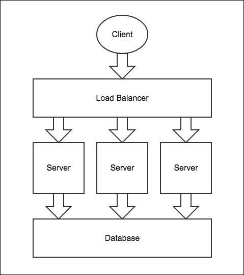
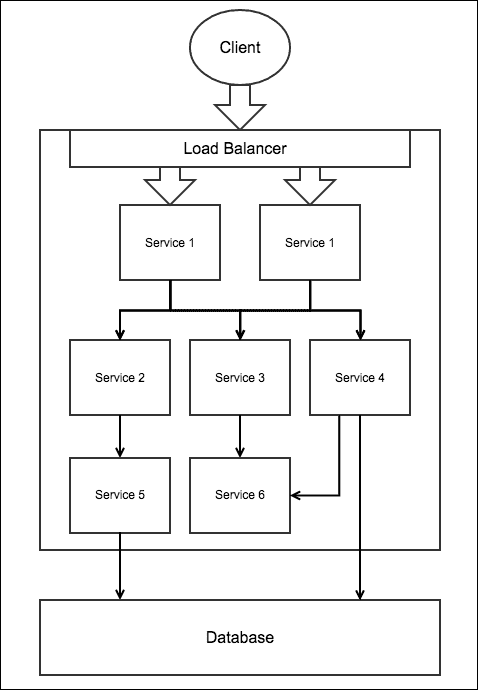

# 一、突破微服务架构

复杂和大型应用(用户数量巨大、数据量大的应用)的服务器端应用开发体系结构不应该只涉及更快的响应和为各种平台提供 web 服务。它应该易于扩展、升级、更新、测试和部署。它还应该是高度可用的，允许开发人员用不同的编程语言编写服务器端应用的组件，并使用不同的数据库。因此，这导致构建大型复杂应用的开发人员从通用的单片架构切换到微服务架构，从而使我们能够轻松完成所有这些工作。随着微服务体系结构在构建大型复杂应用的企业中得到广泛应用，了解如何使用该体系结构设计和创建服务器端应用非常重要。在本章中，我们将讨论如何使用 Seneca 工具包使用 Node.js 创建基于微服务架构的应用。

在本章中，我们将涵盖以下主题:

*   理解单片架构
*   基于整体架构扩展、升级、部署和编写应用
*   深入讨论微服务架构
*   基于微服务架构扩展、升级、部署和编写应用
*   塞内卡入门
*   使用塞内卡创建和调用服务

# 什么是单体建筑？

要理解微服务架构，首先要理解单片架构，这是很重要的，而单片架构恰恰相反。

在单体架构中，服务器端应用的不同功能组件，如支付处理、账户管理、推送通知和其他组件，都融合在一个单元中。

例如，应用通常分为三个部分。这些部分是运行在用户机器上的 HTML 页面或本机 UI、运行在服务器上的服务器端应用以及也运行在服务器上的数据库。服务器端应用负责处理 HTTP 请求、在数据库中检索和存储数据、执行算法等。如果服务器端应用是执行所有这些任务的单个可执行文件(也就是说，运行是单个进程)，那么我们说服务器端应用是整体的。

这是构建服务器端应用的常见方式。几乎每一个主要的内容管理系统、网络服务器、服务器端框架等等都是使用单片架构构建的。

这种架构看似成功，但当您的应用庞大而复杂时，问题可能会出现。

## 单片架构的缺点

以下是使用单片架构构建的服务器端应用引起的一些问题。

### 扩展单片架构

随着服务器端应用的 Flex 增加，您需要扩展服务器端应用来处理 Flex。

在单体架构的情况下，您可以通过在多台服务器上运行相同的可执行文件来扩展服务器端应用，并将服务器放在负载平衡器后面，或者您可以使用循环域名系统在服务器之间分配 Flex:



在上图中，所有服务器都将运行相同的服务器端应用。

虽然扩展很容易，但是扩展单一的服务器端应用最终会扩展所有组件，而不是需要更多资源的组件。因此，根据组件所需的资源数量和类型，有时会导致资源利用不平衡。

让我们考虑一些例子来理解在扩展单块服务器端应用时引起的问题:

*   假设有一个服务器端应用的组件需要更强大或特殊的硬件，我们不能简单地扩展这个特定的组件，因为所有的组件都打包在一起，因此所有的东西都需要一起扩展。因此，为了确保组件获得足够的资源，您需要在一些具有强大或特殊硬件的服务器上运行服务器端应用，这将导致消耗比实际所需更多的资源。
*   假设我们有一个组件需要在非免费的特定服务器操作系统上执行，我们不能简单地在非免费的操作系统中运行这个特定的组件，因为所有的组件都打包在一起，因此，仅仅是为了执行这个特定的组件，我们就需要在所有的服务器上安装非免费的操作系统，大大增加了成本。

这些只是一些例子。在扩展单一服务器端应用时，您可能会遇到更多的问题。

因此，当我们扩展单一的服务器端应用时，不需要更强大或特殊资源的组件开始接收它们，因此减少了需要它们的组件的资源。我们可以说，扩展单一的服务器端应用包括扩展所有组件，这些组件强制在新服务器中复制所有内容。

### 编写单片服务器端应用

单片服务器端应用使用特定的框架用特定的编程语言编写。企业通常有精通不同编程语言和框架的开发人员来构建服务器端应用；因此，如果要求他们构建一个单一的服务器端应用，那么他们将很难一起工作。

单一服务器端应用的组件只能在构建它的同一个框架中重用。因此，您不能在使用不同技术构建的其他项目中重用它们。

### 单片架构的其他问题

以下是开发人员可能面临的一些其他问题，具体取决于构建单一服务器端应用所使用的技术:

*   它可能需要完全重建，并为每一个小的改变重新部署。这是一项耗时的任务，并且会使您的应用长时间无法访问。
*   如果任何一个组件出现故障，它可能会完全失效。很难构建一个单一的应用来处理特定组件的故障，并相应地降低应用的功能。
*   可能很难找到每个组件消耗了多少资源。
*   单独测试和调试单个组件可能很困难。

# 救援微服务架构

我们看到了单片架构带来的问题。这些问题导致开发人员从单片架构切换到微服务架构。

在微服务体系结构中，服务器端应用被划分为服务。服务(或微服务)是一个独立的小过程，它构成了整个服务器端应用的特定功能。例如，您可以有一个用于支付处理的服务，另一个用于账户管理的服务，等等；这些服务需要通过网络相互通信。

### 类型

**什么叫“小”服务？**

您一定想知道服务需要多小，以及如何判断服务是否小。嗯，这实际上取决于许多因素，例如应用的类型、团队管理、资源的可用性、应用的大小以及您认为多小就多小。然而，一个小的服务并不一定是由更少的代码行或者提供非常基本功能的服务。一个小的服务可以是一个开发团队可以独立工作的服务，它可以独立地扩展到其他服务，扩展它不会导致资源的不平衡利用，并且总体上它们与其他服务高度分离(独立并且不知道)。

您不必在不同的服务器上运行每个服务，也就是说，您可以在一台计算机上运行多个服务。服务器与服务的比率取决于不同的因素。一个常见的因素是所需资源和技术的数量和类型。例如，如果一个服务需要大量的内存和中央处理器时间，那么最好在服务器上单独运行它。如果有些服务不需要太多资源，那么您可以在一台服务器上一起运行它们。

下图显示了微服务体系结构的示例:


在这里你可以把**服务 1** 想象成一个网络服务器，一个浏览器和提供各种功能的 API 的其他服务进行通信。web 服务与其他服务通信以获取数据。

## 微服务架构的优点

由于服务小而独立，通过网络进行通信，微服务架构解决了单片架构存在的许多问题。以下是微服务架构的一些优势:

*   当服务通过网络通信时，它们可以使用不同的框架用不同的编程语言编写
*   对服务进行更改只需要重新部署特定的服务，而不是所有的服务，这是一个更快的过程
*   随着每个服务在不同的流程中运行，衡量每个服务消耗了多少资源变得更加容易
*   测试和调试变得更加容易，因为您可以分别分析每个服务
*   服务可以被其他应用重用，因为它们通过网络调用进行交互

## 扩展服务

除了前面的好处之外，微服务架构的一个主要好处是，您可以扩展需要扩展的单个服务，而不是所有服务，从而防止资源重复和资源利用不平衡。

假设我们想要缩放上图中的**服务 1** 。下面是一个图表，显示了如何对其进行缩放:



在这里，我们在两个不同的服务器上运行两个**服务 1** 的实例，这两个服务器位于一个负载平衡器后面，该平衡器在它们之间分配 Flex。所有其他服务都以同样的方式运行，因为不需要扩展它们。如果您想要扩展**服务 3** ，那么您可以在多台服务器上运行**服务 3** 的多个实例，并将它们放在负载平衡器后面。

## 微服务架构的缺点

虽然与单片架构相比，使用微服务架构有很多优点，但是微服务架构也有一些缺点:

*   As the server-side application is divided into services, deploying, and optionally, configuring each service separately is a cumbersome and time-consuming task.

    ### 注

    请注意，开发人员经常使用一些排序自动化技术(如 AWS、Docker 等)来使部署变得更加容易；但是，要使用它，您仍然需要该技术的丰富经验和专业知识。

*   服务之间的通信可能会滞后，因为它是通过网络完成的。
*   这类服务器端应用更容易出现网络安全漏洞，因为服务通过网络进行通信。
*   编写用于与其他服务通信的代码可能会更难，也就是说，您需要进行网络调用，然后解析数据来读取它。这也需要更多的处理。请注意，尽管有使用微服务构建服务器端应用的框架，使得获取和解析数据更加容易，但它仍然没有扣除处理和网络等待时间。
*   您肯定需要某种监控工具来监控服务，因为它们可能会因网络、硬件或软件故障而停机。虽然您可能只在应用突然停止时才使用监控工具，但是要构建监控软件或使用某种服务，监控软件需要一定程度的额外经验和专业知识。
*   基于微服务的服务器端应用比基于单片的服务器端应用慢，因为通过网络的通信比内存慢。

## 何时使用微服务架构

似乎很难在单片和微服务架构之间做出选择，但实际上在它们之间做出决定并不困难。

如果您正在使用单体架构构建服务器端应用，并且您觉得不太可能面临我们前面讨论的任何单体问题，那么您可以坚持使用单体架构。将来，如果您面临的问题可以使用微服务架构来解决，那么您应该切换到微服务架构。

如果您从单一架构切换到微服务架构，那么您不必重写整个应用，相反，您只能通过一些代码重构将导致问题的组件转换为服务。这种服务器端应用的主要应用逻辑是单一的，但某些特定功能是通过服务公开的，这种应用称为具有单一核心的微服务架构。随着问题的进一步增加，您可以开始将单片核心的更多组件转换为服务。


如果您正在使用单片架构构建服务器端应用，并且您觉得您可能会面临我们前面讨论的任何单片问题，那么您应该立即切换到微服务架构或具有单片核心的微服务架构，这取决于什么最适合您。

## 数据管理

在微服务架构中，每个服务都可以有自己的数据库来存储数据，也可以使用集中式数据库。

一些开发人员根本不使用集中式数据库，相反，所有服务都有自己的数据库来存储数据。为了在服务之间同步数据，当服务的数据改变时，服务省略事件，其他服务订阅事件并更新数据。这种机制的问题是，如果一个服务关闭，那么它可能会错过一些事件。还会有很多重复的数据，最后，很难对这种系统进行编码。

因此，如果每个服务想要存储一些他们不想与其他人共享的东西，最好有一个集中的数据库，并让每个服务维护自己的数据库。服务不应该直接连接到集中式数据库，而应该有另一个名为**数据库服务**的服务，它提供与集中式数据库一起工作的应用编程接口。这个额外的层有很多优点，比如底层模式可以在不更新和重新部署依赖于模式的所有服务的情况下进行更改，我们可以在不更改服务的情况下添加缓存层，您可以在不更改服务的情况下更改数据库的类型，还有很多其他好处。如果有多个模式，或者有不同类型的数据库，或者由于有利于整体架构和分离服务的其他原因，我们也可以有多个数据库服务。

# 使用 Seneca 实现微服务

Seneca 是一个 Node.js 框架，用于使用单片核心的微服务架构创建服务器端应用。

之前，我们讨论过，在微服务架构中，我们为每个组件创建一个单独的服务，所以您一定想知道，使用一个框架来创建服务有什么意义，只需编写一些代码来侦听端口并回复请求即可。嗯，编写代码来发出请求、发送响应和解析数据需要大量的时间和工作，但是像塞内卡这样的框架使这一切变得容易。此外，将单片核心的组件转换为服务也是一项麻烦的任务，因为它需要大量的代码重构，但塞内卡通过引入动作和插件的概念使它变得容易。最后，用任何其他编程语言或框架编写的服务将能够与 Seneca 服务进行通信。

在 Seneca 中，一个动作代表一个特定的操作。动作是一个函数，由一个名为动作模式的对象文字或 JSON 字符串标识。

在 Seneca 中，单片核心的一个组件的这些操作是使用动作编写的，我们以后可能希望从单片核心转移到一个服务，并通过网络将其暴露给其他服务和单片核心。

### 类型

**为什么行动？**

您可能想知道使用操作而不是函数来编写操作有什么好处，以及操作如何使单片核心的组件容易转换为服务？假设您想要将使用函数编写的单片核心的操作移动到单独的服务，并通过网络公开该函数，那么您不能简单地将该函数复制并粘贴到新服务，而是需要定义一个路由(如果您使用的是 Express)。要调用单片核心内部的函数，您需要编写代码向服务发出 HTTP 请求。要在服务中调用这个操作，您可以简单地调用一个函数，这样根据您执行操作的位置，就会有两个不同的代码片段。因此，移动操作需要大量的代码重构。但是，如果您使用塞内卡操作编写了前面的操作，那么将操作移动到一个单独的服务将会非常容易。

如果操作是使用操作编写的，并且您想要将操作移动到一个单独的服务并通过网络公开该操作，那么您可以简单地将操作复制并粘贴到新的服务。就这样。显然，我们还需要告诉服务通过网络公开动作，并告诉单片核心在哪里找到动作，但是所有这些只需要几行代码。

塞内卡服务将动作公开给其他服务和单片核心。当向服务发出请求时，我们需要提供与服务中要调用的操作模式相匹配的模式。

### 类型

**为什么是图案？**

模式使得将一个网址映射到一个动作变得容易。模式可以在特定条件下覆盖其他模式，因此它会阻止编辑现有代码，因为在生产站点编辑现有代码是不安全的，并且有许多其他缺点。

塞内卡也有插件的概念。一个`seneca`插件实际上是一组动作，可以很容易地被分发并插入到一个服务或单片核心中。

随着我们的单片核心变得越来越大和复杂，我们可以将组件转换为服务。也就是说，将某些组件的动作转移到服务。

## 创建您的第一个 Seneca 应用

让我们使用塞内卡创建一个基本应用来演示如何使用它。我们将创建一个允许用户登录和注册的应用。这将是一个演示应用，只是演示如何创建动作、插件和服务，而不是登录和注册功能如何工作。

在继续之前，创建一个名为`seneca-example`的目录，并在其中放置一个名为`package.json`的文件。在`seneca-example`目录中，我们将放置我们的服务和单片核心。在`package.json`文件中，放置以下代码，以便 npm 能够下载我们应用的依赖项:

```js
{
  "name": "seneca-example",
  "dependencies": {
    "seneca": "0.6.5",
    "express" : "latest"
  }
}
```

这里我们使用的是塞内卡 0.6.5 版本。确保您也使用相同的版本，以避免代码不兼容。

现在运行`seneca-example`目录中的`npm install`命令，在本地安装塞内卡和其他软件包。

现在创建一个名为`main.js`的文件，它将是我们服务器端应用的核心。

单体核心和服务都是编程的`seneca`实例。将此代码放在`main.js`文件中以创建一个`seneca`实例:

```js
var seneca = require("seneca")();
```

现在使用这个`seneca`对象，我们将添加动作，调用动作，添加插件，以及一切。

### 创建动作

让我们为登录和注册功能创建动作，并将它们放在`main.js`文件中。要创建动作，我们需要使用`seneca`对象的`add`方法。`add`方法的第一个参数采用 JSON 字符串或对象作为动作标识符(称为**模式**来标识动作)。第二个参数是一个回调，当动作被调用时将被执行。

将此代码放在`main.js`文件中，该文件为登录和注册创建了两个操作，如下所示:

```js
seneca.add({role: "accountManagement", cmd: "login"}, function(args, respond){
});

seneca.add({role: "accountManagement", cmd: "register"}, function(args, respond){
});
```

我们将在本章后面看到动作主体的代码。

`role`和`cmd`属性没有什么特别的。你也可以使用任何你想要的属性名。

第二个参数是回调，它将在调用操作时被调用。

如果有多个动作具有相同的模式，则后者会覆盖其他动作。

我们需要使用`seneca`对象的`act`方法来调用实例本地的或者驻留在其他服务上的动作。`act`方法的第一个参数是匹配动作的模式，第二个参数是一旦动作被调用就会执行的回调。

下面是一个示例代码，显示了如何调用前面两个操作:

```js
seneca.act({role: "accountManagement", cmd: "register", username: "narayan", password: "mypassword"}, function(error, response){
});

seneca.act({role: "accountManagement", cmd: "login", username: "narayan", password: "mypassword"}, function(error, response){
});
```

一旦动作的结果到达，传递给`act`方法的回调就会异步执行。

在这里，我们传递给`act`方法的对象比它应该匹配的动作模式有两个额外的属性。但是，动作仍然被匹配和调用，因为如果传递给`act`方法的模式具有比它应该匹配的动作模式更多的属性，塞内卡会找到其属性在传递给`act` 方法的模式中的所有动作模式，并调用具有最高匹配属性数的模式。

如果 Seneca 找到多个具有相同数量匹配属性的动作模式，那么它们将按字母升序进行匹配。

### 注

您可以在[http://senecajs . org/入门. html # patterns-unique-override](http://senecajs.org/getting-started.html#patterns-unique-override)了解更多关于 Seneca 模式匹配的信息。

### 创建插件

塞内卡插件只是一组打包在一起的相关动作。通过编程，可以使用函数或模块创建`seneca`插件。

插件使得在应用之间分发一组动作变得容易。你也可以在 npm 维护的在线公共包注册表中找到`seneca`插件。例如，有一个`seneca`插件，提供操作来使用 MongoDB 数据库。只需一行代码，这个插件就可以插入到单片核心或服务中。

默认情况下，当我们创建一个`seneca`实例时，塞内卡会安装四个内置插件。这些插件是**基础**、**运输**、**网页**、**记忆库**。

让我们首先使用一个函数创建一个插件。函数名就是插件名，一个插件也可以有一个初始化动作，插件一附加到`seneca`实例就会被调用。

因此，让我们创建一个名为`account`的插件，并在其中放置登录和注册操作，因为稍后，我们将创建一个服务并将操作移动到那里。删除我们之前在`main.js`文件中定义的动作，并放入以下代码:

```js
function account(options)
{
  this.add({init: "account"}, function(pluginInfo, respond){
    console.log(options.message);
    respond();
  })

  this.add({role: "accountManagement", cmd: "login"}, function(args, respond){
  });

  this.add({role: "accountManagement", cmd: "register"}, function(args, respond){
  });
}

seneca.use(account, {message: "Plugin Added"});
```

这里我们定义了一个名为`account`的函数，并使用`seneca` 对象的`use`方法将其附加。要附加多个插件，我们可以多次调用`use`方法。

`init:account`动作是插件添加后塞内卡调用的初始化动作。这可以用来做一些事情，比如建立数据库连接或者插件的动作所依赖的其他事情。

插件内的 `this`关键字指的是`seneca`实例。

让我们使用一个模块来创建同一个插件，这样它就可以很容易地分发，并且可以放在`npm`注册表中。创建一个名为`account.js`的文件，并将其放入`seneca-example`目录。`account.js`是插件模块。将此代码放入`account.js`文件中:

```js
module.exports = function(options)
{
  this.add({init: "account"}, function(pluginInfo, respond){

    console.log(options.message);

    respond();
  })

  this.add({role: "accountManagement", cmd: "login"}, function(args, respond){
  });

  this.add({role: "accountManagement", cmd: "register"}, function(args, respond){
  });

  return "account";
}
```

这是匿名函数返回的字符串中的插件名称。

删除我们之前在`main.js`文件中定义的插件代码，代之以以下代码:

```js
seneca.use("./account.js", {message: "Plugin Added"});
```

这里，为了附加插件，我们提供了模块路径。

### 注

你可以在[http://senecajs.org/write-a-plugin.html](http://senecajs.org/write-a-plugin.html)了解更多关于创建塞内卡插件的信息，你可以在[http://senecajs.org/plugins.html](http://senecajs.org/plugins.html)找到所有的塞内卡插件。

### 创建服务

服务是通过网络公开一些动作的 seneca 实例。让我们创建一个公开登录和注册操作的服务。

在`seneca-example`目录中创建一个`account-service.js`文件，作为服务。然后在其中放置以下代码来创建公开登录和注册操作的服务:

```js
var seneca = require("seneca")();

seneca.use("./account.js", {message: "Plugin Added"});

seneca.listen({port: "9090", pin: {role: "accountManagement"}});
```

在这里，我们首先创建了一个`seneca`实例。然后我们通过插件添加动作。您也可以使用`seneca`对象的`add`方法手动添加动作。最后，我们通过 HTTP 协议公开了这些操作。Seneca 也支持其他协议，但我们将坚持使用 HTTP，因为它是最常用的协议。

`seneca.listen`创建一个 HTTP 服务器来监听请求。我们还提供了可选的端口号和 pin。默认端口为`10101`，默认情况下，不提供就没有引脚。

你一定想知道什么是别针，它是用来做什么的？嗯，您可能不总是希望通过网络公开服务的所有操作。在这种情况下，您可以向`pin`属性提供一个模式，服务器将处理这些与`pin`模式匹配的请求。

现在，为了让其他服务或单片核心能够调用该服务的动作，它们需要注册该服务。

从`main.js`文件中删除之前的插件附件代码，并添加以下代码来注册服务:

```js
seneca.client({port: "9090", pin: {role: "accountManagement"}});
```

这里我们通过提供`port`号码和`pin`来注册服务。两者都是可选的。如果我们不使用任何端口号，则默认为`10101`。如果服务在不同的服务器上，那么您应该使用`host`属性来提供 IP 地址。

附在`client`方法上的`pin`用于告诉`seneca`实例被服务暴露了哪些动作。完全可以选择。Seneca 不会向不符合`pin`模式的服务发送请求。

通过多次调用客户端方法，可以添加任意多的服务。

当您调用`act`方法来调用一个动作时，`seneca`实例首先在请求服务之前在本地寻找该动作。如果在本地找不到，它会检查有 pin 的服务，看是否匹配。如果 pin 匹配，则它向该特定服务发送请求。最后，如果任何一个 pin 不匹配，它会将请求一个接一个地发送给没有 pin 的所有其他服务，直到它从其中一个服务获得有效的响应。

您也可以通过将 GET 请求发送到以下类型的 URL 来手动调用服务的操作:

```js
http://localhost:9090/act?role=accountManagement&cmd=login&username=narayan&password=mypassword

```

您也可以使用开机自检请求来调用服务。下面是如何使用 CURL 来实现这一点:

```js
curl -d '{"role":"accountManagement","cmd":"login","username":"narayan","password":"mypassword"}' -v http://localhost:9090/act
```

### 存储数据

Seneca 提供了一个内置的机制来存储数据。Seneca 提供了一些内置操作，允许我们存储数据。默认情况下，内置动作使用`mem-store`存储数据。 **mem-store** 是一个异步内存存储系统。

您可以使用默认存储机制创建应用。如果您想要更改底层存储系统，您只需要为这个特定的存储系统安装插件，该插件将覆盖内置的存储操作，因此您不必重构任何代码。

进行 CRUD 操作的内置操作如下:

*   `role:entity,cmd:load,name:<entity-name>`:这个是用实体的 ID 来检索实体的。一个实体可以被认为是 MySQL 中的一行。每个实体都有一个唯一的标识。
*   `role:entity,cmd:save,name:<entity-name>`:用于更新(如果你提供了实体 ID)或者添加一个不存在的实体。实体以对象的形式存储和检索。
*   `role:entity,cmd:list,name:<entity-name>`:用于列出所有匹配查询的实体。
*   `role:entity,cmd:remove,name:<entity-name>`:用于使用实体的标识移除实体。

塞内卡还提供了一些提取这些动作的包装函数，使得调用这些动作变得容易。这些功能是`load$`、`save$`、`list$`和`remove$`。

让我们实现登录和注册操作，以允许我们登录并注册新帐户。

下面是帐户操作的实现。在`account.js`文件中更新该代码:

```js
this.add({role: "accountManagement", cmd: "login"}, function(args, respond){
  var accounts = this.make("accounts");

  accounts.list$({username: args.username, password: args.password}, function(error, entity){
    if(error) return respond(error);

    if(entity.length == 0)
    {
      respond(null, {value: false});
    }
    else
    {
      respond(null, {value: true});
    }
  });
});
```

传递给`add`方法的回调的第一个参数包含对与动作模式匹配的对象的引用。

这里我们首先调用`seneca`对象的`make`方法。它用于获取实体商店的参考。例如，在 MySQL 的情况下，`make`方法获取对表的引用。

然后，我们会发现是否有通过`act`方法传递用户名和密码的实体。当实体作为对象添加时，为了查询实体，我们需要传递一个对象。现在`list$`查找所有具有相同用户名和密码的实体。

我们将回调传递给`$list`方法，一旦检索到数据，该方法将被异步调用。该回调采用两个参数，即如果有错误，第一个参数是`error`对象，否则为`null`。同样，第二个参数是找到的与给定对象匹配的实体数组。

为了让动作响应回来，它需要调用动作回调的第二个参数，通过传递一个对象作为第二个参数。如果出现错误，我们需要在第一个参数中传递错误。

同样，现在让我们编写寄存器操作的代码，如下所示:

```js
this.add({role: "accountManagement", cmd: "register"}, function(args, respond){
  var accounts = this.make("accounts");

  accounts.list$({username: args.username}, function(error, entity){
    if(error) return respond(error);

    if(entity.length == 0)
    {
      var data = accounts.data$({username: args.username, password: args.password})

      data.save$(function(error, entity){
        if(error) return respond(error);

        respond(null, {value: true});
      });
    }
    else
    {
      respond(null, {value: false});
    }
  });
});
```

这里，大部分代码是可以理解的，因为它的工作方式与前面的操作相同。为了存储数据，我们正在使用`data$`方法通过传递我们想要存储的实体来创建一个新的实体存储引用。然后我们调用`save$`方法保存实体。

### 注

要了解更多关于在塞内卡存储数据的信息，请访问[http://senecajs.org/data-entities.html](http://senecajs.org/data-entities.html)。

### 整合 Express 和 Seneca

我们已经完成了创建登录和注册操作。现在，由于我们的后端将被一个应用使用，或者它可能代表一个网站，我们需要向客户端提供网址，客户端将使用它们来与服务器交谈。

单片核心是我们的服务器端应用的一部分，客户端可以与它交互大部分功能。如果需要，客户端还可以直接与服务进行交互，以获得一些特定的功能。

所以，我们需要在服务器端应用的单片核心和服务中使用某种网站开发框架。我们将使用快递，因为它是最受欢迎的一种。

Seneca 还提供了一种将 URL 映射到动作的内置方式，也就是说，向 HTTP 服务器发出的请求可以自动映射到特定的动作来调用它们。这是使用一个定义对象来完成的，该对象的属性定义了从 URL 到动作模式的路由映射。这种内置方法独立于所使用的框架来定义路由映射。一旦我们定义了定义对象，我们需要一个特定于 web 服务器框架的插件，它将使用定义对象捕获 URL 并将其解析为动作模式。定义对象允许您附加回调，回调将通过参数获得操作的响应，然后回调可以以用户想要的任何格式将数据返回给用户。如果您正在创建一个用于分发的插件，该插件公开了一些需要为特定的网址请求调用的操作，那么您将不得不使用内置方法，因为它独立于正在使用的框架定义路由映射。

### 注

您可以在[https://github.com/rjrodger/seneca-web](https://github.com/rjrodger/seneca-web)了解更多如何使用内置方式集成 Seneca 和 Express。

将以下代码添加到`main.js`文件中，在其中启动 Express 服务器:

```js
var app = require("express")();
app.use(seneca.export("web"))
app.listen(3000);
```

第二行，我们正在导出`seneca-web`插件提供的中间件功能。`seneca-web`是直接集成 Seneca 和 Express 的插件，即使用 Express 框架的定义对象将 URL 翻译成动作模式。只有当我们使用定义对象来定义路由映射时，这才是必需的。我们不会使用定义对象，但是我们仍然应该使用`seneca-web`，因为如果我们使用这些插件，一些第三方插件可能会使用定义对象。例如，如果你正在使用`seneca-auth`插件，那么你将不得不包含第二行。

我们希望用户能够使用`/account/login`路径登录，并使用`/account/register`路径注册。用户将通过查询字符串提供用户名和密码。下面是定义处理 HTTP 登录和注册请求的路由的代码:

```js
app.get('/account/register', function(httpRequest, httpResponse, next){
  httpRequest.seneca.act({role: "accountManagement", cmd: "register", username: httpRequest.query.username, password: httpRequest.query.password}, function(error, response){
    if(error) return httpResponse.send(error);

    if(response.value == true)
    {
      httpResponse.send("Account has been created");
    }
    else
    {
      httpResponse.send("Seems like an account with same username already exists");
    }
  });
});

app.get('/account/login', function(httpRequest, httpResponse, next){
  httpRequest.seneca.act({role: "accountManagement", cmd: "login", username: httpRequest.query.username, password: httpRequest.query.password}, function(error, response){
    if(error) return httpResponse.send(error);

    if(response.value == true)
    {
      httpResponse.send("Logged in!!!");
    }
    else
    {
      httpResponse.send("Please check username and password");
    }
  });
});
```

这里我们根据 URL 请求的路径调用适当的动作。

这里，我们不是使用`seneca.act`，而是使用`httpRequest.seneca.act`作为中间件函数，我们之前导出的这个函数添加了一个新的`seneca`属性来请求每个 HTTP 请求的对象。该属性继承实际的`seneca`实例。第三方插件中的动作以属性的形式向`seneca`属性添加信息，以便与其他路由处理者共享与特定 HTTP 请求相关的信息。即使我们使用`seneca.act`，前面的代码也会以同样的方式运行，但是使用`httpRequest.seneca.act`是一个很好的实践，因为我们可能会使用这样类型的插件。您自己的路由处理程序也可以使用`httpRequest.seneca.act`将与`seneca`相关的信息传递给对方。

现在，要运行应用，首先运行`account-service.js`文件，然后运行`main.js` 文件。然后，您可以使用以下网址登录和注册:

*   `http://localhost:8080/account/login?username=narayan&password=mypassword`
*   `http://localhost:8080/account/register?username=x&password=mypassword`

在这里，我们看到了如何创建一个网络界面，它可以被一个应用使用，或者在它是一个网站的情况下提供 HTML 页面。

如果我们想要一个不同的服务来处理某些请求，我们也可以将快递的路线转移到一个服务。

# 总结

在本章中，我们看到了单片和微服务架构之间的区别。然后我们讨论了具有单片核心的微服务架构意味着什么以及它的好处。最后，我们跳到了塞内卡框架中，实现了具有单片核心的微服务架构，并讨论了如何创建基本的登录和注册功能来演示塞内卡框架的各种功能以及如何使用它。

在下一章中，我们将使用 Seneca 和 Express 框架创建一个功能齐全的电子商务网站。