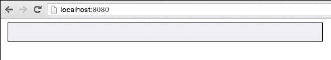
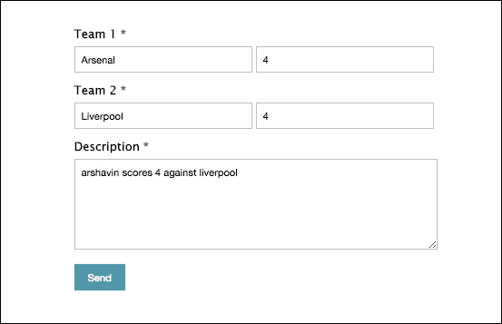
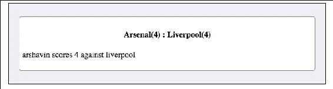

# 六、构建实时评分网站

掌握 socket.io 的最好方法是构建一个真实世界的应用，这也是我们在本章将要做的事情。只要管理员更新分数，实时分数网站就会实时向用户显示分数变化。我们将创建一个足球实况比分网站。讨论如何构建一个 live score 网站将有助于我们深入研究 socket.io，因为它需要 socket.io 身份验证，也可以选择将 socket.io 与 Express 集成。我们的现场评分网站将为管理员提供一个管理面板来更新评分。

在本章中，我们将涵盖以下主题:

*   访问 socket.io 中间件中的 cookies
*   浅谈 HTTP 基本认证
*   将 socket.io 与 Express 集成
*   讨论 socket.io 身份验证

# 构建后端

在我们开始构建我们的实况评分网站的后端之前，让我们首先设置我们的目录和文件。

我们将只为后端和前端架构和功能编写代码，而不是任何 HTML 和 CSS 设计代码。

本章的练习文件包含两个目录:`Initial`和`Final`。在这两个目录中，你会发现一个名为`Live-Score`的目录。在`Final/Live-Score`目录下，你会得到完整的直播评分网站源代码。在`Initial/Live-Score`目录中，你只能找到我们实况评分网站的 HTML 和 CSS 文件。`Initial/Live-Score`目录是帮助你快速开始建立现场评分网站。

在`Initial/LiveScore`目录下，会找到`public`目录、`app.js`文件、`package.json`文件。在`public`目录中，你会找到`css`、`html`和`js`目录。在`css`和`html`目录中，你会找到我们用户和管理员页面的 HTML 文件和 CSS 文件。在`js`目录下，你会找到`admin.js`和`index.js`文件，里面分别放置了管理员和用户的 socket.io 客户端代码。同样，在`html`目录中，你会发现`index.html`和`admin.html`文件将分别提供给用户和管理员。

在`package.json`文件中，放置以下代码:

```js
{
  "name": "Live-Score",
  "dependencies": {
    "express": "4.13.3",
    "socket.io": "1.3.7",
    "basic-auth": "1.0.3",
    "socket.io-cookie": "0.0.1"
  }
}
```

现在运行`Initial/Live-Score`目录中的`npm install`命令下载`express`、`socket.io`、`basic-auth`和`socket.io-cookie` npm 包。

## 将 socket.io 服务器与 Express 服务器集成

我们只需几行代码就可以将 socket.io 服务器与 Express 服务器集成在一起。下面是将 socket.io 服务器与 Express 服务器集成的代码。

创建一个`app.js`文件，并在其中放置以下代码:

```js
var express = require("express");  
var app = express();  
var server = require("http").createServer(app);  
var io = require("socket.io")(server, {path: "/socket-io"});

server.listen(8080);
```

第四行是主要集成发生的地方。这里我们使用`/socket-io`路径进行 socket.io 握手。

最后，我们正在监听端口号`8080`。也就是说，Express 服务器和 socket.io 服务器都会监听端口号`8080`。

## 为用户提供静态文件和 HTML

现在我们需要编写代码来为网站用户提供 HTML、CSS 和 JavaScript 文件。下面是这样做的代码。将此代码放在前面代码片段之后的`app.js`文件右侧中:

```js
app.use(express.static(__dirname + "/public"));

app.get("/", function(httpRequest, httpResponse, next){
  httpResponse.sendFile(__dirname + "/public/html/index.html");
})
```

这里，代码的第一行是服务静态文件。剩下的代码是为访问根路径的站点用户服务的。

## 向管理员提供 HTML 并保护管理面板

我们只希望管理员进入管理面板更新分数。因此，访问者要访问管理面板，必须输入用户名和密码。我们将使用 HTTP 基本身份验证来保护管理面板。

以下是验证和向管理员提供 HTML 的代码:

```js
var basicAuth = require("basic-auth");

function uniqueNumber() {
  var date = Date.now();

  if (date <= uniqueNumber.previous) {
    date = ++uniqueNumber.previous;
  } else {
    uniqueNumber.previous = date;
  }

  return date;
}

uniqueNumber.previous = 0;

var authenticated_users = {};

var auth = function (req, res, next){
  var user = basicAuth(req);

  if(!user || user.name !== "admin" || user.pass !== "admin")
  {
    res.statusCode = 401;
    res.setHeader("WWW-Authenticate", "Basic realm='Authorization Required'");
    res.end("Access denied");
  }
  else
  {
    var id = uniqueNumber();
    authenticated_users[id] = id;
    res.cookie("authentication_id", id);
    next();
  }
}

app.get("/admin", auth, function(httpRequest, httpResponse, next){
  httpResponse.sendFile(__dirname + "/public/html/admin.html");
})
```

这里是代码的工作原理:

*   首先，我们导入了`basic-auth`库，用于在 Express 中实现基础认证。
*   然后，我们编写了一个自定义函数，每当调用它时都会生成一个唯一的数字。
*   我们还创建了一个名为`auth`的函数，用于检查访问者是否通过身份验证。如果没有，那么我们将发送一个 HTTP 状态代码 404，要求访问者提供用户名和密码。如果访问者通过了身份验证，那么我们将生成一个唯一的号码，并将其作为 cookie 存储在管理员的浏览器中。稍后，socket.io 服务器将使用该 cookie 来检查管理员是否通过身份验证。
*   最后，我们创建了一个带有`/admin`路径的路由，它有两个路由处理器。第一个是检查认证的`auth`功能，第二个服务于`admin.html`文件。

## 插座。IO cookie 身份验证和向命名空间广播消息

我们的 socket.io 服务器中将有两个名称空间:用户将连接的默认名称空间和管理员将连接的`/admin`名称空间。

socket.io 客户端不需要身份验证就可以连接到默认命名空间。但是，要连接到`/admin`命名空间，socket.io 需要身份验证。

管理员进行的更新将广播给默认命名空间中的所有用户。

下面是创建`/admin`命名空间、向默认命名空间广播消息以及为`/admin`命名空间实现身份验证的代码。将此代码放在`app.js`文件中:

```js
var cookieParser = require("socket.io-cookie");

var admin = io.of("/admin");

admin.use(cookieParser);

admin.use(function(socket, next) {
  if(socket.request.headers.cookie.authentication_id in authenticated_users)
  {
    next();
  }
  else
  {
    next(new Error("Authentication required"));
  }
});

admin.on("connection", function(socket){
  socket.on("message", function(message){
    io.send(message);
  });
})
```

下面是代码的工作原理:

*   首先，我们导入了 socket.io-cookie 中间件，用于解析 HTTP `Cookie`头
*   然后，我们创建了`/admin`命名空间
*   我们还使用 socket.io-cookie 中间件解析了 cookie
*   然后，我们编写了自己的中间件来检查`authentication_id`是否存在，如果存在，那么它是否有效
*   最后，我们收听`message`事件，并将消息广播给默认名称空间中的用户

现在我们已经完成了后端。在初始目录中运行`node app.js`命令。然后访问任意浏览器中的`http://localhost:8080`和`http://localhost:8080/admin`。在这里，我假设你正在本地运行快递服务器。

当您访问`http://localhost:8080`时，您将看到以下屏幕:



盒子里什么都没有，因为用户还没有收到任何消息。

当您访问`http://localhost:8080/admin`时，您将看到以下屏幕:


现在输入`admin`作为**用户名**和**密码**，点击**登录**。您将看到以下屏幕:


# 建设前端

让我们为用户和管理员编写前端代码。用户的 socket.io 客户端实例将侦听来自服务器的传入消息并显示它们。而 socket.io 管理员的客户端实例将向服务器发送消息，以便将消息广播给用户。

以下是用户的 socket.io 客户端代码。将该代码放入`index.js`文件中:

```js
var socket = io("http://localhost:8080", {path: "/socket-io"});

socket.on("connect", function () {
	socket.on("message", function (msg) {
    document.getElementById("messages").innerHTML = "<li><div><h4>" + msg.team1_name + "(" + msg.team1_goals + ") : " + msg.team2_name + "(" + msg.team2_goals + ")" + "</h4><p>" + msg.desc + "</p></div></li>" + document.getElementById("messages").innerHTML; 
  });
});
```

这段代码是不言自明的。

下面是管理员的 socket.io 客户端代码。将该代码放入`admin.js`文件中:

```js
var socket = io("http://localhost:8080/admin", {path: "/socket-io"});

document.getElementById("submit-button").addEventListener("click", function(){
  var team1_name = document.getElementById("team1-name").value;
  var team2_name = document.getElementById("team2-name").value;
  var team1_goals = document.getElementById("team1-goals").value;
  var team2_goals = document.getElementById("team2-goals").value;
  var desc = document.getElementById("desc").value;

  if(team1_goals == "" || team2_goals == "" || team1_name == "" || team2_name == "")
  {
    alert("Please enter all details");
  }

  socket.send({
    team1_name: team1_name,
    team2_name: team2_name,
    team1_goals: team1_goals,
    team2_goals: team2_goals,
    desc: desc
  });
}, false)
```

这就是前面代码的工作原理:

*   在第一行中，我们连接到 socket.io `/admin`命名空间。如果 cookie 在任何情况下都无效，那么连接将会失败。
*   我们还确保填写了团队名称及其分数，否则我们将显示一条警告消息，要求他们输入所有详细信息。
*   然后，我们将消息发送到 socket.io 服务器。

# 测试网站

现在我们已经完成了我们的现场评分网站的建设。要测试网站，请刷新`http://localhost:8080/`和`http://localhost:8080/admin`页面。

现在，在`admin`面板中，用一些样本数据填写表格，点击**发送**按钮:



在用户页面，应该会看到类似下图的内容:



# 总结

在这一章中，我们看到了如何使用 socket.io 和 Express 构建一个实况评分网站。现在，您应该可以轻松构建任何需要实时双向通信的应用。您现在应该尝试构建一个聊天应用、多人游戏或其他一些 socket.io 非常有用的东西。

因此，总的来说，您深入学习了 socket.io、WebSockets 和双向通信。