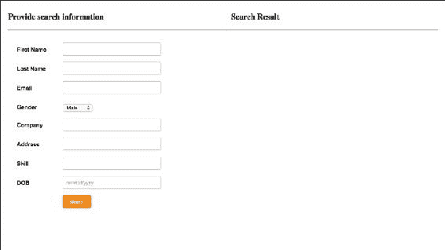
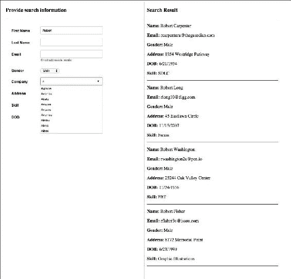

# 第八章。构建高级配置文件搜索小部件

使用 Bacon.js 掌握 FRP 的最好方法是构建一个真实世界的应用程序，这就是我们在本章中要做的。我们将构建一个高级的个人资料搜索小部件，就像你通常在社交网络或约会网站上找到的那样。为了使章节简短扼要，我们将使用一些示例数据，而不是构建注册功能。我们还将学习一些更高级的函数式编程和 Bacon.js 的概念

在本章中，我们将介绍以下内容:

*   培根. js 中的错误事件
*   处理玻璃钢中的异常情况
*   懒惰评价
*   培根的巴士
*   连接模式
*   最后，我们将构建一个高级配置文件搜索小部件

# 培根的错误

培根提供了`Bacon.Error`构造函数，将事件流或属性的事件或值分别显式标记为错误，这样培根就可以识别它们，并打开各种各样的其他 API 来专门处理这些错误。

根据我们如何创建流，Bacon.js 有时可以识别一个事件是成功事件还是错误事件，如果是错误事件，那么它可以将其转换为`Bacon.Error`。例如，如果我们使用`Bacon.fromPromise`来创建一个事件流，那么培根可以很容易地识别一个错误，因为当一个错误在一个承诺模式中发生时，`then()`方法的第二次回调或者传递给`catch()`方法的回调被执行。

如果培根在创建流时不能识别事件是错误还是成功事件，那么我们需要显式创建`Bacon.Error`的实例，并用它们替换错误事件。比如在使用`Bacon.fromCallback`的时候，Bacon.js 没有办法知道一个事件是成功事件还是错误事件，所以我们需要显式的将错误事件转换为`Bacon.Error`的实例。

## 订阅错误

传递给`onValue`的回调不会被`Bacon.Error`事件或值调用；相反，我们需要使用`onError`。

要查看它的运行情况，请打开我们在上一章中创建的`index.js`文件，并添加以下代码:

```js
response.onError(function(error){
  console.log("An error occured while fetching the page", error);
})
```

现在，如果您输入无法提取的网址，控制台上会显示一条自定义错误消息。

## 绘图错误

`map()`功能不映射`Bacon.Error`实例；因此，培根为我们提供了`mapError ()`，其工作方式与`map`相同，但仅映射了`Bacon.Error`实例。

同样，`flapMap()`不映射`Bacon.Error`实例。因此，培根为我们提供了`flatMapError()`，其工作方式与`flatMap`相同，但仅映射了`Bacon.Error`实例。

除了`flatMap`和`map`，`Bacon.Error`实例可以穿越一切。

## 重试函数调用

有时，如果操作失败，我们可能想要重试。例如，如果由于服务器超时错误，我们无法使用 AJAX 检索网页，那么我们可能需要在一段时间后再次尝试检索。

培根提供了`Bacon.retry`函数，使用它我们可以一次又一次地进行函数调用，只要我们愿意。

`Bacon.retry`返回一个 EventStream，它接受一个具有四个属性的对象，如下所示:

*   `source`:这是一个功能，是要重新调用的。此函数必须返回一个属性或事件流。
*   `retries`:这是一个数，表示除了初始尝试之外，重试源函数的总次数。当`Bacon.Error`实例被推送到源函数返回的属性或流时，将尝试重试。
*   `isRetryable`:这是可选属性。它需要被分配给一个函数。该功能应返回`true`或`false`。当有东西被推入源函数返回的属性或事件流中时，调用`isRetryable`来确定是否应该重试。
*   `delay`:这是可选属性。它被分配给一个函数，该函数返回重试前等待的时间(以毫秒为单位)。默认值为`0`。

由`Bacon.retry`返回的事件流具有上次调用源函数返回的事件流或属性中存在的事件或值。

让我们看看`Bacon.retry`功能的作用。在`index.js`文件中找到该代码:

```js
var response = url.flatMap(function(value){
 return Bacon.fromPromise($.ajax({url:value}));
}).toProperty();
```

用以下代码替换它:

```js
var response = url.flatMap(function(value){
  return Bacon.retry({
    source: function(){ return Bacon.fromPromise($.ajax({url:value})); },
    retries: 5,
    isRetryable: function (error) { return error.status !== 404; },
    delay: function(context) { return 2000; }
  })
}).toProperty();
```

在这里，除了`404`之外，我们每隔`2`秒重试一次 AJAX 请求`5`。

## 错误时结束事件流或属性

当您不能向事件流或属性推送任何内容时，该事件流或属性被称为已经结束。

如果要在推`Bacon.Error`实例时结束事件流或属性，那么需要调用事件流或属性的`endOnError`方法。`endOnError`方法返回一个新的事件流或属性，当`Bacon.Error`实例被推送时结束。

# 处理异常

如果在传递给培根助手函数的回调中遇到异常，那么它不会被自动捕获；相反，我们必须使用`try…catch`语句来处理它。常见的做法是在捕捉到异常后返回一个`Bacon.Error`实例，这样我们就可以像处理错误一样处理它。

下面是一个如何处理异常的例子。在`index.js`文件中，找到以下代码:

```js
var response = url.flatMap(function(value){
  return Bacon.retry({
    source: function(){ return Bacon.fromPromise($.ajax({url:value})); },
    retries: 5,
    isRetryable: function (error) { return error.status !== 404; },
    delay: function(context) { return 2000; }
  })
}).toProperty();
```

替换为:

```js
var response = url.flatMap(function(value){
  try
  {
    return Bacon.retry({
      source: function(){ return Bacon.fromPromise($.ajax({url:value})); },
      retries: 5,
      isRetryable: function (error) { return error.status !== 404; },
      delay: function(context) { return 2000; }
    })
  }
  catch(e)
  {
    return new Bacon.Error(e);
  }

}).toProperty();
```

在这里，我们正在捕捉异常并创建一个新的`Bacon.Error`实例，异常作为错误的细节，也就是说，我们将异常作为参数传递给构造函数。

# 恒定属性

培根也为我们提供了创造恒定属性的方法。常量属性是在创建时初始化的，不能重新初始化，也就是说，不能推新值。

使用`Bacon.constant()`构造器创建一个常量属性。我们需要将属性值传递给构造函数。常量属性可以被合并、连接、组合、压缩、采样、过滤和转换。

下面是一个如何创建常量属性的示例。将该代码放入`index.js`文件:

```js
var script_start_time = Bacon.constant(Date.now()).map(function(value){
  var date = new Date(value);
  return (date).getHours() + ":" + (date).getMinutes() + ":" + (date).getSeconds();
});

script_start_time.onValue(function(value){
  console.log("This script started running at : " + value);
})
```

这里，`constant`属性存储脚本开始的时间并打印时间。

# 公交车概述

一个**总线**就像一个事件流一样，但是它允许我们手动将值推入流中，而不是将其附加到一个源，它还允许动态地将其他事件流和属性插入到总线中。

这里有一个例子，演示了如何创建一个总线和一个`Bacon.Bus`实例提供的各种方法。将该代码放入`index.js`文件:

```js
var bus1 = new Bacon.Bus();

bus1.onValue(function(event){
  console.log(event);
})

bus1.push(1);
bus1.push(2);
var bus2 = new Bacon.Bus();
bus1.plug(bus2);
bus2.push(3); 
bus1.error("Unknown Error"); //pushed an Bacon.Error
bus1.end();
bus2.push(4); //this will not be pushed as bus has ended
```

代码不言自明。上述代码的输出如下:

```js
1
2
3
```

# 订阅事件流和属性的结尾

培根提供了`onEnd`方法来订阅回调，回调将在事件流或属性结束时执行。

下面是的一些示例代码，它告诉你如何使用`onEnd`回调。将其放入`index.js`文件中:

```js
script_start_time.onEnd(function(){
  console.log("Script start time has been successfully calculated and logged");
})
```

这里，我们将一个`onEnd`回调附加到我们之前创建的常量属性。初始化后，属性结束；因此，调用`onEnd`回调。我们也可以注册多个用户。

实际上，为了结束一个事件流或属性，培根在内部推一个`Bacon.End`构造函数的实例。因此，我们也可以使用`Bacon.End`构造函数来结束一个事件流或属性。

我们来看一个如何使用`Bacon.End`的例子。将该代码放入`index.js`文件:

```js
var custom_stream = Bacon.fromBinder(function(sink) {
  sink(10);
  sink(20);
  sink(new Bacon.End()); //event stream ends here
  sink(30); //this will not be pushed
});

custom_stream.onValue(function(event){
  console.log(event);
});
```

代码的输出是这样的:

```js
10
20
```

`Bacon.End`实例不通过辅助函数。

# 拔掉用户的电源

我们看到如何使用`onValue`、`onError`和`onEnd`订阅事件流和属性。如果我们不再需要订阅者，我们也可以取消订阅。

这些函数返回一个取消订阅的函数。要取消订阅，我们需要调用订阅者函数返回的函数。

# 结合和拉链

培根提供了某些方法来组合和压缩属性和事件流。组合和拉链有很大的区别。

当我们组合属性时，我们总是得到一个属性，它将有一个所有源属性的数组作为它的值。如果我们试图组合事件流，那么在组合发生之前，它们首先被转换为属性。当任何一个源属性被推入时，一个新的值被推入结果属性。**组合** 在每个源属性都有一个推送值后开始。

下面是一个演示组合的例子。将该代码放入`index.js`文件。

```js
var x1 = new Bacon.Bus();
var x2 = new Bacon.Bus();
var x3 = new Bacon.Bus();

Bacon.combineAsArray(x1, x2, x3).onValue(function(value){
  console.log(value);
})

x1.push(0);
x1.push(1);
x2.push(2);
x3.push(3);
x3.push(4);
x1.push(5);
```

下面是代码的输出:

```js
[1, 2, 3]
[1, 2, 4]
[5, 2, 4]
```

拉链不同于组合。 **Zipping** 意味着来自每个来源的事件成对组合，使得来自每个来源的第一个事件首先发布，然后是第二个事件，依此类推。一旦每个来源都有值，就会发布结果。当我们压缩属性和事件流时，我们总是会得到一个事件流。

这里有一个的例子来演示拉链。将该代码放入`index.js`文件:

```js
var y1 = new Bacon.Bus();
var y2 = new Bacon.Bus();
var y3 = new Bacon.Bus();

Bacon.zipAsArray(y1, y2, y3).onValue(function(value){
  console.log(value);
})

y1.push(0);
y1.push(1);
y2.push(2);
y3.push(3);
y3.push(4);
x1.push(5);
```

下面是代码的输出:

```js
[0, 2, 3]
```

# 懒评价

在编程中，**延迟评估** 是一种将价值评估延迟到需要的时候的策略。有两种方法可以让 Bacon.js 实现惰性评估

## 类型 1

在拥有订阅者之前，流或属性不会附加到其数据源上。让我们看一个例子来理解这一点。将该代码放入`index.js`文件:

```js
var myButton_click_stream1 = $("#myButton").asEventStream("click").map(function(event){
  console.log(event);
  return event;
});
```

在这里，当您点击`myButton`按钮时，将不会记录任何内容。现在，将此代码放入`index.js`文件:

```js
myButton_click_stream1.onValue(function(event){})
```

现在，当您点击按钮时，事件将被记录下来。

`log`方法也被认为是订阅者。

## 2 型

`map``combine*`等方法使用惰性评估来避免评估实际不需要的事件和值。在某些情况下，惰性评估会带来巨大的性能优势。

但是`map`和`combine*`怎么知道一个事件或者值是否不需要呢？嗯，有几个方法可以给`map`和`combine*`一些提示，比如`sampledBy`。

### 注

`sampledBy`方法是什么？

`sampledBy`方法用于基于属性或事件流对属性进行采样。它通过对给定属性或事件流中每个事件的属性值进行采样，分别返回一个属性或事件流。返回的属性或事件流将包含源属性或事件流中每次推送时的属性值。

我们来看一个`map`如何实现懒惰求值的例子。将该代码放入`index.js`文件:

```js
var myBus_1 = Bacon.Bus();
var myBus_2 = Bacon.Bus();

var myProperty_1 = myBus_1.map(function(event){
  console.log(""Executing 1"");
  return event;
}).toProperty();

var myStream_1 = myProperty_1.sampledBy(myBus_2);

myStream_1.onValue(function(event){
  console.log(""Logged"", event);
})

myBus_1.push(1);
```

以下是我们在前面的代码中正在做的事情:

1.  我们首先创建两辆公共汽车。
2.  然后，我们使用`map`方法映射第一个总线中的事件，然后将其转换为属性。
3.  然后，我们通过对第二条总线中每个事件的属性值进行采样来创建一个事件流。
4.  然后，我们向事件流添加一个订户。
5.  最后，我们将一个值推送到第一个总线。

前面的代码看起来应该记录以下输出:

```js
Executing 1
Logged 1
```

不幸的是，它没有记录任何东西。那是因为懒评正在这里发生。`sampledBy`函数获取属性的当前值，而不是从以前的事件中生成的值。因此，`map`决定在第二条总线上发生事件时生成属性值，从而防止对传递给`map`函数的回调进行不必要的调用。简而言之，在这里，`map`只是阻止计算属性值，直到它被实际需要。现在，将此代码添加到`index.js`文件中:

```js
myBus_1.push(2);
myBus_2.push();
```

现在，当您运行代码时，您将获得以下输出:

```js
Executing 1
Logged 2
```

这里可以看到`map`阻止了对第一辆车内推送的第一个事件进行计算。它计算第二个事件的属性值，因为采样是在此之后进行的。

### 注

如果想在使用`map()`方法时防止偷懒评价，那就用`flatMap`代替`map`。`flatMap`方法不使用懒惰评估。在使用`combine*`方法时，没有办法防止偷懒评估，但是如果你非常需要，那么你可以尝试使用其他方法重写代码，这可能是可能的，也可能是不可能的，这取决于你试图实现什么。

# 构建配置文件搜索小部件

我们已经介绍了 Bacon.js 的几乎所有重要的 API 和概念。现在，是时候构建概要文件搜索小部件了。在这个过程中，我们还将学习更多的 API 和概念。

我们将构建配置文件搜索小部件，学习如何在现实项目中使用培根为前端和后端编写反应性代码。我们开始吧。

## 了解项目目录和文件

在本章的练习文件中，你会找到一个名为`profile-search` - `widget`的目录。在这个目录中，你会发现另外两个名为`final`和`initial`的目录。`final`目录包含配置文件搜索小部件的最终代码，而`initial`目录包含文件和代码，以便您快速开始构建配置文件搜索小部件。您现在将使用`initial`目录。

您应该将服务器端代码放在`app.js`文件中，将前端代码放在`public/js/index.js`文件中。目前，`app.js`文件导入培根，快速和文件系统模块，也有运行网络服务器和服务静态文件的基本代码。

在`public/html/index.html`文件里面，你会发现 HTML 代码。我们不会写任何 HTML 或 CSS。

让我们首先构建后端，然后是前端。

## 将 Express.js 路由转换为功能反应模式

**Express.js** 路线是使用回调模式编写的。我们需要一个包装器来将回调模式转换成功能反应模式。

培根没有提供任何直接的方法来做到这一点——还有各种其他的定制方法。最简单也是最短的方法是为每条路线创建一个总线，每当对路线提出请求时，将一个事件推入其各自的总线。让我们以这种方式创建一个路由，为请求到根 URL 的`index.html`文件提供服务。将该代码放入`app.js`文件:

```js
function route_eventstream(path)
{
    var bus = new Bacon.Bus();

    app.get(path, function(req, res) {
      bus.push({
          req: req,
          res: res
      });
    });

    return bus;
}

var root_stream = route_eventstream("/");

root_stream.onValue(function(event){
  event.res.sendFile(__dirname + ""/public/html/index.html"");
})
```

这就是代码的工作原理:

1.  首先，我们定义了一个名为`route_eventstream`的函数，它作为一个包装器将回调模式转换为事件流模式。它走一条路，然后返回一辆公共汽车。每当对路线提出请求时，都会将一个事件推入总线。事件是一个连接对象，也就是说，它保存该客户端请求的请求和响应对象。
2.  然后，我们为根路径请求创建一个事件流。
3.  最后，我们注册了一个订阅者，每当事件被推入根事件流时，该订阅者都会返回`index.html`文件。

现在，运行`node app.js`命令，在浏览器中访问`localhost:8080`。这是您将看到的输出:



## 让用户体验更好

在之前的截图中，可以看到有八个字段可供用户进行搜索。

我们可以添加更多的功能，让用户体验更好，而不是用户只填写一些字段，点击**搜索**按钮就可以得到结果。以下是我们要添加的额外内容:

*   每当用户在任何字段中使用*输入*键时，我们都需要获取搜索结果
*   当用户键入公司名称时，我们将显示一个包含建议的下拉菜单
*   除了性别字段之外，至少有一个字段应该有一些值，以便我们获取搜索结果。
*   如果输入的电子邮件格式无效，那么我们应该显示一条错误消息。

这些特性将使前端代码更加复杂，这将使我们有机会探索如何使用培根编写复杂的逻辑。

## 公司建议路线

让我们创建一个路由，它根据给定的值响应一系列公司名称建议。稍后，为了填充公司名称文本字段下拉菜单，我们将向该路由发出请求。

我们不会构建添加配置文件的功能；相反，我们将简单地从具有一些随机概要文件的 JSON 文件中检索概要文件。在`initial`目录下，会找到一个名为`data.json`的文件，里面有一些简介。

我们先从`data.json`文件中读取数据。这是这个的代码。放入`app.js`档。

```js
var data = Bacon.fromNodeCallback(fs.readFile, "data.json", "utf8").map(function(event){
  return JSON.parse(event);
}).toProperty();
```

这里，我们以功能反应的方式读取数据，然后将事件流转换为表示数据的属性。

这是公司建议路线的代码。将其放入`app.js`文件中:

```js
function findMatchingCompanyName(list, companyName)
{
  return list.filter(function(value){
    return companyName != "" && value.company.toLowerCase().indexOf(companyName.toLowerCase()) == 0;
  })
}

var company_dropdown_list_stream = route_eventstream(""/company/dropdown"");

var company_dropdown_list_data_stream = Bacon.combineAsArray([data, company_dropdown_list_stream]).map(function(event){
  return findMatchingCompanyName(event[0], event[1].req.query.companyName);
}).toEventStream();

Bacon.zipAsArray(company_dropdown_list_stream, company_dropdown_list_data_stream).onValues(function(event1, event2) {
  event1.res.send(event2);
});
```

下面是代码的工作原理:

1.  首先，我们定义一个方法，它采用一组配置文件和一个公司名称。它检查具有相同公司的配置文件，并返回过滤列表。我们使用的是 ES6 过滤方法，因为培根没有为数组提供任何过滤方法。如果公司名称字符串为空，则返回一个空数组。
2.  然后，我们为`/company/dropdown`路径请求创建一个事件流。
3.  然后，我们结合`company_dropdown_list_stream`和`data`属性。然后映射结果属性，过滤后的结果就是转换后的值。
4.  我们不能简单地在这里使用`company_dropdown_list_stream`的订户来响应，因为我们已经失去了对连接对象的引用。因此，我们压缩`company_dropdown_list_stream`和`company_dropdown_list_data_stream`，以便获得对连接对象的引用以及最终结果。然后，我们将一个订阅者附加到压缩的事件流，该事件流发送响应。
5.  还有一点需要注意的是，我们使用的是`onValues`而不是`onValue`。它们之间的区别在于`onValues`将值(假设它是一个数组)拆分为函数参数。

## 搜索结果路线

让我们创建一个路由，它根据给定的参数用一组配置文件进行响应。这将用于查找搜索结果。稍后，我们将从前端向该路由发出请求。

这是这条路线的代码。将其放入`app.js`文件中:

```js
function findMatchingProfilesForEmail(list, email)
{
  return list.filter(function(value){
    return value.email == email;
  })
}

function findMatchingProfiles(list, firstName, lastName, gender, skill, company, dob, address)
{
  var firstName_matches = list.filter(function(value){
    return firstName == "" || value.first_name.toLowerCase() == firstName.toLowerCase();
  })

  var lastName_matches = firstName_matches.filter(function(value){
    return lastName == "" || value.last_name.toLowerCase() == lastName.toLowerCase();
  })

  var gender_matches = lastName_matches.filter(function(value){
    return gender == "" || value.gender.toLowerCase() == gender.toLowerCase();
  })

  var skill_matches = gender_matches.filter(function(value){
    return skill == "" || value.skill.toLowerCase() == skill.toLowerCase();
  })

  var company_matches = skill_matches.filter(function(value){
    return company == "" || value.company.toLowerCase() == company.toLowerCase();
  })

  var dob_matches = company_matches.filter(function(value){
    return dob == "" || value.dob == dob;
  })

  var address_matches = dob_matches.filter(function(value){
    return address == "" || value.address.toLowerCase() == address.toLowerCase();
  })

  return address_matches;
}

var profile_search_stream = route_eventstream("/search");

var profile_search_data_stream_for_email = Bacon.combineAsArray([data, profile_search_stream.filter(function(event){
  return event.req.query.email != "";
})]).map(function(event){
  return findMatchingProfilesForEmail(event[0], event[1].req.query.email);
}).toEventStream();

var profile_search_data_stream_for_others = Bacon.combineAsArray([data, profile_search_stream.filter(function(event){
  return event.req.query.email == "";
})]).map(function(event){
  return findMatchingProfiles(event[0], event[1].req.query.firstName, event[1].req.query.lastName, event[1].req.query.gender, event[1].req.query.skill, event[1].req.query.company, event[1].req.query.dob, event[1].req.query.address);
}).toEventStream();

Bacon.zipAsArray(profile_search_stream, Bacon.mergeAll([profile_search_data_stream_for_email, profile_search_data_stream_for_others])).onValues(function(event1, event2) {
  event1.res.send(event2);
});
```

这就是代码的工作原理:

1.  首先，我们定义了两种方法，一种是获取概要文件和搜索数据的列表，另一种是基于数据进行过滤。第一个仅基于电子邮件进行过滤，而第二个基于其他搜索数据进行过滤。我们这样做是因为电子邮件对于每个配置文件都是唯一的，如果用户提供了电子邮件标识，那么我们就不需要使用其他数据和浪费计算。当有大量数据时，您将通过这种方式获得巨大的性能优势。
2.  然后，我们为`/search`路径创建一个事件流。
3.  之后，我们创建两个流，即`profile_search_data_stream_form_email`和`profile_search_data_stream_form_others`。如果提供了电子邮件，`profile_search_data_stream_form_email`流是最终结果，如果没有提供电子邮件，`profile_search_data_stream_form_others`是最终结果。
4.  最后，我们合并`profile_search_data_stream_form_email`和`profile_search_data_stream_form_others`，用`profile_search_stream`压缩，并返回响应。

## 建设前端

我们完成了构建我们的个人资料搜索小部件的后端部分。现在，我们需要写前端部分。

在我们进入之前，值得看一下`index.html`文件中的代码:

```js
<!doctype html>
<html>
  <head>
    <title>Advanced Profile Search Widget</title>

    <link rel="stylesheet" type="text/css" href="css/style.css">
  </head>
  <body>
    <div class="container">
      <div class="section-1">
        <h3>Provide search information</h3>
        <hr>
        <div class="form-style">
            <form action="" method="post">
                <label><span>First Name</span><input type="text" class="input-field" id="first-name" value="" /></label>
                <label><span>Last Name </span><input type="text" 
                class="input-field" id="last-name" value="" /></label>
                <label>
                  <span>Email</span>
                  <input type="email" class="input-field" id="email" value="" />
                  <br><small class="hide" id="email-error">Email address is invalid</small>
                </label>
                <label>
                    <span>Gender</span>
                    <select id="gender" class="select-field">
                        <option value="male">Male</option>
                        <option value="female">Female</option>
                    </select>
                </label>
                <label><span>Company</span><input list="companies" type="text" class="input-field" value="" id="company" /></label>
                <label><span>Address</span><input type="address" class="input-field" value="" id="address" /></label>
                <label><span>Skill</span><input type="text" class="input-field" value="" id="skill" /></label>
                <label><span>DOB</span><input placeholder="mm/dd/yyyy" type="text" class="input-field" value="" id="dob" /></label>
                <label><span>&nbsp;</span><input type="button" value="Search" id="search" /></label>

                <datalist id="companies"></datalist>
            </form>
        </div>
      </div>
      <div class="section-2">
        <h3>Search Result</h3>
        <hr>
        <ul id="search-result">
        </ul>
      </div>
      <div class="clear"></div>
    </div>

    <script type="text/javascript" src="js/jquery-2.2.0.min.js"></script>
    <script type="text/javascript" src="js/Bacon.js"></script>
    <script type="text/javascript" src="js/index.js"></script>
  </body>
</html>
```

大部分代码都是不言自明的。这里有几件事你需要特别注意:

*   这里，每个输入元素都有一个附加的`id`值。我们将使用`id`值来创建事件流。
*   我们在电子邮件字段下方显示了一条错误消息。它有一个类`hide`，隐藏了它。删除该类将取消隐藏它。
*   我们还有一个`datalist`元素，它是`company`字段的下拉菜单。我们只需要在`datalist`元素中添加`option`标签来显示下拉菜单。
*   最后，我们有一个部分来显示搜索结果。

现在，让我们为输入字段上的`keyup`事件创建事件流，并将字段的当前值存储在属性中。这是这个的代码。将其放入`index.js`文件中:

```js
var first_name_keypress_stream = $("#first-name").asEventStream("keyup");

var first_name = first_name_keypress_stream.scan("", function(value){
  return $("#first-name").val();
});

var last_name_keypress_stream = $("#last-name").asEventStream("keyup");

var last_name = last_name_keypress_stream.scan("", function(value){
  return $("#last-name").val();
});

var email_keypress_stream = $("#email").asEventStream("keyup");

var is_email_valid = email_keypress_stream.scan("", function(value){
  return $("#email").val();
}).map(function(value){
  var re = /^(([^<>()[\]\\.,;:\s@"]+(\.[^<>()[\]\\.,;:\s@"]+)*)|(".+"))@((\[[0-9]{1,3}\.[0-9]{1,3}\.[0-9]{1,3}\.[0-9]{1,3}])|(([a-zA-Z\-0-
9]+\.)+[a-zA-Z]{2,}))$/;
  return re.test(value);
});

var email = Bacon.mergeAll(is_email_valid.filter(function(value){
  return value == true;
}).map(function(value){
  $("#email-error").addClass("hide");
  return $("#email").val();
}), is_email_valid.filter(function(value){
  return value == false;
}).map(function(value){
  $("#email-error").removeClass("hide");
  return "";
}))

var gender_select_stream = $("#gender").asEventStream("change");

var gender = gender_select_stream.scan("male", function(value){
  return $("#gender option:selected").val()
})

var company_keypress_stream  = $("#company").asEventStream("keyup");

var company = company_keypress_stream.scan("", function(value){
  return $("#company").val();
});

var address_keypress_stream  = $("#address").asEventStream("keyup");

var address = address_keypress_stream.scan("", function(value){
  return $("#address").val();
});

var skill_keypress_stream  = $("#skill").asEventStream("keyup");

var skill = skill_keypress_stream.scan("", function(value){
  return $("#skill").val();
});

var dob_keypress_stream  = $("#dob").asEventStream("keyup");

var dob = dob_keypress_stream.scan("", function(value){
  return $("#dob").val();
});
```

以上代码大部分不言自明。您唯一需要了解的是，我们首先验证电子邮件是否有效，而不是直接将电子邮件字段值分配给电子邮件属性。如果电子邮件无效，那么我们将显示错误消息，并且不为电子邮件属性分配任何内容。如果电子邮件有效，那么我们隐藏错误消息，并将电子邮件字段的当前值分配给电子邮件属性。

现在，让我们编写代码来显示公司字段的建议下拉菜单。这是这个的代码。将其放入`index.js`文件中:

```js
company.flatMap(function(event){
  return Bacon.fromPromise($.ajax({url:"/company/dropdown?companyName=" + encodeURIComponent(event)}));
}).flatMap(function(event){
  $("#companies").empty();
  return Bacon.fromArray(event);
}).onValue(function(event){
  $("#companies").append("<option value=''" + event.company + "''>");
});
```

在这里，每当公司财产的价值发生变化时，我们都会向`/company/dropdown`路径发出请求，检索建议，并将其附加到`datalist`中。

最后，当用户在任一输入字段中点击**搜索**按钮或点击*输入*时，我们需要做出`search`请求。这是这个的代码。将其放入`index.js`文件中:

```js
var search_button_click_stream = $("#search").asEventStream("click");

var search_result_request_stream = Bacon.mergeAll(Bacon.mergeAll([first_name_keypress_stream, last_name_keypress_stream, email_keypress_stream, company_keypress_stream, address_keypress_stream, skill_keypress_stream, search_button_click_stream, dob_keypress_stream]).filter(function(event){
  return event.keyCode == 13;
}), search_button_click_stream);

var search_result_request_data = Bacon.combineAsArray([first_name, last_name, email, gender, company, skill, dob, address]).sampledBy(search_result_request_stream).flatMap(function(event){
  return event;
});
var search_result_request_cancel = search_result_request_data.filter(function(event){
  return event[0] == "" && event[1] == "" && event[2] == "" && event[4] == "" && event[5] == "" && event[6] == "" && event[7] == "";
}).onValue(function(){
  $("#search-result").empty();
  alert("Enter enter some data");
});

var search_result_response = search_result_request_data.filter(function(event){
  return event[0] != "" || event[1] != "" || event[2] != "" || event[4] != "" || event[5] != "" || event[6] != "" || event[7] != "";
}).flatMap(function(event){
  return Bacon.fromPromise($.ajax({url:"/search?firstName=" + encodeURIComponent(event[0]) + "&lastName=" + encodeURIComponent(event[1]) + "&email=" + encodeURIComponent(event[2]) + "&gender=" + encodeURIComponent(event[3]) + "&company=" + encodeURIComponent(event[4]) + "&address=" + encodeURIComponent(event[7]) + "&skill=" + encodeURIComponent(event[5]) + "&dob=" + encodeURIComponent(event[6]) }));
}).toProperty();

search_result_response.onError(function(){
  $("#search-result").empty();
  alert("An error occured");
})

search_result_response.flatMap(function(value){
  $("#search-result").empty();
  return Bacon.fromArray(value);
}).onValue(function(value){
  var html = "<li>";
  html = html + "<p><b>Name: </b> <span>" + value.first_name + " " + value.last_name + "</span></p>";
  html = html + "<p><b>Email: </b> <span>" + value.email + "</span></p>";
  html = html + "<p><b>Gender: </b> <span>" + value.gender + "</span></p>";
  htmt = html + "<p><b>Company: </b> <span>" + value.company + "</span></p>";
  html = html + "<p><b>Address: </b> <span>" + value.address + "</span></p>";
  html = html + "<p><b>DOB: </b> <span>" + value.dob + "</span></p>";
  html = html + "<p><b>Skill: </b> <span>" + value.skill + "</span></p>";
  html = html + "</li>";

  $("#search-result").append(html);  
});

search_result_response.filter(function(value){
  return value.length == 0;
}).onValue(function(value){
  $("#search-result").empty();
  alert("Nothing found")
})
```

下面是代码的工作原理:

*   首先，我们为**搜索**按钮创建一个点击流。
*   然后，我们创建`search_result_request_stream`流，在该流中，每当我们单击**搜索**按钮或按下任意字段内的*回车*键时，事件就会被推送。
*   然后，如果与性别字段一起的任何字段有值，我们向`/search`路径发出请求；否则，我们会显示一条警告消息，要求用户输入一些数据。
*   然后，如果我们得到一个 AJAX 错误，那么我们显示一个带有错误消息的警报；如果 AJAX 响应不是空的，那么我们显示结果；最后，如果 AJAX 请求是空的，我们会显示一条警告消息，声明没有找到任何东西。

## 测试小部件

要测试部件，请重新运行`node app.js`命令。现在，刷新`localhost:8080`网址。

要测试搜索小部件是否工作，请在**第一个** **名称**字段中输入`Robert` ，然后按*进入*。您将看到以下输出:


要测试公司建议下拉菜单，在**公司**字段中输入`a`，您将看到以下输出:



所以现在，我们已经完成了我们的高级简档搜索小部件的构建和测试。

# 总结

在这一章中，我们探索了 Bacon.js 的高级 API 和概念，并使用它们构建了一个真实的项目。您现在应该已经习惯于使用 Bacon.js 以功能性的方式编写反应性代码，并且应该尝试将 Bacon.js 集成到您现有的和未来的项目中。

你也可以在[https://baconjs.github.io/api.html](https://baconjs.github.io/api.html)了解更多关于 Bacon.js 的 API。