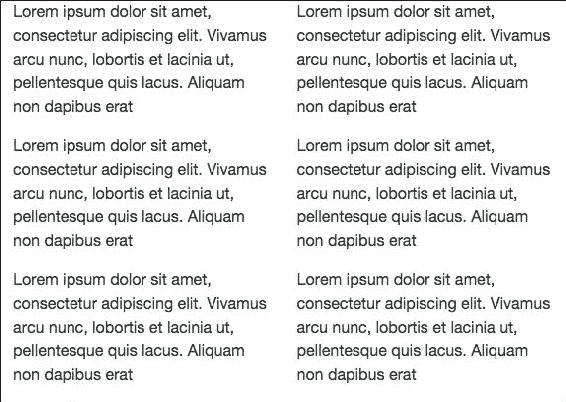
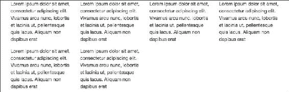
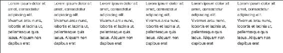
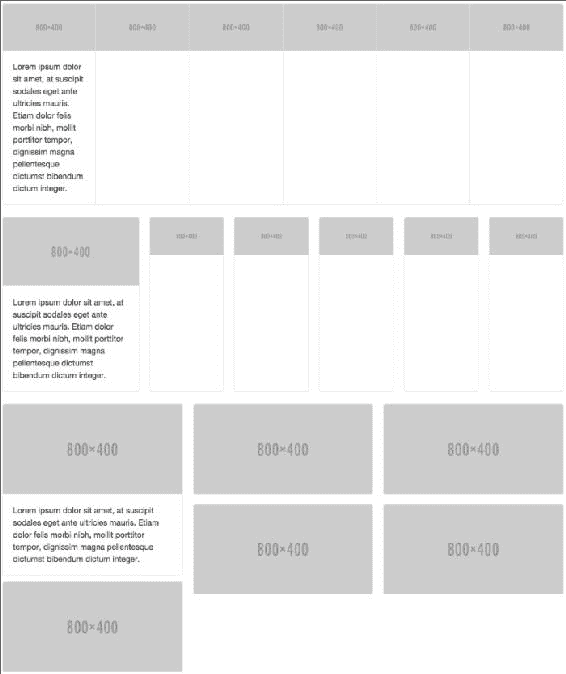
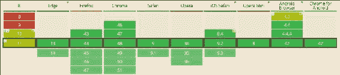

# 九、Bootstrap 4 的新功能

**Bootstrap 4** 是在撰写本文时 Bootstrap 的最新版本。这个版本使 Bootstrap 更加强大，并且易于定制和使用。在本章中，您将通过示例了解 Bootstrap 4 的新功能。我会假设你已经有了一些 Bootstrap 的知识，并且知道如何使用它创建响应性网站。如果你是 Bootstrap 或响应式网页设计的新手，你可以从 Packt 目录中找到好书从头开始学习 Bootstrap。从本章开始，我们将使用 Bootstrap 4 来设计我们将要构建的所有项目。

在本章中，我们将涵盖以下主题:

*   下载引导程序 4 的各种方法
*   Bootstrap 4 的兼容性
*   对弹性箱的支持
*   定制引导 4
*   响应性 CSS 单元

# 下载引导程序 4

要下载引导程序 4，首先访问[http://v4-alpha.getbootstrap.com/getting-started/download/](http://v4-alpha.getbootstrap.com/getting-started/download/)。在这里，你会发现下载 Bootstrap 4 的各种方式，具体取决于你使用的包管理器。如果您使用的包管理器没有列出，或者您根本不使用包管理器，您也可以直接下载编译版本。该页面还为您提供了下载源文件的链接。

它还提供了自定义构建，这些只是 Bootstrap 4 的一部分，当您只需要 Bootstrap 4 的一些功能，但不需要整个库时，可以使用它们。

所有主要的 CDN 服务也支持 Bootstrap 4，所以如果你想从一个 CDN 入队，你可以很容易地找到 CDN URLs。

对于这一章，直接下载编译好的版本，放入名为`bs4`的新目录。在同一个目录下，创建一个名为`index.html`的文件，并在其中放置以下代码:

```js
<!DOCTYPE html>
<html lang="en">
  <head>
    <!-- Required meta tags always come first -->
    <meta charset="utf-8">
    <meta name="viewport" content="width=device-width, initial-scale=1, shrink-to-fit=no">
    <meta http-equiv="x-ua-compatible" content="ie=edge">

    <!-- Bootstrap CSS -->
    <link rel="stylesheet" href="bootstrap.min.css">
  </head>
  <body>

    <!-- jQuery first, then Bootstrap JS. -->
    <script src="https://ajax.googleapis.com/ajax/libs/jquery/2.1.4/jquery.min.js"></script>
    <script src="bootstrap.min.js"></script>
  </body>
</html>
```

# 浏览器和设备支持

Bootstrap 4 支持所有主要浏览器和平台的最新稳定版本。

在兼容性方面，Bootstrap 4 带来的唯一变化是它放弃了对 Internet Explorer 8 的支持。其他一切都与 Bootstrap 3 中相同。

# 理解快速眼动和电磁 CSS 单位

Bootstrap 4 已经从`px`切换到`rem`和`em`只要有可能。这就是 IE 8 不支持 Bootstrap 4 的主要原因，因为 IE 8 不支持`em`和`rem`单元。Bootstrap 4 切换到`rem`和`em`，因为它们使响应排版和组件尺寸更容易。

如果你对`rem`和`em` CSS 单位不熟悉，那么是时候学习一下了。

`em`单位是相对于父元素的字体大小。`1em`等于当前父元素的字体大小。`2em`表示当前字体大小的两倍。例如，如果一个元素以`10 px`的字体显示，那么`2em`就是`20 px`。我们可以通过使用不同视口或设备宽度大小的 CSS 媒体查询改变父元素的字体大小来实现响应性的排版和组件。

由于`em`大小是嵌套的(这取决于父元素)，如果您有带有`1.5em`大小的元素，然后将一些 HTML 与也有`em`声明的元素嵌套在一起，它们的大小会成倍增加。

`rem`单位与`em`相似，但相对于 HTML 标签(根元素)的字体大小。因此，它不是嵌套的。

### 注

Bootstrap 4 使用 16 像素的基本字体大小。

# 电网系统

Bootstrap 4 网格系统唯一的变化就是增加了一个新的超大断点。该断点的类前缀为`.col-xl-`。以下是新增后的 Bootstrap 4 网格断点:


`.col-xl-`断点的目标屏幕尺寸为 **1200px** 或更大，这是在引导 3 中`.col-lg-`的目标。因此，这使得其他断点压缩到比 Bootstrap 3 中更小的目标屏幕大小。这里可以看到`.col-xs-`现在瞄准的屏幕宽度小于 **544px** 而不是在 Bootstrap 3 中的 **768px** ，更容易瞄准移动设备，平板和移动设备的布局也不同，这是 Bootstrap 3 所缺乏的。

虽然 Bootstrap 使用`em`或`rem`来定义大多数大小，但是`px`用于网格断点和容器宽度。这是因为视口宽度以像素为单位，不会随字体大小而变化。

这是一个新网格系统的例子。将该代码放入`index.html`文件的`<body>`标签中:

```js
<div class="container">
  <div class="row">
    <div class="col-xs-12 col-sm-6 col-md-4 col-lg-3 col-xl-2">
      <p>
        Lorem ipsum dolor sit amet, consectetur adipiscing elit. Vivamus arcu nunc, lobortis et lacinia ut, pellentesque quis lacus. Aliquam non dapibus erat
      </p>
    </div>

    <div class="col-xs-12 col-sm-6 col-md-4 col-lg-3 col-xl-2">
      <p>
        Lorem ipsum dolor sit amet, consectetur adipiscing elit. Vivamus arcu nunc, lobortis et lacinia ut, pellentesque quis lacus. Aliquam non dapibus erat
      </p>
    </div>

    <div class="col-xs-12 col-sm-6 col-md-4 col-lg-3 col-xl-2">
      <p>
        Lorem ipsum dolor sit amet, consectetur adipiscing elit. Vivamus arcu nunc, lobortis et lacinia ut, pellentesque quis lacus. Aliquam non dapibus erat
      </p>
    </div>

    <div class="col-xs-12 col-sm-6 col-md-4 col-lg-3 col-xl-2">
      <p>
        Lorem ipsum dolor sit amet, consectetur adipiscing elit. Vivamus arcu nunc, lobortis et lacinia ut, pellentesque quis lacus. Aliquam non dapibus erat
      </p>
    </div>

    <div class="col-xs-12 col-sm-6 col-md-4 col-lg-3 col-xl-2">
      <p>
        Lorem ipsum dolor sit amet, consectetur adipiscing elit. Vivamus arcu nunc, lobortis et lacinia ut, pellentesque quis lacus. Aliquam non dapibus erat
      </p>
    </div>

    <div class="col-xs-12 col-sm-6 col-md-4 col-lg-3 col-xl-2">
      <p>
        Lorem ipsum dolor sit amet, consectetur adipiscing elit. Vivamus arcu nunc, lobortis et lacinia ut, pellentesque quis lacus. Aliquam non dapibus erat
      </p>
    </div>
  </div>
</div>
```

一个 Bootstrap 行最多可以有 12 列。因为在某些情况下，行中有超过 12 列，所以列被包装，也就是说，列被包装到一个新行中。

在手机屏幕上，之前的代码如下所示:


在小平板上，会是这样的:



在普通平板电脑上看起来会是这样的:


笔记本电脑用户将会看到:



最后，在桌面显示器上，会是这样的:



因此，在 Bootstrap 4 中，我们能够精确定位所有类型的设备。

# 全局余量重置

对于所有元素，Bootstrap 4 将`margin-top`重置为`0`，同时在所有元素上保持一致的`margin-bottom`值。

比如标题加了`margin-bottom: .5rem`，段落加了`margin-bottom: 1rem` 方便间距。

# 间隔实用程序类

Bootstrap 4 添加了一组名为 **的新效用类，间隔效用类**。这些类允许您通过边距或填充在元素的任何方向上快速添加间距。

这些类的格式是`[margin or padding]-[direction]-[size]`。

对于边距或填充，请使用以下内容:

*   `m`为保证金
*   `p`用于填充

对于方向，您可以使用这些:

*   `a`为所有人
*   `t`为顶
*   `r`为右
*   `l`为左
*   `b`为底部
*   `x`为左右
*   `y`为顶部和底部

您可以使用这些尺寸:

*   `0`为 0
*   `1`为`1rem`
*   `2`为`1.5rem`
*   `3`为`3rem`

下面是一个演示间距实用程序类的示例。将该代码放在`index.html`的容器元素的末尾:

```js
<hr>
<div class="row">
  <div class="col-xs-12 m-t-2">
    <p>
      Lorem ipsum dolor sit amet, at suscipit sodales eget ante ultricies mauris. Etiam dolor felis morbi nibh, mollit porttitor tempor, dignissim magna pellentesque dictumst bibendum dictum integer. Justo mattis dapibus in diam. Quis arcu mauris mattis, orci est magna arcu scelerisque, integer gravida sit volutpat tellus, nulla enim quis. In non, in et, nec mauris in eu nec, nostra pellentesque nulla sodales, tempor neque ultrices lorem.

    </p>
  </div>

  <div class="col-xs-12 m-b-2">
    <p>
      Lorem ipsum dolor sit amet, at suscipit sodales eget ante ultricies mauris. Etiam dolor felis morbi nibh, mollit porttitor tempor, dignissim magna pellentesque dictumst bibendum dictum integer. Justo mattis dapibus in diam. Quis arcu mauris mattis, orci est magna arcu scelerisque, integer gravida sit volutpat tellus, nulla enim quis. In non, in et, nec mauris in eu nec, nostra pellentesque nulla sodales, tempor neque ultrices lorem.
    </p>
  </div>
</div>
<hr>
```

以下是页面现在的外观:


在这里，您可以看到间距实用程序类创建的顶部和底部边距空间。

# 显示标题

传统的标题元素，即`h1`、`h2`等等，被设计成在你的页面内容中最有效。当你需要一个突出的标题时，考虑使用显示标题——一个更大的，稍微更固执己见的标题样式。显示标题类可以应用于页面的任何元素。

这里有一个演示显示标题的例子。将该代码放在`index.html`的容器元素的末尾:

```js
<h1 class="display-1">Display-1</h1>
<h1 class="display-2">Display-2</h1>
<h1 class="display-3">Display-3</h1>
<h1 class="display-4">Display-4</h1>
<hr>
```

`display-1`、`display-2`、`display-3`和`display-4`为显示标题类。

下面是代码的输出:


# 反向表

引入了一个新的表格类，命名为`table-inverse`。这只是`table`在长相方面的另一种变化。

下面是如何创建一个反向表。将该代码放在`index.html`的容器元素的末尾:

```js
<table class="table table-inverse">
  <thead>
    <tr>
      <th>#</th>
      <th>First Name</th>
      <th>Last Name</th>
      <th>Username</th>
    </tr>
  </thead>

  <tbody>
    <tr>
      <th scope="row">1</th>
      <td>Ramesh</td>
      <td>Kumar</td>
      <td>@ramesh</td>
    </tr>

    <tr>
      <th scope="row">2</th>
      <td>Sudheep</td>
      <td>Sahoo</td>
      <td>@sudheep</td>
    </tr>

    <tr>
      <th scope="row">3</th>
      <td>Abhinash</td>
      <td>Singh</td>
      <td>@abhi</td>
    </tr>
  </tbody>
</table>
<hr>
```

以下是这张桌子的外观:


# 卡片组件

**卡片**是 Bootstrap 4 中的一个新组件，它取代了井、面板和缩略图。卡片是一种灵活且可扩展的内容容器。它包括页眉和页脚的选项、各种各样的内容、上下文背景颜色和强大的显示选项。

下面是一个演示如何创建卡片及其所有子部分和样式的示例。将该代码放在`index.html`的容器元素的末尾:

```js
<div class="row">
  <div class="col-md-4">
    <div class="card">

      <div class="card-header">
        Featured
      </div>
      <div class="card-block">
        <h4 class="card-title">Card title</h4>
        <h6 class="card-subtitle">Support card subtitle</h6>
      </div>

      

      <div class="card-block">
        <p class="card-text">
          Lorem ipsum dolor sit amet, at suscipit sodales eget ante ultricies mauris. Etiam dolor felis morbi nibh, mollit porttitor tempor, dignissim magna pellentesque dictumst bibendum dictum integer.
        </p>
      </div>

      <div class="card-block">
        <a href="#" class="card-link">Card link</a>
        <a href="#" class="card-link">Another link</a>
      </div>

      <div class="card-footer">
        2 days ago
      </div>
    </div>

  </div>
  <div class="col-md-4">
    <div class="card">
      

      <div class="card-block">
        <blockquote class="card-blockquote">
          <p>Lorem ipsum dolor sit amet, consectetur adipiscing elit. Integer posuere erat a ante.</p>
          <footer>Someone famous in <cite title="Source Title">Source Title</cite></footer>
        </blockquote>
      </div>
    </div>
  </div>

  <div class="col-md-4">
    <div class="card">
      <div class="card-block">
        <p class="card-text">
          Lorem ipsum dolor sit amet, at suscipit sodales eget ante ultricies mauris. Etiam dolor felis morbi nibh, mollit porttitor tempor, dignissim magna pellentesque dictumst bibendum dictum integer.
        </p>
      </div>

      
    </div>
  </div>

  <div class="col-md-4">
    <div class="card">
      

      <div class="card-img-overlay">
        <h4 class="card-title">Card title</h4>
        <p class="card-text">Lorem ipsum dolor sit amet, at suscipit.</p>
      </div>
    </div>
  </div>

  <div class="col-md-4">
    <div class="card card-inverse" style="background-color: black">
      <div class="card-block">
        <h3 class="card-title">Card Title</h3>
        <p class="card-text">Lorem ipsum dolor sit amet, at suscipit sodales eget ante ultricies mauris. </p>
      </div>
    </div>
  </div>

  <div class="col-md-4">
    <div class="card card-inverse card-primary">
      <div class="card-block">
        <h3 class="card-title">Card Title</h3>
        <p class="card-text">Lorem ipsum dolor sit amet, at suscipit sodales eget ante ultricies mauris.</p>
      </div>
    </div>
  </div>

  <div class="col-md-4">
    <div class="card card-inverse card-success">
      <div class="card-block">
        <h3 class="card-title">Card Title</h3>
        <p class="card-text">Lorem ipsum dolor sit amet, at suscipit sodales eget ante ultricies mauris.</p>
      </div>
    </div>
  </div>

  <div class="col-md-4">
    <div class="card card-inverse card-info">
      <div class="card-block">
        <h3 class="card-title">Card Title</h3>
        <p class="card-text">Lorem ipsum dolor sit amet, at suscipit sodales eget ante ultricies mauris.</p>
      </div>
    </div>
  </div>

  <div class="col-md-4">
    <div class="card card-inverse card-warning">
      <div class="card-block">
        <h3 class="card-title">Card Title</h3>
        <p class="card-text">Lorem ipsum dolor sit amet, at suscipit sodales eget ante ultricies mauris.</p>
      </div>
    </div>
  </div>

  <div class="col-md-4">
    <div class="card card-inverse card-danger">
      <div class="card-block">
        <h3 class="card-title">Card Title</h3>
        <p class="card-text">Lorem ipsum dolor sit amet, at suscipit sodales eget ante ultricies mauris.</p>
      </div>
    </div>
  </div>
</div>
```

这里是代码的样子:


在这里，我已经创建了多张卡片，以便更容易展示它们的所有子部分和不同的风格。

下面是前面代码的工作原理:

*   要创建卡片，我们需要使用`.card`类。
*   默认情况下，卡片宽度是其父容器的 100%。因此，这里我们使用网格系统来控制宽度。
*   在第一张卡片中，我们有一个标题，它是使用`.card-header`类创建的。然后，我们有一个卡片块，里面有标题和副标题。卡块是有衬垫的卡的一部分。每当你需要在卡片的任何部分填充时，只需使用`.card-block`类。使用`.card-title`创建卡片标题，使用`.card-subtitle`类创建卡片副标题。`.card-title`和`.card-subtitle`类只是给出适当的利润。然后，我们只是有一个响应的形象。之后，我们有一个使用`.card-text`类的段落。`.card-text`类确保最后一个子元素没有任何下边距。然后，我们和`.card-link`班有两个环节。`.card-link`将左边距应用于第二个类别的所有`.card-link`类别。最后，我们有一个卡片页脚，它是使用`.card-footer`创建的。
*   在第二张卡中，我们有一个响应图像，然后是一个区块报价。我们在图像中添加了`.card-img-top`类，它在图像中添加了一个右上角和左上角的边框半径。我们还将`.card-blockquote`添加到块引用中，以删除块引用中的边距、填充和左边框。
*   在第三张卡片中，我们只是有一些文本和一个响应图像。我们为响应图像添加了`.card-img-bottom`类，它为图像添加了一个右下和左下边界半径。
*   我们制作的第四张卡片是用来展示卡片覆盖的。首先，我们用`.card-img`类添加了一个响应图像，它为所有的角添加了一个边界半径。然后，我们使用`.card-img-overlay`类创建了一个覆盖图，它只是用一些填充使元素的位置成为绝对的，没有顶部、右侧、左侧和底部，从而将内容放在卡片的顶部。
*   默认情况下，卡片使用深色文本并呈现浅色背景。为白色文本添加`.card-inverse`，并指定与之对应的`background-color`和`border-color`值。第五张卡是`.card-inverse`的演示。Bootstrap 4 还提供了一些为卡片添加背景色和边框色的类。最后五张卡片展示了这些课程。

## 卡组、套牌和列

卡片组允许您将卡片渲染为具有等宽等高列的单个附加元素。卡组仅适用于大于`544px`的屏幕尺寸。

如果您需要一套大小相同但没有相互连接的卡片，那么请使用一副副卡片而不是卡片组。套牌仅适用于大于`544px`的屏幕尺寸。

最后，卡片列可以让你把卡片组织成类似砖石的列。卡片栏仅适用于大于`544px`的屏幕尺寸。

下面是卡组、套牌和列的代码示例。将其放在 `index.html`的容器元素的末端:

```js
<div class="card-group">
    <div class="card">
        
        <div class="card-block">
            <p class="card-text">
                Lorem ipsum dolor sit amet, at suscipit sodales eget ante ultricies mauris. Etiam dolor felis morbi nibh, mollit porttitor tempor, dignissim magna pellentesque dictumst bibendum dictum integer.
            </p>
        </div>
    </div>
    <div class="card">
        
    </div>
    <div class="card">
        
    </div>
    <div class="card">
        
    </div>
    <div class="card">
        
    </div>
    <div class="card">
        
    </div>
</div>

<br>
<div class="card-deck-wrapper">
    <div class="card-deck">

        <div class="card">
            
            <div class="card-block">
                <p class="card-text">
                    Lorem ipsum dolor sit amet, at suscipit sodales eget ante ultricies mauris. Etiam dolor felis morbi nibh, mollit porttitor tempor, dignissim magna pellentesque dictumst bibendum dictum integer.
                </p>
            </div>
        </div>
        <div class="card">
            
        </div>
        <div class="card">
            
        </div>
        <div class="card">
            
        </div>
        <div class="card">
            
        </div>
        <div class="card">
            
        </div>
    </div>
</div>

<br>
<div class="card-columns">
    <div class="card">
        
        <div class="card-block">
            <p class="card-text">
                Lorem ipsum dolor sit amet, at suscipit sodales eget ante ultricies mauris. Etiam dolor felis morbi nibh, mollit porttitor tempor, dignissim magna pellentesque dictumst bibendum dictum integer.
            </p>
        </div>
    </div>
    <div class="card">
        
    </div>
    <div class="card">
        
    </div>
    <div class="card">
        
    </div>
    <div class="card">
        
    </div>
    <div class="card">
        
    </div>
</div>
```

这里是代码的输出:



如您所见，我们已经使用`.card-group`类创建了一个类组。我们使用`.card-deck-wrapper`和`.card-deck`来创建一副牌，最后，`.card-columns`到将牌组织成类似砖石的柱子。

# 轮廓按钮

Bootstrap 4 新增了一些带有**轮廓按钮**的按钮样式。轮廓按钮看起来是空心的或者只是普通按钮的倒置。

下面是演示大纲按钮的示例代码。将该代码放在`index.html`的容器元素的末尾:

```js
<hr>
<button type="button" class="btn btn-primary-outline">Primary</button>
<button type="button" class="btn btn-secondary-outline">Secondary</button>
<button type="button" class="btn btn-success-outline">Success</button>
<button type="button" class="btn btn-warning-outline">Warning</button>
<button type="button" class="btn btn-danger-outline">Danger</button>
<hr>
```

下面是代码的外观:


# 从少到多

Bootstrap 4 源码是用 Sass 写的，而不是 Less。在 Bootstrap 3 之前使用较少。这很好，因为 Sass 往往更受前端开发人员的欢迎。它也编译得更快。此外，目前似乎没有任何关于 Less 版本的计划。你可以在[https://github.com/twbs/bootstrap/tree/v4-dev](https://github.com/twbs/bootstrap/tree/v4-dev)找到源文件。

# 文本对齐和浮动实用程序类

浮动和文本对齐的实用程序类现在有了响应范围。Bootstrap 4 已经删除了无响应文本对齐和浮动类。

响应文本对齐类采用`text-[xs/sm/md/lg/xl]-[left/right/center]`格式。例如，`text-lg-left`类在尺寸为`lg`或更宽的视口上左对齐文本。

格式类别`pull-[xs/sm/md/lg/xl]-[left/right/none]`根据当前视口大小向左或向右浮动元素或禁用浮动。例如，`pull-xs-left`类使元素在所有视口尺寸上向左浮动。

# 重启

Bootstrap 3 使用`Normalize.css`作为其 CSS 重置。在 Bootstrap 4 中，重置和 Bootstrap 基本样式组合成一个名为`reboot.scss`的文件。

# Flexbox 支撑

**Flexbox 支持**有终于来到 Bootstrap 4 中的 Bootstrap。要使各种组件和网格系统能够使用 Flexbox，您可以下载 Flexbox 版本的 Bootstrap CSS 文件，该文件可在其下载页面上获得:[http://v4-alpha.getbootstrap.com/getting-started/download/](http://v4-alpha.getbootstrap.com/getting-started/download/)。

请记住，Flexbox 的浏览器支持很差，所以在决定使用之前要三思。下图显示了 Flexbox 的浏览器支持:



您也可以将`$enable-flex`的值更改为`true` Sass 变量，并编译它以生成 Bootstrap CSS 的 Flexbox 版本。

在[http://v4-alpha.getbootstrap.com/getting-started/flexbox/](http://v4-alpha.getbootstrap.com/getting-started/flexbox/)的引导程序 4 中了解更多关于弹性盒支持的信息。

# JavaScript 改进

在源文件中，所有的 JavaScript 插件都是用 ES6 编写的，为了分发，用巴别塔编译。他们现在也得到 UMD 的支持。

现在 IE 8 的支持已经被放弃，所以总是使用带有 Bootstrap 的 jQuery 2.0 是安全的。jQuery 2.0 更小更快，功能也更多。

# 添加系绳

**Tether** 是一个 JavaScript 库，用于有效地使绝对定位的元素停留在页面上另一个元素的旁边。例如，您可能希望工具提示或对话框打开并保持在页面上相关项目的旁边。

在引导程序 4 中，系绳被集成到工具提示和弹出窗口中，以获得更好的自动放置和性能。所以，为了让工具提示和弹出窗口在引导程序 4 中工作，你必须排队`tether.js`。

将这一行代码添加到`bootstrap.min.js`文件的顶部，以便将来自 CDN 的系绳入队:

```js
<script src="https://cdnjs.cloudflare.com/ajax/libs/tether/1.2.0/js/tether.min.js"></script>
```

# 21:9 纵横比类

一个新的长宽比类已经被添加到 Bootstrap 4:用于`21:9`比例的`.embed-responsive-21by9`类中。这里有一个例子:

```js
<div class="embed-responsive embed-responsive-21by9">
                <iframe class="embed-responsive-item" src="http://packtpub.com"></iframe>
            </div>
```

# 定制引导 4

在 Bootstrap 4 中，所有的定制变量选项都被整合到一个名为`_variables.scss`的文件中，在这里你可以轻松地编译你的 Sass。这以前都是在一个单独的样式表中完成的。

该文件提供的定制选项比 Bootstrap 以前提供的定制选项多得多。

# 雕纹掉落

**铭文**已经从建筑中移除，也就是说，助推器 4 不包含图标包。您需要手动将图标包入队。

# 总结

因此，我们已经看到了 Bootstrap 4 的所有新功能。网格系统和卡片是 Bootstrap 4 的两大新增功能。现在切换到 Bootstrap 4 绝对没问题。虽然 Bootstrap 4 放弃了对 IE 8 的支持，但它仍然很好，因为用户也应该随着技术的发展而改变。从现在开始，Bootstrap 4 将用于我们在本模块中创建的所有项目。