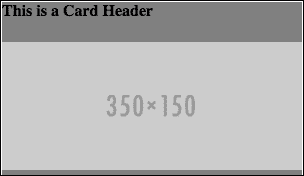
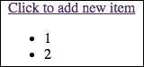

# 第十章。使用 React 构建用户界面

为反应式用户界面编写代码是一项困难的任务，因为每当应用程序状态发生变化时，都很难编写代码来使用 JavaScript 操作 DOM，这使得理解应用程序变得困难。因此，引入了 MVC 架构，我们分别定义了 UI 和应用程序状态，UI 会随着应用程序状态的变化而自动更新。MVC 框架视图一直致力于使反应式用户界面的代码编写更加容易，但没有提高渲染性能、可重用性和调试的便利性。这就是 React 想要解决的问题。它不仅使为反应式用户界面编写代码变得更加容易，而且还考虑了渲染性能、可重用性和调试的便利性。

在本章中，我们将涵盖以下主题:

*   什么是反应
*   虚拟 DOM 技术
*   使用 React 进行基于组件的用户界面开发
*   单向数据流编程
*   用 JSX 写反应代码
*   在服务器端使用 React 构建同构应用
*   许多其他话题可以帮助我们更好地把握 React

# 引入反应

React 是一个用于构建反应式 ui 的 JavaScript 库。每当应用程序状态发生变化时，我们通常使用 jQuery 或纯 JavaScript 来操作反应式 UI，这使得重用和理解代码变得困难。相反，我们可以使用 React，它允许我们根据应用程序状态声明用户界面的行为，并且每当应用程序状态发生变化时，它都会自动更新用户界面。有许多库和技术，如网络组件和模板引擎，旨在使用户界面的构建更容易，但 React 脱颖而出，因为它使构建可重用和高性能的反应式用户界面变得容易。

React 是也用作视图库，因为它正是视图库应该是的样子。视图保存应用程序的用户界面，并根据应用程序状态定义用户界面如何变化，即如何显示应用程序状态。因为它只是一个视图库，它没有告诉我们如何管理、访问和变异应用程序状态。它可以在任何类型的架构和框架中用作视图层。

请记住，React 是一个库，而不是像 Angular 或 ember 这样的框架。因此，React 可以与 Angular 一起使用，使 Angular 视图在性能和可重用性方面更好。

例如，有一个名为 ngReact 的 AngularJS 模块，它允许 React 在 AngularJS 中用作视图。

甚至 Flux 架构也使用 React 作为其视图。我们将在下一章中了解更多关于 Flux 的信息。

React 总是与框架一起使用，因为它只定义了 UI，但没有告诉我们如何管理应用程序逻辑和状态，就像模板库或 web 组件总是与框架一起使用一样。

### 类型

**React 是模板引擎吗？**

React 不是模板引擎。大多数流行的 MVC 框架的视图都是模板系统的视图。在模板系统中，我们用模板语言为用户界面编写 HTML，并对其进行处理以生成最终的 HTML。例如，AngularJS 视图是一个由指令、表达式等组成的模板系统。React 不是模板引擎，因为我们不写 HTML。相反，我们使用 JavaScript 来定义 DOM 的结构。React 还可以做比模板引擎更多的事情。它还可以在用户界面中捕获用户事件。这就是它与传统观点的不同之处。只是 React 的工作方式不同于模板系统。

当使用 React 构建用户界面时，我们不会像使用其他框架和库那样编写任何 HTML 来构建 UI；相反，我们只使用 JavaScript 来声明 DOM 结构。这种编程风格使得 React 能够实现各种算法和技术，以实现高渲染性能和可重用性。

在我们深入学习 React 之前，让我们先建立一个项目来使用它。

## 建立一个基本的反应项目

在写的时候，React 的最新版本是 0.14.7。这是本模块使用的版本。首先，访问[https://facebook.github.io/react/downloads.html](https://facebook.github.io/react/downloads.html)下载 React。在这里，你会发现两种类型的 React 构建，即生产构建和开发构建。这两个构建之间的区别在于，开发构建是未压缩的，包含额外的警告，而生产构建是压缩的，包含额外的性能优化，并去除所有错误。

当应用程序处于开发阶段时，应该使用开发构建。一旦您的应用程序准备好进行部署，您就应该切换到生产版本。

同样，您会发现两种类型的生产和开发构建:一种有附加组件，另一种没有。我们将使用没有附加组件的开发版本。

您将找到 CDN 链接以及手动下载和排队反应的链接。React 由两个文件组成:`react.js`和`react-dom.js`。手动下载它们。

创建一个名为`react-demo`的文件夹，并将两个文件都放入其中。然后，创建一个名为`index.html`的文件，并将该代码放入其中:

```js
<!DOCTYPE html>
<html>
  <head>
    <meta charset="UTF-8" />
    <title>React Demo</title>

    <script src="react.js"></script>
    <script src="react-dom.js"></script>
  </head>
  <body>

    <script>
      //place React code here
    </script>
  </body>
</html>
```

在本章的后面，我们将了解为什么 React 由两个文件组成而不是一个文件。现在，忽略这个。

## 虚拟 DOM

浏览器解释 HTML 并创建一个 DOM。DOM 是定义页面结构的树状结构。浏览器随后在页面上呈现 DOM。DOM 应用编程接口是我们用来操作 DOM 的。当我们操纵它时，浏览器会重新渲染被操纵的部分。

问题不在于 DOM 如何工作，而在于我们如何以编程方式改变它。操作 DOM 的节点需要专业知识；否则，我们经常会不必要地重新渲染大量节点，这将导致较差的渲染性能。

例如，假设我们在一个电子商务网站上有一个很大的产品列表。我们还有一个过滤器小部件来过滤项目。当我们更改过滤器小部件中的值时，会重新加载列表项并重新呈现完整的列表，这需要对 DOM 进行大量操作，并可能导致糟糕的呈现性能。为了获得更好的性能，我们实际上只能操作列表中的特定部分，如产品名称、图像和成本。但是为这个写代码会很难。

我们再举一个例子。如果您正在使用`ng-repeat`显示列表，那么向列表中添加新项目将导致列表的完全重新呈现。所以，如果脸书或者 Instagram 使用了`ng-repeat`，那么无论何时我们向下滚动，整个帖子集都会被重新渲染。这个问题的解决方案是，我们可以使用 jQuery 或纯 JavaScript 在列表的末尾添加一个新帖子，而不是使用`ng-repeat`，它会重新呈现整个列表。但是如果你想维护正在显示的帖子，那么你最终会写一些更复杂的代码。

正是由于这些问题，引入了虚拟 DOM。虚拟 DOM 确保任何人都可以编写复杂的反应式用户界面代码，而不用担心性能。虚拟 DOM 是 React 实现渲染性能的秘诀。

虚拟 DOM 是真实 DOM 的抽象版本，也就是对真实 DOM 的描述。虚拟的 DOM 元素只是 JavaScript 对象，而真实的 DOM 元素是真实的用户界面元素。虚拟 DOM 要快得多，因为它只是一个 JavaScript 数据结构，操纵它不会自动重新呈现用户界面。前面，我说过在 React 中，您不编写任何 HTML，而是声明 DOM 的结构。实际上，您声明的是虚拟 DOM 的结构，而不是真实的 DOM。React 保持真实的 DOM 与虚拟的 DOM 同步。每当应用程序状态发生变化以更新 UI 时，React 都会使用复杂的算法来比较真实 DOM 和虚拟 DOM，并找到尽可能少的突变，以便真实 DOM 与虚拟 DOM 同步。我们稍后将看到这些算法实际上是如何发现差异并变异真实的 DOM 的。例如，如果我们在虚拟 DOM 中有一个列表，我们移除该列表并添加一个只有一个额外项目的新列表，那么，当与真实 DOM 同步时，只有新项目被呈现，而不是整个列表。

让我们看一些使用反应打印**你好世界**的示例代码。在`index.html`身体标签内，放置此代码:

```js
<div id="container1"></div>
```

我们将在这个`div`元素中显示**你好世界**。将此代码放在`index.html`文件的脚本标签中，以显示**你好世界**:

```js
var helloBold = React.createElement("b", {}, "Hello");
var worldItalic = React.createElement("i", {}, " World");
var helloWorld = React.createElement("a", {href: "#"}, helloBold, worldItalic);

ReactDOM.render(helloWorld, document.getElementById("container1"));
```

下面是代码输出的样子:


让我们了解代码是如何工作的。

`React.createElement`用于创建一个`ReactElement`界面的对象。一个`ReactElement`对象是一个真实的 DOM 元素的轻量级、无状态和虚拟的表示，但是它不是一个真实的 DOM 元素。基本上是一个虚拟的 DOM。`ReactElement`和真实的 DOM 元素是不同的接口。`React.createElement`的第一个参数可以是一个 HTML 标签名，也可以是`ReactClass`界面的一个对象。稍后我们将了解更多关于`ReactClass`的信息。第二个参数是一个包含 HTML 标签属性或`ReactClass`对象属性的对象。然后，我们可以传递无限多的参数，可以是字符串、`ReactElement`对象或`ReactClass`对象。第二个参数之后的所有参数都被视为将要创建的`ReactElement`对象的子对象。如果子级是动态决定的，那么您可以提供一个数组作为第三个参数。

这里，我们创建了三个`ReactElement`对象。`helloWorld`是一个主播标签，以`helloBold`和`worldItalic`为子标签。我们将锚标签的`href`属性分配给了`#`。

`ReactDOM.render`用于渲染真实 DOM 中的`ReactElement`对象。`ReactDOM.render`将一个`ReactElement`对象作为第一个参数，第二个参数是对真实 DOM 中容器元素的引用，我们希望将该元素添加到`ReactElement`中。

这里，我们已经在容器元素中呈现了锚标签。

### 注

由于`ReactElement`对象是无状态的，我们不能给`properties`对象分配任何 UI 事件处理程序。另外，直接变异传递给`ReactElement`对象的属性不会有任何效果，因为 React 不会直接观察属性。

刚开始可能会觉得`ReactElement`和真实的 DOM 元素只是用不同的方式创建的，它们的界面是一样的，但事实并非如此。以下是一些不同之处:

*   代替`class`属性，你需要使用`className`
*   代替`for`属性，你需要使用`htmlFor`属性
*   `style`属性不能是字符串；它必须是一个物体

还有很多。随着我们深入，我们将探索它们。

## 组件

您可以仅使用`ReactElement`对象来使用反应，但是要利用反应，您必须使用反应组件。`ReactElement`对象是无状态和不可变的，因此对于构建反应式用户界面是无用的。此外，它们没有为用户界面的可重用性提供结构化的机制。

一个 React 组件是一个可重用的自定义标记，它是可变的，并且用一个嵌入的状态进行封装，也就是说，对状态或属性的更改将改变用户界面。例如，我们可以有一个名为`clock`的组件，它以当前时间为属性，显示一个带有经过时间的时钟。另一个交易所可能是实时显示比特币价格的比特币价格组件。

组件状态在组件内部。它是在组件内部产生和变异的。但是，组件的属性不能在组件内部发生变化；相反，它们可以被创建组件实例的代码变异。

您可以将整个用户界面分解成组件——这是使用 react 构建用户界面时推荐的编码风格。您也可以在组件内部使用组件。在深入讨论组件之前，让我们使用组件重写之前的 **Hello World** 代码。

在`index.html`身体标签内，放置此代码:

```js
<div id="container1"></div>
```

我们将在这个`div`元素中显示**你好世界**。将此代码放入`index.html`文件的`script`标签中，显示**你好世界**:

```js
var anchorWithBoldItalic = React.createClass({
  render: function() {
    return React.createElement(
      "a", 
      {href: this.props.href}, 
      React.createElement("b", {}, this.props.boldText), 
      React.createElement("i", {}, this.props.italicText)
    );
  }
});

var HelloWorld = React.createElement(anchorWithBoldItalic, {href: "#", boldText: "Hello", italicText: " World" });

ReactDOM.render(HelloWorld, document.getElementById("container2"));
```

这里是之前代码的输出:


下面是代码的工作原理:

1.  使用`React.createClass`功能创建一个组件。该函数接受一个对象，并且该对象必须具有分配给返回`ReactElement`对象的函数的`render`属性。由`render`方法返回的`ReactElement`对象被称为组件的内容，也就是说，它陈述了标签是如何呈现的。每当我们试图显示标签时，标签的内容都会显示在适当的位置。
2.  `React.createClass`返回一个组件。要使用该组件，我们需要创建它的实例。就像`React.createElement`用于为一个 HTML 标签创建一个`ReactElement`对象一样，它也可以为一个组件创建一个`ReactElement`对象。因此，`React.createElement`用于创建组件的实例。`this.props`用于在组件内部访问其属性。
3.  在这里，我们创建了一个名为`anchorWithBoldItalic`的组件，它是一个锚点元素，一些文本显示为粗体，一些显示为斜体。
4.  然后，我们为我们的组件创建了一个`ReactElement`对象，最后使用`ReactDOM.render`渲染它。

### 注

请记住，在创建组件实例后更改属性将会重新呈现组件。

## 单向数据绑定

在前面的小节中，我说过组件具有封闭性。每当我们对状态进行更改时，组件都会被呈现。组件还允许您注册用户界面事件处理程序，并且您还可以改变事件处理程序内部的状态。

React 允许您管理、访问和改变用户界面状态，但不能改变应用程序状态。用户界面状态和应用程序状态的区别在于，用户界面状态表示用于操作用户界面的数据，而应用程序状态表示用户界面中显示的数据。例如，让我们假设您有一个注释框。评论框中的评论是应用状态，**查看更多评论**按钮是 UI 状态，可以显示，也可以不显示，这取决于是否还有帖子。

用户界面与其状态之间的数据绑定只是单向的。这意味着用户在用户界面上的操作不能直接改变用户界面状态，但是用户界面状态可以改变用户界面。

这似乎是一个限制，因为 AngularJS 和其他流行的框架提供了双向数据绑定，但这实际上是一个特性。此功能使理解和调试应用程序变得更加容易。

许多开发人员倾向于使用 UI 状态作为应用程序状态，但是对于复杂和大型的应用程序，这将导致问题，并使构建应用程序变得困难。

让我们看一个例子，说明如何通过构建一个按钮来使用组件状态，该按钮在单击时隐藏/显示一个框。

将该代码放入`index.html`文件的`<body>`标签中:

```js
<div id="container3"></div>
```

我们将在这个容器元素中显示组件。

将该代码放在`script`标签内:

```js
var hideShowBoxButton = React.createClass({
  getInitialState: function(){
    return {
      display: "inline-block"
    }
  },
  handleClick: function(){
    if(this.state.display == "inline-block")
    {
      this.setState({display: "none"});
    }
    else
    {
        this.setState({display: "inline-block"});
    }
  },
  render: function(){
    return React.createElement(
      "div", 
      {}, 
      React.createElement(
        "a", 
        {href: "#", onClick: this.handleClick}, 
        "Click to Show/Hide"
      ), 
      React.createElement(
        "span", 
        {
          style: {
            display: this.state.display, 
            height: 30, 
            width: 30, 
            backgroundColor: "red"
          }
        }
      )
    );
  }
});

ReactDOM.render(React.createElement(hideShowBoxButton), document.getElementById("container3"));
```

这个是之前代码的输出:


代码是这样工作的:

1.  首先，我们创建一个新组件。
2.  `getInitialState`方法返回组件的初始状态。
3.  然后，我们创建一个点击处理程序来切换显示状态。变异状态时，一定要用`this.setState`，不要用`this.state`直接变异状态。
4.  然后，我们创建`render`方法，该方法显示一个按钮和一个红色小框。`render`方法将盒子的显示样式设置为显示状态。因此，只要状态改变，React 就会呈现组件。React 不是呈现完整的组件，而是通过将虚拟 DOM 与真实 DOM 进行比较，并仅更改所需的 DOM 元素来重新呈现它。这就是它实现渲染性能的方式。
5.  最后，我们创建一个组件实例，并将其添加到容器元素中。
6.  还要注意，我们只为高度和宽度指定了一个数字，没有任何单位。在这种情况下，单位是像素。

## 同构 UI 开发

**同构开发**是我们可以在前端和后端使用相同的代码。

到目前为止，我们已经看到了如何在前端使用 React 来构建反应式 UI，但是同样的 React 代码也可以在后端使用。在后端使用时，React 输出 HTML，不提供任何种类的 UI 性能优势或反应能力。

React 的同构性质是它如此受欢迎和强大的原因之一。它让许多事情变得更容易。例如，通过让我们在后端预渲染页面，然后在前端预渲染页面，可以更容易地防止 FOUC:相同的组件只会添加事件绑定。

React 代码不仅可以在 Node.js 中执行，还可以在 PHP、Ruby、。NET 以及其他一些主要的后端语言。

由于 React 可以在前端和后端使用，React 开发团队决定将 React 分成两个文件:React 核心和另一个特定于执行环境的部分。这就是为什么当我们之前在我们的 HTML 文件中包含 React 时，我们包含了两个文件。反应核心包含`React.createElement`、`React.createClass`等，而反应 DOM 包含`ReactDOM.render`等。

我们来看一个如何在 Node.js 中使用 React 的例子，方法是在 Node.js 中创建并显示之前的 hello world 组件，创建一个名为`React-Server-Demo`的目录。在其中，创建名为`app.js`和`package.json`的文件。

在`package.json`文件中，放置以下代码:

```js
{
  "name": "React-Server-Demo",
  "dependencies": {
    "express": "4.13.3",
    "react": "0.14.7",
    "react-dom": "0.14.7"
  }
}
```

然后，运行`npm install`至下载快递和反应模块。现在，在`app.js`文件中，放置以下代码并运行`node app.js`命令:

```js
var React = require("react");
var ReactDOMServer = require("react-dom/server");
var express = require("express");
var app = express();

var anchorWithBoldItalic = React.createClass({
  render: function() {
    return React.createElement(
      "a", 
      {href: this.props.href}, 
      React.createElement("b", {}, this.props.boldText), 
      React.createElement("i", {}, this.props.italicText)
    );
  }
});

var HelloWorld = React.createElement(anchorWithBoldItalic, {href: "#", boldText: "Hello", italicText: " World" });

app.get("/", function(httpRequest, httpResponse, next){
  var reactHtml = ReactDOMServer.renderToString(HelloWorld);
  httpResponse.send(reactHtml)
})

app.listen(8080);
```

现在，在浏览器中打开`http://localhost:8080/`；您将看到以下输出:


代码是这样工作的:

1.  首先我们导入 React 核心模块，然后是 React 服务器端模块，然后是 Express。
2.  我们使用的代码与之前创建组件时使用的代码相同。
3.  然后，我们为根路径创建一条路由。
4.  根路径使用 React 服务器端模块的`renderToString`方法生成组件的 HTML 代码。
5.  最后，我们将 HTML 发送给客户端。

### 注

请注意，默认情况下，“反应”将处于开发模式。要在生产模式下使用反应，将环境变量`NODE_ENV`设置为`production`。

# 从 JSX 开始

在使用 React 构建 UI 时，编写 JavaScript 来定义树状结构和属性很困难，也很难理解 UI。因此，React 团队想出了一种替代语法来编写 React 代码，这种语法更容易编写和理解。这种替代语法称为 JSX。JSX 代表 JavaScript 语法扩展。它看起来类似于 XML。包含 JSX 代码的文件扩展名为`.jsx`。

## 编译 JSX

当然浏览器和服务器端引擎无法理解和解读 JSX；因此，在使用之前，我们需要将 JSX 编译成纯 JavaScript。

有各种各样的开源 JSX 编译器。你可以在[上找到这个列表。JSX 最受欢迎和推荐的](https://github.com/facebook/react/wiki/Complementary-Tools#build-tools)编译器是巴别塔。巴别塔可以安装([https://babeljs.io/docs/setup/](https://babeljs.io/docs/setup/))，我们可以在线使用巴别塔编译器([https://babeljs.io/repl/](https://babeljs.io/repl/))，我们也可以在我们的 HTML 页面中嵌入巴别塔编译器，让它在浏览器中编译。

出于演示的目的，我们将在我们的 HTML 页面中嵌入巴贝尔编译器。编译需要时间，所以在生产现场，千万不要把编译器嵌入网页；相反，您应该预编译并提供 JSX 代码。

要在网页中嵌入巴别塔编译器，请访问[https://cdnjs.com/libraries/babel-core](https://cdnjs.com/libraries/babel-core)并下载巴别塔内核。这些都是 CDN 链接，所以可以直接嵌入，不过还是下载嵌入我们的网页吧。下载`browser.min.js`文件，放入`react-demo`目录。然后，通过在`<head>`标签中放置以下代码，将其嵌入到`index.html`页面中:

```js
<script src="browser.min.js"></script>
```

现在，在`body`标记的末尾创建一个新的`<script>`标记，并将`type`属性设置为`text/babel`，这样巴别塔编译器就知道要编译哪个代码了。代码应该是这样的:

```js
<script type="text/babel">
</script>
```

从现在开始，所有的 JSX 代码都将放在这个脚本标签中。

### 类型

**JSX 编辑器**

几乎所有流行的代码编辑器都有扩展来适当地突出 JSX 语法。

## JSX 语法

让我们使用 JSX 语法重写数据绑定示例代码。将此代码放在`body`标签中，创建一个新的容器元素:

```js
<div id="container4"></div>
```

这是 JSX 密码。将其放入将由巴别塔编译的`script`标签中:

```js
var HideShowBoxButton = React.createClass({
  getInitialState: function(){
    return {
      display: "inline-block"
    }
  },
  handleClick: function(){
    if(this.state.display == "inline-block")
    {
      this.setState({display: "none"});
    }
    else
    {
      this.setState({display: "inline-block"});
    }
  },
  render: function(){
    var boxStyle = {
      display: this.state.display, 
      height: 30, 
      width: 30, 
      backgroundColor: "red"
    };

    return (
      <div>
        <a href="#" onClick={this.handleClick}>Click to Show/Hide</a>
        <span style={boxStyle}></span>
      </div>
    )
  }
});

ReactDOM.render(<HideShowBoxButton />, document.getElementById("container4"));
```

代码的输出如下:


在了解这段代码的工作原理之前，我们先来看看它的编译版本:

```js
var HideShowBoxButton = React.createClass({
  displayName: "HideShowBoxButton",

  getInitialState: function getInitialState() {
    return {
      display: "inline-block"
    };
  },
  handleClick: function handleClick() {
    if (this.state.display == "inline-block") {
      this.setState({ display: "none" });
    }
    else
    {
      this.setState({ display: "inline-block" });
    }
  },
  render: function render() {
    var boxStyle = {
      display: this.state.display,
      height: "30px",
      width: "30px",
      backgroundColor: "red"
    };

    return React.createElement(
      "div",
      null,
      React.createElement(
        "a",
        { href: "#", onClick: this.handleClick },
        "Click to Show/Hide"
      ),
      React.createElement("span", { style: boxStyle })
    );
  }
});

ReactDOM.render(React.createElement(HideShowBoxButton, null), document.getElementById("container4"));
```

这个编译后的版本将让你对 JSX 语法的工作原理有一个基本的了解。让我们了解以前的 JSX 代码是如何工作的。

简而言之，JSX 被用来用类似 XML 的语法编写`React.createElement`方法。XML 标签名是第一个参数，属性是第二个参数，最后子元素是`React.createElement`的其他参数。

如果 JSX 标签名称以小写字母开头，它就是一个 HTML 标签，而如果它以大写字母开头，它就是一个组件。所以在这里，我们让组件名以大写的 H 开头，如果我们使用一个小 H，它将被视为一个 HTML 标签，并且`<hideShowBoxButton></hideShowBoxButton>`将被插入到页面中，这将不会呈现任何东西。

在`HideShowBoxButton`组件中，除了`render`方法代码，其他都是一样的。我们使用 JSX 语法重写了`render`方法。

JSX 提供了`{}`大括号来包装 JavaScript 表达式，同时将它们分配给属性或用作子元素。这里，我们已经为`onClick`和`style`属性分配了 JavaScript 表达式。

最后，我们使用 JSX 语法创建了一个组件实例。

在编译的代码中，你会在传递给`React.createClass`的对象中找到一个`displayName`属性。`displayName`属性用于调试。如果未设置，它将在编译时设置为组件名。

# 挖掘组件

让我们进一步挖掘组件并掌握它们。我们将研究组件的组成和所有权。了解这一点将有助于我们构建更容易管理的复杂反应式用户界面。

## 成分组成

**可组合性**是一个特性，允许您在另一个组件的`render`方法中使用一个组件。

让我们看一个组件组合的基本例子。首先，创建一个新的容器元素。为此，在`body`标签中放置以下代码:

```js
<div id="container5"></div>
```

下面是组件组成示例代码。将这段代码放在巴别塔编译的`script`标签中:

```js
var ResponsiveImage = React.createClass({
  render: function(){

    var imgWidth = {
      width: "100%"
    }

    return (
      
    )
  }
})

var Card = React.createClass({
  render: function(){
    var CardContainerStyle = {
      maxWidth: 300,
      backgroundColor: "grey"
    }

    return (
      <div style={CardContainerStyle}>
        <h4>{this.props.heading}</h4>
        <ResponsiveImage src={this.props.src} />
      </div>
    )
  }
})

ReactDOM.render(<Card src="http://placehold.it/350x150" heading="This is a Card Header" />, document.getElementById("container5"));
```

这个是代码的输出:



在这里，我们创建了两个不同的组件。在卡片组件中，我们使用`ResponsiveImage`组件在其中显示响应图像。

## 组件所有权

当组件在其他组件的`render`方法中使用时，它们被称为拥有者-所有者关系，而不是父子关系。如果组件 X 在其`render`方法中创建了组件 Y 的一个实例，则称组件 X 是组件 Y 的所有者。

### 注

请注意，组件 X 不被称为父组件；相反，它被称为组件 y 的所有者

例如在之前的代码中，`Card`组件是`ResponsiveImage`组件的所有者，`<div>`是`ResponsiveImage`的父代。

如果我们将一个组件实例放在一个组件实例的开始和结束标签中，那么它们就被称为是父子关系。家长可以使用`this.props.children`对象访问其子代。React 还为提供了实用功能，使儿童工作更加轻松。你可以在[找到这些工具。](https://facebook.github.io/react/docs/top-level-api.html#react.children)

# 和解

**协调**是每当状态改变时，反应更新 DOM 的过程。当状态改变时，React 不会从头开始重新呈现所有内容；相反，它首先通过比较新的虚拟 DOM 和旧的虚拟 DOM 来发现是否需要突变，如果有差异，它会将新的虚拟 DOM 和真实的 DOM 进行比较，并进行必要的突变。

### 注

请注意，只有当您更改组件状态时，协调才不会发生；当您再次在同一个容器元素上调用`ReactDOM.render`时，也会发生这种情况。

让我们通过一个例子来看看和解到底是如何发生的。假设这是初始渲染:

```js
<ul>
  <li>Item 1</li>
  <li>Item 2</li>
</ul>
```

如果我们将`Item 1`从状态中移除，那么渲染将变为:

```js
<ul>
  <li>Item 2</li>
</ul>
```

React 算法一个接一个地比较 DOM 项，每当发现两个节点之间有差异时，就会进行突变。所以在这里，React 将通过改变第一个列表项的文本并移除最后一个来移除`Item 1`列表项。这个过程比删除两个列表项和添加一个新的列表项要快得多，这就是`ng-repeat`所做的，也是我们过去使用 JavaScript 所做的。

如果节点类型不同，React 会将它们视为两个不同的子树，扔掉第一个，构建/插入第二个。例如，如果我们将`<ul>`更改为`<ol>`，完整的`<ul>`树将被删除。

在您向列表末尾添加新项目或修改它们之前，这种行为是正常的。如果您在列表的开头或中间添加新项目，您将开始面临渲染性能问题。为了理解这个问题，让我们举个例子。让我们在开头加上`Item 0`。现在，渲染将如下所示:

```js
<ul>
  <li>Item 0</li>
  <li>Item 1</li>
  <li>Item 2</li>
</ul>
```

这里，在协调的同时，React 将首先将第一个列表项的文本更改为`Item 0`，然后将第二个列表项的文本更改为`Item 1`，最后将添加一个新的列表项并将其文本分配给`Item 2`，而不是简单地在列表的开头添加一个新的列表项。这种行为实际上降低了渲染速度。

React 确实也提供了一种解决这类问题的方法。它让我们通过分配一个唯一的密钥来唯一地识别每个孩子。当 React 协调带键的子级时，它将确保任何带有键的子级都将被重新排序(而不是被变异)或销毁(而不是被重用)。使用`key`属性分配一个键。

让我们看一个如何创建键控子对象的例子。下面是创建新容器元素的代码。将该代码置于`body`标签中:

```js
<div id="container6"></div>
```

以下是创建键控子对象的反应代码:

```js
var DynamicList = React.createClass({
  getInitialState: function(){
    return {
      results: this.props.results
    }
  },
  handleClick: function(){ 
    var results = this.state.results;
    var firstId = results[0].id - 1;
    var firstValue = results[0].value - 1;

    results.unshift({id: firstId, value: firstValue});
    this.setState({results: results});
  },
  render: function(){
    return (
      <div>
        <a href="#" onClick={this.handleClick}>Click to add new item</a>
        <ul>
          {this.state.results.map(function(result) {
            return <li key={result.id}> {result.value} </li>;
          })}
        </ul>
      </div>

    )
  }
})

var results = [{id: 1, value: 1}, {id: 2, value: 2}];

ReactDOM.render(<DynamicList results={results} />, document.getElementById("container6"));
```

这里是代码的输出:



这里，当点击`anchor`元素时，一个新的对象被添加到结果数组的开头。随着状态的改变，列表被重新呈现。渲染时，“反应”将对列表项重新排序，并在开头添加新的列表项，而不是对它们进行更改。

### 注

请记住，在动态创建组件实例时，应该始终将键提供给数组中的组件，而不是数组中每个组件的容器元素。

# 默认组件属性值

React 让您以一种非常声明性的方式定义属性的默认值。如果父级没有传递属性，则使用默认值。

默认值由方法`getDefaultProps`返回，该方法是传递给`React.createClass`的对象的成员。下面是一些示例代码:

```js
var ComponentWithDefaultProps = React.createClass({
  getDefaultProps: function() {
    return {
      value: 'default value'
    };
  }
});
```

# 组件生命周期方法

各种方法在组件生命周期的特定点执行。让我们看看他们。

## 组件威尔蒙特 （）

`componentWillMount()`方法在初始渲染发生之前被调用一次。如果在该方法中调用`setState`，则`render()`将看到更新后的状态，尽管状态发生变化，但只执行一次。

## 组件 diddmount()

`componentDidMount()`方法只在客户端调用。它只在初始呈现后调用一次。

## 组件将收录计划（下一步计划）

直接突变传递给组件的属性不会有任何效果，因为 React 没有办法找到值的变化，因为它没有直接观察属性。但有时，React 有可能预测属性值的变化，在这种情况下，它会调用`componentWillReceiveProps`方法(如果存在的话)，以新的属性值作为其参数，并且它还会重新呈现组件。

例如，如果我们改变一个组件的所有者的状态，那么这就发出了一个信号它所拥有的组件的属性可能已经改变了，所以它调用`componentWillReceiveProps`方法并重新渲染它所拥有的组件。

让我们看一个例子来演示`componentWillReceiveProps`方法。我们将创建一个值每秒递增的按钮。下面是创建新容器元素的代码。将其放入`body`标签中:

```js
<div id="container7"></div>
```

下面是我们示例的代码。将此代码放在将由巴别塔编译的`script`标签中:

```js
var ButtonComponent = React.createClass({
  componentWillReceiveProps: function(nextProps){
    console.log("Text changed to " + nextProps.text);
  },
  render: function(){
    return (
      <button>{this.props.text}</button>
    )
  }
})

var ButtonHolderComponent = React.createClass({
  componentDidMount: function(){
    setInterval(function(){
      this.setState({
        text: this.state.text + 1
      });
    }.bind(this), 1000)
  },
  getInitialState: function(){
    return {
      text: 1
    }
  },
  render: function(){
    return (
      <ButtonComponent text={this.state.text} />
    )
  }
})

ReactDOM.render(<ButtonHolderComponent />, document.getElementById("container7"));
```

这里是代码的输出:


在代码中，在初始渲染发生后，我们每秒都在更改所有者的状态。每当状态改变时，调用`ButtonComponent`的`componentWillReceieveProps`对象。在`componentWillReceieveProps`对象内部，我们可以使用`this.props`来访问属性的先前值。每当按钮所有者的状态发生变化时，就会呈现该按钮。

请记住`componentWillReceieveProps`是在组件重新渲染之前调用的，因此我们可以在其中进行任何我们想要的状态更改。

## 肩扛式组件更新(nextProps，nextState)

在调用`render`方法之前，即渲染发生之前，调用`shouldComponentUpdate(nextProps, nextState)`方法。如果此方法返回`false`，则跳过渲染。

请记住，在强制更新或初始呈现之前，不会调用此方法。

### 类型

**什么是强制更新？**

React 在组件内部提供了一个`forceUpdate`方法，调用时会渲染组件。当`render()`方法依赖于一些其他数据而不仅仅是`this.props`和`this.state`时，这可以使用，因为对其他数据的更改不会触发`render`方法。

## 分量意志更新(nextProps，nextState)

当接收到新道具或状态时，在渲染前立即调用`componentWillUpdate(nextProps, nextState)`方法。初始渲染不调用此方法。

注意不能在这个方法里面使用`this.setState`。

## component diddupdate(预测、预测)

组件更新刷新到真实的 DOM 后，立即调用 `componentDidUpdate(prevProps, prevState)`方法。初始渲染不调用此方法。

## 组件将云蒙特 （）

在从真实的 DOM 中卸载组件之前，会立即调用 `componentWillUnmount()`方法。

# Mixins

有次多个组件共享同一个代码；在这种情况下，我们可以使用 mixins，而不是反复编写相同的代码。

一个**混搭**是一个保存组件方法的对象，可以很容易地插入到任何组件中。

让我们看一个例子来演示 mixins。下面是创建新容器元素的代码。将其放入`body`标签中:

```js
<div id="container8"></div>
```

下面是我们示例的代码。将其放入将由巴别塔编译的`script`标签中。

```js
var Mixin1 = {
  componentWillMount: function(){
    console.log("Component will mount now");
  }
}

var Mixin2 = {
  componentDidMount: function(){
    console.log("Component did mount");
  }
}

var HeadingComponent = React.createClass({
  mixins: [Mixin1, Mixin2],
  render: function(){
    return <h1>React is Awesome</h1>
  }
});

ReactDOM.render(<HeadingComponent />, document.getElementById("container8"));
```

这是页面上代码的输出:


这是控制台上的输出:


在这里，我们已经创建了两个混音，并将其添加到`HeadingComponent`。这些混合物可以用于许多方法。Mixins 只是增加了代码的可重用性。

# 使用参考文献

**参考文献**在组件内部用于返回对 React 渲染的真实 DOM 元素的引用。因此，我们可以给元素赋值，而不是给元素赋值`id`或`class`。使用引用比`id`或`class`属性更容易获得对真实 DOM 元素的引用。

让我们看一个如何通过创建表单来使用 refs 的基本示例。首先，创建一个容器元素并将其放入`body`标签中。下面是代码:

```js
<div id="container9"></div>
```

下面是表单的代码，它使用了 refs:

```js
var FormComponent = React.createClass({
  clicked: function(){
    console.log(this.refs.myInput.value);
  },
  render: function(){
    return (
      <div>
        <input type="text" placeholder="Write Something" ref="myInput" />
        <input type="button" value="Click to Submit" onClick={this.clicked} />
      </div>

    )
  }
})

ReactDOM.render(<FormComponent />, document.getElementById("container9"));
```

该代码在网页上的输出如下:


如果我们在文本字段中输入`Hello World`并点击按钮，那么控制台的输出是这样的:

```js
Hello World
```

在前面的代码中，我们给按钮元素分配了一个`ref`属性。要引用组件方法中的按钮，我们使用`this.refs`。

# reacoldomserver . render tostaticmarkup

在这一章的前面，我们使用了服务器端的反应来生成 HTML。React 在服务器端和客户端生成的 HTML 包含`data-reactid`属性，React 内部使用。在客户端，拥有`data-reactid`是有意义的，因为它是在对账和其他流程和功能中使用的。

您一定想知道在服务器端添加这个属性有什么意义。实际上，它是添加的，这样如果您在已经有 React 服务器渲染标记的节点上调用客户端的`ReactDOM.render()`，React 将保留它，并且只协调它。

如果不想在服务器端生成`data-reactid`属性，可以用`renderToStaticMarkup`代替`renderToString`。

# 总结

在这一章中，我们学习了 React up 到一个中级水平，深入介绍了它的特性和组件，JSX，使用它进行服务器端渲染、协调等等。我们还学习了其他功能，如 mixins 和 refs。现在，您应该对如何以及何时将 React 集成到您的网站有了基本的了解。

在下一章中，我们将通过构建一个使用 Flux 和 SPA 架构的应用程序来更深入地学习 React。