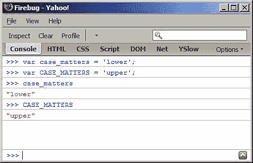
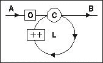

# 第二章。基本数据类型、数组、循环和条件

在深入研究 JavaScript 的面向对象特性之前，让我们先来看看一些基础知识。本章将带您了解:

*   JavaScript 中的基本数据类型，如字符串和数字

*   数组

*   常用运算符，如 `+, -, delete`、 `typeof`

*   流控制语句，如循环和 if-else 条件

# 变量

变量用于存储数据。写程序的时候，用变量代替实际数据是很方便的，因为用 `pi`代替 3.141592653589793 更容易写，尤其是当它在你的程序里面发生几次的时候。存储在变量中的数据在最初赋值后可以改变，因此得名“变量”。变量对于存储程序员在编写代码时不知道的数据也很有用，例如后期操作的结果。

使用变量需要两个步骤。你需要:

*   声明变量

*   初始化它，也就是给它一个值

为了将*声明为*变量，可以使用 `var`语句，如下所示:

```js
var a;
var thisIsAVariable;
var _and_this_too;
var mix12three;

```

对于变量的名称，可以使用字母、数字和下划线字符的任意组合。但是，不能以数字开头，这意味着这是无效的:

```js
var 2three4five;

```

对*初始化*一个变量意味着第一次(初始)给它一个值。你有两种方法可以做到:

*   首先声明变量，然后初始化它，或者

*   用一条语句声明和初始化

后者的一个例子是:

```js
var a = 1;

```

现在名为 `a`的变量包含值 `1`。

可以用一个 `var`语句声明(也可以初始化)几个变量；只需用逗号分隔声明:

```js
var v1, v2, v3 = 'hello', v4 = 4, v5;

```

## 变量区分大小写

变量名区分大小写。您可以使用 Firebug 控制台验证该语句。试着输入这个，每行后按*进入【T1:*

```js
var case_matters = 'lower';
var CASE_MATTERS = 'upper';
case_matters
CASE_MATTERS

```

要保存击键，当你进入第三行时，你只能键入 **ca** 并按 Tab 键。控制台将自动完成变量名到 `case_matters`。同样，对于最后一行-键入 **CA** 并按下*选项卡*。最终结果如下图所示。



在本书的其余部分，将只给出示例的代码，而不是截图:

```js
>>> var case_matters = 'lower';
>>> var CASE_MATTERS = 'upper';
>>> case_matters
"lower"
>>> CASE_MATTERS
"upper"

```

连续三个大于号( **> > >** )显示你输入的代码，剩下的就是结果，就像控制台里打印的一样。同样，请记住，当您看到这样的代码示例时，强烈建议您自己键入代码，并尝试在这里或那里稍微调整一下，这样您就能更好地了解它是如何工作的。

# 操作员

运算符取一个或两个值(或变量)，执行一个操作，然后返回值。让我们看一个使用运算符的简单例子，只是为了澄清术语。

```js
>>> 1 + 2
3

```

在本代码中:

*   +是*操作符*

*   *操作*是加法

*   输入值为 `1`和 `2`(输入值也称为*操作数*)

*   *结果*值为 **3**

您可以使用变量，而不是在操作中直接使用值`1`和`2`。您也可以使用一个变量来存储操作的结果，如下例所示:

```js
>>> var a = 1;
operatorsexample>>> var b = 2;
>>> a + 1
2
>>> b + 2
4
>>> a + b
3
>>> var c = a + b;
>>> c
3

```

下表列出了基本的算术运算符:

<colgroup><col width="1.26666666666667" style="text-align: left"> <col width="1.35833333333333" style="text-align: left"> <col width="2.85416666666667" style="text-align: left"></colgroup> 
| 

操作员符号

 | 

操作

 | 

例子

 |
| --- | --- | --- |
| + | 添加 | >>> 1 + 2**3** |
| - | 减法 | >>> 99.99 11**88.99** |
| * | 增加 | >>> 2 * 3**6** |
| / | 分开 | >>> 6 / 4**1.5** |
| % | 模，除法的提醒 | >>> 6 % 3**0**>>> 5 % 3**2**测试一个数字是偶数还是奇数有时很有用。使用模运算符很容易。所有奇数除以 `2`将返回 **1** ，而所有偶数将返回 **0** 。>>> 4 % 2**0**>>> 5 % 2**1** |
| ++ | 将值增加 1 | *后递增*是输入值返回后递增。a = 123；b = a++在哪里> > > b**123**> > > a**124**反之为*预增量*；输入值首先递增 1，然后返回。其中 a = 123 其中 b =+a；> > > b**124**> > > a**124** |
| - | 将值减 1 | *后减量*a 代表 123，b 代表 a--：> > > b**123**> > > a**122***预减量*哪里是 a = 123 哪里是 b = a；> > > b**122**> > > a**122**T2】 |

当你输入 `var a = 1`；这也是一种操作；是*简单赋值操作*， `=`是*简单赋值操作符*。

还有一类运算符是赋值运算符和算术运算符的组合。这些被称为*复合运算符*。它们可以使您的代码更加紧凑。让我们用例子来看看其中的一些。

```js
>>> var a = 5;
>>> a += 3;
8

```

本例中`a += 3`；只是一种更短的做 `a = a + 3`的方式；

```js
>>> a -= 3;
5

```

这里 `a -= 3`；与 `a = a - 3`相同；

同样地:

```js
>>> a *= 2;
10
>>> a /= 5;
2
>>> a %= 2;
0

```

除了上面讨论的算术和赋值运算符之外，还有其他类型的运算符，您将在本章和后续章节中看到。

# 原始数据类型

您使用的任何值都属于某个*类型*。在 JavaScript 中，有以下*原语*数据类型:

1.  1.数字—包括浮点数和整数，例如 1，100，3.14。

2.  2.字符串—任意数量的字符，例如“一”、“一”、“一二三”。

3.  3.布尔—可以是`true`或 `false`。

4.  4.未定义——当你试图访问一个不存在的变量时，你会得到特殊值 `undefined`。当您已经声明了一个变量，但还没有给它赋值时，也会发生同样的情况。JavaScript 将在幕后对其进行初始化，值为 `undefined`。

5.  5.空-这是另一种只能有一个值的特殊数据类型，`null`值。意思是没有值，空值，什么都没有。与 `undefined`的区别在于，如果一个变量有值 `null`，它还是被定义的，只是碰巧它的值什么都不是。您将很快看到一些例子。

任何不属于上面列出的五种基本类型之一的值都是对象。甚至 `null`也被认为是一个物体，这有点尴尬——有一个实际上什么都没有的物体(东西)。我们将在[第 4 章](04.html "Chapter 4. Objects")中深入探讨对象，但是暂时记住，在 JavaScript 中，数据类型要么是:

*   原语(上面列出的五种类型)，或

*   非图元(对象)

## 找出值类型——运算符的类型

如果想知道变量或值的数据类型，可以使用特殊的 `typeof`运算符。此运算符返回表示数据类型的字符串。使用 `typeof`的返回值可以是下列之一——“数字”、“字符串”、“布尔值”、“未定义”、“对象”或“函数”。在接下来的几节中，您将看到 `typeof`使用五种原始数据类型中的每一种的例子进行操作。

## 数字

最简单的数字是整数。如果给变量赋值 1，然后使用 `typeof`运算符，它将返回字符串**“数字”**。在下面的例子中，您还可以看到，第二次设置变量的值时，我们不需要 `var`语句。

```js
>>> var n = 1;
>>> typeof n;
"number"
>>> n = 1234;
>>> typeof n;
"number"

```

数字也可以是浮点(小数):

```js
>>> var n2 = 1.23;
>>> typeof n;
"number"

```

您可以直接在值上调用 `typeof`，而无需先将其分配给变量:

```js
>>> typeof 123;
"number"

```

### 八进制和十六进制数

当一个数字以 0 开头时，它被认为是一个八进制的 T2 数。比如八进制 `0377`就是十进制 **255** 。

```js
>>> var n3 = 0377;
>>> typeof n3;
"number"
>>> n3;
255

```

上面示例中的最后一行打印八进制值的十进制表示。虽然您可能不太熟悉八进制数字，但您可能已经使用了*十六进制*值来定义，例如，CSS 样式表中的颜色。

在 CSS 中，有几个选项可以定义颜色，其中两个是:

*   使用十进制值指定从 0 到 255 范围内的 R(红色)、G(绿色)和 B(蓝色)的数量。例如 `rgb(0, 0, 0)`为黑色， `rgb(255, 0, 0)`为红色(红色的最大数量，没有绿色或蓝色)。

*   使用十六进制，为每个 R、G 和 b 指定两个字符。例如， `#000000`为黑色， `#ff0000`为红色。这是因为 `ff`是 255 的十六进制。

在 JavaScript 中，您将 `0x`放在十六进制值(简称为*十六进制*之前。

```js
>>> var n4 = 0x00;
>>> typeof n4;
"number"
>>> n4;
0
>>> var n5 = 0xff;
>>> typeof n5;
"number"
>>> n5;
255

```

### 指数文字

`1e1`(也可以写成`1e+1`或 `1E1`或 `1E+1`)代表后面有一个零的数字 1，或者换句话说就是 10。类似地， `2e+3`表示数字 2，后面有 3 个零，或 2000。

```js
>>> 1e1
10
>>> 1e+1
10
>>> 2e+3
2000
>>> typeof 2e+3;
"number"

```

`2e+3`表示将小数点后 3 位移到数字 2 的*右侧*。还有 `2e-3`表示将小数点后 3 位移到数字 2 的*左边*。


```js
>>> 2e-3
0.002
>>> 123.456E-3
0.123456
>>> typeof 2e-3
"number"

```

### 无穷大

JavaScript 中有一个特殊的值叫做`Infinity`。它代表一个对于 JavaScript 来说太大而无法处理的数字。 `Infinity`确实是一个数字，随着在控制台中键入 `typeof Infinity`就会确认。你也可以快速检查一个有 308 个零的数字是否可以，但是 309 个零太多了。准确的说，JavaScript 能处理的最大的数字是`1.7976931348623157e+308`，最小的是 `5e-324`。

```js
>>> Infinity
Infinity
>>> typeof Infinity
"number"
>>>> 1e309
Infinity
>>> 1e308
1e+308

```

除以 0 会给你无穷。

```js
>>> var a = 6 / 0;
>>> a
Infinity

```

无穷大是最大的数字(或者说比最大的数字大一点)，但是最小的数字呢？它是无穷大，前面有一个负号，负无穷大。

```js
>>> var i = -Infinity;
>>> i
-Infinity
>>> typeof i
"number"

```

这是不是意味着你可以拥有恰好两倍于 `Infinity—from` 0 大到无穷大，然后从 0 下降到负无穷大的东西？嗯，这纯粹是为了娱乐，没有实际价值。当你对无穷大和负无穷大求和时，你得到的不是 0，而是一个叫做 **NaN** (不是一个数)的东西。

```js
>>> Infinity - Infinity
NaN
>>> -Infinity + Infinity
NaN

```

任何其他以 `Infinity`作为操作数之一的算术运算都会给你 `Infinity:`

```js
>>> Infinity - 20
Infinity
>>> -Infinity * 3
-Infinity
>>> Infinity / 2
Infinity
>>> Infinity - 99999999999999999
Infinity

```

### NaN

你在上面的例子中看到的这个 **NaN** 是什么？事实证明，尽管它的名字是“不是一个数字”，但 NaN 是一个特殊的值，也是一个数字。

```js
>>> typeof NaN
"number"
>>> var a = NaN;
>>> a
NaN

```

当你试图执行一个假设数字的操作，但操作失败时，你会得到 **NaN** 。例如，如果试图将 `10`乘以字符`"f"`，结果是 **NaN** ，因为`"f"`显然不是乘法的有效操作数。

```js
>>> var a = 10 * "f";
>>> a
NaN

```

**NaN** 是会传染的，所以如果你的算术运算中只有一个 **NaN** ，那么整个结果就会付诸东流。

```js
>>> 1 + 2 + NaN
NaN

```

## 字符串

一个*字符串*是一个用来表示文本的字符序列。在 JavaScript 中，任何放在单引号或双引号之间的值都被视为字符串。这意味着 1 是一个数字，而“1”是一个字符串。当用于字符串时， `typeof`返回字符串“string”。

```js
>>> var s = "some characters";
>>> typeof s;
"string"
>>> var s = 'some characters and numbers 123 5.87';
>>> typeof s;
"string"

```

这里有一个在字符串上下文中使用的数字的例子:

```js
>>> var s = '1';
>>> typeof s;
"string"

```

如果您在引号中不加任何内容，它仍然是一个字符串(空字符串):

```js
>>> var s = ""; typeof s;
"string"

```

正如你之前看到的，当你对两个数字使用加号时，这就是算术运算加法。但是，如果在字符串上使用加号，这是一个*字符串串联*操作，它返回粘合在一起的两个字符串。

```js
>>> var s1 = "one"; var s2 = "two"; var s = s1 + s2; s;
"onetwo"
>>> typeof s;
"string"

```

`+`运算符的双重功能可能是错误的来源。因此，如果您打算连接所有操作数，最好确保所有操作数都是字符串，如果您打算将它们相加，最好确保所有操作数都是数字。在这一章和这本书里，你将进一步学习各种方法。

### 字符串转换

当您在算术运算中使用类似数字的字符串作为操作数时，字符串会在幕后转换为数字。(这适用于除加法之外的所有操作，因为加法的模糊性)

```js
>>> var s = '1'; s = 3 * s; typeof s;
"number"
>>> s
3
>>> var s = '1'; s++; typeof s;
"number"
>>> s
2

```

将任何类似数字的字符串转换为数字的一种懒惰方法是将其乘以 1(更好的方法是使用名为 `parseInt()`的函数，您将在下一章中看到):

```js
>>> var s = "100"; typeof s;
"string"
>>> s = s * 1;
100
>>> typeof s;
"number"

```

如果转换失败，你会得到 `NaN:`

```js
>>> var d = '101 dalmatians';
>>> d * 1
NaN

```

将任何内容转换为字符串的一种惰性方法是用空字符串连接它。

```js
>>> var n = 1;
>>> typeof n;
"number"
>>> n = "" + n;
"1"
>>> typeof n;
"string"

```

### 特殊字符串

一些具有特殊含义的字符串，如下表所示:

<colgroup><col width="0.564597222222222" style="text-align: left"> <col width="1.71323611111111" style="text-align: left"> <col width="3.21526388888889" style="text-align: left"></colgroup> 
| 

线

 | 

意义

 | 

例子

 |
| --- | --- | --- |
| \\\\'\" | \是转义字符。当您想要在字符串中包含引号时，您可以对它们进行转义，这样 JavaScript 就不会认为它们是字符串的结尾。如果你想在字符串中有一个实际的反斜杠，用另一个反斜杠转义它。 | `>>> var s = 'I don't know';`这是一个错误，因为 JavaScript 认为字符串是“我不知道”，其余的都是无效代码。以下内容有效:`>>> var s = 'I don\'t know';``>>> var s = "I don\'t know";``>>> var s = "I don't know";``>>> var s = '"Hello", he said.';``>>> var s = "\"Hello\", he said.";`逃离逃亡:`>>> var s = "1\\2"; s;`**“1 \ 2”** |
| \n | 行结束 | `>>> var s = '\n1\n2\n3\n';``>>> s`**”****1****2****3****”** |
| \r | 回车 | 所有这些:`>>> var s = '1\r2';``>>> var s = '1\n\r2';``>>> var s = '1\r\n2';`导致:> > > s**”1****2”** |
| \t | 标签 | `>>> var s = "1\t2"``>>> s`**“1 2”** |
| \u | \u 后跟字符代码允许您使用 Unicode | 这是我的保加利亚名字，用西里尔字母写的:`>>> "\u0421\u0442\u043E\u044F\u043D"`"索扬" |

还有一些很少使用的附加字符: `\b`(退格)、 `\v`(垂直制表符)和 `\f`(表格换行)。

## 布尔人

只有两个值属于布尔数据类型:值 `true`和 `false`，不使用引号。

```js
>>> var b = true; typeof b;
"boolean"
>>> var b = false; typeof b;
"boolean"

```

如果引用 `true`或 `false`，它们就变成了字符串。

```js
>>> var b = "true"; typeof b;
"string"

```

### 逻辑运算符

有三个运算符，称为*逻辑运算符*，用于处理布尔值。这些是:

*   `!` —逻辑非(否定)

*   `&&` —逻辑与

*   `||` —逻辑或

在日常意义上，如果某件事不是真的，那它就是假的。这是使用 JavaScript 和逻辑 `!`运算符表达的相同语句。

```js
>>> var b = !true;
>>> b;
false

```

如果使用逻辑“非”两次，就会得到原始值:

```js
>>> var b = !!true;
>>> b;
true

```

如果对非布尔值使用逻辑运算符，该值将在幕后转换为布尔值。

```js
>>> var b = "one";
>>> !b;
false

```

在上面的例子中，字符串值`"one"`被转换为布尔型 `true`，然后被否定。否定 `true`的结果是 `false`。在下一个例子中，我们否定两次，所以结果是 `true.`

```js
>>> var b = "one";
>>> !!b;
true

```

使用双重否定是将任何值转换为其布尔等价物的简单方法。这很少有用，但另一方面，了解任何值如何转换为布尔值很重要。除了以下值(转换为`false`)外，大多数值都转换为 `true`:

*   空字符串“”

*   `null`

*   `undefined`

*   数字 0

*   数字 `NaN`

*   布尔 `false`

这六个值有时被称为*假*，而所有其他值都是*真*(包括例如字符串“0”、“”、“假”)。

让我们看看另外两个运算符的一些例子——逻辑“与”和逻辑“或”。当使用 AND 时，只有当所有操作数的*都是 `true`时，结果才是 `true`。当使用或时，如果操作数中至少有一个*为 `true`，则结果为 `true`。

```js
>>> var b1 = true; var b2 = false;
>>> b1 || b2
true
>>> b1 && b2
false

```

这里有一个表格，列出了可能的操作及其结果:

<colgroup><col width="1.7567058297568" style="text-align: left"> <col width="1.17709722222222" style="text-align: left"></colgroup> 
| 

操作

 | 

结果

 |
| --- | --- |
| `true && true` | `true` |
| `true && false` | `false` |
| `false && true` | `false` |
| `false && false` | `false` |
| `true &#124;&#124; true` | `true` |
| `true &#124;&#124; false` | `true` |
| `false &#124;&#124; true` | `true` |
| `false &#124;&#124; false` | `false` |

您可以一个接一个地使用多个逻辑运算:

```js
>>> true && true && false && true
false
>>> false || true || false
true

```

也可以在同一个表达式中混合`&&`和 `||`。在这种情况下，您应该使用括号来阐明您打算如何操作。考虑这些:

```js
>>> false && false || true && true
true
>>> false && (false || true) && true
false

```

### 运算符优先级

你可能想知道为什么上面的表达式(`false&& false || true && true`)会返回 `true`。答案在于操作者优先。你从数学中知道:

```js
>>> 1 + 2 * 3
7

```

这是因为乘法优先于加法，所以首先计算 `2 * 3`，就像你已经输入:

```js
>>> 1 + (2 * 3)
7

```

类似地，对于逻辑操作， `!`具有最高的优先级，并且首先被执行，假设没有需要其他操作的括号。然后，按照优先顺序依次是`&&`和 `||`。换句话说:

```js
>>> false && false || true && true
true

```

与以下相同:

```js
>>> (false && false) || (true && true)
true

```

### 注

**最佳实践**

使用括号，而不是依赖运算符优先级。这使得您的代码更容易阅读和理解。

### 懒惰评价

如果你有几个一个接一个的逻辑操作，但是结果在结束前的某个时候变得清晰，那么最终的操作就不会被执行，因为它们不会影响最终的结果。考虑一下:

```js
>>> true || false || true || false || true
true

```

由于这些都是或运算，具有相同的优先级，如果至少有一个操作数是 `true`，结果将是 `true`。第一个操作数求值后，很明显结果将是 `true`，不管后面是什么值。因此，JavaScript 引擎决定变得懒惰(好吧，高效)，不做不必要的工作，评估不影响最终结果的代码。您可以通过在控制台中进行实验来验证此行为:

```js
>>> var b = 5;
>>> true || (b = 6)
true
>>> b
5
>>> true && (b = 6)
6
>>> b
6

```

这个例子还展示了另一个有趣的行为——如果 JavaScript 在逻辑运算中遇到一个非布尔表达式作为操作数，那么非布尔表达式将作为结果返回。

```js
>>> true || "something"
true
>>> true && "something"
"something"

```

这种行为需要注意和避免，因为它使代码更难理解。有时，当您不确定变量之前是否定义过时，您可能会看到这种行为被用来定义变量。在下一个例子中，如果定义了变量 `v`，则保留其值；否则，用值 `10`初始化。

```js
var mynumber = mynumber || 10;

```

这很简单，看起来很优雅，但是要注意它不是完全防弹的。如果 `mynumber`被定义并初始化为 0(或六个错误值中的任何一个)，该代码可能不会完全按照设计的方式工作。

### 对比

还有另一组运算符，它们都返回一个布尔值作为操作的结果。这些是*比较运算符*。下表列出了它们以及一些示例。

<colgroup><col width="1.25835416666667" style="text-align: left"> <col width="2.54378472222222" style="text-align: left"> <col width="1.62532465277778" style="text-align: left"></colgroup> 
| 

操作员符号

 | 

描述

 | 

例子

 |
| --- | --- | --- |
| == | 平等比较:当两个操作数相等时，返回 `true`。在比较之前，操作数被转换为相同的类型。 | >>> 1 == 1**真**>>> 1 == 2**假**>>> 1 == '1'**真** |
| === | 等式和类型比较:如果两个操作数相同，则返回 `true`*和*。如果用这种方式比较，通常会更好更安全，因为没有幕后的类型转换。 | >>> 1 === '1'**假**>>> 1 === 1**真** |
| ！= | 不相等比较:如果操作数不相等(类型转换后)，返回 `true` | >>> 1 ! = 1**假**>>> 1 ! = '1'**假**>>> 1 ! = '2'**真** |
| ！== | 不进行类型转换的非相等比较:如果操作数不相等或它们是不同的类型，则返回 `true`。 | >>> 1 ! == 1**假**>>> 1 ! == '1'**真** |
| > | 如果左操作数大于右操作数，则返回 `true`。 | >>> 1 > 1**假**>>> 33 > 22**真** |
| >= | 如果左操作数*大于*或*等于右操作数*，则返回 `true`。 | >>> 1 >= 1**真** |
| < | 如果左操作数*小于右操作数*，则返回 `true`。 | >>> 1 < 1**假**>>> 1 < 2**真** |
| <= | 如果左操作数*小于*或*等于右操作数*，则返回 `true`。 | >>> 1 <= 1**真**>>> 1 <= 2**真** |

有趣的是 `NaN`不等于任何东西，甚至不等于它本身。

```js
>>> NaN == NaN
false

```

## 未定义且为空

当你试图使用一个不存在的变量，或者一个还没有赋值的变量时，你会得到`undefined`值。当你声明一个变量而没有初始化它时，JavaScript 会自动将其初始化为值`undefined`。

如果您尝试使用一个不存在的变量，您将收到一条错误消息。

```js
>>> foo
foo is not defined

```

如果对一个不存在的变量使用 `typeof`运算符，就会得到字符串**“未定义”**。

```js
>>> typeof foo
"undefined"

```

如果你声明了一个变量而没有给它一个值，当你使用那个变量时你不会得到一个错误。但是 `typeof`仍然返回**“未定义”**。

```js
>>> var somevar;
>>> somevar
>>> typeof somevar
"undefined"

```

另一方面， `null`值不是由幕后的 JavaScript 赋值的；它只能由您的代码分配。

```js
>>> var somevar = null
null
>>> somevar
null
>>> typeof somevar
"object"

```

虽然 `null`和 `undefined`之间的差异很小，但有时可能很重要。例如，如果尝试算术运算，可以得到不同的结果:

```js
>>> var i = 1 + undefined; i;
NaN

>>> var i = 1 + null; i;
1

```

这是因为 `null`和 `undefined`转换成其他图元类型的方式不同。以下是显示可能转换的示例。

转换为数字:

```js
>>> 1*undefined
NaN
>>> 1*null
0

```

转换为布尔值:

```js
>>> !!undefined
false
>>> !!null
false

```

转换为字符串:

```js
>>> "" + null
"null"
>>> "" + undefined
"undefined"

```

# 原始数据类型概述

让我们快速总结一下到目前为止讨论的内容:

*   JavaScript 中有五种基本数据类型:

    *   数字

    *   线

    *   布尔

    *   不明确的

    *   空

*   任何不是原始的东西都是物体

*   数字数据类型可以存储正负整数或浮点数、十六进制数、八进制数、指数以及特殊数字 `NaN, Infinity`和`-Infinity`

*   字符串数据类型包含引号中的字符

*   布尔数据类型的唯一值是 `true`和 `false`

*   空数据类型的唯一值是值 `null`

*   未定义数据类型的唯一值是值 `undefined`

*   当转换为布尔值时，除了六个虚假值之外，所有值都变为 `true`:

    *   ""

    *   `null`

    *   `undefined`

    *   Zero

    *   `NaN`

    *   `false`

# 阵列

现在您已经知道了 JavaScript 中的基本原始数据类型，是时候转向一个更有趣的数据结构——数组了。

要声明包含空数组的变量，可以使用方括号，中间不加任何内容:

```js
>>> var a = [];
>>> typeof a;
"object"

```

`typeof`返回**【对象】**，不过暂时不用担心这个，等我们仔细看对象的时候再说。

要定义包含三个元素的数组，请执行以下操作:

```js
>>> var a = [1,2,3];

```

当您在 Firebug 控制台中简单地键入数组的名称时，它会打印数组的内容:

```js
>>> a
[1, 2, 3]

```

那么数组到底是什么呢？这只是一个价值清单。您可以使用一个数组变量来存储任意数量的值作为数组的*元素*，而不是使用一个变量来存储一个值。现在的问题是如何访问这些存储的值？

数组中包含的元素用从零开始的连续数字进行索引。第一个元素的索引(或位置)为 0，第二个元素的索引为 1，依此类推。以下是前一个示例中的三元素数组:

<colgroup><col width="0.735416666666667" style="text-align: left"> <col width="0.715972222222222" style="text-align: left"></colgroup> 
| 

索引

 | 

价值

 |
| --- | --- |
| Zero | one |
| one | Two |
| Two | three |

为了访问数组元素，可以在方括号内指定该元素的索引。所以 `a[0]`给你数组的第一个元素 `a, a[1]`给你第二个，以此类推。

```js
>>> a[0]
1
>>> a[1]
2

```

## 添加/更新数组元素

使用索引，您还可以更新数组的元素。下一个示例更新第三个元素(索引 2)并打印新数组的内容。

```js
>>> a[2] = 'three';
"three"
>>> a
[1, 2, "three"]

```

您可以通过寻址以前不存在的索引来添加更多元素。

```js
>>> a[3] = 'four';
"four"
>>> a
[1, 2, "three", "four"]

```

如果您添加了一个新元素，但在数组中留下了一个间隙，则中间的那些元素都被赋予了 `undefined`值。看看这个例子:

```js
>>> var a = [1,2,3];
>>> a[6] = 'new';
"new"
>>> a
[1, 2, 3, undefined, undefined, undefined, "new"]

```

## 删除元素

要删除一个元素，可以使用 `delete`操作符。它实际上并不移除元素，而是将其值设置为 `undefined`。删除后，数组的长度不会改变。

```js
>>> var a = [1, 2, 3];
>>> delete a[1];
true
>>> a
[1, undefined, 3]

```

## 阵列的阵列

数组可以包含任何类型的值，包括其他数组。

```js
>>> var a = [1, "two", false, null, undefined];
>>> a
[1, "two", false, null, undefined]
>>> a[5] = [1,2,3]
[1, 2, 3]
>>> a
[1, "two", false, null, undefined, [1, 2, 3]]

```

让我们看一个例子，其中有两个元素的数组，每个元素都是一个数组。

```js
>>> var a = [[1,2,3],[4,5,6]];
>>> a
[[1, 2, 3], [4, 5, 6]]

```

数组的第一个元素是 `a[0]`，它本身就是一个数组。

```js
>>> a[0]
[1, 2, 3]

```

要访问嵌套数组中的元素，可以引用另一组方括号中的元素索引。

```js
>>> a[0][0]
1
>>> a[1][2]
6

```

还要注意，您可以使用数组符号来访问字符串中的单个字符。

```js
>>> var s = 'one';
>>> s[0]
"o"
>>> s[1]
"n"
>>> s[2]
"e"

```

有更多的方法可以从数组中获得乐趣(我们将在[第 4 章](04.html "Chapter 4. Objects")中谈到这一点)，但是我们现在就到此为止，记住:

*   数组是一种数据存储

*   数组包含索引元素

*   索引从零开始，对于数组中的每个元素递增 1

*   要访问数组元素，我们使用方括号中的索引

*   一个数组可以包含任何类型的数据，包括其他数组

# 条件和循环

*条件*通过一段代码提供了一种简单但强大的方法来控制执行流程。*循环*允许你用更少的代码执行重复的操作。让我们来看看:

*   `if`条件、

*   `switch`报表、

*   `while, do-while, for`和 `for-in`循环。

## 代码块

让我们首先阐明什么是代码块，因为块在构造条件和循环时被广泛使用。

一段代码由零个或多个用花括号括起来的表达式组成。

```js
{
var a = 1;
var b = 3;
}

```

您可以无限期地将块嵌套在彼此之中:

```js
{
var a = 1;
var b = 3;
var c, d;
{
c = a + b;
{
d = a - b;
}
}
}

```

### 注

**最佳实践提示**

*   使用行尾分号。虽然当每行有一个表达式时，分号是可选的，但是养成使用它们的习惯是很好的。为了获得最佳可读性，块中的各个表达式应该每行一个，并用分号分隔。

*   缩进花括号内的所有代码。有些人使用一个制表符缩进，有些人使用四个空格，有些人使用两个空格。真的没关系，只要你始终如一。在上面的示例中，外部块缩进两个空格，第一个嵌套块中的代码缩进四个空格，最里面的块缩进六个空格。

*   使用花括号。当一个块只包含一个表达式时，花括号是可选的，但是为了可读性和可维护性，您应该养成总是使用它们的习惯，即使它们是可选的。

准备好进入循环和如果了吗？请注意，以下几节中的示例要求您切换到多行 Firebug 控制台。

### 如果条件

这里有一个简单的 `if`条件的例子:

```js
var result = '';
if (a > 2) {
result = 'a is greater than 2';
}

```

`if`条件的组成部分是:

*   `if`声明

*   括号中的一个条件——“是否 `a`大于 2？”

*   满足条件时要执行的代码块

条件(括号中的部分)总是返回布尔值，并且可能包含:

*   逻辑运算: `!, &&`或 `||`

*   一个比较，比如 `===, !=, >`，等等

*   任何可以转换为布尔值的值或变量

*   以上的组合

也可以有一个可选的 `if`条件的 `else`部分。else 语句后面是一段代码，如果条件被评估为 `false`，则执行这段代码。

```js
if (a > 2) {
result = 'a is greater than 2';
} else {
result = 'a is NOT greater than 2';
}

```

在 `if`和 `else`之间，还可以有无限多个 `else if`条件。这里有一个例子:

```js
if (a > 2 || a < -2) {
result = 'a is not between -2 and 2';
} else if (a === 0 && b === 0) {
result = 'both a and b are zeros';
} else if (a === b) {
result = 'a and b are equal';
} else {
result = 'I give up';
}

```

您也可以通过在任何块中放置新条件来嵌套条件。

```js
if (a === 1) {
if (b === 2) {
result = 'a is 1 and b is 2';
} else {
result = 'a is 1 but b is not 2';
}
} else {
result = 'a is not 1, no idea about b';
}

```

### 检查变量是否存在

检查变量是否存在通常很有用。最懒的方法是简单地将变量放在 `if`的条件部分，例如 `if (somevar) {...}`，但这不一定是最好的方法。让我们看一个测试名为 `somevar`的变量是否存在的例子，如果存在，将 `result`变量设置为 `yes:`

```js
>>> var result = '';
>>> if (somevar){result = 'yes';}
somevar is not defined
>>> result;
""

```

这段代码显然有效，因为最后 `result`不是“是”。但是首先，代码生成了一个警告: **somevar 没有被定义**作为一个 JavaScript 高手，你不希望你的代码做这样的事情。其次，仅仅因为 `if (somevar)`返回了 `false`并不意味着 `somevar`没有定义。可能是 `somevar`被定义和初始化，但是包含一个错误的值，像 `false`或 0。

检查是否定义了变量的更好方法是使用 `typeof`。

```js
>>> if (typeof somevar !== "undefined"){result = 'yes';}
>>> result;
""

```

`typeof`将始终返回一个字符串，您可以将该字符串与`"undefined"`进行比较。请注意，变量 `somevar`可能已经声明，但尚未赋值，您仍然会得到相同的结果。所以当像这样用 `typeof`测试时，你实际上是在测试变量是否有任何值(除了值`undefined`)。

```js
>>> var somevar;
>>> if (typeof somevar !== "undefined"){result = 'yes';}
>>> result;
""
>>> somevar = undefined;
>>> if (typeof somevar !== "undefined"){result = 'yes';}
>>> result;
""

```

如果一个变量被定义并初始化为除 `undefined`以外的任何值，则 `typeof`返回的类型不再是“未定义”。

```js
>>> somevar = 123;
>>> if (typeof somevar !== "undefined"){result = 'yes';}
>>> result;
"yes"

```

### 替代 if 语法

当你有一个非常简单的条件时，你可以考虑使用替代的 `if`语法。看看这个:

```js
var a = 1;
var result = '';
if (a === 1) {
result = "a is one";
} else {
result = "a is not one";
}

```

`if`条件可以简单表示为:

```js
var result = (a === 1) ? "a is one" : "a is not one";

```

您应该只在非常简单的情况下使用该语法。注意不要滥用它，因为它很容易使您的代码不可读。

`?`称为*三元算子*。

### 开关

如果你发现自己处于 `if`状态，并且有太多的 `else if`零件，你可以考虑将 `if`换成 `switch`。

```js
var a = '1';
var result = '';
switch (a) {
case 1:
result = 'Number 1';
break;
case '1':
result = 'String 1';
break;
default:
result = 'I don\'t know';
break;
}
result;

```

执行此操作的结果将是**“字符串 1”**。让我们看看 `switch`的组成部分是什么:

*   `switch`声明。

*   括号中的一些表达式。表达式通常包含变量，但也可以是任何返回值。

*   用花括号括起来的多个*案例块*。

*   每个 `case`语句后面都有一个表达式。将表达式的结果与置于 `switch`语句之后的表达式进行比较。如果比较的结果是 `true`，则执行 `case`之后的冒号后面的代码。

*   有一个可选的 `break`语句来表示案例块的结束。如果达到这个 `break`语句，我们就完成了切换。否则，如果 `break`不见了，我们进入下一个 `case`街区，应该避开。

*   有一个可选的 `default`语句，后面是一个代码块，如果前面的情况都没有评估为 `true`，则执行该代码块。

换句话说，执行 `switch`语句的分步过程如下:

1.  1.评估括号中的开关表达式，记住它。

2.  2.移至第一种情况，将其值与步骤 1 中的值进行比较。

3.  3.如果步骤 2 中的比较返回 `true`，执行 `case`块中的代码。

4.  4.执行 `case`块后，如果末尾有 `break`语句，退出开关。

5.  5.如果没有 `break`或第二步返回 `false`，继续下一个 `case`街区。

6.  重复步骤 2 至 5。

7.  6.如果我们还在这里(在步骤 4 中没有退出)，执行 `default`语句后面的代码。

### 注

**最佳实践提示**

*   缩进 `case`行，然后进一步缩进其后的代码。

*   别忘了`break`。有时候你可能想故意省略 `break`，但这很少见。这被称为*跌落*，应该始终记录下来，因为它可能看起来像是一个意外的遗漏。另一方面，有时您可能希望省略案例后面的整个代码块，让两个案例共享相同的代码。这很好，但是不会改变这样的规则，即如果有遵循 `case`语句的代码，该代码应该以 `break`结尾。就缩进而言，将 `break`与 `case`对齐或与表壳内的代码对齐是个人偏好；同样，保持一致才是最重要的。

*   使用 `default`案例。这将有助于您确保在切换后有一个有意义的结果，即使没有任何情况与正在切换的值相匹配。

## 循环

`if-else`和`switch`语句允许您的代码采用不同的路径，就好像您正处于十字路口，并根据条件决定走哪条路。另一方面，循环允许你的代码在并入主干道之前绕几圈。重复几次？这取决于在每次迭代之前(或之后)评估条件的结果。

假设你(你的程序执行)从 A 到 b，在某个时刻，你到达一个地方，你评估一个条件 C，评估 C 的结果告诉你是否应该进入一个循环 l，你进行一次迭代。然后再次评估条件，看看是否需要另一次迭代。最终，你走向了 b。

一个*无限循环*是当条件总是真的，你的代码“永远”卡在循环中。当然，这是一个逻辑错误，您应该注意这种情况。

在 JavaScript 中，有四种类型的循环:

*   `while`循环

*   `do-while`循环

*   `for`循环

*   `for-in`循环

### 当循环


`while`循环是最简单的循环类型。它们看起来像这样:

```js
var i = 0;
loopswhile loopswhile (i < 10) {
i++;
}

```

`while`语句后面是括号中的条件和花括号中的代码块。只要条件评估为 `true`，代码块就被反复执行。

### 边做边循环

`do-while`循环是 `while`循环的轻微变化。一个例子:

```js
var i = 0;
do {
i++;
} while (i < 10)

```

这里， `do`语句后面是一个代码块和块后的一个条件。这意味着在计算条件之前，代码块将总是被执行，至少一次。

如果将最后两个例子中的 `i`初始化为 11，而不是 0，那么第一个例子中的代码块(第一个 `while`循环)将不会被执行，最后 `i`仍然是 11，而在第二个例子中(`do-while`循环)，代码块将被执行一次， `i`将变成 12。

### 用于循环

`for`是最广泛使用的循环类型，您应该确保自己对这种循环感到舒适。它在语法方面只需要多一点点。



除了条件 C 和代码块 L，您还有以下内容:

*   初始化——在你进入循环之前执行的一些代码(图中标记为 0)

*   增量—每次迭代后执行的一些代码*(图中用++标记)*

使用 `for`循环最广泛的模式是:

*   在初始化部分你定义一个变量，最常被称为 `i`，像这样: `var i = 0`；

*   在条件部分，将 `i`与一个边界值进行比较，如 `i < 100`

*   在增量部分，将 `i`增加 1，如 `i++`

这里有一个例子:

```js
var punishment = '';
for (var i = 0; i < 100; i++) {
punishment += 'I will never do this again, ';
}

```

所有三个部分(初始化、条件、增量)都可以包含多个用逗号分隔的表达式。可以重写例子，在循环的初始化部分定义变量 `punishment`。

```js
for (var i = 0, punishment = ''; i < 100; i++) {
punishment += 'I will never do this again, ';
}

```

你能在增量部分内移动循环体吗？是的，你可以，尤其是因为它是单线的。这会给你一个看起来有点尴尬的循环，因为它没有身体:

```js
for (var i = 0, punishment = '';
i < 100;
i++, punishment += 'I will never do this again, ')
{
// nothing here
}

```

这三部分其实都是可选的。下面是重写同一个例子的另一种方法:

```js
var i = 0, punishment = '';
for (;;) {
punishment += 'I will never do this again, ';
if (++i == 100) {
break;
}
}

```

虽然最后一次重写的工作方式与原文完全相同，但它更长，更难阅读。使用 `while`循环也可以达到同样的效果。但是 `for`循环使代码更加紧凑和健壮，因为仅仅是 `for`循环的语法就让你思考三个部分(初始化、条件、增量)，从而帮助你再次确认你的逻辑，避免陷入无限循环的情况。

`for`循环可以相互嵌套。下面是一个循环的例子，它嵌套在另一个循环中，并组装一个包含 10 行和 10 列星号的字符串。把 `i`想象成一个“形象”的行， `j`想象成一个“形象”的列。

```js
var res = '\n';
for(var i = 0; i < 10; i++) {
for(var j = 0; j < 10; j++) {
res += '* ';
}
res+= '\n';
}

```

结果是一个字符串，如:

**”**

`* * * * * * * * * *`

`* * * * * * * * * *`

`* * * * * * * * * *`

`* * * * * * * * * *`

`* * * * * * * * * *`

`* * * * * * * * * *`

`* * * * * * * * * *`

`* * * * * * * * * *`

`* * * * * * * * * *`

`* * * * * * * * * *`

**”**

这是另一个例子，它使用嵌套循环和模数运算来绘制一个类似雪花的结果。

```js
var res = '\n', i, j;
for(i = 1; i <= 7; i++) {
for(j = 1; j <= 15; j++) {
res += (i * j) % 8 ? ' ' : '*';
}
res+= '\n';
}

```

**”**

*****

*** * ***

*****

*** * * * * * ***

*****

*** * ***

*****

**”**

### 用于内循环

`for-in`循环用于迭代数组(或对象，我们将在后面看到)的元素。这是它唯一的用处；它不能作为替代 `for`或 `while`的通用重复机制。让我们看一个使用 `for-in`循环遍历数组元素的例子。但是请记住，这只是为了提供信息，因为 `for-in`最适合对象，而常规的 `for`循环应该用于数组。

在本例中，我们将遍历数组的所有元素，并打印出索引(键)和每个元素的值:

```js
var a = ['a', 'b', 'c', 'x', 'y', 'z'];
var result = '\n';
for (var i in a) {
result += 'index: ' + i + ', value: ' + a[i] + '\n';
}

```

`result`是:


# 评论

本章最后一件事:评论。在你的 JavaScript 代码中，你可以放入注释。这些被 JavaScript 引擎忽略，对程序的工作方式没有任何影响。但是当你在几个月后重新访问你的代码，或者将代码转移给其他人进行维护时，它们是无价的。

允许两种类型的注释:

*   单行注释—从 `//`开始，到行尾结束

*   多行注释—在同一行或任何后续行以 `/*`开始，以 `*/`结束。请注意，注释开始和注释结束之间的任何代码都将被忽略。

一些例子:

```js
// beginning of line
var a = 1; // anywhere on the line
/* multi-line comment on a single line */
/*
comment
that spans
several lines
*/

```

甚至还有实用程序，比如 JSDoc，可以解析您的代码，并根据您的注释提取有意义的文档。

# 总结

在这一章中，您学习了很多关于 JavaScript 程序的基本构造块。现在您知道了原始数据类型:

*   数字

*   线

*   布尔

*   不明确的

*   空

你也认识不少操作员:

*   算术运算符:+、-、*、/、和%。

*   增量运算符:++和-。

*   赋值运算符:=，+=，-=，*=，/=，和%=。

*   特殊操作员: `typeof`和 `delete`。

*   逻辑运算符:&&，||，和！。

*   比较运算符:===，==，！=, !==，，> =，和< =。

然后你学习了如何使用数组来存储和访问数据，最后你看到了控制程序流程的不同方法——使用条件(`if-else`或`switch`)和循环(`while`、 `do-while, for, for-in)`。

这是相当多的信息，建议你现在完成下面的练习，然后在进入下一章之前给自己一个当之无愧的鼓励。更多的乐趣即将到来！

# 练习

1.  1.在控制台中执行这些行的结果是什么？为什么呢？

    *   `var a; typeof a`；

    *   `var s = '1s'; s++`；

    *   `!!"false"`

    *   `!!undefined`

    *   `typeof -Infinity`

    *   `10 % "0"`

    *   `undefined == null`

    *   `false === ""`

    *   `typeof "2E+2"`

    *   `a = 3e+3; a++`；

2.  2.以下之后 `v`的值是多少？

    ```js
    >>> var v = v || 10;

    ```

    *   首先将 v 设置为 100，0，`null`进行实验，或者将其取消设置(`delete v`)。

3.  3.写一个打印乘法表的脚本。**提示:**使用嵌套在另一个循环中的循环。